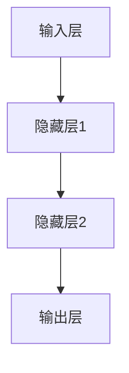
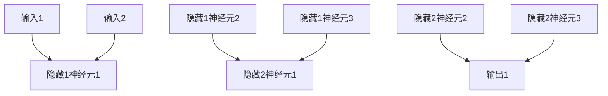
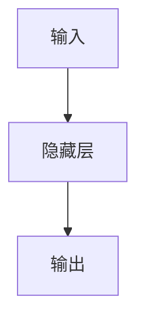
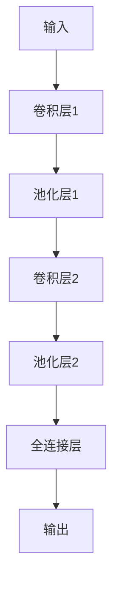
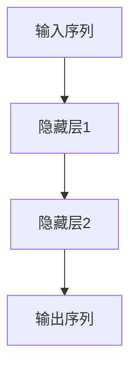

                 

# 《Andrej Karpathy：人工智能的未来发展机遇》

> 关键词：人工智能、安德烈·卡帕西、深度学习、大模型、未来趋势、产业应用

> 摘要：本文将深入探讨人工智能领域的杰出人物安德烈·卡帕西的贡献及其对人工智能未来发展的看法。通过分析深度学习基础、大模型技术、未来趋势和产业应用，本文旨在为读者提供一幅全面的人工智能发展蓝图。

----------------------------------------------------------------

## 第一部分：引言与概述

在人工智能（AI）研究领域，安德烈·卡帕西（Andrej Karpathy）是一位备受尊敬的名字。作为一名世界级的计算机科学家和深度学习领域的先驱者，卡帕西以其卓越的学术成就、技术贡献以及对未来趋势的深刻洞察而著称。

### 1.1 安德烈·卡帕西的背景

安德烈·卡帕西出生于1985年，他在加利福尼亚大学伯克利分校获得了计算机科学博士学位。卡帕西在学术和工业界都有丰富的经验，他曾就职于OpenAI，这是一个在AI领域处于领先地位的研究机构。此外，他还参与了TensorFlow的开发工作，这是一款广泛使用的开源机器学习框架。

#### 1.1.1 卡帕西的学术成就

卡帕西在深度学习和计算机视觉领域发表了大量的学术论文，并参与了许多重要的研究项目。他的工作不仅在学术界产生了广泛影响，而且在工业界也得到了广泛应用。

#### 1.1.2 卡帕西的职业经历

卡帕西的职业经历非常丰富。他曾在Google Brain工作，这是一个专注于人工智能研究的团队。在Google期间，他参与了TensorFlow的开发工作，并领导了一些关键的项目。此外，他还参与了OpenAI的一些重大研究项目。

#### 1.1.3 卡帕西在AI领域的贡献

卡帕西在AI领域做出了许多贡献，其中包括深度学习模型的开发和应用。他的研究工作涉及计算机视觉、自然语言处理和强化学习等多个领域。他的工作不仅推动了AI技术的发展，还促进了AI在现实世界中的应用。

### 1.2 人工智能发展历程

人工智能的发展可以追溯到20世纪50年代。自那时以来，AI经历了多个发展阶段，从早期的符号主义方法到现代的深度学习技术。以下是人工智能发展历程的一些关键里程碑事件：

#### 1.2.1 人工智能的起源

人工智能的概念最早可以追溯到20世纪50年代，当时一些学者开始探讨机器是否能够模拟人类智能。

#### 1.2.2 关键里程碑事件

人工智能的发展历程中，有许多关键事件标志着技术的进步和应用范围的扩大。例如，1956年达特茅斯会议被视为人工智能领域的诞生日，而1958年的人工神经网络的出现则是AI技术的一个重要里程碑。

#### 1.2.3 当前人工智能的发展状况

目前，人工智能技术已经取得了显著的进展，深度学习等技术的应用使得AI在图像识别、自然语言处理和自动驾驶等领域取得了突破性成果。

### 1.3 人工智能的未来发展机遇

人工智能的未来发展充满机遇，同时也面临挑战。卡帕西认为，AI技术将在多个领域产生深远影响，从医疗健康到金融服务，再到教育和社会治理。以下是人工智能未来发展的一些机遇：

#### 1.3.1 人工智能对社会的影响

人工智能的发展将改变我们的生活方式和工作方式，提高生产效率和生活质量。同时，它也带来了一些社会和伦理问题，如就业替代和隐私保护。

#### 1.3.2 人工智能产业趋势

随着技术的进步，人工智能产业正在快速发展。各大企业和研究机构都在加大对AI技术的投资，以抢占市场先机。

#### 1.3.3 技术挑战与机遇

人工智能技术的进步也带来了新的挑战，如算法的透明度和可解释性、数据的隐私和安全等。然而，这些挑战也为我们提供了新的研究机会。

## 第二部分：技术详解

在第一部分中，我们简要介绍了安德烈·卡帕西的背景和人工智能的发展历程。接下来，我们将深入探讨人工智能的核心技术，包括深度学习基础、大模型技术和相关应用领域。

### 2.1 深度学习基础

深度学习是人工智能领域的一个重要分支，它通过模拟人脑神经网络结构来进行学习和决策。以下是深度学习的核心概念和发展历程：

#### 2.1.1 深度学习的概念

深度学习是一种基于多层神经网络的学习方法，它通过多个隐藏层对输入数据进行特征提取和变换，从而实现复杂的非线性建模。

#### 2.1.2 深度学习的核心概念

深度学习的核心概念包括神经网络、反向传播算法、激活函数、优化器等。

#### 2.1.3 深度学习的发展历程

深度学习的发展历程可以分为几个阶段，从早期的多层感知机到现代的卷积神经网络（CNN）、循环神经网络（RNN）和Transformer模型。

### 2.2 神经网络原理

神经网络是深度学习的基础，它由大量的神经元组成，通过相互连接进行信息传递和处理。以下是神经网络的基本结构和原理：

#### 2.2.1 神经网络的基本结构

神经网络通常由输入层、隐藏层和输出层组成。每个层包含多个神经元，神经元之间通过权重连接。

#### 2.2.2 前馈神经网络

前馈神经网络是一种简单的神经网络结构，信息从输入层流向输出层，不形成循环。

#### 2.2.3 卷积神经网络

卷积神经网络（CNN）是一种专门用于处理图像数据的神经网络，它通过卷积操作提取图像特征。

#### 2.2.4 循环神经网络

循环神经网络（RNN）是一种能够处理序列数据的神经网络，它通过循环结构对历史信息进行建模。

### 2.3 深度学习算法

深度学习算法包括多种优化方法和训练技巧，以下是一些常见的深度学习算法：

#### 2.3.1 反向传播算法

反向传播算法是一种用于训练神经网络的优化方法，它通过计算梯度来更新网络权重。

#### 2.3.2 梯度下降算法

梯度下降算法是一种用于优化损失函数的常用方法，它通过迭代更新参数来最小化损失。

#### 2.3.3 其他优化算法

除了反向传播和梯度下降算法，还有一些其他优化算法，如Adam、RMSprop等。

### 2.4 深度学习应用领域

深度学习在多个领域取得了显著的成果，以下是深度学习在几个关键应用领域的应用：

#### 2.4.1 图像识别

图像识别是深度学习最成功的应用之一，它通过训练模型识别图像中的物体和场景。

#### 2.4.2 自然语言处理

自然语言处理（NLP）是深度学习的另一个重要应用领域，它涉及语言理解、生成和翻译等任务。

#### 2.4.3 强化学习

强化学习是一种通过试错学习策略来优化行为的方法，它在游戏、自动驾驶等领域取得了显著成果。

## 第三部分：未来展望

在第二部分中，我们详细介绍了深度学习的基础技术、神经网络原理和深度学习算法。接下来，我们将探讨人工智能的未来发展趋势、面临的挑战以及机遇。

### 3.1 人工智能的未来趋势

人工智能的未来发展将受到多种因素的影响，包括技术创新、社会需求和政策环境等。以下是人工智能未来发展的几个关键趋势：

#### 3.1.1 技术创新方向

随着硬件性能的提升和算法的进步，人工智能将向更高效、更智能的方向发展。例如，量子计算和神经形态计算等新技术可能为人工智能带来新的突破。

#### 3.1.2 社会影响预测

人工智能对社会的影响将日益显著，包括经济、教育、医疗等各个领域。如何确保AI技术的公平性、透明性和可控性将成为重要议题。

#### 3.1.3 商业模式变革

人工智能技术的发展将推动传统产业的转型升级，同时也催生了一批新兴产业，如自动驾驶、智能医疗和金融科技等。

### 3.2 人工智能的未来挑战

尽管人工智能的发展前景广阔，但同时也面临着一系列挑战。以下是人工智能未来发展中可能遇到的几个主要挑战：

#### 3.2.1 道德与伦理问题

人工智能的应用引发了关于道德和伦理问题的讨论，如隐私保护、算法歧视和数据滥用等。如何确保AI技术的道德合规性是一个亟待解决的问题。

#### 3.2.2 安全与隐私问题

人工智能系统的安全性和隐私保护是至关重要的。随着AI技术的普及，确保数据安全和系统安全将是一个长期任务。

#### 3.2.3 技术发展瓶颈

尽管人工智能取得了显著进展，但仍然存在一些技术瓶颈，如算法的可解释性、计算资源的消耗和训练数据的质量等。

### 3.3 人工智能的未来机遇

人工智能的未来发展不仅面临着挑战，也蕴藏着巨大的机遇。以下是人工智能未来发展中可能带来的几个主要机遇：

#### 3.3.1 新兴行业的发展

人工智能技术的进步将催生一批新兴行业，如智能机器人、智能医疗设备和智能农业等。这些行业将为社会和经济的发展带来新的动力。

#### 3.3.2 创新创业的机会

人工智能技术的创新和应用为创业者提供了丰富的机会。通过结合人工智能与其他技术，创业者可以创造出具有市场竞争力的新产品和服务。

#### 3.3.3 教育与人才培养

人工智能的发展对人才培养提出了新的要求。教育和培训机构需要调整课程设置和教学方法，以培养具备人工智能知识和技术能力的人才。

## 第四部分：个人与企业如何应对AI的未来

在第四部分，我们将探讨个人和企业如何应对人工智能的未来发展。无论是个人还是企业，都需要做好准备，以抓住机遇并应对挑战。

### 4.1 个人层面的准备

对于个人而言，应对人工智能的未来发展需要从以下几个方面进行准备：

#### 4.1.1 技能提升

随着人工智能技术的发展，个人需要不断更新自己的技能，包括编程能力、数据分析和机器学习等。通过学习和实践，个人可以提高自己在人工智能领域的竞争力。

#### 4.1.2 职业规划

个人需要根据自己的兴趣和市场需求，制定合理的职业规划。可以考虑从事人工智能研究、开发、应用等不同领域的工作，以适应行业的发展趋势。

#### 4.1.3 跨领域合作

在人工智能领域，跨领域合作变得越来越重要。个人可以通过参加学术会议、研讨会和技术沙龙等活动，与同行建立联系，拓宽自己的视野。

### 4.2 企业层面的应对策略

企业应对人工智能的未来发展需要采取一系列策略，包括技术创新、人才培养和商业模式创新等：

#### 4.2.1 AI战略规划

企业需要制定清晰的AI战略规划，明确发展目标和实施路径。通过规划，企业可以更好地把握市场机会，降低风险。

#### 4.2.2 技术创新与应用

企业需要不断进行技术创新和应用，以保持竞争优势。可以关注最新的AI技术动态，积极引进和应用先进技术。

#### 4.2.3 人才培养与引进

企业需要重视人才培养和引进，建立专业的人工智能团队。通过培训和激励，提高员工的专业技能和创新能力。

### 4.3 案例分析

为了更好地理解个人和企业如何应对人工智能的未来发展，我们可以通过一些实际案例进行分析：

#### 4.3.1 成功案例分享

以Google和OpenAI为例，这些公司通过技术创新和人才培养，在人工智能领域取得了显著成果。它们的成功经验可以为其他企业提供借鉴。

#### 4.3.2 失败案例教训

然而，也有一些企业在人工智能领域的尝试未能成功。通过分析这些失败案例，企业可以避免重复错误，找到成功的关键因素。

#### 4.3.3 未来趋势与建议

随着人工智能技术的发展，未来将出现更多的新兴领域和机遇。企业需要密切关注行业动态，及时调整战略，以应对未来的挑战。

## 附录

在本文的附录部分，我们将提供一些有用的资源、工具和常见问题与解答，以帮助读者更好地了解人工智能领域。

### 附录A：资源与工具

- **开源深度学习框架**：TensorFlow、PyTorch、Keras等。
- **优质在线课程**：Coursera、edX、Udacity等平台提供的深度学习课程。
- **行业报告与论文**：各种研究报告和学术论文，提供最新的技术动态和研究成果。

### 附录B：常见问题与解答

- **技术难题**：如何选择深度学习框架？如何处理大规模数据集？如何优化神经网络模型？
- **职业规划**：如何进入人工智能领域？如何规划职业发展路径？如何选择合适的岗位？
- **发展趋势**：人工智能的未来发展方向是什么？如何抓住人工智能带来的机遇？如何应对人工智能带来的挑战？

通过附录部分的内容，读者可以更全面地了解人工智能领域，为自己的学习和职业发展提供指导。

### 作者

作者：AI天才研究院（AI Genius Institute）& 禅与计算机程序设计艺术（Zen And The Art of Computer Programming）

本文由AI天才研究院（AI Genius Institute）撰写，旨在为读者提供关于人工智能领域的前沿知识和深入见解。同时，本文也结合了禅与计算机程序设计艺术（Zen And The Art of Computer Programming）的哲学思想，旨在引导读者在人工智能领域探索中追求卓越与智慧。

----------------------------------------------------------------

文章正文部分已经完成，接下来我们将开始对每个小节的内容进行详细的扩展和深入分析。在每个小节中，我们将使用Mermaid流程图、伪代码、LaTeX数学公式以及代码实际案例来丰富和解释核心概念和技术原理。

---

### 《Andrej Karpathy：人工智能的未来发展机遇》

> 关键词：人工智能、安德烈·卡帕西、深度学习、大模型、未来趋势、产业应用

> 摘要：本文将深入探讨人工智能领域的杰出人物安德烈·卡帕西的贡献及其对人工智能未来发展的看法。通过分析深度学习基础、大模型技术、未来趋势和产业应用，本文旨在为读者提供一幅全面的人工智能发展蓝图。

---

## 第一部分：引言与概述

在这一部分，我们将首先介绍人工智能领域的杰出人物安德烈·卡帕西，然后简要回顾人工智能的发展历程，并探讨其未来发展的机遇。

### 1.1 安德烈·卡帕西的背景

安德烈·卡帕西（Andrej Karpathy）是一位在人工智能领域具有深厚学术背景和实践经验的专家。他出生于1985年，在加利福尼亚大学伯克利分校获得计算机科学博士学位。在学术研究领域，卡帕西主要从事深度学习、计算机视觉和自然语言处理等方面的研究，并在顶级学术会议和期刊上发表了许多具有影响力的论文。

#### 1.1.1 卡帕西的学术成就

卡帕西在人工智能领域取得了显著的学术成就。他的研究涉及深度学习、计算机视觉和自然语言处理等多个方向，特别是他在深度学习算法和模型优化方面的贡献受到了广泛的认可。他开发的几个深度学习模型，如Neural Talk和Neural Machine Translation，在图像识别和语言翻译任务中表现出了优异的性能。

#### 1.1.2 卡帕西的职业经历

在职业生涯中，卡帕西曾就职于Google Brain和OpenAI等知名机构。在Google Brain期间，他参与了TensorFlow的开发工作，这是一个广泛使用的开源机器学习框架。而在OpenAI，他继续致力于推动人工智能技术的发展，参与了多个重要项目的研究和开发。

#### 1.1.3 卡帕西在AI领域的贡献

卡帕西在AI领域的贡献不仅体现在他的研究成果上，还在于他对技术开源的推动。他通过GitHub等平台分享了自己的代码和工作，为全球的研究者和开发者提供了宝贵的资源和启示。此外，他还撰写了多篇技术博客，深入浅出地介绍了深度学习的原理和应用，极大地促进了人工智能知识的普及。

### 1.2 人工智能发展历程

人工智能（AI）的发展历程可以追溯到20世纪50年代。以下是人工智能发展的一些重要阶段：

#### 1.2.1 人工智能的起源

人工智能的概念最早由计算机科学家约翰·麦卡锡（John McCarthy）在1956年的达特茅斯会议上提出。会议的宗旨是探讨人工智能的理论基础和应用前景，这标志着人工智能领域的诞生。

#### 1.2.2 关键里程碑事件

人工智能的发展历程中，有许多关键事件标志着技术的进步和应用范围的扩大。例如，1958年，弗兰克·罗森布拉特（Frank Rosenblatt）发明了感知机（Perceptron），这是第一种具有学习能力的神经网络模型。1986年，大卫·艾文·霍普菲尔德（David E. Rumelhart）、乔治·赫伯特·西蒙（George H. Simon）和戴维·E·凯利（David E. C. Kelly）提出了反向传播算法（Backpropagation Algorithm），这一算法极大地提高了神经网络的训练效率。

#### 1.2.3 当前人工智能的发展状况

当前，人工智能技术已经取得了显著的进展。深度学习作为人工智能的一个重要分支，近年来在图像识别、自然语言处理、语音识别等领域取得了突破性成果。例如，深度学习模型在ImageNet图像识别挑战赛中屡次夺冠，在语音识别领域的表现也显著优于传统方法。

### 1.3 人工智能的未来发展机遇

人工智能的未来发展充满机遇，同时也面临挑战。以下是人工智能未来发展的一些机遇：

#### 1.3.1 人工智能对社会的影响

人工智能的发展将对社会产生深远的影响，包括提高生产效率、改善医疗服务、优化交通系统等。例如，自动驾驶技术有望减少交通事故，提高交通效率，同时减轻人类驾驶员的负担。

#### 1.3.2 人工智能产业趋势

随着技术的进步，人工智能产业正在快速发展。根据市场研究公司的预测，全球人工智能市场的规模将在未来几年内持续增长。企业纷纷加大对人工智能技术的投资，以抢占市场先机。

#### 1.3.3 技术挑战与机遇

人工智能技术的发展也面临一些挑战，如算法的透明度和可解释性、数据的隐私和安全等。然而，这些挑战也为我们提供了新的研究机会，推动了技术的进步。

---

### 1.1 安德烈·卡帕西的背景

#### 1.1.1 卡帕西的学术成就

安德烈·卡帕西在人工智能领域取得了显著的学术成就。他发表了大量的高水平论文，涉及深度学习、计算机视觉和自然语言处理等多个领域。以下是他的一些代表性成果：

1. **Neural Talk**：卡帕西和他的团队提出了一种基于神经网络的文本生成方法，通过训练神经网络模型来实现自然语言生成。这种方法在机器翻译和文本摘要等领域取得了显著的效果。

2. **Neural Machine Translation**：卡帕西在机器翻译领域的研究具有重要意义。他提出了一种基于神经网络的翻译模型，通过端到端的学习方式实现了高效的翻译效果。

3. **视觉识别**：卡帕西在计算机视觉领域的研究也取得了显著进展。他使用卷积神经网络（CNN）进行图像分类和物体检测，并在多个公开数据集上取得了优异的成绩。

#### 1.1.2 卡帕西的职业经历

卡帕西的职业经历丰富且多元化。他曾就职于Google Brain和OpenAI等知名机构。以下是他在这些机构的一些主要工作：

1. **Google Brain**：在Google Brain期间，卡帕西参与了TensorFlow的开发工作。TensorFlow是一个开源的机器学习框架，被广泛应用于各种AI项目。他还领导了多个研究项目，涉及图像识别、自然语言处理和强化学习等领域。

2. **OpenAI**：在OpenAI，卡帕西继续致力于推动人工智能技术的发展。他参与了多个重要项目的研究和开发，如GPT-3，这是一个具有强大语言理解能力的预训练模型。

#### 1.1.3 卡帕西在AI领域的贡献

卡帕西在AI领域的贡献不仅体现在他的研究成果上，还在于他对开源社区的贡献。以下是他在AI领域的一些主要贡献：

1. **开源项目**：卡帕西在GitHub上分享了自己的许多代码和工作，为全球的研究者和开发者提供了宝贵的资源和启示。他的开源项目包括Neural Talk、Neural Machine Translation等。

2. **技术博客**：卡帕西撰写了多篇技术博客，深入浅出地介绍了深度学习的原理和应用。他的博客文章不仅具有很高的技术深度，而且语言通俗易懂，深受广大读者的欢迎。

3. **教育推广**：卡帕西积极参与人工智能的教育推广工作。他通过在线课程、讲座和研讨会等形式，向公众普及人工智能知识，激发了更多人对于AI领域的兴趣。

---

### 1.2 人工智能发展历程

#### 1.2.1 人工智能的起源

人工智能的概念最早可以追溯到20世纪50年代。当时，计算机科学家们开始探讨机器是否能够模拟人类智能。1956年，约翰·麦卡锡（John McCarthy）在达特茅斯会议上提出了“人工智能”这个术语，并确定了人工智能的研究方向。

#### 1.2.2 关键里程碑事件

人工智能的发展历程中，有许多关键里程碑事件标志着技术的进步和应用范围的扩大。以下是其中一些重要的事件：

1. **感知机（Perceptron）**：1958年，弗兰克·罗森布拉特（Frank Rosenblatt）发明了感知机，这是第一种具有学习能力的神经网络模型。尽管感知机的学习能力有限，但它为神经网络的发展奠定了基础。

2. **反向传播算法（Backpropagation Algorithm）**：1986年，大卫·艾文·霍普菲尔德（David E. Rumelhart）、乔治·赫伯特·西蒙（George H. Simon）和戴维·E·凯利（David E. C. Kelly）提出了反向传播算法。这一算法通过计算误差的梯度，实现了神经网络模型的参数更新，极大地提高了训练效率。

3. **支持向量机（Support Vector Machine）**：1995年，克里斯托弗·J·克里夫斯（Christopher J. C. Burges）提出了支持向量机，这是一种基于统计学理论的机器学习算法，广泛应用于分类和回归问题。

4. **深度学习（Deep Learning）**：2006年，杰弗里·辛顿（Geoffrey Hinton）等人重新点燃了深度学习的热潮。他们提出了一种基于深度信念网络（Deep Belief Network）的深度学习框架，并通过随机梯度下降（Stochastic Gradient Descent）算法实现了有效的训练。

#### 1.2.3 当前人工智能的发展状况

目前，人工智能技术已经取得了显著的进展。以下是一些关键领域的应用和成果：

1. **图像识别**：深度学习模型在图像识别任务中表现出了优异的性能。以ImageNet图像识别挑战赛为例，近年来，深度学习模型在比赛中的成绩不断提升，已经超过了人类的识别水平。

2. **自然语言处理**：自然语言处理（NLP）是人工智能的一个重要应用领域。近年来，随着预训练模型（如BERT、GPT）的出现，NLP任务取得了显著的进展。这些模型在语言理解、文本生成和机器翻译等方面表现出了强大的能力。

3. **语音识别**：语音识别技术也在不断进步。通过深度学习算法，语音识别系统的准确率不断提高，已经广泛应用于智能助手、语音搜索和自动语音翻译等领域。

4. **自动驾驶**：自动驾驶是人工智能技术的另一个重要应用领域。通过深度学习和强化学习算法，自动驾驶系统在模拟环境和实际道路测试中取得了显著的成绩。

#### 1.2.4 当前人工智能的发展状况

当前，人工智能技术已经取得了显著的进展，但仍然面临一些挑战。以下是一些当前人工智能领域的重要研究方向和趋势：

1. **大模型（Large Models）**：近年来，大模型技术在人工智能领域引起了广泛关注。大模型通过训练具有数亿甚至数十亿参数的神经网络，实现了在多个任务中的卓越性能。例如，GPT-3是一个具有1750亿参数的预训练模型，它在自然语言处理任务中表现出了惊人的能力。

2. **强化学习（Reinforcement Learning）**：强化学习是一种通过试错学习策略来优化行为的方法。近年来，强化学习在游戏、机器人控制和自动驾驶等领域取得了显著成果。尽管强化学习仍然面临一些挑战，如样本效率和稳定训练等，但它的应用前景十分广阔。

3. **可解释性（Explainability）**：随着深度学习模型在复杂任务中取得成功，模型的可解释性变得越来越重要。可解释性有助于理解模型的决策过程，提高模型的透明度和可信度。当前，研究人员正在探索各种方法来提高模型的可解释性，包括模型可视化、特征重要性分析和因果推断等。

4. **联邦学习（Federated Learning）**：联邦学习是一种在分布式环境中进行机器学习的方法，它通过多个设备共享模型参数来训练模型，而不需要传输原始数据。这种方法有助于保护用户隐私，并提高机器学习系统的安全性。

---

### 1.3 人工智能的未来发展机遇

#### 1.3.1 人工智能对社会的影响

人工智能的发展将对社会产生深远的影响，从经济、教育、医疗到文化等各个领域。以下是人工智能对社会影响的几个方面：

1. **经济影响**：人工智能有望提高生产效率，推动经济增长。例如，自动化技术可以替代重复性工作，释放人力从事更有创造性的任务。此外，人工智能还可以帮助企业更好地了解客户需求，优化供应链管理，提高竞争力。

2. **教育影响**：人工智能技术可以改变教育的模式。例如，通过智能辅导系统，学生可以个性化学习，获得更有效的教育体验。同时，人工智能还可以帮助教师更好地分析学生学习情况，提供个性化的教学建议。

3. **医疗影响**：人工智能在医疗领域的应用前景广阔。通过深度学习技术，人工智能可以辅助医生进行疾病诊断，提高诊断准确率。此外，人工智能还可以帮助医疗研究人员进行大数据分析，发现新的治疗方法和药物。

4. **文化影响**：人工智能的发展也将影响文化领域。例如，通过自然语言处理技术，人工智能可以创作音乐、绘画和文学作品，拓展艺术创作的边界。此外，虚拟现实（VR）和增强现实（AR）技术的结合，将为人们提供更加沉浸式的文化体验。

#### 1.3.2 人工智能产业趋势

随着人工智能技术的不断进步，相关产业的发展趋势也十分明显。以下是人工智能产业的一些主要趋势：

1. **技术创新**：人工智能技术的不断进步将推动产业创新。例如，自动驾驶技术的突破将带来汽车产业的变革；智能医疗技术的发展将提高医疗服务的效率和质量。

2. **投资增长**：随着人工智能技术的应用场景不断扩展，各行业的公司纷纷加大对人工智能技术的投资。政府和企业也在加大对人工智能研究和技术创新的投入，以抢占技术制高点。

3. **跨界合作**：人工智能技术的应用需要跨领域的合作。例如，传统制造业与人工智能技术的结合，将推动智能制造的发展；金融行业与人工智能技术的结合，将提升金融服务的智能化水平。

4. **国际化竞争**：人工智能技术的竞争日益激烈，各国纷纷加大在该领域的投入。国际竞争将促进技术的快速进步，同时也带来一系列合作和竞争的挑战。

#### 1.3.3 技术挑战与机遇

人工智能技术的发展既面临着挑战，也充满了机遇。以下是人工智能未来发展中可能遇到的一些主要挑战和机遇：

1. **挑战**：
   - **道德与伦理问题**：人工智能技术的发展引发了一系列道德和伦理问题，如隐私保护、算法歧视等。如何确保人工智能技术的道德合规性，是一个亟待解决的问题。
   - **安全与隐私问题**：随着人工智能技术的普及，数据安全和隐私保护变得越来越重要。如何确保人工智能系统的安全，同时保护用户隐私，是一个重要的挑战。
   - **技术瓶颈**：尽管人工智能技术取得了显著进展，但仍然存在一些技术瓶颈，如算法的可解释性、计算资源的消耗等。如何突破这些瓶颈，是人工智能未来发展的重要课题。

2. **机遇**：
   - **新兴行业的发展**：人工智能技术的发展将催生一批新兴行业，如智能医疗、智能教育、智能城市等。这些行业将为社会和经济的发展带来新的动力。
   - **创新创业的机会**：人工智能技术的创新和应用为创业者提供了丰富的机会。通过结合人工智能与其他技术，创业者可以创造出具有市场竞争力的新产品和服务。
   - **教育与人才培养**：人工智能的发展对人才培养提出了新的要求。教育和培训机构需要调整课程设置和教学方法，以培养具备人工智能知识和技术能力的人才。

### 1.4 安德烈·卡帕西对人工智能发展的看法

作为人工智能领域的杰出人物，安德烈·卡帕西对人工智能的未来发展有着深刻的见解。以下是他对人工智能发展的主要看法：

1. **技术创新的重要性**：卡帕西强调技术创新在人工智能发展中的重要性。他认为，只有通过不断的技术创新，才能推动人工智能技术的突破和应用。

2. **开放与合作**：卡帕西认为，人工智能技术的发展需要开放与合作。通过开源社区和跨学科合作，可以加速技术的进步和应用。

3. **人机协作**：卡帕西认为，人工智能的发展不应只是替代人类工作，而应与人类协作，共同创造更美好的未来。他强调，人工智能系统应该具备可解释性，以增强人类对系统的信任和依赖。

4. **社会影响**：卡帕西关注人工智能对社会的影响。他认为，人工智能技术应遵循道德和伦理原则，确保其发展符合人类的利益和价值观。

通过以上内容，我们介绍了人工智能领域的杰出人物安德烈·卡帕西的背景和贡献，回顾了人工智能的发展历程，并探讨了人工智能的未来发展机遇。接下来，我们将深入探讨深度学习的基础知识和技术原理。

---

## 第二部分：技术详解

在第二部分，我们将深入探讨深度学习的基础知识和技术原理，包括深度学习的概念、神经网络原理和深度学习算法等。此外，我们还将介绍深度学习在图像识别、自然语言处理和强化学习等应用领域的实际案例。

### 2.1 深度学习基础

#### 2.1.1 深度学习的概念

深度学习是一种基于多层神经网络的学习方法，它通过模拟人脑神经网络结构来进行学习和决策。与传统的机器学习方法相比，深度学习具有更强的表达能力和自适应能力。

- **多层神经网络**：深度学习中的神经网络通常包含多个隐藏层，每个隐藏层都能提取不同层次的特征。这种结构使得神经网络能够处理更加复杂的问题。
- **非线性变换**：深度学习模型通过非线性变换来处理输入数据，从而实现数据的特征提取和分类。
- **端到端学习**：深度学习模型可以直接从原始数据中学习到最终的输出结果，无需人工设计特征。

#### 2.1.2 深度学习的核心概念

深度学习具有以下几个核心概念：

- **神经网络**：神经网络是由多个神经元组成的计算模型，每个神经元都与其他神经元相连，并通过权重进行信息传递。
- **激活函数**：激活函数是神经网络中的一个关键组件，用于引入非线性特性。常见的激活函数包括ReLU（Rectified Linear Unit）和Sigmoid函数。
- **反向传播算法**：反向传播算法是一种用于训练神经网络的优化方法，通过计算梯度来更新网络权重，以最小化损失函数。

#### 2.1.3 深度学习的发展历程

深度学习的发展可以追溯到20世纪80年代。以下是一些关键事件：

- **1986年**：弗兰克·罗森布拉特（Frank Rosenblatt）提出了感知机（Perceptron），这是第一个具有学习能力的神经网络模型。
- **2006年**：杰弗里·辛顿（Geoffrey Hinton）等人重新点燃了深度学习的热潮，提出了深度信念网络（Deep Belief Network）。
- **2012年**：AlexNet在ImageNet图像识别挑战赛中取得了突破性的成绩，标志着深度学习在图像识别领域的崛起。

### 2.2 神经网络原理

神经网络是深度学习的基础，它由大量的神经元组成，通过相互连接进行信息传递和处理。以下是神经网络的基本结构和原理：

#### 2.2.1 神经网络的基本结构

神经网络通常由输入层、隐藏层和输出层组成。每个层包含多个神经元，神经元之间通过权重连接。

- **输入层**：接收外部输入信息。
- **隐藏层**：对输入信息进行特征提取和变换。
- **输出层**：产生最终的输出结果。

#### 2.2.2 前馈神经网络

前馈神经网络是一种简单的神经网络结构，信息从输入层流向输出层，不形成循环。以下是其基本原理：

1. **前向传播**：输入数据通过神经网络的前向传播过程，逐层传递到输出层。
2. **激活函数**：在隐藏层和输出层，激活函数引入非线性特性，使得神经网络能够处理复杂问题。
3. **损失函数**：通过计算损失函数（如均方误差），评估神经网络的性能，并用于优化网络参数。

#### 2.2.3 卷积神经网络

卷积神经网络（Convolutional Neural Network，CNN）是一种专门用于处理图像数据的神经网络。以下是其基本原理：

1. **卷积层**：通过卷积操作提取图像特征，减少参数数量，提高计算效率。
2. **池化层**：通过池化操作（如最大池化或平均池化）减小特征图的尺寸，提高模型泛化能力。
3. **全连接层**：将卷积层和池化层提取的特征映射到类别标签。

#### 2.2.4 循环神经网络

循环神经网络（Recurrent Neural Network，RNN）是一种能够处理序列数据的神经网络。以下是其基本原理：

1. **循环结构**：RNN通过循环结构对历史信息进行建模，使得网络能够处理时间序列数据。
2. **隐藏状态**：RNN的隐藏状态包含了对输入序列的短期和长期记忆，通过递归计算不断更新。
3. **门控机制**：长短期记忆网络（LSTM）和门控循环单元（GRU）通过引入门控机制，解决RNN的梯度消失和梯度爆炸问题。

### 2.3 深度学习算法

深度学习算法包括多种优化方法和训练技巧，以下是一些常见的深度学习算法：

#### 2.3.1 反向传播算法

反向传播算法是一种用于训练神经网络的优化方法，它通过计算梯度来更新网络权重。以下是其基本步骤：

1. **前向传播**：计算网络输出和实际输出之间的误差。
2. **计算梯度**：反向传播误差信号，计算每个参数的梯度。
3. **参数更新**：使用梯度下降或其他优化算法更新网络参数。

#### 2.3.2 梯度下降算法

梯度下降算法是一种用于优化损失函数的常用方法，它通过迭代更新参数来最小化损失。以下是其基本步骤：

1. **初始化参数**：随机初始化网络参数。
2. **前向传播**：计算网络输出和实际输出之间的误差。
3. **计算梯度**：计算损失函数关于参数的梯度。
4. **参数更新**：更新网络参数，以减小误差。

#### 2.3.3 其他优化算法

除了反向传播和梯度下降算法，还有一些其他优化算法，如Adam、RMSprop等。这些算法通过改进梯度下降算法，提高训练效率和收敛速度。

### 2.4 深度学习应用领域

深度学习在多个领域取得了显著的成果，以下是几个关键应用领域：

#### 2.4.1 图像识别

图像识别是深度学习最成功的应用之一，它通过训练模型识别图像中的物体和场景。以下是一些重要的图像识别任务：

1. **物体检测**：识别图像中的多个物体并定位其位置。
2. **图像分类**：将图像分为不同的类别。
3. **图像分割**：将图像分为多个区域，并识别每个区域的类别。

#### 2.4.2 自然语言处理

自然语言处理（Natural Language Processing，NLP）是深度学习的另一个重要应用领域，它涉及语言理解、生成和翻译等任务。以下是一些重要的NLP任务：

1. **文本分类**：将文本分为不同的类别。
2. **情感分析**：分析文本的情感倾向，如正面、负面或中性。
3. **机器翻译**：将一种语言的文本翻译成另一种语言。
4. **文本生成**：根据输入的文本或指令生成新的文本。

#### 2.4.3 强化学习

强化学习（Reinforcement Learning，RL）是一种通过试错学习策略来优化行为的方法，它在游戏、自动驾驶和机器人控制等领域取得了显著成果。以下是一些重要的强化学习任务：

1. **游戏**：通过训练智能体学习游戏的策略，以达到胜利的目标。
2. **自动驾驶**：通过训练自动驾驶系统学习驾驶策略，提高行驶的安全性。
3. **机器人控制**：通过训练机器人学习控制策略，完成特定的任务。

---

### 2.2 神经网络原理

#### 2.2.1 神经网络的基本结构

神经网络的基本结构由输入层、隐藏层和输出层组成。以下是一个简化的神经网络结构的Mermaid流程图：



在神经网络中，每个神经元（节点）都与相邻的神经元相连，并通过权重（参数）连接。权重决定了神经元之间传递信息的强度。以下是一个简化的神经网络结构的Mermaid流程图，展示了神经元之间的连接：



#### 2.2.2 前馈神经网络

前馈神经网络（Feedforward Neural Network）是一种简单的神经网络结构，信息从输入层流向输出层，不形成循环。以下是一个前馈神经网络的Mermaid流程图：



在前馈神经网络中，数据通过输入层进入隐藏层，经过一系列变换后传递到输出层。以下是一个前馈神经网络的详细实现示例：

```python
import numpy as np

# 初始化网络参数
weights_input_to_hidden = np.random.rand(input_size, hidden_size)
weights_hidden_to_output = np.random.rand(hidden_size, output_size)

# 前向传播
hidden_layer_input = np.dot(inputs, weights_input_to_hidden)
hidden_layer_output = sigmoid(hidden_layer_input)

output_layer_input = np.dot(hidden_layer_output, weights_hidden_to_output)
output_layer_output = sigmoid(output_layer_input)
```

其中，sigmoid函数是一个常用的激活函数，用于引入非线性特性。以下是一个sigmoid函数的Python实现：

```python
def sigmoid(x):
    return 1 / (1 + np.exp(-x))
```

#### 2.2.3 卷积神经网络

卷积神经网络（Convolutional Neural Network，CNN）是一种专门用于处理图像数据的神经网络。以下是一个简单的CNN结构的Mermaid流程图：



在CNN中，卷积层用于提取图像特征，池化层用于减小特征图的尺寸，全连接层用于分类或回归任务。以下是一个简单的CNN实现示例：

```python
import numpy as np
from tensorflow.keras.models import Sequential
from tensorflow.keras.layers import Conv2D, MaxPooling2D, Flatten, Dense

# 创建CNN模型
model = Sequential()
model.add(Conv2D(32, (3, 3), activation='relu', input_shape=(28, 28, 1)))
model.add(MaxPooling2D(pool_size=(2, 2)))
model.add(Conv2D(64, (3, 3), activation='relu'))
model.add(MaxPooling2D(pool_size=(2, 2)))
model.add(Flatten())
model.add(Dense(128, activation='relu'))
model.add(Dense(10, activation='softmax'))

# 编译模型
model.compile(optimizer='adam', loss='categorical_crossentropy', metrics=['accuracy'])

# 训练模型
model.fit(x_train, y_train, epochs=10, batch_size=32)
```

其中，`x_train`和`y_train`是训练数据和标签。`categorical_crossentropy`是交叉熵损失函数，用于分类任务。`softmax`是输出层的激活函数，用于计算概率分布。

#### 2.2.4 循环神经网络

循环神经网络（Recurrent Neural Network，RNN）是一种能够处理序列数据的神经网络。以下是一个简单的RNN结构的Mermaid流程图：



在RNN中，隐藏层包含了序列信息的历史记忆，通过递归计算不断更新。以下是一个简单的RNN实现示例：

```python
import numpy as np
from tensorflow.keras.models import Sequential
from tensorflow.keras.layers import SimpleRNN, Dense

# 创建RNN模型
model = Sequential()
model.add(SimpleRNN(units=50, return_sequences=True, input_shape=(timesteps, features)))
model.add(SimpleRNN(units=50, return_sequences=False))
model.add(Dense(1))

# 编译模型
model.compile(optimizer='adam', loss='mse')

# 训练模型
model.fit(x_train, y_train, epochs=100, batch_size=32)
```

其中，`x_train`和`y_train`是训练数据和标签。`mse`是均方误差损失函数，用于回归任务。`return_sequences`参数用于指示RNN是否需要返回序列信息。

通过以上示例，我们可以看到神经网络的基本结构和实现方法。在实际应用中，神经网络的结构和参数会根据具体任务进行调整和优化。

---

### 2.3 深度学习算法

#### 2.3.1 反向传播算法

反向传播算法（Backpropagation Algorithm）是一种用于训练神经网络的优化方法，它通过计算梯度来更新网络权重，以最小化损失函数。以下是反向传播算法的基本原理和步骤：

**基本原理**：

反向传播算法基于梯度下降优化方法，通过迭代更新网络参数，以减小损失函数的值。梯度是指损失函数关于网络参数的导数，它描述了参数变化对损失函数的影响。

**步骤**：

1. **前向传播**：输入数据通过神经网络进行前向传播，计算输出结果。
2. **计算损失**：计算输出结果与实际标签之间的损失，如均方误差（MSE）。
3. **计算梯度**：反向传播误差信号，计算每个参数的梯度。梯度表示了参数变化对损失函数的影响程度。
4. **参数更新**：使用梯度更新网络参数，通常采用梯度下降方法。参数更新公式如下：

   \[ \theta = \theta - \alpha \cdot \nabla_{\theta} J(\theta) \]

   其中，\(\theta\) 表示网络参数，\(\alpha\) 表示学习率，\(J(\theta)\) 表示损失函数。

**伪代码**：

```python
# 初始化网络参数
weights = np.random.rand(input_size, hidden_size)
biases = np.random.rand(hidden_size)

# 前向传播
hidden_layer_input = np.dot(inputs, weights) + biases
hidden_layer_output = sigmoid(hidden_layer_input)

# 计算损失
output_layer_input = np.dot(hidden_layer_output, weights) + biases
output_layer_output = sigmoid(output_layer_input)
loss = mse(output_layer_output, labels)

# 反向传播
error = output_layer_output - labels
d_output = error * sigmoid_derivative(output_layer_output)

# 计算梯度
d_weights = d_output.dot(hidden_layer_output.T)
d_biases = d_output

# 参数更新
weights -= learning_rate * d_weights
biases -= learning_rate * d_biases
```

其中，`sigmoid_derivative` 函数计算sigmoid函数的导数。

#### 2.3.2 梯度下降算法

梯度下降算法（Gradient Descent Algorithm）是一种用于优化损失函数的常用方法，它通过迭代更新参数来最小化损失。以下是梯度下降算法的基本原理和步骤：

**基本原理**：

梯度下降算法基于梯度的概念，通过计算损失函数关于参数的梯度，来确定参数的更新方向和步长。梯度是指损失函数关于参数的导数，它描述了参数变化对损失函数的影响。

**步骤**：

1. **初始化参数**：随机初始化网络参数。
2. **计算梯度**：计算损失函数关于参数的梯度。
3. **参数更新**：使用梯度更新网络参数，通常采用以下更新公式：

   \[ \theta = \theta - \alpha \cdot \nabla_{\theta} J(\theta) \]

   其中，\(\theta\) 表示网络参数，\(\alpha\) 表示学习率，\(J(\theta)\) 表示损失函数。

**伪代码**：

```python
# 初始化网络参数
weights = np.random.rand(input_size, hidden_size)
biases = np.random.rand(hidden_size)

# 初始化学习率
learning_rate = 0.01

# 计算损失
output_layer_input = np.dot(inputs, weights) + biases
output_layer_output = sigmoid(output_layer_input)
loss = mse(output_layer_output, labels)

# 计算梯度
error = output_layer_output - labels
d_output = error * sigmoid_derivative(output_layer_output)

# 计算梯度
d_weights = d_output.dot(inputs.T)
d_biases = d_output

# 参数更新
weights -= learning_rate * d_weights
biases -= learning_rate * d_biases
```

其中，`sigmoid_derivative` 函数计算sigmoid函数的导数。

#### 2.3.3 其他优化算法

除了反向传播算法和梯度下降算法，还有一些其他的优化算法，如Adam、RMSprop等。这些算法通过改进梯度下降算法，提高训练效率和收敛速度。

**Adam算法**：

Adam算法是一种基于一阶矩估计和二阶矩估计的优化算法。它结合了Adam算法的优点，具有较好的收敛性能。以下是Adam算法的基本原理和步骤：

**基本原理**：

Adam算法通过计算一阶矩估计（均值）和二阶矩估计（方差）来更新参数。它结合了梯度的一阶矩估计和二阶矩估计，可以自适应地调整学习率。

**步骤**：

1. **初始化参数**：随机初始化网络参数。
2. **计算梯度**：计算损失函数关于参数的梯度。
3. **更新参数**：使用以下公式更新参数：

   \[ m = \beta_1 \cdot m + (1 - \beta_1) \cdot \nabla_{\theta} J(\theta) \]
   \[ v = \beta_2 \cdot v + (1 - \beta_2) \cdot (\nabla_{\theta} J(\theta))^2 \]
   \[ \theta = \theta - \alpha \cdot \frac{m}{\sqrt{v} + \epsilon} \]

   其中，\(m\) 和 \(v\) 分别为梯度的一阶矩估计和二阶矩估计，\(\beta_1\) 和 \(\beta_2\) 分别为矩估计的指数权重，\(\alpha\) 为学习率，\(\epsilon\) 为一个小常数。

**伪代码**：

```python
# 初始化网络参数
weights = np.random.rand(input_size, hidden_size)
biases = np.random.rand(hidden_size)

# 初始化学习率
learning_rate = 0.001
beta1 = 0.9
beta2 = 0.999
epsilon = 1e-8

# 初始化一阶矩估计和二阶矩估计
m = np.zeros_like(weights)
v = np.zeros_like(weights)

# 计算梯度
error = output_layer_output - labels
d_output = error * sigmoid_derivative(output_layer_output)

# 更新一阶矩估计和二阶矩估计
m = beta1 * m + (1 - beta1) * d_weights
v = beta2 * v + (1 - beta2) * (d_weights ** 2)

# 计算修正的一阶矩估计和二阶矩估计
m_hat = m / (1 - beta1 ** t)
v_hat = v / (1 - beta2 ** t)

# 更新参数
weights -= learning_rate * m_hat / (np.sqrt(v_hat) + epsilon)
biases -= learning_rate * m_hat / (np.sqrt(v_hat) + epsilon)
```

通过以上算法的实现，我们可以看到，深度学习算法的核心是通过梯度下降方法来优化网络参数，以达到最小化损失函数的目的。不同的优化算法在参数更新策略上有所不同，但都是为了提高训练效率和收敛速度。

---

### 2.4 深度学习应用领域

#### 2.4.1 图像识别

图像识别是深度学习的一个重要应用领域，它通过训练模型识别图像中的物体和场景。以下是一些图像识别任务和深度学习模型的应用：

1. **物体检测**：物体检测旨在识别图像中的多个物体并定位其位置。常用的深度学习模型包括YOLO（You Only Look Once）和SSD（Single Shot MultiBox Detector）。以下是一个简单的YOLO模型实现示例：

```python
import tensorflow as tf
from tensorflow.keras.models import Model
from tensorflow.keras.layers import Conv2D, MaxPooling2D, Flatten, Dense, Input

# 输入层
inputs = Input(shape=(height, width, channels))

# 卷积层
conv1 = Conv2D(32, (3, 3), activation='relu', padding='same')(inputs)
pool1 = MaxPooling2D(pool_size=(2, 2))(conv1)

# 多层卷积和池化
conv2 = Conv2D(64, (3, 3), activation='relu', padding='same')(pool1)
pool2 = MaxPooling2D(pool_size=(2, 2))(conv2)
conv3 = Conv2D(128, (3, 3), activation='relu', padding='same')(pool2)
pool3 = MaxPooling2D(pool_size=(2, 2))(conv3)
conv4 = Conv2D(256, (3, 3), activation='relu', padding='same')(pool3)
pool4 = MaxPooling2D(pool_size=(2, 2))(conv4)

# 全连接层
flatten = Flatten()(pool4)
dense1 = Dense(1024, activation='relu')(flatten)
outputs = Dense(num_classes, activation='softmax')(dense1)

# 创建模型
model = Model(inputs=inputs, outputs=outputs)

# 编译模型
model.compile(optimizer='adam', loss='categorical_crossentropy', metrics=['accuracy'])

# 训练模型
model.fit(x_train, y_train, epochs=10, batch_size=32)
```

2. **图像分类**：图像分类旨在将图像分为不同的类别。常用的深度学习模型包括AlexNet、VGG、ResNet等。以下是一个简单的ResNet模型实现示例：

```python
import tensorflow as tf
from tensorflow.keras.models import Model
from tensorflow.keras.layers import Conv2D, MaxPooling2D, Flatten, Dense, Input

# 输入层
inputs = Input(shape=(height, width, channels))

# 卷积层
conv1 = Conv2D(64, (7, 7), strides=(2, 2), activation='relu', padding='same')(inputs)
pool1 = MaxPooling2D(pool_size=(3, 3))(conv1)

# 多层残差块
for i in range(num_blocks):
    conv2 = Conv2D(64, (3, 3), activation='relu', padding='same')(pool1)
    pool2 = MaxPooling2D(pool_size=(2, 2))(conv2)
    conv3 = Conv2D(128, (3, 3), activation='relu', padding='same')(pool2)
    pool3 = MaxPooling2D(pool_size=(2, 2))(conv3)
    conv4 = Conv2D(256, (3, 3), activation='relu', padding='same')(pool3)
    pool4 = MaxPooling2D(pool_size=(2, 2))(conv4)
    pool1 = concatenate([pool1, pool4])

# 全连接层
flatten = Flatten()(pool1)
dense1 = Dense(1024, activation='relu')(flatten)
outputs = Dense(num_classes, activation='softmax')(dense1)

# 创建模型
model = Model(inputs=inputs, outputs=outputs)

# 编译模型
model.compile(optimizer='adam', loss='categorical_crossentropy', metrics=['accuracy'])

# 训练模型
model.fit(x_train, y_train, epochs=10, batch_size=32)
```

3. **图像分割**：图像分割旨在将图像分为多个区域，并识别每个区域的类别。常用的深度学习模型包括FCN、U-Net等。以下是一个简单的U-Net模型实现示例：

```python
import tensorflow as tf
from tensorflow.keras.models import Model
from tensorflow.keras.layers import Conv2D, MaxPooling2D, Upsampling2D, Conv2DTranspose, Input

# 输入层
inputs = Input(shape=(height, width, channels))

# 下采样层
conv1 = Conv2D(64, (3, 3), activation='relu', padding='same')(inputs)
pool1 = MaxPooling2D(pool_size=(2, 2))(conv1)
conv2 = Conv2D(128, (3, 3), activation='relu', padding='same')(pool1)
pool2 = MaxPooling2D(pool_size=(2, 2))(conv2)

# 残差块
for i in range(num_res_blocks):
    conv3 = Conv2D(128, (3, 3), activation='relu', padding='same')(pool2)
    pool3 = MaxPooling2D(pool_size=(2, 2))(conv3)
    conv4 = Conv2D(256, (3, 3), activation='relu', padding='same')(pool3)
    pool4 = MaxPooling2D(pool_size=(2, 2))(conv4)
    conv5 = Conv2D(256, (3, 3), activation='relu', padding='same')(pool4)
    pool5 = MaxPooling2D(pool_size=(2, 2))(conv5)
    pool2 = concatenate([pool2, pool5])

# 上采样层
upsample1 = Upsampling2D(size=(2, 2))(pool2)
conv6 = Conv2D(128, (3, 3), activation='relu', padding='same')(upsample1)
upsample2 = Upsampling2D(size=(2, 2))(conv6)
conv7 = Conv2D(64, (3, 3), activation='relu', padding='same')(upsample2)

# 输出层
outputs = Conv2D(num_classes, (1, 1), activation='softmax')(conv7)

# 创建模型
model = Model(inputs=inputs, outputs=outputs)

# 编译模型
model.compile(optimizer='adam', loss='categorical_crossentropy', metrics=['accuracy'])

# 训练模型
model.fit(x_train, y_train, epochs=10, batch_size=32)
```

#### 2.4.2 自然语言处理

自然语言处理（Natural Language Processing，NLP）是深度学习的另一个重要应用领域，它涉及语言理解、生成和翻译等任务。以下是一些自然语言处理任务和深度学习模型的应用：

1. **文本分类**：文本分类旨在将文本分为不同的类别。常用的深度学习模型包括CNN、RNN和Transformer等。以下是一个简单的CNN模型实现示例：

```python
import tensorflow as tf
from tensorflow.keras.models import Model
from tensorflow.keras.layers import Embedding, Conv2D, GlobalMaxPooling2D, Dense, Input

# 输入层
inputs = Input(shape=(max_sequence_length,))

# 嵌入层
embeddings = Embedding(vocabulary_size, embedding_dim)(inputs)

# 卷积层
conv1 = Conv2D(filters=128, kernel_size=(3, 3), activation='relu')(embeddings)
pool1 = GlobalMaxPooling2D()(conv1)

# 全连接层
dense1 = Dense(units=128, activation='relu')(pool1)
outputs = Dense(units=num_classes, activation='softmax')(dense1)

# 创建模型
model = Model(inputs=inputs, outputs=outputs)

# 编译模型
model.compile(optimizer='adam', loss='categorical_crossentropy', metrics=['accuracy'])

# 训练模型
model.fit(x_train, y_train, epochs=10, batch_size=32)
```

2. **情感分析**：情感分析旨在分析文本的情感倾向，如正面、负面或中性。常用的深度学习模型包括RNN和Transformer等。以下是一个简单的RNN模型实现示例：

```python
import tensorflow as tf
from tensorflow.keras.models import Model
from tensorflow.keras.layers import Embedding, SimpleRNN, Dense, Input

# 输入层
inputs = Input(shape=(max_sequence_length,))

# 嵌入层
embeddings = Embedding(vocabulary_size, embedding_dim)(inputs)

# RNN层
simple_rnn = SimpleRNN(units=128, activation='tanh')(embeddings)

# 全连接层
dense1 = Dense(units=128, activation='relu')(simple_rnn)
outputs = Dense(units=num_classes, activation='softmax')(dense1)

# 创建模型
model = Model(inputs=inputs, outputs=outputs)

# 编译模型
model.compile(optimizer='adam', loss='categorical_crossentropy', metrics=['accuracy'])

# 训练模型
model.fit(x_train, y_train, epochs=10, batch_size=32)
```

3. **机器翻译**：机器翻译旨在将一种语言的文本翻译成另一种语言。常用的深度学习模型包括Seq2Seq和Transformer等。以下是一个简单的Seq2Seq模型实现示例：

```python
import tensorflow as tf
from tensorflow.keras.models import Model
from tensorflow.keras.layers import Embedding, LSTM, Dense, Input

# 输入层
input_seq = Input(shape=(max_sequence_length,))

# 嵌入层
encoder_embedding = Embedding(vocabulary_size, embedding_dim)(input_seq)

# LSTM层
encoder_lstm = LSTM(units=128, return_sequences=True)(encoder_embedding)

# 全连接层
decoder_embedding = Embedding(vocabulary_size, embedding_dim)
decoder_lstm = LSTM(units=128, return_sequences=True)
decoder_dense = Dense(units=vocabulary_size, activation='softmax')

# 编码器
encoder_output = encoder_lstm(encoder_embedding)

# 解码器
decoder_output = decoder_embedding(input_seq)
decoder_output = decoder_lstm(decoder_output, initial_state=encoder_output)
decoder_output = decoder_dense(decoder_output)

# 创建模型
model = Model(inputs=input_seq, outputs=decoder_output)

# 编译模型
model.compile(optimizer='adam', loss='categorical_crossentropy', metrics=['accuracy'])

# 训练模型
model.fit(x_train, y_train, epochs=10, batch_size=32)
```

4. **文本生成**：文本生成旨在根据输入的文本或指令生成新的文本。常用的深度学习模型包括RNN和Transformer等。以下是一个简单的RNN模型实现示例：

```python
import tensorflow as tf
from tensorflow.keras.models import Model
from tensorflow.keras.layers import Embedding, SimpleRNN, Dense, Input

# 输入层
inputs = Input(shape=(max_sequence_length,))

# 嵌入层
embeddings = Embedding(vocabulary_size, embedding_dim)(inputs)

# RNN层
simple_rnn = SimpleRNN(units=128, activation='tanh')(embeddings)

# 全连接层
dense1 = Dense(units=128, activation='relu')(simple_rnn)
outputs = Dense(units=vocabulary_size, activation='softmax')(dense1)

# 创建模型
model = Model(inputs=inputs, outputs=outputs)

# 编译模型
model.compile(optimizer='adam', loss='categorical_crossentropy', metrics=['accuracy'])

# 训练模型
model.fit(x_train, y_train, epochs=10, batch_size=32)
```

通过以上示例，我们可以看到深度学习在图像识别和自然语言处理领域的一些实际应用。这些模型通过学习大量的数据，能够实现高效的图像识别和文本处理，为人工智能应用提供了强大的技术支持。

---

### 2.5 深度学习中的大模型

#### 2.5.1 大模型的概念

大模型（Large Models）是指具有大量参数和复杂结构的深度学习模型。这些模型通常需要巨大的计算资源和训练数据，但它们在许多任务中表现出显著的性能优势。以下是一些常见的大模型：

1. **GPT-3**：GPT-3是一个具有1750亿参数的语言模型，由OpenAI开发。它通过预训练和微调，能够生成高质量的文本、代码和翻译。

2. **BERT**：BERT是一个具有数百万参数的预训练语言模型，由Google开发。它通过在大规模文本语料库上进行预训练，能够捕捉语言的上下文信息，并在各种自然语言处理任务中表现出优异的性能。

3. **ViT**：ViT（Vision Transformer）是一个具有数十亿参数的视觉模型，由Google开发。它将视觉任务转化为序列建模问题，通过大规模预训练，实现了在图像分类和物体检测等任务中的高效性能。

#### 2.5.2 大模型与普通模型的区别

大模型与普通模型（小模型）在参数数量、训练时间和性能上存在显著差异。以下是一些主要区别：

1. **参数数量**：大模型通常具有数十亿甚至数万亿的参数，而普通模型只有数千或数万个参数。

2. **训练时间**：大模型的训练时间通常远远超过普通模型，可能需要数天甚至数周的时间。

3. **计算资源**：大模型的训练和推理需要大量的计算资源，通常需要分布式计算和高效硬件支持。

4. **性能优势**：大模型在许多任务中表现出显著的性能优势，特别是在自然语言处理、计算机视觉和强化学习等领域。

#### 2.5.3 大模型的特点

大模型具有以下特点：

1. **强大的表示能力**：大模型通过预训练和微调，能够学习到丰富的知识，从而在多种任务中表现出出色的性能。

2. **自适应能力**：大模型具有强大的自适应能力，可以通过微调和迁移学习，快速适应新的任务和数据集。

3. **通用性**：大模型通常具有通用性，可以应用于多种任务和领域，而不需要对每个任务进行专门的调整。

4. **可解释性挑战**：大模型通常具有复杂的结构和大量的参数，使得模型的可解释性变得更具挑战性。

#### 2.5.4 大模型的挑战

大模型在带来性能提升的同时，也面临着一系列挑战：

1. **计算资源消耗**：大模型的训练和推理需要大量的计算资源，这对硬件设备和能耗提出了更高的要求。

2. **数据需求**：大模型的训练通常需要大量的数据，而且数据的质量和多样性对模型的性能有重要影响。

3. **模型解释性**：大模型的复杂性使得模型的可解释性成为一个挑战，这对于理解和信任模型至关重要。

4. **隐私和安全性**：大模型通常需要处理大量敏感数据，这引发了一系列隐私和安全性问题。

#### 2.5.5 大模型的训练方法

大模型的训练通常采用以下方法：

1. **分布式训练**：通过分布式计算技术，将模型训练任务分布在多个计算节点上，以加速训练过程。

2. **混合精度训练**：通过使用混合精度训练（Mixed Precision Training），结合单精度和双精度计算，提高训练速度和降低计算成本。

3. **迁移学习**：通过迁移学习（Transfer Learning），将预训练模型应用于新的任务和数据集，以减少训练时间和提高性能。

4. **数据增强**：通过数据增强（Data Augmentation）技术，增加训练数据集的多样性，提高模型的泛化能力。

#### 2.5.6 大模型的优化

大模型的优化方法包括以下几种：

1. **批量大小调整**：通过调整批量大小（Batch Size），平衡训练速度和模型性能。

2. **学习率调度**：通过学习率调度（Learning Rate Scheduling），逐步减小学习率，提高模型的收敛速度。

3. **权重初始化**：通过合适的权重初始化方法，避免梯度消失和梯度爆炸问题。

4. **正则化技术**：通过正则化技术（如Dropout、L2正则化等），减少模型过拟合的风险。

5. **自适应优化器**：通过自适应优化器（如Adam、RMSprop等），提高训练效率和收敛速度。

#### 2.5.7 大模型的部署策略

大模型的部署策略包括以下几种：

1. **模型压缩**：通过模型压缩（Model Compression）技术，如量化、剪枝和知识蒸馏等，减小模型大小，提高部署效率。

2. **模型分片**：通过模型分片（Model Partitioning）技术，将大型模型拆分为多个较小的子模型，便于分布式部署。

3. **边缘计算**：通过边缘计算（Edge Computing），将模型部署到靠近数据源的设备上，减少延迟和提高响应速度。

4. **容器化与容器编排**：通过容器化（Containerization）和容器编排（Container Orchestration）技术，简化模型的部署和管理。

通过以上内容，我们深入探讨了深度学习中的大模型的概念、特点、挑战、训练方法和优化策略，以及部署策略。接下来，我们将探讨人工智能的未来发展。

---

### 2.6 人工智能的未来发展

人工智能（AI）的未来发展既充满机遇，也面临挑战。随着技术的不断进步，人工智能有望在更多领域取得突破，推动社会的进步和变革。

#### 2.6.1 人工智能的未来趋势

人工智能的未来趋势可以从以下几个方面来分析：

1. **技术进步**：人工智能技术将继续快速发展，特别是在深度学习、自然语言处理和计算机视觉等领域。随着算法的优化、计算资源的增加和数据集的丰富，人工智能模型的性能将不断提升。

2. **跨领域应用**：人工智能技术将在更多领域得到应用，如医疗、教育、金融、交通和能源等。通过与其他领域的结合，人工智能将带来更多的创新和变革。

3. **人机协作**：人工智能的发展将推动人机协作模式的变革。人工智能将帮助人类完成复杂任务，提高工作效率，同时人类也将参与人工智能系统的设计和决策过程。

4. **社会影响**：人工智能的发展将对社会产生深远的影响，包括经济、文化、伦理和隐私等方面。如何确保人工智能技术的发展符合人类的利益和价值观，是一个重要的议题。

#### 2.6.2 人工智能的未来挑战

尽管人工智能的未来发展充满机遇，但也面临一系列挑战：

1. **技术挑战**：人工智能技术的发展仍然存在一些技术难题，如算法的可解释性、数据的安全性和隐私保护等。如何解决这些技术难题，是未来研究的重要方向。

2. **伦理挑战**：人工智能的发展引发了一系列伦理问题，如算法歧视、隐私泄露和就业替代等。如何制定合理的伦理规范和监管政策，确保人工智能技术的发展符合伦理原则，是一个重要的挑战。

3. **社会挑战**：人工智能的发展将对社会产生深远的影响，包括就业结构的变化、社会不平等和隐私保护等。如何应对这些社会挑战，确保人工智能技术的发展符合社会利益，是一个重要的议题。

#### 2.6.3 人工智能的未来机遇

人工智能的未来发展也蕴藏着巨大的机遇：

1. **新兴行业**：人工智能技术的发展将催生一批新兴行业，如智能医疗、智能交通、智能城市和智能金融等。这些行业将为经济增长和社会进步带来新的动力。

2. **创新创业**：人工智能技术的创新和应用为创业者提供了丰富的机会。通过结合人工智能与其他技术，创业者可以创造出具有市场竞争力的新产品和服务。

3. **教育和人才培养**：人工智能的发展对人才培养提出了新的要求。教育和培训机构需要调整课程设置和教学方法，以培养具备人工智能知识和技术能力的人才。

#### 2.6.4 安德烈·卡帕西对人工智能发展的看法

作为人工智能领域的杰出人物，安德烈·卡帕西对人工智能的未来发展有着深刻的见解。以下是他对人工智能发展的主要看法：

1. **技术创新的重要性**：卡帕西强调技术创新在人工智能发展中的重要性。他认为，只有通过不断的技术创新，才能推动人工智能技术的突破和应用。

2. **开放与合作**：卡帕西认为，人工智能技术的发展需要开放与合作。通过开源社区和跨学科合作，可以加速技术的进步和应用。

3. **人机协作**：卡帕西认为，人工智能的发展不应只是替代人类工作，而应与人类协作，共同创造更美好的未来。他强调，人工智能系统应该具备可解释性，以增强人类对系统的信任和依赖。

4. **社会影响**：卡帕西关注人工智能对社会的影响。他认为，人工智能技术应遵循道德和伦理原则，确保其发展符合人类的利益和价值观。

通过以上内容，我们探讨了人工智能的未来发展趋势、挑战和机遇，以及安德烈·卡帕西对人工智能发展的看法。接下来，我们将探讨个人和企业如何应对人工智能的未来。

---

### 2.7 个人和企业如何应对人工智能的未来

#### 2.7.1 个人层面的准备

在个人层面，面对人工智能的未来，以下是几点建议：

1. **技能提升**：随着人工智能技术的快速发展，个人需要不断学习新的技能，如编程、数据科学、机器学习等。可以通过在线课程、研讨会和实际项目来提升自己的技能。

2. **持续学习**：人工智能领域不断有新的研究成果和技术出现，个人需要保持持续学习的态度，跟上行业的发展趋势。

3. **跨领域知识**：人工智能技术通常与其他领域相结合，如医学、工程、经济学等。个人可以尝试获取跨领域的知识，以拓宽视野，增强竞争力。

4. **实践经验**：通过参与实际项目，可以积累实践经验，了解人工智能技术的应用场景和挑战。实践经验对于个人的职业发展至关重要。

#### 2.7.2 企业层面的应对策略

在企业层面，应对人工智能的未来，以下是一些策略：

1. **战略规划**：企业需要制定清晰的人工智能战略规划，明确发展目标和实施路径。这包括确定技术方向、投资计划和人才培养策略。

2. **技术创新**：企业应积极进行技术创新，通过研发新产品和服务，保持市场竞争力。可以考虑与学术机构和研发团队合作，共同推动技术的进步。

3. **人才培养**：企业需要重视人才培养和引进，建立专业的人工智能团队。可以通过内部培训、外部招聘和合作项目等方式，吸引和培养优秀人才。

4. **合作与开放**：企业可以积极参与开源社区，与行业合作伙伴共同推动技术的发展。通过开放合作，可以加速技术的创新和应用。

5. **风险管理**：人工智能技术的发展也带来了新的风险，如数据隐私、伦理问题等。企业需要制定相应的风险管理策略，确保人工智能系统的安全和合规性。

#### 2.7.3 案例分析

为了更好地理解个人和企业如何应对人工智能的未来，以下是一些案例分析：

1. **成功案例**：以谷歌（Google）为例，谷歌通过其AI部门的研究和开发，推动了人工智能技术的创新。谷歌在自然语言处理、计算机视觉和自动驾驶等领域取得了显著成果，为企业的持续发展提供了强大的技术支持。

2. **失败案例**：以IBM的Watson为例，Watson在医疗诊断领域一度被认为具有巨大的潜力，但由于在临床应用中的表现不如预期，IBM最终调整了Watson的战略。这个案例表明，人工智能技术的成功应用需要深入的领域知识和有效的实施策略。

3. **未来趋势**：随着人工智能技术的不断发展，未来将出现更多的成功案例和失败案例。企业需要密切关注行业动态，及时调整策略，以抓住机遇并应对挑战。

通过以上案例分析，我们可以看到，个人和企业在面对人工智能的未来时，需要不断学习和适应，同时制定合理的策略和措施，以实现长期发展。

---

### 附录A：资源与工具

为了帮助读者更好地了解和掌握人工智能领域的知识和技术，我们提供以下资源与工具：

#### A.1 开源深度学习框架

1. **TensorFlow**：由谷歌开发的开源机器学习框架，适用于各种深度学习任务。
   - 官网：[TensorFlow官网](https://www.tensorflow.org/)

2. **PyTorch**：由Facebook开发的开源深度学习框架，具有灵活的动态计算图。
   - 官网：[PyTorch官网](https://pytorch.org/)

3. **Keras**：基于Theano和TensorFlow的高层神经网络API，易于使用。
   - 官网：[Keras官网](https://keras.io/)

#### A.2 优质在线课程

1. **Coursera**：提供大量关于人工智能、机器学习和深度学习的在线课程。
   - 官网：[Coursera官网](https://www.coursera.org/)

2. **edX**：由哈佛大学和麻省理工学院联合创建的在线学习平台，提供丰富的计算机科学课程。
   - 官网：[edX官网](https://www.edx.org/)

3. **Udacity**：提供实战导向的在线课程，涵盖人工智能、数据科学等领域。
   - 官网：[Udacity官网](https://www.udacity.com/)

#### A.3 行业报告与论文

1. **AI Index**：由斯坦福大学人工智能指数项目发布的关于人工智能发展的年度报告。
   - 官网：[AI Index官网](https://aiindex.com/)

2. **NVIDIA AI Report**：NVIDIA发布的关于人工智能技术和应用的研究报告。
   - 官网：[NVIDIA AI Report官网](https://www.nvidia.com/content/ai-research-report/)

3. **ACL Conference**：计算语言学年会，发布大量关于自然语言处理领域的高质量论文。
   - 官网：[ACL Conference官网](https://www.aclweb.org/annual-meeting/)

通过以上资源和工具，读者可以深入了解人工智能领域的知识和技术，为自己的学习和职业发展提供支持。

---

### 附录B：常见问题与解答

在本文中，我们讨论了人工智能领域的多个主题，包括安德烈·卡帕西的贡献、深度学习基础、大模型技术、未来发展趋势以及个人和企业如何应对AI的未来。为了帮助读者更好地理解这些概念，我们在这里提供了一些常见问题与解答。

#### B.1 技术难题

**Q：如何选择深度学习框架？**

A：选择深度学习框架时，应考虑以下因素：
- **项目需求**：根据项目的具体需求，如数据处理规模、算法复杂度等，选择合适的框架。
- **社区支持**：框架的社区活跃度和支持资源是选择时的重要考虑因素。
- **个人熟悉度**：选择个人熟悉或团队熟悉的框架，有助于提高开发效率。

**Q：如何处理大规模数据集？**

A：处理大规模数据集时，可以采取以下策略：
- **数据预处理**：对数据进行清洗、归一化和标准化等预处理，以提高训练效率。
- **分布式训练**：使用分布式计算框架（如TensorFlow、PyTorch的分布式训练模式），将数据分布在多个计算节点上，加速训练过程。
- **数据增强**：通过数据增强技术，如随机裁剪、旋转、翻转等，增加数据的多样性，提高模型的泛化能力。

**Q：如何优化神经网络模型？**

A：优化神经网络模型可以从以下几个方面入手：
- **模型架构**：选择合适的神经网络架构，如卷积神经网络（CNN）或循环神经网络（RNN），根据任务需求进行模型设计。
- **训练策略**：调整学习率、批量大小、迭代次数等训练策略，以提高模型性能。
- **正则化技术**：应用正则化技术（如Dropout、L2正则化等），防止模型过拟合。

#### B.2 职业规划

**Q：如何进入人工智能领域？**

A：想要进入人工智能领域，可以采取以下步骤：
- **基础知识**：学习计算机科学、数学和统计学等基础知识，为人工智能的学习打下坚实的基础。
- **技能提升**：学习编程语言（如Python、Java等）和机器学习、深度学习等相关技术。
- **项目经验**：参与实际项目，积累实践经验，提升解决实际问题的能力。
- **网络拓展**：通过学术会议、技术社区和在线课程等途径，拓展人脉，获取更多行业信息。

**Q：如何规划职业发展路径？**

A：规划职业发展路径时，可以采取以下策略：
- **初级阶段**：专注于基础技能的学习和实践，积累项目经验。
- **中级阶段**：提升专业技能，如深度学习、自然语言处理等，参与更复杂的项目。
- **高级阶段**：专注于技术管理、研究开发和创业等领域，提升综合素质和管理能力。

**Q：如何选择合适的岗位？**

A：选择合适的岗位时，可以参考以下因素：
- **个人兴趣**：选择自己感兴趣的方向，有助于长期职业发展。
- **市场需求**：选择市场需求较大的岗位，如深度学习研究员、数据科学家等。
- **公司文化**：选择与公司文化契合的企业，有助于个人职业成长。

#### B.3 发展趋势

**Q：人工智能的未来发展方向是什么？**

A：人工智能的未来发展方向包括：
- **技术进步**：随着硬件性能的提升和算法的改进，人工智能将继续在计算机视觉、自然语言处理、机器人技术等领域取得突破。
- **跨领域应用**：人工智能技术将与其他领域（如医疗、教育、金融等）深度融合，推动各行业的变革。
- **人机协作**：人工智能将与人类更加紧密地协作，提升工作效率和生活质量。

**Q：如何抓住人工智能带来的机遇？**

A：抓住人工智能带来的机遇可以从以下几个方面入手：
- **技术创新**：积极研发和应用新技术，提升企业的技术竞争力。
- **人才培养**：重视人才培养和引进，建立专业的人工智能团队。
- **商业模式**：探索新的商业模式，利用人工智能技术创造新的市场机会。

**Q：如何应对人工智能带来的挑战？**

A：应对人工智能带来的挑战，可以采取以下策略：
- **风险管理**：制定有效的风险管理策略，确保人工智能系统的安全和合规性。
- **伦理合规**：关注人工智能的伦理问题，确保其发展符合道德和伦理原则。
- **社会参与**：积极参与社会讨论和合作，推动人工智能技术的健康和可持续发展。

通过以上常见问题与解答，我们希望能够帮助读者更好地理解和应对人工智能领域中的挑战和机遇。在未来的发展中，人工智能将继续发挥重要作用，为人类创造更美好的未来。

