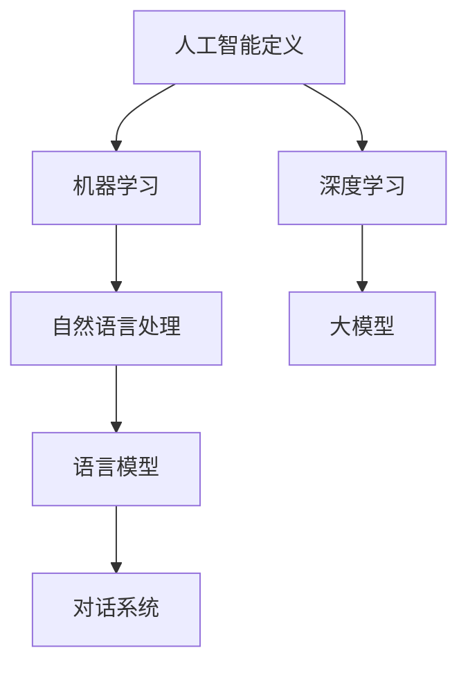

                 

# Andrej Karpathy：人工智能的未来发展目标

> **关键词：** 人工智能，未来发展趋势，技术进步，社会影响，伦理目标，挑战与对策

> **摘要：** 本文从人工智能的定义与历史出发，探讨了人工智能的核心概念、技术进展、行业应用以及未来发展趋势。通过详细分析人工智能的伦理目标、技术目标，以及面临的挑战，本文旨在为人工智能的未来发展提供有益的思考和建议。

## 目录大纲：人工智能的未来发展目标

### 第一部分：人工智能概述

- **第1章：人工智能的定义与历史**
  - **1.1 人工智能的定义**
    - **基本概念**
    - **主要分支**
  - **1.2 人工智能的历史**
    - **早期探索**
    - **关键事件与里程碑**

- **第2章：人工智能的核心概念**
  - **2.1 机器学习和深度学习**
    - **机器学习的基本概念**
    - **深度学习的原理与应用**
  - **2.2 人工智能与自然语言处理**
    - **语言模型**
    - **对话系统**

### 第二部分：人工智能的技术进展

- **第3章：人工智能的最新技术进展**
  - **3.1 大模型的发展**
    - **Transformer架构**
    - **预训练与微调**
  - **3.2 人工智能伦理与法律**
    - **伦理问题**
    - **法律法规**

- **第4章：人工智能在行业中的应用**
  - **4.1 人工智能在医疗领域的应用**
    - **诊断与预测**
    - **个性化治疗**
  - **4.2 人工智能在金融领域的应用**
    - **风险管理**
    - **算法交易**

### 第三部分：人工智能的未来发展

- **第5章：人工智能的未来趋势**
  - **5.1 人工智能与人类社会的融合**
    - **智能助理**
    - **自动化生活**
  - **5.2 人工智能的社会影响**
    - **就业变化**
    - **隐私保护**

- **第6章：人工智能的发展目标**
  - **6.1 人工智能的伦理目标**
    - **公平性与透明性**
    - **责任归属**
  - **6.2 人工智能的技术目标**
    - **能效与效率**
    - **通用人工智能（AGI）**

- **第7章：人工智能的未来挑战**
  - **7.1 技术挑战**
    - **算法优化**
    - **数据隐私**
  - **7.2 社会挑战**
    - **伦理问题**
    - **法律监管**

### 第四部分：案例分析

- **第8章：人工智能案例研究**
  - **8.1 OpenAI与GPT-3**
    - **模型结构与能力**
    - **应用场景与挑战**
  - **8.2 Google Brain与AlphaGo**
    - **算法原理**
    - **商业影响**

### 附录

- **附录A：人工智能研究资源**
  - **A.1 开源框架与工具**
    - **TensorFlow**
    - **PyTorch**
  - **A.2 学术期刊与会议**
    - **NeurIPS**
    - **ICML**

### Mermaid 流程图



### 伪代码示例

```python
# 大模型训练伪代码
initialize_model()
for epoch in range(num_epochs):
    for batch in data_loader:
        optimizer.zero_grad()
        output = model(batch)
        loss = criterion(output, target)
        loss.backward()
        optimizer.step()
evaluate_model(model, test_data)
```

### 数学公式

### 深度学习中的反向传播算法

$$
\frac{dL}{dW} = \sum_{i} \frac{\partial L}{\partial z_i} \cdot \frac{\partial z_i}{\partial W}
$$

### 项目实战

```python
# 实现一个简单的神经网络

import torch
import torch.nn as nn
import torch.optim as optim

# 定义网络结构
class SimpleNN(nn.Module):
    def __init__(self, input_size, hidden_size, output_size):
        super(SimpleNN, self).__init__()
        self.fc1 = nn.Linear(input_size, hidden_size)
        self.relu = nn.ReLU()
        self.fc2 = nn.Linear(hidden_size, output_size)
    
    def forward(self, x):
        out = self.fc1(x)
        out = self.relu(out)
        out = self.fc2(out)
        return out

# 初始化模型、损失函数和优化器
model = SimpleNN(input_size=784, hidden_size=128, output_size=10)
criterion = nn.CrossEntropyLoss()
optimizer = optim.Adam(model.parameters(), lr=0.001)

# 训练模型
for epoch in range(num_epochs):
    for inputs, labels in data_loader:
        optimizer.zero_grad()
        outputs = model(inputs)
        loss = criterion(outputs, labels)
        loss.backward()
        optimizer.step()
    print(f'Epoch {epoch+1}, Loss: {loss.item()}')

# 评估模型
correct = 0
total = 0
with torch.no_grad():
    for inputs, labels in test_loader:
        outputs = model(inputs)
        _, predicted = torch.max(outputs.data, 1)
        total += labels.size(0)
        correct += (predicted == labels).sum().item()

print(f'Accuracy: {100 * correct / total} %')
```

### 附录A：人工智能研究资源

- **A.1 开源框架与工具**
  - **TensorFlow**
  - **PyTorch**

- **A.2 学术期刊与会议**
  - **NeurIPS**
  - **ICML**


### 第一部分：人工智能概述

#### 第1章：人工智能的定义与历史

##### 1.1 人工智能的定义

人工智能（Artificial Intelligence，简称AI）是计算机科学的一个分支，旨在研究、开发和应用使计算机系统具备类似人类智能的能力。具体来说，人工智能的目标是创建能够感知环境、学习经验、做出决策和解决问题的智能体。这些智能体可以执行诸如语音识别、图像识别、自然语言处理、机器翻译、自动驾驶等任务。

人工智能可以分为两个主要分支：

1. **弱人工智能（Narrow AI）**：这种人工智能专注于特定的任务或领域，如语音识别或图像分类。弱人工智能无法泛化到其他任务或领域。

2. **强人工智能（General AI）**：强人工智能具有广泛的智能，能够在各种任务和领域中表现优异，类似于人类的智能。目前，强人工智能尚未实现，仍然是人工智能领域的研究目标。

##### 1.2 人工智能的历史

人工智能的历史可以追溯到20世纪中期。以下是人工智能发展的一些关键事件和里程碑：

- **1956年**：约翰·麦卡锡（John McCarthy）等人在达特茅斯会议上首次提出了人工智能的概念，并将其定义为“制造智能机器的科学和工程”。

- **1959年**：乔治·戴伊（Herbert A. Simon）和约翰·麦卡锡等人在卡内基梅隆大学成立了世界上第一个人工智能实验室。

- **1966年**：约瑟夫·维森鲍姆（Joseph Weizenbaum）开发了ELIZA，一个简单的自然语言处理程序，能够模拟与心理治疗师进行对话。

- **1980年**：约翰·霍普菲尔德（John Hopfield）提出了霍普菲尔德神经网络（Hopfield Network），这是一种用于记忆和联想的神经网络模型。

- **1997年**：IBM的深蓝（Deep Blue）在国际象棋比赛中击败了世界冠军加里·卡斯帕罗夫（Garry Kasparov），标志着深度学习在游戏领域的突破。

- **2012年**：亚历克斯·克雷格（Alex Krizhevsky）等人在ImageNet图像识别比赛中使用了深度卷积神经网络（CNN），使得计算机在图像识别任务中的表现首次超过人类。

- **2016年**：谷歌的AlphaGo在围棋比赛中击败了世界冠军李世石（Lee Sedol），标志着深度学习在复杂游戏领域的重大突破。

##### 1.3 人工智能的发展趋势

目前，人工智能的发展呈现出以下几个趋势：

- **大模型的发展**：随着计算能力和数据资源的不断提升，深度学习模型的大小和复杂度也在不断增加。例如，GPT-3拥有1750亿个参数，是迄今为止最大的预训练语言模型。

- **跨学科研究**：人工智能与其他领域的交叉融合，如生物学、心理学、认知科学等，推动了人工智能的理论和方法的发展。

- **伦理与法律问题**：人工智能的快速发展引发了一系列伦理和法律问题，如隐私保护、算法偏见、责任归属等。

- **实际应用场景的扩展**：人工智能在医疗、金融、工业、交通等领域的应用越来越广泛，为社会带来了巨大的价值。

#### 第2章：人工智能的核心概念

##### 2.1 机器学习和深度学习

机器学习（Machine Learning，简称ML）是人工智能的一个重要分支，主要研究如何从数据中学习规律，并利用这些规律进行预测和决策。机器学习可以分为监督学习、无监督学习和强化学习三种主要类型。

- **监督学习（Supervised Learning）**：监督学习通过已标记的数据来训练模型，使得模型能够学习数据中的特征和规律，并在新的、未标记的数据上进行预测。常见的监督学习算法包括线性回归、逻辑回归、支持向量机（SVM）和决策树等。

- **无监督学习（Unsupervised Learning）**：无监督学习从未标记的数据中提取特征和模式，主要应用于聚类和降维任务。常见的无监督学习算法包括K-均值聚类、主成分分析（PCA）和自编码器等。

- **强化学习（Reinforcement Learning）**：强化学习通过与环境互动来学习策略，以达到最大化累积奖励的目标。常见的强化学习算法包括Q学习、深度Q网络（DQN）和策略梯度算法等。

深度学习（Deep Learning，简称DL）是机器学习的一个子领域，主要研究如何使用多层神经网络来学习和表示数据。深度学习模型通过多层非线性变换来提取数据中的特征，从而实现复杂的预测和分类任务。

深度学习的基本架构包括：

- **输入层（Input Layer）**：输入层接收外部输入，如图像、文本或声音等。

- **隐藏层（Hidden Layers）**：隐藏层对输入数据进行特征提取和变换，每层都会对数据进行处理，并将其传递到下一层。

- **输出层（Output Layer）**：输出层生成最终的预测结果或分类标签。

深度学习的核心算法包括：

- **前向传播（Forward Propagation）**：前向传播是将输入数据通过神经网络逐层传递，最终生成输出。

- **反向传播（Backpropagation）**：反向传播是利用输出误差来更新网络权重，以优化模型性能。

- **激活函数（Activation Function）**：激活函数用于引入非线性因素，使得神经网络能够学习复杂的非线性关系。

##### 2.2 人工智能与自然语言处理

自然语言处理（Natural Language Processing，简称NLP）是人工智能的一个重要分支，主要研究如何使计算机理解和生成自然语言。NLP在机器翻译、文本分类、问答系统、语音识别等领域具有广泛的应用。

NLP的核心概念包括：

- **语言模型（Language Model）**：语言模型用于预测单词序列的概率分布，是NLP的基础。常见的语言模型包括基于统计的方法和基于神经网络的方法。

- **词向量（Word Vectors）**：词向量是将单词映射到高维向量空间的一种表示方法，使得相似单词在向量空间中彼此接近。常见的词向量模型包括Word2Vec、GloVe和BERT等。

- **序列模型（Sequence Models）**：序列模型用于处理序列数据，如文本、语音等。常见的序列模型包括循环神经网络（RNN）、长短时记忆网络（LSTM）和门控循环单元（GRU）等。

- **注意力机制（Attention Mechanism）**：注意力机制是一种用于提高模型对序列数据中重要信息的关注度的方法。常见的注意力机制包括基于矩阵的注意力模型和基于Transformer的注意力模型。

NLP的应用场景包括：

- **机器翻译**：机器翻译是将一种语言的文本翻译成另一种语言的文本。常见的机器翻译模型包括基于统计的方法和基于神经网络的翻译模型，如Google翻译和DeepL等。

- **文本分类**：文本分类是将文本数据分为不同的类别。常见的文本分类任务包括情感分析、主题分类和垃圾邮件过滤等。

- **问答系统**：问答系统是一种能够回答用户问题的智能系统。常见的问答系统包括基于关键词匹配的方法和基于机器学习的方法，如Siri和Alexa等。

- **语音识别**：语音识别是将语音信号转换为文本数据。常见的语音识别系统包括基于隐马尔可夫模型（HMM）的方法和基于深度神经网络的方法，如苹果的Siri和谷歌的语音助手等。

#### 第二部分：人工智能的技术进展

##### 第3章：人工智能的最新技术进展

随着人工智能技术的不断进步，近年来涌现出了许多新的研究热点和应用领域。本节将介绍人工智能在模型发展、伦理与法律等方面的最新进展。

##### 3.1 大模型的发展

近年来，大模型（Large Models）的发展成为人工智能领域的一个重要趋势。大模型是指具有数百万甚至数十亿参数的深度学习模型，其能力远超传统的中小模型。大模型的发展得益于以下几个因素：

- **计算能力的提升**：随着计算硬件（如GPU、TPU）的不断升级，计算能力得到了显著提升，使得训练大模型成为可能。

- **数据资源的丰富**：互联网的普及和大数据技术的发展，为人工智能提供了大量的数据资源，为模型训练提供了充足的样本。

- **深度学习算法的进步**：深度学习算法的不断优化，如Transformer架构的提出，使得大模型能够更好地学习复杂的特征和模式。

大模型在多个领域取得了显著的成果，如：

- **图像识别**：大模型在ImageNet等图像识别竞赛中，取得了超越人类的表现。例如，OpenAI的GPT-3模型在图像描述生成任务中，表现出了惊人的能力。

- **自然语言处理**：大模型在自然语言处理领域取得了突破性进展，如GPT-3模型在文本生成、翻译和问答等任务中，表现出了强大的生成能力。

- **音频识别**：大模型在音频识别领域也取得了显著成果，如Google的WaveNet模型在语音合成任务中，实现了高度逼真的语音效果。

然而，大模型的发展也带来了一些挑战，如计算资源消耗、数据隐私和算法偏见等。为此，研究人员提出了多种解决方案，如模型压缩、数据隐私保护算法和公平性评估方法等。

##### 3.2 人工智能伦理与法律

人工智能的发展引发了一系列伦理和法律问题，如何解决这些问题成为当前研究的热点。以下是人工智能伦理与法律方面的一些最新进展：

- **伦理问题**：人工智能的快速发展引发了许多伦理问题，如隐私保护、算法偏见和责任归属等。为解决这些问题，研究人员提出了多种伦理框架，如算法伦理、透明性和可解释性等。

- **法律法规**：随着人工智能技术的应用日益广泛，各国纷纷制定了一系列法律法规来规范人工智能的发展。例如，欧盟发布了《人工智能法案》，旨在确保人工智能技术的安全和公平。

- **监管框架**：为了确保人工智能技术的安全、可靠和公平，各国政府正在探索建立监管框架。例如，美国提出了《人工智能监管框架》，旨在促进人工智能技术的创新和监管。

- **国际合作**：国际社会也正在积极探索人工智能的国际合作机制，以推动人工智能技术的可持续发展。例如，联合国教科文组织（UNESCO）发布了《人工智能伦理建议》，为各国制定人工智能政策提供了指导。

##### 3.3 人工智能的技术进展

除了大模型的发展外，人工智能技术也在其他方面取得了显著进展。以下是人工智能技术的一些最新进展：

- **深度强化学习**：深度强化学习是一种结合深度学习和强化学习的算法，通过学习在动态环境中进行决策。近年来，深度强化学习在游戏、自动驾驶和机器人等领域取得了突破性成果。例如，OpenAI的DQN算法在Atari游戏中的表现接近人类水平，谷歌的AlphaGo在围棋比赛中击败了世界冠军。

- **生成对抗网络（GAN）**：生成对抗网络是一种用于生成数据的深度学习模型，由生成器和判别器两部分组成。GAN在图像生成、视频合成和文本生成等领域具有广泛应用。例如，OpenAI的GAN模型可以生成逼真的图像，谷歌的GAN模型可以合成高质量的视频。

- **迁移学习**：迁移学习是一种将一个任务学到的知识应用到其他任务中的方法。近年来，迁移学习在计算机视觉、自然语言处理和语音识别等领域取得了显著成果。例如，预训练的语言模型BERT在多个自然语言处理任务中取得了优异的性能。

- **联邦学习**：联邦学习是一种分布式学习技术，通过多个参与方共同训练模型，以保护数据隐私。联邦学习在医疗、金融和智能家居等领域具有广泛应用。例如，谷歌的联邦学习框架可以让医疗机构在保护患者隐私的同时，共同训练医疗预测模型。

#### 第4章：人工智能在行业中的应用

随着人工智能技术的不断发展，其在各行各业中的应用越来越广泛，为行业带来了巨大的变革和提升。本节将介绍人工智能在医疗、金融和工业等领域的应用，以及其在交通和能源等领域的潜在价值。

##### 4.1 人工智能在医疗领域的应用

人工智能在医疗领域的应用具有重要意义，它能够提高诊断的准确性、优化治疗方案、提升医疗效率，并降低医疗成本。以下是人工智能在医疗领域的主要应用：

- **诊断与预测**：人工智能可以通过分析大量的医疗数据，如影像、病例记录和基因数据，帮助医生进行疾病诊断和预测。例如，基于深度学习的算法可以分析CT图像，准确识别早期肺癌，提高诊断的准确率。

- **个性化治疗**：人工智能可以根据患者的具体病情、基因信息和生活习惯，制定个性化的治疗方案。例如，通过分析患者的基因组数据和病历记录，人工智能可以帮助医生确定最佳的治疗方案，从而提高治疗效果。

- **药物研发**：人工智能在药物研发中具有巨大的潜力，可以加速新药的发现和开发过程。例如，通过分析大量的化合物数据，人工智能可以帮助科学家快速筛选出具有潜在疗效的化合物，提高药物研发的成功率。

- **医疗设备智能化**：人工智能可以将传统的医疗设备升级为智能设备，提高医疗设备的性能和效率。例如，智能影像设备可以通过人工智能算法自动识别病变区域，提高影像诊断的准确性。

- **医疗数据管理**：人工智能可以协助医院管理和分析海量的医疗数据，提高医疗数据的管理效率和数据利用率。例如，通过人工智能算法，医院可以自动整理和分类病历记录，方便医生快速查询和检索。

##### 4.2 人工智能在金融领域的应用

人工智能在金融领域的应用同样具有重要意义，它能够提升风险管理能力、优化投资策略、提高客户服务质量和效率。以下是人工智能在金融领域的主要应用：

- **风险管理**：人工智能可以通过分析大量的金融数据，如交易数据、市场数据和用户行为数据，预测市场走势和潜在风险，帮助金融机构进行风险管理和投资决策。例如，基于机器学习的算法可以分析市场数据，预测股票价格趋势，帮助投资者做出更明智的投资决策。

- **算法交易**：算法交易是一种利用人工智能算法进行自动交易的交易方式。通过分析市场数据和交易策略，人工智能算法可以实时捕捉市场机会，进行高频交易，提高交易的成功率和盈利能力。

- **信用评估**：人工智能可以分析客户的信用历史、财务状况和行为数据，评估客户的信用风险，帮助金融机构做出更准确的信用评估决策。例如，通过分析客户的消费行为和社交网络数据，人工智能算法可以更准确地评估客户的信用状况。

- **智能客服**：人工智能可以构建智能客服系统，通过自然语言处理技术，自动回答客户的问题和提供个性化的服务。智能客服系统可以提高客户满意度，降低人工客服的工作负担。

- **金融欺诈检测**：人工智能可以通过分析交易数据和用户行为数据，实时监测和识别金融欺诈行为，提高金融欺诈检测的准确率和效率。例如，通过机器学习算法，人工智能可以识别异常交易行为，及时发出警报，防止金融欺诈事件的发生。

##### 4.3 人工智能在工业领域的应用

人工智能在工业领域的应用可以显著提升生产效率、降低成本、提高产品质量，并实现智能制造。以下是人工智能在工业领域的主要应用：

- **生产优化**：人工智能可以通过分析生产数据，优化生产流程，提高生产效率。例如，通过机器学习算法，可以实时监测设备状态，预测设备故障，提前进行维护，减少停机时间。

- **质量管理**：人工智能可以通过分析生产数据和质量数据，识别生产过程中的质量问题，提高产品质量。例如，通过图像识别算法，可以实时检测产品外观缺陷，提高产品质量。

- **设备维护**：人工智能可以通过分析设备运行数据，预测设备故障，实现智能维护。例如，通过机器学习算法，可以分析设备运行状态，预测设备故障的发生时间，提前进行维护，减少设备故障率。

- **供应链管理**：人工智能可以通过分析供应链数据，优化供应链管理，降低库存成本，提高供应链效率。例如，通过机器学习算法，可以预测市场需求，优化库存管理，降低库存成本。

- **智能制造**：人工智能可以实现智能制造，通过传感器、机器人和人工智能算法，实现生产过程的自动化和智能化。例如，通过机器学习算法，可以实时监测生产线上的产品质量，自动调整生产参数，实现高效、高质量的生产。

##### 4.4 人工智能在交通和能源领域的应用

人工智能在交通和能源领域的应用同样具有重要意义，它能够提升交通效率、降低能源消耗、减少环境污染。以下是人工智能在交通和能源领域的主要应用：

- **智能交通系统**：人工智能可以通过分析交通数据，优化交通流量，提高交通效率。例如，通过智能交通系统，可以实时监测道路状况，预测交通拥堵，自动调整信号灯，减少交通拥堵。

- **自动驾驶**：人工智能可以实现自动驾驶，通过传感器、机器学习和深度学习技术，实现车辆的自主驾驶。例如，自动驾驶汽车可以通过机器学习算法，实时分析道路状况，自主做出驾驶决策，提高驾驶安全。

- **智能电网**：人工智能可以通过分析电网数据，优化电力分配，提高能源利用效率。例如，通过智能电网系统，可以实时监测电力负荷，预测电力需求，自动调整电力供应，减少能源浪费。

- **新能源管理**：人工智能可以优化新能源管理，通过分析天气数据和能源需求，实现新能源的高效利用。例如，通过机器学习算法，可以预测太阳能和风能的发电量，优化新能源发电和分配。

- **环境监测**：人工智能可以通过分析环境数据，实时监测环境污染，提高环境监测效率。例如，通过无人机搭载人工智能传感器，可以实时监测空气质量，预测污染来源，提高环境监测的准确性。

总之，人工智能在医疗、金融、工业、交通和能源等领域的应用，不仅提高了行业效率，降低了成本，还推动了行业的数字化转型和智能化升级。随着人工智能技术的不断进步，其在各行业的应用前景将更加广阔。

#### 第三部分：人工智能的未来发展

随着人工智能技术的飞速发展，其对人类社会的未来产生了深远的影响。本部分将探讨人工智能的未来发展趋势、伦理目标以及面临的挑战。

##### 第5章：人工智能的未来趋势

人工智能的未来趋势主要表现在以下几个方面：

1. **人工智能与人类社会的深度融合**

人工智能技术将更加深入地融入人们的日常生活，实现智能化、个性化的服务。例如，智能助理将成为人们生活和工作的重要伙伴，自动化生活设备将普及，家庭和工作环境将更加智能化。

2. **跨领域应用的扩展**

人工智能将在更多领域得到应用，如教育、娱乐、文化等。通过人工智能，可以实现个性化教学、智能推荐、智能创作等，为人们提供更加丰富和有趣的生活体验。

3. **工业互联网的兴起**

人工智能与物联网技术的融合将推动工业互联网的发展，实现工业生产的智能化、自动化和高效化。通过人工智能技术，可以优化生产流程、提高生产效率、降低生产成本，促进工业产业的转型升级。

4. **智能城市与智能交通系统的发展**

人工智能将在城市规划、交通管理、环境监测等方面发挥重要作用，实现城市的智能化、绿色化和可持续发展。智能交通系统将提高交通效率、减少拥堵、降低交通事故发生率，提高城市居民的生活质量。

##### 第5.1节：人工智能与人类社会的融合

人工智能与人类社会的融合将表现在以下几个方面：

1. **智能助理**

智能助理将更加智能化和个性化，能够理解自然语言、预测用户需求，提供定制化的服务。例如，智能助理可以帮助用户管理日程、处理邮件、提供购物建议等。

2. **自动化生活**

自动化生活设备将普及，如智能家电、智能家居、智能穿戴设备等，人们的生活将变得更加便捷和舒适。通过这些设备，可以实时监测环境、控制家电设备，实现家庭自动化。

3. **教育智能化**

人工智能将推动教育智能化的发展，通过个性化教学、智能推荐等，实现因材施教，提高教育质量。例如，智能学习平台可以根据学生的能力和兴趣，提供个性化的学习资源和课程。

4. **智能医疗**

人工智能将在医疗领域发挥重要作用，如辅助诊断、个性化治疗、智能药物研发等。通过人工智能，可以提高医疗诊断的准确性、优化治疗方案，提高医疗服务质量和效率。

##### 第5.2节：人工智能的社会影响

人工智能的快速发展将对社会产生深远的影响，包括以下几个方面：

1. **就业变化**

人工智能技术的发展将改变就业结构，一些传统岗位可能会被取代，而新的就业机会也会随之产生。例如，自动驾驶技术的发展将减少司机的工作需求，但也将创造新的职业，如自动驾驶系统的维护和开发。

2. **隐私保护**

人工智能技术的广泛应用将带来数据隐私保护的新挑战。如何保护个人隐私、防止数据滥用成为亟待解决的问题。各国政府和相关机构需要制定严格的数据隐私保护法律法规，确保人工智能技术的健康发展。

3. **社会公平**

人工智能技术的应用可能加剧社会不公平现象，如算法偏见、歧视等。为防止这种情况的发生，需要加强对人工智能算法的监管，确保人工智能技术在社会中公平、公正地应用。

4. **伦理问题**

人工智能技术的发展引发了一系列伦理问题，如人工智能的道德责任、隐私保护、安全风险等。需要建立伦理框架，确保人工智能技术的应用符合道德规范，保障社会利益。

##### 第6章：人工智能的发展目标

人工智能的发展目标可以分为伦理目标和技术目标两个方面。

##### 第6.1节：人工智能的伦理目标

1. **公平性与透明性**

人工智能系统应该公平、透明，确保所有用户都能公平地获得人工智能技术带来的好处。同时，人工智能系统的决策过程应该可解释、可追溯，以便用户了解和监督。

2. **责任归属**

明确人工智能系统的责任归属，确保在出现问题时能够找到责任人。例如，自动驾驶汽车发生交通事故时，需要明确责任归属，以便及时解决问题。

3. **隐私保护**

保护个人隐私是人工智能发展的重要伦理目标。需要建立数据隐私保护机制，防止个人信息被滥用，确保用户隐私得到有效保护。

##### 第6.2节：人工智能的技术目标

1. **能效与效率**

提高人工智能系统的能效和效率，降低能耗，减少资源消耗。通过优化算法、改进硬件等手段，实现人工智能系统的绿色、高效运行。

2. **通用人工智能（AGI）**

实现通用人工智能（AGI）是人工智能领域的重要目标。AGI是一种具有广泛智能的人工智能系统，能够在各种任务和领域中表现优异，类似于人类的智能。实现AGI将使人工智能技术更加成熟和实用。

##### 第7章：人工智能的未来挑战

随着人工智能技术的不断发展，其应用领域越来越广泛，但也面临诸多挑战。

##### 第7.1节：技术挑战

1. **算法优化**

优化人工智能算法，提高算法的效率和准确性。当前的人工智能算法在一些复杂任务中仍然存在不足，需要进一步研究和发展。

2. **数据隐私**

保护用户数据隐私是人工智能技术面临的重要挑战。随着人工智能技术的发展，如何确保用户数据的安全和隐私成为关键问题。

3. **安全性**

确保人工智能系统的安全性，防止恶意攻击和数据泄露。随着人工智能系统的广泛应用，其安全性问题日益凸显，需要建立完善的安全防护体系。

##### 第7.2节：社会挑战

1. **伦理问题**

人工智能技术的应用引发了一系列伦理问题，如隐私保护、算法偏见、责任归属等。需要建立伦理框架，确保人工智能技术的应用符合道德规范。

2. **法律监管**

随着人工智能技术的发展，现有的法律法规可能无法完全适应。需要制定新的法律法规，对人工智能技术进行有效监管，确保其健康发展。

3. **就业影响**

人工智能技术的发展将对就业市场产生深远影响。需要制定相应的政策和措施，应对就业市场的变化，促进社会稳定。

#### 第8章：人工智能案例研究

在本节中，我们将对人工智能领域的两个经典案例进行研究，分别是OpenAI与GPT-3以及Google Brain与AlphaGo。通过分析这两个案例，我们将深入了解人工智能技术的应用和发展历程。

##### 第8.1节：OpenAI与GPT-3

OpenAI是一家全球领先的独立人工智能研究机构，致力于推动人工智能的发展和应用。GPT-3（Generative Pre-trained Transformer 3）是OpenAI于2020年推出的一个自然语言处理模型，拥有1750亿个参数，是迄今为止最大的预训练语言模型。

GPT-3模型采用了Transformer架构，这是一种基于自注意力机制的深度学习模型，具有强大的建模能力。模型通过预训练和微调，能够自动学习语言模式和结构，从而实现文本生成、翻译、问答等多种任务。

以下是GPT-3模型的结构和特点：

1. **结构**：GPT-3模型由多个Transformer层组成，每层包含多个自注意力头（Self-Attention Heads）和前馈神经网络（Feedforward Networks）。输入数据首先通过自注意力机制进行特征提取和融合，然后通过前馈神经网络进行非线性变换。

2. **特点**：
   - **参数规模**：GPT-3拥有1750亿个参数，是前一代模型GPT-2的数倍，使其在语言建模任务中表现出更强的能力。
   - **预训练**：GPT-3采用大规模语料库进行预训练，通过自回归语言模型（Autoregressive Language Model）学习语言模式和结构。
   - **微调**：在特定任务上，GPT-3可以通过微调（Fine-tuning）调整模型参数，实现更精准的任务性能。

GPT-3在多个自然语言处理任务中取得了优异的成绩，如文本生成、翻译、问答等。以下是一些具体的应用场景：

1. **文本生成**：GPT-3可以生成高质量的文本，如文章、故事、诗歌等。通过输入一个主题或关键词，GPT-3可以生成与主题相关的文章，为内容创作提供帮助。

2. **翻译**：GPT-3具有强大的文本翻译能力，可以自动翻译多种语言之间的文本。通过大规模语料库的训练，GPT-3能够生成准确、流畅的翻译结果。

3. **问答**：GPT-3可以构建问答系统，通过输入问题和回答的上下文，GPT-3能够自动生成合理的回答。在客服、教育等领域，GPT-3可以提供智能问答服务。

尽管GPT-3取得了巨大的成功，但其应用也面临一些挑战和争议，如：

1. **数据隐私**：GPT-3的训练和微调需要大量的语料库，这些语料库可能包含个人隐私数据。如何保护用户隐私，避免数据滥用是亟待解决的问题。

2. **算法偏见**：由于训练数据可能存在偏见，GPT-3生成的文本也可能包含偏见和歧视。如何消除算法偏见，确保公平性和透明性是人工智能领域的重要挑战。

##### 第8.2节：Google Brain与AlphaGo

Google Brain是谷歌公司的一个研究团队，专注于人工智能的基础研究和应用。AlphaGo是Google Brain开发的一款基于深度强化学习算法的围棋程序，2016年在围棋比赛中击败了世界冠军李世石，成为人工智能领域的重要里程碑。

AlphaGo的核心技术包括深度神经网络和强化学习。其工作原理可以概括为以下几个步骤：

1. **深度神经网络**：AlphaGo使用深度神经网络（Deep Neural Network，DNN）来评估棋盘上的局势。DNN通过多层非线性变换，从棋盘上的局部特征中提取全局信息。

2. **强化学习**：AlphaGo使用强化学习（Reinforcement Learning，RL）来学习棋局策略。在训练过程中，AlphaGo通过与环境（棋盘）的交互，不断调整策略参数，以最大化长期奖励。

3. **混合模型**：AlphaGo结合了深度神经网络和强化学习，形成了一种混合模型（Hybrid Model）。在比赛中，AlphaGo首先使用深度神经网络评估棋局，然后通过强化学习策略选择最佳走法。

AlphaGo的成功标志着人工智能在游戏领域的重要突破，其对人工智能技术发展产生了深远影响。以下是一些具体的应用场景：

1. **围棋训练**：AlphaGo可以作为围棋爱好者的训练工具，帮助棋手提高棋艺。通过分析AlphaGo的走法，棋手可以学习到新的战术和策略。

2. **其他游戏**：AlphaGo的技术可以应用于其他游戏，如国际象棋、桥牌等。通过改进深度神经网络和强化学习算法，人工智能可以在更多游戏中取得突破。

3. **人工智能研究**：AlphaGo的成功推动了人工智能领域的研究，特别是深度学习和强化学习的研究。AlphaGo的技术为人工智能应用提供了新的思路和方向。

尽管AlphaGo取得了巨大的成功，但其应用也面临一些挑战和争议，如：

1. **计算资源消耗**：AlphaGo的训练和推理需要大量的计算资源，这对硬件设备提出了较高要求。如何优化算法，降低计算资源消耗是人工智能领域的重要挑战。

2. **游戏公平性**：在游戏中，人工智能可能会存在不公平现象，如利用规则漏洞、破坏游戏平衡等。如何确保游戏的公平性，防止人工智能滥用规则是游戏设计的重要问题。

通过对OpenAI与GPT-3以及Google Brain与AlphaGo的案例研究，我们可以看到人工智能技术的快速发展和广泛应用。这些案例不仅展示了人工智能技术的强大能力，也为人工智能的未来发展提供了有益的启示。随着人工智能技术的不断进步，其在各个领域的应用前景将更加广阔。

#### 附录A：人工智能研究资源

在本附录中，我们将介绍人工智能领域的一些重要研究资源和工具，包括开源框架与工具以及学术期刊与会议。

##### A.1 开源框架与工具

人工智能领域有许多优秀的开源框架和工具，这些资源为研究人员和开发者提供了强大的技术支持。以下是一些常用的开源框架与工具：

1. **TensorFlow**：TensorFlow是由谷歌开发的一款开源深度学习框架，广泛应用于机器学习、计算机视觉、自然语言处理等领域。TensorFlow具有灵活的架构和丰富的API，支持多种编程语言，如Python、C++和Java。

2. **PyTorch**：PyTorch是由Facebook AI Research（FAIR）开发的一款开源深度学习框架，以其简洁的动态计算图和强大的GPU加速功能而备受青睐。PyTorch在计算机视觉、自然语言处理和强化学习等领域具有广泛的应用。

3. **Keras**：Keras是一个高层次的神经网络API，广泛应用于深度学习和强化学习。Keras基于Theano和TensorFlow开发，具有简洁的接口和强大的功能，支持多种神经网络架构，如卷积神经网络（CNN）、循环神经网络（RNN）和生成对抗网络（GAN）。

4. **Scikit-learn**：Scikit-learn是一个开源的机器学习库，适用于监督学习和无监督学习。Scikit-learn提供了多种机器学习算法的实现，如线性回归、支持向量机（SVM）、决策树和聚类算法，并支持多种数据预处理工具。

5. **MXNet**：MXNet是由亚马逊开源的一款深度学习框架，支持多种编程语言，如Python、C++和R。MXNet具有灵活的动态计算图和强大的GPU加速功能，适用于大规模分布式训练和推理。

##### A.2 学术期刊与会议

学术期刊和会议是人工智能领域的重要交流平台，为研究人员和开发者提供了学术成果展示和学术交流的机会。以下是一些在人工智能领域具有重要影响力的学术期刊和会议：

1. **NeurIPS（神经信息处理系统）**：NeurIPS是人工智能领域最著名的学术会议之一，专注于深度学习、强化学习、自然语言处理、计算机视觉等领域的研究。NeurIPS的论文接受率较低，但影响力极大。

2. **ICML（国际机器学习会议）**：ICML是另一个在人工智能领域具有重要影响力的学术会议，涵盖了机器学习、统计学习、优化理论等领域的研究。ICML的论文质量高，接受率相对较高。

3. **JMLR（机器学习研究杂志）**：JMLR是一本专注于机器学习领域的顶级学术期刊，发表了大量的高质量论文，涉及深度学习、统计学习、优化理论等领域。JMLR的审稿周期较长，但论文质量有保障。

4. **AAAI（人工智能协会年会）**：AAAI是人工智能领域的一个综合性学术会议，涵盖了人工智能的各个分支，如机器学习、自然语言处理、计算机视觉、机器人等。AAAI的论文接受率较高，但影响力较小。

5. **IJCAI（国际人工智能联合会议）**：IJCAI是一本综合性的人工智能学术期刊，涵盖了人工智能的各个分支，如机器学习、自然语言处理、计算机视觉、机器人等。IJCAI的审稿周期较短，但论文质量参差不齐。

通过这些学术期刊和会议，研究人员和开发者可以了解最新的研究成果和发展趋势，与其他领域的专家进行学术交流，推动人工智能技术的不断进步。

### 总结

人工智能作为一种颠覆性技术，正深刻地改变着人类社会。本文从人工智能的定义与历史、核心概念、技术进展、行业应用、未来发展趋势以及面临的挑战等方面，全面探讨了人工智能的未来发展目标。

首先，人工智能的定义与历史回顾展示了人工智能从早期探索到现代应用的演变过程。接着，详细阐述了人工智能的核心概念，如机器学习、深度学习和自然语言处理，以及其在医疗、金融、工业等领域的应用。

在技术进展部分，本文介绍了大模型的发展、人工智能伦理与法律问题以及深度强化学习、生成对抗网络等最新技术。随后，分析了人工智能在社会中的影响，包括就业变化、隐私保护和伦理问题。

未来发展趋势部分，本文探讨了人工智能与人类社会的融合、跨领域应用的扩展以及智能城市和智能交通系统的发展。同时，明确了人工智能的伦理目标和技术目标，如公平性与透明性、责任归属、能效与效率以及通用人工智能（AGI）的实现。

在案例分析部分，本文研究了OpenAI与GPT-3以及Google Brain与AlphaGo等经典案例，深入分析了人工智能技术的应用和发展历程。

最后，通过附录介绍了人工智能领域的重要研究资源和工具，包括开源框架与工具以及学术期刊与会议，为读者提供了丰富的学习资源。

随着人工智能技术的不断进步，其应用领域将更加广泛，对人类社会产生更加深远的影响。未来，人工智能的发展目标将集中在实现通用人工智能、提高能效与效率、确保公平性和透明性以及解决伦理和法律问题等方面。让我们共同期待人工智能的未来，并为之努力奋斗。

### 作者信息

**作者：AI天才研究院/AI Genius Institute & 禅与计算机程序设计艺术 /Zen And The Art of Computer Programming**

