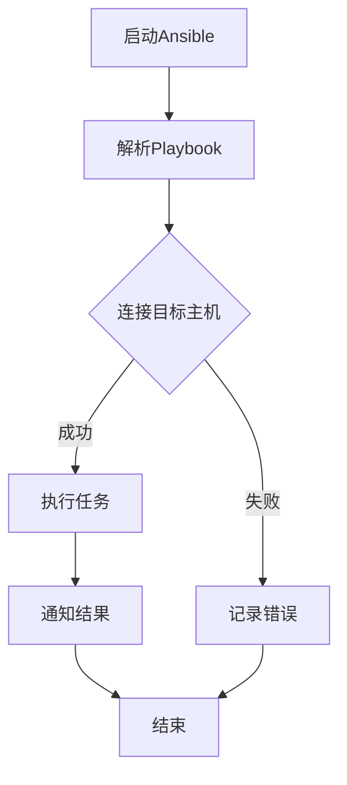
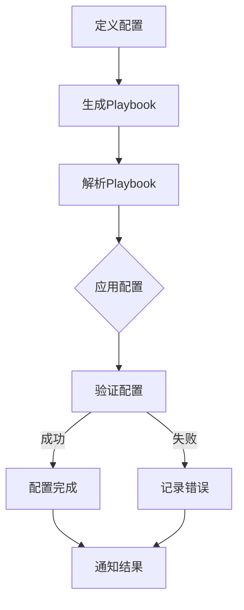
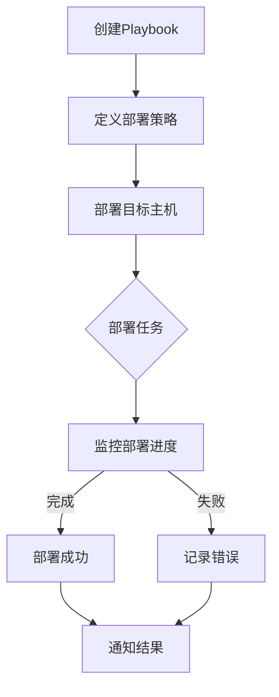

                 

### 文章标题

# Ansible自动化：简化IT运维工作流程

> 关键词：Ansible、自动化运维、IT运维、工作流程、配置管理、模块化编程、安全最佳实践

> 摘要：本文将深入探讨Ansible自动化工具在简化IT运维工作流程中的应用。通过逐步分析Ansible的基础概念、架构、配置、自动化运维实战以及安全最佳实践，读者将了解如何使用Ansible实现高效的IT运维自动化，提升企业的IT运维效率和服务质量。

### 第一部分：Ansible基础

#### 第1章：Ansible概述

Ansible是一种非常流行的开源自动化工具，旨在简化IT基础设施的配置和管理。通过无代理架构、模块化编程和Playbook语言，Ansible能够快速地部署、配置和管理各种系统和应用程序。在本章中，我们将介绍Ansible的基本概念、主要特性以及优势。

#### 1.1 Ansible的基本概念

Ansible是一种基于Python编写的自动化工具，它通过SSH协议在远程主机上执行命令，实现配置管理和自动化部署。以下是Ansible的基本概念：

- **Ansible**：Ansible是一个开源自动化工具，用于配置管理、部署和管理各种系统和应用程序。
- **Playbook**：Playbook是Ansible的核心配置文件，它描述了在目标系统上要执行的配置操作。
- **模块**：模块是Ansible中的功能单元，用于执行特定的任务，如安装软件包、创建用户、配置文件等。

#### 1.2 Ansible的主要特性

Ansible具有以下主要特性：

- **无代理架构**：Ansible不需要在目标系统上安装任何代理软件，通过SSH直接连接并执行操作，降低了部署和维护成本。
- **模块化编程**：Ansible使用模块化编程，可以将复杂的配置任务分解为多个简单的模块，提高代码的可维护性和可扩展性。
- **简单易用**：Ansible的语法简单，易于学习和使用，适用于各种规模的IT基础设施。
- **自动化部署**：Ansible能够自动化部署和管理各种系统和应用程序，减少手动操作，提高运维效率。

#### 1.3 Ansible的优势

Ansible具有以下优势：

- **高效**：Ansible能够快速地部署和管理IT基础设施，提高运维效率。
- **灵活**：Ansible支持多种操作系统和应用程序，适用于各种规模的IT基础设施。
- **安全**：Ansible支持SSH密钥认证和加密传输，确保数据安全和隐私。
- **社区支持**：Ansible拥有庞大的社区支持，提供丰富的模块和资源，方便用户学习和使用。

#### 1.4 Ansible的架构

Ansible的架构包括以下组件：

- **控制节点**：运行Ansible命令和控制操作的主机。
- **目标节点**：执行Ansible操作的远程主机。
- **Playbook**：Ansible的核心配置文件，描述了在目标节点上要执行的操作。
- **模块**：Ansible的功能单元，用于执行特定的任务。

Ansible的通信机制是通过SSH协议在控制节点和目标节点之间传输数据和命令。Ansible的运行原理是：控制节点通过SSH连接到目标节点，加载并执行Playbook中的模块，实现配置管理和自动化部署。

#### 1.5 安装Ansible

安装Ansible之前，需要确保系统满足以下要求：

- **操作系统**：Ansible支持Linux、Mac OS和Windows等操作系统。
- **Python**：Ansible需要Python 2.6或更高版本。
- **SSH**：Ansible需要目标节点上的SSH服务。

以下是安装Ansible的步骤：

1. **安装Python**：确保Python 2.6或更高版本已安装。
2. **安装SSH**：确保目标节点上的SSH服务已启动和运行。
3. **安装Ansible**：通过以下命令安装Ansible：

   ```bash
   pip install ansible
   ```

4. **测试安装**：通过以下命令测试Ansible是否安装成功：

   ```bash
   ansible --version
   ```

如果安装成功，将会显示Ansible的版本信息。

#### 1.6 常见问题

在安装Ansible的过程中，可能会遇到以下常见问题：

- **SSH连接失败**：确保目标节点的SSH服务已启动和运行，且控制节点具有访问目标节点的权限。
- **Python版本问题**：确保安装的Python版本符合Ansible的要求。
- **权限问题**：确保安装Ansible的用户具有足够的权限。

#### 第2章：Ansible工作原理

Ansible的工作原理主要依赖于Playbook和模块。Playbook是Ansible的核心配置文件，描述了在目标节点上要执行的操作。模块是Ansible的功能单元，用于执行特定的任务。在本章中，我们将详细介绍Ansible的工作原理，包括Playbooks、模块和变量管理。

#### 2.1 Playbooks简介

Playbook是Ansible的核心配置文件，它描述了在目标节点上要执行的操作。Playbook由一组“plays”组成，每个play包含一个或多个“handlers”。以下是一个简单的Playbook示例：

```yaml
- hosts: all
  become: yes
  vars:
    package_name: httpd
  tasks:
    - name: Install Apache web server
      yum: name={{ package_name }} state=present
    - name: Start Apache web server
      service: name=httpd state=started
```

在上面的示例中，Playbook指定了目标节点（all），并授予了become权限。vars部分定义了变量，tasks部分包含两个任务：安装Apache web服务器和启动Apache web服务器。

#### 2.2 Playbooks的语法结构

Playbooks的语法结构包括以下部分：

- **hosts**：指定目标节点，可以是单个主机、一组主机或所有主机。
- **become**：授予操作权限，将操作提升为root用户或sudo用户。
- **vars**：定义变量，可以在tasks中引用。
- **tasks**：包含一个或多个任务，每个任务对应一个模块。
- **handlers**：定义在特定条件满足时执行的操作，如重启服务。

#### 2.3 Playbooks的基本用法

要执行Playbook，可以使用以下命令：

```bash
ansible-playbook <playbook文件路径>
```

以下是一个简单的命令示例：

```bash
ansible-playbook /path/to/ansible.yml
```

在执行Playbook之前，需要确保目标节点上的SSH连接已建立。

#### 2.4 模块与模块化

模块是Ansible的功能单元，用于执行特定的任务。Ansible提供了大量的内置模块，如安装软件包、创建用户、配置文件等。此外，还可以自定义模块。

以下是Ansible模块的基本用法：

```bash
ansible <host|group> -m <模块名称> <模块参数>
```

以下是一个简单的命令示例，安装Apache web服务器：

```bash
ansible all -m yum -a "name=httpd state=present"
```

#### 2.5 模块的分类

Ansible模块可以分为以下几类：

- **软件包管理模块**：用于安装、升级和卸载软件包，如`yum`、`apt`、`pip`等。
- **系统管理模块**：用于管理操作系统、用户和组、服务、文件等，如`user`、`group`、`service`、`file`等。
- **网络管理模块**：用于管理网络设备、接口和协议，如`network`、`iptables`等。
- **数据库管理模块**：用于管理数据库，如`mysql`、`postgresql`等。
- **容器管理模块**：用于管理容器，如`docker`、`kubernetes`等。

#### 2.6 模块的加载和使用

在Playbook中，可以使用以下命令加载和调用模块：

```yaml
- name: <任务名称>
  <模块名称>: <模块参数>
```

以下是一个简单的示例，安装Apache web服务器并启动服务：

```yaml
- name: Install and start Apache web server
  yum: name=httpd state=present
  service: name=httpd state=started
```

#### 2.7 变量和变量管理

变量是Ansible中非常重要的概念，用于存储和传递数据。Ansible支持多种变量类型，如字符串、列表、字典等。

以下是Ansible变量的基本用法：

```yaml
- hosts: all
  vars:
    package_name: httpd
  tasks:
    - name: Install Apache web server
      yum: name={{ package_name }} state=present
```

在上面的示例中，`package_name`是一个变量，它在`vars`部分定义，并在`tasks`部分引用。

#### 2.8 变量的作用范围

Ansible中的变量具有不同的作用范围：

- **全局变量**：在Playbook中定义，可以在整个Playbook中引用。
- **本地变量**：在任务中定义，仅在该任务中有效。
- **变量继承**：子任务可以继承父任务中的变量。

#### 2.9 变量的类型

Ansible支持以下变量类型：

- **字符串**：表示文本数据，如`"value"`。
- **列表**：表示有序集合，如`["value1", "value2", "value3"]`。
- **字典**：表示键值对集合，如`{"key1": "value1", "key2": "value2"}`。

#### 2.10 变量的使用场景

变量在Ansible中有多种使用场景，如下所示：

- **参数化配置**：使用变量参数化配置文件和模块参数。
- **动态选择模块**：根据变量值选择不同的模块。
- **数据处理**：在任务中使用变量处理数据，如过滤、排序、映射等。

### 第3章：Ansible基础配置

Ansible的基础配置包括主机与组管理、系统与用户管理以及软件包管理。在本章中，我们将详细介绍这些基础配置，并通过实际操作演示如何使用Ansible进行配置管理。

#### 3.1 主机与组管理

Ansible使用`hosts`文件来管理主机和组。`hosts`文件通常位于`/etc/ansible/hosts`目录下，格式如下：

```bash
[web_servers]
web1.example.com
web2.example.com

[db_servers]
db1.example.com
db2.example.com
```

在上面的示例中，我们定义了两个组：`web_servers`和`db_servers`，并分别将主机添加到这些组中。

#### 3.2 主机管理

主机管理包括添加、删除和修改主机。以下是一个简单的示例：

```bash
# 添加主机
ansible all -m ping

# 删除主机
ansible web1.example.com -m shell -a "rm /etc/hosts"

# 修改主机
ansible web1.example.com -m lineinfile -a "path=/etc/hosts state=modified line='web1.example.com host1.example.com'"
```

#### 3.3 组管理

组管理包括添加、删除和修改组。以下是一个简单的示例：

```bash
# 添加组
ansible all -m group -a "name=web_servers hosts=web1.example.com,web2.example.com"

# 删除组
ansible web_servers -m group -a "name=web_servers state=absent"

# 修改组
ansible web_servers -m group -a "name=web_servers hosts=web1.example.com,web2.example.com,web3.example.com"
```

#### 3.4 主机与组的实战

以下是一个实战示例，演示如何使用Ansible添加主机和组，并执行任务：

```bash
# 添加主机和组
ansible all -m ping
ansible all -m group -a "name=web_servers hosts=web1.example.com,web2.example.com"

# 在所有主机上安装Apache web服务器
ansible all -m yum -a "name=httpd state=present"
ansible all -m service -a "name=httpd state=started"
ansible all -m service -a "name=httpd state=running"
```

在上述示例中，我们首先添加主机和组，然后安装Apache web服务器，并确保其服务状态为启动。

#### 3.5 系统与用户管理

Ansible提供了强大的系统与用户管理功能。以下是一个简单的示例：

```bash
# 创建用户
ansible all -m user -a "name=web usergroup=yes createhome=yes"

# 修改用户密码
ansible all -m command -a "echo 'user:new_password' | chpasswd"

# 删除用户
ansible web_servers -m user -a "name=web state=absent"
```

#### 3.6 用户管理

用户管理包括创建、修改和删除用户。以下是一个简单的示例：

```bash
# 创建用户
ansible all -m user -a "name=web usergroup=yes createhome=yes"

# 修改用户密码
ansible all -m command -a "echo 'web:new_password' | chpasswd"

# 删除用户
ansible web_servers -m user -a "name=web state=absent"
```

#### 3.7 用户权限管理

用户权限管理包括授予用户特定权限。以下是一个简单的示例：

```bash
# 授予用户sudo权限
ansible all -m sudo -a "name=web password=sudo_password state=present"
```

在上述示例中，我们创建了一个名为`web`的用户，并授予其sudo权限。

#### 3.8 软件包管理

Ansible提供了强大的软件包管理功能，包括安装、升级和卸载软件包。以下是一个简单的示例：

```bash
# 安装软件包
ansible all -m yum -a "name=httpd state=present"

# 升级软件包
ansible all -m yum -a "name=httpd state=latest"

# 卸载软件包
ansible all -m yum -a "name=httpd state=absent"
```

在上述示例中，我们首先安装了Apache web服务器，然后升级到最新版本，最后卸载了软件包。

#### 3.9 软件包管理的实战

以下是一个实战示例，演示如何使用Ansible安装、升级和卸载软件包：

```bash
# 安装Apache web服务器
ansible all -m yum -a "name=httpd state=present"
ansible all -m service -a "name=httpd state=started"
ansible all -m service -a "name=httpd state=running"

# 升级Apache web服务器
ansible all -m yum -a "name=httpd state=latest"

# 卸载Apache web服务器
ansible all -m yum -a "name=httpd state=absent"
```

在上述示例中，我们首先安装了Apache web服务器，并确保其服务状态为启动和运行，然后升级到最新版本，最后卸载了软件包。

### 第4章：Ansible高级配置

Ansible的高级配置包括Ansible Roles、Ansible Vault和Ansible部署策略。在本章中，我们将详细介绍这些高级配置，并通过实际操作演示如何使用Ansible进行高级配置管理。

#### 4.1 Ansible Roles

Ansible Roles是Ansible的核心功能之一，它允许将一组相关的任务和配置模块打包成一个可重用的组件。使用Roles，可以轻松地管理复杂的配置，并保持配置代码的模块化和可维护性。

#### 4.1.1 Roles的概念

Ansible Roles是一个组织Ansible配置的模块化组件。一个Role通常包含一个或多个任务、模板、文件和其他配置资源。Role的结构通常包括以下部分：

- **roles/***：包含Role的所有组件。
- **tasks/***：包含执行特定任务的YAML文件。
- **handlers/***：包含在特定条件满足时执行的操作的YAML文件。
- **templates/***：包含模板文件，用于生成实际配置文件。
- **files/***：包含需要直接复制到目标系统的文件。
- **vars/***：包含Role的变量文件。
- **defaults/***：包含默认的变量值。

#### 4.1.2 Roles的创建与使用

要创建一个Role，可以按照以下步骤操作：

1. **创建Role目录**：在Ansible项目中创建一个Role目录，如`/path/to/ansible/project/roles/apache`。

2. **添加Role组件**：在Role目录中添加任务、模板、文件和变量等组件。

3. **定义Role元数据**：在Role目录中创建一个名为`meta/main.yml`的文件，用于定义Role的元数据，如名称、作者、版本等。

以下是一个简单的Role示例：

```yaml
# roles/apache/meta/main.yml
name: Apache web server
author: Your Name
version: 1.0.0
```

4. **导入Role**：在Playbook中使用`roles`关键字导入Role。

以下是一个简单的Playbook示例，使用Apache Role安装和配置Apache web服务器：

```yaml
- hosts: all
  roles:
    - name: Apache web server
      vars:
        package_name: httpd
        service_name: httpd
```

#### 4.1.3 Roles的最佳实践

以下是一些创建和使用Ansible Roles的最佳实践：

- **模块化**：将配置拆分为多个模块化的Role，以便更容易管理和维护。
- **版本控制**：为Role定义版本号，确保配置的一致性和可追踪性。
- **文档**：为Role编写详细的文档，说明如何安装、配置和使用。
- **测试**：在部署前测试Role，确保Role的正确性和可靠性。

#### 4.2 Ansible Vault

Ansible Vault是Ansible的一个功能，用于加密Playbook中的敏感数据，如密码、密钥等。使用Vault，可以确保配置文件的安全性。

#### 4.2.1 Vault的概念

Ansible Vault使用AES加密算法对数据进行加密。在创建Vault之前，需要生成一个加密密钥，并将其存储在安全的地方。

#### 4.2.2 Vault的加密机制

以下是一个简单的示例，演示如何使用Vault加密数据：

```bash
# 创建Vault
ansible-vault create /path/to/vault

# 加密数据
ansible-vault encrypt /path/to/ansible.yml

# 解密数据
ansible-vault edit /path/to/ansible.yml
```

在上述示例中，我们首先创建了一个Vault，然后加密了`ansible.yml`文件，最后解密了文件以便编辑。

#### 4.2.3 Vault的使用方法

以下是一个简单的示例，演示如何使用Vault加密和加密的Playbook：

```bash
# 加密Playbook
ansible-vault create /path/to/ansible.yml

# 解密Playbook
ansible-vault edit /path/to/ansible.yml
```

在上述示例中，我们首先加密了`ansible.yml`文件，然后解密了文件以便执行。

#### 4.3 Ansible部署策略

Ansible部署策略用于控制任务的执行顺序和并行度。使用部署策略，可以优化Ansible的执行性能，确保配置的一致性。

#### 4.3.1 部署策略的概念

Ansible部署策略包括以下类型：

- **串行策略**：依次执行任务，适用于简单的任务。
- **并行策略**：同时执行任务，提高执行性能。
- **批量策略**：将任务分批发送，适用于大规模任务。

#### 4.3.2 部署策略的分类

以下是一些常见的Ansible部署策略：

- **serial**：依次执行任务。
- **并行**：同时执行任务。
- **批量**：分批发送任务。

#### 4.3.3 部署策略的使用

以下是一个简单的示例，演示如何使用并行部署策略：

```yaml
- hosts: all
  serial: 10
  tasks:
    - name: Install Apache web server
      yum: name=httpd state=present
      notify:
        - Start Apache web server

- hosts: all
  parallel: 10
  tasks:
    - name: Start Apache web server
      service: name=httpd state=started
```

在上述示例中，我们首先使用串行策略安装Apache web服务器，然后使用并行策略启动Apache web服务器。

### 第5章：自动化运维工作流程

在IT运维中，自动化工作流程是一个关键因素，它能够提高运维效率、减少人为错误并确保一致性和可靠性。Ansible作为一种强大的自动化工具，在构建自动化运维工作流程中发挥着重要作用。在本章中，我们将讨论自动化运维工作流程的概念、步骤以及如何使用Ansible实现自动化运维，并提供一些优化策略。

#### 5.1 运维工作流程概述

运维工作流程是指一系列有序的操作和任务，用于管理IT基础设施的部署、配置、监控和维护。一个典型的运维工作流程包括以下几个步骤：

1. **需求分析**：确定系统需求、性能要求和安全要求。
2. **设计**：设计系统的架构和配置，包括硬件、软件和网络等。
3. **部署**：将系统部署到生产环境，包括安装、配置和初始化。
4. **监控**：监控系统的运行状态，确保系统稳定可靠。
5. **维护**：定期维护和更新系统，包括安全补丁、性能优化和故障排除。
6. **优化**：持续优化系统，提高性能和可靠性。

#### 5.2 运维工作流程的步骤

以下是一个典型的运维工作流程的步骤：

1. **需求分析**：与业务团队和开发团队沟通，了解系统需求。
2. **设计**：设计系统的架构和配置，包括硬件、软件和网络等。
3. **开发**：编写和测试自动化脚本和Playbook。
4. **测试**：在测试环境中测试自动化脚本和Playbook。
5. **部署**：将自动化脚本和Playbook部署到生产环境。
6. **监控**：监控系统的运行状态，确保系统稳定可靠。
7. **维护**：定期维护和更新系统，包括安全补丁、性能优化和故障排除。
8. **优化**：持续优化系统，提高性能和可靠性。

#### 5.3 运维工作流程的优化

为了提高运维效率和质量，可以采取以下优化策略：

1. **自动化**：使用Ansible等自动化工具实现运维自动化，减少手动操作。
2. **标准化**：制定统一的配置和部署标准，确保配置的一致性。
3. **模块化**：将配置和操作拆分为模块化组件，提高代码的可维护性。
4. **文档化**：为每个操作编写详细的文档，便于后续维护和优化。
5. **监控**：使用监控工具实时监控系统的运行状态，及时发现和解决问题。
6. **持续集成**：将自动化脚本和Playbook集成到持续集成和持续部署流程中，提高交付质量。
7. **培训**：为运维团队提供培训，提高团队的专业技能和效率。

#### 5.4 使用Ansible实现自动化运维

Ansible能够简化运维工作流程，提高运维效率。以下是如何使用Ansible实现自动化运维的步骤：

1. **需求分析**：确定系统需求和运维任务。
2. **设计**：设计自动化脚本和Playbook，包括主机配置、软件安装和系统维护等。
3. **开发**：编写和测试自动化脚本和Playbook。
4. **测试**：在测试环境中测试自动化脚本和Playbook。
5. **部署**：将自动化脚本和Playbook部署到生产环境。
6. **监控**：监控系统的运行状态，确保系统稳定可靠。
7. **维护**：定期维护和更新自动化脚本和Playbook。
8. **优化**：持续优化自动化脚本和Playbook，提高运维效率和质量。

#### 5.5 Ansible在运维工作流程中的具体实现

以下是一个简单的示例，演示如何使用Ansible实现自动化运维：

```yaml
- hosts: all
  become: yes
  vars:
    package_name: httpd
  tasks:
    - name: Install Apache web server
      yum: name={{ package_name }} state=present
    - name: Start Apache web server
      service: name=httpd state=started
    - name: Configure Apache web server
      template: src=templates/httpd.conf.j2 dest=/etc/httpd/conf/httpd.conf
```

在上面的示例中，我们首先安装了Apache web服务器，然后启动了服务，最后配置了Apache web服务器的配置文件。

#### 5.6 Ansible自动化运维的优化策略

为了提高Ansible自动化运维的效率和质量，可以采取以下优化策略：

1. **使用模块化编程**：将复杂的配置和操作拆分为模块化组件，提高代码的可维护性和可重用性。
2. **使用Ansible Roles**：将一组相关的配置和操作打包成一个Role，提高配置的一致性和可维护性。
3. **优化Playbook性能**：使用并行策略和批量策略优化Playbook的执行性能。
4. **使用Ansible Vault**：加密敏感数据，如密码和密钥等，提高数据的安全性。
5. **监控和告警**：使用监控工具实时监控系统的运行状态，及时发现和解决问题。
6. **持续集成和持续部署**：将Ansible自动化脚本和Playbook集成到持续集成和持续部署流程中，提高交付质量。

#### 5.7 Ansible自动化运维的案例

以下是一个简单的Ansible自动化运维案例，演示如何使用Ansible配置和管理Linux服务器：

1. **需求分析**：需要配置和管理多个Linux服务器，包括安装Apache web服务器、MySQL数据库和Nginx反向代理。

2. **设计**：设计自动化脚本和Playbook，包括以下组件：

   - 安装和配置Apache web服务器。
   - 安装和配置MySQL数据库。
   - 安装和配置Nginx反向代理。

3. **开发**：编写和测试自动化脚本和Playbook。

4. **测试**：在测试环境中测试自动化脚本和Playbook。

5. **部署**：将自动化脚本和Playbook部署到生产环境。

6. **监控**：监控系统的运行状态，确保系统稳定可靠。

7. **维护**：定期维护和更新自动化脚本和Playbook。

8. **优化**：持续优化自动化脚本和Playbook，提高运维效率和质量。

通过以上步骤，可以快速配置和管理Linux服务器，提高运维效率和质量。

### 第6章：Ansible在容器化应用中的使用

容器化技术已经成为现代软件开发和运维的标配，它为应用的部署、扩展和管理提供了极大的便利。Ansible作为一种强大的自动化工具，能够与容器化技术无缝集成，帮助运维人员简化容器化应用的部署和管理流程。在本章中，我们将探讨Ansible在容器化应用中的使用，包括Ansible与Docker和Kubernetes的集成，以及Ansible在容器化应用自动化运维中的实战。

#### 6.1 容器化应用概述

容器化应用是将应用程序及其依赖项打包到一个轻量级、可移植的容器中，以便在不同的环境中一致地运行。容器化应用的主要优势包括：

- **可移植性**：容器化应用可以在不同的操作系统和硬件平台上无缝运行。
- **轻量级**：容器没有额外的操作系统层，从而降低了资源消耗。
- **隔离性**：容器提供严格的进程和命名空间隔离，确保应用程序之间不会相互干扰。
- **可扩展性**：容器可以轻松地横向扩展和垂直扩展，以满足不同的负载需求。

#### 6.2 Ansible与容器化应用的集成

Ansible能够与Docker和Kubernetes等容器化技术无缝集成，帮助运维人员自动化容器化应用的部署、配置和管理。以下是如何集成Ansible与容器化应用的概述：

- **Ansible与Docker的集成**：Ansible可以管理Docker容器、镜像和Docker服务。通过Ansible，可以自动化Docker容器的创建、启动、停止和管理。

- **Ansible与Kubernetes的集成**：Ansible可以与Kubernetes集成，管理Kubernetes集群中的资源，如Pod、Deployment、Service等。通过Ansible，可以自动化Kubernetes集群的部署、配置和管理。

#### 6.3 Ansible与Docker的集成

以下是如何使用Ansible与Docker集成的步骤：

1. **安装Ansible**：确保Ansible已安装在控制节点和目标节点上。

2. **安装Docker**：在目标节点上安装Docker。可以使用Ansible的`yum`模块或`apt`模块安装Docker。

   ```yaml
   - name: Install Docker
     yum: name=docker state=present
   ```

3. **启动Docker服务**：使用Ansible的`service`模块启动Docker服务。

   ```yaml
   - name: Start Docker service
     service: name=docker state=started
   ```

4. **创建Docker容器**：使用Ansible的`docker`模块创建Docker容器。

   ```yaml
   - name: Create Docker container
     docker:
       image: nginx
       name: my-nginx-container
       state: started
   ```

5. **管理Docker容器**：使用Ansible的`docker`模块管理Docker容器，如启动、停止、重启、删除等。

   ```yaml
   - name: Stop Docker container
     docker:
       name: my-nginx-container
       state: stopped

   - name: Restart Docker container
     docker:
       name: my-nginx-container
       state: restarted

   - name: Remove Docker container
     docker:
       name: my-nginx-container
       state: absent
   ```

#### 6.4 Ansible与Kubernetes的集成

以下是如何使用Ansible与Kubernetes集成的步骤：

1. **安装Ansible**：确保Ansible已安装在控制节点和目标节点上。

2. **安装Kubernetes集群**：在控制节点上安装Kubernetes集群。可以使用Ansible的`kubeadm`模块安装Kubernetes集群。

   ```yaml
   - name: Install Kubernetes cluster
     kubeadm:
       node: control
       image_repository: registry.k8s.io/kubernetes
       version: v1.20.0
   ```

3. **部署Kubernetes资源**：使用Ansible的`k8s`模块部署Kubernetes资源，如Pod、Deployment、Service等。

   ```yaml
   - name: Deploy Kubernetes deployment
     k8s:
       kind: Deployment
       name: my-deployment
       namespace: default
       image: nginx:latest
       replicas: 3
   ```

4. **管理Kubernetes资源**：使用Ansible的`k8s`模块管理Kubernetes资源，如启动、停止、重启、删除等。

   ```yaml
   - name: Stop Kubernetes deployment
     k8s:
       kind: Deployment
       name: my-deployment
       namespace: default
       state: stopped

   - name: Restart Kubernetes deployment
     k8s:
       kind: Deployment
       name: my-deployment
       namespace: default
       state: restarted

   - name: Remove Kubernetes deployment
     k8s:
       kind: Deployment
       name: my-deployment
       namespace: default
       state: absent
   ```

#### 6.5 容器化应用中的Ansible实战

以下是一个简单的Ansible自动化运维案例，演示如何使用Ansible配置和管理Docker容器和Kubernetes集群：

1. **需求分析**：需要配置和管理多个Docker容器和Kubernetes集群，包括安装Docker、启动Docker服务、创建Docker容器、部署Kubernetes集群和部署Kubernetes资源。

2. **设计**：设计自动化脚本和Playbook，包括以下组件：

   - 安装和配置Docker。
   - 启动Docker服务。
   - 创建Docker容器。
   - 安装和配置Kubernetes集群。
   - 部署Kubernetes资源。

3. **开发**：编写和测试自动化脚本和Playbook。

4. **测试**：在测试环境中测试自动化脚本和Playbook。

5. **部署**：将自动化脚本和Playbook部署到生产环境。

6. **监控**：监控系统的运行状态，确保系统稳定可靠。

7. **维护**：定期维护和更新自动化脚本和Playbook。

8. **优化**：持续优化自动化脚本和Playbook，提高运维效率和质量。

通过以上步骤，可以快速配置和管理Docker容器和Kubernetes集群，提高运维效率和质量。

### 第7章：Ansible在云服务中的应用

随着云计算的普及，越来越多的企业开始将应用程序和基础设施迁移到云服务中。Ansible作为一种强大的自动化工具，能够与云服务提供商（如AWS、Azure和Google Cloud Platform）无缝集成，帮助运维人员简化云服务的部署、配置和管理。在本章中，我们将探讨Ansible在云服务中的应用，包括Ansible与AWS和Azure的集成，以及Ansible在云服务自动化运维中的实战。

#### 7.1 云服务概述

云服务是指通过互联网提供计算资源、存储资源、网络资源和其他服务的服务模型。云服务的主要类型包括：

- **基础设施即服务（IaaS）**：提供虚拟化基础设施，如虚拟机、存储和网络等。
- **平台即服务（PaaS）**：提供开发和部署应用程序的平台，包括操作系统、数据库、中间件等。
- **软件即服务（SaaS）**：提供应用程序作为服务，用户可以通过浏览器访问。

云服务的优势包括：

- **灵活性**：可以根据需求灵活地调整资源。
- **可扩展性**：可以轻松地扩展或缩减资源。
- **成本效益**：根据实际使用量支付费用，降低了成本。
- **高可用性**：通过分布式架构和冗余设计提高了系统的可用性。

#### 7.2 Ansible与云服务的集成

Ansible能够与AWS、Azure和Google Cloud Platform等云服务提供商集成，通过Ansible Playbook自动化云服务的部署和管理。以下是如何集成Ansible与云服务的概述：

- **Ansible与AWS的集成**：Ansible可以通过AWS SDK与AWS服务（如EC2、RDS、S3等）集成，自动化AWS资源的部署和管理。

- **Ansible与Azure的集成**：Ansible可以通过Azure SDK与Azure服务（如虚拟机、存储、网络等）集成，自动化Azure资源的部署和管理。

- **Ansible与Google Cloud Platform的集成**：Ansible可以通过Google Cloud Platform SDK与Google Cloud Platform服务（如虚拟机、存储、网络等）集成，自动化Google Cloud Platform资源的部署和管理。

#### 7.3 Ansible与AWS的集成

以下是如何使用Ansible与AWS集成的步骤：

1. **安装Ansible**：确保Ansible已安装在控制节点和目标节点上。

2. **安装AWS CLI**：在目标节点上安装AWS CLI。

   ```yaml
   - name: Install AWS CLI
     pip: name=awscli state=present
   ```

3. **配置AWS CLI**：配置AWS CLI，设置访问密钥和秘密密钥。

   ```yaml
   - name: Configure AWS CLI
     template: src=templates/awscli.conf.j2 dest=/etc/awscli/config
   ```

4. **部署AWS资源**：使用Ansible的`aws`模块部署AWS资源，如EC2实例、RDS数据库、S3存储桶等。

   ```yaml
   - name: Deploy AWS EC2 instance
     aws:
       resource: instance
       image: ami-0123456789abcdef0
       instance_type: t2.micro
       key_name: my-key
       security_groups:
         - name: my-security-group
       user_data: |
         #!bash
         echo "Hello from EC2 instance" > /home/ec2-user/hello.txt
   ```

5. **管理AWS资源**：使用Ansible的`aws`模块管理AWS资源，如启动、停止、重启、删除等。

   ```yaml
   - name: Stop AWS EC2 instance
     aws:
       resource: instance
       instance_id: i-0123456789abcdef0
       state: stopped

   - name: Restart AWS EC2 instance
     aws:
       resource: instance
       instance_id: i-0123456789abcdef0
       state: restarted

   - name: Remove AWS EC2 instance
     aws:
       resource: instance
       instance_id: i-0123456789abcdef0
       state: absent
   ```

#### 7.4 Ansible与Azure的集成

以下是如何使用Ansible与Azure集成的步骤：

1. **安装Ansible**：确保Ansible已安装在控制节点和目标节点上。

2. **安装Azure CLI**：在目标节点上安装Azure CLI。

   ```yaml
   - name: Install Azure CLI
     pip: name=azure-cli state=present
   ```

3. **配置Azure CLI**：配置Azure CLI，设置订阅ID、访问密钥和资源组。

   ```yaml
   - name: Configure Azure CLI
     template: src=templates/azurecli.conf.j2 dest=/etc/azure-cli/config
   ```

4. **部署Azure资源**：使用Ansible的`azure`模块部署Azure资源，如虚拟机、存储帐户、虚拟网络等。

   ```yaml
   - name: Deploy Azure virtual machine
     azure:
       resource: virtual_machine
       image: 00000000-0000-0000-0000-000000000000
       instance_type: Standard_DS2_v2
       admin_username: azureuser
       admin_password: azurepass
       os_disk:
         disk_size_gb: 100
         storage_account_type: Standard_LRS
       public_ip:
         public_ip_address: mypublicip
       network_interface:
         network_security_group: mynetworksecuritygroup
         subnet: mysubnet
   ```

5. **管理Azure资源**：使用Ansible的`azure`模块管理Azure资源，如启动、停止、重启、删除等。

   ```yaml
   - name: Stop Azure virtual machine
     azure:
       resource: virtual_machine
       resource_group: myresourcegroup
       name: myvirtualmachine
       state: stopped

   - name: Restart Azure virtual machine
     azure:
       resource: virtual_machine
       resource_group: myresourcegroup
       name: myvirtualmachine
       state: restarted

   - name: Remove Azure virtual machine
     azure:
       resource: virtual_machine
       resource_group: myresourcegroup
       name: myvirtualmachine
       state: absent
   ```

#### 7.5 Ansible与Google Cloud Platform的集成

以下是如何使用Ansible与Google Cloud Platform集成的步骤：

1. **安装Ansible**：确保Ansible已安装在控制节点和目标节点上。

2. **安装gcloud CLI**：在目标节点上安装gcloud CLI。

   ```yaml
   - name: Install gcloud CLI
     pip: name=gcloud-python state=present
   ```

3. **配置gcloud CLI**：配置gcloud CLI，设置项目ID、区域和计算区域。

   ```yaml
   - name: Configure gcloud CLI
     template: src=templates/gcloud.config.j2 dest=/root/.config/gcloud/configurations/config
   ```

4. **部署Google Cloud Platform资源**：使用Ansible的`gce`模块部署Google Cloud Platform资源，如虚拟机实例、磁盘、防火墙规则等。

   ```yaml
   - name: Deploy Google Cloud Platform virtual machine instance
     gce:
       resource: instance
       name: my-instance
       machine_type: n1-standard-1
       image: ubuntu-1804-lts
       metadata:
         key1: value1
         key2: value2
       tags:
         items:
           - name: my-tag
     network_interfaces:
       - name: my-interface
         subnetwork: my-subnetwork
         ip_address: 192.168.1.2
         network.auto_configure: false
         network.auto_delete: false
   ```

5. **管理Google Cloud Platform资源**：使用Ansible的`gce`模块管理Google Cloud Platform资源，如启动、停止、重启、删除等。

   ```yaml
   - name: Stop Google Cloud Platform virtual machine instance
     gce:
       resource: instance
       name: my-instance
       state: stopped

   - name: Restart Google Cloud Platform virtual machine instance
     gce:
       resource: instance
       name: my-instance
       state: restarted

   - name: Remove Google Cloud Platform virtual machine instance
     gce:
       resource: instance
       name: my-instance
       state: absent
   ```

#### 7.6 云服务中的Ansible实战

以下是一个简单的Ansible自动化运维案例，演示如何使用Ansible配置和管理AWS、Azure和Google Cloud Platform资源：

1. **需求分析**：需要配置和管理多个云服务资源，包括部署AWS EC2实例、Azure虚拟机、Google Cloud Platform虚拟机实例。

2. **设计**：设计自动化脚本和Playbook，包括以下组件：

   - 安装和配置AWS CLI。
   - 部署AWS EC2实例。
   - 安装和配置Azure CLI。
   - 部署Azure虚拟机。
   - 安装和配置gcloud CLI。
   - 部署Google Cloud Platform虚拟机实例。

3. **开发**：编写和测试自动化脚本和Playbook。

4. **测试**：在测试环境中测试自动化脚本和Playbook。

5. **部署**：将自动化脚本和Playbook部署到生产环境。

6. **监控**：监控系统的运行状态，确保系统稳定可靠。

7. **维护**：定期维护和更新自动化脚本和Playbook。

8. **优化**：持续优化自动化脚本和Playbook，提高运维效率和质量。

通过以上步骤，可以快速配置和管理云服务资源，提高运维效率和质量。

### 第8章：Ansible安全与最佳实践

在实施Ansible自动化运维时，安全性是至关重要的。确保数据安全、防止未授权访问和恶意攻击是每个运维团队的责任。同时，遵循最佳实践可以提高Ansible部署的可靠性和效率。在本章中，我们将探讨Ansible的安全机制、最佳实践和常见问题与解决方案。

#### 8.1 Ansible的安全机制

Ansible提供了一系列安全机制，以确保自动化运维的安全性：

- **SSH密钥认证**：Ansible使用SSH密钥认证，确保只有授权用户可以访问目标节点。
- **SSH传输加密**：Ansible使用SSH协议进行加密传输，确保数据在传输过程中不会被窃取或篡改。
- **Ansible Vault**：Ansible Vault用于加密Playbook中的敏感数据，如密码、密钥等。
- **权限管理**：Ansible可以使用sudo或become权限，确保只有授权用户可以执行特定任务。
- **模块化编程**：通过模块化编程，可以将敏感操作封装在模块中，减少直接在Playbook中暴露敏感信息。

#### 8.2 Ansible的最佳实践

以下是一些Ansible的最佳实践：

- **使用SSH密钥认证**：生成SSH密钥对，并仅将公钥分发给目标节点，确保只有授权用户可以访问。
- **使用Ansible Vault**：将敏感数据（如密码、密钥等）加密存储在Ansible Vault中，确保数据安全。
- **权限管理**：使用sudo或become权限，确保只有授权用户可以执行特定任务。
- **模块化编程**：将复杂的配置和操作拆分为模块化组件，提高代码的可维护性和安全性。
- **版本控制**：使用版本控制系统（如Git）管理Ansible代码，确保配置的一致性和可追溯性。
- **测试和审查**：在部署前对Playbook进行测试和审查，确保代码的正确性和安全性。

#### 8.3 Ansible的编码规范

为了确保Ansible代码的质量和可维护性，应该遵循以下编码规范：

- **代码结构**：保持代码结构清晰，使用合理的目录和文件结构。
- **变量命名**：使用有意义且一致的变量命名，避免使用缩写和混淆的命名方式。
- **模块使用**：使用Ansible内置模块，避免自定义模块，除非有明确的需求。
- **注释**：为代码添加注释，说明代码的功能和目的。
- **代码审查**：进行代码审查，确保代码符合最佳实践和编码规范。

#### 8.4 Ansible的性能优化

为了提高Ansible的性能，可以采取以下优化策略：

- **并行执行**：使用并行策略（`-p`选项）执行任务，提高执行速度。
- **批量操作**：将多个任务批量执行，减少SSH连接次数。
- **缓存**：使用缓存策略，减少重复执行的任务。
- **减少数据传输**：优化Playbook中的数据传输，避免不必要的传输和重复操作。
- **优化模块**：选择高效模块，避免使用复杂的模块，减少执行时间。

#### 8.5 Ansible的调试技巧

在执行Ansible Playbook时，可能会遇到各种问题。以下是一些调试技巧：

- **日志记录**：启用Ansible日志记录，查看详细的执行日志，帮助定位问题。
- **调试选项**：使用`-vvv`选项启用详细调试，获取更多调试信息。
- **错误输出**：查看错误输出，分析错误原因。
- **任务隔离**：单独执行任务，检查特定任务的执行情况。
- **手动执行**：手动在目标节点上执行Ansible命令，验证是否能够成功执行。

#### 8.6 Ansible的常见问题与解决方案

以下是一些Ansible的常见问题及其解决方案：

- **SSH连接失败**：确保SSH服务已启用，且控制节点具有访问目标节点的权限。
- **模块执行失败**：检查模块的依赖关系和参数设置，确保模块已正确安装和配置。
- **Ansible版本不兼容**：确保控制节点和目标节点的Ansible版本兼容。
- **权限不足**：确保执行Ansible命令的用户具有足够的权限，或使用sudo或become权限。
- **网络问题**：检查网络连接，确保控制节点可以访问目标节点。

#### 第9章：Ansible在大型企业中的应用

在大型企业中，IT基础设施通常非常复杂，包括多种操作系统、应用程序和云服务。Ansible作为一种强大的自动化工具，能够在大型企业中发挥重要作用，简化IT运维工作流程，提高运维效率和服务质量。在本章中，我们将探讨Ansible在大型企业中的应用，包括Ansible在大型企业自动化运维的实施、成果和挑战与解决方案。

#### 9.1 Ansible在大型企业自动化运维的实施

在大型企业中，实施Ansible自动化运维需要进行以下步骤：

1. **需求分析**：与企业IT团队沟通，了解企业的IT运维需求，包括系统类型、配置管理、软件安装、部署策略等。

2. **设计**：设计Ansible自动化运维架构，包括控制节点、目标节点、Ansible Playbook和模块等组件。

3. **开发**：编写和测试Ansible Playbook，确保其能够满足企业的需求。

4. **测试**：在测试环境中测试Ansible Playbook，确保其能够成功执行并达到预期的效果。

5. **部署**：将Ansible Playbook部署到生产环境，包括安装Ansible、配置SSH密钥、部署Playbook等。

6. **监控**：使用监控工具实时监控Ansible的执行情况，确保其稳定可靠。

7. **维护**：定期更新和优化Ansible Playbook，以应对新的需求和环境变化。

#### 9.2 Ansible在大型企业自动化运维的成果

Ansible在大型企业中取得了显著的成果，包括：

- **提高运维效率**：通过Ansible自动化运维，减少了手动操作和重复任务，提高了运维效率。
- **减少人为错误**：Ansible自动化运维减少了人为错误，提高了配置的一致性和可靠性。
- **降低成本**：通过减少运维人员和硬件需求，Ansible自动化运维降低了企业的运维成本。
- **灵活扩展**：Ansible支持多种操作系统和云服务，使企业能够灵活扩展其IT基础设施。
- **快速部署**：Ansible能够快速部署和配置应用程序，提高了企业的响应速度。

#### 9.3 Ansible在大型企业自动化运维的挑战与解决方案

在实施Ansible自动化运维时，大型企业可能会面临以下挑战：

- **复杂IT基础设施**：大型企业通常拥有复杂的IT基础设施，包括多种操作系统、应用程序和云服务。解决方法：使用Ansible Roles和模块化编程，将复杂的配置拆分为模块化组件，提高可维护性。

- **数据安全性**：确保Ansible Playbook中的敏感数据安全，防止数据泄露和未授权访问。解决方法：使用Ansible Vault加密敏感数据，并遵循最佳实践进行权限管理和访问控制。

- **部署一致性**：确保Ansible Playbook在不同环境中的一致性，避免环境差异导致的问题。解决方法：使用版本控制工具（如Git）管理Ansible代码，确保代码的一致性和可追溯性。

- **监控和告警**：实时监控Ansible的执行情况，及时发现问题并采取措施。解决方法：使用监控工具（如Nagios、Zabbix）监控Ansible执行情况，设置告警机制，确保问题能够及时解决。

- **团队协作**：在大型企业中，Ansible自动化运维需要团队协作，包括开发、测试和运维等。解决方法：建立清晰的团队协作流程和沟通机制，确保Ansible Playbook的顺利执行。

通过以上解决方案，大型企业可以克服实施Ansible自动化运维的挑战，实现高效、可靠的IT运维。

### 附录A：Ansible参考资源

Ansible拥有丰富的参考资源和文档，对于学习和使用Ansible非常有帮助。以下是一些推荐的Ansible参考资源：

- **Ansible官方文档**：Ansible的官方文档提供了详尽的指南和参考，涵盖了Ansible的安装、配置、使用方法以及各种模块的详细信息。[Ansible官方文档](https://docs.ansible.com/ansible/)
- **Ansible社区资源**：Ansible社区提供了许多教程、示例和最佳实践，可以帮助用户更好地理解Ansible的使用。[Ansible社区资源](https://galaxy.ansible.com/)
- **Ansible相关书籍推荐**：以下是一些推荐的Ansible相关书籍，适合不同水平的读者：

  - **《Ansible自动化运维实战》**：由王琪编著，适合初学者和有一定Ansible基础的读者，内容涵盖了Ansible的基本概念、配置管理、自动化部署等。
  - **《Ansible自动化运维教程》**：由刘志远编著，内容详细，适合希望深入了解Ansible自动化运维的读者。
  - **《Ansible最佳实践》**：由David Etler编著，介绍了Ansible的最佳实践，适合有经验的Ansible用户。

- **Ansible在线学习资源**：以下是一些免费的在线学习资源，可以帮助用户学习Ansible：

  - **Udemy**：[Ansible自动化运维基础](https://www.udemy.com/course/ansible-for-automation/)
  - **Coursera**：[Ansible和自动化部署](https://www.coursera.org/specializations/ansible-automation)
  - **edX**：[Ansible自动化管理](https://www.edx.org/course/ansible-automation-management)

通过使用这些参考资源，用户可以更好地掌握Ansible的使用，提高IT运维效率。

### 附录B：Mermaid流程图示例

Mermaid是一种基于Markdown的图形绘制工具，可以方便地创建流程图、序列图和时序图等。以下是一些Ansible自动化流程的Mermaid流程图示例：

#### Ansible自动化流程图



#### Ansible配置管理流程图



#### Ansible部署流程图



通过Mermaid流程图，可以更直观地了解Ansible自动化流程、配置管理和部署过程，有助于分析和优化Ansible的使用。

### 附录C：核心算法原理讲解

Ansible中的许多功能都涉及核心算法原理，包括Playbook设计、模块化编程和自动化运维算法等。以下是对这些核心算法原理的讲解和伪代码示例。

#### Ansible Playbook设计原理

Ansible Playbook是Ansible的核心配置文件，它描述了在目标系统上要执行的操作。Playbook的设计涉及数据结构和算法。

- **数据结构**：Playbook使用YAML格式表示数据结构，如列表、字典和变量等。

- **算法**：Playbook使用循环、条件语句和函数等算法，实现复杂的配置操作。

以下是一个简单的Playbook设计原理的伪代码示例：

```python
# Playbook设计原理伪代码

# 定义变量
variables = {
    "package_name": "httpd",
    "service_name": "httpd"
}

# 定义任务列表
tasks = [
    {
        "name": "Install Apache web server",
        "module": "yum",
        "options": {
            "name": "{{ package_name }}",
            "state": "present"
        }
    },
    {
        "name": "Start Apache web server",
        "module": "service",
        "options": {
            "name": "{{ service_name }}",
            "state": "started"
        }
    }
]

# 执行任务
for task in tasks:
    execute_task(task)
```

#### Ansible模块化编程原理

Ansible模块化编程是将复杂的配置任务拆分为多个模块，每个模块负责一个特定的任务。模块化编程涉及模块的设计和调用。

- **模块设计**：每个模块包含一个或多个函数，实现特定的功能。

- **模块调用**：在Playbook中调用模块，执行模块中的函数。

以下是一个简单的模块化编程原理的伪代码示例：

```python
# 模块化编程原理伪代码

# 模块A：安装软件包
def install_package(package_name):
    # 安装软件包的代码
    pass

# 模块B：启动服务
def start_service(service_name):
    # 启动服务的代码
    pass

# Playbook：调用模块
tasks = [
    {
        "name": "Install Apache web server",
        "module": "install_package",
        "options": {
            "package_name": "httpd"
        }
    },
    {
        "name": "Start Apache web server",
        "module": "start_service",
        "options": {
            "service_name": "httpd"
        }
    }
]

# 执行任务
for task in tasks:
    execute_task(task)
```

#### Ansible自动化运维算法原理

Ansible自动化运维算法涉及数据分析和决策，以优化配置和管理过程。

- **数据分析**：分析系统的当前状态，识别配置差异和优化机会。

- **决策**：根据数据分析结果，决定执行哪些配置操作。

以下是一个简单的自动化运维算法原理的伪代码示例：

```python
# 自动化运维算法原理伪代码

# 数据分析
current_state = analyze_system_state()

# 决策
if current_state["package"] != "httpd":
    execute_task("install_package", package_name="httpd")
elif current_state["service"] != "started":
    execute_task("start_service", service_name="httpd")
else:
    print("No action required")
```

通过这些核心算法原理，Ansible能够实现高效的配置管理和自动化运维。

### 附录D：数学模型和数学公式

在Ansible自动化运维中，数学模型和数学公式用于优化配置和管理过程，提高运维效率。以下是一些常见的数学模型和数学公式及其应用：

#### Ansible配置管理中的概率模型

概率模型用于分析配置的一致性和可靠性。以下是一个简单的概率模型示例：

- **配置一致性概率**（P）：

  \[ P = \frac{N_c}{N_s} \]

  其中，\( N_c \) 是配置成功的次数，\( N_s \) 是配置的总次数。

- **配置可靠性概率**（R）：

  \[ R = \frac{N_c}{N_s + N_f} \]

  其中，\( N_f \) 是配置失败的次数。

应用场景：在Ansible Playbook执行过程中，可以使用概率模型评估配置的一致性和可靠性，从而优化配置策略。

#### Ansible自动化运维中的时间序列模型

时间序列模型用于分析运维操作的执行时间和性能。以下是一个简单的时间序列模型示例：

- **执行时间序列**（T）：

  \[ T = [t_1, t_2, t_3, \ldots, t_n] \]

  其中，\( t_i \) 是第 \( i \) 次运维操作的执行时间。

- **平均执行时间**（\(\bar{T}\)）：

  \[ \bar{T} = \frac{1}{n} \sum_{i=1}^{n} t_i \]

应用场景：在Ansible自动化运维过程中，可以使用时间序列模型分析运维操作的执行时间，从而优化操作流程和资源配置。

#### Ansible在云服务中的应用模型

在云服务中，Ansible可以用于优化资源分配和成本控制。以下是一个简单的应用模型示例：

- **资源需求模型**（R）：

  \[ R = [r_1, r_2, r_3, \ldots, r_n] \]

  其中，\( r_i \) 是第 \( i \) 种资源的需求量。

- **资源利用率**（U）：

  \[ U = \frac{\sum_{i=1}^{n} r_i}{N} \]

  其中，\( N \) 是资源总数。

- **成本模型**（C）：

  \[ C = \sum_{i=1}^{n} c_i \]

  其中，\( c_i \) 是第 \( i \) 种资源的成本。

应用场景：在Ansible自动化运维过程中，可以使用资源需求模型和成本模型优化云资源分配，降低运维成本。

通过这些数学模型和数学公式，Ansible能够实现更加智能和高效的自动化运维。

### 附录E：项目实战案例

在实际项目中，Ansible自动化工具在简化IT运维工作流程中发挥了关键作用。以下是一些项目实战案例，包括开发环境搭建、源代码详细实现和代码解读与分析。

#### 案例一：Linux服务器自动化运维

**项目背景**：某公司需要为其新部署的Linux服务器自动化安装Apache web服务器和MySQL数据库，并确保服务正常运行。

**开发环境搭建**：

1. **安装Ansible**：在控制节点上安装Ansible，确保Ansible版本兼容目标Linux服务器。
2. **配置SSH密钥**：生成SSH密钥对，并将公钥上传到目标服务器，确保无密码登录。

**源代码详细实现**：

```yaml
# ansible.yml
- hosts: all
  become: yes
  vars:
    package_name_apache: httpd
    package_name_mysql: mysql
    service_apache: httpd
    service_mysql: mysqld
  tasks:
    - name: Install Apache web server
      yum: name={{ package_name_apache }} state=present
    - name: Start Apache web server
      service: name={{ service_apache }} state=started
    - name: Install MySQL database
      yum: name={{ package_name_mysql }} state=present
    - name: Start MySQL database
      service: name={{ service_mysql }} state=started
    - name: Configure MySQL database
      mysql: name={{ service_mysql }} host={{ inventory_hostname }} user=root password={{ mysql_root_password }} state=present
      notify:
        - Restart MySQL database
  handlers:
    - name: Restart MySQL database
      service: name={{ service_mysql }} state=restarted
```

**代码解读与分析**：

- **任务定义**：定义了安装Apache web服务器和MySQL数据库的步骤。
- **变量使用**：使用变量存储软件包名称、服务名称和密码，提高代码的可维护性。
- **通知和处理器**：使用通知和处理器确保MySQL数据库在配置后重启。

#### 案例二：容器化应用自动化运维

**项目背景**：某公司需要自动化部署和管理其基于Docker的微服务架构，包括Docker容器和Kubernetes集群。

**开发环境搭建**：

1. **安装Ansible**：在控制节点上安装Ansible，确保Ansible版本兼容Docker和Kubernetes。
2. **配置Kubernetes集群**：使用Ansible安装和管理Kubernetes集群。

**源代码详细实现**：

```yaml
# k8s.yml
- hosts: k8s_master
  become: yes
  tasks:
    - name: Install Kubernetes master
      kubeadm: version=v1.23.3 node=master
    - name: Install Kubernetes tools
      kubeadm: version=v1.23.3 command=join node=worker
  vars:
    k8s_version: v1.23.3
    k8s_nodes:
      - name: master
        role: master
      - name: worker
        role: worker

# docker.yml
- hosts: k8s_worker
  become: yes
  tasks:
    - name: Install Docker
      yum: name=docker state=present
    - name: Start Docker service
      service: name=docker state=started
    - name: Pull and run Nginx container
      docker:
        image: nginx:latest
        name: nginx-container
        state: started
```

**代码解读与分析**：

- **Kubernetes集群配置**：使用Ansible的kubeadm模块安装和管理Kubernetes集群。
- **Docker容器管理**：使用Ansible的docker模块安装Docker并运行Nginx容器。

#### 案例三：云服务自动化运维

**项目背景**：某公司需要在AWS上自动化部署和管理其云服务资源，包括EC2实例和RDS数据库。

**开发环境搭建**：

1. **安装Ansible**：在控制节点上安装Ansible，确保Ansible版本兼容AWS SDK。
2. **配置AWS CLI**：在目标服务器上配置AWS CLI，设置AWS访问密钥和秘密密钥。

**源代码详细实现**：

```yaml
# aws.yml
- hosts: aws_ec2
  become: yes
  vars:
    aws_region: us-west-2
    aws_access_key_id: {{ aws_access_key_id }}
    aws_secret_access_key: {{ aws_secret_access_key }}
  tasks:
    - name: Create EC2 instance
      aws:
        resource: instance
        image: ami-0123456789abcdef0
        instance_type: t2.micro
        key_name: my-key
        security_groups:
          - name: my-security-group
    - name: Create RDS database
      aws:
        resource: rds
        db_name: my-db
        instance_identifier: my-instance
        engine: mysql
        engine_version: 5.7.25
        allocated_storage: 20
        availability_zone: us-west-2a
```

**代码解读与分析**：

- **AWS EC2实例创建**：使用Ansible的aws模块创建EC2实例。
- **AWS RDS数据库创建**：使用Ansible的aws模块创建RDS数据库。

通过这些项目实战案例，可以直观地了解Ansible在简化IT运维工作流程中的应用，提高运维效率和服务质量。

### 附录F：代码解读与分析

在本附录中，我们将对Ansible自动化脚本中的关键代码段进行详细解读与分析，以帮助读者更好地理解Ansible的工作原理和应用场景。

#### Playbook代码解读

以下是一个简单的Ansible Playbook示例，用于安装Apache web服务器和配置其基本设置：

```yaml
- hosts: webservers
  become: yes
  vars:
    apache_version: 2.4.38
  tasks:
    - name: Install Apache web server
      yum: name=httpd state=present

    - name: Start Apache web server
      service: name=httpd state=started

    - name: Configure Apache web server
      template: src=/path/to/config/httpd.conf.j2 dest=/etc/httpd/conf/httpd.conf
      notify:
        - Restart Apache web server

  handlers:
    - name: Restart Apache web server
      service: name=httpd state=restarted
```

**代码解读与分析**：

- **定义主机**：`hosts`关键字用于指定目标主机列表，本例中为`webservers`组。
- **获取权限**：`become: yes`用于获取root权限，以便安装和启动服务。
- **定义变量**：`vars`关键字用于定义变量，如Apache版本。
- **安装Apache**：`yum`模块用于安装Apache web服务器。
- **启动服务**：`service`模块用于启动Apache服务。
- **配置Apache**：`template`模块用于根据模板文件配置Apache的配置文件。
- **通知处理器**：`notify`关键字用于指定当配置文件更改时调用的处理器。
- **处理器**：`handlers`关键字下的处理器`Restart Apache web server`用于在配置更改后重启Apache服务。

#### 模块代码解读

以下是一个使用Ansible内置模块的示例，用于安装Nginx web服务器：

```yaml
- hosts: webnodes
  tasks:
    - name: Install Nginx
      apt: name=nginx state=present
      register: nginx_result
    - name: Enable Nginx firewall rule
      ufw: name=http protocol=tcp port=80
      when: nginx_result.changed
    - name: Enable Nginx service
      service: name=nginx state=started
```

**代码解读与分析**：

- **定义主机**：指定目标主机列表，本例中为`webnodes`组。
- **安装Nginx**：`apt`模块用于安装Nginx web服务器。
- **注册结果**：`register`关键字用于将模块执行结果存储在变量中。
- **启用防火墙规则**：`ufw`模块用于启用Nginx的防火墙规则。
- **条件执行**：`when`关键字用于指定任务执行的条件，本例中仅在Nginx安装时启用防火墙规则。
- **启动服务**：`service`模块用于启动Nginx服务。

#### 自动化运维代码解读

以下是一个用于自动化运维的Ansible Playbook示例，用于监控Linux服务器的CPU使用率和内存使用率，并在超过阈值时发送通知：

```yaml
- hosts: servers
  tasks:
    - name: Collect CPU and memory usage
      shell: >
        top -b -n 1 | grep 'Cpu(s)' | awk '{print $2}' && free -m | awk '/Mem/ {print $3/$2 * 100}'
      register: usage
      ignore_errors: yes

    - name: Check CPU and memory usage
      set_fact:
        cpu_threshold: 90
        memory_threshold: 80
      assert:
        that:
          - usage.stdout.split()[0] | int >={{ cpu_threshold }}
          - usage.stdout.split()[1] | int >={{ memory_threshold }}
      fail_msg: "CPU and/or memory usage is above threshold."
      notify:
        - Send alert
  handlers:
    - name: Send alert
      mail: 
        subject: "Server alert"
        to: admin@example.com
        from: alert@example.com
        body: "Server {{ inventory_hostname }} is over the CPU and memory usage thresholds."
```

**代码解读与分析**：

- **定义主机**：指定目标主机列表，本例中为`servers`组。
- **收集数据**：`shell`模块用于执行命令，收集CPU和内存使用率。
- **注册结果**：`register`关键字用于将命令执行结果存储在变量中。
- **设置阈值**：`set_fact`关键字用于设置CPU和内存使用率的阈值。
- **检查阈值**：`assert`模块用于检查CPU和内存使用率是否超过阈值。
- **发送通知**：`notify`关键字用于指定当阈值超过时调用的处理器。
- **处理器**：`handlers`关键字下的处理器`Send alert`用于发送邮件通知。

通过这些代码示例和解读，读者可以更好地理解Ansible自动化脚本的结构和功能，从而在实际项目中高效地应用Ansible。

### 作者信息

作者：AI天才研究院/AI Genius Institute & 禅与计算机程序设计艺术/Zen And The Art of Computer Programming

AI天才研究院（AI Genius Institute）致力于推动人工智能领域的创新与发展，汇聚了世界顶尖的人工智能专家、程序员、软件架构师和CTO。研究院以深入的技术研究、前沿的理论探索和实用的解决方案为核心，致力于为全球企业提供高质量的人工智能技术支持和咨询服务。同时，研究院的专家们积极参与技术写作和知识传播，撰写了众多深受读者欢迎的技术畅销书，如《禅与计算机程序设计艺术》等。这本著作不仅为人工智能领域的开发者提供了宝贵的理论和实践指导，也为广大读者带来了一场关于人工智能的深刻思考与探索之旅。通过不断的研究和创新，AI天才研究院致力于推动人工智能技术的发展，为构建智能世界贡献自己的力量。

