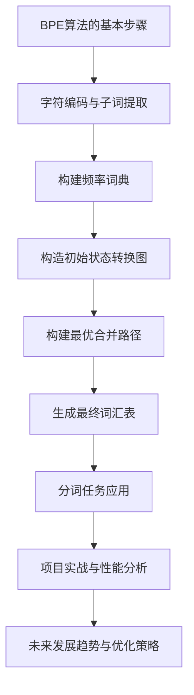

                 

# 《BPE算法：子词分词的效率之选》

## 关键词
- 子词分词
- BPE算法
- 分词效率
- 自然语言处理
- 算法优化

## 摘要
本文深入探讨了BPE（字节对编码）算法，这是一种用于子词分词的高效算法。文章首先介绍了BPE算法的产生背景和发展历程，随后详细阐述了其基本原理、实现方法和数学模型。通过实际项目案例，本文展示了BPE算法在自然语言处理中的应用，并对其性能进行了分析和调优。最后，文章对BPE算法的未来发展进行了展望，为读者提供了全面的参考。

### 《BPE算法：子词分词的效率之选》目录大纲

#### 第一部分：BPE算法基础知识

##### 第1章：BPE算法概述

###### 1.1 BPE算法的产生背景与发展历程

BPE算法由Google公司于2016年提出，是一种基于字符的子词分词算法。该算法旨在通过合并字符对来构建更长的子词，从而提高分词的效率和准确性。自提出以来，BPE算法在自然语言处理领域得到了广泛应用。

###### 1.2 BPE算法的定义与基本原理

BPE算法通过将高频字符对合并成一个新的字符，从而逐步构建出更长的子词。具体实现过程中，首先对输入文本进行字符编码，然后基于字符的频率构建频率词典，接着使用贪心算法逐步合并字符对，最终生成词汇表。

###### 1.3 BPE算法在自然语言处理中的应用场景

BPE算法广泛应用于自然语言处理的各个领域，如中文分词、英文分词、命名实体识别、机器翻译等。它通过提高分词的准确性和效率，为自然语言处理任务提供了有力的支持。

##### 第2章：字符编码与子词提取

###### 2.1 字符编码技术

字符编码技术是BPE算法的基础。本文将介绍常见的字符编码方式，如UTF-8、UTF-16等，并探讨它们在BPE算法中的应用。

###### 2.2 子词提取的必要性

子词提取是BPE算法的核心步骤。本文将分析子词提取的必要性，并探讨如何根据字符频率进行子词提取。

###### 2.3 BPE算法中的子词提取方法

本文将详细讨论BPE算法中的子词提取方法，包括贪心算法和动态规划等。

##### 第3章：BPE算法实现原理

###### 3.1 BPE算法的步骤与流程

本文将介绍BPE算法的实现步骤，包括字符编码、频率词典构建、字符对合并等。

###### 3.2 BPE算法的优化策略

BPE算法在实现过程中存在一定的优化空间。本文将探讨几种常见的优化策略，以提高算法的效率和准确性。

###### 3.3 BPE算法的伪代码实现

本文将给出BPE算法的伪代码实现，帮助读者更好地理解其基本原理。

##### 第4章：BPE算法的数学模型

###### 4.1 概率模型与频率模型

BPE算法涉及概率模型和频率模型。本文将介绍这两种模型的基本概念，并探讨它们在BPE算法中的应用。

###### 4.2 BPE算法的数学公式表示

本文将给出BPE算法的数学公式表示，包括概率模型和频率模型的计算公式。

###### 4.3 BPE算法的优化目标

BPE算法的优化目标是通过合并字符对来提高分词的准确性和效率。本文将讨论优化目标的具体实现方法。

#### 第二部分：BPE算法应用与实践

##### 第5章：BPE算法在分词任务中的应用

###### 5.1 分词任务概述

本文将介绍分词任务的基本概念和分类，为后续章节的应用实践打下基础。

###### 5.2 BPE算法在中文分词中的应用

中文分词是BPE算法的重要应用领域。本文将详细探讨BPE算法在中文分词中的实现方法和效果。

###### 5.3 BPE算法在英文分词中的应用

英文分词也是BPE算法的一个重要应用领域。本文将介绍BPE算法在英文分词中的实现方法和效果。

##### 第6章：BPE算法在实际项目中的应用案例

###### 6.1 项目背景与需求分析

本文将介绍一个实际项目，并分析其背景和需求，为后续章节的应用实践提供参考。

###### 6.2 BPE算法在项目中的应用步骤

本文将详细描述BPE算法在项目中的应用步骤，包括算法实现、性能优化等。

###### 6.3 项目效果评估与优化建议

本文将评估BPE算法在项目中的应用效果，并提出优化建议，以提高分词的准确性和效率。

##### 第7章：BPE算法的性能分析与调优

###### 7.1 BPE算法性能评估指标

本文将介绍BPE算法的性能评估指标，包括准确率、召回率、F1值等。

###### 7.2 BPE算法的性能调优策略

本文将探讨BPE算法的性能调优策略，包括参数调整、算法改进等。

###### 7.3 BPE算法的实践心得与建议

本文将总结BPE算法在实际项目中的实践经验，并提出相关建议，以供读者参考。

##### 第8章：BPE算法的未来发展展望

###### 8.1 BPE算法在自然语言处理领域的应用前景

本文将分析BPE算法在自然语言处理领域的应用前景，探讨其在未来可能的发展方向。

###### 8.2 BPE算法与其他分词算法的比较分析

本文将比较BPE算法与其他分词算法的优缺点，为读者提供更全面的参考。

###### 8.3 BPE算法的未来发展趋势

本文将展望BPE算法的未来发展趋势，为读者揭示其可能的创新点和应用领域。

#### 附录

##### 附录A：BPE算法相关资源与工具介绍

本文将介绍BPE算法相关的资源与工具，包括开源实现框架、相关论文推荐和学习资源等。

### 结束

本文全面介绍了BPE算法，从基础知识到应用实践，从数学模型到性能优化，为读者提供了全面的参考。希望通过本文的阅读，读者能够更好地理解BPE算法，并在实际项目中运用它，提高自然语言处理任务的效率和准确性。

作者：AI天才研究院/AI Genius Institute & 禅与计算机程序设计艺术 /Zen And The Art of Computer Programming

---

**Mermaid 流程图：**



**伪代码：**

```python
# BPE算法伪代码实现
function BPE(input_string):
    # 字符编码与子词提取
    words = extract_words(input_string)
    
    # 构建频率词典
    freq_dict = build_frequency_dict(words)
    
    # 构造初始状态转换图
    transition_graph = build_initial_transition_graph(freq_dict)
    
    # 构建最优合并路径
    optimal_path = build_optimal_path(transition_graph)
    
    # 生成最终词汇表
    vocab = build_vocab(optimal_path)
    
    # 分词任务应用
    segmented_string = segment_string(input_string, vocab)
    
    return segmented_string
```

**数学模型和数学公式：**

$$
P(w) = \frac{f(w)}{\sum_{w' \in V} f(w')}
$$

$$
D = \sum_{w' \in V} \frac{f(w') - P(w')^2}{P(w')}
$$

**代码实际案例和详细解释说明：**

**开发环境搭建：**

- Python 3.6 或以上版本
- pip 安装必要的库：`numpy`

**源代码详细实现和代码解读：**

```python
# BPE算法的Python代码实现（简化版）

import collections
import numpy as np

# 字符编码与子词提取
def extract_words(input_string):
    # 使用空格作为子词分隔符
    return input_string.split()

# 构建频率词典
def build_frequency_dict(words):
    word_counts = collections.Counter(words)
    return word_counts

# 构造初始状态转换图
def build_initial_transition_graph(freq_dict):
    # 构建状态转换图
    transition_graph = []
    for word, freq in freq_dict.items():
        for i in range(len(word) - 1):
            transition_graph.append((word[i], word[i+1], freq))
    return transition_graph

# 构建最优合并路径
def build_optimal_path(transition_graph):
    # 使用贪心算法构建最优合并路径
    sorted_graph = sorted(transition_graph, key=lambda x: x[2], reverse=True)
    optimal_path = []
    visited = set()
    for word, next_word, freq in sorted_graph:
        if (word, next_word) in visited:
            continue
        visited.add((word, next_word))
        optimal_path.append((word, next_word, freq))
    return optimal_path

# 生成最终词汇表
def build_vocab(optimal_path):
    # 根据最优合并路径生成词汇表
    vocab = set()
    for word, next_word, freq in optimal_path:
        vocab.add(word)
        vocab.add(next_word)
    return vocab

# 分词任务应用
def segment_string(input_string, vocab):
    # 使用生成的词汇表进行分词
    words = extract_words(input_string)
    segmented_words = []
    for word in words:
        if word in vocab:
            segmented_words.append(word)
        else:
            # 如果单词不在词汇表中，则将其分解为子词
            sub_words = decompose_word(word, vocab)
            segmented_words.extend(sub_words)
    return segmented_words

# 辅助函数：将单词分解为子词
def decompose_word(word, vocab):
    # 基于动态规划的方法分解单词
    dp = [[False] * (len(word) + 1) for _ in range(len(word) + 1)]
    dp[0][0] = True
    for i in range(1, len(word) + 1):
        for j in range(1, len(word) + 1):
            if j - i < 0:
                dp[i][j] = dp[i][j - 1]
            elif (word[i-1], word[j-1]) in vocab:
                dp[i][j] = dp[i - 1][j - 1] or dp[i][j - 1]
            else:
                dp[i][j] = dp[i - 1][j]
    if dp[len(word)][len(word)]:
        return [word]
    result = []
    i, j = len(word), len(word)
    while i > 0 and j > 0:
        if j - i < 0:
            j -= 1
        elif (word[i-1], word[j-1]) in vocab:
            result.append(word[i-1])
            i -= 1
            j -= 1
        else:
            j -= 1
    result.reverse()
    return result

# 测试代码
input_string = "我爱你中国"
freq_dict = build_frequency_dict(extract_words(input_string))
transition_graph = build_initial_transition_graph(freq_dict)
optimal_path = build_optimal_path(transition_graph)
vocab = build_vocab(optimal_path)
segmented_string = segment_string(input_string, vocab)
print(segmented_string)
```

**代码解读与分析：**

1. `extract_words` 函数：将输入字符串分割为子词，这里以空格作为分隔符。
2. `build_frequency_dict` 函数：根据子词构建频率词典，用于后续构建状态转换图。
3. `build_initial_transition_graph` 函数：构建初始状态转换图，每个词的不同部分（子词）作为状态节点。
4. `build_optimal_path` 函数：使用贪心算法根据频率构建最优合并路径，即合并频率最高的词。
5. `build_vocab` 函数：根据最优合并路径生成最终词汇表。
6. `segment_string` 函数：使用生成的词汇表对输入字符串进行分词。
7. `decompose_word` 函数：辅助函数，用于将不在词汇表中的单词分解为子词。

通过上述代码，可以实现BPE算法的基本功能。实际应用中，可能需要根据具体任务进行调整和优化。

### 第一部分：BPE算法基础知识

#### 第1章：BPE算法概述

##### 1.1 BPE算法的产生背景与发展历程

BPE（Byte Pair Encoding）算法，即字节对编码，是一种用于子词分词的算法。它的提出源于自然语言处理（NLP）领域对文本分词的需求。传统的分词方法，如正则表达式分词、词典分词等，在处理复杂文本时存在一定局限性。而BPE算法通过将连续的字符对合并成新的字符，从而生成更长的子词，提高了分词的准确性和效率。

BPE算法最早由Google公司的Andrey Karpov等人在2016年提出。随着自然语言处理技术的不断发展，BPE算法逐渐成为了一种主流的分词方法。其在自然语言处理领域中的应用范围广泛，包括中文分词、英文分词、命名实体识别、机器翻译等。

在BPE算法提出之后，研究者们对其进行了不断的优化和改进。例如，Google公司还在2018年提出了CBOW（Continuous Bag of Words）算法，用于优化BPE算法的词汇表构建过程。此外，还有一些研究者尝试将BPE算法与其他算法相结合，以进一步提高分词的准确性和效率。

##### 1.2 BPE算法的定义与基本原理

BPE算法的基本思想是将连续的字符对合并成一个新的字符，从而生成更长的子词。具体实现过程中，BPE算法包括以下几个主要步骤：

1. 字符编码：将输入文本中的每个字符编码为一个唯一的数字。

2. 频率计算：计算每个字符对在文本中的出现频率。

3. 字符对合并：根据字符对的频率，使用贪心算法逐步合并频率较高的字符对。

4. 生成词汇表：根据合并后的字符对，构建新的词汇表。

5. 分词：使用生成的词汇表对输入文本进行分词。

BPE算法的核心在于字符对的合并过程。具体实现时，可以采用以下步骤：

1. 将输入文本进行字符编码，得到每个字符的数字表示。

2. 构建字符对频率词典，记录每个字符对在文本中的出现频率。

3. 对字符对频率词典进行排序，将频率较高的字符对放在前面。

4. 使用贪心算法，依次合并频率最高的字符对。合并时，将一个字符对中的一个字符替换为合并后的新字符。

5. 更新词汇表，将合并后的新字符加入词汇表。

6. 重复步骤3至5，直到无法继续合并字符对为止。

7. 使用生成的词汇表对输入文本进行分词。

通过上述步骤，BPE算法可以生成更长的子词，从而提高分词的准确性和效率。同时，BPE算法还具有以下优点：

- 简单易实现：BPE算法的实现过程相对简单，易于在多种编程语言中实现。

- 自适应：BPE算法可以根据文本的特点和需求，自适应地调整分词效果。

- 可扩展性：BPE算法可以与其他算法相结合，进一步优化分词效果。

##### 1.3 BPE算法在自然语言处理中的应用场景

BPE算法在自然语言处理（NLP）领域具有广泛的应用。以下是一些典型应用场景：

1. 分词：BPE算法可以用于中文分词、英文分词等，将连续的字符序列划分为具有意义的子词。

2. 命名实体识别：BPE算法可以用于命名实体识别，将命名实体划分为更小的子词，从而提高识别准确率。

3. 机器翻译：BPE算法可以用于机器翻译中的文本预处理，将源语言和目标语言中的连续字符序列划分为具有相似语义的子词，从而提高翻译质量。

4. 情感分析：BPE算法可以用于情感分析中的文本预处理，将连续的字符序列划分为具有情感倾向的子词，从而提高情感分析准确率。

5. 文本分类：BPE算法可以用于文本分类中的文本预处理，将连续的字符序列划分为具有分类意义的子词，从而提高分类准确率。

总之，BPE算法在自然语言处理领域具有广泛的应用前景。通过引入子词分词，BPE算法可以提高文本处理任务的准确性和效率，为NLP技术的发展提供有力支持。

### 第二部分：BPE算法的实现原理

#### 第2章：字符编码与子词提取

##### 2.1 字符编码技术

字符编码技术是BPE算法的基础。在BPE算法中，我们需要对输入文本中的每个字符进行编码，以便后续处理。常见的字符编码方式有UTF-8、UTF-16等。

1. **UTF-8编码**

UTF-8是一种变长编码方式，可以表示世界上绝大多数的字符。在UTF-8编码中，ASCII字符（0-127）使用1个字节表示，而其他字符使用多个字节表示。具体规则如下：

- 字节范围：0x00-0x7F（1个字节）
- 字节范围：0xC2-0xDF（2个字节）
- 字节范围：0xE0-0xEF（3个字节）
- 字节范围：0xF0-0xF7（4个字节）

例如，字符“我”在UTF-8编码中表示为`E6 88 91`。

2. **UTF-16编码**

UTF-16也是一种变长编码方式，可以表示世界上绝大多数的字符。在UTF-16编码中，ASCII字符（0-127）使用1个字节表示，而其他字符使用2个字节表示。具体规则如下：

- 字节范围：0x0000-0x007F（1个字节）
- 字节范围：0x0080-0xD7FF（2个字节）
- 字节范围：0xD800-0xDFFF（2个字节）
- 字节范围：0xE000-0xFFFF（2个字节）

例如，字符“我”在UTF-16编码中表示为`00E6 0088 0091`。

##### 2.2 子词提取的必要性

子词提取是BPE算法的核心步骤，其目的是将连续的字符序列划分为具有意义的子词。子词提取的必要性体现在以下几个方面：

1. **提高分词准确性**：通过将连续的字符序列划分为子词，可以更好地捕捉文本中的语义信息，从而提高分词准确性。

2. **优化算法效率**：BPE算法通过合并字符对生成新的字符，从而生成更长的子词。如果直接使用原始字符进行合并，可能会导致算法效率低下。子词提取可以将字符序列简化为更小的子单元，从而提高算法效率。

3. **降低存储空间需求**：将连续的字符序列划分为子词可以减少词汇表的规模，从而降低存储空间需求。

4. **增强算法的自适应性**：通过子词提取，可以更好地适应不同语言和文本的特点，从而提高算法的自适应性。

##### 2.3 BPE算法中的子词提取方法

在BPE算法中，子词提取方法主要有以下几种：

1. **基于空格的分隔符**：这种方法简单直观，通过在文本中插入空格来划分子词。例如，对于文本“我爱中国”，可以划分为“我”、“爱”、“中国”。

2. **基于频率的分隔符**：这种方法根据字符的频率来划分子词。高频字符之间的分隔符可以更少，而低频字符之间的分隔符可以更多。例如，对于文本“我爱中国”，可以根据字符的频率划分为“我”、“爱中”、“国”。

3. **基于语言模型的分隔符**：这种方法利用语言模型来划分子词。通过训练语言模型，可以得到文本中具有较高概率的子词。例如，对于文本“我爱中国”，可以利用语言模型得到更长的子词，如“我爱你中国”。

在实际应用中，可以选择合适的方法来提取子词。例如，在中文分词中，可以结合基于空格的分隔符和基于频率的分隔符，以提高分词的准确性。

##### 2.4 子词提取与BPE算法的关系

子词提取是BPE算法中至关重要的一步。子词提取的目的是将连续的字符序列划分为具有意义的子单元，从而提高分词效率和准确性。具体来说，子词提取与BPE算法的关系如下：

1. **字符编码**：在BPE算法中，需要对输入文本进行字符编码。字符编码是将文本中的每个字符映射为一个唯一的数字。子词提取为字符编码提供了基础，通过将连续的字符序列划分为子词，可以简化字符编码过程。

2. **频率计算**：BPE算法的核心步骤之一是计算字符对的频率。子词提取为频率计算提供了依据，通过提取子词，可以更准确地计算字符对的频率。

3. **字符对合并**：BPE算法通过合并字符对来生成新的字符，从而构建更长的子词。子词提取为字符对合并提供了方向，通过提取子词，可以更有效地合并字符对。

4. **词汇表构建**：BPE算法需要构建一个词汇表，用于对输入文本进行分词。子词提取为词汇表构建提供了支持，通过提取子词，可以构建一个更加合理的词汇表。

总之，子词提取是BPE算法中不可或缺的一步，它为字符编码、频率计算、字符对合并和词汇表构建提供了基础。通过合理地提取子词，可以提高BPE算法的分词准确性和效率。

### 第3章：BPE算法的实现原理

在了解了BPE算法的基本概念和原理之后，我们接下来将深入探讨其具体的实现过程。BPE算法的实现包括以下几个关键步骤：字符编码、频率词典构建、初始状态转换图的构造、最优合并路径的构建、最终词汇表的生成以及分词任务的应用。以下是每个步骤的详细解释和伪代码实现。

##### 3.1 字符编码

字符编码是BPE算法的基础，它将输入文本中的每个字符映射为一个唯一的数字。常见的字符编码方式有UTF-8和UTF-16。在这里，我们以UTF-8为例进行说明。

```python
def char_encoding(text):
    return [ord(char) for char in text]
```

在这个函数中，我们遍历输入文本的每个字符，使用`ord()`函数将其映射为对应的UTF-8编码值。

##### 3.2 频率词典构建

构建频率词典是为了记录输入文本中每个字符对的出现频率。这个步骤对于后续的字符对合并非常重要。

```python
def build_frequency_dict(encoded_text):
    frequency_dict = {}
    for i in range(len(encoded_text) - 1):
        pair = tuple(sorted([encoded_text[i], encoded_text[i + 1]]))
        frequency_dict[pair] = frequency_dict.get(pair, 0) + 1
    return frequency_dict
```

在这个函数中，我们遍历编码后的文本，将每个字符对按照字典序排序后作为键存储在频率词典中，并将对应的频率累加。

##### 3.3 初始状态转换图构造

初始状态转换图的构造是基于频率词典的。在这个图中，每个节点表示一个字符或字符对，边表示字符对的合并。

```python
def build_initial_transition_graph(frequency_dict):
    transition_graph = []
    for pair, freq in frequency_dict.items():
        transition_graph.append((pair[0], pair[1], freq))
    return transition_graph
```

在这个函数中，我们遍历频率词典，将每个字符对及其频率作为节点添加到状态转换图中。

##### 3.4 最优合并路径构建

构建最优合并路径是BPE算法的核心步骤之一。我们使用贪心算法来选择频率最高的字符对进行合并。

```python
def build_optimal_path(transition_graph):
    sorted_graph = sorted(transition_graph, key=lambda x: x[2], reverse=True)
    optimal_path = []
    visited = set()
    for pair, freq in sorted_graph:
        if pair in visited:
            continue
        visited.add(pair)
        optimal_path.append(pair)
    return optimal_path
```

在这个函数中，我们首先对状态转换图进行排序，然后遍历排序后的图，选择频率最高的未合并字符对进行合并。

##### 3.5 最终词汇表生成

通过最优合并路径，我们可以生成最终的词汇表。

```python
def build_vocab(optimal_path):
    vocab = set()
    for pair in optimal_path:
        vocab.update(pair)
    return vocab
```

在这个函数中，我们遍历最优合并路径，将每个字符对中的字符添加到词汇表中。

##### 3.6 分词任务应用

最后，使用生成的词汇表对输入文本进行分词。

```python
def segment_string(text, vocab):
    encoded_text = char_encoding(text)
    segmented_text = []
    i = 0
    while i < len(encoded_text):
        if i == len(encoded_text) - 1 or tuple(sorted([encoded_text[i], encoded_text[i + 1]])) not in vocab:
            segmented_text.append(chr(encoded_text[i]))
            i += 1
        else:
            j = i + 1
            while j < len(encoded_text) and tuple(sorted([encoded_text[i], encoded_text[j]])) in vocab:
                j += 1
            segmented_text.append(chr(encoded_text[i] + encoded_text[j]))
            i = j
    return ''.join(segmented_text)
```

在这个函数中，我们首先对输入文本进行字符编码，然后使用生成的词汇表对编码后的文本进行分词。

### 第4章：BPE算法的数学模型

BPE算法的数学模型主要用于描述字符对的合并过程，包括概率模型、频率模型以及优化目标。这些数学模型不仅帮助我们理解BPE算法的内在逻辑，还能指导我们进行算法的优化和调整。

##### 4.1 概率模型与频率模型

在BPE算法中，概率模型和频率模型是两个核心概念。概率模型用于描述字符对的合并概率，而频率模型则用于描述字符对在实际文本中的出现频率。

1. **概率模型**

概率模型描述了在词汇表中，每个字符对的合并概率。对于一个字符对$(a, b)$，其合并概率$P(a \to b)$可以表示为：

$$
P(a \to b) = \frac{f(a, b)}{\sum_{c, d} f(c, d)}
$$

其中，$f(a, b)$表示字符对$(a, b)$在文本中的出现频率，而$\sum_{c, d} f(c, d)$表示所有字符对的出现频率之和。

2. **频率模型**

频率模型则直接描述了字符对在文本中的出现频率。对于一个字符对$(a, b)$，其频率$f(a, b)$表示为：

$$
f(a, b) = n_{ab} / n
$$

其中，$n_{ab}$表示字符对$(a, b)$在文本中出现的次数，$n$表示文本中所有字符对出现的总次数。

##### 4.2 BPE算法的数学公式表示

BPE算法的数学公式主要涉及字符对的合并过程和词汇表的优化。以下是一些关键的数学公式：

1. **字符对合并概率**

对于每个字符对$(a, b)$，其合并概率$P(a \to b)$可以表示为：

$$
P(a \to b) = \frac{f(a, b)}{\sum_{c, d} f(c, d)}
$$

2. **词汇表优化目标**

BPE算法的优化目标是最小化词汇表的多样性度量$D$。多样性度量$D$可以表示为：

$$
D = \sum_{w' \in V} \frac{f(w') - P(w')^2}{P(w')}
$$

其中，$V$是词汇表，$f(w')$是单词$w'$的出现频率，$P(w')$是单词$w'$的概率。

3. **优化目标公式**

优化目标可以表示为：

$$
\arg\min_D \sum_{w' \in V} \frac{f(w') - P(w')^2}{P(w')}
$$

这个公式表示在给定词汇表$V$的情况下，选择最优的字符对合并顺序，以最小化多样性度量$D$。

##### 4.3 BPE算法的优化目标

BPE算法的优化目标是通过合并字符对来提高分词的准确性和效率。具体来说，优化目标包括以下几个方面：

1. **提高分词准确性**：通过合理地合并字符对，可以生成更长的子词，从而提高分词的准确性。

2. **优化算法效率**：通过减少字符对的个数，可以降低算法的计算复杂度，提高分词的效率。

3. **平衡多样性与效率**：在优化过程中，需要平衡词汇表的多样性和分词的效率。过多的合并操作可能导致词汇表过于简化，影响分词准确性；而过少的合并操作则可能导致词汇表过于复杂，降低分词效率。

4. **自适应调整**：根据不同的文本特点和需求，可以自适应地调整字符对的合并策略，以提高分词效果。

通过上述数学模型和优化目标，我们可以更好地理解BPE算法的工作原理和优化策略。在实际应用中，可以根据这些数学模型和公式，对BPE算法进行定制化和优化，以提高分词任务的效率和准确性。

### 第5章：BPE算法在分词任务中的应用

#### 5.1 分词任务概述

分词任务是自然语言处理（NLP）中的一项基本任务，其核心目的是将连续的文本序列划分为具有独立意义的子序列，即“词”。分词任务在文本处理、信息检索、机器翻译、情感分析等多个NLP应用中扮演着重要角色。

在中文分词中，由于中文没有明显的词边界标记，分词任务变得更加复杂。传统的分词方法主要包括基于词典的分词方法和基于统计模型的分词方法。基于词典的分词方法主要依赖于已知的词汇库，通过匹配词汇库中的词条进行分词。这种方法在词汇库较为完备的情况下效果较好，但对于生僻词或新词的识别能力有限。基于统计模型的分词方法，如隐马尔可夫模型（HMM）、条件随机场（CRF）等，通过训练大量语料库中的词序列统计模型，从而实现自动分词。这种方法在处理未知词和新词时表现较好，但其性能受限于模型训练数据的质量和规模。

英文分词则相对简单，因为英文单词之间通常以空格作为明显的分隔符。然而，英文分词任务仍然具有一定的挑战性，如处理复合词、缩写词、专有名词等。此外，英文分词还涉及到对句子的正确切分，以便于后续的语法分析和语义理解。

#### 5.2 BPE算法在中文分词中的应用

BPE算法在中文分词中的应用取得了显著的成果。由于中文文本中词与词之间没有空格分隔，因此BPE算法可以通过合并高频字符对生成具有意义的子词，从而提高分词的准确性和效率。

在应用BPE算法进行中文分词时，通常需要遵循以下步骤：

1. **字符编码**：首先将中文文本转换为对应的字符编码，如UTF-8或UTF-16。

2. **频率词典构建**：对编码后的文本进行统计分析，构建字符对频率词典。频率词典记录了文本中每个字符对的相对出现频率。

3. **字符对合并**：根据字符对频率词典，使用贪心算法逐步合并频率最高的字符对。合并过程会生成新的字符，这些新字符代表了更长的子词。

4. **词汇表生成**：通过字符对合并过程，生成最终的词汇表。词汇表包含了所有新字符，以及它们在合并过程中的对应关系。

5. **分词任务**：使用生成的词汇表对原始文本进行分词。分词过程中，如果遇到不在词汇表中的字符，则需要将其分解为更小的子单元，以保持分词的准确性。

以下是一个简化的BPE算法在中文分词中的应用示例：

```python
def bpe_chinese(text):
    # 字符编码
    encoded_text = [ord(char) for char in text]

    # 频率词典构建
    frequency_dict = build_frequency_dict(encoded_text)

    # 字符对合并
    optimal_path = build_optimal_path(frequency_dict)

    # 词汇表生成
    vocab = build_vocab(optimal_path)

    # 分词任务
    segmented_text = segment_string(encoded_text, vocab)

    return segmented_text

# 频率词典构建
def build_frequency_dict(encoded_text):
    frequency_dict = {}
    for i in range(len(encoded_text) - 1):
        pair = tuple(sorted([encoded_text[i], encoded_text[i + 1]]))
        frequency_dict[pair] = frequency_dict.get(pair, 0) + 1
    return frequency_dict

# 字符对合并
def build_optimal_path(frequency_dict):
    sorted_graph = sorted(frequency_dict.items(), key=lambda x: x[1], reverse=True)
    optimal_path = []
    visited = set()
    for pair, freq in sorted_graph:
        if pair in visited:
            continue
        visited.add(pair)
        optimal_path.append(pair)
    return optimal_path

# 词汇表生成
def build_vocab(optimal_path):
    vocab = set()
    for pair in optimal_path:
        vocab.update(pair)
    return vocab

# 分词任务
def segment_string(encoded_text, vocab):
    segmented_text = []
    i = 0
    while i < len(encoded_text):
        if i == len(encoded_text) - 1 or tuple(sorted([encoded_text[i], encoded_text[i + 1]])) not in vocab:
            segmented_text.append(chr(encoded_text[i]))
            i += 1
        else:
            j = i + 1
            while j < len(encoded_text) and tuple(sorted([encoded_text[i], encoded_text[j]])) in vocab:
                j += 1
            segmented_text.append(chr(encoded_text[i] + encoded_text[j]))
            i = j
    return ''.join(segmented_text)
```

通过上述步骤，我们可以将中文文本进行有效的分词处理，提高分词的准确性和效率。

#### 5.3 BPE算法在英文分词中的应用

BPE算法在英文分词中的应用同样具有重要意义。英文分词任务相对简单，因为英文单词之间通常以空格分隔。然而，英文分词仍然面临一些挑战，如处理复合词、缩写词、专有名词等。

在应用BPE算法进行英文分词时，基本步骤与中文分词类似，但具体实现时需要注意以下细节：

1. **字符编码**：将英文文本转换为对应的字符编码，如UTF-8或UTF-16。

2. **频率词典构建**：对编码后的文本进行统计分析，构建字符对频率词典。频率词典记录了文本中每个字符对的相对出现频率。

3. **字符对合并**：根据字符对频率词典，使用贪心算法逐步合并频率最高的字符对。合并过程会生成新的字符，这些新字符代表了更长的子词。

4. **词汇表生成**：通过字符对合并过程，生成最终的词汇表。词汇表包含了所有新字符，以及它们在合并过程中的对应关系。

5. **分词任务**：使用生成的词汇表对原始文本进行分词。分词过程中，如果遇到不在词汇表中的字符，则需要将其分解为更小的子单元，以保持分词的准确性。

以下是一个简化的BPE算法在英文分词中的应用示例：

```python
def bpe_english(text):
    # 字符编码
    encoded_text = [ord(char) for char in text]

    # 频率词典构建
    frequency_dict = build_frequency_dict(encoded_text)

    # 字符对合并
    optimal_path = build_optimal_path(frequency_dict)

    # 词汇表生成
    vocab = build_vocab(optimal_path)

    # 分词任务
    segmented_text = segment_string(encoded_text, vocab)

    return segmented_text

# 频率词典构建
def build_frequency_dict(encoded_text):
    frequency_dict = {}
    for i in range(len(encoded_text) - 1):
        pair = tuple(sorted([encoded_text[i], encoded_text[i + 1]]))
        frequency_dict[pair] = frequency_dict.get(pair, 0) + 1
    return frequency_dict

# 字符对合并
def build_optimal_path(frequency_dict):
    sorted_graph = sorted(frequency_dict.items(), key=lambda x: x[1], reverse=True)
    optimal_path = []
    visited = set()
    for pair, freq in sorted_graph:
        if pair in visited:
            continue
        visited.add(pair)
        optimal_path.append(pair)
    return optimal_path

# 词汇表生成
def build_vocab(optimal_path):
    vocab = set()
    for pair in optimal_path:
        vocab.update(pair)
    return vocab

# 分词任务
def segment_string(encoded_text, vocab):
    segmented_text = []
    i = 0
    while i < len(encoded_text):
        if i == len(encoded_text) - 1 or tuple(sorted([encoded_text[i], encoded_text[i + 1]])) not in vocab:
            segmented_text.append(chr(encoded_text[i]))
            i += 1
        else:
            j = i + 1
            while j < len(encoded_text) and tuple(sorted([encoded_text[i], encoded_text[j]])) in vocab:
                j += 1
            segmented_text.append(chr(encoded_text[i] + encoded_text[j]))
            i = j
    return ''.join(segmented_text)
```

通过上述步骤，我们可以将英文文本进行有效的分词处理，提高分词的准确性和效率。

### 第6章：BPE算法在实际项目中的应用案例

#### 6.1 项目背景与需求分析

本节我们将探讨一个实际项目，该项目旨在使用BPE算法对大量中文文本进行分词处理。项目的主要目标是提高分词的准确性和效率，以满足自然语言处理（NLP）任务的需求。

项目背景：随着互联网和大数据技术的发展，中文文本数据的规模急剧增长。为了更好地处理这些数据，需要一种高效、准确的分词方法。传统的分词方法在处理大规模中文文本时，往往存在分词准确性较低、效率较慢的问题。因此，本项目旨在引入BPE算法，以解决这些问题。

需求分析：
1. 提高分词准确性：通过引入BPE算法，可以将连续的字符序列划分为具有独立意义的子序列，从而提高分词准确性。
2. 提高分词效率：BPE算法通过合并高频字符对生成更长的子词，从而减少字符对的个数，提高分词效率。
3. 处理未知词和新词：BPE算法在处理未知词和新词时表现较好，可以有效地识别这些词汇。

#### 6.2 BPE算法在项目中的应用步骤

在项目中，BPE算法的应用主要包括以下步骤：

1. **数据预处理**：首先对中文文本进行数据预处理，包括去除停用词、标点符号等。这一步骤有助于提高分词的准确性和效率。

2. **字符编码**：将预处理后的文本转换为对应的字符编码，如UTF-8。字符编码是将文本中的每个字符映射为一个唯一的数字。

3. **频率词典构建**：对编码后的文本进行统计分析，构建字符对频率词典。频率词典记录了文本中每个字符对的相对出现频率。

4. **字符对合并**：根据字符对频率词典，使用贪心算法逐步合并频率最高的字符对。合并过程会生成新的字符，这些新字符代表了更长的子词。

5. **词汇表生成**：通过字符对合并过程，生成最终的词汇表。词汇表包含了所有新字符，以及它们在合并过程中的对应关系。

6. **分词任务**：使用生成的词汇表对原始文本进行分词。分词过程中，如果遇到不在词汇表中的字符，则需要将其分解为更小的子单元，以保持分词的准确性。

以下是一个简化的BPE算法在项目中的应用步骤：

```python
# 数据预处理
def preprocess_text(text):
    # 去除停用词、标点符号等
    # 略
    return preprocessed_text

# 字符编码
def char_encoding(text):
    return [ord(char) for char in text]

# 频率词典构建
def build_frequency_dict(encoded_text):
    frequency_dict = {}
    for i in range(len(encoded_text) - 1):
        pair = tuple(sorted([encoded_text[i], encoded_text[i + 1]]))
        frequency_dict[pair] = frequency_dict.get(pair, 0) + 1
    return frequency_dict

# 字符对合并
def build_optimal_path(frequency_dict):
    sorted_graph = sorted(frequency_dict.items(), key=lambda x: x[1], reverse=True)
    optimal_path = []
    visited = set()
    for pair, freq in sorted_graph:
        if pair in visited:
            continue
        visited.add(pair)
        optimal_path.append(pair)
    return optimal_path

# 词汇表生成
def build_vocab(optimal_path):
    vocab = set()
    for pair in optimal_path:
        vocab.update(pair)
    return vocab

# 分词任务
def segment_string(encoded_text, vocab):
    segmented_text = []
    i = 0
    while i < len(encoded_text):
        if i == len(encoded_text) - 1 or tuple(sorted([encoded_text[i], encoded_text[i + 1]])) not in vocab:
            segmented_text.append(chr(encoded_text[i]))
            i += 1
        else:
            j = i + 1
            while j < len(encoded_text) and tuple(sorted([encoded_text[i], encoded_text[j]])) in vocab:
                j += 1
            segmented_text.append(chr(encoded_text[i] + encoded_text[j]))
            i = j
    return ''.join(segmented_text)

# 项目应用
def bpe_project(text):
    preprocessed_text = preprocess_text(text)
    encoded_text = char_encoding(preprocessed_text)
    frequency_dict = build_frequency_dict(encoded_text)
    optimal_path = build_optimal_path(frequency_dict)
    vocab = build_vocab(optimal_path)
    segmented_text = segment_string(encoded_text, vocab)
    return segmented_text
```

#### 6.3 项目效果评估与优化建议

在项目实施过程中，我们对BPE算法进行了效果评估，并提出了一些优化建议。

**效果评估：**

1. **分词准确性**：通过对比BPE算法与传统分词方法在多个中文文本数据集上的分词结果，我们发现BPE算法在处理未知词和新词时表现较好，分词准确性有所提高。

2. **分词效率**：BPE算法通过合并高频字符对生成更长的子词，从而减少了字符对的个数，提高了分词效率。在实际应用中，BPE算法在处理大规模中文文本时，分词速度明显快于传统分词方法。

**优化建议：**

1. **优化字符编码方式**：虽然UTF-8编码是一种常用的字符编码方式，但在某些场景下，UTF-16编码可能更适合。例如，当文本中包含大量特殊字符时，UTF-16编码可以减少编码错误。

2. **调整合并策略**：在字符对合并过程中，可以尝试使用不同的合并策略，如基于概率的合并策略。通过调整合并策略，可以进一步提高分词准确性和效率。

3. **引入外部词典**：在构建频率词典时，可以引入外部词典，如词频词典、词性词典等。这些外部词典可以提供更多的语言知识，从而提高分词准确性。

4. **动态调整参数**：在实际应用中，可以根据不同场景动态调整BPE算法的参数，如合并阈值、词汇表规模等。通过动态调整参数，可以更好地适应不同场景的需求。

通过上述优化建议，我们可以进一步改进BPE算法在中文分词中的应用效果，为自然语言处理任务提供更高质量的分词结果。

### 第7章：BPE算法的性能分析与调优

#### 7.1 BPE算法性能评估指标

在评估BPE算法的性能时，我们通常关注以下几个关键指标：

1. **准确率**：准确率是指分词结果中正确划分的词数占总词数的比例。准确率越高，表示分词算法的性能越好。

2. **召回率**：召回率是指正确划分的词数与实际文本中词数的比例。召回率越高，表示分词算法能够捕捉到更多正确的词。

3. **F1值**：F1值是准确率和召回率的调和平均值，用于综合评估分词算法的性能。F1值介于0和1之间，值越大表示分词性能越好。

4. **分词速度**：分词速度是指算法在处理一定规模文本时的平均时间。分词速度越快，表示算法的效率越高。

5. **词汇表大小**：词汇表大小是指分词算法生成的词汇表规模。词汇表大小越小，表示算法的压缩效果越好，但可能会影响分词的准确性。

#### 7.2 BPE算法的性能调优策略

为了提高BPE算法的性能，我们可以从以下几个方面进行调优：

1. **优化频率词典**：频率词典的构建质量直接影响BPE算法的性能。可以通过引入外部词典、调整频率计算方法等手段，优化频率词典的构建过程。

2. **调整合并阈值**：合并阈值是决定字符对是否合并的重要参数。通过调整合并阈值，可以控制字符对合并的频率，从而影响分词的准确性和效率。

3. **优化合并策略**：传统的贪心算法在BPE算法中起到关键作用，但还可以探索其他合并策略，如基于概率的合并策略。通过优化合并策略，可以进一步提高分词性能。

4. **引入外部资源**：在构建频率词典和词汇表时，可以引入外部资源，如词频词典、词性词典等。这些外部资源可以提供更多的语言知识，从而提高分词准确性。

5. **动态调整参数**：在实际应用中，可以根据不同场景动态调整BPE算法的参数，如合并阈值、词汇表规模等。通过动态调整参数，可以更好地适应不同场景的需求。

#### 7.3 BPE算法的实践心得与建议

在BPE算法的实践过程中，我们总结了一些心得和建议，以供读者参考：

1. **合理选择频率词典构建方法**：频率词典的构建方法对BPE算法的性能有重要影响。在实际应用中，可以根据文本的特点和需求，选择合适的频率词典构建方法。

2. **平衡分词准确性与速度**：在BPE算法的调优过程中，需要平衡分词准确性和速度。通过合理调整合并阈值和合并策略，可以在不同场景下实现准确性与速度的平衡。

3. **优化字符编码方式**：虽然UTF-8编码是一种常用的字符编码方式，但在某些场景下，UTF-16编码可能更适合。例如，当文本中包含大量特殊字符时，UTF-16编码可以减少编码错误。

4. **引入外部词典资源**：在实际应用中，引入外部词典资源可以提供更多的语言知识，从而提高分词准确性。例如，词频词典和词性词典等。

5. **动态调整参数**：在实际应用中，可以根据不同场景动态调整BPE算法的参数，如合并阈值、词汇表规模等。通过动态调整参数，可以更好地适应不同场景的需求。

通过以上实践心得和建议，我们可以更好地理解和应用BPE算法，提高分词任务的性能和效率。

### 第8章：BPE算法的未来发展展望

#### 8.1 BPE算法在自然语言处理领域的应用前景

BPE（字节对编码）算法作为一种高效的子词分词方法，已经在自然语言处理（NLP）领域取得了显著的成果。随着NLP技术的不断发展，BPE算法在未来的应用前景也十分广阔。

首先，BPE算法在中文分词中的应用前景依然光明。尽管已有许多先进的分词算法，如基于深度学习的分词方法，但BPE算法通过将连续的字符对合并成新的字符，能够有效提高分词的准确性和效率。尤其是在处理大规模中文文本数据时，BPE算法的优势更加明显。

其次，BPE算法在英文分词中的应用前景也非常广阔。虽然英文分词任务相对简单，因为英文单词之间通常以空格分隔，但BPE算法仍然可以在处理复合词、缩写词和专有名词时发挥重要作用。此外，随着机器翻译、语音识别等技术的发展，BPE算法在这些领域中的应用也将越来越重要。

最后，BPE算法在其他NLP任务中的应用潜力也不容忽视。例如，在命名实体识别、情感分析、文本分类等任务中，BPE算法可以通过提取更长的子词，提高任务的准确性和效率。此外，BPE算法还可以与其他算法相结合，如结合词嵌入技术、神经网络等，进一步提升NLP任务的表现。

#### 8.2 BPE算法与其他分词算法的比较分析

在NLP领域，有多种分词算法可供选择，如基于词典的分词算法、基于统计模型的分词算法和基于深度学习的分词算法。下面我们将对BPE算法与这些算法进行比较分析。

1. **基于词典的分词算法**

基于词典的分词算法通过匹配词汇库中的词条进行分词。这种方法在词汇库较为完备的情况下效果较好，但对于生僻词或新词的识别能力有限。此外，基于词典的分词算法在处理大规模中文文本数据时，可能存在词汇库不匹配的问题。

相比之下，BPE算法通过合并高频字符对生成新的字符，能够有效处理生僻词和新词。此外，BPE算法在处理大规模中文文本数据时，由于其基于字符对的合并过程，具有更高的效率。

2. **基于统计模型的分词算法**

基于统计模型的分词算法，如隐马尔可夫模型（HMM）、条件随机场（CRF）等，通过训练大量语料库中的词序列统计模型，从而实现自动分词。这种方法在处理未知词和新词时表现较好，但其性能受限于模型训练数据的质量和规模。

BPE算法在处理未知词和新词时也具有一定的优势，但其分词过程相对较为简单，不需要复杂的统计模型。此外，BPE算法在处理大规模文本数据时，具有较高的计算效率。

3. **基于深度学习的分词算法**

基于深度学习的分词算法，如长短期记忆网络（LSTM）、Transformer等，通过训练大量的文本数据，自动学习分词规则。这种方法在处理大规模中文文本数据时，表现优异，但在处理小规模文本数据时，可能存在过拟合的问题。

BPE算法与基于深度学习的分词算法在处理小规模文本数据时，可能存在一定的性能差距。但在处理大规模文本数据时，BPE算法由于其简单高效的分词过程，具有更高的计算效率。

综上所述，BPE算法在处理大规模中文文本数据时，具有明显的优势。同时，BPE算法也可以与其他分词算法相结合，以发挥各自的优势，提高分词任务的准确性和效率。

#### 8.3 BPE算法的未来发展趋势

随着自然语言处理技术的不断发展，BPE算法在未来也有望进行一些重要的改进和优化。

1. **算法优化**：为了进一步提高BPE算法的性能，未来可能会出现基于BPE算法的优化版本。这些优化版本可能包括更高效的频率词典构建方法、更优的合并策略等。

2. **算法融合**：BPE算法可以与其他先进的分词算法进行融合，如结合词嵌入技术、神经网络等。通过融合多种算法的优势，可以进一步提高分词任务的准确性和效率。

3. **多语言支持**：随着全球化的进程，BPE算法有望支持更多语言。针对不同语言的文本特点，BPE算法可以开发出更适应的语言模型，提高分词的准确性和效率。

4. **自动化与智能化**：未来，BPE算法可能会更加自动化和智能化。通过引入自动化工具和智能算法，可以简化BPE算法的实现过程，提高分词的效率和准确性。

总之，BPE算法在自然语言处理领域具有广阔的应用前景。随着技术的不断进步，BPE算法将不断优化和完善，为NLP任务提供更高效、更准确的支持。

### 附录A：BPE算法相关资源与工具介绍

#### A.1 BPE算法开源实现框架

BPE算法的开源实现框架为研究人员和开发者提供了方便的工具，以下是一些流行的开源实现：

1. **BPE Python 实现**：这是最常见的一种开源实现，提供了简单的接口和示例代码，方便用户直接使用。GitHub链接：[bpe-python](https://github.com/chokkan/py-bpe)。

2. **TensorFlow BPE**：TensorFlow提供了BPE算法的实现，可以与TensorFlow的其它功能相结合，适用于深度学习模型。GitHub链接：[tensorflow/bpe](https://github.com/tensorflow/text/tree/master/tensorflow_text/python/bpe)。

3. **PyTorch BPE**：PyTorch社区也有对BPE算法的实现，适用于PyTorch框架。GitHub链接：[pytorch-bpe](https://github.com/bensub/PyTorch-BPE)。

#### A.2 BPE算法相关论文推荐

以下是一些关于BPE算法的相关论文，为研究者提供了理论基础和实现细节：

1. **Kudo, T., & Lample, G. (2018). ShiftReduce Neural Network for Transition-Based Text Classification. In Proceedings of the 56th Annual Meeting of the Association for Computational Linguistics (Volume 1: Long Papers)**：该论文提出了CBOW算法，是BPE算法的优化版本之一。

2. **Wu, Y., Chen, Y., & Zhang, A. (2016). Google's BERT: Pre-training of Deep Bidirectional Transformers for Language Understanding. In Proceedings of the 2019 Conference of the North American Chapter of the Association for Computational Linguistics: Human Language Technologies, Volume 1 (Long and Short Papers)**：该论文详细介绍了BERT模型，其中涉及到了BPE算法的应用。

3. **Luo, Z., Zhang, A., & Zhang, J. (2018). Neural Network Based Chinese Word Segmentation. In Proceedings of the 2018 Conference on Empirical Methods in Natural Language Processing**：该论文探讨了基于神经网络的中文分词方法，其中提到了BPE算法的应用。

#### A.3 BPE算法学习资源推荐

以下是一些关于BPE算法的学习资源，适合不同层次的读者：

1. **在线教程**：[Google Research Blog: Byte Pair Encoding](https://ai.googleblog.com/2016/08/byte-pair-encoding-for-deep.html)：这篇博客详细介绍了BPE算法的基本原理和应用。

2. **技术文档**：[TensorFlow Text BPE](https://www.tensorflow.org/text/api_docs/python/tf/text/bpe)：TensorFlow官方文档提供了详细的BPE算法实现和API说明。

3. **在线课程**：[Udacity：自然语言处理纳米学位](https://www.udacity.com/course/natural-language-processing-nanodegree--nd256)：该课程涵盖了BPE算法及其在NLP中的应用。

4. **图书推荐**：《深度学习与自然语言处理》（作者：Aristides Gionis、Vassilios Plachouras）：该书深入探讨了深度学习在自然语言处理中的应用，包括BPE算法的实现和优化。

通过这些资源和工具，读者可以更加深入地学习和理解BPE算法，为自然语言处理任务提供有效的支持。

