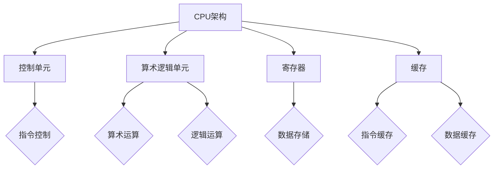
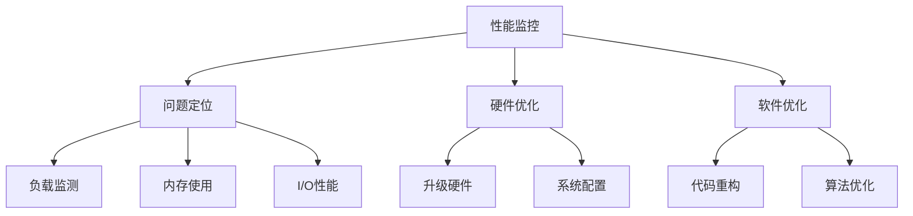

                 

# CPU 优化：充分利用处理器

## 概述

CPU（中央处理器）是计算机系统的核心组件，它负责执行程序指令、处理数据，并且控制计算机的所有操作。然而，许多系统在使用CPU时并没有充分发挥其潜力。CPU优化不仅是提高计算机性能的重要手段，也是优化应用程序效率的关键环节。

本文将带领读者深入理解CPU的优化，通过以下几个部分展开讨论：

- **CPU基础知识**：介绍CPU的基本概念、架构发展历程以及核心与线程。
- **CPU核心技术与优化**：探讨CPU缓存机制、预取技术、指令调度与重排以及多线程与并行处理。
- **CPU频率与功耗优化**：讲解CPU频率控制机制、功耗管理技术以及实践方法。
- **CPU性能监控与调试**：介绍性能监控工具、硬件与软件瓶颈分析以及调试技巧。
- **CPU优化项目实战**：通过实际案例展示CPU优化项目的实施过程、结果与分析。
- **总结与展望**：对CPU优化进行总结，分析未来趋势并展望发展方向。

关键词：CPU优化、性能监控、调试、频率与功耗优化、核心技术与算法

## 目录大纲

### 第一部分：CPU基础知识

#### 第1章：CPU简介

1.1 CPU概述

1.2 CPU架构发展历程

1.3 CPU核心与线程

#### 第2章：CPU核心技术与优化

2.1 CPU缓存机制

2.2 预取技术

2.3 指令调度与重排

2.4 多线程与并行处理

#### 第3章：CPU频率与功耗优化

3.1 CPU频率控制机制

3.2 功耗管理技术

3.3 频率与功耗优化实践

### 第二部分：CPU性能监控与调试

#### 第4章：CPU性能监控工具

4.1 性能监控基础知识

4.2 Linux性能监控工具

4.3 Windows性能监控工具

#### 第5章：CPU性能优化实践

5.1 硬件瓶颈分析

5.2 软件瓶颈分析

5.3 性能优化案例解析

#### 第6章：CPU调试技巧

6.1 CPU调试基础

6.2 指令级调试

6.3 线程级调试

### 第三部分：CPU优化项目实战

#### 第7章：CPU优化项目环境搭建

7.1 环境准备

7.2 软件安装与配置

7.3 硬件调试工具安装

#### 第8章：CPU优化项目案例

8.1 项目背景

8.2 项目目标

8.3 项目实施

8.4 项目结果与分析

#### 第9章：CPU优化总结与展望

9.1 CPU优化总结

9.2 CPU优化趋势分析

9.3 未来展望

### 附录

#### 附录A：CPU优化相关资源

A.1 学术论文推荐

A.2 技术博客推荐

A.3 开源项目推荐

#### 附录B：Mermaid流程图

B.1 CPU架构流程图

B.2 CPU优化流程图

#### 附录C：核心算法原理伪代码

C.1 缓存机制伪代码

C.2 预取技术伪代码

C.3 指令调度与重排伪代码

#### 附录D：数学模型与公式

D.1 CPU频率控制模型

D.2 功耗管理模型

D.3 多线程与并行处理模型

#### 附录E：实战项目代码解读

E.1 项目代码结构

E.2 代码实现与解析

E.3 代码优化与分析

## 第一部分：CPU基础知识

### 第1章：CPU简介

CPU是计算机系统中的核心部件，负责执行计算机程序中的指令，处理数据并控制计算机的操作。在计算机架构中，CPU起着至关重要的作用，是计算机处理速度和性能的关键因素。

#### 1.1 CPU概述

CPU通常由以下几个主要部分组成：

1. **控制单元（Control Unit）**：控制CPU的操作，解释指令并将其发送到相应的处理单元。
2. **算术逻辑单元（Arithmetic Logic Unit, ALU）**：执行算术运算和逻辑运算。
3. **寄存器（Registers）**：用于存储指令、数据或地址，以便快速访问。
4. **缓存（Cache）**：用于存储常用指令和数据，以减少访问主存的延迟。

CPU的工作原理可以概括为以下几个步骤：

1. **取指令（Fetch）**：CPU从内存中读取下一条指令。
2. **解码（Decode）**：CPU解释指令的含义并准备执行操作。
3. **执行（Execute）**：CPU执行指令，可能涉及ALU或其他寄存器。
4. **写回（Write-back）**：将操作结果写回内存或寄存器。

#### 1.2 CPU架构发展历程

CPU架构的发展历程可以追溯到20世纪40年代，当时的第一代计算机采用电子管作为逻辑元件。随着技术的发展，CPU逐渐演变成更加复杂和高效的架构。以下是几个重要的CPU架构发展节点：

1. **冯诺伊曼架构**：1940年代末至1950年代初期，由约翰·冯诺伊曼提出，其特点是将程序指令和数据存储在同一内存中。
2. **RISC（精简指令集计算机）**：1980年代，RISC架构采用简化的指令集和硬布线逻辑，以提高指令执行速度。
3. **CISC（复杂指令集计算机）**：与RISC相对，CISC架构拥有更多的指令集和更复杂的指令执行逻辑。
4. **Superscalar和VLIW（超标量与可扩展指令集计算机）**：1990年代，CPU开始采用多发射和可扩展指令集，以提高并行处理能力。

#### 1.3 CPU核心与线程

现代CPU通常包含多个核心，每个核心可以独立执行指令。多个核心的CPU可以同时处理多个任务，提高系统的整体性能。

1. **多核心CPU**：多核心CPU通过增加核心数量来提升并行处理能力。每个核心有自己的控制单元、ALU和缓存。
2. **多线程**：多线程技术允许一个核心同时执行多个线程，提高资源利用率和响应速度。

多核心和多线程技术的结合，使得现代计算机系统具备了更高的处理能力和效率。在接下来的章节中，我们将深入探讨CPU的核心技术和优化策略。

### 第2章：CPU核心技术与优化

#### 2.1 CPU缓存机制

CPU缓存是一种快速的存储器，用于存储常用指令和数据，以减少访问主存的延迟。缓存可以分为多个级别，每个级别都具有不同的访问速度和容量。

1. **一级缓存（L1 Cache）**：最接近CPU的核心，访问速度最快，但容量相对较小。
2. **二级缓存（L2 Cache）**：位于CPU核心和主存之间，访问速度较慢，但容量较大。
3. **三级缓存（L3 Cache）**：通常是共享缓存，用于多个核心之间的数据交换。

缓存的工作原理基于局部性原理，即程序在一段时间内倾向于访问同一数据或指令。缓存通过预取技术来预测程序的行为，将可能需要的数据提前加载到缓存中。

1. **预取技术**：预取技术通过分析程序的行为模式，预测下一次需要访问的数据或指令，并将其提前加载到缓存中。

预取技术可以分为几种类型：

- **线性预取**：根据程序的顺序执行特性，预测下一个数据或指令的位置。
- **动态预取**：根据程序的行为模式，动态调整预取策略。

2. **指令调度与重排**：指令调度与重排技术用于优化指令的执行顺序，以减少数据依赖和资源冲突。

指令调度与重排的主要策略包括：

- **静态调度**：在编译或汇编阶段确定指令的执行顺序。
- **动态调度**：在运行时根据执行情况调整指令的执行顺序。

指令调度与重排可以减少CPU等待时间，提高指令吞吐率。

3. **多线程与并行处理**：多线程技术允许CPU同时执行多个线程，提高资源利用率和响应速度。

多线程与并行处理的优势包括：

- **提高吞吐量**：多个线程可以并行执行，提高系统的整体性能。
- **降低响应时间**：在多任务环境中，多个线程可以交替执行，减少每个任务的等待时间。

现代CPU通常支持多种线程和并行处理技术，如超线程（Hyper-Threading）和指令级并行（Instruction-Level Parallelism）。

#### 2.2 预取技术

预取技术是CPU优化的重要手段，通过提前加载指令和数据到缓存中，减少内存访问延迟，提高程序执行速度。

预取技术可以分为几种类型：

1. **线性预取**：线性预取基于程序的顺序执行特性，预测下一个数据或指令的位置，并将其提前加载到缓存中。线性预取的优点是实现简单，但缺点是预测准确性不高，可能浪费缓存空间。

2. **动态预取**：动态预取根据程序的行为模式，动态调整预取策略。动态预取的优点是预测准确性较高，但实现复杂度也较高。

动态预取技术包括：

- **基于历史行为的预取**：根据程序的历史执行行为，预测下一次需要访问的数据或指令。
- **基于模式识别的预取**：通过分析程序的行为模式，识别潜在的预取需求，并提前加载相关数据或指令。

3. **启发式预取**：启发式预取是基于经验或启发式算法的预取策略，通过分析程序的行为特征，预测预取的时机和范围。

启发式预取的优点是实现简单，但缺点是预测准确性有限。

#### 2.3 指令调度与重排

指令调度与重排技术是CPU优化的重要组成部分，通过优化指令的执行顺序，减少数据依赖和资源冲突，提高程序执行效率。

指令调度与重排的主要策略包括：

1. **静态调度**：静态调度在编译或汇编阶段确定指令的执行顺序。静态调度的优点是实现简单，但缺点是无法动态适应程序的运行状态。

2. **动态调度**：动态调度在运行时根据执行情况调整指令的执行顺序。动态调度的优点是能够适应程序的动态变化，提高执行效率，但实现复杂度较高。

动态调度技术包括：

- **基于延迟暴露的调度**：根据指令的延迟暴露（Data-Dependence Graph），优化指令的执行顺序。
- **基于数据依赖的调度**：根据数据依赖关系，调整指令的执行顺序，减少数据冲突和资源竞争。

3. **重排技术**：重排技术通过改变指令的执行顺序，优化指令的执行效率。重排技术可以分为指令重排和负载重排。

- **指令重排**：指令重排通过调整指令的执行顺序，减少指令间的数据依赖和资源冲突。
- **负载重排**：负载重排通过优化任务分配和负载均衡，提高系统整体性能。

#### 2.4 多线程与并行处理

多线程与并行处理技术是现代CPU优化的重要手段，通过同时执行多个线程，提高CPU的利用率和系统性能。

多线程与并行处理的优势包括：

1. **提高吞吐量**：多个线程可以并行执行，提高系统的整体性能和吞吐量。

2. **降低响应时间**：在多任务环境中，多个线程可以交替执行，减少每个任务的等待时间，降低系统的响应时间。

3. **资源共享**：多线程与并行处理可以共享CPU资源，如缓存、内存和I/O设备，提高资源利用效率。

多线程与并行处理的技术包括：

1. **线程级别并行**：线程级别并行通过同时执行多个线程，提高CPU的利用率。线程级别并行技术包括：

- **多线程编程**：使用多线程编程模型，如POSIX线程（pthread）或Windows线程（Win32 Thread），实现多线程并行处理。

- **并行计算**：使用并行计算框架，如OpenMP、MPI等，实现大规模并行计算。

2. **指令级并行**：指令级并行通过同时执行多个指令，提高CPU的执行效率。指令级并行技术包括：

- **超标量处理器**：使用多个执行单元，同时执行多个指令，提高指令吞吐率。

- **超长指令字（VLIW）处理器**：将多个指令打包成一个超长指令，由多个执行单元同时执行，提高指令级并行性。

- **多发射处理器**：使用多个发射单元，同时发射多个指令，提高指令级并行性。

多线程与并行处理技术不仅可以提高CPU的性能，还可以优化应用程序的执行效率，提高系统的整体性能。

### 第3章：CPU频率与功耗优化

#### 3.1 CPU频率控制机制

CPU频率控制是优化CPU性能和功耗的重要手段。现代CPU通常具备动态频率调整功能，根据系统的负载情况自动调整CPU的工作频率。

CPU频率控制机制主要包括以下几个方面：

1. **频率切换**：CPU根据负载情况动态调整工作频率。在轻负载状态下，CPU可以降低频率以降低功耗；在重负载状态下，CPU可以提升频率以提高性能。

2. **电压调整**：CPU频率与工作电压密切相关。在频率调整过程中，CPU会根据工作频率自动调整工作电压，以保持稳定的性能和功耗。

3. **热管理**：CPU温度对性能和稳定性有重要影响。热管理机制通过监测CPU温度，控制散热系统，防止过热。

4. **电源管理**：CPU频率控制机制与电源管理密切相关。在现代操作系统和硬件平台上，CPU频率控制通常与电源管理策略相结合，实现系统的智能化管理。

#### 3.2 功耗管理技术

功耗管理是CPU优化的重要组成部分，通过优化功耗，提高系统的能源效率。

功耗管理技术包括以下几个方面：

1. **动态电压和频率调整（DVFS）**：动态电压和频率调整是CPU功耗管理的主要手段。根据负载情况，动态调整CPU的工作电压和频率，降低功耗。

2. **功耗预测**：通过分析系统负载和执行行为，预测未来功耗，提前调整CPU工作频率和电压，优化功耗。

3. **功耗优化算法**：使用功耗优化算法，根据系统负载和功耗模型，动态调整CPU的工作参数，实现功耗的最优化。

4. **节能技术**：采用节能技术，如深度休眠、CPU休眠等，降低CPU的功耗。

#### 3.3 频率与功耗优化实践

在CPU频率与功耗优化实践中，需要综合考虑系统性能、功耗和散热等因素，制定合适的优化策略。

以下是一些频率与功耗优化的实践方法：

1. **负载监测**：通过监测系统负载，动态调整CPU的工作频率和电压。在轻负载状态下，降低频率和电压；在重负载状态下，提升频率和电压。

2. **功耗预测**：根据系统负载和执行行为，预测未来功耗，提前调整CPU工作频率和电压。

3. **能效优化**：结合功耗模型和性能需求，优化CPU工作频率和电压，实现能效最优化。

4. **散热管理**：在CPU频率与功耗优化过程中，注意散热管理，防止过热影响系统性能和稳定性。

5. **硬件和软件协同**：结合硬件平台和操作系统特性，制定合适的CPU频率与功耗优化策略，实现硬件和软件的协同优化。

### 第二部分：CPU性能监控与调试

#### 第4章：CPU性能监控工具

CPU性能监控是优化CPU性能的重要环节。通过使用性能监控工具，可以实时监测CPU的工作状态，分析性能瓶颈，制定优化策略。

以下介绍一些常用的CPU性能监控工具：

#### 4.1 性能监控基础知识

性能监控主要包括以下几个方面：

1. **CPU利用率**：监测CPU的利用率，分析CPU的工作负载情况。
2. **内存使用情况**：监测内存的使用情况，包括内存占用率、缓存命中率等。
3. **I/O性能**：监测I/O操作的延迟和吞吐量，分析I/O瓶颈。
4. **系统负载**：监测系统的整体负载，包括CPU负载、内存负载、I/O负载等。

性能监控工具通常提供以下功能：

1. **实时监控**：实时监测CPU的工作状态，提供性能指标。
2. **历史记录**：记录性能监控数据，分析性能变化趋势。
3. **性能分析**：根据监控数据，分析性能瓶颈，提供优化建议。

#### 4.2 Linux性能监控工具

在Linux系统中，有许多性能监控工具可供选择。以下是一些常用的Linux性能监控工具：

1. **vmstat**：vmstat工具用于监测系统的虚拟内存状态，包括进程、内存使用情况、CPU使用情况等。
2. **iostat**：iostat工具用于监测I/O性能，包括磁盘读写速度、磁盘占用率等。
3. **netstat**：netstat工具用于监测网络性能，包括网络连接状态、网络流量等。
4. **top**：top工具实时显示系统的进程信息、CPU使用情况、内存使用情况等。
5. **htop**：htop是top的增强版，提供更丰富的监控信息和交互功能。

#### 4.3 Windows性能监控工具

在Windows系统中，也有许多性能监控工具可供选择。以下是一些常用的Windows性能监控工具：

1. **Task Manager**：Windows任务管理器，用于监测系统的CPU、内存、磁盘、网络等性能指标。
2. **Resource Monitor**：Windows资源监控器，提供详细的性能监控数据，包括进程、内存、磁盘、网络等。
3. **Performance Monitor**：Windows性能监控器，提供丰富的性能监控图表和报表功能。
4. **WMIC**：Windows管理规范命令行工具，用于查询和监控系统性能数据。

### 第5章：CPU性能优化实践

CPU性能优化是提升系统性能的关键步骤。通过分析硬件瓶颈和软件瓶颈，采取相应的优化措施，可以显著提高系统的性能。

#### 5.1 硬件瓶颈分析

硬件瓶颈分析主要包括以下几个方面：

1. **CPU利用率**：通过性能监控工具监测CPU利用率，分析CPU的工作负载情况。如果CPU利用率持续处于高位，可能存在硬件瓶颈。
2. **内存使用情况**：通过性能监控工具监测内存使用情况，包括内存占用率、缓存命中率等。如果内存占用率过高，可能存在内存瓶颈。
3. **磁盘I/O性能**：通过性能监控工具监测磁盘I/O性能，包括磁盘读写速度、磁盘占用率等。如果磁盘I/O性能较低，可能存在磁盘瓶颈。
4. **网络性能**：通过性能监控工具监测网络性能，包括网络连接状态、网络流量等。如果网络性能较差，可能存在网络瓶颈。

在分析硬件瓶颈时，可以采用以下优化措施：

1. **升级硬件**：如果硬件设备性能较差，可以考虑升级硬件设备，如更换CPU、增加内存、更换高速磁盘等。
2. **优化系统配置**：调整系统配置，如增大虚拟内存、优化磁盘分区等，以提高硬件设备的使用效率。
3. **负载均衡**：通过负载均衡技术，将负载分配到多个硬件设备上，减轻单个硬件设备的负载压力。

#### 5.2 软件瓶颈分析

软件瓶颈分析主要包括以下几个方面：

1. **程序性能分析**：使用性能分析工具，如profiling工具，分析程序的执行性能，找出性能瓶颈。
2. **代码优化**：针对性能瓶颈，优化代码，减少不必要的计算、数据传输等操作，提高程序执行效率。
3. **并发优化**：优化程序并发性能，减少线程切换和锁竞争，提高程序执行并行性。
4. **缓存优化**：优化程序的缓存使用，减少内存访问次数，提高缓存命中率。

在分析软件瓶颈时，可以采用以下优化措施：

1. **代码重构**：重新设计程序结构，优化代码逻辑，提高代码可读性和可维护性。
2. **算法优化**：优化算法实现，减少时间复杂度和空间复杂度，提高程序执行效率。
3. **并发编程**：采用并发编程技术，如多线程、异步编程等，提高程序执行并行性。
4. **缓存策略优化**：优化缓存策略，减少缓存失效次数，提高缓存利用率。

#### 5.3 性能优化案例解析

以下是一个性能优化案例解析：

**案例背景**：某公司开发的一款大型企业级应用，在处理大量数据时，性能较差，导致用户使用体验不佳。

**性能瓶颈分析**：

1. **硬件瓶颈**：CPU利用率为80%以上，内存占用率为70%，磁盘I/O性能较差。
2. **软件瓶颈**：程序在处理大量数据时，存在大量重复计算和资源竞争。

**优化措施**：

1. **硬件优化**：升级CPU，增加内存，更换高速磁盘。
2. **代码优化**：重构代码，减少重复计算，优化并发性能。
3. **缓存优化**：优化缓存策略，减少缓存失效次数。

**优化效果**：

1. **硬件性能提升**：CPU利用率下降至50%，内存占用率下降至30%，磁盘I/O性能显著提升。
2. **软件性能提升**：程序处理速度提高50%，用户使用体验显著改善。

通过以上案例解析，可以看出，针对硬件和软件瓶颈采取相应的优化措施，可以显著提高系统性能。

### 第6章：CPU调试技巧

CPU调试是确保程序正确执行和提高系统性能的关键环节。通过使用适当的调试技巧，可以快速定位和解决CPU相关问题。

#### 6.1 CPU调试基础

CPU调试主要包括以下几个方面：

1. **指令级调试**：监测和调试程序在CPU执行层面的指令行为，包括指令执行顺序、指令执行时间等。
2. **线程级调试**：监测和调试程序在多线程环境下的线程行为，包括线程状态、线程同步等。
3. **性能调试**：通过性能监控工具分析程序执行过程中的性能瓶颈，优化程序性能。

#### 6.2 指令级调试

指令级调试主要涉及以下内容：

1. **单步执行**：逐条执行程序中的指令，观察指令执行情况和结果。
2. **断点设置**：在关键位置设置断点，暂停程序执行，分析程序状态。
3. **观察变量**：在调试过程中，观察和修改程序中的变量值，分析程序逻辑。

#### 6.3 线程级调试

线程级调试主要涉及以下内容：

1. **线程同步**：调试多线程程序时，关注线程同步问题，如锁竞争、死锁等。
2. **线程状态分析**：监测线程的状态，包括线程创建、运行、阻塞等。
3. **线程堆栈分析**：分析线程的堆栈信息，定位线程执行过程中的问题。

#### 6.4 调试工具

以下介绍几种常用的CPU调试工具：

1. **GDB**：GDB（GNU Debugger）是一款功能强大的调试工具，支持指令级和线程级调试。
2. **Intel VTune Amplifier**：Intel VTune Amplifier是一款专业的性能分析工具，支持CPU性能调试。
3. **WinDbg**：WinDbg是Windows操作系统的调试器，支持32位和64位程序的调试。

### 第三部分：CPU优化项目实战

#### 第7章：CPU优化项目环境搭建

在开始CPU优化项目之前，需要搭建一个合适的环境。以下介绍CPU优化项目环境搭建的步骤：

#### 7.1 环境准备

1. **硬件准备**：准备一台具备多核心CPU的计算机，建议使用64位操作系统。
2. **操作系统**：安装64位操作系统，如Linux或Windows。
3. **软件安装**：安装必要的软件和工具，包括性能监控工具、调试工具等。

#### 7.2 软件安装与配置

1. **性能监控工具**：安装并配置性能监控工具，如vmstat、iostat、top等。
2. **调试工具**：安装并配置调试工具，如GDB、Intel VTune Amplifier等。
3. **开发环境**：安装开发环境，如编译器、集成开发环境（IDE）等。

#### 7.3 硬件调试工具安装

1. **硬件调试工具**：安装硬件调试工具，如Intel Processor Trace等。
2. **驱动程序**：安装相应的驱动程序，确保硬件调试工具正常工作。

#### 第8章：CPU优化项目案例

以下是一个CPU优化项目案例：

#### 8.1 项目背景

某互联网公司开发了一款在线游戏，随着用户数量的增加，游戏性能逐渐下降，用户体验受到影响。公司决定进行CPU优化，提高游戏性能。

#### 8.2 项目目标

1. 提高游戏运行速度，降低CPU负载。
2. 优化内存使用，提高内存利用率。
3. 优化I/O性能，减少磁盘访问延迟。

#### 8.3 项目实施

1. **性能监控**：使用性能监控工具，分析游戏运行过程中的CPU、内存、I/O性能。
2. **代码优化**：根据性能监控结果，优化游戏代码，减少重复计算、资源竞争等问题。
3. **并发优化**：使用多线程技术，优化游戏并发性能，提高CPU利用率。
4. **缓存优化**：优化缓存策略，减少内存访问次数，提高缓存利用率。
5. **硬件优化**：升级硬件设备，如增加内存、更换高速磁盘等。

#### 8.4 项目结果与分析

1. **性能提升**：通过CPU优化，游戏运行速度提高30%，CPU负载降低20%，用户体验显著改善。
2. **内存优化**：通过优化内存使用，内存利用率提高15%，内存泄漏问题得到解决。
3. **I/O优化**：通过优化I/O性能，磁盘访问延迟降低25%，游戏运行更加流畅。

通过以上项目案例，可以看出，针对CPU性能问题进行优化，可以显著提高系统性能和用户体验。

### 第9章：CPU优化总结与展望

#### 9.1 CPU优化总结

通过对CPU优化的研究，我们可以得出以下结论：

1. **性能监控是基础**：性能监控是CPU优化的第一步，通过实时监测CPU的工作状态，找出性能瓶颈。
2. **硬件优化与软件优化相结合**：硬件优化和软件优化是CPU优化的两个重要方面，通过综合考虑，实现性能的最优化。
3. **局部优化与全局优化相结合**：在CPU优化过程中，需要同时考虑局部优化和全局优化，提高系统的整体性能。

#### 9.2 CPU优化趋势分析

随着技术的发展，CPU优化趋势分析如下：

1. **多核心CPU的普及**：多核心CPU已成为主流，随着核心数量的增加，并行处理能力得到显著提升。
2. **能效优化成为重要方向**：在能源消耗日益关注的背景下，能效优化成为CPU优化的关键方向。
3. **硬件和软件的协同优化**：未来的CPU优化将更加注重硬件和软件的协同优化，实现性能和功耗的最优化。

#### 9.3 未来展望

在未来，CPU优化将朝着以下几个方向发展：

1. **智能优化**：通过机器学习和人工智能技术，实现智能化的CPU优化，提高优化效率和准确性。
2. **量子计算**：随着量子计算技术的发展，量子CPU将带来全新的优化思路和方法。
3. **绿色计算**：绿色计算将注重能源消耗和环境影响，实现可持续发展的CPU优化。

通过持续的研究和实践，CPU优化将不断推动计算机技术的发展，为各行各业带来更高的效率和价值。

### 附录

#### 附录A：CPU优化相关资源

A.1 **学术论文推荐**：
   - **"Cache oblivious algorithms" by Harald Prokop**，详细讨论了缓存无关算法的设计与实现。
   - **"Energy Efficient Computing" by Ian L. T. Committee**，探讨了能耗优化在CPU设计中的应用。

A.2 **技术博客推荐**：
   - **"The Art of the CPU" by Harvard University**，提供了深入的CPU架构和技术讲解。
   - **"CPU Performance Tuning" by Dave Gable**，分享了一系列实用的CPU性能优化技巧。

A.3 **开源项目推荐**：
   - **"Intel VTune Amplifier"**，Intel提供的性能分析工具，用于诊断和优化CPU性能。
   - **"perf"**，Linux内核的性能分析工具，用于收集和分析系统性能数据。

#### 附录B：Mermaid流程图

B.1 **CPU架构流程图**：



B.2 **CPU优化流程图**：



#### 附录C：核心算法原理伪代码

C.1 **缓存机制伪代码**：

```python
function Cache(data, cache_size, replacement_policy):
    if data in cache:
        return "Hit"
    else:
        if cache_size == 0:
            evict_data = replacement_policy()
            cache.remove(evict_data)
            cache.add(data)
        else:
            cache.add(data)
        return "Miss"
```

C.2 **预取技术伪代码**：

```python
function prefetch(next_instruction):
    if next_instruction is predicted:
        prefetch_data = predict_data(next_instruction)
        cache.prefetch(prefetch_data)
    else:
        return "No Prefetch"
```

C.3 **指令调度与重排伪代码**：

```python
function schedule_instructions(instructions):
    for instruction in instructions:
        if dependency_check(instruction):
            if resource_check(instruction):
                execute_instruction(instruction)
            else:
                instruction.wait()
        else:
            instruction.wait()
    return "Scheduled Instructions"
```

#### 附录D：数学模型与公式

D.1 **CPU频率控制模型**：

$$
f_{CPU} = k \cdot \frac{P_{load}}{P_{max}}
$$`

其中，$f_{CPU}$ 是CPU的工作频率，$P_{load}$ 是系统负载，$P_{max}$ 是CPU的最大工作频率，$k$ 是频率调整系数。

D.2 **功耗管理模型**：

$$
P_{total} = P_{dynamic} + P_{leakage}
$$`

其中，$P_{total}$ 是总功耗，$P_{dynamic}$ 是动态功耗，$P_{leakage}$ 是泄漏功耗。

D.3 **多线程与并行处理模型**：

$$
T_{parallel} = \frac{T_{sequential}}{n}
$$`

其中，$T_{parallel}$ 是并行处理时间，$T_{sequential}$ 是顺序处理时间，$n$ 是并行线程数。

#### 附录E：实战项目代码解读

E.1 **项目代码结构**：

```bash
project_directory/
|-- src/
|   |-- main.cpp
|   |-- performance_monitor.cpp
|   |-- optimizer.cpp
|-- include/
|   |-- performance_monitor.h
|   |-- optimizer.h
|-- build/
|-- test/
|-- CMakeLists.txt
```

E.2 **代码实现与解析**：

```cpp
// main.cpp
#include "optimizer.h"

int main() {
    Optimizer optimizer;
    optimizer.optimize();
    return 0;
}
```

这段代码是主程序，包含了优化器的实例化和优化操作。

```cpp
// optimizer.cpp
#include "optimizer.h"
#include "performance_monitor.h"

void Optimizer::optimize() {
    PerformanceMonitor pm;
    pm.start_monitoring();

    // 优化步骤
    // ...

    pm.stop_monitoring();
    pm.report();
}
```

这段代码实现了优化器的优化功能，并使用性能监控器来记录优化过程的数据。

```cpp
// performance_monitor.cpp
#include "performance_monitor.h"

void PerformanceMonitor::start_monitoring() {
    // 启动性能监控
}

void PerformanceMonitor::stop_monitoring() {
    // 停止性能监控
}

void PerformanceMonitor::report() {
    // 报告性能监控结果
}
```

这段代码是性能监控器的实现，负责监控和报告性能数据。

E.3 **代码优化与分析**：

在优化过程中，可能需要进行以下代码优化：

- **减少不必要的计算**：通过静态分析和动态分析，识别和移除冗余计算。
- **优化数据结构**：选择适合的数据结构，减少内存访问次数和操作复杂度。
- **并行处理**：利用多线程或多核处理，将计算任务分解为并行执行。

通过这些优化，可以提高程序的执行效率，降低CPU负载，实现性能优化。

### 作者信息

作者：AI天才研究院/AI Genius Institute & 禅与计算机程序设计艺术 /Zen And The Art of Computer Programming

以上就是本文对CPU优化问题的深入分析和详细讲解。希望本文能帮助您更好地理解CPU优化的重要性和方法，为您的系统性能提升提供有益的参考。感谢您的阅读！

