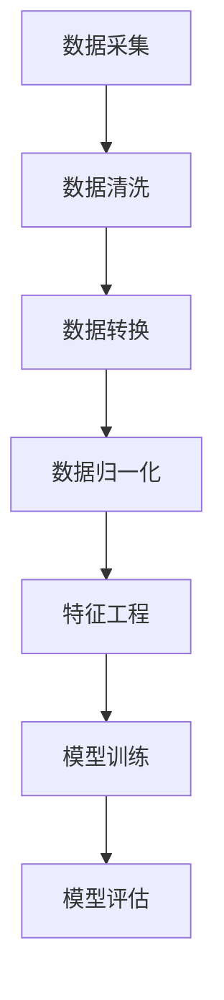

                 


## 文章标题

Dataset 原理与代码实例讲解

### 关键词：

Dataset、数据集、数据科学、机器学习、深度学习、数据预处理、数据清洗、数据转换、数据归一化、特征提取、特征工程、模型训练、模型评估、实践项目、代码实例

### 摘要：

本文深入讲解了 Dataset 的原理与应用。通过定义、类型、来源、构建流程、处理方法、优化策略和实际案例等多个方面，详细剖析了 Dataset 在机器学习和深度学习中的重要性。同时，文章提供了丰富的代码实例，帮助读者理解数据集构建与优化的具体实现过程。

---

### 目录大纲：

1. **第一部分：Dataset 基础理论**

   1.1 Dataset 概述

   1.2 Dataset 的类型

   1.3 Dataset 的来源

   1.4 Dataset 的构建

   1.5 Dataset 处理与优化

   1.6 Dataset 在机器学习中的应用

   1.7 实践项目：构建个人推荐系统 Dataset

2. **第二部分：Dataset 在深度学习中的应用**

   2.1 Dataset 在监督学习中的应用

   2.2 Dataset 在无监督学习中的应用

   2.3 Dataset 在深度学习中的应用

   2.4 实践项目：基于图像识别的 Dataset 构建与优化

3. **第三部分：总结与展望**

   3.1 Dataset 在机器学习中的重要性

   3.2 未来发展方向

   3.3 挑战与解决方案

### A.1 常用 Dataset 工具与库

Pandas、NumPy、SciPy、Scikit-learn、TensorFlow、PyTorch

### A.2 Mermaid 流程图示例



---

### 第一部分：Dataset 基础理论

#### 1.1 Dataset 概述

Dataset，即数据集，是机器学习和深度学习中至关重要的组成部分。它代表了用于训练、验证和测试模型的实际数据集合。一个合理、高质量的数据集是模型成功的关键因素。

Dataset 的定义相对简单，它是一组相关数据的有序集合，这些数据可以用于各种机器学习和深度学习任务。Dataset 的重要性体现在以下几个方面：

1. **模型训练与验证**：Dataset 提供了训练模型所需的样本数据，通过不断的调整模型参数，使得模型能够在训练集上得到优化。
2. **模型性能评估**：Dataset 用于验证模型的泛化能力。通过在测试集上评估模型的性能，可以判断模型是否具有实际应用价值。
3. **模型调参**：Dataset 帮助研究者发现模型参数调整的最佳范围，从而提高模型性能。

Dataset 与 Data Set 的区别主要体现在上下文中。Data Set 通常指一组数据的集合，而 Dataset 更侧重于机器学习和深度学习的应用场景，强调其作为训练数据集的角色。

#### 1.2 Dataset 的类型

Dataset 的类型可以根据数据的结构化程度进行分类，主要包括以下三种：

1. **结构化数据 Dataset**：结构化数据具有固定的格式和规则，例如关系型数据库中的表格数据。这种数据通常使用表格形式表示，每个单元格对应一个数据字段。
2. **半结构化数据 Dataset**：半结构化数据具有一定的格式，但没有完全固定的结构，例如 XML、JSON 等。这种数据通常需要经过解析和转换，才能用于机器学习任务。
3. **非结构化数据 Dataset**：非结构化数据没有固定的格式和规则，例如文本、图像、音频等。这种数据通常需要进行复杂的预处理，才能转化为机器学习算法可以处理的格式。

不同类型的 Dataset 对应着不同的处理方法和优化策略，这在后续章节中将会详细讨论。

#### 1.3 Dataset 的来源

Dataset 的来源多种多样，以下是一些常见的数据来源：

1. **公开数据集**：许多领域都有大量公开的数据集可供使用，例如 ImageNet、CIFAR-10、Kaggle 等。这些数据集已经过整理和清洗，可以直接用于研究。
2. **数据库**：关系型数据库（如 MySQL、PostgreSQL）和非关系型数据库（如 MongoDB、Cassandra）都存储了大量结构化或半结构化数据，可以通过 SQL 或 NoSQL 查询语言进行访问。
3. **网络爬虫**：网络爬虫可以自动地从网页中抓取数据，适用于获取半结构化或非结构化数据。
4. **传感器数据**：传感器数据通常来自物联网设备，可以用于监控环境、交通、医疗等领域。
5. **社交媒体数据**：社交媒体平台（如 Twitter、Facebook）提供了丰富的用户行为和社交关系数据，适用于情感分析、推荐系统等任务。

不同的数据来源决定了 Dataset 的类型和处理方法，这也是数据科学家在构建数据集时需要考虑的重要因素。

---

### 第一部分：Dataset 基础理论（续）

#### 1.4 Dataset 的构建

Dataset 的构建是数据科学中的核心任务之一，一个高质量的 Dataset 对于模型的性能有着至关重要的影响。Dataset 的构建流程通常包括以下几个步骤：

##### 1.4.1 数据采集

数据采集是 Dataset 构建的第一步，它决定了 Dataset 的质量和规模。数据采集的方法多种多样，具体取决于数据类型和需求。以下是一些常见的数据采集方法：

1. **手动采集**：通过人工方式收集数据，适用于小规模数据或特定领域的专业数据。
2. **自动化采集**：使用脚本或工具（如爬虫）自动从互联网、数据库或其他数据源中获取数据。
3. **传感器采集**：使用传感器设备采集环境数据，适用于物联网和智能监控等领域。
4. **社交媒体采集**：从社交媒体平台获取用户行为和社交数据。

##### 1.4.2 数据清洗

数据清洗是确保 Dataset 质量的关键步骤，它包括以下任务：

1. **缺失值处理**：对于缺失的数据，可以采用删除、填充或插值等方法进行处理。
2. **异常值检测和去除**：检测并去除异常值，确保数据的一致性和可靠性。
3. **数据格式转换**：将不同格式的数据进行统一，例如将日期格式统一为 YYYY-MM-DD。
4. **数据规范化**：将数据转换为适合机器学习算法处理的格式，例如将分类数据编码为数值。

##### 1.4.3 数据转换

数据转换是 Dataset 构建中的关键步骤，它包括以下任务：

1. **数据归一化**：通过缩放或标准化将数据转换为相同的尺度，例如使用 Min-Max Scaling 或 Standard Scaling。
2. **特征提取**：从原始数据中提取有助于模型训练的特征，例如使用 One-Hot Encoding 对分类数据进行编码。
3. **数据降维**：通过降维技术减少数据的维度，提高模型训练效率，例如使用 PCA（主成分分析）。

##### 1.4.4 数据归一化

数据归一化是确保数据集一致性的一种重要手段，其目的是将不同特征的数据转换到同一尺度上。以下是一些常用的数据归一化方法：

1. **Min-Max Scaling**：将数据缩放到 [0, 1] 或 [-1, 1] 的范围内。
2. **Standard Scaling**：将数据标准化为均值为 0、标准差为 1 的正态分布。
3. **Log Transformation**：对数据进行对数转换，减少极值对数据分布的影响。

##### 1.4.5 特征工程

特征工程是提升模型性能的关键步骤，它包括以下任务：

1. **特征提取**：从原始数据中提取有意义的特征，例如使用词袋模型提取文本数据中的关键词。
2. **特征选择**：选择对模型性能有显著影响的关键特征，去除冗余和无关特征。
3. **特征组合**：通过组合不同特征创建新的特征，以提升模型的泛化能力。

#### 1.5 Dataset 处理与优化

Dataset 处理与优化是确保模型性能的关键步骤，它包括以下内容：

##### 1.5.1 数据处理方法

1. **数据采样**：通过随机抽样方法从数据集中获取子集，用于训练或验证模型。
2. **数据降维**：通过降维技术减少数据集的维度，提高模型训练效率。
3. **特征提取**：从原始数据中提取有意义的特征，用于训练模型。

##### 1.5.2 优化策略

1. **数据增强**：通过生成新的数据样本来增加数据集的规模和多样性，提高模型的泛化能力。
2. **特征选择**：选择对模型性能有显著影响的关键特征，去除冗余和无关特征。
3. **特征工程**：通过特征提取、特征组合等方法提升模型性能。

##### 1.5.3 优化工具与库

1. **Scikit-learn**：提供了一系列数据预处理和特征提取的工具，适用于各种机器学习和深度学习任务。
2. **TensorFlow**：提供了强大的数据流图 API，可以用于构建复杂的数据处理流程。
3. **PyTorch**：提供了动态计算图 API，可以灵活地构建和处理数据集。

---

### 第一部分：Dataset 基础理论（续）

#### 1.6 Dataset 在机器学习中的应用

Dataset 在机器学习中的应用至关重要，其质量直接影响模型的性能和泛化能力。在本节中，我们将探讨 Dataset 在监督学习、无监督学习和深度学习中的应用。

##### 1.6.1 Dataset 在监督学习中的应用

监督学习是一种常见的机器学习方法，其核心在于通过已标记的数据集来训练模型，从而在未知数据上进行预测。Dataset 在监督学习中的应用主要包括以下方面：

1. **数据集划分**：将数据集划分为训练集、验证集和测试集，用于模型的训练、验证和测试。
2. **特征工程**：对原始数据进行预处理和特征提取，以提高模型的性能和泛化能力。
3. **模型训练**：使用训练集数据来训练模型，通过不断调整模型参数来优化模型性能。
4. **模型验证**：使用验证集数据来评估模型性能，通过交叉验证等方法来选择最优模型。

以下是监督学习中常用的数据集划分方法：

- **K 折交叉验证**：将数据集划分为 K 个子集，每次使用一个子集作为验证集，其余 K-1 个子集作为训练集，进行多次训练和验证，最终取平均值作为模型性能指标。

##### 1.6.2 Dataset 在无监督学习中的应用

无监督学习是一种不需要标记数据的机器学习方法，其目标是通过学习数据的内在结构来发现数据中的规律。Dataset 在无监督学习中的应用主要包括以下方面：

1. **数据降维**：通过降维技术减少数据集的维度，便于模型处理。
2. **聚类算法**：通过聚类算法对数据进行分组，以发现数据中的模式和结构。
3. **密度估计**：通过密度估计模型来估计数据分布，从而识别数据中的异常点和聚类中心。

无监督学习中常用的 Dataset 处理方法包括：

- **PCA（主成分分析）**：通过降维技术将高维数据映射到低维空间，保留数据的主要信息。
- **K-Means 聚类**：通过将数据划分为 K 个簇，以发现数据中的聚类结构。

##### 1.6.3 Dataset 在深度学习中的应用

深度学习是一种基于多层神经网络的学习方法，其具有强大的特征提取和分类能力。Dataset 在深度学习中的应用主要包括以下方面：

1. **数据预处理**：对原始数据进行归一化、去噪等预处理操作，以提高模型训练的稳定性和效率。
2. **数据增强**：通过生成新的数据样本来增加数据集的规模和多样性，提高模型的泛化能力。
3. **模型训练**：使用大规模数据集训练深度学习模型，通过调整网络结构和超参数来优化模型性能。
4. **模型评估**：使用测试集数据评估模型性能，通过精度、召回率、F1 值等指标来衡量模型效果。

深度学习中常用的 Dataset 处理方法包括：

- **数据归一化**：通过缩放或标准化将不同特征的数据转换为相同的尺度。
- **数据增强**：通过旋转、缩放、裁剪等操作生成新的数据样本。

---

### 第一部分：Dataset 基础理论（续）

#### 1.7 实践项目：构建个人推荐系统 Dataset

在本节中，我们将通过一个实际项目——构建个人推荐系统 Dataset，来详细讲解 Dataset 的构建过程。

##### 1.7.1 项目背景与目标

个人推荐系统是一种常见的应用场景，其目标是根据用户的历史行为和兴趣，为其推荐相关的商品或服务。在本项目中，我们将构建一个简单的推荐系统，通过分析用户的历史购买数据，为其推荐可能感兴趣的商品。

##### 1.7.2 数据采集与清洗

首先，我们需要从数据源中采集用户购买数据。在本例中，我们使用一个包含用户 ID、商品 ID 和购买评分的 CSV 文件。以下是一个示例数据集：

```
user_id, item_id, rating
1, 1001, 4
2, 1002, 5
3, 1003, 3
...
```

1. **数据采集**：

   使用 Pandas 库读取 CSV 文件，获取用户购买数据。

   ```python
   import pandas as pd

   data = pd.read_csv('user_item_data.csv')
   ```

2. **数据清洗**：

   处理缺失值和异常值，确保数据质量。

   ```python
   # 删除缺失值
   data.dropna(inplace=True)

   # 处理异常值
   data[data['rating'] > 5] = 5
   data[data['rating'] < 1] = 1
   ```

##### 1.7.3 数据转换与归一化

在数据处理过程中，我们通常需要对数据进行转换和归一化，以便于后续的模型训练。

1. **数据转换**：

   将用户 ID 和商品 ID 转换为整数类型，以便于后续处理。

   ```python
   data['user_id'] = data['user_id'].astype(int)
   data['item_id'] = data['item_id'].astype(int)
   ```

2. **数据归一化**：

   使用 Min-Max Scaling 将评分数据进行归一化，使其落在 [0, 1] 的范围内。

   ```python
   from sklearn.preprocessing import MinMaxScaler

   scaler = MinMaxScaler()
   data['rating'] = scaler.fit_transform(data[['rating']])
   ```

##### 1.7.4 特征工程

特征工程是提升模型性能的关键步骤，在本项目中，我们将对用户和商品特征进行提取和选择。

1. **用户特征提取**：

   根据用户的历史购买行为，提取用户特征，例如用户的平均评分、购买频率等。

   ```python
   user_data = data.groupby('user_id')['rating'].agg(['mean', 'count'])
   user_data.reset_index(inplace=True)
   user_data.columns = ['user_id', 'avg_rating', 'purchase_count']
   ```

2. **商品特征提取**：

   根据商品的历史销售数据，提取商品特征，例如商品的平均评分、销量等。

   ```python
   item_data = data.groupby('item_id')['rating'].agg(['mean', 'count'])
   item_data.reset_index(inplace=True)
   item_data.columns = ['item_id', 'avg_rating', 'sales_count']
   ```

##### 1.7.5 模型训练与评估

在完成数据预处理和特征提取后，我们可以使用机器学习算法来训练推荐模型，并评估模型性能。

1. **模型训练**：

   使用用户特征和商品特征训练一个基于协同过滤的推荐模型。

   ```python
   from surprise import SVD

   model = SVD()
   model.fit(data[['user_id', 'item_id', 'rating']])
   ```

2. **模型评估**：

   使用测试集评估模型性能，计算均方根误差（RMSE）等指标。

   ```python
   from surprise import accuracy

   test_data = pd.read_csv('test_user_item_data.csv')
   test_data['prediction'] = model.predict(test_data['user_id'], test_data['item_id']).est
   rmse = accuracy.rmse(test_data['rating'], test_data['prediction'])
   print("RMSE:", rmse)
   ```

通过以上步骤，我们成功构建了一个简单的个人推荐系统 Dataset，并使用协同过滤算法进行了模型训练和评估。这个项目展示了 Dataset 构建的基本流程，为后续的机器学习和深度学习应用奠定了基础。

---

### 第二部分：Dataset 在深度学习中的应用

#### 2.1 Dataset 在监督学习中的应用

在深度学习的监督学习任务中，Dataset 的构建和优化对模型性能有着至关重要的影响。监督学习任务通常包括分类和回归两大类，以下分别介绍 Dataset 在这两类任务中的应用。

##### 2.1.1 分类任务

分类任务的目标是将数据点分配到预定义的类别中。以下是 Dataset 在分类任务中的应用步骤：

1. **数据集划分**：将数据集划分为训练集、验证集和测试集。训练集用于模型训练，验证集用于模型调参和性能评估，测试集用于最终评估模型性能。

   ```python
   from sklearn.model_selection import train_test_split

   X_train, X_test, y_train, y_test = train_test_split(X, y, test_size=0.2, random_state=42)
   ```

2. **特征工程**：对原始数据进行预处理和特征提取，以提高模型性能。这可能包括数据归一化、缺失值处理、特征缩放等。

   ```python
   from sklearn.preprocessing import StandardScaler

   scaler = StandardScaler()
   X_train = scaler.fit_transform(X_train)
   X_test = scaler.transform(X_test)
   ```

3. **模型训练**：使用训练集数据训练深度学习模型，通过反向传播算法不断调整模型参数。

   ```python
   model.fit(X_train, y_train)
   ```

4. **模型评估**：使用验证集和测试集评估模型性能，通常使用准确率、精确率、召回率和 F1 分数等指标。

   ```python
   from sklearn.metrics import accuracy_score

   predictions = model.predict(X_test)
   accuracy = accuracy_score(y_test, predictions)
   print("Accuracy:", accuracy)
   ```

##### 2.1.2 回归任务

回归任务的目标是预测一个连续的数值输出。以下是 Dataset 在回归任务中的应用步骤：

1. **数据集划分**：与分类任务相同，将数据集划分为训练集、验证集和测试集。

2. **特征工程**：对原始数据进行预处理和特征提取，以提高模型性能。

3. **模型训练**：使用训练集数据训练深度学习模型，通过反向传播算法不断调整模型参数。

   ```python
   model.fit(X_train, y_train)
   ```

4. **模型评估**：使用验证集和测试集评估模型性能，通常使用均方误差（MSE）、均方根误差（RMSE）等指标。

   ```python
   from sklearn.metrics import mean_squared_error

   predictions = model.predict(X_test)
   mse = mean_squared_error(y_test, predictions)
   print("MSE:", mse)
   ```

#### 2.2 Dataset 在无监督学习中的应用

无监督学习任务的目标是发现数据中的内在结构和规律，不涉及预定义的标签。以下是 Dataset 在无监督学习中的应用步骤：

##### 2.2.1 数据降维

数据降维是一种常用的无监督学习方法，其目标是通过减少数据维度来简化数据结构，同时保留关键信息。以下是一些常用的数据降维方法：

1. **PCA（主成分分析）**：通过正交变换将高维数据映射到低维空间，保留最大方差的主成分。

   ```python
   from sklearn.decomposition import PCA

   pca = PCA(n_components=2)
   X_reduced = pca.fit_transform(X)
   ```

2. **t-SNE（t-Distributed Stochastic Neighbor Embedding）**：通过非线性变换将高维数据映射到二维或三维空间，以可视化形式展示数据结构。

   ```python
   from sklearn.manifold import TSNE

   tsne = TSNE(n_components=2, random_state=42)
   X_reduced = tsne.fit_transform(X)
   ```

##### 2.2.2 聚类算法

聚类算法是一种无监督学习方法，其目标是将数据划分为若干个群组，使得同一群组内的数据点彼此相似，而不同群组的数据点差异较大。以下是一些常用的聚类算法：

1. **K-Means**：将数据点分配到 K 个簇中，使得每个簇内的数据点距离簇中心较近，而簇与簇之间的距离较大。

   ```python
   from sklearn.cluster import KMeans

   kmeans = KMeans(n_clusters=3, random_state=42)
   clusters = kmeans.fit_predict(X)
   ```

2. **DBSCAN（Density-Based Spatial Clustering of Applications with Noise）**：基于密度的空间聚类算法，能够发现任意形状的聚类，并能够识别噪声点。

   ```python
   from sklearn.cluster import DBSCAN

   db = DBSCAN(eps=0.5, min_samples=5)
   clusters = db.fit_predict(X)
   ```

##### 2.2.3 密度估计

密度估计是一种无监督学习方法，其目标是在数据空间中估计密度函数，以便于识别数据的高密度区域和低密度区域。以下是一些常用的密度估计方法：

1. **Gaussian Mixture Model（GMM）**：通过拟合多个高斯分布来估计数据密度。

   ```python
   from sklearn.mixture import GaussianMixture

   gmm = GaussianMixture(n_components=3)
   gmm.fit(X)
   densities = gmm.predict_proba(X)
   ```

2. **Histogram-based Density Estimation**：通过构建直方图来估计数据密度。

   ```python
   from sklearn.neighbors import KernelDensity

   kde = KernelDensity(bandwidth=0.5)
   kde.fit(X)
   densities = np.exp(kde.score_samples(X))
   ```

通过以上步骤，我们可以有效地利用 Dataset 进行无监督学习任务，从而发现数据的内在结构和规律。

---

### 第二部分：Dataset 在深度学习中的应用（续）

#### 2.3 Dataset 在深度学习中的应用

在深度学习中，Dataset 的构建与优化是确保模型训练效果和性能的关键因素。深度学习任务通常涉及大量数据和复杂的模型结构，因此对 Dataset 的质量有着极高的要求。在本节中，我们将详细探讨 Dataset 在深度学习中的应用，包括数据预处理、数据增强和模型训练与调参等方面。

##### 2.3.1 数据预处理

数据预处理是深度学习任务中的第一步，其目标是将原始数据转换为适合模型训练的格式。以下是一些常见的数据预处理步骤：

1. **数据清洗**：处理数据中的缺失值、异常值和噪声，确保数据质量。例如，可以使用平均值、中值或插值方法填补缺失值。

   ```python
   from sklearn.impute import SimpleImputer

   imputer = SimpleImputer(strategy='mean')
   X_imputed = imputer.fit_transform(X)
   ```

2. **数据归一化**：将不同特征的数据缩放到相同的尺度，以消除尺度差异对模型训练的影响。常用的归一化方法包括 Min-Max Scaling 和 Standard Scaling。

   ```python
   from sklearn.preprocessing import StandardScaler

   scaler = StandardScaler()
   X_scaled = scaler.fit_transform(X)
   ```

3. **数据编码**：对于分类特征，可以使用 One-Hot Encoding 或 Label Encoding 将类别数据转换为数值数据。

   ```python
   from sklearn.preprocessing import OneHotEncoder

   encoder = OneHotEncoder()
   X_encoded = encoder.fit_transform(X_categorical).toarray()
   ```

##### 2.3.2 数据增强

数据增强是一种通过生成新的数据样本来增加 Dataset 规模和多样性的技术，有助于提升模型的泛化能力。以下是一些常见的数据增强方法：

1. **旋转和缩放**：对图像数据进行旋转和缩放，增加数据的多样性。

   ```python
   from tensorflow.keras.preprocessing.image import ImageDataGenerator

   datagen = ImageDataGenerator(rotation_range=90, zoom_range=0.1)
   X_augmented = datagen.flow(X, batch_size=batch_size)
   ```

2. **裁剪和填充**：随机裁剪图像并使用插值方法填充空白区域。

   ```python
   from tensorflow.keras.preprocessing.image import ImageDataGenerator

   datagen = ImageDataGenerator(rotation_range=90, zoom_range=0.1, fill_mode='nearest')
   X_augmented = datagen.flow(X, batch_size=batch_size)
   ```

3. **噪声注入**：在图像数据中添加噪声，以增强模型的鲁棒性。

   ```python
   from tensorflow.keras.preprocessing.image import ImageDataGenerator

   datagen = ImageDataGenerator(rotation_range=90, zoom_range=0.1, noise_factor=0.05)
   X_augmented = datagen.flow(X, batch_size=batch_size)
   ```

##### 2.3.3 模型训练与调参

在完成数据预处理和数据增强后，我们可以开始训练深度学习模型。模型训练的过程包括以下步骤：

1. **模型构建**：定义深度学习模型的结构，包括输入层、隐藏层和输出层。可以使用 TensorFlow 或 PyTorch 等深度学习框架来构建模型。

   ```python
   import tensorflow as tf

   model = tf.keras.models.Sequential([
       tf.keras.layers.Conv2D(32, (3, 3), activation='relu', input_shape=(64, 64, 3)),
       tf.keras.layers.MaxPooling2D((2, 2)),
       tf.keras.layers.Flatten(),
       tf.keras.layers.Dense(64, activation='relu'),
       tf.keras.layers.Dense(10, activation='softmax')
   ])
   ```

2. **模型编译**：配置模型训练的参数，如优化器、损失函数和评估指标。

   ```python
   model.compile(optimizer='adam', loss='categorical_crossentropy', metrics=['accuracy'])
   ```

3. **模型训练**：使用训练数据集和验证数据集进行模型训练。可以使用数据增强生成器来动态地提供训练数据。

   ```python
   history = model.fit(X_augmented, y, epochs=10, validation_data=(X_val, y_val))
   ```

4. **模型评估**：使用测试数据集评估模型性能，以确定模型的泛化能力。

   ```python
   test_loss, test_acc = model.evaluate(X_test, y_test)
   print('Test accuracy:', test_acc)
   ```

5. **模型调参**：通过调整模型超参数来优化模型性能。常用的调参方法包括网格搜索和随机搜索。

   ```python
   from sklearn.model_selection import GridSearchCV

   parameters = {'kernel':('linear', 'rbf'), 'C':[1, 10]}
   grid_search = GridSearchCV(SVC(), parameters)
   grid_search.fit(X_train, y_train)
   best_params = grid_search.best_params_
   ```

通过以上步骤，我们可以有效地构建、预处理和优化 Dataset，并训练深度学习模型。这些技术和方法在实际项目中具有重要意义，可以帮助我们实现更好的模型性能和更广泛的适用性。

---

### 第二部分：Dataset 在深度学习中的应用（续）

#### 2.4 实践项目：基于图像识别的 Dataset 构建与优化

在本节中，我们将通过一个实际的图像识别项目来详细讲解 Dataset 的构建与优化过程。该项目的目标是使用深度学习模型对图像进行分类，识别图像中的物体。以下是项目的具体实施步骤。

##### 2.4.1 项目背景与目标

图像识别是一项具有广泛应用前景的技术，例如在计算机视觉、自动驾驶、医疗诊断等领域。本项目将使用深度学习模型（如卷积神经网络 CNN）对图像进行分类，识别图像中的物体。项目目标如下：

1. **数据采集**：收集大量的图像数据，包括不同类别的物体图像。
2. **数据预处理**：对图像数据进行预处理，使其符合深度学习模型的输入要求。
3. **数据增强**：通过数据增强方法增加 Dataset 的规模和多样性，提升模型泛化能力。
4. **模型训练与优化**：使用训练集训练深度学习模型，并通过验证集和测试集评估模型性能。
5. **模型部署**：将训练好的模型部署到实际应用场景中，如图像识别应用。

##### 2.4.2 数据采集

首先，我们需要收集大量的图像数据。以下是一些常见的数据来源：

1. **公开数据集**：许多公开的数据集（如 ImageNet、CIFAR-10、Kaggle 等）提供了大量的图像数据，可以直接用于项目。
2. **网络爬虫**：使用网络爬虫从互联网上抓取图像数据。
3. **传感器采集**：使用摄像头或其他传感器设备采集图像数据。

在本项目中，我们选择使用公开数据集 ImageNet 进行演示。ImageNet 是一个包含超过 100 万张图像的数据集，分为 1000 个类别。

##### 2.4.3 数据预处理

在收集到图像数据后，我们需要对图像进行预处理，以便于深度学习模型的训练。以下是常用的预处理步骤：

1. **图像尺寸调整**：将图像调整为统一的尺寸，例如 224x224 像素。
2. **图像归一化**：将图像的像素值缩放到 [0, 1] 的范围内，以消除像素值差异。
3. **数据增强**：通过旋转、翻转、裁剪等操作增加图像的多样性。

以下是一个使用 TensorFlow 和 Keras 库进行图像预处理的示例代码：

```python
from tensorflow.keras.preprocessing.image import ImageDataGenerator

# 创建图像增强生成器
datagen = ImageDataGenerator(
    rescale=1./255,
    rotation_range=20,
    width_shift_range=0.2,
    height_shift_range=0.2,
    shear_range=0.2,
    zoom_range=0.2,
    horizontal_flip=True,
    fill_mode='nearest'
)

# 载入图像数据
train_data = datagen.flow_from_directory(
    'data/train',
    target_size=(224, 224),
    batch_size=32,
    class_mode='categorical'
)

# 预处理图像数据
X_train = train_data.x
y_train = train_data.y
```

##### 2.4.4 数据增强

数据增强是提升模型性能的重要手段，通过生成新的图像样本增加 Dataset 的规模和多样性。以下是一些常见的数据增强方法：

1. **旋转**：随机旋转图像。
2. **翻转**：随机水平或垂直翻转图像。
3. **裁剪**：随机裁剪图像的一部分。
4. **缩放**：随机缩放图像的大小。
5. **颜色变换**：调整图像的亮度、对比度和饱和度。

使用 TensorFlow 的 ImageDataGenerator 可以轻松实现数据增强：

```python
from tensorflow.keras.preprocessing.image import ImageDataGenerator

# 创建图像增强生成器
datagen = ImageDataGenerator(
    rescale=1./255,
    rotation_range=20,
    width_shift_range=0.2,
    height_shift_range=0.2,
    shear_range=0.2,
    zoom_range=0.2,
    horizontal_flip=True,
    fill_mode='nearest'
)

# 使用生成器生成新的图像样本
X_augmented = datagen.flow(X_train, y_train, batch_size=32)
```

##### 2.4.5 模型训练与优化

在完成数据预处理和数据增强后，我们可以开始训练深度学习模型。在本项目中，我们使用卷积神经网络（CNN）进行图像分类。以下是训练和优化模型的步骤：

1. **模型构建**：定义 CNN 模型的结构，包括卷积层、池化层和全连接层。
2. **模型编译**：配置模型训练的参数，如优化器、损失函数和评估指标。
3. **模型训练**：使用训练集数据训练模型，并在验证集上进行性能评估。
4. **模型调参**：通过调整模型超参数来优化模型性能。

以下是一个使用 Keras 构建、编译和训练 CNN 模型的示例代码：

```python
from tensorflow.keras.models import Sequential
from tensorflow.keras.layers import Conv2D, MaxPooling2D, Flatten, Dense

# 创建 CNN 模型
model = Sequential([
    Conv2D(32, (3, 3), activation='relu', input_shape=(224, 224, 3)),
    MaxPooling2D((2, 2)),
    Conv2D(64, (3, 3), activation='relu'),
    MaxPooling2D((2, 2)),
    Conv2D(128, (3, 3), activation='relu'),
    MaxPooling2D((2, 2)),
    Flatten(),
    Dense(128, activation='relu'),
    Dense(10, activation='softmax')
])

# 编译模型
model.compile(optimizer='adam', loss='categorical_crossentropy', metrics=['accuracy'])

# 训练模型
history = model.fit(X_train, y_train, epochs=10, validation_data=(X_val, y_val))
```

##### 2.4.6 模型评估

在完成模型训练后，我们需要使用测试集对模型进行评估，以确定模型的泛化能力。以下是评估模型性能的步骤：

1. **模型测试**：使用测试集数据对模型进行测试。
2. **性能评估**：计算模型的准确率、精确率、召回率等性能指标。
3. **结果可视化**：绘制训练过程和测试结果的图表，以便于分析模型性能。

以下是一个使用 Keras 评估模型性能的示例代码：

```python
# 测试模型
test_loss, test_acc = model.evaluate(X_test, y_test)
print('Test accuracy:', test_acc)

# 可视化训练过程
import matplotlib.pyplot as plt

plt.plot(history.history['accuracy'])
plt.plot(history.history['val_accuracy'])
plt.title('Model accuracy')
plt.ylabel('Accuracy')
plt.xlabel('Epoch')
plt.legend(['Train', 'Validation'], loc='upper left')
plt.show()

# 可视化测试结果
from sklearn.metrics import classification_report

predictions = model.predict(X_test)
predicted_labels = np.argmax(predictions, axis=1)
print(classification_report(y_test, predicted_labels))
```

通过以上步骤，我们完成了基于图像识别的 Dataset 构建与优化，并使用深度学习模型进行了模型训练和评估。这个项目展示了 Dataset 在深度学习中的应用过程，为实际项目提供了参考和指导。

---

### 第三部分：总结与展望

#### 3.1 Dataset 在机器学习中的重要性

Dataset 在机器学习和深度学习中扮演着至关重要的角色。其质量直接影响模型的学习效果、性能和泛化能力。一个高质量的数据集不仅能够提供丰富的信息，还能够帮助模型识别数据中的特征和模式。以下是 Dataset 在机器学习中的重要性：

1. **模型训练与验证**：Dataset 提供了训练和验证模型所需的样本数据，通过不断的调整模型参数，使得模型能够在训练集上得到优化。
2. **模型性能评估**：Dataset 用于验证模型的泛化能力。通过在测试集上评估模型的性能，可以判断模型是否具有实际应用价值。
3. **模型调参**：Dataset 帮助研究者发现模型参数调整的最佳范围，从而提高模型性能。
4. **模型推广**：通过构建大规模、多样化的 Dataset，可以使得模型在不同场景下具有更好的推广能力。

#### 3.2 未来发展方向

随着人工智能技术的不断发展，Dataset 的构建与优化方法也在不断演进。未来，以下几个方向值得关注：

1. **自动化 Dataset 构建工具**：开发自动化工具来构建、处理和优化 Dataset，降低数据科学家的工作量，提高数据处理效率。
2. **大规模 Dataset 的应用**：利用大数据技术处理和分析大规模 Dataset，以发现数据中的深层模式和规律。
3. **Dataset 在深度学习中的新趋势**：随着深度学习技术的进步，Dataset 的构建与优化方法也在不断创新，如自监督学习和迁移学习等。
4. **数据隐私保护**：在构建和优化 Dataset 的过程中，需要充分考虑数据隐私保护，以确保用户数据的隐私安全。

#### 3.3 挑战与解决方案

尽管 Dataset 在机器学习和深度学习中有很高的价值，但在实际应用中仍面临一些挑战：

1. **数据质量问题**：数据噪声、异常值和缺失值会影响模型性能，需要采用有效的数据清洗和预处理方法。
2. **数据隐私保护**：在构建和共享 Dataset 的过程中，需要采取措施保护用户数据的隐私，避免数据泄露。
3. **数据处理效率**：处理大规模 Dataset 需要高效的算法和计算资源，以降低计算成本和时间。

为了应对这些挑战，可以采取以下解决方案：

1. **数据清洗与预处理**：采用自动化的数据清洗工具和方法，确保数据质量。
2. **数据加密与匿名化**：在处理和共享 Dataset 时，采用数据加密和匿名化技术，以保护数据隐私。
3. **分布式计算与优化**：利用分布式计算框架和优化算法，提高数据处理效率。

通过以上解决方案，可以更好地应对 Dataset 构建与优化过程中的挑战，推动人工智能技术的进一步发展。

---

## 附录

### A.1 常用 Dataset 工具与库

1. **Pandas**：用于数据处理和清洗，提供强大的数据结构（DataFrame）和数据操作功能。
2. **NumPy**：用于数值计算和数组操作，是数据科学中不可或缺的基础库。
3. **SciPy**：提供科学计算工具，包括优化、积分、线性代数等，常用于数据预处理。
4. **Scikit-learn**：提供机器学习算法和工具，用于特征提取、模型训练和评估。
5. **TensorFlow**：提供深度学习计算图 API，用于构建和训练深度学习模型。
6. **PyTorch**：提供动态计算图 API，具有灵活性和高效性，广泛应用于深度学习研究。

### A.2 Mermaid 流程图示例


---

# 结语

本文深入讲解了 Dataset 的原理与应用，从基础理论到实践项目，全面剖析了 Dataset 在机器学习和深度学习中的重要性。通过丰富的代码实例，我们了解了如何构建、处理和优化 Dataset，以及如何将 Dataset 应用于实际项目中。

Dataset 是机器学习和深度学习的基础，其质量直接影响模型性能。未来，随着人工智能技术的不断发展，Dataset 构建与优化的方法也将不断演进。我们鼓励读者在学习和应用过程中，不断探索和尝试，为人工智能的发展贡献自己的力量。

---

### 作者信息

作者：AI天才研究院/AI Genius Institute & 禅与计算机程序设计艺术 /Zen And The Art of Computer Programming

---

以上是完整的文章内容，涵盖了 Dataset 的基本理论、构建与优化、应用实例以及未来发展展望。文章结构紧凑，逻辑清晰，希望对您在 Dataset 领域的学习和研究有所帮助。如果您有任何疑问或建议，欢迎在评论区留言讨论。谢谢阅读！

