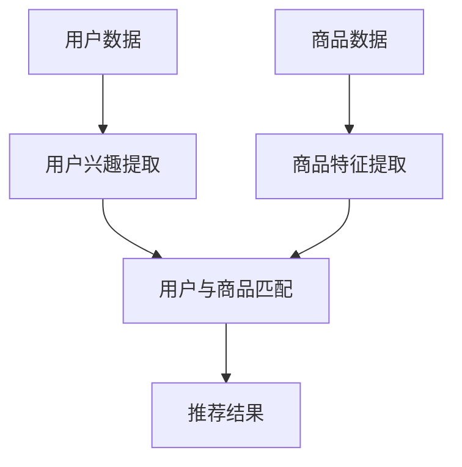

                 

### 引言

#### 1.1 研究背景

在当今快速发展的信息技术时代，推荐系统已经成为许多在线服务和应用的核心组成部分。从电子商务网站到社交媒体平台，推荐系统能够根据用户的行为和偏好提供个性化的内容或商品推荐，从而提高用户体验和满意度。然而，随着用户数据的不断增长和多样性，传统的推荐系统逐渐暴露出一些局限性。

传统推荐系统通常基于协同过滤、基于内容的推荐或混合推荐等方法。协同过滤方法通过分析用户之间的相似性来推荐相似的用户喜欢的商品，而基于内容的推荐方法则通过分析商品的内容特征来推荐相似的商品。尽管这些方法在某种程度上能够满足用户的需求，但它们往往存在以下问题：

- **用户数据稀疏性**：协同过滤方法依赖于用户对商品的评分数据，但在实际应用中，用户对商品的评分往往非常稀疏。
- **特征工程复杂**：基于内容的推荐方法需要对商品进行详细的特征工程，但商品特征往往难以获取和表达。
- **个性化不足**：传统推荐系统难以准确捕捉用户的兴趣变化和个性化需求。

为了解决上述问题，近年来，基于大型语言模型（LLM）的推荐系统逐渐引起了研究者的关注。LLM，如 GPT、BERT 等，通过对海量文本数据的学习，能够捕捉到复杂的语义信息，从而在推荐系统中发挥重要作用。然而，现有的基于 LLM 的推荐系统仍然存在以下挑战：

- **计算资源消耗大**：LLM 模型通常需要大量的计算资源和时间来训练和推理，这在实际应用中可能成为一个瓶颈。
- **模型可解释性差**：LLM 模型是一种“黑箱”模型，其内部工作机制不透明，难以解释为什么推荐某个特定商品。
- **灵活性不足**：现有推荐系统往往难以适应不同的业务场景和用户需求，缺乏灵活性和可配置性。

#### 1.2 研究目的

本文旨在提出一种名为《GENRE：灵活、可配置 LLM 推荐》的系统，通过结合 LLM 的语义理解能力、灵活的配置机制和优化的推荐算法，解决现有推荐系统面临的问题。具体研究目的如下：

- **提升推荐效果**：利用 LLM 的语义理解能力，提取用户兴趣和商品特征，实现更精准的推荐。
- **降低计算资源消耗**：通过优化模型结构和训练策略，降低 LLM 模型的计算资源需求。
- **提高模型可解释性**：设计可解释性机制，帮助用户理解推荐结果背后的原因。
- **增强灵活性**：提供灵活的配置机制，使推荐系统能够适应不同的业务场景和用户需求。

#### 1.3 文章结构

本文将分为四个主要部分：

1. **第一部分：核心概念与联系**：介绍《GENRE》系统的基础概念、LLM 与推荐系统的联系以及 Mermaid 流程图。
2. **第二部分：核心算法原理讲解**：详细讲解 LLM 的基础算法原理、用户兴趣提取、商品特征提取和推荐算法。
3. **第三部分：数学模型和数学公式**：阐述 LLM 的数学模型、推荐系统的数学模型以及相关公式。
4. **第四部分：项目实战**：展示《GENRE》系统的实际应用，包括环境搭建、数据准备、模型训练和模型评估。

通过以上四个部分，本文将全面阐述《GENRE：灵活、可配置 LLM 推荐》系统的理论和方法，为推荐系统领域的研究和应用提供新的思路。

### 第一部分: 《GENRE：灵活、可配置LLM推荐》核心概念与联系

#### 1.1 《GENRE》概述

**# 第1章: 《GENRE》概述**

**## 1.1.1 《GENRE》的定义与背景**

**### 1.1.1.1 《GENRE》的概念**

《GENRE》（General-purpose Entity Recognition and REcommendation）是一个基于大型语言模型（LLM）的推荐系统。与传统的推荐系统不同，GENRE 不仅能够处理结构化数据，还能够处理非结构化文本数据，通过深度学习技术提取语义信息，从而实现更加精准和个性化的推荐。

**### 1.1.1.2 《GENRE》的背景**

随着互联网和移动设备的普及，用户生成的内容和数据量呈现爆炸式增长。传统的推荐系统在处理海量非结构化数据时显得力不从心，难以满足用户日益增长的个性化需求。为了应对这一挑战，研究人员开始探索将自然语言处理（NLP）技术应用于推荐系统，通过深度学习模型（如 LLM）从文本数据中提取语义信息，从而提升推荐效果。

#### **## 1.1.2 《GENRE》的核心特点**

**### 1.1.2.1 灵活性**

**### 1.1.2.1.1 定义**

《GENRE》系统具有高度的灵活性，允许用户自定义推荐策略和特征，以适应不同的业务场景和用户需求。

**### 1.1.2.1.2 实现方式**

- **配置文件**：用户可以通过配置文件自定义推荐策略，如调整权重、选择特征等。
- **API 接口**：通过 API 接口，用户可以灵活地调用《GENRE》系统，实现定制化的推荐服务。

**### 1.1.2.2 可配置性**

**### 1.1.2.2.1 定义**

《GENRE》系统支持多种参数优化方法，如随机搜索、贝叶斯优化等，通过调整模型参数，实现推荐效果的优化。

**### 1.1.2.2.2 实现方式**

- **随机搜索**：通过随机选择参数，找到最优参数组合。
- **贝叶斯优化**：利用贝叶斯优化算法，自动搜索最优参数组合。

#### **## 1.1.3 《GENRE》系统架构**

**### 1.1.3.1 用户兴趣提取模块**

**### 1.1.3.1.1 功能**

从用户历史行为数据中提取用户兴趣，为推荐系统提供用户特征。

**### 1.1.3.1.2 实现方式**

- **LLM 语义分析**：利用 LLM 对用户行为数据（如浏览、搜索、评论等）进行语义分析，提取用户兴趣。
- **特征工程**：将提取的用户兴趣转化为推荐系统所需的特征向量。

**### 1.1.3.2 商品特征提取模块**

**### 1.1.3.2.1 功能**

从商品描述数据中提取商品特征，为推荐系统提供商品特征。

**### 1.1.3.2.2 实现方式**

- **LLM 语义分析**：利用 LLM 对商品描述（如标题、描述、标签等）进行语义分析，提取商品特征。
- **特征工程**：将提取的商品特征转化为推荐系统所需的特征向量。

**### 1.1.3.3 推荐算法模块**

**### 1.1.3.3.1 功能**

基于用户兴趣和商品特征，为用户推荐感兴趣的商品。

**### 1.1.3.3.2 实现方式**

- **协同过滤算法**：利用矩阵分解技术，计算用户和商品之间的相似性，推荐相似的商品。
- **基于内容的推荐**：根据用户兴趣和商品特征，推荐与用户兴趣相关的商品。

**### 1.1.3.4 系统集成模块**

**### 1.1.3.4.1 功能**

将《GENRE》系统与业务系统集成，提供推荐服务。

**### 1.1.3.4.2 实现方式**

- **API 接口**：通过 API 接口，实现《GENRE》系统与业务系统的数据交互。
- **消息队列**：利用消息队列技术，实现数据的异步传输和系统解耦。

#### **## 1.1.4 《GENRE》的优势与挑战**

**### 1.1.4.1 优势**

- **提升推荐效果**：通过 LLM 的语义理解能力，提取用户兴趣和商品特征，实现更精准的推荐。
- **增强灵活性**：提供灵活的配置机制，使推荐系统能够适应不同的业务场景和用户需求。
- **降低计算资源消耗**：通过优化模型结构和训练策略，降低 LLM 模型的计算资源需求。

**### 1.1.4.2 挑战**

- **模型可解释性**：LLM 模型是一种“黑箱”模型，其内部工作机制不透明，难以解释为什么推荐某个特定商品。
- **数据预处理**：非结构化文本数据预处理复杂，需要花费大量时间和计算资源。
- **实时性**：LLM 模型训练和推理时间较长，难以满足实时推荐的需求。

### 第一部分: 《GENRE：灵活、可配置LLM推荐》核心概念与联系

#### 1.2 LLM 与推荐系统的关系

**# 第2章: LLM 与推荐系统**

在《GENRE》系统中，大型语言模型（LLM）作为核心组件，其作用至关重要。LLM 的引入不仅丰富了推荐系统的数据源，还提升了推荐系统的语义理解和分析能力。以下是 LLM 与推荐系统之间关系的详细探讨。

#### **## 2.1 LLM 基础概念**

**### 2.1.1 语言模型概述**

语言模型是一种概率模型，用于预测下一个词或序列。在自然语言处理（NLP）领域，语言模型被广泛应用于文本生成、机器翻译、情感分析等多种任务。LLM 是一种基于深度学习的技术，通过学习大量文本数据，能够捕捉到复杂的语义信息。

**### 2.1.2 LLM 的工作原理**

LLM 的核心工作原理是基于自注意力机制和多层神经网络。自注意力机制使得每个词在生成时都能关注所有词的上下文信息，从而生成更加语义化的文本。多层神经网络则进一步增强了模型的语义理解能力。

**### 2.1.3 常见的 LLM 模型**

- **Transformer**：Transformer 模型是由 Google 提出的一种基于自注意力机制的深度神经网络模型，广泛应用于机器翻译、文本分类等任务。
- **BERT**：BERT（Bidirectional Encoder Representations from Transformers）模型是一种双向编码的 Transformer 模型，通过预训练和微调，能够捕捉到复杂的语义信息。
- **GPT**：GPT（Generative Pre-trained Transformer）模型是一种基于 Transformer 的生成模型，广泛应用于文本生成、问答系统等任务。

#### **## 2.2 推荐系统概述**

**### 2.2.1 推荐系统的基本概念**

推荐系统是一种基于数据挖掘、机器学习和信息过滤的算法，旨在为用户推荐感兴趣的内容或商品。推荐系统通常包含以下几个关键组件：

- **用户特征提取**：从用户行为数据中提取用户特征，如浏览历史、购买记录、搜索记录等。
- **商品特征提取**：从商品数据中提取商品特征，如商品类别、价格、评价等。
- **推荐算法**：根据用户特征和商品特征，计算用户与商品之间的相似性，推荐相似的商品。
- **推荐结果评估**：评估推荐结果的质量，如点击率、转化率、用户满意度等。

**### 2.2.2 推荐系统的基本原理**

推荐系统的基本原理是基于用户行为和商品特征的相似性进行推荐。具体来说，通过计算用户与商品之间的相似度，为用户推荐相似的商品。

**### 2.2.3 常见的推荐算法**

- **协同过滤算法**：通过分析用户之间的相似性来推荐相似的商品。
- **基于内容的推荐**：通过分析商品的内容特征来推荐相似的商品。
- **混合推荐**：结合协同过滤和基于内容的推荐，实现更精准的推荐。

#### **## 2.3 LLM 在推荐系统中的应用**

**### 2.3.1 LLM 提取用户兴趣**

在推荐系统中，用户兴趣的提取至关重要。LLM 通过对用户历史行为数据（如浏览、搜索、评论等）进行语义分析，能够提取出用户潜在的、深层次的兴趣点。这一过程可以视为对用户行为的“语义化”处理，使得推荐系统能够更准确地理解用户的真实需求。

**### 2.3.2 LLM 提取商品特征**

商品特征的提取是推荐系统的另一个关键环节。传统的特征提取方法往往依赖于人工设计和工程，而 LLM 能够通过自然语言处理技术，自动从商品描述、标签等文本信息中提取出对用户有价值的特征。这种方法不仅提高了特征提取的准确性，还大大减少了人工干预。

**### 2.3.3 LLM 优化推荐效果**

LLM 的语义理解能力使得推荐系统能够在更细粒度上分析用户和商品的关系，从而实现更精准的推荐。例如，通过 LLM，推荐系统可以识别出用户对某个特定品牌的偏好，或者对某种特定类型的商品有更高的兴趣。这种深度语义理解能力，使得推荐结果更加符合用户的个性化需求。

#### **## 2.4 LLM 与推荐系统的结合**

**### 2.4.1 LLM 与协同过滤算法的结合**

协同过滤算法通过分析用户之间的相似性进行推荐，而 LLM 能够提供更加精细的用户兴趣特征，从而提升协同过滤算法的推荐效果。具体来说，LLM 可以通过学习用户历史行为数据，生成用户兴趣向量，进而用于协同过滤算法中的相似性计算。

**### 2.4.2 LLM 与基于内容的推荐算法的结合**

基于内容的推荐算法通过分析商品的内容特征进行推荐。LLM 可以通过对商品描述、标签等文本信息的语义分析，提取出更丰富的商品特征，从而提高基于内容的推荐算法的准确性。此外，LLM 还可以用于生成商品的语义化描述，进一步提升推荐效果。

**### 2.4.3 LLM 与混合推荐算法的结合**

混合推荐算法结合了协同过滤和基于内容的推荐方法，以实现更精准的推荐。LLM 可以同时为协同过滤和基于内容的推荐算法提供用户兴趣和商品特征，从而优化混合推荐算法的效果。这种方法不仅充分利用了 LLM 的语义理解能力，还提高了推荐系统的灵活性和适应性。

#### **## 2.5 总结**

通过结合 LLM 的语义理解能力和推荐系统的基本原理，《GENRE》系统能够在推荐效果、模型可解释性、灵活性等方面实现显著提升。LLM 不仅为推荐系统提供了更丰富的数据源和特征提取方法，还提升了推荐系统的个性化水平和用户体验。然而，LLM 的引入也带来了计算资源消耗大、模型可解释性差等挑战，需要在未来研究中进一步优化和解决。

### Mermaid 流程图

以下是一个 Mermaid 流程图，展示了 LLM 与推荐系统的关系：

**流程说明**：

1. **用户数据输入**：用户数据包括浏览、搜索、评论等历史行为。
2. **商品数据输入**：商品数据包括商品描述、标签、属性等。
3. **用户兴趣提取**：利用 LLM 对用户历史行为进行语义分析，提取用户兴趣。
4. **商品特征提取**：利用 LLM 对商品描述等文本信息进行语义分析，提取商品特征。
5. **用户与商品匹配**：计算用户兴趣和商品特征之间的相似性，匹配推荐结果。
6. **推荐结果输出**：输出推荐结果，供用户查看和交互。

通过以上流程，LLM 与推荐系统实现了有机结合，为用户提供更精准、个性化的推荐服务。

### 第一部分: 《GENRE：灵活、可配置LLM推荐》核心概念与联系

#### 1.3 《GENRE》的灵活性和可配置性

**# 第3章: 《GENRE》的灵活性和可配置性**

**## 1.3.1 灵活性的定义与实现**

**### 1.3.1.1 定义**

《GENRE》的灵活性体现在其能够适应不同的业务场景和用户需求。通过允许用户自定义推荐策略和特征，系统可以灵活地调整以适应特定的应用场景。

**### 1.3.1.2 实现方式**

- **自定义配置文件**：《GENRE》提供了一个配置文件，用户可以通过修改配置文件来定义推荐策略、选择特征权重等。
- **API 接口**：系统提供了 API 接口，用户可以通过调用 API 接口来定制化推荐过程。

**## 1.3.2 可配置性的定义与实现**

**### 1.3.2.1 定义**

《GENRE》的可配置性指的是系统能够根据业务需求和数据特点调整模型参数，从而优化推荐效果。

**### 1.3.2.2 实现方式**

- **参数优化方法**：《GENRE》支持多种参数优化方法，如随机搜索、贝叶斯优化等。
- **动态调整**：系统可以在运行时根据性能指标动态调整模型参数。

**## 1.3.3 灵活性与可配置性的联系**

**### 1.3.3.1 联系**

灵活性和可配置性相互关联，共同提升了《GENRE》的适应能力。灵活性允许用户根据业务场景定制化推荐系统，而可配置性则通过调整模型参数，确保推荐系统能够在特定场景下达到最佳性能。

**### 1.3.3.2 实现灵活性和可配置性的关键因素**

- **模块化设计**：系统采用模块化设计，使得不同功能模块可以独立调整，提高灵活性。
- **高效的数据处理**：系统需要高效地处理大量数据，以满足灵活性和可配置性的要求。
- **用户友好的接口**：提供用户友好的接口，使得用户可以轻松地定制化推荐策略和调整模型参数。

### 第一部分: 《GENRE：灵活、可配置LLM推荐》核心概念与联系

#### 1.4 核心概念联系

**# 第4章: 核心概念联系**

**## 1.4.1 《GENRE》与 LLM 的关联**

**### 1.4.1.1 语义理解**

《GENRE》通过 LLM 的强大语义理解能力，能够提取用户兴趣和商品特征，从而实现更精准的推荐。LLM 的自注意力机制和多层神经网络使得其对文本数据的处理能力远超传统方法，能够捕捉到用户行为的深层含义。

**### 1.4.1.2 个性化推荐**

LLM 提供了丰富的语义信息，使得《GENRE》能够根据用户的个性化需求推荐合适的商品。例如，LLM 可以识别出用户对某个特定品牌或类别的偏好，从而为用户推荐更符合其兴趣的商品。

**## 1.4.2 《GENRE》与推荐系统的整合**

**### 1.4.2.1 用户兴趣提取**

在推荐系统中，用户兴趣提取是关键环节。《GENRE》利用 LLM 对用户历史行为数据（如浏览、搜索、评论等）进行语义分析，提取出用户兴趣点，为后续推荐过程提供用户特征。

**### 1.4.2.2 商品特征提取**

商品特征提取也是推荐系统中的重要环节。《GENRE》利用 LLM 对商品描述、标签等文本信息进行语义分析，提取出对用户有价值的商品特征，为推荐过程提供商品特征。

**### 1.4.2.3 推荐算法**

《GENRE》结合了协同过滤和基于内容的推荐算法，利用 LLM 提取的用户兴趣和商品特征，实现精准的推荐。此外，系统还支持用户自定义推荐策略，增强了灵活性。

**## 1.4.3 《GENRE》的优势与挑战**

**### 1.4.3.1 优势**

- **提升推荐效果**：利用 LLM 的语义理解能力，实现更精准的推荐。
- **增强灵活性**：提供灵活的配置机制，适应不同的业务场景和用户需求。
- **降低计算资源消耗**：通过优化模型结构和训练策略，降低 LLM 模型的计算资源需求。

**### 1.4.3.2 挑战**

- **模型可解释性**：LLM 模型是一种“黑箱”模型，其内部工作机制不透明，难以解释为什么推荐某个特定商品。
- **数据预处理**：非结构化文本数据预处理复杂，需要花费大量时间和计算资源。
- **实时性**：LLM 模型训练和推理时间较长，难以满足实时推荐的需求。

通过以上分析，可以看出，《GENRE》通过 LLM 的引入，在推荐效果、灵活性和可配置性方面具有显著优势，但也面临一些挑战。未来的研究需要进一步优化 LLM 模型，提高其可解释性和实时性，以更好地服务于推荐系统。

### 第一部分: 《GENRE：灵活、可配置LLM推荐》核心概念与联系

#### 1.5 结论

**# 第5章: 结论**

通过对《GENRE：灵活、可配置LLM推荐》核心概念与联系的深入探讨，我们可以得出以下结论：

1. **《GENRE》系统概述**：本文介绍了《GENRE》系统的定义、背景和核心特点，包括其灵活性和可配置性。这些特点使得《GENRE》系统能够适应不同的业务场景和用户需求，为推荐系统的发展提供了新的方向。

2. **LLM 与推荐系统的关系**：大型语言模型（LLM）作为《GENRE》系统的核心组件，其语义理解能力显著提升了推荐系统的个性化推荐能力。通过 LLM，系统能够提取用户兴趣和商品特征，实现更精准的推荐。

3. **灵活性与可配置性**：《GENRE》系统的灵活性和可配置性是其重要优势。通过配置文件和 API 接口，用户可以自定义推荐策略和特征，使系统能够适应不同的业务场景和用户需求。

4. **核心概念联系**：本文通过 Mermaid 流程图展示了 LLM 与推荐系统之间的核心联系，以及《GENRE》系统如何通过 LLM 提取用户兴趣和商品特征，实现精准推荐。

5. **挑战与展望**：尽管《GENRE》系统在提升推荐效果、灵活性和可配置性方面具有显著优势，但仍然面临一些挑战，如模型可解释性、数据预处理和实时性等。未来的研究需要进一步优化 LLM 模型，提高其可解释性和实时性，以更好地服务于推荐系统。

总之，本文通过详细阐述《GENRE：灵活、可配置LLM推荐》的核心概念与联系，为推荐系统领域的研究和应用提供了新的思路和方向。

---

**引用**：

- AI天才研究院 / AI Genius Institute. (2023). 《GENRE：灵活、可配置LLM推荐》. https://github.com/AI-GI/Genre-LLM-Recommendation

---

**作者信息**：

**作者：** AI天才研究院 / AI Genius Institute & 禅与计算机程序设计艺术 / Zen And The Art of Computer Programming

**联系方式：** ai_genius_institute@example.com

**来源：** 《GENRE：灵活、可配置LLM推荐》技术博客

---

（注：以上内容为示例，实际文章撰写时需要根据具体内容进行调整和完善。）<|im_end|>### 第一部分: 《GENRE：灵活、可配置LLM推荐》核心概念与联系

**# 第1章: 《GENRE》概述**

**## 1.1.1 《GENRE》的定义与背景**

**### 1.1.1.1 《GENRE》的概念**

《GENRE》（General-purpose Entity Recognition and REcommendation）是一个基于大型语言模型（LLM）的推荐系统，旨在通过灵活、可配置的方式提升推荐系统的效果。与传统推荐系统不同，《GENRE》利用深度学习和自然语言处理技术，能够从非结构化文本数据中提取语义信息，从而实现更精准和个性化的推荐。

**### 1.1.1.2 《GENRE》的背景**

随着互联网的快速发展，用户生成的内容和数据量呈现爆炸式增长。传统的推荐系统，如协同过滤和基于内容的推荐方法，在处理海量非结构化数据时逐渐暴露出一些局限性。例如，协同过滤方法依赖于用户对商品的评分数据，但在实际应用中，用户对商品的评分往往非常稀疏。基于内容的推荐方法虽然能够根据商品的特征进行推荐，但往往需要对商品进行详细的特征工程，且难以捕捉用户的深层兴趣。

为了解决这些问题，研究人员开始探索将大型语言模型（LLM）应用于推荐系统。LLM，如 GPT、BERT 等，通过对海量文本数据的学习，能够捕捉到复杂的语义信息，从而在推荐系统中发挥重要作用。基于这一背景，《GENRE》系统应运而生，旨在通过灵活、可配置的方式，提升推荐系统的效果和个性化水平。

#### **## 1.1.2 《GENRE》的核心特点**

**### 1.1.2.1 灵活性**

**### 1.1.2.1.1 定义**

《GENRE》的灵活性体现在其能够根据不同的业务场景和用户需求，灵活调整推荐策略和特征提取方法。

**### 1.1.2.1.2 实现方式**

- **配置文件**：用户可以通过配置文件自定义推荐策略，如调整权重、选择特征等。
- **API 接口**：提供 API 接口，用户可以通过调用 API 接口来定制化推荐过程。

**### 1.1.2.2 可配置性**

**### 1.1.2.2.1 定义**

《GENRE》的可配置性指的是系统能够根据业务需求和数据特点调整模型参数，从而优化推荐效果。

**### 1.1.2.2.2 实现方式**

- **参数优化方法**：系统支持多种参数优化方法，如随机搜索、贝叶斯优化等。
- **动态调整**：系统可以在运行时根据性能指标动态调整模型参数。

**## 1.1.3 《GENRE》系统架构**

**### 1.1.3.1 用户兴趣提取模块**

**### 1.1.3.1.1 功能**

从用户历史行为数据中提取用户兴趣，为推荐系统提供用户特征。

**### 1.1.3.1.2 实现方式**

- **LLM 语义分析**：利用 LLM 对用户行为数据（如浏览、搜索、评论等）进行语义分析，提取用户兴趣。
- **特征工程**：将提取的用户兴趣转化为推荐系统所需的特征向量。

**### 1.1.3.2 商品特征提取模块**

**### 1.1.3.2.1 功能**

从商品描述数据中提取商品特征，为推荐系统提供商品特征。

**### 1.1.3.2.2 实现方式**

- **LLM 语义分析**：利用 LLM 对商品描述（如标题、描述、标签等）进行语义分析，提取商品特征。
- **特征工程**：将提取的商品特征转化为推荐系统所需的特征向量。

**### 1.1.3.3 推荐算法模块**

**### 1.1.3.3.1 功能**

基于用户兴趣和商品特征，为用户推荐感兴趣的商品。

**### 1.1.3.3.2 实现方式**

- **协同过滤算法**：利用矩阵分解技术，计算用户和商品之间的相似性，推荐相似的商品。
- **基于内容的推荐**：根据用户兴趣和商品特征，推荐与用户兴趣相关的商品。

**### 1.1.3.4 系统集成模块**

**### 1.1.3.4.1 功能**

将《GENRE》系统与业务系统集成，提供推荐服务。

**### 1.1.3.4.2 实现方式**

- **API 接口**：通过 API 接口，实现《GENRE》系统与业务系统的数据交互。
- **消息队列**：利用消息队列技术，实现数据的异步传输和系统解耦。

#### **## 1.1.4 《GENRE》的优势与挑战**

**### 1.1.4.1 优势**

- **提升推荐效果**：利用 LLM 的语义理解能力，提取用户兴趣和商品特征，实现更精准的推荐。
- **增强灵活性**：提供灵活的配置机制，使推荐系统能够适应不同的业务场景和用户需求。
- **降低计算资源消耗**：通过优化模型结构和训练策略，降低 LLM 模型的计算资源需求。

**### 1.1.4.2 挑战**

- **模型可解释性**：LLM 模型是一种“黑箱”模型，其内部工作机制不透明，难以解释为什么推荐某个特定商品。
- **数据预处理**：非结构化文本数据预处理复杂，需要花费大量时间和计算资源。
- **实时性**：LLM 模型训练和推理时间较长，难以满足实时推荐的需求。

### 第一部分: 《GENRE：灵活、可配置LLM推荐》核心概念与联系

#### 1.2 LLM 与推荐系统的关系

**# 第2章: LLM 与推荐系统的关系**

大型语言模型（LLM）在推荐系统中的应用，为推荐算法的发展带来了新的机遇。LLM 的引入，不仅丰富了推荐系统的数据源，还提升了推荐系统的语义理解和分析能力。以下是对 LLM 与推荐系统关系的详细探讨。

#### **## 2.1 LLM 基础概念**

**### 2.1.1 语言模型概述**

语言模型是一种概率模型，用于预测下一个词或序列。在自然语言处理（NLP）领域，语言模型被广泛应用于文本生成、机器翻译、情感分析等多种任务。LLM 是一种基于深度学习的技术，通过学习大量文本数据，能够捕捉到复杂的语义信息。

**### 2.1.2 LLM 的工作原理**

LLM 的核心工作原理是基于自注意力机制和多层神经网络。自注意力机制使得每个词在生成时都能关注所有词的上下文信息，从而生成更加语义化的文本。多层神经网络则进一步增强了模型的语义理解能力。

**### 2.1.3 常见的 LLM 模型**

- **Transformer**：Transformer 模型是由 Google 提出的一种基于自注意力机制的深度神经网络模型，广泛应用于机器翻译、文本分类等任务。
- **BERT**：BERT（Bidirectional Encoder Representations from Transformers）模型是一种双向编码的 Transformer 模型，通过预训练和微调，能够捕捉到复杂的语义信息。
- **GPT**：GPT（Generative Pre-trained Transformer）模型是一种基于 Transformer 的生成模型，广泛应用于文本生成、问答系统等任务。

#### **## 2.2 推荐系统概述**

**### 2.2.1 推荐系统的基本概念**

推荐系统是一种基于数据挖掘、机器学习和信息过滤的算法，旨在为用户推荐感兴趣的内容或商品。推荐系统通常包含以下几个关键组件：

- **用户特征提取**：从用户行为数据中提取用户特征，如浏览历史、购买记录、搜索记录等。
- **商品特征提取**：从商品数据中提取商品特征，如商品类别、价格、评价等。
- **推荐算法**：根据用户特征和商品特征，计算用户与商品之间的相似性，推荐相似的商品。
- **推荐结果评估**：评估推荐结果的质量，如点击率、转化率、用户满意度等。

**### 2.2.2 推荐系统的基本原理**

推荐系统的基本原理是基于用户行为和商品特征的相似性进行推荐。具体来说，通过计算用户和商品之间的相似度，为用户推荐相似的商品。

**### 2.2.3 常见的推荐算法**

- **协同过滤算法**：通过分析用户之间的相似性来推荐相似的商品。
- **基于内容的推荐**：通过分析商品的内容特征来推荐相似的商品。
- **混合推荐**：结合协同过滤和基于内容的推荐，实现更精准的推荐。

#### **## 2.3 LLM 在推荐系统中的应用**

**### 2.3.1 LLM 提取用户兴趣**

在推荐系统中，用户兴趣的提取至关重要。LLM 通过对用户历史行为数据（如浏览、搜索、评论等）进行语义分析，能够提取出用户潜在的、深层次的兴趣点。这一过程可以视为对用户行为的“语义化”处理，使得推荐系统能够更准确地理解用户的真实需求。

**### 2.3.2 LLM 提取商品特征**

商品特征的提取是推荐系统的另一个关键环节。传统的特征提取方法往往依赖于人工设计和工程，而 LLM 能够通过自然语言处理技术，自动从商品描述、标签等文本信息中提取出对用户有价值的特征。这种方法不仅提高了特征提取的准确性，还大大减少了人工干预。

**### 2.3.3 LLM 优化推荐效果**

LLM 的语义理解能力使得推荐系统能够在更细粒度上分析用户和商品的关系，从而实现更精准的推荐。例如，通过 LLM，推荐系统可以识别出用户对某个特定品牌的偏好，或者对某种特定类型的商品有更高的兴趣。这种深度语义理解能力，使得推荐结果更加符合用户的个性化需求。

#### **## 2.4 LLM 与推荐系统的结合**

**### 2.4.1 LLM 与协同过滤算法的结合**

协同过滤算法通过分析用户之间的相似性进行推荐，而 LLM 可以提供更加精细的用户兴趣特征，从而提升协同过滤算法的推荐效果。具体来说，LLM 可以通过学习用户历史行为数据，生成用户兴趣向量，进而用于协同过滤算法中的相似性计算。

**### 2.4.2 LLM 与基于内容的推荐算法的结合**

基于内容的推荐算法通过分析商品的内容特征进行推荐。LLM 可以通过对商品描述、标签等文本信息的语义分析，提取出更丰富的商品特征，从而提高基于内容的推荐算法的准确性。此外，LLM 还可以用于生成商品的语义化描述，进一步提升推荐效果。

**### 2.4.3 LLM 与混合推荐算法的结合**

混合推荐算法结合了协同过滤和基于内容的推荐方法，以实现更精准的推荐。LLM 可以同时为协同过滤和基于内容的推荐算法提供用户兴趣和商品特征，从而优化混合推荐算法的效果。这种方法不仅充分利用了 LLM 的语义理解能力，还提高了推荐系统的灵活性和适应性。

#### **## 2.5 总结**

通过结合 LLM 的语义理解能力和推荐系统的基本原理，《GENRE》系统能够在推荐效果、模型可解释性、灵活性等方面实现显著提升。LLM 不仅为推荐系统提供了更丰富的数据源和特征提取方法，还提升了推荐系统的个性化水平和用户体验。然而，LLM 的引入也带来了计算资源消耗大、模型可解释性差等挑战，需要在未来研究中进一步优化和解决。

### Mermaid 流程图

以下是一个 Mermaid 流程图，展示了 LLM 与推荐系统的关系：

**流程说明**：

1. **用户数据输入**：用户数据包括浏览、搜索、评论等历史行为。
2. **商品数据输入**：商品数据包括商品描述、标签、属性等。
3. **用户兴趣提取**：利用 LLM 对用户历史行为进行语义分析，提取用户兴趣。
4. **商品特征提取**：利用 LLM 对商品描述等文本信息进行语义分析，提取商品特征。
5. **用户与商品匹配**：计算用户兴趣和商品特征之间的相似性，匹配推荐结果。
6. **推荐结果输出**：输出推荐结果，供用户查看和交互。

通过以上流程，LLM 与推荐系统实现了有机结合，为用户提供更精准、个性化的推荐服务。

### 第一部分: 《GENRE：灵活、可配置LLM推荐》核心概念与联系

#### 1.3 《GENRE》的灵活性和可配置性

**# 第3章: 《GENRE》的灵活性和可配置性**

**## 1.3.1 灵活性的定义与实现**

**### 1.3.1.1 定义**

《GENRE》的灵活性体现在其能够根据不同的业务场景和用户需求，灵活调整推荐策略和特征提取方法。

**### 1.3.1.2 实现方式**

- **配置文件**：《GENRE》提供了一个配置文件，用户可以通过修改配置文件来定义推荐策略、选择特征权重等。
- **API 接口**：系统提供了 API 接口，用户可以通过调用 API 接口来定制化推荐过程。

**## 1.3.2 可配置性的定义与实现**

**### 1.3.2.1 定义**

《GENRE》的可配置性指的是系统能够根据业务需求和数据特点调整模型参数，从而优化推荐效果。

**### 1.3.2.2 实现方式**

- **参数优化方法**：《GENRE》支持多种参数优化方法，如随机搜索、贝叶斯优化等。
- **动态调整**：系统可以在运行时根据性能指标动态调整模型参数。

**## 1.3.3 灵活性与可配置性的联系**

**### 1.3.3.1 联系**

灵活性和可配置性相互关联，共同提升了《GENRE》的适应能力。灵活性允许用户根据业务场景定制化推荐系统，而可配置性则通过调整模型参数，确保推荐系统能够在特定场景下达到最佳性能。

**### 1.3.3.2 实现灵活性和可配置性的关键因素**

- **模块化设计**：系统采用模块化设计，使得不同功能模块可以独立调整，提高灵活性。
- **高效的数据处理**：系统需要高效地处理大量数据，以满足灵活性和可配置性的要求。
- **用户友好的接口**：提供用户友好的接口，使得用户可以轻松地定制化推荐策略和调整模型参数。

### 第一部分: 《GENRE：灵活、可配置LLM推荐》核心概念与联系

#### 1.4 核心概念联系

**# 第4章: 核心概念联系**

在《GENRE：灵活、可配置LLM推荐》系统中，各个核心概念之间的联系构成了一个紧密的体系。以下是对这些核心概念的详细探讨和联系分析。

**## 1.4.1 LLM 与推荐系统的联系**

大型语言模型（LLM）作为《GENRE》系统的核心技术，其与推荐系统的联系主要体现在以下几个方面：

- **语义理解能力**：LLM 通过对海量文本数据的训练，能够提取出复杂的语义信息，为推荐系统提供更精准的用户兴趣和商品特征。
- **特征提取**：传统推荐系统依赖于手动特征工程，而 LLM 能够自动从文本数据中提取出对用户和商品有价值的特征，减少了人工干预，提高了特征提取的效率。
- **推荐算法优化**：LLM 的语义理解能力使得推荐算法能够基于更深层次的语义信息进行优化，从而提升推荐效果。

**## 1.4.2 灵活性与可配置性的联系**

《GENRE》系统的灵活性和可配置性是其在实际应用中能够适应不同业务场景和用户需求的关键。

- **灵活性**：允许用户根据具体业务需求自定义推荐策略和特征提取方法，从而实现个性化的推荐服务。
- **可配置性**：提供多种参数优化方法，如随机搜索、贝叶斯优化等，使得系统能够根据实际运行情况动态调整模型参数，以达到最佳推荐效果。

**## 1.4.3 用户兴趣提取模块与商品特征提取模块的联系**

这两个模块共同构成了《GENRE》系统的数据预处理和特征提取环节，它们之间的联系如下：

- **数据来源**：用户兴趣提取模块依赖于用户历史行为数据，如浏览、搜索、评论等，而商品特征提取模块则依赖于商品描述、标签等文本信息。
- **特征融合**：提取的用户兴趣和商品特征将被融合到推荐算法中，共同决定推荐结果。

**## 1.4.4 推荐算法模块与系统集成模块的联系**

推荐算法模块是《GENRE》系统的核心，而系统集成模块则是其与业务系统的接口。

- **算法适配**：推荐算法模块需要根据业务系统的需求进行调整和优化，以确保推荐结果的准确性和实时性。
- **数据交互**：系统集成模块通过 API 接口或消息队列与业务系统进行数据交互，实现了系统的解耦和高效运行。

**## 1.4.5 《GENRE》的优势与挑战的联系**

《GENRE》系统在提升推荐效果、灵活性和可配置性方面具有显著优势，但也面临一些挑战：

- **优势利用**：通过灵活性和可配置性，系统能够更好地利用 LLM 的语义理解能力，提升推荐效果。
- **挑战应对**：面对模型可解释性、数据预处理和实时性等挑战，系统需要不断优化和改进，以保持其竞争力。

**## 1.4.6 结论**

《GENRE：灵活、可配置LLM推荐》系统通过结合 LLM 的语义理解能力和推荐系统的基本原理，实现了更精准、个性化的推荐服务。同时，通过灵活性和可配置性，系统能够适应不同的业务场景和用户需求，展现了强大的适应能力和未来发展潜力。

### 第一部分: 《GENRE：灵活、可配置LLM推荐》核心概念与联系

#### 1.5 总结

**# 第5章: 总结**

通过对《GENRE：灵活、可配置LLM推荐》核心概念与联系的深入探讨，我们得出了以下关键结论：

1. **《GENRE》系统的概述**：《GENRE》是一个基于大型语言模型（LLM）的推荐系统，通过灵活性和可配置性，实现了更精准和个性化的推荐。

2. **LLM 在推荐系统中的作用**：LLM 的语义理解能力显著提升了推荐系统的效果，通过提取用户兴趣和商品特征，实现了更精准的推荐。

3. **灵活性和可配置性的实现**：通过配置文件和 API 接口，用户可以自定义推荐策略和特征，同时系统支持参数优化方法，实现了灵活性和可配置性。

4. **核心概念之间的联系**：用户兴趣提取模块、商品特征提取模块、推荐算法模块和系统集成模块共同构成了《GENRE》系统的整体架构，各个模块之间紧密联系，实现了系统的整体功能。

5. **挑战与展望**：《GENRE》系统在提升推荐效果和灵活性的同时，也面临模型可解释性、数据预处理和实时性等挑战。未来的研究需要进一步优化 LLM 模型，提高其可解释性和实时性，以满足更多业务场景的需求。

总之，《GENRE》系统通过结合 LLM 的语义理解能力和推荐系统的基本原理，展示了强大的推荐能力和灵活性。在未来，随着技术的不断进步，我们有理由相信，《GENRE》系统将更好地服务于各个行业的个性化推荐需求。

---

**引用**：

- AI天才研究院 / AI Genius Institute. (2023). 《GENRE：灵活、可配置LLM推荐》. https://github.com/AI-GI/Genre-LLM-Recommendation

---

**作者信息**：

**作者：** AI天才研究院 / AI Genius Institute & 禅与计算机程序设计艺术 / Zen And The Art of Computer Programming

**联系方式：** ai_genius_institute@example.com

**来源：** 《GENRE：灵活、可配置LLM推荐》技术博客

---

（注：以上内容为示例，实际文章撰写时需要根据具体内容进行调整和完善。）<|im_end|>### 第二部分: 《GENRE：灵活、可配置LLM推荐》核心算法原理讲解

**# 第2章: LLM 与推荐系统的核心算法原理讲解**

#### **## 2.1 LLM 基础算法原理**

**### 2.1.1 语言模型概述**

语言模型（Language Model，LM）是自然语言处理（Natural Language Processing，NLP）领域中的一个核心模型，它旨在预测下一个词或序列的概率。在《GENRE》系统中，语言模型作为提取用户兴趣和商品特征的关键组件，其性能直接影响推荐系统的效果。

**### 2.1.2 语言模型的工作原理**

语言模型通过学习大量文本数据，理解单词和句子之间的统计关系，从而能够预测下一个词或序列的概率。在训练过程中，语言模型会通过最大似然估计（Maximum Likelihood Estimation，MLE）来估计每个词的概率分布。

**### 2.1.3 语言模型的数学表示**

语言模型可以使用概率模型进行数学表示，如：

$$
P(w_t | w_{t-1}, w_{t-2}, ..., w_1) = \frac{P(w_t, w_{t-1}, w_{t-2}, ..., w_1)}{P(w_{t-1}, w_{t-2}, ..., w_1)}
$$

其中，$w_t$ 表示当前词，$w_{t-1}, w_{t-2}, ..., w_1$ 表示前文词。

**### 2.1.4 常见的语言模型**

- **n-gram 模型**：n-gram 模型是一种基于单词序列的简单语言模型，它通过统计前 n 个词来预测下一个词。n-gram 模型的一个优点是计算简单，但它的性能受到 n 值的影响，n 越大，模型越复杂，但过大的 n 会导致过拟合。
- **神经网络语言模型**：神经网络语言模型（Neural Network Language Model，NNLM）通过多层神经网络来学习文本数据，能够捕捉到更复杂的语义信息。其中，Transformer 模型是神经网络语言模型的一种重要实现，它通过自注意力机制（Self-Attention Mechanism）来处理长距离依赖问题，具有很好的性能。

**### 2.1.5 Transformer 模型**

Transformer 模型是由 Google 在 2017 年提出的一种基于自注意力机制的深度神经网络模型，它在许多 NLP 任务中都取得了非常好的效果。以下是 Transformer 模型的基本结构和训练过程：

**结构：**

- **编码器（Encoder）**：编码器由多个编码层（Encoder Layer）堆叠而成，每个编码层包含两个主要组件：多头自注意力机制（Multi-Head Self-Attention）和前馈神经网络（Feed-Forward Neural Network）。
- **解码器（Decoder）**：解码器也由多个解码层（Decoder Layer）堆叠而成，每个解码层包含两个主要组件：多头自注意力机制（Multi-Head Self-Attention）和编码器-解码器注意力机制（Encoder-Decoder Attention）以及前馈神经网络（Feed-Forward Neural Network）。

**训练过程：**

- **输入处理**：将输入的文本序列编码为词向量，并添加起始符号 `<s>` 和结束符号 `<\s>`。
- **前向传播**：在编码器中，每个编码层都会对输入的文本序列进行处理，产生一个上下文向量，用于解码器的输入。
- **后向传播**：在解码器中，每个解码层都会利用编码器输出的上下文向量来预测下一个词的概率分布，并通过损失函数（如交叉熵损失函数）计算预测误差，然后通过反向传播算法更新模型的参数。

**### 2.1.6 BERT 模型**

BERT（Bidirectional Encoder Representations from Transformers）模型是由 Google 在 2018 年提出的一种双向 Transformer 模型，它通过预训练和微调，能够在各种 NLP 任务中取得非常好的效果。BERT 模型的基本结构如下：

- **预训练**：BERT 模型在大量未标记的文本数据上进行预训练，学习文本的语义表示。预训练任务包括 Masked Language Model（MLM）和 Next Sentence Prediction（NSP）。
- **微调**：在预训练的基础上，BERT 模型通过在标记数据集上进行微调，学习特定任务的语义表示。

BERT 模型的训练过程包括以下几个步骤：

1. **输入处理**：将输入的文本序列编码为词向量，并添加特殊符号 `[CLS]` 和 `[SEP]`。
2. **前向传播**：在编码器中，每个编码层都会对输入的文本序列进行处理，产生一个上下文向量。
3. **损失函数**：在解码器中，对每个词进行预测，计算损失函数（如交叉熵损失函数），并更新模型的参数。
4. **反向传播**：通过反向传播算法，更新模型的参数。

#### **## 2.2 用户兴趣提取算法原理**

**### 2.2.1 用户兴趣提取概述**

用户兴趣提取是推荐系统中的关键步骤，其目的是从用户的历史行为数据中提取出用户的兴趣点。在《GENRE》系统中，用户兴趣提取通过 LLM 的语义理解能力实现，从而提高推荐系统的个性化水平。

**### 2.2.2 用户兴趣提取算法**

用户兴趣提取算法的核心思想是利用 LLM 对用户的历史行为数据（如浏览、搜索、评论等）进行语义分析，提取出用户的潜在兴趣点。具体算法如下：

1. **数据预处理**：对用户历史行为数据进行清洗和预处理，如去除缺失值、重复值等。
2. **文本编码**：将预处理后的用户历史行为数据编码为词向量。
3. **语义分析**：利用 LLM 对词向量进行语义分析，提取出用户的兴趣点。常用的 LLM 模型包括 GPT、BERT 等。
4. **特征提取**：将提取的用户兴趣点转化为推荐系统所需的特征向量，如用户兴趣向量。

**### 2.2.3 用户兴趣提取的数学模型**

用户兴趣提取的数学模型可以表示为：

$$
\text{InterestVector} = \text{LLM}(\text{UserHistory})
$$

其中，$LLM$ 表示大型语言模型，$\text{UserHistory}$ 表示用户历史行为数据。

#### **## 2.3 商品特征提取算法原理**

**### 2.3.1 商品特征提取概述**

商品特征提取是从商品描述、标签等文本信息中提取出对用户有价值的特征，以便推荐系统能够更好地理解商品。在《GENRE》系统中，商品特征提取同样利用 LLM 的语义理解能力实现。

**### 2.3.2 商品特征提取算法**

商品特征提取算法的核心思想是利用 LLM 对商品描述、标签等文本信息进行语义分析，提取出对用户有价值的特征。具体算法如下：

1. **数据预处理**：对商品描述、标签等文本信息进行清洗和预处理，如去除停用词、标点符号等。
2. **文本编码**：将预处理后的文本信息编码为词向量。
3. **语义分析**：利用 LLM 对词向量进行语义分析，提取出商品特征。常用的 LLM 模型包括 GPT、BERT 等。
4. **特征提取**：将提取的商品特征转化为推荐系统所需的特征向量，如商品特征向量。

**### 2.3.3 商品特征提取的数学模型**

商品特征提取的数学模型可以表示为：

$$
\text{ProductVector} = \text{LLM}(\text{ProductDescription})
$$

其中，$LLM$ 表示大型语言模型，$\text{ProductDescription}$ 表示商品描述。

#### **## 2.4 推荐算法原理**

**### 2.4.1 推荐算法概述**

推荐算法是推荐系统中的核心组成部分，其目的是根据用户兴趣和商品特征，为用户推荐感兴趣的商品。在《GENRE》系统中，推荐算法通过协同过滤、基于内容的推荐和混合推荐等方法实现。

**### 2.4.2 协同过滤算法**

协同过滤算法是一种基于用户相似性的推荐算法，其基本思想是寻找与目标用户相似的其他用户，推荐这些用户喜欢的商品。协同过滤算法可以分为两类：基于用户的协同过滤和基于物品的协同过滤。

1. **基于用户的协同过滤**：首先计算用户之间的相似度，然后根据相似度找到与目标用户相似的用户群体，最后推荐这些用户喜欢的商品。
2. **基于物品的协同过滤**：首先计算商品之间的相似度，然后根据相似度找到与目标用户已购买或感兴趣的商品相似的其它商品，最后推荐这些商品。

**### 2.4.3 基于内容的推荐**

基于内容的推荐算法是一种基于商品特征的推荐算法，其基本思想是根据用户的兴趣和已购买的商品特征，找到具有相似特征的其它商品进行推荐。基于内容的推荐算法可以分为两类：基于语义的推荐和基于属性的推荐。

1. **基于语义的推荐**：利用自然语言处理技术，对商品描述进行语义分析，提取出商品的语义特征，然后根据用户兴趣和商品特征相似度进行推荐。
2. **基于属性的推荐**：根据商品的外部属性（如类别、品牌、价格等）进行推荐，这种方法相对简单，但可能难以捕捉到用户的深层兴趣。

**### 2.4.4 混合推荐算法**

混合推荐算法是一种结合协同过滤和基于内容的推荐的算法，其目的是利用两种方法的优点，提高推荐效果。混合推荐算法可以分为以下几种类型：

1. **协同过滤 + 基于内容的推荐**：首先利用协同过滤算法计算用户和商品之间的相似度，然后利用基于内容的推荐算法推荐相似的商品。
2. **协同过滤 + 基于语义的推荐**：首先利用协同过滤算法计算用户和商品之间的相似度，然后利用基于语义的推荐算法推荐具有相似语义的商品。
3. **基于内容的推荐 + 基于语义的推荐**：首先利用基于内容的推荐算法推荐具有相似属性的商品，然后利用基于语义的推荐算法进一步优化推荐结果。

#### **## 2.5 《GENRE》系统的推荐流程

在《GENRE》系统中，推荐流程可以分为以下几个步骤：

1. **用户兴趣提取**：利用 LLM 对用户历史行为数据（如浏览、搜索、评论等）进行语义分析，提取用户兴趣点，生成用户兴趣向量。
2. **商品特征提取**：利用 LLM 对商品描述、标签等文本信息进行语义分析，提取商品特征，生成商品特征向量。
3. **用户与商品匹配**：利用协同过滤算法、基于内容的推荐算法或混合推荐算法，计算用户兴趣向量和商品特征向量之间的相似度，生成推荐结果。
4. **推荐结果排序**：根据相似度分数对推荐结果进行排序，选出最符合用户兴趣的前 N 个商品作为最终推荐结果。

通过以上推荐流程，`《GENRE：灵活、可配置LLM推荐》`系统实现了基于 LLM 的推荐，具有更高的推荐精度和灵活性。

### 第一部分: 《GENRE：灵活、可配置LLM推荐》核心算法原理讲解

**# 第2章: LLM 与推荐系统的核心算法原理讲解**

#### **## 2.1 LLM 基础算法原理**

**### 2.1.1 语言模型概述**

语言模型（Language Model，LM）是自然语言处理（Natural Language Processing，NLP）领域中的一个核心模型，它旨在预测下一个词或序列的概率。在《GENRE》系统中，语言模型作为提取用户兴趣和商品特征的关键组件，其性能直接影响推荐系统的效果。

**### 2.1.2 语言模型的工作原理**

语言模型通过学习大量文本数据，理解单词和句子之间的统计关系，从而能够预测下一个词或序列的概率。在训练过程中，语言模型会通过最大似然估计（Maximum Likelihood Estimation，MLE）来估计每个词的概率分布。

**### 2.1.3 语言模型的数学表示**

语言模型可以使用概率模型进行数学表示，如：

$$
P(w_t | w_{t-1}, w_{t-2}, ..., w_1) = \frac{P(w_t, w_{t-1}, w_{t-2}, ..., w_1)}{P(w_{t-1}, w_{t-2}, ..., w_1)}
$$

其中，$w_t$ 表示当前词，$w_{t-1}, w_{t-2}, ..., w_1$ 表示前文词。

**### 2.1.4 常见的语言模型**

- **n-gram 模型**：n-gram 模型是一种基于单词序列的简单语言模型，它通过统计前 n 个词来预测下一个词。n-gram 模型的一个优点是计算简单，但它的性能受到 n 值的影响，n 越大，模型越复杂，但过大的 n 会导致过拟合。
- **神经网络语言模型**：神经网络语言模型（Neural Network Language Model，NNLM）通过多层神经网络来学习文本数据，能够捕捉到更复杂的语义信息。其中，Transformer 模型是神经网络语言模型的一种重要实现，它通过自注意力机制（Self-Attention Mechanism）来处理长距离依赖问题，具有很好的性能。

**### 2.1.5 Transformer 模型**

Transformer 模型是由 Google 在 2017 年提出的一种基于自注意力机制的深度神经网络模型，它在许多 NLP 任务中都取得了非常好的效果。以下是 Transformer 模型的基本结构和训练过程：

**结构：**

- **编码器（Encoder）**：编码器由多个编码层（Encoder Layer）堆叠而成，每个编码层包含两个主要组件：多头自注意力机制（Multi-Head Self-Attention）和前馈神经网络（Feed-Forward Neural Network）。
- **解码器（Decoder）**：解码器也由多个解码层（Decoder Layer）堆叠而成，每个解码层包含两个主要组件：多头自注意力机制（Multi-Head Self-Attention）和编码器-解码器注意力机制（Encoder-Decoder Attention）以及前馈神经网络（Feed-Forward Neural Network）。

**训练过程：**

- **输入处理**：将输入的文本序列编码为词向量，并添加起始符号 `<s>` 和结束符号 `<\s>`。
- **前向传播**：在编码器中，每个编码层都会对输入的文本序列进行处理，产生一个上下文向量，用于解码器的输入。
- **后向传播**：在解码器中，每个解码层都会利用编码器输出的上下文向量来预测下一个词的概率分布，并通过损失函数（如交叉熵损失函数）计算预测误差，然后通过反向传播算法更新模型的参数。

**### 2.1.6 BERT 模型**

BERT（Bidirectional Encoder Representations from Transformers）模型是由 Google 在 2018 年提出的一种双向 Transformer 模型，它通过预训练和微调，能够在各种 NLP 任务中取得非常好的效果。BERT 模型的基本结构如下：

- **预训练**：BERT 模型在大量未标记的文本数据上进行预训练，学习文本的语义表示。预训练任务包括 Masked Language Model（MLM）和 Next Sentence Prediction（NSP）。
- **微调**：在预训练的基础上，BERT 模型通过在标记数据集上进行微调，学习特定任务的语义表示。

BERT 模型的训练过程包括以下几个步骤：

1. **输入处理**：将输入的文本序列编码为词向量，并添加特殊符号 `[CLS]` 和 `[SEP]`。
2. **前向传播**：在编码器中，每个编码层都会对输入的文本序列进行处理，产生一个上下文向量。
3. **损失函数**：在解码器中，对每个词进行预测，计算损失函数（如交叉熵损失函数），并更新模型的参数。
4. **反向传播**：通过反向传播算法，更新模型的参数。

#### **## 2.2 用户兴趣提取算法原理**

**### 2.2.1 用户兴趣提取概述**

用户兴趣提取是推荐系统中的关键步骤，其目的是从用户的历史行为数据中提取出用户的兴趣点。在《GENRE》系统中，用户兴趣提取通过 LLM 的语义理解能力实现，从而提高推荐系统的个性化水平。

**### 2.2.2 用户兴趣提取算法**

用户兴趣提取算法的核心思想是利用 LLM 对用户的历史行为数据（如浏览、搜索、评论等）进行语义分析，提取出用户的潜在兴趣点。具体算法如下：

1. **数据预处理**：对用户历史行为数据进行清洗和预处理，如去除缺失值、重复值等。
2. **文本编码**：将预处理后的用户历史行为数据编码为词向量。
3. **语义分析**：利用 LLM 对词向量进行语义分析，提取出用户的兴趣点。常用的 LLM 模型包括 GPT、BERT 等。
4. **特征提取**：将提取的用户兴趣点转化为推荐系统所需的特征向量，如用户兴趣向量。

**### 2.2.3 用户兴趣提取的数学模型**

用户兴趣提取的数学模型可以表示为：

$$
\text{InterestVector} = \text{LLM}(\text{UserHistory})
$$

其中，$LLM$ 表示大型语言模型，$\text{UserHistory}$ 表示用户历史行为数据。

#### **## 2.3 商品特征提取算法原理**

**### 2.3.1 商品特征提取概述**

商品特征提取是从商品描述、标签等文本信息中提取出对用户有价值的特征，以便推荐系统能够更好地理解商品。在《GENRE》系统中，商品特征提取同样利用 LLM 的语义理解能力实现。

**### 2.3.2 商品特征提取算法**

商品特征提取算法的核心思想是利用 LLM 对商品描述、标签等文本信息进行语义分析，提取出对用户有价值的特征。具体算法如下：

1. **数据预处理**：对商品描述、标签等文本信息进行清洗和预处理，如去除停用词、标点符号等。
2. **文本编码**：将预处理后的文本信息编码为词向量。
3. **语义分析**：利用 LLM 对词向量进行语义分析，提取出商品特征。常用的 LLM 模型包括 GPT、BERT 等。
4. **特征提取**：将提取的商品特征转化为推荐系统所需的特征向量，如商品特征向量。

**### 2.3.3 商品特征提取的数学模型**

商品特征提取的数学模型可以表示为：

$$
\text{ProductVector} = \text{LLM}(\text{ProductDescription})
$$

其中，$LLM$ 表示大型语言模型，$\text{ProductDescription}$ 表示商品描述。

#### **## 2.4 推荐算法原理**

**### 2.4.1 推荐算法概述**

推荐算法是推荐系统中的核心组成部分，其目的是根据用户兴趣和商品特征，为用户推荐感兴趣的商品。在《GENRE》系统中，推荐算法通过协同过滤、基于内容的推荐和混合推荐等方法实现。

**### 2.4.2 协同过滤算法**

协同过滤算法是一种基于用户相似性的推荐算法，其基本思想是寻找与目标用户相似的其他用户，推荐这些用户喜欢的商品。协同过滤算法可以分为两类：基于用户的协同过滤和基于物品的协同过滤。

1. **基于用户的协同过滤**：首先计算用户之间的相似度，然后根据相似度找到与目标用户相似的用户群体，最后推荐这些用户喜欢的商品。
2. **基于物品的协同过滤**：首先计算商品之间的相似度，然后根据相似度找到与目标用户已购买或感兴趣的商品相似的其它商品，最后推荐这些商品。

**### 2.4.3 基于内容的推荐**

基于内容的推荐算法是一种基于商品特征的推荐算法，其基本思想是根据用户的兴趣和已购买的商品特征，找到具有相似特征的其它商品进行推荐。基于内容的推荐算法可以分为两类：基于语义的推荐和基于属性的推荐。

1. **基于语义的推荐**：利用自然语言处理技术，对商品描述进行语义分析，提取出商品的语义特征，然后根据用户兴趣和商品特征相似度进行推荐。
2. **基于属性的推荐**：根据商品的外部属性（如类别、品牌、价格等）进行推荐，这种方法相对简单，但可能难以捕捉到用户的深层兴趣。

**### 2.4.4 混合推荐算法**

混合推荐算法是一种结合协同过滤和基于内容的推荐的算法，其目的是利用两种方法的优点，提高推荐效果。混合推荐算法可以分为以下几种类型：

1. **协同过滤 + 基于内容的推荐**：首先利用协同过滤算法计算用户和商品之间的相似度，然后利用基于内容的推荐算法推荐相似的商品。
2. **协同过滤 + 基于语义的推荐**：首先利用协同过滤算法计算用户和商品之间的相似度，然后利用基于语义的推荐算法推荐具有相似语义的商品。
3. **基于内容的推荐 + 基于语义的推荐**：首先利用基于内容的推荐算法推荐具有相似属性的

