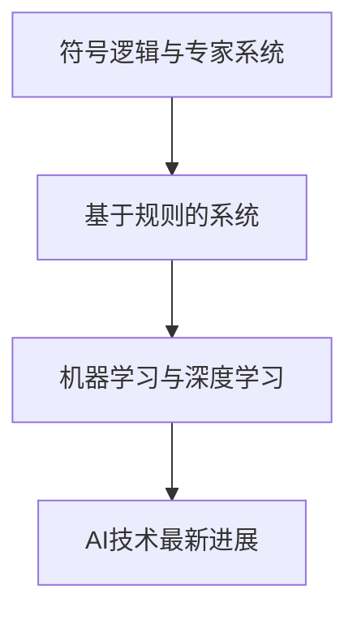
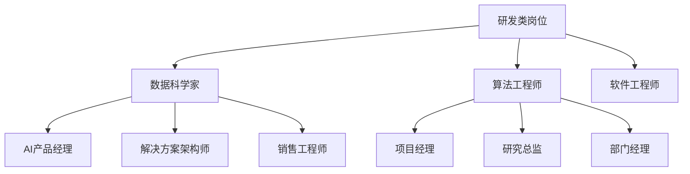
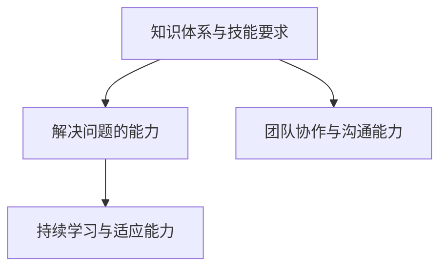
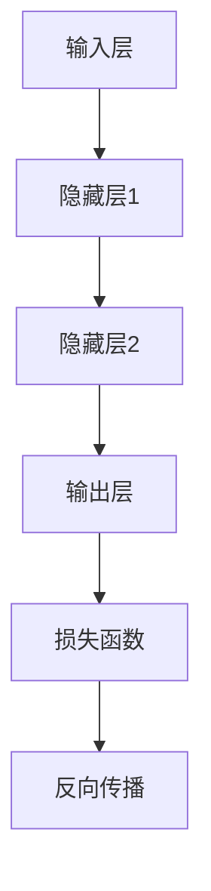

                 

### 文章标题

> **关键词：**AI人才培养，Google AI，学习路径，职业发展，人工智能技术

### 摘要

本文旨在深入探讨Google的AI人才培养体系，从学习路径和职业发展两个方面进行全面分析。首先，我们将概述AI产业的发展历程和人才需求，随后详细解释AI基础知识、数学模型、工程实践能力等核心概念。接着，我们将设计不同的学习路径，帮助读者逐步掌握AI技术。文章还将探讨AI行业的职业分类和职业发展路径规划，分析Google在AI人才培养方面的特色和成功案例。最后，我们将展望AI人才培养的未来趋势与挑战，提出创新方向，以期为AI领域的未来发展提供有益参考。

### 第一部分：AI人才培养体系概述

#### 1.1 AI产业的发展历程

人工智能（AI）技术的发展历程可以追溯到20世纪50年代。从最初的符号逻辑和专家系统，到20世纪80年代基于规则的系统，再到20世纪90年代以来以机器学习和深度学习为核心的技术突破，AI经历了数次重要的发展阶段。以下是一个简化的AI技术演进流程图：



- **符号逻辑与专家系统（20世纪50年代至70年代）**：这一阶段的主要思想是通过符号表示和推理来模拟人类智能。然而，这种方法在面对复杂问题时表现出局限性。

- **基于规则的系统（20世纪80年代）**：引入了基于规则的推理机制，但规则系统的可扩展性和准确性仍然是一个挑战。

- **机器学习与深度学习（20世纪90年代至今）**：机器学习的发展使计算机能够通过数据学习，而深度学习则进一步通过多层神经网络实现了对数据的自动特征提取和高级抽象。

#### 1.2 AI领域的人才需求分析

AI领域的快速发展带来了巨大的市场需求，对人才的需求也在不断增长。以下是AI领域的主要人才需求结构：



- **研发类岗位**：数据科学家、算法工程师和软件工程师是AI研发的核心岗位，他们负责开发、优化和部署AI模型。
- **应用类岗位**：AI产品经理、解决方案架构师和销售工程师负责将AI技术应用于实际业务场景，推动产品创新和市场拓展。
- **管理类岗位**：项目经理、研究总监和部门经理则负责AI项目的规划、管理和战略制定。

#### 1.3 AI人才的核心能力

AI人才需要具备以下核心能力，以确保他们在不断发展的技术领域中保持竞争力：



- **知识体系与技能要求**：AI人才需要掌握机器学习、深度学习、自然语言处理等基础知识和相关技能。
- **解决问题的能力**：AI人才应具备分析和解决复杂问题的能力，包括数据预处理、模型训练和优化等。
- **团队协作与沟通能力**：在AI项目中，团队合作至关重要，良好的沟通能力有助于团队成员之间的协调和合作。

### 第二部分：AI人才培养体系核心概念

#### 2.1 AI基础知识与数学模型

##### 2.1.1 机器学习基础

机器学习是人工智能的核心技术之一，其基本概念包括：

- **数据预处理**：包括数据清洗、数据归一化和特征提取等步骤。
- **模型选择与评估**：选择合适的模型，并通过交叉验证、性能指标（如准确率、召回率等）进行评估。
- **常见算法**：包括线性回归、逻辑回归、决策树、支持向量机等。

以下是一个简单的线性回归算法的伪代码：

```python
def linear_regression(x, y):
    # 计算斜率和截距
    m = (mean(x) * mean(y) - mean(x*y)) / (mean(x)**2 - mean(x)**2)
    b = mean(y) - m * mean(x)
    return m, b
```

##### 2.1.2 深度学习原理

深度学习是机器学习的延伸，通过多层神经网络实现数据的高层次抽象。以下是深度学习的基本架构：



- **神经网络**：由多个神经元组成的网络，每个神经元通过权重连接到其他神经元。
- **卷积神经网络（CNN）**：专门用于图像处理，通过卷积层、池化层和全连接层实现特征提取。
- **循环神经网络（RNN）**：用于处理序列数据，通过隐藏状态和反馈循环实现长期依赖建模。

以下是一个简单的CNN架构的伪代码：

```python
def conv_net(input_data, filters, kernel_size):
    # 卷积层
    conv_output = conv2d(input_data, filters, kernel_size)
    # 池化层
    pool_output = max_pool2d(conv_output)
    # 全连接层
    output = fully_connected(pool_output)
    return output
```

##### 2.1.3 自然语言处理基础

自然语言处理（NLP）是AI领域的重要组成部分，其核心概念包括：

- **词嵌入**：将词语转换为向量表示，以便于进行机器学习操作。
- **语言模型**：用于预测下一个词语的概率分布。
- **机器翻译与文本生成**：通过训练大型神经网络模型实现文本的自动翻译和生成。

以下是一个简单的语言模型训练的伪代码：

```python
def train_language_model(corpus, vocab_size, embedding_size):
    # 构建词汇表
    vocab = build_vocab(corpus, vocab_size)
    # 初始化嵌入矩阵
    embeddings = initialize_embeddings(vocab, embedding_size)
    # 训练语言模型
    model = train(embeddings, corpus)
    return model
```

#### 2.2 AI工程实践能力

##### 2.2.1 数据预处理

数据预处理是AI模型训练的关键步骤，包括以下内容：

- **数据清洗**：去除缺失值、异常值和噪声数据。
- **数据归一化**：将数据缩放到相同的范围，如0-1或-1到1。
- **特征提取**：从原始数据中提取对模型有用的特征。

以下是一个简单的数据清洗和归一化的伪代码：

```python
def preprocess_data(data):
    # 数据清洗
    clean_data = remove_missing_values(data)
    clean_data = remove_outliers(data)
    # 数据归一化
    normalized_data = normalize_data(clean_data)
    return normalized_data
```

##### 2.2.2 模型训练与优化

模型训练与优化是AI工程的的核心任务，包括以下内容：

- **损失函数选择**：选择合适的损失函数来衡量模型预测与实际标签之间的差距。
- **优化算法**：选择合适的优化算法来更新模型参数，如随机梯度下降（SGD）、Adam优化器等。

以下是一个简单的模型训练和优化的伪代码：

```python
def train_model(model, data, loss_function, optimizer):
    # 前向传播
    predictions = model(data)
    loss = loss_function(predictions, labels)
    # 反向传播
    gradients = compute_gradients(loss, model.parameters())
    # 参数更新
    optimizer.update_parameters(gradients)
    return loss
```

##### 2.2.3 模型部署与维护

模型部署与维护是确保AI系统正常运行的关键步骤，包括以下内容：

- **模型打包**：将训练好的模型打包为可部署的形式，如模型文件、依赖库等。
- **部署环境配置**：在目标部署环境中配置所需的软件和硬件资源。
- **实时监控与调优**：监控模型性能，并根据需要进行调优，如参数调整、模型更新等。

以下是一个简单的模型部署和监控的伪代码：

```python
def deploy_model(model, environment):
    # 模型打包
    model_file = pack_model(model)
    # 部署模型
    deploy_model_to_environment(model_file, environment)
    # 实时监控
    monitor_model_performance(environment)
    # 调优
    optimize_model_if_needed(environment)
```

### 第三部分：学习路径设计

#### 3.1 初级学习路径

对于初学者来说，设计一个合理的学习路径非常重要。以下是初级学习路径的设计：

##### 3.1.1 入门课程推荐

- **Python编程基础**：Python是AI领域的常用编程语言，学习Python是入门AI的第一步。
- **机器学习基础**：了解机器学习的基本概念、算法和应用，为后续学习打下基础。

##### 3.1.2 实践项目推荐

- **数据预处理与可视化项目**：通过实际数据处理和可视化，了解数据预处理的重要性。
- **简单机器学习模型训练**：通过训练简单的机器学习模型，熟悉模型训练的基本流程。

#### 3.2 中级学习路径

中级学习路径旨在帮助学习者深入理解AI技术，以下是中级学习路径的设计：

##### 3.2.1 核心技术课程推荐

- **深度学习基础**：学习深度学习的基本概念、架构和应用。
- **自然语言处理入门**：了解自然语言处理的基本概念、技术和应用。

##### 3.2.2 实践项目推荐

- **复杂机器学习模型训练**：通过训练复杂的机器学习模型，提高对模型训练和优化的理解。
- **基于深度学习的图像识别项目**：通过实际项目，了解深度学习在图像识别领域的应用。

#### 3.3 高级学习路径

高级学习路径旨在帮助学习者掌握AI技术的深度和广度，以下是高级学习路径的设计：

##### 3.3.1 专业课程推荐

- **高级深度学习**：深入学习深度学习的高级主题，如GAN、强化学习等。
- **自然语言处理进阶**：深入学习自然语言处理的高级主题，如语义分析、文本生成等。

##### 3.3.2 实战项目推荐

- **复杂深度学习模型应用**：通过实际项目，应用复杂深度学习模型解决实际问题。
- **基于NLP的智能对话系统开发**：通过实际项目，开发基于自然语言处理的智能对话系统。

##### 3.3.3 研究生课程及科研机会推荐

- **研究生课程推荐**：推荐一些高质量的研究生课程，如《深度学习高级课程》、《自然语言处理研究生课程》等。
- **科研机会推荐**：推荐一些AI领域的科研机会，如AI科研项目、实习机会等。

### 第四部分：职业发展路径与规划

#### 4.1 AI行业职业分类

AI行业的职业分类较为丰富，根据岗位职责和技能要求，可以分为以下几类：

##### 4.1.1 研发类岗位

- **数据科学家**：负责数据分析和机器学习模型的开发。
- **算法工程师**：负责算法研究和模型优化。
- **软件工程师**：负责AI系统的开发和维护。

##### 4.1.2 应用类岗位

- **AI产品经理**：负责AI产品的规划和管理。
- **解决方案架构师**：负责AI解决方案的设计和实施。
- **销售工程师**：负责AI产品和服务的销售和推广。

##### 4.1.3 管理类岗位

- **项目经理**：负责AI项目的规划和管理。
- **研究总监**：负责AI研究的战略规划和执行。
- **部门经理**：负责AI部门的日常运营和管理。

#### 4.2 职业发展路径规划

职业发展路径规划对于AI人才的成功至关重要。以下是一个典型的职业发展路径规划：

##### 4.2.1 初级职业发展

- **基础技能培养**：通过学习编程语言、机器学习基础等课程，掌握AI的基本技能。
- **实践项目积累**：通过实际项目，积累经验和技能。
- **持续学习与成长**：定期学习新技术和知识，不断提升自己的能力。

##### 4.2.2 中级职业发展

- **深入技术领域**：选择一个技术方向，深入学习和研究。
- **团队协作与领导能力提升**：参与团队项目，提升团队协作和领导能力。
- **行业影响力的建立**：通过参与行业活动、发表论文等方式，提升自己在行业中的影响力。

##### 4.2.3 高级职业发展

- **创新与突破**：在技术领域进行创新性研究，解决关键问题。
- **战略规划与决策能力**：负责项目的战略规划和决策。
- **行业领导地位**：成为行业的专家和领导者，影响行业的发展方向。

### 第五部分：Google AI人才培养特色

#### 5.1 Google AI教育平台

Google提供了多个AI教育平台，为AI人才的培养提供了丰富的资源和支持。以下是其中两个重要的教育平台：

##### 5.1.1 Google AI Garage

Google AI Garage是一个创新实验室，致力于通过AI技术解决现实问题。该实验室提供以下支持：

- **AI产品设计与开发**：通过工作坊和项目指导，帮助团队设计和开发AI产品。
- **创新思维培养**：通过实践项目和挑战，培养团队成员的创新思维。

##### 5.1.2 Google AI for Social Good

Google AI for Social Good旨在利用AI技术解决社会问题，促进可持续发展。该项目提供以下支持：

- **利用AI解决社会问题**：通过AI技术，解决环境保护、教育、医疗等社会问题。
- **促进社会责任与可持续发展**：通过AI技术，推动企业的社会责任和可持续发展。

#### 5.2 Google AI职业发展支持

Google为AI人才提供了全面的职业发展支持，包括以下内容：

##### 5.2.1 内部培训与认证

- **AI技能提升培训**：提供各种AI技能提升课程，帮助员工不断提升自己的能力。
- **职业发展认证计划**：提供专业的职业发展认证，帮助员工证明自己的能力。

##### 5.2.2 职业发展辅导

- **定制化职业规划咨询**：提供个性化的职业规划咨询，帮助员工制定职业发展计划。
- **人才晋升与发展机会**：提供各种晋升和发展机会，帮助员工实现职业成长。

### 第六部分：案例分析

#### 6.1 成功的AI人才培养案例

以下是一些成功的AI人才培养案例，供参考：

##### 6.1.1 某互联网公司的人才培养体系

该互联网公司通过以下方式成功培养了大量AI人才：

- **内部培训与外部合作**：内部开展AI培训课程，同时与外部教育机构合作，提供高质量的教育资源。
- **技能竞赛与项目实践**：定期举办AI技能竞赛，鼓励员工参与项目实践，提高实际操作能力。
- **人才储备与梯队建设**：通过持续的培训和项目实践，培养一批优秀的AI人才，形成梯队结构。

##### 6.1.2 某科技公司的人才培养经验

该科技公司通过以下方式成功培养了AI人才：

- **专业课程与实战项目结合**：提供专业的AI课程，结合实际项目进行教学，提高学生的实际操作能力。
- **师资力量雄厚**：邀请行业专家和学者担任讲师，提供高质量的教学资源。
- **持续关注行业动态**：定期举办行业研讨会，邀请业内专家分享最新研究成果，帮助员工紧跟行业发展趋势。

#### 6.2 失败的AI人才培养案例分析

以下是一些失败的AI人才培养案例，供参考：

##### 6.2.1 某企业的AI人才培养失败原因

该企业AI人才培养失败的原因主要有以下几点：

- **缺乏系统性培养方案**：没有制定明确的培养计划和目标，导致培养过程缺乏系统性。
- **缺乏实战项目支持**：没有提供足够的实战项目，导致员工难以将所学知识应用到实际工作中。
- **缺乏对员工发展的关注**：没有关注员工的职业发展和成长，导致员工缺乏动力和积极性。

##### 6.2.2 某初创公司的AI人才培养挑战

该初创公司在AI人才培养方面面临以下挑战：

- **人才储备不足**：初创公司通常面临人才短缺的问题，难以吸引和留住优秀的AI人才。
- **资源与时间有限**：初创公司资源有限，时间和精力难以充分投入到人才培养中。
- **缺乏行业经验**：初创公司缺乏行业经验，难以制定合适的培养计划和方案。

### 第七部分：未来展望

#### 7.1 AI人才培养的趋势与挑战

未来AI人才培养将面临以下趋势和挑战：

##### 7.1.1 技术发展趋势

- **AI技术的快速发展**：随着AI技术的不断进步，对人才的要求也在不断提高。
- **跨学科融合**：AI技术的发展需要跨学科的知识和技能，对人才培养提出了新的要求。

##### 7.1.2 教育体系改革

- **课程设置的灵活性**：教育体系需要更加灵活，以适应不断变化的技术需求。
- **教学方法的创新**：采用新的教学方法和工具，提高教学效果和质量。

##### 7.1.3 职业发展环境变化

- **职业技能的要求提升**：随着技术的进步，职业技能的要求也在不断提高。
- **跨行业职业机会增加**：AI技术的发展为跨行业职业机会提供了更多可能性。

#### 7.2 AI人才培养的创新方向

未来AI人才培养将在以下方向上进行创新：

##### 7.2.1 跨学科人才培养

- **多学科交叉融合**：培养具备多学科背景的AI人才，提高人才的全面性和创新能力。
- **创新思维与实践能力的培养**：注重培养AI人才的创新思维和实践能力，提高人才的市场竞争力。

##### 7.2.2 数字化教育的发展

- **在线教育与培训**：发展在线教育平台，提供丰富的AI教育资源。
- **智能学习系统的应用**：采用智能学习系统，提高学习效果和效率。

##### 7.2.3 职业教育与实践相结合

- **实践项目与课程结合**：将实践项目与课程紧密结合，提高学生的实际操作能力。
- **校企合作与实习机会**：加强校企合作，提供更多的实习机会，提高学生的实践能力和职业素养。

### 附录

#### 附录A：学习资源推荐

以下是一些学习资源的推荐，供读者参考：

##### A.1 开源项目与平台

- **GitHub**：提供大量的AI开源项目，是学习AI技术的重要资源。
- **TensorFlow**：Google推出的开源深度学习框架，广泛应用于AI研究和开发。
- **PyTorch**：另一种流行的开源深度学习框架，具有灵活的动态计算图。

##### A.2 专业书籍推荐

- **《深度学习》**：Goodfellow、Bengio和Courville的《深度学习》是深度学习领域的经典教材。
- **《自然语言处理入门》**：Jurafsky和Martin的《自然语言处理入门》是NLP领域的权威教材。

##### A.3 在线课程资源推荐

- **Coursera**：提供多种AI相关的在线课程，由世界顶级大学提供。
- **edX**：由哈佛大学和麻省理工学院创立的在线学习平台，提供高质量的AI课程。
- **Udacity**：提供多种技术领域的在线课程，包括AI、机器学习等。

#### 附录B：职业发展资源

以下是一些职业发展资源的推荐，供读者参考：

##### B.1 行业报告

- **IDC**：国际数据公司（IDC）发布的行业报告，提供关于AI市场和发展趋势的分析。
- **Gartner**：全球知名的信息技术研究和顾问公司，发布关于AI领域的报告。

##### B.2 招聘信息与求职技巧

- **LinkedIn**：专业的社交平台，提供大量的招聘信息和求职技巧。
- **招聘网站**：如智联招聘、前程无忧等，提供各种职位信息。

##### B.3 职业规划工具与资源

- **职业测评工具**：如MBTI、霍兰德职业兴趣测评等，帮助个人了解自己的职业兴趣和优势。
- **职业发展咨询机构**：提供专业的职业规划咨询和培训服务。

### 作者信息

**作者：**AI天才研究院（AI Genius Institute） & 禅与计算机程序设计艺术（Zen And The Art of Computer Programming）

AI天才研究院致力于推动人工智能技术的发展和人才培养，致力于成为AI领域的权威机构。禅与计算机程序设计艺术则是一本经典计算机科学著作，强调程序设计的艺术性和哲学性。两位作者凭借丰富的经验和深厚的学术造诣，为AI人才培养提供了宝贵的见解和建议。

