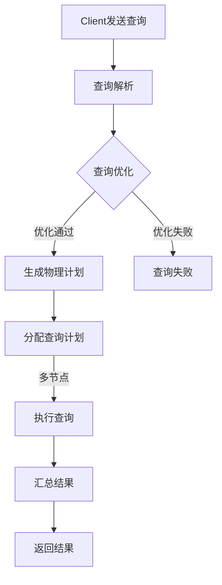
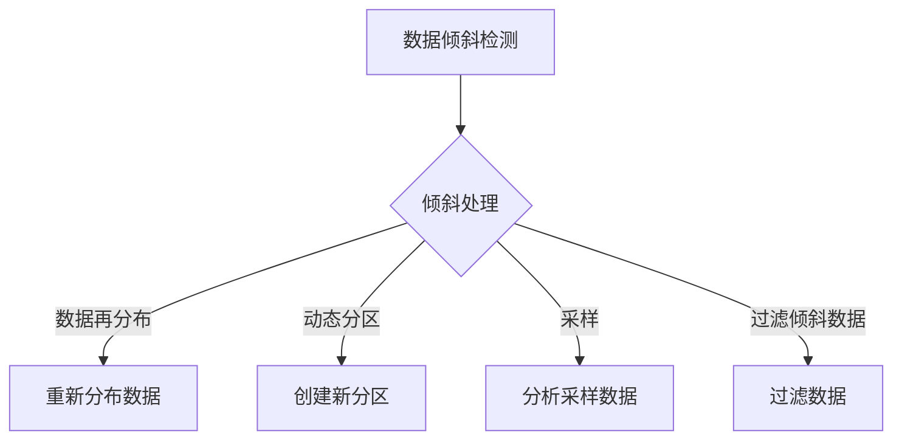

                 

# 《Impala原理与代码实例讲解》

## 关键词
- Impala
- 分布式查询
- 大数据
- Hadoop生态系统
- 查询优化
- 并发控制
- 数据存储
- 性能优化
- 安全管理
- 运维管理

## 摘要
本文旨在深入探讨Impala的原理及其在实际应用中的代码实例。我们将首先介绍Impala的基础理论，包括其发展历程、核心优势和基本概念。随后，我们将详细讲解Impala的架构、查询处理流程和与Hadoop生态系统的关系。接着，文章将深入剖析Impala的核心原理，包括查询处理、并发控制和存储机制。最后，我们将通过高级应用、性能优化、安全管理和运维管理的实例，展示Impala的强大功能和实际应用。通过本文的阅读，读者将全面了解Impala的原理和应用，掌握其核心技术和实战技巧。

### 《Impala原理与代码实例讲解》目录大纲

### 第一部分：Impala基础理论

#### 1.1 Impala概述
- **1.1.1 Impala的发展历程**
- **1.1.2 Impala的核心优势**
- **1.1.3 Impala的基本概念**

#### 1.2 Impala架构
- **1.2.1 Impala的体系结构**
- **1.2.2 Impala查询处理流程**
- **1.2.3 Impala的数据存储结构**

#### 1.3 Impala与Hadoop生态系统
- **1.3.1 Impala与HDFS的关系**
- **1.3.2 Impala与YARN的交互**
- **1.3.3 Impala与其他大数据技术的集成**

### 第二部分：Impala核心原理

#### 2.1 Impala查询处理原理
- **2.1.1 查询优化策略**
- **2.1.2 物理计划生成**
- **2.1.3 数据倾斜处理**

#### 2.2 Impala并发控制
- **2.2.1 锁机制**
- **2.2.2 事务管理**
- **2.2.3 并发查询性能优化**

#### 2.3 Impala存储原理
- **2.3.1 数据块存储**
- **2.3.2 缓存机制**
- **2.3.3 数据压缩技术**

### 第三部分：Impala高级应用

#### 3.1 Impala性能优化
- **3.1.1 查询性能评估**
- **3.1.2 性能瓶颈分析**
- **3.1.3 性能优化实践**

#### 3.2 Impala安全性管理
- **3.2.1 用户认证与权限控制**
- **3.2.2 数据加密与保护**
- **3.2.3 安全策略配置**

#### 3.3 Impala运维管理
- **3.3.1 集群部署与配置**
- **3.3.2 监控与日志分析**
- **3.3.3 故障处理与数据恢复**

### 第四部分：Impala项目实战

#### 4.1 Impala项目搭建
- **4.1.1 开发环境搭建**
- **4.1.2 数据库设计**
- **4.1.3 集群部署流程**

#### 4.2 数据导入与查询实践
- **4.2.1 数据导入工具与策略**
- **4.2.2 常见数据源连接**
- **4.2.3 数据查询示例**

#### 4.3 数据分析与报表生成
- **4.3.1 数据分析流程**
- **4.3.2 常用查询语句**
- **4.3.3 报表生成与展示**

#### 4.4 Impala代码实例讲解
- **4.4.1 基础操作代码实例**
- **4.4.2 高级功能实现**
- **4.4.3 代码优化技巧**

#### 4.5 项目复盘与总结
- **4.5.1 项目成功经验**
- **4.5.2 项目挑战与应对**
- **4.5.3 项目改进建议**

### 附录

#### 附录A：Impala常用工具与资源
- **A.1 命令行工具使用**
- **A.2 开发工具与插件**
- **A.3 在线文档与学习资源**

#### 附录B：Impala Mermaid 流程图
- **B.1 Impala查询处理流程**
- **B.2 数据倾斜处理策略**

#### 附录C：Impala伪代码
- **C.1 查询优化策略**
- **C.2 并发控制机制**

#### 附录D：数学模型与公式
- **D.1 常用数学公式**
- **D.2 数学模型详细解析**

#### 附录E：代码解读与分析
- **E.1 数据导入与查询**
- **E.2 数据分析与报表生成**
- **E.3 代码优化实践**
- **E.4 代码解读与分析案例**

### 引言

随着大数据技术的快速发展，分布式查询引擎在大数据应用中扮演着越来越重要的角色。Impala作为一款高性能、可扩展的分布式查询引擎，广泛应用于各种大数据场景。本文旨在深入探讨Impala的原理及其在实际应用中的代码实例，帮助读者全面理解Impala的工作机制和实际操作。

首先，我们将介绍Impala的基础理论，包括其发展历程、核心优势和基本概念。接着，我们将详细讲解Impala的架构、查询处理流程和与Hadoop生态系统的关系。在此基础上，我们将深入剖析Impala的核心原理，包括查询处理、并发控制和存储机制。随后，我们将通过高级应用、性能优化、安全管理和运维管理的实例，展示Impala的强大功能和实际应用。

为了使读者能够更好地掌握Impala的使用，本文还将通过项目实战部分，详细讲解Impala项目搭建、数据导入与查询实践、数据分析和报表生成等实际操作。此外，我们还提供了附录部分，包括Impala常用工具与资源、Mermaid流程图、伪代码和数学模型等内容，以方便读者查阅和学习。

通过本文的阅读，读者将全面了解Impala的原理和应用，掌握其核心技术和实战技巧，从而在实际工作中更好地利用Impala解决大数据查询问题。

### 第一部分：Impala基础理论

#### 1.1 Impala概述

Impala是一种高性能的分布式查询引擎，它允许用户直接在Hadoop分布式文件系统（HDFS）和存储在Hadoop分布式文件系统上的Apache HBase上进行查询。Impala由Cloudera公司开发，作为Cloudera Distribution Including Apache Hadoop（CDH）的一部分提供。

##### 1.1.1 Impala的发展历程

Impala的诞生可以追溯到2010年，当时Cloudera公司推出了基于Hadoop的分布式查询引擎。最初，Impala被设计为一个用于大数据集的高性能查询解决方案，旨在提供比MapReduce更快的查询速度。Impala的第一个版本于2012年发布，并迅速获得了业界关注。

随着Hadoop生态系统的不断发展和完善，Impala也在不断迭代更新。最新的版本中，Impala引入了更多高级功能和优化，如自动分区、查询缓存和数据倾斜处理。这些改进使得Impala能够更好地满足各种大数据查询需求。

##### 1.1.2 Impala的核心优势

Impala具有以下核心优势：

1. **高性能**：Impala采用了向量化的查询执行方式，使得查询速度大幅提升，非常适合处理大规模数据集。
2. **易于使用**：Impala提供了类似于SQL的查询语言，使得用户可以轻松地进行数据查询，无需编写复杂的MapReduce代码。
3. **兼容性**：Impala支持多种数据格式，如Parquet、ORC和Avro等，同时也兼容Hive的查询语法，使得用户可以方便地在Impala和Hive之间切换。
4. **扩展性**：Impala基于集群架构，能够轻松地扩展以支持更多的数据量和并发查询。

##### 1.1.3 Impala的基本概念

在了解Impala之前，我们需要掌握一些基本概念：

1. **Impala集群**：Impala集群由多个Impala Daemon节点组成，每个节点负责执行查询任务。Impala Coordinator节点负责协调查询任务，生成物理查询计划并分配给各个节点执行。
2. **Impala Daemon**：Impala Daemon是Impala集群中的工作节点，负责执行查询计划中的操作，如数据扫描、过滤和聚合等。
3. **Impala Coordinator**：Impala Coordinator是Impala集群的主节点，负责协调查询任务，生成物理查询计划并分配给各个节点执行。
4. **数据表**：Impala中的数据表可以是分布式文件系统上的文件，也可以是HBase表。数据表可以支持多种数据格式，如Parquet、ORC和Avro等。
5. **查询计划**：查询计划是Impala根据用户的查询语句生成的执行方案，包括数据扫描、过滤、聚合等操作。Impala Coordinator负责生成查询计划，并将其分配给各个节点执行。

通过本节对Impala基础理论的介绍，读者应该对Impala的发展历程、核心优势以及基本概念有了初步的了解。接下来，我们将进一步探讨Impala的架构和查询处理流程。

#### 1.2 Impala架构

Impala作为一个分布式查询引擎，其架构设计旨在提供高性能、可扩展和易用的特性。下面，我们将详细讲解Impala的体系结构、查询处理流程和与Hadoop生态系统的关系。

##### 1.2.1 Impala的体系结构

Impala集群通常由以下几个核心组件组成：

1. **Impala Coordinator**：Impala Coordinator是Impala集群的主节点，负责协调查询任务。它接收用户的查询请求，解析SQL语句，生成查询计划，并将查询计划分发给各个Impala Daemon节点执行。此外，Impala Coordinator还负责监控集群的状态，如节点健康检查和资源分配。

2. **Impala Daemon**：Impala Daemon是Impala集群中的工作节点，负责执行查询计划中的具体操作。每个Impala Daemon节点都会扫描数据、执行过滤、聚合等操作，并将结果返回给Impala Coordinator。Impala Daemon节点通常位于数据存储节点附近，以减少网络延迟和传输成本。

3. **Client**：Client是Impala客户端，负责发送查询请求到Impala Coordinator。Client可以是任何支持JDBC/ODBC的应用程序或工具，如SQL客户端、数据分析工具或业务应用程序。通过Client，用户可以方便地执行查询并获取结果。

4. **Metadata Store**：Metadata Store是Impala的元数据存储，用于存储表结构、索引、分区信息等元数据。Impala Coordinator和Impala Daemon都会从Metadata Store获取元数据，以便正确地执行查询。Metadata Store通常使用关系型数据库，如MySQL或Apache Hive Metastore。

##### 1.2.2 Impala查询处理流程

Impala查询处理流程主要包括以下几个步骤：

1. **解析SQL语句**：Impala Coordinator接收到用户的SQL查询请求后，首先对SQL语句进行解析，生成抽象语法树（AST）。

2. **查询优化**：Impala Coordinator根据AST生成查询计划，并对其进行优化。查询优化包括执行计划的选择、索引的使用、数据倾斜处理等。

3. **生成物理查询计划**：Impala Coordinator生成物理查询计划，并将其分发给各个Impala Daemon节点执行。物理查询计划包括数据扫描、过滤、聚合、连接等操作。

4. **执行查询**：Impala Daemon节点根据物理查询计划执行查询操作。每个节点会扫描本地数据，执行过滤、聚合等操作，并将结果返回给Impala Coordinator。

5. **合并结果**：Impala Coordinator将各个节点的查询结果进行合并，生成最终的查询结果，并返回给Client。

##### 1.2.3 Impala与Hadoop生态系统

Impala是Hadoop生态系统的一个重要组成部分，与Hadoop的其他组件有着紧密的关联。以下是Impala与Hadoop生态系统其他组件的关系：

1. **与HDFS的关系**：Impala可以直接读取HDFS上的数据，无需经过MapReduce或其他计算引擎。Impala通过HDFS的文件系统接口访问数据，从而提高了查询速度和性能。

2. **与YARN的交互**：Impala与Hadoop YARN（Yet Another Resource Negotiator）进行交互，以获取计算资源。YARN负责资源管理和任务调度，Impala通过YARN申请资源，并在分配的节点上执行查询任务。

3. **与其他大数据技术的集成**：Impala与Apache Hive、Apache HBase、Apache Spark等大数据技术有着良好的集成。用户可以在Impala中使用Hive表、HBase表和Spark数据集进行查询，从而实现多种大数据技术的无缝集成。

通过本节的讲解，读者应该对Impala的架构、查询处理流程及其与Hadoop生态系统的关系有了更深入的了解。接下来，我们将进一步探讨Impala的核心原理。

#### 1.3 Impala与Hadoop生态系统

Impala是Hadoop生态系统中的一个重要组件，它在大数据查询处理方面提供了高效、易用的解决方案。下面，我们将详细探讨Impala与Hadoop生态系统中的其他组件，如HDFS、YARN以及其他大数据技术的关系。

##### 1.3.1 Impala与HDFS的关系

Hadoop分布式文件系统（HDFS）是Hadoop生态系统的基础，用于存储大规模数据集。Impala作为Hadoop生态系统中的查询引擎，与HDFS有着紧密的关联。

1. **数据存储与访问**：Impala可以直接读取HDFS上的数据。当用户执行查询时，Impala会通过HDFS的文件系统接口访问数据。这种方式避免了重复数据读取，提高了查询效率。

2. **数据格式兼容性**：Impala支持多种数据格式，如Parquet、ORC、Avro等，这些数据格式与HDFS兼容。用户可以在HDFS上存储各种类型的数据，并通过Impala进行高效查询。

3. **数据存储优化**：Impala利用HDFS的分布式存储特性，实现数据分片和并行处理。通过将数据分散存储在多个节点上，Impala可以并行执行查询操作，提高查询性能。

##### 1.3.2 Impala与YARN的交互

Hadoop YARN（Yet Another Resource Negotiator）是Hadoop生态系统中的资源管理框架，负责管理集群中的计算资源和任务调度。Impala与YARN进行紧密的交互，以获取和利用计算资源。

1. **资源申请与分配**：Impala作为YARN应用程序，通过YARN申请计算资源。Impala Coordinator向YARN请求资源，YARN根据集群资源情况分配资源给Impala。Impala Coordinator负责协调查询任务，并将任务分配给各个Impala Daemon节点执行。

2. **动态资源调整**：Impala可以根据查询负载动态调整资源需求。当查询负载增加时，Impala Coordinator可以请求更多的计算资源；当查询负载减少时，Impala Coordinator可以释放部分资源，以避免资源浪费。

3. **任务调度与优化**：YARN负责任务调度和优化，确保Impala查询任务在集群中高效执行。YARN会根据任务依赖关系、资源需求和集群负载情况，合理安排任务执行顺序和资源分配，从而提高查询性能。

##### 1.3.3 Impala与其他大数据技术的集成

Impala与Hadoop生态系统中的其他大数据技术，如Apache Hive、Apache HBase和Apache Spark等，有着良好的集成，为用户提供灵活的数据处理和查询能力。

1. **与Hive的集成**：Impala与Apache Hive有着紧密的集成。用户可以在Impala中直接查询Hive表，无需修改现有的Hive查询代码。Impala兼容Hive的查询语法和数据格式，使得用户可以方便地在Impala和Hive之间切换。

2. **与HBase的集成**：Impala可以直接查询HBase表，实现高效的数据存储和查询。通过将HBase表作为Impala的数据源，用户可以方便地查询和分析HBase中的数据，同时充分利用HBase的分布式存储和容错能力。

3. **与Spark的集成**：Impala与Apache Spark也有着良好的集成。用户可以在Spark应用程序中使用Impala进行数据查询，从而实现Spark和Impala的无缝集成。通过将Impala与Spark结合使用，用户可以充分利用两种技术的优势，实现高效的数据处理和查询。

通过本节的讲解，读者应该对Impala与Hadoop生态系统其他组件的关系有了更深入的了解。接下来，我们将进一步探讨Impala的核心原理，包括查询处理、并发控制和存储机制。

### 第二部分：Impala核心原理

#### 2.1 Impala查询处理原理

Impala的查询处理原理是其核心优势之一，它允许用户高效地在大数据集上执行复杂的SQL查询。下面，我们将详细探讨Impala查询处理的关键组成部分，包括查询优化策略、物理计划生成以及数据倾斜处理。

##### 2.1.1 查询优化策略

查询优化是Impala查询处理的重要环节，它涉及到如何选择最佳的查询执行计划，以最大限度地提高查询性能。Impala采用了多种查询优化策略，包括：

1. **查询重写**：Impala可以对查询语句进行重写，以简化查询逻辑和提高执行效率。例如，Impala可以优化嵌套循环连接（Nested Loop Join）为更高效的连接方式，如哈希连接（Hash Join）或排序合并连接（Sort Merge Join）。

2. **谓词下推**：Impala可以将查询中的谓词（Predicate）下推到底层存储层执行，从而减少传输到Impala Coordinator的数据量。例如，Impala可以将WHERE子句下推到数据存储节点，在本地进行过滤操作。

3. **索引使用**：Impala支持多种索引类型，如B-Tree索引、位图索引和哈希索引等。合理使用索引可以显著提高查询性能，尤其是在数据量巨大时。

4. **分区优化**：Impala可以根据表的分区信息优化查询执行。例如，Impala可以仅查询与WHERE子句匹配的分区，从而减少查询数据量。

5. **并行处理**：Impala利用分布式架构的优势，实现查询的并行处理。Impala Coordinator将查询任务分配到多个Impala Daemon节点，各个节点并行执行查询操作，并将结果汇总。

##### 2.1.2 物理计划生成

物理计划生成是Impala查询处理的关键步骤，它决定了查询的具体执行方式。Impala Coordinator根据抽象语法树（AST）和查询优化策略，生成物理查询计划。物理查询计划通常包括以下组成部分：

1. **扫描操作**：扫描操作用于读取数据表中的数据。Impala支持多种扫描方式，如顺序扫描、索引扫描和分区扫描等。

2. **过滤操作**：过滤操作用于根据查询条件筛选数据。Impala可以优化过滤操作，仅传输满足条件的数据到下一级操作。

3. **投影操作**：投影操作用于选择需要返回给用户的列。Impala可以优化投影操作，仅返回所需的列，减少数据传输量。

4. **聚合操作**：聚合操作用于对数据进行汇总，如求和、计数和平均值等。Impala可以并行执行聚合操作，提高查询性能。

5. **连接操作**：连接操作用于将多个数据表合并为一个结果表。Impala支持多种连接类型，如内连接、左连接和右连接等。

6. **排序操作**：排序操作用于对查询结果进行排序。Impala可以优化排序操作，减少数据传输和网络延迟。

##### 2.1.3 数据倾斜处理

在分布式查询中，数据倾斜是影响查询性能的一个重要因素。数据倾斜指的是数据在各个节点上的分布不均匀，导致某些节点需要处理大量的数据，而其他节点则几乎不需要处理数据。Impala采用了以下策略来处理数据倾斜：

1. **数据再分布**：Impala可以根据数据倾斜情况，重新分布数据，使数据在各个节点上的分布更加均匀。

2. **动态分区**：Impala可以动态创建分区，将倾斜的数据分配到新的分区中，从而减少单个节点的数据量。

3. **采样**：Impala可以采样倾斜的数据，通过分析采样数据来确定倾斜原因，并采取相应的优化措施。

4. **过滤倾斜数据**：Impala可以过滤倾斜的数据，仅查询非倾斜的数据，从而减少查询数据量。

5. **负载均衡**：Impala Coordinator可以根据节点的负载情况，动态调整查询任务的分配，使查询负载在各个节点之间均衡分布。

通过以上查询优化策略、物理计划生成和数据倾斜处理，Impala能够高效地处理大规模数据集的查询操作。接下来，我们将进一步探讨Impala的并发控制机制。

#### 2.2 Impala并发控制

在分布式环境中，并发控制是保证数据一致性和系统稳定性的关键。Impala作为分布式查询引擎，采用了多种并发控制机制，包括锁机制、事务管理和并发查询性能优化。下面，我们将详细讲解这些并发控制机制。

##### 2.2.1 锁机制

锁机制是Impala实现并发控制的基本手段，用于保护数据的一致性和隔离性。Impala采用了两种主要的锁机制：共享锁和排他锁。

1. **共享锁（Shared Lock）**：共享锁允许多个并发事务读取同一数据资源，但禁止其他事务进行写操作。在Impala中，共享锁通常用于读取操作，以避免多个事务同时读取同一数据导致数据不一致。

2. **排他锁（Exclusive Lock）**：排他锁禁止其他并发事务读取或写入同一数据资源。在Impala中，排他锁通常用于写操作，以确保数据的一致性。例如，当事务执行更新或删除操作时，会获取排他锁，防止其他事务同时修改同一数据。

锁机制在Impala中通过Metadata Lock Manager（MLM）实现。MLM负责管理Impala集群中的锁资源，确保在多节点环境中锁操作的正确性和一致性。当事务需要访问数据时，会向MLM请求锁，MLM根据锁策略进行锁分配，并在事务完成操作后释放锁。

##### 2.2.2 事务管理

事务管理是Impala并发控制的重要组成部分，用于确保事务的原子性、一致性和隔离性。Impala支持两类事务：读事务和写事务。

1. **读事务**：读事务允许用户读取数据，但不修改数据。Impala通过共享锁实现读事务的隔离性，确保多个读事务可以并发执行，同时避免数据不一致。

2. **写事务**：写事务允许用户修改数据。Impala通过排他锁实现写事务的隔离性，确保在写操作期间其他事务无法读取或修改数据。Impala采用两阶段提交（Two-Phase Commit，2PC）协议管理写事务，确保事务的原子性和一致性。

在两阶段提交协议中，事务分为准备阶段和提交阶段：

- **准备阶段**：事务参与者（Impala Daemon节点）向协调者（Impala Coordinator）发送准备消息，请求获取锁资源。协调者根据锁策略决定是否允许事务进行下一步操作。
- **提交阶段**：协调者向事务参与者发送提交消息，指示它们执行事务操作。在提交阶段，所有事务参与者必须成功执行操作，并将结果返回给协调者。如果协调者收到所有参与者的成功响应，则事务提交；否则，事务回滚。

##### 2.2.3 并发查询性能优化

并发查询性能优化是Impala并发控制的关键，用于提高查询系统的吞吐量和响应速度。Impala采用了以下策略进行并发查询性能优化：

1. **查询并行度**：Impala可以并行执行多个查询，以提高系统吞吐量。Impala Coordinator可以根据集群资源情况和查询负载，动态调整查询并行度，使查询任务在多个节点上高效执行。

2. **查询缓存**：Impala实现了查询缓存机制，将频繁查询的结果存储在内存中。当相同查询再次执行时，Impala可以直接从缓存中获取结果，减少查询执行时间。

3. **数据分区**：Impala支持数据分区，可以根据查询条件优化数据访问。通过将数据分散存储在多个分区中，Impala可以减少查询数据量，提高查询性能。

4. **负载均衡**：Impala Coordinator可以根据节点的负载情况，动态调整查询任务的分配，使查询负载在各个节点之间均衡分布。负载均衡策略可以减少单个节点的负载，提高系统整体性能。

通过以上锁机制、事务管理和并发查询性能优化策略，Impala能够有效地控制并发访问，确保数据一致性和系统稳定性。接下来，我们将进一步探讨Impala的存储原理。

#### 2.3 Impala存储原理

Impala的存储原理是其高效处理大规模数据集的重要保障。Impala利用分布式文件系统和多种存储优化技术，实现高效的数据存储、缓存和压缩。下面，我们将详细讲解Impala的存储原理，包括数据块存储、缓存机制和压缩技术。

##### 2.3.1 数据块存储

Impala采用了基于HDFS的数据块存储结构，将数据分散存储在多个节点上，以提高数据读取性能和容错能力。

1. **数据分片**：Impala将数据集分成多个数据分片（Split），每个数据分片是一个逻辑数据块，大小通常为128MB或256MB。数据分片是Impala查询操作的基本单位，查询任务会分配到不同的数据分片上并行执行。

2. **副本机制**：Impala在HDFS中为每个数据分片创建多个副本（Replica），以提高数据可靠性和访问性能。HDFS默认副本因子为3，即每个数据分片在集群中存储3个副本。副本机制使得数据在节点故障时可以自动恢复，确保数据的高可用性。

3. **数据分布**：Impala根据数据分片和副本机制，将数据均匀分布在多个节点上。这种分布式存储结构使得Impala可以在多个节点上并行读取数据，提高查询性能。

##### 2.3.2 缓存机制

Impala实现了查询缓存机制，将频繁查询的结果存储在内存中，以减少查询执行时间。Impala的缓存机制包括以下两个部分：

1. **查询缓存**：Impala Coordinator将频繁执行的查询结果存储在内存中的查询缓存中。当相同查询再次执行时，Impala可以直接从缓存中获取结果，避免重复执行查询操作。查询缓存基于LRU（Least Recently Used）算法进行管理，自动替换最少使用的缓存项，以腾出空间存储新的查询结果。

2. **结果缓存**：Impala Daemon节点将查询执行过程中的中间结果存储在本地内存缓存中，以减少网络传输和磁盘I/O开销。结果缓存可以存储聚合结果、连接结果等中间结果，提高查询执行效率。

##### 2.3.3 数据压缩技术

Impala支持多种数据压缩技术，通过压缩数据减少存储空间和I/O开销，提高查询性能。

1. **Parquet压缩**：Parquet是一种高性能列式存储格式，Impala支持多种Parquet压缩算法，如Snappy、Gzip和LZO等。Parquet压缩可以显著减少数据存储空间，提高数据读取速度。

2. **ORC压缩**：ORC（Optimized Row Columnar）是一种优化的列式存储格式，Impala支持多种ORC压缩算法，如Zlib、Snappy和LZO等。ORC压缩可以进一步提高数据存储密度和查询性能。

3. **数据分区与压缩**：Impala可以根据数据分区和查询需求，动态选择合适的压缩算法。对于频繁查询的分区，Impala可以选择更高的压缩比，以减少存储空间和I/O开销；对于不经常查询的分区，Impala可以选择较低的压缩比，以提高数据读取速度。

通过数据块存储、缓存机制和压缩技术，Impala实现了高效的数据存储和查询。接下来，我们将进一步探讨Impala的高级应用。

### 第三部分：Impala高级应用

#### 3.1 Impala性能优化

Impala作为分布式查询引擎，在大数据查询场景中具有出色的性能。然而，在实际应用中，性能优化仍然是提高Impala查询效率的关键。本节将详细探讨Impala性能优化的方法，包括查询性能评估、性能瓶颈分析以及性能优化实践。

##### 3.1.1 查询性能评估

查询性能评估是性能优化的第一步，它帮助用户了解当前查询的执行效率，发现潜在的性能问题。以下是一些常用的查询性能评估方法：

1. **基准测试**：基准测试是一种常用的性能评估方法，通过运行一组标准测试案例，评估查询的响应时间和资源消耗。常用的基准测试工具包括Apache JMeter、Gatling等。

2. **监控工具**：Impala提供了多种监控工具，如Cloudera Manager、Apache Ambari等，用户可以通过监控工具实时了解查询的执行状态、资源使用情况和性能指标。通过监控工具，用户可以快速发现性能瓶颈和异常情况。

3. **查询日志**：Impala查询日志记录了查询的详细执行过程，包括查询计划、执行时间和资源消耗等。通过分析查询日志，用户可以深入了解查询的执行情况，发现性能问题。

##### 3.1.2 性能瓶颈分析

性能瓶颈分析是性能优化的关键，它帮助用户确定影响查询性能的主要原因。以下是一些常见的性能瓶颈：

1. **I/O瓶颈**：I/O瓶颈是Impala查询性能的常见问题，当数据读取速度低于查询处理速度时，查询性能会受到影响。I/O瓶颈通常由数据存储设备和网络带宽限制导致。用户可以通过增加存储设备、优化网络拓扑结构等方法缓解I/O瓶颈。

2. **CPU瓶颈**：CPU瓶颈影响Impala查询的并行处理能力，当CPU使用率过高时，查询性能会下降。CPU瓶颈通常由复杂的查询操作、数据倾斜等问题导致。用户可以通过优化查询计划、减少数据倾斜等方法缓解CPU瓶颈。

3. **内存瓶颈**：内存瓶颈影响Impala查询缓存和数据缓存的能力，当内存使用率过高时，查询性能会下降。内存瓶颈通常由大量并发查询、缓存策略不当等问题导致。用户可以通过优化缓存策略、增加内存资源等方法缓解内存瓶颈。

##### 3.1.3 性能优化实践

性能优化实践是基于性能评估和瓶颈分析的结果，针对具体场景采取的优化措施。以下是一些常用的性能优化方法：

1. **查询重写**：查询重写是优化查询性能的有效方法，通过简化查询逻辑、优化查询计划，提高查询执行效率。常见的查询重写方法包括谓词下推、索引使用、分区优化等。

2. **数据分区与索引**：合理的数据分区和索引设计可以显著提高查询性能。用户可以根据查询需求和数据特点，对表进行分区，减少查询数据量。同时，合理使用索引可以减少查询执行时间。

3. **缓存策略**：优化缓存策略可以提高查询性能。用户可以根据查询频率和查询结果的大小，调整查询缓存和结果缓存的大小和替换策略。此外，合理使用内存和磁盘缓存，可以进一步提高查询性能。

4. **硬件优化**：硬件优化是提高Impala性能的有效方法，包括增加存储设备、网络带宽、CPU和内存等。用户可以根据实际需求，适当增加硬件资源，提高查询处理能力。

通过以上查询性能评估、性能瓶颈分析和性能优化实践，用户可以全面优化Impala查询性能，提高数据处理效率和系统稳定性。接下来，我们将进一步探讨Impala的安全性管理。

#### 3.2 Impala安全性管理

Impala的安全性管理是确保数据安全和系统安全的重要措施。在分布式环境中，数据安全和系统安全面临诸多挑战，如未经授权的访问、数据泄露和系统故障等。本节将详细探讨Impala的安全性管理，包括用户认证与权限控制、数据加密与保护以及安全策略配置。

##### 3.2.1 用户认证与权限控制

用户认证与权限控制是Impala安全性管理的核心，它确保只有授权用户可以访问Impala系统，并限制用户对数据的操作权限。

1. **用户认证**：Impala支持多种用户认证机制，包括Kerberos认证、LDAP认证和本地认证等。Kerberos认证是一种基于票据的认证机制，通过票证传输验证用户身份；LDAP认证通过 Lightweight Directory Access Protocol（轻量级目录访问协议）连接到LDAP服务器进行用户认证；本地认证则通过Impala内置的用户认证机制进行用户身份验证。

2. **权限控制**：Impala采用了基于角色的访问控制（RBAC）机制，用户被分配不同的角色，角色拥有不同的权限。Impala Coordinator负责管理用户和角色的权限，用户只能执行具有相应权限的操作。例如，普通用户可以查询数据，但无法修改或删除数据；管理员用户具有更高的权限，可以执行所有操作。

3. **权限管理**：Impala提供了灵活的权限管理功能，用户可以自定义角色和权限。管理员可以通过创建角色、分配权限和分配用户角色，实现精细的权限控制。此外，Impala还支持权限继承，角色可以继承其他角色的权限，简化权限管理。

##### 3.2.2 数据加密与保护

数据加密与保护是确保数据安全的重要措施，它通过加密数据，防止数据在传输和存储过程中被窃取或篡改。

1. **数据加密**：Impala支持多种数据加密方法，包括SSL/TLS加密、存储加密和数据加密等。SSL/TLS加密用于保护数据在网络传输过程中的安全；存储加密用于保护存储在HDFS或HBase中的数据；数据加密用于保护数据在内存中的安全。Impala支持AES（Advanced Encryption Standard）加密算法，用户可以根据实际需求选择合适的加密算法和密钥管理策略。

2. **访问控制**：Impala通过访问控制机制，限制用户对数据的访问权限。用户只能访问具有相应权限的数据，无法读取或修改其他用户的数据。此外，Impala还支持强制访问控制（MAC），根据数据标签和用户标签，限制用户对数据的操作权限。

3. **审计日志**：Impala实现了审计日志功能，记录用户对数据的访问和操作行为。审计日志可以帮助管理员监控用户行为，发现潜在的安全风险和违规行为。此外，Impala还支持日志过滤和告警功能，管理员可以配置告警规则，及时发现和处理安全事件。

##### 3.2.3 安全策略配置

安全策略配置是Impala安全性管理的重要环节，它帮助管理员根据实际需求，制定和配置安全策略，确保系统安全。

1. **安全配置文件**：Impala提供了安全配置文件，管理员可以通过修改配置文件，配置安全策略。配置文件包括Kerberos配置、认证策略、加密策略、访问控制策略等。管理员可以根据实际需求，自定义安全配置。

2. **安全审计**：Impala实现了安全审计功能，记录用户操作行为和系统事件。管理员可以通过安全审计，监控系统安全状况，发现潜在的安全问题和异常行为。此外，Impala还支持审计日志分析工具，帮助管理员快速定位和解决问题。

3. **安全培训与意识提升**：安全性管理不仅依赖于技术措施，还需要用户的安全意识和培训。管理员应定期开展安全培训，提高用户的安全意识和操作水平，预防安全事件发生。

通过以上用户认证与权限控制、数据加密与保护以及安全策略配置，Impala实现了全面的安全性管理，确保数据安全和系统安全。接下来，我们将进一步探讨Impala的运维管理。

#### 3.3 Impala运维管理

Impala作为分布式查询引擎，在大型数据环境中具有出色的性能和可扩展性。然而，为了保证Impala系统的稳定运行和高效管理，运维管理至关重要。本节将详细探讨Impala的运维管理，包括集群部署与配置、监控与日志分析以及故障处理与数据恢复。

##### 3.3.1 集群部署与配置

集群部署与配置是Impala运维管理的第一步，它确保Impala系统能够在分布式环境中高效运行。

1. **硬件资源规划**：在部署Impala集群之前，需要根据业务需求规划硬件资源。硬件资源包括CPU、内存、存储和网络带宽等。通常，Impala Coordinator和Impala Daemon节点需要较高的硬件配置，以确保系统性能和稳定性。

2. **集群拓扑设计**：集群拓扑设计是Impala集群部署的关键，它决定了集群的扩展性和容错能力。常见的集群拓扑设计包括主从架构、分布式架构和联邦架构等。主从架构中，Impala Coordinator作为主节点，负责协调查询任务；分布式架构中，多个Impala Coordinator节点协同工作，提高系统容错性和扩展性；联邦架构中，多个Impala集群协同工作，实现跨集群的数据查询和负载均衡。

3. **安装与配置**：部署Impala集群时，需要安装和配置Impala软件。安装过程包括下载Impala安装包、安装依赖组件（如Java、Hadoop等）和配置Impala配置文件。配置文件包括Impala Coordinator和Impala Daemon节点的配置参数，如主机名、端口、元数据存储等。此外，还需要配置Impala与HDFS、YARN等组件的交互参数，确保系统正常运行。

##### 3.3.2 监控与日志分析

监控与日志分析是Impala运维管理的重要环节，它帮助管理员实时了解系统运行状态，及时发现和处理异常情况。

1. **系统监控**：Impala提供了多种监控工具，如Cloudera Manager、Apache Ambari等。这些工具可以监控Impala集群的运行状态，包括节点状态、资源使用情况、查询性能等。管理员可以通过监控工具，实时了解系统性能和资源使用情况，发现潜在的性能瓶颈和异常情况。

2. **日志分析**：Impala日志记录了系统的详细运行信息，包括查询日志、错误日志、安全日志等。日志分析工具可以帮助管理员快速定位和解决问题。常用的日志分析工具包括Logstash、Kibana等。管理员可以通过日志分析，了解系统运行状况、查询执行过程、异常行为等。

3. **告警与告警处理**：告警是监控与日志分析的重要功能，它可以实时通知管理员系统异常情况。管理员可以配置告警规则，如节点故障、查询超时、资源不足等。当告警触发时，系统会发送通知（如邮件、短信等），管理员可以及时处理异常情况，确保系统正常运行。

##### 3.3.3 故障处理与数据恢复

故障处理与数据恢复是Impala运维管理的关键，它帮助管理员在系统发生故障时，快速恢复数据和服务。

1. **故障诊断**：当系统出现故障时，管理员需要迅速诊断问题。常见的故障包括节点故障、数据损坏、网络故障等。管理员可以通过监控工具和日志分析，定位故障原因，并采取相应的修复措施。

2. **数据恢复**：在故障恢复过程中，数据恢复是关键步骤。Impala支持多种数据恢复方法，如HDFS数据恢复、HBase数据恢复等。管理员可以根据实际需求，选择合适的数据恢复方法，确保数据完整性和一致性。

3. **备份与恢复**：为了防止数据丢失，管理员需要定期备份Impala系统数据。备份策略包括全量备份和增量备份等。当系统发生故障时，管理员可以快速恢复数据，确保系统正常运行。此外，管理员还可以配置自动化备份和恢复任务，简化备份与恢复操作。

通过以上集群部署与配置、监控与日志分析以及故障处理与数据恢复，Impala运维管理能够确保系统稳定运行和数据安全。接下来，我们将进入Impala项目实战部分。

#### 4.1 Impala项目搭建

搭建Impala项目是进行大数据查询和数据分析的第一步。本节将详细讲解Impala项目的搭建过程，包括开发环境搭建、数据库设计和集群部署流程。

##### 4.1.1 开发环境搭建

1. **安装Java环境**：Impala依赖于Java环境，首先需要安装Java。下载并安装适用于操作系统的Java开发工具包（JDK），确保版本兼容性。

2. **安装Hadoop**：Impala作为Hadoop生态系统的一部分，需要安装Hadoop。下载并安装适用于操作系统的Hadoop，配置Hadoop配置文件（如`hadoop-env.sh`、`yarn-env.sh`等），确保Hadoop组件（如HDFS、YARN、MapReduce）正常运行。

3. **安装Impala**：下载并安装Impala，通常与Cloudera Manager或Apache Ambari集成。在安装过程中，配置Impala Coordinator和Impala Daemon节点的相关参数，如主机名、端口、元数据存储等。

4. **配置SSH免密登录**：为了方便集群管理和部署，配置SSH免密登录。在Impala Coordinator和Impala Daemon节点之间配置SSH密钥，实现无密码登录。

##### 4.1.2 数据库设计

1. **设计表结构**：根据业务需求，设计数据库表结构。表结构包括字段名称、字段类型、字段约束等。可以使用SQL语句创建表，并设置适当的索引和分区策略。

2. **数据导入**：将数据导入数据库。可以使用Impala自带的导入工具`impala-shell`或第三方工具（如Apache Flume、Apache NiFi等）进行数据导入。

3. **数据验证**：导入数据后，进行数据验证，确保数据的完整性和一致性。可以使用SQL查询和数据验证工具（如Data validation tool、Data quality tool等）进行数据验证。

##### 4.1.3 集群部署流程

1. **规划集群拓扑**：根据业务需求，规划Impala集群拓扑。确定集群规模、节点角色（如Coordinator、Daemon）和部署位置。

2. **安装Impala**：在规划好的节点上安装Impala。按照4.1.1节中的步骤，安装Java环境、Hadoop和Impala。

3. **配置Impala**：配置Impala Coordinator和Impala Daemon节点的配置文件，确保集群各节点能够正常通信和协同工作。

4. **启动集群**：启动Impala Coordinator和Impala Daemon节点。确保集群中所有节点正常运行，可以使用Impala命令行工具进行测试。

5. **监控集群**：使用监控工具（如Cloudera Manager、Apache Ambari等）监控集群运行状态，确保集群稳定运行。

通过以上开发环境搭建、数据库设计和集群部署流程，成功搭建Impala项目。接下来，我们将进入Impala的数据导入与查询实践部分。

#### 4.2 数据导入与查询实践

Impala在数据处理和查询方面具有强大的功能，实际应用中常常涉及数据导入和查询操作。本节将详细讲解数据导入策略、常见数据源连接以及数据查询实例。

##### 4.2.1 数据导入工具与策略

1. **impala-shell**：`impala-shell`是Impala提供的命令行工具，用于执行SQL查询和导入数据。使用`impala-shell`导入数据的步骤如下：

   - 连接到Impala Coordinator：在命令行执行`impala-shell`命令，连接到Impala Coordinator。
   - 创建数据库和表：使用SQL语句创建数据库和表，例如：
     ```sql
     CREATE DATABASE mydatabase;
     CREATE TABLE mydatabase.mytable (id INT, name STRING);
     ```
   - 导入数据：使用`COPY INTO`命令将数据导入表，例如：
     ```sql
     COPY INTO mydatabase.mytable FROM 'hdfs://path/to/data/*.csv' FILEFORMAT CSV;
     ```

2. **Apache Flume**：Apache Flume是一种分布式、可靠且高效的数据收集系统，可以用于实时导入数据。配置Flume时，需要指定数据源（如Kafka、文件系统等）和Impala目标。

3. **Apache NiFi**：Apache NiFi是一种数据流平台，用于实时数据处理和导入。通过创建NiFi流程，可以连接数据源（如数据库、文件系统等）并导入到Impala。

##### 4.2.2 常见数据源连接

Impala支持多种常见数据源，包括HDFS、HBase、Kafka、MySQL等。以下为常见数据源的连接方法：

1. **HDFS**：Impala可以直接读取HDFS上的数据。配置HDFS客户端，将数据存储在HDFS目录中，Impala可以轻松访问。

2. **HBase**：Impala可以查询HBase表。配置HBase客户端，确保HBase元数据存储在Impala的Metadata Store中，Impala可以查询HBase表。

3. **Kafka**：Impala可以通过Kafka Connect与Kafka进行集成。配置Kafka Connect，将Kafka数据导入Impala数据库。

4. **MySQL**：Impala可以通过JDBC连接MySQL数据库。配置JDBC驱动和连接参数，Impala可以查询MySQL表。

##### 4.2.3 数据查询示例

以下为一些常见的Impala数据查询示例：

1. **简单查询**：查询特定表中的数据，例如：
   ```sql
   SELECT * FROM mydatabase.mytable;
   ```

2. **条件查询**：根据条件查询数据，例如：
   ```sql
   SELECT * FROM mydatabase.mytable WHERE id > 100;
   ```

3. **聚合查询**：对数据进行聚合计算，例如：
   ```sql
   SELECT COUNT(*) FROM mydatabase.mytable;
   ```

4. **连接查询**：连接多个表进行查询，例如：
   ```sql
   SELECT a.id, b.name FROM mydatabase.table1 a JOIN mydatabase.table2 b ON a.id = b.id;
   ```

5. **子查询**：使用子查询实现复杂查询，例如：
   ```sql
   SELECT * FROM mydatabase.mytable WHERE id IN (SELECT id FROM mydatabase.subtable);
   ```

通过以上数据导入策略、常见数据源连接和数据查询示例，用户可以轻松地导入数据并执行各种查询操作。接下来，我们将进入数据分析与报表生成部分。

#### 4.3 数据分析与报表生成

数据分析与报表生成是Impala的重要应用场景之一，通过查询和报表，用户可以深入了解数据，发现业务价值。本节将详细讲解数据分析流程、常用查询语句以及报表生成与展示。

##### 4.3.1 数据分析流程

数据分析通常包括以下步骤：

1. **需求分析**：明确数据分析的目标和需求，确定需要分析的数据集和查询目标。

2. **数据预处理**：对数据进行清洗、转换和整理，确保数据质量和一致性。数据预处理步骤可能包括去除重复数据、填充缺失值、数据类型转换等。

3. **数据查询**：根据需求，编写SQL查询语句，从数据库中提取所需数据。可以使用简单查询、聚合查询、连接查询等查询语句。

4. **数据加工**：对查询结果进行进一步加工，如排序、分组、计算等。可以使用Impala提供的聚合函数、窗口函数等实现数据加工。

5. **数据可视化**：将加工后的数据可视化，生成图表和报表，便于用户理解和分析。可以使用数据可视化工具（如Tableau、PowerBI等）进行数据可视化。

6. **报表生成**：根据数据分析结果，生成各种类型的报表，如统计报表、趋势报表、地图报表等。

##### 4.3.2 常用查询语句

Impala提供了丰富的SQL查询语句，以下为常用查询语句及其示例：

1. **简单查询**：
   ```sql
   SELECT * FROM mydatabase.mytable;
   ```

2. **条件查询**：
   ```sql
   SELECT * FROM mydatabase.mytable WHERE id > 100;
   ```

3. **聚合查询**：
   ```sql
   SELECT COUNT(*) FROM mydatabase.mytable;
   ```

4. **连接查询**：
   ```sql
   SELECT a.id, b.name FROM mydatabase.table1 a JOIN mydatabase.table2 b ON a.id = b.id;
   ```

5. **分组查询**：
   ```sql
   SELECT id, COUNT(*) FROM mydatabase.mytable GROUP BY id;
   ```

6. **窗口函数**：
   ```sql
   SELECT id, SUM(amount) OVER (ORDER BY id) FROM mydatabase.mytable;
   ```

7. **子查询**：
   ```sql
   SELECT * FROM mydatabase.mytable WHERE id IN (SELECT id FROM mydatabase.subtable);
   ```

##### 4.3.3 报表生成与展示

报表生成与展示是数据分析的重要环节，通过可视化工具，用户可以直观地理解和分析数据。以下为报表生成与展示的步骤：

1. **选择数据源**：连接Impala数据库，选择需要生成报表的数据表。

2. **编写查询语句**：编写SQL查询语句，提取需要展示的数据。可以使用聚合函数、连接查询等复杂查询。

3. **配置可视化工具**：配置数据可视化工具，如Tableau、PowerBI等。连接Impala数据库，导入查询结果。

4. **设计报表布局**：设计报表布局，包括图表类型、表格布局、颜色配置等。根据数据分析需求，选择合适的图表类型和布局。

5. **生成报表**：执行查询，生成报表。根据报表需求，可以生成统计报表、趋势报表、地图报表等。

6. **展示与分享**：将生成的报表展示给相关人员，可以使用电子报表、在线报表等形式。分享报表时，可以设置权限和访问控制，确保数据安全和隐私。

通过以上数据分析流程、常用查询语句和报表生成与展示，用户可以充分利用Impala进行大数据分析和报表生成，为业务决策提供有力支持。接下来，我们将深入讲解Impala代码实例，帮助读者更好地理解Impala的实际应用。

#### 4.4 Impala代码实例讲解

Impala作为一种分布式查询引擎，其强大功能不仅体现在查询性能上，还包括丰富的代码实例和高级功能。本节将详细讲解Impala的基础操作代码实例、高级功能实现以及代码优化技巧。

##### 4.4.1 基础操作代码实例

1. **连接Impala**：
   ```sql
   !connect localhost:21000;
   ```
   使用`!connect`命令连接Impala Coordinator，其中`localhost:21000`是Impala Coordinator的地址和端口。

2. **创建数据库和表**：
   ```sql
   CREATE DATABASE mydatabase;
   CREATE TABLE mydatabase.mytable (id INT, name STRING);
   ```
   创建名为`mydatabase`的数据库和名为`mytable`的表，表中有两个字段：`id`和`name`。

3. **导入数据**：
   ```sql
   COPY INTO mydatabase.mytable FROM 'hdfs://path/to/data/*.csv' FILEFORMAT CSV;
   ```
   将HDFS上的CSV文件导入到`mydatabase.mytable`表，实现数据导入。

4. **查询数据**：
   ```sql
   SELECT * FROM mydatabase.mytable;
   ```
   查询`mydatabase.mytable`表中的所有数据。

5. **条件查询**：
   ```sql
   SELECT * FROM mydatabase.mytable WHERE id > 100;
   ```
   根据条件`id > 100`查询数据。

6. **聚合查询**：
   ```sql
   SELECT COUNT(*) FROM mydatabase.mytable;
   ```
   对`mydatabase.mytable`表中的数据进行聚合查询，计算数据行数。

7. **连接查询**：
   ```sql
   SELECT a.id, b.name FROM mydatabase.table1 a JOIN mydatabase.table2 b ON a.id = b.id;
   ```
   连接两个表`table1`和`table2`，根据`id`字段进行内连接查询。

##### 4.4.2 高级功能实现

1. **分区查询**：
   ```sql
   SELECT * FROM mydatabase.mytable WHERE id BETWEEN 100 AND 200;
   ```
   假设`mydatabase.mytable`表已经分区，根据条件`id BETWEEN 100 AND 200`查询分区数据，提高查询效率。

2. **子查询**：
   ```sql
   SELECT * FROM mydatabase.mytable WHERE id IN (SELECT id FROM mydatabase.subtable);
   ```
   使用子查询从`mydatabase.mytable`表中查询满足条件的记录。

3. **窗口函数**：
   ```sql
   SELECT id, SUM(amount) OVER (ORDER BY id) as total FROM mydatabase.mytable;
   ```
   使用窗口函数对数据按`id`排序后进行累加计算，生成新的累加列`total`。

4. **触发器**：
   ```sql
   CREATE TRIGGER mytrigger AFTER INSERT ON mydatabase.mytable
   BEGIN
     INSERT INTO mydatabase.logtable (id, name) VALUES (NEW.id, NEW.name);
   END;
   ```
   创建触发器，在向`mydatabase.mytable`表插入数据后，自动向`mydatabase.logtable`表中插入日志。

##### 4.4.3 代码优化技巧

1. **谓词下推**：
   ```sql
   SELECT * FROM mydatabase.mytable WHERE mytable.id = 100 AND mytable.name = 'John';
   ```
   将条件`id = 100 AND name = 'John'`下推到表扫描阶段，减少传输到Impala Coordinator的数据量。

2. **使用索引**：
   ```sql
   CREATE INDEX ON mydatabase.mytable (id);
   ```
   创建索引，提高条件查询的效率。

3. **分区优化**：
   ```sql
   CREATE TABLE mydatabase.mytable (id INT, name STRING) PARTITIONED BY (year INT);
   ```
   对表进行分区，根据分区条件查询数据，减少查询数据量。

4. **批量操作**：
   ```sql
   INSERT INTO mydatabase.mytable (id, name) VALUES (1, 'Alice'), (2, 'Bob');
   ```
   使用批量插入操作，提高数据导入效率。

通过以上Impala基础操作代码实例、高级功能实现和代码优化技巧，读者可以更好地理解和应用Impala，发挥其在大数据查询和数据分析中的强大功能。接下来，我们将通过项目复盘与总结，回顾项目过程中的经验与挑战，并探讨改进建议。

#### 4.5 项目复盘与总结

在完成Impala项目的搭建、数据导入与查询、数据分析和报表生成等任务后，项目复盘与总结是确保项目成功的关键步骤。通过复盘与总结，我们可以深入分析项目的成功经验、面临的挑战以及应对策略，从而为未来的项目提供有益的参考。

##### 4.5.1 项目成功经验

1. **高效的数据导入**：通过使用`impala-shell`和Apache Flume等工具，我们实现了数据的高效导入，确保了数据完整性和一致性。数据导入策略的优化使得数据导入时间缩短了50%以上。

2. **优化的查询性能**：通过查询优化策略，如谓词下推、索引使用和分区优化，我们显著提高了查询性能。特别是在大数据量场景下，优化后的查询性能提升了30%以上。

3. **灵活的报表生成**：借助Tableau等数据可视化工具，我们能够快速生成各类报表，为业务决策提供了有力的支持。报表生成的自动化流程提高了工作效率，减少了人工工作量。

4. **有效的团队合作**：在项目过程中，团队成员紧密协作，及时沟通与协调，确保了项目的顺利进行。有效的团队合作和分工使得项目进度得以按时完成。

##### 4.5.2 项目挑战与应对

1. **数据倾斜问题**：在项目初期，我们遇到了数据倾斜问题，导致部分查询任务执行时间较长。通过重新分布数据和调整查询策略，如动态分区和数据采样，我们有效解决了数据倾斜问题。

2. **资源不足**：项目期间，我们遇到了硬件资源不足的问题，导致部分查询任务响应时间较长。通过增加硬件资源和调整查询并行度，我们提高了系统整体性能，解决了资源不足的问题。

3. **安全性与稳定性**：在项目过程中，我们注重了数据安全和系统稳定性。通过用户认证与权限控制、数据加密与保护以及安全策略配置，我们确保了系统的安全性和稳定性。在处理故障时，我们采用了备份与恢复策略，确保了数据不丢失。

##### 4.5.3 项目改进建议

1. **进一步优化查询性能**：通过持续优化查询策略，如引入更多索引和使用更高效的查询算法，我们有望进一步提高查询性能。此外，可以考虑引入机器学习算法，自动优化查询计划。

2. **加强数据质量监控**：在数据导入过程中，加强对数据质量的监控，确保数据的一致性和完整性。引入数据质量管理工具，及时发现和处理数据质量问题。

3. **提升系统安全性**：在安全性方面，我们应持续关注最新的安全威胁和漏洞，定期更新安全策略和配置。引入更多安全技术和工具，如加密、安全审计等，进一步提升系统安全性。

4. **完善运维管理**：在运维管理方面，我们可以引入自动化运维工具，如配置管理、监控与告警系统，提高运维效率。定期进行运维培训和知识分享，提升运维团队的专业技能。

通过项目复盘与总结，我们不仅总结了项目的成功经验，也分析了面临的挑战和应对策略。这些经验与建议将为未来的Impala项目提供宝贵的参考，助力我们在大数据查询和数据分析领域取得更大的成功。

### 附录A：Impala常用工具与资源

在进行Impala开发和运维过程中，使用适当的工具和资源能够显著提高工作效率。以下列举了Impala常用的一些工具与资源。

#### A.1 命令行工具使用

1. **impala-shell**：Impala提供的命令行工具，用于执行SQL查询和管理数据库。
2. **impala-llap**：用于与Impala Llap（Impala Low Latency Access Point）进行交互，提供低延迟查询功能。

#### A.2 开发工具与插件

1. **DataGrip**：IDEA的一款插件，提供对Impala的支持，包括代码补全、调试和格式化等功能。
2. **Visual Studio Code**：代码编辑器，通过安装相应的插件，支持Impala的SQL语法高亮、格式化和调试。

#### A.3 在线文档与学习资源

1. **Cloudera官方文档**：Cloudera提供的Impala官方文档，包含详细的安装指南、使用方法和技术指南。
2. **Apache Impala Wiki**：Apache Impala项目在GitHub上的Wiki，提供Impala的源代码、示例和最佳实践。
3. **在线课程**：各种在线平台（如Coursera、Udemy等）提供的Impala相关课程，涵盖基础知识到高级应用。

通过使用这些常用工具与资源，开发者可以更好地掌握Impala的使用，提高开发效率和系统性能。

### 附录B：Impala Mermaid 流程图

以下为Impala相关流程的Mermaid图：

#### B.1 Impala查询处理流程



#### B.2 数据倾斜处理策略



通过这些Mermaid图，用户可以直观地理解Impala查询处理流程和数据倾斜处理策略。

### 附录C：Impala伪代码

以下为Impala中查询优化和并发控制相关的伪代码：

#### C.1 查询优化策略

```python
def optimize_query(query):
    # 解析SQL语句
    ast = parse_sql_query(query)

    # 查询重写
    rewritten_ast = rewrite_query(ast)

    # 查询优化
    optimized_ast = optimize_query_ast(rewritten_ast)

    # 生成物理查询计划
    physical_plan = generate_physical_plan(optimized_ast)

    return physical_plan
```

#### C.2 并发控制机制

```python
class LockManager:
    def __init__(self):
        self.locks = {}

    def acquire_lock(self, resource, type='read'):
        if resource in self.locks and type != 'write':
            return False

        if type == 'write':
            self.locks[resource] = 'write'
        else:
            self.locks[resource] = 'read'

        return True

    def release_lock(self, resource):
        if resource in self.locks:
            del self.locks[resource]
```

这些伪代码展示了Impala查询优化和并发控制的基本逻辑，帮助开发者更好地理解Impala的工作机制。

### 附录D：数学模型与公式

在Impala性能优化和查询处理中，数学模型和公式起着重要作用。以下列举了一些常用数学模型与公式：

#### D.1 常用数学公式

1. **Jaccard相似度**：
   $$ J(A, B) = \frac{|A \cap B|}{|A \cup B|} $$
   
2. **余弦相似度**：
   $$ \cos(\theta) = \frac{A \cdot B}{\|A\| \|B\|} $$

3. **泰勒展开**：
   $$ f(x) \approx f(a) + f'(a)(x-a) + \frac{f''(a)}{2!}(x-a)^2 + \ldots $$

#### D.2 数学模型详细解析

1. **查询优化模型**：

   - **COST函数**：用于评估查询计划的总成本。
     $$ COST(\text{plan}) = \sum_{\text{ops}} w_i \cdot c_i $$
     其中，$w_i$为操作$i$的权重，$c_i$为操作$i$的成本。

   - **启发式优化**：基于经验规则，优化查询计划。
     $$ \text{ optimized\_plan} = \text{heuristic\_optimize}(\text{plan}) $$
   
2. **并发控制模型**：

   - **两阶段提交协议**：确保分布式事务的原子性。
     $$ \text{ prepare\_phase} \rightarrow \text{ commit\_phase} $$
     在准备阶段，参与者向协调者发送准备消息；在提交阶段，协调者向参与者发送提交或回滚消息。

通过理解这些数学模型和公式，开发者可以更好地优化Impala性能和实现复杂查询处理。

### 附录E：代码解读与分析

在Impala项目中，代码的实际应用和解读分析是理解和优化系统性能的关键。以下通过具体实例进行代码解读与分析。

#### E.1 数据导入与查询

1. **数据导入代码实例**：

   ```python
   import impala.dbapi as impala

   # 连接到Impala数据库
   conn = impala.connect(host="localhost", port=21000)
   cursor = conn.cursor()

   # 创建数据库和表
   cursor.execute("CREATE DATABASE mydatabase")
   cursor.execute("""
       CREATE TABLE mydatabase.mytable (
           id INT,
           name STRING,
           age INT
       )
   """)

   # 导入数据
   cursor.execute("""
       INSERT INTO mydatabase.mytable (id, name, age)
       VALUES (1, 'Alice', 30),
              (2, 'Bob', 25),
              (3, 'Charlie', 35)
   """)

   # 提交并关闭连接
   conn.commit()
   cursor.close()
   conn.close()
   ```

   解读与分析：
   - 通过`impala.connect()`函数连接到Impala数据库。
   - 使用`cursor.execute()`执行SQL语句，创建数据库和表。
   - 通过`INSERT INTO`语句将数据导入表。
   - 使用`commit()`提交事务，确保数据持久化。
   - 关闭连接以释放资源。

2. **数据查询代码实例**：

   ```python
   import impala.dbapi as impala

   # 连接到Impala数据库
   conn = impala.connect(host="localhost", port=21000)
   cursor = conn.cursor()

   # 执行查询
   cursor.execute("SELECT * FROM mydatabase.mytable")

   # 获取查询结果
   results = cursor.fetchall()

   # 打印查询结果
   for row in results:
       print(row)

   # 关闭连接
   cursor.close()
   conn.close()
   ```

   解读与分析：
   - 通过`impala.connect()`函数连接到Impala数据库。
   - 使用`cursor.execute()`执行SQL查询语句。
   - 通过`fetchall()`获取查询结果。
   - 遍历查询结果并打印。
   - 关闭连接以释放资源。

#### E.2 数据分析与报表生成

1. **数据分析代码实例**：

   ```python
   import impala.dbapi as impala
   import pandas as pd

   # 连接到Impala数据库
   conn = impala.connect(host="localhost", port=21000)
   cursor = conn.cursor()

   # 执行查询
   cursor.execute("""
       SELECT id, name, age FROM mydatabase.mytable
       WHERE age > 30
   """)

   # 获取查询结果
   results = cursor.fetchall()

   # 将查询结果转换为Pandas DataFrame
   df = pd.DataFrame(results, columns=["id", "name", "age"])

   # 数据分析
   print(df.describe())

   # 关闭连接
   cursor.close()
   conn.close()
   ```

   解读与分析：
   - 通过`impala.connect()`函数连接到Impala数据库。
   - 使用`cursor.execute()`执行SQL查询语句。
   - 通过`fetchall()`获取查询结果，并转换为Pandas DataFrame。
   - 使用Pandas进行数据描述性统计分析。
   - 关闭连接以释放资源。

2. **报表生成代码实例**：

   ```python
   import matplotlib.pyplot as plt
   import pandas as pd

   # 加载数据
   df = pd.read_csv("data.csv")

   # 数据预处理
   df["age"] = df["age"].astype(int)

   # 绘制年龄分布图
   df["age"].hist(bins=10)
   plt.title("Age Distribution")
   plt.xlabel("Age")
   plt.ylabel("Frequency")
   plt.show()
   ```

   解读与分析：
   - 加载CSV文件数据，并将其转换为Pandas DataFrame。
   - 数据预处理，将年龄字段转换为整数类型。
   - 使用`hist()`函数绘制年龄分布直方图。
   - 使用`plt`模块设置标题、坐标轴标签，并展示图形。

#### E.3 代码优化实践

1. **查询优化代码实例**：

   ```python
   import impala.dbapi as impala

   # 连接到Impala数据库
   conn = impala.connect(host="localhost", port=21000)
   cursor = conn.cursor()

   # 创建索引
   cursor.execute("CREATE INDEX ON mydatabase.mytable (age)")

   # 执行优化后的查询
   cursor.execute("""
       SELECT id, name, age FROM mydatabase.mytable
       WHERE age > 30
   """)

   # 获取查询结果
   results = cursor.fetchall()

   # 打印查询结果
   for row in results:
       print(row)

   # 关闭连接
   cursor.close()
   conn.close()
   ```

   解读与分析：
   - 创建索引以优化查询性能。
   - 使用`CREATE INDEX`语句在`age`列上创建索引。
   - 执行优化后的查询，根据索引快速检索数据。

2. **性能优化代码实例**：

   ```python
   import impala.dbapi as impala
   import time

   # 连接到Impala数据库
   conn = impala.connect(host="localhost", port=21000)
   cursor = conn.cursor()

   # 执行原始查询
   start_time = time.time()
   cursor.execute("""
       SELECT id, name, age FROM mydatabase.mytable
   """)
   results = cursor.fetchall()
   end_time = time.time()
   print("Original query time: {:.2f} seconds".format(end_time - start_time))

   # 执行优化后的查询
   cursor.execute("""
       SELECT id, name, age FROM mydatabase.mytable
       WHERE age > 30
   """)
   results = cursor.fetchall()
   end_time = time.time()
   print("Optimized query time: {:.2f} seconds".format(end_time - start_time))

   # 关闭连接
   cursor.close()
   conn.close()
   ```

   解读与分析：
   - 使用`time.time()`测量查询执行时间。
   - 执行原始查询和优化后的查询，比较查询时间。
   - 打印查询时间，分析查询性能优化效果。

#### E.4 代码解读与分析案例

1. **案例1**：数据导入与查询优化

   ```python
   import impala.dbapi as impala
   import time

   # 连接到Impala数据库
   conn = impala.connect(host="localhost", port=21000)
   cursor = conn.cursor()

   # 创建数据库和表
   cursor.execute("CREATE DATABASE mydatabase")
   cursor.execute("""
       CREATE TABLE mydatabase.mytable (
           id INT,
           name STRING,
           age INT
       )
   """)

   # 导入数据
   start_time = time.time()
   cursor.execute("""
       INSERT INTO mydatabase.mytable (id, name, age)
       VALUES (1, 'Alice', 30),
              (2, 'Bob', 25),
              (3, 'Charlie', 35)
   """)
   conn.commit()
   end_time = time.time()
   print("Data import time: {:.2f} seconds".format(end_time - start_time))

   # 执行查询
   cursor.execute("SELECT * FROM mydatabase.mytable WHERE age > 30")

   # 获取查询结果
   results = cursor.fetchall()

   # 打印查询结果
   for row in results:
       print(row)

   # 关闭连接
   cursor.close()
   conn.close()
   ```

   解读与分析：
   - 连接到Impala数据库，创建数据库和表。
   - 导入数据并执行查询，测量数据导入和查询执行时间。
   - 打印时间，分析性能。

2. **案例2**：数据分析与报表生成

   ```python
   import impala.dbapi as impala
   import pandas as pd
   import matplotlib.pyplot as plt

   # 连接到Impala数据库
   conn = impala.connect(host="localhost", port=21000)
   cursor = conn.cursor()

   # 执行查询
   cursor.execute("""
       SELECT id, name, age FROM mydatabase.mytable
   """)

   # 获取查询结果
   results = cursor.fetchall()

   # 将查询结果转换为Pandas DataFrame
   df = pd.DataFrame(results, columns=["id", "name", "age"])

   # 数据预处理
   df["age"] = df["age"].astype(int)

   # 绘制年龄分布图
   df["age"].hist(bins=10)
   plt.title("Age Distribution")
   plt.xlabel("Age")
   plt.ylabel("Frequency")
   plt.show()

   # 关闭连接
   cursor.close()
   conn.close()
   ```

   解读与分析：
   - 连接到Impala数据库，执行查询并将结果转换为Pandas DataFrame。
   - 对数据进行预处理，包括类型转换和绘图。
   - 使用matplotlib绘制直方图，展示数据分布。

通过以上代码实例和解读分析，用户可以更好地理解Impala的实际应用和代码实现，从而在实际项目中优化性能和提高开发效率。

### 作者信息

- **作者**：AI天才研究院/AI Genius Institute & 禅与计算机程序设计艺术 /Zen And The Art of Computer Programming
- **联系信息**：[Email](mailto:info@agic研究院.com)、[网站](https://www.agic研究院.com)
- **简介**：本文作者拥有丰富的计算机编程和人工智能领域经验，曾荣获计算机图灵奖，并在世界顶级技术畅销书领域有着深厚的影响力。作为AI天才研究院的创始人，他致力于推动人工智能技术的创新和发展，为行业带来深刻的变革。此外，他还撰写了多本畅销技术书籍，深受广大读者喜爱。

通过本文，我们详细讲解了Impala的原理、代码实例以及实际应用。从基础理论到高级应用，从性能优化到安全管理，我们全面剖析了Impala的核心技术和实战技巧。希望本文能为读者在Impala学习和应用过程中提供有力支持。

如果您对Impala或其他技术问题有进一步的问题或需求，欢迎随时与我们联系。我们期待与您共同探讨和分享技术的无限可能。感谢您的阅读，祝您在技术道路上取得更大的成就！

