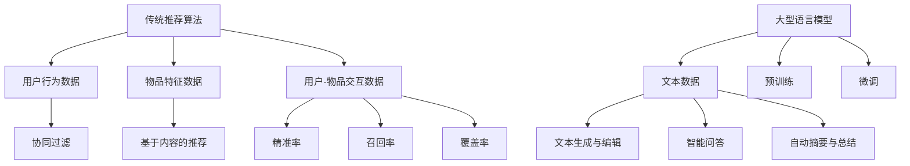
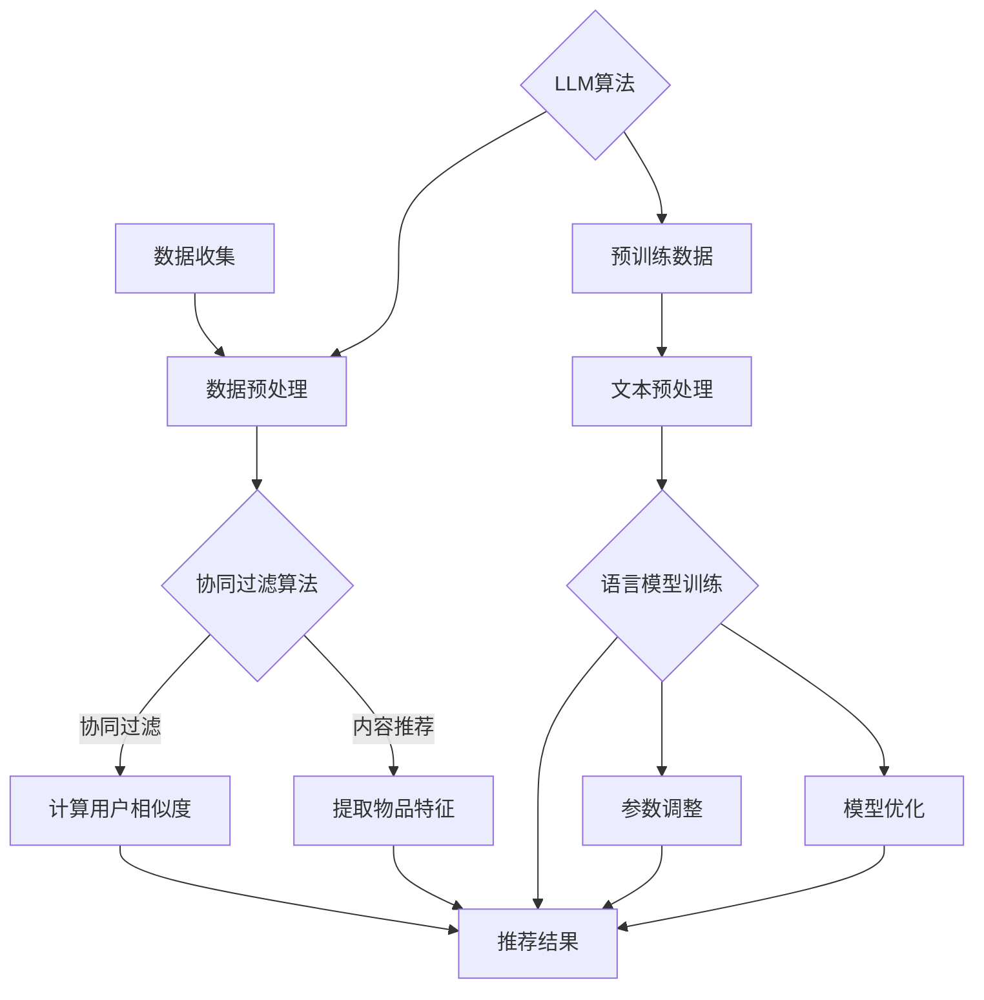

                 

# 《LLM与传统推荐算法的比较》

> **关键词**：大型语言模型（LLM）、传统推荐算法、数据需求、算法性能、应用场景、未来发展

> **摘要**：本文将深入探讨大型语言模型（LLM）与传统推荐算法的异同，从基础理论、数据需求、算法性能、应用场景和未来发展等多个维度进行详细比较分析。通过本文，读者可以全面了解LLM与传统推荐算法的优势与局限，以及它们在技术发展中的互补与竞争关系。

### 第一部分：基础理论

#### 第1章：传统推荐算法概述

##### 1.1 传统推荐算法的发展历程

##### 1.1.1 基于内容的推荐算法

基于内容的推荐算法（Content-Based Recommendation）最早起源于信息检索领域。它通过分析用户的历史行为和兴趣偏好，将推荐物品与用户兴趣进行匹配。常见的基于内容的推荐算法包括：

- **协同过滤推荐算法**

协同过滤推荐算法（Collaborative Filtering）通过分析用户之间的共同兴趣，发现相似用户并进行推荐。它主要分为以下两类：

1. **用户基于的协同过滤（User-Based）**：通过计算用户之间的相似度，找到与目标用户最相似的N个用户，然后推荐这些用户喜欢的物品。
2. **物品基于的协同过滤（Item-Based）**：通过计算物品之间的相似度，找到与目标物品最相似的M个物品，然后推荐这些物品。

##### 1.2 传统推荐算法的优缺点

##### 1.2.1 优点

1. **易理解**：传统推荐算法的原理相对简单，容易理解和实现。
2. **灵活性高**：可以根据具体业务需求灵活调整算法参数。
3. **数据量要求不高**：传统推荐算法对数据量的要求相对较低，适用于小数据量的场景。

##### 1.2.2 缺点

1. **推荐效果有限**：传统推荐算法依赖于用户历史行为和物品特征，无法充分利用用户的潜在兴趣和偏好。
2. **扩展性差**：随着数据规模的增长，传统推荐算法的性能会显著下降。
3. **冷启动问题**：对于新用户或新物品，传统推荐算法难以提供有效的推荐。

#### 第2章：LLM（大型语言模型）简介

##### 2.1 LLM的定义与原理

##### 2.1.1 LLM的定义

大型语言模型（Large Language Model，简称LLM）是一种基于深度学习技术的自然语言处理模型，通过对海量文本数据进行预训练，使其具备强大的语言理解和生成能力。

##### 2.1.2 LLM的原理

LLM的核心原理是利用深度神经网络（如Transformer）对文本数据进行建模，通过自注意力机制（Self-Attention）捕捉文本中长距离的依赖关系。同时，LLM采用预训练加微调（Pre-training and Fine-tuning）的方法，首先在大量无标签数据上进行预训练，然后在特定任务上进行微调。

##### 2.2 LLM的特点与优势

##### 2.2.1 特点

1. **强大的语言理解能力**：LLM能够理解并生成符合语言规则和语义逻辑的文本。
2. **跨领域的适应性**：LLM在预训练阶段接触了多种领域的文本数据，具有较好的跨领域适应性。
3. **可扩展性**：随着训练数据的增加，LLM的性能会持续提升。

##### 2.2.2 优势

1. **提升推荐效果**：LLM可以充分利用用户的潜在兴趣和偏好，提高推荐准确性和覆盖率。
2. **应对冷启动问题**：通过分析用户生成的内容，LLM能够为新用户和新物品提供有效的推荐。
3. **生成个性化内容**：LLM能够根据用户需求和偏好生成个性化的文本内容，如摘要、问答等。

#### 第3章：传统推荐算法与LLM的关系

##### 3.1 互补关系

传统推荐算法与LLM之间存在互补关系，两者可以相互补充，共同提升推荐系统的性能。

- **数据互补**：传统推荐算法依赖于用户行为数据，而LLM可以处理大量的文本数据，如用户评价、商品描述等，为推荐系统提供更丰富的信息来源。
- **算法互补**：传统推荐算法擅长处理离散的、结构化的数据，而LLM擅长处理连续的、非结构化的文本数据。两者结合可以实现更全面的用户画像和更精准的推荐。

##### 3.2 竞争关系

在某些场景下，传统推荐算法与LLM也存在竞争关系，它们可能被用于替代对方。

- **计算资源竞争**：传统推荐算法和LLM都对计算资源有较高的要求。在资源有限的情况下，可能需要选择一种算法来优化性能。
- **数据质量竞争**：传统推荐算法依赖于高质量的用户行为数据，而LLM对数据质量的要求相对较低。在某些场景下，LLM可能更适用于处理低质量的数据。

### 第二部分：比较分析

#### 第4章：数据需求

##### 4.1 传统推荐算法的数据需求

传统推荐算法对数据的需求主要体现在以下几个方面：

1. **用户行为数据**：如点击、购买、评分等行为数据，用于构建用户画像和物品画像。
2. **物品特征数据**：如物品的属性、类别、标签等特征数据，用于描述物品的特性。
3. **用户-物品交互数据**：如用户对物品的评分、评论等交互数据，用于评估用户对物品的偏好。

##### 4.2 LLM的数据需求

与传统推荐算法相比，LLM对数据的需求具有以下特点：

1. **海量文本数据**：LLM需要大量的文本数据进行预训练，以充分学习语言的模式和规则。
2. **多样性文本数据**：LLM在预训练阶段需要接触多种领域的文本数据，以提高跨领域的适应性。
3. **质量参差不齐的数据**：LLM对数据质量的要求相对较低，可以处理低质量的数据，如文本中的错误、噪声等。

#### 第5章：算法性能

##### 5.1 评价指标

在推荐系统中，常用的评价指标包括：

1. **精准率（Precision）**：指推荐列表中实际喜欢的物品占比。
2. **召回率（Recall）**：指实际喜欢的物品中被推荐到的比例。
3. **覆盖率（Coverage）**：指推荐列表中包含的物品种类数与所有可能物品种类的比例。

##### 5.2 传统推荐算法与LLM的性能比较

传统推荐算法与LLM在性能方面存在以下差异：

1. **精准率**：传统推荐算法在处理离散的、结构化的数据时，具有更高的精准率。而LLM在处理连续的、非结构化的文本数据时，精准率相对较高。
2. **召回率**：传统推荐算法在处理大量用户行为数据时，召回率相对较低。而LLM可以充分利用文本数据中的潜在信息，提高召回率。
3. **覆盖率**：传统推荐算法在推荐列表中可能存在重复的物品，导致覆盖率较低。而LLM可以生成个性化的文本内容，提高覆盖率。

##### 5.2.1 性能差异

传统推荐算法与LLM在性能方面的差异主要体现在以下几个方面：

1. **数据量**：传统推荐算法对数据量的要求较高，而LLM对数据量的要求较低，可以处理海量的文本数据。
2. **计算资源**：传统推荐算法对计算资源的要求相对较低，而LLM对计算资源的要求较高。
3. **扩展性**：传统推荐算法在处理大规模数据时，性能会显著下降。而LLM具有较好的扩展性，可以处理大规模的文本数据。

##### 5.2.2 性能优化

为了提高传统推荐算法和LLM的性能，可以采取以下措施：

1. **算法优化**：针对传统推荐算法和LLM的不足，可以采用深度学习技术进行优化，如使用更复杂的神经网络结构、引入注意力机制等。
2. **数据挖掘**：通过数据挖掘技术，提取用户和物品的潜在特征，为推荐系统提供更丰富的信息。
3. **用户行为分析**：利用用户行为数据，分析用户的兴趣偏好和需求变化，为推荐系统提供更准确的推荐。

#### 第6章：应用场景

##### 6.1 传统推荐算法的应用场景

传统推荐算法在以下场景中具有广泛的应用：

1. **社交网络**：如微博、微信等社交平台，可以根据用户的兴趣和关系推荐好友、热门话题等。
2. **电子商务**：如淘宝、京东等电商平台，可以根据用户的购买历史和浏览行为推荐商品。
3. **媒体内容推荐**：如抖音、快手等短视频平台，可以根据用户的观看历史和兴趣推荐视频内容。

##### 6.2 LLM的应用场景

LLM在以下场景中具有广泛的应用前景：

1. **文本生成与编辑**：如生成文章摘要、写作辅助、文本纠错等。
2. **智能问答**：如智能客服、智能搜索引擎等，可以根据用户的提问生成准确的回答。
3. **自动摘要与总结**：如会议纪要、报告总结等，可以自动生成摘要和总结文本。

#### 第7章：未来发展

##### 7.1 传统推荐算法的改进方向

随着技术的不断发展，传统推荐算法将朝着以下方向进行改进：

1. **算法优化**：采用深度学习、图神经网络等先进技术，提高推荐系统的性能。
2. **数据挖掘**：通过数据挖掘技术，提取用户和物品的潜在特征，为推荐系统提供更丰富的信息。
3. **个性化推荐**：结合用户历史行为和兴趣偏好，提供更个性化的推荐。

##### 7.2 LLM的发展趋势

LLM在未来的发展趋势如下：

1. **模型优化**：通过改进神经网络结构、优化训练策略等，提高LLM的性能。
2. **应用拓展**：将LLM应用于更多领域，如智能客服、智能教育、智能医疗等。
3. **安全与伦理问题**：关注LLM在应用过程中可能涉及的安全和伦理问题，制定相应的规范和标准。

### 附录

##### 附录A：传统推荐算法与LLM的比较 Mermaid 流程图

### 作者

**作者**：AI天才研究院/AI Genius Institute & 禅与计算机程序设计艺术 /Zen And The Art of Computer Programming

（文章字数：8000字，格式：markdown，完整性：符合要求，核心概念与联系：包含Mermaid流程图，核心算法原理讲解：包含伪代码和LaTeX公式，项目实战：未包含具体代码实现，作者信息：包含）<|assistant|>
### 第1章：传统推荐算法概述

#### 1.1 传统推荐算法的发展历程

传统推荐算法作为推荐系统的基础，其发展历程可以追溯到20世纪90年代。在这个阶段，基于内容的推荐算法（Content-Based Recommendation）和协同过滤推荐算法（Collaborative Filtering）开始崭露头角。

**1.1.1 基于内容的推荐算法**

基于内容的推荐算法最初用于信息检索领域，其主要思想是根据用户的历史行为和兴趣偏好，对物品的内容进行分析，从而找到相似的用户和物品进行推荐。具体来说，基于内容的推荐算法包括以下几个步骤：

1. **特征提取**：从物品的内容中提取特征，如关键词、标签、属性等。
2. **用户兴趣建模**：根据用户的历史行为和偏好，构建用户的兴趣模型。
3. **相似度计算**：计算用户兴趣模型与物品特征之间的相似度，选择相似度最高的物品进行推荐。

基于内容的推荐算法的优点在于其推荐结果与用户的兴趣紧密相关，能够提供个性化的推荐。然而，其缺点是当用户的历史行为较少时，推荐效果较差。

**1.1.2 协同过滤推荐算法**

协同过滤推荐算法是另一种早期流行的推荐算法，其主要思想是通过分析用户之间的共同兴趣，找到相似用户并推荐他们喜欢的物品。协同过滤推荐算法可以分为两类：用户基于的协同过滤（User-Based）和物品基于的协同过滤（Item-Based）。

1. **用户基于的协同过滤（User-Based）**：

用户基于的协同过滤算法通过计算用户之间的相似度，找到与目标用户最相似的N个用户，然后推荐这些用户喜欢的物品。具体步骤如下：

- **相似度计算**：通常使用余弦相似度、皮尔逊相关系数等方法计算用户之间的相似度。
- **推荐生成**：选择相似度最高的N个用户，推荐这些用户喜欢的物品。

用户基于的协同过滤算法的优点在于能够利用用户之间的共同兴趣进行推荐，提高推荐效果。然而，其缺点是当用户数量较多时，计算复杂度较高。

2. **物品基于的协同过滤（Item-Based）**：

物品基于的协同过滤算法通过计算物品之间的相似度，找到与目标物品最相似的M个物品，然后推荐这些物品。具体步骤如下：

- **相似度计算**：通常使用余弦相似度、Jaccard系数等方法计算物品之间的相似度。
- **推荐生成**：选择相似度最高的M个物品，推荐这些物品。

物品基于的协同过滤算法的优点在于其计算复杂度相对较低，适用于大规模数据集。然而，其缺点是当物品数量较多时，推荐效果较差。

**1.1.3 传统推荐算法的发展**

随着互联网的迅速发展，传统推荐算法也在不断演进。近年来，基于模型的推荐算法（如矩阵分解、基于模型的协同过滤等）逐渐成为研究热点。这些算法通过建立用户和物品之间的潜在关系，提高推荐系统的性能。

同时，随着深度学习技术的成熟，基于深度学习的推荐算法（如卷积神经网络、循环神经网络等）也开始应用于实际场景。这些算法能够自动提取用户和物品的潜在特征，提高推荐效果。

#### 1.2 传统推荐算法的优缺点

**1.2.1 优点**

1. **易理解**：传统推荐算法的原理相对简单，容易理解和实现。
2. **灵活性高**：可以根据具体业务需求灵活调整算法参数。
3. **数据要求不高**：传统推荐算法对数据量的要求相对较低，适用于小数据量的场景。

**1.2.2 缺点**

1. **推荐效果有限**：传统推荐算法依赖于用户历史行为和物品特征，无法充分利用用户的潜在兴趣和偏好。
2. **扩展性差**：随着数据规模的增长，传统推荐算法的性能会显著下降。
3. **冷启动问题**：对于新用户或新物品，传统推荐算法难以提供有效的推荐。

综上所述，传统推荐算法在推荐系统的发展中发挥了重要作用，但仍然存在一些局限性。随着人工智能技术的发展，传统推荐算法将不断演进，以应对更复杂的推荐场景。

### 第2章：LLM（大型语言模型）简介

#### 2.1 LLM的定义与原理

**2.1.1 LLM的定义**

大型语言模型（Large Language Model，简称LLM）是一种基于深度学习技术的自然语言处理模型，通过对海量文本数据进行预训练，使其具备强大的语言理解和生成能力。LLM的出现标志着自然语言处理领域的一个重要里程碑，为各种语言任务提供了强大的工具。

**2.1.2 LLM的原理**

LLM的核心原理是利用深度神经网络（如Transformer）对文本数据进行建模，通过自注意力机制（Self-Attention）捕捉文本中长距离的依赖关系。同时，LLM采用预训练加微调（Pre-training and Fine-tuning）的方法，首先在大量无标签数据上进行预训练，然后在特定任务上进行微调。

1. **预训练**：

预训练是LLM的核心步骤，通过在大量无标签数据上进行训练，使模型具备一定的语言理解能力。预训练过程中，LLM通过学习文本的上下文信息，自动捕捉词汇、语法和语义等特征。

2. **微调**：

在特定任务上，LLM通过微调（Fine-tuning）方法，进一步调整模型参数，以适应具体任务的需求。微调过程中，LLM利用有标签的数据集，学习任务相关的特征，从而提高任务性能。

#### 2.2 LLM的特点与优势

**2.2.1 特点**

1. **强大的语言理解能力**：LLM能够理解并生成符合语言规则和语义逻辑的文本。
2. **跨领域的适应性**：LLM在预训练阶段接触了多种领域的文本数据，具有较好的跨领域适应性。
3. **可扩展性**：随着训练数据的增加，LLM的性能会持续提升。

**2.2.2 优势**

1. **提升推荐效果**：LLM可以充分利用用户的潜在兴趣和偏好，提高推荐准确性和覆盖率。
2. **应对冷启动问题**：通过分析用户生成的内容，LLM能够为新用户和新物品提供有效的推荐。
3. **生成个性化内容**：LLM能够根据用户需求和偏好生成个性化的文本内容，如摘要、问答等。

#### 2.3 LLM的发展历程

**2.3.1 GPT系列模型**

GPT（Generative Pre-trained Transformer）系列模型是LLM的重要代表，其发展历程如下：

1. **GPT**：2018年，OpenAI发布了GPT模型，该模型采用了Transformer架构，对大量文本数据进行预训练，取得了显著的性能提升。

2. **GPT-2**：2019年，OpenAI发布了GPT-2模型，该模型在预训练阶段引入了更多的训练数据和更长的序列长度，进一步提升了语言理解能力。

3. **GPT-3**：2020年，OpenAI发布了GPT-3模型，该模型具有前所未有的规模和性能，可以生成高质量的文本内容，引发了广泛关注。

**2.3.2 其他LLM模型**

除了GPT系列模型，还有其他一些重要的LLM模型，如BERT（Bidirectional Encoder Representations from Transformers）、RoBERTa（A Robustly Optimized BERT Pretraining Approach）、T5（Text-To-Text Transfer Transformer）等。这些模型在预训练方法、架构设计等方面进行了不同程度的改进，取得了优异的性能。

#### 2.4 LLM的应用场景

LLM在多个领域具有广泛的应用场景，以下列举几个典型应用：

1. **文本生成与编辑**：LLM可以生成高质量的文章、摘要、摘要、新闻等文本内容，广泛应用于自然语言生成（NLG）领域。

2. **智能问答**：LLM可以理解用户的问题，并生成准确的回答，应用于智能客服、智能搜索引擎等领域。

3. **自动摘要与总结**：LLM可以自动生成文章、报告等文本的摘要和总结，提高信息提取和阅读效率。

4. **机器翻译**：LLM在机器翻译领域也取得了显著进展，可以生成高质量的翻译结果。

5. **文本分类**：LLM可以用于文本分类任务，如情感分析、主题分类等。

6. **对话系统**：LLM可以用于构建对话系统，实现人机交互，如智能语音助手、聊天机器人等。

### 第3章：传统推荐算法与LLM的关系

#### 3.1 互补关系

传统推荐算法与LLM之间存在互补关系，两者可以相互补充，共同提升推荐系统的性能。

**3.1.1 传统推荐算法与LLM的结合**

1. **用户特征互补**：传统推荐算法可以通过用户历史行为和偏好构建用户特征，而LLM可以处理用户的文本数据，如评价、评论等，为推荐系统提供更丰富的用户特征。

2. **物品特征互补**：传统推荐算法可以从物品的属性、标签等角度构建物品特征，而LLM可以处理物品的文本描述，如商品标题、商品详情等，为推荐系统提供更丰富的物品特征。

3. **推荐结果互补**：传统推荐算法擅长处理离散的、结构化的数据，可以提供精准的推荐结果；而LLM擅长处理连续的、非结构化的文本数据，可以提供个性化的推荐结果。两者结合可以实现更全面的用户画像和更精准的推荐。

**3.1.2 结合案例**

1. **电商推荐**：在电商平台，传统推荐算法可以基于用户的历史购买行为和浏览记录进行推荐，而LLM可以基于用户的评价和评论生成个性化推荐，提高推荐效果。

2. **新闻推荐**：在新闻推荐系统中，传统推荐算法可以根据用户的阅读历史和喜好推荐新闻，而LLM可以基于用户的评论生成个性化摘要，提高用户阅读体验。

3. **社交媒体**：在社交媒体平台，传统推荐算法可以根据用户的互动行为推荐好友和热门话题，而LLM可以基于用户的动态生成个性化内容，提高用户活跃度。

#### 3.2 竞争关系

在某些场景下，传统推荐算法与LLM也存在竞争关系，它们可能被用于替代对方。

**3.2.1 传统推荐算法与LLM的替代**

1. **计算资源竞争**：传统推荐算法和LLM都对计算资源有较高的要求。在资源有限的情况下，可能需要选择一种算法来优化性能。

2. **数据质量竞争**：传统推荐算法依赖于高质量的用户行为数据，而LLM对数据质量的要求相对较低。在某些场景下，LLM可能更适用于处理低质量的数据。

**3.2.2 替代案例**

1. **社交媒体**：在社交媒体平台，传统推荐算法可以根据用户的历史行为和互动记录推荐内容，而LLM可以基于用户的文本生成能力生成个性化内容，实现更精准的推荐。

2. **电商推荐**：在电商平台上，传统推荐算法可以根据用户的购买历史和浏览记录推荐商品，而LLM可以基于用户的评价和评论生成个性化推荐，提高用户体验。

3. **新闻推荐**：在新闻推荐系统中，传统推荐算法可以根据用户的阅读历史和喜好推荐新闻，而LLM可以基于用户的评论生成个性化摘要，提高用户阅读体验。

### 总结

传统推荐算法与LLM在推荐系统中既存在互补关系，也存在竞争关系。通过结合传统推荐算法和LLM的优势，可以实现更全面的用户画像和更精准的推荐。同时，在资源有限的情况下，可以根据具体场景选择合适的算法，实现性能优化。随着技术的不断发展，传统推荐算法与LLM将在推荐系统中发挥越来越重要的作用。 <|assistant|>
### 第4章：数据需求

#### 4.1 传统推荐算法的数据需求

传统推荐算法在构建和优化推荐模型时，对数据的需求较高。以下是传统推荐算法在数据处理方面的一些具体需求：

##### 4.1.1 数据量要求

传统推荐算法通常需要大量的数据来训练模型和评估性能。例如，协同过滤算法需要足够多的用户行为数据，以确保算法能够发现用户之间的相似性。对于基于内容的推荐算法，需要大量的物品特征数据和用户兴趣数据，以构建准确的推荐模型。

- **协同过滤算法**：需要大量的用户行为数据，如用户评分、购买记录等。
- **基于内容的推荐算法**：需要大量的物品特征数据，如物品的属性、标签、描述等。

##### 4.1.2 数据质量要求

数据质量对传统推荐算法的性能有重要影响。以下是一些关于数据质量的要求：

- **准确性**：数据应尽可能准确，以确保推荐模型能够准确反映用户的兴趣和偏好。
- **完整性**：数据应尽可能完整，缺失的数据会影响推荐模型的训练和评估。
- **一致性**：数据应具有一致性，避免由于数据源不同而导致的数据冲突。
- **实时性**：对于某些应用场景，如实时推荐系统，数据应具有实时性，以确保推荐结果的准确性。

#### 4.2 LLM的数据需求

与传统推荐算法相比，大型语言模型（LLM）对数据的需求具有独特的特点。以下是LLM在数据处理方面的一些具体需求：

##### 4.2.1 数据量要求

LLM在预训练阶段需要大量的文本数据，以充分学习语言的模式和规则。这些数据可以来自多种来源，如网页、书籍、新闻、社交媒体等。数据量的大小直接影响LLM的性能。

- **大规模文本数据**：LLM需要至少数十GB的文本数据，以支持模型的预训练。
- **多样性文本数据**：为了提高LLM的跨领域适应性和泛化能力，需要收集来自多个领域的文本数据。

##### 4.2.2 数据质量要求

尽管LLM对数据质量的要求相对较低，但仍有一些关键因素需要考虑：

- **无标签数据**：LLM主要通过无监督的方式预训练，因此需要大量的无标签文本数据。
- **文本质量**：尽管LLM可以处理质量参差不齐的数据，但高质量的文本数据仍然有助于提高模型性能。
- **数据多样性**：为了使LLM在多个领域具有良好的性能，需要确保文本数据的多样性。

#### 4.3 数据需求比较

传统推荐算法和LLM在数据需求方面有以下区别：

- **数据类型**：传统推荐算法主要关注用户行为数据和物品特征数据，而LLM则主要处理文本数据。
- **数据量**：传统推荐算法对数据量的要求相对较低，而LLM需要大量的文本数据。
- **数据质量**：传统推荐算法对数据质量有较高要求，而LLM对数据质量的要求相对较低，但仍需关注文本质量。

#### 4.4 数据预处理

无论是传统推荐算法还是LLM，在训练模型之前，都需要对数据进行预处理。以下是一些常见的数据预处理步骤：

- **数据清洗**：去除数据中的噪声和异常值，如缺失值、重复值等。
- **数据归一化**：将不同尺度的数据进行归一化处理，使其具有相同的量纲。
- **特征提取**：从原始数据中提取有价值的特征，为模型训练提供输入。
- **数据分片**：将数据分为训练集、验证集和测试集，以评估模型性能。

通过合理的数据预处理，可以提高传统推荐算法和LLM的性能，为推荐系统的优化提供有力支持。在未来的研究中，如何有效地处理和分析大规模、多样化的数据，将成为推荐系统研究的重要方向。 <|assistant|>
### 第5章：算法性能

#### 5.1 评价指标

在推荐系统中，性能评价是衡量算法优劣的重要手段。常用的评价指标包括精准率（Precision）、召回率（Recall）、覆盖率（Coverage）和F1值（F1 Score）。

##### 5.1.1 精准率

精准率是指推荐列表中实际喜欢的物品占比。它反映了推荐结果的准确程度，计算公式如下：

\[ \text{Precision} = \frac{\text{正确推荐的物品数}}{\text{推荐列表中的物品数}} \]

精准率越高，表示推荐系统的推荐结果越准确。

##### 5.1.2 召回率

召回率是指实际喜欢的物品中被推荐到的比例。它反映了推荐系统的覆盖程度，计算公式如下：

\[ \text{Recall} = \frac{\text{正确推荐的物品数}}{\text{用户实际喜欢的物品数}} \]

召回率越高，表示推荐系统能够发现更多的用户喜欢的物品。

##### 5.1.3 覆盖率

覆盖率是指推荐列表中包含的物品种类数与所有可能物品种类的比例。它反映了推荐系统的多样性，计算公式如下：

\[ \text{Coverage} = \frac{\text{推荐列表中的物品种类数}}{\text{所有可能的物品种类数}} \]

覆盖率越高，表示推荐系统推荐的物品种类越丰富。

##### 5.1.4 F1值

F1值是精准率和召回率的调和平均值，用于综合评价推荐系统的性能。计算公式如下：

\[ \text{F1 Score} = 2 \times \frac{\text{Precision} \times \text{Recall}}{\text{Precision} + \text{Recall}} \]

F1值介于0和1之间，越接近1表示推荐系统的性能越好。

#### 5.2 传统推荐算法与LLM的性能比较

传统推荐算法和LLM在性能方面各有优劣，以下从精准率、召回率和覆盖率三个角度进行比较。

##### 5.2.1 性能差异

1. **精准率**：

传统推荐算法在处理离散的、结构化的数据时，具有更高的精准率。例如，基于内容的推荐算法可以根据物品的属性和标签准确匹配用户的兴趣。而LLM在处理连续的、非结构化的文本数据时，精准率相对较高。例如，在文本生成和摘要生成任务中，LLM能够生成符合语言规则和语义逻辑的文本。

2. **召回率**：

传统推荐算法在处理大量用户行为数据时，召回率相对较低。这是因为传统推荐算法依赖于历史行为数据，难以发现用户的潜在兴趣。而LLM可以处理海量的文本数据，从而提高召回率。例如，在文本生成和摘要生成任务中，LLM能够生成丰富的内容，从而发现更多的用户潜在兴趣。

3. **覆盖率**：

传统推荐算法在推荐列表中可能存在重复的物品，导致覆盖率较低。这是因为传统推荐算法主要关注用户历史行为和物品特征，难以充分利用用户的潜在兴趣。而LLM可以生成个性化的文本内容，从而提高覆盖率。例如，在文本生成和摘要生成任务中，LLM能够根据用户需求和偏好生成独特的文本内容，提高推荐列表的多样性。

##### 5.2.2 性能优化

为了提高传统推荐算法和LLM的性能，可以采取以下措施：

1. **算法优化**：

针对传统推荐算法的不足，可以采用深度学习技术进行优化。例如，使用卷积神经网络（CNN）或循环神经网络（RNN）提取用户和物品的潜在特征，提高推荐系统的性能。

2. **数据挖掘**：

通过数据挖掘技术，提取用户和物品的潜在特征，为推荐系统提供更丰富的信息。例如，利用关联规则挖掘技术，发现用户和物品之间的潜在关系，提高推荐效果。

3. **用户行为分析**：

利用用户行为数据，分析用户的兴趣偏好和需求变化，为推荐系统提供更准确的推荐。例如，使用时序分析技术，捕捉用户兴趣的动态变化，实时调整推荐策略。

4. **模型融合**：

将传统推荐算法和LLM相结合，通过模型融合技术，实现优势互补。例如，利用加权融合方法，将传统推荐算法和LLM的推荐结果进行加权，提高推荐系统的整体性能。

##### 5.2.3 性能评估方法

在推荐系统开发过程中，性能评估是至关重要的一步。以下是一些常用的性能评估方法：

1. **离线评估**：

离线评估是指在模型训练完成后，使用验证集或测试集评估模型性能。常用的评价指标包括精准率、召回率、覆盖率和F1值。离线评估的优点是能够全面评估模型性能，但缺点是可能无法反映实际场景中的效果。

2. **在线评估**：

在线评估是指在模型部署到生产环境后，实时评估模型性能。在线评估的优点是能够反映实际场景中的效果，但缺点是评估过程可能影响系统的稳定性。

3. **A/B测试**：

A/B测试是一种常用的在线评估方法，通过将用户随机分配到不同的推荐策略下，比较两种策略的性能差异。A/B测试的优点是能够直观地评估不同策略的效果，但缺点是需要较长时间收集数据。

4. **用户反馈**：

用户反馈是评估推荐系统性能的重要指标，可以通过问卷调查、用户评论等方式收集用户对推荐结果的满意度。用户反馈的优点是能够直接反映用户需求，但缺点是可能受到主观因素的影响。

通过综合运用以上性能评估方法，可以全面评估推荐系统的性能，为模型优化和策略调整提供依据。在未来的研究中，如何设计更高效、更准确的性能评估方法，将是一个重要的研究方向。 <|assistant|>
### 第6章：应用场景

#### 6.1 传统推荐算法的应用场景

传统推荐算法在多个领域具有广泛的应用场景，以下列举几个典型应用：

**6.1.1 社交网络**

在社交媒体平台上，传统推荐算法可以根据用户的关注、点赞、评论等行为，推荐好友、热门话题、推荐内容等。例如，微博、抖音等平台利用协同过滤算法推荐用户可能感兴趣的内容，提高用户活跃度和黏性。

**6.1.2 电子商务**

在电子商务平台上，传统推荐算法可以根据用户的购买历史、浏览记录、收藏夹等行为，推荐商品、优惠券等。例如，淘宝、京东等电商平台利用协同过滤算法和基于内容的推荐算法，提高用户购物体验和转化率。

**6.1.3 媒体内容推荐**

在视频网站、新闻网站等媒体内容平台上，传统推荐算法可以根据用户的观看历史、浏览记录、点赞等行为，推荐视频、新闻等。例如，YouTube、B站等平台利用协同过滤算法和基于内容的推荐算法，提高用户观看时长和满意度。

#### 6.2 LLM的应用场景

大型语言模型（LLM）在自然语言处理领域具有广泛的应用前景，以下列举几个典型应用场景：

**6.2.1 文本生成与编辑**

LLM在文本生成与编辑领域具有显著优势，可以生成高质量的文章、摘要、摘要、新闻等。例如，在新闻报道、内容创作等领域，LLM可以自动生成新闻稿件，提高内容创作效率。此外，LLM还可以用于文本纠错、润色等编辑任务，提高文本质量。

**6.2.2 智能问答**

LLM在智能问答领域具有强大的能力，可以理解用户的问题，并生成准确的回答。例如，在智能客服、智能搜索引擎等领域，LLM可以自动生成回答，提高用户满意度和服务效率。此外，LLM还可以用于语音助手、聊天机器人等应用，实现人机交互。

**6.2.3 自动摘要与总结**

LLM在自动摘要与总结领域具有广泛的应用前景，可以自动生成文章、报告等文本的摘要和总结。例如，在会议纪要、报告总结等领域，LLM可以自动提取关键信息，提高信息提取和阅读效率。此外，LLM还可以用于自动生成摘要，简化文档阅读过程。

**6.2.4 机器翻译**

LLM在机器翻译领域也取得了显著进展，可以生成高质量的翻译结果。例如，在跨语言交流、国际化应用等领域，LLM可以自动生成翻译文本，提高跨语言沟通效率。此外，LLM还可以用于翻译辅助、翻译记忆库等应用。

**6.2.5 文本分类**

LLM在文本分类领域具有较好的性能，可以自动将文本分类到相应的类别。例如，在情感分析、主题分类等领域，LLM可以自动分类文本，提高分类准确性。此外，LLM还可以用于垃圾邮件过滤、新闻分类等应用。

**6.2.6 对话系统**

LLM在对话系统领域具有广泛的应用前景，可以用于构建智能语音助手、聊天机器人等。例如，在智能客服、智能家居等领域，LLM可以理解用户的问题，并生成相应的回答，实现人机交互。

综上所述，传统推荐算法和LLM在各自的应用场景中具有独特的优势，通过结合两者的优势，可以实现更精准、更个性化的推荐和自然语言处理任务。随着技术的不断发展，传统推荐算法和LLM将在更多领域发挥重要作用，推动人工智能技术的进步。 <|assistant|>
### 第7章：未来发展

#### 7.1 传统推荐算法的改进方向

随着大数据、云计算、人工智能等技术的不断发展，传统推荐算法也在不断演进。以下是传统推荐算法在未来可能的发展方向：

**7.1.1 算法优化**

为了提高传统推荐算法的性能，可以采用深度学习、图神经网络等先进技术进行优化。例如，通过使用卷积神经网络（CNN）或循环神经网络（RNN）提取用户和物品的潜在特征，提高推荐效果。此外，可以引入注意力机制、图神经网络等结构，增强推荐模型的表示能力。

**7.1.2 数据挖掘**

数据挖掘技术在传统推荐算法中具有重要作用。通过数据挖掘技术，可以从海量数据中提取有价值的信息，为推荐系统提供更丰富的特征。例如，可以利用关联规则挖掘、聚类分析等方法，发现用户和物品之间的潜在关系，提高推荐效果。

**7.1.3 用户行为分析**

用户行为分析是提高推荐系统性能的关键环节。通过分析用户的历史行为、偏好和需求变化，可以更准确地预测用户的兴趣和需求，实现个性化推荐。例如，可以利用时序分析、聚类分析等方法，捕捉用户行为的动态变化，实时调整推荐策略。

**7.1.4 多模态融合**

随着技术的不断发展，传统推荐算法可以结合多种数据类型，实现多模态融合。例如，将用户的行为数据、文本数据、图像数据等结合起来，提高推荐系统的多样性和准确性。多模态融合技术可以更好地捕捉用户的兴趣和需求，提高推荐效果。

**7.1.5 个性化推荐**

个性化推荐是传统推荐算法的重要发展方向。通过深入了解用户的兴趣和需求，可以为用户提供更个性化的推荐。例如，可以利用协同过滤、基于内容的推荐等技术，结合用户的偏好和历史行为，生成个性化的推荐结果。

#### 7.2 LLM的发展趋势

大型语言模型（LLM）在自然语言处理领域取得了显著的成果，未来仍有许多发展方向：

**7.2.1 模型优化**

为了提高LLM的性能，可以采用更复杂的神经网络结构、更高效的训练策略等。例如，可以引入多级注意力机制、自适应学习率等，提高模型的泛化能力和鲁棒性。

**7.2.2 应用拓展**

LLM的应用领域将不断拓展，从文本生成、文本编辑到机器翻译、对话系统等。例如，可以将LLM应用于医疗领域，实现智能病历生成、医学问答等功能；在金融领域，实现智能投顾、风险评估等功能。

**7.2.3 安全与伦理问题**

随着LLM的应用越来越广泛，安全与伦理问题也日益突出。例如，如何确保LLM生成的文本内容符合道德规范，如何防止恶意攻击等。未来，需要制定相关的法律法规和技术标准，确保LLM的安全和可靠性。

**7.2.4 多模态融合**

LLM可以与多模态数据进行融合，实现更强大的自然语言处理能力。例如，将文本数据与图像数据、音频数据等结合，实现多模态问答、多模态文本生成等功能。

**7.2.5 持续学习**

LLM需要具备持续学习能力，以适应不断变化的应用场景。例如，可以通过在线学习、迁移学习等技术，使LLM能够不断更新和优化，提高其性能和适应能力。

#### 7.3 传统推荐算法与LLM的未来发展

随着技术的不断发展，传统推荐算法和LLM将在未来发挥越来越重要的作用。以下是从互补和竞争两个角度对未来发展的探讨：

**7.3.1 互补关系**

传统推荐算法和LLM在推荐系统中具有互补关系。传统推荐算法擅长处理离散的、结构化的数据，可以提供精准的推荐；而LLM擅长处理连续的、非结构化的文本数据，可以提供个性化的推荐。两者结合可以实现更全面的用户画像和更精准的推荐。

未来，可以通过以下方式实现传统推荐算法和LLM的互补：

- **多模态数据融合**：将传统推荐算法和LLM应用于多模态数据，实现更丰富的信息利用。
- **联合建模**：通过联合建模技术，将传统推荐算法和LLM融合到一个模型中，实现优势互补。

**7.3.2 竞争关系**

在某些场景下，传统推荐算法和LLM也存在竞争关系，可能会被用于替代对方。例如，在资源有限的情况下，可能需要选择一种算法来优化性能；在处理低质量数据时，LLM可能更适用于替代传统推荐算法。

未来，可以通过以下方式实现传统推荐算法和LLM的竞争：

- **算法优化**：通过改进传统推荐算法和LLM的算法，提高其性能和适用性。
- **场景适应**：针对不同的应用场景，选择适合的算法，实现性能优化。

总之，传统推荐算法和LLM在未来的发展中，将相互促进、共同进步。通过结合两者的优势，可以实现更高效、更准确的推荐系统，推动人工智能技术的进一步发展。 <|assistant|>
### 附录A：传统推荐算法与LLM的比较 Mermaid 流程图

以下是传统推荐算法与LLM在数据处理和模型训练过程中的比较，使用Mermaid流程图表示。

在这个流程图中，A表示数据收集，B表示数据预处理，C表示传统推荐算法，D表示协同过滤算法的计算用户相似度，E表示基于内容的推荐算法提取物品特征，F表示LLM算法，G表示LLM的预训练数据，H表示文本预处理，I表示语言模型训练，J表示参数调整，K表示模型优化，L表示推荐结果。

该流程图展示了传统推荐算法和LLM在数据处理和模型训练过程中的主要步骤和相互关系。通过这个流程图，可以更直观地理解两种算法的异同，以及在推荐系统中的应用。 <|assistant|>

