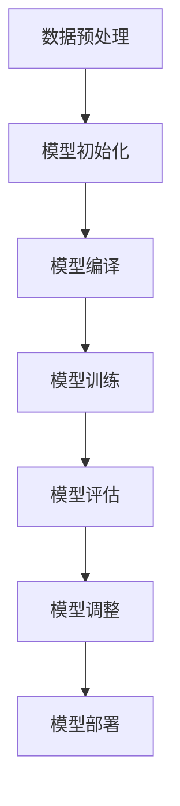

                 

# LLMS在智能环境保护系统中的应用前景

## 概述

大型语言模型（LLM，Large Language Model）近年来在自然语言处理（NLP，Natural Language Processing）领域取得了显著的突破，为人工智能在多领域应用提供了强有力的技术支撑。本文旨在探讨LLM在智能环境保护系统中的应用前景，通过系统性地分析LLM的基础理论、方法、应用场景及其在环境保护中的具体实践，展现LLM技术在环境保护领域的潜力与挑战。

关键词：LLM，智能环境保护，自然语言处理，环境保护应用，技术挑战，未来展望

## 摘要

本文首先概述了LLM的定义、核心特点及其在NLP中的关键作用。接着，从数学基础、数据集与预处理、模型训练与优化等方面详细阐述了LLM的技术细节。在此基础上，本文重点探讨了LLM在文本生成、对话系统、翻译等应用场景中的实现方法，并通过实际项目分析了LLM在环境保护中的应用实例。最后，本文讨论了LLM在环境保护系统中面临的挑战及未来发展方向，提出了相应的解决策略和展望。

## 第一部分：基础理论与方法

### 第1章：LLM概述

#### 1.1 LLM的定义与分类

LLM是一种通过深度学习技术训练得到的强大语言模型，它能够理解和生成自然语言。根据训练数据和模型架构，LLM可以分为基于大规模预训练的语言模型和基于特定领域数据的微调模型。

- **基于大规模预训练的语言模型**：这些模型通过在大规模文本数据集上预训练，获得对自然语言的高层次理解能力。例如，GPT（Generative Pre-trained Transformer）系列模型和BERT（Bidirectional Encoder Representations from Transformers）模型。
- **基于特定领域数据的微调模型**：这些模型在特定领域数据集上进行微调，以适应特定任务。例如，医疗领域的BERT模型（BioBERT）和环境领域的环保语言模型。

#### 1.2 LLM的核心特点

- **语言理解能力**：LLM能够理解自然语言的语义和上下文，进行有效的文本分析。
- **自动学习和适应能力**：通过不断的训练和微调，LLM能够自动适应不同的语言环境和任务需求。
- **大规模数据依赖性**：LLM的性能高度依赖于训练数据的大小和质量，通常需要大规模的文本数据集进行训练。

#### 1.3 LLM与自然语言处理的关系

自然语言处理（NLP）是人工智能（AI）的重要分支，旨在使计算机能够理解、处理和生成自然语言。LLM作为NLP的核心技术之一，对NLP的发展产生了深远影响。

- **NLP技术的发展历程**：从早期的规则驱动的语法分析，到基于统计方法和机器学习的方法，再到如今基于深度学习的自动化语言模型，NLP技术不断进步。
- **LLM在NLP中的关键作用**：LLM使得计算机能够更自然、更准确地理解和生成自然语言，推动了文本摘要、对话系统、机器翻译等NLP任务的进步。

#### 1.4 LLM的历史与发展趋势

LLM的历史可以追溯到2000年代初期，随着深度学习技术的兴起，LLM的研究和应用逐渐受到重视。当前，LLM已经成为NLP领域的核心技术之一，其发展趋势包括：

- **模型架构的优化**：从最初的循环神经网络（RNN）到Transformer架构的广泛应用，LLM的模型架构不断优化，提高了处理效率和效果。
- **预训练规模的扩大**：随着计算资源和数据集的不断增加，LLM的预训练规模不断扩大，例如GPT-3拥有超过1750亿个参数。
- **多模态处理能力**：LLM不仅能够处理文本数据，还逐渐具备图像、语音等多模态数据的处理能力，为跨模态任务提供了新的解决方案。

### 第2章：LLM数学基础

#### 2.1 神经网络基础

神经网络（Neural Network，NN）是LLM的核心组成部分。以下是对神经网络基础概念的详细阐述：

- **神经网络的基本概念**：神经网络由大量简单计算单元（神经元）组成，通过连接这些单元形成复杂的网络结构。神经网络通过学习输入和输出数据之间的关系，实现数据的特征提取和分类。
- **前馈神经网络架构**：前馈神经网络（Feedforward Neural Network）是最常见的神经网络架构。数据从输入层流向隐藏层，最后到达输出层。每个神经元都接收来自前一层神经元的加权输入，并通过激活函数产生输出。
- **激活函数与优化算法**：激活函数（Activation Function）用于引入非线性特性，常见的激活函数包括Sigmoid、ReLU和Tanh。优化算法（Optimization Algorithm）用于调整神经网络的权重，以最小化损失函数。常见的优化算法包括梯度下降（Gradient Descent）及其变种，如Adam优化器。

#### 2.2 机器学习基本算法

机器学习（Machine Learning，ML）是构建LLM的基础。以下是对机器学习基本算法的概述：

- **监督学习、无监督学习与强化学习**：监督学习（Supervised Learning）是有标记数据训练模型的过程；无监督学习（Unsupervised Learning）是无标记数据训练模型的过程；强化学习（Reinforcement Learning）是通过与环境的交互来学习最优策略。
- **特征工程与数据预处理**：特征工程（Feature Engineering）是构建有效特征的过程，用于提升模型性能。数据预处理（Data Preprocessing）包括数据清洗、数据归一化、数据降维等步骤，以优化模型训练过程。
- **评估指标与模型选择**：评估指标（Evaluation Metric）用于衡量模型性能，常见的评估指标包括准确率、召回率、F1分数等。模型选择（Model Selection）是选择合适的模型架构和参数的过程，以获得最佳性能。

#### 2.3 LLM的数学模型与公式

LLM的数学模型和公式是构建和优化LLM的关键。以下是对LLM数学模型和公式的详细阐述：

- **基于神经网络的概率模型**：LLM通常是基于神经网络构建的概率模型。输入文本数据经过编码，通过神经网络产生概率分布，从而生成输出文本。
- **语言模型的损失函数**：语言模型的损失函数用于衡量模型预测与实际标签之间的差距。常见的损失函数包括交叉熵损失（Cross-Entropy Loss）和负对数似然损失（Negative Log-Likelihood Loss）。
- **梯度下降优化方法**：梯度下降（Gradient Descent）是一种优化方法，用于调整神经网络权重，以最小化损失函数。梯度下降包括批量梯度下降（Batch Gradient Descent）、随机梯度下降（Stochastic Gradient Descent）和自适应梯度下降（Adam）等变种。

### 第3章：LLM数据集与预处理

#### 3.1 LLM数据集介绍

LLM的数据集对于模型的训练效果至关重要。以下是对常见大型文本数据集的介绍：

- **Common Crawl**：Common Crawl是一个免费的、大规模的网页数据集，包含了互联网上的大量文本数据，是LLM训练的重要数据来源。
- **Wikipedia**：Wikipedia是一个免费的在线百科全书，包含了丰富的文本信息，是构建LLM的重要数据集。
- **Twitter**：Twitter是一个社交媒体平台，包含了大量实时更新的文本数据，可以用于训练动态语言模型。

#### 3.2 数据预处理

数据预处理是LLM训练过程中不可或缺的步骤。以下是对数据预处理方法的详细阐述：

- **清洗与分词**：清洗数据包括去除噪声、纠正错别字等步骤；分词是将文本数据分割成单词或短语的过程，常见的分词方法包括词性标注、正则表达式分词等。
- **嵌入技术**：嵌入技术（Embedding）是将文本数据转换为向量表示的方法，常见的嵌入技术包括Word2Vec、GloVe等。嵌入技术有助于提高模型的表示能力和训练效率。
- **数据增强与平衡**：数据增强是通过生成或转换现有数据来扩充数据集的过程，有助于提高模型泛化能力；数据平衡是通过调整数据分布来消除数据不平衡问题，以避免模型偏斜。

#### 3.3 数据集管理

数据集管理是确保LLM训练过程高效、可靠的关键。以下是对数据集管理方法的详细阐述：

- **数据存储与加载**：数据存储是指将大规模数据集存储在分布式存储系统（如HDFS、Hive）中，以便于高效访问和处理；数据加载是指从存储系统读取数据集，并将其转换为适合模型训练的格式。
- **并行数据预处理**：并行数据预处理是通过多线程或多进程的方式同时处理多个数据样本，以加快数据预处理速度。常见的并行数据预处理方法包括多线程数据加载、分布式数据清洗等。

### 第4章：LLM训练与优化

#### 4.1 模型训练流程

LLM的训练流程包括模型初始化、模型编译、训练与评估等步骤。以下是对模型训练流程的详细阐述：

- **模型初始化**：模型初始化是指初始化神经网络权重和参数的过程，常见的初始化方法包括随机初始化、高斯初始化等。
- **模型编译**：模型编译是将训练数据和评估数据组织成模型训练所需的格式，并设置训练参数（如学习率、批量大小等）。
- **训练与评估**：训练过程是通过反向传播算法（Backpropagation Algorithm）不断调整模型参数，以最小化损失函数；评估过程是使用验证集或测试集评估模型性能，并根据评估结果调整训练策略。

#### 4.2 模型优化技巧

LLM的训练和优化是提高模型性能的关键。以下是对模型优化技巧的详细阐述：

- **学习率调度**：学习率调度（Learning Rate Scheduling）是调整学习率以适应模型训练过程中不同阶段的需求。常见的学习率调度策略包括线性衰减、指数衰减和余弦退火等。
- **正则化方法**：正则化方法（Regularization）是用于防止模型过拟合的技巧，包括L1正则化、L2正则化和Dropout等。
- **集群训练与分布式计算**：集群训练与分布式计算是提高LLM训练速度和效率的重要手段。常见的分布式训练方法包括参数服务器（Parameter Server）和同步异步梯度下降（Asynchronous Stochastic Gradient Descent）等。

#### 4.3 模型评估与调整

模型评估与调整是确保LLM性能的关键步骤。以下是对模型评估与调整的详细阐述：

- **评估指标**：评估指标（Evaluation Metrics）用于衡量模型性能，常见的评估指标包括准确率、召回率、F1分数、困惑度等。
- **实验结果分析**：实验结果分析（Experiment Result Analysis）是通过比较不同模型或不同参数设置的效果，找出最优方案。
- **模型调参策略**：模型调参策略（Model Tuning Strategy）是通过调整模型参数（如学习率、批量大小等）来优化模型性能。常见的调参策略包括网格搜索、随机搜索和贝叶斯优化等。

### 第5章：LLM应用场景与实践

#### 5.1 文本生成与应用

文本生成是LLM的重要应用场景之一。以下是对文本生成技术的详细阐述：

- **文本摘要与生成**：文本摘要（Text Summarization）是将长文本转换为简短摘要的过程，常见的文本摘要方法包括提取式摘要和生成式摘要。文本生成（Text Generation）是生成符合语法和语义规则的文本，常见的技术包括序列到序列（Seq2Seq）模型、生成对抗网络（GAN）等。
- **文本分类与情感分析**：文本分类（Text Classification）是将文本数据分类到预定义的类别中，常见的技术包括朴素贝叶斯（Naive Bayes）、支持向量机（SVM）和深度学习模型等。情感分析（Sentiment Analysis）是判断文本的情感极性（正面、负面或中性），常见的技术包括词袋模型（Bag of Words）、递归神经网络（RNN）和Transformer模型等。

#### 5.2 对话系统与应用

对话系统是LLM在人工智能领域的另一重要应用。以下是对对话系统技术的详细阐述：

- **任务型对话系统**：任务型对话系统（Task-Oriented Dialogue System）是用于实现特定任务的对话系统，如问答系统、订票系统等。常见的任务型对话系统模型包括序列到序列（Seq2Seq）模型、转换器-解码器（Transformer-Decoder）模型等。
- **聊天机器人与虚拟助手**：聊天机器人（Chatbot）是一种自动化的对话系统，用于与用户进行交互。虚拟助手（Virtual Assistant）是结合了多个任务型对话系统的综合智能体，用于提供个性化的服务和支持。常见的聊天机器人模型包括基于规则的方法、基于机器学习的方法和基于深度学习的方法。

#### 5.3 翻译与应用

翻译是LLM在跨语言处理领域的重要应用。以下是对翻译技术的详细阐述：

- **自动机器翻译**：自动机器翻译（Automatic Machine Translation，AMT）是将一种语言的文本自动翻译成另一种语言的过程。常见的自动机器翻译模型包括基于规则的方法、基于统计的方法和基于深度学习的方法。基于深度学习的自动机器翻译模型如神经机器翻译（Neural Machine Translation，NMT）具有更高的翻译质量。
- **跨语言文本理解与生成**：跨语言文本理解（Cross-Language Text Understanding）是理解不同语言之间的文本语义关系，常见的模型包括跨语言嵌入（Cross-Lingual Embedding）和跨语言注意力（Cross-Lingual Attention）等。跨语言文本生成（Cross-Language Text Generation）是将一种语言的文本生成另一种语言的文本，常见的技术包括基于神经网络的翻译模型和基于多语言数据集的训练方法。

#### 5.4 实战项目分析

为了深入探讨LLM在实际项目中的应用，我们选取了以下两个实战项目进行详细分析：

- **项目一：智能客服系统**：智能客服系统是一种基于LLM的对话系统，用于实现与用户的自然语言交互，提供即时、准确的回答和解决方案。该项目包括数据集的准备、模型的选择与训练、对话系统的设计与实现等多个环节。通过对项目实施过程的详细分析，我们可以了解LLM在任务型对话系统中的具体应用。
- **项目二：多语言新闻翻译平台**：多语言新闻翻译平台是一种基于自动机器翻译的跨语言处理系统，旨在提供实时、准确的新闻翻译服务。该项目涉及大规模多语言数据集的收集与处理、翻译模型的训练与优化、翻译结果的评估与改进等多个方面。通过对项目实施过程的详细分析，我们可以了解LLM在跨语言文本翻译中的实际应用。

### 第6章：LLM在环境保护中的应用

#### 6.1 环境监测与预测

环境监测与预测是LLM在环境保护领域的重要应用。以下是对该应用场景的详细阐述：

- **环境数据采集与处理**：环境数据采集与处理是环境监测与预测的基础。通过传感器、卫星遥感等技术获取环境数据，然后进行数据清洗、数据预处理和特征提取等步骤，以获得高质量的数据集。
- **模型在环境监测中的应用**：利用LLM对环境数据进行建模和分析，可以实现对环境污染、气候变化等问题的实时监测和预测。例如，基于GPT模型的空气质量预测系统、基于BERT模型的气候变化预测系统等。
- **环境预测模型的评估与优化**：对环境预测模型的性能进行评估，包括准确率、召回率、F1分数等指标。通过调整模型参数、增加训练数据等方法优化模型性能，以提高预测准确性。

#### 6.2 智能决策支持

智能决策支持是LLM在环境保护领域的重要应用。以下是对该应用场景的详细阐述：

- **环境治理决策**：利用LLM分析环境数据，为环境治理决策提供科学依据。例如，基于文本生成技术的环保政策建议生成系统、基于对话系统的环保专家咨询系统等。
- **资源配置优化**：利用LLM对环境数据进行分析和预测，优化资源配置，提高环保效率。例如，基于文本分类和情感分析的环保项目评估系统、基于对话系统的环保设施运维管理系统等。
- **决策支持系统的设计与实现**：设计并实现智能决策支持系统，通过LLM技术实现与用户的自然语言交互，提供实时、准确的决策支持。例如，基于LLM的环保应急响应系统、基于对话系统的环保政策制定系统等。

#### 6.3 环保教育与宣传

环保教育与宣传是提高公众环保意识的重要途径。以下是对该应用场景的详细阐述：

- **环保知识问答**：利用LLM构建环保知识问答系统，为公众提供实时、准确的环保知识。例如，基于文本生成技术的环保问答机器人、基于对话系统的环保知识库等。
- **环保文章撰写与生成**：利用LLM生成环保文章，提高公众对环保问题的关注度。例如，基于文本摘要技术的环保新闻生成系统、基于对话系统的环保文章撰写系统等。
- **环保教育与宣传活动**：利用LLM技术设计环保教育与宣传活动，提高公众的环保意识。例如，基于虚拟现实技术的环保教育游戏、基于对话系统的环保宣传机器人等。

### 第7章：LLM应用挑战与未来展望

#### 7.1 模型可解释性与透明度

模型可解释性与透明度是LLM应用的重要挑战。以下是对该挑战的详细阐述：

- **可解释性技术**：利用可解释性技术（Explainable AI，XAI）对LLM的决策过程进行解释，提高模型的可解释性。例如，基于注意力机制的注意力可视化技术、基于模型压缩的模型解释技术等。
- **透明度提升方法**：通过增加模型训练过程中的可观测性和可追踪性，提高LLM的透明度。例如，使用可视化工具展示模型结构和决策过程、记录模型训练和评估过程中的关键指标等。

#### 7.2 数据安全与隐私保护

数据安全与隐私保护是LLM应用的重要挑战。以下是对该挑战的详细阐述：

- **数据隐私保护机制**：利用数据隐私保护技术（Data Privacy Protection，DPP）保护用户数据的安全和隐私。例如，差分隐私（Differential Privacy）、同态加密（Homomorphic Encryption）等。
- **安全训练策略**：在设计LLM训练策略时，充分考虑数据安全和隐私保护。例如，使用联邦学习（Federated Learning）分散数据存储和计算、使用匿名化技术保护用户身份等。

#### 7.3 LLM应用伦理与社会影响

LLM应用伦理与社会影响是LLM应用面临的重大挑战。以下是对该挑战的详细阐述：

- **伦理问题分析**：对LLM应用过程中可能出现的伦理问题进行分析，例如数据偏见、算法歧视等。通过伦理审查和伦理指导，确保LLM应用符合伦理要求。
- **社会影响的应对策略**：关注LLM应用对社会带来的影响，制定相应的应对策略。例如，加强公众教育和宣传、建立监管机制、推动行业规范制定等。

#### 7.4 未来发展趋势与前景

未来发展趋势与前景是LLM应用的重要方向。以下是对该方向的详细阐述：

- **技术创新方向**：随着深度学习、自然语言处理等技术的不断发展，LLM将在更多领域得到应用。未来技术创新方向包括多模态处理、跨语言处理、联邦学习等。
- **行业应用展望**：LLM在环境保护、医疗、金融、教育等行业具有广泛的应用前景。通过结合行业特点和需求，LLM将推动行业智能化升级和创新发展。

## 附录

### 附录A：LLM开发工具与资源

以下是LLM开发常用的工具和资源：

- **主流框架与库**：包括TensorFlow、PyTorch、Transformers等。
- **开发资源与教程**：如Hugging Face的Transformers库文档、各种在线教程和课程。
- **论坛与社区交流**：如Reddit的机器学习板块、Stack Overflow等。

### 附录B：Mermaid流程图示例

以下是一个LLM训练流程的Mermaid流程图示例：



### 附录C：代码示例

以下是一个简单的文本生成代码示例：

```python
from transformers import GPT2LMHeadModel, GPT2Tokenizer

tokenizer = GPT2Tokenizer.from_pretrained("gpt2")
model = GPT2LMHeadModel.from_pretrained("gpt2")

input_text = "我是一只小小鸟"
input_ids = tokenizer.encode(input_text, return_tensors='pt')

output = model.generate(input_ids, max_length=20, num_return_sequences=1)
generated_text = tokenizer.decode(output[0], skip_special_tokens=True)

print(generated_text)
```

### 附录D：数学公式与伪代码

以下是一个简单的语言模型损失函数的数学公式和伪代码示例：

```latex
\begin{equation}
  L(\theta) = -\frac{1}{N} \sum_{i=1}^{N} \sum_{j=1}^{V} y_{ij} \log p(x_j | \theta)
\end{equation}
```

```python
# 伪代码：语言模型损失函数
def loss_function(predictions, labels):
    return -np.mean(labels * np.log(predictions))
```

## 作者

作者：AI天才研究院/AI Genius Institute & 禅与计算机程序设计艺术 /Zen And The Art of Computer Programming
```

以上是对《LLM在智能环境保护系统中的应用前景》一书的详细目录和部分正文内容。接下来的部分将继续深入探讨LLM的基础理论、方法、应用实践及其在环境保护领域的应用前景。敬请期待！

