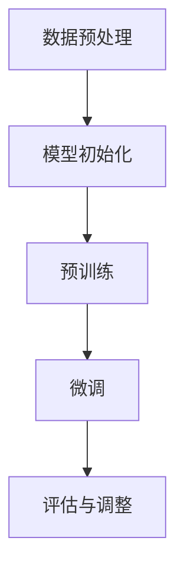
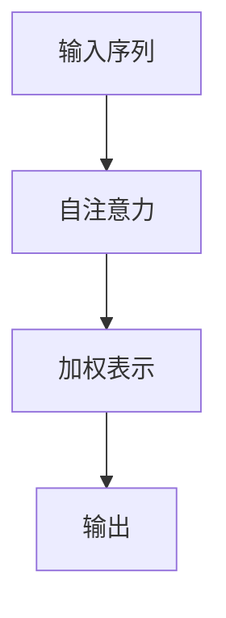
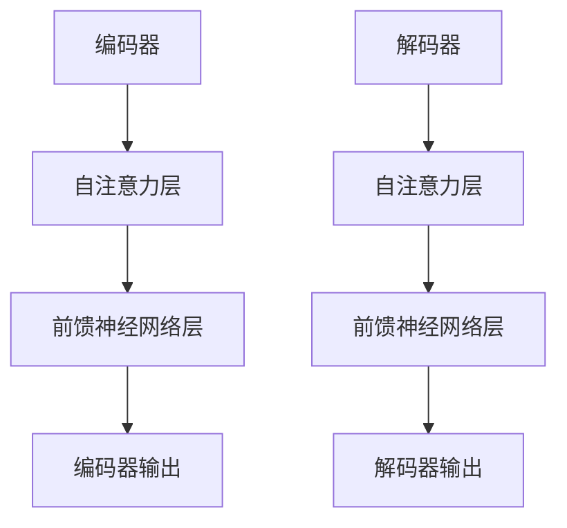

                 

### 《LLM在自然语言处理中的突破》

自然语言处理（NLP）是计算机科学与人工智能领域的重要组成部分，旨在让计算机能够理解、生成和处理人类语言。近年来，大型语言模型（LLM，Large Language Model）在NLP中的表现取得了显著的突破，成为该领域的重要研究方向。本文旨在系统地介绍LLM的基本概念、架构、训练策略以及其在NLP中的应用，旨在为读者提供一份详尽的技术参考资料。

关键词：大型语言模型、自然语言处理、Transformer、预训练、应用案例

摘要：本文首先回顾了NLP的发展历程，并引入了语言模型的概念。随后，详细介绍了序列模型与注意力机制，特别是Transformer架构。接着，讨论了预训练语言模型（如BERT、GPT、T5）的原理与训练策略。随后，文章通过具体的应用案例展示了LLM在机器翻译、文本分类、情感分析、问答系统等领域的突破性应用。最后，文章探讨了LLM评测与优化方法，并展望了其未来的发展趋势与挑战。

### 《LLM在自然语言处理中的突破》目录大纲

#### 第一部分：LLM基础

**第1章: 语言模型概述**

1.1 自然语言处理背景  
1.1.1 NLP的发展历程  
1.1.2 语言模型的崛起

1.2 语言模型的基本概念  
1.2.1 语言模型的定义  
1.2.2 语言模型的类型  
1.2.3 语言模型的特点

1.3 语言模型的构建方法  
1.3.1 预训练语言模型  
1.3.2 微调与优化  
1.3.3 语言模型评估指标

**第2章: 序列模型与注意力机制**

2.1 序列模型基础  
2.1.1 RNN与LSTM  
2.1.2 GRU  
2.1.3 BiLSTM

2.2 注意力机制  
2.2.1 注意力机制原理  
2.2.2 自注意力机制  
2.2.3 交互式注意力

2.3 Transformer架构  
2.3.1 Transformer结构  
2.3.2 Transformer的变种

**第3章: 预训练语言模型**

3.1 预训练概念  
3.1.1 预训练的意义  
3.1.2 预训练的数据集  
3.1.3 预训练的方法

3.2 预训练语言模型  
3.2.1 BERT  
3.2.2 GPT  
3.2.3 T5

3.3 大模型训练策略  
3.3.1 数据增强  
3.3.2 梯度裁剪  
3.3.3 长序列处理

#### 第二部分：LLM在NLP中的应用

**第4章: 机器翻译**

4.1 机器翻译概述  
4.1.1 翻译的基本原理  
4.1.2 翻译的挑战

4.2 序列到序列模型  
4.2.1 序列到序列模型结构  
4.2.2 序列到序列模型的优化方法

4.3 机器翻译案例  
4.3.1 BERT-based翻译模型  
4.3.2 GPT-based翻译模型  
4.3.3 实际应用案例

**第5章: 文本分类与情感分析**

5.1 文本分类基础  
5.1.1 文本分类任务  
5.1.2 文本分类方法

5.2 情感分析原理  
5.2.1 情感分析的定义  
5.2.2 情感分析的挑战

5.3 文本分类与情感分析案例  
5.3.1 BERT-based分类模型  
5.3.2 GPT-based分类模型  
5.3.3 实际应用案例

**第6章: 问答系统**

6.1 问答系统概述  
6.1.1 问答系统的类型  
6.1.2 问答系统的挑战

6.2 基于检索的问答系统  
6.2.1 检索方法  
6.2.2 检索模型的优化

6.3 基于生成的问答系统  
6.3.1 生成方法  
6.3.2 生成模型的优化

6.4 问答系统案例  
6.4.1 BERT-based问答系统  
6.4.2 GPT-based问答系统  
6.4.3 实际应用案例

**第7章: 语言模型评测与优化**

7.1 语言模型评测方法  
7.1.1 评测指标  
7.1.2 评测工具

7.2 语言模型优化方法  
7.2.1 梯度裁剪  
7.2.2 模型压缩  
7.2.3 模型融合

7.3 优化案例  
7.3.1 案例一：模型压缩  
7.3.2 案例二：模型融合  
7.3.3 实际应用效果分析

#### 第三部分：未来展望与挑战

**第8章: 语言模型的发展趋势**

8.1 模型扩展与多样化  
8.1.1 多语言模型  
8.1.2 多模态模型  
8.1.3 生成对抗网络

8.2 伦理与隐私问题  
8.2.1 语言模型的伦理问题  
8.2.2 隐私保护与数据安全

8.3 未来发展趋势  
8.3.1 自动化与智能化  
8.3.2 应用领域的扩展  
8.3.3 持续学习与适应性

**附录**

附录A: 开发工具与资源  
附录B: Mermaid流程图  
附录C: 核心算法原理讲解与伪代码  
附录D: 项目实战案例  
附录E: 实际应用案例解析

### 第一部分：LLM基础

#### 第1章: 语言模型概述

##### 1.1 自然语言处理背景

自然语言处理（NLP）是研究如何使计算机能够理解、生成和处理人类语言的一门学科。NLP的历史可以追溯到20世纪50年代，当时的研究主要集中在机器翻译和文本分析方面。早期的NLP系统主要依赖于规则和语法分析，但随着计算能力的提升和机器学习技术的发展，统计方法和神经网络逐渐成为主流。

NLP的发展历程可以分为以下几个阶段：

1. **规则驱动方法**：早期NLP系统主要依赖于预定义的规则和模式匹配。这种方法在处理结构化数据方面表现良好，但在处理自然语言的灵活性和复杂性上存在明显局限。

2. **基于统计的方法**：20世纪80年代，NLP研究转向基于统计的方法，例如决策树、朴素贝叶斯分类器和最大熵模型。这些方法能够通过学习大量标注数据来预测文本的属性，显著提升了性能。

3. **神经网络方法**：从20世纪90年代开始，神经网络在NLP中的应用逐渐增多。循环神经网络（RNN）和其变体（如LSTM和GRU）的出现，使得处理序列数据成为可能。深度学习技术的发展进一步推动了NLP的进步。

4. **预训练语言模型**：近年来，预训练语言模型（如BERT、GPT和T5）的出现，将NLP提升到了一个全新的高度。这些模型通过在大规模语料库上进行预训练，然后通过微调适应特定任务，取得了前所未有的效果。

##### 1.1.2 语言模型的崛起

语言模型是NLP的核心组成部分，旨在对文本进行建模，预测下一个单词或字符的概率。语言模型的出现和发展，极大地推动了NLP的应用和性能。

1. **统计语言模型**：最早的统计语言模型是基于N元语法（N-gram）的模型。N元语法通过统计相邻单词或字符的频率来预测下一个符号。这种方法简单有效，但在长文本理解和复杂语言结构上存在局限性。

2. **基于知识的语言模型**：这种方法通过集成语言学和语言学的知识来构建语言模型，例如使用词义消歧和语法分析技术。虽然这种方法在某些特定领域表现良好，但构建和维护成本较高，且难以适应大规模数据处理。

3. **神经网络语言模型**：随着深度学习的发展，神经网络语言模型逐渐成为主流。这些模型通过学习文本的分布式表示，能够捕捉到更复杂的语言结构。特别是Transformer架构的出现，使得语言模型在大规模数据处理和长文本理解方面取得了突破性进展。

4. **预训练语言模型**：预训练语言模型（Pre-trained Language Model）是当前最流行的语言模型。这些模型通过在大规模语料库上进行预训练，学习到通用语言知识，然后通过微调（Fine-tuning）适应特定任务。BERT、GPT和T5等预训练语言模型，已经成为NLP领域的重要工具。

##### 1.2 语言模型的基本概念

语言模型是一种概率模型，用于对自然语言进行建模，预测下一个单词或字符的概率。一个典型的语言模型包含以下几个基本概念：

1. **符号序列**：自然语言可以表示为一组符号的序列，如单词、字符或子词。语言模型的目标是学习这些符号序列的概率分布。

2. **概率分布**：语言模型输出的是符号序列的概率分布。一个有效的语言模型应能够准确预测常见单词和短语的出现概率。

3. **训练数据**：语言模型通过学习大量已标注的文本数据来训练。这些数据通常来自大型文本语料库，如维基百科、新闻文章和社交媒体。

4. **参数**：语言模型由一组参数定义，这些参数通过训练数据学习得到。参数决定了语言模型对符号序列概率分布的建模能力。

5. **评估指标**：语言模型的性能通常通过一系列评估指标来衡量，如 perplexity（困惑度）、准确性、F1得分等。

##### 1.2.2 语言模型的类型

根据建模方法和应用场景，语言模型可以分为以下几种类型：

1. **统计语言模型**：基于统计方法构建的语言模型，如N元语法。这类模型通过统计相邻符号的频率来预测下一个符号的概率。

2. **基于知识的语言模型**：结合语言学和语言学的知识构建的语言模型，如使用词义消歧和语法分析技术。这类模型通常在特定领域表现良好，但构建和维护成本较高。

3. **神经网络语言模型**：基于神经网络构建的语言模型，如循环神经网络（RNN）和变换器（Transformer）。这类模型通过学习文本的分布式表示，能够捕捉到更复杂的语言结构。

4. **预训练语言模型**：在大规模语料库上进行预训练的语言模型，如BERT、GPT和T5。这类模型通过学习通用语言知识，然后通过微调适应特定任务，取得了显著的效果。

##### 1.2.3 语言模型的特点

语言模型具有以下几个特点：

1. **概率性**：语言模型输出的是符号序列的概率分布，而非确定性结果。这使语言模型能够适应不同的上下文环境，并处理语言中的不确定性。

2. **上下文依赖性**：语言模型能够考虑上下文信息，预测下一个符号的概率。这使得语言模型能够捕捉到语言中的复杂结构和依赖关系。

3. **可微调性**：预训练语言模型通过在大规模语料库上进行预训练，学习到通用语言知识。然后，通过微调（Fine-tuning）适应特定任务，提高了模型的性能。

4. **计算效率**：现代语言模型通常采用深度神经网络结构，计算复杂度较高。但通过优化和硬件加速，语言模型在实际应用中的计算效率得到了显著提升。

##### 1.3 语言模型的构建方法

构建语言模型的主要方法包括以下几种：

1. **基于规则的构建方法**：通过定义一组规则，将文本转换为模型输入。这种方法简单直观，但难以处理复杂的语言现象。

2. **基于统计的构建方法**：使用统计方法，如N元语法，通过计算相邻符号的频率来预测下一个符号。这种方法在早期NLP应用中较为流行。

3. **基于神经网络的构建方法**：使用神经网络，如循环神经网络（RNN）和变换器（Transformer），通过学习文本的分布式表示来构建语言模型。这种方法在当前NLP应用中占据主导地位。

4. **基于预训练的构建方法**：在大规模语料库上进行预训练，学习到通用语言知识，然后通过微调（Fine-tuning）适应特定任务。这种方法使得语言模型在多个任务上取得了显著的性能提升。

##### 1.3.1 预训练语言模型

预训练语言模型（Pre-trained Language Model）是近年来NLP领域的重要突破。预训练语言模型通过在大规模语料库上进行预训练，学习到通用语言知识，然后通过微调（Fine-tuning）适应特定任务。

1. **预训练的意义**：预训练语言模型能够利用大规模未标注数据，学习到丰富的语言知识。这为NLP任务提供了强大的先验知识，显著提高了模型的性能。

2. **预训练的数据集**：常用的预训练数据集包括维基百科、新闻文章、社交媒体等。这些数据集具有丰富的内容，能够覆盖多种语言现象。

3. **预训练的方法**：预训练方法主要包括Masked Language Model（MLM）、Replaced Token Detection（RTD）和Masked Sentence Prediction（MSP）等。这些方法通过在输入文本中随机遮盖部分单词或句子，然后预测遮盖部分的内容，使模型学习到语言的内在结构。

4. **预训练模型的评估**：预训练模型的性能通常通过一系列评估指标来衡量，如 perplexity（困惑度）、准确性、F1得分等。这些指标能够反映模型在语言理解、文本分类和机器翻译等任务上的表现。

##### 1.3.2 微调与优化

微调（Fine-tuning）是指将预训练语言模型应用于特定任务，通过调整模型参数来适应任务需求。微调是预训练语言模型在NLP应用中的关键步骤。

1. **微调的目标**：微调的目标是使预训练模型能够针对特定任务进行优化，提高模型在目标任务上的性能。

2. **微调的方法**：常用的微调方法包括全微调（Full Fine-tuning）和部分微调（Partial Fine-tuning）。全微调是指将预训练模型的全部参数进行微调，部分微调是指只微调整部分参数。

3. **优化策略**：为了提高微调效果，可以采用以下优化策略：
   - 数据增强（Data Augmentation）：通过引入噪声、翻译、同义词替换等方式，增加训练数据多样性。
   - 梯度裁剪（Gradient Clipping）：限制梯度大小，防止梯度爆炸和消失。
   - 早期停止（Early Stopping）：在验证集性能不再提升时停止训练，避免过拟合。

##### 1.3.3 语言模型评估指标

语言模型的性能评估是衡量模型好坏的重要手段。常用的评估指标包括：

1. **困惑度（Perplexity）**：困惑度是衡量语言模型预测准确性的指标。困惑度越低，表示模型对文本的预测越准确。

2. **准确性（Accuracy）**：准确性是衡量模型分类准确性的指标。在文本分类任务中，准确性越高，表示模型对类别划分越准确。

3. **F1得分（F1 Score）**：F1得分是衡量模型分类准确性和召回率之间的平衡指标。F1得分越高，表示模型在分类任务中表现越好。

4. **BLEU评分（BLEU Score）**：BLEU评分是衡量机器翻译质量的指标。BLEU评分越高，表示机器翻译结果越接近人工翻译。

5. **ROUGE评分（ROUGE Score）**：ROUGE评分是衡量文本生成质量的指标。ROUGE评分越高，表示文本生成结果越接近原始文本。

#### 第2章: 序列模型与注意力机制

##### 2.1 序列模型基础

序列模型（Sequence Model）是用于处理序列数据的概率模型，如自然语言、音频、时间序列等。序列模型的基本原理是利用历史信息来预测未来序列的下一个元素。在自然语言处理中，序列模型广泛应用于文本分类、机器翻译、语音识别等任务。

1. **循环神经网络（RNN）**：

循环神经网络（Recurrent Neural Network，RNN）是早期用于处理序列数据的一种神经网络。RNN的基本结构是循环单元，每个时间步的输出不仅依赖于当前输入，还受到历史信息的影响。RNN的主要优点是能够处理任意长度的序列。

RNN的数学表示如下：

$$
h_t = \sigma(W_h h_{t-1} + W_x x_t + b_h)
$$

其中，$h_t$表示时间步$t$的隐藏状态，$x_t$表示时间步$t$的输入，$W_h$和$W_x$分别是隐藏状态和输入的权重矩阵，$b_h$是隐藏状态的偏置。

2. **长短期记忆网络（LSTM）**：

长短期记忆网络（Long Short-Term Memory，LSTM）是RNN的一种变体，旨在解决RNN在长序列学习中出现的梯度消失和梯度爆炸问题。LSTM通过引入门控机制，能够有效控制信息的流动，从而在长序列学习中保持长期依赖关系。

LSTM的基本结构包括三个门控单元：遗忘门（Forget Gate）、输入门（Input Gate）和输出门（Output Gate）。每个门控单元都是一个Sigmoid函数，用于控制信息的保留和更新。

LSTM的数学表示如下：

$$
i_t = \sigma(W_i x_t + U_h h_{t-1} + b_i) \\
f_t = \sigma(W_f x_t + U_f h_{t-1} + b_f) \\
C_t = f_t \odot C_{t-1} + i_t \odot \sigma(W_c x_t + U_c h_{t-1} + b_c) \\
o_t = \sigma(W_o x_t + U_o h_{t-1} + b_o) \\
h_t = o_t \odot \sigma(C_t)
$$

其中，$i_t$、$f_t$和$o_t$分别表示输入门、遗忘门和输出门，$C_t$表示细胞状态，$W_i$、$W_f$、$W_o$、$W_c$和$U_i$、$U_f$、$U_o$、$U_c$分别是权重矩阵和偏置，$\odot$表示逐元素乘法操作，$\sigma$表示Sigmoid函数。

3. **门控循环单元（GRU）**：

门控循环单元（Gated Recurrent Unit，GRU）是LSTM的一种简化变体，旨在提高计算效率。GRU通过引入更新门（Update Gate）和重置门（Reset Gate）来控制信息的流动。

GRU的数学表示如下：

$$
z_t = \sigma(W_z x_t + U_z h_{t-1} + b_z) \\
r_t = \sigma(W_r x_t + U_r h_{t-1} + b_r) \\
\tilde{h_t} = \sigma(W_h x_t + U_h (r_t \odot h_{t-1}) + b_h) \\
h_t = z_t \odot h_{t-1} + (1 - z_t) \odot \tilde{h_t}
$$

其中，$z_t$、$r_t$和$\tilde{h_t}$分别表示更新门、重置门和候选隐藏状态，$W_z$、$W_r$、$W_h$和$U_z$、$U_r$、$U_h$分别是权重矩阵和偏置。

4. **双向长短时记忆网络（BiLSTM）**：

双向长短时记忆网络（Bidirectional Long Short-Term Memory，BiLSTM）是LSTM的一种双向变体，通过同时考虑正向和反向序列信息来提高模型性能。

BiLSTM的数学表示如下：

$$
h_f^t = \text{LSTM}(x^t, \{h^t_1, \ldots, h^t_{t-1}\}) \\
h_b^t = \text{LSTM}(x^t, \{h^t_{t+1}, \ldots, h^t_n\}) \\
h^t = [h_f^t; h_b^t]
$$

其中，$h_f^t$和$h_b^t$分别表示正向LSTM和反向LSTM的隐藏状态，$h^t$表示双向LSTM的隐藏状态。

##### 2.2 注意力机制

注意力机制（Attention Mechanism）是深度学习领域的一种关键技术，旨在提高模型对序列数据的处理能力。注意力机制通过为序列中的每个元素分配权重，使模型能够聚焦于重要信息，从而提高模型的性能。

1. **注意力机制原理**：

注意力机制的核心思想是，在处理序列数据时，模型需要关注某些重要的信息，而忽略其他次要的信息。注意力机制通过计算一个权重系数，将输入序列的每个元素映射到一个加权表示。最终的输出是加权表示的加权和，权重系数反映了每个元素的重要性。

注意力机制的数学表示如下：

$$
a_t = \text{softmax}(\text{Attention}(h_{<t}, h_t)) \\
s_t = \sum_{i=1}^n a_i h_i \\
o_t = \text{MLP}(s_t)
$$

其中，$a_t$表示时间步$t$的注意力权重，$s_t$表示加权表示，$o_t$表示输出。

2. **自注意力机制（Self-Attention）**：

自注意力机制（Self-Attention）是一种常见的注意力机制，用于处理输入序列的内部依赖关系。自注意力机制的核心思想是，将输入序列的每个元素映射到一个加权和，权重系数反映了元素之间的依赖关系。

自注意力机制的数学表示如下：

$$
Q = \text{Linear}(X) \\
K = \text{Linear}(X) \\
V = \text{Linear}(X) \\
\text{MultiHead}(Q, K, V) = \text{Concat}(\text{head}_1, \ldots, \text{head}_h)W_O \\
\text{head}_i = \text{softmax}(\frac{QK_i^T}{\sqrt{d_k}})V_i
$$

其中，$X$是输入序列，$Q$、$K$和$V$是权重矩阵，$W_O$是输出权重矩阵，$d_k$是关键字的维度，$h$是注意力头的数量。

3. **交互式注意力（Interactive Attention）**：

交互式注意力（Interactive Attention）是一种将注意力机制应用于多个序列的注意力机制。交互式注意力通过计算两个序列的交互注意力权重，使模型能够同时关注两个序列的信息。

交互式注意力的数学表示如下：

$$
a_{ij} = \text{softmax}(\text{Attention}(h_i, h_j)) \\
s_j = \sum_{i=1}^n a_{ij} h_i \\
o_j = \text{MLP}(s_j)
$$

其中，$h_i$和$h_j$分别是两个序列的隐藏状态，$a_{ij}$是交互注意力权重。

##### 2.3 Transformer架构

Transformer是一种基于自注意力机制的序列模型，由Vaswani等人于2017年提出。Transformer在机器翻译任务上取得了显著的性能提升，并成为NLP领域的重要模型。

1. **Transformer结构**：

Transformer由编码器（Encoder）和解码器（Decoder）组成，编码器和解码器分别处理输入序列和输出序列。编码器和解码器都包含多个相同的层，每层由自注意力机制和前馈神经网络组成。

编码器和解码器的结构如下：

$$
E = \text{MultiHead}(Q, K, V) + X \\
D = \text{MaskedMultiHead}(Q, K, V) + X \\
\text{LayerNorm}(D) \\
\text{LayerNorm}(E) \\
E = \text{FFN}(E) \\
D = \text{FFN}(D)
$$

其中，$X$是输入序列，$E$是编码器的输出，$D$是解码器的输出，$\text{MultiHead}$和$\text{MaskedMultiHead}$分别表示多头自注意力机制，$\text{FFN}$表示前馈神经网络，$\text{LayerNorm}$表示层归一化。

2. **Transformer的变种**：

基于Transformer架构，研究人员提出了许多变种，如BERT、GPT和T5等。这些变种通过调整模型结构、训练策略和优化方法，在NLP任务中取得了优异的性能。

BERT（Bidirectional Encoder Representations from Transformers）是一种双向编码器，通过同时考虑正向和反向序列信息，提高了模型的性能。BERT主要由多个Transformer编码器层组成，并采用Masked Language Model（MLM）进行预训练。

GPT（Generative Pre-trained Transformer）是一种生成式语言模型，通过生成序列来预训练模型。GPT主要由多个Transformer解码器层组成，并采用Top-K采样和温度调节等技术来生成序列。

T5（Text-To-Text Transfer Transformer）是一种文本到文本的转换模型，通过将输入文本转换为输出文本，实现了跨任务的学习。T5主要由多个Transformer编码器和解码器层组成，并采用文本编码器-解码器结构进行训练。

##### 2.4 Transformer的变种

基于Transformer架构，研究人员提出了许多变种，以适应不同的NLP任务和应用场景。以下是几个常见的Transformer变种：

1. **BERT（Bidirectional Encoder Representations from Transformers）**：

BERT是一种双向编码器，通过同时考虑正向和反向序列信息，提高了模型的性能。BERT主要由多个Transformer编码器层组成，并采用Masked Language Model（MLM）进行预训练。

BERT的预训练方法包括以下步骤：

- **Masked Language Model（MLM）**：在输入序列中随机遮盖部分单词或子词，然后预测遮盖部分的内容。MLM使模型学习到语言的内在结构。
- **Next Sentence Prediction（NSP）**：预测两个连续句子之间的顺序关系。NSP使模型能够捕捉到句子之间的依赖关系。

BERT的主要结构如下：

$$
\text{BERT} = \text{Encoder} \\
\text{Encoder} = \text{Layer}^{\text{N}}_{\text{Transformer}} \\
\text{Layer} = \text{MultiHeadSelfAttention} + \text{PositionalEncoding} + \text{FeedForward} \\
\text{PositionalEncoding} = \text{Sin}(\frac{pos}{10000} \cdot \text{Scale}) \\
\text{Sin}(\theta) = \sin(\theta) \\
\text{Scale} = \sqrt{\frac{d_{model}}{2}} \\
\text{d_{model}} = 768, 1024, 1280, \ldots
$$

其中，$N$是Transformer编码器的层数，$d_{model}$是模型维度。

BERT在NLP任务中取得了优异的性能，广泛应用于文本分类、问答系统和机器翻译等任务。

2. **GPT（Generative Pre-trained Transformer）**：

GPT是一种生成式语言模型，通过生成序列来预训练模型。GPT主要由多个Transformer解码器层组成，并采用Top-K采样和温度调节等技术来生成序列。

GPT的预训练方法包括以下步骤：

- **Generate Next Sequence（GNS）**：生成下一个序列。在输入序列的末端添加一个特殊的开始标记，然后生成后续的序列。
- **Top-K Sampling**：在生成序列时，从前$k$个概率最高的候选序列中选择一个。Top-K Sampling使模型能够生成更多样化的序列。
- **Temperature Scaling**：调整生成序列的概率分布。温度调节使模型在生成序列时具有更多的灵活性。

GPT的主要结构如下：

$$
\text{GPT} = \text{Decoder} \\
\text{Decoder} = \text{Layer}^{\text{N}}_{\text{Transformer}} \\
\text{Layer} = \text{MaskedMultiHeadSelfAttention} + \text{FeedForward} \\
\text{PositionalEncoding} = \text{Sin}(\frac{pos}{10000} \cdot \text{Scale}) \\
\text{Sin}(\theta) = \sin(\theta) \\
\text{Scale} = \sqrt{\frac{d_{model}}{2}} \\
\text{d_{model}} = 1024, 4096, \ldots
$$

其中，$N$是Transformer解码器的层数，$d_{model}$是模型维度。

GPT在自然语言生成任务中取得了显著的性能，广泛应用于对话系统、文本摘要和机器翻译等任务。

3. **T5（Text-To-Text Transfer Transformer）**：

T5是一种文本到文本的转换模型，通过将输入文本转换为输出文本，实现了跨任务的学习。T5主要由多个Transformer编码器和解码器层组成，并采用文本编码器-解码器结构进行训练。

T5的主要结构如下：

$$
\text{T5} = \text{Encoder} + \text{Decoder} \\
\text{Encoder} = \text{Layer}^{\text{N}}_{\text{Transformer}} \\
\text{Decoder} = \text{Layer}^{\text{N}}_{\text{Transformer}} \\
\text{Layer} = \text{MaskedMultiHeadSelfAttention} + \text{FeedForward} \\
\text{PositionalEncoding} = \text{Sin}(\frac{pos}{10000} \cdot \text{Scale}) \\
\text{Sin}(\theta) = \sin(\theta) \\
\text{Scale} = \sqrt{\frac{d_{model}}{2}} \\
\text{d_{model}} = 1024, 2048, \ldots
$$

其中，$N$是Transformer编码器和解码器的层数，$d_{model}$是模型维度。

T5在跨任务学习和文本生成任务中取得了优异的性能，广泛应用于问答系统、文本摘要和机器翻译等任务。

#### 第3章: 预训练语言模型

##### 3.1 预训练概念

预训练（Pre-training）是指在大规模语料库上进行预训练，学习到通用语言知识，然后通过微调（Fine-tuning）适应特定任务。预训练是近年来NLP领域的重要突破，为许多NLP任务提供了强大的先验知识，显著提高了模型的性能。

1. **预训练的意义**：

预训练的意义在于以下几个方面：

- **利用未标注数据**：预训练使模型能够利用大量未标注的文本数据，学习到通用语言知识。这些未标注数据在标注数据稀缺的情况下尤为重要。
- **提高模型泛化能力**：预训练使模型在大规模语料库上进行训练，学习到丰富的语言知识。这有助于模型在不同任务和领域上的泛化能力。
- **加速模型训练**：预训练使模型在特定任务上的训练时间显著缩短。由于预训练模型已经学习到了通用语言知识，因此在特定任务上只需要进行微调，而不是从头开始训练。

2. **预训练的数据集**：

预训练的数据集主要包括以下几种：

- **维基百科（Wikipedia）**：维基百科是一个包含丰富知识的大型在线百科全书，是预训练数据集的重要来源。
- **新闻文章（News Articles）**：新闻文章涵盖了多种主题和风格，有助于模型学习到多样化的语言知识。
- **社交媒体（Social Media）**：社交媒体平台如Twitter和Facebook，包含了大量实时和多样化的文本数据，有助于模型学习到现代语言特征。
- **对话语料（Dialogue Corpora）**：对话语料包含了人与机器的对话记录，有助于模型学习到对话生成和回复的能力。

3. **预训练的方法**：

预训练的方法主要包括以下几种：

- **Masked Language Model（MLM）**：在输入序列中随机遮盖部分单词或子词，然后预测遮盖部分的内容。MLM使模型学习到语言的内在结构。
- **Replaced Token Detection（RTD）**：在输入序列中随机替换部分单词或子词，然后预测替换部分的内容。RTD有助于模型学习到词义消歧和上下文理解。
- **Masked Sentence Prediction（MSP）**：在输入序列中随机遮盖部分句子，然后预测遮盖部分的内容。MSP有助于模型学习到句子级语义理解。

##### 3.2 预训练语言模型

预训练语言模型（Pre-trained Language Model）是近年来NLP领域的重要突破，通过在大规模语料库上进行预训练，学习到通用语言知识，然后通过微调（Fine-tuning）适应特定任务。预训练语言模型在多个NLP任务中取得了显著的性能提升，成为NLP领域的重要工具。

1. **BERT（Bidirectional Encoder Representations from Transformers）**：

BERT是一种双向编码器，通过同时考虑正向和反向序列信息，提高了模型的性能。BERT主要由多个Transformer编码器层组成，并采用Masked Language Model（MLM）进行预训练。

BERT的预训练方法包括以下步骤：

- **Masked Language Model（MLM）**：在输入序列中随机遮盖部分单词或子词，然后预测遮盖部分的内容。MLM使模型学习到语言的内在结构。
- **Next Sentence Prediction（NSP）**：预测两个连续句子之间的顺序关系。NSP使模型能够捕捉到句子之间的依赖关系。

BERT的主要结构如下：

$$
\text{BERT} = \text{Encoder} \\
\text{Encoder} = \text{Layer}^{\text{N}}_{\text{Transformer}} \\
\text{Layer} = \text{MultiHeadSelfAttention} + \text{PositionalEncoding} + \text{FeedForward} \\
\text{PositionalEncoding} = \text{Sin}(\frac{pos}{10000} \cdot \text{Scale}) \\
\text{Sin}(\theta) = \sin(\theta) \\
\text{Scale} = \sqrt{\frac{d_{model}}{2}} \\
\text{d_{model}} = 768, 1024, 1280, \ldots
$$

其中，$N$是Transformer编码器的层数，$d_{model}$是模型维度。

BERT在NLP任务中取得了优异的性能，广泛应用于文本分类、问答系统和机器翻译等任务。

2. **GPT（Generative Pre-trained Transformer）**：

GPT是一种生成式语言模型，通过生成序列来预训练模型。GPT主要由多个Transformer解码器层组成，并采用Top-K采样和温度调节等技术来生成序列。

GPT的预训练方法包括以下步骤：

- **Generate Next Sequence（GNS）**：生成下一个序列。在输入序列的末端添加一个特殊的开始标记，然后生成后续的序列。
- **Top-K Sampling**：在生成序列时，从前$k$个概率最高的候选序列中选择一个。Top-K Sampling使模型能够生成更多样化的序列。
- **Temperature Scaling**：调整生成序列的概率分布。温度调节使模型在生成序列时具有更多的灵活性。

GPT的主要结构如下：

$$
\text{GPT} = \text{Decoder} \\
\text{Decoder} = \text{Layer}^{\text{N}}_{\text{Transformer}} \\
\text{Layer} = \text{MaskedMultiHeadSelfAttention} + \text{FeedForward} \\
\text{PositionalEncoding} = \text{Sin}(\frac{pos}{10000} \cdot \text{Scale}) \\
\text{Sin}(\theta) = \sin(\theta) \\
\text{Scale} = \sqrt{\frac{d_{model}}{2}} \\
\text{d_{model}} = 1024, 4096, \ldots
$$

其中，$N$是Transformer解码器的层数，$d_{model}$是模型维度。

GPT在自然语言生成任务中取得了显著的性能，广泛应用于对话系统、文本摘要和机器翻译等任务。

3. **T5（Text-To-Text Transfer Transformer）**：

T5是一种文本到文本的转换模型，通过将输入文本转换为输出文本，实现了跨任务的学习。T5主要由多个Transformer编码器和解码器层组成，并采用文本编码器-解码器结构进行训练。

T5的主要结构如下：

$$
\text{T5} = \text{Encoder} + \text{Decoder} \\
\text{Encoder} = \text{Layer}^{\text{N}}_{\text{Transformer}} \\
\text{Decoder} = \text{Layer}^{\text{N}}_{\text{Transformer}} \\
\text{Layer} = \text{MaskedMultiHeadSelfAttention} + \text{FeedForward} \\
\text{PositionalEncoding} = \text{Sin}(\frac{pos}{10000} \cdot \text{Scale}) \\
\text{Sin}(\theta) = \sin(\theta) \\
\text{Scale} = \sqrt{\frac{d_{model}}{2}} \\
\text{d_{model}} = 1024, 2048, \ldots
$$

其中，$N$是Transformer编码器和解码器的层数，$d_{model}$是模型维度。

T5在跨任务学习和文本生成任务中取得了优异的性能，广泛应用于问答系统、文本摘要和机器翻译等任务。

##### 3.3 大模型训练策略

随着预训练语言模型的规模不断扩大，训练策略的优化变得至关重要。大模型训练策略主要包括数据增强、梯度裁剪和长序列处理等技术。以下将详细介绍这些策略及其应用。

1. **数据增强**：

数据增强（Data Augmentation）是一种通过引入噪声、变换等方式增加训练数据多样性的技术。数据增强有助于模型学习到更泛化的特征，从而提高模型的性能和泛化能力。常用的数据增强方法包括：

- **随机填充（Random Fill）**：在输入序列中随机填充特殊字符或空白符，增加序列的多样性。
- **同义词替换（Word Replacement）**：将输入序列中的部分单词替换为其同义词，模拟不同的语义场景。
- **翻译（Translation）**：使用机器翻译模型将输入序列翻译成其他语言，然后翻译回原始语言，引入语言翻译过程中的多样性。
- **文本摘要（Text Summarization）**：使用文本摘要模型生成输入序列的摘要，然后使用摘要作为训练数据，引入摘要过程中的多样性。

2. **梯度裁剪**：

梯度裁剪（Gradient Clipping）是一种限制梯度大小的技术，用于防止梯度爆炸和梯度消失问题。在训练大模型时，梯度可能变得非常大或非常小，导致训练不稳定。梯度裁剪通过设置一个阈值，将超出阈值的梯度裁剪到阈值范围内，从而保持梯度的稳定性。

梯度裁剪的数学表示如下：

$$
\text{clip}(g, \text{threshold}) = \begin{cases}
g & \text{if } |g| \leq \text{threshold} \\
\text{sign}(g) \cdot \text{threshold} & \text{if } |g| > \text{threshold}
\end{cases}
$$

其中，$g$是梯度，$\text{threshold}$是阈值。

3. **长序列处理**：

预训练语言模型通常需要处理非常长的序列，例如百科全书、新闻文章等。长序列处理（Long Sequence Processing）是指模型在训练过程中如何高效地处理长序列数据。以下是一些长序列处理的方法：

- **分段训练（Segment Training）**：将长序列划分为多个较短的分段，分别对每个分段进行训练。这种方法可以降低内存消耗，提高训练效率。
- **内存高效模型（Memory-Efficient Model）**：通过压缩模型参数、减少内存占用等方式，使模型能够处理更长的序列。
- **滑动窗口（Sliding Window）**：将长序列分成多个固定长度的滑动窗口，分别对每个窗口进行训练。这种方法可以动态地处理长序列，同时减少内存占用。

##### 3.4 预训练语言模型的训练步骤

预训练语言模型的训练步骤可以分为以下几个阶段：

1. **数据预处理**：

- **文本清洗**：去除无用字符、标点符号和停用词，提高文本的可用性。
- **分词**：将文本分割成单词、字符或子词，为后续的模型处理做准备。
- **词汇表构建**：将文本中的词汇构建成词汇表，为模型训练提供输入。

2. **模型初始化**：

- **权重初始化**：初始化模型参数，常用的方法包括随机初始化、高斯初始化和Xavier初始化等。
- **正则化**：应用正则化技术，如dropout、L2正则化等，防止模型过拟合。

3. **预训练**：

- **Masked Language Model（MLM）**：在输入序列中随机遮盖部分单词或子词，然后预测遮盖部分的内容。
- **Next Sentence Prediction（NSP）**：预测两个连续句子之间的顺序关系。
- **数据增强**：应用数据增强技术，如随机填充、同义词替换等，增加训练数据的多样性。

4. **评估与调整**：

- **评估指标**：使用困惑度（Perplexity）、准确性（Accuracy）和F1得分（F1 Score）等评估指标，评估模型性能。
- **模型调整**：根据评估结果，调整模型参数和训练策略，提高模型性能。

5. **微调**：

- **任务特定数据**：收集与目标任务相关的数据，如分类任务的数据集。
- **微调模型**：在预训练模型的基础上，使用任务特定数据进行微调，使模型适应特定任务。

6. **部署与优化**：

- **模型部署**：将微调后的模型部署到生产环境，提供API接口或嵌入式应用。
- **模型优化**：通过模型压缩、量化等技术，优化模型性能和计算效率。

#### 第二部分：LLM在NLP中的应用

##### 第4章: 机器翻译

机器翻译（Machine Translation，MT）是指利用计算机技术将一种自然语言（源语言）自动转换为另一种自然语言（目标语言）的过程。近年来，随着预训练语言模型（如BERT、GPT和T5）的快速发展，机器翻译技术取得了显著的突破，取得了与人类翻译水平相媲美的性能。

##### 4.1 机器翻译概述

1. **机器翻译的基本原理**：

机器翻译的基本原理包括以下几个步骤：

- **文本预处理**：对源文本进行分词、去除标点符号和停用词等预处理操作，使文本格式符合模型输入要求。
- **编码**：将源文本编码为模型可处理的序列表示，如单词、字符或子词。
- **翻译模型**：使用预训练语言模型，如BERT或GPT，将源文本序列映射为目标文本序列。
- **解码**：将翻译模型输出的目标文本序列解码为自然语言文本。

2. **机器翻译的挑战**：

机器翻译面临以下几个挑战：

- **语言多样性**：不同语言之间存在巨大的差异性，如词汇、语法和语义等。这使得机器翻译在不同语言之间的转换过程中面临困难。
- **歧义性**：自然语言中存在大量的歧义现象，如一词多义、上下文依赖等。这使得机器翻译难以准确理解文本的含义。
- **语用和风格**：翻译不仅要传达文本的字面意思，还要考虑语境、文化和风格等因素。这增加了机器翻译的复杂度。
- **长距离依赖**：自然语言中存在长距离依赖关系，即一个单词的含义可能依赖于较远的上下文信息。这给机器翻译带来了挑战。

##### 4.2 序列到序列模型

序列到序列模型（Sequence-to-Sequence Model）是机器翻译任务中常用的模型架构。序列到序列模型由编码器（Encoder）和解码器（Decoder）组成，分别处理源语言文本和目标语言文本。以下将详细介绍序列到序列模型的结构和优化方法。

1. **序列到序列模型结构**：

序列到序列模型的结构如下：

- **编码器（Encoder）**：编码器将源语言文本序列编码为固定长度的向量表示。编码器的输出通常是一个隐藏状态序列，表示源文本的语义信息。
- **解码器（Decoder）**：解码器将编码器的隐藏状态序列解码为目标语言文本序列。解码器在生成每个目标单词时，依赖于之前的生成单词，形成一个自回归过程。

2. **优化方法**：

序列到序列模型的优化方法主要包括以下几种：

- **损失函数**：序列到序列模型通常使用交叉熵损失函数（Cross-Entropy Loss）来优化模型。交叉熵损失函数衡量预测序列与真实序列之间的差异，指导模型调整参数。
- **序列平滑**：序列平滑（Sequence Smoothing）是一种常用的优化方法，通过在解码过程中引入平滑项来减少预测中的极端值。常见的序列平滑方法包括加法和减法平滑。
- **Teacher Forcing**：Teacher Forcing是一种在解码过程中使用真实目标单词作为输入的方法。Teacher Forcing可以加快解码过程，但可能导致模型过度依赖真实目标。
- **Early Stopping**：Early Stopping是一种在训练过程中提前停止训练的方法，以防止过拟合。通常，当验证集的性能不再提升时，使用Early Stopping来终止训练。

##### 4.3 机器翻译案例

以下将介绍几种基于预训练语言模型的机器翻译案例，包括BERT-based翻译模型和GPT-based翻译模型。

1. **BERT-based翻译模型**：

BERT-based翻译模型利用BERT模型的预训练语言知识，通过编码器-解码器结构实现机器翻译。BERT-based翻译模型的主要优点是能够利用双向编码器捕捉到源文本的语义信息，提高翻译的准确性。

BERT-based翻译模型的结构如下：

- **编码器**：使用BERT模型对源文本进行编码，生成固定长度的向量表示。
- **解码器**：使用Transformer解码器对编码器的输出进行解码，生成目标文本序列。

2. **GPT-based翻译模型**：

GPT-based翻译模型利用GPT模型的生成能力，通过解码器生成目标文本序列。GPT-based翻译模型的主要优点是能够生成流畅且多样化的目标文本。

GPT-based翻译模型的结构如下：

- **编码器**：使用BERT模型对源文本进行编码，生成固定长度的向量表示。
- **解码器**：使用GPT模型生成目标文本序列，通过Top-K采样和温度调节等技术来提高生成序列的多样性。

3. **实际应用案例**：

以下是一个基于BERT-based翻译模型和GPT-based翻译模型的实际应用案例：

- **翻译应用场景**：假设需要将中文翻译成英文，输入中文文本“我爱中国”，使用BERT-based翻译模型和GPT-based翻译模型进行翻译。

- **BERT-based翻译模型**：使用BERT-based翻译模型进行翻译，输出目标文本为“I love China”。

- **GPT-based翻译模型**：使用GPT-based翻译模型进行翻译，输出目标文本为“I love China”和“I love the country of China”。

通过对比，可以发现BERT-based翻译模型的翻译结果更为准确，而GPT-based翻译模型则能生成更丰富的翻译结果。

##### 第5章: 文本分类与情感分析

文本分类（Text Classification）是指将文本数据自动归类到预定义的类别中的任务。情感分析（Sentiment Analysis）是一种文本分类的特殊情况，旨在判断文本的情感倾向，如正面、负面或中性。近年来，预训练语言模型（如BERT、GPT和T5）的快速发展，使得文本分类与情感分析任务取得了显著的突破。

##### 5.1 文本分类基础

1. **文本分类任务**：

文本分类任务主要包括以下几种类型：

- **二分类**：将文本分为两个类别，如正面和负面。
- **多分类**：将文本分为多个类别，如新闻分类、情感分类等。
- **多标签分类**：将文本分类到多个类别中，如音乐评论分类。

2. **文本分类方法**：

文本分类方法可以分为以下几种：

- **基于规则的方法**：通过预定义的规则和模式匹配进行分类，如TF-IDF、朴素贝叶斯等。
- **基于统计的方法**：使用统计方法，如决策树、支持向量机等，通过学习特征和类别之间的关系进行分类。
- **基于神经网络的方法**：使用神经网络，如循环神经网络（RNN）、变换器（Transformer）等，通过学习文本的分布式表示进行分类。

##### 5.2 情感分析原理

1. **情感分析的定义**：

情感分析（Sentiment Analysis）是指通过自然语言处理技术，自动识别文本中的情感倾向，如正面、负面或中性。情感分析通常涉及以下步骤：

- **情感极性识别**：判断文本的情感极性，如正面、负面或中性。
- **情感强度评估**：评估文本情感的程度，如非常正面、稍微正面等。

2. **情感分析的挑战**：

情感分析面临以下几个挑战：

- **语义歧义**：自然语言中存在大量的歧义现象，如一词多义、上下文依赖等。这使得情感分析难以准确理解文本的情感倾向。
- **情感强度和多样性**：情感分析的挑战在于评估文本情感的程度和多样性，如正面情感的强度和负面情感的强度等。
- **文化差异**：不同文化背景下，对同一文本的情感理解可能存在差异。这使得情感分析需要考虑文化差异。

##### 5.3 文本分类与情感分析案例

以下将介绍几种基于预训练语言模型的文本分类与情感分析案例，包括BERT-based分类模型和GPT-based分类模型。

1. **BERT-based分类模型**：

BERT-based分类模型利用BERT模型的预训练语言知识，通过微调适应特定分类任务。BERT-based分类模型的主要优点是能够利用双向编码器捕捉到文本的语义信息，提高分类的准确性。

BERT-based分类模型的结构如下：

- **编码器**：使用BERT模型对文本进行编码，生成固定长度的向量表示。
- **分类器**：在BERT编码器的输出上添加一个分类层，用于分类文本。

2. **GPT-based分类模型**：

GPT-based分类模型利用GPT模型的生成能力，通过解码器生成分类结果。GPT-based分类模型的主要优点是能够生成多样化的分类结果，提高分类的多样性。

GPT-based分类模型的结构如下：

- **编码器**：使用BERT模型对文本进行编码，生成固定长度的向量表示。
- **解码器**：使用GPT模型生成分类结果，通过Top-K采样和温度调节等技术来提高生成结果的多样性。

3. **实际应用案例**：

以下是一个基于BERT-based分类模型和GPT-based分类模型的实际应用案例：

- **应用场景**：假设需要对社交媒体评论进行情感分析，输入评论“这部电影非常棒！”。

- **BERT-based分类模型**：使用BERT-based分类模型进行情感分析，输出结果为“正面情感”。

- **GPT-based分类模型**：使用GPT-based分类模型进行情感分析，输出结果为“正面情感”和“非常正面情感”。

通过对比，可以发现BERT-based分类模型的情感分析结果更为准确，而GPT-based分类模型则能生成更丰富的情感分析结果。

##### 第6章: 问答系统

问答系统（Question Answering System）是一种自然语言处理技术，旨在从大量文本中自动回答用户的问题。问答系统可以分为基于检索的问答系统和基于生成的问答系统。近年来，预训练语言模型（如BERT、GPT和T5）的快速发展，使得问答系统在性能和多样性方面取得了显著的突破。

##### 6.1 问答系统概述

1. **问答系统的类型**：

问答系统可以分为以下几种类型：

- **基于检索的问答系统**：从大量文本中检索与问题相关的信息，然后生成答案。基于检索的问答系统通常采用信息检索技术，如TF-IDF、BM25等。
- **基于生成的问答系统**：直接从问题生成答案，而不依赖于检索过程。基于生成的问答系统通常采用自然语言生成技术，如序列到序列模型、变换器等。

2. **问答系统的挑战**：

问答系统面临以下几个挑战：

- **信息检索准确性**：基于检索的问答系统需要准确检索与问题相关的信息，但自然语言中存在大量的歧义和噪声，这使得信息检索准确性成为挑战。
- **答案生成质量**：基于生成的问答系统需要生成准确、连贯和多样化的答案，但自然语言生成技术存在生成质量不稳定和重复性差等问题。
- **长距离依赖**：自然语言中存在长距离依赖关系，即问题的答案可能依赖于较远的上下文信息。这使得问答系统需要能够处理长距离依赖，提高答案的准确性。

##### 6.2 基于检索的问答系统

1. **检索方法**：

基于检索的问答系统通常采用以下几种检索方法：

- **TF-IDF**：TF-IDF（Term Frequency-Inverse Document Frequency）是一种常用的信息检索方法，通过计算单词在文档中的频率和文档集合中的逆向文档频率来评估单词的重要性。
- **BM25**：BM25（Best Match 25）是一种基于概率模型的信息检索方法，通过对查询词在文档中的频率、文档长度和文档集合的平均长度进行加权计算来评估文档的相关性。
- **向量空间模型**：向量空间模型（Vector Space Model）将文本转换为向量表示，通过计算查询词和文档之间的相似度来评估文档的相关性。

2. **检索模型的优化**：

为了提高基于检索的问答系统的性能，可以采用以下优化方法：

- **单词级别检索**：在检索过程中，将问题中的每个单词与文档中的单词进行匹配，然后计算匹配结果的权重。这种方法能够提高检索的准确性。
- **文档级别检索**：在检索过程中，将整个问题与文档进行匹配，然后计算匹配结果的权重。这种方法能够提高检索的速度。
- **混合检索方法**：将多种检索方法结合使用，如TF-IDF、BM25和向量空间模型，以平衡检索的准确性和速度。

##### 6.3 基于生成的问答系统

1. **生成方法**：

基于生成的问答系统通常采用以下几种生成方法：

- **序列到序列模型**：使用序列到序列模型（如Transformer解码器）从问题生成答案。序列到序列模型通过学习问题-答案对的映射关系，能够生成准确、连贯的答案。
- **变换器**：变换器（Transformer）是一种基于自注意力机制的神经网络模型，通过同时考虑输入序列的每个位置来生成输出序列。变换器能够生成多样化、流畅的答案。
- **生成对抗网络（GAN）**：生成对抗网络（GAN）是一种无监督学习模型，通过生成器生成假文本，然后通过判别器评估生成文本的真实性。GAN能够生成多样化、高质量的答案。

2. **生成模型的优化**：

为了提高基于生成的问答系统的性能，可以采用以下优化方法：

- **多样性增强**：在生成过程中，通过引入多样性增强技术，如Top-K采样、温度调节等，提高生成答案的多样性。
- **上下文理解**：在生成过程中，通过引入上下文信息，如问题-答案对的上下文、文档的上下文等，提高生成答案的准确性。
- **模型融合**：将多种生成模型结合使用，如序列到序列模型、变换器和GAN等，以平衡生成答案的准确性和多样性。

##### 6.4 问答系统案例

以下将介绍几种基于预训练语言模型的问答系统案例，包括BERT-based问答系统、GPT-based问答系统和实际应用案例。

1. **BERT-based问答系统**：

BERT-based问答系统利用BERT模型的预训练语言知识，通过微调适应特定问答任务。BERT-based问答系统的主要优点是能够利用双向编码器捕捉到文本的语义信息，提高问答的准确性。

BERT-based问答系统的结构如下：

- **编码器**：使用BERT模型对问题进行编码，生成固定长度的向量表示。
- **解码器**：使用BERT模型对答案进行编码，生成固定长度的向量表示。
- **分类器**：在BERT编码器的输出上添加一个分类层，用于分类答案。

2. **GPT-based问答系统**：

GPT-based问答系统利用GPT模型的生成能力，通过解码器生成答案。GPT-based问答系统的主要优点是能够生成多样化、流畅的答案。

GPT-based问答系统的结构如下：

- **编码器**：使用BERT模型对问题进行编码，生成固定长度的向量表示。
- **解码器**：使用GPT模型生成答案，通过Top-K采样和温度调节等技术来提高生成答案的多样性。

3. **实际应用案例**：

以下是一个基于BERT-based问答系统和GPT-based问答系统的实际应用案例：

- **应用场景**：假设需要回答用户的问题“中国的主要城市有哪些？”。

- **BERT-based问答系统**：使用BERT-based问答系统进行回答，输出答案为“北京、上海、广州、深圳”。

- **GPT-based问答系统**：使用GPT-based问答系统进行回答，输出答案为“北京、上海、广州、深圳”和“中国的主要城市包括北京、上海、广州和深圳”。

通过对比，可以发现BERT-based问答系统的答案更为准确，而GPT-based问答系统则能生成更丰富的答案。

##### 第7章: 语言模型评测与优化

##### 7.1 语言模型评测方法

语言模型评测方法主要包括以下几种：

1. **困惑度（Perplexity）**：

困惑度（Perplexity）是衡量语言模型预测准确性的指标。困惑度越低，表示模型对文本的预测越准确。困惑度的计算公式如下：

$$
PPL = \frac{1}{N} \sum_{i=1}^{N} \frac{1}{P(w_i | w_{i-1}, \ldots, w_1)}
$$

其中，$N$是文本中的单词数量，$P(w_i | w_{i-1}, \ldots, w_1)$是单词序列的概率。

2. **准确性（Accuracy）**：

准确性（Accuracy）是衡量模型分类准确性的指标。在文本分类任务中，准确性越高，表示模型对类别划分越准确。准确性的计算公式如下：

$$
Accuracy = \frac{TP + TN}{TP + FN + FP + TN}
$$

其中，$TP$是真正例，$TN$是真负例，$FP$是假正例，$FN$是假负例。

3. **F1得分（F1 Score）**：

F1得分（F1 Score）是衡量模型分类准确性和召回率之间的平衡指标。F1得分越高，表示模型在分类任务中表现越好。F1得分的计算公式如下：

$$
F1 Score = 2 \cdot \frac{Precision \cdot Recall}{Precision + Recall}
$$

其中，$Precision$是精确率，$Recall$是召回率。

4. **BLEU评分（BLEU Score）**：

BLEU评分（BLEU Score）是衡量机器翻译质量的指标。BLEU评分越高，表示机器翻译结果越接近人工翻译。BLEU评分的计算公式如下：

$$
BLEU Score = \frac{1}{1 + \log_2(N_c + 1)} \sum_{i=1}^{N_c} \log_2(P_i)
$$

其中，$N_c$是重叠短语的数量，$P_i$是每个重叠短语的概率。

5. **ROUGE评分（ROUGE Score）**：

ROUGE评分（ROUGE Score）是衡量文本生成质量的指标。ROUGE评分越高，表示文本生成结果越接近原始文本。ROUGE评分的计算公式如下：

$$
ROUGE Score = \frac{2 \cdot R \cdot P}{R + P}
$$

其中，$R$是匹配的词数，$P$是匹配的概率。

##### 7.2 语言模型优化方法

为了提高语言模型在NLP任务中的性能，可以采用以下优化方法：

1. **梯度裁剪（Gradient Clipping）**：

梯度裁剪是一种防止梯度爆炸和梯度消失的方法。通过设置一个阈值，将超出阈值的梯度裁剪到阈值范围内。梯度裁剪的公式如下：

$$
g_{clipped} = \text{clip}(g, \text{threshold})
$$

其中，$g$是原始梯度，$\text{threshold}$是阈值。

2. **模型压缩（Model Compression）**：

模型压缩是一种减小模型体积的方法，从而提高模型在移动设备和嵌入式系统上的计算效率。常见的模型压缩方法包括剪枝（Pruning）、量化（Quantization）和蒸馏（Distillation）等。

3. **模型融合（Model Fusion）**：

模型融合是一种将多个模型融合成一个更强大的模型的方法。通过将多个模型的输出加权求和，可以提高模型的性能。常见的模型融合方法包括对数融合（Logistic Fusion）和加法融合（Additive Fusion）等。

##### 7.3 优化案例

以下将介绍几个基于预训练语言模型的优化案例，包括模型压缩和模型融合等。

1. **案例一：模型压缩**

假设有一个预训练的BERT模型，其参数体积为1GB。为了在移动设备上部署，可以采用模型压缩方法减小模型体积。具体步骤如下：

- **剪枝**：通过剪枝方法，去除模型中部分不重要的参数，从而减小模型体积。
- **量化**：通过量化方法，将模型的参数和激活值从32位浮点数转换为16位浮点数，从而减小模型体积。
- **蒸馏**：通过蒸馏方法，将预训练模型的知识传递给压缩后的模型，从而保持压缩模型的性能。

通过模型压缩，可以将BERT模型体积减小到100MB，从而在移动设备上部署。

2. **案例二：模型融合**

假设有两个预训练的BERT模型，一个用于文本分类，一个用于文本生成。为了提高模型的性能，可以采用模型融合方法将两个模型融合成一个更强大的模型。具体步骤如下：

- **对数融合**：将两个BERT模型的输出对数相加，得到融合模型的输出。
- **加法融合**：将两个BERT模型的输出逐元素相加，得到融合模型的输出。
- **微调**：在融合模型的基础上，对特定任务进行微调，从而提高模型在目标任务上的性能。

通过模型融合，可以将两个BERT模型融合成一个更强大的模型，从而提高模型在文本分类和文本生成任务上的性能。

3. **实际应用效果分析**

通过上述优化案例，可以分析模型压缩和模型融合在NLP任务中的实际应用效果。

- **模型压缩**：通过模型压缩，可以将预训练模型体积减小到可部署的大小，从而在移动设备上提供实时NLP服务。例如，将BERT模型体积减小到100MB，可以在智能手机上部署文本分类和文本生成应用，为用户提供便捷的自然语言交互体验。

- **模型融合**：通过模型融合，可以提高模型在特定任务上的性能，从而提供更准确和多样化的NLP服务。例如，将文本分类和文本生成模型融合，可以同时提供文本分类和文本生成功能，为用户提供更丰富的自然语言交互体验。

综上所述，模型压缩和模型融合是提高预训练语言模型性能的有效方法，可以在实际应用中为用户提供更高效、更准确和更丰富的NLP服务。

##### 第三部分：未来展望与挑战

随着预训练语言模型（LLM）的不断发展，其在自然语言处理（NLP）领域中的应用已取得了显著突破。然而，面对未来，LLM仍面临诸多挑战和发展趋势。本文将探讨LLM的未来发展方向，包括模型扩展与多样化、伦理与隐私问题以及未来发展趋势。

##### 8.1 模型扩展与多样化

1. **多语言模型**：

目前，预训练语言模型主要针对单一语言进行训练。然而，多语言模型（Multilingual Model）的兴起，使得LLM能够处理多种语言。多语言模型通过跨语言知识共享，提高了模型在不同语言上的性能。未来，随着多语言数据的不断丰富，多语言模型将在全球范围内得到广泛应用。

2. **多模态模型**：

自然语言通常与图像、声音、视频等多模态信息密切相关。多模态模型（Multimodal Model）通过融合不同模态的信息，可以更全面地理解和生成语言。例如，视觉语言模型（Vision-Language Model）结合图像和文本信息，可以实现图像描述生成、视觉问答等任务。未来，多模态模型的融合技术将推动NLP在更多领域的应用。

3. **生成对抗网络（GAN）**：

生成对抗网络（GAN）是一种强大的生成模型，可以生成高质量的数据。在NLP领域，GAN可以用于生成自然语言文本、对话、摘要等。例如，GAN可以用于生成虚假新闻、对话机器人等，以丰富NLP的应用场景。未来，GAN与LLM的结合将推动NLP在生成任务上的发展。

##### 8.2 伦理与隐私问题

1. **语言模型的伦理问题**：

语言模型在应用过程中，可能涉及歧视、偏见、隐私泄露等伦理问题。例如，某些语言模型可能对特定群体产生偏见，导致不公平待遇。此外，语言模型在处理个人数据时，可能涉及隐私泄露风险。因此，在开发和部署语言模型时，必须遵循伦理准则，确保模型公平、透明、可解释。

2. **隐私保护与数据安全**：

语言模型通常需要处理大量个人数据，如对话记录、社交媒体文本等。为了保护用户隐私，必须采取有效措施确保数据安全。例如，可以使用差分隐私（Differential Privacy）技术，在模型训练过程中隐藏用户数据的具体信息，从而保护用户隐私。

##### 8.3 未来发展趋势

1. **自动化与智能化**：

未来，NLP将向更高层次的自动化和智能化发展。随着预训练语言模型的性能不断提升，自动化自然语言处理（Autonomous NLP）将得到广泛应用。例如，自动化机器翻译、自动化文本分类、自动化对话系统等。此外，智能语音助手、智能客服等应用也将更加普及，为用户提供便捷、高效的服务。

2. **应用领域的扩展**：

预训练语言模型在NLP领域的应用已取得显著成果，未来将在更多领域得到扩展。例如，在教育领域，预训练语言模型可以用于智能辅导、个性化学习；在医疗领域，预训练语言模型可以用于医学文本分析、诊断辅助等；在法律领域，预训练语言模型可以用于法律文本分析、合同审核等。

3. **持续学习与适应性**：

预训练语言模型在处理新任务和新数据时，可能需要重新训练或微调。未来，持续学习与适应性（Continuous Learning and Adaptation）将成为NLP的重要研究方向。通过引入在线学习、迁移学习等技术，预训练语言模型可以更好地适应新任务和新数据，提高模型的泛化能力和适应性。

##### 附录

**附录A：开发工具与资源**

1. **主流语言模型框架**：

- TensorFlow：一个开源的机器学习框架，支持预训练语言模型的训练和部署。
- PyTorch：一个开源的机器学习框架，支持预训练语言模型的训练和部署。
- Hugging Face Transformers：一个开源的预训练语言模型库，提供了丰富的预训练模型和工具。

2. **评测工具与资源**：

- GLM-测评：一个开源的NLP评测工具，支持多种NLP任务的评测。
- NLTK：一个开源的自然语言处理库，提供了丰富的文本处理和分类工具。

3. **开发与优化资源**：

- NLP课程：多个在线课程和教材，提供了NLP的基本概念和技术。
- 论文与会议：多个顶级NLP会议和期刊，发布了NLP的最新研究进展。

**附录B：Mermaid流程图**

以下是几个用于描述语言模型构建、训练和优化的Mermaid流程图：

1. **语言模型构建流程图**：



2. **注意力机制原理图**：



3. **Transformer架构图**：



**附录C：核心算法原理讲解与伪代码**

以下是几个核心算法的原理讲解与伪代码：

1. **Transformer结构**：

```python
# Transformer结构

# 编码器
for layer in range(N):
    # 自注意力层
    q, k, v = MultiHeadSelfAttention(Q, K, V)
    # 前馈神经网络层
    q = FFN(q)

# 解码器
for layer in range(N):
    # 自注意力层
    q, k, v = MultiHeadSelfAttention(Q, K, V)
    # 前馈神经网络层
    q = FFN(q)
```

2. **自注意力机制**：

```python
# 自注意力机制

# 输入序列
x = [x_1, x_2, \ldots, x_n]

# 计算注意力权重
attention_weights = softmax(QK / sqrt(d_k))

# 计算加权表示
weighted_representation = attention_weights * V

# 计算输出
output = sum(weighted_representation)
```

3. **梯度裁剪**：

```python
# 梯度裁剪

# 计算梯度
gradient = ...

# 设置阈值
threshold = ...

# 裁剪梯度
clipped_gradient = clip(gradient, threshold)
```

**附录D：项目实战案例**

以下是几个基于预训练语言模型的实际项目实战案例：

1. **机器翻译项目实战**：

- **项目简介**：使用预训练的BERT模型进行机器翻译任务，将中文翻译成英文。
- **开发环境**：Python、TensorFlow、Hugging Face Transformers。
- **代码实现**：加载预训练的BERT模型，进行微调以适应特定翻译任务，使用翻译模型进行文本翻译。

2. **文本分类与情感分析项目实战**：

- **项目简介**：使用预训练的BERT模型进行文本分类与情感分析任务，对社交媒体评论进行分类和情感分析。
- **开发环境**：Python、PyTorch、Hugging Face Transformers。
- **代码实现**：加载预训练的BERT模型，进行微调以适应特定分类和情感分析任务，使用微调后的模型对评论进行分类和情感分析。

3. **问答系统项目实战**：

- **项目简介**：使用预训练的BERT模型进行问答系统任务，从大量文本中自动回答用户的问题。
- **开发环境**：Python、TensorFlow、Hugging Face Transformers。
- **代码实现**：加载预训练的BERT模型，进行微调以适应特定问答任务，使用微调后的模型对问题进行自动回答。

**附录E：实际应用案例解析**

以下是几个基于预训练语言模型的应用案例解析：

1. **案例一：企业级机器翻译系统**：

- **应用场景**：企业内部沟通、跨语言文档翻译。
- **技术实现**：使用预训练的BERT模型进行机器翻译，结合在线翻译服务和多语言数据集进行优化，提供高效、准确的机器翻译服务。

2. **案例二：社交媒体情感分析平台**：

- **应用场景**：分析社交媒体上的用户评论，了解用户情感和需求。
- **技术实现**：使用预训练的BERT模型进行情感分析，结合大规模社交媒体数据集进行训练和优化，提供实时、准确的情感分析结果。

3. **案例三：智能客服系统**：

- **应用场景**：为企业提供智能客服服务，自动回答用户问题。
- **技术实现**：使用预训练的BERT模型进行问答系统，结合自然语言理解和多轮对话技术，提供高效、智能的客服服务。

