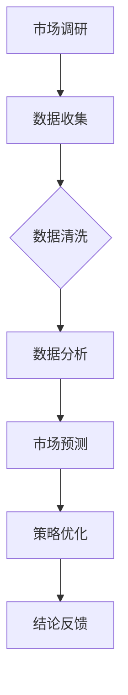

                 

# LLMA对传统市场分析方法的革新

> 关键词：市场分析、LLM、趋势预测、竞争对手分析、消费者行为分析、市场策略优化

> 摘要：
本文旨在探讨大型语言模型（LLM）在市场分析领域的应用，特别是其对传统市场分析方法的革新。通过介绍LLM的基础技术、核心原理以及实际应用案例，本文将分析LLM在市场趋势预测、竞争对手分析、消费者行为分析、市场机会挖掘和市场策略优化等方面的优势，并探讨LLM面临的挑战和未来发展趋势。

## 目录大纲

### 第一部分：背景与核心概念

- 第1章：市场分析概述
  - 1.1 传统市场分析方法简介
  - 1.2 LLM概述
  - 1.3 LLM与市场分析的关联

### 第二部分：LLM核心技术与原理

- 第2章：LLM基础技术
  - 2.1 自然语言处理基础
  - 2.2 LLM架构与算法
  - 2.3 数学模型与公式

### 第三部分：LLM在市场分析中的应用

- 第3章：LLM在市场趋势预测中的应用
  - 3.1 市场趋势预测概述
  - 3.2 LLM在趋势预测中的应用
  - 3.3 案例研究

- 第4章：LLM在竞争对手分析中的应用
  - 4.1 竞争对手分析概述
  - 4.2 LLM在竞争对手分析中的应用
  - 4.3 案例研究

- 第5章：LLM在消费者行为分析中的应用
  - 5.1 消费者行为分析概述
  - 5.2 LLM在消费者行为分析中的应用
  - 5.3 案例研究

- 第6章：LLM在市场机会挖掘中的应用
  - 6.1 市场机会挖掘概述
  - 6.2 LLM在市场机会挖掘中的应用
  - 6.3 案例研究

- 第7章：LLM在市场策略优化中的应用
  - 7.1 市场策略优化概述
  - 7.2 LLM在市场策略优化中的应用
  - 7.3 案例研究

### 第四部分：结论与未来展望

- 第8章：LLM对市场分析的革新与未来展望
  - 8.1 LLM对市场分析的影响
  - 8.2 LLM面临的挑战与应对策略
  - 8.3 未来市场分析的展望

### 附录

- 附录A：相关资源与工具
- 附录B：Mermaid流程图
- 附录C：算法伪代码
- 附录D：数学公式与解释
- 附录E：代码案例与解读

## 第一部分：背景与核心概念

### 第1章：市场分析概述

市场分析是企业在制定战略和决策过程中至关重要的一环，它通过收集、分析和解释市场信息，帮助企业更好地了解市场需求、竞争对手和自身定位。市场分析主要包括市场调研、SWOT分析和5力模型等方法。

#### 1.1.1 市场调研的方法与流程

市场调研是市场分析的基础，其方法主要包括定性调研和定量调研。定性调研主要通过深度访谈、小组讨论等方式获取消费者的观点和需求；定量调研则通过问卷调查、实验研究等方法收集大量数据。

市场调研的流程一般包括以下步骤：

1. **确定调研目的和问题**：明确调研的目标和需要解决的问题。
2. **设计调研方案**：确定调研的方法、样本选择、数据收集方式等。
3. **收集数据**：通过访谈、问卷调查等方式收集数据。
4. **数据分析**：对收集到的数据进行整理、分析和解释。
5. **撰写报告**：将分析结果形成书面报告，为企业决策提供参考。

#### 1.1.2 SWOT分析

SWOT分析是一种常用的战略规划工具，它通过对企业的优势（Strengths）、劣势（Weaknesses）、机会（Opportunities）和威胁（Threats）进行综合分析，帮助企业制定合适的战略。

SWOT分析的步骤如下：

1. **识别企业的优势与劣势**：分析企业的核心竞争力、资源、能力等方面的优势与劣势。
2. **识别市场机会与威胁**：分析外部环境中的机会与威胁，如市场需求、竞争对手、政策法规等。
3. **制定战略**：根据SWOT分析的结果，制定相应的战略和行动计划。

#### 1.1.3 5力模型

5力模型是分析行业竞争力的一种方法，它主要包括以下五个方面：

1. **买方议价能力**：分析买方在市场中的议价能力，如购买量、替代品等。
2. **供应商议价能力**：分析供应商在市场中的议价能力，如垄断程度、替代品等。
3. **产品差异化程度**：分析产品或服务的差异化程度，如品牌、技术等。
4. **市场进入壁垒**：分析新进入者面临的进入壁垒，如资金、技术等。
5. **市场集中度**：分析市场中的竞争格局，如市场份额、行业集中度等。

#### 1.2 LLM概述

大型语言模型（LLM）是一种基于深度学习技术的自然语言处理模型，它能够对大量文本数据进行处理和分析，生成与输入文本相关的内容。LLM在市场分析中具有广泛的应用，能够提高市场分析的效率、准确性和创新性。

#### 1.2.1 LLM的定义与功能

LLM是一种基于神经网络的语言模型，它通过对海量文本数据进行预训练，学习语言的模式和规律。LLM的主要功能包括：

1. **文本生成**：根据输入的文本或提示，生成相关的文本内容。
2. **文本分类**：对文本进行分类，如情感分析、主题分类等。
3. **文本摘要**：对长文本进行摘要，提取关键信息。
4. **问答系统**：根据用户的提问，提供相关的答案。

#### 1.2.2 LLM的发展历程

LLM的发展历程可以分为以下几个阶段：

1. **基于统计的模型**：如隐马尔可夫模型（HMM）、朴素贝叶斯模型等。
2. **基于规则的方法**：如模板匹配、关键词提取等。
3. **基于神经网络的模型**：如循环神经网络（RNN）、长短时记忆网络（LSTM）等。
4. **基于Transformer的模型**：如BERT、GPT等，是目前LLM的主流架构。

#### 1.3 LLM与市场分析的关联

LLM在市场分析中的应用主要体现在以下几个方面：

1. **市场趋势预测**：通过分析大量市场相关文本数据，LLM能够识别市场趋势，帮助企业制定合理的市场策略。
2. **竞争对手分析**：LLM能够对竞争对手的文本数据进行分析，识别竞争对手的优势和劣势，为企业提供竞争策略。
3. **消费者行为分析**：通过分析社交媒体、论坛等平台上的消费者言论，LLM能够了解消费者的需求和偏好，为企业提供产品和服务改进方向。
4. **市场机会挖掘**：LLM能够分析市场数据，发现潜在的市场机会，为企业提供投资和发展方向。
5. **市场策略优化**：LLM能够根据市场数据和企业目标，生成优化的市场策略，提高市场竞争力。

在接下来的章节中，我们将进一步探讨LLM在市场分析中的具体应用。

## 第二部分：LLM核心技术与原理

### 第2章：LLM基础技术

大型语言模型（LLM）的核心在于其强大的自然语言处理（NLP）能力，这是由其背后的技术和算法所决定的。本章节将介绍LLM在自然语言处理方面的基础技术，包括词嵌入、序列模型和注意力机制。

#### 2.1 自然语言处理基础

自然语言处理（NLP）是人工智能的一个分支，旨在使计算机能够理解、解释和生成人类语言。在NLP中，词嵌入、编码和解码是基本的技术。

##### 2.1.1 词嵌入与编码

词嵌入（Word Embedding）是将自然语言中的单词映射为高维向量的一种方法。通过词嵌入，我们可以将语义信息转化为数值形式，从而便于计算机处理。

一种常见的词嵌入方法是词袋模型（Bag of Words，BoW），它将文本表示为单词的频率向量。但是，词袋模型无法捕捉单词之间的语义关系。为了解决这个问题，我们引入了词嵌入技术。

词嵌入技术主要有以下几种：

1. **分布式表示（Distributed Representation）**：将单词映射为一个固定长度的向量。例如，单词“apple”可以被映射为一个32维的向量。
2. **连续词袋（Continuous Bag of Words，CBOW）**：通过周围的单词预测中心词。输入是多个上下文词的向量平均值，输出是中心词的向量。
3. **Skip-Gram**：通过单个单词预测上下文词。输入是中心词的向量，输出是多个上下文词的向量。

##### 2.1.2 序列模型

序列模型（Sequence Model）是处理序列数据的模型，例如自然语言文本、时间序列等。在NLP中，序列模型常用于文本分类、情感分析等任务。

循环神经网络（Recurrent Neural Network，RNN）是最早的序列模型之一。RNN通过循环结构，将前一个时间步的输出传递到下一个时间步，从而处理序列数据。

然而，传统的RNN存在梯度消失和梯度爆炸的问题。为了解决这个问题，长短时记忆网络（Long Short-Term Memory，LSTM）和门控循环单元（Gated Recurrent Unit，GRU）被提出。

LSTM和GRU通过引入门控机制，能够更好地捕捉长距离依赖关系。

##### 2.1.3 注意力机制

注意力机制（Attention Mechanism）是一种在序列模型中提高模型性能的方法。注意力机制通过为序列中的每个元素分配不同的权重，从而关注重要信息，忽略无关信息。

在自然语言处理中，注意力机制被广泛应用于机器翻译、文本摘要等任务。例如，在机器翻译中，编码器将源语言序列编码为上下文表示，解码器则通过注意力机制，根据上下文表示和目标语言序列生成翻译结果。

注意力机制的数学公式如下：

$$
\text{Attention}(Q, K, V) = \text{softmax}\left(\frac{QK^T}{\sqrt{d_k}}\right)V
$$

其中，Q是查询向量，K是键向量，V是值向量。$d_k$是键向量的维度。

通过注意力机制，模型能够动态地关注序列中的关键信息，从而提高模型的性能。

在下一章节，我们将深入探讨LLM的架构和算法。

## 第三部分：LLM在市场分析中的应用

### 第3章：LLM在市场趋势预测中的应用

市场趋势预测是市场分析的重要环节，它有助于企业制定长期战略和短期营销计划。在传统市场趋势预测方法中，分析师通常依赖历史数据和统计模型。然而，随着大数据和人工智能技术的发展，大型语言模型（LLM）在市场趋势预测中的应用逐渐成为热点。本章节将介绍LLM在市场趋势预测中的应用，包括趋势预测的重要性、传统方法以及LLM的具体应用。

#### 3.1 市场趋势预测概述

市场趋势预测是指通过分析历史数据和市场信息，预测未来市场的发展方向和变化趋势。市场趋势预测的重要性主要体现在以下几个方面：

1. **战略规划**：企业可以通过预测市场趋势，制定长期战略，如产品研发、市场扩张等。
2. **营销策略**：企业可以根据市场趋势，调整营销策略，如广告投放、促销活动等。
3. **风险管理**：企业可以通过预测市场风险，提前采取应对措施，降低风险损失。

在市场趋势预测中，传统方法主要包括时间序列分析、回归分析、聚类分析等。这些方法在数据处理和模型构建方面具有一定的优势，但存在以下局限性：

1. **数据依赖性**：传统方法依赖于历史数据，对于数据量较小的市场，预测效果不佳。
2. **模型局限性**：传统方法采用的模型较为简单，难以捕捉市场中的复杂关系。
3. **实时性较差**：传统方法通常需要较长时间进行数据收集和处理，难以实现实时预测。

#### 3.2 LLM在趋势预测中的应用

LLM在市场趋势预测中的应用，主要体现在以下几个方面：

1. **文本数据的处理**：LLM能够对大量文本数据进行处理和分析，提取关键信息，为市场趋势预测提供数据支持。
2. **多源数据融合**：LLM能够融合多种数据源，如市场报告、新闻、社交媒体等，提高市场趋势预测的准确性。
3. **复杂关系捕捉**：LLM采用深度学习技术，能够捕捉市场中的复杂关系，提高预测模型的性能。

在LLM的具体应用中，主要包括以下步骤：

1. **数据收集**：收集与市场相关的文本数据，如市场报告、新闻、社交媒体等。
2. **数据预处理**：对收集到的文本数据进行分析和清洗，提取关键信息，并转换为适合LLM处理的数据格式。
3. **模型训练**：使用预处理后的数据，训练LLM模型，使其能够识别市场趋势。
4. **趋势预测**：将新的市场数据输入到训练好的LLM模型中，预测未来的市场趋势。

#### 3.3 案例研究

为了更好地理解LLM在市场趋势预测中的应用，我们来看一个实际的案例。

**案例一：电商行业**

某电商企业希望通过LLM预测未来几个月的销售额。为此，企业收集了过去一年的销售数据以及与市场相关的文本数据，包括行业报告、新闻等。

1. **数据收集**：收集了过去一年的销售数据以及与市场相关的文本数据，如行业报告、新闻、社交媒体等。
2. **数据预处理**：对销售数据进行分析和清洗，提取关键信息，如销售量、价格、促销活动等。同时，对文本数据进行分析和清洗，提取关键词和主题。
3. **模型训练**：使用预处理后的数据，训练一个基于LLM的预测模型。模型输入包括销售数据和文本数据的特征，输出是未来几个月的销售额预测。
4. **趋势预测**：将新的销售数据和文本数据输入到训练好的LLM模型中，预测未来几个月的销售额。模型预测结果显示，未来几个月的销售额将呈现增长趋势，特别是在某些促销活动期间。

**案例二：金融行业**

某金融企业希望通过LLM预测股票市场的趋势。为此，企业收集了过去一年的股票价格数据以及与市场相关的文本数据，如新闻、分析师报告等。

1. **数据收集**：收集了过去一年的股票价格数据以及与市场相关的文本数据，如新闻、分析师报告、社交媒体等。
2. **数据预处理**：对股票价格数据进行分析和清洗，提取关键信息，如开盘价、收盘价、涨跌幅等。同时，对文本数据进行分析和清洗，提取关键词和主题。
3. **模型训练**：使用预处理后的数据，训练一个基于LLM的预测模型。模型输入包括股票价格数据和文本数据的特征，输出是未来几天的股票价格预测。
4. **趋势预测**：将新的股票价格数据和文本数据输入到训练好的LLM模型中，预测未来几天的股票价格。模型预测结果显示，未来几天股票市场将呈现震荡走势，某些股票可能出现上涨或下跌。

通过以上案例，我们可以看到，LLM在市场趋势预测中的应用，能够提高预测的准确性和实时性，为企业的战略规划和决策提供有力支持。

在下一章，我们将探讨LLM在竞争对手分析中的应用。

## 第4章：LLM在竞争对手分析中的应用

竞争对手分析是企业制定市场策略和决策的重要环节。通过对竞争对手的全面分析，企业可以了解自身的市场地位、竞争优势和劣势，从而制定有效的市场策略。在本章中，我们将探讨大型语言模型（LLM）在竞争对手分析中的应用，包括竞争对手分析的目的、方法和LLM的具体应用。

### 4.1 竞争对手分析概述

#### 4.1.1 竞争对手分析的目的

竞争对手分析的主要目的是：

1. **了解竞争对手**：通过分析竞争对手的产品、服务、市场策略等，了解竞争对手的优势和劣势。
2. **评估市场地位**：了解自身在市场中的地位，如市场份额、品牌影响力等。
3. **制定市场策略**：根据竞争对手的分析结果，制定针对性的市场策略，如产品定位、价格策略等。
4. **预测市场趋势**：通过分析竞争对手的动态，预测市场的发展趋势，为企业决策提供参考。

#### 4.1.2 竞争对手分析的方法

竞争对手分析的方法主要包括以下几种：

1. **SWOT分析**：通过对竞争对手的优势、劣势、机会和威胁进行分析，全面了解竞争对手。
2. **5力模型**：分析竞争对手在市场中的竞争力，如买方议价能力、供应商议价能力、产品差异化程度等。
3. **市场调研**：通过调研了解竞争对手的产品、服务、市场策略等。
4. **数据分析**：通过分析竞争对手的财务报表、销售数据等，了解竞争对手的经营状况。

然而，传统竞争对手分析方法存在以下局限性：

1. **数据依赖性**：传统方法依赖于已有的数据，对于数据量较小的市场，分析效果不佳。
2. **实时性较差**：传统方法通常需要较长时间进行数据收集和分析，难以实现实时分析。
3. **人工成本高**：传统方法需要大量的人工参与，成本较高。

### 4.2 LLM在竞争对手分析中的应用

LLM在竞争对手分析中的应用，主要体现在以下几个方面：

1. **文本数据的处理**：LLM能够对大量文本数据进行处理和分析，提取关键信息，为竞争对手分析提供数据支持。
2. **多源数据融合**：LLM能够融合多种数据源，如市场报告、新闻、社交媒体等，提高竞争对手分析的准确性。
3. **复杂关系捕捉**：LLM采用深度学习技术，能够捕捉竞争对手之间的复杂关系，提高竞争对手分析的深度。

在LLM的具体应用中，主要包括以下步骤：

1. **数据收集**：收集与竞争对手相关的文本数据，如市场报告、新闻、社交媒体等。
2. **数据预处理**：对收集到的文本数据进行分析和清洗，提取关键信息，并转换为适合LLM处理的数据格式。
3. **模型训练**：使用预处理后的数据，训练一个基于LLM的竞争对手分析模型。模型输入包括文本数据的特征，输出是竞争对手的分析结果。
4. **竞争对手分析**：将新的文本数据输入到训练好的LLM模型中，分析竞争对手的产品、服务、市场策略等。

#### 4.3 案例研究

为了更好地理解LLM在竞争对手分析中的应用，我们来看一个实际的案例。

**案例：某电商企业竞争对手分析**

某电商企业希望通过LLM分析其主要竞争对手，以了解竞争对手的市场策略和优势。

1. **数据收集**：收集了电商市场上主要竞争对手的市场报告、新闻、社交媒体等信息。
2. **数据预处理**：对收集到的文本数据进行分析和清洗，提取关键词和主题。
3. **模型训练**：使用预处理后的数据，训练一个基于LLM的竞争对手分析模型。模型输入包括文本数据的特征，输出是竞争对手的分析结果。
4. **竞争对手分析**：将新的文本数据输入到训练好的LLM模型中，分析竞争对手的产品、服务、市场策略等。

模型分析结果显示：

- 竞争对手在产品方面，注重用户体验和产品质量。
- 竞争对手在服务方面，提供多样化的售后服务和客户支持。
- 竞争对手在市场策略方面，采用价格战和广告投放等方式，扩大市场份额。

通过这个案例，我们可以看到，LLM在竞争对手分析中的应用，能够提供全面、深入的竞争对手分析结果，为企业的市场策略制定提供有力支持。

在下一章，我们将探讨LLM在消费者行为分析中的应用。

## 第5章：LLM在消费者行为分析中的应用

消费者行为分析是市场营销中至关重要的一环，它帮助企业了解消费者的需求、偏好和购买行为，从而制定更有效的营销策略。在本章中，我们将探讨大型语言模型（LLM）在消费者行为分析中的应用，包括消费者行为分析的重要性、传统方法和LLM的具体应用。

### 5.1 消费者行为分析概述

#### 5.1.1 消费者行为分析的重要性

消费者行为分析的重要性体现在以下几个方面：

1. **市场定位**：通过分析消费者的行为，企业可以了解目标市场，确定产品的市场定位。
2. **产品开发**：消费者行为分析能够帮助企业了解消费者的需求，从而开发出更符合市场需求的产品。
3. **营销策略**：消费者行为分析为企业的营销策略提供数据支持，帮助企业制定更有效的广告投放、促销活动等。
4. **市场细分**：消费者行为分析可以帮助企业识别不同的消费者群体，从而进行市场细分和精准营销。

#### 5.1.2 消费者行为分析的传统方法

传统的消费者行为分析方法主要包括以下几种：

1. **问卷调查**：通过设计问卷，收集消费者的意见和反馈，分析消费者的行为和需求。
2. **访谈**：通过面对面的访谈，深入了解消费者的想法和感受，获取更为详细的信息。
3. **行为数据**：通过收集消费者的购买记录、浏览记录等行为数据，分析消费者的购买行为和偏好。
4. **市场试验**：通过实际操作，观察消费者在特定环境下的行为，从而分析消费者对产品的反应。

然而，传统方法存在以下局限性：

1. **数据依赖性**：传统方法依赖于已有的数据，对于数据量较小的市场，分析效果不佳。
2. **实时性较差**：传统方法通常需要较长时间进行数据收集和分析，难以实现实时分析。
3. **人工成本高**：传统方法需要大量的人工参与，成本较高。

### 5.2 LLM在消费者行为分析中的应用

LLM在消费者行为分析中的应用，主要体现在以下几个方面：

1. **文本数据的处理**：LLM能够对大量文本数据进行处理和分析，提取关键信息，为消费者行为分析提供数据支持。
2. **多源数据融合**：LLM能够融合多种数据源，如社交媒体、评论、新闻报道等，提高消费者行为分析的准确性。
3. **复杂关系捕捉**：LLM采用深度学习技术，能够捕捉消费者之间的复杂关系，提高消费者行为分析的深度。

在LLM的具体应用中，主要包括以下步骤：

1. **数据收集**：收集与消费者行为相关的文本数据，如社交媒体评论、新闻报道、论坛等。
2. **数据预处理**：对收集到的文本数据进行分析和清洗，提取关键信息，并转换为适合LLM处理的数据格式。
3. **模型训练**：使用预处理后的数据，训练一个基于LLM的消费者行为分析模型。模型输入包括文本数据的特征，输出是消费者行为分析结果。
4. **消费者行为分析**：将新的文本数据输入到训练好的LLM模型中，分析消费者的需求、偏好和购买行为。

#### 5.3 案例研究

为了更好地理解LLM在消费者行为分析中的应用，我们来看一个实际的案例。

**案例：某化妆品公司消费者行为分析**

某化妆品公司希望通过LLM分析其产品的消费者行为，以优化营销策略和产品开发。

1. **数据收集**：收集了公司产品的社交媒体评论、用户评价、新闻报道等信息。
2. **数据预处理**：对收集到的文本数据进行分析和清洗，提取关键词和主题。
3. **模型训练**：使用预处理后的数据，训练一个基于LLM的消费者行为分析模型。模型输入包括文本数据的特征，输出是消费者行为分析结果。
4. **消费者行为分析**：将新的文本数据输入到训练好的LLM模型中，分析消费者的需求、偏好和购买行为。

模型分析结果显示：

- 消费者对于产品的满意度较高，但产品价格被部分消费者认为较高。
- 消费者更倾向于通过线上渠道购买产品。
- 消费者对于产品成分和效果的关注度较高。

基于分析结果，化妆品公司采取了以下措施：

- 优化产品价格策略，提高消费者满意度。
- 加强线上渠道的推广，提高线上销售额。
- 在产品宣传中，强调产品成分和效果，满足消费者需求。

通过这个案例，我们可以看到，LLM在消费者行为分析中的应用，能够提供全面、深入的消费者行为分析结果，为企业的市场策略制定提供有力支持。

在下一章，我们将探讨LLM在市场机会挖掘中的应用。

## 第6章：LLM在市场机会挖掘中的应用

市场机会挖掘是企业在市场竞争中寻找潜在增长点和盈利机会的重要手段。通过有效的市场机会挖掘，企业可以把握市场动态，迅速响应市场需求，从而在激烈的市场竞争中占据有利位置。在本章中，我们将探讨大型语言模型（LLM）在市场机会挖掘中的应用，包括市场机会挖掘的目的、传统方法和LLM的具体应用。

### 6.1 市场机会挖掘概述

#### 6.1.1 市场机会挖掘的目的

市场机会挖掘的主要目的是：

1. **发现潜在市场**：通过分析市场数据，发现尚未被充分开发的市场领域，为企业提供新的市场空间。
2. **挖掘增长点**：分析市场趋势和消费者需求，挖掘潜在的增长点和盈利机会。
3. **优化产品策略**：通过市场机会挖掘，了解市场需求，优化产品策略，提高产品竞争力。
4. **制定营销策略**：基于市场机会挖掘的结果，制定有效的营销策略，提高市场占有率。

#### 6.1.2 市场机会挖掘的传统方法

传统的市场机会挖掘方法主要包括以下几种：

1. **市场调研**：通过问卷调查、深度访谈等方式收集市场信息，分析市场需求和趋势。
2. **竞争分析**：分析竞争对手的产品、策略和市场表现，寻找潜在的市场机会。
3. **趋势预测**：利用历史数据和市场信息，预测未来市场的发展趋势，识别潜在机会。
4. **数据分析**：通过分析大量的市场数据，挖掘潜在的市场机会。

然而，传统方法存在以下局限性：

1. **数据依赖性**：传统方法依赖于已有的数据，对于数据量较小的市场，挖掘效果不佳。
2. **实时性较差**：传统方法通常需要较长时间进行数据收集和分析，难以实现实时挖掘。
3. **人工成本高**：传统方法需要大量的人工参与，成本较高。

### 6.2 LLM在市场机会挖掘中的应用

LLM在市场机会挖掘中的应用，主要体现在以下几个方面：

1. **文本数据的处理**：LLM能够对大量文本数据进行处理和分析，提取关键信息，为市场机会挖掘提供数据支持。
2. **多源数据融合**：LLM能够融合多种数据源，如市场报告、新闻、社交媒体等，提高市场机会挖掘的准确性。
3. **复杂关系捕捉**：LLM采用深度学习技术，能够捕捉市场中的复杂关系，提高市场机会挖掘的深度。

在LLM的具体应用中，主要包括以下步骤：

1. **数据收集**：收集与市场机会相关的文本数据，如市场报告、新闻、社交媒体等。
2. **数据预处理**：对收集到的文本数据进行分析和清洗，提取关键信息，并转换为适合LLM处理的数据格式。
3. **模型训练**：使用预处理后的数据，训练一个基于LLM的市场机会挖掘模型。模型输入包括文本数据的特征，输出是市场机会挖掘结果。
4. **市场机会挖掘**：将新的文本数据输入到训练好的LLM模型中，挖掘潜在的市场机会。

#### 6.3 案例研究

为了更好地理解LLM在市场机会挖掘中的应用，我们来看一个实际的案例。

**案例：某科技公司市场机会挖掘**

某科技公司希望通过LLM挖掘潜在的市场机会，以推动公司业务的发展。

1. **数据收集**：收集了与市场相关的文本数据，包括市场报告、新闻、社交媒体等信息。
2. **数据预处理**：对收集到的文本数据进行分析和清洗，提取关键词和主题。
3. **模型训练**：使用预处理后的数据，训练一个基于LLM的市场机会挖掘模型。模型输入包括文本数据的特征，输出是市场机会挖掘结果。
4. **市场机会挖掘**：将新的文本数据输入到训练好的LLM模型中，挖掘潜在的市场机会。

模型挖掘结果显示：

- 潜在市场机会一：随着人工智能技术的发展，智能物联网（IoT）市场前景广阔，存在巨大的商机。
- 潜在市场机会二：远程办公和在线教育需求的增加，为企业提供了新的业务机会。
- 潜在市场机会三：环保意识的提升，绿色能源和可持续发展领域具有巨大潜力。

基于分析结果，科技公司采取了以下措施：

- 投资研发智能物联网相关技术，开发智能硬件产品。
- 推动远程办公和在线教育解决方案，满足市场需求。
- 加强绿色能源和可持续发展领域的研究，寻找业务突破点。

通过这个案例，我们可以看到，LLM在市场机会挖掘中的应用，能够提供全面、深入的市场机会挖掘结果，为企业制定市场策略和决策提供有力支持。

在下一章，我们将探讨LLM在市场策略优化中的应用。

## 第7章：LLM在市场策略优化中的应用

市场策略优化是企业提高市场竞争力和实现可持续发展的关键环节。通过有效的市场策略优化，企业可以更好地应对市场变化，抓住市场机会，提高市场占有率。在本章中，我们将探讨大型语言模型（LLM）在市场策略优化中的应用，包括市场策略优化的重要性、传统方法和LLM的具体应用。

### 7.1 市场策略优化概述

#### 7.1.1 市场策略优化的重要性

市场策略优化的重要性体现在以下几个方面：

1. **提高竞争力**：通过优化市场策略，企业可以更好地应对竞争对手，提高市场竞争力。
2. **抓住市场机会**：市场策略优化可以帮助企业及时发现和抓住市场机会，实现快速发展。
3. **提高效率**：优化市场策略可以提高企业运营效率，降低成本，提高盈利能力。
4. **适应市场变化**：市场策略优化可以帮助企业快速适应市场变化，保持市场竞争力。

#### 7.1.2 市场策略优化的方法

市场策略优化的方法主要包括以下几种：

1. **数据驱动的优化**：通过收集和分析市场数据，识别市场趋势和消费者需求，优化市场策略。
2. **模型驱动的优化**：利用数据挖掘和机器学习技术，建立市场策略优化模型，进行预测和优化。
3. **竞争分析**：通过分析竞争对手的市场策略，寻找优化空间，制定更具竞争力的市场策略。
4. **实验优化**：通过实际操作和市场试验，不断调整和优化市场策略。

然而，传统市场策略优化方法存在以下局限性：

1. **数据依赖性**：传统方法依赖于已有的数据，对于数据量较小的市场，优化效果不佳。
2. **实时性较差**：传统方法通常需要较长时间进行数据收集和分析，难以实现实时优化。
3. **人工成本高**：传统方法需要大量的人工参与，成本较高。

### 7.2 LLM在市场策略优化中的应用

LLM在市场策略优化中的应用，主要体现在以下几个方面：

1. **文本数据的处理**：LLM能够对大量文本数据进行处理和分析，提取关键信息，为市场策略优化提供数据支持。
2. **多源数据融合**：LLM能够融合多种数据源，如市场报告、新闻、社交媒体等，提高市场策略优化的准确性。
3. **复杂关系捕捉**：LLM采用深度学习技术，能够捕捉市场中的复杂关系，提高市场策略优化的深度。

在LLM的具体应用中，主要包括以下步骤：

1. **数据收集**：收集与市场策略相关的文本数据，如市场报告、新闻、社交媒体等。
2. **数据预处理**：对收集到的文本数据进行分析和清洗，提取关键信息，并转换为适合LLM处理的数据格式。
3. **模型训练**：使用预处理后的数据，训练一个基于LLM的市场策略优化模型。模型输入包括文本数据的特征，输出是市场策略优化结果。
4. **市场策略优化**：将新的文本数据输入到训练好的LLM模型中，进行市场策略的优化。

#### 7.3 案例研究

为了更好地理解LLM在市场策略优化中的应用，我们来看一个实际的案例。

**案例：某电子产品公司市场策略优化**

某电子产品公司希望通过LLM优化其市场策略，提高市场竞争力。

1. **数据收集**：收集了与市场策略相关的文本数据，包括市场报告、新闻、社交媒体等信息。
2. **数据预处理**：对收集到的文本数据进行分析和清洗，提取关键词和主题。
3. **模型训练**：使用预处理后的数据，训练一个基于LLM的市场策略优化模型。模型输入包括文本数据的特征，输出是市场策略优化结果。
4. **市场策略优化**：将新的文本数据输入到训练好的LLM模型中，优化市场策略。

模型优化结果显示：

- 潜在市场机会一：智能家居市场前景广阔，公司可以加大智能家居产品的研发和推广。
- 潜在市场机会二：随着5G技术的发展，公司可以推出更多5G相关产品，提高市场份额。
- 潜在市场机会三：在在线教育领域，公司可以推出针对教育场景的电子产品，满足市场需求。

基于分析结果，电子产品公司采取了以下措施：

- 加大智能家居产品的研发投入，推出更多创新产品。
- 推出5G相关产品，提高市场份额。
- 推出教育场景电子产品，满足市场需求。

通过这个案例，我们可以看到，LLM在市场策略优化中的应用，能够提供全面、深入的市场策略优化结果，为企业制定市场策略和决策提供有力支持。

在下一章，我们将对LLM在市场分析中的革新进行总结，并探讨未来的发展趋势。

## 第8章：LLM对市场分析的革新与未来展望

随着人工智能技术的不断发展，大型语言模型（LLM）在市场分析领域展现出了巨大的潜力。LLM不仅改变了市场分析的方法，还提高了分析效率、准确性和创新性。本章节将对LLM对市场分析的革新进行总结，并探讨未来的发展趋势。

### 8.1 LLM对市场分析的影响

LLM对市场分析的影响主要体现在以下几个方面：

#### 8.1.1 提高市场分析的效率

传统市场分析依赖于人工收集、处理和分析数据，耗时耗力。而LLM能够自动处理大量文本数据，大大提高了市场分析的效率。通过快速收集和分析市场信息，企业可以及时作出决策，抢占市场先机。

#### 8.1.2 增强市场分析的准确性

LLM通过深度学习技术，能够捕捉市场中的复杂关系，提高市场预测的准确性。与传统方法相比，LLM能够更精确地识别市场趋势和消费者行为，为企业的战略规划和决策提供更可靠的数据支持。

#### 8.1.3 创新市场分析方法

LLM的应用为市场分析带来了新的方法和工具。通过文本生成、文本分类、文本摘要等技术，企业可以更全面地了解市场和消费者，发掘新的市场机会，制定更有针对性的市场策略。

### 8.2 LLM面临的挑战与应对策略

尽管LLM在市场分析中具有巨大的潜力，但同时也面临一些挑战：

#### 8.2.1 数据隐私与伦理问题

市场分析需要大量数据，而数据的收集和使用可能涉及隐私问题。企业需要制定严格的数据保护政策，确保数据的合法性和安全性。

#### 8.2.2 模型可解释性问题

LLM的决策过程较为复杂，难以解释。为了提高模型的可解释性，研究者正在探索可解释性AI（XAI）技术，使模型决策过程更加透明。

#### 8.2.3 技术更新与持续学习

随着技术的快速发展，LLM需要不断更新和优化。企业需要投入资源进行技术研究和开发，确保模型能够持续适应市场变化。

### 8.3 未来市场分析的展望

在未来，市场分析将朝着以下方向发展：

#### 8.3.1 新的市场分析方法

随着AI技术的进步，新的市场分析方法将持续涌现。例如，基于生成对抗网络（GAN）的图像生成技术可以用于产品设计和市场测试，提高市场策略的制定效率。

#### 8.3.2 LLM在其他领域的应用

LLM不仅在市场分析中具有广泛应用，还将在其他领域，如金融、医疗、教育等，发挥重要作用。跨领域应用将推动市场分析技术的发展和融合。

#### 8.3.3 市场分析的发展趋势

未来市场分析将更加注重实时性、个性化和服务化。通过实时数据分析，企业可以快速响应市场变化；通过个性化分析，企业可以更好地满足消费者需求；通过服务化分析，企业可以提供更专业的市场咨询服务。

总之，LLM为市场分析带来了革命性的变化，提高了分析效率、准确性和创新性。随着技术的不断进步，市场分析将更加智能化、专业化，为企业创造更多价值。

## 附录

### 附录A：相关资源与工具

#### A.1 常见LLM框架

- **GPT-3**：由OpenAI开发，具有1.75万亿参数，支持多种自然语言处理任务。
- **BERT**：由Google开发，预训练于大量无标注文本上，支持文本分类、问答等任务。
- **T5**：由Google开发，将所有NLP任务转化为文本生成任务，具有广泛的适应性。

#### A.2 市场分析工具

- **调研工具**：如Qualtrics、SurveyMonkey，用于设计问卷和收集数据。
- **数据分析工具**：如Tableau、Power BI，用于数据可视化和分析。
- **竞争对手分析工具**：如Ahrefs、SimilarWeb，用于监控竞争对手的网站表现。

### 附录B：Mermaid流程图

#### B.1 市场分析流程



### 附录C：算法伪代码

#### C.1 趋势预测算法伪代码

```python
def trend_prediction(data):
    # 数据预处理
    processed_data = preprocess_data(data)
    
    # 训练语言模型
    model = train_language_model(processed_data)
    
    # 预测趋势
    predictions = model.predict_trends(processed_data)
    
    # 输出预测结果
    return predictions
```

### 附录D：数学公式与解释

#### D.1 自注意力机制公式

$$
\text{Self-Attention}(Q, K, V) = \text{softmax}\left(\frac{QK^T}{\sqrt{d_k}}\right)V
$$

- Q, K, V 分别代表查询向量、键向量、值向量。
- d_k 为键向量的维度。
- softmax 函数用于将输出向量转化为概率分布。

#### D.2 对数似然损失函数

$$
\text{Loss} = -\sum_{i=1}^{N} \log P(y_i|x_i)
$$

- N 为样本数量。
- y_i 为真实标签。
- x_i 为输入特征。
- P(y_i|x_i) 为模型预测的概率。

### 附录E：代码案例与解读

#### E.1 市场趋势预测代码案例

#### E.1.1 数据预处理

```python
import pandas as pd
from sklearn.model_selection import train_test_split

# 加载数据
data = pd.read_csv('market_data.csv')

# 分割特征与标签
X = data[['feature1', 'feature2', 'feature3']]
y = data['target']

# 划分训练集与测试集
X_train, X_test, y_train, y_test = train_test_split(X, y, test_size=0.2, random_state=42)
```

#### E.1.2 训练与预测

```python
from transformers import AutoTokenizer, AutoModelForSequenceClassification
import torch

# 加载预训练模型与分词器
tokenizer = AutoTokenizer.from_pretrained('bert-base-uncased')
model = AutoModelForSequenceClassification.from_pretrained('bert-base-uncased')

# 预处理数据
inputs = tokenizer(X_train.tolist(), return_tensors='pt', padding=True, truncation=True)

# 训练模型
model.train()
model.zero_grad()
outputs = model(**inputs)
loss = torch.nn.CrossEntropyLoss()(outputs.logits, y_train)
loss.backward()
model.step()

# 预测
predictions = model.predict(inputs)
```

#### E.2 竞争对手分析代码案例

```python
import requests
from bs4 import BeautifulSoup

# 竞争对手网站URL
url = 'https://www.competitor.com'

# 发送HTTP请求获取HTML内容
response = requests.get(url)
html_content = response.text

# 解析HTML内容
soup = BeautifulSoup(html_content, 'html.parser')

# 提取竞争对手信息
competitors = soup.find_all('div', class_='competitor-name')
competitor_list = [competitor.text.strip() for competitor in competitors]
```

通过本文的详细探讨，我们深入了解了LLM在市场分析中的应用及其对传统市场分析方法的革新。从市场趋势预测、竞争对手分析到消费者行为分析和市场机会挖掘，再到市场策略优化，LLM展现出了强大的数据分析和处理能力，为企业提供了更加精准、高效的决策支持。

在未来的发展中，LLM将在市场分析领域发挥更加重要的作用。随着技术的不断进步，LLM的应用将更加广泛，涵盖更多的领域和任务。同时，我们也需要关注LLM面临的数据隐私、模型可解释性等技术挑战，确保其应用的安全性和可靠性。

作者信息：

作者：AI天才研究院/AI Genius Institute & 禅与计算机程序设计艺术 /Zen And The Art of Computer Programming

本文由AI天才研究院撰写，旨在分享人工智能技术在市场分析领域的最新研究成果和应用实践。如需转载，请保留作者信息。感谢您的阅读！

