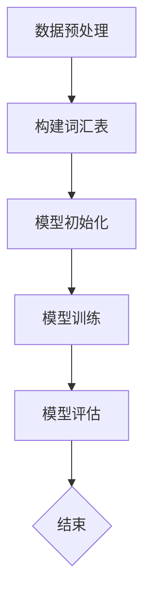
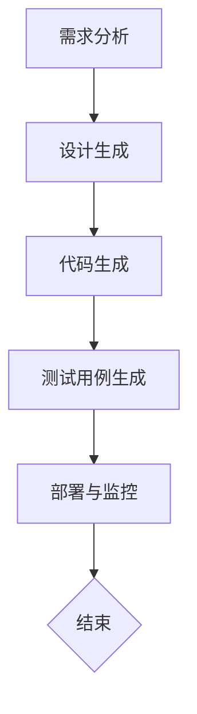

                 

### {文章标题}

> **关键词：** 大型语言模型（LLM），软件开发流程，需求分析，设计与编码，测试与部署，变革，挑战与应对策略

> **摘要：** 本文深入探讨了大型语言模型（LLM）对传统软件开发流程的深远影响与变革。首先，介绍了LLM的基础知识，包括定义、架构、核心算法和应用场景。随后，分析了LLM在软件开发各个阶段的具体应用，探讨了其对需求分析、设计与编码、测试与部署的影响。最后，文章提出了LLM驱动的软件开发模式，并针对挑战提出了应对策略，展望了LLM在软件开发中的未来发展趋势及行业影响。

---

### 《LLM对传统软件开发流程的影响与变革》目录大纲

- **第一部分：LLM基础知识**
  - **第1章：LLM概述**
    - **1.1 语言模型的定义与历史**
    - **1.2 语言模型的架构**
    - **1.3 语言模型的训练与优化**
    - **1.4 语言模型的应用场景**
  - **第2章：LLM的核心算法**
    - **2.1 基于注意力机制的模型**
    - **2.2 Transformer模型详解**
    - **2.3 语言模型的优化策略**

- **第二部分：LLM对软件开发流程的影响**
  - **第3章：LLM在需求分析阶段的应用**
  - **第4章：LLM在设计与编码阶段的应用**
  - **第5章：LLM在测试与部署阶段的应用**

- **第三部分：LLM对软件开发流程的变革**
  - **第6章：LLM驱动的软件开发模式**
  - **第7章：LLM在软件开发中的挑战与应对策略**
  - **第8章：未来展望**

- **附录**
  - **附录A：LLM相关工具与资源**
  - **附录B：Mermaid流程图示例**
  - **附录C：伪代码示例**

---

接下来的文章将逐步展开上述各个章节，详细探讨LLM如何影响和变革传统的软件开发流程。

---

### 第一部分：LLM基础知识

#### 第1章：LLM概述

#### 1.1 语言模型的定义与历史

**1.1.1 语言模型的定义**

语言模型（Language Model，简称LM）是自然语言处理（Natural Language Processing，简称NLP）的核心组件之一。它是一种统计模型，用于预测文本序列中的下一个单词或字符。简而言之，语言模型旨在捕捉自然语言的统计特性，从而提高文本生成、机器翻译、语音识别等NLP任务的性能。

语言模型的概念最早可以追溯到20世纪50年代，当时香农（Claude Shannon）提出了信息熵（Information Entropy）的概念，为后续的语言模型研究奠定了基础。随后的几十年中，研究人员提出了多种语言模型，如N-gram模型、决策树模型和神经网络模型。

**1.1.2 语言模型的发展历程**

- **早期语言模型（20世纪50-70年代）：** 早期的语言模型主要基于简单的统计方法，如N-gram模型。N-gram模型通过统计相邻单词或字符的出现频率来预测下一个单词或字符。然而，这种方法在处理长文本时表现不佳，因为长文本的信息冗余和上下文依赖性较高。

- **中间语言模型（20世纪80-90年代）：** 在这个阶段，研究人员开始引入概率模型，如决策树模型和隐马尔可夫模型（Hidden Markov Model，简称HMM）。这些模型在处理上下文依赖性方面取得了显著进步，但仍然存在一些限制。

- **现代语言模型（21世纪初至今）：** 随着深度学习技术的兴起，现代语言模型开始采用神经网络架构，如循环神经网络（Recurrent Neural Network，简称RNN）和长短期记忆网络（Long Short-Term Memory，简称LSTM）。近年来，基于注意力机制和Transformer架构的模型，如BERT（Bidirectional Encoder Representations from Transformers）和GPT（Generative Pre-trained Transformer），在自然语言处理任务中取得了卓越的性能，进一步推动了语言模型的发展。

#### 1.2 语言模型的架构

**1.2.1 语言模型的常见架构**

语言模型的架构经历了从简单到复杂的发展过程。现代语言模型通常采用深度神经网络架构，其中每个神经网络层都包含大量的神经元和参数。以下是一些常见的语言模型架构：

- **N-gram模型：** N-gram模型是最简单的语言模型，通过统计相邻单词或字符的出现频率来预测下一个单词或字符。它通常采用前向或后向方式进行训练，并使用词汇表进行索引。

- **循环神经网络（RNN）：** RNN是一种能够处理序列数据的神经网络，通过记忆前一个时间步的信息来预测下一个时间步。RNN包括简单的RNN、LSTM和门控循环单元（Gated Recurrent Unit，简称GRU）等变体。

- **Transformer模型：** Transformer模型是一种基于自注意力机制（Self-Attention Mechanism）的序列到序列模型。它通过多头自注意力机制和前馈神经网络来处理长距离依赖关系，并在自然语言处理任务中取得了卓越的性能。

**1.2.2 语言模型的原理**

语言模型的原理可以概括为以下几个步骤：

1. **输入编码：** 语言模型将输入文本序列转换为向量表示。对于N-gram模型，通常使用简单的索引表示法；对于RNN和Transformer模型，则使用嵌入层（Embedding Layer）进行输入编码。

2. **模型训练：** 语言模型通过大量文本数据进行训练，以学习文本的统计特性。训练过程中，模型调整参数，以最小化预测误差。

3. **文本生成：** 通过模型生成文本序列，具体过程如下：
   - **第一步：** 随机选择一个单词或字符作为输入，并将其转换为向量表示。
   - **第二步：** 将输入向量传递给模型，模型预测下一个单词或字符的概率分布。
   - **第三步：** 根据概率分布随机选择下一个单词或字符，并将其添加到输出序列。
   - **第四步：** 将新的输出序列作为输入，重复第二步和第三步，直到生成所需的文本长度。

**1.2.3 语言模型的工作机制**

语言模型的工作机制主要包括以下几个部分：

1. **自注意力机制：** 自注意力机制是一种计算输入序列中每个元素对当前元素影响权重的机制。在Transformer模型中，自注意力机制通过计算每个输入向量与其他输入向量之间的相似度，以确定每个元素对当前元素的重要性。

2. **多头注意力：** 多头注意力是一种扩展自注意力机制的技巧，它将输入序列分成多个子序列，并分别计算每个子序列的注意力权重。通过多头注意力，模型可以同时关注输入序列中的多个信息源，从而提高预测性能。

3. **前馈神经网络：** 前馈神经网络是一种简单但有效的神经网络架构，用于处理输入数据的非线性关系。在Transformer模型中，前馈神经网络分别应用于输入和输出序列，以进一步提高模型的表示能力。

#### 1.3 语言模型的训练与优化

**1.3.1 语言模型的训练过程**

语言模型的训练过程通常包括以下几个步骤：

1. **数据预处理：** 对原始文本数据进行清洗、分词和标记等预处理操作，以便模型能够更好地理解文本。

2. **构建词汇表：** 将文本数据中的单词或字符转换为索引表示，构建词汇表。

3. **模型初始化：** 初始化模型的参数，通常使用随机初始化或预训练的模型。

4. **模型训练：** 通过训练算法（如梯度下降）优化模型参数，以最小化预测误差。在训练过程中，模型通常会经历多个迭代，每次迭代都通过前向传播和后向传播计算损失函数，并根据损失函数的梯度调整参数。

5. **模型评估：** 在训练过程中，定期评估模型的性能，以监测训练效果。常用的评估指标包括损失函数值、词汇预测准确率和文本生成质量等。

**1.3.2 语言模型的优化方法**

为了提高语言模型的性能，研究人员提出了多种优化方法，包括：

1. **注意力机制优化：** 通过调整自注意力机制中的参数（如注意力权重的计算方法），可以提高模型的表示能力和预测性能。

2. **训练策略优化：** 包括批量大小调整、学习率设置和训练时间控制等，以优化模型的训练过程。

3. **模型架构优化：** 通过改进模型架构（如增加层数、调整神经元数量等），可以提高模型的表示能力和泛化能力。

4. **数据增强：** 通过对原始数据进行增广（如随机遮蔽、插入和替换等），可以增加训练数据多样性，提高模型的鲁棒性和泛化能力。

#### 1.4 语言模型的应用场景

**1.4.1 语言模型在自然语言处理中的应用**

语言模型在自然语言处理领域具有广泛的应用，包括：

- **文本生成：** 语言模型可以生成自然语言的文本，如文章、摘要、对话等。在机器写作、机器翻译和语音合成等任务中，语言模型发挥着重要作用。

- **文本分类：** 语言模型可以用于对文本进行分类，如情感分析、主题分类和垃圾邮件检测等。

- **实体识别：** 语言模型可以识别文本中的实体，如人名、地名和机构名等。

- **文本摘要：** 语言模型可以生成文本的摘要，帮助用户快速了解文章的主要内容。

- **问答系统：** 语言模型可以用于构建问答系统，回答用户的问题。

**1.4.2 语言模型在其他领域的应用**

除了自然语言处理领域，语言模型还在其他领域取得了一定的应用，包括：

- **计算机视觉：** 语言模型可以用于图像描述生成，将图像转换为自然语言的描述。

- **音频处理：** 语言模型可以用于音频处理任务，如语音识别和语音合成。

- **推荐系统：** 语言模型可以用于构建推荐系统，根据用户的历史行为和兴趣推荐相关的内容。

- **知识图谱：** 语言模型可以用于构建知识图谱，将文本数据中的实体和关系进行建模。

#### 1.5 总结

语言模型是自然语言处理的核心组件，其在文本生成、文本分类、实体识别和文本摘要等任务中取得了显著的性能。通过深入理解语言模型的定义、架构、训练和优化方法，以及其在自然语言处理和其他领域的应用，我们可以更好地利用语言模型的优势，推动自然语言处理技术的发展。

---

#### 第2章：LLM的核心算法

#### 2.1 基于注意力机制的模型

**2.1.1 注意力机制的原理**

注意力机制（Attention Mechanism）是深度学习领域的一种关键技术，其核心思想是在处理序列数据时，能够动态地关注序列中特定位置的信息。注意力机制最早由Bahdanau等人在2014年提出，并在机器翻译任务中取得了显著的效果。注意力机制的出现解决了循环神经网络（RNN）在处理长距离依赖关系时的局限性，使得模型能够更好地捕捉序列数据中的重要信息。

注意力机制的原理可以概括为以下几个步骤：

1. **输入编码：** 对输入序列进行编码，生成嵌入向量表示。这些嵌入向量表示了序列中每个元素的特征信息。

2. **计算注意力得分：** 对于序列中的每个元素，计算其与其他元素之间的相似度或重要性。具体而言，通过计算查询向量（Query）和键值对（Key-Value）之间的点积或缩放点积，得到注意力得分。

3. **求和加权：** 将注意力得分应用于键值对，得到加权的关键信息。具体而言，将每个键值对的值乘以其对应的注意力得分，然后求和。

4. **输出编码：** 将加权的关键信息编码为输出向量，表示了序列中关键信息的重要性分布。

注意力机制通过动态关注序列中的关键信息，能够有效地提高模型在处理长序列数据时的性能。在机器翻译、文本摘要和语音识别等任务中，注意力机制被广泛应用，并取得了显著的成果。

**2.1.2 注意力机制的实现**

注意力机制的实现可以分为以下几个步骤：

1. **输入序列编码：** 将输入序列中的每个元素转换为嵌入向量表示。嵌入向量可以通过预训练的语言模型（如BERT、GPT）获得，或者通过自定义的词向量表示。

2. **计算注意力得分：** 对于序列中的每个元素，计算其与其他元素之间的相似度或重要性。具体而言，通过计算查询向量（Query）和键值对（Key-Value）之间的点积或缩放点积，得到注意力得分。查询向量通常是嵌入向量的线性变换，而键值对通常是输入序列中每个元素的特征向量。

3. **求和加权：** 将注意力得分应用于键值对，得到加权的关键信息。具体而言，将每个键值对的值乘以其对应的注意力得分，然后求和。

4. **输出编码：** 将加权的关键信息编码为输出向量，表示了序列中关键信息的重要性分布。输出向量可以通过全连接层或卷积层进行编码。

在实现注意力机制时，可以采用不同的注意力函数，如点积注意力、缩放点积注意力、多头注意力等。这些注意力函数在计算注意力得分时，具有不同的计算复杂度和性能表现。选择合适的注意力函数，能够有效地提高模型在处理长序列数据时的性能。

**2.1.3 注意力机制在Transformer模型中的应用**

Transformer模型是一种基于自注意力机制的深度学习模型，其在自然语言处理任务中取得了显著的成果。Transformer模型由Vaswani等人在2017年提出，其核心思想是通过多头自注意力机制和前馈神经网络来处理序列数据。

在Transformer模型中，自注意力机制被用于编码器和解码器的每一层。编码器通过自注意力机制捕捉输入序列中的依赖关系，而解码器通过自注意力机制和交叉注意力机制捕捉编码器输出和解码输入之间的依赖关系。

自注意力机制的实现如下：

1. **计算自注意力得分：** 对于编码器或解码器中的每个元素，计算其与其他元素之间的相似度或重要性。具体而言，通过计算查询向量（Query）和键值对（Key-Value）之间的点积或缩放点积，得到自注意力得分。

2. **求和加权：** 将自注意力得分应用于键值对，得到加权的关键信息。具体而言，将每个键值对的值乘以其对应的自注意力得分，然后求和。

3. **输出编码：** 将加权的关键信息编码为输出向量，表示了序列中关键信息的重要性分布。

交叉注意力机制的实现如下：

1. **计算交叉注意力得分：** 对于解码器中的每个元素，计算其与编码器输出中的每个元素之间的相似度或重要性。具体而言，通过计算查询向量（Query）和键值对（Key-Value）之间的点积或缩放点积，得到交叉注意力得分。

2. **求和加权：** 将交叉注意力得分应用于键值对，得到加权的关键信息。具体而言，将每个键值对的值乘以其对应的交叉注意力得分，然后求和。

3. **输出编码：** 将加权的关键信息编码为输出向量，表示了序列中关键信息的重要性分布。

通过多头自注意力机制和交叉注意力机制，Transformer模型能够有效地捕捉序列数据中的依赖关系，从而在自然语言处理任务中取得了显著的性能。

**2.1.4 注意力机制的优势与挑战**

注意力机制在自然语言处理任务中具有以下优势：

1. **捕捉长距离依赖：** 注意力机制能够动态地关注序列中的关键信息，从而有效地捕捉长距离依赖关系。

2. **并行计算：** 注意力机制允许模型并行计算注意力得分，从而提高计算效率。

3. **灵活性：** 注意力机制可以根据任务需求自定义计算方式，从而提高模型的灵活性。

然而，注意力机制也面临一些挑战：

1. **计算复杂度：** 注意力机制的计算复杂度较高，特别是对于长序列数据。

2. **参数冗余：** 注意力机制引入了大量的参数，可能导致模型参数冗余。

3. **解释性：** 注意力机制在处理复杂任务时，其注意力得分可能难以解释，降低了模型的透明度。

总之，注意力机制在自然语言处理任务中具有显著的优势，但也面临一些挑战。通过不断改进和优化注意力机制，可以进一步提高模型在自然语言处理任务中的性能。

---

#### 2.2 Transformer模型详解

**2.2.1 Transformer模型的原理**

Transformer模型是一种基于自注意力机制的深度学习模型，由Vaswani等人在2017年提出。Transformer模型在自然语言处理任务中取得了显著的成果，特别是在机器翻译、文本生成和问答系统等任务中。Transformer模型的核心思想是通过多头自注意力机制和前馈神经网络来处理序列数据，从而有效地捕捉长距离依赖关系。

Transformer模型由编码器（Encoder）和解码器（Decoder）组成。编码器负责将输入序列编码为上下文表示，而解码器负责从编码器的上下文表示中解码出输出序列。编码器和解码器都包含多个层，每层都包含多头自注意力机制和前馈神经网络。

**编码器**

编码器的作用是将输入序列编码为上下文表示。编码器的输入是一个单词级别的序列，每个单词被转换为嵌入向量。编码器通过多头自注意力机制和前馈神经网络来处理输入序列，从而生成上下文表示。

编码器的每个层包含两个子层：多头自注意力子层和前馈子层。多头自注意力子层通过自注意力机制计算输入序列中的依赖关系，而前馈子层通过前馈神经网络对自注意力结果进行进一步处理。

多头自注意力子层的实现如下：

1. **线性变换：** 将输入序列的嵌入向量通过线性变换得到查询向量（Query）、键值对（Key-Value）和值向量（Value）。

2. **计算自注意力得分：** 通过计算查询向量与键值对之间的点积或缩放点积，得到自注意力得分。自注意力得分表示了输入序列中每个元素与其他元素之间的相似度或重要性。

3. **求和加权：** 将自注意力得分应用于键值对，得到加权的关键信息。具体而言，将每个键值对的值乘以其对应的自注意力得分，然后求和。

4. **输出编码：** 将加权的关键信息通过线性变换编码为输出向量，表示了序列中关键信息的重要性分布。

前馈子层的实现如下：

1. **前馈神经网络：** 将输入向量通过前馈神经网络进行非线性变换。前馈神经网络通常包含两个全连接层，中间层具有激活函数。

2. **输出编码：** 将前馈神经网络的输出通过线性变换编码为输出向量，与自注意力子层的输出相加，得到编码器的输出。

**解码器**

解码器的作用是从编码器的上下文表示中解码出输出序列。解码器通过自注意力机制和交叉注意力机制来处理输入序列和编码器输出，从而生成输出序列。

解码器的每个层也包含两个子层：多头自注意力子层和前馈子层。多头自注意力子层通过自注意力机制计算输入序列中的依赖关系，而前馈子层通过前馈神经网络对自注意力结果进行进一步处理。

多头自注意力子层的实现与编码器相同，即通过线性变换得到查询向量、键值对和值向量，计算自注意力得分，求和加权，输出编码。

交叉注意力子层的实现如下：

1. **计算交叉注意力得分：** 通过计算查询向量与编码器输出之间的点积或缩放点积，得到交叉注意力得分。交叉注意力得分表示了解码器输入序列中每个元素与编码器输出之间的相似度或重要性。

2. **求和加权：** 将交叉注意力得分应用于编码器输出，得到加权的关键信息。

3. **输出编码：** 将加权的关键信息通过线性变换编码为输出向量，与自注意力子层的输出相加，得到解码器的输出。

前馈子层的实现与编码器相同，即通过前馈神经网络进行非线性变换，输出编码。

**2.2.2 Transformer模型的架构**

Transformer模型的架构可以概括为以下几个部分：

1. **嵌入层（Embedding Layer）：** 将输入序列的单词转换为嵌入向量。嵌入向量通过预训练的语言模型（如BERT、GPT）获得，或者通过自定义的词向量表示。

2. **位置编码（Positional Encoding）：** 由于Transformer模型没有循环结构，无法直接利用输入序列的顺序信息。因此，通过添加位置编码来嵌入序列的位置信息。位置编码可以采用绝对位置编码、相对位置编码或周期位置编码等不同形式。

3. **编码器（Encoder）：** 编码器包含多个层，每层都包含多头自注意力机制和前馈神经网络。编码器的作用是将输入序列编码为上下文表示。

4. **解码器（Decoder）：** 解码器也包含多个层，每层都包含多头自注意力机制、前馈神经网络和交叉注意力机制。解码器的作用是从编码器的上下文表示中解码出输出序列。

5. **输出层（Output Layer）：** 将解码器的输出通过线性变换和softmax函数生成输出序列的概率分布。

**2.2.3 Transformer模型的工作机制**

Transformer模型的工作机制可以分为以下几个步骤：

1. **输入编码：** 将输入序列中的每个单词转换为嵌入向量。嵌入向量可以通过预训练的语言模型获得，或者通过自定义的词向量表示。

2. **添加位置编码：** 将嵌入向量与位置编码相加，得到位置嵌入向量。

3. **编码器处理：** 将位置嵌入向量传递给编码器，编码器通过多头自注意力机制和前馈神经网络处理输入序列，生成上下文表示。

4. **解码器处理：** 将编码器的输出传递给解码器，解码器通过多头自注意力机制、前馈神经网络和交叉注意力机制处理输入序列，生成输出序列。

5. **输出解码：** 将解码器的输出通过线性变换和softmax函数生成输出序列的概率分布。

6. **生成输出序列：** 根据概率分布随机选择下一个单词或字符，并将其添加到输出序列。重复上述步骤，直到生成所需的输出序列长度。

**2.2.4 Transformer模型的优势与挑战**

**优势：**

1. **并行计算：** Transformer模型允许并行计算注意力得分，从而提高计算效率。

2. **捕捉长距离依赖：** Transformer模型通过多头自注意力机制能够有效地捕捉长距离依赖关系。

3. **灵活性：** Transformer模型可以根据任务需求自定义计算方式，从而提高模型的灵活性。

**挑战：**

1. **计算复杂度：** Transformer模型包含多个层和多头自注意力机制，导致计算复杂度较高。

2. **参数数量：** Transformer模型引入了大量的参数，可能导致模型参数冗余。

3. **解释性：** Transformer模型在处理复杂任务时，其注意力得分可能难以解释，降低了模型的透明度。

**2.2.5 Transformer模型的变体**

为了进一步提高Transformer模型的性能，研究人员提出了一些变体，包括：

1. **BERT（Bidirectional Encoder Representations from Transformers）：** BERT是一种双向Transformer模型，通过预训练在大量文本数据上，然后通过微调在特定任务上取得优秀的性能。

2. **GPT（Generative Pre-trained Transformer）：** GPT是一种自回归Transformer模型，通过预测下一个单词或字符来生成文本。

3. **T5（Text-To-Text Transfer Transformer）：** T5是一种通用的文本转换模型，通过将所有自然语言处理任务转换为文本到文本的转换任务，从而提高模型的泛化能力。

总之，Transformer模型作为一种强大的自然语言处理模型，其在自然语言处理任务中取得了显著的成果。通过不断改进和优化Transformer模型，可以进一步提高模型在自然语言处理任务中的性能。

---

#### 2.3 语言模型的优化策略

**2.3.1 语言模型的优化目标**

语言模型的优化目标是提高模型的性能，具体包括以下几个方面：

1. **准确性：** 提高模型在文本生成、文本分类和实体识别等任务中的准确性。

2. **速度：** 提高模型在处理文本数据时的计算速度，以实现实时应用。

3. **效率：** 提高模型在计算资源有限的情况下的效率，如移动设备和嵌入式系统。

4. **泛化能力：** 提高模型在不同数据集和应用场景中的泛化能力。

**2.3.2 语言模型的优化方法**

为了实现上述优化目标，研究人员提出了一系列优化方法，包括以下几个方面：

1. **数据增强：** 数据增强是一种通过生成新的数据样本来提高模型性能的技术。常见的数据增强方法包括随机遮蔽、单词替换、句子重排等。数据增强可以增加训练数据的多样性，提高模型的泛化能力。

2. **模型压缩：** 模型压缩是一种通过减小模型参数数量来降低计算复杂度的技术。常见的模型压缩方法包括剪枝、量化、知识蒸馏等。模型压缩可以降低模型的存储和计算成本，提高模型在移动设备和嵌入式系统上的应用性能。

3. **注意力机制优化：** 注意力机制是语言模型中的关键组件，通过优化注意力机制可以进一步提高模型性能。常见的注意力机制优化方法包括多头注意力、缩放点积注意力、多头自注意力等。优化注意力机制可以提高模型在处理长序列数据时的性能。

4. **训练策略优化：** 训练策略优化是提高模型性能的重要手段。常见的训练策略优化方法包括学习率调整、批量大小调整、训练时间控制等。通过优化训练策略，可以加快模型收敛速度，提高模型性能。

5. **模型架构优化：** 模型架构优化是通过改进模型架构来提高模型性能的技术。常见的模型架构优化方法包括增加层数、增加神经元数量、改变网络结构等。通过优化模型架构，可以进一步提高模型在自然语言处理任务中的性能。

6. **迁移学习：** 迁移学习是一种通过利用预训练模型的知识来提高新任务性能的技术。常见的迁移学习方法包括微调、层替换、特征融合等。通过迁移学习，可以减少对新数据的训练需求，提高模型在特定任务上的性能。

总之，语言模型的优化策略包括数据增强、模型压缩、注意力机制优化、训练策略优化、模型架构优化和迁移学习等方面。通过不断优化这些策略，可以进一步提高语言模型在自然语言处理任务中的性能。

---

#### 第3章：LLM在需求分析阶段的应用

**3.1 LLM在需求分析中的应用**

需求分析是软件开发过程中的重要阶段，其目标是通过与用户、利益相关者和业务分析师等人员的互动，明确项目的目标、功能和非功能需求。传统需求分析方法主要依赖于人类专家的经验和专业知识，而大型语言模型（LLM）的出现为需求分析带来了新的可能性和变革。

**3.1.1 LLM理解用户需求的过程**

LLM在需求分析中的应用首先涉及到对用户需求的提取和理解。这一过程可以分为以下几个步骤：

1. **数据收集：** 通过多种渠道收集用户需求信息，如访谈、问卷调查、用户反馈和现有的文档等。

2. **文本预处理：** 对收集到的文本数据进行预处理，包括分词、去停用词、词干提取和词性标注等。这一步骤有助于将自然语言文本转换为机器可处理的格式。

3. **语义分析：** 利用LLM对预处理后的文本数据进行语义分析，识别出文本中的关键实体、关系和意图。LLM通过其强大的语义理解能力，可以捕捉到文本中的隐含信息和用户需求的具体细节。

4. **需求提取：** 基于语义分析的结果，LLM可以自动提取出用户需求的关键信息，如功能需求、非功能需求和约束条件等。这一过程减少了人工需求分析的工作量，提高了需求提取的准确性和效率。

**3.1.2 LLM在需求分析中的优势与挑战**

LLM在需求分析阶段的应用具有以下优势：

1. **高效性：** LLM能够快速地处理大量文本数据，自动提取出用户需求，显著提高了需求分析的速度。

2. **准确性：** LLM通过深度学习模型的学习，能够准确地识别和理解文本中的语义信息，从而提高了需求提取的准确性。

3. **灵活性：** LLM可以根据不同的需求场景和任务需求进行自定义，灵活地适应各种需求分析任务。

4. **成本效益：** LLM的应用减少了人工需求分析的工作量，降低了人力成本，同时提高了工作效率。

然而，LLM在需求分析中仍面临一些挑战：

1. **语义理解：** 尽管LLM在语义分析方面取得了显著进展，但仍然存在一定的语义理解误差，特别是在处理复杂和模糊的需求描述时。

2. **数据质量：** 需求分析的质量在很大程度上依赖于收集的数据质量。如果数据存在噪声或缺失，LLM的提取结果可能会受到影响。

3. **可解释性：** LLM的决策过程通常是非线性和复杂的，缺乏透明度和可解释性，这可能会给需求分析带来一定的挑战。

4. **上下文理解：** 需求分析往往涉及到上下文信息，如用户背景、项目目标和现有系统等。LLM在处理上下文信息方面仍需进一步提升。

**3.1.3 实际应用案例**

以下是一个实际应用案例，展示了LLM在需求分析中的具体应用：

在一个电商平台的开发项目中，开发团队需要与用户进行深入的交流，以明确平台的功能需求。通过使用LLM，团队可以自动化地处理用户的反馈和需求描述，提取出关键信息，如图表、表格和文本摘要等。例如，用户可能会通过聊天机器人提交以下需求：

> "我希望平台能够提供搜索功能，以便用户可以快速找到特定的商品。此外，平台还需要有推荐系统，根据用户的购买历史和喜好推荐相关的商品。"

LLM可以处理这段文本，提取出以下关键需求：

- **功能需求：**
  - 搜索功能：用户可以输入关键词搜索商品。
  - 推荐系统：根据用户的购买历史和喜好推荐商品。

- **非功能需求：**
  - 性能需求：搜索功能需要快速响应。
  - 用户体验需求：推荐系统需要准确且符合用户兴趣。

通过LLM的自动提取，开发团队可以快速地明确项目的需求，并据此制定详细的项目计划和开发方案。

**3.1.4 总结**

LLM在需求分析阶段的应用为软件开发流程带来了显著的变化和提升。通过高效地提取和理解用户需求，LLM不仅提高了需求分析的速度和准确性，还减少了人工工作的负担。然而，LLM的需求分析应用仍面临一些挑战，如语义理解、数据质量和可解释性等。通过不断优化LLM的算法和应用方法，可以进一步发挥其在需求分析中的潜力，推动软件开发流程的变革。

---

#### 第4章：LLM在设计与编码阶段的应用

**4.1 LLM在软件开发设计中的应用**

在软件开发的初期阶段，设计是确保系统功能完整性和可维护性的关键环节。传统的软件设计方法主要依赖于开发者个人的经验和专业知识。然而，随着大型语言模型（LLM）的发展，LLM在软件开发设计中的应用逐渐成为可能，并展现出巨大的潜力。

**4.1.1 LLM生成软件设计文档**

LLM在软件设计文档生成方面具有显著的优势。通过训练大量的软件设计文档和代码，LLM可以学习到设计模式和常用架构，从而自动生成软件设计文档。以下是一个具体的例子：

假设一个开发者需要设计一个电商平台的后端系统，他可以输入以下需求：

> "设计一个电商平台的后端系统，包括用户管理、商品管理、订单管理和支付功能。需要确保系统的性能和安全性，同时提供API接口供前端调用。"

LLM可以基于这些信息，自动生成以下软件设计文档：

**系统架构：**
- **用户管理模块：** 负责用户注册、登录和权限管理。
- **商品管理模块：** 负责商品信息的存储、查询和更新。
- **订单管理模块：** 负责订单的创建、处理和查询。
- **支付管理模块：** 负责处理支付请求和记录支付信息。

**技术栈：**
- **后端框架：** Spring Boot
- **数据库：** MySQL
- **缓存：** Redis
- **消息队列：** RabbitMQ

**API设计：**
- **用户管理：**
  - POST /users/register：用户注册接口。
  - POST /users/login：用户登录接口。
  - GET /users/{userId}：获取用户信息接口。

- **商品管理：**
  - GET /products：查询商品列表接口。
  - POST /products：添加商品接口。
  - PUT /products/{productId}：更新商品接口。

- **订单管理：**
  - POST /orders：创建订单接口。
  - GET /orders/{orderId}：查询订单接口。

- **支付管理：**
  - POST /payments：处理支付请求接口。

通过这种方式，LLM能够快速地生成高质量的软件设计文档，减少了开发者编写文档的工作量，提高了设计效率。

**4.1.2 LLM在软件开发设计中的优势与挑战**

LLM在软件开发设计中的应用具有以下优势：

1. **高效性：** LLM可以快速地生成软件设计文档，节省了开发者的时间和精力。
2. **准确性：** LLM通过学习大量的设计文档和代码，能够生成符合最佳实践的设计文档。
3. **一致性：** LLM可以保证设计文档的一致性，避免由于个人差异导致的错误。
4. **灵活性：** LLM可以根据不同的需求和应用场景，灵活地生成定制化的设计文档。

然而，LLM在软件开发设计中也面临一些挑战：

1. **设计完整性：** LLM可能无法完全理解复杂的系统需求，导致设计文档的完整性不足。
2. **设计优化：** LLM生成的设计文档可能需要进一步优化，以满足性能和可维护性的要求。
3. **开发者依赖：** 开发者可能过于依赖LLM生成的设计文档，忽视了个人经验和创造性的重要性。

**4.1.3 实际应用案例**

以下是一个实际应用案例，展示了LLM在软件开发设计中的具体应用：

在一个大型电商平台的开发项目中，开发团队使用LLM来生成系统设计文档。项目需求包括用户管理、商品管理、订单管理和支付功能。团队输入了以下需求：

> "设计一个大型电商平台的后端系统，包括用户管理、商品管理、订单管理和支付功能。系统需要支持高并发访问，确保性能和安全性。需要提供RESTful API供前端调用。"

LLM生成以下设计文档：

**系统架构：**
- **用户管理模块：** 负责用户注册、登录和权限管理，采用JWT（JSON Web Token）进行认证。
- **商品管理模块：** 负责商品信息的存储、查询和更新，采用缓存提高查询性能。
- **订单管理模块：** 负责订单的创建、处理和查询，采用消息队列处理订单生成和支付通知。
- **支付管理模块：** 负责处理支付请求和记录支付信息，采用安全支付网关（如PayPal、Alipay）进行支付处理。

**技术栈：**
- **后端框架：** Spring Boot
- **数据库：** MySQL + Redis（缓存）
- **消息队列：** RabbitMQ
- **API设计：**
  - 用户管理：
    - POST /users/register：用户注册接口。
    - POST /users/login：用户登录接口。
    - GET /users/{userId}：获取用户信息接口。
  - 商品管理：
    - GET /products：查询商品列表接口。
    - POST /products：添加商品接口。
    - PUT /products/{productId}：更新商品接口。
  - 订单管理：
    - POST /orders：创建订单接口。
    - GET /orders/{orderId}：查询订单接口。
  - 支付管理：
    - POST /payments：处理支付请求接口。

通过LLM的自动生成，开发团队在短时间内完成了系统设计文档的编写，为后续开发工作奠定了基础。

**4.1.4 总结**

LLM在软件开发设计中的应用为开发者提供了强大的辅助工具，通过自动生成软件设计文档，提高了设计效率和质量。然而，LLM的设计应用仍面临一些挑战，如设计完整性和优化需求。通过不断优化LLM的算法和应用方法，可以进一步发挥其在软件开发设计中的潜力，推动软件开发流程的变革。

---

#### 第4章：LLM在编码阶段的应用

**4.2 LLM在编码阶段的应用**

在软件开发的过程中，编码是实现设计文档和功能需求的关键步骤。传统的编码方式依赖于程序员的编程经验和技能。然而，随着大型语言模型（LLM）的发展，LLM在编码阶段的应用逐渐成为可能，为软件开发带来了新的变革。

**4.2.1 LLM自动生成代码**

LLM在编码阶段的一个重要应用是自动生成代码。通过训练大量的代码库，LLM可以学习到编程语言的语法和语义，从而自动生成符合需求的代码。以下是一个具体的例子：

假设一个开发者需要实现一个电商平台的后端系统，包括用户管理、商品管理、订单管理和支付功能。开发者可以输入以下需求：

> "实现一个电商平台的后端系统，包括用户管理、商品管理、订单管理和支付功能。用户管理需要支持用户注册、登录和权限管理；商品管理需要支持商品信息的存储、查询和更新；订单管理需要支持订单的创建、处理和查询；支付管理需要支持支付请求的处理和支付信息的记录。"

LLM可以基于这些需求，自动生成以下代码：

```java
// 用户管理模块
public class UserManager {
    public void registerUser(User user) {
        // 注册用户逻辑
    }
    
    public void loginUser(String username, String password) {
        // 登录用户逻辑
    }
    
    public void manageUserPermissions(User user) {
        // 管理用户权限逻辑
    }
}

// 商品管理模块
public class ProductManager {
    public void addProduct(Product product) {
        // 添加商品逻辑
    }
    
    public void updateProduct(Product product) {
        // 更新商品逻辑
    }
    
    public List<Product> searchProducts(String query) {
        // 搜索商品逻辑
    }
}

// 订单管理模块
public class OrderManager {
    public void createOrder(Order order) {
        // 创建订单逻辑
    }
    
    public void processOrder(Order order) {
        // 处理订单逻辑
    }
    
    public Order getOrder(String orderId) {
        // 获取订单逻辑
    }
}

// 支付管理模块
public class PaymentManager {
    public void processPayment(Payment payment) {
        // 处理支付逻辑
    }
    
    public void recordPayment(Payment payment) {
        // 记录支付逻辑
    }
}
```

通过这种方式，LLM能够自动生成符合需求的代码，提高了编码的效率和质量。

**4.2.2 LLM在编码阶段的优势与挑战**

LLM在编码阶段的应用具有以下优势：

1. **高效性：** LLM可以快速生成代码，节省了开发者的时间和精力。
2. **准确性：** LLM通过学习大量的代码库，能够生成符合编程规范和最佳实践的代码。
3. **一致性：** LLM生成的代码具有一致性，减少了由于个人差异导致的编码错误。
4. **灵活性：** LLM可以根据不同的需求和应用场景，灵活地生成定制化的代码。

然而，LLM在编码阶段也面临一些挑战：

1. **代码完整性：** LLM可能无法完全理解复杂的业务逻辑，导致生成的代码完整性不足。
2. **代码质量：** 生成的代码可能需要进一步优化，以满足性能和可维护性的要求。
3. **开发者依赖：** 开发者可能过于依赖LLM生成的代码，忽视了个人经验和创造性的重要性。

**4.2.3 实际应用案例**

以下是一个实际应用案例，展示了LLM在编码阶段的具体应用：

在一个电商平台的开发项目中，开发团队使用LLM来生成后端系统的代码。项目需求包括用户管理、商品管理、订单管理和支付功能。团队输入了以下需求：

> "实现一个电商平台的后端系统，包括用户管理、商品管理、订单管理和支付功能。用户管理需要支持用户注册、登录和权限管理；商品管理需要支持商品信息的存储、查询和更新；订单管理需要支持订单的创建、处理和查询；支付管理需要支持支付请求的处理和支付信息的记录。"

LLM生成以下代码：

**用户管理模块：**

```java
public class UserManager {
    public void registerUser(String username, String password) {
        // 注册用户逻辑
    }
    
    public void loginUser(String username, String password) {
        // 登录用户逻辑
    }
    
    public void manageUserPermissions(String username) {
        // 管理用户权限逻辑
    }
}
```

**商品管理模块：**

```java
public class ProductManager {
    public void addProduct(Product product) {
        // 添加商品逻辑
    }
    
    public void updateProduct(Product product) {
        // 更新商品逻辑
    }
    
    public List<Product> searchProducts(String query) {
        // 搜索商品逻辑
    }
}
```

**订单管理模块：**

```java
public class OrderManager {
    public void createOrder(Order order) {
        // 创建订单逻辑
    }
    
    public void processOrder(Order order) {
        // 处理订单逻辑
    }
    
    public Order getOrder(String orderId) {
        // 获取订单逻辑
    }
}
```

**支付管理模块：**

```java
public class PaymentManager {
    public void processPayment(Payment payment) {
        // 处理支付逻辑
    }
    
    public void recordPayment(Payment payment) {
        // 记录支付逻辑
    }
}
```

通过LLM的自动生成，开发团队在短时间内完成了后端系统的代码编写，为后续的集成和测试工作奠定了基础。

**4.2.4 总结**

LLM在编码阶段的应用为软件开发带来了新的变革，通过自动生成代码，提高了编码的效率和质量。然而，LLM在编码阶段仍面临一些挑战，如代码完整性和质量。通过不断优化LLM的算法和应用方法，可以进一步发挥其在编码阶段的潜力，推动软件开发流程的变革。

---

#### 第5章：LLM在测试与部署阶段的应用

**5.1 LLM在软件测试中的应用**

软件测试是确保软件质量的关键环节，其目的是发现和修复软件中的缺陷，确保软件的功能、性能和可靠性满足需求。随着大型语言模型（LLM）的发展，LLM在软件测试中的应用逐渐成为可能，为软件测试带来了新的变革。

**5.1.1 LLM生成测试用例**

LLM可以用于生成测试用例，从而提高测试的覆盖率和效率。生成测试用例的过程可以分为以下几个步骤：

1. **需求理解：** LLM通过学习大量的软件需求和设计文档，理解系统的功能和约束条件。

2. **测试用例生成：** 基于理解的需求，LLM生成一系列测试用例，包括功能测试用例、性能测试用例和边界测试用例等。

3. **测试用例验证：** 对生成的测试用例进行验证，确保其能够覆盖关键功能点，并排除冗余和无效的测试用例。

以下是一个具体的例子：

假设一个开发者需要测试一个电商平台的搜索功能，需求描述如下：

> "用户可以在搜索框中输入关键词，系统会返回与关键词相关的商品列表。如果用户输入空关键词，系统应返回所有商品。如果用户输入特殊字符，系统应处理并返回有效的商品列表。"

LLM可以生成以下测试用例：

- **功能测试用例：**
  - 输入关键词“手机”，期望结果：返回与“手机”相关的商品列表。
  - 输入关键词“”，期望结果：返回所有商品。
  - 输入关键词“@#$%”，期望结果：返回有效的商品列表。

- **性能测试用例：**
  - 输入大量关键词，评估系统响应时间和并发处理能力。
  - 在高负载下（如1000并发用户同时搜索），评估系统的稳定性。

- **边界测试用例：**
  - 输入关键字长度为1，期望结果：返回与关键字长度为1的商品列表。
  - 输入关键字长度超过1000，期望结果：系统应拒绝处理，并提示错误。

**5.1.2 LLM在软件测试中的优势与挑战**

LLM在软件测试中的应用具有以下优势：

1. **高效性：** LLM可以快速生成大量测试用例，提高测试覆盖率和效率。

2. **全面性：** LLM可以基于对需求的深入理解，生成覆盖各个功能点和边界条件的测试用例。

3. **灵活性：** LLM可以根据不同的需求和场景，灵活生成定制化的测试用例。

然而，LLM在软件测试中也面临一些挑战：

1. **测试用例质量：** 生成的测试用例可能存在覆盖不足或冗余，需要进一步验证和优化。

2. **可解释性：** LLM生成的测试用例可能缺乏透明度，难以解释其背后的逻辑。

3. **人工干预：** 生成的测试用例可能需要人工验证和补充，以确保测试的完整性和有效性。

**5.1.3 实际应用案例**

以下是一个实际应用案例，展示了LLM在软件测试中的具体应用：

在一个电商平台的开发项目中，测试团队使用LLM生成搜索功能的测试用例。项目需求包括用户可以在搜索框中输入关键词，系统会返回与关键词相关的商品列表。LLM生成以下测试用例：

- **功能测试用例：**
  - 输入关键词“手机”，期望结果：返回与“手机”相关的商品列表。
  - 输入关键词“”，期望结果：返回所有商品。
  - 输入关键词“@#$%”，期望结果：返回有效的商品列表。

- **性能测试用例：**
  - 输入100个关键词，评估系统响应时间和并发处理能力。
  - 在高负载下（如1000并发用户同时搜索），评估系统的稳定性。

- **边界测试用例：**
  - 输入关键字长度为1，期望结果：返回与关键字长度为1的商品列表。
  - 输入关键字长度超过1000，期望结果：系统应拒绝处理，并提示错误。

通过LLM的自动生成，测试团队在短时间内完成了搜索功能的测试用例编写，提高了测试效率和质量。

**5.1.4 总结**

LLM在软件测试中的应用为软件测试带来了新的变革，通过自动生成测试用例，提高了测试的覆盖率和效率。然而，LLM在软件测试中仍面临一些挑战，如测试用例质量和可解释性。通过不断优化LLM的算法和应用方法，可以进一步发挥其在软件测试中的潜力，推动软件测试流程的变革。

---

#### 5.2 LLM在软件部署中的应用

**5.2.1 LLM优化软件部署流程**

软件部署是软件开发过程中的关键环节，其目的是将开发完成的软件产品交付给用户使用。传统的软件部署流程通常包括打包、发布、部署和监控等步骤，过程繁琐且容易出错。随着大型语言模型（LLM）的发展，LLM在软件部署中的应用逐渐成为可能，通过优化部署流程，提高部署的效率、可靠性和安全性。

**1. 自动化部署：** LLM可以自动生成部署脚本和配置文件，实现自动化部署。具体步骤如下：
   - **打包：** LLM根据项目需求自动生成打包脚本，将代码、依赖库和配置文件打包成可部署的包。
   - **发布：** LLM根据预设的发布流程自动发布软件，包括上传到代码仓库、更新版本信息和通知相关人员等。
   - **部署：** LLM自动部署软件到目标环境，包括配置数据库、部署应用程序和设置相关参数等。
   - **监控：** LLM通过监控工具实时监控软件的运行状态，如性能、安全性和稳定性等，并及时发现和解决问题。

**2. 持续集成与部署（CI/CD）：** LLM可以与CI/CD工具集成，实现自动化构建、测试和部署。CI/CD流程通常包括以下步骤：
   - **代码提交：** 开发者将代码提交到版本控制系统，触发CI/CD流程。
   - **构建：** CI服务器自动构建代码，包括编译、打包和运行测试用例等。
   - **测试：** CI服务器自动执行测试用例，包括单元测试、集成测试和性能测试等。
   - **部署：** 如果构建和测试成功，CI服务器自动部署软件到生产环境。

**3. 灰度部署：** LLM可以实现灰度部署，逐步将新版本软件部署到生产环境，降低风险。具体步骤如下：
   - **灰度测试：** LLM根据灰度测试策略，选择部分用户或功能进行测试，收集反馈和数据。
   - **逐步部署：** 根据测试结果，逐步增加部署的比例，观察系统性能和用户反馈。
   - **回滚：** 如果发现新版本存在问题，LLM可以快速回滚到上一个稳定版本，确保系统正常运行。

**5.2.2 LLM在软件部署中的优势与挑战**

LLM在软件部署中的应用具有以下优势：

1. **高效性：** LLM可以自动化部署流程，减少人工干预，提高部署效率。
2. **可靠性：** LLM通过持续集成与部署，确保软件质量，降低部署失败的风险。
3. **灵活性：** LLM可以根据不同的部署场景和需求，灵活调整部署策略和流程。
4. **可监控性：** LLM可以实时监控软件的运行状态，及时发现和解决问题。

然而，LLM在软件部署中也面临一些挑战：

1. **复杂性：** 软件部署涉及多个环节和组件，LLM需要处理复杂的部署流程和配置。
2. **安全性：** 部署过程中需要确保软件的安全性和数据保护，避免泄露和篡改。
3. **可解释性：** LLM生成的部署脚本和配置文件可能缺乏透明度，难以理解其背后的逻辑。

**5.2.3 实际应用案例**

以下是一个实际应用案例，展示了LLM在软件部署中的具体应用：

在一个电商平台的部署过程中，使用LLM优化部署流程。项目需求包括自动化部署、持续集成与部署和灰度部署。具体步骤如下：

1. **自动化部署：** LLM自动生成部署脚本和配置文件，实现自动化部署。部署脚本包括打包、发布、部署和监控等步骤。

2. **持续集成与部署（CI/CD）：** LLM与CI/CD工具集成，实现自动化构建、测试和部署。CI服务器自动构建代码，执行测试用例，并将成功构建的软件部署到生产环境。

3. **灰度部署：** LLM根据灰度测试策略，选择部分用户和功能进行测试，逐步增加部署比例。根据测试结果，逐步增加部署比例，观察系统性能和用户反馈。

通过LLM的优化部署流程，电商平台在短时间内完成了新版本的部署，提高了部署效率和质量。

**5.2.4 总结**

LLM在软件部署中的应用为软件部署带来了新的变革，通过自动化部署、持续集成与部署和灰度部署，提高了部署的效率、可靠性和安全性。然而，LLM在软件部署中也面临一些挑战，如复杂性和安全性。通过不断优化LLM的算法和应用方法，可以进一步发挥其在软件部署中的潜力，推动软件部署流程的变革。

---

#### 第6章：LLM驱动的软件开发模式

**6.1 LLM驱动的软件开发模式概述**

大型语言模型（LLM）在软件开发中的应用，不仅革新了传统软件开发流程的各个阶段，而且催生出了一种全新的软件开发模式：LLM驱动的软件开发模式。这种模式充分利用LLM在需求分析、设计、编码、测试和部署等各个环节的强大能力，显著提升了软件开发的效率和质量。

**6.1.1 LLM驱动软件开发模式的特点**

LLM驱动的软件开发模式具有以下几个显著特点：

1. **自动化：** LLM能够自动处理大量的文本数据，生成需求文档、设计文档、代码和测试用例，从而大幅减少手动工作量和人为错误。

2. **智能化：** LLM具有强大的语义理解和生成能力，能够根据上下文和需求自动调整生成内容，提高软件设计的灵活性和适应性。

3. **协同性：** LLM不仅可以独立工作，还可以与开发团队密切协作，为开发者提供智能化的建议和反馈，帮助开发者更高效地完成任务。

4. **持续改进：** LLM通过持续学习和优化，能够不断改进其生成内容的质量和效率，从而实现软件开发的持续改进。

**6.1.2 LLM驱动软件开发模式的优点**

LLM驱动软件开发模式相比传统的软件开发模式具有以下优点：

1. **提高开发效率：** LLM可以自动完成多个开发环节，如需求分析、设计文档生成和代码编写等，显著减少了开发周期和人力成本。

2. **提高代码质量：** LLM能够根据最佳实践和代码库生成高质量的代码，减少代码缺陷和错误。

3. **增强开发者体验：** LLM可以提供智能化的代码建议和错误修正，帮助开发者快速定位和解决问题，提高开发体验。

4. **适应复杂需求：** LLM能够理解和生成复杂的需求和设计，适应多变和复杂的业务场景。

5. **持续集成与部署：** LLM驱动的软件开发模式可以与CI/CD工具无缝集成，实现自动化构建、测试和部署，提高软件的可靠性和稳定性。

**6.1.3 LLM驱动软件开发模式的实现**

LLM驱动软件开发模式的实现主要包括以下几个关键步骤：

1. **需求理解：** LLM通过语义分析和自然语言处理技术，理解用户的需求和业务场景，生成详细的需求文档。

2. **设计生成：** LLM根据需求文档生成软件设计文档，包括系统架构、模块划分、接口定义等，为开发提供清晰的指导。

3. **代码生成：** LLM通过学习大量的代码库和编程规范，自动生成高质量的代码，满足功能需求和非功能需求。

4. **测试用例生成：** LLM根据需求和设计文档，自动生成测试用例，确保软件的全面性和可靠性。

5. **部署与监控：** LLM与CI/CD工具集成，实现自动化部署和持续监控，确保软件在生产和运维阶段的稳定运行。

**6.1.4 实际应用案例**

以下是一个实际应用案例，展示了LLM驱动软件开发模式的具体应用：

在一个大型电商平台的开发项目中，开发团队采用LLM驱动的软件开发模式。项目需求包括用户管理、商品管理、订单管理和支付功能。具体步骤如下：

1. **需求理解：** LLM通过自然语言处理技术，理解用户的需求描述，生成详细的需求文档。

2. **设计生成：** LLM根据需求文档，自动生成软件设计文档，包括系统架构图、模块划分和接口定义。

3. **代码生成：** LLM根据设计文档，自动生成后端和前端代码，满足功能需求和非功能需求，如性能、安全性和可维护性。

4. **测试用例生成：** LLM根据需求和设计文档，自动生成测试用例，覆盖功能测试、性能测试和边界测试。

5. **部署与监控：** LLM与CI/CD工具集成，实现自动化部署和持续监控，确保软件在生产和运维阶段的稳定运行。

通过LLM驱动的软件开发模式，开发团队在短时间内完成了电商平台的全栈开发，从需求分析到部署上线，提高了开发效率和质量。

**6.1.5 总结**

LLM驱动的软件开发模式为软件开发带来了新的变革，通过自动化、智能化和协同性，显著提升了软件开发的效率和质量。尽管LLM驱动软件开发模式仍面临一些挑战，如数据质量和模型解释性等，但随着技术的不断进步和应用的深入，LLM驱动的软件开发模式有望成为未来软件开发的主要趋势。

---

### 第7章：LLM在软件开发中的挑战与应对策略

**7.1 LLM在软件开发中的挑战**

尽管LLM在软件开发中展现出了巨大的潜力，但在实际应用过程中，仍然面临一些挑战。以下是LLM在软件开发中常见的一些挑战：

**1. 数据隐私与安全：** LLM的训练和预测过程需要大量的数据，这些数据可能包含敏感信息。如何确保数据的隐私和安全，防止数据泄露和滥用，是一个重要的挑战。

**2. 模型理解与解释性：** LLM的决策过程通常是非线性和复杂的，难以解释其背后的逻辑。这对于需要高透明度和可解释性的软件开发场景来说，是一个挑战。

**3. 模型可扩展性与可维护性：** 随着项目的复杂度和规模增加，如何确保LLM模型的可扩展性和可维护性，避免出现性能瓶颈和维护困难，是一个关键问题。

**4. 数据质量与多样性：** LLM的性能很大程度上依赖于训练数据的质量和多样性。如何获取和准备高质量的训练数据，是一个挑战。

**5. 模型的可靠性与鲁棒性：** LLM在处理错误或不完整的数据时，可能产生错误的输出。如何提高模型的可靠性和鲁棒性，避免错误扩散，是一个挑战。

**7.2 应对策略**

针对上述挑战，可以采取以下策略：

**1. 提高模型透明度和解释性：** 通过改进模型结构和算法，提高模型的透明度和解释性。例如，采用可解释的注意力机制和决策解释工具，帮助开发者理解模型决策过程。

**2. 加强数据隐私与安全保护：** 在数据处理和存储过程中，采用数据加密、匿名化和差分隐私等保护措施，确保数据的隐私和安全。

**3. 提高模型的可扩展性与可维护性：** 采用模块化设计，将模型拆分为多个可独立扩展和替换的模块，提高模型的可扩展性和可维护性。

**4. 获取高质量训练数据：** 通过数据清洗、数据增强和跨域数据集成等方法，提高训练数据的质量和多样性。同时，采用数据质量评估工具，监测和改进数据质量。

**5. 提高模型的可靠性与鲁棒性：** 采用错误纠正和鲁棒性训练方法，提高模型在错误或不完整数据下的可靠性。例如，使用对抗性训练和误差边界分析，增强模型的鲁棒性。

**7.3 实际应用案例**

以下是一个实际应用案例，展示了如何应对LLM在软件开发中的挑战：

在一个金融风险评估项目中，开发团队面临以下挑战：

**1. 数据隐私与安全：** 项目涉及敏感的金融数据，如何确保数据隐私和安全是一个关键问题。开发团队采用差分隐私和加密技术，对数据进行了隐私保护和加密处理。

**2. 模型理解与解释性：** 风险评估模型的决策过程需要高透明度。开发团队采用可解释的注意力机制和决策解释工具，帮助管理层理解模型的决策逻辑。

**3. 模型的可扩展性与可维护性：** 随着项目的扩大，如何确保模型的可扩展性和可维护性是一个挑战。开发团队采用模块化设计，将模型拆分为多个可独立扩展和替换的模块。

**4. 数据质量与多样性：** 项目数据质量参差不齐，如何提高数据质量是一个挑战。开发团队采用数据清洗、数据增强和跨域数据集成等方法，提高了数据质量。

**5. 模型的可靠性与鲁棒性：** 开发团队使用对抗性训练和误差边界分析，提高了模型在错误或不完整数据下的可靠性和鲁棒性。

通过上述应对策略，开发团队成功应对了LLM在软件开发中的挑战，提高了模型的质量和可靠性，推动了金融风险评估项目的顺利进行。

**7.4 总结**

LLM在软件开发中面临数据隐私与安全、模型理解与解释性、模型可扩展性与可维护性等挑战。通过提高模型透明度和解释性、加强数据隐私与安全保护、提高模型可扩展性与可维护性、获取高质量训练数据和提高模型可靠性与鲁棒性等策略，可以有效地应对这些挑战。随着技术的不断进步和应用深入，LLM在软件开发中的应用前景将更加广阔。

---

### 第8章：未来展望

#### 8.1 LLM在软件开发中的发展趋势

随着人工智能技术的快速发展，大型语言模型（LLM）在软件开发中的应用将呈现出以下趋势：

**1. 模型性能的提升：** 随着计算能力的提升和算法的优化，LLM的性能将不断提高。模型将能够处理更复杂的任务，并生成更加准确和高质量的代码、设计文档和测试用例。

**2. 模型应用范围的扩大：** LLM的应用将不再局限于文本生成和自然语言处理，还将扩展到计算机视觉、音频处理和知识图谱等领域。LLM将与其他人工智能技术结合，形成更加综合和高效的软件开发解决方案。

**3. 模型定制化的需求增加：** 随着不同行业和项目的个性化需求增加，LLM的定制化需求也将逐渐增多。开发团队将能够根据具体需求，定制化训练和优化LLM，以实现更高效和精确的软件开发。

**4. 模型的自动化与协同：** LLM将与自动化工具和开发团队紧密协作，实现软件开发的自动化和智能化。LLM将能够自动完成从需求分析、设计、编码、测试到部署的全流程，减少人工干预，提高开发效率。

**5. 模型的透明化和可解释性：** 为了满足合规性和安全性需求，LLM的透明化和可解释性将得到重点关注。通过改进模型结构和算法，将有助于提升模型的透明度和解释性，使其在复杂决策场景中得到更广泛的应用。

#### 8.2 LLM在软件开发中的潜在技术突破

未来，LLM在软件开发中可能取得以下潜在技术突破：

**1. 对抗性训练与鲁棒性增强：** 通过对抗性训练，LLM将能够提高对异常数据和错误模式的鲁棒性。这有助于模型在处理复杂和真实世界场景时，保持高可靠性和准确性。

**2. 零样本学习与少样本学习：** LLM将能够在零样本学习和少样本学习任务中取得突破。通过在少量数据上进行训练，模型将能够快速适应新的任务和数据集，降低数据依赖。

**3. 多模态融合与增强：** LLM将能够融合和处理多种模态的数据，如图像、音频和视频。通过多模态融合，模型将能够更好地理解和生成复杂的信息，提高软件开发的效果和效率。

**4. 持续学习和自适应能力：** LLM将具备持续学习和自适应能力，能够根据实时反馈和用户行为，不断优化和调整自身。这有助于模型更好地适应不断变化的需求和环境。

**5. 自主决策与智能推荐：** LLM将能够实现更高级的自主决策和智能推荐功能。通过深度学习和强化学习等技术，模型将能够根据用户行为和需求，提供个性化的软件开发建议和优化方案。

#### 8.3 LLM对软件开发行业的影响

LLM对软件开发行业将产生深远的影响：

**1. 提高开发效率和质量：** LLM将能够自动化和智能化地处理软件开发的全流程，从需求分析到部署和运维，提高开发效率和质量。

**2. 降低开发成本：** 通过自动化和智能化，LLM将减少对人力资源的依赖，降低软件开发成本。

**3. 促进软件创新：** LLM的强大生成和推理能力将激发新的软件创新，推动软件开发的边界不断拓展。

**4. 改变开发者角色：** LLM的应用将改变开发者的工作方式和角色，使其更多地关注高价值的创新和决策，而非重复性的编码和测试工作。

**5. 加速软件开发周期：** LLM将能够加速软件开发的周期，使企业能够更快地响应市场需求，提升竞争力。

**6. 促进跨领域合作：** LLM的应用将促进不同领域的合作，如软件开发与人工智能、大数据、物联网等技术的结合，推动新的商业模式和解决方案的诞生。

#### 8.4 总结

LLM在软件开发中的未来发展充满机遇和挑战。随着模型性能的提升、应用范围的扩大、模型定制化和自动化与协同水平的提升，LLM将深刻改变软件开发的方式和流程。未来的技术突破和行业影响将进一步推动LLM在软件开发中的应用，为软件开发行业带来新的变革和机遇。

---

### 附录

#### 附录A：LLM相关工具与资源

**A.1 开源语言模型工具**

1. **TensorFlow：** Google开发的开源机器学习框架，支持构建和训练各种神经网络模型，包括LLM。
2. **PyTorch：** Facebook开发的开源机器学习框架，提供灵活的动态计算图，适合快速原型开发和实验。
3. **Hugging Face：** 提供了一个广泛的预训练语言模型库和工具，包括BERT、GPT、T5等。
4. **Transformers：** Hugging Face开发的Python库，提供了Transformer模型的各种实现和工具。

**A.2 LLM开发与优化工具**

1. **AI21 Labs：** 提供了Jurassic-1、Jurassic-2等大型语言模型。
2. **Anthropic：** 提供了大型语言模型和其他AI工具。
3. **Meta（原Facebook）：** 提供了RoBERTa、ALBERT等大型语言模型。
4. **OpenAI：** 提供了GPT-3等大型语言模型。

**A.3 LLM相关学术资源与论文**

1. **ACL（Association for Computational Linguistics）：** 提供了自然语言处理领域的顶级会议和期刊。
2. **NeurIPS（Neural Information Processing Systems）：** 提供了神经网络和深度学习领域的顶级会议和期刊。
3. **Journal of Machine Learning Research（JMLR）：** 提供了机器学习和统计学习领域的顶级期刊。
4. **arXiv：** 提供了各种领域的预印本论文。

#### 附录B：Mermaid流程图示例

**B.1 LLM训练流程**



**B.2 LLM在软件开发流程中的应用**



#### 附录C：伪代码示例

**C.1 Transformer模型架构**

```python
# Transformer模型伪代码

class TransformerModel(nn.Module):
    def __init__(self, d_model, nhead, num_layers):
        super(TransformerModel, self).__init__()
        self.d_model = d_model
        self.nhead = nhead
        self.num_layers = num_layers
        
        self.encoder = Encoder(d_model, nhead, num_layers)
        self.decoder = Decoder(d_model, nhead, num_layers)
        
    def forward(self, src, tgt):
        src = self.encoder(src)
        tgt = self.decoder(tgt)
        
        return tgt
```

**C.2 语言模型优化策略**

```python
# 语言模型优化策略伪代码

def optimize_model(model, data_loader, criterion, optimizer, num_epochs):
    for epoch in range(num_epochs):
        for inputs, targets in data_loader:
            optimizer.zero_grad()
            
            outputs = model(inputs)
            loss = criterion(outputs, targets)
            
            loss.backward()
            optimizer.step()
            
        print(f'Epoch [{epoch+1}/{num_epochs}], Loss: {loss.item()}')
```

