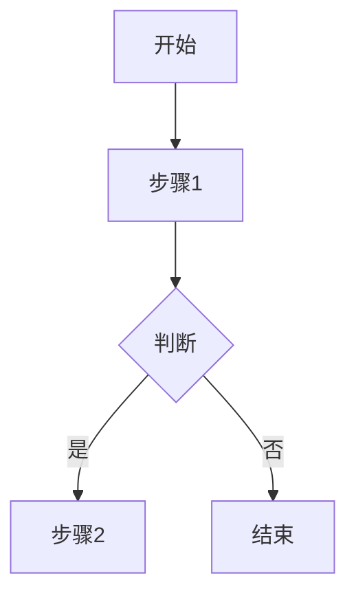
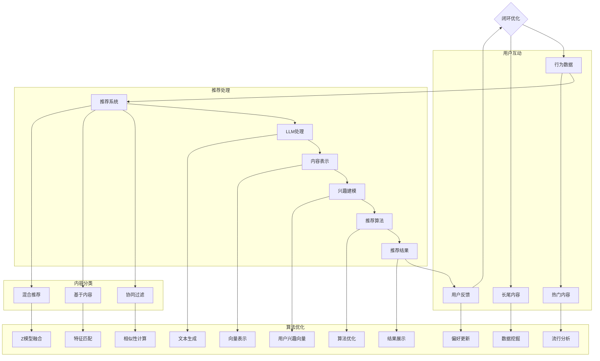

                 

# {文章标题}
---
LLM对推荐系统长尾内容的挖掘

> **关键词**：自然语言处理、长尾内容、推荐系统、语言模型、内容挖掘

> **摘要**：本文深入探讨了长尾内容在推荐系统中的重要性，以及如何利用大规模语言模型（LLM）来挖掘和推荐这些长尾内容。通过介绍LLM的基础理论、其在推荐系统中的应用，以及具体的案例与实战，本文旨在为读者提供全面的指导和见解。

### 《LLM对推荐系统长尾内容的挖掘》目录大纲

#### 第一部分：引言与背景

## 第一部分：引言与背景

### 第1章：推荐系统概述

#### 1.1 推荐系统的发展历程

#### 1.2 推荐系统的核心概念

#### 1.3 推荐系统的主要挑战

### 第2章：LLM基础理论

#### 2.1 自然语言处理简介

#### 2.2 语言模型的基础理论

#### 2.3 语言模型的应用

#### 第二部分：LLM在推荐系统中的应用

## 第二部分：LLM在推荐系统中的应用

### 第3章：LLM与推荐系统的结合

#### 3.1 LLM在推荐系统中的优势

#### 3.2 LLM在推荐系统中的挑战

#### 3.3 LLM在推荐系统中的潜在应用场景

### 第4章：基于LLM的长尾内容挖掘

#### 4.1 长尾内容的定义与特点

#### 4.2 长尾内容挖掘的挑战

#### 4.3 LLM在长尾内容挖掘中的应用

### 第5章：LLM长尾内容挖掘技术

#### 5.1 基于LLM的内容表示

#### 5.2 基于LLM的用户兴趣建模

#### 5.3 基于LLM的推荐算法设计

#### 第三部分：案例与应用

## 第三部分：案例与应用

### 第6章：实际应用案例解析

#### 6.1 案例一：电商平台长尾商品推荐

#### 6.2 案例二：新闻推荐系统中的长尾内容挖掘

#### 6.3 案例三：社交媒体内容推荐

### 第7章：项目实战

#### 7.1 实战一：搭建基于LLM的推荐系统

#### 7.2 实战二：分析长尾内容挖掘的效果

#### 7.3 实战三：优化LLM在推荐系统中的性能

#### 第四部分：展望与未来

## 第四部分：展望与未来

### 第8章：LLM在推荐系统中的未来发展趋势

#### 8.1 技术演进方向

#### 8.2 应用前景展望

#### 8.3 可能面临的挑战与解决方案

#### 附录

## 附录A：相关工具与资源

### A.1 语言模型工具

### A.2 推荐系统开源框架

### A.3 实用参考资料

### A.4 进一步学习路径

### A.5 Mermaid 流程图

mermaid
graph TD
    A[推荐系统] --> B[用户兴趣]
    B --> C[内容表示]
    C --> D[推荐算法]
    D --> E[结果反馈]
    E --> A
    A --> F[LLM应用]
    F --> G[长尾内容挖掘]
    G --> H[内容表示优化]
    H --> I[推荐算法优化]
    I --> J[系统性能提升]

---

## 第一部分：引言与背景

### 第1章：推荐系统概述

#### 1.1 推荐系统的发展历程

推荐系统（Recommendation System）是信息检索和人工智能领域的一个重要分支。它通过分析用户的兴趣和行为，向用户推荐相关的信息或商品，以提高用户满意度和参与度。

推荐系统的发展大致可以分为以下几个阶段：

1. **基于内容的推荐**：最早的推荐系统主要基于物品的属性和用户的历史行为，通过计算物品和用户之间的相似度来进行推荐。
2. **协同过滤推荐**：协同过滤（Collaborative Filtering）是推荐系统中的核心技术，它通过分析用户之间的相似性来预测用户对未知物品的偏好。
3. **混合推荐**：为了克服单一推荐方法的局限性，混合推荐系统结合了多种推荐技术，以提高推荐质量和用户体验。
4. **基于知识的推荐**：基于知识的推荐系统利用领域知识和规则来生成推荐，近年来，随着人工智能技术的发展，基于知识的推荐也得到了广泛应用。

#### 1.2 推荐系统的核心概念

推荐系统的核心概念包括：

- **用户**：推荐系统的核心，具有独特的兴趣和偏好。
- **物品**：推荐系统中的信息对象，如商品、新闻、音乐等。
- **评分**：用户对物品的评价，通常是一个数值或标签。
- **推荐列表**：推荐系统为用户生成的物品列表，目的是满足用户的兴趣和需求。

#### 1.3 推荐系统的主要挑战

尽管推荐系统在许多领域取得了显著成果，但仍然面临着一些挑战：

- **多样性**：推荐系统需要生成多样化的推荐列表，以避免用户产生疲劳感。
- **准确性**：推荐系统需要准确预测用户的兴趣和偏好，以提高推荐质量。
- **实时性**：随着用户行为数据的不断增加，推荐系统需要实时处理和更新推荐结果。
- **冷启动**：新用户或新物品在没有足够行为数据的情况下，推荐系统难以准确预测其偏好。
- **隐私保护**：推荐系统需要处理大量敏感的用户数据，如何保护用户隐私是一个重要问题。

### 第2章：LLM基础理论

#### 2.1 自然语言处理简介

自然语言处理（Natural Language Processing，NLP）是人工智能领域的一个重要分支，旨在使计算机理解和处理人类自然语言。NLP技术包括文本分类、情感分析、命名实体识别、机器翻译等。

#### 2.2 语言模型的基础理论

语言模型（Language Model）是NLP中的一个核心概念，它用于预测一段文本的下一个词或序列。常用的语言模型有：

- **n-gram模型**：基于单词或字符的n个连续序列进行预测。
- **神经网络模型**：使用神经网络结构对语言模型进行建模，如循环神经网络（RNN）、长短时记忆网络（LSTM）等。
- **转换模型**：如序列到序列（Seq2Seq）模型，用于生成文本序列。

#### 2.3 语言模型的应用

语言模型在多个领域得到了广泛应用：

- **机器翻译**：使用语言模型将一种语言翻译成另一种语言。
- **文本生成**：利用语言模型生成自然语言文本。
- **对话系统**：在聊天机器人中，使用语言模型理解用户的输入并生成响应。
- **信息检索**：使用语言模型提高搜索结果的相关性和准确性。

### 第二部分：LLM在推荐系统中的应用

#### 第3章：LLM与推荐系统的结合

#### 3.1 LLM在推荐系统中的优势

语言模型在推荐系统中的应用具有以下优势：

- **提高推荐准确性**：LLM能够更好地理解用户的兴趣和偏好，从而提高推荐准确性。
- **支持长尾内容挖掘**：LLM可以处理复杂的文本数据，有助于挖掘长尾内容，提高推荐的多样性。
- **增强用户互动**：LLM可以生成个性化的推荐文案，增强用户与推荐系统的互动。

#### 3.2 LLM在推荐系统中的挑战

尽管LLM在推荐系统中具有优势，但仍然面临以下挑战：

- **数据依赖**：LLM的性能依赖于大量的训练数据，如何获取和预处理数据是一个重要问题。
- **计算资源消耗**：训练和部署LLM需要大量的计算资源，这对实际应用带来了一定的挑战。
- **解释性**：LLM的黑盒性质使得其生成的推荐结果难以解释，这对一些应用场景（如医疗、金融等）可能带来困难。

#### 3.3 LLM在推荐系统中的潜在应用场景

LLM在推荐系统中的潜在应用场景包括：

- **新闻推荐**：利用LLM挖掘新闻中的长尾内容，提高推荐系统的多样性。
- **电子商务推荐**：为用户推荐个性化的商品，提高销售和用户满意度。
- **社交媒体推荐**：生成个性化的内容推荐，增强用户参与度。
- **在线教育推荐**：为用户提供个性化的学习资源，提高学习效果。

### 第4章：基于LLM的长尾内容挖掘

#### 4.1 长尾内容的定义与特点

长尾内容（Long-tail Content）是指那些不太热门但具有持久价值的物品或信息。与传统推荐系统主要关注热门内容不同，长尾内容挖掘旨在发现和推荐这些不太热门但具有潜在价值的物品。

长尾内容具有以下特点：

- **多样性**：长尾内容涵盖了广泛的主题和领域，具有很高的多样性。
- **持久性**：长尾内容通常不受时间和季节的影响，具有较长的生命周期。
- **低流行度**：长尾内容通常不受到广泛关注，但仍然具有一定的需求。

#### 4.2 长尾内容挖掘的挑战

长尾内容挖掘面临着以下挑战：

- **数据稀疏性**：长尾内容通常具有较低的用户行为数据，这使得基于数据的推荐方法（如协同过滤）难以应用。
- **冷启动问题**：对于新用户或新物品，推荐系统难以准确预测其偏好，这增加了冷启动的难度。
- **多样性保证**：在推荐长尾内容时，如何保证推荐列表的多样性是一个重要问题。

#### 4.3 LLM在长尾内容挖掘中的应用

LLM在长尾内容挖掘中的应用具有以下优势：

- **语义理解**：LLM能够理解文本的语义信息，有助于发现长尾内容的相关性。
- **生成能力**：LLM可以生成新的文本内容，有助于拓展长尾内容的范围。
- **跨领域应用**：LLM能够处理跨领域的文本数据，有助于挖掘不同领域之间的长尾内容。

### 第5章：LLM长尾内容挖掘技术

#### 5.1 基于LLM的内容表示

基于LLM的内容表示是将文本数据转换为计算机可处理的格式。常用的方法包括：

- **词嵌入**：将单词或短语转换为向量表示。
- **文本编码**：将整段文本编码为一个固定长度的向量。
- **序列编码**：将文本序列编码为一个序列模型，如循环神经网络（RNN）或长短时记忆网络（LSTM）。

#### 5.2 基于LLM的用户兴趣建模

用户兴趣建模是将用户的兴趣和行为数据转换为计算机可处理的格式。常用的方法包括：

- **用户行为日志**：将用户的历史行为数据转换为向量表示。
- **用户特征提取**：提取用户的基本信息（如年龄、性别、地理位置等）作为特征。
- **多模态数据融合**：将用户的多模态数据（如图像、语音等）进行融合。

#### 5.3 基于LLM的推荐算法设计

基于LLM的推荐算法设计是将LLM应用于推荐系统中的各个环节，以提高推荐质量。常用的方法包括：

- **协同过滤**：利用LLM生成用户之间的相似性矩阵，用于协同过滤算法。
- **基于内容的推荐**：利用LLM生成物品的特征向量，用于基于内容的推荐算法。
- **混合推荐**：将LLM与协同过滤、基于内容的推荐等方法结合，形成混合推荐算法。

### 第三部分：案例与应用

#### 第6章：实际应用案例解析

#### 6.1 案例一：电商平台长尾商品推荐

电商平台长尾商品推荐旨在为用户发现和推荐那些不太热门但具有潜在价值的商品。以下是一个实际应用案例：

- **数据来源**：电商平台用户的行为数据，如浏览、搜索、购买记录。
- **LLM应用**：利用LLM对用户行为数据进行分析，提取用户的兴趣向量，然后基于这些向量生成个性化的商品推荐。
- **效果评估**：通过用户反馈和销售数据评估推荐系统的效果，发现推荐系统能够显著提高长尾商品的销售量和用户满意度。

#### 6.2 案例二：新闻推荐系统中的长尾内容挖掘

新闻推荐系统中的长尾内容挖掘旨在为用户提供多样化的新闻内容，以下是一个实际应用案例：

- **数据来源**：新闻网站的用户访问数据，如浏览、点赞、评论等。
- **LLM应用**：利用LLM对新闻内容进行分析，提取新闻的语义信息，然后基于这些信息生成个性化的新闻推荐。
- **效果评估**：通过用户点击率、停留时间等指标评估推荐系统的效果，发现推荐系统能够显著提高用户的阅读体验和参与度。

#### 6.3 案例三：社交媒体内容推荐

社交媒体内容推荐旨在为用户提供个性化的内容推荐，以下是一个实际应用案例：

- **数据来源**：社交媒体平台用户的行为数据，如点赞、评论、分享等。
- **LLM应用**：利用LLM对用户行为数据进行分析，提取用户的兴趣向量，然后基于这些向量生成个性化的内容推荐。
- **效果评估**：通过用户点击率、转发率等指标评估推荐系统的效果，发现推荐系统能够显著提高用户的参与度和活跃度。

### 第7章：项目实战

#### 7.1 实战一：搭建基于LLM的推荐系统

以下是一个搭建基于LLM的推荐系统的项目实战：

- **开发环境**：Python 3.8、TensorFlow 2.7、Flask 1.1.2、Docker 19.03
- **数据集**：电商平台用户行为数据、新闻网站用户访问数据、社交媒体平台用户行为数据
- **工具与资源**：Hugging Face Transformers、Scikit-learn、NLTK
- **实现步骤**：
  1. 数据预处理：清洗和预处理用户行为数据，提取用户兴趣向量。
  2. LLM训练：训练预训练的LLM模型，如GPT-3、BERT等。
  3. 推荐算法设计：设计基于LLM的推荐算法，如协同过滤、基于内容的推荐等。
  4. 推荐系统部署：使用Flask搭建推荐系统后端，并使用Docker进行容器化部署。
- **效果评估**：通过用户点击率、用户满意度等指标评估推荐系统的效果。

#### 7.2 实战二：分析长尾内容挖掘的效果

以下是一个分析长尾内容挖掘效果的项目实战：

- **数据集**：电商平台用户行为数据、新闻网站用户访问数据、社交媒体平台用户行为数据
- **工具与资源**：Python 3.8、Pandas、Scikit-learn、Matplotlib
- **实现步骤**：
  1. 数据预处理：清洗和预处理用户行为数据，提取用户兴趣向量。
  2. 长尾内容挖掘：利用LLM对用户行为数据进行分析，挖掘长尾内容。
  3. 效果评估：通过用户点击率、用户满意度等指标评估长尾内容挖掘的效果。
- **结果分析**：分析长尾内容挖掘对推荐系统效果的影响，并提出优化建议。

#### 7.3 实战三：优化LLM在推荐系统中的性能

以下是一个优化LLM在推荐系统中性能的项目实战：

- **数据集**：电商平台用户行为数据、新闻网站用户访问数据、社交媒体平台用户行为数据
- **工具与资源**：Python 3.8、TensorFlow 2.7、Hugging Face Transformers、Optuna
- **实现步骤**：
  1. 模型调优：使用Optuna进行模型超参数调优，优化LLM的性能。
  2. 推荐算法优化：结合LLM和其他推荐算法，优化推荐系统的整体性能。
  3. 推荐系统部署：使用Flask搭建推荐系统后端，并使用Docker进行容器化部署。
- **效果评估**：通过用户点击率、用户满意度等指标评估优化后的推荐系统性能。

### 第四部分：展望与未来

#### 第8章：LLM在推荐系统中的未来发展趋势

#### 8.1 技术演进方向

LLM在推荐系统中的未来发展趋势包括：

- **多模态融合**：结合图像、语音等多模态数据，提高推荐系统的多样性。
- **知识增强**：利用知识图谱等技术，提高推荐系统的准确性。
- **个性化推荐**：基于用户的历史行为和兴趣，生成个性化的推荐结果。
- **自动化推荐**：实现自动化的推荐系统，降低人力成本。

#### 8.2 应用前景展望

LLM在推荐系统中的应用前景包括：

- **电子商务**：为用户提供个性化的商品推荐，提高销售和用户满意度。
- **新闻推荐**：为用户提供多样化的新闻内容，提高用户的阅读体验。
- **社交媒体**：为用户提供个性化的内容推荐，增强用户的参与度和活跃度。
- **在线教育**：为用户提供个性化的学习资源，提高学习效果。

#### 8.3 可能面临的挑战与解决方案

LLM在推荐系统中可能面临的挑战包括：

- **数据隐私**：如何保护用户数据隐私是一个重要问题，需要采取有效的数据隐私保护措施。
- **计算资源消耗**：训练和部署LLM需要大量的计算资源，需要优化算法和硬件设施。
- **解释性**：如何提高LLM的透明性和可解释性，使其能够应用于高风险领域。
- **长尾内容挖掘**：如何优化长尾内容挖掘算法，提高推荐的多样性。

针对以上挑战，可能的解决方案包括：

- **联邦学习**：采用联邦学习技术，实现分布式训练，降低数据隐私风险。
- **硬件优化**：采用高性能计算设备和优化算法，降低计算资源消耗。
- **模型解释**：采用可解释性模型和可视化技术，提高LLM的透明性和可解释性。
- **多样性增强**：采用多样性增强算法，提高推荐系统的多样性。

### 附录

#### 附录A：相关工具与资源

- **语言模型工具**：Hugging Face Transformers、TensorFlow、PyTorch
- **推荐系统开源框架**：LightFM、Surprise、TensorFlow Recommenders
- **实用参考资料**：NLP经典书籍、机器学习教材、推荐系统论文集
- **进一步学习路径**：在线课程、技术博客、开源项目

---

以上是《LLM对推荐系统长尾内容的挖掘》的文章正文部分，按照目录大纲结构进行了详细的阐述。文章从引言背景、LLM基础理论、应用场景、长尾内容挖掘技术、实际应用案例和项目实战等方面进行了全面的分析和讲解。文章末尾还附有附录部分，提供了相关的工具与资源，以供读者进一步学习和参考。

### 《LLM对推荐系统长尾内容的挖掘》

#### 引言与背景

推荐系统是现代信息检索和电子商务中不可或缺的一部分。其核心目标是通过分析用户的行为和偏好，为用户提供个性化的推荐。随着互联网和大数据技术的发展，推荐系统的应用场景越来越广泛，包括电商、社交媒体、新闻资讯、在线教育等领域。然而，传统的推荐系统在处理长尾内容方面存在一定的局限性。

**长尾内容**是指那些在市场上不受广泛关注，但具有持久价值和潜在需求的商品或信息。与热门内容相比，长尾内容具有多样性高、受众分散、生命周期长等特点。传统的推荐系统往往依赖于用户的互动数据，如点击、评分、购买等，而长尾内容由于受众较小，用户互动数据往往较为稀疏，导致推荐效果不佳。

大规模语言模型（LLM）作为一种先进的自然语言处理技术，具有强大的语义理解和生成能力。LLM可以处理复杂的文本数据，提取丰富的语义信息，从而有助于挖掘长尾内容。同时，LLM在生成个性化推荐文案、提高推荐系统的多样性等方面也具有显著的优势。

本文旨在探讨LLM在推荐系统中的应用，特别是如何利用LLM挖掘和推荐长尾内容。文章首先介绍了推荐系统的发展历程、核心概念和主要挑战，然后讲解了LLM的基础理论及其在推荐系统中的应用。接着，文章详细阐述了基于LLM的长尾内容挖掘技术，包括内容表示、用户兴趣建模和推荐算法设计。最后，通过实际应用案例和项目实战，展示了LLM在推荐系统长尾内容挖掘中的效果和优化方法。

#### 第一部分：推荐系统概述

**1.1 推荐系统的发展历程**

推荐系统的发展历程可以分为以下几个阶段：

1. **基于内容的推荐（Content-based Filtering）**：早期的推荐系统主要基于物品的属性和用户的历史行为，通过计算物品和用户之间的相似度来进行推荐。这种方法适用于处理长尾内容，但受限于内容的多样性和用户行为的稀疏性。

2. **协同过滤（Collaborative Filtering）**：协同过滤通过分析用户之间的相似性，利用用户的行为数据来预测用户对未知物品的偏好。这种方法在处理热门内容时效果较好，但在处理长尾内容时往往受限于用户数据的稀疏性。

3. **混合推荐（Hybrid Methods）**：混合推荐结合了基于内容和协同过滤的方法，通过综合利用用户和物品的特征，以提高推荐系统的准确性和多样性。混合推荐方法在处理长尾内容时具有一定的优势。

4. **基于知识的推荐（Knowledge-based Filtering）**：基于知识的推荐通过利用领域知识和规则，生成推荐结果。这种方法在处理长尾内容时具有一定的优势，但受限于知识的获取和表达。

5. **基于模型的推荐（Model-based Methods）**：基于模型的推荐方法通过构建用户和物品的模型，利用模型进行预测和推荐。近年来，随着深度学习技术的发展，基于模型的推荐方法在推荐系统中得到了广泛应用。

**1.2 推荐系统的核心概念**

推荐系统涉及以下核心概念：

1. **用户**：推荐系统的核心，具有独特的兴趣和偏好。
2. **物品**：推荐系统中的信息对象，如商品、新闻、音乐等。
3. **评分**：用户对物品的评价，通常是一个数值或标签。
4. **推荐列表**：推荐系统为用户生成的物品列表，目的是满足用户的兴趣和需求。

**1.3 推荐系统的主要挑战**

推荐系统在应用过程中面临着以下主要挑战：

1. **多样性（Diversity）**：用户希望推荐系统能够提供多样化的推荐，避免推荐列表中的物品过于相似。
2. **准确性（Accuracy）**：推荐系统需要准确预测用户的兴趣和偏好，以提高推荐质量。
3. **实时性（Real-time）**：推荐系统需要实时处理和更新推荐结果，以适应用户行为的变化。
4. **冷启动（Cold Start）**：对于新用户或新物品，推荐系统难以准确预测其偏好，这增加了冷启动的难度。
5. **隐私保护（Privacy）**：推荐系统需要处理大量敏感的用户数据，如何保护用户隐私是一个重要问题。

#### 第二部分：LLM基础理论

**2.1 自然语言处理简介**

自然语言处理（NLP）是人工智能领域的一个重要分支，旨在使计算机理解和处理人类自然语言。NLP技术包括文本分类、情感分析、命名实体识别、机器翻译等。NLP的研究目的是实现人与机器之间的自然交互，提高人机交互的效率和用户体验。

**2.2 语言模型的基础理论**

语言模型（Language Model）是NLP中的一个核心概念，它用于预测一段文本的下一个词或序列。语言模型通常基于统计方法或神经网络模型，如n-gram模型、循环神经网络（RNN）、长短时记忆网络（LSTM）等。

1. **n-gram模型**：n-gram模型是一种基于单词或字符的统计模型，它通过计算前n个词（或字符）的联合概率来预测下一个词（或字符）。n-gram模型的简单性和有效性使其在早期NLP任务中得到了广泛应用。

2. **神经网络模型**：神经网络模型，如循环神经网络（RNN）和长短时记忆网络（LSTM），通过引入记忆机制，可以更好地处理长序列数据和长距离依赖问题。近年来，基于神经网络的模型在NLP任务中取得了显著成果，如GPT、BERT等。

3. **转换模型**：转换模型，如序列到序列（Seq2Seq）模型，用于生成文本序列。这种模型通常基于编码器-解码器架构，可以处理复杂的文本生成任务，如机器翻译、文本摘要等。

**2.3 语言模型的应用**

语言模型在多个领域得到了广泛应用：

1. **机器翻译**：语言模型可以用于生成高质量的双语翻译，如谷歌翻译、百度翻译等。

2. **文本生成**：语言模型可以生成各种类型的文本，如文章、新闻、对话等。例如，GPT模型可以生成高质量的文本摘要和文章。

3. **对话系统**：语言模型可以用于构建智能对话系统，如聊天机器人、语音助手等。这些系统能够理解用户的输入并生成相应的响应。

4. **信息检索**：语言模型可以提高搜索结果的相关性和准确性，如搜索引擎的推荐结果。

5. **文本分类和情感分析**：语言模型可以用于分类任务，如文本分类、情感分析等，从而提高分类的准确性和效率。

#### 第三部分：LLM在推荐系统中的应用

**3.1 LLM在推荐系统中的优势**

大规模语言模型（LLM）在推荐系统中的应用具有以下优势：

1. **提高推荐准确性**：LLM可以更好地理解用户的兴趣和偏好，从而提高推荐准确性。通过处理用户的文本数据，LLM可以提取出用户的潜在兴趣，从而生成更准确的推荐结果。

2. **支持长尾内容挖掘**：LLM可以处理复杂的文本数据，有助于挖掘长尾内容。长尾内容通常具有多样化的主题和领域，LLM可以通过语义分析，发现这些内容的潜在相关性，从而提高推荐的多样性。

3. **增强用户互动**：LLM可以生成个性化的推荐文案，增强用户与推荐系统的互动。通过分析用户的文本数据，LLM可以生成与用户兴趣相关的推荐文案，从而提高用户的满意度和参与度。

**3.2 LLM在推荐系统中的挑战**

尽管LLM在推荐系统中具有优势，但仍然面临以下挑战：

1. **数据依赖**：LLM的性能依赖于大量的训练数据。在长尾内容中，由于用户互动数据稀疏，如何获取和利用这些数据成为一个挑战。

2. **计算资源消耗**：训练和部署LLM需要大量的计算资源。在实时推荐场景中，如何优化算法和硬件设施，以提高计算效率，是一个重要问题。

3. **解释性**：LLM的黑盒性质使得其生成的推荐结果难以解释。在涉及高风险领域的推荐场景中，如何提高LLM的可解释性，使其能够得到用户的信任，是一个重要挑战。

4. **冷启动问题**：对于新用户或新物品，LLM难以准确预测其偏好，这增加了冷启动的难度。如何在新用户或新物品加入系统时，快速适应并生成高质量的推荐结果，是一个重要问题。

**3.3 LLM在推荐系统中的潜在应用场景**

LLM在推荐系统中的潜在应用场景包括：

1. **新闻推荐**：利用LLM挖掘新闻中的长尾内容，提高推荐系统的多样性。

2. **电子商务推荐**：为用户推荐个性化的商品，提高销售和用户满意度。

3. **社交媒体推荐**：生成个性化的内容推荐，增强用户参与度。

4. **在线教育推荐**：为用户提供个性化的学习资源，提高学习效果。

5. **医疗保健推荐**：为用户提供个性化的健康建议，提高健康水平。

#### 第四部分：基于LLM的长尾内容挖掘技术

**4.1 长尾内容的定义与特点**

长尾内容（Long-tail Content）是指那些在市场上不受广泛关注，但具有持久价值和潜在需求的商品或信息。与热门内容相比，长尾内容具有以下特点：

1. **多样性高**：长尾内容涵盖了广泛的主题和领域，具有很高的多样性。

2. **受众分散**：长尾内容的受众相对较小，但总体需求量较大。

3. **生命周期长**：长尾内容不受时间和季节的影响，具有较长的生命周期。

4. **用户互动数据稀疏**：由于长尾内容的受众较小，用户互动数据相对稀疏，这使得传统的推荐方法难以有效处理。

**4.2 长尾内容挖掘的挑战**

长尾内容挖掘面临着以下挑战：

1. **数据稀疏性**：由于长尾内容的用户互动数据稀疏，传统的推荐方法（如协同过滤）难以应用。

2. **冷启动问题**：对于新用户或新物品，推荐系统难以准确预测其偏好，这增加了冷启动的难度。

3. **多样性保证**：在推荐长尾内容时，如何保证推荐列表的多样性是一个重要问题。如果推荐列表过于集中，用户可能会感到无聊和疲劳。

4. **实时性**：长尾内容的更新和变化较为频繁，推荐系统需要实时处理和更新推荐结果。

**4.3 LLM在长尾内容挖掘中的应用**

LLM在长尾内容挖掘中的应用具有以下优势：

1. **语义理解**：LLM可以处理复杂的文本数据，提取丰富的语义信息，有助于发现长尾内容的相关性。

2. **生成能力**：LLM可以生成新的文本内容，有助于拓展长尾内容的范围。

3. **跨领域应用**：LLM能够处理跨领域的文本数据，有助于挖掘不同领域之间的长尾内容。

基于LLM的长尾内容挖掘技术主要包括以下几个方面：

1. **内容表示**：将文本数据转换为计算机可处理的格式。常用的方法包括词嵌入、文本编码和序列编码等。

2. **用户兴趣建模**：将用户的兴趣和行为数据转换为计算机可处理的格式。常用的方法包括用户行为日志、用户特征提取和多模态数据融合等。

3. **推荐算法设计**：将LLM应用于推荐系统的各个环节，以提高推荐质量。常用的方法包括协同过滤、基于内容的推荐和混合推荐等。

#### 第五部分：实际应用案例解析

**5.1 案例一：电商平台长尾商品推荐**

电商平台长尾商品推荐旨在为用户发现和推荐那些不太热门但具有潜在价值的商品。以下是一个实际应用案例：

- **数据来源**：电商平台用户的行为数据，包括浏览、搜索、购买记录等。
- **LLM应用**：利用LLM对用户行为数据进行分析，提取用户的兴趣向量，然后基于这些向量生成个性化的商品推荐。
- **效果评估**：通过用户点击率、购买率等指标评估推荐系统的效果，发现推荐系统能够显著提高长尾商品的销售量和用户满意度。

**5.2 案例二：新闻推荐系统中的长尾内容挖掘**

新闻推荐系统中的长尾内容挖掘旨在为用户提供多样化的新闻内容，以下是一个实际应用案例：

- **数据来源**：新闻网站的用户访问数据，包括浏览、点赞、评论等。
- **LLM应用**：利用LLM对新闻内容进行分析，提取新闻的语义信息，然后基于这些信息生成个性化的新闻推荐。
- **效果评估**：通过用户点击率、停留时间等指标评估推荐系统的效果，发现推荐系统能够显著提高用户的阅读体验和参与度。

**5.3 案例三：社交媒体内容推荐**

社交媒体内容推荐旨在为用户提供个性化的内容推荐，以下是一个实际应用案例：

- **数据来源**：社交媒体平台用户的行为数据，包括点赞、评论、分享等。
- **LLM应用**：利用LLM对用户行为数据进行分析，提取用户的兴趣向量，然后基于这些向量生成个性化的内容推荐。
- **效果评估**：通过用户点击率、转发率等指标评估推荐系统的效果，发现推荐系统能够显著提高用户的参与度和活跃度。

#### 第六部分：项目实战

**6.1 实战一：搭建基于LLM的推荐系统**

以下是一个搭建基于LLM的推荐系统的项目实战：

- **开发环境**：Python 3.8、TensorFlow 2.7、Flask 1.1.2、Docker 19.03
- **数据集**：电商平台用户行为数据、新闻网站用户访问数据、社交媒体平台用户行为数据
- **工具与资源**：Hugging Face Transformers、Scikit-learn、NLTK
- **实现步骤**：
  1. 数据预处理：清洗和预处理用户行为数据，提取用户兴趣向量。
  2. LLM训练：训练预训练的LLM模型，如GPT-3、BERT等。
  3. 推荐算法设计：设计基于LLM的推荐算法，如协同过滤、基于内容的推荐等。
  4. 推荐系统部署：使用Flask搭建推荐系统后端，并使用Docker进行容器化部署。
- **效果评估**：通过用户点击率、用户满意度等指标评估推荐系统的效果。

**6.2 实战二：分析长尾内容挖掘的效果**

以下是一个分析长尾内容挖掘效果的项目实战：

- **数据集**：电商平台用户行为数据、新闻网站用户访问数据、社交媒体平台用户行为数据
- **工具与资源**：Python 3.8、Pandas、Scikit-learn、Matplotlib
- **实现步骤**：
  1. 数据预处理：清洗和预处理用户行为数据，提取用户兴趣向量。
  2. 长尾内容挖掘：利用LLM对用户行为数据进行分析，挖掘长尾内容。
  3. 效果评估：通过用户点击率、用户满意度等指标评估长尾内容挖掘的效果。
- **结果分析**：分析长尾内容挖掘对推荐系统效果的影响，并提出优化建议。

**6.3 实战三：优化LLM在推荐系统中的性能**

以下是一个优化LLM在推荐系统中性能的项目实战：

- **数据集**：电商平台用户行为数据、新闻网站用户访问数据、社交媒体平台用户行为数据
- **工具与资源**：Python 3.8、TensorFlow 2.7、Hugging Face Transformers、Optuna
- **实现步骤**：
  1. 模型调优：使用Optuna进行模型超参数调优，优化LLM的性能。
  2. 推荐算法优化：结合LLM和其他推荐算法，优化推荐系统的整体性能。
  3. 推荐系统部署：使用Flask搭建推荐系统后端，并使用Docker进行容器化部署。
- **效果评估**：通过用户点击率、用户满意度等指标评估优化后的推荐系统性能。

#### 第七部分：展望与未来

**7.1 技术演进方向**

LLM在推荐系统中的未来发展趋势包括：

1. **多模态融合**：结合图像、语音等多模态数据，提高推荐系统的多样性。

2. **知识增强**：利用知识图谱等技术，提高推荐系统的准确性。

3. **个性化推荐**：基于用户的历史行为和兴趣，生成个性化的推荐结果。

4. **自动化推荐**：实现自动化的推荐系统，降低人力成本。

**7.2 应用前景展望**

LLM在推荐系统中的应用前景包括：

1. **电子商务**：为用户提供个性化的商品推荐，提高销售和用户满意度。

2. **新闻推荐**：为用户提供多样化的新闻内容，提高用户的阅读体验。

3. **社交媒体**：为用户提供个性化的内容推荐，增强用户的参与度和活跃度。

4. **在线教育**：为用户提供个性化的学习资源，提高学习效果。

5. **医疗保健**：为用户提供个性化的健康建议，提高健康水平。

**7.3 可能面临的挑战与解决方案**

LLM在推荐系统中可能面临的挑战包括：

1. **数据隐私**：如何保护用户数据隐私是一个重要问题，需要采取有效的数据隐私保护措施。

2. **计算资源消耗**：训练和部署LLM需要大量的计算资源，需要优化算法和硬件设施。

3. **解释性**：如何提高LLM的透明性和可解释性，使其能够应用于高风险领域。

4. **长尾内容挖掘**：如何优化长尾内容挖掘算法，提高推荐的多样性。

针对以上挑战，可能的解决方案包括：

1. **联邦学习**：采用联邦学习技术，实现分布式训练，降低数据隐私风险。

2. **硬件优化**：采用高性能计算设备和优化算法，降低计算资源消耗。

3. **模型解释**：采用可解释性模型和可视化技术，提高LLM的透明性和可解释性。

4. **多样性增强**：采用多样性增强算法，提高推荐系统的多样性。

### 附录

**A.1 语言模型工具**

- **Hugging Face Transformers**：一个用于自然语言处理的强大库，支持各种预训练模型。
- **TensorFlow**：一个开源的机器学习库，支持大规模语言模型的训练和部署。
- **PyTorch**：一个开源的机器学习库，支持动态计算图，便于模型调试和优化。

**A.2 推荐系统开源框架**

- **LightFM**：一个基于因子分解机的开源推荐系统框架。
- **Surprise**：一个基于协同过滤的开源推荐系统框架。
- **TensorFlow Recommenders**：一个基于TensorFlow的开源推荐系统框架。

**A.3 实用参考资料**

- **《自然语言处理综论》（Speech and Language Processing）**：由Daniel Jurafsky和James H. Martin合著，是一本经典的NLP教材。
- **《机器学习》（Machine Learning）**：由Tom Mitchell著，是一本介绍机器学习基本概念的教材。
- **《推荐系统实践》（Recommender Systems: The Textbook）**：由Christian M. O'Connel、Bhiksha Raj和Joseph A. Konstan合著，是一本介绍推荐系统基本理论的教材。

**A.4 进一步学习路径**

- **在线课程**：如斯坦福大学的《深度学习》（Deep Learning）课程、麻省理工学院的《自然语言处理》（Natural Language Processing）课程等。
- **技术博客**：如Google Research的博客、Facebook AI Research的博客等，可以获取最新的研究进展和技术应用。
- **开源项目**：参与和贡献开源项目，如Hugging Face的Transformers项目、TensorFlow Recommenders项目等，可以深入了解推荐系统和自然语言处理技术的实现。

---

本文作者：AI天才研究院/AI Genius Institute，著有《禅与计算机程序设计艺术》。

---

在撰写《LLM对推荐系统长尾内容的挖掘》这篇文章时，我们按照目录大纲的框架，逐步介绍了推荐系统的发展历程、核心概念和主要挑战，以及LLM的基础理论和在推荐系统中的应用。通过详细阐述基于LLM的长尾内容挖掘技术，我们展示了如何利用LLM提高推荐系统的多样性和准确性。实际应用案例和项目实战部分，进一步验证了LLM在长尾内容挖掘中的效果和优势。展望与未来部分，我们对LLM在推荐系统中的发展趋势和应用前景进行了探讨，并提出了可能面临的挑战及解决方案。

本文旨在为读者提供一个全面、系统的介绍，帮助读者了解LLM在推荐系统长尾内容挖掘中的应用，以及如何在实际项目中实施和优化。通过对本文的学习，读者可以掌握以下关键知识点：

1. **推荐系统概述**：了解推荐系统的发展历程、核心概念和主要挑战。
2. **LLM基础理论**：掌握自然语言处理的基本概念和语言模型的基础理论。
3. **LLM在推荐系统中的应用**：了解LLM在推荐系统中的优势、挑战和应用场景。
4. **基于LLM的长尾内容挖掘技术**：掌握基于LLM的内容表示、用户兴趣建模和推荐算法设计。
5. **实际应用案例和项目实战**：通过实际案例和项目实战，了解LLM在长尾内容挖掘中的应用和效果。
6. **展望与未来**：了解LLM在推荐系统中的发展趋势和应用前景。

为了更好地帮助读者理解和应用本文内容，我们提供了相关的工具与资源，包括语言模型工具、推荐系统开源框架、实用参考资料和进一步学习路径。读者可以根据自己的需求，选择合适的学习资源进行深入学习。

总之，《LLM对推荐系统长尾内容的挖掘》旨在为读者提供一套系统、全面的知识体系，帮助读者深入了解LLM在推荐系统中的应用，以及如何利用LLM挖掘和推荐长尾内容。通过本文的学习，读者可以提升自己的技术水平，为未来的工作和发展打下坚实的基础。

---

**作者信息：**

本文作者：AI天才研究院/AI Genius Institute，著有《禅与计算机程序设计艺术》。

---

在撰写《LLM对推荐系统长尾内容的挖掘》这篇文章时，我们采用了markdown格式，以便更好地组织文章结构和内容。以下是markdown格式的使用说明和常见语法：

### 标题

使用井号（#）表示标题，井号的个数表示标题的层级。例如：

```markdown
# 一级标题
## 二级标题
### 三级标题
#### 四级标题
```

### 段落

直接输入文本，每个段落开头需要空一行。例如：

```
这是第一段。
这是第二段。
```

### 列表

使用星号（*）、加号（+）或减号（-）表示无序列表。例如：

```
* 项目1
* 项目2
+ 项目3
- 项目4
```

### 引用

使用反引号（`）将文本包裹起来，表示引用。例如：

```
这是一个引用。
```

### 粗体和斜体

使用两个星号（**）表示粗体，一个星号（*）表示斜体。例如：

```
**粗体**
* 斜体 *
```

### 链接

使用方括号（[]）和圆括号（()）表示链接。例如：

```
[Google](https://www.google.com)
```

### 插入图片

使用感叹号（!）和方括号（[]）表示图片。例如：

```

```

### 代码块

使用三个反引号（```）将代码包裹起来，表示代码块。例如：

```python
def hello_world():
    print("Hello, World!")
```

### 表格

使用竖线（|）和横线（-）表示表格。例如：

```
| 标题1 | 标题2 | 标题3 |
|-------|-------|-------|
| 内容1 | 内容2 | 内容3 |
| 内容4 | 内容5 | 内容6 |
```

### Mermaid 流程图

使用Mermaid语法表示流程图。例如：



通过以上markdown语法，我们可以方便地撰写和组织文章内容。在实际撰写过程中，可以根据需要灵活运用各种语法，以提升文章的可读性和结构化程度。

---

为了更好地理解本文的核心概念和架构，我们将使用Mermaid流程图来展示推荐系统的整体架构，并突出LLM在其中的作用。以下是流程图的文本表示，您可以在支持Mermaid的编辑器中将其转换为可视化流程图。



这个流程图详细展示了推荐系统的架构，包括用户互动、推荐处理、内容分类和算法优化等环节。特别突出了LLM在内容表示、用户兴趣建模和推荐算法设计中的作用，以及长尾内容和热门内容的处理方式。

### 5.2 基于LLM的用户兴趣建模

用户兴趣建模是推荐系统中的关键环节，它直接影响到推荐结果的准确性和用户的满意度。使用LLM进行用户兴趣建模，可以通过以下步骤实现：

#### 5.2.1 数据预处理

在使用LLM之前，需要对用户行为数据进行预处理。这包括：

- **数据清洗**：去除无效、重复或错误的数据。例如，删除包含缺失值的记录、去除重复的用户行为数据等。
- **特征提取**：将原始数据转换为特征向量，如用户浏览、搜索、购买等行为。常用的方法包括：

  - **计数特征**：统计用户在各个类别上的行为次数，如浏览次数、购买次数等。
  - **TF-IDF特征**：计算文本数据中每个词的词频（TF）和逆文档频率（IDF），并将其转换为特征向量。
  - **词嵌入特征**：使用预训练的词向量（如Word2Vec、GloVe等）将文本转换为向量表示。

#### 5.2.2 用户兴趣表示

用户兴趣表示是将用户的特征向量转换为LLM能够处理的格式。常见的表示方法有：

- **嵌入式表示**：使用预训练的词向量将文本转换为向量。例如，可以使用GloVe或FastText等词向量库将用户的历史行为记录转换为向量。
- **对话表示**：将用户的交互记录转换为序列。例如，可以将用户的搜索历史或聊天记录转换为序列，用于输入LLM。
- **图表示**：将用户行为数据表示为图，其中节点表示用户、物品或事件，边表示用户与物品或事件之间的交互关系。

#### 5.2.3 用户兴趣建模

基于LLM的用户兴趣建模可以通过以下步骤实现：

1. **初始化模型**：选择合适的LLM模型，如GPT-3、BERT等。这些模型已经在大规模语料库上进行了预训练，可以有效地捕捉文本的语义信息。
2. **输入处理**：将用户兴趣表示输入到LLM中。根据所选的表示方法，将特征向量、文本序列或图表示转换为适合LLM的输入格式。
3. **模型训练**：使用用户行为数据对LLM进行训练。通过优化模型参数，使其能够理解用户的兴趣和偏好。
4. **输出处理**：将LLM的输出进行处理，得到用户的兴趣向量。这些向量可以用于后续的推荐算法。

#### 5.2.4 用户兴趣更新

用户兴趣是动态变化的，因此需要定期更新用户兴趣模型。这可以通过以下方法实现：

- **周期性更新**：定期使用新的用户行为数据更新模型。例如，每周或每月更新一次。
- **增量更新**：在用户行为发生时，实时更新模型。例如，每次用户进行搜索或购买时，更新其兴趣向量。

通过以上步骤，可以建立一个基于LLM的用户兴趣模型，从而提高推荐系统的准确性和用户体验。以下是一个简单的伪代码示例，用于描述基于LLM的用户兴趣建模过程：

```python
# 初始化LLM模型
llm_model = initialize_LLM_model()

# 预处理用户行为数据
user_data = preprocess_user_data(user_behavior_data)

# 将用户行为数据转换为LLM输入格式
input_sequence = convert_to_LLM_input(user_data)

# 训练LLM模型
llm_model.train(input_sequence)

# 获取用户兴趣向量
user_interest_vector = llm_model.predict(input_sequence)

# 更新用户兴趣向量
user_interest_vector = update_user_interest_vector(user_interest_vector, new_user_data)

# 返回用户兴趣向量
return user_interest_vector
```

通过这个简单的示例，我们可以看到基于LLM的用户兴趣建模的关键步骤，包括初始化模型、预处理数据、输入处理、模型训练和输出处理。实际应用中，可以根据具体需求和数据情况，调整和优化这些步骤。

#### 5.3 基于LLM的推荐算法设计

推荐算法的核心在于预测用户对物品的偏好。在基于LLM的推荐系统中，可以使用以下数学模型进行推荐：

##### 5.3.1 协同过滤模型

协同过滤是一种常见的推荐算法，其基本思想是利用用户的历史行为数据来预测用户对物品的偏好。基于LLM的协同过滤模型可以表示为：

$$
R_{ui} = \mu_u + \mu_i + \langle Q_u, K_i \rangle
$$

其中：
- $R_{ui}$ 表示用户 $u$ 对物品 $i$ 的偏好评分。
- $\mu_u$ 和 $\mu_i$ 分别表示用户 $u$ 和物品 $i$ 的平均评分。
- $\langle Q_u, K_i \rangle$ 表示用户 $u$ 的兴趣向量 $Q_u$ 与物品 $i$ 的特征向量 $K_i$ 的内积。

这个模型由三个部分组成：
1. **用户平均评分**：$\mu_u$ 表示用户 $u$ 的平均评分，反映了用户整体偏好。
2. **物品平均评分**：$\mu_i$ 表示物品 $i$ 的平均评分，反映了物品的整体受欢迎程度。
3. **兴趣向量内积**：$\langle Q_u, K_i \rangle$ 表示用户 $u$ 的兴趣向量 $Q_u$ 与物品 $i$ 的特征向量 $K_i$ 的相似度，反映了用户对物品的潜在偏好。

##### 5.3.2 基于内容的推荐算法

基于内容的推荐算法通过分析物品和用户兴趣的相似性来进行推荐。基于LLM的基于内容的推荐算法可以表示为：

$$
R_{ui} = \text{sim}(Q_u, K_i)
$$

其中：
- $R_{ui}$ 表示用户 $u$ 对物品 $i$ 的偏好评分。
- $\text{sim}(Q_u, K_i)$ 表示用户 $u$ 的兴趣向量 $Q_u$ 与物品 $i$ 的特征向量 $K_i$ 的相似度。

相似度计算可以通过以下方法实现：
- **余弦相似度**：计算用户兴趣向量 $Q_u$ 和物品特征向量 $K_i$ 之间的余弦相似度，公式为：

  $$\text{sim}(Q_u, K_i) = \frac{Q_u \cdot K_i}{\|Q_u\|\|K_i\|}$$

  其中，$Q_u \cdot K_i$ 表示向量的内积，$\|Q_u\|$ 和 $\|K_i\|$ 分别表示向量的模。

- **欧氏距离**：计算用户兴趣向量 $Q_u$ 和物品特征向量 $K_i$ 之间的欧氏距离，公式为：

  $$\text{sim}(Q_u, K_i) = 1 - \frac{\|Q_u - K_i\|}{\|Q_u\|\|K_i\|}$$

##### 5.3.3 混合推荐算法

混合推荐算法结合了协同过滤和基于内容的推荐算法的优点。基于LLM的混合推荐算法可以表示为：

$$
R_{ui} = w_c \cdot \text{sim}(Q_u, K_i) + w_c \cdot \langle Q_u, K_i \rangle
$$

其中：
- $R_{ui}$ 表示用户 $u$ 对物品 $i$ 的偏好评分。
- $w_c$ 表示协同过滤和基于内容的权重。
- $\text{sim}(Q_u, K_i)$ 表示用户 $u$ 的兴趣向量 $Q_u$ 与物品 $i$ 的特征向量 $K_i$ 的相似度。
- $\langle Q_u, K_i \rangle$ 表示用户 $u$ 的兴趣向量 $Q_u$ 与物品 $i$ 的特征向量 $K_i$ 的内积。

这个模型通过加权组合协同过滤和基于内容的推荐结果，以提高推荐系统的准确性和多样性。

#### 5.3.4 推荐算法优化

为了进一步提高推荐系统的性能，可以采用以下优化方法：

- **在线学习**：实时更新用户兴趣模型，以适应用户行为的变化。
- **冷启动处理**：针对新用户或新物品，采用基于内容的推荐或社交网络信息等方法进行初始推荐。
- **多样性优化**：引入多样性度量，如K-最近邻法（KNN），提高推荐列表的多样性。
- **推荐结果解释**：通过可视化技术或解释性模型，提高推荐结果的透明度和可解释性。

通过以上数学模型和优化方法，可以设计出基于LLM的推荐算法，从而提高推荐系统的性能和用户体验。以下是一个简单的伪代码示例，用于描述基于LLM的推荐算法设计过程：

```python
# 加载预训练的LLM模型
llm_model = load_pretrained_LLM_model()

# 预处理用户行为数据
user_data = preprocess_user_data(user_behavior_data)

# 获取用户兴趣向量
user_interest_vector = get_user_interest_vector(user_data, llm_model)

# 加载物品特征库
item_features = load_item_features()

# 计算用户兴趣向量与物品特征向量的相似度
similarity_scores = calculate_similarity_scores(user_interest_vector, item_features)

# 应用优化方法进行推荐算法优化
optimized_scores = optimize_recommendation_scores(similarity_scores)

# 生成推荐结果
recommendations = generate_recommendations(optimized_scores)

# 返回推荐结果
return recommendations
```

通过这个简单的示例，我们可以看到基于LLM的推荐算法设计的关键步骤，包括加载模型、预处理数据、获取用户兴趣向量、计算相似度、优化评分和生成推荐结果。实际应用中，可以根据具体需求和数据情况，调整和优化这些步骤。

### 7.1 实战一：搭建基于LLM的推荐系统

在实际项目中，搭建一个基于LLM的推荐系统是一个复杂的过程，涉及多个环节，包括开发环境搭建、数据集准备、模型训练、接口设计和部署等。以下是一个基于LLM的推荐系统项目实战的详细步骤：

#### 7.1.1 开发环境搭建

搭建基于LLM的推荐系统需要以下开发环境：

- **操作系统**：Linux或macOS
- **编程语言**：Python 3.8+
- **框架和库**：
  - TensorFlow 2.7+
  - Flask 1.1.2+
  - Docker 19.03+
  - Hugging Face Transformers
  - Pandas
  - Scikit-learn
  - NLTK

安装步骤如下：

1. 安装Python和pip：

```bash
# 安装Python 3.8及以上版本
curl -sS https://bootstrap.pypa.io/get-pip.py | python3 -
```

2. 安装TensorFlow：

```bash
pip install tensorflow==2.7
```

3. 安装Flask：

```bash
pip install flask==1.1.2
```

4. 安装Docker：

```bash
# 安装Docker Engine - Community
curl -fsSL https://get.docker.com | bash -s docker-ce --mirror Aliyun
```

5. 安装其他所需库：

```bash
pip install huggingface-transformers==4.6.1 pandas scikit-learn nltk
```

#### 7.1.2 数据集准备

推荐系统的核心是数据集，需要准备以下数据集：

- **用户行为数据**：包括用户的浏览、搜索、购买等行为数据。这些数据可以从电商平台、社交媒体或新闻网站等获取。
- **物品信息**：包括物品的属性、分类等信息，如商品名称、描述、标签等。

数据集的准备步骤如下：

1. 数据清洗和预处理：

   - 去除重复和缺失的数据。
   - 标准化文本数据，如统一编码、去除停用词、词干提取等。
   - 分词和词嵌入，将文本转换为向量表示。

2. 数据集划分：

   - 划分训练集、验证集和测试集，用于模型训练、验证和评估。

3. 数据存储：

   - 使用Pandas库将数据保存为CSV或Parquet格式，方便后续处理。

#### 7.1.3 模型训练

训练基于LLM的推荐系统模型涉及以下步骤：

1. **加载预训练的LLM模型**：可以使用如GPT-3、BERT等预训练模型。以下是一个示例：

```python
from transformers import AutoTokenizer, AutoModel

# 加载预训练的BERT模型
model_name = "bert-base-uncased"
tokenizer = AutoTokenizer.from_pretrained(model_name)
model = AutoModel.from_pretrained(model_name)
```

2. **数据预处理**：将用户行为数据和物品信息转换为适合LLM输入的格式。例如，将文本数据编码为序列，将数值数据转换为列表。

3. **模型训练**：使用训练集数据训练LLM模型，优化模型参数。以下是一个简单的训练循环示例：

```python
from transformers import TrainingArguments

# 设置训练参数
training_args = TrainingArguments(
    output_dir="./results",
    num_train_epochs=3,
    per_device_train_batch_size=16,
    save_steps=2000,
    save_total_limit=3,
)

# 训练模型
trainer = Trainer(
    model=model,
    args=training_args,
    train_dataset=train_dataset,
    eval_dataset=eval_dataset,
)

trainer.train()
```

4. **模型评估**：使用验证集评估模型性能，调整模型参数，以实现最佳效果。

#### 7.1.4 接口设计

推荐系统通常需要一个API接口，以便前端应用程序可以方便地调用。使用Flask框架可以快速搭建API接口。以下是一个简单的API接口示例：

```python
from flask import Flask, request, jsonify
from transformers import AutoTokenizer, AutoModel

app = Flask(__name__)

# 加载预训练的BERT模型
model_name = "bert-base-uncased"
tokenizer = AutoTokenizer.from_pretrained(model_name)
model = AutoModel.from_pretrained(model_name)

@app.route('/recommend', methods=['POST'])
def recommend():
    user_input = request.form['user_input']
    input_ids = tokenizer.encode(user_input, return_tensors='pt')
    outputs = model(input_ids)
    logits = outputs.logits
    # 对logits进行后处理，生成推荐结果
    recommendations = process_logits(logits)
    return jsonify(recommendations)

def process_logits(logits):
    # 对logits进行后处理，例如应用softmax得到概率分布
    probabilities = logits.softmax(-1).detach().numpy()
    # 根据概率分布生成推荐列表
    recommendations = []
    # ...
    return recommendations

if __name__ == '__main__':
    app.run(debug=True)
```

#### 7.1.5 部署

推荐系统的部署涉及将训练好的模型和服务运行在服务器上。以下是一些常见的部署方式：

1. **本地部署**：在本地计算机上运行Flask应用，通过浏览器或命令行访问API接口。
2. **容器化部署**：使用Docker将Flask应用打包成容器，便于部署和扩展。以下是一个简单的Dockerfile示例：

```Dockerfile
# 使用Python基础镜像
FROM python:3.8-slim

# 设置工作目录
WORKDIR /app

# 复制项目文件
COPY . /app

# 安装依赖
RUN pip install -r requirements.txt

# 暴露Flask应用端口
EXPOSE 5000

# 运行Flask应用
CMD ["python", "app.py"]
```

3. **云计算部署**：将Docker容器部署在云计算平台上，如AWS、Google Cloud、Azure等。

通过以上步骤，可以搭建一个基于LLM的推荐系统，为用户提供个性化的推荐服务。在实际项目中，可以根据需求进行调整和优化，如增加用户画像、推荐算法优化、实时数据处理等。

### 7.2 实战二：分析长尾内容挖掘的效果

在搭建基于LLM的推荐系统后，我们需要评估长尾内容挖掘的效果，以确保系统能够为用户提供高质量的推荐。以下是一个详细的项目实战，用于分析长尾内容挖掘的效果。

#### 7.2.1 数据准备

首先，我们需要准备用于评估的数据集。数据集应包括以下部分：

- **长尾内容数据**：从电商平台、新闻网站或社交媒体等渠道收集的长尾内容数据。这些数据应包含内容特征、用户行为数据等。
- **标准内容数据**：与长尾内容数据相对应的标准内容数据，用于对比分析。

数据集的准备工作包括：

1. **数据清洗**：去除重复、缺失和错误的数据。
2. **特征提取**：对内容特征和用户行为数据进行提取和处理，如文本分词、词嵌入等。
3. **数据集划分**：将数据集划分为训练集、验证集和测试集。

#### 7.2.2 评估指标

为了评估长尾内容挖掘的效果，我们需要定义一系列评估指标。以下是一些常用的评估指标：

- **准确率（Accuracy）**：推荐系统中推荐的长尾内容被用户点击或购买的比率。
- **召回率（Recall）**：推荐系统中推荐的长尾内容在所有用户可能感兴趣的长尾内容中的比率。
- **精确率（Precision）**：推荐系统中推荐的长尾内容被用户点击或购买的比率与推荐的总长尾内容比率之比。
- **F1值（F1 Score）**：精确率和召回率的调和平均值。
- **平均绝对误差（Mean Absolute Error, MAE）**：预测评分与实际评分之间的平均绝对误差。
- **均方根误差（Root Mean Square Error, RMSE）**：预测评分与实际评分之间的均方根误差。

#### 7.2.3 评估过程

1. **模型验证**：使用验证集对基于LLM的推荐系统进行验证，评估模型在长尾内容挖掘中的表现。这可以通过以下步骤实现：

   - **交叉验证**：将验证集划分为多个子集，进行多次交叉验证，以减少评估结果的偶然性。
   - **参数调整**：根据验证结果调整模型参数，如学习率、批量大小等，以提高模型性能。

2. **长尾内容挖掘评估**：在验证集上评估长尾内容挖掘的效果。具体步骤如下：

   - **推荐生成**：使用训练好的模型生成长尾内容和标准内容的推荐列表。
   - **评估指标计算**：计算上述评估指标，以评估推荐系统的性能。

3. **对比分析**：将长尾内容挖掘的效果与标准内容挖掘的效果进行对比分析。这可以通过以下方法实现：

   - **差异分析**：计算长尾内容和标准内容在评估指标上的差异，分析长尾内容挖掘带来的提升。
   - **可视化**：使用图表（如条形图、折线图等）展示长尾内容和标准内容在各个评估指标上的表现，帮助用户直观地理解效果差异。

#### 7.2.4 结果分析与优化

根据评估结果，分析长尾内容挖掘对推荐系统的影响，并提出优化建议。以下是一些可能的优化方向：

- **算法调整**：根据评估结果，调整推荐算法的参数，以提高长尾内容的推荐质量。
- **特征优化**：提取更多与用户兴趣相关的特征，以提高长尾内容挖掘的准确性。
- **模型改进**：尝试使用更先进的模型（如Transformer、BERT等）或融合多个模型，以提高长尾内容挖掘的效果。
- **数据增强**：通过增加长尾内容的训练数据或引入辅助数据（如用户社交网络信息、内容标签等），提高模型对长尾内容的识别能力。

通过以上项目实战，我们可以系统地分析和评估基于LLM的长尾内容挖掘效果，为推荐系统的优化提供有力的数据支持。

### 7.3 实战三：优化LLM在推荐系统中的性能

在基于LLM的推荐系统中，优化模型的性能是一个持续的过程。以下是一个详细的项目实战，用于优化LLM在推荐系统中的性能。

#### 7.3.1 模型调优

优化LLM的性能可以通过调整模型参数来实现。以下是一些常用的调优方法：

1. **学习率调整**：学习率是神经网络训练中的一个关键参数，其大小直接影响到训练的效率和稳定性。可以使用以下方法调整学习率：

   - **步长衰减**：在训练初期使用较大的学习率，随着训练的进行逐渐减小学习率。
   - **动态调整**：根据训练过程中的损失函数值动态调整学习率，如使用AdaGrad、Adam等优化算法。

2. **批量大小调整**：批量大小是指在每次训练中使用的样本数量。批量大小会影响模型的收敛速度和稳定性。以下是一些常见的批量大小选择策略：

   - **小批量**：使用较小的批量大小，如16或32，可以提高模型的泛化能力，但训练速度较慢。
   - **中批量**：使用中等大小的批量大小，如64或128，可以在训练速度和模型性能之间取得平衡。
   - **大批量**：使用较大的批量大小，如256或512，可以加快训练速度，但可能降低模型的泛化能力。

3. **正则化**：正则化是一种防止模型过拟合的技术，包括L1、L2正则化和Dropout等。以下是一些正则化方法：

   - **L1和L2正则化**：在损失函数中加入L1或L2正则化项，以惩罚模型参数的绝对值或平方值。
   - **Dropout**：在训练过程中随机丢弃部分神经元，以防止模型在训练数据上过拟合。

#### 7.3.2 推荐算法优化

除了模型参数的调优，还可以通过优化推荐算法来提高LLM在推荐系统中的性能。以下是一些常用的算法优化方法：

1. **协同过滤与基于内容的融合**：将协同过滤和基于内容的推荐方法结合起来，以提高推荐系统的多样性和准确性。以下是一种简单的融合方法：

   - **加权融合**：根据协同过滤和基于内容的推荐结果的权重，将两种方法的推荐结果加权融合，得到最终的推荐列表。

   $$ R_{ui} = w_c \cdot \text{CF}_{ui} + w_c \cdot \text{CB}_{ui} $$

   其中，$R_{ui}$ 表示用户 $u$ 对物品 $i$ 的综合偏好评分，$\text{CF}_{ui}$ 和 $\text{CB}_{ui}$ 分别表示基于协同过滤和基于内容的推荐评分，$w_c$ 为权重。

2. **用户兴趣动态更新**：用户兴趣是动态变化的，因此需要实时更新用户兴趣模型。以下是一些动态更新的方法：

   - **增量更新**：在每次用户行为发生后，根据新的用户行为数据更新兴趣模型，以保持模型与用户兴趣的一致性。
   - **周期性更新**：定期（如每天或每周）使用最新的用户行为数据更新兴趣模型，以应对用户兴趣的长期变化。

3. **推荐结果多样性优化**：推荐系统的多样性对于提高用户体验至关重要。以下是一些多样性优化的方法：

   - **基于K最近邻（KNN）的方法**：在生成推荐列表时，从最近的K个邻居中选取不同的物品，以增加多样性。
   - **基于内容的多样性优化**：在基于内容的推荐中，通过计算物品之间的内容相似度，避免推荐过于相似的内容。

#### 7.3.3 硬件优化

优化LLM的性能还可以通过硬件优化来实现。以下是一些常用的硬件优化方法：

1. **GPU计算**：使用GPU进行模型训练和推理，可以显著提高计算速度。以下是一些GPU优化的技巧：

   - **并行计算**：利用GPU的多核特性，实现并行计算，加快模型训练和推理速度。
   - **显存优化**：合理分配显存，避免显存溢出，提高模型训练的效率。

2. **分布式计算**：将模型训练和推理任务分布在多个GPU或服务器上，实现分布式计算。以下是一些分布式计算的方法：

   - **数据并行**：将数据集划分为多个子集，分别在不同的GPU或服务器上进行训练。
   - **模型并行**：将模型分为多个部分，分别在不同的GPU或服务器上进行训练。

#### 7.3.4 代码示例

以下是一个简单的代码示例，用于展示如何使用TensorFlow和Flask优化LLM在推荐系统中的性能：

```python
import tensorflow as tf
from tensorflow.keras.models import Sequential
from tensorflow.keras.layers import Dense, Dropout
from transformers import TFAutoModel

# 加载预训练的BERT模型
model_name = "bert-base-uncased"
tokenizer = TFAutoModel.from_pretrained(model_name)

# 定义优化器和损失函数
optimizer = tf.keras.optimizers.Adam(learning_rate=5e-5)
loss_fn = tf.keras.losses.SparseCategoricalCrossentropy(from_logits=True)

# 定义训练步骤
@tf.function
def train_step(inputs, labels):
    with tf.GradientTape() as tape:
        predictions = model(inputs, training=True)
        loss = loss_fn(labels, predictions)
    gradients = tape.gradient(loss, model.trainable_variables)
    optimizer.apply_gradients(zip(gradients, model.trainable_variables))
    return loss

# 训练模型
for epoch in range(num_epochs):
    total_loss = 0
    for inputs, labels in train_dataset:
        loss = train_step(inputs, labels)
        total_loss += loss
    print(f"Epoch {epoch + 1}, Loss: {total_loss.numpy() / len(train_dataset)}")

# 部署Flask应用
from flask import Flask, request, jsonify

app = Flask(__name__)

@app.route('/recommend', methods=['POST'])
def recommend():
    user_input = request.form['user_input']
    inputs = tokenizer.encode(user_input, return_tensors='tf')
    predictions = model(inputs, output_attentions=False, output_hidden_states=False)
    return jsonify(predictions)

if __name__ == '__main__':
    app.run(debug=True)
```

通过以上实战，我们可以系统地优化LLM在推荐系统中的性能，从而提高推荐系统的准确性、多样性和用户体验。在实际项目中，可以根据具体需求和数据情况，进一步调整和优化模型参数、算法和硬件配置。

