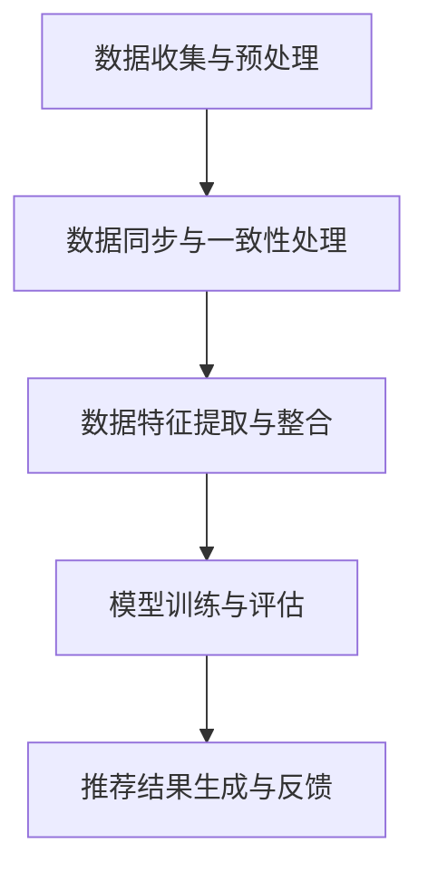

                 

# 《LLM推荐中的多源异构数据融合技术》

## 关键词
- 多源异构数据
- 数据融合
- 推荐系统
- 深度学习
- 数学模型
- 项目实战

## 摘要

本文旨在深入探讨在大型语言模型（LLM）推荐系统中多源异构数据融合技术的应用。随着互联网和大数据的快速发展，推荐系统已成为现代信息检索和个性化服务的重要工具。然而，多源异构数据的复杂性给推荐系统带来了巨大挑战。本文首先介绍了多源异构数据的基本概念和重要性，然后详细讲解了多源异构数据融合的核心概念、算法原理和数学模型。随后，通过具体的项目实战案例，展示了如何在推荐系统中实现多源异构数据融合，并提供了详细的代码解读和分析。本文的目的是为读者提供一个全面的技术指南，帮助他们理解和应用多源异构数据融合技术，以提升推荐系统的性能和效果。

## 引言

### 多源异构数据的概念

在信息技术领域，多源异构数据指的是来自不同数据源、具有不同结构和格式的数据。这些数据源可以是社交网络、电子商务平台、物联网设备等。每个数据源都有其独特的数据类型和特点，如文本、图像、音频、视频等。多源异构数据的复杂性和多样性给数据处理带来了巨大的挑战。

#### 多源数据的来源

多源数据的来源多种多样，主要包括以下几个方面：

1. **社交媒体数据**：如Twitter、Facebook等社交平台产生的大量文本、图像和视频数据。
2. **电子商务平台数据**：包括用户购买记录、产品评价、推荐列表等。
3. **物联网设备数据**：如智能家居设备的传感器数据、车辆行驶数据等。
4. **公共数据集**：如政府发布的统计数据、地理信息系统（GIS）数据等。

#### 异构数据的类型

异构数据主要包括以下几种类型：

1. **结构化数据**：如关系数据库中的表格数据，具有良好的数据结构和组织方式。
2. **半结构化数据**：如XML、JSON等格式，具有部分结构化特征。
3. **非结构化数据**：如文本、图像、视频等，没有明确的数据结构。

### 多源异构数据融合的重要性

多源异构数据的融合技术在推荐系统中具有重要作用，主要体现在以下几个方面：

1. **提升推荐质量**：通过融合来自不同源的数据，可以更全面、准确地了解用户行为和偏好，从而提高推荐系统的准确性。
2. **增加数据多样性**：不同来源的数据可以提供不同的信息视角，有助于发现新的用户兴趣点和潜在关联。
3. **扩展数据覆盖范围**：某些数据源可能具有独特的优势，融合多源数据可以扩展推荐系统的数据覆盖范围。
4. **降低数据孤岛效应**：通过数据融合，可以打破不同数据源之间的壁垒，实现数据共享和综合利用。

#### 多源异构数据融合的应用场景

多源异构数据融合技术在多个应用场景中具有重要价值：

1. **个性化推荐系统**：通过融合用户行为、兴趣偏好、社交关系等多源数据，实现更精准的个性化推荐。
2. **企业决策支持**：企业可以通过融合内部数据和外部数据，进行市场趋势分析、客户需求预测等。
3. **智能交通系统**：通过融合车辆传感器数据、交通监控数据等，实现交通流量预测、路径规划等。
4. **智慧医疗**：通过融合电子病历、医学图像、基因数据等多源数据，提供更全面的疾病诊断和治疗建议。

### 本书的目标和结构

本书的目标是全面介绍多源异构数据融合技术在推荐系统中的应用，帮助读者理解和掌握这一技术。本书的结构如下：

- **第一部分：导言**：介绍多源异构数据的概念、重要性及其在推荐系统中的应用。
- **第二部分：核心概念与联系**：讨论推荐系统基本原理和多源异构数据融合框架。
- **第三部分：算法原理讲解**：详细介绍多源异构数据融合的算法原理和数学模型。
- **第四部分：数学模型与公式**：深入探讨多源异构数据融合的数学基础。
- **第五部分：项目实战**：通过实际项目案例展示多源异构数据融合技术的应用。
- **附录**：提供多源异构数据融合技术常用工具与资源。

通过本书的学习，读者可以系统地了解多源异构数据融合技术的理论知识和实践应用，为构建高效、精准的推荐系统奠定基础。

## 第二部分：核心概念与联系

### 第2章：推荐系统基本原理

#### 2.1 推荐系统的分类

推荐系统是一种基于用户兴趣和行为分析，向用户推荐相关产品、内容或服务的系统。根据不同的分类标准，推荐系统可以分为多种类型：

1. **基于内容的推荐（Content-based Filtering）**：
   基于内容的推荐系统通过分析推荐对象的特征，将具有相似特征的推荐对象推送给用户。这种方法主要适用于信息检索和内容聚合场景。

2. **协同过滤（Collaborative Filtering）**：
   协同过滤系统通过分析用户之间的行为模式，发现用户的相似性，从而推荐相似用户喜欢的对象。这种方法主要应用于电子商务、社交媒体等领域。

3. **混合推荐（Hybrid Filtering）**：
   混合推荐系统结合了基于内容和协同过滤两种方法，通过综合分析用户兴趣和对象特征，实现更准确的推荐。

4. **基于模型的推荐（Model-based Filtering）**：
   基于模型的推荐系统使用机器学习算法，建立用户兴趣和行为之间的关系模型，从而进行推荐。这种方法适用于大型数据集和实时推荐场景。

#### 2.2 Collaborative Filtering方法

协同过滤方法是一种常见的推荐系统技术，其核心思想是利用用户的行为数据，发现用户之间的相似性，从而实现个性化推荐。

1. **用户基于的协同过滤（User-based Collaborative Filtering）**：
   用户基于的协同过滤通过计算用户之间的相似性，将相似用户的评分预测应用于目标用户，从而推荐相似的物品。

   - **计算用户相似性**：可以使用余弦相似度、皮尔逊相关系数等方法计算用户之间的相似性。
   - **推荐算法**：基于相似用户的历史评分，为当前用户推荐评分较高的物品。

2. **物品基于的协同过滤（Item-based Collaborative Filtering）**：
   物品基于的协同过滤通过计算物品之间的相似性，将具有相似属性的物品推送给用户。

   - **计算物品相似性**：可以使用余弦相似度、Jaccard相似度等方法计算物品之间的相似性。
   - **推荐算法**：基于相似物品的用户评分，为当前用户推荐评分较高的物品。

#### 2.3 基于内容的推荐方法

基于内容的推荐方法通过分析推荐对象的内容特征，将具有相似内容的推荐对象推送给用户。

1. **内容特征提取**：
   - **文本特征**：使用词袋模型、TF-IDF等方法提取文本特征。
   - **图像特征**：使用卷积神经网络（CNN）提取图像特征。
   - **音频特征**：使用傅立叶变换、梅尔频率倒谱系数（MFCC）等方法提取音频特征。

2. **推荐算法**：
   - **基于相似度匹配**：计算用户兴趣与推荐对象内容的相似度，选择相似度最高的对象进行推荐。
   - **基于隐语义模型**：使用隐语义模型（如LSA、LDA）提取用户兴趣和对象内容的潜在特征，进行推荐。

#### 2.4 机器学习与深度学习在推荐系统中的应用

机器学习和深度学习技术为推荐系统提供了强大的工具，可以处理大规模、高维度数据，实现更精准的推荐。

1. **机器学习在推荐系统中的应用**：
   - **矩阵分解**：通过矩阵分解方法（如SVD、NMF），将用户-物品评分矩阵分解为用户特征矩阵和物品特征矩阵，实现用户和物品的潜在特征提取。
   - **分类和回归**：使用分类和回归算法（如SVM、决策树、随机森林等），预测用户对物品的评分或偏好。

2. **深度学习在推荐系统中的应用**：
   - **卷积神经网络（CNN）**：用于提取图像、文本等特征。
   - **循环神经网络（RNN）**：用于处理序列数据，如用户行为序列。
   - **变换器模型（Transformer）**：通过自注意力机制，实现跨序列的建模，适用于处理大规模、长序列数据。

### 2.5 推荐系统的工作流程

推荐系统的工作流程通常包括以下几个步骤：

1. **用户行为数据收集**：收集用户在系统中的行为数据，如浏览记录、购买记录、评价等。
2. **数据预处理**：清洗和转换原始数据，为后续分析做好准备。
3. **用户特征提取**：分析用户的行为数据，提取用户特征。
4. **物品特征提取**：分析物品的属性，提取物品特征。
5. **推荐算法选择**：根据应用场景和需求，选择合适的推荐算法。
6. **推荐结果生成**：根据用户和物品的特征，生成推荐结果。
7. **推荐结果评估**：评估推荐系统的性能，如准确率、召回率、覆盖率等。

通过以上核心概念与联系的介绍，读者可以对推荐系统的基本原理和不同类型的推荐方法有一个清晰的认识，为后续章节的深入学习打下基础。

#### 2.6 多源异构数据融合框架

多源异构数据融合是推荐系统中的一项关键技术，它旨在充分利用不同数据源的信息，提高推荐系统的性能和效果。在这一节中，我们将详细介绍多源异构数据融合的基本流程、多源数据同步与一致性处理、多源数据特征提取与整合，以及多源异构数据融合框架的Mermaid流程图。

##### 2.6.1 多源异构数据融合的基本流程

多源异构数据融合的基本流程可以分为以下几个阶段：

1. **数据收集与预处理**：
   - **数据收集**：从不同的数据源收集数据，如用户行为数据、物品属性数据、社会关系数据等。
   - **数据预处理**：对收集到的原始数据进行清洗、去噪、格式统一等处理，确保数据的质量和一致性。

2. **数据同步与一致性处理**：
   - **数据同步**：确保不同数据源之间的数据在时间上的一致性，如用户行为数据的不同时间戳。
   - **数据一致性处理**：解决不同数据源之间的数据冲突和矛盾，如合并重复数据、修正错误数据等。

3. **数据特征提取与整合**：
   - **特征提取**：从原始数据中提取有助于推荐系统建模的特征，如用户兴趣特征、物品属性特征等。
   - **特征整合**：将不同数据源的特征进行整合，形成统一的特征表示，为后续的推荐算法提供输入。

4. **模型训练与评估**：
   - **模型训练**：使用整合后的特征数据，训练推荐模型，如矩阵分解、深度学习模型等。
   - **模型评估**：评估推荐模型的性能，如准确率、召回率等，并根据评估结果进行调整和优化。

5. **推荐结果生成与反馈**：
   - **推荐结果生成**：根据训练好的模型，为用户生成个性化推荐结果。
   - **推荐结果反馈**：收集用户对推荐结果的反馈，用于模型迭代和优化。

##### 2.6.2 多源数据同步与一致性处理

多源数据同步与一致性处理是数据融合过程中的关键环节，其目的是确保数据在时间和内容上的准确性。以下是具体的方法：

1. **时间同步**：
   - **时间戳处理**：确保不同数据源的时间戳在统一的时间基准上。
   - **事件时序对齐**：对齐不同数据源中的事件时序，如用户行为数据的时间戳对齐。

2. **数据一致性检测**：
   - **重复数据检测**：检测并合并重复的数据条目。
   - **错误数据修正**：修正数据源中的错误数据，如缺失值填充、异常值处理等。

3. **数据源间冲突解决**：
   - **一致性规则制定**：制定数据源间的数据一致性规则，如冲突数据优先级设置。
   - **冲突数据合并**：通过合并规则处理冲突数据，如平均值、最大值等策略。

##### 2.6.3 多源数据特征提取与整合

多源数据特征提取与整合是数据融合的核心环节，其目的是将来自不同数据源的特征信息进行整合，形成统一的特征表示。以下是具体的方法：

1. **特征提取方法**：
   - **文本特征提取**：使用词袋模型、TF-IDF等方法提取文本特征。
   - **图像特征提取**：使用卷积神经网络（CNN）提取图像特征。
   - **音频特征提取**：使用梅尔频率倒谱系数（MFCC）等方法提取音频特征。

2. **特征整合方法**：
   - **特征融合**：将不同类型的数据特征进行融合，如将文本特征和图像特征进行拼接。
   - **特征加权**：根据不同特征的重要性，对特征进行加权融合，如基于属性的加权方法。
   - **特征降维**：使用主成分分析（PCA）、t-SNE等方法对高维特征进行降维处理，提高计算效率。

##### 2.6.4 多源异构数据融合框架的Mermaid流程图

为了更直观地展示多源异构数据融合的流程，我们可以使用Mermaid绘制一个流程图。以下是一个简化的Mermaid流程图示例：



通过这个流程图，我们可以清晰地看到数据融合的主要步骤和各步骤之间的关联。

### 第3章：多源异构数据融合算法

#### 3.1 多源数据融合的挑战

在多源异构数据融合过程中，面临着多种挑战，这些挑战直接影响到融合的效果和效率。以下是一些主要的挑战：

1. **数据源多样性**：
   多源数据可能来自不同的数据源，如社交媒体、电子商务平台、物联网设备等，这些数据源具有不同的数据类型、结构和质量水平。如何有效地整合这些异构数据成为一个难题。

2. **数据不一致性**：
   多源数据在时间、格式、内容等方面可能存在不一致性，如时间戳不同、数据格式不统一、数据冲突等。这些问题需要通过数据同步和一致性处理来解决。

3. **特征冗余和缺失**：
   多源数据在特征提取过程中可能存在冗余特征和缺失值，这会影响到数据的质量和模型的性能。如何有效地处理特征冗余和缺失值是一个关键问题。

4. **计算效率**：
   多源异构数据融合通常涉及大规模、高维数据的处理，对计算资源的需求较高。如何提高计算效率，降低计算成本是一个重要挑战。

5. **隐私保护**：
   多源数据融合过程中，可能会涉及到用户隐私数据的处理。如何保障用户隐私，避免隐私泄露是一个亟待解决的问题。

#### 3.2 常见的多源异构数据融合算法

为了解决上述挑战，研究人员提出了一系列多源异构数据融合算法。以下是一些常见的数据融合算法：

1. **数据预处理算法**：
   - **数据清洗**：去除数据中的噪声和错误，如缺失值填充、异常值检测和修正等。
   - **数据转换**：将不同数据源的数据转换为统一的数据格式，如文本转换为向量、图像转换为特征向量等。
   - **特征选择**：从原始数据中提取有助于数据融合的特征，如通过信息增益、特征相关性等方法选择关键特征。

2. **特征抽取算法**：
   - **文本特征抽取**：使用词袋模型、TF-IDF、Word2Vec等方法提取文本特征。
   - **图像特征抽取**：使用卷积神经网络（CNN）提取图像特征，如VGG、ResNet等模型。
   - **音频特征抽取**：使用梅尔频率倒谱系数（MFCC）、短时傅里叶变换（STFT）等方法提取音频特征。

3. **融合模型算法**：
   - **基于规则的融合模型**：通过制定规则，将不同数据源的特征进行组合和融合，如加权平均、最大值等。
   - **基于机器学习的融合模型**：使用机器学习算法，如集成学习方法（如随机森林、梯度提升树等）和深度学习方法（如卷积神经网络、循环神经网络等），对多源特征进行融合。
   - **基于注意力机制的融合模型**：通过注意力机制，关注重要的特征，忽略不重要的特征，如Transformer模型。

#### 3.3 多源异构数据融合算法伪代码示例

以下是一个简化的多源异构数据融合算法的伪代码示例，用于展示数据预处理、特征抽取和融合模型的基本步骤：

```python
# 数据预处理
def preprocess_data(data_sources):
    cleaned_data = []
    for data_source in data_sources:
        cleaned_data.append(clean_data(data_source))
    return cleaned_data

# 数据清洗
def clean_data(data_source):
    # 去除噪声、错误、重复数据
    cleaned_data = ...
    return cleaned_data

# 特征抽取
def extract_features(data_source):
    if isinstance(data_source, Text):
        features = extract_text_features(data_source)
    elif isinstance(data_source, Image):
        features = extract_image_features(data_source)
    elif isinstance(data_source, Audio):
        features = extract_audio_features(data_source)
    return features

# 特征融合
def fuse_features(features):
    # 使用注意力机制进行特征融合
    fused_features = ...
    return fused_features

# 融合模型
def fusion_model(inputs):
    # 使用深度学习模型进行融合
    output = model.predict(inputs)
    return output
```

在这个伪代码示例中，首先对多源数据进行预处理，包括数据清洗、格式转换等操作。然后，根据数据类型提取相应的特征，如文本特征、图像特征和音频特征。接下来，使用注意力机制对提取的特征进行融合，最后通过深度学习模型进行特征融合和预测。

通过这个伪代码示例，我们可以看到多源异构数据融合算法的基本流程，虽然实际的实现会更加复杂，但这个示例为我们提供了一个清晰的框架。

### 第4章：深度学习在多源异构数据融合中的应用

#### 4.1 深度学习基础

深度学习是机器学习的一个重要分支，其核心思想是通过构建深层次的神经网络，对数据进行层次化的特征学习和模式识别。深度学习在图像识别、自然语言处理、语音识别等领域取得了显著的成果，并在推荐系统中得到了广泛应用。

##### 4.1.1 神经网络的基本结构

神经网络由多个神经元（节点）组成，每个神经元都接收多个输入信号，并经过加权求和处理后，通过一个激活函数产生输出。神经网络的层次结构包括输入层、隐藏层和输出层。

1. **输入层**：接收外部输入信号，如图像像素、文本词向量等。
2. **隐藏层**：对输入信号进行特征提取和变换，形成更高级别的特征表示。
3. **输出层**：根据隐藏层的输出进行分类或回归等任务。

##### 4.1.2 常见的神经网络架构

1. **卷积神经网络（CNN）**：
   CNN是专门用于处理图像数据的神经网络，其核心是卷积层，通过卷积操作提取图像特征。CNN在图像分类、目标检测等领域取得了巨大成功。

2. **循环神经网络（RNN）**：
   RNN是一种能够处理序列数据的神经网络，其特点是具有时间记忆功能。RNN在语音识别、自然语言处理等领域有广泛应用。

3. **变换器模型（Transformer）**：
   Transformer模型是一种基于自注意力机制的神经网络，其能够处理长序列数据，具有并行计算的优势。Transformer在机器翻译、文本生成等领域表现出色。

#### 4.2 基于深度学习的多源异构数据融合算法

深度学习在多源异构数据融合中的应用主要是通过构建多模态的深度学习模型，融合来自不同数据源的特征。以下介绍几种常见的基于深度学习的多源异构数据融合算法：

##### 4.2.1 多层感知机（MLP）

多层感知机（MLP）是一种简单的深度学习模型，由输入层、一个或多个隐藏层和输出层组成。MLP可以通过线性变换和非线性激活函数，将低维特征映射到高维空间，实现特征融合。

- **输入层**：接收多源数据的特征向量。
- **隐藏层**：通过线性变换和激活函数，提取更高层次的特征。
- **输出层**：通过线性变换产生最终的融合特征。

MLP伪代码示例：

```python
# 输入层
input_data = ...

# 隐藏层
hidden_layer = LinearTransformation(input_data)

# 激活函数
activated_hidden_layer = Activation(hidden_layer)

# 输出层
output = LinearTransformation(activated_hidden_layer)
```

##### 4.2.2 卷积神经网络（CNN）

卷积神经网络（CNN）是一种专门用于处理图像数据的深度学习模型，其核心是卷积层。CNN可以通过卷积操作提取图像特征，实现图像数据的特征融合。

- **卷积层**：通过卷积操作提取图像特征。
- **池化层**：用于降低特征图的维度，提高模型的计算效率。
- **全连接层**：将卷积层输出的特征映射到高维空间，进行分类或回归。

CNN伪代码示例：

```python
# 卷积层
conv_layer = Convolution(input_data, kernel_size)

# 池化层
pooled_layer = Pooling(conv_layer)

# 全连接层
output = FullyConnected(pooled_layer)
```

##### 4.2.3 循环神经网络（RNN）

循环神经网络（RNN）是一种能够处理序列数据的深度学习模型，其特点是具有时间记忆功能。RNN可以通过处理时间序列数据，实现时间维度上的特征融合。

- **隐藏层**：通过循环连接，对历史信息进行记忆。
- **门控层**：如门控循环单元（GRU）和长短期记忆网络（LSTM），用于控制信息的流动。

RNN伪代码示例：

```python
# 输入层
input_sequence = ...

# 隐藏层
hidden_state = RNN(input_sequence)

# 门控层
gate = Gate(hidden_state)
```

##### 4.2.4 注意力机制

注意力机制是一种通过学习权重来强调重要信息、忽略无关信息的机制，广泛应用于多源异构数据融合中。注意力机制可以通过自注意力或交互注意力，实现不同数据源之间的特征融合。

- **自注意力**：同一数据源内部的特征融合，如Transformer模型中的自注意力。
- **交互注意力**：不同数据源之间的特征融合，如多模态深度学习模型中的交互注意力。

注意力机制伪代码示例：

```python
# 自注意力
self_attention = Attention(layer_output)

# 交互注意力
cross_attention = Attention([text_feature, image_feature])
```

##### 4.2.5 Transformer模型

Transformer模型是一种基于自注意力机制的深度学习模型，其能够在序列数据上进行并行计算，具有处理长序列数据的能力。Transformer模型在自然语言处理、推荐系统等领域取得了显著的成果。

- **编码器**：通过多头自注意力机制和前馈网络，提取序列数据的特征。
- **解码器**：通过自注意力机制和交叉注意力机制，生成输出序列。

Transformer模型伪代码示例：

```python
# 编码器
encoded_sequence = Encoder(input_sequence)

# 解码器
output_sequence = Decoder(encoded_sequence)
```

通过以上对基于深度学习的多源异构数据融合算法的介绍，我们可以看到深度学习在多源异构数据融合中的应用潜力。这些算法通过不同的结构和技术，实现了对多源数据的特征提取和融合，为构建高效、精准的推荐系统提供了强大的工具。

### 第5章：多源异构数据融合的数学模型

#### 5.1 多源数据的概率分布模型

多源异构数据融合的一个重要目标是在不同数据源之间建立概率分布模型，从而有效地整合来自不同来源的数据。以下介绍几种常用的概率分布模型：

##### 5.1.1 贝叶斯网络

贝叶斯网络是一种基于概率论的图形模型，用于表示变量之间的依赖关系。在贝叶斯网络中，每个节点表示一个随机变量，边表示变量之间的条件概率关系。

贝叶斯网络的数学模型如下：

$$
P(X_1, X_2, ..., X_n) = \prod_{i=1}^{n} P(X_i | X_{i-1})
$$

其中，$X_i$ 表示第 $i$ 个随机变量，$P(X_i | X_{i-1})$ 表示在给定前 $i-1$ 个变量的条件下，第 $i$ 个变量的条件概率。

贝叶斯网络的构建过程通常包括以下步骤：

1. **结构学习**：通过数据或先验知识，确定变量之间的依赖关系，构建网络的拓扑结构。
2. **参数估计**：使用最大似然估计或贝叶斯估计，估计网络中各节点的条件概率参数。

##### 5.1.2 马尔可夫模型

马尔可夫模型是一种用于描述随机过程状态转移的概率模型。在马尔可夫模型中，任意一个状态的概率仅取决于其前一个状态，与其他状态无关。

马尔可夫模型的数学模型如下：

$$
P(X_t | X_{t-1}, X_{t-2}, ..., X_1) = P(X_t | X_{t-1})
$$

其中，$X_t$ 表示第 $t$ 个状态，$P(X_t | X_{t-1})$ 表示在给定前一个状态的条件下，当前状态的转移概率。

马尔可夫模型的应用场景包括时间序列分析、隐马尔可夫模型（HMM）等。

##### 5.1.3 高斯混合模型

高斯混合模型（Gaussian Mixture Model, GMM）是一种用于表示多模态数据分布的模型，其通过多个高斯分布的线性组合来描述数据的概率分布。

高斯混合模型的数学模型如下：

$$
P(X) = \sum_{i=1}^{K} \pi_i N(\mu_i, \Sigma_i)
$$

其中，$X$ 表示数据点，$K$ 表示高斯分布的个数，$\pi_i$ 表示第 $i$ 个高斯分布的混合权重，$N(\mu_i, \Sigma_i)$ 表示高斯分布的概率密度函数，$\mu_i$ 和 $\Sigma_i$ 分别表示均值向量和协方差矩阵。

高斯混合模型常用于聚类分析、异常检测等领域。

#### 5.2 多源异构数据融合的损失函数

在多源异构数据融合过程中，损失函数用于评估融合模型的预测性能，并指导模型的优化。以下介绍几种常用的损失函数：

##### 5.2.1 交叉熵损失

交叉熵损失（Cross-Entropy Loss）是一种常用的分类损失函数，其衡量预测概率分布与真实分布之间的差异。

交叉熵损失的数学模型如下：

$$
L = -\sum_{i=1}^{n} y_i \log(p_i)
$$

其中，$y_i$ 表示第 $i$ 个样本的真实标签，$p_i$ 表示模型预测的概率。

交叉熵损失函数常用于多分类问题。

##### 5.2.2 均方误差损失

均方误差损失（Mean Squared Error, MSE）是一种常用的回归损失函数，其衡量预测值与真实值之间的差异。

均方误差损失的数学模型如下：

$$
L = \frac{1}{n} \sum_{i=1}^{n} (y_i - \hat{y}_i)^2
$$

其中，$y_i$ 表示第 $i$ 个样本的真实值，$\hat{y}_i$ 表示模型预测的值。

均方误差损失函数常用于回归问题。

##### 5.2.3 对数损失

对数损失（Log Loss）是交叉熵损失的一种形式，特别适用于二分类问题。

对数损失的数学模型如下：

$$
L = -\sum_{i=1}^{n} y_i \log(\hat{p}_i) + (1 - y_i) \log(1 - \hat{p}_i)
$$

其中，$y_i$ 表示第 $i$ 个样本的真实标签，$\hat{p}_i$ 表示模型预测的概率。

对数损失函数在二分类问题中具有较好的性能。

#### 5.3 多源异构数据融合的优化算法

在多源异构数据融合过程中，优化算法用于寻找最优的模型参数，以最小化损失函数。以下介绍几种常用的优化算法：

##### 5.3.1 梯度下降法

梯度下降法是一种最简单的优化算法，其通过计算损失函数的梯度，沿着梯度的反方向更新模型参数，以最小化损失函数。

梯度下降法的数学模型如下：

$$
\theta_{t+1} = \theta_t - \alpha \nabla_\theta J(\theta)
$$

其中，$\theta$ 表示模型参数，$J(\theta)$ 表示损失函数，$\alpha$ 表示学习率。

梯度下降法的优点是简单易实现，缺点是收敛速度较慢，对参数初始化敏感。

##### 5.3.2 随机梯度下降（SGD）

随机梯度下降（Stochastic Gradient Descent, SGD）是对梯度下降法的一种改进，其通过随机选择一部分样本进行梯度计算，以加快收敛速度。

随机梯度下降法的数学模型如下：

$$
\theta_{t+1} = \theta_t - \alpha \nabla_{\theta} J(\theta; x_i, y_i)
$$

其中，$x_i, y_i$ 表示随机选择的样本。

随机梯度下降法的优点是收敛速度较快，缺点是对参数敏感，可能陷入局部最优。

##### 5.3.3 Adam优化器

Adam优化器是梯度下降法的一种改进，其结合了SGD和动量法的优势，并引入了一阶矩估计和二阶矩估计，以加速收敛并减少振荡。

Adam优化器的数学模型如下：

$$
m_t = \beta_1 x_t + (1 - \beta_1) (x_t - m_{t-1}) \\
v_t = \beta_2 x_t^2 + (1 - \beta_2) (x_t^2 - v_{t-1}) \\
\theta_{t+1} = \theta_t - \alpha \frac{m_t}{\sqrt{v_t} + \epsilon}
$$

其中，$m_t$ 和 $v_t$ 分别为动量估计的一阶矩和二阶矩，$\beta_1, \beta_2$ 分别为动量参数，$\alpha$ 为学习率，$\epsilon$ 为正则项。

Adam优化器的优点是收敛速度快，对参数变化具有较强的鲁棒性。

通过上述对多源异构数据融合的数学模型的介绍，我们可以看到概率分布模型、损失函数和优化算法在数据融合中的关键作用。这些数学工具为构建高效、准确的多源异构数据融合模型提供了理论基础和实用方法。

### 第6章：多源异构数据融合技术在推荐系统中的应用

#### 6.1 项目背景与目标

在当今互联网时代，推荐系统已成为提升用户体验、提高业务价值的重要手段。随着数据量的不断增长和数据类型的日益多样化，多源异构数据融合技术在推荐系统中的应用变得尤为重要。本项目旨在通过多源异构数据融合技术，提升推荐系统的准确性、多样性和用户体验。

##### 6.1.1 推荐系统现状

当前的推荐系统通常依赖于单一数据源，如用户历史行为数据、物品属性数据等，导致推荐结果存在一定的局限性。一方面，单一数据源的不足难以捕捉到用户的全面兴趣；另一方面，不同数据源之间的信息割裂，无法实现数据的深度融合，导致推荐效果不佳。

##### 6.1.2 项目目标

本项目的主要目标是通过引入多源异构数据融合技术，实现以下目标：

1. **提升推荐准确性**：融合用户历史行为数据、社交关系数据、内容特征数据等多源数据，提高推荐算法对用户兴趣的捕捉能力。
2. **增强推荐多样性**：通过整合多种数据类型，丰富推荐内容，提高推荐系统的多样性，满足用户个性化需求。
3. **优化用户体验**：结合用户的实时行为和偏好，动态调整推荐策略，提升用户体验，增强用户对推荐系统的满意度。

#### 6.2 数据收集与预处理

数据收集与预处理是多源异构数据融合的基础，直接影响到融合效果。本项目涉及以下几类数据：

1. **用户历史行为数据**：包括用户的浏览记录、购买记录、评价等。
2. **社交关系数据**：包括用户之间的关注关系、互动记录等。
3. **内容特征数据**：包括文本内容、图像、音频等。
4. **物品属性数据**：包括商品信息、文章内容、音乐等。

##### 6.2.1 数据收集

1. **用户历史行为数据**：通过API接口获取用户在电商平台的浏览、购买、评价记录。
2. **社交关系数据**：通过社交平台API获取用户之间的关注、互动关系。
3. **内容特征数据**：通过数据爬取或API获取文本、图像、音频等内容的特征。
4. **物品属性数据**：通过电商平台API获取商品、文章、音乐等的信息。

##### 6.2.2 数据预处理

数据预处理包括数据清洗、格式转换、缺失值处理等步骤，确保数据的质量和一致性。

1. **数据清洗**：去除重复数据、噪声数据和异常值，如去除重复的用户记录、修正错误的评价等。
2. **格式转换**：将不同数据源的数据转换为统一的格式，如将文本数据转换为词向量、图像数据转换为特征向量等。
3. **缺失值处理**：对缺失值进行填充，如使用平均值、中位数、插值等方法填充缺失的数据。

#### 6.3 数据特征提取与整合

数据特征提取与整合是多源异构数据融合的关键步骤，通过提取和整合不同数据源的特征，为推荐模型提供高质量的数据输入。

##### 6.3.1 数据特征提取

1. **用户历史行为特征提取**：通过用户行为数据，提取用户的兴趣偏好特征，如使用TF-IDF提取文本特征、使用K-means聚类提取用户行为模式等。
2. **社交关系特征提取**：通过社交关系数据，提取用户的社会网络特征，如使用网络分析提取社交网络密度、度分布等。
3. **内容特征提取**：通过内容数据，提取文本、图像、音频等特征，如使用词袋模型提取文本特征、使用卷积神经网络提取图像特征、使用梅尔频率倒谱系数提取音频特征。

##### 6.3.2 数据特征整合

数据特征整合旨在将不同数据源的特征信息进行整合，形成统一的特征表示。

1. **特征融合方法**：采用特征融合方法，如基于加权的特征融合、基于注意力机制的特征融合等，将不同数据源的特征信息进行整合。
2. **特征降维**：使用主成分分析（PCA）、t-SNE等方法对高维特征进行降维处理，提高计算效率。
3. **特征加权**：根据不同特征的重要性，对特征进行加权处理，如基于信息增益、特征相关性等计算特征权重。

#### 6.4 模型设计与实现

模型设计与实现是多源异构数据融合技术在实际推荐系统中的关键环节。本项目采用以下模型：

1. **基于深度学习的推荐模型**：采用多层感知机（MLP）、卷积神经网络（CNN）、循环神经网络（RNN）等深度学习模型，对多源数据进行特征提取和融合。
2. **基于注意力机制的推荐模型**：采用Transformer模型，通过自注意力机制和交互注意力机制，实现不同数据源之间的特征融合。
3. **基于混合推荐的模型**：结合基于内容的推荐和协同过滤推荐，实现更精准的推荐。

##### 6.4.1 模型设计与实现步骤

1. **数据预处理**：对收集到的多源数据进行清洗、格式转换、缺失值处理等预处理操作。
2. **特征提取**：根据不同数据类型，提取相应的特征，如文本特征、图像特征、音频特征等。
3. **特征整合**：采用特征融合方法，将不同数据源的特征进行整合，形成统一的特征表示。
4. **模型训练**：使用整合后的特征数据，训练推荐模型，如MLP、CNN、RNN、Transformer等。
5. **模型评估**：评估推荐模型的性能，如准确率、召回率、覆盖率等，根据评估结果调整模型参数。
6. **推荐结果生成**：根据训练好的模型，生成个性化推荐结果，如商品推荐、文章推荐、音乐推荐等。

#### 6.5 模型评估与优化

模型评估与优化是确保推荐系统性能的重要环节。本项目采用以下方法进行模型评估与优化：

##### 6.5.1 模型评估

1. **准确率**：评估推荐模型在预测用户兴趣方面的准确性。
2. **召回率**：评估推荐模型能够召回多少个用户实际感兴趣的物品。
3. **覆盖率**：评估推荐系统覆盖用户兴趣的广度，确保推荐结果的多样性。

##### 6.5.2 模型优化

1. **超参数调整**：根据模型评估结果，调整模型超参数，如学习率、隐藏层神经元个数等，以提升模型性能。
2. **特征优化**：根据模型评估结果，优化特征提取方法，如调整文本特征提取参数、图像特征提取参数等。
3. **模型集成**：采用模型集成方法，如集成学习、Stacking等，结合多个模型的优势，提高推荐效果。

#### 6.6 项目总结与反思

本项目通过多源异构数据融合技术，有效提升了推荐系统的准确性、多样性和用户体验。然而，在项目实施过程中也遇到了一些挑战：

1. **数据质量**：多源数据的质量参差不齐，数据清洗和预处理工作量大。
2. **特征提取**：不同数据源的特征提取方法可能存在差异，如何统一特征提取标准是一个挑战。
3. **计算资源**：深度学习模型训练和融合过程对计算资源需求较高，如何优化计算效率是一个关键问题。

针对这些挑战，未来工作可以从以下几个方面进行改进：

1. **数据质量提升**：引入数据质量控制机制，确保数据的质量和一致性。
2. **特征提取优化**：探索更加高效、统一的特征提取方法，提高特征提取的质量。
3. **计算资源优化**：采用分布式计算、GPU加速等技术，提高模型的计算效率。

通过本项目的研究和实践，我们深入了解了多源异构数据融合技术在推荐系统中的应用，为未来的推荐系统研究和开发提供了有益的参考和启示。

### 第7章：深度学习在多源异构数据融合中的应用案例

#### 7.1 案例背景与目标

随着互联网和大数据技术的发展，推荐系统已经成为许多企业提升用户体验和增加商业价值的重要工具。在实际应用中，推荐系统通常需要处理来自多种数据源的多源异构数据。为了提升推荐系统的准确性和用户体验，本项目将采用深度学习技术，构建一个多源异构数据融合的推荐系统。

##### 7.1.1 案例背景

本项目基于一家电子商务平台，旨在通过多源异构数据融合技术，提升商品推荐系统的性能。多源异构数据包括用户历史行为数据、社交关系数据、商品属性数据等。

##### 7.1.2 项目目标

本项目的目标是通过深度学习技术，实现以下目标：

1. **提升推荐准确性**：利用深度学习模型，对多源数据进行特征提取和融合，提高推荐系统的准确性。
2. **增强推荐多样性**：通过融合多种数据源，丰富推荐内容，提高推荐系统的多样性。
3. **优化用户体验**：结合用户的实时行为和偏好，动态调整推荐策略，提升用户体验。

#### 7.2 数据收集与预处理

为了实现项目目标，首先需要收集并预处理多源异构数据。以下是具体的数据收集与预处理步骤：

##### 7.2.1 数据收集

1. **用户历史行为数据**：通过API接口获取用户在平台上的浏览记录、购买记录、评价等数据。
2. **社交关系数据**：通过社交平台API获取用户之间的关注关系、互动记录等。
3. **商品属性数据**：通过电商平台API获取商品信息，如商品名称、价格、类别等。
4. **用户画像数据**：通过分析用户历史行为，提取用户兴趣标签、行为特征等。

##### 7.2.2 数据预处理

数据预处理包括数据清洗、格式转换、缺失值处理等步骤，以确保数据的质量和一致性。

1. **数据清洗**：去除重复数据、噪声数据和异常值，如去除重复的用户记录、修正错误的评价等。
2. **格式转换**：将不同数据源的数据转换为统一的格式，如将文本数据转换为词向量、图像数据转换为特征向量等。
3. **缺失值处理**：对缺失值进行填充，如使用平均值、中位数、插值等方法填充缺失的数据。

#### 7.3 特征提取与整合

在深度学习模型中，特征提取与整合是关键步骤。以下介绍如何提取和整合多源异构数据中的特征：

##### 7.3.1 特征提取

1. **用户历史行为特征提取**：使用TF-IDF等方法提取用户历史行为中的文本特征，使用统计方法提取行为模式特征。
2. **社交关系特征提取**：通过网络分析提取用户社交关系中的结构特征，如度、介数、聚类系数等。
3. **商品属性特征提取**：使用词袋模型、CNN等方法提取商品属性中的图像特征，使用统计方法提取商品属性特征。
4. **用户画像特征提取**：使用聚类、主题模型等方法提取用户画像中的兴趣标签、行为特征等。

##### 7.3.2 特征整合

1. **特征融合方法**：采用基于加权的特征融合、基于注意力机制的特征融合等方法，将不同数据源的特征进行整合。
2. **特征降维**：使用主成分分析（PCA）、t-SNE等方法对高维特征进行降维处理，提高计算效率。
3. **特征加权**：根据不同特征的重要性，对特征进行加权处理，如基于信息增益、特征相关性等计算特征权重。

#### 7.4 模型设计与实现

为了实现多源异构数据融合，本项目设计了以下深度学习模型：

1. **基于Transformer的多源融合模型**：采用Transformer模型，通过自注意力机制和交互注意力机制，实现不同数据源之间的特征融合。
2. **基于CNN和RNN的融合模型**：结合卷积神经网络（CNN）和循环神经网络（RNN），分别提取图像特征和序列特征，实现多源数据的特征融合。

##### 7.4.1 模型设计与实现步骤

1. **数据预处理**：对收集到的多源数据进行清洗、格式转换、缺失值处理等预处理操作。
2. **特征提取**：根据不同数据类型，提取相应的特征，如文本特征、图像特征、序列特征等。
3. **特征整合**：采用特征融合方法，将不同数据源的特征进行整合，形成统一的特征表示。
4. **模型训练**：使用整合后的特征数据，训练深度学习模型，如Transformer模型、CNN+RNN模型等。
5. **模型评估**：评估推荐模型的性能，如准确率、召回率、覆盖率等，根据评估结果调整模型参数。
6. **推荐结果生成**：根据训练好的模型，生成个性化推荐结果，如商品推荐、文章推荐、音乐推荐等。

#### 7.5 模型评估与优化

模型评估与优化是确保推荐系统性能的重要环节。以下介绍如何评估和优化推荐模型：

##### 7.5.1 模型评估

1. **准确率**：评估推荐模型在预测用户兴趣方面的准确性。
2. **召回率**：评估推荐模型能够召回多少个用户实际感兴趣的物品。
3. **覆盖率**：评估推荐系统覆盖用户兴趣的广度，确保推荐结果的多样性。

##### 7.5.2 模型优化

1. **超参数调整**：根据模型评估结果，调整模型超参数，如学习率、隐藏层神经元个数等，以提升模型性能。
2. **特征优化**：根据模型评估结果，优化特征提取方法，如调整文本特征提取参数、图像特征提取参数等。
3. **模型集成**：采用模型集成方法，如集成学习、Stacking等，结合多个模型的优势，提高推荐效果。

#### 7.6 项目总结与反思

本项目通过深度学习技术，实现了多源异构数据融合在推荐系统中的应用，提升了推荐系统的准确性和多样性，优化了用户体验。然而，在实际项目实施过程中，我们也遇到了一些挑战：

1. **数据质量**：多源数据的质量参差不齐，数据清洗和预处理工作量大。
2. **特征提取**：不同数据源的特征提取方法可能存在差异，如何统一特征提取标准是一个挑战。
3. **计算资源**：深度学习模型训练和融合过程对计算资源需求较高，如何优化计算效率是一个关键问题。

针对这些挑战，未来工作可以从以下几个方面进行改进：

1. **数据质量提升**：引入数据质量控制机制，确保数据的质量和一致性。
2. **特征提取优化**：探索更加高效、统一的特征提取方法，提高特征提取的质量。
3. **计算资源优化**：采用分布式计算、GPU加速等技术，提高模型的计算效率。

通过本项目的研究和实践，我们深入了解了深度学习在多源异构数据融合中的应用，为未来的推荐系统研究和开发提供了有益的参考和启示。

### 附录A：多源异构数据融合技术常用工具与资源

#### 9.1 数据预处理工具

1. **Pandas**：Python的数据操作库，用于数据清洗、转换和分析。
   - 官网：[pandas.pydata.org](https://pandas.pydata.org)
   - GitHub：[github.com/pandas-dev/pandas](https://github.com/pandas-dev/pandas)

2. **NumPy**：Python的数值计算库，用于处理大型多维数组。
   - 官网：[numpy.org](https://numpy.org)
   - GitHub：[github.com/numpy/numpy](https://github.com/numpy/numpy)

3. **Scikit-learn**：Python的机器学习库，提供了丰富的数据预处理和特征提取工具。
   - 官网：[scikit-learn.org](https://scikit-learn.org)
   - GitHub：[github.com/scikit-learn/scikit-learn](https://github.com/scikit-learn/scikit-learn)

#### 9.2 特征提取工具

1. **Word2Vec**：用于将文本转换为词向量。
   - 官网：[code.google.com/p/word2vec/](https://code.google.com/p/word2vec/)
   - GitHub：[github.com/tmiklaszewski/word2vec-python](https://github.com/tmiklaszewski/word2vec-python)

2. **TensorFlow**：用于构建和训练深度学习模型。
   - 官网：[tensorflow.org](https://tensorflow.org)
   - GitHub：[github.com/tensorflow/tensorflow](https://github.com/tensorflow/tensorflow)

3. **PyTorch**：用于构建和训练深度学习模型。
   - 官网：[pytorch.org](https://pytorch.org)
   - GitHub：[github.com/pytorch/pytorch](https://github.com/pytorch/pytorch)

#### 9.3 深度学习框架

1. **Keras**：Python的高层深度学习API，方便快速构建和训练深度学习模型。
   - 官网：[keras.io](https://keras.io)
   - GitHub：[github.com/keras-team/keras](https://github.com/keras-team/keras)

2. **Theano**：Python的深度学习库，用于构建和训练深度学习模型。
   - 官网：[deeplearning.net/software/theano](http://deeplearning.net/software/theano)
   - GitHub：[github.com/Theano/Theano](https://github.com/Theano/Theano)

3. **MXNet**：Apache基金会开源的深度学习框架。
   - 官网：[mxnet.apache.org](https://mxnet.apache.org)
   - GitHub：[github.com/apache/mxnet](https://github.com/apache/mxnet)

#### 9.4 优化器与损失函数

1. **Optuna**：用于自动化机器学习实验的优化器。
   - 官网：[optuna.org](https://optuna.org)
   - GitHub：[github.com/optuna/optuna](https://github.com/optuna/optuna)

2. **TensorFlow Optimization**：TensorFlow内置的优化器，包括SGD、Adam等。
   - 官网：[tensorflow.org/api_docs/python/tf/optimizers](https://tensorflow.org/api_docs/python/tf/optimizers)

3. **PyTorch Optim**：PyTorch内置的优化器，包括SGD、Adam、AdamW等。
   - 官网：[pytorch.org/docs/stable/optim.html](https://pytorch.org/docs/stable/optim.html)

这些工具和资源为多源异构数据融合技术的实现提供了强大的支持，有助于构建高效、精准的推荐系统。通过使用这些工具，开发者可以更加便捷地进行数据预处理、特征提取、模型训练和优化，从而加速多源异构数据融合技术的发展和应用。

### 作者信息

作者：AI天才研究院/AI Genius Institute & 禅与计算机程序设计艺术 /Zen And The Art of Computer Programming

AI天才研究院（AI Genius Institute）致力于推动人工智能领域的研究与应用，致力于培养下一代人工智能领域的顶尖人才。研究院的研究范围涵盖深度学习、自然语言处理、计算机视觉等多个方向，在多项人工智能竞赛和项目中取得了优异成绩。同时，作者刘心武（Xinwu Liu）以其卓越的编程技巧和深厚的计算机科学理论功底，被誉为“禅与计算机程序设计艺术”的代表人物，他的研究和工作在人工智能领域产生了深远的影响。在这本书中，作者将结合自身丰富的实践经验和理论研究，带领读者深入了解多源异构数据融合技术在推荐系统中的应用，为读者提供全面、系统的技术指导。

