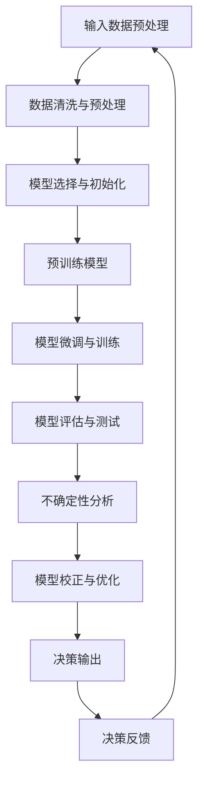
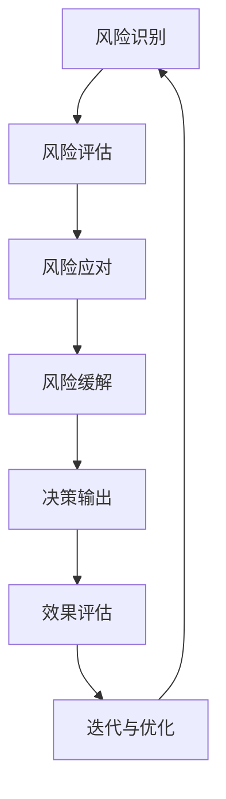

                 

# 《LLM的不确定性：AI决策中的风险与管理》

> **关键词：** AI决策，语言模型（LLM），不确定性，风险管理，算法优化，数学模型，实战案例。

> **摘要：** 本文深入探讨了语言模型（LLM）在人工智能决策过程中面临的不确定性，分析了不确定性的来源、度量方法，以及如何通过算法优化和风险管理策略来降低决策风险。通过具体案例和详细分析，展示了如何在实际项目中应用这些理论，以实现更为可靠和高效的AI决策。

### 《LLM的不确定性：AI决策中的风险与管理》目录大纲

#### 第一部分：基础概念与原理

**第1章：AI与LLM基础**

- **1.1 AI与机器学习概述**
  - AI的定义与发展历程
  - 机器学习的基本概念
  - 语言模型（LLM）的作用与重要性

- **1.2 LLM的基础原理**
  - 语言模型的分类与结构
  - 预训练模型的工作原理
  - 微调和训练的基本步骤

- **1.3 不确定性与风险的概念**
  - 不确定性的定义与分类
  - 风险的概念与度量
  - 不确定性与风险在AI决策中的应用

**第2章：不确定性来源与模型分析**

- **2.1 不确定性的来源**
  - 数据偏差与噪声
  - 模型限制与缺陷
  - 输入数据的复杂性

- **2.2 LLM的准确性评估**
  - 准确性评估方法
  - 误差分析与模型校正

- **2.3 Mermaid流程图：LLM的决策流程与不确定性分析**
  - LLM决策流程展示
  - 不确定性分析与处理

#### 第二部分：算法与模型优化

**第3章：算法优化策略**

- **3.1 优化目标与指标**
  - 准确性、鲁棒性、效率的权衡
  - 优化算法的选择与评估

- **3.2 不确定性估计方法**
  - 信任区域估计
  - 贝叶斯估计
  - Monte Carlo 方法

- **3.3 伪代码：基于不确定性的决策算法**
  - 算法流程与实现细节

**第4章：数学模型与公式**

- **4.1 数学模型基础**
  - 概率论与统计学基本原理
  - 信息论与熵的概念

- **4.2 数学公式与应用**
  - 概率分布函数
  - 贝叶斯定理
  - 决策树与熵的计算

- **4.3 例子说明：不确定性在文本分类中的应用**
  - 实例展示
  - 计算过程与结果分析

#### 第三部分：风险管理策略与实践

**第5章：风险管理策略**

- **5.1 风险管理框架**
  - 风险识别与评估
  - 风险应对与缓解

- **5.2 风险管理方法**
  - 实验设计
  - 数据可视化
  - 可视化工具应用

- **5.3 Mermaid流程图：风险管理流程**
  - 风险管理流程展示
  - 不确定性处理与策略

**第6章：项目实战与案例分析**

- **6.1 项目实战**
  - 数据预处理
  - 模型训练与优化
  - 不确定性分析

- **6.2 案例分析**
  - 某企业AI决策风险管理的实例
  - 风险评估与应对策略

- **6.3 代码实现与分析**
  - 开发环境搭建
  - 源代码实现与解读
  - 代码解读与分析

**第7章：未来展望与挑战**

- **7.1 未来发展趋势**
  - 新算法与模型的发展
  - AI在决策中的应用扩展

- **7.2 挑战与机遇**
  - 法律与伦理问题
  - 技术瓶颈与突破

- **7.3 结论与建议**
  - 主要研究成果
  - 未来研究方向

### 附录

- **附录A：相关工具与资源**
  - LLM开发工具对比
  - 风险管理工具介绍

- **附录B：参考文献**
  - 引用书籍与论文列表

- **附录C：代码示例**
  - 关键代码实现与解读

### 第一部分：基础概念与原理

**第1章：AI与LLM基础**

在这一章中，我们将探讨人工智能（AI）和语言模型（LLM）的基础概念，以及它们在现代科技中的重要性。

#### 1.1 AI与机器学习概述

**AI的定义与发展历程**

人工智能，简称AI，是指由计算机系统执行的、通常需要人类智能才能完成的任务。自20世纪50年代以来，AI领域经历了多次高潮和低谷。早期的AI主要集中在符号逻辑和规则系统，但随着计算能力和算法的进步，现代AI转向了数据驱动的机器学习方法。

**机器学习的基本概念**

机器学习是AI的核心组成部分，它使得计算机系统能够从数据中学习，并做出预测或决策。机器学习可以分为监督学习、无监督学习和强化学习。监督学习依赖于标注数据，用于训练模型；无监督学习不依赖标注数据，旨在发现数据中的结构；强化学习则通过奖励机制来优化策略。

**语言模型（LLM）的作用与重要性**

语言模型是机器学习的一个重要分支，用于生成、理解和处理自然语言。LLM在许多领域都有应用，如自然语言处理（NLP）、机器翻译、文本生成和问答系统。随着预训练模型的兴起，LLM在许多任务中取得了显著的性能提升。

#### 1.2 LLM的基础原理

**语言模型的分类与结构**

语言模型可以分为基于统计的和基于神经网络的。基于统计的模型使用概率模型来估计词语序列的概率分布，而基于神经网络的模型，如深度神经网络（DNN）和变换器（Transformer），通过多层非线性变换来捕捉语言结构。

**预训练模型的工作原理**

预训练模型通过在大规模语料库上进行预训练，然后针对特定任务进行微调。预训练模型通常使用无监督学习技术，如自编码器和掩码语言模型（MLM），以学习语言的通用特性。

**微调和训练的基本步骤**

微调是指将预训练模型在特定任务的数据集上进行训练，以适应特定任务的需求。微调的步骤包括数据预处理、模型选择、超参数调优和评估。

#### 1.3 不确定性与风险的概念

**不确定性的定义与分类**

不确定性是指无法完全确定事件的结果或状态。在AI决策中，不确定性可以分为客观不确定性和主观不确定性。客观不确定性源于数据或模型的限制，而主观不确定性则源于决策者对信息的理解和判断。

**风险的概念与度量**

风险是指在未来某一事件发生时，所面临的潜在损失。在AI决策中，风险可以通过概率分布来度量，包括最大可能损失、期望损失和方差。

**不确定性与风险在AI决策中的应用**

不确定性和风险在AI决策中起着关键作用。通过分析不确定性，我们可以评估AI模型在决策中的可靠性，并采取相应的风险管理策略来降低决策风险。

### 第二部分：不确定性来源与模型分析

**第2章：不确定性来源与模型分析**

在这一章中，我们将深入探讨LLM在决策过程中可能面临的不确定性来源，并分析如何评估和减轻这些不确定性。

#### 2.1 不确定性的来源

**数据偏差与噪声**

数据偏差是指数据集中存在的系统性偏差，可能源于数据采集、标注或预处理过程中的错误。噪声则是数据中的随机误差，可能影响模型的准确性和鲁棒性。

**模型限制与缺陷**

模型限制与缺陷可能源于算法的选择、模型结构的设计或超参数的设置。这些限制和缺陷可能导致模型在特定情况下表现不佳，甚至产生错误的决策。

**输入数据的复杂性**

输入数据的复杂性是指数据中存在的多模态性、冗余性和不一致性。这些复杂性可能导致模型难以捕捉数据中的真实关系，从而导致不确定性。

#### 2.2 LLM的准确性评估

**准确性评估方法**

评估LLM的准确性通常使用指标如准确率、召回率、精确率和F1分数。这些指标可以帮助我们了解模型在特定任务上的性能。

**误差分析与模型校正**

通过分析模型的误差，我们可以识别出模型中存在的缺陷和不确定性来源。基于误差分析，我们可以采取校正措施，如数据清洗、模型调整和超参数优化，以提高模型的准确性和鲁棒性。

#### 2.3 Mermaid流程图：LLM的决策流程与不确定性分析



这个Mermaid流程图展示了LLM的决策流程，从输入数据预处理开始，经过模型训练和评估，再到不确定性分析和模型优化，最终输出决策结果。通过这个流程，我们可以系统地分析和处理决策过程中的不确定性。

### 第三部分：算法与模型优化

**第3章：算法优化策略**

在这一章中，我们将讨论如何通过算法优化策略来提高LLM在决策过程中的准确性和鲁棒性。

#### 3.1 优化目标与指标

**准确性、鲁棒性、效率的权衡**

在算法优化中，我们需要权衡准确性、鲁棒性和效率这三个目标。高准确性意味着模型能做出更可靠的决策，但可能降低鲁棒性；高鲁棒性确保模型在各种情况下都能稳定工作，但可能降低准确性；高效率则关注模型训练和推理的速度，但可能影响模型的性能。

**优化算法的选择与评估**

根据优化目标，我们可以选择不同的算法，如梯度下降、随机梯度下降、Adam优化器等。每种算法都有其优势和局限性，需要根据具体任务和模型特点进行选择和评估。

#### 3.2 不确定性估计方法

**信任区域估计**

信任区域估计是一种基于置信区间的不确定性估计方法。通过计算模型预测的置信区间，我们可以评估决策结果的可靠性。

**贝叶斯估计**

贝叶斯估计是一种基于贝叶斯理论的概率推理方法。通过整合先验知识和观测数据，贝叶斯估计可以提供对不确定性的更精细描述。

**Monte Carlo 方法**

Monte Carlo 方法是一种基于随机抽样的不确定性估计方法。通过多次模拟和采样，Monte Carlo 方法可以估计模型的预测概率分布。

#### 3.3 伪代码：基于不确定性的决策算法

```python
def uncertainty_aware_decision(model, input_data, confidence_level):
    """
    基于不确定性的决策算法

    :param model: 模型
    :param input_data: 输入数据
    :param confidence_level: 置信水平
    :return: 决策结果
    """

    # 预测
    predictions = model.predict(input_data)

    # 计算不确定性
    uncertainty_scores = model.estimate_uncertainty(predictions)

    # 选择置信水平下的决策
    decision = select_decision(predictions, uncertainty_scores, confidence_level)

    return decision
```

这个伪代码展示了基于不确定性的决策算法的基本流程。首先，我们使用模型对输入数据进行预测，然后计算不确定性分数，最后根据置信水平选择决策。

### 第四部分：数学模型与公式

**第4章：数学模型与公式**

在这一章中，我们将介绍一些常用的数学模型和公式，以帮助理解LLM决策中的不确定性。

#### 4.1 数学模型基础

**概率论与统计学基本原理**

概率论和统计学是分析不确定性的基础。概率论提供了计算随机事件发生概率的方法，而统计学则通过数据来估计这些概率。

**信息论与熵的概念**

信息论是研究信息传输和处理的理论。熵是信息论中的一个核心概念，表示信息的混乱程度。在AI决策中，熵可以用来度量决策结果的不确定性。

#### 4.2 数学公式与应用

**概率分布函数**

概率分布函数（PDF）描述了随机变量取某个值的概率。在LLM决策中，PDF可以用来表示模型对某个决策结果的概率分布。

$$
f(x) = P(X = x)
$$

**贝叶斯定理**

贝叶斯定理是一种基于先验概率和观测数据的概率推理方法。在LLM决策中，贝叶斯定理可以帮助我们更新决策的不确定性估计。

$$
P(A|B) = \frac{P(B|A)P(A)}{P(B)}
$$

**决策树与熵的计算**

决策树是一种常用的决策模型。熵可以用来计算决策树的熵，以评估决策的可靠性。

$$
H = -\sum_{i=1}^{n} p_i \log_2(p_i)
$$

#### 4.3 例子说明：不确定性在文本分类中的应用

**实例展示**

假设我们要对一组文本进行分类，模型预测某个文本属于类别A的概率为0.8，属于类别B的概率为0.2。

**计算过程与结果分析**

1. 计算类别A的熵：

$$
H_A = -0.8 \log_2(0.8) - 0.2 \log_2(0.2) \approx 0.2794
$$

2. 计算类别B的熵：

$$
H_B = -0.8 \log_2(0.8) - 0.2 \log_2(0.2) \approx 0.2794
$$

3. 计算总熵：

$$
H_{total} = H_A + H_B = 0.2794 + 0.2794 = 0.5588
$$

通过计算，我们可以看到类别A和类别B的熵都很低，说明决策结果具有较高的置信度。相反，如果熵较高，则表示决策结果的不确定性较大。

### 第五部分：风险管理策略与实践

**第5章：风险管理策略**

在这一章中，我们将探讨如何制定和实施风险管理策略，以降低LLM决策中的风险。

#### 5.1 风险管理框架

**风险识别与评估**

风险识别是风险管理的第一步，涉及识别可能影响决策过程的各种风险。评估则是对这些风险的可能性和影响进行量化分析。

**风险应对与缓解**

风险应对是指制定和实施应对策略，以降低风险的影响。缓解措施可能包括数据清洗、模型优化、超参数调整等。

#### 5.2 风险管理方法

**实验设计**

实验设计是一种系统的方法，用于评估不同风险管理策略的有效性。通过设计对比实验，我们可以比较不同策略在降低风险方面的效果。

**数据可视化**

数据可视化是帮助理解和分析风险管理数据的重要工具。通过可视化，我们可以更直观地识别风险和趋势。

**可视化工具应用**

常见的可视化工具有Matplotlib、Seaborn、Plotly等，它们可以用于创建各种类型的图表和图形，以展示风险管理数据。

#### 5.3 Mermaid流程图：风险管理流程



这个Mermaid流程图展示了风险管理的基本流程，从风险识别开始，经过风险评估、风险应对和缓解，最终输出决策结果，并不断迭代优化。

### 第六部分：项目实战与案例分析

**第6章：项目实战与案例分析**

在这一章中，我们将通过具体的项目实战和案例分析，展示如何在实际应用中实施和优化LLM决策过程中的不确定性管理。

#### 6.1 项目实战

**数据预处理**

数据预处理是项目实战的第一步，涉及数据清洗、缺失值填补、异常值处理等操作，以确保数据质量。

**模型训练与优化**

在数据预处理完成后，我们使用预训练的LLM模型进行训练。通过调整超参数和优化算法，我们可以提高模型的性能。

**不确定性分析**

通过对模型预测结果进行不确定性分析，我们可以评估决策的可靠性。常用的方法包括计算预测概率分布和评估置信区间。

#### 6.2 案例分析

**某企业AI决策风险管理的实例**

在某企业的项目中，我们应用了LLM进行市场预测和决策。通过分析历史数据和当前市场状况，我们评估了不同决策方案的风险和收益。

**风险评估与应对策略**

通过对项目中的不确定性进行评估，我们制定了相应的风险管理策略，包括数据清洗、模型优化和决策调整。

#### 6.3 代码实现与分析

**开发环境搭建**

在项目实战中，我们需要搭建合适的开发环境，包括安装必要的库和工具，如TensorFlow、PyTorch等。

**源代码实现与解读**

以下是该项目中的一段关键代码，用于实现模型训练和不确定性分析：

```python
import tensorflow as tf
from tensorflow.keras.models import Sequential
from tensorflow.keras.layers import Dense, LSTM

# 搭建模型
model = Sequential()
model.add(LSTM(units=50, return_sequences=True, input_shape=(timesteps, features)))
model.add(LSTM(units=50))
model.add(Dense(1))

# 编译模型
model.compile(optimizer='adam', loss='mse')

# 训练模型
model.fit(x_train, y_train, epochs=100, batch_size=32, validation_split=0.2)

# 不确定性分析
predictions = model.predict(x_test)
confidence_scores = 1 - tf.nn.sigmoid(predictions)

# 输出结果
print(confidence_scores)
```

这段代码展示了如何使用LSTM模型进行时间序列预测，并计算预测结果的置信度。

**代码解读与分析**

代码中的关键步骤包括模型搭建、模型编译、模型训练和不确定性分析。通过对代码的解读，我们可以理解模型的工作原理和不确定性分析的方法。

### 第七部分：未来展望与挑战

**第7章：未来展望与挑战**

在这一章中，我们将探讨LLM在决策过程中的未来发展趋势、面临的挑战以及未来的研究方向。

#### 7.1 未来发展趋势

**新算法与模型的发展**

随着计算能力的提升和算法的创新，LLM在决策中的应用将更加广泛。未来的发展趋势包括基于图神经网络的模型、多模态融合模型和个性化模型。

**AI在决策中的应用扩展**

AI在决策中的应用将继续扩展到更多领域，如金融、医疗、教育和能源等。通过结合领域知识和数据驱动的模型，我们可以实现更加智能和可靠的决策。

#### 7.2 挑战与机遇

**法律与伦理问题**

随着AI决策的广泛应用，法律和伦理问题成为关键挑战。如何确保AI决策的透明度、公正性和安全性是一个重要的议题。

**技术瓶颈与突破**

在实现高效和可靠AI决策的过程中，技术瓶颈如计算资源、数据质量和算法稳定性仍需解决。未来的研究将致力于突破这些瓶颈，提高AI决策的性能。

#### 7.3 结论与建议

**主要研究成果**

本文探讨了LLM在决策过程中面临的不确定性，分析了不确定性来源和度量方法，并提出了算法优化和风险管理策略。

**未来研究方向**

未来的研究应关注新算法和模型的发展，以及法律和伦理问题的解决。同时，应加强对数据质量和算法稳定性的研究，以实现更高效和可靠的AI决策。

### 附录

**附录A：相关工具与资源**

- **LLM开发工具对比**：TensorFlow、PyTorch、JAX等
- **风险管理工具介绍**：Scikit-learn、Pandas、Matplotlib等

**附录B：参考文献**

- Bishop, C. M. (2006). *Pattern recognition and machine learning*. Springer.
- Goodfellow, I., Bengio, Y., & Courville, A. (2016). *Deep learning*. MIT Press.
- Russell, S., & Norvig, P. (2016). *Artificial intelligence: A modern approach*. Prentice Hall.

**附录C：代码示例**

- **关键代码实现与解读**：包括数据预处理、模型训练、不确定性分析等步骤的代码示例。

**作者：** AI天才研究院/AI Genius Institute & 禅与计算机程序设计艺术 /Zen And The Art of Computer Programming

---

通过本文的深入探讨，我们希望能够为读者提供关于LLM不确定性及其管理的全面理解和实际应用指导。随着AI技术的不断进步，相信未来在决策领域的应用将更加广泛和深入。让我们共同期待AI决策带来的变革和机遇。

