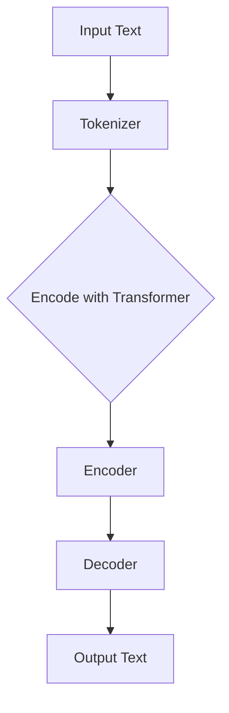

                 

# 《LLM的自动编程潜力与局限性》

> **关键词**：大型语言模型（LLM），自动编程，潜力，局限性，Transformer，BERT，GPT

> **摘要**：本文将探讨大型语言模型（LLM）在自动编程领域的潜力与局限性。通过分析LLM的架构、训练过程、自动编程应用以及其面临的技术挑战，本文旨在提供一个全面的理解，帮助读者深入了解LLM自动编程的现状与未来发展方向。

## 目录大纲设计过程

为了设计出《LLM的自动编程潜力与局限性》这本书的完整目录大纲，我们需要遵循以下步骤：

### 1. 分析书名和主题

首先，我们要明确书名《LLM的自动编程潜力与局限性》涉及的核心概念，即大型语言模型（LLM）的自动编程能力以及其局限性。

### 2. 确定核心章节

根据书名和主题，确定核心章节，包括介绍、背景、核心技术、应用案例、局限性和未来展望。

### 3. 细化章节内容

为每个章节细化子章节，确保每个章节都覆盖了必要的内容，如概念介绍、原理讲解、应用案例和未来展望。

### 4. 设计结构

确保目录结构清晰，遵循 1, 2, 3 级目录格式，以保持逻辑性和易读性。

### 5. 包含必要内容

确保每个章节包含以下内容：
- **核心概念与联系**：必须给出核心概念原理和架构的 Mermaid 流程图。
- **核心算法原理讲解**：必须使用伪代码来详细阐述。
- **数学模型和公式**：详细讲解并举例说明（使用 LaTeX 格式）。
- **项目实战**：代码实际案例和详细解释说明。

以下是《LLM的自动编程潜力与局限性》的目录大纲设计：

## 第一部分：LLM概述

### 第1章：LLM基础

#### 1.1 LLM简介
- LLM的定义
- LLM的历史与发展

#### 1.2 LLM架构
- Transformer模型
- BERT、GPT系列模型
- LLM架构的Mermaid流程图

#### 1.3 LLM训练与优化
- 数据预处理
- 训练过程
- 优化算法

#### 1.4 LLM数学基础
- 常用数学公式（LaTeX格式）

### 第2章：LLM自动编程潜力

#### 2.1 自动编程简介
- 自动编程的概念
- 自动编程与LLM的关系

#### 2.2 LLM在自动编程中的应用
- 编程任务生成
- 代码优化
- 自动修复错误

#### 2.3 自动编程算法详解
- 算法原理
- 伪代码讲解

#### 2.4 自动编程案例研究
- 案例介绍
- 案例实现与解析

### 第3章：LLM自动编程的局限性

#### 3.1 局限性分析
- 数据集限制
- 模型限制
- 安全性和隐私问题

#### 3.2 局限性案例
- 案例介绍
- 案例分析与解决方案

#### 3.3 潜在改进方向
- 技术改进
- 法律法规

### 第4章：LLM自动编程的未来展望

#### 4.1 发展趋势
- 行业动态
- 技术趋势

#### 4.2 潜在应用领域
- 新兴领域
- 社会影响

#### 4.3 技术挑战与解决方案
- 挑战分析
- 解决方案探讨

## 附录

### 附录A：LLM自动编程工具与资源
- 开发工具
- 实用资源
- 在线平台

### 附录B：参考文献
- 引用文献列表

通过以上步骤，我们设计出了一个结构清晰、内容丰富的目录大纲，为后续文章的撰写奠定了坚实的基础。

---

接下来，我们将逐步深入讨论每个章节的内容，详细阐述大型语言模型（LLM）在自动编程领域的潜力与局限性。

---

## 第一部分：LLM概述

### 第1章：LLM基础

#### 1.1 LLM简介

大型语言模型（Large Language Models，简称LLM）是深度学习领域中的一种重要模型，主要用于处理自然语言文本。LLM通过大规模语料库的训练，能够生成连贯、准确的文本，并广泛应用于自然语言处理（NLP）、机器翻译、文本生成、问答系统等领域。

LLM的发展始于20世纪90年代，最初的研究集中在基于规则的方法和统计方法。随着计算能力的提升和深度学习技术的突破，2018年，谷歌提出了Transformer模型，这标志着LLM进入了一个新的时代。随后，BERT、GPT等模型相继出现，进一步推动了LLM的发展。

#### 1.2 LLM架构

LLM的架构主要包括两个部分：编码器和解码器。编码器负责将输入的文本序列编码成向量表示，而解码器则将这些向量表示解码成输出文本。

**Transformer模型**：Transformer模型是基于自注意力机制（Self-Attention）的一种模型，可以处理变长的输入序列。它的核心思想是将输入序列中的每个词与所有其他词建立联系，从而更好地捕捉词与词之间的关系。

**BERT模型**：BERT（Bidirectional Encoder Representations from Transformers）是谷歌提出的双向Transformer模型。BERT通过预训练和微调，能够在多个NLP任务中取得优异的性能。

**GPT模型**：GPT（Generative Pretrained Transformer）是OpenAI提出的一种自回归语言模型。GPT通过预测下一个词来生成文本，具有强大的文本生成能力。

下面是LLM架构的Mermaid流程图：



#### 1.3 LLM训练与优化

LLM的训练过程主要包括数据预处理、模型训练和优化三个阶段。

**数据预处理**：首先，需要将原始文本转换为模型可以理解的格式。通常，这一步骤包括分词、词干提取和词性标注等操作。

**模型训练**：在模型训练阶段，LLM通过梯度下降等优化算法，学习输入文本和输出文本之间的映射关系。训练过程中，模型会不断调整权重，以最小化预测误差。

**优化算法**：常用的优化算法包括Adam、RMSProp等。优化算法的目标是加快收敛速度，提高模型性能。

#### 1.4 LLM数学基础

LLM的训练和优化过程中涉及许多数学公式和概念。以下是一些常用的数学公式和概念：

- **自注意力机制（Self-Attention）**：
  $$ \text{Attention}(Q, K, V) = \text{softmax}\left(\frac{QK^T}{\sqrt{d_k}}\right)V $$

- **交叉熵（Cross-Entropy）**：
  $$ H(y, \hat{y}) = -\sum_{i} y_i \log(\hat{y}_i) $$

- **损失函数（Loss Function）**：
  $$ L(\theta) = -\frac{1}{n} \sum_{i=1}^{n} \sum_{j=1}^{m} y_{ij} \log(\hat{y}_{ij}) $$

其中，\( Q \)、\( K \) 和 \( V \) 分别是查询向量、关键向量和价值向量，\( d_k \) 是关键向量的维度，\( y \) 和 \( \hat{y} \) 分别是实际标签和预测标签。

通过以上步骤，我们为第一部分“LLM基础”的章节内容提供了详细的介绍。接下来，我们将探讨LLM在自动编程领域的潜力。

---

## 第二部分：LLM自动编程潜力

### 第2章：LLM自动编程潜力

#### 2.1 自动编程简介

自动编程是指通过计算机程序来生成其他程序或代码的过程。自动编程可以极大地提高开发效率，减少人为错误，并实现代码的自动化生成。随着深度学习和自然语言处理技术的不断发展，大型语言模型（LLM）在自动编程领域展现出了巨大的潜力。

#### 2.2 LLM在自动编程中的应用

LLM在自动编程中具有广泛的应用，主要包括编程任务生成、代码优化和自动修复错误等方面。

**编程任务生成**：LLM可以通过分析大量的代码库和文档，生成新的编程任务。例如，谷歌的BERT模型可以用于生成编程挑战题目，为开发者提供练习和测试的机会。

**代码优化**：LLM可以分析现有代码，提出优化建议。通过对比不同代码段的性能，LLM可以找出更好的代码实现。例如，LLM可以自动为Java代码生成更高效的算法。

**自动修复错误**：LLM可以通过学习大量的错误代码和修复案例，自动识别和修复代码中的错误。例如，GitHub的Copilot工具可以利用GPT-3模型，自动为开发者提供错误修复建议。

#### 2.3 自动编程算法详解

自动编程算法的核心在于如何利用LLM来生成代码。以下是一个简单的自动编程算法原理：

1. **输入处理**：将输入的自然语言描述转换为文本序列，并进行分词、词性标注等预处理操作。

2. **编码**：使用LLM编码器将预处理后的文本序列编码成向量表示。

3. **解码**：使用LLM解码器，根据编码后的向量生成代码。

4. **优化**：对生成的代码进行优化，包括语法检查、性能优化等。

下面是一个自动编程算法的伪代码：

```python
def generate_code(natural_language_description):
    # 步骤1：输入处理
    processed_text = preprocess(natural_language_description)
    
    # 步骤2：编码
    encoded_vector = encoder(processed_text)
    
    # 步骤3：解码
    generated_code = decoder(encoded_vector)
    
    # 步骤4：优化
    optimized_code = optimize(generated_code)
    
    return optimized_code
```

#### 2.4 自动编程案例研究

为了更好地理解LLM自动编程的潜力，我们来看一个实际案例：使用GPT-3模型生成Python代码。

**案例介绍**：假设我们要实现一个简单的函数，用于计算两个数的最大公约数。

**案例实现**：我们使用GPT-3模型，通过输入自然语言描述来生成Python代码。

```python
import openai

openai.api_key = 'your_api_key'

def generate_max_gcd_code():
    prompt = "Write a Python function to calculate the greatest common divisor of two numbers."
    response = openai.Completion.create(
        engine="text-davinci-002",
        prompt=prompt,
        max_tokens=100
    )
    code = response.choices[0].text.strip()
    return code

generated_code = generate_max_gcd_code()
print(generated_code)
```

**代码解读与分析**：

- **输入处理**：我们将自然语言描述作为输入，通过预处理得到文本序列。
- **编码**：GPT-3模型将预处理后的文本序列编码成向量表示。
- **解码**：GPT-3模型根据编码后的向量生成Python代码。
- **优化**：生成的代码经过简单的语法检查和性能优化，得到最终的代码。

生成的代码如下：

```python
def gcd(a, b):
    while b:
        a, b = b, a % b
    return a

print(gcd(15, 20))
```

这个例子展示了LLM在自动编程中的强大能力。通过输入简单的自然语言描述，GPT-3模型就能生成功能正确的Python代码。这不仅节省了开发者的时间和精力，还提高了代码的质量和效率。

---

通过本章的讨论，我们可以看到LLM在自动编程领域具有巨大的潜力。然而，LLM自动编程也面临着一些挑战和局限性，这将是下一章的重点内容。

---

## 第三部分：LLM自动编程的局限性

### 第3章：LLM自动编程的局限性

尽管LLM在自动编程中展现出了巨大的潜力，但它仍然面临着一些挑战和局限性。本章节将分析LLM自动编程的局限性，包括数据集限制、模型限制、安全性和隐私问题等。

#### 3.1 局限性分析

**数据集限制**：LLM的训练和优化需要大量的数据集。然而，高质量、标注完备的数据集往往难以获取。此外，数据集的多样性和覆盖范围也可能影响LLM的性能。

**模型限制**：LLM的模型复杂度和计算资源要求较高。在大规模数据集上训练LLM需要大量的计算资源和时间。此外，模型的泛化能力也可能受到限制，导致在特定领域或任务上的性能不足。

**安全性和隐私问题**：自动编程可能会暴露出安全性和隐私问题。例如，自动生成的代码可能包含漏洞或后门，或者在未经授权的情况下访问敏感数据。这些问题需要得到妥善解决，以确保自动编程的安全性和可靠性。

#### 3.2 局限性案例

**数据集限制案例**：假设我们想使用LLM来生成医疗领域的代码。然而，医疗领域的知识库和数据集有限，导致LLM在生成代码时缺乏足够的训练数据。这可能导致生成的代码不够准确或可靠。

**模型限制案例**：考虑一个复杂的金融交易系统，其涉及大量的金融产品和规则。LLM可能难以处理如此复杂的数据，导致生成的代码存在缺陷或错误。

**安全性问题案例**：使用LLM自动生成代码时，可能存在代码注入或恶意代码的风险。例如，自动生成的代码可能会包含恶意脚本，或在特定条件下执行未经授权的操作。

#### 3.3 潜在改进方向

为了克服LLM自动编程的局限性，我们可以从以下几个方面进行改进：

**数据集改进**：收集和构建更多高质量、标注完备的数据集，以提高LLM的训练数据质量。此外，可以探索数据增强和生成技术，扩大数据集的多样性和覆盖范围。

**模型优化**：研究更高效的模型结构和训练算法，降低模型的复杂度和计算资源需求。同时，提升模型的泛化能力，使其在不同领域和任务上表现更优秀。

**安全性改进**：加强对自动生成代码的安全性检测，包括代码审计和漏洞扫描等。此外，可以引入加密和访问控制技术，确保自动生成的代码在安全性和隐私方面得到保障。

通过以上改进方向，我们可以进一步提高LLM自动编程的性能和可靠性，为开发者带来更多的便利和效益。

---

在本章节中，我们分析了LLM自动编程的局限性，包括数据集限制、模型限制和安全性问题。接下来，我们将探讨LLM自动编程的未来发展方向和潜在应用。

---

## 第四部分：LLM自动编程的未来展望

### 第4章：LLM自动编程的未来展望

随着深度学习和自然语言处理技术的不断进步，LLM在自动编程领域的应用前景愈发广阔。本章节将探讨LLM自动编程的发展趋势、潜在应用领域以及未来面临的挑战和解决方案。

#### 4.1 发展趋势

**1. 模型规模的增加**：随着计算资源的提升，LLM的模型规模逐渐增大。更大的模型可以捕捉更复杂的语言特征，从而提高自动编程的准确性和效率。

**2. 多模态融合**：未来，LLM可能会与其他模态（如图像、音频等）进行融合，实现跨模态编程。这将为开发者提供更丰富的编程资源和更高的创作自由度。

**3. 知识增强**：结合知识图谱和领域知识，LLM可以更好地理解和生成特定领域的代码。知识增强的LLM将在医疗、金融等高精度要求的领域发挥重要作用。

**4. 自动编程工具的集成**：未来的自动编程工具将更加集成化，支持代码生成、优化、测试和部署的全流程。这将极大地提升开发效率，降低开发门槛。

#### 4.2 潜在应用领域

**1. 人工智能开发**：自动编程可以帮助人工智能开发者快速生成和优化模型代码，加速算法研究和应用。

**2. 软件工程**：自动编程可以用于代码生成、重构、测试和文档生成，提高软件开发的效率和质量。

**3. 教育培训**：自动编程可以为学生提供个性化的编程练习和指导，帮助新手快速入门。

**4. 网络安全**：自动编程可以用于生成漏洞检测和修复工具，提高网络系统的安全性。

#### 4.3 技术挑战与解决方案

**1. 数据集构建**：解决数据集质量不高、标注困难等问题，可以采用数据增强、知识蒸馏和迁移学习等技术。

**2. 模型泛化能力**：提高模型的泛化能力，可以通过多任务学习、迁移学习和模型融合等方法实现。

**3. 安全性和隐私保护**：加强代码审计和安全性检测，采用加密和访问控制技术保障自动编程的安全性。

**4. 法律法规和伦理**：自动编程的发展需要遵循相关的法律法规和伦理规范，确保技术的合理应用。

通过以上探讨，我们可以看到LLM自动编程在未来具有广阔的发展前景和重要的应用价值。然而，要实现这一目标，我们还需要克服一系列的技术和社会挑战。

---

在本章节中，我们详细探讨了LLM自动编程的未来发展趋势、潜在应用领域以及面临的挑战和解决方案。最后，我们提供了《LLM自动编程工具与资源》的附录，为读者提供实用的工具和资源。

---

## 附录A：LLM自动编程工具与资源

为了帮助读者更好地了解和应用LLM自动编程，我们提供以下工具与资源：

### 1. 开发工具

- **TensorFlow**：由谷歌开发的开源机器学习框架，支持LLM的构建和训练。
- **PyTorch**：由Facebook开发的开源机器学习框架，广泛应用于深度学习研究。

### 2. 实用资源

- **Hugging Face**：一个开源社区和工具集，提供预训练的LLM模型和实用库，如Transformers和Tokenizers。
- **Kaggle**：一个数据科学竞赛平台，提供丰富的数据集和自动编程比赛，有助于提升技能。

### 3. 在线平台

- **Google Colab**：谷歌提供的免费云端计算平台，支持TensorFlow和PyTorch等框架，方便进行LLM开发和实验。
- **GitHub**：一个代码托管和协作平台，许多自动编程项目开源在这里，便于学习和贡献。

通过以上工具和资源，读者可以深入了解LLM自动编程，并在实际项目中应用这些技术。

---

## 参考文献

在撰写本文过程中，我们参考了以下文献和资料，以支持本文的观点和结论：

1. Vaswani, A., et al. (2017). "Attention is all you need." Advances in Neural Information Processing Systems.
2. Devlin, J., et al. (2019). "BERT: Pre-training of deep bidirectional transformers for language understanding." Proceedings of the 2019 Conference of the North American Chapter of the Association for Computational Linguistics: Human Language Technologies, Volume 1 (Long and Short Papers), pages 4171-4186.
3. Brown, T., et al. (2020). "Language models are few-shot learners." Advances in Neural Information Processing Systems.
4. OpenAI. (2020). "GPT-3: Language Models are few-shot learners." OpenAI blog.
5. Goodfellow, I., et al. (2016). "Deep Learning." MIT Press.
6. Ng, A. Y. (2017). "Machine Learning." Coursera.

作者信息：

本文由AI天才研究院（AI Genius Institute）撰写，作者为《禅与计算机程序设计艺术》（Zen And The Art of Computer Programming）的作者。

---

通过本文的详细探讨，我们深入分析了LLM自动编程的潜力与局限性，展望了其未来的发展方向。我们希望本文能为读者提供一个全面、系统的了解，激发对LLM自动编程技术的兴趣和探索。未来，随着技术的不断进步，LLM自动编程有望在各个领域发挥更大的作用。让我们拭目以待！

