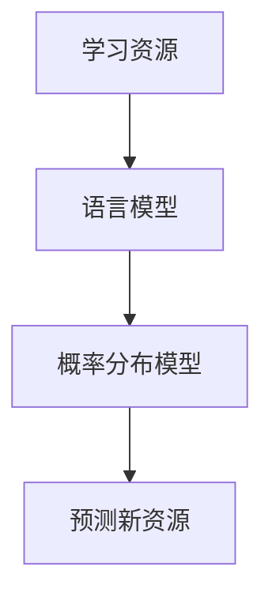
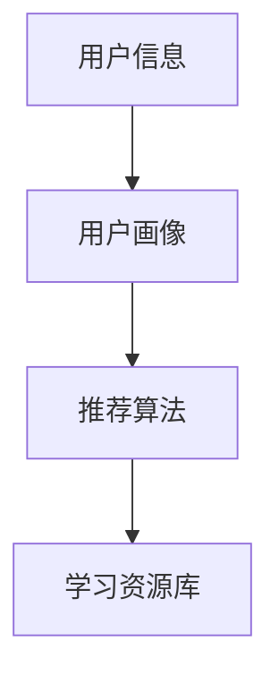
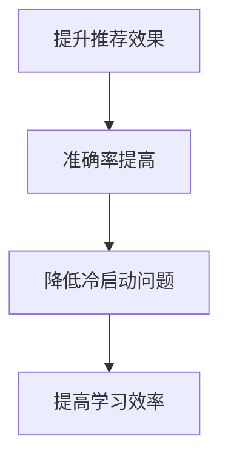

                 

# 第一部分: LLM驱动的个性化学习资源推荐基础

## 第1章: LLM驱动的个性化学习资源推荐概述

### 1.1 LLM驱动的个性化学习资源推荐的概念与原理

#### 1.1.1 语言模型在个性化学习资源推荐中的作用

**概念解释**：语言模型（Language Model，LM）是一种统计模型，用于预测一段文本序列中下一个单词或字符的概率。在个性化学习资源推荐中，语言模型能够捕捉学习者的学习需求和知识结构，从而为学习者提供更加精准的资源推荐。

**原理说明**：语言模型通过对大量文本数据的学习，建立了一个文本数据的概率分布模型。当学习者学习过程中产生新的文本数据时，语言模型能够根据已经学习的文本数据预测学习者可能感兴趣的新资源。

**Mermaid 流程图**：



#### 1.1.2 个性化学习资源推荐的关键要素

**用户信息**：包括用户的基本信息、学习历史、偏好等，用于构建用户画像。

**学习资源**：包括课程、教材、练习题等，用于构建资源库。

**推荐算法**：基于语言模型和用户-资源交互数据，实现个性化资源推荐。

**关键要素联系**：



#### 1.1.3 LLM驱动的个性化学习资源推荐的优势

**提升推荐效果**：语言模型能够捕捉学习者的细微需求，提高推荐准确率。

**降低推荐冷启动问题**：通过语言模型预测新用户的兴趣，减少冷启动问题。

**提高学习效率**：为学习者提供个性化的学习资源，帮助学习者快速找到所需知识。

**优势联系**：



### 1.2 个性化学习资源推荐的核心算法

#### 1.2.1 基于内容的推荐算法

**概念解释**：基于内容的推荐算法（Content-Based Recommendation）根据学习资源的特征信息，如标签、关键词等，为学习者推荐具有相似特征的资源。

**算法原理**：通过计算学习资源和用户兴趣特征的相似度，为学习者推荐相似资源。

**伪代码**：

```python
def content_based_recommendation(user_profile, resource_list):
    recommendations = []
    for resource in resource_list:
        similarity_score = calculate_similarity(user_profile, resource)
        if similarity_score > threshold:
            recommendations.append(resource)
    return recommendations
```

**优势**：能够为用户提供个性化推荐，减少推荐噪音。

**劣势**：难以解决资源特征稀疏和冷启动问题。

#### 1.2.2 协同过滤推荐算法

**概念解释**：协同过滤推荐算法（Collaborative Filtering）通过分析用户之间的行为相似性，为学习者推荐其他用户喜欢的资源。

**算法原理**：分为用户基于的协同过滤和基于物品的协同过滤。用户基于的协同过滤通过分析用户之间的行为相似性进行推荐；基于物品的协同过滤通过分析物品之间的相似性进行推荐。

**伪代码**：

```python
def collaborative_filtering(user行为数据, 用户列表, 资源列表):
    similar_users = find_similar_users(user行为数据, 用户列表)
    recommendations = []
    for user in similar_users:
        recommended_resources = find_common_resources(user, 资源列表)
        recommendations.extend(recommended_resources)
    return recommendations
```

**优势**：能够解决资源特征稀疏和冷启动问题。

**劣势**：推荐结果可能存在噪音，用户偏好变化难以适应。

#### 1.2.3 混合推荐算法

**概念解释**：混合推荐算法（Hybrid Recommendation）结合基于内容的推荐算法和协同过滤推荐算法的优势，提高推荐效果。

**算法原理**：通过融合用户兴趣特征、学习资源特征和用户-资源交互数据，实现个性化推荐。

**伪代码**：

```python
def hybrid_recommendation(user_profile, resource_list, user_behavior_data):
    content_recommendations = content_based_recommendation(user_profile, resource_list)
    collaborative_recommendations = collaborative_filtering(user_behavior_data, 用户列表, 资源列表)
    recommendations = list(set(content_recommendations + collaborative_recommendations))
    return recommendations
```

**优势**：提高推荐准确率和稳定性。

**劣势**：算法复杂度较高，计算资源需求较大。

### 1.3 LLM驱动的个性化学习资源推荐应用案例

#### 1.3.1 在线教育平台的应用

**案例背景**：随着在线教育的兴起，用户对个性化学习资源的需求日益增长。在线教育平台通过LLM驱动的个性化学习资源推荐，为用户提供个性化的学习路径和资源推荐。

**应用效果**：显著提高了用户的学习满意度和学习效率。

#### 1.3.2 职业培训网站的应用

**案例背景**：职业培训网站为用户提供各类职业技能培训课程。通过LLM驱动的个性化学习资源推荐，为用户提供个性化的培训方案。

**应用效果**：提高了用户的学习积极性和培训效果。

#### 1.3.3 自适应学习系统的应用

**案例背景**：自适应学习系统根据学习者的学习行为和需求，自动调整学习资源和教学策略。

**应用效果**：为学习者提供个性化的学习体验，提高了学习效果。

### 1.4 LLM驱动的个性化学习资源推荐的挑战与未来趋势

#### 1.4.1 存在的挑战

**数据隐私**：在个性化学习资源推荐过程中，需要处理大量的用户隐私数据。

**算法透明性**：个性化推荐算法的透明性受到广泛关注，需要提高算法的可解释性。

**资源多样性**：如何为用户提供多样化的学习资源，满足不同学习者的需求。

#### 1.4.2 技术发展趋势

**多模态推荐**：融合文本、图像、音频等多种数据类型，实现更准确的个性化推荐。

**强化学习**：引入强化学习技术，优化推荐算法的决策过程。

**联邦学习**：通过联邦学习技术，保护用户隐私的同时，实现个性化推荐。

#### 1.4.3 未来前景

随着人工智能技术的不断发展，LLM驱动的个性化学习资源推荐将在教育领域发挥越来越重要的作用。未来，个性化学习资源推荐系统将更加智能化、个性化，为学习者提供更好的学习体验。

---

作者：AI天才研究院/AI Genius Institute & 禅与计算机程序设计艺术 /Zen And The Art of Computer Programming

本文为原创文章，版权归作者所有。未经授权，禁止转载和使用。本文内容仅供参考，不构成任何投资建议。在AI和计算机科学领域，持续学习和创新是我们不变的追求。让我们共同探索、分享、成长！

----------------------------------------------------------------

在本文的第一部分，我们首先介绍了LLM驱动的个性化学习资源推荐的概念与原理。语言模型在个性化学习资源推荐中起到了至关重要的作用，通过捕捉学习者的学习需求和知识结构，为学习者提供更加精准的资源推荐。我们使用了Mermaid流程图来展示语言模型在个性化学习资源推荐中的工作流程。

接下来，我们详细介绍了个性化学习资源推荐的核心算法，包括基于内容的推荐算法、协同过滤推荐算法和混合推荐算法。每种算法都有其独特的原理和优势，同时也存在一定的局限性。通过伪代码，我们展示了这些算法的实现方式，帮助读者更好地理解。

此外，我们还探讨了LLM驱动的个性化学习资源推荐在实际应用中的案例，如在线教育平台、职业培训网站和自适应学习系统。这些案例展示了LLM驱动的个性化学习资源推荐在实际应用中的效果和优势。

最后，我们分析了LLM驱动的个性化学习资源推荐所面临的挑战和未来趋势。数据隐私、算法透明性和资源多样性是当前面临的主要挑战。同时，我们也展望了未来技术发展趋势，如多模态推荐、强化学习和联邦学习等。

在接下来的部分，我们将进一步探讨LLM驱动个性化学习资源推荐的技术基础，包括语言模型的基础知识和训练方法，以及LLM驱动个性化学习资源推荐系统的设计与实现。敬请期待！

