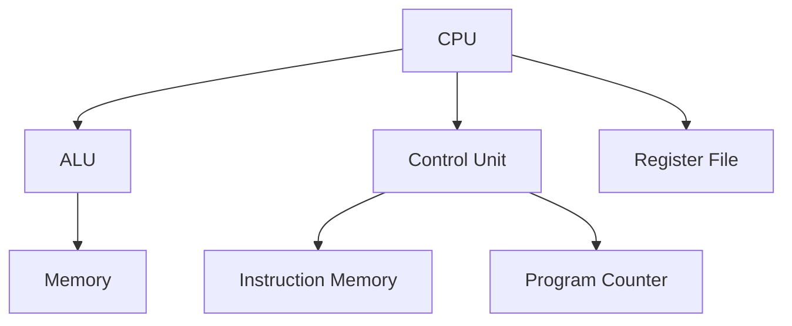

                 

### 《MIPS架构：深入理解RISC处理器设计》

> **关键词：** MIPS架构、RISC、处理器设计、指令集、汇编语言、优化。

> **摘要：** 本文旨在深入探讨MIPS（Microprocessor without Interlocked Pipeline Stages）架构，作为一种精简指令集计算机（RISC）的代表，其设计理念、指令集、汇编语言编程以及优化策略。通过对MIPS架构的详细分析，读者将能够理解其设计原理和实际应用，为后续研究和开发提供理论基础。

### 《MIPS架构：深入理解RISC处理器设计》目录大纲

#### 第一部分：MIPS架构概述

#### 第1章：MIPS架构的背景与重要性

#### 第2章：MIPS处理器的基本组成

#### 第二部分：MIPS指令集详解

#### 第3章：MIPS指令集概述

#### 第4章：MIPS数据处理指令

#### 第5章：MIPS控制指令

#### 第三部分：MIPS汇编语言编程

#### 第6章：MIPS汇编语言基础

#### 第7章：MIPS程序设计实践

#### 第四部分：MIPS体系结构优化

#### 第8章：MIPS处理器性能优化

#### 第9章：MIPS处理器功耗优化

#### 第五部分：MIPS处理器设计与实现

#### 第10章：MIPS处理器设计流程

#### 第11章：MIPS处理器实现

#### 第12章：MIPS架构的未来发展趋势

#### 附录

#### 附录A：MIPS相关工具与资源

### 图表与算法

#### 图1：MIPS处理器基本结构流程图



#### 算法1：MIPS加法指令的伪代码

```plaintext
function MIPS_ADD(Rd, Rs, Rt) {
    a = Mem[Rs];
    b = Mem[Rt];
    result = a + b;
    Mem[Rd] = result;
}
```

#### 数学模型1：MIPS处理器功耗模型

$$ P = C \cdot f \cdot V^2 $$

#### 举例说明

假设一个MIPS处理器的工作电压为1.2V，时钟频率为2GHz，每个寄存器的电容为10pF。计算其功耗。

$$
P = 10pF \cdot 2GHz \cdot (1.2V)^2 = 28.8mW
$$

### 项目实战

#### MIPS汇编程序示例

```assembly
.section .data
    # 定义两个数字
    num1: .word 10
    num2: .word 20

.section .text
    .global _start
_start:
    # 将num1的值加载到寄存器$s0
    lw $s0, num1
    # 将num2的值加载到寄存器$s1
    lw $s1, num2
    # 将$s0和$s1的值相加，结果存储到$s2
    add $s2, $s0, $s1
    # 输出结果
    li $v0, 1
    move $a0, $s2
    syscall
    # 结束程序
    li $v0, 10
    syscall
```

#### 代码解读与分析

这段MIPS汇编程序首先定义了两个数字`num1`和`num2`，并将它们的值加载到寄存器`s0`和`s1`中。然后，通过`add`指令将`s0`和`s1`的值相加，并将结果存储到`s2`中。最后，程序使用`syscall`指令输出结果，并结束程序。这段代码展示了MIPS汇编语言的基本编程方法和流程。

### 作者

**作者：AI天才研究院/AI Genius Institute & 禅与计算机程序设计艺术 /Zen And The Art of Computer Programming**

接下来，我们将按照目录大纲结构，逐步深入探讨MIPS架构的各个方面。首先是MIPS架构的背景与重要性。

