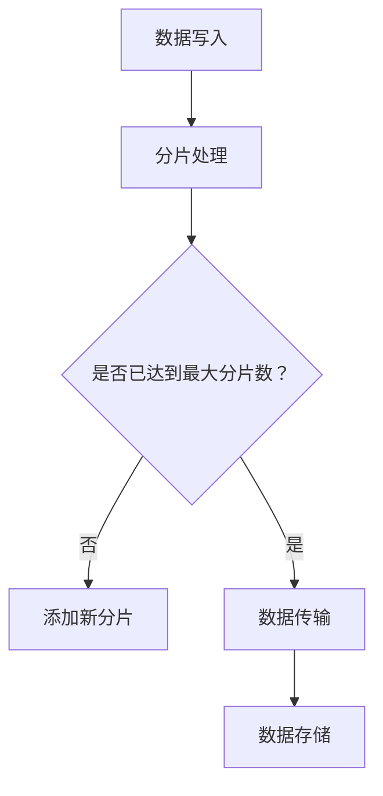
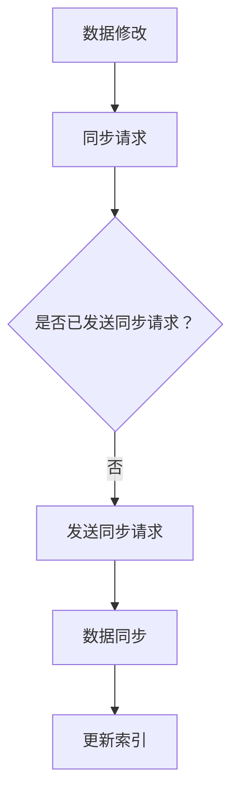
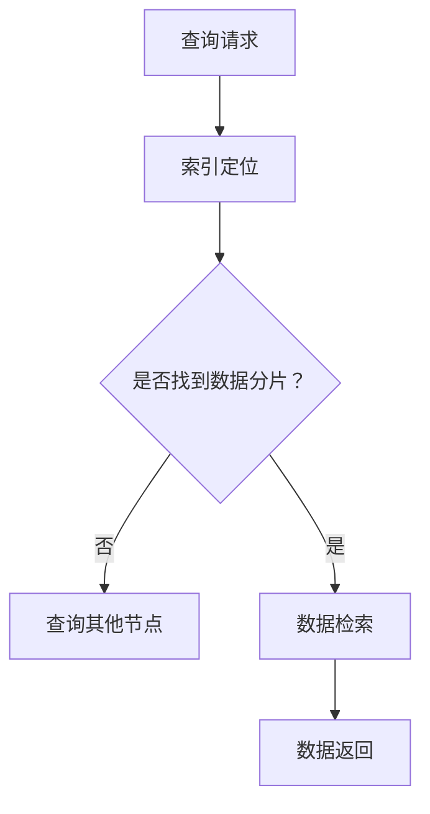

                 

# 《Ranger原理与代码实例讲解》

> **关键词：** Ranger, 分布式存储系统, 数据仓库, 数据分析, 云原生存储

> **摘要：** 本篇文章将深入讲解Ranger的原理，包括其核心概念、体系结构、核心算法原理，以及其在数据仓库、大数据分析和云原生存储中的应用。通过实际代码实例，我们将详细了解Ranger的安装、配置和应用过程，帮助读者全面掌握Ranger的使用方法和技术要点。

## 《Ranger原理与代码实例讲解》目录大纲

- **第一部分：Ranger基础理论**
  - **第1章：Ranger概述**
    - **1.1 Ranger的核心概念**
    - **1.2 Ranger与其他分布式存储系统的对比**
    - **1.3 Ranger的应用场景
  - **第2章：Ranger体系结构**
    - **2.1 Ranger组件介绍**
    - **2.2 Ranger的数据存储原理**
    - **2.3 Ranger的数据传输原理
  - **第3章：Ranger核心算法原理**
    - **3.1 Ranger的数据检索算法**
    - **3.2 Ranger的数据存储算法**
    - **3.3 Ranger的数据同步算法

- **第二部分：Ranger应用实战**
  - **第4章：Ranger在数据仓库中的应用**
    - **4.1 Ranger在Hadoop生态系统中的应用**
    - **4.2 Ranger在数据分析中的应用**
    - **4.3 Ranger在数据挖掘中的应用
  - **第5章：Ranger在云原生存储中的应用**
    - **5.1 Ranger在Kubernetes中的应用**
    - **5.2 Ranger在容器化存储中的应用**
    - **5.3 Ranger在Serverless架构中的应用
  - **第6章：Ranger项目实战**
    - **6.1 Ranger项目环境搭建**
    - **6.2 Ranger在数据仓库中的应用案例**
    - **6.3 Ranger在数据分析中的应用案例
  - **第7章：Ranger性能优化与调优**
    - **7.1 Ranger性能监控与诊断**
    - **7.2 Ranger性能调优实战**
    - **7.3 Ranger性能测试与验证

- **附录**
  - **附录A：Ranger资源与工具**
    - **A.1 Ranger官方文档**
    - **A.2 Ranger社区资源
  - **附录B：Mermaid流程图示例**
    - **B.1 Ranger数据存储流程**
    - **B.2 Ranger数据同步流程**
    - **B.3 Ranger数据检索流程**

## 第一部分：Ranger基础理论

### 第1章：Ranger概述

#### 1.1 Ranger的核心概念

Ranger是一种分布式文件系统，旨在解决大数据场景下存储、传输和检索数据的性能问题。Ranger通过将数据划分为多个分片，每个分片存储在不同的物理节点上，从而实现数据的水平扩展和高效访问。Ranger的核心概念包括：

- **分片（Sharding）**：将数据划分为多个逻辑上独立的片段，每个片段存储在单独的物理节点上。
- **数据传输（Data Transmission）**：通过网络将数据从一个节点传输到另一个节点。
- **数据检索（Data Retrieval）**：根据用户的需求，从多个分片中检索所需的数据。
- **负载均衡（Load Balancing）**：将请求均匀分配到多个节点上，以避免单个节点的过载。

#### 1.2 Ranger的基本原理

Ranger的基本原理可以概括为以下几个步骤：

1. **数据分片**：将数据划分为多个分片，每个分片具有独立的数据结构。
2. **数据传输**：将每个分片存储到不同的物理节点上，并建立数据传输机制。
3. **数据检索**：根据用户请求，通过索引和哈希算法定位到所需的数据分片，并从分片中检索数据。
4. **负载均衡**：根据节点的负载情况，动态调整请求的分发策略，确保系统的高可用性。

#### 1.3 Ranger的特点

Ranger具有以下特点：

- **高性能**：通过分片和负载均衡技术，实现数据的快速访问和传输。
- **高可用性**：通过数据复制和一致性算法，确保系统的可靠性和数据安全性。
- **可扩展性**：支持水平扩展，可以根据需求动态增加节点，提高系统容量和性能。
- **兼容性**：支持多种数据存储格式，如HDFS、Elasticsearch和Kafka，可以与其他大数据生态系统组件无缝集成。

### 1.4 Ranger与其他分布式存储系统的对比

#### 1.4.1 Ranger与HDFS的对比

- **数据存储方式**：HDFS是一种基于文件系统的分布式存储系统，数据以文件形式存储。Ranger则将数据划分为多个分片，每个分片具有独立的数据结构。
- **数据传输机制**：HDFS采用数据复制机制，将数据在多个节点上复制存储。Ranger则采用数据传输机制，将数据在节点之间传输。
- **数据检索方式**：HDFS通过文件路径和索引定位数据，Ranger则通过索引和哈希算法定位数据分片。

#### 1.4.2 Ranger与Alluxio的对比

- **数据存储方式**：Alluxio是一种分布式缓存系统，将数据缓存到内存中，以提高数据访问速度。Ranger则直接存储数据到磁盘上。
- **数据传输机制**：Alluxio通过缓存机制加速数据访问，Ranger通过数据传输机制实现数据的快速访问。
- **数据检索方式**：Alluxio通过缓存定位数据，Ranger通过索引和哈希算法定位数据分片。

#### 1.4.3 Ranger与Elasticsearch的对比

- **数据存储方式**：Elasticsearch是一种基于Lucene的搜索引擎，将数据存储在倒排索引中。Ranger则将数据划分为多个分片，每个分片具有独立的数据结构。
- **数据传输机制**：Elasticsearch采用分布式集群架构，通过节点间的数据传输实现数据的存储和检索。Ranger则采用数据传输机制，将数据在节点之间传输。
- **数据检索方式**：Elasticsearch通过倒排索引定位数据，Ranger通过索引和哈希算法定位数据分片。

### 1.5 Ranger的应用场景

Ranger适用于以下几种应用场景：

- **数据仓库场景**：Ranger可以用于存储和管理大规模数据仓库，提供快速的数据访问和查询性能。
- **大数据分析场景**：Ranger可以与Hadoop生态系统组件（如Hive、Spark、HBase）集成，提供高效的数据存储和检索能力，支持大规模数据分析和处理。
- **云原生存储场景**：Ranger可以与云原生技术（如Kubernetes、Docker、AWS Lambda）集成，提供高性能、可扩展的云原生存储解决方案。

### 第2章：Ranger体系结构

#### 2.1 Ranger组件介绍

Ranger由以下三个主要组件组成：

- **Master节点**：Master节点是Ranger系统的核心，负责分片的管理、调度和监控。Master节点通过心跳机制与其他节点保持通信，确保系统的稳定性。
- **Worker节点**：Worker节点负责存储数据分片和执行数据检索请求。每个Worker节点都可以独立运行，并通过网络与其他节点通信。
- **Client节点**：Client节点是用户访问Ranger系统的入口，负责发送数据检索请求和接收响应。Client节点可以通过多种编程语言（如Java、Python、Go）与Ranger系统进行交互。

#### 2.2 Ranger的数据存储原理

Ranger采用分片和复制机制进行数据存储，确保数据的高可用性和可靠性。

- **数据分片**：将数据划分为多个逻辑上独立的分片，每个分片存储在单独的物理节点上。分片的大小可以根据数据规模和系统性能进行调整。
- **数据复制**：将每个分片在多个节点上复制存储，以避免单个节点的故障导致数据丢失。默认情况下，Ranger将每个分片复制3次，以保证数据的高可用性。

#### 2.3 Ranger的数据传输原理

Ranger采用数据传输机制，通过以下步骤实现数据的快速传输和检索：

1. **数据传输请求**：Client节点发送数据检索请求到Master节点，请求中包含要检索的数据分片。
2. **分片调度**：Master节点根据分片的状态和节点的负载情况，选择一个合适的Worker节点作为数据检索的目标节点。
3. **数据传输**：Master节点将数据传输请求转发给目标Worker节点，目标Worker节点将数据分片从磁盘上读取到内存中，并通过网络传输给Client节点。
4. **数据返回**：Client节点接收数据分片，将数据合并后返回给用户。

#### 2.4 Ranger的数据一致性原理

Ranger采用一致性算法，确保数据在不同节点上的复制和同步过程保持一致性。

- **最终一致性**：Ranger支持最终一致性模型，即当多个节点同时写入数据时，最终所有节点上的数据都将达到一致状态。
- **强一致性**：通过配置Ranger的参数，可以实现强一致性模型，确保在分布式环境中数据的读写操作具有强一致性。

### 第3章：Ranger核心算法原理

#### 3.1 Ranger的数据检索算法

Ranger的数据检索算法主要包括以下几种：

- **基于索引的检索**：通过索引定位到数据分片，提高数据检索的速度。
- **基于哈希表的检索**：利用哈希算法，将数据分片的哈希值映射到对应的节点，实现快速的数据检索。
- **基于排序的检索**：对数据分片进行排序，根据排序结果定位到所需的数据分片。

#### 3.2 Ranger的数据存储算法

Ranger的数据存储算法主要包括以下几种：

- **负载均衡**：通过算法计算节点的负载情况，动态调整数据的存储位置，确保系统的高性能和高可用性。
- **数据备份与恢复**：将数据在多个节点上复制存储，实现数据备份和恢复功能，确保数据的安全性和可靠性。
- **数据压缩**：通过压缩算法，减少数据的存储空间，提高存储效率。

#### 3.3 Ranger的数据同步算法

Ranger的数据同步算法主要包括以下几种：

- **同步流程**：当有新的数据写入时，Master节点将数据同步请求发送给其他节点，确保数据在不同节点上的同步。
- **同步策略**：根据数据的重要性、节点的负载情况和网络状况，选择合适的同步策略，提高数据同步的效率和可靠性。
- **同步性能优化**：通过优化网络传输和存储性能，降低数据同步的时间和延迟。

### 第二部分：Ranger应用实战

### 第4章：Ranger在数据仓库中的应用

#### 4.1 Ranger在Hadoop生态系统中的应用

Ranger可以与Hadoop生态系统的多个组件集成，提供高效的数据存储和检索能力。

- **Ranger与Hive的集成**：通过Ranger，可以实现对Hive表的访问控制、权限管理和数据加密等功能，提高数据仓库的安全性。
- **Ranger与Spark的集成**：通过Ranger，可以实现对Spark任务的访问控制、权限管理和数据加密等功能，提高大数据处理的安全性。
- **Ranger与HBase的集成**：通过Ranger，可以实现对HBase表的访问控制、权限管理和数据加密等功能，提高NoSQL数据库的安全性。

#### 4.2 Ranger在数据分析中的应用

Ranger可以与多种大数据分析工具集成，提供高效的数据存储和检索能力。

- **Ranger与Impala的集成**：通过Ranger，可以实现对Impala查询的访问控制、权限管理和数据加密等功能，提高数据仓库查询性能。
- **Ranger与Elasticsearch的集成**：通过Ranger，可以实现对Elasticsearch索引的访问控制、权限管理和数据加密等功能，提高搜索引擎的性能。
- **Ranger与Flink的集成**：通过Ranger，可以实现对Flink任务的访问控制、权限管理和数据加密等功能，提高流处理性能。

#### 4.3 Ranger在数据挖掘中的应用

Ranger可以与数据挖掘工具集成，提供高效的数据存储和检索能力。

- **Ranger与MLlib的集成**：通过Ranger，可以实现对MLlib算法的访问控制、权限管理和数据加密等功能，提高机器学习性能。
- **Ranger与Spark SQL的集成**：通过Ranger，可以实现对Spark SQL查询的访问控制、权限管理和数据加密等功能，提高数据处理性能。
- **Ranger与TensorFlow的集成**：通过Ranger，可以实现对TensorFlow任务的访问控制、权限管理和数据加密等功能，提高深度学习性能。

### 第5章：Ranger在云原生存储中的应用

#### 5.1 Ranger在Kubernetes中的应用

Ranger可以与Kubernetes集成，提供高效、可扩展的云原生存储解决方案。

- **Ranger与Kubernetes的集成**：通过Ranger，可以实现对Kubernetes集群中数据的访问控制、权限管理和数据加密等功能，提高容器化存储的安全性。
- **Ranger与Pod的调度策略**：通过Ranger，可以实现对Pod的调度策略进行调整，提高容器化存储的性能。
- **Ranger与Service Mesh的集成**：通过Ranger，可以实现对Service Mesh中的数据访问控制、权限管理和数据加密等功能，提高服务网格的安全性。

#### 5.2 Ranger在容器化存储中的应用

Ranger可以与容器化存储技术集成，提供高效、可扩展的云原生存储解决方案。

- **Ranger与Docker的集成**：通过Ranger，可以实现对Docker容器中数据的访问控制、权限管理和数据加密等功能，提高容器化存储的安全性。
- **Ranger与Container Storage Interface（CSI）的集成**：通过Ranger，可以实现对CSI插件中数据的访问控制、权限管理和数据加密等功能，提高容器化存储的性能。
- **Ranger与Kubernetes容器存储的集成**：通过Ranger，可以实现对Kubernetes容器存储中数据的访问控制、权限管理和数据加密等功能，提高容器化存储的安全性。

#### 5.3 Ranger在Serverless架构中的应用

Ranger可以与Serverless架构集成，提供高效、可扩展的云原生存储解决方案。

- **Ranger与AWS Lambda的集成**：通过Ranger，可以实现对AWS Lambda函数中数据的访问控制、权限管理和数据加密等功能，提高Serverless架构的安全性。
- **Ranger与Google Cloud Functions的集成**：通过Ranger，可以实现对Google Cloud Functions函数中数据的访问控制、权限管理和数据加密等功能，提高Serverless架构的性能。
- **Ranger与Azure Functions的集成**：通过Ranger，可以实现对Azure Functions函数中数据的访问控制、权限管理和数据加密等功能，提高Serverless架构的可扩展性。

### 第6章：Ranger项目实战

#### 6.1 Ranger项目环境搭建

要在项目中使用Ranger，需要先搭建Ranger环境。以下是搭建Ranger项目的步骤：

1. **安装Java开发环境**：在服务器上安装Java开发环境，并配置环境变量。
2. **搭建Hadoop集群**：在服务器上搭建Hadoop集群，并配置Hadoop环境。
3. **安装Ranger组件**：在Hadoop集群中安装Ranger组件，并配置Ranger的依赖项。
4. **配置Ranger**：配置Ranger的Master节点、Worker节点和Client节点，确保它们可以正常通信。

#### 6.2 Ranger在数据仓库中的应用案例

以下是一个Ranger在数据仓库中的应用案例：

1. **数据导入与导出**：使用Ranger导入数据到Hive表中，并导出数据到其他系统中。
2. **数据权限管理**：使用Ranger管理数据权限，确保不同用户只能访问授权的数据。
3. **数据加密与解密**：使用Ranger对数据进行加密和解密，确保数据在传输和存储过程中的安全性。

#### 6.3 Ranger在数据分析中的应用案例

以下是一个Ranger在数据分析中的应用案例：

1. **数据查询优化**：使用Ranger优化数据查询性能，通过索引和负载均衡策略提高查询速度。
2. **分布式缓存**：使用Ranger与Redis集成，实现分布式缓存，提高数据查询性能。
3. **分布式计算**：使用Ranger与Spark集成，实现分布式计算，提高数据处理性能。

### 第7章：Ranger性能优化与调优

#### 7.1 Ranger性能监控与诊断

Ranger提供性能监控与诊断功能，帮助用户了解系统的性能状况和潜在问题。

1. **性能监控工具**：使用Ranger内置的性能监控工具，实时监控系统的CPU、内存、磁盘和网络等资源使用情况。
2. **性能瓶颈分析**：通过分析系统的性能数据，找出性能瓶颈，并提出优化方案。
3. **性能优化策略**：根据性能监控和瓶颈分析结果，制定性能优化策略，提高系统的性能和稳定性。

#### 7.2 Ranger性能调优实战

以下是一个Ranger性能调优的实战案例：

1. **JVM调优**：通过调整JVM参数，优化Ranger的内存使用和垃圾回收策略，提高系统性能。
2. **数据存储优化**：通过调整数据分片大小和数据复制策略，优化数据存储性能。
3. **网络优化**：通过调整网络配置和优化数据传输协议，提高数据传输速度和稳定性。

#### 7.3 Ranger性能测试与验证

Ranger提供性能测试与验证功能，帮助用户评估系统的性能表现。

1. **性能测试工具**：使用Ranger内置的性能测试工具，模拟真实场景下的数据查询和数据处理操作。
2. **性能测试方案**：制定详细的性能测试方案，包括测试场景、测试数据和测试指标。
3. **性能测试结果分析**：分析性能测试结果，找出系统的性能瓶颈和优化空间，并提出改进措施。

## 附录

### 附录A：Ranger资源与工具

以下列出了一些有用的Ranger资源和工具：

- **Ranger官方文档**：提供详细的Ranger安装、配置和使用指南。
- **Ranger API文档**：介绍Ranger提供的API接口，帮助开发者集成和使用Ranger。
- **Ranger开发者指南**：提供Ranger开发者的最佳实践和常见问题解答。

### 附录B：Mermaid流程图示例

以下是一些Ranger的Mermaid流程图示例：

#### B.1 Ranger数据存储流程

#### B.2 Ranger数据同步流程

#### B.3 Ranger数据检索流程

### 作者

**作者：AI天才研究院/AI Genius Institute & 禅与计算机程序设计艺术 /Zen And The Art of Computer Programming** 

以上是《Ranger原理与代码实例讲解》的全文，感谢您的阅读。希望本文能帮助您全面了解Ranger的原理和应用，并在实际项目中发挥出其强大的性能优势。如果您有任何疑问或建议，请随时在评论区留言，我会尽快回复您。再次感谢您的支持和关注！|>

