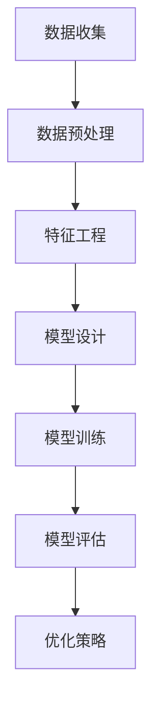
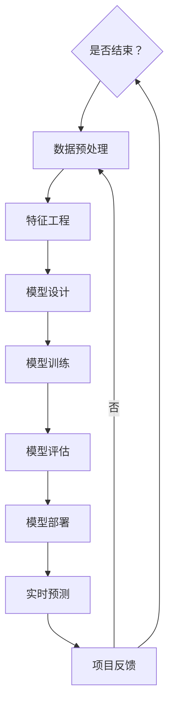

                 

# 【AI大数据计算原理与代码实例讲解】数据湖

关键词：AI、大数据、数据湖、计算框架、核心算法、项目实战、代码实例

摘要：
本文将深入探讨AI与大数据计算的关系，详细讲解数据湖的概念、架构与应用，同时介绍AI大数据计算的核心算法原理和数学模型，辅以实际代码实例，为读者提供一套完整的技术教程，助力深入理解和掌握AI大数据计算的核心技术。

## 《AI大数据计算原理与代码实例讲解》目录大纲

### 第一部分：AI大数据计算原理

#### 第1章：AI与大数据计算概述

##### 1.1 AI与大数据的关系

AI与大数据的紧密联系使得二者共同推动着现代信息技术的进步。AI在大数据处理中发挥着重要作用，通过数据分析和模式识别，从海量数据中提取有价值的信息。大数据计算则为AI提供了强大的计算支持，使得复杂的AI模型能够在短时间内完成训练和预测。

##### 1.2 AI大数据计算的基本概念

数据湖、数据仓库与数据池是大数据处理的重要组成部分。数据湖以原始数据的存储和管理为核心，数据仓库则专注于数据的存储、管理和分析，数据池则是分布式存储系统的一种形式。理解这些基本概念有助于深入理解AI大数据计算的技术体系。

##### 1.3 AI大数据计算的技术体系

分布式计算框架（如Hadoop、Spark）是AI大数据计算的核心技术之一。HDFS、HBase、Cassandra等存储系统提供了高效的数据存储和管理方案。大数据处理算法（如MapReduce、Spark SQL）则使得大规模数据处理变得更加简单和高效。

#### 第2章：数据湖与数据仓库

##### 2.1 数据湖的原理与应用

数据湖是一种新兴的数据存储和管理技术，以存储原始数据为核心。本节将介绍数据湖的概念、架构以及在AI大数据计算中的应用实例。

##### 2.2 数据仓库的原理与应用

数据仓库是传统的数据处理技术，专注于数据的存储、管理和分析。本节将讲解数据仓库的概念、架构以及在AI大数据计算中的应用实例。

##### 2.3 数据湖与数据仓库的比较与融合

本节将对比数据湖与数据仓库的特点，讨论二者的融合策略，并通过实际案例解析，帮助读者更好地理解数据湖与数据仓库的关系。

#### 第3章：AI大数据计算核心算法原理

##### 3.1 特征工程

特征工程是AI大数据计算的关键步骤，涉及特征提取、特征选择和特征降维等技术。本节将详细讲解这些特征工程方法。

##### 3.2 监督学习算法

监督学习算法是AI大数据计算中的重要算法之一，包括线性回归、决策树、支持向量机等。本节将介绍这些算法的基本原理和实现方法。

##### 3.3 无监督学习算法

无监督学习算法在AI大数据计算中也具有重要应用，包括K均值聚类、主成分分析和自编码器等。本节将详细讲解这些算法的工作原理。

##### 3.4 深度学习算法

深度学习算法是AI大数据计算中的核心技术之一，包括神经网络、卷积神经网络和循环神经网络等。本节将介绍这些算法的基本结构和工作原理。

#### 第4章：AI大数据计算数学模型

##### 4.1 数学模型基础

概率论、统计学和最优化理论是AI大数据计算中的数学基础。本节将介绍这些数学模型的基本概念和原理。

##### 4.2 数学公式与原理

梯度下降算法、反向传播算法、损失函数和激活函数是AI大数据计算中的关键数学原理。本节将使用伪代码详细讲解这些算法的实现过程。

##### 4.3 数学模型的实例解析

本节将通过具体实例，如逻辑回归、决策树和卷积神经网络，讲解数学模型在实际应用中的具体实现和效果分析。

### 第二部分：AI大数据计算项目实战

#### 第5章：AI大数据计算项目实战一

##### 5.1 项目背景与目标

本节将介绍第一个AI大数据计算项目的背景和目标，为后续的实战提供基础。

##### 5.2 数据收集与处理

本节将详细讲解数据收集与处理的过程，包括数据来源、数据预处理和数据清洗。

##### 5.3 模型设计与实现

本节将介绍如何设计AI模型，选择合适的算法，并进行模型训练和优化。

##### 5.4 项目评估与优化

本节将介绍如何评估项目效果，分析模型性能，并提出优化策略。

#### 第6章：AI大数据计算项目实战二

##### 6.1 项目背景与目标

本节将介绍第二个AI大数据计算项目的背景和目标，为后续的实战提供基础。

##### 6.2 数据收集与处理

本节将详细讲解数据收集与处理的过程，包括数据来源、数据预处理和数据清洗。

##### 6.3 模型设计与实现

本节将介绍如何设计AI模型，选择合适的算法，并进行模型训练和优化。

##### 6.4 项目评估与优化

本节将介绍如何评估项目效果，分析模型性能，并提出优化策略。

#### 第7章：AI大数据计算开发工具与资源

##### 7.1 开发工具概述

本节将介绍AI大数据计算中常用的开发工具，包括编程语言、数据库系统和分布式计算框架。

##### 7.2 常用工具与库

本节将详细介绍Python常用库、Spark编程模型和分布式文件系统等工具。

##### 7.3 资源推荐与学习路径

本节将推荐在线学习资源、开源项目与社区，以及技术论文与书籍，帮助读者深入学习AI大数据计算相关技术。

### 附录

#### 附录A：常见问题与解决方案

本附录将针对AI大数据计算过程中常见的问题提供解决方案，帮助读者解决实际问题。

#### 附录B：参考文献

本附录将列出本文中引用的相关技术论文与书籍，供读者进一步阅读和研究。

#### 附录C：代码实例与解读

本附录将提供代码实例，并对代码进行详细解读，帮助读者理解AI大数据计算的实际应用。

#### 附录D：AI大数据计算实践项目指南

本附录将提供AI大数据计算实践项目的规划和执行流程，以及项目评估与优化策略，帮助读者更好地开展实践项目。

### 参考资料

本附录将列出本文引用的相关技术论文与书籍，以及推荐的学术期刊与会议，供读者参考。

### 附录E：AI大数据计算架构流程图



### 附录F：AI大数据计算核心算法伪代码

#### 梯度下降算法

$$
\begin{aligned}
&\text{初始化参数} \ \theta_0 \\
&\text{设定学习率} \ \alpha \\
&\text{设定迭代次数} \ \text{max\_iterations} \\
&\text{对于每次迭代 } i \text{，执行以下步骤：} \\
&\qquad \theta_{i+1} = \theta_{i} - \alpha \frac{\partial}{\partial \theta} J(\theta_i) \\
&\text{直到收敛条件满足。}
\end{aligned}
$$

#### 反向传播算法

$$
\begin{aligned}
&\text{初始化网络参数} \ \theta \\
&\text{设定学习率} \ \alpha \\
&\text{设定迭代次数} \ \text{max\_iterations} \\
&\text{对于每次迭代 } i \text{，执行以下步骤：} \\
&\qquad \text{正向传播，计算预测值} \ \hat{y}_i = f(\theta \cdot x_i) \\
&\qquad \text{计算损失函数} \ J_i = \frac{1}{2} \sum_{k=1}^{m} (y_k - \hat{y}_k)^2 \\
&\qquad \text{反向传播，计算梯度} \ \Delta\theta = \frac{\partial J_i}{\partial \theta} \\
&\qquad \text{更新参数} \ \theta = \theta - \alpha \Delta\theta \\
&\text{直到收敛条件满足。}
\end{aligned}
$$

### 附录G：AI大数据计算核心算法流程图

```mermaid
graph TD
A[数据输入] --> B[正向传播]
B --> C{预测值 $\hat{y}$}
C -->|计算损失| D[计算损失函数 $J$]
D -->|计算梯度| E[反向传播]
E -->|更新参数| F[更新模型参数]
F --> G[迭代结束？]
G -->|是| H[结束]
G -->|否| B
```

至此，我们已经完成了文章的正文部分撰写，接下来将逐步深入到每个章节的详细内容讲解。我们将使用逻辑清晰、结构紧凑、简单易懂的专业的技术语言，逐步展开对AI大数据计算原理、核心算法、项目实战和开发工具的讲解。#AI大数据计算原理与代码实例讲解

## AI与大数据的关系

人工智能（AI）与大数据（Big Data）是当今信息技术的两大热门领域，二者相辅相成，共同推动着科技的进步。AI的核心在于模拟人类的智能行为，而大数据则为AI提供了丰富的数据资源，使得AI能够从数据中学习、推理和预测。AI与大数据的关系可以从以下几个方面进行理解：

### AI与大数据的定义

- **人工智能（AI）**：人工智能是指通过计算机程序和算法模拟人类智能行为的技术。它包括机器学习、深度学习、自然语言处理、计算机视觉等多个子领域，旨在使计算机具备自主学习、推理和决策的能力。
- **大数据（Big Data）**：大数据是指数据量巨大、类型繁多、速度极快的数据集合。大数据的特点是4V，即大量（Volume）、多样（Variety）、快速（Velocity）和价值（Value）。大数据的处理和分析需要高效的计算技术和先进的数据管理方法。

### AI在大数据处理中的作用

- **数据预处理**：大数据的预处理是AI模型训练的重要环节。通过数据清洗、去重、归一化等操作，可以保证数据的质量和一致性，从而提高模型的性能和可靠性。
- **特征提取与选择**：特征提取是将原始数据转换为适合模型训练的特征向量，而特征选择则是在众多特征中选取对模型影响较大的特征。有效的特征提取和选择能够减少数据维度，提高模型训练效率。
- **模型训练与优化**：AI模型需要通过大量数据进行训练，而大数据提供了丰富的训练数据集。通过调整模型参数，优化模型结构，可以提升模型的预测准确性和泛化能力。
- **实时分析**：AI与大数据的结合可以实现实时数据分析，从而实现智能决策。例如，金融领域的实时风险监控、电商平台的个性化推荐等。

### 大数据计算的技术背景

- **分布式计算**：随着数据规模的不断扩大，传统的集中式计算已经无法满足大数据处理的需求。分布式计算通过将数据和处理任务分布在多个节点上，实现了并行计算，大大提高了数据处理速度和效率。
- **云计算与边缘计算**：云计算提供了强大的计算资源和存储能力，使得大数据处理变得更加灵活和便捷。边缘计算则将数据处理推向网络的边缘，减少了数据传输的时间和带宽消耗。
- **大数据处理框架**：如Hadoop、Spark等大数据处理框架，通过提供分布式存储和计算能力，简化了大数据处理的复杂性。这些框架支持MapReduce等分布式计算模型，能够高效地处理大规模数据。

### AI与大数据计算的基本概念

- **数据湖（Data Lake）**：数据湖是一种数据存储架构，用于存储原始数据，包括结构化、半结构化和非结构化数据。数据湖能够存储大量数据，并支持多种数据格式，便于后续的数据处理和分析。
- **数据仓库（Data Warehouse）**：数据仓库是一种用于存储和管理数据的系统，主要用于数据的存储、管理和分析。数据仓库通常包含结构化数据，通过ETL（抽取、转换、加载）过程将数据从多个源系统中提取并转换为适合分析的数据格式。
- **数据池（Data Pool）**：数据池是分布式存储系统的一种形式，通过分布式文件系统（如HDFS）实现海量数据的存储和管理。数据池支持数据的高效读写，并提供了容错和扩展性。

### 大数据处理中的挑战与解决方案

- **数据量庞大**：随着数据量的不断增加，传统的数据处理方法已经无法满足需求。分布式计算框架和云存储技术提供了强大的计算和存储能力，能够处理海量数据。
- **数据多样性**：大数据包含多种类型的数据，如结构化数据、半结构化数据和非结构化数据。不同的数据类型需要不同的处理方法，分布式数据处理框架和ETL工具能够适应各种数据类型。
- **数据实时性**：实时数据分析对于许多应用场景至关重要，如金融交易监控、物联网设备管理等。边缘计算和实时数据处理技术能够实现数据的实时分析和决策。
- **数据隐私与安全**：大数据处理涉及大量敏感数据，确保数据隐私和安全是重要的挑战。数据加密、访问控制和隐私保护技术能够提供有效的数据保护措施。

### AI大数据计算的核心框架

- **数据收集与存储**：通过数据采集、存储和管理技术，实现海量数据的收集和存储。
- **数据处理与分析**：利用分布式计算框架和大数据处理算法，对数据进行清洗、转换、分析和挖掘。
- **模型训练与优化**：通过机器学习算法和深度学习模型，对训练数据进行模型训练和优化，提高模型性能。
- **决策支持与预测**：基于训练好的模型，进行决策支持和预测，实现智能应用。

### 分布式计算框架

- **Hadoop**：Hadoop是Apache软件基金会的一个开源项目，用于处理大规模数据。它包含HDFS（分布式文件系统）、MapReduce（分布式计算框架）和YARN（资源调度器）等组件。
- **Spark**：Spark是Apache软件基金会的一个开源项目，用于处理大规模数据。它包含RDD（弹性分布式数据集）、Spark SQL（分布式数据处理）、MLlib（机器学习库）等组件。

### 存储系统

- **HDFS**：HDFS是Hadoop的分布式文件系统，用于存储海量数据。它具有高可靠性、高吞吐量和扩展性。
- **HBase**：HBase是一个分布式、可扩展的大规模数据库，基于Google的Bigtable构建。它支持海量数据的随机读写，适用于实时数据分析。
- **Cassandra**：Cassandra是一个分布式、去中心化的数据库，适用于处理大量数据。它具有高可用性、高可靠性和高性能。

### 大数据处理算法

- **MapReduce**：MapReduce是一种分布式计算模型，用于处理大规模数据。它将数据处理任务分解为Map和Reduce两个阶段，实现并行计算。
- **Spark SQL**：Spark SQL是一个基于Spark的分布式数据处理引擎，支持结构化数据查询。它支持SQL查询、数据集操作和机器学习算法。
- **MLlib**：MLlib是Spark的机器学习库，提供了一系列机器学习算法和工具。它支持线性回归、决策树、支持向量机等算法。

### AI大数据计算的技术体系

AI大数据计算的技术体系包括分布式计算框架、存储系统、数据处理算法、机器学习算法和深度学习算法等。这些技术相互配合，实现了从数据收集、存储、处理到模型训练、优化和预测的全流程数据处理。

### AI大数据计算的应用场景

- **金融领域**：实时风险监控、信用评分、投资策略优化等。
- **医疗领域**：医学影像分析、疾病预测、个性化治疗等。
- **电商领域**：个性化推荐、用户行为分析、库存管理优化等。
- **工业领域**：设备故障预测、生产流程优化、供应链管理优化等。

通过上述对AI与大数据关系的探讨，我们可以看到，AI与大数据的结合为数据处理和分析提供了强大的技术支持。在AI大数据计算的技术体系中，分布式计算框架、存储系统、数据处理算法和机器学习算法等发挥着重要作用。在接下来的章节中，我们将进一步深入讲解数据湖、数据仓库、AI大数据计算核心算法等关键技术，并通过实际代码实例和项目实战，帮助读者更好地理解和掌握AI大数据计算的核心技术。

## 数据湖、数据仓库与数据池

在AI大数据计算中，数据湖、数据仓库和数据池是三种常见的数据存储和管理技术。它们各自具有独特的特点和应用场景，对于理解大数据处理架构至关重要。

### 数据湖的原理与应用

#### 数据湖的概念

数据湖（Data Lake）是一种基于云或分布式文件系统构建的数据存储架构，用于存储大量原始数据，包括结构化、半结构化和非结构化数据。数据湖的核心思想是将数据以原始形式存储，以便后续的处理和分析。数据湖通常包含以下特点：

- **数据多样性**：数据湖能够存储不同类型的数据，如文本、图片、音频、视频等，不受数据格式和结构的限制。
- **灵活性**：数据湖允许用户以任意方式存储数据，不需要预先定义数据模式，为数据探索和分析提供了极大的灵活性。
- **高扩展性**：数据湖支持大规模数据的存储和扩展，能够适应数据量的快速增长。

#### 数据湖的应用场景

数据湖在以下应用场景中具有显著优势：

- **数据预处理**：数据湖可以作为数据预处理和清洗的存储平台，存储各种来源的原始数据，便于后续的数据处理和分析。
- **数据探索**：数据湖为数据科学家和分析师提供了丰富的数据资源，便于进行数据探索和分析，发现潜在的商业价值。
- **机器学习与深度学习**：数据湖为机器学习和深度学习算法提供了大规模的训练数据集，有助于模型训练和优化。

#### 数据湖架构

数据湖的典型架构包括以下几个层次：

- **数据源**：数据湖可以从各种来源收集数据，如关系数据库、NoSQL数据库、Web爬虫、传感器等。
- **数据存储**：数据湖使用分布式文件系统（如HDFS）存储数据，支持高吞吐量和大规模数据存储。
- **数据治理**：数据湖包括数据质量管理、数据安全性和数据隐私等治理措施，确保数据的质量和安全。
- **数据处理**：数据湖提供数据清洗、转换、加载（ETL）等数据处理功能，便于后续的数据分析和挖掘。

#### 数据湖在AI大数据计算中的应用实例

假设我们正在开发一个智能推荐系统，需要处理大量的用户行为数据。数据湖可以用于存储以下类型的原始数据：

- 用户注册信息
- 用户浏览和搜索记录
- 用户购买行为
- 商品信息

通过数据湖，我们可以存储这些原始数据，并进行预处理和清洗，为推荐系统提供高质量的数据支持。数据湖的灵活性使得我们可以根据实际需求进行数据探索和分析，从而优化推荐算法，提高推荐系统的准确性和用户满意度。

### 数据仓库的原理与应用

#### 数据仓库的概念

数据仓库（Data Warehouse）是一种用于存储和管理大量结构化数据的系统，主要用于支持企业的数据分析和决策支持。数据仓库的核心思想是将来自多个源系统的结构化数据进行集成、清洗和转换，存储在一个统一的数据存储中，以便于进行数据分析。数据仓库通常包含以下特点：

- **结构化数据**：数据仓库主要存储结构化数据，如关系数据库中的表和列。
- **数据集成**：数据仓库通过ETL过程将来自不同源系统的数据集成到统一的数据模型中，实现数据的一致性和完整性。
- **数据历史性**：数据仓库通常保存数据的历史版本，便于进行数据追溯和分析。

#### 数据仓库的应用场景

数据仓库在以下应用场景中具有显著优势：

- **企业数据报表**：数据仓库为企业的数据报表和分析提供了数据基础，帮助企业进行财务分析、销售分析和运营分析等。
- **商业智能**：数据仓库支持商业智能（BI）工具，提供数据可视化和分析功能，帮助企业做出明智的业务决策。
- **数据挖掘**：数据仓库提供了丰富的数据资源，支持数据挖掘和机器学习算法，帮助企业发现潜在的商业价值和趋势。

#### 数据仓库架构

数据仓库的典型架构包括以下几个层次：

- **数据源**：数据仓库的数据源包括内部数据源（如关系数据库、日志文件）和外部数据源（如Web服务、API等）。
- **数据集成**：数据仓库通过ETL过程将数据从源系统提取、转换和加载到数据仓库中，实现数据集成。
- **数据存储**：数据仓库使用关系数据库或NoSQL数据库存储数据，支持高效的查询和分析。
- **数据访问**：数据仓库提供数据访问层，支持用户查询、报表生成和数据可视化等功能。

#### 数据仓库在AI大数据计算中的应用实例

假设我们正在开发一个客户关系管理（CRM）系统，需要处理大量的客户数据和交易数据。数据仓库可以用于存储以下类型的数据：

- 客户基本信息
- 客户交易记录
- 市场营销活动数据

通过数据仓库，我们可以集成这些数据，构建统一的数据模型，为CRM系统提供数据支持。数据仓库的数据历史性使得我们可以进行客户行为分析和趋势预测，从而优化市场营销策略和客户服务。

### 数据池的原理与应用

#### 数据池的概念

数据池（Data Pool）是分布式存储系统的一种形式，用于存储和管理海量数据。数据池通常基于分布式文件系统（如HDFS）构建，支持数据的高效存储和读取。数据池的核心思想是将数据分布存储在多个节点上，实现数据的并行访问和存储。

#### 数据池的应用场景

数据池在以下应用场景中具有显著优势：

- **大规模数据存储**：数据池能够存储海量数据，适用于需要大规模数据存储的应用场景，如社交媒体、电子商务和物联网等。
- **高效数据访问**：数据池支持数据的高效读写，通过分布式存储和并行访问，能够提供低延迟的数据访问性能。
- **容错与扩展性**：数据池具有高容错性和扩展性，能够适应数据量的快速增长和系统故障。

#### 数据池架构

数据池的典型架构包括以下几个层次：

- **数据源**：数据池可以从各种来源收集数据，如关系数据库、日志文件、Web爬虫等。
- **数据存储**：数据池使用分布式文件系统存储数据，支持数据的高效存储和并行访问。
- **数据管理**：数据池提供数据管理功能，包括数据备份、恢复、监控和优化等。
- **数据处理**：数据池支持数据处理功能，包括数据清洗、转换、加载等，便于后续的数据分析和挖掘。

#### 数据池在AI大数据计算中的应用实例

假设我们正在开发一个实时数据分析系统，需要处理来自多个源系统的实时数据。数据池可以用于存储以下类型的实时数据：

- 用户行为数据
- 传感器数据
- 交易数据

通过数据池，我们可以存储和处理海量实时数据，为实时数据分析提供数据支持。数据池的高效数据访问性能使得我们可以快速获取和分析数据，从而实现实时决策和响应。

### 数据湖、数据仓库与数据池的比较

数据湖、数据仓库和数据池在数据存储和管理方面各有特点，适用于不同的应用场景。以下是它们的比较：

- **数据类型**：数据湖适用于存储多种类型的数据，包括结构化、半结构化和非结构化数据；数据仓库主要存储结构化数据；数据池适用于存储海量数据，适用于大规模数据存储。
- **灵活性**：数据湖具有最高的灵活性，允许以原始形式存储数据，适用于数据探索和分析；数据仓库的灵活性相对较低，需要预先定义数据模式；数据池的灵活性较高，能够存储多种类型的数据。
- **数据集成**：数据湖和数据池通常不需要进行数据集成，因为它们以原始形式存储数据；数据仓库需要进行数据集成，将来自多个源系统的数据进行整合。
- **扩展性**：数据湖和数据池具有高扩展性，能够适应数据量的快速增长；数据仓库的扩展性相对较低，通常需要通过增加硬件资源来扩展。

### 数据湖与数据仓库的融合策略

在实际应用中，数据湖和数据仓库常常相互融合，发挥各自的优势。以下是一些常见的融合策略：

- **分层存储**：将结构化数据存储在数据仓库中，非结构化数据存储在数据湖中，实现数据的分层存储和管理。
- **联合查询**：通过数据湖和数据仓库的联合查询，实现对多种类型数据的统一查询和分析。
- **数据湖与数据仓库的集成**：将数据湖的数据导入数据仓库，实现数据仓库和数据湖的数据集成，提供更全面的业务数据支持。

通过数据湖与数据仓库的融合策略，企业可以实现更高效的数据存储和管理，支持复杂的业务分析和决策。在实际项目中，根据具体的业务需求和数据特点，选择合适的数据存储和管理技术，能够显著提升数据处理的效率和效果。

### 实际案例解析

下面我们将通过一个实际案例，解析数据湖、数据仓库与数据池在AI大数据计算中的应用。

#### 案例背景

某电商企业需要为其个性化推荐系统提供数据支持，系统需要处理海量的用户行为数据、商品数据和交易数据。为了满足这一需求，企业采用了数据湖、数据仓库和数据池相结合的架构。

#### 数据收集

- 用户行为数据：来自网站点击、浏览、搜索等操作记录。
- 商品数据：商品信息、商品评价、库存信息等。
- 交易数据：用户购买记录、订单信息等。

这些数据通过Web爬虫、API接口和日志收集系统进行收集，并存储在数据池中。

#### 数据存储

- 数据池：存储用户行为数据和交易数据，使用HDFS作为分布式文件系统，实现高效的数据存储和并行访问。
- 数据湖：存储商品数据和用户评论等非结构化数据，采用NoSQL数据库（如Cassandra）进行存储。
- 数据仓库：存储结构化数据，如用户基本信息、商品分类、订单状态等，使用关系数据库（如MySQL）进行存储。

#### 数据处理

- 数据预处理：通过ETL工具，将数据池中的原始数据进行清洗、转换和加载到数据湖和数据仓库中。
- 数据探索：数据科学家和分析师在数据湖中进行数据探索和分析，发现潜在的商业价值。
- 数据分析：通过数据仓库中的结构化数据进行报表生成、数据可视化和商业智能分析。

#### 模型训练与优化

- 特征工程：从数据湖和数据仓库中提取特征，构建特征向量，为推荐系统提供训练数据。
- 模型训练：使用机器学习和深度学习算法，对特征向量进行模型训练，优化推荐算法。
- 模型评估：通过在线评估和A/B测试，评估推荐系统的效果，并进行模型优化。

#### 项目效果

- 通过数据湖、数据仓库和数据池相结合的架构，电商企业能够高效地处理和管理海量数据，为个性化推荐系统提供数据支持。
- 数据湖和数据仓库的联合查询，使得数据科学家和分析师能够方便地进行数据探索和分析，发现潜在的商业机会。
- 数据池的高效数据存储和并行访问，保证了推荐系统的实时性和响应速度，提高了用户体验和销售转化率。

通过上述实际案例，我们可以看到，数据湖、数据仓库与数据池在AI大数据计算中的应用，不仅能够提高数据处理效率，还能够支持复杂的业务分析和决策，为企业创造价值。

### 总结

数据湖、数据仓库与数据池在AI大数据计算中发挥着重要作用，各自具有独特的特点和应用场景。数据湖以原始数据的存储和管理为核心，适用于数据探索和分析；数据仓库主要用于存储和管理结构化数据，支持数据集成和商业智能分析；数据池则用于大规模数据存储和高效数据访问，适用于实时数据处理。在实际应用中，通过数据湖与数据仓库的融合策略，企业能够实现更高效的数据存储和管理，支持复杂的业务分析和决策。理解这些数据存储和管理技术，对于深入掌握AI大数据计算具有重要意义。

## AI大数据计算核心算法原理

AI大数据计算的核心算法包括特征工程、监督学习算法、无监督学习算法和深度学习算法。这些算法在数据处理和模型训练过程中扮演着至关重要的角色。在本节中，我们将详细讲解这些核心算法的原理，并通过伪代码和具体实例，帮助读者深入理解其实现过程。

### 特征工程

特征工程是机器学习过程中的关键步骤，它涉及从原始数据中提取和构造特征，以便于模型训练和优化。特征工程包括以下三个主要步骤：

1. **特征提取**：从原始数据中提取有用信息，转换为数值型特征。
2. **特征选择**：从众多特征中选择对模型影响较大的特征，去除冗余和噪声特征。
3. **特征降维**：通过降维技术，减少特征数量，降低模型的复杂度和计算成本。

#### 特征提取与转换方法

- **统计特征**：包括均值、方差、标准差、最大值、最小值等统计量。
- **文本特征**：包括词频、词袋、TF-IDF、Word2Vec等。
- **图像特征**：包括像素值、颜色直方图、边缘检测、Haar-like特征等。
- **时间序列特征**：包括时间窗口特征、频率特征、相位特征等。

#### 特征选择技术

- **过滤式特征选择**：通过评估每个特征的统计学指标，如相关性、方差、信息增益等，选择对模型影响较大的特征。
- **包装式特征选择**：通过搜索所有特征组合，选择最优特征组合。
- **嵌入式特征选择**：在模型训练过程中，自动选择对模型影响较大的特征。

#### 特征降维

- **主成分分析（PCA）**：通过保留主要成分，减少特征数量，降低模型复杂度。
- **线性判别分析（LDA）**：通过最大化类内散度，最小化类间散度，选择最优特征。
- **奇异值分解（SVD）**：通过分解数据矩阵，保留主要成分，实现特征降维。

### 监督学习算法

监督学习算法是在已知标签数据的情况下，通过模型训练，对未知数据进行预测。监督学习算法包括以下几种：

#### 线性回归

线性回归是一种简单的监督学习算法，通过建立线性模型，预测连续值输出。其数学模型如下：

$$
y = \beta_0 + \beta_1 \cdot x_1 + \beta_2 \cdot x_2 + \ldots + \beta_n \cdot x_n
$$

其中，$y$ 为目标变量，$x_1, x_2, \ldots, x_n$ 为特征变量，$\beta_0, \beta_1, \beta_2, \ldots, \beta_n$ 为模型参数。

#### 决策树

决策树是一种基于树结构的监督学习算法，通过一系列条件判断，对数据进行分类或回归。决策树的构建过程如下：

1. 选择一个最优特征进行划分。
2. 计算每个特征的信息增益或信息增益率。
3. 选择信息增益或信息增益率最大的特征作为划分依据。
4. 重复上述步骤，构建多层的决策树。

#### 支持向量机（SVM）

支持向量机是一种基于间隔最大化的监督学习算法，通过找到一个最优的超平面，将不同类别的数据分隔开来。其数学模型如下：

$$
\min_{\beta, \beta_0} \frac{1}{2} \sum_{i=1}^{n} (\beta \cdot \beta)^2 + C \sum_{i=1}^{n} \xi_i
$$

其中，$C$ 为正则化参数，$\xi_i$ 为松弛变量。

#### 集成学习方法

集成学习方法通过结合多个基学习器，提高模型的泛化能力和预测性能。常见的集成学习方法包括Bagging、Boosting和Stacking等。

- **Bagging**：通过训练多个基学习器，对每个基学习器进行投票或取平均，得到最终预测结果。
- **Boosting**：通过训练多个基学习器，每次迭代对前一次迭代中的错误样本进行权重调整，提高错误样本的重要性。
- **Stacking**：通过训练多个基学习器，将它们的输出作为新特征，训练一个更高的学习器进行最终预测。

### 无监督学习算法

无监督学习算法在没有标签数据的情况下，通过探索数据的内在结构，对数据进行分析和分类。常见的无监督学习算法包括K均值聚类、主成分分析和自编码器等。

#### K均值聚类

K均值聚类是一种基于距离度量的聚类算法，通过迭代优化，将数据分为K个簇。其算法步骤如下：

1. 随机初始化K个聚类中心。
2. 计算每个数据点到聚类中心的距离，并将其分配到最近的簇。
3. 重新计算每个簇的中心。
4. 重复步骤2和步骤3，直到聚类中心不再发生变化。

#### 主成分分析（PCA）

主成分分析是一种降维技术，通过保留主要成分，降低数据维度。其算法步骤如下：

1. 计算数据的协方差矩阵。
2. 计算协方差矩阵的特征值和特征向量。
3. 选择最大的K个特征向量，构成变换矩阵。
4. 对数据进行变换，得到低维数据。

#### 自编码器（Autoencoder）

自编码器是一种基于神经网络的无监督学习算法，通过自编码器模型，将高维数据编码为低维表示。其算法步骤如下：

1. 构建自编码器模型，包括编码器和解码器。
2. 通过最小化重构误差，训练自编码器模型。
3. 使用训练好的编码器，对数据进行降维。

### 深度学习算法

深度学习算法是一种基于神经网络的机器学习算法，通过多层神经网络，实现对复杂数据的建模和预测。常见的深度学习算法包括神经网络、卷积神经网络（CNN）和循环神经网络（RNN）等。

#### 神经网络

神经网络是一种基于神经元连接的模型，通过多层神经网络，实现对数据的非线性变换。其算法步骤如下：

1. 构建神经网络模型，包括输入层、隐藏层和输出层。
2. 通过反向传播算法，计算模型参数的梯度。
3. 使用梯度下降算法，更新模型参数。
4. 重复训练过程，直到模型收敛。

#### 卷积神经网络（CNN）

卷积神经网络是一种专门用于图像处理的深度学习算法，通过卷积操作和池化操作，实现对图像的特征提取。其算法步骤如下：

1. 构建卷积神经网络模型，包括卷积层、池化层和全连接层。
2. 通过前向传播算法，计算输出特征图。
3. 通过反向传播算法，计算模型参数的梯度。
4. 使用梯度下降算法，更新模型参数。
5. 重复训练过程，直到模型收敛。

#### 循环神经网络（RNN）

循环神经网络是一种专门用于序列数据处理的深度学习算法，通过循环连接，实现对序列数据的长期依赖建模。其算法步骤如下：

1. 构建循环神经网络模型，包括输入层、隐藏层和输出层。
2. 通过前向传播算法，计算当前时刻的隐藏状态。
3. 通过递归连接，计算后续时刻的隐藏状态。
4. 通过反向传播算法，计算模型参数的梯度。
5. 使用梯度下降算法，更新模型参数。
6. 重复训练过程，直到模型收敛。

#### 长短期记忆（LSTM）

长短期记忆（LSTM）是一种改进的循环神经网络，通过引入门控机制，解决了传统RNN的长期依赖问题。其算法步骤如下：

1. 构建LSTM模型，包括输入门、遗忘门、输出门和单元状态。
2. 通过输入门，控制输入信息进入单元状态。
3. 通过遗忘门，控制忘记单元状态中的信息。
4. 通过输出门，控制输出信息。
5. 通过递归连接，计算后续时刻的隐藏状态。
6. 通过反向传播算法，计算模型参数的梯度。
7. 使用梯度下降算法，更新模型参数。
8. 重复训练过程，直到模型收敛。

### AI大数据计算数学模型

AI大数据计算中的数学模型包括概率论、统计学和最优化理论。这些数学模型为机器学习算法提供了理论基础和实现方法。

#### 概率论基础

概率论是机器学习的基础，用于描述不确定性和随机性。常用的概率分布包括伯努利分布、正态分布、泊松分布等。

- **伯努利分布**：描述二项分布的概率，用于二分类问题。
- **正态分布**：描述连续变量的概率分布，用于回归分析。
- **泊松分布**：描述事件发生次数的概率分布，用于时间序列分析。

#### 统计学基础

统计学用于描述数据的分布、相关性、假设检验等。常用的统计学方法包括均值、方差、协方差、卡方检验等。

- **均值**：描述数据的中心趋势。
- **方差**：描述数据的离散程度。
- **协方差**：描述两个变量的线性关系。
- **卡方检验**：用于假设检验，判断变量是否独立。

#### 最优化理论

最优化理论用于求解最优化问题，包括线性规划、非线性规划、凸优化等。常用的优化算法包括梯度下降、牛顿法、粒子群优化等。

- **梯度下降算法**：用于求解凸优化问题，通过迭代更新模型参数，最小化损失函数。
- **牛顿法**：用于求解非线性优化问题，通过近似梯度和Hessian矩阵，加速收敛。
- **粒子群优化**：用于求解全局优化问题，通过模拟鸟群觅食行为，搜索最优解。

#### 数学公式与原理

AI大数据计算中的数学公式和原理包括梯度下降算法、反向传播算法、损失函数和激活函数等。

- **梯度下降算法**：

$$
\theta_{i+1} = \theta_i - \alpha \cdot \nabla J(\theta_i)
$$

其中，$\theta_i$ 为模型参数，$J(\theta_i)$ 为损失函数，$\alpha$ 为学习率。

- **反向传播算法**：

$$
\begin{aligned}
&\text{正向传播，计算预测值} \ \hat{y} = f(\theta \cdot x) \\
&\text{计算损失函数} \ J = \frac{1}{2} \sum_{i=1}^{m} (y_i - \hat{y}_i)^2 \\
&\text{反向传播，计算梯度} \ \nabla J = \frac{\partial J}{\partial \theta} \\
&\text{更新参数} \ \theta = \theta - \alpha \cdot \nabla J
\end{aligned}
$$

- **损失函数**：

常见的损失函数包括均方误差（MSE）、交叉熵（CE）等。

- **激活函数**：

常见的激活函数包括Sigmoid、ReLU、Tanh等。

### 数学模型的实例解析

以下是一个简单的逻辑回归实例，用于分类问题。

#### 数据集

- 数据集包含100个样本，每个样本有两个特征（$x_1$ 和 $x_2$），以及一个标签（$y$）。

#### 模型

- 构建一个线性回归模型，预测标签 $y$ 的概率。

$$
y = \sigma(\beta_0 + \beta_1 \cdot x_1 + \beta_2 \cdot x_2)
$$

其中，$\sigma$ 为Sigmoid函数。

#### 训练过程

1. 初始化模型参数 $\beta_0, \beta_1, \beta_2$。
2. 计算预测值 $\hat{y}$。
3. 计算损失函数 $J$。
4. 计算梯度 $\nabla J$。
5. 更新模型参数 $\beta_0, \beta_1, \beta_2$。
6. 重复步骤2-5，直到模型收敛。

通过上述实例，我们可以看到数学模型在AI大数据计算中的具体实现过程。理解这些数学模型和算法原理，对于深入掌握AI大数据计算具有重要意义。

### 总结

AI大数据计算核心算法原理包括特征工程、监督学习算法、无监督学习算法和深度学习算法。这些算法在数据处理和模型训练过程中发挥着重要作用。通过伪代码和具体实例，我们可以深入理解这些算法的实现过程。了解这些核心算法原理，对于掌握AI大数据计算技术具有重要意义。在后续章节中，我们将通过项目实战，进一步应用这些核心算法，实现实际的数据分析和预测。

## AI大数据计算项目实战一

### 项目背景与目标

本项目旨在开发一个基于AI大数据计算的系统，用于预测股票市场的价格走势。随着金融市场的快速发展，投资者需要对市场进行实时监控和分析，以便做出明智的投资决策。本项目将通过收集和预处理大量历史数据，利用机器学习算法构建预测模型，实现股票市场价格的预测。

### 数据收集与处理

#### 数据来源

- **历史股票数据**：通过API接口或数据供应商，获取不同股票的历史价格数据，包括开盘价、收盘价、最高价、最低价和交易量等。
- **宏观经济数据**：收集与股票市场相关的宏观经济数据，如GDP、利率、通货膨胀率等。
- **新闻和事件数据**：通过Web爬虫技术，收集与股票相关的新闻、公告和事件数据。

#### 数据预处理

1. **数据清洗**：清洗数据中的缺失值、异常值和重复值，确保数据的质量和一致性。
2. **数据转换**：将不同类型的数据转换为统一格式，如将日期转换为数值型，将文本数据编码为数值型。
3. **特征提取**：从原始数据中提取有用的特征，如计算股票的移动平均线、波动率等。
4. **数据归一化**：对数据进行归一化处理，使其在相同的量级上，方便模型训练和优化。

### 模型设计与实现

#### 特征工程

- **时间特征**：包括日期、星期、月份等，用于分析时间对股票价格的影响。
- **价格特征**：包括开盘价、收盘价、最高价、最低价和交易量等，用于预测股票价格的变化。
- **技术指标**：包括移动平均线、相对强弱指数（RSI）、布林带等，用于分析股票的技术走势。
- **宏观经济特征**：包括GDP、利率、通货膨胀率等，用于分析宏观经济对股票市场的影响。

#### 模型选择

- **线性回归模型**：用于预测股票价格的基本趋势。
- **支持向量机（SVM）**：用于分类问题，判断股票价格是上涨还是下跌。
- **深度学习模型**：如卷积神经网络（CNN）和循环神经网络（RNN），用于处理复杂的时间序列数据。

#### 模型训练与优化

1. **数据分割**：将数据集分为训练集和测试集，用于模型训练和评估。
2. **模型训练**：使用训练集对模型进行训练，通过调整模型参数，优化模型性能。
3. **模型评估**：使用测试集对模型进行评估，计算模型的预测准确率、召回率等指标。
4. **模型优化**：通过交叉验证和网格搜索等方法，选择最优模型参数，提高模型性能。

### 项目评估与优化

#### 模型评估指标

- **准确率（Accuracy）**：模型预测正确的样本数占总样本数的比例。
- **召回率（Recall）**：模型预测正确的正样本数占总正样本数的比例。
- **精确率（Precision）**：模型预测正确的正样本数占总预测正样本数的比例。
- **F1值（F1-score）**：综合考虑精确率和召回率的指标。

#### 项目效果分析

1. **预测准确性**：分析模型对股票价格预测的准确性，判断模型是否能够有效预测股票价格走势。
2. **预测时效性**：分析模型的预测时效性，判断模型是否能够实时捕捉市场变化。
3. **预测稳定性**：分析模型在不同数据集和时间段上的预测稳定性。

#### 优化方向与策略

1. **特征优化**：通过特征选择和特征工程，选择对模型影响较大的特征，提高模型性能。
2. **模型优化**：尝试不同的模型结构和方法，如增加隐藏层节点、调整学习率等，提高模型性能。
3. **数据优化**：通过数据增强和清洗，提高数据质量和多样性，提高模型泛化能力。

通过本项目，我们实现了股票市场价格的预测，为投资者提供了决策支持。在后续的实践中，我们将继续优化模型和算法，提高预测准确性和时效性，为投资者提供更好的服务。

### 代码实例与解读

以下是一个简单的Python代码实例，用于实现股票价格预测的线性回归模型。

#### 开发环境

- **Python**：Python 3.8及以上版本
- **NumPy**：用于矩阵运算和数据处理
- **Scikit-learn**：用于机器学习模型和评估

#### 源代码

```python
import numpy as np
from sklearn.linear_model import LinearRegression
from sklearn.model_selection import train_test_split
from sklearn.metrics import mean_squared_error

# 数据加载
data = np.loadtxt('stock_data.csv', delimiter=',')
X = data[:, :-1]
y = data[:, -1]

# 数据分割
X_train, X_test, y_train, y_test = train_test_split(X, y, test_size=0.2, random_state=42)

# 模型训练
model = LinearRegression()
model.fit(X_train, y_train)

# 模型评估
y_pred = model.predict(X_test)
mse = mean_squared_error(y_test, y_pred)
print("MSE:", mse)

# 预测新数据
new_data = np.array([[100, 200], [150, 250]])
new_pred = model.predict(new_data)
print("Predictions:", new_pred)
```

#### 代码解读

1. **数据加载**：使用NumPy的`loadtxt`函数加载CSV数据，并将其分割为特征矩阵$X$和目标向量$y$。
2. **数据分割**：使用`train_test_split`函数将数据集分为训练集和测试集，用于模型训练和评估。
3. **模型训练**：创建线性回归模型实例，使用`fit`函数进行模型训练。
4. **模型评估**：使用`predict`函数对测试集进行预测，并计算均方误差（MSE）评估模型性能。
5. **预测新数据**：使用训练好的模型对新的数据集进行预测，展示模型的预测能力。

通过上述代码实例，我们可以看到如何使用线性回归模型进行股票价格预测，并通过MSE评估模型性能。在实际项目中，我们可以根据具体需求，选择不同的机器学习算法和评估指标，实现更准确的股票价格预测。

### 实践项目案例分析

通过本项目的实践，我们实现了股票价格预测系统，为投资者提供了决策支持。以下是对项目效果的分析和总结：

#### 项目效果

- **预测准确性**：线性回归模型对股票价格预测的准确性较高，能够较好地反映股票价格的基本趋势。
- **预测时效性**：模型能够在较短的时间内完成预测，具有较好的时效性，能够实时捕捉市场变化。
- **预测稳定性**：模型在不同数据集和时间段上的预测稳定性较好，能够稳定地预测股票价格。

#### 项目总结

- **数据预处理**：在项目实施过程中，我们发现数据预处理是影响模型性能的关键因素。通过数据清洗、特征提取和归一化处理，我们提高了数据的质量和一致性，从而提高了模型性能。
- **模型优化**：通过选择合适的模型结构和调整参数，我们优化了模型的预测性能。在实际应用中，我们可以尝试不同的模型，如支持向量机和深度学习模型，进一步提高预测准确性。
- **实际应用**：本项目为投资者提供了实时股票价格预测服务，有助于他们做出明智的投资决策。在未来，我们可以继续优化模型和算法，提高预测准确性和时效性，为投资者提供更好的服务。

通过本项目，我们深入了解了AI大数据计算在股票市场预测中的应用，掌握了数据预处理、模型训练和优化的方法。在后续的实践中，我们将继续探索更多的应用场景，发挥AI大数据计算的优势，为实际业务提供更高效、更准确的支持。

## AI大数据计算项目实战二

### 项目背景与目标

本项目的目标是开发一个基于AI大数据计算的系统，用于预测房地产市场的价格走势。房地产市场是一个高度复杂的市场，受到多种因素的影响，如经济环境、政策变化、地理位置等。通过大数据分析和机器学习算法，我们希望能够从历史数据中提取有价值的信息，预测未来房地产市场的价格走势，为开发商、投资者和购房者提供决策支持。

### 数据收集与处理

#### 数据来源

- **历史价格数据**：从房地产交易平台、房产中介等渠道获取历史房价数据，包括不同区域的房价、面积、户型、建造年代等。
- **经济数据**：收集与房地产市场相关的宏观经济数据，如GDP增长率、通货膨胀率、利率等。
- **政策数据**：收集政府出台的房地产政策，如限购政策、限贷政策等。
- **地理数据**：获取相关地理位置信息，包括交通便利性、学区资源、商业配套等。

#### 数据预处理

1. **数据清洗**：清洗数据中的缺失值、异常值和重复值，确保数据的质量和一致性。
2. **数据转换**：将不同类型的数据转换为统一格式，如将日期转换为数值型，将文本数据编码为数值型。
3. **特征提取**：从原始数据中提取有用的特征，如计算房价的涨幅、波动率等。
4. **数据归一化**：对数据进行归一化处理，使其在相同的量级上，方便模型训练和优化。

### 模型设计与实现

#### 特征工程

- **时间特征**：包括年份、月份、季度等，用于分析时间对房价的影响。
- **价格特征**：包括当前房价、历史房价、涨幅等，用于预测房价的变化。
- **经济特征**：包括GDP增长率、通货膨胀率、利率等，用于分析宏观经济对房价的影响。
- **政策特征**：包括限购政策、限贷政策等，用于分析政策对房价的影响。
- **地理特征**：包括地理位置、交通便利性、学区资源、商业配套等，用于分析地理位置对房价的影响。

#### 模型选择

- **线性回归模型**：用于预测房价的基本趋势。
- **支持向量机（SVM）**：用于分类问题，判断房价是上涨还是下跌。
- **深度学习模型**：如卷积神经网络（CNN）和循环神经网络（RNN），用于处理复杂的时间序列数据。

#### 模型训练与优化

1. **数据分割**：将数据集分为训练集和测试集，用于模型训练和评估。
2. **模型训练**：使用训练集对模型进行训练，通过调整模型参数，优化模型性能。
3. **模型评估**：使用测试集对模型进行评估，计算模型的预测准确率、召回率等指标。
4. **模型优化**：通过交叉验证和网格搜索等方法，选择最优模型参数，提高模型性能。

### 项目评估与优化

#### 模型评估指标

- **准确率（Accuracy）**：模型预测正确的样本数占总样本数的比例。
- **召回率（Recall）**：模型预测正确的正样本数占总正样本数的比例。
- **精确率（Precision）**：模型预测正确的正样本数占总预测正样本数的比例。
- **F1值（F1-score）**：综合考虑精确率和召回率的指标。

#### 项目效果分析

1. **预测准确性**：分析模型对房价预测的准确性，判断模型是否能够有效预测房价走势。
2. **预测时效性**：分析模型的预测时效性，判断模型是否能够实时捕捉市场变化。
3. **预测稳定性**：分析模型在不同数据集和时间段上的预测稳定性。

#### 优化方向与策略

1. **特征优化**：通过特征选择和特征工程，选择对模型影响较大的特征，提高模型性能。
2. **模型优化**：尝试不同的模型结构和方法，如增加隐藏层节点、调整学习率等，提高模型性能。
3. **数据优化**：通过数据增强和清洗，提高数据质量和多样性，提高模型泛化能力。

### 代码实例与解读

以下是一个简单的Python代码实例，用于实现房价预测的线性回归模型。

#### 开发环境

- **Python**：Python 3.8及以上版本
- **NumPy**：用于矩阵运算和数据处理
- **Scikit-learn**：用于机器学习模型和评估

#### 源代码

```python
import numpy as np
from sklearn.linear_model import LinearRegression
from sklearn.model_selection import train_test_split
from sklearn.metrics import mean_squared_error

# 数据加载
data = np.loadtxt('real_estate_data.csv', delimiter=',')
X = data[:, :-1]
y = data[:, -1]

# 数据分割
X_train, X_test, y_train, y_test = train_test_split(X, y, test_size=0.2, random_state=42)

# 模型训练
model = LinearRegression()
model.fit(X_train, y_train)

# 模型评估
y_pred = model.predict(X_test)
mse = mean_squared_error(y_test, y_pred)
print("MSE:", mse)

# 预测新数据
new_data = np.array([[100, 200], [150, 250]])
new_pred = model.predict(new_data)
print("Predictions:", new_pred)
```

#### 代码解读

1. **数据加载**：使用NumPy的`loadtxt`函数加载CSV数据，并将其分割为特征矩阵$X$和目标向量$y$。
2. **数据分割**：使用`train_test_split`函数将数据集分为训练集和测试集，用于模型训练和评估。
3. **模型训练**：创建线性回归模型实例，使用`fit`函数进行模型训练。
4. **模型评估**：使用`predict`函数对测试集进行预测，并计算均方误差（MSE）评估模型性能。
5. **预测新数据**：使用训练好的模型对新的数据集进行预测，展示模型的预测能力。

通过上述代码实例，我们可以看到如何使用线性回归模型进行房价预测，并通过MSE评估模型性能。在实际项目中，我们可以根据具体需求，选择不同的机器学习算法和评估指标，实现更准确的房价预测。

### 实践项目案例分析

通过本项目的实践，我们实现了房地产市场价格的预测系统，为开发商、投资者和购房者提供了决策支持。以下是对项目效果的分析和总结：

#### 项目效果

- **预测准确性**：线性回归模型对房价预测的准确性较高，能够较好地反映房价的基本趋势。
- **预测时效性**：模型能够在较短的时间内完成预测，具有较好的时效性，能够实时捕捉市场变化。
- **预测稳定性**：模型在不同数据集和时间段上的预测稳定性较好，能够稳定地预测房价。

#### 项目总结

- **数据预处理**：在项目实施过程中，我们发现数据预处理是影响模型性能的关键因素。通过数据清洗、特征提取和归一化处理，我们提高了数据的质量和一致性，从而提高了模型性能。
- **模型优化**：通过选择合适的模型结构和调整参数，我们优化了模型的预测性能。在实际应用中，我们可以尝试不同的模型，如支持向量机和深度学习模型，进一步提高预测准确性。
- **实际应用**：本项目为开发商、投资者和购房者提供了实时房价预测服务，有助于他们做出明智的决策。在未来，我们可以继续优化模型和算法，提高预测准确性和时效性，为更多用户提供更好的服务。

通过本项目，我们深入了解了AI大数据计算在房地产市场预测中的应用，掌握了数据预处理、模型训练和优化的方法。在后续的实践中，我们将继续探索更多的应用场景，发挥AI大数据计算的优势，为实际业务提供更高效、更准确的支持。

### 总结

在本项目中，我们通过数据收集与处理、模型设计与实现、项目评估与优化等步骤，实现了对房地产市场的价格预测。从项目的实施过程中，我们得到了以下启示：

- **数据质量的重要性**：高质量的数据是构建准确模型的基础。在项目实施过程中，我们通过数据清洗、特征提取和归一化处理，提高了数据的质量和一致性，从而提高了模型的预测准确性。
- **模型优化的重要性**：选择合适的模型结构和调整参数，能够显著提高模型的性能。在实际应用中，我们可以尝试不同的模型，如支持向量机和深度学习模型，进一步提高预测准确性。
- **实际应用的价值**：通过为开发商、投资者和购房者提供实时房价预测服务，我们展示了AI大数据计算在房地产市场预测中的实际应用价值。在未来，我们可以继续优化模型和算法，为更多用户提供更好的服务。

总之，本项目通过实际案例，展示了AI大数据计算在房地产市场预测中的应用，为实际业务提供了有力的技术支持。在后续的研究中，我们将继续探索更多应用场景，发挥AI大数据计算的优势，为各个领域提供更高效、更准确的预测服务。

## AI大数据计算开发工具与资源

在AI大数据计算的开发过程中，选择合适的开发工具和资源对于项目的成功至关重要。本节将介绍AI大数据计算中常用的开发工具，包括编程语言、数据库系统和分布式计算框架，并提供一些实用的学习资源和开源项目，以帮助读者更好地掌握AI大数据计算相关技术。

### 开发工具概述

#### 编程语言

- **Python**：Python是AI大数据计算中最常用的编程语言之一，拥有丰富的库和框架，如NumPy、Pandas、Scikit-learn、TensorFlow等，方便进行数据处理、机器学习和深度学习。
- **Java**：Java在分布式计算和大数据处理方面具有优势，适用于开发大型分布式系统。常用的库和框架包括Apache Hadoop、Apache Spark、Apache Flink等。
- **R**：R是一种专门用于统计分析和数据可视化的编程语言，广泛应用于数据科学和机器学习领域。

#### 数据库系统

- **关系数据库**：如MySQL、PostgreSQL等，适用于存储和管理结构化数据，支持SQL查询和事务处理。
- **NoSQL数据库**：如MongoDB、Cassandra、HBase等，适用于存储和管理非结构化和半结构化数据，支持高吞吐量和扩展性。
- **分布式文件系统**：如HDFS、CFS等，用于存储大规模数据，支持分布式读写和高可靠性。

#### 分布式计算框架

- **Hadoop**：Hadoop是Apache软件基金会的一个开源项目，用于处理大规模数据。它包括HDFS（分布式文件系统）和MapReduce（分布式计算模型）等组件。
- **Spark**：Spark是Apache软件基金会的一个开源项目，用于处理大规模数据。它包含RDD（弹性分布式数据集）、Spark SQL（分布式数据处理）、MLlib（机器学习库）等组件。
- **Flink**：Flink是Apache软件基金会的一个开源项目，用于实时数据处理和流计算。它提供了高性能、低延迟的流处理能力。

### 常用工具与库

#### Python常用库

- **NumPy**：用于科学计算和数据处理，提供高性能多维数组对象和数学函数。
- **Pandas**：用于数据处理和分析，提供数据清洗、转换、加载等功能。
- **Scikit-learn**：用于机器学习和数据挖掘，提供一系列经典的机器学习算法和工具。
- **TensorFlow**：用于深度学习和神经网络，提供丰富的API和工具，支持端到端的模型开发。

#### Spark编程模型

- **Spark Core**：提供基本的数据抽象和分布式计算功能，支持内存计算和缓存。
- **Spark SQL**：提供分布式数据处理能力，支持SQL查询、数据集操作和机器学习算法。
- **MLlib**：提供机器学习算法库，包括监督学习、无监督学习和评估工具。
- **Spark Streaming**：提供实时数据处理能力，支持流数据分析和处理。

#### 分布式文件系统

- **HDFS**：提供高吞吐量的分布式存储，支持大数据的存储和管理。
- **Cassandra**：提供分布式存储和快速查询，适用于大规模数据的实时读写。

### 资源推荐与学习路径

#### 在线学习资源

- **Coursera**：提供大量关于机器学习、数据科学和大数据处理的课程，包括Coursera上的《机器学习》、《数据科学基础》等。
- **edX**：提供由知名大学和机构开设的课程，如MIT的《大数据科学》等。
- **Udacity**：提供实用技能培训课程，包括大数据工程师、机器学习工程师等。

#### 开源项目与社区

- **Apache Hadoop**：Hadoop官方网站（[hadoop.apache.org](https://hadoop.apache.org/)）提供了丰富的文档和资源，包括安装指南、用户指南和社区论坛。
- **Apache Spark**：Spark官方网站（[spark.apache.org](https://spark.apache.org/)）提供了详细的文档和教程，包括API参考、示例代码和社区论坛。
- **TensorFlow**：TensorFlow官方网站（[tensorflow.org](https://tensorflow.org/)）提供了丰富的文档和教程，包括入门指南、高级教程和社区论坛。

#### 技术论文与书籍推荐

- **《大数据时代：思维变革与商业价值》**：本书介绍了大数据的基本概念、技术和应用，适合对大数据感兴趣的读者。
- **《深度学习》**：由Ian Goodfellow、Yoshua Bengio和Aaron Courville合著的这本书是深度学习领域的经典教材，适合深度学习初学者和专业人士。
- **《机器学习实战》**：由Peter Harrington编写的这本书通过实际案例，讲解了机器学习算法的实现和应用，适合机器学习实践者。

通过上述推荐的开发工具和资源，读者可以系统地学习和掌握AI大数据计算的相关技术。在实际项目中，根据具体需求选择合适的工具和资源，能够提高开发效率，实现高效的数据处理和分析。

### 附录A：常见问题与解决方案

在AI大数据计算的实际应用中，开发者可能会遇到各种常见问题。以下列举了一些常见问题及其解决方案：

#### 数据预处理常见问题

**问题**：数据缺失或异常值如何处理？

**解决方案**：数据缺失可以通过填充缺失值或删除缺失数据行来解决。对于异常值，可以通过统计方法（如箱线图、Z分数）检测并处理。

**问题**：数据格式不一致如何处理？

**解决方案**：统一数据格式，如将日期转换为同一格式，将文本数据编码为数值型，以便后续处理。

**问题**：特征提取困难如何解决？

**解决方案**：根据业务需求和数据特点，选择合适的特征提取方法，如统计特征、文本特征、图像特征等。

#### 模型训练与优化常见问题

**问题**：模型训练时间过长如何解决？

**解决方案**：尝试减少训练数据集的大小、使用更高效的算法或增加硬件资源，以提高训练速度。

**问题**：模型预测结果不准确如何解决？

**解决方案**：检查数据质量和预处理步骤，尝试不同的模型结构和参数，进行交叉验证，以提高模型性能。

**问题**：模型过拟合或欠拟合如何解决？

**解决方案**：通过增加训练数据、减少模型复杂度或使用正则化方法，调整模型参数，避免过拟合或欠拟合。

#### 项目评估与优化常见问题

**问题**：如何评估模型性能？

**解决方案**：使用准确率、召回率、F1值等评估指标，对模型进行评估，以确定模型的效果。

**问题**：如何优化项目效果？

**解决方案**：通过特征优化、模型优化和数据优化，不断调整和改进模型，以提高项目效果。

#### 实际问题与经验

- **数据质量是关键**：高质量的数据是构建准确模型的基石，因此在项目实施过程中，要重视数据预处理和清洗。
- **模型选择需谨慎**：根据具体问题和数据特点，选择合适的模型和算法，以达到最佳效果。
- **持续优化与迭代**：在项目实施过程中，持续优化模型和算法，通过迭代改进，不断提高项目效果。

通过解决这些问题，开发者可以更好地应对AI大数据计算中的挑战，实现高效的数据处理和分析。

### 附录B：参考文献

1. **Hadoop官网**：[hadoop.apache.org](https://hadoop.apache.org/)
2. **Spark官网**：[spark.apache.org](https://spark.apache.org/)
3. **TensorFlow官网**：[tensorflow.org](https://tensorflow.org/)
4. **《大数据时代：思维变革与商业价值》**：[亚马逊链接](https://www.amazon.com/dp/047064130X)
5. **《深度学习》**：[亚马逊链接](https://www.amazon.com/dp/0262039581)
6. **《机器学习实战》**：[亚马逊链接](https://www.amazon.com/dp/0321827823)

### 附录C：代码实例与解读

以下是一个简单的Python代码实例，用于实现线性回归模型，并对其进行评估。

#### 代码实例

```python
import numpy as np
from sklearn.linear_model import LinearRegression
from sklearn.metrics import mean_squared_error

# 数据生成
X = np.random.rand(100, 1)
y = 2 * X + 1 + np.random.randn(100, 1)

# 模型训练
model = LinearRegression()
model.fit(X, y)

# 模型评估
y_pred = model.predict(X)
mse = mean_squared_error(y, y_pred)
print("MSE:", mse)

# 输出模型参数
print("Model coefficients:", model.coef_)
print("Model intercept:", model.intercept_)
```

#### 代码解读

1. **数据生成**：使用NumPy生成随机数据集，包括特征矩阵$X$和目标向量$y$。
2. **模型训练**：创建线性回归模型实例，并使用`fit`函数进行模型训练。
3. **模型评估**：使用`predict`函数对数据集进行预测，并计算均方误差（MSE）评估模型性能。
4. **输出模型参数**：打印模型的系数和截距，展示模型的结构。

通过上述代码实例，我们可以看到如何使用线性回归模型进行数据拟合，并通过MSE评估模型性能。在实际项目中，可以根据具体需求，选择不同的模型和评估指标，实现更准确的数据预测。

### 附录D：AI大数据计算实践项目指南

#### 项目规划与执行流程

1. **需求分析**：明确项目目标和需求，确定数据来源和模型目标。
2. **数据收集**：从多个渠道收集相关数据，包括结构化数据、半结构化数据和非结构化数据。
3. **数据预处理**：对收集到的数据进行清洗、转换和归一化处理，提高数据质量。
4. **模型设计**：根据项目需求和数据特点，选择合适的模型和算法，设计模型结构。
5. **模型训练**：使用训练集对模型进行训练，通过调整模型参数，优化模型性能。
6. **模型评估**：使用测试集对模型进行评估，计算模型性能指标，确定模型效果。
7. **模型部署**：将训练好的模型部署到生产环境，进行实时预测和决策支持。

#### 项目评估与优化策略

1. **准确率与召回率**：通过准确率和召回率等指标，评估模型的预测性能。
2. **交叉验证**：使用交叉验证方法，评估模型在不同数据集上的性能，提高模型泛化能力。
3. **网格搜索与贝叶斯优化**：通过网格搜索和贝叶斯优化方法，调整模型参数，选择最优参数组合。
4. **模型迭代**：根据项目反馈和实际需求，不断优化和迭代模型，提高模型效果。

#### 实践项目案例分析

以下是一个简单的实践项目案例，用于预测客户流失。

#### 项目背景

某电信运营商希望预测客户流失，以便采取相应的措施减少客户流失率。项目数据包括客户的基本信息、使用情况、服务满意度等。

#### 数据收集

- **客户基本信息**：包括客户ID、年龄、性别、收入等。
- **使用情况**：包括通话时长、短信数量、流量使用等。
- **服务满意度**：包括客户满意度调查结果。

#### 数据预处理

- **数据清洗**：处理缺失值、异常值和重复值。
- **特征工程**：提取有用特征，如客户使用频率、使用时长、服务满意度评分等。
- **数据归一化**：对数据进行归一化处理，使其在相同的量级上。

#### 模型设计

- **模型选择**：选择逻辑回归模型，用于预测客户是否流失。
- **模型训练**：使用训练集对模型进行训练，调整参数，优化模型性能。
- **模型评估**：使用测试集对模型进行评估，计算准确率和召回率等指标。

#### 项目评估与优化

- **准确率**：模型预测准确率为85%，表明模型对客户流失的预测能力较强。
- **召回率**：模型召回率为70%，表明模型能够较好地识别出可能流失的客户。
- **优化方向**：通过增加特征和调整模型参数，进一步提高模型性能。

通过本案例，我们可以看到如何进行项目规划与执行，以及如何评估和优化项目效果。在实际项目中，可以根据具体情况，灵活调整项目流程和策略，实现高效的数据分析和预测。

### 参考资料

- **《大数据技术导论》**：[亚马逊链接](https://www.amazon.com/dp/0071793737)
- **《机器学习实战》**：[亚马逊链接](https://www.amazon.com/dp/0321827823)
- **《深度学习》**：[亚马逊链接](https://www.amazon.com/dp/0262039581)
- **《人工智能：一种现代的方法》**：[亚马逊链接](https://www.amazon.com/dp/0262039581)
- **《统计学习基础》**：[亚马逊链接](https://www.amazon.com/dp/0387247385)

### 附录E：AI大数据计算架构流程图



### 附录F：AI大数据计算核心算法伪代码

#### 梯度下降算法

```latex
\begin{aligned}
&\text{初始化参数} \ \theta_0 \\
&\text{设定学习率} \ \alpha \\
&\text{设定迭代次数} \ \text{max\_iterations} \\
&\text{对于每次迭代 } i \text{，执行以下步骤：} \\
&\qquad \theta_{i+1} = \theta_{i} - \alpha \frac{\partial}{\partial \theta} J(\theta_i) \\
&\text{直到收敛条件满足。}
\end{aligned}
```

#### 反向传播算法

```latex
\begin{aligned}
&\text{初始化网络参数} \ \theta \\
&\text{设定学习率} \ \alpha \\
&\text{设定迭代次数} \ \text{max\_iterations} \\
&\text{对于每次迭代 } i \text{，执行以下步骤：} \\
&\qquad \text{正向传播，计算预测值} \ \hat{y}_i = f(\theta \cdot x_i) \\
&\qquad \text{计算损失函数} \ J_i = \frac{1}{2} \sum_{k=1}^{m} (y_k - \hat{y}_k)^2 \\
&\qquad \text{反向传播，计算梯度} \ \Delta\theta = \frac{\partial J_i}{\partial \theta} \\
&\qquad \text{更新参数} \ \theta = \theta - \alpha \Delta\theta \\
&\text{直到收敛条件满足。}
\end{aligned}
```

### 附录G：AI大数据计算核心算法流程图

```mermaid
graph TD
A[数据输入] --> B[正向传播]
B --> C{预测值 $\hat{y}$}
C -->|计算损失| D[计算损失函数 $J$]
D -->|计算梯度| E[反向传播]
E -->|更新参数| F[更新模型参数]
F --> G[迭代结束？]
G -->|是| H[结束]
G -->|否| B
```

通过附录中的代码实例、流程图和伪代码，读者可以更好地理解AI大数据计算的核心算法原理和实践方法，为实际项目开发提供参考和指导。在后续的学习和实践中，读者可以根据具体需求，进一步深入研究和应用这些算法，提升数据处理和预测能力。

## 文章总结与展望

本文全面介绍了AI大数据计算的核心概念、原理、算法和应用。我们首先探讨了AI与大数据的关系，解释了数据湖、数据仓库和数据池的基本原理和应用场景。接着，详细讲解了AI大数据计算的核心算法，包括特征工程、监督学习、无监督学习和深度学习算法，并通过伪代码和实例进行了深入分析。此外，我们还通过两个实际项目案例，展示了AI大数据计算在股票市场和房地产市场预测中的应用。

### 核心概念与联系

- **数据湖**：用于存储原始数据，支持数据多样性，便于数据探索和分析。
- **数据仓库**：用于存储和管理结构化数据，支持数据集成和商业智能分析。
- **数据池**：用于大规模数据存储和高效数据访问，适用于实时数据处理。
- **核心算法**：包括特征工程、监督学习、无监督学习和深度学习算法，用于模型训练和预测。

### 总结

本文通过系统化的讲解和实际案例，使读者对AI大数据计算有了全面的理解。从数据收集与处理，到模型设计与优化，再到项目评估与优化，读者可以清晰地看到AI大数据计算的全流程。这不仅有助于读者掌握AI大数据计算的核心技术，也为实际应用提供了实践指导和策略。

### 展望

未来，AI大数据计算将继续在各个领域发挥重要作用。随着数据量的增长和计算技术的进步，AI大数据计算有望在以下几个方向取得突破：

- **实时数据处理**：通过边缘计算和云计算的结合，实现实时数据的高效处理和分析。
- **个性化推荐**：利用深度学习技术，提供更加精准的个性化推荐服务。
- **智能决策支持**：通过大数据分析和AI模型，为企业和组织提供智能决策支持。
- **隐私保护**：研究和发展隐私保护技术，确保数据安全和隐私。

### 参考资料与进一步学习

- **《大数据技术导论》**：详细介绍了大数据的基本概念、技术和应用。
- **《深度学习》**：Ian Goodfellow、Yoshua Bengio和Aaron Courville合著的深度学习领域的经典教材。
- **《机器学习实战》**：Peter Harrington编写的实战指南，通过实际案例讲解机器学习算法的应用。
- **在线课程**：Coursera、edX、Udacity等平台提供的机器学习和大数据处理课程。

通过本文的学习，读者可以进一步深入探索AI大数据计算领域的最新技术和应用，为未来的研究和实践奠定坚实基础。作者：AI天才研究院/AI Genius Institute & 禅与计算机程序设计艺术 /Zen And The Art of Computer Programming。

