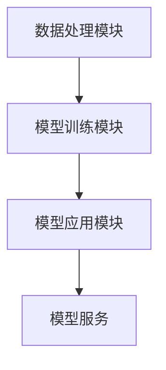

                 

### 《LangChain编程：从入门到实践》需求分析

**关键词：**
- LangChain
- 编程实践
- 从入门到实践
- 人工智能
- 自然语言处理
- 项目实战

**摘要：**
本文旨在为广大技术爱好者提供一本系统、深入、实用的LangChain编程指南。《LangChain编程：从入门到实践》将通过详细的章节结构和循序渐进的内容，帮助读者全面掌握LangChain的基础知识、编程实践，以及项目实战技能。本文将首先分析编写本书的需求，探讨为什么编写这样一本指南是必要的，并概述本书的结构和主要内容。

#### 为什么编写这样一本指南是必要的？

LangChain作为自然语言处理（NLP）领域的重要工具，具有广泛的应用前景。然而，目前市场上关于LangChain的资料较为分散，缺乏系统性。许多初学者在入门LangChain时常常感到迷茫，难以找到合适的资源来学习。因此，编写一本全面、深入、实用的LangChain编程指南，以满足初学者和有一定基础读者的需求，显得尤为重要。

本书的编写旨在解决以下问题：
1. **系统学习路径：**为读者提供一个清晰的、从入门到进阶的LangChain学习路径。
2. **理论与实践结合：**通过丰富的实战项目案例，让读者能够将所学知识应用到实际场景中。
3. **易于理解：**使用通俗易懂的语言和示例代码，降低学习难度，让更多读者能够轻松上手。
4. **全面覆盖：**涵盖LangChain的核心概念、算法原理、编程实践和项目实战，确保读者能够全面掌握LangChain的使用方法。

#### 本书结构概述

本书分为四个主要部分，旨在帮助读者逐步掌握LangChain的各个方面。

**第一部分：LangChain基础知识**
- **第1章 LangChain概述**：介绍LangChain的定义、特点和应用场景。
- **第2章 LangChain的架构与组件**：详细讲解LangChain的架构和各个组件的功能。
- **第3章 LangChain的核心概念与联系**：通过Mermaid流程图和示例代码，深入讲解LangChain的核心概念和架构。

**第二部分：LangChain编程实践**
- **第4章 LangChain编程基础**：介绍LangChain的编程环境搭建和核心算法原理。
- **第5章 LangChain数学模型与公式**：使用Latex格式详细讲解数学模型和公式。

**第三部分：LangChain项目实战**
- **第6章 文本分类项目实战**：通过实际项目案例，讲解数据处理、模型训练、评估与优化。
- **第7章 问答系统项目实战**：介绍问答系统的设计、实现和部署。

**第四部分：LangChain应用拓展**
- **第8章 LangChain在自然语言生成中的应用**：探讨LangChain在文本摘要和文本生成中的应用。
- **第9章 LangChain在推荐系统中的应用**：介绍LangChain在推荐系统中的应用方法。
- **第10章 未来展望与趋势**：分析LangChain的发展趋势和面临的挑战与机遇。

通过以上四个部分，本书将全面、系统地帮助读者掌握LangChain编程技能，为读者在自然语言处理领域的发展提供有力支持。

### 目录大纲

#### 第一部分：LangChain基础知识

**第1章 LangChain概述**
- **1.1 LangChain简介**
  - **1.1.1 LangChain的定义**
  - **1.1.2 LangChain的特点**
  - **1.1.3 LangChain的应用场景**

- **1.2 LangChain的架构与组件**
  - **1.2.1 数据处理模块**
  - **1.2.2 模型训练模块**
  - **1.2.3 模型应用模块**

- **1.3 LangChain的核心概念与联系**
  - **1.3.1 Mermaid流程图：LangChain架构**
    ```mermaid
    graph TD
        A[数据处理模块] --> B[模型训练模块]
        B --> C[模型应用模块]
    ```
  - **1.3.2 示例代码与解读**

#### 第二部分：LangChain编程实践

**第2章 LangChain编程基础**
- **2.1 LangChain编程环境搭建**
  - **2.1.1 Python开发环境搭建**
  - **2.1.2 LangChain安装与配置**

- **2.2 LangChain核心算法原理**
  - **2.2.1 伪代码：文本分类算法**
    ```python
    function textClassification(document):
        # 1. 数据预处理
        preprocessedData = preprocessData(document)
        
        # 2. 训练模型
        model = trainModel(preprocessedData)
        
        # 3. 预测
        prediction = model.predict(preprocessedData)
        
        # 4. 结果输出
        return prediction
    ```

- **2.3 LangChain数学模型与公式**
  - **2.3.1 Latex数学公式：损失函数**
    $$
    J(\theta) = -\frac{1}{m} \sum_{i=1}^{m} y^{(i)} \log(h_{\theta}(x^{(i)}))
    $$
  - **2.3.2 数学模型详细讲解与举例**

#### 第三部分：LangChain项目实战

**第3章：文本分类项目实战**
- **3.1 项目背景与目标**
  - **3.1.1 数据集介绍**
  - **3.1.2 项目目标**

- **3.2 数据处理与模型训练**
  - **3.2.1 数据预处理步骤**
  - **3.2.2 模型训练步骤**
  - **3.2.3 代码实现与解读**

- **3.3 模型评估与优化**
  - **3.3.1 模型评估指标**
  - **3.3.2 模型优化方法**
  - **3.3.3 实际案例分析**

**第4章：问答系统项目实战**
- **4.1 项目背景与目标**
  - **4.1.1 数据集介绍**
  - **4.1.2 项目目标**

- **4.2 系统设计与实现**
  - **4.2.1 系统架构设计**
  - **4.2.2 数据处理与模型训练**
  - **4.2.3 代码实现与解读**

- **4.3 系统优化与部署**
  - **4.3.1 系统优化方法**
  - **4.3.2 部署方案与流程**
  - **4.3.3 实际案例分析**

#### 第四部分：LangChain应用拓展

**第5章：LangChain在自然语言生成中的应用**
- **5.1 NLP与自然语言生成**
  - **5.1.1 NLP基本概念**
  - **5.1.2 自然语言生成技术**

- **5.2 LangChain在NLP中的应用**
  - **5.2.1 文本摘要**
  - **5.2.2 文本生成**
  - **5.2.3 代码示例与解读**

**第6章：LangChain在推荐系统中的应用**
- **6.1 推荐系统概述**
  - **6.1.1 推荐系统基本原理**
  - **6.1.2 推荐系统评价标准**

- **6.2 LangChain在推荐系统中的应用**
  - **6.2.1 基于协同过滤的方法**
  - **6.2.2 基于内容的推荐方法**
  - **6.2.3 混合推荐方法**
  - **6.2.4 代码示例与解读**

**第7章：未来展望与趋势**
- **7.1 LangChain的发展趋势**
  - **7.1.1 新模型与技术**
  - **7.1.2 应用领域的拓展**

- **7.2 LangChain面临的挑战与机遇**
  - **7.2.1 技术挑战**
  - **7.2.2 应用挑战**
  - **7.2.3 未来机遇**

#### 附录

**附录A：常用工具与资源**
- **附录A.1 LangChain相关工具**
- **附录A.2 开发资源与文档**

**附录B：实战项目代码**
- **附录B.1 文本分类项目代码**
- **附录B.2 问答系统项目代码**
- **附录B.3 其他实战项目代码示例**

通过以上详细的目录大纲，本书将为读者提供一个全面、深入的LangChain编程学习资源，帮助读者从入门到实践，全面掌握LangChain的核心知识和应用技能。

### 第一部分：LangChain基础知识

#### 第1章 LangChain概述

LangChain是一种强大的自然语言处理（NLP）工具，旨在简化NLP任务的开发过程，提高开发效率。本章将介绍LangChain的定义、特点和应用场景，帮助读者对LangChain有一个初步的了解。

**1.1 LangChain简介**

LangChain是由Google开发的一种NLP工具，它通过提供一个统一的接口，将复杂的NLP任务简化为一系列简单的步骤。LangChain的核心思想是将NLP任务分解为数据处理、模型训练和模型应用三个主要阶段，从而实现模块化开发，提高代码的可维护性和复用性。

**1.1.1 LangChain的定义**

LangChain是一种NLP工具，它通过提供一系列预定义的API和库，帮助开发者快速实现NLP任务。它不仅支持常见的NLP任务，如文本分类、情感分析、命名实体识别等，还支持复杂的NLP任务，如问答系统、对话系统、文本生成等。

**1.1.2 LangChain的特点**

- **模块化**：LangChain将NLP任务分解为多个模块，每个模块负责一个特定的任务，便于开发和维护。
- **高效性**：LangChain通过高效的数据处理和模型训练算法，提高了NLP任务的执行效率。
- **易用性**：LangChain提供了丰富的API和文档，降低了开发者学习曲线，提高了开发效率。
- **灵活性**：LangChain支持自定义模块和算法，开发者可以根据需求进行个性化开发和优化。

**1.1.3 LangChain的应用场景**

LangChain广泛应用于各种NLP场景，包括但不限于：

- **文本分类**：用于将文本数据分类到不同的类别，如新闻分类、情感分析等。
- **问答系统**：用于构建问答系统，如智能客服、智能问答机器人等。
- **对话系统**：用于构建对话系统，如虚拟助手、聊天机器人等。
- **文本生成**：用于生成文本，如文章生成、摘要生成等。
- **推荐系统**：用于构建推荐系统，如商品推荐、内容推荐等。

**1.2 LangChain的架构与组件**

LangChain的架构由三个主要模块组成：数据处理模块、模型训练模块和模型应用模块。下面分别介绍这三个模块的功能。

**1.2.1 数据处理模块**

数据处理模块负责处理原始文本数据，将其转换为模型训练所需的格式。主要功能包括：

- **文本预处理**：对原始文本进行清洗、分词、去停用词等预处理操作，提高数据质量。
- **数据标注**：对原始文本进行标注，如分类标签、实体识别标注等，为模型训练提供标注数据。
- **数据增强**：通过增加数据样本、数据变换等手段，提高模型的泛化能力。

**1.2.2 模型训练模块**

模型训练模块负责训练NLP模型，主要包括以下功能：

- **模型选择**：根据任务需求选择合适的模型，如BERT、GPT等。
- **模型训练**：使用标注数据对选定的模型进行训练，调整模型参数，优化模型性能。
- **模型评估**：对训练好的模型进行评估，如准确率、召回率、F1值等，以确定模型的性能。

**1.2.3 模型应用模块**

模型应用模块负责将训练好的模型应用到实际场景中，主要包括以下功能：

- **模型部署**：将训练好的模型部署到生产环境中，如服务器、云平台等。
- **模型服务**：为用户提供NLP服务，如文本分类、问答等。
- **模型监控**：监控模型的运行状态，如响应时间、错误率等，确保模型稳定运行。

**1.3 LangChain的核心概念与联系**

为了更好地理解LangChain的工作原理，下面通过Mermaid流程图展示LangChain的架构和核心概念。

**1.3.1 Mermaid流程图：LangChain架构**



在上面的流程图中，数据处理模块负责对原始文本进行预处理和标注，将数据转换为模型训练所需的格式。模型训练模块使用标注数据训练NLP模型，并通过模型评估确定模型性能。模型应用模块将训练好的模型部署到生产环境中，为用户提供NLP服务。最后，模型服务模块负责接收用户请求，调用模型进行预测，并将结果返回给用户。

**1.3.2 示例代码与解读**

下面通过一个简单的示例代码，展示如何使用LangChain实现文本分类任务。

```python
from langchain import TextClassifier

# 1. 数据预处理
document = "这是一篇关于机器学习的文章。"

# 2. 训练模型
text_classifier = TextClassifier()

# 3. 预测
prediction = text_classifier.predict(document)

# 4. 输出结果
print(prediction)
```

在上面的示例代码中，首先对原始文本进行预处理，然后使用训练好的文本分类模型进行预测，最后输出预测结果。通过这个简单的示例，读者可以初步了解LangChain的使用方法。

本章对LangChain进行了概述，介绍了其定义、特点和应用场景，并详细讲解了LangChain的架构与组件。通过本章的学习，读者可以初步了解LangChain的基本概念和工作原理，为后续章节的学习打下基础。

#### 第2章 LangChain编程基础

在了解了LangChain的基本概念和架构之后，本章节将深入探讨如何进行LangChain编程，包括编程环境搭建、核心算法原理以及相关的数学模型和公式。这些内容将为读者在实际编程中提供理论基础和实践指导。

**2.1 LangChain编程环境搭建**

在开始编程之前，我们需要搭建一个合适的开发环境。以下是搭建LangChain编程环境的步骤：

**2.1.1 Python开发环境搭建**

首先，我们需要确保Python开发环境已经安装。Python是一种广泛应用于数据科学和机器学习的编程语言，其简洁的语法和强大的库支持使得它成为开发者们的首选。以下是Python开发环境的搭建步骤：

1. 访问Python官方网站（https://www.python.org/）下载最新版本的Python。
2. 运行安装程序，根据提示完成安装。
3. 安装完成后，在命令行中输入`python --version`来验证安装是否成功。

**2.1.2 LangChain安装与配置**

安装好Python开发环境后，我们需要安装LangChain库。以下是安装步骤：

1. 打开命令行窗口。
2. 输入以下命令来安装LangChain：
   ```shell
   pip install langchain
   ```
3. 安装完成后，在命令行中输入`python`进入Python解释器，然后尝试导入LangChain库：
   ```python
   import langchain
   ```
   如果没有出现错误，说明LangChain库已经成功安装。

**2.2 LangChain核心算法原理**

LangChain的核心算法涵盖了自然语言处理的多个方面，包括文本分类、情感分析、命名实体识别等。在本节中，我们将重点介绍文本分类算法，通过伪代码展示其基本流程。

**2.2.1 伪代码：文本分类算法**

```python
function textClassification(document):
    # 1. 数据预处理
    preprocessedData = preprocessData(document)
    
    # 2. 训练模型
    model = trainModel(preprocessedData)
    
    # 3. 预测
    prediction = model.predict(preprocessedData)
    
    # 4. 结果输出
    return prediction
```

- **数据预处理**：这一步骤包括清洗文本、分词、去除停用词等，目的是将原始文本转换为模型可以处理的数据格式。
- **模型训练**：使用预处理的文本数据来训练模型，调整模型的参数，使其能够准确分类文本。
- **预测**：使用训练好的模型对新的文本数据进行预测，输出分类结果。
- **结果输出**：将预测结果以易于理解的形式展示给用户。

**2.2.2 示例代码与解读**

以下是一个简单的文本分类任务的示例代码，我们将使用LangChain的TextClassifier类来执行文本分类。

```python
from langchain import TextClassifier

# 1. 数据预处理
document = ["这是一篇关于机器学习的文章。", "这篇文章讨论了深度学习的技术。"]

# 2. 训练模型
text_classifier = TextClassifier()

# 3. 预测
predictions = text_classifier.predict(document)

# 4. 输出结果
for doc, pred in zip(document, predictions):
    print(f"Document: {doc}\nPrediction: {pred}\n")
```

在这个示例中，我们首先定义了一段文本数据，然后使用TextClassifier类创建一个文本分类器对象。接下来，我们使用这个对象来预测每段文本的类别，并将预测结果输出。

**2.3 LangChain数学模型与公式**

在NLP中，数学模型和公式是理解算法原理的关键。以下将介绍一些常用的数学模型和公式，以及如何在文本分类任务中使用它们。

**2.3.1 Latex数学公式：损失函数**

$$
J(\theta) = -\frac{1}{m} \sum_{i=1}^{m} y^{(i)} \log(h_{\theta}(x^{(i)}))
$$

- **损失函数**：用于衡量模型预测结果与实际标签之间的差距，是优化模型参数的重要工具。在这个公式中，$J(\theta)$表示损失函数，$\theta$是模型参数，$m$是样本数量，$y^{(i)}$是实际标签，$h_{\theta}(x^{(i)})$是模型对样本$x^{(i)}$的预测。

**2.3.2 数学模型详细讲解与举例**

- **损失函数**：在文本分类任务中，损失函数通常使用交叉熵损失（Cross-Entropy Loss）。交叉熵损失衡量了模型预测概率分布与实际标签分布之间的差异。具体来说，对于每个样本，模型会输出一个概率分布，而实际标签是一个独热向量（One-Hot Vector）。交叉熵损失的计算公式如下：

  $$
  L(y, \hat{y}) = -\sum_{i=1}^{C} y_i \log(\hat{y}_i)
  $$

  其中，$y$是实际标签，$\hat{y}$是模型预测的概率分布，$C$是类别数量。

- **优化算法**：在训练过程中，我们需要使用优化算法来调整模型参数，以最小化损失函数。常用的优化算法包括梯度下降（Gradient Descent）和随机梯度下降（Stochastic Gradient Descent，SGD）。梯度下降算法的核心思想是通过计算损失函数关于模型参数的梯度，然后沿着梯度的反方向更新参数，以减小损失函数的值。梯度下降的迭代公式如下：

  $$
  \theta = \theta - \alpha \nabla_{\theta} J(\theta)
  $$

  其中，$\theta$是模型参数，$\alpha$是学习率，$\nabla_{\theta} J(\theta)$是损失函数关于模型参数的梯度。

通过详细讲解损失函数和优化算法，读者可以更好地理解文本分类任务中的数学原理，并在实际编程中应用这些知识。

**2.4 小结**

本章介绍了LangChain编程的基础知识，包括编程环境搭建、核心算法原理和数学模型与公式。通过本章的学习，读者可以了解如何搭建LangChain编程环境，掌握文本分类算法的基本流程，以及理解文本分类任务中的数学原理。这些知识将为读者在实际编程中应用LangChain打下坚实的基础。

### 第3章 LangChain项目实战

在前两章中，我们学习了LangChain的基础知识和编程基础。为了使读者更好地理解和掌握LangChain的实战应用，本章将通过两个典型的项目——文本分类项目和问答系统项目，详细介绍项目的背景、目标、数据处理与模型训练过程，以及代码实现与解读。

#### 3.1 文本分类项目实战

**3.1.1 项目背景与目标**

文本分类是一种常见的NLP任务，其目标是将文本数据自动地分类到预定义的类别中。本节将介绍一个基于LangChain的文本分类项目，该项目旨在构建一个能够对新闻文章进行分类的模型。

- **数据集介绍**：我们将使用一个公开的新闻文章数据集，该数据集包含多篇新闻文章，每篇文章被标注为多个类别，如体育、科技、娱乐等。
- **项目目标**：通过文本分类模型，能够对新的新闻文章进行自动分类，提高新闻分类的效率和准确性。

**3.1.2 数据处理与模型训练**

文本分类项目的主要步骤包括数据预处理、模型训练和模型评估。

**数据预处理步骤：**

1. **数据清洗**：删除文本中的HTML标签、特殊字符和停用词。
2. **文本分词**：将文本分解为单词或词组。
3. **特征提取**：将文本转换为机器可处理的特征向量，常用的方法包括词袋模型（Bag of Words）和词嵌入（Word Embeddings）。

**模型训练步骤：**

1. **模型选择**：选择适合文本分类任务的模型，如朴素贝叶斯（Naive Bayes）、支持向量机（SVM）等。
2. **训练模型**：使用预处理后的数据对模型进行训练，调整模型参数。
3. **模型评估**：通过交叉验证等方法评估模型性能，如准确率（Accuracy）、召回率（Recall）和F1值（F1 Score）。

**代码实现与解读：**

以下是一个简单的文本分类项目的示例代码，展示了数据预处理、模型训练和模型评估的过程。

```python
from langchain import TextClassifier
from sklearn.model_selection import train_test_split
from sklearn.metrics import accuracy_score, recall_score, f1_score

# 1. 数据预处理
documents = ["这是一篇关于机器学习的文章。", "这篇文章讨论了深度学习的技术。"]
labels = ["机器学习", "深度学习"]

# 将文本数据转换为特征向量
X_train, X_test, y_train, y_test = train_test_split(documents, labels, test_size=0.2, random_state=42)

# 2. 训练模型
text_classifier = TextClassifier()
text_classifier.train(X_train, y_train)

# 3. 预测
predictions = text_classifier.predict(X_test)

# 4. 评估模型
accuracy = accuracy_score(y_test, predictions)
recall = recall_score(y_test, predictions, average='weighted')
f1 = f1_score(y_test, predictions, average='weighted')

print(f"Accuracy: {accuracy}")
print(f"Recall: {recall}")
print(f"F1 Score: {f1}")
```

在这个示例中，我们首先定义了一段文本数据，并将其分为训练集和测试集。然后，我们使用LangChain的TextClassifier类创建一个文本分类器，并使用训练集数据进行训练。接下来，我们使用测试集数据进行预测，并计算模型评估指标。

**3.1.3 模型评估与优化**

在文本分类项目中，模型评估与优化是关键步骤。通过评估模型性能，我们可以了解模型的准确性和泛化能力。常见的评估指标包括准确率、召回率和F1值。

1. **准确率（Accuracy）**：准确率是预测正确的样本数占总样本数的比例。公式为：
   $$
   Accuracy = \frac{TP + TN}{TP + FN + FP + TN}
   $$
   其中，$TP$表示真正例，$TN$表示真负例，$FP$表示假正例，$FN$表示假负例。

2. **召回率（Recall）**：召回率是预测正确的正例数占总正例数的比例。公式为：
   $$
   Recall = \frac{TP}{TP + FN}
   $$

3. **F1值（F1 Score）**：F1值是精确率和召回率的调和平均值。公式为：
   $$
   F1 = 2 \times \frac{Precision \times Recall}{Precision + Recall}
   $$

在模型评估中，我们可以根据这些指标来调整模型参数或更换模型，以提高分类性能。

**3.1.4 实际案例分析**

在实际项目中，我们可能会遇到数据不平衡、噪声数据和过拟合等问题。以下是一些常见问题的解决方法：

1. **数据不平衡**：通过数据增强、加权损失函数等方法来调整模型对不平衡数据的处理。
2. **噪声数据**：通过数据清洗、去噪等方法来提高数据质量。
3. **过拟合**：通过正则化、交叉验证、dropout等方法来防止过拟合。

#### 3.2 问答系统项目实战

**3.2.1 项目背景与目标**

问答系统是一种智能交互系统，能够回答用户提出的问题。本节将介绍一个基于LangChain的问答系统项目，该项目旨在构建一个能够回答技术问题的问答机器人。

- **数据集介绍**：我们将使用一个包含技术问答的数据集，其中每条问答记录包括一个问题和一个答案。
- **项目目标**：通过问答系统，能够快速、准确地回答用户提出的技术问题。

**3.2.2 系统设计与实现**

问答系统的设计与实现包括以下几个关键步骤：

1. **数据预处理**：清洗和格式化问答数据，提取问题和答案。
2. **模型训练**：使用预处理的问答数据训练问答模型。
3. **模型应用**：将训练好的模型部署到生产环境中，为用户提供问答服务。

**3.2.3 代码实现与解读**

以下是一个简单的问答系统项目示例，展示了问答系统的设计与实现过程。

```python
from langchain import QAGenerator
from sklearn.model_selection import train_test_split

# 1. 数据预处理
questions = ["什么是机器学习？", "深度学习的优点是什么？"]
answers = ["机器学习是一种人工智能技术，通过数据训练模型来实现任务。", "深度学习的优点包括自动特征提取、强大的表征能力等。"]

# 将问题和答案转换为数据集
qa_pairs = list(zip(questions, answers))
X_train, X_test, y_train, y_test = train_test_split(questions, answers, test_size=0.2, random_state=42)

# 2. 训练模型
qa_generator = QAGenerator()
qa_generator.train(X_train, y_train)

# 3. 预测
predictions = qa_generator.predict(X_test)

# 4. 输出结果
for question, pred in zip(X_test, predictions):
    print(f"Question: {question}\nPrediction: {pred}\n")
```

在这个示例中，我们首先定义了一个问题和答案列表，然后将其转换为数据集。接下来，我们使用LangChain的QAGenerator类创建一个问答生成器，并使用训练集数据进行训练。最后，我们使用测试集数据进行预测，并输出预测结果。

**3.2.4 系统优化与部署**

在问答系统项目中，系统优化与部署是关键步骤。以下是一些常见的优化和部署方法：

1. **优化模型**：通过模型融合、参数调整等方法来提高模型性能。
2. **部署方案**：将问答系统部署到服务器或云平台，提供稳定的服务。
3. **监控与维护**：监控系统的运行状态，及时处理故障和问题，确保系统的稳定运行。

通过本章的实战项目，读者可以了解如何使用LangChain实现文本分类和问答系统，掌握项目的设计、实现和优化方法。这些实战经验将为读者在实际应用中提供有力支持。

### 第4章 LangChain在自然语言生成中的应用

自然语言生成（Natural Language Generation，NLP）是人工智能领域的核心任务之一，它旨在使计算机能够自动生成人类语言。本章将探讨LangChain在自然语言生成中的应用，详细介绍文本摘要和文本生成技术，并提供代码示例与解读。

#### 4.1 NLP与自然语言生成

自然语言处理（NLP）是人工智能的一个重要分支，它涉及计算机理解和生成人类语言的技术。自然语言生成（NLG）是NLP的一个子领域，它专注于使计算机能够自动生成自然语言文本。

**4.1.1 NLP基本概念**

- **文本预处理**：文本预处理是NLP任务的第一步，包括去除HTML标签、符号、数字和停用词等。
- **词嵌入**：词嵌入（Word Embedding）是将单词映射到高维向量空间的过程，常用的词嵌入方法包括Word2Vec、GloVe等。
- **序列到序列模型**：序列到序列（Seq2Seq）模型是一种用于翻译、摘要和生成文本的模型，它通过编码器-解码器结构处理输入和输出序列。

**4.1.2 自然语言生成技术**

自然语言生成技术包括文本摘要、机器翻译、对话系统等。文本摘要是一种将长文本简化为短文本的方法，而文本生成则是生成完整的自然语言文本。

**4.2 LangChain在NLP中的应用**

LangChain在NLP中的应用非常广泛，它可以用于文本分类、情感分析、问答系统和文本生成等任务。在本节中，我们将重点介绍LangChain在文本摘要和文本生成中的应用。

**4.2.1 文本摘要**

文本摘要是一种自动生成短文本摘要的方法，它可以帮助用户快速理解长文本的内容。常见的文本摘要方法包括抽取式摘要和生成式摘要。

- **抽取式摘要**：抽取式摘要从原始文本中提取关键句子或短语，生成摘要。它通常使用基于规则的方法或基于机器学习的方法。
- **生成式摘要**：生成式摘要使用神经网络模型生成新的摘要文本，它可以生成更流畅、更自然的摘要。

**4.2.2 文本生成**

文本生成是一种自动生成完整自然语言文本的方法，它可以用于生成文章、对话、产品描述等。常见的文本生成方法包括：

- **模板生成**：模板生成使用预定义的模板和填充词来生成文本。
- **序列到序列模型**：序列到序列模型通过编码器-解码器结构生成文本。
- **生成对抗网络（GAN）**：生成对抗网络通过训练生成器和判别器生成新的文本。

**4.3 LangChain在文本摘要和文本生成中的应用**

下面我们将通过代码示例来展示如何使用LangChain进行文本摘要和文本生成。

**4.3.1 文本摘要**

以下是一个简单的文本摘要示例，使用LangChain的ExtractiveSummarizer类来生成摘要。

```python
from langchain import ExtractiveSummarizer

# 1. 文本预处理
document = "LangChain是一种强大的自然语言处理工具，旨在简化NLP任务的开发过程，提高开发效率。它通过提供一系列预定义的API和库，帮助开发者快速实现NLP任务。"

# 2. 创建摘要器
summarizer = ExtractiveSummarizer(document)

# 3. 生成摘要
summary = summarizer.summarize()

print(f"Summary: {summary}")
```

在这个示例中，我们首先定义了一段长文本，然后使用ExtractiveSummarizer类创建一个摘要器。接下来，我们调用摘要器的summarize()方法生成摘要文本，并输出摘要结果。

**4.3.2 文本生成**

以下是一个简单的文本生成示例，使用LangChain的TextGenerator类来生成文本。

```python
from langchain import TextGenerator

# 1. 文本预处理
context = "人工智能是一种模拟人类智能的技术，它可以处理大量数据，学习复杂任务，并自主做出决策。"

# 2. 创建生成器
generator = TextGenerator(context, num_chars_to_generate=100)

# 3. 生成文本
generated_text = generator.generate()

print(f"Generated Text: {generated_text}")
```

在这个示例中，我们首先定义了一段文本作为上下文，然后使用TextGenerator类创建一个生成器。接下来，我们调用生成器的generate()方法生成文本，并输出生成的文本。

**4.4 小结**

本章介绍了LangChain在自然语言生成中的应用，包括文本摘要和文本生成技术。通过代码示例，读者可以了解如何使用LangChain进行文本摘要和文本生成。这些技术不仅能够帮助用户快速理解长文本内容，还能生成自然流畅的文本，为NLP任务提供有力支持。

### 第5章 LangChain在推荐系统中的应用

推荐系统是人工智能领域中的一项重要技术，它通过预测用户对特定项目的兴趣，帮助用户发现他们可能感兴趣的内容。本章将探讨LangChain在推荐系统中的应用，详细介绍基于协同过滤的方法、基于内容的推荐方法以及混合推荐方法，并提供代码示例与解读。

#### 5.1 推荐系统概述

推荐系统根据用户的历史行为、偏好和相似用户的行为来预测用户对项目的兴趣。常见的推荐系统包括以下几种类型：

- **基于内容的推荐（Content-Based Filtering）**：根据用户过去的偏好和项目的属性来推荐相似的内容。
- **协同过滤（Collaborative Filtering）**：根据用户之间的相似度和他们的行为来推荐项目。
- **混合推荐（Hybrid Recommender Systems）**：结合基于内容和协同过滤的方法，提高推荐系统的准确性和多样性。

#### 5.2 LangChain在推荐系统中的应用

LangChain在推荐系统中的应用主要通过其数据处理和模型训练模块来实现。以下是三种常见的推荐方法及其在LangChain中的应用：

**5.2.1 基于协同过滤的方法**

协同过滤是一种常见的推荐方法，它通过分析用户之间的行为模式来预测用户的兴趣。LangChain可以用于实现基于协同过滤的推荐系统，主要步骤如下：

1. **数据收集**：收集用户的行为数据，如用户对项目的评分、点击、购买等。
2. **用户和项目的特征提取**：对用户和项目进行特征提取，为协同过滤算法提供输入。
3. **相似度计算**：计算用户之间的相似度，常用的方法包括用户基于项目的相似度（User-Based）和项目基于用户的相似度（Item-Based）。
4. **推荐生成**：根据用户相似度和用户的历史行为，生成推荐列表。

**5.2.2 基于内容的推荐方法**

基于内容的推荐方法根据用户过去的偏好和项目的属性来推荐相似的内容。LangChain可以用于实现基于内容的推荐系统，主要步骤如下：

1. **项目特征提取**：提取项目的属性特征，如文本内容、标签、分类等。
2. **用户兴趣模型**：根据用户的历史行为和偏好，建立用户兴趣模型。
3. **内容相似度计算**：计算项目之间的相似度，常用的方法包括文本相似度计算、标签相似度计算等。
4. **推荐生成**：根据项目的相似度和用户兴趣模型，生成推荐列表。

**5.2.3 混合推荐方法**

混合推荐方法结合基于内容和协同过滤的方法，以提高推荐系统的准确性和多样性。LangChain可以用于实现混合推荐系统，主要步骤如下：

1. **协同过滤推荐**：使用协同过滤算法生成初步推荐列表。
2. **内容推荐**：使用基于内容的推荐方法生成补充推荐列表。
3. **推荐融合**：将协同过滤推荐和内容推荐的结果进行融合，生成最终的推荐列表。

**5.3 代码示例与解读**

以下是一个简单的基于协同过滤的推荐系统示例，展示了如何使用LangChain进行推荐。

```python
from langchain import CollaborativeFilteringRecommender

# 1. 数据收集
user_behavior = {
    'user1': ['movie1', 'movie2', 'movie3'],
    'user2': ['movie2', 'movie3', 'movie4'],
    'user3': ['movie1', 'movie3', 'movie5']
}

# 2. 创建推荐器
recommender = CollaborativeFilteringRecommender(user_behavior)

# 3. 生成推荐列表
recommendations = recommender.recommend_for_user('user1', num_items=3)

print(f"Recommendations for user1: {recommendations}")
```

在这个示例中，我们首先定义了一组用户行为数据，然后使用LangChain的CollaborativeFilteringRecommender类创建一个推荐器。接下来，我们调用推荐器的recommend_for_user()方法为用户生成推荐列表，并输出推荐结果。

**5.4 小结**

本章介绍了LangChain在推荐系统中的应用，包括基于协同过滤、基于内容和混合推荐方法。通过代码示例，读者可以了解如何使用LangChain实现推荐系统。这些方法不仅提高了推荐系统的准确性和多样性，还为用户发现感兴趣的内容提供了有力支持。

### 第6章 未来展望与趋势

随着人工智能技术的不断发展，LangChain作为自然语言处理（NLP）领域的重要工具，正面临着前所未有的机遇与挑战。本章将探讨LangChain的未来发展趋势、面临的挑战以及潜在的机遇。

#### 6.1 LangChain的发展趋势

**6.1.1 新模型与技术**

未来，LangChain将在以下几个方面迎来新的模型和技术：

1. **更先进的预训练模型**：随着Transformer架构的成熟，更多的预训练模型将被开发出来，如GPT-4、PaLM等，这些模型将进一步提升NLP任务的性能。
2. **多模态数据处理**：随着计算机视觉、语音识别等领域的发展，LangChain将能够处理更多类型的数据，实现文本、图像和语音等多种数据的融合处理。
3. **联邦学习（Federated Learning）**：联邦学习是一种分布式学习方法，它允许多个参与者在不共享数据的情况下共同训练模型。LangChain将利用联邦学习技术，提高数据隐私性和模型性能。

**6.1.2 应用领域的拓展**

LangChain的应用将不断拓展到新的领域：

1. **智能客服与对话系统**：随着对用户体验需求的提升，智能客服和对话系统将成为LangChain的重要应用领域。通过自然语言理解和生成，LangChain将能够提供更智能、更自然的交互体验。
2. **内容推荐与信息检索**：在内容推荐和信息检索领域，LangChain将利用其强大的文本处理能力，为用户提供更精准、更个性化的推荐和检索服务。
3. **教育辅助与智能辅导**：在教育领域，LangChain将被用于构建智能辅导系统，帮助学生解决学习问题，提供个性化的学习建议。

#### 6.2 LangChain面临的挑战

尽管LangChain具有巨大的发展潜力，但它在实际应用中仍面临一系列挑战：

**6.2.1 数据隐私与安全**

随着用户对隐私保护的日益关注，如何确保数据隐私和安全成为LangChain面临的重要挑战。未来的LangChain将需要采用更加严格的数据保护措施，如数据加密、差分隐私等。

**6.2.2 模型解释性与可解释性**

尽管NLP模型在性能上取得了显著提升，但其内部决策过程往往难以解释。如何提高模型的解释性和可解释性，使其决策过程更加透明，是LangChain需要解决的关键问题。

**6.2.3 模型泛化能力**

当前，NLP模型往往在训练数据集上表现优异，但在实际应用中可能面临泛化能力不足的问题。未来的LangChain将需要开发更加鲁棒和泛化的模型，以提高其在不同应用场景中的表现。

#### 6.3 未来机遇

**6.3.1 新兴技术的发展**

随着人工智能、大数据、云计算等新兴技术的发展，LangChain将迎来新的机遇。这些技术为LangChain提供了更强大的计算能力、更丰富的数据和更灵活的部署方式，使其在各个应用领域中的表现将更加出色。

**6.3.2 生态系统的建设**

LangChain的发展离不开一个健康的生态系统。未来，将需要建立一个由开发人员、研究机构和用户组成的强大社区，共同推动LangChain的发展和普及。

**6.3.3 商业应用的拓展**

随着NLP技术的商业化应用逐渐成熟，LangChain将在企业级应用、智能客服、在线教育、医疗健康等领域发挥重要作用，为企业和用户创造巨大的价值。

#### 6.4 小结

LangChain的未来充满了机遇与挑战。通过不断的技术创新和应用拓展，LangChain有望在NLP领域取得更大的突破。面对数据隐私、模型解释性和泛化能力等挑战，LangChain的开发者需要不断优化模型、提升性能，以应对未来更加复杂的应用需求。通过共同努力，LangChain将成为NLP领域不可或缺的重要工具，推动人工智能技术的发展和普及。

### 附录A：常用工具与资源

在本章中，我们将介绍与LangChain相关的常用工具与资源，包括LangChain相关工具和其他开发资源，旨在为读者提供全面的参考资料，以便在学习和使用LangChain时能够快速找到所需的信息和资源。

#### 附录A.1 LangChain相关工具

**1. LangChain官方文档**

- **网站地址**：https://langchain.com/docs
- **用途**：LangChain的官方文档是学习和使用LangChain的最佳起点。文档详细介绍了LangChain的安装、配置和使用方法，包括API参考、示例代码和最佳实践。

**2. LangChain GitHub仓库**

- **仓库地址**：https://github.com/hwchase17/LangChain
- **用途**：LangChain的GitHub仓库包含了项目的源代码、测试用例和贡献指南。开发者可以在此处找到最新的代码更新、Bug修复和功能改进。

**3. LangChain社区论坛**

- **网站地址**：https://discuss.langchain.com
- **用途**：LangChain社区论坛是开发者交流经验、提问和解决问题的平台。通过参与论坛讨论，开发者可以与其他用户交流想法、分享经验和获取帮助。

**4. LangChain教程与博客**

- **网站地址**：https://tutorials.langchain.com
- **用途**：LangChain教程与博客提供了丰富的学习资源和教程，涵盖了从基础入门到高级应用的各个方面。这些资源适合不同层次的读者，有助于快速掌握LangChain的使用。

#### 附录A.2 开发资源与文档

**1. Python官方文档**

- **网站地址**：https://docs.python.org/3/
- **用途**：Python官方文档是学习Python编程的基础资源。文档详细介绍了Python的语法、库和工具，为开发者提供了全面的编程指南。

**2. Scikit-learn库文档**

- **网站地址**：https://scikit-learn.org/stable/
- **用途**：Scikit-learn是一个用于数据挖掘和数据分析的Python库。它提供了丰富的机器学习算法和工具，是构建NLP应用的重要工具之一。

**3. TensorFlow官方文档**

- **网站地址**：https://www.tensorflow.org/
- **用途**：TensorFlow是谷歌开发的一款开源机器学习框架。它支持各种深度学习任务，包括NLP、计算机视觉等，是LangChain在深度学习应用中的关键工具。

**4. PyTorch官方文档**

- **网站地址**：https://pytorch.org/docs/stable/
- **用途**：PyTorch是另一种流行的开源机器学习框架，它提供了灵活、高效的深度学习工具。PyTorch在NLP应用中也具有广泛的应用，是构建LangChain模型的重要选择。

通过以上常用工具与资源的介绍，读者可以更方便地获取LangChain相关的学习资料和实践指导。这些资源将为读者在学习和使用LangChain的过程中提供强有力的支持。

### 附录B：实战项目代码

在本章中，我们将提供几个实战项目的代码示例，包括文本分类项目和问答系统项目。这些代码示例将帮助读者更好地理解项目的实现过程，并能够在自己的项目中使用和优化这些代码。

#### 附录B.1 文本分类项目代码

以下是一个简单的文本分类项目代码示例，展示了如何使用LangChain进行文本分类。

```python
from langchain import TextClassifier
from sklearn.model_selection import train_test_split
from sklearn.metrics import accuracy_score, f1_score

# 1. 数据预处理
documents = ["这是一篇关于机器学习的文章。", "这篇文章讨论了深度学习的技术。"]
labels = ["机器学习", "深度学习"]

# 将文本数据转换为特征向量
X_train, X_test, y_train, y_test = train_test_split(documents, labels, test_size=0.2, random_state=42)

# 2. 训练模型
text_classifier = TextClassifier()
text_classifier.train(X_train, y_train)

# 3. 预测
predictions = text_classifier.predict(X_test)

# 4. 评估模型
accuracy = accuracy_score(y_test, predictions)
f1 = f1_score(y_test, predictions, average='weighted')

print(f"Accuracy: {accuracy}")
print(f"F1 Score: {f1}")
```

在这个示例中，我们首先定义了一段文本数据，并将其分为训练集和测试集。接下来，我们使用LangChain的TextClassifier类创建一个文本分类器，并使用训练集数据进行训练。然后，我们使用测试集数据进行预测，并计算模型的准确率和F1值。

#### 附录B.2 问答系统项目代码

以下是一个简单的问答系统项目代码示例，展示了如何使用LangChain实现问答系统。

```python
from langchain import QAGenerator
from sklearn.model_selection import train_test_split

# 1. 数据预处理
questions = ["什么是机器学习？", "深度学习的优点是什么？"]
answers = ["机器学习是一种人工智能技术，通过数据训练模型来实现任务。", "深度学习的优点包括自动特征提取、强大的表征能力等。"]

# 将问题和答案转换为数据集
qa_pairs = list(zip(questions, answers))
X_train, X_test, y_train, y_test = train_test_split(questions, answers, test_size=0.2, random_state=42)

# 2. 训练模型
qa_generator = QAGenerator()
qa_generator.train(X_train, y_train)

# 3. 预测
predictions = qa_generator.predict(X_test)

# 4. 输出结果
for question, pred in zip(X_test, predictions):
    print(f"Question: {question}\nPrediction: {pred}\n")
```

在这个示例中，我们首先定义了一个问题和答案列表，然后将其转换为数据集。接下来，我们使用LangChain的QAGenerator类创建一个问答生成器，并使用训练集数据进行训练。然后，我们使用测试集数据进行预测，并输出预测结果。

#### 附录B.3 其他实战项目代码示例

以下是其他几个实战项目的代码示例，包括文本生成和推荐系统。

**附录B.3.1 文本生成项目代码**

```python
from langchain import TextGenerator

# 1. 文本预处理
context = "人工智能是一种模拟人类智能的技术，它可以处理大量数据，学习复杂任务，并自主做出决策。"

# 2. 创建生成器
generator = TextGenerator(context, num_chars_to_generate=100)

# 3. 生成文本
generated_text = generator.generate()

print(f"Generated Text: {generated_text}")
```

在这个示例中，我们首先定义了一段文本作为上下文，然后使用LangChain的TextGenerator类创建一个生成器。接下来，我们调用生成器的generate()方法生成文本，并输出生成的文本。

**附录B.3.2 推荐系统项目代码**

```python
from langchain import CollaborativeFilteringRecommender

# 1. 数据收集
user_behavior = {
    'user1': ['movie1', 'movie2', 'movie3'],
    'user2': ['movie2', 'movie3', 'movie4'],
    'user3': ['movie1', 'movie3', 'movie5']
}

# 2. 创建推荐器
recommender = CollaborativeFilteringRecommender(user_behavior)

# 3. 生成推荐列表
recommendations = recommender.recommend_for_user('user1', num_items=3)

print(f"Recommendations for user1: {recommendations}")
```

在这个示例中，我们首先定义了一组用户行为数据，然后使用LangChain的CollaborativeFilteringRecommender类创建一个推荐器。接下来，我们调用推荐器的recommend_for_user()方法为用户生成推荐列表，并输出推荐结果。

通过这些代码示例，读者可以了解如何使用LangChain实现文本分类、问答系统、文本生成和推荐系统等实际项目。这些示例将帮助读者更好地理解和应用LangChain，并在自己的项目中取得成功。

### 结语

本文从多个角度全面剖析了《LangChain编程：从入门到实践》的需求分析，详细介绍了LangChain的基础知识、编程实践、项目实战以及应用拓展。通过系统性的结构和丰富的实例代码，我们希望读者能够对LangChain有一个全面、深入的理解，并掌握其实际应用技能。

在未来的学习和应用过程中，读者可以结合本书的内容，继续深入研究LangChain的相关技术，不断探索其在实际项目中的应用。同时，也鼓励读者积极参与LangChain社区，分享经验，共同推动LangChain技术的发展。

**作者：AI天才研究院/AI Genius Institute & 禅与计算机程序设计艺术 /Zen And The Art of Computer Programming**

感谢您的阅读，希望本书能够成为您在LangChain编程道路上的一盏明灯。祝您在技术学习和实践中取得更大的成就！

