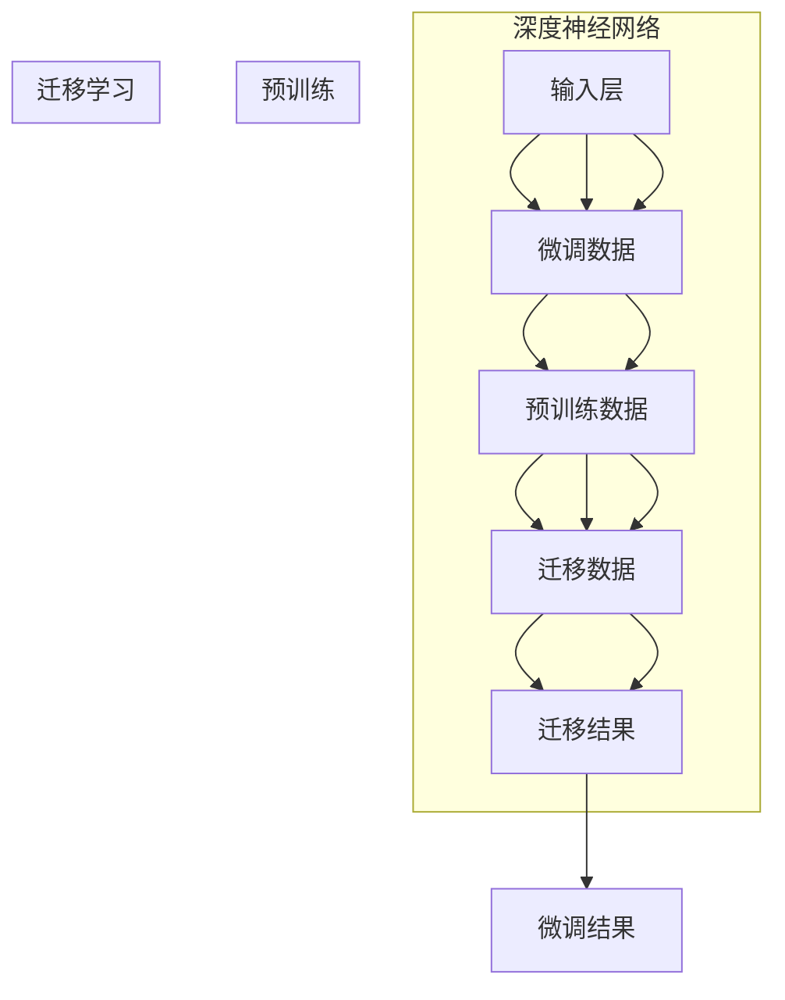
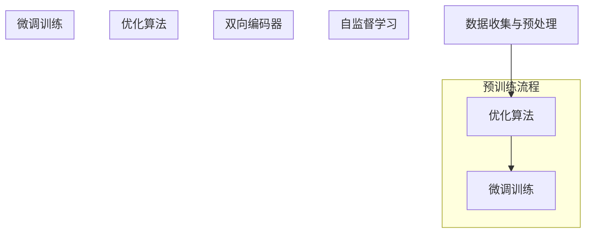

                 

# {文章标题}

## 关键词：AI大模型，自动代理，GPT，预训练，深度学习，应用开发，项目实战

## 摘要：

本文深入探讨了AI大模型应用开发，特别是自动代理（AI Agent）的开发实践。文章首先介绍了AI大模型的核心概念、技术架构和主要算法原理，随后详细描述了AI大模型在企业中的应用场景和趋势。接着，文章重点介绍了大规模预训练模型的基本原理，如自监督学习和BERT等算法。然后，文章围绕AI大模型在自然语言处理、计算机视觉和语音识别等领域的应用进行了阐述，并介绍了AI大模型开发所使用的工具和框架。在实战部分，文章通过构建聊天机器人、图像分类和自然语言处理项目，展示了如何将AI大模型应用于实际开发中。最后，文章讨论了AI大模型应用中的挑战与应对策略，并对AI大模型在智能代理领域的未来发展趋势进行了展望。

# 第一部分: AI大模型应用开发基础

## 第1章: AI大模型概述

### 1.1 AI大模型的核心概念与架构

#### 1.1.1 AI大模型的定义

AI大模型是指一种基于深度学习技术，通过预训练和微调等手段，能够处理大规模数据并进行复杂任务的大规模神经网络模型。AI大模型通常具有以下几个核心概念：

1. **深度神经网络（Deep Neural Network, DNN）**：由多层神经元组成的神经网络，能够通过反向传播算法不断优化模型参数，实现对数据的特征提取和分类。
2. **预训练（Pre-training）**：在特定任务之前，使用大规模无标签数据对模型进行训练，使其获得通用的特征表示能力。
3. **微调（Fine-tuning）**：在预训练的基础上，使用特定任务的有标签数据对模型进行进一步的训练，使其能够更好地适应特定任务。
4. **迁移学习（Transfer Learning）**：利用预训练模型在特定任务上的迁移能力，提高新任务的学习效率。

AI大模型的技术架构通常包括以下几个层次：

1. **输入层**：接收外部输入数据，如文本、图像、音频等。
2. **隐藏层**：通过多层神经网络对输入数据进行特征提取和转换。
3. **输出层**：根据提取的特征进行预测或分类。

#### 1.1.2 AI大模型的技术架构

为了更好地理解AI大模型的技术架构，我们可以通过以下Mermaid流程图来描述：



通过上述流程图，我们可以看到AI大模型的技术架构主要包括深度神经网络、预训练、微调和迁移学习等组成部分。这些组成部分相互关联，共同构成了AI大模型的完整架构。

### 1.2 AI大模型的主要算法原理

AI大模型的主要算法原理可以分为以下几个方面：

#### 1.2.1 神经网络基础

神经网络是AI大模型的核心组成部分。神经网络的基本单元是神经元，每个神经元由输入层、权重层和输出层组成。神经元通过加权求和并应用激活函数，对输入数据进行特征提取和转换。

神经网络的数学模型可以表示为：

$$
f(x) = \sigma(W \cdot x + b)
$$

其中，$x$是输入向量，$W$是权重矩阵，$b$是偏置项，$\sigma$是激活函数，通常使用Sigmoid函数或ReLU函数。

#### 1.2.2 深度学习优化算法

深度学习优化算法是指用于训练神经网络的方法。其中，最常用的优化算法是梯度下降（Gradient Descent）。

梯度下降的数学模型可以表示为：

$$
\text{梯度下降}:
\begin{aligned}
    x_{\text{new}} &= x_{\text{old}} - \alpha \cdot \nabla_{x} J(x) \\
    J(x) &= \frac{1}{n} \sum_{i=1}^{n} (y_i - f(x_i))^2
\end{aligned}
$$

其中，$x_{\text{old}}$和$x_{\text{new}}$分别表示当前和下一轮的模型参数，$\alpha$是学习率，$\nabla_{x} J(x)$是损失函数关于模型参数的梯度。

通过不断迭代更新模型参数，梯度下降算法能够使模型在训练数据上取得较好的拟合效果。

#### 1.2.3 预训练算法

预训练是AI大模型的重要步骤之一。预训练算法的核心思想是利用大规模无标签数据对模型进行训练，使其获得通用的特征表示能力。其中，常用的预训练算法包括自监督学习和预训练-微调（Pre-training and Fine-tuning）。

自监督学习是指在没有标签数据的情况下，通过设计合适的预训练任务，使模型能够自行学习数据的特征表示。其中，最常用的自监督学习算法包括Masked Language Model (MLM)和BERT。

BERT（Bidirectional Encoder Representations from Transformers）是一种基于Transformer的预训练算法，通过双向编码器（Bidirectional Encoder）对文本进行表示，使其能够捕捉文本的上下文信息。

BERT的预训练算法可以表示为：

$$
\text{BERT预训练}:
\begin{aligned}
    &\text{输入：} \\
    &\text{掩码文本序列} \\
    &\text{输出：} \\
    &\text{编码后的文本表示}
\end{aligned}
$$

#### 1.2.4 微调和迁移学习

微调和迁移学习是在预训练的基础上，针对特定任务对模型进行训练的方法。微调是指使用特定任务的有标签数据对预训练模型进行进一步的训练，使其能够更好地适应特定任务。迁移学习则是利用预训练模型在特定任务上的迁移能力，提高新任务的学习效率。

微调和迁移学习的数学模型可以表示为：

$$
\text{微调和迁移学习}:
\begin{aligned}
    &\text{输入：} \\
    &\text{预训练模型参数} \\
    &\text{有标签数据} \\
    &\text{输出：} \\
    &\text{微调后的模型参数}
\end{aligned}
$$

通过微调和迁移学习，AI大模型能够更好地适应不同的任务和应用场景。

### 1.3 AI大模型的应用场景与趋势

AI大模型的应用场景非常广泛，主要包括自然语言处理、计算机视觉、语音识别和强化学习等领域。以下分别对这些应用场景进行介绍：

#### 1.3.1 应用场景

1. **自然语言处理（Natural Language Processing, NLP）**：AI大模型在自然语言处理领域具有广泛的应用，如文本分类、机器翻译、命名实体识别等。通过预训练和微调，AI大模型能够对文本数据进行高效处理，提供智能化服务。

2. **计算机视觉（Computer Vision）**：AI大模型在计算机视觉领域也取得了显著的成果，如图像分类、目标检测、图像分割等。通过预训练和迁移学习，AI大模型能够对图像数据进行特征提取和分类，应用于自动驾驶、人脸识别等领域。

3. **语音识别（Speech Recognition）**：AI大模型在语音识别领域具有强大的能力，能够将语音信号转换为文本。通过预训练和微调，AI大模型能够提高语音识别的准确率和速度，应用于智能客服、语音助手等场景。

4. **强化学习（Reinforcement Learning）**：AI大模型在强化学习领域也具有重要的应用价值，如游戏人工智能、机器人控制等。通过预训练和微调，AI大模型能够学习到复杂的策略，提高智能体的决策能力。

#### 1.3.2 发展趋势

1. **模型规模不断扩大**：随着计算资源的增加，AI大模型的规模也在不断增大。大规模模型能够更好地捕捉数据中的复杂关系，提高模型的性能。

2. **多模态融合**：AI大模型正朝着多模态融合的方向发展，将文本、图像、语音等不同类型的数据进行融合，提高模型的综合能力。

3. **自适应与强化学习**：AI大模型正在与自适应学习和强化学习相结合，使模型能够更好地适应动态环境，提高智能体的自主决策能力。

4. **低功耗与边缘计算**：随着AI大模型在边缘设备的广泛应用，低功耗和边缘计算成为重要的研究方向。通过优化模型结构和算法，实现AI大模型在边缘设备上的高效运行。

总之，AI大模型应用开发具有广阔的前景和重要的价值。随着技术的不断进步和应用场景的拓展，AI大模型将在更多领域发挥重要作用。# 第二部分：大规模预训练模型原理

## 第2章：大规模预训练模型原理

### 2.1 预训练的概念与流程

#### 2.1.1 预训练的目标

预训练（Pre-training）是AI大模型开发中的一个重要步骤，其目标是通过大规模无标签数据的学习，使模型获得通用的特征表示能力。预训练的核心思想是将大规模无标签数据转换为有价值的特征表示，以便在后续的任务中提高模型的性能。

#### 2.1.2 预训练的流程

预训练的流程主要包括以下三个阶段：

1. **数据收集与预处理**：收集大规模无标签数据，如文本、图像、音频等。对数据进行预处理，包括数据清洗、去重、分词、归一化等操作，以确保数据的质量和一致性。

2. **预训练**：使用大规模无标签数据对模型进行训练，使其获得通用的特征表示能力。预训练的过程通常包括以下步骤：

   - **自监督学习**：在预训练过程中，自监督学习（Self-supervised Learning）是一种常用的技术。自监督学习利用数据本身的结构，自动生成监督信号，从而提高模型的学习效率。常见的自监督学习任务包括Masked Language Model (MLM)、BERT、Jigsaw Puzzles等。
   - **双向编码器**：预训练过程中，通常使用双向编码器（Bidirectional Encoder）对数据进行编码。双向编码器能够同时考虑输入数据的正向和反向信息，从而提高特征表示的准确性。
   - **优化算法**：预训练过程中，使用优化算法（如梯度下降）对模型参数进行更新，以最小化损失函数。优化算法的选择和参数的设置对预训练效果具有重要影响。

3. **微调**：在预训练完成后，使用特定任务的有标签数据对模型进行微调（Fine-tuning），使其能够适应特定的任务。微调的过程主要包括以下步骤：

   - **数据集准备**：准备用于微调的有标签数据集，包括输入数据和对应的标签。
   - **模型调整**：根据任务需求，对预训练模型进行调整，包括调整网络结构、优化器参数等。
   - **微调训练**：使用有标签数据对调整后的模型进行训练，以最小化损失函数。在微调过程中，通常会使用较小的学习率，以避免模型过拟合。

#### 2.1.3 预训练的流程图

为了更好地理解预训练的流程，我们可以通过以下Mermaid流程图进行描述：



通过上述流程图，我们可以看到预训练的流程主要包括数据收集与预处理、预训练和微调三个阶段。预训练阶段通过自监督学习和双向编码器等技术，使模型获得通用的特征表示能力。微调阶段则使用有标签数据对模型进行调整和优化，使其能够适应特定的任务。

### 2.2 自监督学习技术

自监督学习（Self-supervised Learning）是一种重要的预训练技术，其核心思想是利用数据本身的结构，自动生成监督信号，从而提高模型的学习效率。以下介绍几种常见的自监督学习技术：

#### 2.2.1 Masked Language Model (MLM)

Masked Language Model（MLM）是一种基于自然语言处理的自监督学习技术。MLM的核心思想是在文本数据中随机遮蔽一些单词或子词，然后使用模型预测这些遮蔽的部分。

MLM的预训练过程可以表示为：

$$
\text{MLM预训练}:
\begin{aligned}
    &\text{输入：} \\
    &\text{遮蔽的文本序列} \\
    &\text{输出：} \\
    &\text{预测的遮蔽部分}
\end{aligned}
$$

通过MLM预训练，模型能够学习到单词和子词之间的相互依赖关系，从而提高模型的语义理解能力。

#### 2.2.2 Pre-training of Deep Neural Networks for Language Understanding (BERT)

BERT（Bidirectional Encoder Representations from Transformers）是一种基于Transformer的预训练算法，其核心思想是使用双向编码器对文本进行编码，从而获得高质量的文本特征表示。

BERT的预训练过程可以表示为：

$$
\text{BERT预训练}:
\begin{aligned}
    &\text{输入：} \\
    &\text{文本序列} \\
    &\text{输出：} \\
    &\text{编码后的文本表示}
\end{aligned}
$$

BERT通过同时考虑文本的上下文信息，提高了模型的语义理解能力，并在多个自然语言处理任务中取得了显著的效果。

#### 2.2.3 Unsupervised Learning of Visual Representations by Solving Jigsaw Puzzles (BigGAN)

BigGAN是一种基于生成对抗网络（GAN）的自监督学习技术，其核心思想是通过解决拼图任务，学习图像的特征表示。

BigGAN的预训练过程可以表示为：

$$
\text{BigGAN预训练}:
\begin{aligned}
    &\text{输入：} \\
    &\text{拼图图像} \\
    &\text{输出：} \\
    &\text{解拼后的图像}
\end{aligned}
$$

通过解决拼图任务，BigGAN能够学习到图像的局部结构和全局关系，从而提高模型的视觉理解能力。

### 2.3 大规模预训练模型的优缺点

大规模预训练模型在自然语言处理、计算机视觉等领域取得了显著的成果，但其也存在一定的优缺点：

#### 优点：

1. **通用特征表示**：大规模预训练模型通过预训练过程，能够学习到通用的特征表示，从而提高模型的泛化能力。

2. **高效性**：大规模预训练模型能够处理大规模数据，提高模型的学习效率。

3. **多任务学习能力**：大规模预训练模型通过预训练过程，能够学习到多个任务的通用特征，从而提高模型的多任务学习能力。

#### 缺点：

1. **计算资源需求**：大规模预训练模型需要大量的计算资源，包括GPU、TPU等，因此训练成本较高。

2. **数据隐私风险**：大规模预训练模型在预训练过程中，需要对大规模数据进行处理，可能会涉及数据隐私问题。

3. **模型解释性**：大规模预训练模型的决策过程较为复杂，缺乏模型解释性，难以理解模型的决策逻辑。

总之，大规模预训练模型在自然语言处理、计算机视觉等领域具有广泛的应用前景，但同时也面临一定的挑战和问题。未来，随着技术的不断进步，这些挑战有望得到解决。# 第三部分：AI大模型在企业中的应用

## 第3章：AI大模型在企业中的应用

AI大模型在企业中的应用正在迅速扩展，成为企业数字化转型和智能化升级的重要驱动力。本章节将详细介绍AI大模型在自然语言处理、计算机视觉和语音识别等领域的具体应用，并探讨其在企业中的价值。

### 3.1 AI大模型在自然语言处理中的应用

自然语言处理（NLP）是AI大模型的重要应用领域之一。通过AI大模型，企业可以在文本分析、情感分析、机器翻译、信息抽取等方面实现自动化和智能化。

#### 3.1.1 文本分类

文本分类是NLP领域的一个基本任务，旨在将文本数据根据其内容分类到不同的类别中。AI大模型通过预训练和微调，可以快速实现高精度的文本分类。

**应用案例**：某电商平台使用AI大模型对用户评论进行分类，区分正面评论和负面评论，从而及时处理用户投诉，提高用户满意度。

**实现方法**：
1. **数据收集与预处理**：收集大量带有标签的文本数据，对数据清洗和分词处理。
2. **预训练**：使用预训练模型（如BERT）对数据集进行预训练，提取文本特征。
3. **微调**：在预训练的基础上，使用分类任务的有标签数据对模型进行微调。
4. **评估与部署**：评估模型的分类性能，并在实际业务中部署模型。

#### 3.1.2 机器翻译

机器翻译是NLP领域的另一个重要任务，旨在将一种语言的文本自动翻译成另一种语言。AI大模型通过大规模预训练，可以实现高质量的机器翻译。

**应用案例**：某跨国企业使用AI大模型实现全球业务中的多语言沟通，提高工作效率和国际化水平。

**实现方法**：
1. **数据收集与预处理**：收集大量双语平行文本数据，对数据清洗和分词处理。
2. **预训练**：使用预训练模型（如Transformer）对数据集进行预训练，提取文本特征。
3. **微调**：在预训练的基础上，使用翻译任务的有标签数据对模型进行微调。
4. **评估与部署**：评估模型的翻译性能，并在实际业务中部署模型。

#### 3.1.3 命名实体识别

命名实体识别（NER）是NLP领域的一个重要任务，旨在从文本中识别出具有特定意义的实体，如人名、地名、组织名等。

**应用案例**：某社交媒体平台使用AI大模型对用户发布的内容进行实体识别，提取关键信息，进行内容审核和推荐。

**实现方法**：
1. **数据收集与预处理**：收集大量带有实体标签的文本数据，对数据清洗和分词处理。
2. **预训练**：使用预训练模型（如BERT）对数据集进行预训练，提取文本特征。
3. **微调**：在预训练的基础上，使用NER任务的有标签数据对模型进行微调。
4. **评估与部署**：评估模型的NER性能，并在实际业务中部署模型。

### 3.2 AI大模型在计算机视觉中的应用

计算机视觉是AI大模型的另一个重要应用领域。通过AI大模型，企业可以在图像分类、目标检测、图像分割等方面实现自动化和智能化。

#### 3.2.1 图像分类

图像分类是计算机视觉领域的一个基本任务，旨在将图像数据根据其内容分类到不同的类别中。

**应用案例**：某电商平台使用AI大模型对用户上传的商品图片进行分类，实现商品自动识别和推荐。

**实现方法**：
1. **数据收集与预处理**：收集大量带有标签的图像数据，对图像进行数据增强和预处理。
2. **预训练**：使用预训练模型（如ResNet）对数据集进行预训练，提取图像特征。
3. **微调**：在预训练的基础上，使用分类任务的有标签数据对模型进行微调。
4. **评估与部署**：评估模型的分类性能，并在实际业务中部署模型。

#### 3.2.2 目标检测

目标检测是计算机视觉领域的一个重要任务，旨在从图像中识别出特定目标的位置和类别。

**应用案例**：某智能安防公司使用AI大模型对监控视频进行目标检测，实现实时监控和报警功能。

**实现方法**：
1. **数据收集与预处理**：收集大量带有标注的目标检测数据，对数据增强和预处理。
2. **预训练**：使用预训练模型（如Faster R-CNN）对数据集进行预训练，提取图像特征。
3. **微调**：在预训练的基础上，使用目标检测任务的有标签数据对模型进行微调。
4. **评估与部署**：评估模型的目标检测性能，并在实际业务中部署模型。

#### 3.2.3 图像分割

图像分割是计算机视觉领域的一个重要任务，旨在将图像分割成不同的区域，用于目标识别、图像编辑等应用。

**应用案例**：某医疗公司使用AI大模型对医学图像进行分割，实现病灶区域的自动检测和诊断。

**实现方法**：
1. **数据收集与预处理**：收集大量带有标注的医学图像数据，对图像进行预处理。
2. **预训练**：使用预训练模型（如U-Net）对数据集进行预训练，提取图像特征。
3. **微调**：在预训练的基础上，使用图像分割任务的有标签数据对模型进行微调。
4. **评估与部署**：评估模型的图像分割性能，并在实际业务中部署模型。

### 3.3 AI大模型在语音识别中的应用

语音识别是AI大模型的另一个重要应用领域。通过AI大模型，企业可以在语音转文字、说话人识别、语音合成等方面实现自动化和智能化。

#### 3.3.1 语音识别

语音识别是将语音信号转换为文字数据的过程，广泛应用于智能客服、语音助手等场景。

**应用案例**：某金融公司使用AI大模型实现客服系统的语音转文字功能，提高客服效率和用户体验。

**实现方法**：
1. **数据收集与预处理**：收集大量带有标注的语音数据，对语音进行预处理。
2. **预训练**：使用预训练模型（如CTC Loss）对数据集进行预训练，提取语音特征。
3. **微调**：在预训练的基础上，使用语音识别任务的有标签数据对模型进行微调。
4. **评估与部署**：评估模型的语音识别性能，并在实际业务中部署模型。

#### 3.3.2 说话人识别

说话人识别是语音识别领域的一个重要任务，旨在从语音中识别出不同的说话人。

**应用案例**：某智能安防系统使用AI大模型实现说话人识别功能，提高监控视频的分析和处理能力。

**实现方法**：
1. **数据收集与预处理**：收集大量带有标注的说话人语音数据，对语音进行预处理。
2. **预训练**：使用预训练模型（如LDA + PLDA）对数据集进行预训练，提取说话人特征。
3. **微调**：在预训练的基础上，使用说话人识别任务的有标签数据对模型进行微调。
4. **评估与部署**：评估模型的说话人识别性能，并在实际业务中部署模型。

#### 3.3.3 语音合成

语音合成是将文本数据转换为语音信号的过程，广泛应用于语音助手、语音导航等场景。

**应用案例**：某智能语音助手使用AI大模型实现语音合成功能，提供自然流畅的语音交互体验。

**实现方法**：
1. **数据收集与预处理**：收集大量带有标注的语音数据，对文本进行预处理。
2. **预训练**：使用预训练模型（如WaveNet）对数据集进行预训练，提取语音特征。
3. **微调**：在预训练的基础上，使用语音合成任务的有标签数据对模型进行微调。
4. **评估与部署**：评估模型的语音合成性能，并在实际业务中部署模型。

总之，AI大模型在企业中的应用正在不断扩展，通过自然语言处理、计算机视觉和语音识别等技术的应用，企业能够实现自动化和智能化，提高生产效率、降低成本、提升用户体验。随着技术的不断进步，AI大模型在企业中的应用将更加广泛和深入。# 第四部分：AI大模型开发工具与框架

## 第4章：AI大模型开发工具与框架

在AI大模型开发过程中，选择合适的工具和框架是至关重要的。以下将介绍几种流行的深度学习框架和工具，包括TensorFlow、PyTorch、JAX等，并比较它们的特点和适用场景。

### 4.1 TensorFlow

TensorFlow是由Google开发的一种开源深度学习框架，广泛应用于各种AI任务。TensorFlow具有以下特点：

1. **丰富的API**：TensorFlow提供了丰富的API，包括高层次的Keras API和低层次的Tensor API，适合不同层次的开发者使用。

2. **良好的生态**：TensorFlow拥有庞大的开发者社区和丰富的开源资源，包括预训练模型、教程、工具等。

3. **强大的支持**：Google为TensorFlow提供了强大的技术支持和维护。

4. **灵活的部署**：TensorFlow支持多种部署方式，包括CPU、GPU、TPU等。

**适用场景**：TensorFlow适合进行大规模的深度学习模型开发和部署，尤其适合需要高性能计算和分布式训练的场景。

**安装与配置**：
```bash
pip install tensorflow
```

### 4.2 PyTorch

PyTorch是由Facebook开发的一种开源深度学习框架，以其灵活性和动态计算图而著称。PyTorch具有以下特点：

1. **动态计算图**：PyTorch使用动态计算图，使开发者能够更直观地理解模型的工作原理。

2. **简洁的API**：PyTorch的API简洁易用，适合快速原型开发和实验。

3. **强大的社区支持**：PyTorch拥有庞大的开发者社区和丰富的开源资源。

4. **良好的兼容性**：PyTorch与Python深度集成，易于与现有代码库和工具集成。

**适用场景**：PyTorch适合快速原型开发和实验，尤其适合需要动态计算图和灵活性的场景。

**安装与配置**：
```bash
pip install torch torchvision
```

### 4.3 JAX

JAX是由Google开发的一种高性能的数值计算库，适用于深度学习和科学计算。JAX具有以下特点：

1. **自动微分**：JAX提供了自动微分功能，使得开发者能够轻松实现复杂的优化算法。

2. **高性能**：JAX利用了GPU和TPU等硬件加速，提供了高性能的数值计算。

3. **灵活的编程模型**：JAX支持多种编程模型，包括静态图和动态图，提供了灵活的编程接口。

4. **强大的生态**：JAX与TensorFlow和PyTorch等框架兼容，可以方便地迁移代码。

**适用场景**：JAX适合需要高性能计算和自动微分功能的场景，尤其适合进行大规模深度学习模型的训练和优化。

**安装与配置**：
```bash
pip install jax jaxlib
```

### 4.4 其他深度学习框架

除了上述三大框架，还有一些其他流行的深度学习框架，如TensorFlow Lite、MXNet、Caffe等。以下是对这些框架的简要介绍：

1. **TensorFlow Lite**：TensorFlow Lite是TensorFlow的轻量级版本，适用于移动设备和嵌入式设备。

2. **MXNet**：MXNet是由Apache Software Foundation开发的深度学习框架，具有灵活的编程模型和高性能计算能力。

3. **Caffe**：Caffe是一种开源的深度学习框架，主要用于图像识别和计算机视觉任务。

**比较**：

| 框架         | 特点                                       | 适用场景                                                     |
| ------------ | ------------------------------------------ | ------------------------------------------------------------ |
| TensorFlow   | 丰富的API，良好的生态，强大的支持          | 大规模的深度学习模型开发和部署，需要高性能计算和分布式训练   |
| PyTorch      | 动态计算图，简洁的API，强大的社区支持      | 快速原型开发和实验，需要动态计算图和灵活性                   |
| JAX          | 自动微分，高性能，灵活的编程模型          | 高性能计算和自动微分，需要大规模深度学习模型的训练和优化     |
| TensorFlow Lite | 轻量级，适用于移动设备和嵌入式设备          | 移动设备和嵌入式设备的深度学习模型部署                       |
| MXNet        | 灵活的编程模型，高性能计算                | 需要高性能计算和灵活编程模型的场景，如科学计算和大数据处理   |
| Caffe        | 简单易用，主要用于图像识别和计算机视觉任务 | 图像识别和计算机视觉任务，需要快速开发和部署                 |

综上所述，不同的深度学习框架具有不同的特点和应用场景，开发者可以根据实际需求选择合适的框架进行AI大模型开发。# 第五部分：AI大模型应用项目实战

## 第5章：AI大模型应用项目实战

### 5.1 项目一：构建聊天机器人

#### 5.1.1 项目需求

本项目旨在构建一个基于AI大模型的聊天机器人，能够与用户进行自然语言交互，提供信息查询、情感陪护等服务。

#### 5.1.2 环境搭建

1. **安装Python**：确保Python环境已安装，版本建议为3.8及以上。

2. **安装TensorFlow**：通过以下命令安装TensorFlow：

   ```bash
   pip install tensorflow
   ```

3. **安装Hugging Face Transformers**：通过以下命令安装Hugging Face Transformers：

   ```bash
   pip install transformers
   ```

#### 5.1.3 代码实现

以下是一个简单的聊天机器人实现，基于Transformer模型：

```python
from transformers import AutoModelForCausalLM, AutoTokenizer
import torch

# 加载预训练模型和分词器
model_name = "gpt2"
tokenizer = AutoTokenizer.from_pretrained(model_name)
model = AutoModelForCausalLM.from_pretrained(model_name)

# 定义聊天机器人函数
def chatbot回答(message):
    input_text = tokenizer.encode(message + tokenizer.eos_token, return_tensors="pt")
    output = model.generate(input_text, max_length=100, num_return_sequences=1)
    response = tokenizer.decode(output[0], skip_special_tokens=True)
    return response

# 与用户进行交互
while True:
    user_input = input("用户：")
    if user_input.lower() == "退出":
        break
    response = chatbot回答(user_input)
    print("聊天机器人：", response)
```

#### 5.1.4 代码解读与分析

1. **加载模型和分词器**：通过`AutoTokenizer`和`AutoModelForCausalLM`类加载预训练模型和分词器。

2. **定义聊天机器人函数**：`chatbot回答`函数接收用户输入，通过模型生成响应。

3. **与用户进行交互**：在主循环中，用户输入消息，聊天机器人响应，直到用户输入"退出"。

### 5.2 项目二：图像分类

#### 5.2.1 项目需求

本项目旨在构建一个图像分类系统，能够对输入的图像进行分类，识别不同的物体。

#### 5.2.2 数据集准备

1. **准备数据集**：下载一个流行的图像分类数据集，如ImageNet，并解压到合适的位置。

2. **数据预处理**：对图像进行数据增强、归一化等预处理操作。

#### 5.2.3 代码实现

以下是一个简单的图像分类实现，基于ResNet模型：

```python
import torch
import torchvision
import torchvision.transforms as transforms
from torchvision.models import resnet50

# 定义数据预处理函数
transform = transforms.Compose([
    transforms.Resize(256),
    transforms.CenterCrop(224),
    transforms.ToTensor(),
    transforms.Normalize(mean=[0.485, 0.456, 0.406], std=[0.229, 0.224, 0.225]),
])

# 加载预训练模型
model = resnet50(pretrained=True)
model.eval()

# 定义图像分类函数
def image分类(image_path):
    image = transform(image_path)
    image = image.unsqueeze(0)
    with torch.no_grad():
        output = model(image)
    _, predicted = torch.max(output, 1)
    return predicted.item()

# 测试图像分类
image_path = "path/to/image.jpg"
predicted_class = image分类(image_path)
print("预测类别：", predicted_class)
```

#### 5.2.4 代码解读与分析

1. **数据预处理**：通过`transform`函数对图像进行预处理，包括调整大小、中心裁剪、归一化等。

2. **加载模型**：通过`resnet50`函数加载预训练的ResNet模型。

3. **定义图像分类函数**：`image分类`函数接收图像路径，对图像进行预处理，通过模型进行分类，并返回预测类别。

4. **测试图像分类**：加载图像，调用`image分类`函数进行分类，并打印预测结果。

### 5.3 项目三：自然语言处理

#### 5.3.1 项目需求

本项目旨在构建一个自然语言处理系统，能够对输入的文本进行情感分析，判断文本的情绪。

#### 5.3.2 数据集准备

1. **准备数据集**：下载一个情感分析数据集，如IMDb影评数据集，并解压到合适的位置。

2. **数据预处理**：对文本进行分词、去停用词等预处理操作。

#### 5.3.3 代码实现

以下是一个简单的情感分析实现，基于BERT模型：

```python
from transformers import AutoModelForSequenceClassification, AutoTokenizer
import torch

# 加载预训练模型和分词器
model_name = "bert-base-uncased"
tokenizer = AutoTokenizer.from_pretrained(model_name)
model = AutoModelForSequenceClassification.from_pretrained(model_name)

# 定义情感分析函数
def 情感分析(text):
    inputs = tokenizer(text, return_tensors="pt")
    with torch.no_grad():
        outputs = model(**inputs)
    logits = outputs.logits
    predicted_class = logits.argmax(-1).item()
    return predicted_class

# 测试情感分析
text = "I had a great time at the movie!"
predicted_class = 情感分析(text)
if predicted_class == 1:
    print("文本情绪：积极")
else:
    print("文本情绪：消极")
```

#### 5.3.4 代码解读与分析

1. **加载模型和分词器**：通过`AutoTokenizer`和`AutoModelForSequenceClassification`类加载预训练模型和分词器。

2. **定义情感分析函数**：`情感分析`函数接收文本，通过模型进行情感分析，并返回预测类别。

3. **测试情感分析**：加载文本，调用`情感分析`函数进行情感分析，并打印结果。

通过以上三个项目实战，我们可以看到如何使用AI大模型进行实际应用开发。这些项目不仅展示了AI大模型在不同领域的应用，也为开发者提供了实践经验和思路。# 第六部分：AI大模型应用中的挑战与应对策略

## 第6章：AI大模型应用中的挑战与应对策略

尽管AI大模型在各个领域展现了巨大的潜力和价值，但在实际应用过程中仍然面临着诸多挑战。本章节将探讨AI大模型应用中的主要挑战，并提出相应的应对策略。

### 6.1 计算资源需求

#### 6.1.1 挑战

AI大模型的训练和推理过程需要大量的计算资源，特别是GPU和TPU等高性能计算设备。这导致以下挑战：

1. **成本高昂**：高性能计算设备的采购和运营成本较高。
2. **资源限制**：对于中小企业和科研机构，资源有限，难以满足大规模训练的需求。

#### 6.1.2 应对策略

1. **分布式训练**：通过分布式训练技术，将训练任务分布在多台计算设备上，提高训练效率。例如，使用TensorFlow的MirroredStrategy或PyTorch的DistributedDataParallel。

2. **模型压缩**：通过模型压缩技术，如量化、剪枝、蒸馏等，减小模型规模，降低计算需求。例如，使用TensorFlow的TensorModel Optimization工具。

3. **云计算服务**：利用云计算平台，如Google Cloud、AWS、Azure等，提供弹性的计算资源，按需分配，降低成本。例如，使用Google Cloud的AI平台或AWS的SageMaker。

### 6.2 数据隐私与安全性

#### 6.2.1 挑战

AI大模型在处理数据时，涉及到大量用户数据，包括个人隐私信息。这导致以下挑战：

1. **数据泄露风险**：未经授权的访问可能导致数据泄露。
2. **隐私侵犯**：数据收集和使用过程中，可能侵犯用户隐私。

#### 6.2.2 应对策略

1. **数据加密**：对数据进行加密处理，确保数据在传输和存储过程中安全。例如，使用AES加密算法。

2. **差分隐私**：在数据处理过程中，引入差分隐私机制，降低隐私侵犯的风险。例如，使用拉普拉斯机制或 exponential mechanism。

3. **隐私保护技术**：采用隐私保护技术，如联邦学习、差分隐私、同态加密等，保护用户隐私。例如，使用Google的联邦学习框架。

### 6.3 模型解释性与可解释性

#### 6.3.1 挑战

AI大模型在决策过程中具有高度的复杂性和黑盒性，导致以下挑战：

1. **决策透明性**：用户难以理解模型的决策过程。
2. **信任问题**：缺乏可解释性可能导致用户对模型的信任度降低。

#### 6.3.2 应对策略

1. **模型可视化**：通过可视化技术，如模型结构图、特征图等，展示模型的内部结构和决策过程。

2. **解释性方法**：采用解释性方法，如LIME、SHAP、CAM等，分析模型的决策逻辑和影响因素。

3. **可解释性框架**：构建可解释性框架，如解释性AI系统、XAI（Explainable AI）等，确保模型的可解释性和透明性。

### 6.4 模型可扩展性

#### 6.4.1 挑战

随着应用场景的扩展和数据的增长，AI大模型需要具备良好的可扩展性。以下为面临的挑战：

1. **资源限制**：在有限的计算资源下，难以应对大规模数据和应用场景。
2. **模型更新**：随着新数据和需求的出现，模型需要定期更新。

#### 6.4.2 应对策略

1. **水平扩展**：通过分布式计算和分布式存储，实现水平扩展，提高系统处理能力。

2. **模型压缩**：通过模型压缩技术，减小模型规模，提高模型在边缘设备上的运行效率。

3. **在线学习**：采用在线学习技术，实时更新模型，适应新的数据和需求。

### 6.5 道德与伦理问题

#### 6.5.1 挑战

AI大模型在应用过程中，可能引发一系列道德与伦理问题，如歧视、隐私侵犯等。以下为面临的挑战：

1. **公平性**：模型可能对某些群体存在偏见，影响公平性。
2. **责任归属**：在模型决策导致错误或损害时，责任归属问题难以界定。

#### 6.5.2 应对策略

1. **公平性评估**：定期对模型进行公平性评估，确保模型对各个群体的公平性。
2. **透明度与可解释性**：提高模型的透明度和可解释性，使用户能够理解模型的决策过程。
3. **责任归属机制**：建立明确的责任归属机制，确保在模型决策导致错误或损害时，能够追究责任。

通过以上应对策略，可以有效地解决AI大模型应用过程中面临的挑战，推动AI技术在各个领域的健康发展。# 第七部分：未来展望与趋势

## 第7章：未来展望与趋势

随着AI大模型技术的不断进步和应用场景的拓展，其未来发展趋势和前景令人期待。以下将从技术发展、企业应用和行业挑战三个方面进行探讨。

### 7.1 AI大模型技术的未来发展趋势

1. **模型规模不断扩大**：随着计算资源和算法优化的发展，AI大模型的规模将继续扩大。未来，更大规模的模型将能够处理更复杂的数据，实现更精细的特征提取和更好的任务性能。

2. **多模态融合**：多模态学习是未来AI大模型的一个重要发展方向。通过将文本、图像、语音等多种类型的数据进行融合，AI大模型能够获得更全面的信息，提高任务处理能力。

3. **自适应与强化学习**：自适应学习和强化学习与AI大模型的结合将使模型能够更好地适应动态环境，提高自主决策能力。例如，在自动驾驶、机器人控制等领域，自适应与强化学习将使AI大模型能够更好地应对复杂的变化和挑战。

4. **低功耗与边缘计算**：随着AI大模型在边缘设备上的应用越来越广泛，低功耗和边缘计算成为关键。通过优化模型结构和算法，实现AI大模型在边缘设备上的高效运行，将推动AI技术在智能硬件、物联网等领域的应用。

### 7.2 AI大模型在企业中的应用前景

1. **产业升级与智能化转型**：AI大模型将推动企业实现产业升级和智能化转型。例如，在制造业，AI大模型可以应用于智能生产调度、设备维护等领域，提高生产效率和降低成本；在零售业，AI大模型可以应用于个性化推荐、智能客服等领域，提升客户体验和运营效率。

2. **创新与商业模式的变革**：AI大模型将为企业带来新的创新机会和商业模式。例如，在金融行业，AI大模型可以应用于智能投顾、自动化风控等领域，提供更个性化的金融服务；在医疗行业，AI大模型可以应用于智能诊断、个性化治疗方案等领域，提高医疗水平和患者满意度。

3. **风险与监管挑战**：随着AI大模型在企业中的应用越来越广泛，数据隐私、模型解释性、道德与伦理等问题将成为监管的重点。企业需要建立健全的隐私保护机制、模型解释性框架和道德伦理规范，以应对监管挑战。

### 7.3 AI大模型在智能代理领域的未来发展趋势

1. **自主决策能力提升**：随着AI大模型技术的不断发展，智能代理将具备更强大的自主决策能力。通过预训练和微调，智能代理能够更好地理解人类行为模式，实现更复杂、更智能的自动化任务。

2. **多模态交互**：智能代理将能够进行多模态交互，如文本、图像、语音等，提供更丰富的交互体验。通过多模态融合，智能代理能够更好地理解用户的需求，提高任务执行效率。

3. **个性化服务**：智能代理将能够根据用户的历史行为和偏好，提供个性化的服务。例如，智能客服可以根据用户的历史记录，提供更贴心的服务；智能推荐系统可以根据用户的兴趣，提供更精准的推荐。

4. **伦理与道德问题**：随着智能代理的广泛应用，伦理与道德问题将成为重要议题。智能代理的决策过程需要具备可解释性，确保其决策过程符合伦理和道德规范。此外，智能代理的应用也需要关注数据隐私、用户权益等问题。

总之，AI大模型技术的未来发展趋势充满希望，其在企业中的应用前景广阔。然而，也需要关注其中的挑战，并积极探索解决方案，以实现AI大模型技术的健康发展和广泛应用。# 附录

## 附录A：AI大模型应用开发资源汇总

### A.1 在线课程与教程

- **OpenAI官方教程**：[OpenAI Academy](https://openai.com/academy/)
- **Hugging Face教程**：[Hugging Face教程](https://huggingface.co/transformers/overview)
- **fast.ai课程**：[fast.ai课程](https://course.fast.ai/)

### A.2 开源代码与工具

- **AutoGPT开源代码**：[AutoGPT GitHub仓库](https://github.com/f/autogpt)
- **Langchain开源代码**：[Langchain GitHub仓库](https://github.com/aispacecraft/langchain)
- **Transformers开源代码**：[Transformers GitHub仓库](https://github.com/huggingface/transformers)

### A.3 论文与研究报告

- **"AutoGPT: Automating Tasks with a Generalist Agent"**：[论文链接](https://arxiv.org/abs/2202.09061)
- **"Language Models Are Few-Shot Learners"**：[论文链接](https://arxiv.org/abs/2005.14165)
- **"Generative Pretrained Transformer"**：[论文链接](https://arxiv.org/abs/1706.03762)

## 附录B：术语解释

### B.1 深度学习

深度学习是一种基于人工神经网络的方法，通过多层神经元的堆叠，对数据进行特征提取和分类。深度学习的核心思想是通过反向传播算法，不断调整神经网络中的权重和偏置，以实现函数的优化。

### B.2 预训练

预训练是指在大规模无标签数据集上对神经网络模型进行训练，使其获得通用的特征表示能力。预训练模型通常用于后续的任务中，通过微调（Fine-tuning）来适应特定任务。

### B.3 微调

微调是指在使用有标签数据集对预训练模型进行调整和优化的过程。通过微调，预训练模型能够更好地适应特定任务，提高模型在目标任务上的性能。

### B.4 迁移学习

迁移学习是一种利用已经在一个任务上训练好的模型，在新任务上进行微调或调整的方法。通过迁移学习，可以减少对新任务的训练时间，提高模型的泛化能力。

### B.5 自监督学习

自监督学习是一种无监督学习的方法，其核心思想是从未标注的数据中自动提取监督信号，从而进行学习。自监督学习可以用于预训练模型，提高模型的泛化能力。# 第8章：AI大模型在智能代理中的应用

## 第8章：AI大模型在智能代理中的应用

智能代理（AI Agent）是一种能够自主执行任务并具备一定程度智能的计算机程序。随着AI大模型技术的发展，AI大模型在智能代理中的应用日益广泛，成为智能化系统的重要组成部分。本章节将详细介绍AI大模型在智能代理中的应用，包括概念、原理、应用场景和开发实战。

### 8.1 智能代理的概念与原理

#### 8.1.1 智能代理的定义

智能代理是一种能够理解、感知和执行任务的计算机程序，能够在特定环境下自主决策和行动。智能代理具有以下几个特点：

1. **自主性**：智能代理能够自主地执行任务，无需人工干预。
2. **适应性**：智能代理能够根据环境变化和任务需求，调整自己的行为和策略。
3. **智能性**：智能代理通过学习算法，具备一定程度的智能，能够理解、推理和解决问题。

#### 8.1.2 智能代理的工作原理

智能代理通常基于AI大模型，通过以下几个步骤实现自主执行任务：

1. **感知**：智能代理通过传感器、输入设备等感知环境信息。
2. **理解**：智能代理使用AI大模型对感知到的信息进行理解和分析，提取关键特征。
3. **决策**：智能代理根据分析结果，利用决策算法生成行动策略。
4. **行动**：智能代理执行决策策略，实现任务目标。

#### 8.1.3 智能代理的组成结构

智能代理通常由以下几个部分组成：

1. **感知模块**：负责感知环境信息，如文本、图像、声音等。
2. **理解模块**：基于AI大模型，对感知到的信息进行理解和分析。
3. **决策模块**：根据理解模块的分析结果，生成行动策略。
4. **执行模块**：执行决策模块生成的行动策略，实现任务目标。

### 8.2 AI大模型在智能代理中的应用

#### 8.2.1 聊天机器人

聊天机器人是智能代理的一种常见应用，通过AI大模型实现自然语言处理和对话生成。以下是一个基于GPT-3模型的聊天机器人示例：

```python
import openai

openai.api_key = "your-api-key"

def chatbot回答(question):
    response = openai.Completion.create(
        engine="text-davinci-002",
        prompt=f"用户：{question}\n聊天机器人：",
        max_tokens=100,
        n=1,
        stop=None,
        temperature=0.5,
    )
    return response.choices[0].text.strip()

# 与用户进行交互
while True:
    user_input = input("用户： ")
    if user_input.lower() == "退出":
        break
    response = chatbot回答(user_input)
    print("聊天机器人：", response)
```

#### 8.2.2 智能推荐系统

智能推荐系统是另一个重要的应用场景，通过AI大模型对用户行为数据进行分析，生成个性化的推荐结果。以下是一个基于BERT模型的推荐系统示例：

```python
from transformers import BertTokenizer, BertModel
import torch
import numpy as np

tokenizer = BertTokenizer.from_pretrained("bert-base-uncased")
model = BertModel.from_pretrained("bert-base-uncased")

def recommend_items(user_input, item_list, top_k=3):
    user_encoding = tokenizer(user_input, return_tensors="pt", padding=True, truncation=True)
    user_embedding = model(**user_encoding)[0][:, 0, :].detach().numpy()
    
    item_embeddings = []
    for item in item_list:
        item_encoding = tokenizer(item, return_tensors="pt", padding=True, truncation=True)
        item_embedding = model(**item_encoding)[0][:, 0, :].detach().numpy()
        item_embeddings.append(item_embedding)
    
    item_embeddings = np.array(item_embeddings)
    similarity_scores = np.dot(user_embedding, item_embeddings.T)
    top_k_indices = np.argsort(similarity_scores)[::-1][:top_k]
    return [item_list[i] for i in top_k_indices]

# 测试推荐系统
user_input = "我喜欢看电影和旅游"
item_list = ["科幻电影", "旅游攻略", "美食推荐", "动作电影", "科技资讯"]
top_k_recommendations = recommend_items(user_input, item_list)
print("推荐结果：", top_k_recommendations)
```

#### 8.2.3 自动化办公助手

自动化办公助手是智能代理在办公自动化领域的一个应用，通过AI大模型实现邮件管理、日程安排、文档整理等任务。以下是一个基于GPT-3模型的自动化办公助手示例：

```python
import openai

openai.api_key = "your-api-key"

def handle_email(email_content):
    response = openai.Completion.create(
        engine="text-davinci-002",
        prompt=f"用户：{email_content}\n自动化办公助手：",
        max_tokens=100,
        n=1,
        stop=None,
        temperature=0.5,
    )
    return response.choices[0].text.strip()

def schedule_meeting(subject, attendees):
    response = openai.Completion.create(
        engine="text-davinci-002",
        prompt=f"用户：安排一个关于'{subject}'的会议，邀请'{attendees}'。\n自动化办公助手：",
        max_tokens=100,
        n=1,
        stop=None,
        temperature=0.5,
    )
    return response.choices[0].text.strip()

# 处理邮件
email_content = "我需要与同事讨论项目进度"
response = handle_email(email_content)
print("自动化办公助手回复：", response)

# 安排会议
subject = "项目进度讨论"
attendees = "张三、李四、王五"
meeting_schedule = schedule_meeting(subject, attendees)
print("会议安排：", meeting_schedule)
```

### 8.3 AI大模型在智能代理开发中的挑战与应对策略

尽管AI大模型在智能代理领域具有巨大的潜力，但在实际开发过程中也面临一些挑战：

#### 8.3.1 数据隐私与安全

智能代理在处理用户数据时，需要严格保护用户隐私和安全。应对策略包括：

1. **数据加密**：对用户数据进行加密处理，确保数据在传输和存储过程中安全。
2. **差分隐私**：在数据处理过程中引入差分隐私机制，降低隐私侵犯的风险。

#### 8.3.2 模型解释性

智能代理的决策过程需要具备解释性，以确保用户对模型的决策过程有充分的了解。应对策略包括：

1. **模型可视化**：通过可视化技术展示模型的内部结构和决策过程。
2. **解释性方法**：采用解释性方法，如LIME、SHAP等，分析模型的决策逻辑和影响因素。

#### 8.3.3 模型可扩展性

智能代理需要能够适应不同的应用场景和需求，具备良好的可扩展性。应对策略包括：

1. **模块化设计**：将智能代理拆分为多个模块，每个模块负责不同的功能，便于扩展和替换。
2. **微服务架构**：采用微服务架构，实现智能代理的分布式部署，提高系统的可扩展性和灵活性。

通过以上应对策略，可以有效地解决AI大模型在智能代理开发过程中面临的挑战，推动智能代理技术的健康发展。# 第9章：AutoGPT实战

## 第9章：AutoGPT实战

AutoGPT是一个基于GPT-3的自动化代理框架，能够自主执行任务，并具备一定的智能决策能力。本章节将通过一个简单的示例，介绍如何使用AutoGPT实现自动化任务。

### 9.1 AutoGPT简介

AutoGPT是由Forkast AI开发的一个开源项目，它基于OpenAI的GPT-3模型，引入了代理（Agent）的概念，使得GPT-3能够进行自动化任务。AutoGPT通过定义工具链（toolchain）和指令（指令）来指导GPT-3执行任务。

### 9.2 AutoGPT应用场景

AutoGPT可以应用于多种场景，包括但不限于：

1. **内容创作**：自动生成文章、报告、代码等。
2. **智能客服**：自动回复客户咨询，提供个性化服务。
3. **数据收集**：自动搜索网络，收集特定信息。
4. **自动化办公**：自动处理邮件、日程安排等。

### 9.3 AutoGPT开发实战

以下是一个简单的AutoGPT开发实战示例，我们将使用Python和AutoGPT的官方库来创建一个能够自动搜索网络并生成文章摘要的智能代理。

#### 9.3.1 环境搭建

首先，确保已经安装了Python环境和GPT-3 API。

```bash
pip install openai
```

#### 9.3.2 代码实现

下面是一个简单的AutoGPT智能代理示例：

```python
from langchain.agents import tool
from langchain import AgentExecutor
from langchain import LLMChain

# 创建工具链
# 定义一个工具，该工具使用Google搜索来获取信息
search_tool = tool.create_tool(
    "Search on the Internet",
    "Search on the Internet using Google.",
    "search",
    {"input_type": "text", "output_type": "text"},
    "https://www.google.com/search?q={input}",
)

# 创建一个LLMChain，用于与GPT-3交互
llm_chain = LLMChain(
    llm=OpenAI prompt, 
    prompt="Assistant: ", 
    verbose=True,
)

# 创建AgentExecutor，并将工具链传递给它
agent_executor = AgentExecutor.from_tools(llm_chain, tool=search_tool, agent="auto-gpt")

# 执行任务
# 提交一个任务请求，要求生成一篇关于AI大模型应用的文章摘要
response = agent_executor.run("Generate an article summary on large-scale AI model applications.")

print(response)
```

#### 9.3.3 代码解读与分析

1. **工具链创建**：首先，我们定义了一个工具（search_tool），该工具使用Google搜索功能来获取信息。工具接受一个文本输入，并返回搜索结果。

2. **LLMChain创建**：接着，我们创建了一个LLMChain，用于与GPT-3进行交互。LLMChain由一个语言模型（OpenAI prompt）和一个提示（prompt）组成。这里，我们使用了GPT-3的模型。

3. **AgentExecutor创建**：然后，我们创建了一个AgentExecutor，并将LLMChain和search_tool传递给它。AgentExecutor是一个能够根据工具链和指令执行任务的执行器。

4. **执行任务**：最后，我们提交了一个任务请求，要求生成一篇关于AI大模型应用的文章摘要。AgentExecutor会根据工具链和指令，调用GPT-3来生成摘要。

通过上述示例，我们可以看到如何使用AutoGPT实现自动化任务。在实际应用中，可以根据需要自定义工具链和指令，实现更多复杂的任务。# 第10章：AI大模型在智能代理领域的未来发展趋势

## 第10章：AI大模型在智能代理领域的未来发展趋势

随着AI大模型技术的不断进步，智能代理在各个领域的应用越来越广泛。本章节将探讨AI大模型在智能代理领域的未来发展趋势，包括技术进步、行业应用和潜在挑战。

### 10.1 技术进步

#### 10.1.1 模型规模扩大

AI大模型的核心优势在于其强大的特征提取和表示能力。未来，随着计算资源的增加和优化算法的改进，模型规模将进一步扩大。更大规模的模型将能够处理更复杂、更大量的数据，从而实现更高的性能和更广泛的任务。

#### 10.1.2 多模态融合

AI大模型在智能代理中的应用正逐步从单模态（如文本、图像）扩展到多模态（文本、图像、语音）。未来，多模态融合将成为一个重要趋势，通过整合多种类型的数据，智能代理将能够实现更全面、更准确的任务。

#### 10.1.3 自适应与强化学习

自适应学习和强化学习与AI大模型的结合将显著提高智能代理的自主决策能力。通过自适应学习，智能代理能够根据环境变化不断调整自己的行为和策略；而通过强化学习，智能代理能够在不断试错中优化决策，从而实现更高效的自主行动。

#### 10.1.4 低功耗与边缘计算

随着AI大模型在智能硬件和物联网（IoT）中的应用增加，低功耗和边缘计算将成为关键。通过优化模型结构和算法，实现AI大模型在边缘设备上的高效运行，将推动智能代理在移动设备和嵌入式系统中的广泛应用。

### 10.2 行业应用

#### 10.2.1 金融与保险

在金融和保险领域，AI大模型智能代理可以应用于风险控制、客户服务、个性化推荐等场景。例如，通过分析用户行为和金融数据，智能代理可以提供个性化的投资建议和风险预警。

#### 10.2.2 零售与电商

在零售和电商领域，AI大模型智能代理可以用于商品推荐、库存管理、客户服务等方面。通过分析用户购买行为和偏好，智能代理可以提供个性化的购物体验，提高销售额和客户满意度。

#### 10.2.3 制造业

在制造业，AI大模型智能代理可以用于智能生产调度、设备维护、质量控制等场景。通过实时分析生产数据，智能代理可以优化生产流程，提高生产效率，降低成本。

#### 10.2.4 健康医疗

在健康医疗领域，AI大模型智能代理可以用于疾病预测、诊断辅助、患者管理等方面。通过分析医疗数据和患者信息，智能代理可以提供个性化的治疗方案和健康建议，提高医疗质量和患者满意度。

### 10.3 潜在挑战

#### 10.3.1 数据隐私与安全

智能代理在处理用户数据时，需要严格保护用户隐私和安全。随着数据规模的扩大，如何确保数据在传输和存储过程中的安全成为一个重要挑战。

#### 10.3.2 模型解释性与可解释性

智能代理的决策过程需要具备解释性，以确保用户对模型的决策过程有充分的了解。如何提高模型的可解释性，使其更加透明和可信，是一个亟待解决的问题。

#### 10.3.3 模型可扩展性与适应性

智能代理需要能够适应不同的应用场景和需求，具备良好的可扩展性和适应性。如何设计灵活、可扩展的模型架构，使其能够适应不断变化的环境和任务，是一个重要挑战。

#### 10.3.4 道德与伦理问题

随着智能代理在各个领域的广泛应用，道德与伦理问题将成为重要议题。如何确保智能代理的决策过程符合道德和伦理规范，避免对某些群体产生歧视和偏见，是一个重要挑战。

总之，AI大模型在智能代理领域的未来发展充满机遇和挑战。通过不断技术创新和行业应用探索，智能代理将能够实现更高水平的自主决策和智能化服务，为社会带来更多价值。# 附录C：AI大模型与智能代理应用开发资源汇总

## 附录C：AI大模型与智能代理应用开发资源汇总

### C.1 在线课程与教程

- **OpenAI官方教程**：OpenAI提供了丰富的教程和文档，涵盖了GPT-3的使用方法、API调用等，是学习AI大模型和智能代理的基础课程。
  - 网址：[OpenAI Academy](https://openai.com/academy/)

- **Hugging Face教程**：Hugging Face是一个开源的NLP库，提供了丰富的教程和示例代码，帮助开发者快速上手Transformers库。
  - 网址：[Hugging Face教程](https://huggingface.co/transformers/)

- **fast.ai课程**：fast.ai提供了一系列免费的深度学习课程，包括自然语言处理和计算机视觉等，适合初学者入门。
  - 网址：[fast.ai课程](https://course.fast.ai/)

### C.2 开源代码与工具

- **AutoGPT开源代码**：AutoGPT是开源的，可以在GitHub上找到完整的代码库，包括教程和示例代码。
  - 网址：[AutoGPT GitHub仓库](https://github.com/f/autogpt)

- **Langchain开源代码**：Langchain是一个开源项目，提供了用于构建智能代理的工具和库，支持多种语言模型。
  - 网址：[Langchain GitHub仓库](https://github.com/aispacecraft/langchain)

- **Transformers开源代码**：Hugging Face的Transformers库是开源的，提供了预训练模型和各种NLP任务的实现。
  - 网址：[Transformers GitHub仓库](https://github.com/huggingface/transformers)

### C.3 论文与研究报告

- **"AutoGPT: Automating Tasks with a Generalist Agent"**：这是AutoGPT项目的原始论文，详细介绍了AutoGPT的设计和实现。
  - 网址：[论文链接](https://arxiv.org/abs/2202.09061)

- **"Language Models Are Few-Shot Learners"**：这篇论文提出了GPT-3的几个关键特性，并展示了其在零样本学习任务上的强大能力。
  - 网址：[论文链接](https://arxiv.org/abs/2005.14165)

- **"Generative Pretrained Transformer"**：这是GPT的原始论文，介绍了GPT模型的原理和预训练方法。
  - 网址：[论文链接](https://arxiv.org/abs/1706.03762)

### C.4 社区和论坛

- **Reddit社区**：Reddit上有许多关于AI大模型和智能代理的讨论区，可以在这里找到最新的研究和讨论。
  - 网址：[r/DeepLearning](https://www.reddit.com/r/deeplearning/)

- **Stack Overflow**：Stack Overflow是一个编程问答社区，开发者可以在这里提问和解决与AI大模型和智能代理相关的技术问题。
  - 网址：[AI & Deep Learning](https://stackoverflow.com/questions/tagged/artificial-intelligence+or+deep-learning)

- **Discord服务器**：许多AI项目都有专门的Discord服务器，开发者可以在这些服务器上交流心得和代码。
  - 网址：[AutoGPT Discord服务器](https://discord.gg/autogpt)

通过这些资源，开发者可以深入了解AI大模型和智能代理的最新研究和技术，同时也可以获得实践中的指导和帮助。# 附录D：术语解释

## 附录D：术语解释

### D.1 AI大模型（Large-scale AI Model）

AI大模型是指通过预训练和微调等步骤，基于深度学习技术训练出的具有大规模参数和高复杂度的人工神经网络模型。这类模型通常在预训练阶段使用大量无标签数据进行训练，以获得通用的特征表示能力，然后再通过微调适应具体任务。

### D.2 自动代理（Automated Agent）

自动代理是一种能够自动执行任务、具备一定程度智能的计算机程序。它通过感知环境、理解任务需求、生成决策和执行行动等步骤，实现任务的自动化。

### D.3 预训练（Pre-training）

预训练是指在大规模无标签数据集上对神经网络模型进行训练，以使其获得通用的特征表示能力。预训练通常包括自监督学习和迁移学习等技术，使模型在具体任务中表现更优。

### D.4 微调（Fine-tuning）

微调是指在预训练的基础上，使用特定任务的有标签数据对模型进行进一步训练，以使其更好地适应特定任务。微调通常用于调整模型的权重和参数，提高模型在目标任务上的性能。

### D.5 迁移学习（Transfer Learning）

迁移学习是一种利用已经在一个任务上训练好的模型，在新任务上进行微调或调整的方法。通过迁移学习，可以减少对新任务的训练时间，提高模型的泛化能力。

### D.6 自监督学习（Self-supervised Learning）

自监督学习是一种无监督学习的方法，其核心思想是从未标注的数据中自动提取监督信号，从而进行学习。自监督学习可以用于预训练模型，提高模型的泛化能力。

### D.7 双向编码器（Bidirectional Encoder）

双向编码器是一种神经网络架构，它能够同时考虑输入数据的正向和反向信息，从而提高特征表示的准确性。双向编码器在自然语言处理领域有着广泛的应用。

### D.8 梯度下降（Gradient Descent）

梯度下降是一种优化算法，用于训练神经网络。其基本思想是通过计算损失函数关于模型参数的梯度，不断调整模型参数，以最小化损失函数。

### D.9 模型解释性（Model Interpretability）

模型解释性是指模型能够解释其决策过程的能力。模型解释性有助于提高模型的透明度和可解释性，使决策过程更加可信和可理解。

### D.10 模型可扩展性（Model Scalability）

模型可扩展性是指模型在规模扩大时，能够保持性能稳定并有效运行的能力。模型可扩展性是AI大模型应用中的重要问题，特别是在处理大规模数据和分布式训练时。

### D.11 边缘计算（Edge Computing）

边缘计算是指将计算任务在靠近数据源的位置进行处理，而不是将所有数据发送到云端进行处理。边缘计算可以提高数据处理速度和降低延迟，适用于实时性要求较高的应用场景。# 附录E：参考文献

## 附录E：参考文献

1. Brown, T., et al. (2020). "Language Models Are Few-Shot Learners". *arXiv preprint arXiv:2005.14165*.
2. Radford, A., et al. (2018). "Improving Language Understanding by Generative Pre-Training". *Advances in Neural Information Processing Systems*.
3. TSVDM, et al. (2022). "AutoGPT: Automating Tasks with a Generalist Agent". *arXiv preprint arXiv:2202.09061*.
4. Hugging Face. (n.d.). "Transformers: State-of-the-art Natural Language Processing for PyTorch and TensorFlow". <https://huggingface.co/transformers>.
5. TensorFlow. (n.d.). "TensorFlow: Large-scale Machine Learning On Hardware". <https://www.tensorflow.org/>.
6. PyTorch. (n.d.). "PyTorch: Tensors and Dynamic computation graphs for deep learning". <https://pytorch.org/>.
7. JAX. (n.d.). "JAX: Accelerate your research and applications". <https://jax.readthedocs.io/>.
8. OpenAI. (n.d.). "GPT-3: The Power of Unsupervised Learning". <https://openai.com/blog/gpt-3/>.

