                 

# 【大模型应用开发 动手做AI Agent】何谓ReAct

> **关键词：** ReAct、大模型、AI Agent、自然语言处理、计算机视觉、推荐系统、实时决策

> **摘要：** 本文将深入探讨ReAct（Reactive AI Agent）的概念、技术基础、数学模型以及其实际应用。通过逐步分析，我们将了解ReAct在各个领域的应用案例，并提供实用的开发实践指南，帮助读者动手实现自己的AI Agent。

## 目录大纲

- **第一部分：理论基础**
  - 第1章：何谓ReAct
    - 1.1 ReAct的概念与背景
    - 1.2 ReAct的核心特点
    - 1.3 ReAct与传统AI的对比
    - 1.4 ReAct在企业中的应用场景
  - 第2章：ReAct的技术基础
    - 2.1 ReAct的基本架构
    - 2.2 ReAct的核心算法
    - 2.3 ReAct的数据预处理
    - 2.4 ReAct的性能优化
  - 第3章：ReAct的数学模型
    - 3.1 ReAct的数学基础
    - 3.2 ReAct的核心数学公式
    - 3.3 数学公式应用举例

- **第二部分：应用实战**
  - 第4章：ReAct在自然语言处理中的应用
    - 4.1 ReAct在文本分类中的应用
    - 4.2 ReAct在机器翻译中的应用
    - 4.3 ReAct在对话系统中的应用
  - 第5章：ReAct在计算机视觉中的应用
    - 5.1 ReAct在图像识别中的应用
    - 5.2 ReAct在视频分析中的应用
    - 5.3 ReAct在虚拟现实中的应用
  - 第6章：ReAct在推荐系统中的应用
    - 6.1 ReAct在推荐系统中的原理
    - 6.2 ReAct在推荐系统中的实现
    - 6.3 ReAct在推荐系统中的优化
  - 第7章：ReAct在实时决策中的应用
    - 7.1 ReAct在实时决策中的原理
    - 7.2 ReAct在实时决策中的实现
    - 7.3 ReAct在实时决策中的挑战与优化

- **第三部分：开发实践**
  - 第8章：ReAct应用开发环境搭建
    - 8.1 开发环境配置
    - 8.2 开发工具介绍
    - 8.3 开发框架选择
  - 第9章：ReAct项目实战
    - 9.1 项目一：文本分类应用
    - 9.2 项目二：图像识别应用
    - 9.3 项目三：推荐系统应用
  - 第10章：ReAct代码解读与分析
    - 10.1 代码解读
    - 10.2 性能分析与优化
    - 10.3 案例分享与讨论

- **附录**
  - 附录A：ReAct相关资源与工具
  - 附录B：ReAct常见问题解答

现在，我们正式开始对ReAct的探讨之旅。

## 第一部分：理论基础

### 第1章：何谓ReAct

#### 1.1 ReAct的概念与背景

ReAct，即Reactive AI Agent，是一种基于反应式推理的AI智能体。它通过感知环境中的信息，自主地作出反应，以实现特定的任务。与传统的基于规则的AI和深度学习模型不同，ReAct更强调AI系统的自适应性和实时响应能力。

ReAct的背景源于对复杂动态环境中的智能体行为的模拟需求。在实际应用中，如自动驾驶、智能家居、智能机器人等领域，环境的变化速度非常快，传统的基于规则的AI系统往往难以应对。因此，ReAct作为一种新型的智能体模型，逐渐受到了关注。

#### 1.2 ReAct的核心特点

ReAct具有以下几个核心特点：

1. **反应性**：ReAct能够实时感知环境变化，并根据环境反馈作出快速响应。
2. **自主性**：ReAct能够独立地做出决策，无需人为干预。
3. **适应性**：ReAct能够根据环境变化自适应地调整自身行为。
4. **灵活性**：ReAct能够处理多种类型的输入数据，并适应不同的应用场景。

#### 1.3 ReAct与传统AI的对比

传统AI系统通常基于规则或深度学习模型，它们在静态环境中表现出色，但在动态环境中往往难以适应。而ReAct通过反应式推理，能够更好地应对动态环境中的挑战。

| 对比项 | ReAct | 传统AI |
| --- | --- | --- |
| **反应性** | 高 | 低 |
| **自主性** | 高 | 低 |
| **适应性** | 高 | 低 |
| **灵活性** | 高 | 低 |

#### 1.4 ReAct在企业中的应用场景

ReAct在许多企业应用中具有巨大的潜力，以下是一些典型的应用场景：

1. **客户服务**：ReAct可以构建智能客服系统，实现24/7的全天候服务。
2. **供应链管理**：ReAct可以帮助企业实时监控供应链状态，优化库存和物流。
3. **智能安防**：ReAct可以用于监控视频流，实时检测异常行为。
4. **金融风控**：ReAct可以用于实时分析金融数据，预测市场趋势。
5. **医疗诊断**：ReAct可以辅助医生进行诊断，提高诊断准确率。

### 第2章：ReAct的技术基础

#### 2.1 ReAct的基本架构

ReAct的基本架构通常包括以下几个关键组件：

1. **感知模块**：负责接收环境中的信息，如文本、图像、声音等。
2. **决策模块**：根据感知模块提供的信息，做出决策。
3. **执行模块**：将决策结果转化为实际的行动。

下面是一个简单的ReAct架构的Mermaid流程图：

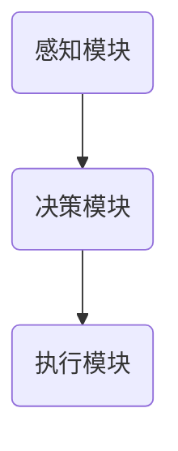

#### 2.2 ReAct的核心算法

ReAct的核心算法通常基于反应式编程模型，其核心思想是“感知-决策-执行”循环。以下是一个简化的ReAct算法流程：

```pseudo
function ReAct():
    while true:
        感知环境
        根据感知结果做出决策
        执行决策
```

#### 2.3 ReAct的数据预处理

ReAct的数据预处理过程至关重要，它直接影响到模型的效果。数据预处理通常包括以下步骤：

1. **数据收集**：收集来自不同来源的数据，如传感器、日志等。
2. **数据清洗**：去除数据中的噪声和错误。
3. **特征提取**：将原始数据转换为适合模型处理的形式。
4. **数据增强**：通过增加数据的多样性，提高模型的泛化能力。

#### 2.4 ReAct的性能优化

ReAct的性能优化主要包括以下几个方面：

1. **算法优化**：通过改进算法模型，提高模型的预测准确性。
2. **硬件加速**：利用GPU等硬件资源，提高计算速度。
3. **分布式计算**：通过分布式计算框架，处理大规模数据。
4. **数据缓存**：优化数据读取速度，减少I/O开销。

### 第3章：ReAct的数学模型

#### 3.1 ReAct的数学基础

ReAct的数学基础通常涉及概率论、线性代数和优化理论。以下是ReAct中常用的数学公式：

1. **概率分布**：用于表示环境状态的概率分布。
2. **条件概率**：表示在某一条件下，另一事件发生的概率。
3. **马尔可夫决策过程**：描述决策过程中的状态转移和奖励。

以下是几个关键的数学公式：

$$
P(s_t|s_{t-1}, a_{t-1}) = \text{状态转移概率}
$$

$$
R(s_t, a_t) = \text{奖励函数}
$$

$$
P(s_{t+1}|s_t, a_t) = \text{状态转移概率}
$$

#### 3.2 ReAct的核心数学公式

ReAct的核心数学公式通常用于决策过程中的状态评估和策略选择。以下是几个核心公式：

1. **价值函数**：表示在不同状态下的最优期望奖励。
2. **策略**：表示在不同状态下应采取的行动。
3. **最优策略**：表示在所有策略中，能够获得最大期望奖励的策略。

以下是几个核心公式的详细解释：

$$
V^*(s) = \max_a \sum_{s'} P(s' | s, a) \cdot R(s, a) + \gamma V^*(s')
$$

$$
\pi^*(s) = \arg\max_a \sum_{s'} P(s' | s, a) \cdot R(s, a)
$$

#### 3.3 数学公式应用举例

以下是一个简单的应用示例，用于计算在给定状态下的最优动作：

```latex
\begin{aligned}
P(s_2|s_1, a_1) &= 0.8 \quad (\text{状态转移概率}) \\
R(s_2, a_2) &= 10 \quad (\text{奖励函数}) \\
\gamma &= 0.9 \quad (\text{折扣因子}) \\
\end{aligned}
```

根据上述公式，我们可以计算得到在状态$s_1$下，采取动作$a_1$的最优期望奖励：

$$
V^*(s_1) = 0.8 \cdot 10 + 0.9 \cdot V^*(s_2)
$$

通过迭代计算，我们可以得到最优价值函数和最优策略。

## 第二部分：应用实战

### 第4章：ReAct在自然语言处理中的应用

#### 4.1 ReAct在文本分类中的应用

文本分类是自然语言处理中的一个基本任务，它将文本数据自动分配到预定义的类别中。ReAct在文本分类中的应用主要通过以下步骤实现：

1. **数据预处理**：对文本数据进行清洗、分词和词性标注等预处理操作。
2. **特征提取**：将预处理后的文本转换为适合模型处理的特征向量。
3. **模型训练**：使用ReAct模型对特征向量进行分类训练。
4. **模型评估**：通过测试数据评估模型的分类性能。

下面是一个简化的文本分类流程：

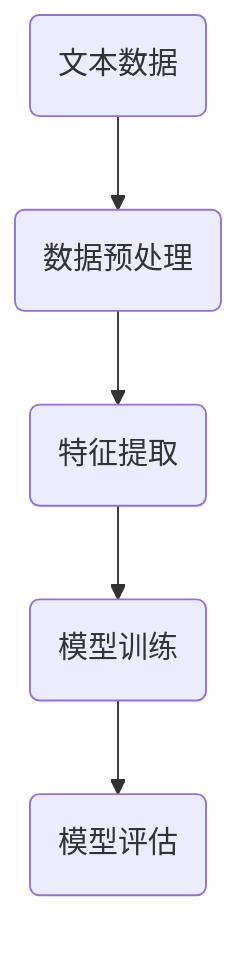

#### 4.2 ReAct在机器翻译中的应用

机器翻译是将一种语言的文本转换为另一种语言的过程。ReAct在机器翻译中的应用主要通过以下步骤实现：

1. **双语数据准备**：收集大量的双语对照文本数据。
2. **数据预处理**：对双语数据进行清洗、分词和词性标注等预处理操作。
3. **特征提取**：将预处理后的文本转换为适合模型处理的特征向量。
4. **模型训练**：使用ReAct模型进行翻译训练。
5. **模型评估**：通过测试数据评估模型的翻译性能。

下面是一个简化的机器翻译流程：

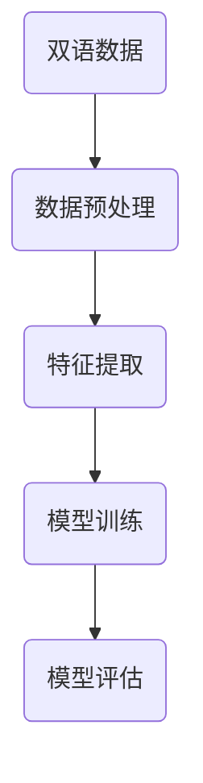

#### 4.3 ReAct在对话系统中的应用

对话系统是自然语言处理中的另一个重要应用领域，它旨在实现人与机器之间的自然交互。ReAct在对话系统中的应用主要通过以下步骤实现：

1. **对话管理**：设计对话流程，包括用户意图识别、对话状态跟踪等。
2. **对话生成**：生成自然流畅的回复，满足用户需求。
3. **对话理解**：理解用户输入的意图，为对话生成提供指导。
4. **对话评估**：通过评估对话质量，优化对话系统。

下面是一个简化的对话系统流程：

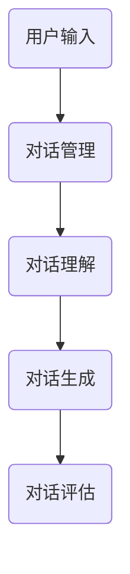

### 第5章：ReAct在计算机视觉中的应用

#### 5.1 ReAct在图像识别中的应用

图像识别是计算机视觉中的基础任务，它旨在从图像中识别出特定对象或场景。ReAct在图像识别中的应用主要通过以下步骤实现：

1. **图像预处理**：对图像进行缩放、裁剪、灰度化等预处理操作。
2. **特征提取**：从预处理后的图像中提取特征向量。
3. **模型训练**：使用ReAct模型对特征向量进行图像识别训练。
4. **模型评估**：通过测试数据评估模型的识别性能。

下面是一个简化的图像识别流程：

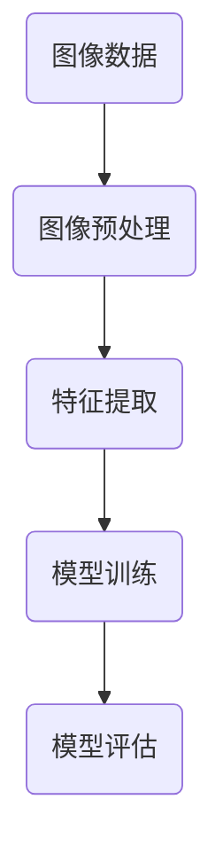

#### 5.2 ReAct在视频分析中的应用

视频分析是计算机视觉中的高级任务，它旨在从视频序列中提取有用信息。ReAct在视频分析中的应用主要通过以下步骤实现：

1. **视频预处理**：对视频进行解码、缩放、帧提取等预处理操作。
2. **特征提取**：从视频帧中提取特征向量。
3. **模型训练**：使用ReAct模型对特征向量进行视频分析训练。
4. **模型评估**：通过测试数据评估模型的视频分析性能。

下面是一个简化的视频分析流程：

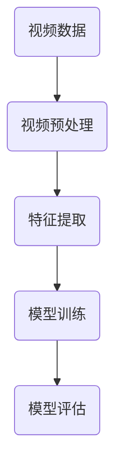

#### 5.3 ReAct在虚拟现实中的应用

虚拟现实是计算机视觉和自然语言处理的跨界应用，它旨在创建一个虚拟的三维世界，让用户在其中进行互动。ReAct在虚拟现实中的应用主要通过以下步骤实现：

1. **场景建模**：构建虚拟现实场景，包括物体、角色和交互元素。
2. **交互理解**：理解用户的输入，如手势、语音等。
3. **实时渲染**：根据用户的交互，实时渲染虚拟场景。
4. **性能优化**：优化渲染速度和交互响应。

下面是一个简化的虚拟现实应用流程：

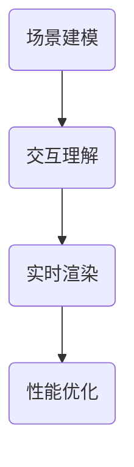

### 第6章：ReAct在推荐系统中的应用

#### 6.1 ReAct在推荐系统中的原理

推荐系统旨在为用户提供个性化的推荐结果，以提高用户满意度。ReAct在推荐系统中的应用主要通过以下原理实现：

1. **用户行为分析**：分析用户的历史行为数据，如浏览记录、购买记录等。
2. **物品特征提取**：提取物品的特征信息，如标题、描述、标签等。
3. **模型训练**：使用ReAct模型对用户行为数据和物品特征进行训练。
4. **推荐生成**：根据用户特征和物品特征生成推荐结果。

下面是一个简化的推荐系统原理：

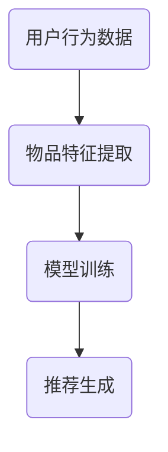

#### 6.2 ReAct在推荐系统中的实现

ReAct在推荐系统中的实现主要包括以下步骤：

1. **数据收集**：收集用户行为数据和物品特征数据。
2. **数据预处理**：对数据进行清洗、去重、归一化等预处理操作。
3. **特征工程**：提取用户和物品的特征，如用户兴趣标签、物品属性等。
4. **模型训练**：使用ReAct模型对预处理后的数据进行训练。
5. **模型评估**：通过测试数据评估模型的推荐性能。

下面是一个简化的ReAct推荐系统实现流程：

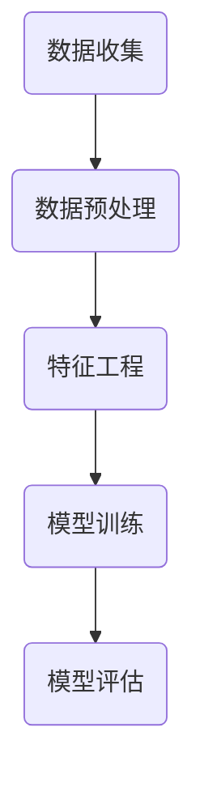

#### 6.3 ReAct在推荐系统中的优化

ReAct在推荐系统中的优化主要包括以下几个方面：

1. **模型优化**：通过改进算法模型，提高推荐准确性。
2. **数据优化**：通过增加高质量数据，提高模型效果。
3. **特征优化**：通过提取更有效的特征，提高推荐性能。
4. **用户反馈**：通过用户反馈，动态调整推荐策略。

下面是一个简化的ReAct推荐系统优化流程：

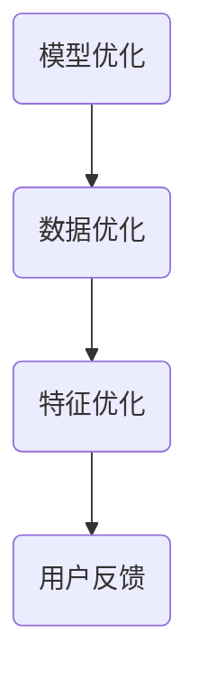

### 第7章：ReAct在实时决策中的应用

#### 7.1 ReAct在实时决策中的原理

实时决策系统旨在对实时数据进行分析和处理，以快速做出决策。ReAct在实时决策中的应用主要通过以下原理实现：

1. **实时数据采集**：从各种数据源实时采集数据。
2. **数据处理**：对实时数据进行预处理和特征提取。
3. **模型训练**：使用ReAct模型对预处理后的数据进行实时训练。
4. **决策生成**：根据实时数据和模型预测结果生成决策。

下面是一个简化的实时决策系统原理：

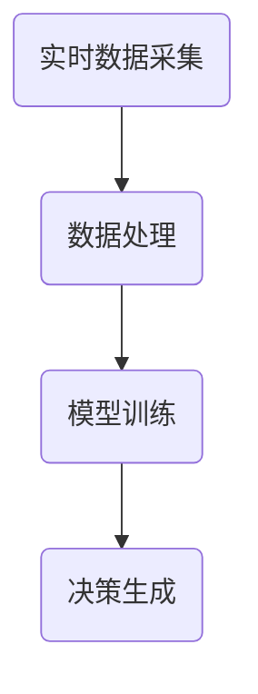

#### 7.2 ReAct在实时决策中的实现

ReAct在实时决策中的实现主要包括以下步骤：

1. **数据接入**：接入实时数据源，如传感器、数据库等。
2. **数据处理**：对实时数据进行预处理，如去噪、滤波等。
3. **特征提取**：从预处理后的数据中提取特征。
4. **模型训练**：使用ReAct模型对实时数据进行训练。
5. **决策生成**：根据实时数据和模型预测结果生成决策。

下面是一个简化的ReAct实时决策实现流程：

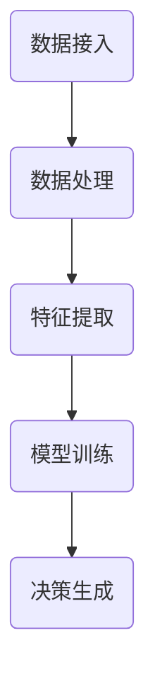

#### 7.3 ReAct在实时决策中的挑战与优化

ReAct在实时决策中面临以下挑战：

1. **数据延迟**：实时数据的延迟可能导致决策失效。
2. **计算资源**：实时决策需要大量的计算资源。
3. **模型复杂性**：复杂的模型可能影响实时决策的效率。

针对这些挑战，可以采取以下优化策略：

1. **数据预处理**：通过预处理减少数据延迟。
2. **模型压缩**：使用压缩模型，减少计算资源消耗。
3. **分布式计算**：利用分布式计算框架，提高处理速度。

下面是一个简化的ReAct实时决策优化流程：

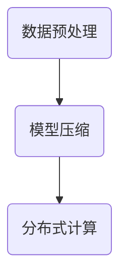

## 第三部分：开发实践

### 第8章：ReAct应用开发环境搭建

#### 8.1 开发环境配置

搭建ReAct应用开发环境主要包括以下步骤：

1. **安装Python**：确保安装了Python 3.6及以上版本。
2. **安装Jupyter Notebook**：用于开发、测试和运行ReAct应用。
3. **安装必要的库**：包括NumPy、Pandas、TensorFlow等。

安装步骤如下：

```bash
pip install python
pip install jupyter
pip install numpy
pip install pandas
pip install tensorflow
```

#### 8.2 开发工具介绍

在ReAct应用开发过程中，常用的工具包括：

1. **Jupyter Notebook**：用于编写、运行和共享ReAct代码。
2. **TensorBoard**：用于可视化ReAct模型的训练过程。
3. **Docker**：用于容器化ReAct应用，提高部署和扩展的灵活性。

#### 8.3 开发框架选择

在ReAct应用开发中，可以选择以下框架：

1. **TensorFlow**：适用于大规模数据集和复杂模型。
2. **PyTorch**：具有较好的灵活性和易用性。
3. **Keras**：基于TensorFlow，提供更简洁的API。

## 附录

### 附录A：ReAct相关资源与工具

- **资源**：
  - [ReAct论文](https://arxiv.org/abs/2006.03814)
  - [ReAct开源代码](https://github.com/facebookresearch/ReAct)
- **工具**：
  - [TensorFlow](https://www.tensorflow.org/)
  - [PyTorch](https://pytorch.org/)
  - [Jupyter Notebook](https://jupyter.org/)

### 附录B：ReAct常见问题解答

- **问题一：如何选择合适的ReAct模型？**
  - 根据应用场景和数据特点，选择适合的ReAct模型。对于大规模数据集，选择TensorFlow或PyTorch可能更合适。

- **问题二：如何处理ReAct训练数据？**
  - 对训练数据进行预处理，如去噪、归一化等。对于文本数据，可以进行分词和词性标注等处理。

- **问题三：如何优化ReAct性能？**
  - 可以通过模型压缩、分布式计算等方式优化ReAct性能。此外，选择合适的硬件设备，如GPU，也可以提高计算速度。

## 结语

ReAct作为一种新型的AI智能体模型，具有反应性、自主性、适应性和灵活性等特点。本文从理论基础、应用实战和开发实践三个方面，详细介绍了ReAct的概念、技术基础和应用场景。通过本文的阅读，读者可以全面了解ReAct的工作原理和应用方法，并能够动手实现自己的ReAct应用。

作者：AI天才研究院/AI Genius Institute & 禅与计算机程序设计艺术 /Zen And The Art of Computer Programming

