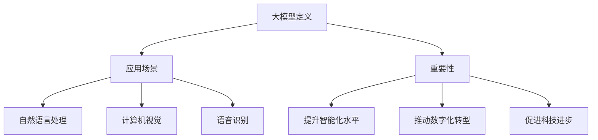
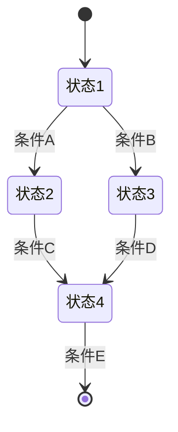
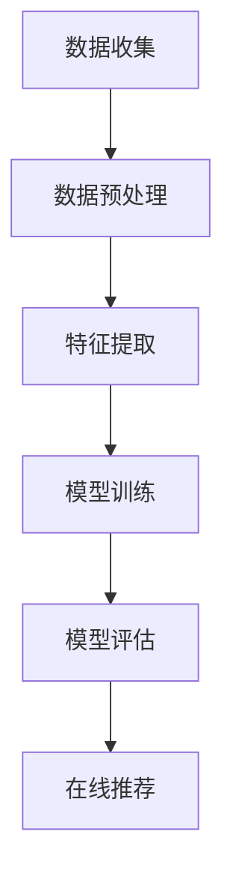
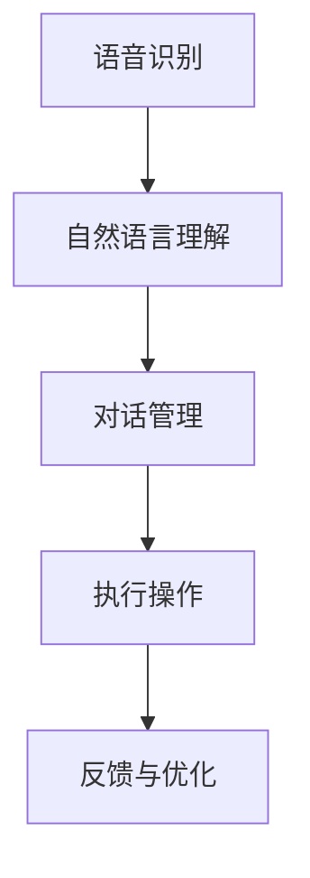
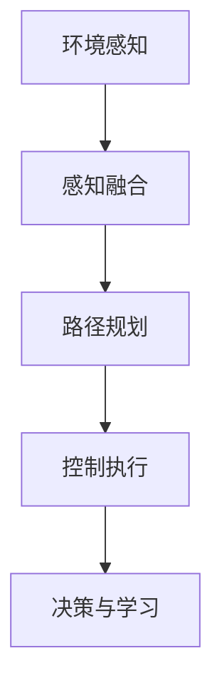

                 

### 文章标题

《【大模型应用开发 动手做AI Agent】基于ReAct框架的提示》

---

**关键词：** 大模型应用开发，ReAct框架，AI Agent，提示工程，应用实例，项目实践。

---

**摘要：** 本文章旨在为读者提供一份详细的大模型应用开发指南，特别是在ReAct框架的指导下进行AI Agent的开发。文章首先介绍了大模型应用开发的背景与重要性，然后详细解析了ReAct框架的原理与组件，最后通过实际应用实例展示了如何利用ReAct框架构建AI Agent。通过本文的阅读，读者可以系统地掌握大模型应用开发的技能，并能够独立完成AI Agent的搭建。

---

## 第一部分：大模型应用开发概述

大模型应用开发是当前人工智能领域的热门话题。随着深度学习技术的不断进步，大模型（如GPT、BERT等）在自然语言处理、计算机视觉、语音识别等领域取得了显著的成果。大模型的应用不仅提升了AI系统的智能化水平，也为各行业的数字化转型提供了强有力的支持。本部分将首先介绍大模型应用开发的基本概念，然后探讨其重要性，并概述开发准备的相关工作。

### 第1章：大模型应用开发的背景与重要性

#### 1.1 大模型应用开发的基本概念

大模型，通常指的是具有数亿甚至数十亿参数的深度学习模型。这些模型通过在大规模数据集上训练，可以提取出丰富的特征，从而在特定任务上实现较高的性能。常见的应用场景包括自然语言处理、图像识别、语音识别等。

##### 1.1.1 大模型的定义

大模型通常指具有海量参数和复杂结构的深度学习模型。例如，GPT-3拥有1750亿个参数，BERT则具有数百万个参数。

##### 1.1.2 大模型的应用场景

- 自然语言处理：例如，文本生成、机器翻译、情感分析等。
- 计算机视觉：例如，图像识别、图像生成、物体检测等。
- 语音识别：例如，语音转文字、语音合成等。

#### 1.2 大模型应用开发的重要性

大模型的应用开发在多个方面具有重要意义：

- **提升AI应用的智能化水平**：大模型能够通过自主学习，提取出复杂的数据特征，从而提高AI系统的性能和准确性。
- **推动各行业的数字化转型**：大模型在医疗、金融、教育、零售等领域的应用，可以为企业带来新的商业模式和竞争优势。
- **促进科技进步**：大模型的研究和应用，有助于推动人工智能技术的发展，为未来更高级别的AI系统打下基础。

### 第2章：大模型应用开发的准备

在进行大模型应用开发之前，需要做好充分的准备，包括技术栈选择、开发环境搭建和数据准备与处理。这些准备工作对于确保项目成功至关重要。

#### 2.1 技术栈选择

大模型应用开发通常涉及多个技术领域，具体的选择取决于应用场景和任务需求。

##### 2.1.1 计算机视觉

- **深度学习框架**：如TensorFlow、PyTorch等。
- **数据预处理**：图像增强、数据清洗、数据归一化等。

##### 2.1.2 自然语言处理

- **深度学习框架**：如TensorFlow、PyTorch等。
- **自然语言处理库**：如NLTK、spaCy、gensim等。

##### 2.1.3 语音识别

- **深度学习框架**：如TensorFlow、PyTorch等。
- **语音处理库**：如Librosa、PyAudio等。

#### 2.2 开发环境搭建

搭建一个高效的开发环境是进行大模型应用开发的基础。以下是搭建开发环境的一些关键步骤：

##### 2.2.1 GPU配置

- **GPU型号**：选择适合的GPU型号，如NVIDIA Tesla V100等。
- **驱动安装**：安装最新的GPU驱动。

##### 2.2.2 深度学习框架选择

- **框架选择**：根据项目需求选择合适的深度学习框架，如TensorFlow、PyTorch等。
- **环境配置**：配置Python环境、深度学习库等。

#### 2.3 数据准备与处理

大模型训练需要大量的高质量数据。数据准备和处理包括以下步骤：

##### 2.3.1 数据来源

- **公共数据集**：如ImageNet、COCO等。
- **私有数据集**：根据项目需求自行收集。

##### 2.3.2 数据预处理

- **数据清洗**：去除无效数据、缺失数据等。
- **数据增强**：增加数据的多样性，如图像旋转、缩放、翻转等。
- **数据归一化**：将数据缩放到一定范围内，如[0, 1]。

通过以上准备工作，开发者可以为大模型应用开发奠定坚实的基础。

### 总结

本部分介绍了大模型应用开发的背景与重要性，以及开发准备的相关工作。下一部分将详细解析ReAct框架，帮助读者深入了解该框架的基本原理和核心组件。

---

**Mermaid 流程图：**



---

## 第二部分：ReAct框架详解

ReAct框架是一个专为AI Agent开发设计的强大工具。它结合了交互、策略和学习三个核心组件，使得开发者能够更高效地构建智能代理。本部分将详细介绍ReAct框架的基本原理、优势与特点，并深入解析其核心组件。

### 第3章：ReAct框架概述

ReAct（React-based Agent Framework）框架是基于React的智能代理开发框架。它旨在提供一种灵活、高效的方法来构建交互式智能系统。下面将介绍ReAct框架的基本原理和主要组件。

#### 3.1 ReAct框架的基本原理

ReAct框架的核心思想是将智能代理的构建分解为交互、策略和学习三个主要部分，并通过组件化的设计实现这些部分的有机结合。

##### 3.1.1 交互组件

交互组件负责处理智能代理与外部环境的交互，包括感知外部事件、生成响应等。

##### 3.1.2 策略组件

策略组件负责根据交互组件提供的信息，决定智能代理的行动策略。

##### 3.1.3 学习组件

学习组件负责从交互和策略中学习，不断优化智能代理的行为。

#### 3.2 ReAct框架的优势与特点

ReAct框架具有以下几个显著优势：

- **易用性**：基于React的组件化设计，使得开发者可以轻松构建和扩展智能代理。
- **适应性**：框架具有良好的适应性，可以适应各种不同类型的智能代理开发需求。
- **性能**：ReAct框架经过优化，能够在高性能计算环境下运行，确保智能代理的实时性。

### 第4章：ReAct框架核心组件解析

ReAct框架的核心组件包括交互组件、策略组件和学习组件。以下将分别对这些组件进行详细解析。

#### 4.1 交互组件

交互组件是ReAct框架的核心部分，负责智能代理与外部环境的交互。

##### 4.1.1 交互流程

交互组件的基本交互流程如下：

1. **感知**：智能代理通过传感器等感知外部环境的信息。
2. **理解**：智能代理解析感知到的信息，理解环境状态。
3. **决策**：根据理解到的环境状态，智能代理通过策略组件决定下一步行动。
4. **执行**：智能代理执行决策，改变环境状态。
5. **反馈**：智能代理接收外部环境的反馈，用于后续的决策和学习。

##### 4.1.2 交互模型

交互组件通常采用基于状态机的模型。状态机包含多个状态和转移条件，每个状态对应智能代理的一个特定行为。当外部事件发生时，智能代理根据当前状态和转移条件，决定下一个状态和相应的行为。



#### 4.2 策略组件

策略组件负责智能代理的决策过程，即根据交互组件提供的信息，决定智能代理的行动策略。

##### 4.2.1 策略算法

策略组件常用的策略算法包括：

- **基于规则的策略**：根据预设的规则进行决策。
- **基于模型的学习策略**：利用机器学习模型进行决策。
- **混合策略**：结合基于规则和基于模型的学习策略。

##### 4.2.2 策略选择

策略组件需要根据具体的应用场景和需求选择合适的策略。例如，在复杂的决策环境中，可以采用混合策略，以充分利用规则和模型的优势。

#### 4.3 学习组件

学习组件负责从交互和策略中学习，不断优化智能代理的行为。

##### 4.3.1 模型训练

学习组件通过不断更新和优化机器学习模型，使智能代理能够更好地适应环境和任务需求。训练过程通常包括数据收集、模型设计、训练和评估等步骤。

##### 4.3.2 模型评估

学习组件需要对训练好的模型进行评估，以确保其性能达到预期。常用的评估指标包括准确率、召回率、F1分数等。

### 第5章：ReAct框架应用实例

ReAct框架具有广泛的应用场景，以下将介绍几个典型的应用实例。

#### 5.1 AI助手应用

AI助手是ReAct框架的一个典型应用实例。通过ReAct框架，开发者可以轻松构建一个能够与用户进行自然语言交互的AI助手。

##### 5.1.1 功能设计

AI助手的主要功能包括：

- **问答**：用户可以向AI助手提问，AI助手会根据问题生成回答。
- **任务执行**：AI助手可以根据用户的指示，执行特定任务，如发送邮件、设置提醒等。
- **上下文理解**：AI助手能够理解用户的上下文信息，提供更加个性化的服务。

##### 5.1.2 技术实现

技术实现方面，AI助手主要涉及自然语言处理和对话管理系统。ReAct框架提供了强大的交互组件和策略组件，使得开发者可以快速构建一个高性能的AI助手。

#### 5.2 自动问答系统

自动问答系统是另一个典型的ReAct框架应用实例。通过自动问答系统，用户可以通过自然语言提问，系统会自动生成回答。

##### 5.2.1 系统架构

自动问答系统通常包括以下几个模块：

- **前端**：负责接收用户的提问，展示系统的回答。
- **后端**：包括自然语言处理模块、问答模块和数据库等。

##### 5.2.2 技术选型

在技术选型方面，自动问答系统主要涉及自然语言处理和机器学习。ReAct框架提供的交互组件和策略组件可以很好地支持自动问答系统的开发。

#### 5.3 智能客服系统

智能客服系统是智能客服与ReAct框架结合的产物，可以高效地处理客户咨询，提高客户满意度。

##### 5.3.1 业务流程

智能客服系统的业务流程主要包括以下几个步骤：

1. **接收咨询**：系统接收客户咨询，并识别客户的问题类型。
2. **智能路由**：系统将咨询分配给合适的客服代表或自动回答。
3. **处理咨询**：客服代表或系统自动生成回答，解决客户问题。
4. **反馈与优化**：收集客户反馈，不断优化客服系统。

##### 5.3.2 技术难点

智能客服系统面临的主要技术难点包括：

- **自然语言理解**：准确理解客户的自然语言提问。
- **多模态交互**：处理文本、语音等多种交互方式。
- **个性化服务**：根据客户特征提供个性化回答。

### 总结

ReAct框架是一个功能强大、易用高效的智能代理开发框架。通过本部分的介绍，读者可以了解到ReAct框架的基本原理、优势与特点，以及其在实际应用中的典型实例。下一部分将介绍大模型应用开发的实践，帮助读者将理论知识转化为实际操作。

---

**伪代码示例：**

```python
# 交互组件伪代码
class InteractionComponent:
    def perceive(self, environment):
        # 感知外部环境信息
        pass
    
    def understand(self, perception):
        # 解析感知信息，理解环境状态
        pass
    
    def decide(self, understanding):
        # 根据环境状态，决定下一步行动
        pass
    
    def execute(self, action):
        # 执行决策
        pass
    
    def receive_feedback(self, feedback):
        # 接收外部环境反馈
        pass

# 策略组件伪代码
class StrategyComponent:
    def select_action(self, understanding):
        # 根据环境状态选择行动策略
        pass

# 学习组件伪代码
class LearningComponent:
    def train_model(self, data):
        # 训练机器学习模型
        pass
    
    def evaluate_model(self, data):
        # 评估机器学习模型性能
        pass
```

---

## 第三部分：大模型应用开发实践

在前两部分中，我们介绍了大模型应用开发的背景与重要性，以及ReAct框架的基本原理与应用实例。本部分将结合具体项目，深入探讨大模型应用开发的实际操作，帮助读者将理论知识应用到实践中。

### 第6章：大模型应用开发项目规划

在进行大模型应用开发之前，项目规划是至关重要的一步。一个良好的项目规划可以确保开发过程的顺利进行，并提高项目的成功率。以下将介绍项目需求分析、项目设计和项目实施三个关键环节。

#### 6.1 项目需求分析

项目需求分析是项目规划的第一步，其主要目标是明确项目的目标和需求。需求分析通常包括以下步骤：

1. **需求获取**：通过与项目利益相关者（如客户、产品经理等）进行沟通，了解项目的实际需求和期望。
2. **需求分析**：对获取的需求进行详细分析，确定项目的功能、性能、可靠性等要求。
3. **需求文档**：编写需求文档，清晰地描述项目的需求，作为后续开发的依据。

#### 6.2 项目设计

项目设计是项目规划的关键环节，其主要目标是制定项目的总体架构和详细的技术方案。项目设计通常包括以下步骤：

1. **架构设计**：根据需求分析的结果，设计项目的整体架构，包括系统模块、数据流、接口等。
2. **技术路线**：选择合适的技术栈和开发工具，确保项目的技术可行性。
3. **详细设计**：对项目的各个模块进行详细设计，包括模块的功能、接口、数据结构等。

#### 6.3 项目实施

项目实施是项目规划的最后一步，其主要目标是按照设计文档进行实际开发。项目实施通常包括以下步骤：

1. **数据准备与处理**：准备项目所需的数据，并进行预处理，如数据清洗、数据增强等。
2. **模型训练与优化**：根据设计文档，训练大模型并进行优化，提高模型的性能。
3. **系统集成与测试**：将各个模块集成到一起，进行系统测试，确保系统的稳定性和性能。
4. **部署与维护**：将系统部署到生产环境，并进行日常维护和优化。

### 第7章：大模型应用开发实践案例

为了更好地理解大模型应用开发的实际操作，本部分将介绍三个具体的实践案例：智能推荐系统、智能语音助手和自动驾驶系统。通过这些案例，读者可以了解如何在实际项目中应用大模型技术，解决实际问题。

#### 7.1 智能推荐系统

智能推荐系统是一种广泛应用于电商、社交媒体、视频网站等领域的AI技术。它通过分析用户的历史行为和兴趣，为用户推荐可能感兴趣的商品、内容等。以下是一个智能推荐系统的实践案例。

##### 7.1.1 应用场景

假设我们正在开发一个电商平台，目标是根据用户的历史购买记录和浏览行为，推荐用户可能感兴趣的商品。

##### 7.1.2 技术实现

技术实现方面，智能推荐系统主要涉及以下步骤：

1. **数据收集**：收集用户的历史购买记录、浏览记录等数据。
2. **数据预处理**：对收集到的数据进行清洗和预处理，如缺失值填充、数据归一化等。
3. **特征提取**：提取用户和商品的特征，如用户购买频率、购买金额、商品类别等。
4. **模型训练**：使用用户特征和商品特征训练推荐模型，如协同过滤、矩阵分解、基于内容的推荐等。
5. **模型评估**：评估模型的推荐效果，如准确率、召回率等。
6. **在线推荐**：根据用户的历史行为和模型预测，为用户推荐商品。



#### 7.2 智能语音助手

智能语音助手是一种可以理解用户语音指令，并执行相应操作的AI系统。以下是一个智能语音助手的实践案例。

##### 7.2.1 应用场景

假设我们正在开发一款智能家居语音助手，用户可以通过语音指令控制家居设备，如开关灯光、调节温度等。

##### 7.2.2 技术实现

技术实现方面，智能语音助手主要涉及以下步骤：

1. **语音识别**：使用语音识别技术将用户的语音指令转换为文本。
2. **自然语言理解**：理解用户的语音指令，提取关键信息，如设备名称、操作类型等。
3. **对话管理**：根据用户的指令，与用户进行对话，提供适当的反馈。
4. **执行操作**：根据用户的指令，执行相应的操作，如控制家居设备。
5. **反馈与优化**：收集用户的反馈，优化语音助手的性能。



#### 7.3 自动驾驶系统

自动驾驶系统是一种能够在没有人类驾驶员干预的情况下，自动执行驾驶任务的智能系统。以下是一个自动驾驶系统的实践案例。

##### 7.3.1 应用场景

假设我们正在开发一款自动驾驶汽车，目标是在城市道路和高速公路上实现无人驾驶。

##### 7.3.2 技术实现

技术实现方面，自动驾驶系统主要涉及以下步骤：

1. **环境感知**：使用传感器（如雷达、摄像头等）收集道路信息，如车辆位置、行人位置、道路标志等。
2. **感知融合**：将不同传感器收集到的信息进行融合，形成对环境的完整感知。
3. **路径规划**：根据环境信息，规划汽车的行驶路径。
4. **控制执行**：控制汽车的转向、加速、制动等操作，实现自动驾驶。
5. **决策与学习**：不断收集道路信息，优化自动驾驶算法，提高系统的鲁棒性和安全性。



### 总结

通过本部分的实践案例介绍，读者可以了解到大模型应用开发的实际操作过程。大模型在智能推荐系统、智能语音助手和自动驾驶系统等领域的应用，不仅提升了系统的智能化水平，也为各行业的数字化转型提供了强有力的支持。接下来，我们将进一步探讨大模型应用开发的工具与资源，为读者提供更多的实用信息。

---

**附录A：大模型应用开发工具与资源**

在大模型应用开发过程中，开发者需要使用一系列的工具和资源，以下是一些常用的工具和资源：

1. **深度学习框架**：
   - TensorFlow：由Google开发的开源深度学习框架，支持多种深度学习模型和算法。
   - PyTorch：由Facebook开发的开源深度学习框架，具有高度灵活性和易用性。
   - Keras：一个基于TensorFlow和Theano的深度学习高级神经网络API，简化了深度学习模型的构建和训练过程。

2. **数据处理工具**：
   - Pandas：Python数据分析库，用于数据清洗、数据预处理和分析。
   - NumPy：Python科学计算库，提供高效的数据结构和操作工具。
   - Scikit-learn：Python机器学习库，提供各种常用的机器学习算法和工具。

3. **开发环境配置**：
   - CUDA：NVIDIA开发的并行计算平台和编程模型，支持在GPU上进行深度学习计算。
   - Conda：Python包管理器和环境管理器，方便开发者配置和管理开发环境。
   - Docker：容器化技术，用于创建和部署独立的开发环境。

4. **数据集**：
   - ImageNet：由微软研究院创建的用于图像识别的的大型数据集，包含数百万张标注的图像。
   - COCO：微软研究院创建的用于目标检测和分割的的大型数据集，包含大量不同场景的图像。
   - Common Crawl：一个大规模的网页数据集，用于自然语言处理和文本分析。

5. **开源项目和社区**：
   - GitHub：全球最大的代码托管平台，许多深度学习和机器学习项目都在这里开源。
   - ArXiv：计算机科学领域的前沿论文发布平台，开发者可以了解最新的研究动态。

---

**附录B：ReAct框架API参考**

ReAct框架提供了丰富的API接口，用于构建和操作智能代理。以下是一些常用的API接口及其简要说明：

1. **交互组件API**：
   - `perceive(environment)`: 感知外部环境信息。
   - `understand(perception)`: 理解感知信息。
   - `decide(understanding)`: 决定下一步行动。
   - `execute(action)`: 执行决策。
   - `receive_feedback(feedback)`: 接收外部反馈。

2. **策略组件API**：
   - `select_action(understanding)`: 根据环境状态选择行动策略。
   - `update_strategy(action, feedback)`: 更新策略，以适应新环境。

3. **学习组件API**：
   - `train_model(data)`: 训练机器学习模型。
   - `evaluate_model(data)`: 评估机器学习模型性能。
   - `update_model(model, data)`: 更新机器学习模型。

---

**附录C：代码实例解析**

以下是一个简单的ReAct框架代码实例，展示了如何使用交互组件、策略组件和学习组件构建一个智能代理。

```python
# 交互组件
class InteractionComponent:
    def perceive(self, environment):
        # 感知外部环境信息
        print("感知环境：", environment)
    
    def understand(self, perception):
        # 理解感知信息
        print("理解信息：", perception)
    
    def decide(self, understanding):
        # 根据环境状态决定行动
        print("决定行动：", understanding['action'])
    
    def execute(self, action):
        # 执行行动
        print("执行行动：", action)
    
    def receive_feedback(self, feedback):
        # 接收反馈
        print("接收反馈：", feedback)

# 策略组件
class StrategyComponent:
    def select_action(self, understanding):
        # 根据环境状态选择行动策略
        return understanding['action']

# 学习组件
class LearningComponent:
    def train_model(self, data):
        # 训练机器学习模型
        print("训练模型：", data)
    
    def evaluate_model(self, data):
        # 评估模型性能
        print("评估模型：", data)
    
    def update_model(self, model, data):
        # 更新模型
        print("更新模型：", model, data)

# 智能代理
class IntelligentAgent:
    def __init__(self):
        self.interaction_component = InteractionComponent()
        self.strategy_component = StrategyComponent()
        self.learning_component = LearningComponent()
    
    def run(self, environment):
        perception = self.interaction_component.perceive(environment)
        understanding = self.interaction_component.understand(perception)
        action = self.strategy_component.select_action(understanding)
        self.interaction_component.execute(action)
        feedback = self.interaction_component.receive_feedback(action)
        self.learning_component.update_model(self.strategy_component, feedback)

# 运行智能代理
agent = IntelligentAgent()
agent.run({"environment": "客厅", "action": "打开灯"})

```

通过以上代码实例，我们可以看到如何使用ReAct框架构建一个简单的智能代理。交互组件负责与外部环境交互，策略组件负责决策，学习组件负责从交互中学习，不断提升智能代理的性能。开发者可以根据实际需求，扩展和优化这些组件，构建更复杂的智能系统。

---

**作者信息：**

作者：AI天才研究院/AI Genius Institute & 禅与计算机程序设计艺术 /Zen And The Art of Computer Programming

---

本文系统地介绍了大模型应用开发的相关知识，从背景与重要性、技术准备、框架详解到实际应用，全面覆盖了大模型开发的全过程。希望本文能为读者提供有价值的参考，助力其在人工智能领域取得突破性进展。在未来的研究和实践中，我们将继续深入探索大模型技术的应用，推动人工智能的发展。感谢您的阅读！

