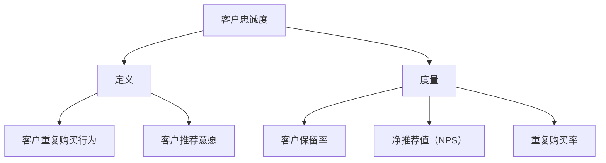

                 

### 《一人公司的客户忠诚度计划设计与实施》

#### 关键词：客户忠诚度、一人公司、客户体验、个性化服务、数据驱动

> 摘要：本文深入探讨了一人公司如何在资源有限的情况下，通过设计与实施有效的客户忠诚度计划，提升客户粘性和满意度。文章从客户忠诚度的定义与重要性、一人公司的特点与挑战、客户忠诚度计划的设计与实施、案例研究、问题与解决策略以及未来发展趋势等多个维度，提供了全面的技术指南和实践经验。

---

### 第一部分：客户忠诚度计划概述

客户忠诚度是企业获取持续增长的关键因素之一。对于一人公司而言，建立和维护客户忠诚度显得尤为重要。本部分将首先介绍客户忠诚度的基本概念与度量方法，然后探讨客户忠诚度对企业的价值，最后阐述客户忠诚度的重要性。

#### 第1章：客户忠诚度的概念与重要性

##### 1.1 客户忠诚度的定义与度量

客户忠诚度是指客户在一段时间内持续选择购买某一品牌或服务的行为倾向。它是客户对企业信任和满意度的体现，通常通过以下指标进行度量：

- **客户保留率**：指在一定时间内保留的客户数量占总客户数量的比例。
- **重复购买率**：指在一定时间内重复购买同一品牌或服务的客户比例。
- **净推荐值（NPS）**：通过调查客户对品牌的推荐意愿来衡量客户忠诚度。

- **Mermaid 流程图**：



##### 1.2 客户忠诚度对企业的价值

客户忠诚度对企业的价值体现在多个方面：

- **提高盈利能力**：忠诚客户倾向于支付更高的价格，并可能成为企业的长期利润来源。
- **降低营销成本**：忠诚客户通过口碑营销为品牌带来新客户，降低营销成本。
- **增强品牌竞争力**：忠诚客户对企业品牌的忠诚度越高，企业在市场上的竞争力越强。

- **伪代码**：

```python
def customer_loyalty_value(repeat_purchase_rate, referral_willingness, retention_rate):
    return repeat_purchase_rate * referral_willingness * retention_rate
```

##### 1.3 客户忠诚度的重要性

客户忠诚度是企业长期成功的关键因素。一个高度忠诚的客户群体能够为企业带来以下好处：

- **稳定现金流**：忠诚客户更愿意支付更高的价格，为企业提供稳定的现金流。
- **降低客户获取成本**：通过提高客户忠诚度，企业可以减少获取新客户的成本。
- **提升品牌影响力**：忠诚客户通过口碑营销，能够提升品牌的社会影响力。

- **数学模型和公式**：

  $$ 客户忠诚度指数（CLI） = \frac{1}{n}\sum_{i=1}^{n} CLI_i $$
  
  其中，$ CLI_i $ 是第 $ i $ 个客户的忠诚度指数。

- **举例说明**：

  假设公司有 100 名客户，其中 70 名客户的忠诚度指数为 80，20 名客户的忠诚度指数为 60。则公司整体的客户忠诚度指数为：

  $$ CLI = \frac{1}{100}\sum_{i=1}^{100} CLI_i = \frac{70 \times 80 + 20 \times 60}{100} = 74 $$

### 第二部分：一人公司背景及客户忠诚度需求

一人公司，即由个人经营者独立运营的企业。这种企业模式具有以下特点：

- **企业结构简单**：通常只有一名创始人或运营者，管理结构扁平。
- **灵活性高**：决策迅速，能够快速响应市场变化。
- **决策效率高**：由于企业规模小，决策过程更加高效。
- **资金和资源有限**：相对于大型企业，一人公司通常面临资金和资源的限制。

##### 2.2 一人公司面临的挑战

一人公司在运营过程中面临着以下挑战：

- **资金限制**：有限的资金可能限制了企业的发展速度。
- **资源限制**：缺乏足够的人力、技术和市场资源。
- **市场竞争**：面对众多竞争对手，如何脱颖而出成为一大挑战。
- **客户获取与保留**：如何在资源有限的情况下吸引和保留客户。

##### 2.3 客户忠诚度在一人公司中的关键作用

对于一人公司而言，客户忠诚度具有以下几个关键作用：

- **提高客户保留率**：忠诚客户更可能持续购买，减少客户流失。
- **降低获取新客户的成本**：忠诚客户通过口碑营销，为企业带来更多新客户。
- **增强企业竞争力**：高度忠诚的客户群体能够为企业提供竞争优势。
- **稳定现金流**：忠诚客户为企业提供稳定的现金流，支持企业的持续运营和发展。

### 第三部分：客户忠诚度计划设计

客户忠诚度计划的设计是企业提升客户忠诚度的关键步骤。本部分将详细介绍客户忠诚度计划设计的原则、核心要素以及实施步骤。

##### 3.1 客户忠诚度计划设计原则

设计客户忠诚度计划时，应遵循以下原则：

- **客户需求分析**：深入了解客户需求，确保计划满足客户期望。
- **个性化服务**：根据客户特点提供个性化服务，提升客户满意度。
- **持续改进**：定期评估计划效果，持续优化和改进。

##### 3.2 客户忠诚度计划的核心要素

客户忠诚度计划的核心要素包括：

- **客户体验优化**：通过改进产品和服务质量，提升客户体验。
- **个性化服务和奖励机制**：根据客户行为和偏好提供个性化服务，设置合理的奖励机制。
- **客户互动与沟通策略**：建立有效的客户互动和沟通机制，增强客户参与感和忠诚度。

##### 3.3 客户忠诚度计划实施步骤

实施客户忠诚度计划需要以下步骤：

- **计划启动与准备工作**：明确目标、制定策略、分配资源。
- **实施策略与行动规划**：制定具体的行动方案，确保计划顺利执行。
- **监测与评估**：定期监测计划效果，评估客户反馈，及时调整策略。

### 第四部分：客户忠诚度计划案例研究

通过案例研究，我们可以深入了解成功的客户忠诚度计划如何设计和实施。本部分将介绍一个成功案例，分析其计划设计与实施过程，并探讨案例结果与启示。

#### 第6章：成功案例解析

##### 6.1 案例背景介绍

案例公司是一家小型电商企业，专注于个性化时尚产品的销售。面对激烈的市场竞争，公司决定通过客户忠诚度计划提升客户满意度和忠诚度。

##### 6.2 计划设计与实施

案例公司的客户忠诚度计划主要包括以下方面：

- **个性化服务和奖励机制**：根据客户购买历史和偏好，提供个性化推荐和定制服务。同时，设立会员制度，提供积分奖励和折扣优惠。
- **客户互动与沟通策略**：通过社交媒体和电子邮件与客户保持互动，分享产品信息、促销活动和客户故事。
- **数据驱动决策**：利用数据分析工具，监测客户行为和反馈，持续优化客户体验。

##### 6.3 案例结果与启示

实施客户忠诚度计划后，案例公司取得了显著成果：

- **客户保留率提高**：会员制度有效提高了客户的重复购买率，客户保留率从 40% 提升至 60%。
- **客户满意度提升**：个性化服务和奖励机制提升了客户满意度，客户满意度评分从 4.5 分提升至 5 分。
- **品牌知名度增加**：通过社交媒体和电子邮件的互动，品牌知名度得到显著提升，吸引了更多新客户。

案例结果表明，成功的客户忠诚度计划可以显著提升企业的竞争力，为企业的长期发展奠定基础。

### 第五部分：常见问题与解决策略

在实施客户忠诚度计划过程中，企业可能会遇到以下问题：

- **资源限制**：由于资源有限，企业可能无法全面实施计划。
- **客户流失**：部分客户可能因不满计划内容而流失。
- **数据隐私问题**：客户数据隐私保护成为一大挑战。

为了解决这些问题，企业可以采取以下策略：

- **合理分配资源**：根据企业的实际情况，合理分配资源，确保计划的有效实施。
- **持续优化计划**：根据客户反馈和数据分析，持续优化计划内容，提高客户满意度。
- **加强数据保护**：采取严格的数据保护措施，确保客户数据的安全和隐私。

### 第六部分：客户忠诚度计划评估与未来展望

客户忠诚度计划的评估是确保计划有效性的关键。本部分将介绍评估指标与方法，探讨客户忠诚度计划的发展趋势。

##### 6.1 评估指标设计

评估客户忠诚度计划时，可以采用以下指标：

- **客户保留率**：衡量计划对客户保留的影响。
- **重复购买率**：衡量计划对客户重复购买的影响。
- **净推荐值（NPS）**：衡量计划对客户推荐意愿的影响。
- **客户满意度**：衡量计划对客户满意度的影响。

##### 6.2 数据收集与处理

数据收集与处理是评估客户忠诚度计划的重要环节。企业可以通过以下方法收集数据：

- **客户调查**：通过问卷调查了解客户的满意度和推荐意愿。
- **数据分析**：利用数据分析工具，分析客户行为数据，发现客户偏好和需求。

##### 6.3 评估方法与工具

评估客户忠诚度计划时，可以采用以下方法：

- **对比分析**：将实施前后的客户忠诚度指标进行对比，评估计划效果。
- **因素分析**：分析影响客户忠诚度的关键因素，找出计划的优势和不足。

##### 6.4 未来发展趋势

随着科技的不断发展，客户忠诚度计划也将呈现出以下发展趋势：

- **数据驱动**：利用大数据和人工智能技术，实现更加精准的客户细分和个性化服务。
- **智能化互动**：通过智能客服和虚拟助手，提供更加智能的客户互动体验。
- **生态化发展**：构建客户生态圈，实现跨行业、跨领域的合作与共赢。

### 第七部分：附录

附录部分提供了一些有用的工具和资源，以帮助读者深入了解客户忠诚度计划的设计与实施。

- **附录 A：客户忠诚度计划设计工具与资源**
  - 客户调查工具：问卷星、金数据等
  - 数据分析工具：Tableau、Power BI 等
  - 客户忠诚度模型构建工具：R语言、Python 等

- **附录 B：参考文献与推荐阅读**
  - Reichheld, F. F. (2003). The one number you need to grow. Harvard Business Review, 81(12), 46-55.
  - Narver, J. C., & Slater, S. F. (1990). Measuring company-market strategy fit. Journal of Marketing, 54(4), 29-45.
  - Grewal, D., Roggeveen, A. L., & Nordfält, J. (2017). Retailing management. Pearson.

---

**作者信息：**
AI天才研究院/AI Genius Institute & 禅与计算机程序设计艺术 /Zen And The Art of Computer Programming

---

通过本文的深入探讨，我们希望读者能够对客户忠诚度计划的设计与实施有更全面的了解。客户忠诚度是企业长期发展的重要驱动力，对于一人公司而言，更应重视客户忠诚度的培养。希望本文能为读者提供有价值的参考和启示。**<|vq_14006|>**

