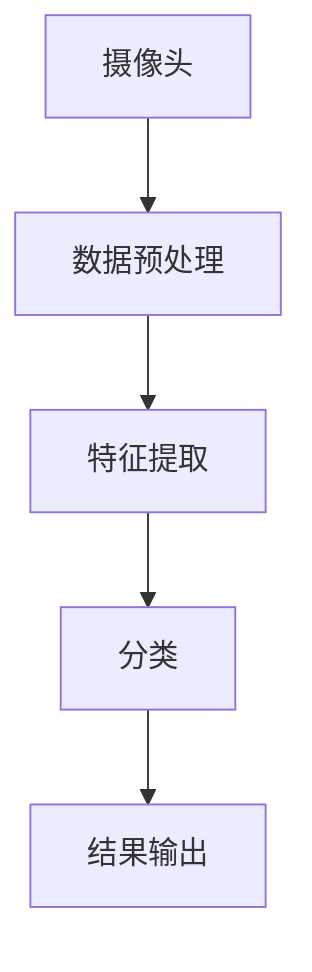

                 

# 《一人公司的视觉识别系统设计》

> 关键词：视觉识别，一人公司，系统设计，深度学习，算法，开发实战

> 摘要：本文将深入探讨一人公司的视觉识别系统设计。从系统概述、核心算法原理、开发实战到经验分享，全面解析视觉识别技术在人工智能领域的应用与发展，旨在为读者提供一个从理论到实践的完整学习路径。

## 目录大纲

### 第一部分：视觉识别系统概述

1.1 视觉识别系统的概念与重要性
1.2 视觉识别系统的架构
1.3 一人公司视觉识别系统的优势

### 第二部分：视觉识别核心算法原理

2.1 特征提取算法
2.2 分类算法
2.3 对抗攻击算法

### 第三部分：视觉识别系统开发实战

3.1 开发环境搭建
3.2 数据预处理
3.3 模型训练与优化
3.4 模型评估与部署

### 第四部分：视觉识别项目实战案例

4.1 案例一：人脸识别系统设计
4.2 案例二：车牌识别系统设计

### 第五部分：视觉识别系统设计经验与技巧

5.1 系统设计经验分享
5.2 视觉识别技术发展趋势

### 附录

A. 视觉识别系统开发工具与资源

## 第一部分：视觉识别系统概述

### 1.1 视觉识别系统的概念与重要性

#### 1.1.1 视觉识别系统的定义

视觉识别系统是指通过计算机或其他电子设备对图像或视频进行识别和分析，从而提取出有价值的信息的系统。它涉及到图像处理、计算机视觉和机器学习等多个领域。

#### 1.1.2 视觉识别系统的应用领域

视觉识别系统在许多领域都有广泛的应用，如安防监控、自动驾驶、医疗诊断、工业自动化、智能城市等。其中，安防监控和自动驾驶是视觉识别系统最为典型的应用场景。

#### 1.1.3 一人公司视觉识别系统的优势

一人公司的视觉识别系统具有以下优势：

1. **高效性**：一人公司可以快速响应市场需求，快速开发和部署视觉识别系统。
2. **灵活性**：一人公司可以根据业务需求，灵活调整和优化系统架构和算法。
3. **低成本**：一人公司无需大量人力和物力投入，即可实现视觉识别系统的开发和应用。

### 1.2 视觉识别系统的架构

#### 1.2.1 硬件架构

视觉识别系统的硬件架构主要包括摄像头、存储设备和服务器。摄像头用于捕捉图像或视频数据，存储设备用于存储大量数据，服务器用于处理和传输数据。

#### 1.2.2 软件架构

视觉识别系统的软件架构主要包括数据预处理模块、特征提取模块、分类模块和结果输出模块。数据预处理模块用于对原始数据进行清洗和处理，特征提取模块用于从数据中提取特征，分类模块用于对特征进行分类，结果输出模块用于输出识别结果。

#### 1.2.3 数据流架构

视觉识别系统的数据流架构如下图所示：



其中，摄像头捕获的图像或视频数据首先经过数据预处理模块，然后进入特征提取模块，提取出关键特征，接着进入分类模块，根据特征进行分类，最后输出识别结果。

### 1.3 一人公司视觉识别系统的优势

#### 1.3.1 高效性

一人公司可以快速响应市场需求，快速开发和部署视觉识别系统。通过利用现有的技术和资源，一人公司可以最大限度地减少开发周期，提高系统上线速度。

#### 1.3.2 灵活性

一人公司可以根据业务需求，灵活调整和优化系统架构和算法。这种灵活性使得一人公司能够更好地适应市场变化，满足不同客户的需求。

#### 1.3.3 低成本

一人公司无需大量人力和物力投入，即可实现视觉识别系统的开发和应用。这种低成本的优势使得一人公司在市场竞争中具有更高的竞争力。

在接下来的部分，我们将深入探讨视觉识别系统的核心算法原理，为读者提供更加全面和深入的了解。请继续关注。

## 第二部分：视觉识别核心算法原理

### 2.1 特征提取算法

#### 2.1.1 传统特征提取方法

传统特征提取方法主要包括直方图、边缘检测、角点检测和纹理分析等。这些方法主要通过分析图像的像素值或像素之间的关系来提取特征。

- **直方图**：直方图是一种常用的特征提取方法，它通过统计图像中各个像素点的灰度值来生成一个直方图，从而描述图像的亮度分布。

- **边缘检测**：边缘检测是一种用于检测图像中边缘的方法。它通过分析图像的像素值变化来识别边缘。

- **角点检测**：角点检测是一种用于检测图像中角点的方法。它通过分析图像的像素值和像素之间的梯度变化来识别角点。

- **纹理分析**：纹理分析是一种用于分析图像纹理的方法。它通过分析图像的像素值和像素之间的空间关系来识别纹理。

#### 2.1.2 基于深度学习的特征提取方法

基于深度学习的特征提取方法是一种更为先进和高效的特征提取方法。它主要通过深度神经网络来自动学习和提取特征。

- **卷积神经网络（CNN）**：卷积神经网络是一种专门用于图像识别的神经网络结构。它通过卷积操作来提取图像的特征。

- **循环神经网络（RNN）**：循环神经网络是一种用于处理序列数据的神经网络结构。它通过记忆单元来处理图像的时空信息。

- **自编码器（Autoencoder）**：自编码器是一种用于特征提取的神经网络结构。它通过编码和解码过程来学习数据的低维表示。

#### 2.1.3 特征提取算法对比分析

传统特征提取方法与基于深度学习的特征提取方法有以下几点对比：

- **效率**：基于深度学习的特征提取方法通常具有更高的效率，因为它可以自动学习和提取特征。

- **准确性**：基于深度学习的特征提取方法通常具有更高的准确性，因为它可以从大量数据中学习到更加复杂的特征。

- **可扩展性**：基于深度学习的特征提取方法具有更好的可扩展性，因为它可以适应不同的数据和场景。

### 2.2 分类算法

#### 2.2.1 传统分类算法

传统分类算法主要包括逻辑回归、支持向量机（SVM）、决策树和朴素贝叶斯等。这些算法主要通过计算特征与类别之间的关联性来分类。

- **逻辑回归**：逻辑回归是一种用于分类的线性模型。它通过计算特征的概率分布来预测类别。

- **支持向量机（SVM）**：支持向量机是一种用于分类的非线性模型。它通过找到一个最优的超平面来分隔不同类别的数据。

- **决策树**：决策树是一种基于树结构的分类算法。它通过一系列的决策规则来分类数据。

- **朴素贝叶斯**：朴素贝叶斯是一种基于贝叶斯定理的简单分类算法。它假设特征之间相互独立，通过计算概率分布来预测类别。

#### 2.2.2 深度学习分类算法

深度学习分类算法主要包括卷积神经网络（CNN）、循环神经网络（RNN）和自编码器等。这些算法通过学习数据的高维特征来进行分类。

- **卷积神经网络（CNN）**：卷积神经网络是一种用于图像分类的神经网络结构。它通过卷积操作来提取图像的特征。

- **循环神经网络（RNN）**：循环神经网络是一种用于序列分类的神经网络结构。它通过记忆单元来处理序列数据。

- **自编码器（Autoencoder）**：自编码器是一种用于特征提取和分类的神经网络结构。它通过编码和解码过程来学习数据的高维特征。

#### 2.2.3 分类算法对比与选择

传统分类算法与深度学习分类算法有以下几点对比：

- **效率**：传统分类算法通常具有更高的效率，因为它们不需要大量的计算资源。

- **准确性**：深度学习分类算法通常具有更高的准确性，因为它们可以从大量数据中学习到更加复杂的特征。

- **可扩展性**：深度学习分类算法具有更好的可扩展性，因为它们可以适应不同的数据和场景。

在选择分类算法时，需要根据具体的应用场景和数据特征来决定。如果数据量较小且特征较为简单，可以选择传统分类算法；如果数据量较大且特征较为复杂，可以选择深度学习分类算法。

### 2.3 对抗攻击算法

#### 2.3.1 对抗样本攻击

对抗样本攻击是一种攻击视觉识别系统的方法。攻击者通过在输入数据中添加特定的噪声或扰动，使得模型无法正确识别。

- **噪声注入**：噪声注入是一种常用的对抗样本攻击方法。攻击者通过在输入数据中添加噪声，使得模型无法识别。

- **模糊攻击**：模糊攻击是一种通过改变图像的亮度和对比度来对抗视觉识别系统的攻击方法。

#### 2.3.2 对抗攻击防御方法

对抗攻击防御方法主要包括以下几种：

- **对抗训练**：对抗训练是一种通过在训练数据中添加对抗样本来提高模型对抗攻击能力的训练方法。

- **数据增强**：数据增强是一种通过增加数据多样性来提高模型鲁棒性的方法。例如，通过旋转、缩放、裁剪和颜色变换等方式来增加数据的多样性。

- **对抗攻击检测**：对抗攻击检测是一种通过检测输入数据的异常性来防御对抗攻击的方法。例如，通过检测输入数据中的噪声或扰动来检测对抗攻击。

#### 2.3.3 对抗攻击算法实践

在实际应用中，对抗攻击算法可以用于评估视觉识别系统的安全性和鲁棒性。通过对抗攻击算法，可以识别出视觉识别系统的弱点，并采取相应的防御措施来提高系统的安全性。

在接下来的部分，我们将探讨视觉识别系统的开发实战，通过实际案例来展示如何设计和实现一个视觉识别系统。请继续关注。

## 第三部分：视觉识别系统开发实战

### 3.1 开发环境搭建

#### 3.1.1 操作系统配置

首先，我们需要选择一个合适的操作系统来搭建开发环境。在这里，我们选择 Ubuntu 18.04 作为操作系统。Ubuntu 18.04 具有良好的稳定性和丰富的软件库，适合进行深度学习和计算机视觉项目。

#### 3.1.2 软件安装与配置

在 Ubuntu 18.04 操作系统中，我们需要安装以下软件：

- **Python 3**：Python 是一种广泛使用的编程语言，具有丰富的计算机视觉和深度学习库。我们通过以下命令安装 Python 3：

  ```bash
  sudo apt update
  sudo apt install python3
  ```

- **深度学习库**：TensorFlow 和 PyTorch 是两种广泛使用的深度学习库。我们可以通过以下命令安装：

  ```bash
  pip3 install tensorflow
  pip3 install torch torchvision
  ```

- **计算机视觉库**：OpenCV 是一种广泛使用的计算机视觉库。我们通过以下命令安装：

  ```bash
  pip3 install opencv-python
  ```

- **其他工具**：Git 和 Jupyter Notebook 是一些常用的开发工具。我们可以通过以下命令安装：

  ```bash
  sudo apt install git
  pip3 install notebook
  ```

#### 3.1.3 硬件设备准备

对于视觉识别系统，我们通常需要一台具有强大计算能力的计算机。以下是推荐的硬件配置：

- **CPU**：Intel Core i7 或 AMD Ryzen 7
- **GPU**：NVIDIA GeForce GTX 1060 或以上
- **内存**：16GB 或以上
- **存储**：512GB SSD

### 3.2 数据预处理

#### 3.2.1 数据收集

在进行数据预处理之前，我们需要收集大量的训练数据和测试数据。这些数据可以是图像、视频或其他形式的数据。例如，对于人脸识别系统，我们需要收集大量的人脸图像。

#### 3.2.2 数据清洗

数据清洗是指去除数据中的噪声和错误，确保数据的质量。对于视觉识别系统，数据清洗包括以下步骤：

- **去除无效数据**：去除数据中的无效或错误数据，例如缺失值或噪声值。
- **数据标准化**：对数据进行标准化处理，使得数据具有相似的尺度和分布。

#### 3.2.3 数据增强

数据增强是指通过变换原始数据来增加数据的多样性，从而提高模型的泛化能力。常见的数据增强方法包括：

- **旋转**：将图像沿不同角度旋转。
- **缩放**：将图像缩放到不同的尺度。
- **裁剪**：从图像中裁剪出不同大小的子图像。
- **颜色变换**：对图像的亮度、对比度和颜色通道进行变换。

### 3.3 模型训练与优化

#### 3.3.1 模型选择与配置

在训练模型之前，我们需要选择一个合适的模型并对其进行配置。常见的模型包括卷积神经网络（CNN）和循环神经网络（RNN）等。例如，对于人脸识别系统，我们可以选择 CNN 模型。

#### 3.3.2 模型训练流程

模型训练是指通过训练数据来调整模型参数，使得模型能够准确识别数据。模型训练包括以下步骤：

- **初始化参数**：随机初始化模型参数。
- **前向传播**：计算输入数据的预测结果。
- **计算损失**：计算预测结果与实际结果之间的差距。
- **反向传播**：根据损失函数更新模型参数。
- **迭代训练**：重复以上步骤，直到模型收敛。

#### 3.3.3 模型优化策略

模型优化是指通过调整模型参数来提高模型的性能。常见的模型优化策略包括：

- **学习率调整**：调整学习率来控制模型更新的速度。
- **正则化**：通过添加正则化项来防止过拟合。
- **批量大小调整**：调整批量大小来平衡模型训练的稳定性和速度。

### 3.4 模型评估与部署

#### 3.4.1 评估指标

在模型评估阶段，我们需要选择合适的评估指标来评估模型的性能。常见的评估指标包括准确率、召回率、精确率等。

- **准确率**：预测为正类的样本中实际为正类的比例。
- **召回率**：实际为正类的样本中被预测为正类的比例。
- **精确率**：预测为正类的样本中实际为正类的比例。

#### 3.4.2 模型部署策略

模型部署是指将训练好的模型应用到实际环境中。常见的模型部署策略包括：

- **本地部署**：将模型部署到本地计算机中，通过本地程序调用模型进行预测。
- **云端部署**：将模型部署到云端服务器中，通过远程调用模型进行预测。

#### 3.4.3 模型性能分析与调优

在模型部署后，我们需要对模型性能进行分析和调优。常见的调优方法包括：

- **超参数调整**：调整模型超参数来优化模型性能。
- **模型融合**：将多个模型进行融合，提高模型的性能和稳定性。

在接下来的部分，我们将通过两个实际案例来展示如何设计和实现视觉识别系统。请继续关注。

## 第四部分：视觉识别项目实战案例

### 4.1 案例一：人脸识别系统设计

#### 4.1.1 项目背景与需求分析

人脸识别系统是一种基于人脸图像的自动识别系统，广泛应用于安防监控、身份验证、智能门禁等领域。本项目旨在设计一个高效、准确的人脸识别系统，满足以下需求：

- **高准确率**：系统能够准确识别不同人的面部特征。
- **快速响应**：系统能够快速处理大量人脸图像。
- **友好界面**：系统提供友好的用户界面，方便用户操作。

#### 4.1.2 系统架构设计

人脸识别系统架构设计如下图所示：


其中，摄像头捕获人脸图像，经过数据预处理后，进入特征提取模块提取人脸特征，然后通过分类模块进行人脸识别，最后输出识别结果。

#### 4.1.3 模型训练与优化

在模型训练过程中，我们选择了卷积神经网络（CNN）作为人脸识别模型。模型训练流程如下：

1. **数据预处理**：对捕获的人脸图像进行预处理，包括人脸检测、人脸对齐、数据增强等。
2. **模型配置**：配置 CNN 模型，包括卷积层、池化层和全连接层等。
3. **模型训练**：使用预处理后的人脸图像数据进行模型训练，通过反向传播算法不断优化模型参数。
4. **模型评估**：使用测试数据评估模型性能，包括准确率、召回率和精确率等指标。
5. **模型优化**：根据评估结果对模型进行优化，包括调整超参数、添加正则化项等。

#### 4.1.4 系统部署与运行

在模型训练完成后，我们将模型部署到服务器上，并开发了一个友好的用户界面。用户可以通过界面上传人脸图像，系统会自动识别出图像中的人脸，并显示识别结果。系统运行流程如下：

1. **用户上传人脸图像**：用户通过界面上传人脸图像。
2. **图像预处理**：系统对上传的人脸图像进行预处理，包括人脸检测、人脸对齐等。
3. **人脸识别**：系统使用训练好的模型对预处理后的人脸图像进行识别。
4. **结果输出**：系统将识别结果输出到界面，显示给用户。

### 4.2 案例二：车牌识别系统设计

#### 4.2.1 项目背景与需求分析

车牌识别系统是一种用于自动识别车辆牌照的智能系统，广泛应用于交通管理、车辆追踪等领域。本项目旨在设计一个高效、准确的车牌识别系统，满足以下需求：

- **高准确率**：系统能够准确识别各种车牌号码。
- **快速响应**：系统能够快速处理大量车辆图像。
- **适应性**：系统能够适应各种光照、天气和拍摄角度。

#### 4.2.2 系统架构设计

车牌识别系统架构设计如下图所示：


其中，摄像头捕获车辆图像，经过数据预处理后，进入特征提取模块提取车牌特征，然后通过分类模块进行车牌识别，最后输出识别结果。

#### 4.2.3 模型训练与优化

在模型训练过程中，我们选择了卷积神经网络（CNN）作为车牌识别模型。模型训练流程如下：

1. **数据预处理**：对捕获的车辆图像进行预处理，包括车牌检测、车牌分割、数据增强等。
2. **模型配置**：配置 CNN 模型，包括卷积层、池化层和全连接层等。
3. **模型训练**：使用预处理后的车辆图像数据进行模型训练，通过反向传播算法不断优化模型参数。
4. **模型评估**：使用测试数据评估模型性能，包括准确率、召回率和精确率等指标。
5. **模型优化**：根据评估结果对模型进行优化，包括调整超参数、添加正则化项等。

#### 4.2.4 系统部署与运行

在模型训练完成后，我们将模型部署到服务器上，并开发了一个友好的用户界面。用户可以通过界面上传车辆图像，系统会自动识别出图像中的车牌号码，并显示识别结果。系统运行流程如下：

1. **用户上传车辆图像**：用户通过界面上传车辆图像。
2. **图像预处理**：系统对上传的车辆图像进行预处理，包括车牌检测、车牌分割等。
3. **车牌识别**：系统使用训练好的模型对预处理后的车辆图像进行识别。
4. **结果输出**：系统将识别结果输出到界面，显示给用户。

通过以上两个实际案例，我们可以看到视觉识别系统在实际应用中的设计和实现过程。在接下来的部分，我们将分享视觉识别系统设计的一些经验和技巧，以帮助读者更好地理解和应用视觉识别技术。请继续关注。

### 5.1 系统设计经验分享

#### 5.1.1 系统设计要点

在设计视觉识别系统时，需要注意以下要点：

1. **需求分析**：明确系统需求，包括准确率、响应速度、适应性等。
2. **数据质量**：数据是模型训练的基础，需要确保数据的质量和多样性。
3. **模型选择**：根据应用场景和数据特征选择合适的模型，如 CNN、RNN 等。
4. **优化策略**：通过调整超参数、添加正则化项等方法优化模型性能。
5. **安全性**：考虑对抗攻击等问题，提高系统的安全性。

#### 5.1.2 系统优化方法

系统优化主要包括以下几个方面：

1. **模型优化**：通过调整模型结构、优化算法等提高模型性能。
2. **数据增强**：通过增加数据多样性来提高模型泛化能力。
3. **硬件优化**：利用 GPU 等硬件资源来加速模型训练和推理。
4. **分布式训练**：通过分布式训练来提高模型训练效率。

#### 5.1.3 系统维护策略

系统维护主要包括以下几个方面：

1. **定期更新**：定期更新模型和数据，确保系统保持最佳性能。
2. **监控系统**：监控系统运行状态，及时发现和解决故障。
3. **用户反馈**：收集用户反馈，不断改进系统功能和使用体验。
4. **安全防护**：加强系统安全防护，防止数据泄露和攻击。

### 5.2 视觉识别技术发展趋势

#### 5.2.1 当前视觉识别技术热点

当前视觉识别技术的一些热点包括：

1. **深度学习**：深度学习在视觉识别领域取得了巨大成功，成为主要的算法框架。
2. **迁移学习**：通过迁移学习，利用预训练模型来提高新任务的识别性能。
3. **对抗攻击与防御**：对抗攻击与防御成为研究的热点，旨在提高系统的鲁棒性。
4. **多模态融合**：将不同模态的数据（如图像、声音、文本等）进行融合，提高识别性能。

#### 5.2.2 视觉识别技术未来发展趋势

视觉识别技术未来发展趋势包括：

1. **自主决策**：结合深度学习和强化学习，实现视觉识别系统的自主决策能力。
2. **多模态融合**：将多种模态的数据进行融合，提高视觉识别系统的识别性能和应用范围。
3. **智能化**：通过人工智能技术，实现视觉识别系统的智能化，提高系统的自适应能力和自我学习能力。
4. **边缘计算**：结合边缘计算技术，实现视觉识别系统在边缘设备的实时处理和响应。

在未来的发展中，视觉识别技术将继续发挥重要作用，为各行各业带来更多的创新和变革。请继续关注视觉识别技术的发展和应用。

### 附录

#### A. 视觉识别系统开发工具与资源

- **开发工具**：

  - **Python**：[https://www.python.org/](https://www.python.org/)
  - **TensorFlow**：[https://www.tensorflow.org/](https://www.tensorflow.org/)
  - **PyTorch**：[https://pytorch.org/](https://pytorch.org/)
  - **OpenCV**：[https://opencv.org/](https://opencv.org/)
  - **Git**：[https://git-scm.com/](https://git-scm.com/)
  - **Jupyter Notebook**：[https://jupyter.org/](https://jupyter.org/)

- **学习资源**：

  - **深度学习入门**：[https://www.deeplearning.ai/](https://www.deeplearning.ai/)
  - **计算机视觉教程**：[https://www.learnopencv.com/](https://www.learnopencv.com/)
  - **GitHub 仓库**：[https://github.com/](https://github.com/)
  - **论文与文献**：[https://www.cv-foundation.org/](https://www.cv-foundation.org/)

通过这些工具和资源，读者可以更好地学习和实践视觉识别技术。希望本文能为读者提供有价值的参考和帮助。

## 结束语

本文详细探讨了视觉识别系统设计的相关内容，从概念到实践，从算法到系统开发，为读者提供了一条完整的视觉识别学习路径。通过本文的学习，读者可以：

1. **理解视觉识别系统的基本概念和架构**。
2. **掌握视觉识别的核心算法原理**。
3. **学习视觉识别系统的开发实战技巧**。
4. **了解视觉识别技术的未来发展趋势**。

在视觉识别技术的快速发展背景下，本文旨在为读者提供有价值的指导和启示。希望读者能将所学知识应用到实际项目中，推动人工智能技术的发展和应用。

最后，感谢您的阅读，希望本文能为您带来收获。如果您有任何问题或建议，欢迎在评论区留言，期待与您共同探讨视觉识别技术的奥秘。

### 附录 A：视觉识别系统开发工具与资源

#### A.1 开发工具推荐

- **编程语言**：
  - **Python**：由于其丰富的库和强大的功能，Python 是视觉识别系统开发的主要编程语言。
  - **C++**：对于性能要求较高的系统，C++ 提供了更好的性能和更紧密的硬件控制。

- **深度学习框架**：
  - **TensorFlow**：谷歌开发的开源机器学习框架，适用于复杂模型的构建和训练。
  - **PyTorch**：由 Facebook 开发，以其灵活的动态计算图和易于调试的特性受到开发者青睐。
  - **MXNet**：由 Apache 软件基金会支持，适用于分布式和移动设备上的模型训练和部署。

- **计算机视觉库**：
  - **OpenCV**：一个强大的开源计算机视觉库，提供了丰富的图像处理和机器学习算法。
  - **Dlib**：提供了一个轻量级的机器学习库，包括用于人脸识别、姿态估计和特征点检测的算法。
  - **FaceNet**：一个专门用于人脸识别的开源框架。

- **集成开发环境（IDE）**：
  - **PyCharm**：强大的 Python IDE，支持多种编程语言和框架。
  - **Visual Studio Code**：轻量级但功能丰富的 IDE，适合 Python 和深度学习开发。

#### A.2 资源链接

- **在线教程与课程**：
  - [Keras 官方教程](https://keras.io/)
  - [PyTorch 官方文档](https://pytorch.org/tutorials/)
  - [Coursera 机器学习课程](https://www.coursera.org/learn/machine-learning)

- **开源代码与项目**：
  - [GitHub](https://github.com/)：寻找和贡献视觉识别相关的开源代码。
  - [Google Colab****](https://colab.research.google.com/)：免费的高级 Jupyter Notebook 环境，适合实验和演示。

- **学术期刊与会议**：
  - [IEEE Xplore](https://ieeexplore.ieee.org/)：查找最新的计算机视觉和深度学习论文。
  - [NeurIPS](https://nips.cc/)：神经信息处理系统会议，是机器学习和深度学习领域的重要会议。

#### A.3 开发文档与资料

- **官方文档**：
  - [TensorFlow 官方文档](https://www.tensorflow.org/docs/)
  - [PyTorch 官方文档](https://pytorch.org/docs/stable/)
  - [OpenCV 官方文档](https://docs.opencv.org/)

- **技术博客与论坛**：
  - [Medium](https://medium.com/)：搜索关于视觉识别的博客文章。
  - [Stack Overflow](https://stackoverflow.com/)：在社区中寻求和提供编程问题的解决方案。

- **书籍推荐**：
  - 《深度学习》（Goodfellow, Bengio, Courville）
  - 《Python 计算机视觉编程实践》（R. Briceno，A. Esteban）
  - 《计算机视觉：算法与应用》（Richard Szeliski）

通过这些工具、资源和文档，开发者可以更好地进行视觉识别系统的开发和实践。希望这些资料能为您的研究和开发工作提供帮助。

