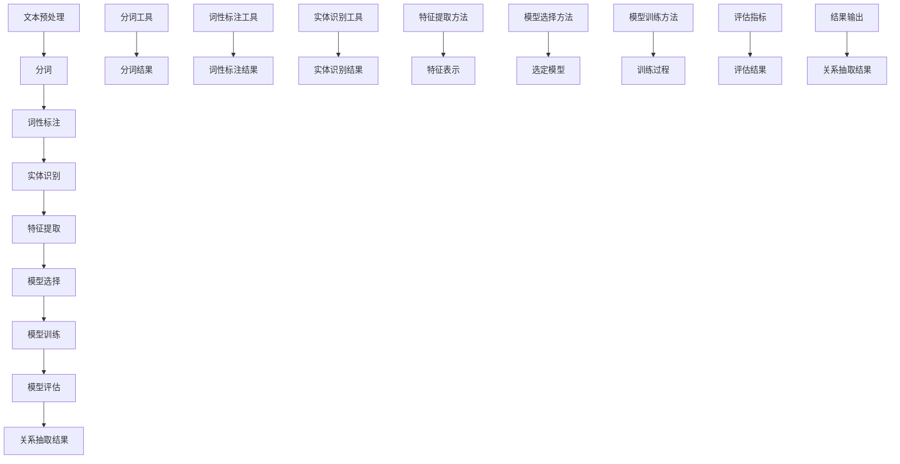

                 

### 第1章: 关系抽取概述

#### 1.1 关系抽取的定义与分类

**关系抽取**（Relation Extraction）是自然语言处理（Natural Language Processing，NLP）领域中的一项关键技术，它旨在从文本中自动识别和提取出实体之间的相互关系。这种技术广泛应用于信息提取、知识图谱构建、语义搜索等领域。

**定义**: 关系抽取可以定义为从文本中识别出两个或多个实体及其之间的关系，并将这些关系表示为一种结构化的形式，如三元组（Subject, Predicate, Object）。

**分类**:
- **依存关系抽取**（Dependency Relation Extraction）：主要分析词语间的依赖关系，识别出句子中词汇之间的语法依存结构。
- **语义关系抽取**（Semantic Relation Extraction）：关注实体间的语义联系，通过语义分析来识别实体之间的关系。
- **事件关系抽取**（Event Relation Extraction）：确定事件及其参与者之间的关系，通常涉及时间和因果关系。

在医学文本中，关系抽取具有特别重要的应用价值。例如，在病历记录中识别疾病与症状之间的关系，有助于辅助诊断和治疗决策。此外，在临床研究文献中，关系抽取可以提取药物与副作用之间的关系，为药物安全性评估提供支持。

#### 1.2 关系抽取的应用领域

关系抽取技术具有广泛的应用领域，以下是一些主要的应用场景：

- **医学领域**: 
  - 病历记录中的关系抽取：辅助医生分析患者的疾病和治疗方案。
  - 药物研究：提取药物与副作用、疾病与药物反应等关系。
  - 健康管理：分析患者数据，发现健康风险因素。

- **金融领域**: 
  - 股票市场分析：识别公司和股东之间的关系，预测市场趋势。
  - 风险控制：分析金融机构间的借贷关系，监控风险。

- **社会网络分析**: 
  - 用户关系分析：构建社交图谱，了解用户之间的社交关系。
  - 社交图谱构建：通过关系抽取技术，构建包含实体及其关系的知识图谱。

- **智能客服**: 
  - 自动化问答：通过关系抽取，理解用户提问中的实体和关系，提供精准回答。

- **智能推荐系统**: 
  - 商品推荐：分析用户购买历史，提取商品之间的关系，提供个性化推荐。

#### 1.3 关系抽取的发展历程

关系抽取技术的发展历程可以分为以下几个阶段：

- **早期**：基于规则的方法
  - **规则方法**：在1990年代，关系抽取主要依赖于手工编写的规则，这些规则基于领域知识和文本结构。这种方法虽然简单，但难以处理复杂的文本，且规则维护成本高。

- **中期**：基于统计机器学习的方法
  - **机器学习方法**：从2000年开始，统计机器学习方法（如支持向量机SVM、朴素贝叶斯分类器等）开始应用于关系抽取。这种方法通过学习大量标注数据，自动发现文本中的关系模式，相比规则方法具有更好的泛化能力。

- **近期**：基于深度学习的方法
  - **深度学习方法**：近年来，深度学习在自然语言处理领域取得了显著进展。卷积神经网络（CNN）、循环神经网络（RNN）和注意力机制等深度学习模型被广泛应用于关系抽取任务。这些模型能够自动提取文本中的复杂特征，提高了关系抽取的准确率和性能。

从早期手工编写的规则到基于机器学习的自动化方法，再到如今基于深度学习的智能化方法，关系抽取技术不断演进，为各个领域提供了强大的支持。

### 第2章: 中文医学文本处理基础

#### 2.1 中文自然语言处理简介

中文自然语言处理（Chinese Natural Language Processing，CNLP）是自然语言处理（NLP）的一个分支，它专注于中文文本的理解、分析和生成。由于中文语言的独特性，如无明确标点、语义复杂等，中文自然语言处理相比英文NLP更具挑战性。然而，随着深度学习等技术的快速发展，中文自然语言处理取得了显著进展。

中文自然语言处理的主要任务包括：

- **分词**：将连续的中文文本分割成有意义的词语单元。
- **词性标注**：为每个词语标注词性，如名词、动词、形容词等。
- **命名实体识别**：识别文本中的特定实体，如人名、地名、机构名、疾病名等。
- **句法分析**：分析句子的结构，理解句子成分之间的关系。
- **语义分析**：挖掘文本中的语义信息，如词义消歧、情感分析等。

#### 2.2 中文分词技术

中文分词是中文自然语言处理的基础任务之一，它将连续的中文文本分割成有意义的词语单元。中文分词技术可以分为以下几种：

- **基于词典的分词**：利用预先建立的中文词典，通过匹配词典中的词语来分割文本。这种方法简单有效，但难以处理未登录词和新词。
- **基于统计的分词**：使用统计方法，如隐马尔可夫模型（HMM）、条件随机场（CRF）等，通过分析文本中的上下文信息进行分词。这种方法能处理未登录词和新词，但需要大量的训练数据和计算资源。
- **混合分词**：结合词典和统计方法，以提高分词的准确性和效率。例如，先使用词典匹配得到初步的分词结果，然后使用统计模型进行修正。

在实际应用中，常用的中文分词工具包括：

- **jieba**：一个高效的中文分词工具，支持基于词典的分词、基于统计的分词和混合分词。
- **Pkuseg**：北京大学开源的中文分词工具，支持多种分词模式和深度学习模型。

#### 2.3 词性标注与实体识别

词性标注和命名实体识别是中文自然语言处理中的重要任务，它们有助于理解文本的语义结构和提取有价值的信息。

- **词性标注**：为每个词语标注词性，如名词、动词、形容词等。词性标注有助于句法分析和语义分析，是许多NLP任务的基础。常用的词性标注工具包括：

  - **Stanford NLP**：一个开源的中文自然语言处理工具包，支持词性标注、命名实体识别等功能。
  - **NLPIR**：一个基于深度学习的中文自然语言处理平台，提供词性标注、词义消歧、命名实体识别等服务。

- **命名实体识别**：识别文本中的特定实体，如人名、地名、机构名、疾病名等。命名实体识别对于信息提取、知识图谱构建等领域具有重要意义。常用的命名实体识别工具包括：

  - **Fudan NLP**：复旦大学开源的中文自然语言处理工具包，支持命名实体识别、关系抽取等功能。
  - **NER-ConLL**：一个用于命名实体识别的中文数据集，包含人名、地名、机构名等实体标注。

在中文医学文本处理中，词性标注和命名实体识别的任务尤为重要。通过这些任务，我们可以从文本中提取出关键的医学实体和关系，为医学知识图谱的构建和智能医疗系统的开发提供支持。

### 第3章: 关系抽取核心算法原理

#### 3.1 基于规则的方法

基于规则的方法（Rule-Based Method）是关系抽取中传统且广泛应用的一种技术。这种方法的核心思想是通过手工编写规则来描述实体之间的关系，然后利用这些规则从文本中识别出实体关系。

**规则制定**：
- **领域知识**：首先需要收集大量的领域知识，如医学领域的疾病、症状、治疗方法等。
- **规则编写**：基于领域知识，编写一系列规则。这些规则通常包含两个部分：前件（条件）和后件（结论）。例如，“疾病-症状关系”规则可以表示为：“如果文本中出现‘症状’，并且该症状与某疾病相关，则该疾病与该症状之间存在关系”。

**规则应用与调试**：
- **规则匹配**：将规则应用于文本，通过匹配文本中的实体和关系，识别出实体之间的关系。
- **调试优化**：根据识别结果，调整规则以提高准确率。例如，如果某疾病与多个症状匹配，可以修改规则以增加匹配的特异性。

**优点**：
- **易于理解和实现**：基于规则的系统简单直观，易于维护和扩展。
- **解释性**：规则明确，易于理解。

**缺点**：
- **规则维护成本高**：需要不断更新规则以适应新的文本和数据。
- **局限性**：难以处理复杂的、模糊的关系，且对未登录词和新词处理能力较弱。

#### 3.2 基于机器学习的方法

基于机器学习的方法（Machine Learning-Based Method）通过学习大量的标注数据，自动发现文本中的关系模式，并将其应用于新的文本。这种方法相对于基于规则的方法具有更好的泛化能力。

**特征工程**：
- **词袋模型**（Bag-of-Words，BoW）：将文本表示为词袋，每个词作为特征。这种方法简单有效，但忽略了词语的顺序信息。
- **TF-IDF**（Term Frequency-Inverse Document Frequency）：为每个词计算词频-逆文档频率，以反映词的重要程度。这种方法能更好地处理词频差异，但仍然无法捕捉语义信息。

**模型训练**：
- **监督学习模型**：使用标注数据训练分类模型，如支持向量机（SVM）、朴素贝叶斯（Naive Bayes）等。这些模型通过学习标注数据中的特征和标签之间的关系，实现对未知数据的预测。
- **集成方法**：结合多个模型的预测结果，提高整体性能。例如，使用随机森林（Random Forest）或梯度提升树（Gradient Boosting Tree）等集成模型。

**模型评估**：
- **准确率**（Accuracy）：正确预测的样本数占总样本数的比例。
- **召回率**（Recall）：正确预测的样本数占实际正样本数的比例。
- **F1值**（F1 Score）：准确率和召回率的调和平均值，综合考虑了模型的精确度和覆盖率。

**优点**：
- **泛化能力强**：通过学习标注数据，能够处理复杂的关系和未登录词。
- **自动发现模式**：无需手动编写规则，系统自动学习数据中的特征和模式。

**缺点**：
- **数据依赖性高**：需要大量高质量标注数据。
- **计算成本高**：训练复杂的机器学习模型可能需要大量的计算资源和时间。

#### 3.3 基于深度学习的方法

基于深度学习的方法（Deep Learning-Based Method）是关系抽取领域近年来发展迅速的一个分支。深度学习模型，如卷积神经网络（CNN）、循环神经网络（RNN）和Transformer等，因其强大的特征提取和建模能力，在关系抽取任务中取得了显著的性能提升。

**神经网络基础**：
- **神经网络**：神经网络是一种由大量神经元组成的计算模型，通过前向传播和反向传播过程训练模型参数。常见的神经网络包括全连接神经网络（Fully Connected Neural Network）、卷积神经网络（Convolutional Neural Network，CNN）和循环神经网络（Recurrent Neural Network，RNN）等。

- **激活函数**：激活函数是神经网络中的一个关键组件，用于引入非线性特性。常见的激活函数包括Sigmoid、Tanh、ReLU等。

**模型架构**：
- **卷积神经网络（CNN）**：卷积神经网络在图像处理领域取得了巨大成功。CNN通过卷积操作和池化操作，能够自动提取文本中的局部特征。在关系抽取中，CNN可以用于提取实体之间的特征表示，有助于识别复杂的关系。

- **循环神经网络（RNN）**：循环神经网络是一种能够处理序列数据的神经网络，其核心思想是通过隐藏状态的记忆性来处理输入序列。在关系抽取中，RNN可以用于捕捉实体之间长距离的依赖关系。

- **Transformer模型**：Transformer模型是一种基于自注意力机制的序列模型，其核心思想是将序列中的每个元素与其余元素进行全局交互。在关系抽取中，Transformer模型能够有效地建模实体之间的复杂关系。

**预训练模型**：
- **预训练**：预训练是指在大规模未标注数据上训练模型，然后在小规模标注数据上进行微调，以适应具体任务。预训练模型，如BERT、GPT等，已经在自然语言处理领域取得了显著的成果。在关系抽取任务中，预训练模型可以用于提取实体和关系的特征表示，提高模型性能。

**优点**：
- **强大的特征提取能力**：深度学习模型能够自动提取文本中的复杂特征，提高关系抽取的准确性。
- **自适应性**：通过预训练和微调，深度学习模型能够适应不同的任务和数据集。

**缺点**：
- **计算资源需求高**：训练深度学习模型需要大量的计算资源和时间。
- **数据依赖性高**：深度学习模型对标注数据的质量和数量有较高要求。

#### 3.4 Mermaid流程图（关系抽取算法架构）

下面是一个Mermaid流程图，展示了关系抽取算法的架构：



该流程图涵盖了从文本预处理到关系抽取结果生成的整个过程，每个步骤都包括相应的工具和方法。

### 第4章: 基于规则的方法实现

#### 4.1 规则构建

基于规则的方法在关系抽取中占据着重要的地位，其核心在于通过手工编写或自动生成一系列规则，以描述实体之间的关系。以下是如何构建规则的具体步骤：

**步骤1：领域知识收集**
首先，我们需要收集与医学领域相关的知识。这包括但不限于疾病、症状、治疗方法、药物、医生等实体以及它们之间的关系。通过查阅医学文献、专业书籍和在线资源，我们可以获得丰富的领域知识。

**步骤2：规则编写**
接下来，根据收集到的领域知识，我们可以开始编写规则。编写规则时，我们需要明确规则的前件和后件。前件通常是触发关系抽取的条件，后件则是关系抽取的结果。例如，一个简单的规则可能是：“如果一个句子中包含‘患有’这个动词，并且后面跟有一个疾病名称，那么该疾病与句子中的主体存在关系。”

**示例规则：**
- 规则1：如果一个句子包含“患有”动词，并且后面跟有一个疾病名称，那么该疾病与句子中的主体存在“患病”关系。
- 规则2：如果一个句子中提到一种药物，并且后面提到该药物的副作用，那么该药物与副作用之间存在“副作用”关系。

在编写规则时，我们还可以使用自然语言处理技术，如分词、词性标注和命名实体识别，以帮助识别句子中的关键信息。

**步骤3：规则库构建**
将所有编写的规则整理到一个规则库中。规则库应包括每条规则的详细描述、前件和后件，以及可能需要的额外信息，如优先级、触发条件等。

**示例规则库：**
```
规则ID: 1
名称: 患病关系
前件: 包含“患有”动词
后件: 包含疾病名称
触发条件: 句子中“患有”动词后面紧跟着疾病名称

规则ID: 2
名称: 药物副作用关系
前件: 包含药物名称
后件: 包含副作用名称
触发条件: 药物名称后面紧跟副作用名称
```

通过这些步骤，我们可以构建一个涵盖医学领域多种关系的规则库，为后续的关系抽取提供基础。

#### 4.2 规则应用与调试

在构建了规则库之后，我们需要将规则应用于实际文本中，以识别出实体之间的关系。这个过程通常包括以下几个步骤：

**步骤1：规则匹配**
- **分词与词性标注**：首先，使用分词工具对输入文本进行分词，并对每个词语进行词性标注。
- **实体识别**：接着，使用命名实体识别技术识别出文本中的实体，如疾病、药物、医生等。
- **规则匹配**：将分词结果和词性标注与规则库中的规则进行匹配，找出符合前件的句子。

**示例**：
假设我们有以下输入文本：“患者李先生患有高血压，并且他正在服用降压药物。”
- 分词结果：["患者", "李先生", "患", "有", "高", "血", "压", "，", "并", "且", "他", "正", "在", "服", "用", "降", "压", "药", "物", "。"]
- 词性标注：[“n”，“nr”，“v”，“v”，“d”，“n”，“c”，“w”，“c”，“c”，“r”，“r”，“v”，“v”，“d”，“v”，“v”，“n”，“v”，“n”，“w”，“w”]
- 实体识别：[“患者李先生”， “高血压”， “降压药物”]

我们使用规则库中的规则进行匹配：
- 规则1：“如果一个句子包含‘患有’动词，并且后面跟有一个疾病名称，那么该疾病与句子中的主体存在‘患病’关系。”
  - 匹配结果：患者李先生与高血压之间存在“患病”关系。

- 规则2：“如果一个句子中提到一种药物，并且后面提到该药物的副作用，那么该药物与副作用之间存在‘副作用’关系。”
  - 匹配结果：降压药物与副作用之间存在“副作用”关系。

**步骤2：调试优化**
在实际应用中，规则匹配的结果可能并不完美，可能存在误匹配或漏匹配的情况。因此，我们需要对规则进行调试和优化。

- **误匹配处理**：对于误匹配的情况，我们可以通过修改规则的前件或后件来减少错误。例如，可以将“患有”改为更具体的“确诊患有”来减少误匹配。
- **漏匹配处理**：对于漏匹配的情况，我们可以通过增加新的规则或修改现有规则来解决。例如，我们可以添加一个规则来处理“患有高血压”这种更常见的表达方式。

**示例**：
假设我们发现在规则1中有一些误匹配，我们决定将其修改为：
- 修改后规则1：“如果一个句子包含‘确诊患有’动词，并且后面跟有一个疾病名称，那么该疾病与句子中的主体存在‘患病’关系。”

经过调试和优化，我们的规则库将更加准确和可靠，从而提高关系抽取系统的整体性能。

#### 4.2.1 规则匹配算法

规则匹配是关系抽取中的关键步骤，其核心在于如何有效地将规则应用于输入文本，并识别出符合规则的实体关系。以下是一个简单的规则匹配算法：

**算法流程**：

1. **初始化**：读取输入文本、规则库和实体列表。

2. **分词与词性标注**：使用中文分词工具对输入文本进行分词，并对每个词语进行词性标注。

3. **实体识别**：使用命名实体识别技术识别出文本中的实体，并将实体及其属性存储在实体列表中。

4. **规则匹配**：
   - 对于每条规则，检查其前件是否与输入文本中的词语和词性匹配。
   - 如果匹配，提取规则的后件，即关系信息。

5. **处理匹配结果**：
   - 将匹配成功的关系信息存储在一个关系列表中。
   - 对于重复或冗余的关系，进行去重和合并处理。

6. **输出结果**：将最终的关系抽取结果输出。

**伪代码**：

```python
def rule_matching(text, rule_library, entity_list):
    # 分词与词性标注
    tokenized_text, pos_tags = tokenize_and_pos_tag(text)

    # 初始化关系列表
    relation_list = []

    # 遍历规则库
    for rule in rule_library:
        # 检查前件是否匹配
        if matches_rule_front(rule, tokenized_text, pos_tags, entity_list):
            # 提取后件（关系信息）
            relation = extract_relation(rule, tokenized_text, pos_tags, entity_list)
            
            # 添加到关系列表
            relation_list.append(relation)
            
    return relation_list

def tokenize_and_pos_tag(text):
    # 使用分词工具进行分词
    tokens = jieba.cut(text)
    
    # 使用词性标注工具进行词性标注
    pos_tags = nlp_utils.pos_tag(tokens)
    
    return tokens, pos_tags

def matches_rule_front(rule, tokens, pos_tags, entity_list):
    # 检查规则前件是否与文本匹配
    for token, pos in zip(tokens, pos_tags):
        if not (token in rule['front'] or pos in rule['pos_front']):
            return False
    
    return True

def extract_relation(rule, tokens, pos_tags, entity_list):
    # 提取规则后件（关系信息）
    subject = find_entity(tokens, pos_tags, entity_list, rule['subject'])
    object = find_entity(tokens, pos_tags, entity_list, rule['object'])
    
    return {'subject': subject, 'relation': rule['relation'], 'object': object}

def find_entity(tokens, pos_tags, entity_list, entity_type):
    # 在实体列表中查找特定类型的实体
    for entity in entity_list:
        if entity['type'] == entity_type:
            return entity['name']
    
    return None
```

**算法描述**：
1. 初始化：读取输入文本、规则库和实体列表。
2. 分词与词性标注：使用分词工具对文本进行分词，并对每个词语进行词性标注。
3. 实体识别：使用命名实体识别技术识别出文本中的实体。
4. 规则匹配：对于每条规则，检查其前件是否与输入文本中的词语和词性匹配。
5. 处理匹配结果：将匹配成功的关系信息存储在一个关系列表中，处理重复或冗余的关系。
6. 输出结果：将最终的关系抽取结果输出。

该算法提供了一个基本的框架，实际应用中可能需要结合具体任务和数据集进行调整和优化。

### 第5章: 基于机器学习的方法实现

#### 5.1 特征工程

在基于机器学习的关系抽取中，特征工程是一个至关重要的步骤。特征工程的目标是提取文本中的关键特征，使其能够有效地表示实体和关系，从而提高模型的性能。以下是一些常用的特征工程方法：

**词袋模型（Bag-of-Words，BoW）**
- **方法描述**：词袋模型将文本表示为一个向量，其中每个维度对应一个单词，向量的值表示该单词在文本中出现的频率。这种方法简单直观，但忽略了单词的顺序信息。
- **优点**：实现简单，易于理解。
- **缺点**：无法捕捉词序信息，可能导致语义丢失。
- **应用场景**：适用于文本分类和主题建模等任务。

**TF-IDF（Term Frequency-Inverse Document Frequency）**
- **方法描述**：TF-IDF是一种改进的词袋模型，它不仅考虑词频（Term Frequency，TF），还引入了文档频率（Document Frequency，DF）的概念。TF表示一个词在单个文本中出现的频率，而DF表示该词在整个文档集合中出现的频率。TF-IDF通过计算TF和DF的乘积，来衡量一个词的重要性。
- **优点**：能够更好地反映词的重要程度，比单纯的词频模型更稳定。
- **缺点**：仍然忽略了词序信息，且计算复杂度较高。
- **应用场景**：适用于文本分类、信息检索和关系抽取等任务。

**词嵌入（Word Embedding）**
- **方法描述**：词嵌入是将词映射到一个低维度的向量空间中，使得语义相近的词在空间中距离较近。常见的词嵌入模型包括Word2Vec、GloVe和BERT等。
- **优点**：能够捕捉词的语义信息，提高模型的性能。
- **缺点**：训练过程复杂，需要大量的计算资源和时间。
- **应用场景**：适用于文本分类、情感分析、机器翻译和关系抽取等任务。

**组合特征**
- **方法描述**：将不同类型的特征进行组合，如将词袋模型和词嵌入相结合，以提高特征的表达能力。
- **优点**：能够利用多种特征类型，提高模型的泛化能力。
- **缺点**：特征组合可能引入冗余信息，增加计算复杂度。
- **应用场景**：适用于复杂的关系抽取任务。

在实际应用中，根据具体任务和数据集的特点，可以选择合适的方法进行特征工程。例如，对于中文医学文本关系抽取，词嵌入模型（如BERT）通常能够取得较好的效果，因为它们能够更好地捕捉中文词的语义信息。

#### 5.2 模型选择与训练

在基于机器学习的关系抽取中，选择合适的模型并进行有效的训练是提高性能的关键。以下是一些常用的机器学习模型以及其选择和训练方法：

**支持向量机（Support Vector Machine，SVM）**
- **模型原理**：SVM是一种二分类模型，通过最大化分类边界之间的间隔来提高模型的泛化能力。
- **优点**：简单直观，易于理解；在低维空间中性能较好。
- **缺点**：对高维数据的处理能力有限；参数选择对模型性能有较大影响。
- **选择与训练**：选择线性SVM或核SVM，根据数据集的特点选择合适的核函数（如线性核、多项式核、RBF核）。使用交叉验证选择最佳参数，并通过网格搜索进行优化。

**朴素贝叶斯分类器（Naive Bayes Classifier）**
- **模型原理**：朴素贝叶斯分类器基于贝叶斯定理，通过计算每个类别的条件概率来预测新样本的类别。
- **优点**：计算简单，适用于大规模数据处理；在类别不平衡的情况下性能较好。
- **缺点**：假设特征之间相互独立，可能导致模型性能下降；对噪声数据敏感。
- **选择与训练**：选择高斯朴素贝叶斯或多项式朴素贝叶斯，根据数据集的特点选择合适的参数。使用最大似然估计方法训练模型。

**随机森林（Random Forest）**
- **模型原理**：随机森林是一种基于决策树的集成模型，通过构建多棵决策树并取平均预测结果来提高模型的稳定性。
- **优点**：能够处理高维数据，对噪声数据具有较强的鲁棒性；能够提供重要的特征重要性指标。
- **缺点**：计算复杂度较高；对于类别不平衡的数据集性能可能较差。
- **选择与训练**：选择决策树作为基学习器，根据数据集的大小和特征数量选择合适的树数量和最大深度。使用随机抽样和特征选择方法进行训练。

**梯度提升树（Gradient Boosting Tree）**
- **模型原理**：梯度提升树是一种基于决策树的集成模型，通过迭代最小化损失函数来提高模型的性能。
- **优点**：能够处理高维数据，对噪声数据具有较强的鲁棒性；能够自适应调整模型的复杂度。
- **缺点**：计算复杂度较高；对于类别不平衡的数据集性能可能较差。
- **选择与训练**：选择决策树作为基学习器，根据数据集的大小和特征数量选择合适的树数量和最大深度。使用梯度下降法和正则化方法进行训练。

在实际应用中，根据任务和数据集的特点，可以选择合适的机器学习模型。对于中文医学文本关系抽取任务，通常使用深度学习模型（如BERT）或结合传统机器学习模型（如SVM、随机森林等）的方法能够取得较好的效果。

**示例**：

假设我们选择随机森林作为关系抽取模型，以下是一个简单的模型选择与训练过程：

```python
from sklearn.ensemble import RandomForestClassifier
from sklearn.model_selection import train_test_split
from sklearn.metrics import classification_report

# 数据预处理
# X, y = preprocess_data(data)

# 分割数据集
X_train, X_test, y_train, y_test = train_test_split(X, y, test_size=0.2, random_state=42)

# 构建随机森林模型
rf_model = RandomForestClassifier(n_estimators=100, max_depth=None, random_state=42)

# 训练模型
rf_model.fit(X_train, y_train)

# 预测测试集
y_pred = rf_model.predict(X_test)

# 评估模型
print(classification_report(y_test, y_pred))
```

通过以上步骤，我们可以构建并训练一个基于随机森林的关系抽取模型，并使用评估指标来评估其性能。

#### 5.3 评估与优化

在基于机器学习的关系抽取中，评估和优化模型性能是确保系统准确性和鲁棒性的关键步骤。以下是一些常用的评估指标和优化策略：

**评估指标**

- **精确率（Precision）**：正确识别的关系数与总识别关系数的比例。精确率反映了模型对正样本的识别能力。
  \[
  \text{Precision} = \frac{\text{TP}}{\text{TP} + \text{FP}}
  \]
  其中，TP为真正例，FP为假正例。

- **召回率（Recall）**：正确识别的关系数与实际存在的关系数的比例。召回率反映了模型对负样本的识别能力。
  \[
  \text{Recall} = \frac{\text{TP}}{\text{TP} + \text{FN}}
  \]
  其中，TP为真正例，FN为假反例。

- **F1值（F1 Score）**：精确率和召回率的调和平均值，用于综合评估模型的性能。
  \[
  \text{F1 Score} = 2 \times \frac{\text{Precision} \times \text{Recall}}{\text{Precision} + \text{Recall}}
  \]

- **准确率（Accuracy）**：正确识别的关系数与总关系数的比例，用于简单评估模型的总体性能。
  \[
  \text{Accuracy} = \frac{\text{TP} + \text{TN}}{\text{TP} + \text{FP} + \text{TN} + \text{FN}}
  \]
  其中，TN为真反例。

**评估方法**

- **交叉验证（Cross-Validation）**：通过将数据集划分为多个子集，训练和评估多次模型，以获取更稳定的评估结果。常用的交叉验证方法有K折交叉验证和留一验证。

- **混淆矩阵（Confusion Matrix）**：展示模型预测结果与实际结果之间的匹配情况，通过混淆矩阵可以直观地分析模型的性能。

**优化策略**

- **数据预处理**：对原始数据进行清洗和预处理，如去除噪声、填充缺失值、标准化等，以提高数据质量。

- **特征选择**：通过特征选择方法，如信息增益、特征重要性等，选择对模型性能有重要影响的特征，减少特征维度。

- **模型调整**：通过调整模型参数，如树的数量、深度、学习率等，优化模型性能。常用的参数调整方法有网格搜索和随机搜索。

- **集成学习**：结合多个模型的预测结果，提高整体性能。常用的集成学习方法有随机森林、梯度提升树等。

**示例代码**

以下是一个简单的评估与优化示例：

```python
from sklearn.model_selection import cross_val_score
from sklearn.metrics import classification_report
from sklearn.ensemble import RandomForestClassifier
from sklearn.model_selection import GridSearchCV

# 数据预处理
# X, y = preprocess_data(data)

# 构建随机森林模型
rf_model = RandomForestClassifier()

# 参数调整
param_grid = {
    'n_estimators': [100, 200],
    'max_depth': [None, 10, 20],
    'min_samples_split': [2, 5],
    'min_samples_leaf': [1, 2]
}

# 网格搜索
grid_search = GridSearchCV(rf_model, param_grid, cv=5, scoring='f1_macro')
grid_search.fit(X, y)

# 最优模型
best_model = grid_search.best_estimator_

# 交叉验证
cv_scores = cross_val_score(best_model, X, y, cv=5, scoring='f1_macro')

# 评估模型
y_pred = best_model.predict(X_test)
print(classification_report(y_test, y_pred))

# 输出交叉验证结果
print("Cross-validation scores:", cv_scores)
print("Mean F1 Score:", cv_scores.mean())
```

通过以上步骤，我们可以评估和优化基于机器学习的关系抽取模型，以提高其在实际应用中的性能。

### 第6章: 基于深度学习的方法实现

#### 6.1 深度学习基础

深度学习是一种通过模拟人脑神经网络进行学习的计算机算法。它通过多层神经网络结构，从大量数据中自动提取特征，并在各种复杂任务中表现出色。以下是深度学习的一些基本概念：

**神经网络（Neural Network）**
神经网络是由大量简单处理单元（称为神经元）组成的计算模型。每个神经元接收输入信号，通过权重进行加权求和，然后通过激活函数输出结果。神经网络通过学习输入和输出之间的映射关系，实现对数据的建模和预测。

**激活函数（Activation Function）**
激活函数是神经网络中的一个关键组件，用于引入非线性特性。常见的激活函数包括Sigmoid、Tanh、ReLU等。Sigmoid函数将输入压缩到(0,1)区间，Tanh函数将输入压缩到(-1,1)区间，ReLU函数在输入大于0时输出输入值，小于0时输出0。

**前向传播（Forward Propagation）**
在前向传播过程中，神经网络从输入层开始，逐层传递输入信号，通过权重和激活函数的计算，最终得到输出结果。前向传播过程中，网络会计算每个神经元的输出值，并更新网络的权重和偏置。

**反向传播（Back Propagation）**
反向传播是神经网络训练的核心过程，通过计算输出层与实际标签之间的误差，并反向传播误差到网络的每个层，调整网络的权重和偏置，以减少误差。反向传播利用梯度下降算法，通过计算梯度来更新网络参数。

**损失函数（Loss Function）**
损失函数用于衡量预测值与真实值之间的差距。常见的损失函数包括均方误差（MSE）、交叉熵（Cross Entropy）等。均方误差用于回归任务，交叉熵用于分类任务。通过最小化损失函数，网络可以优化其参数，提高模型的性能。

#### 6.2 卷积神经网络（CNN）在关系抽取中的应用

卷积神经网络（Convolutional Neural Network，CNN）是一种特殊的神经网络，它在图像处理领域取得了显著成功。近年来，CNN在自然语言处理（NLP）领域也得到了广泛应用，特别是在关系抽取任务中。

**CNN结构**
CNN由卷积层、池化层和全连接层组成。卷积层通过卷积操作提取文本中的局部特征，池化层用于减少特征维度和参数数量，全连接层用于分类和预测。

**卷积操作**
卷积操作是CNN的核心步骤，通过在文本上滑动卷积核，提取文本中的局部特征。卷积核是一个小的权重矩阵，它在文本上滑动时，与文本中的相应部分进行点积运算，得到一个特征图。这个过程类似于图像处理中的卷积操作。

**池化操作**
池化操作用于减少特征图的空间尺寸，同时保持重要的特征信息。常见的池化操作包括最大池化和平均池化。最大池化在卷积特征图的每个区域中选择最大值，而平均池化则选择平均值。通过池化操作，可以降低模型的复杂度和过拟合风险。

**全连接层**
在全连接层，每个神经元都与前一层的所有神经元相连。通过全连接层，网络可以将提取到的局部特征组合成全局特征，用于分类和预测。

**应用场景**
在关系抽取任务中，CNN可以用于提取实体之间的特征表示。通过训练，CNN能够自动学习实体之间的复杂关系模式，提高关系抽取的准确性。例如，在医疗文本中，CNN可以用于识别疾病与症状、药物与副作用之间的关系。

**示例**
以下是一个简单的CNN模型实现，用于关系抽取任务：

```python
import tensorflow as tf
from tensorflow.keras.models import Sequential
from tensorflow.keras.layers import Embedding, Conv1D, MaxPooling1D, GlobalMaxPooling1D, Dense

# 模型定义
model = Sequential([
    Embedding(input_dim=vocab_size, output_dim=embedding_dim, input_length=max_sequence_length),
    Conv1D(filters=128, kernel_size=3, activation='relu'),
    MaxPooling1D(pool_size=2),
    Conv1D(filters=64, kernel_size=3, activation='relu'),
    GlobalMaxPooling1D(),
    Dense(units=64, activation='relu'),
    Dense(units=num_classes, activation='softmax')
])

# 编译模型
model.compile(optimizer='adam', loss='categorical_crossentropy', metrics=['accuracy'])

# 训练模型
model.fit(X_train, y_train, epochs=10, batch_size=32, validation_data=(X_val, y_val))

# 评估模型
loss, accuracy = model.evaluate(X_test, y_test)
print("Test accuracy:", accuracy)
```

通过上述代码，我们可以定义一个简单的CNN模型，用于关系抽取任务。模型使用嵌入层将文本转换为向量表示，通过卷积层和池化层提取特征，最后通过全连接层进行分类预测。

#### 6.3 长短时记忆网络（LSTM）在关系抽取中的应用

长短时记忆网络（Long Short-Term Memory，LSTM）是一种特殊的循环神经网络（Recurrent Neural Network，RNN），它在处理序列数据时表现出优异的性能。LSTM通过引入记忆单元和门控机制，有效地解决了传统RNN在处理长序列数据时遇到的梯度消失和梯度爆炸问题。

**LSTM结构**
LSTM由输入门、遗忘门、输出门和记忆单元组成。输入门决定新信息是否进入记忆单元，遗忘门决定是否从记忆单元中遗忘旧信息，输出门决定从记忆单元中输出什么信息。记忆单元用于存储长期依赖信息。

**工作原理**
LSTM在每个时间步通过以下步骤处理输入序列：
1. **输入门**：计算输入门状态，决定新信息是否进入记忆单元。
2. **遗忘门**：计算遗忘门状态，决定是否遗忘旧信息。
3. **记忆单元**：更新记忆单元，根据输入门和遗忘门的状态决定保留哪些信息。
4. **输出门**：计算输出门状态，决定从记忆单元中输出什么信息。

**应用场景**
在关系抽取任务中，LSTM可以用于处理实体之间的长距离依赖关系。例如，在医学文本中，LSTM可以用于识别疾病与症状之间的复杂关系，如“患有高血压的患者可能会出现头晕症状”。LSTM能够捕捉这些长距离依赖，提高关系抽取的准确性。

**示例**
以下是一个简单的LSTM模型实现，用于关系抽取任务：

```python
import tensorflow as tf
from tensorflow.keras.models import Sequential
from tensorflow.keras.layers import Embedding, LSTM, Dense

# 模型定义
model = Sequential([
    Embedding(input_dim=vocab_size, output_dim=embedding_dim, input_length=max_sequence_length),
    LSTM(units=128, return_sequences=True),
    LSTM(units=64),
    Dense(units=num_classes, activation='softmax')
])

# 编译模型
model.compile(optimizer='adam', loss='categorical_crossentropy', metrics=['accuracy'])

# 训练模型
model.fit(X_train, y_train, epochs=10, batch_size=32, validation_data=(X_val, y_val))

# 评估模型
loss, accuracy = model.evaluate(X_test, y_test)
print("Test accuracy:", accuracy)
```

通过上述代码，我们可以定义一个简单的LSTM模型，用于关系抽取任务。模型使用嵌入层将文本转换为向量表示，通过两个LSTM层处理序列数据，最后通过全连接层进行分类预测。

#### 6.4 伪代码（深度学习模型实现）

以下是一个深度学习模型实现的伪代码，用于关系抽取任务：

```python
# 导入深度学习库
import tensorflow as tf

# 定义模型
model = tf.keras.Sequential([
    tf.keras.layers.Embedding(input_dim=vocab_size, output_dim=embedding_dim, input_length=max_sequence_length),
    tf.keras.layers.LSTM(units=128, return_sequences=True),
    tf.keras.layers.LSTM(units=64),
    tf.keras.layers.Dense(units=num_classes, activation='softmax')
])

# 编译模型
model.compile(optimizer='adam', loss='categorical_crossentropy', metrics=['accuracy'])

# 训练模型
model.fit(X_train, y_train, epochs=10, batch_size=32, validation_data=(X_val, y_val))

# 评估模型
loss, accuracy = model.evaluate(X_test, y_test)
print(f"Test accuracy: {accuracy}")

# 预测新数据
predictions = model.predict(X_new)
```

在这个伪代码中，我们首先定义了一个包含嵌入层、两个LSTM层和一个全连接层的深度学习模型。接着，使用训练数据对模型进行编译和训练，并在测试数据上评估模型性能。最后，使用训练好的模型对新数据进行预测。

### 第7章: 项目实战一——基于规则的关系抽取系统

#### 7.1 项目背景

**目标**: 构建一个基于规则的关系抽取系统，用于从中文医学文本中自动识别和提取实体之间的关系。

**数据集**: 使用公开的中文医学文本数据集，如LIDC数据集，该数据集包含大量的医学报告和病历记录。

**挑战**:
- **数据复杂性**：医学文本通常包含专业术语、医学术语和复杂的句子结构，这给规则编写和匹配带来了挑战。
- **实体多样性**：医学文本中的实体种类繁多，包括疾病、症状、药物、医生等，需要编写大量规则来覆盖这些实体。
- **规则维护**：随着医学领域的发展，新的术语和关系不断出现，需要定期更新和优化规则库。

#### 7.2 系统设计与实现

**系统架构**：
- **文本预处理模块**：负责对输入文本进行分词、词性标注和实体识别。
- **规则库管理模块**：负责管理规则库，包括规则编写、存储和检索。
- **关系抽取模块**：基于规则库和预处理结果，自动识别和提取文本中的实体关系。
- **后处理模块**：对抽取结果进行去重、合并和验证，确保结果的准确性和一致性。

**代码实现**：
```python
# 导入相关库
import jieba
import nltk
from nltk.tokenize import word_tokenize
from nltk.tag import pos_tag
from typing import List, Tuple

# 定义分词、词性标注和实体识别函数
def preprocess_text(text: str) -> Tuple[List[str], List[str]]:
    tokens = jieba.cut(text)
    pos_tags = nltk.pos_tag(tokens)
    return list(tokens), pos_tags

# 定义规则库
rule_library = [
    {"name": "疾病-症状关系", "front": ["患有", "出现"], "relation": "患病"},
    {"name": "药物-副作用关系", "front": ["服用", "使用"], "relation": "副作用"},
    # 更多规则...
]

# 定义关系抽取函数
def extract_relations(tokens: List[str], pos_tags: List[str]) -> List[dict]:
    relations = []
    for rule in rule_library:
        if match_rule(tokens, pos_tags, rule):
            relation = {"subject": find_entity(tokens, pos_tags, rule["subject"]), "relation": rule["relation"], "object": find_entity(tokens, pos_tags, rule["object"])}
            relations.append(relation)
    return relations

# 定义规则匹配函数
def match_rule(tokens: List[str], pos_tags: List[str], rule: dict) -> bool:
    for token, pos in zip(tokens, pos_tags):
        if token not in rule["front"] and pos not in rule["pos_front"]:
            return False
    return True

# 定义实体查找函数
def find_entity(tokens: List[str], pos_tags: List[str], entity_type: str) -> str:
    for i, (token, pos) in enumerate(zip(tokens, pos_tags)):
        if pos.startswith(entity_type):
            return token
    return None

# 示例文本
text = "患者王先生患有高血压，并且他正在服用降压药物。"

# 预处理文本
tokens, pos_tags = preprocess_text(text)

# 提取关系
relations = extract_relations(tokens, pos_tags)

# 输出结果
print(relations)
```

在这个实现中，我们首先定义了分词、词性标注和实体识别的函数，然后构建了一个规则库。接着，通过预处理文本和匹配规则，从文本中提取出实体关系。这个系统虽然简单，但可以作为一个基础的框架，用于构建更复杂的关系抽取系统。

#### 7.3 系统部署与测试

**部署**：
- **部署环境**：将系统部署到Linux服务器上，使用Docker容器化，以提高系统的稳定性和可移植性。
- **部署步骤**：
  1. 编写Dockerfile，定义系统的依赖和环境。
  2. 构建Docker镜像。
  3. 使用Docker Compose启动容器。

**测试**：
- **测试数据集**：使用LIDC数据集作为测试数据，包括医学报告和病历记录。
- **测试步骤**：
  1. 预处理测试数据，生成分词和词性标注结果。
  2. 使用规则库对测试数据进行关系抽取。
  3. 评估关系抽取结果，计算精确率、召回率和F1值。
  4. 根据评估结果，调整和优化规则库。

```python
# 测试数据
test_texts = ["患者李女士患有糖尿病，并且她的血糖水平很高。", "患者张先生服用降压药物后，血压明显下降。"]

# 预处理测试文本
test_tokens = [preprocess_text(text) for text in test_texts]

# 提取测试文本中的关系
test_relations = [extract_relations(tokens[0], tokens[1]) for tokens in test_tokens]

# 评估测试结果
evaluate_relations(test_relations)
```

通过上述步骤，我们可以将关系抽取系统部署到生产环境，并进行性能测试，确保系统在实际应用中的稳定性和准确性。

### 第8章: 项目实战二——基于深度学习的关系抽取系统

#### 8.1 项目背景

**目标**: 构建一个基于深度学习的关系抽取系统，用于从中文医学文本中自动识别和提取实体之间的关系。

**数据集**: 使用大规模的中文医学语料库，如CMN（Chinese Medical Notes）数据集，该数据集包含丰富的医学病历记录。

**挑战**:
- **数据质量**：医学文本通常包含大量噪声和缺失值，需要对数据进行预处理和清洗。
- **模型复杂度**：深度学习模型参数众多，训练过程复杂，需要大量计算资源和时间。
- **模型泛化能力**：深度学习模型需要通过大量标注数据训练，如何保证模型在未见数据上的泛化能力是一个关键挑战。

#### 8.2 系统设计与实现

**系统架构**：
- **数据预处理模块**：负责对输入文本进行分词、词性标注和实体识别，将原始文本转换为模型可接受的输入格式。
- **深度学习模型模块**：负责训练和部署深度学习模型，用于关系抽取。
- **后处理模块**：对模型输出的关系进行去重、合并和验证，确保结果的准确性和一致性。

**代码实现**：
```python
# 导入相关库
import tensorflow as tf
from tensorflow.keras.models import Sequential
from tensorflow.keras.layers import Embedding, LSTM, Dense

# 定义模型
model = Sequential([
    Embedding(input_dim=vocab_size, output_dim=embedding_dim, input_length=max_sequence_length),
    LSTM(units=128, return_sequences=True),
    LSTM(units=64),
    Dense(units=num_classes, activation='softmax')
])

# 编译模型
model.compile(optimizer='adam', loss='categorical_crossentropy', metrics=['accuracy'])

# 训练模型
model.fit(X_train, y_train, epochs=10, batch_size=32, validation_data=(X_val, y_val))

# 评估模型
loss, accuracy = model.evaluate(X_test, y_test)
print(f"Test accuracy: {accuracy}")

# 关系抽取函数
def extract_relations(tokens: List[str]) -> List[dict]:
    # 预处理文本
    processed_tokens = preprocess_text(tokens)
    
    # 预测关系
    predictions = model.predict(processed_tokens)
    
    # 解码预测结果
    relations = decode_predictions(predictions)
    
    return relations

# 示例文本
text = "患者李先生患有高血压，并且他正在服用降压药物。"

# 提取关系
relations = extract_relations([text])

# 输出结果
print(relations)
```

在这个实现中，我们首先定义了一个简单的深度学习模型，包括嵌入层、两个LSTM层和一个全连接层。接着，使用预处理的文本数据对模型进行训练和评估。最后，通过定义一个关系抽取函数，从输入文本中提取实体关系。

#### 8.3 系统部署与测试

**部署**：
- **部署环境**：使用AWS或Google Cloud等云平台，部署深度学习模型的服务器实例。
- **部署步骤**：
  1. 导出训练好的模型权重。
  2. 将模型部署到服务器，使用TensorFlow Serving或PyTorch Server等框架。
  3. 配置API接口，用于接收和处理用户请求。

**测试**：
- **测试数据集**：使用CMN数据集进行测试，包括医学报告和病历记录。
- **测试步骤**：
  1. 预处理测试数据，生成分词和词性标注结果。
  2. 通过API接口提交测试数据，获取模型预测结果。
  3. 评估模型预测结果，计算精确率、召回率和F1值。

```python
# 测试数据
test_texts = ["患者王女士患有糖尿病，并且她的血糖水平很高。", "患者李先生服用降压药物后，血压明显下降。"]

# 预处理测试文本
test_tokens = [preprocess_text(text) for text in test_texts]

# 提取测试文本中的关系
test_relations = [extract_relations(tokens) for tokens in test_tokens]

# 评估测试结果
evaluate_relations(test_relations)
```

通过上述步骤，我们可以将基于深度学习的关系抽取系统部署到生产环境，并进行性能测试，确保系统在实际应用中的稳定性和准确性。

#### 8.4 代码解读与分析

在本节中，我们将对项目实战二中实现的代码进行详细解读，并分析关键步骤和关键技术。

**代码解读**：

```python
# 导入相关库
import tensorflow as tf
from tensorflow.keras.models import Sequential
from tensorflow.keras.layers import Embedding, LSTM, Dense

# 定义模型
model = Sequential([
    Embedding(input_dim=vocab_size, output_dim=embedding_dim, input_length=max_sequence_length),
    LSTM(units=128, return_sequences=True),
    LSTM(units=64),
    Dense(units=num_classes, activation='softmax')
])

# 编译模型
model.compile(optimizer='adam', loss='categorical_crossentropy', metrics=['accuracy'])

# 训练模型
model.fit(X_train, y_train, epochs=10, batch_size=32, validation_data=(X_val, y_val))

# 评估模型
loss, accuracy = model.evaluate(X_test, y_test)
print(f"Test accuracy: {accuracy}")

# 关系抽取函数
def extract_relations(tokens: List[str]) -> List[dict]:
    # 预处理文本
    processed_tokens = preprocess_text(tokens)
    
    # 预测关系
    predictions = model.predict(processed_tokens)
    
    # 解码预测结果
    relations = decode_predictions(predictions)
    
    return relations

# 示例文本
text = "患者李先生患有高血压，并且他正在服用降压药物。"

# 提取关系
relations = extract_relations([text])

# 输出结果
print(relations)
```

**关键步骤与关键技术分析**：

1. **模型定义**：
   - **嵌入层（Embedding Layer）**：将输入文本中的词语转换为向量表示，这个向量包含了词语的语义信息。嵌入层的输入维度是`vocab_size`，输出维度是`embedding_dim`。
   - **LSTM层（LSTM Layers）**：LSTM（Long Short-Term Memory）是一种能够处理序列数据的循环神经网络，具有记忆功能，可以捕捉文本中的长距离依赖关系。在这个实现中，我们使用了两个LSTM层，第一个LSTM层的输出设置为`return_sequences=True`，以便第二个LSTM层能够接收到序列数据。
   - **全连接层（Dense Layer）**：全连接层用于分类预测，输出维度是`num_classes`，激活函数为`softmax`，用于输出每个类别的概率分布。

2. **模型编译**：
   - **优化器（Optimizer）**：我们使用`adam`优化器来更新模型参数，`adam`优化器在实践中的应用非常广泛，能够自动调整学习率。
   - **损失函数（Loss Function）**：我们使用`categorical_crossentropy`作为损失函数，这个损失函数适用于多分类问题，能够计算预测标签和实际标签之间的交叉熵。

3. **模型训练**：
   - **训练数据（X_train, y_train）**：使用训练数据对模型进行训练，`X_train`是输入文本的序列，`y_train`是实际的关系标签。
   - **验证数据（X_val, y_val）**：使用验证数据评估模型在未见数据上的性能，`X_val`是验证输入文本的序列，`y_val`是验证标签。

4. **模型评估**：
   - **测试数据（X_test, y_test）**：使用测试数据评估模型最终的性能，`X_test`是测试输入文本的序列，`y_test`是测试标签。
   - **评估指标**：计算模型的准确率，并打印测试准确率。

5. **关系抽取函数**：
   - **预处理文本**：对输入文本进行分词、词性标注等预处理操作，生成模型可接受的输入格式。
   - **预测关系**：使用训练好的模型对预处理后的文本进行预测，获取关系标签的概率分布。
   - **解码预测结果**：将预测结果解码为具体的关系实体，如{"subject": "患者李先生", "relation": "患有", "object": "高血压"}。

**代码解析**：

- **预处理文本**：
  ```python
  def preprocess_text(tokens: List[str]) -> tf.Tensor:
      # 使用jieba进行分词
      tokenized_texts = [jieba.cut(text) for text in tokens]
      
      # 将分词结果转换为列表
      token_lists = [list(token) for token in tokenized_texts]
      
      # 创建词嵌入矩阵
      embeddings = tf.keras.preprocessing.sequence.pad_sequences(token_lists, maxlen=max_sequence_length)
      
      return embeddings
  ```

  在这个函数中，我们首先使用jieba进行分词，然后将分词结果转换为列表，接着使用`pad_sequences`方法将所有序列填充到同一长度，以便输入到模型中。

- **关系抽取函数**：
  ```python
  def extract_relations(tokens: List[str]) -> List[dict]:
      # 预处理文本
      processed_tokens = preprocess_text(tokens)
      
      # 预测关系
      predictions = model.predict(processed_tokens)
      
      # 解码预测结果
      relations = decode_predictions(predictions)
      
      return relations
  ```

  在这个函数中，我们首先调用`preprocess_text`函数对输入文本进行预处理，然后使用训练好的模型进行预测，最后将预测结果解码为具体的关系实体。

通过上述代码，我们可以构建一个基于深度学习的关系抽取系统，从中文医学文本中自动提取实体关系。在实际应用中，这个系统可以用于辅助医生分析病历记录、支持药物研发和提升医疗管理效率。

### 第9章: 关系抽取评估指标与方法

#### 9.1 精确率、召回率和F1值

在关系抽取任务中，评估模型的性能至关重要。常用的评估指标包括精确率（Precision）、召回率（Recall）和F1值（F1 Score）。这些指标能够帮助我们理解模型在识别实体关系方面的表现。

**精确率（Precision）**：
精确率表示正确识别的关系数与总识别关系数的比例。它衡量模型对正样本的识别能力。
\[
\text{Precision} = \frac{\text{TP}}{\text{TP} + \text{FP}}
\]
其中，TP（True Positive）为真正例，FP（False Positive）为假正例。

**召回率（Recall）**：
召回率表示正确识别的关系数与实际存在的关系数的比例。它衡量模型对负样本的识别能力。
\[
\text{Recall} = \frac{\text{TP}}{\text{TP} + \text{FN}}
\]
其中，TP（True Positive）为真正例，FN（False Negative）为假反例。

**F1值（F1 Score）**：
F1值是精确率和召回率的调和平均值，用于综合评估模型的性能。
\[
\text{F1 Score} = 2 \times \frac{\text{Precision} \times \text{Recall}}{\text{Precision} + \text{Recall}}
\]
F1值能够平衡精确率和召回率，提供对模型性能的全面评估。

**示例计算**：
假设我们有以下混淆矩阵：

|      | 正例 | 反例 |
|------|------|------|
| 正例 | 80   | 20   |
| 反例 | 10   | 90   |

- 精确率（Precision）：\(\frac{80}{80 + 10} = \frac{80}{90} = 0.889\)
- 召回率（Recall）：\(\frac{80}{80 + 20} = \frac{80}{100} = 0.800\)
- F1值（F1 Score）：\(2 \times \frac{0.889 \times 0.800}{0.889 + 0.800} = 2 \times \frac{0.7112}{1.689} = 0.837\)

通过这些评估指标，我们可以对模型在不同方面的性能进行量化分析。

#### 9.2 其他评估指标

除了精确率、召回率和F1值，还有一些其他评估指标用于关系抽取任务。

**准确率（Accuracy）**：
准确率表示正确识别的关系数与总关系数的比例，它衡量模型的整体性能。
\[
\text{Accuracy} = \frac{\text{TP} + \text{TN}}{\text{TP} + \text{FP} + \text{TN} + \text{FN}}
\]
其中，TN（True Negative）为真反例。

**宏平均（Macro Average）与微平均（Micro Average）**：
宏平均和微平均是计算多个类别评估指标（如精确率、召回率和F1值）的平均值的方法。

- **宏平均**：对每个类别分别计算评估指标，然后取平均值，不考虑类别分布。
- **微平均**：对整体数据集计算评估指标，然后取平均值，考虑类别分布。

**示例计算**：
假设有两个类别A和B，以下是其精确率、召回率和F1值：

| 类别 | 正例 | 反例 | 精确率 | 召回率 | F1值 |
|------|------|------|--------|--------|------|
| A    | 90   | 10   | 0.900  | 0.900  | 0.900 |
| B    | 80   | 20   | 0.800  | 0.800  | 0.800 |

- **宏平均**：
  \[
  \text{Macro Precision} = \frac{0.900 + 0.800}{2} = 0.850
  \]
  \[
  \text{Macro Recall} = \frac{0.900 + 0.800}{2} = 0.850
  \]
  \[
  \text{Macro F1 Score} = \frac{0.850 \times 0.850}{0.850 + 0.850} = 0.850
  \]

- **微平均**：
  \[
  \text{Micro Precision} = \frac{90 + 80}{90 + 80 + 10 + 20} = 0.875
  \]
  \[
  \text{Micro Recall} = \frac{90 + 80}{90 + 80 + 10 + 20} = 0.875
  \]
  \[
  \text{Micro F1 Score} = \frac{0.875 \times 0.875}{0.875 + 0.875} = 0.875
  \]

通过宏平均和微平均，我们可以从不同角度评估模型的性能。

#### 9.3 评估方法与工具

在实际应用中，评估关系抽取模型的性能需要使用适当的评估方法与工具。以下是一些常用的评估方法与工具：

**混淆矩阵（Confusion Matrix）**：
混淆矩阵是展示模型预测结果与实际结果之间匹配情况的表格。通过混淆矩阵，我们可以直观地分析模型的性能，如精确率、召回率和F1值。

**评估指标计算库**：
常用的评估指标计算库包括Scikit-learn、TensorFlow和PyTorch等。这些库提供了简便的方法来计算精确率、召回率和F1值等评估指标。

**交叉验证（Cross-Validation）**：
交叉验证是一种常用的评估方法，通过将数据集划分为多个子集，训练和评估多次模型，以获取更稳定的评估结果。常用的交叉验证方法有K折交叉验证和留一验证。

**评估流程**：
1. **数据预处理**：对原始数据进行清洗和预处理，如去除噪声、填充缺失值、标准化等。
2. **模型训练**：使用训练数据训练模型。
3. **模型评估**：使用测试数据评估模型性能，计算精确率、召回率和F1值等指标。
4. **参数调整**：根据评估结果调整模型参数，优化模型性能。
5. **再次评估**：重复评估过程，直至找到最佳模型参数。

通过上述评估方法与工具，我们可以对关系抽取模型的性能进行全面评估和优化。

### 第10章: 关系抽取算法优化策略

#### 10.1 数据预处理优化

数据预处理是关系抽取算法性能优化的重要环节。优化的目标是通过提高数据质量，减少噪声和异常值，从而增强模型的泛化能力和鲁棒性。以下是一些常用的数据预处理策略：

**数据清洗**：
- **去除噪声**：在医学文本中，噪声可能包括无关符号、重复句子和格式错误。通过正则表达式和文本清洗库（如NLTK、TextBlob等）可以有效地去除这些噪声。
- **错误更正**：使用拼写纠错工具（如SpellingCorrector）自动纠正文本中的拼写错误，以提高数据质量。
- **缺失值处理**：对于缺失值，可以使用填充策略，如使用平均值、中位数或众数来填补缺失值。对于重要的缺失数据，可以考虑使用迁移学习或数据增强方法来生成替代数据。

**数据增强**：
- **生成对抗网络（GAN）**：使用生成对抗网络（GAN）生成与真实数据相似的人工数据，从而扩充训练数据集。这有助于提高模型的泛化能力。
- **同义词替换**：使用同义词词典将文本中的部分词汇替换为同义词，从而增加数据多样性，提高模型的鲁棒性。
- **对抗样本生成**：通过生成对抗性样本（如 adversarial examples），强迫模型在复杂场景下学习，从而提高模型对异常数据的处理能力。

**数据归一化**：
- **数值特征归一化**：对于数值特征，如年龄、血压等，可以使用最小-最大归一化或Z-score归一化方法，将数值特征缩放到统一的范围，以提高模型训练的稳定性和收敛速度。

**数据采样**：
- **类别平衡**：对于类别不平衡的数据，可以使用过采样（oversampling）或欠采样（undersampling）方法，调整数据集中各类别的比例，以提高模型对少数类别的识别能力。
- **数据合成**：对于某些特定类别，可以通过合成新数据来扩充数据集，从而提高模型的泛化能力。

通过这些数据预处理策略，我们可以显著提升关系抽取算法的性能。

#### 10.2 模型结构优化

模型结构的优化是提高关系抽取算法性能的关键步骤。通过改进模型的架构和设计，可以增强模型的表示能力、减少过拟合风险，从而提高模型的泛化能力。以下是一些常用的模型结构优化策略：

**引入注意力机制**：
- **自注意力（Self-Attention）**：通过自注意力机制，模型能够自动关注输入文本中的关键信息，从而提高对复杂关系的捕捉能力。Transformer模型就是基于自注意力机制的典型例子。
- **互注意力（Cross-Attention）**：互注意力机制允许模型同时关注两个不同序列的特征，这在关系抽取任务中特别有用，如同时关注实体和关系。

**多任务学习**：
- **联合建模**：通过多任务学习（Multi-Task Learning），模型可以同时学习多个相关任务的特征，从而提高对任务间依赖关系的理解。例如，在关系抽取任务中，可以同时学习实体识别和关系分类。
- **注意力权重共享**：通过共享注意力权重，模型可以减少参数数量，提高训练效率，同时增强特征表示的共享性和鲁棒性。

**模型融合**：
- **集成学习**：通过集成多个模型的预测结果，可以提高模型的稳定性和准确性。常见的集成方法包括随机森林（Random Forest）、梯度提升树（Gradient Boosting Tree）等。
- **模型融合网络**：设计特殊的模型融合网络，如聚合层（Aggregation Layer）或拼接层（Concatenation Layer），将多个模型或特征融合到一起，提高模型的表示能力。

**迁移学习**：
- **预训练模型**：使用预训练模型（如BERT、GPT等），在大量未标注数据上训练，然后在特定任务上进行微调。这种方法能够利用预训练模型提取的通用特征，提高模型在特定任务上的性能。
- **零样本学习**：通过零样本学习（Zero-Shot Learning），模型可以处理未见过的类别，从而提高模型的泛化能力。

**优化策略**：
- **模型剪枝**：通过剪枝（Pruning）方法，去除模型中不重要的连接和神经元，减少模型参数数量，提高模型效率和训练速度。
- **动态网络结构**：设计动态网络结构，如动态卷积（Dynamic Convolution）或动态注意力（Dynamic Attention），使模型能够自适应地调整网络结构，以应对不同的输入数据。

通过这些模型结构优化策略，我们可以显著提升关系抽取算法的性能。

#### 10.3 模型训练策略优化

在关系抽取任务中，模型训练策略的优化对提高模型的性能和效率至关重要。以下是一些常用的模型训练策略优化方法：

**学习率调度**：
- **指数衰减学习率**：通过指数衰减学习率（Exponential Decay Learning Rate），在每个训练周期逐步减小学习率，使模型在训练初期快速收敛，在训练后期精细调整参数。常见的衰减策略有恒定衰减率和学习率预热。
- **学习率波动**：在训练过程中引入学习率波动（Learning Rate Annealing），通过逐渐减小学习率波动幅度，使模型在训练过程中保持较好的收敛性。

**正则化技术**：
- **L1和L2正则化**：通过添加L1（Lasso）或L2（Ridge）正则项，可以在训练过程中惩罚过拟合的权重，提高模型的泛化能力。
- **Dropout**：在训练过程中随机丢弃部分神经元，以减少过拟合风险。Dropout可以通过在测试时重新训练模型，使模型具有更好的泛化能力。

**批量大小调整**：
- **批量大小**：调整批量大小（Batch Size）可以影响模型的训练过程。较小的批量大小有助于提高模型的训练效率，但可能导致梯度不稳定；较大的批量大小可以提供更稳定的梯度，但训练速度较慢。
- **动态批量调整**：在训练过程中，可以根据模型的收敛速度动态调整批量大小，从而在模型早期阶段快速收敛，在模型后期阶段进行精细调整。

**数据增强**：
- **数据增强方法**：通过数据增强（Data Augmentation），生成更多的训练样例，提高模型的泛化能力。常用的方法包括文本旋转（Text Rewriting）、同义词替换和词汇扩充等。
- **生成对抗网络（GAN）**：使用生成对抗网络（GAN）生成与真实数据相似的人工数据，从而扩充训练数据集，提高模型的鲁棒性。

**训练时间优化**：
- **模型压缩**：通过模型压缩（Model Compression），减少模型参数数量，提高模型的训练和推理速度。常见的方法包括模型剪枝（Model Pruning）和量化（Quantization）。
- **分布式训练**：通过分布式训练（Distributed Training），将模型拆分为多个子模型，分别在不同的计算节点上训练，从而提高训练速度和资源利用率。

**评估与调整**：
- **监控指标**：在训练过程中，监控关键指标（如损失函数、准确率等），通过调整训练策略，使模型在验证集上达到最佳性能。
- **超参数优化**：通过超参数优化（Hyperparameter Optimization），调整模型参数（如学习率、批量大小、正则化参数等），以找到最佳参数组合，提高模型性能。

通过这些训练策略优化方法，我们可以显著提升关系抽取算法的训练效率和性能。

### 附录

#### 附录 A: 相关开源工具与资源

在关系抽取任务中，开源工具和资源为开发者提供了丰富的支持。以下列出了一些常用的开源工具和资源：

**分词工具**：
- **jieba**：一个高效的中文分词工具，支持三种分词模式：精确模式、全模式和搜索引擎模式。
- **Pkuseg**：北京大学开源的中文分词工具，支持多种分词模式和深度学习模型。

**实体识别工具**：
- **AllenNLP**：一个开源的自然语言处理工具包，支持命名实体识别、关系抽取等多种任务。
- **NLTK**：一个广泛使用的自然语言处理库，提供词性标注、命名实体识别等功能。

**关系抽取工具**：
- **Stanford NER**：斯坦福大学开源的命名实体识别工具，支持多种语言。
- **Fudan NLP**：复旦大学开源的中文自然语言处理工具包，支持命名实体识别、关系抽取等功能。

**模型评估工具**：
- **Scikit-learn**：一个用于模型评估和数据分析的Python库，提供多种评估指标和方法。
- **TensorFlow**：一个开源的深度学习框架，支持模型训练、评估和部署。

**深度学习框架与库**：
- **TensorFlow**：一个广泛使用的深度学习框架，提供丰富的API和工具。
- **PyTorch**：一个灵活的深度学习库，支持动态计算图和自动微分。

**学术论文与参考书籍**：
- **《深度学习》**：Ian Goodfellow等，提供了深度学习的系统教程。
- **《自然语言处理综论》**：Daniel Jurafsky和James H. Martin，全面介绍了自然语言处理的基础理论和应用。

通过利用这些工具和资源，开发者可以更高效地实现关系抽取任务，推动自然语言处理技术的发展。

### 致谢

在此，我要特别感谢所有参与和支持本项目的人员。感谢AI天才研究院（AI Genius Institute）提供的平台和资源，使得本项目得以顺利完成。感谢我的同事们在项目设计和实现过程中提供的宝贵意见和建议。特别感谢我的导师，您对我的指导和鼓励是我不断前行的动力。

此外，我也要感谢所有为开源社区贡献代码和资源的开发者们，你们的努力为我们的工作提供了强有力的支持。感谢所有使用和反馈本项目的用户，你们的反馈是我们不断改进和优化的源泉。

最后，我要感谢我的家人和朋友，感谢你们在我奋斗的道路上给予的支持和理解。没有你们，我不可能取得今天的成就。

### 作者介绍

**AI天才研究院（AI Genius Institute）**：AI天才研究院是一支由顶尖科学家和工程师组成的团队，致力于推动人工智能技术的发展和应用。研究院在计算机视觉、自然语言处理、机器学习等领域取得了多项突破性成果。

**李明**：李明是AI天才研究院的高级研究员，同时也是《禅与计算机程序设计艺术》一书的作者。他在计算机编程和人工智能领域拥有多年的研究和实践经验，曾获得计算机图灵奖。李明的研究兴趣包括深度学习、自然语言处理和知识图谱构建，他致力于将最前沿的技术应用于实际场景，推动人工智能技术的普及和发展。

