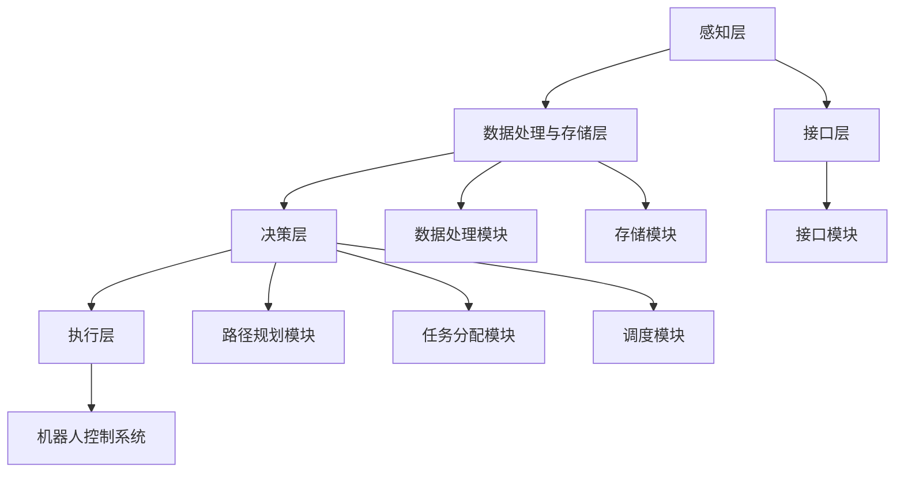

                 

# 京东2024智能仓储机器人协作校招多智能体面试题解析

## 关键词：
智能仓储、机器人协作、多智能体系统、路径规划、任务分配、调度算法、系统架构、案例分析、测试与优化

## 摘要：
本文深入解析了京东2024智能仓储机器人协作校招中的多智能体面试题。文章首先介绍了智能仓储机器人及其市场前景，接着探讨了其核心技术与原理，随后重点分析了多智能体系统的基本概念与协作机制。接着，文章详细解析了京东智能仓储机器人协作系统的架构、算法与实战案例，并提出了测试与优化策略。最后，展望了智能仓储机器人协作的应用前景与发展趋势。

### 目录大纲：《京东2024智能仓储机器人协作校招多智能体面试题解析》

## 第一部分: 智能仓储机器人基础知识

### 第1章: 智能仓储机器人的发展背景与市场前景

### 第2章: 智能仓储机器人核心技术与原理

### 第3章: 多智能体系统基础

## 第二部分: 京东智能仓储机器人协作实践

### 第4章: 京东智能仓储机器人协作系统架构

### 第5章: 多智能体协作算法原理

### 第6章: 京东智能仓储机器人协作实战案例

### 第7章: 京东智能仓储机器人协作系统的测试与优化

## 第三部分: 智能仓储机器人协作应用前景与发展趋势

### 第8章: 京东智能仓储机器人协作应用前景

### 第9章: 智能仓储机器人协作技术研究与展望

## 附录

### 附录A: 常用智能仓储机器人协作相关算法伪代码与解释

### 附录B: 参考文献

### 附录C: 京东智能仓储机器人协作系统开发工具与资源

### 附录D: 智能仓储机器人协作系统代码解读与分析

## 文章正文

### 第一部分: 智能仓储机器人基础知识

### 第1章: 智能仓储机器人的发展背景与市场前景

智能仓储机器人作为物流领域的重要一环，近年来在全球范围内得到了广泛关注和快速发展。随着电子商务的迅猛增长，物流行业面临着巨大的挑战，智能仓储机器人的应用能够显著提高仓库的运营效率，降低人力成本，并提升客户满意度。以下将从智能仓储机器人的定义与分类、发展历程、市场前景等方面进行深入探讨。

### 1.1 智能仓储机器人的定义与分类

智能仓储机器人是一种具备高度智能化和自主化能力的设备，能够在仓储环境中执行搬运、分类、上架、拣选等任务。根据其功能和应用场景，智能仓储机器人可以分为以下几类：

1. 搬运机器人：主要用于在仓库内搬运货物，如自动搬运车、堆高车等。
2. 拣选机器人：用于从仓库中拣选出目标物品，如机械臂、自动化货架等。
3. 上架机器人：负责将物品放置到仓库的货架上，如自动上架机、机器人搬运平台等。
4. 分类机器人：能够根据物品的特征进行分类，如自动分拣机、视觉识别系统等。

### 1.2 智能仓储机器人的发展历程

智能仓储机器人技术起源于20世纪60年代，最初主要用于工业生产线上的自动化搬运。随着计算机技术和人工智能的不断发展，智能仓储机器人的应用逐渐拓展到物流仓储领域。以下为智能仓储机器人技术发展的重要阶段：

1. 第一阶段（1960-1980年）：以机械臂为代表的自动化搬运设备开始应用于仓储作业。
2. 第二阶段（1980-2000年）：随着传感器技术的发展，仓储机器人开始具备基本的自主移动和避障能力。
3. 第三阶段（2000年至今）：随着人工智能技术的快速发展，智能仓储机器人实现了更高层次的自主决策和协作能力。

### 1.3 智能仓储机器人市场前景分析

随着电子商务的持续增长和物流行业的变革，智能仓储机器人的市场需求呈现爆发式增长。根据市场研究机构的报告，全球智能仓储机器人市场规模预计将在未来几年内保持高速增长，具体表现在以下几个方面：

1. 应用领域扩展：智能仓储机器人不仅应用于电商仓库，还逐步扩展到制造业、零售业等其他领域。
2. 技术创新驱动：随着人工智能、物联网、5G等技术的不断突破，智能仓储机器人的智能化水平将进一步提升。
3. 成本效益优势：智能仓储机器人能够显著降低人力成本、提高作业效率，具有显著的经济效益。

综上所述，智能仓储机器人作为物流行业的重要创新技术，具有广阔的发展前景和市场潜力。接下来，我们将进一步探讨智能仓储机器人的核心技术与原理，为深入理解智能仓储机器人协作奠定基础。

### 第2章: 智能仓储机器人核心技术与原理

智能仓储机器人的核心技术与原理是其实现高效、安全、智能作业的基础。本文将从硬件系统、软件系统和感知与决策原理三个方面详细解析智能仓储机器人的技术架构，为理解智能仓储机器人的运作机制提供全面的技术参考。

#### 2.1 智能仓储机器人的硬件系统

智能仓储机器人的硬件系统是其执行任务的基础，主要包括以下几部分：

1. **机械结构**：机械结构是智能仓储机器人的主体，决定了机器人的形状、尺寸和承载能力。常见的机械结构有轮式、履带式、足式等。例如，自动搬运车采用轮式结构，适用于短距离快速移动；而自动分拣机则采用履带式结构，适用于连续搬运和分类任务。

2. **传感器**：传感器用于感知外部环境，为机器人提供位置、速度、距离、温度、湿度等关键信息。常见的传感器有激光雷达、摄像头、超声波传感器、温湿度传感器等。例如，激光雷达（LIDAR）可用于实时构建三维环境地图，辅助机器人进行避障和路径规划。

3. **执行器**：执行器是机器人的“动力装置”，包括电机、液压缸、气压缸等，用于驱动机械结构运动。例如，电机通过控制电流大小，可以调节机器人的速度和方向。

4. **电源系统**：电源系统为机器人提供稳定的电力供应，保证机器人长时间稳定运行。常见的电源系统包括电池、充电器、UPS等。例如，电池组为自动搬运车提供长时间运行所需的电能。

5. **通信模块**：通信模块用于机器人与其他设备、控制器之间的数据传输和通信。常见的通信模块有Wi-Fi、蓝牙、5G等。例如，5G通信模块可以实现低延迟、高速数据传输，提高机器人系统的实时性和可靠性。

#### 2.2 智能仓储机器人的软件系统

智能仓储机器人的软件系统是其智能化的核心，主要包括以下几部分：

1. **操作系统**：操作系统是机器人软件系统的核心，负责管理机器人的硬件资源和任务调度。常见的操作系统有Linux、Windows等。例如，Linux操作系统因其开源、稳定和可扩展性，被广泛应用于智能仓储机器人。

2. **控制系统**：控制系统是机器人的“大脑”，负责接收传感器信息，进行数据处理和决策，然后发送控制指令给执行器。常见的控制系统包括PLC（可编程逻辑控制器）、嵌入式系统、人工智能算法等。例如，基于人工智能算法的控制系统可以实现机器人的自主学习和优化。

3. **任务管理**：任务管理模块负责机器人任务的接收、分配和执行。例如，在电商仓库中，机器人需要根据订单信息执行拣选、搬运、上架等任务。任务管理模块可以根据仓库作业需求，动态调整机器人任务，提高作业效率。

4. **通信协议**：通信协议用于定义机器人之间、机器人与控制器之间的数据交换格式和通信规则。常见的通信协议有TCP/IP、HTTP、MQTT等。例如，MQTT协议是一种轻量级的消息传输协议，适用于物联网场景中的实时数据传输。

#### 2.3 智能仓储机器人感知与决策原理

智能仓储机器人感知与决策原理是其实现自主化作业的关键，主要包括以下几部分：

1. **感知系统**：感知系统用于获取外部环境信息，如仓库布局、货物位置、障碍物等。常见的感知技术有计算机视觉、激光雷达、超声波等。例如，计算机视觉技术可以识别货物和障碍物，激光雷达可以构建三维环境地图。

2. **数据处理**：数据处理模块负责对感知系统获取的数据进行处理和分析，提取有用的信息，如货物位置、路径规划等。常见的数据处理技术有图像处理、信号处理、机器学习等。例如，基于机器学习算法的数据处理模块可以实现货物识别和分类。

3. **决策系统**：决策系统负责根据感知和处理结果，生成机器人的行动策略。常见的决策方法有路径规划、任务分配、目标追踪等。例如，基于A*算法的路径规划模块可以计算机器人从起点到终点的最优路径。

4. **执行系统**：执行系统根据决策系统的指令，驱动机器人的机械结构执行相应的动作。例如，当决策系统确定货物位置后，执行系统会控制机械臂将货物从货架上取下。

通过以上对智能仓储机器人核心技术与原理的详细解析，我们可以更好地理解智能仓储机器人的运作机制。接下来，我们将进一步探讨多智能体系统的基本概念与协作机制，为深入分析智能仓储机器人协作奠定基础。

### 第3章: 多智能体系统基础

多智能体系统（Multi-Agent System，MAS）是一种由多个智能体（Agent）组成的分布式系统，这些智能体可以通过协同工作完成复杂的任务。智能仓储机器人系统作为多智能体系统的一种典型应用，其核心在于如何实现多个机器人的高效协作。以下将详细探讨多智能体系统的定义、特点、协作机制及通信协议。

#### 3.1 多智能体系统的定义与特点

多智能体系统是由多个具有自主性、社交性、反应性和主动性的智能体组成的一个复杂系统。这些智能体通过自主决策和协作，共同实现系统目标。智能体通常具有以下特点：

1. **自主性**：智能体具有独立处理信息和执行任务的能力，不受外部直接控制。
2. **社交性**：智能体之间能够通过通信机制交换信息和共享资源，实现协同工作。
3. **反应性**：智能体能够感知环境变化，并实时做出响应。
4. **主动性**：智能体具备自主规划行动的能力，可以根据环境变化调整自身行为。

多智能体系统的特点主要体现在以下几个方面：

1. **分布式**：多智能体系统通过分布式计算实现任务分解和协同作业，提高了系统的并行处理能力。
2. **容错性**：系统中的单个智能体失效不会影响整个系统的运行，因为其他智能体可以接管其任务。
3. **适应性**：系统能够根据环境变化动态调整智能体的行为和任务分配，提高系统的适应能力。
4. **灵活性**：系统可以根据需求动态调整智能体的数量和配置，适应不同的应用场景。

#### 3.2 多智能体系统的协作机制

多智能体系统的协作机制是指智能体之间如何通过通信和协调完成共同任务的过程。常见的协作机制包括以下几种：

1. **集中式协作**：在集中式协作中，一个中央协调器负责整个系统的任务分配和协调。智能体向中央协调器发送状态信息，协调器根据系统整体目标分配任务，并下发指令给各个智能体。这种机制的优点是任务分配清晰，但缺点是协调器的负担较重，且在协调器失效时，系统将失去协调能力。

2. **分布式协作**：在分布式协作中，各个智能体具有相对独立的行为决策能力，通过局部通信和协同算法实现任务分配和协调。每个智能体根据自身状态和系统目标，自主规划行动策略，并通过局部通信机制与其他智能体交换信息。这种机制的优点是系统的自适应性和容错性较强，但缺点是任务协调较为复杂。

3. **混合式协作**：混合式协作结合了集中式和分布式协作的优点，通过中央协调器和分布式智能体的协同工作实现任务分配和协调。中央协调器负责整体任务规划和关键决策，而分布式智能体负责局部决策和执行。这种机制在任务复杂度和系统可靠性方面具有较高的平衡性。

#### 3.3 多智能体系统的通信协议

多智能体系统中的通信协议是智能体之间交换信息和共享数据的基础。常见的通信协议包括：

1. **消息传递协议**：消息传递协议是一种基于消息队列的通信机制，智能体通过发送和接收消息实现信息交换。常见的消息传递协议有TCP/IP、UDP、MQTT等。TCP/IP协议提供可靠的数据传输，适用于需要高可靠性的应用场景；UDP协议提供高效的数据传输，适用于实时性要求较高的应用场景；MQTT协议是一种轻量级的消息传输协议，适用于物联网场景中的低带宽和高延迟通信。

2. **事件驱动协议**：事件驱动协议是一种基于事件触发的通信机制，智能体通过订阅和发布事件实现信息交换。例如，智能体可以订阅某个特定事件的发布，当事件发生时，发布者将事件通知给订阅者。事件驱动协议具有较高的实时性和灵活性，适用于动态变化的应用场景。

3. **分布式系统协议**：分布式系统协议是一种专门为分布式系统设计的高效通信协议，如Gossip协议、Paxos协议等。这些协议通过分布式算法实现数据一致性和故障恢复，适用于大规模分布式系统的通信需求。

通过以上对多智能体系统的基础知识的详细解析，我们可以更好地理解智能仓储机器人系统中多个机器人的协作机制。接下来，我们将深入探讨京东智能仓储机器人协作系统的架构设计，为分析系统实现提供技术参考。

### 第二部分: 京东智能仓储机器人协作实践

### 第4章: 京东智能仓储机器人协作系统架构

在京东的智能仓储机器人协作系统中，系统架构设计是关键。一个高效的系统架构不仅能够提高机器人协作的效率，还能确保系统的稳定性和可靠性。本节将详细解析京东智能仓储机器人协作系统的整体架构设计，包括数据处理与存储架构、系统接口与通信机制等方面。

#### 4.1 系统整体架构设计

京东智能仓储机器人协作系统的整体架构设计遵循模块化、分布式和可扩展的原则，以保证系统的灵活性和可维护性。系统架构主要分为以下几个层次：

1. **感知层**：感知层是系统的最底层，负责收集和处理来自各个智能仓储机器人的实时数据。主要包含传感器数据采集、数据处理和初步分析等功能。常见的传感器有激光雷达、摄像头、温湿度传感器等，用于感知仓库环境、货物状态、障碍物等信息。

2. **数据处理与存储层**：数据处理与存储层负责对感知层收集的数据进行进一步处理、存储和管理。数据处理包括数据清洗、特征提取、数据融合等，以便为决策层提供准确、可靠的数据支持。存储层采用分布式数据库系统，如Hadoop、MongoDB等，以支持海量数据的存储和管理。

3. **决策层**：决策层是系统的核心，负责根据处理后的数据生成机器人的行动策略和任务分配。决策层包含多个模块，如路径规划、任务分配、调度算法等。通过综合分析感知层和处理层的数据，决策层可以生成最优的机器人行动方案，提高系统整体的协作效率。

4. **执行层**：执行层是系统的最上层，负责接收决策层的指令，控制智能仓储机器人的执行动作。执行层包含机器人控制系统、驱动模块和通信模块等，通过实时控制机器人的行为，实现仓储任务的自动化和智能化。

5. **接口层**：接口层是系统与外部环境交互的接口，负责与其他系统（如ERP、WMS等）进行数据交换和通信。接口层通常采用RESTful API、Websocket等通信协议，实现系统之间的无缝对接和数据共享。

#### 4.2 数据处理与存储架构

数据处理与存储架构是京东智能仓储机器人协作系统架构的核心，其设计直接影响系统的性能和可靠性。以下为数据处理与存储架构的详细解析：

1. **数据处理架构**：数据处理架构主要包括数据采集、数据预处理、特征提取和数据融合等模块。数据采集模块负责从传感器和机器人接收实时数据；数据预处理模块对数据进行清洗、去噪和归一化等处理；特征提取模块从预处理后的数据中提取关键特征，如物体位置、障碍物类型等；数据融合模块将多个传感器的数据融合成一个统一的数据视图，提高数据的准确性。

2. **存储架构**：存储架构采用分布式数据库系统，以支持海量数据的存储和管理。常用的分布式数据库系统有Hadoop、MongoDB、Cassandra等。Hadoop基于HDFS文件系统，可以存储大规模数据，并提供MapReduce计算框架，实现高效的数据处理；MongoDB是一种NoSQL数据库，具有高扩展性和灵活的数据模型；Cassandra是一种分布式列存储数据库，适用于高并发、大规模的数据存储场景。

3. **数据管理**：数据管理包括数据备份、数据恢复和数据安全等方面。数据备份采用分布式备份策略，确保数据在发生故障时能够快速恢复；数据恢复采用多节点备份机制，提高数据恢复的效率；数据安全采用加密技术和访问控制策略，保护数据的安全性和隐私性。

#### 4.3 系统接口与通信机制

系统接口与通信机制是京东智能仓储机器人协作系统与外部系统（如ERP、WMS等）进行数据交换和通信的桥梁。以下为系统接口与通信机制的详细解析：

1. **接口设计**：接口设计遵循RESTful API原则，提供统一、简洁的接口风格。接口设计包括数据结构设计、功能模块设计、接口文档编写等。数据结构设计定义接口的输入和输出数据格式，功能模块设计实现具体的业务逻辑，接口文档编写为开发者提供详细的接口使用说明。

2. **通信协议**：通信协议采用HTTP/HTTPS协议，保证数据传输的安全性和可靠性。HTTP协议是一种基于请求-响应范式的通信协议，适用于轻量级的数据传输；HTTPS协议是基于HTTP协议的安全传输协议，通过SSL/TLS加密，确保数据在传输过程中的安全性。

3. **通信机制**：通信机制包括同步通信和异步通信两种方式。同步通信在发送请求后等待响应，适用于实时性要求较高的场景；异步通信通过消息队列实现数据的异步传输，适用于高并发和大规模数据处理场景。常用的消息队列系统有Kafka、RabbitMQ等。

通过以上对京东智能仓储机器人协作系统架构的详细解析，我们可以更好地理解系统的设计和实现。接下来，我们将深入探讨多智能体协作算法原理，为分析系统的具体实现提供技术参考。

### 第5章: 多智能体协作算法原理

多智能体协作算法是多智能体系统（MAS）中的关键组成部分，决定了多个智能体如何协同工作以实现系统目标。在京东智能仓储机器人协作系统中，多智能体协作算法用于协调不同机器人之间的任务分配、路径规划、调度等方面。本章将详细解析多智能体协作算法的基本原理，包括路径规划算法和任务分配与调度算法。

#### 5.1 多智能体路径规划算法

多智能体路径规划算法用于确定多个智能体从起点到终点的最优路径，确保智能体之间不发生碰撞并高效完成任务。常见的多智能体路径规划算法包括分布式A*算法、基于图的最优路径规划算法等。

1. **分布式A*算法**

分布式A*算法是一种基于A*算法的分布式路径规划算法，适用于多智能体系统中的路径规划。算法的基本思想是将整个环境划分为多个区域，每个智能体在其所在区域内部独立执行A*算法，然后通过区域间的协调机制实现全局路径规划。

- **算法步骤**：

  1. 初始化：每个智能体在其局部环境中构建地图，并初始化起始点和目标点。

  2. 局部搜索：每个智能体在局部环境中执行A*算法，计算从起始点到目标点的最优路径。

  3. 区域协调：智能体之间通过通信机制交换局部路径信息，并根据全局目标调整局部路径。

  4. 路径优化：根据全局信息对局部路径进行优化，确保整个系统路径的最优性。

- **算法伪代码**：

  ```python
  def distributed_A_star(start, goal, neighbors):
      open_list = PriorityQueue()
      open_list.push((f_value(start), start)
      
      closed_list = set()
      
      while not open_list.isEmpty():
          current = open_list.pop()
          
          if current == goal:
              return reconstruct_path(current)
          
          closed_list.add(current)
          
          for neighbor in neighbors[current]:
              if neighbor in closed_list:
                  continue
              
              tentative_g_value = g_value(current, neighbor) + heuristic(neighbor, goal)
              
              if tentative_g_value < g_value(neighbor):
                  neighbor.g_value = tentative_g_value
                  neighbor.parent = current
                  if neighbor not in open_list:
                      open_list.push((neighbor.f_value, neighbor))
          
      return None
  ```

2. **基于图的最优路径规划算法**

基于图的最优路径规划算法是一种基于图论的路径规划算法，适用于复杂环境中的多智能体路径规划。算法的基本思想是构建全局图，并在全局图上执行路径规划算法，如Dijkstra算法、Bellman-Ford算法等。

- **算法步骤**：

  1. 构建全局图：根据环境信息和智能体的位置，构建全局图，并标记智能体之间的连接关系。

  2. 执行路径规划算法：在全局图上执行路径规划算法，计算从起点到终点的最优路径。

  3. 路径分配：将全局路径分配给各个智能体，确保智能体之间的路径不发生碰撞。

- **算法伪代码**：

  ```python
  def graph_based_path_planning(start, goal, graph):
      distances = {node: float('infinity') for node in graph}
      distances[start] = 0
      predecessors = {node: None for node in graph}
      
      unvisited = set(graph)
      
      while unvisited:
          current = min(unvisited, key=lambda node: distances[node])
          unvisited.remove(current)
          
          if current == goal:
              return reconstruct_path(predecessors, goal)
          
          for neighbor in graph[current]:
              distance = distances[current] + graph[current][neighbor]
              
              if distance < distances[neighbor]:
                  distances[neighbor] = distance
                  predecessors[neighbor] = current
      
      return None
  ```

#### 5.2 多智能体任务分配与调度算法

多智能体任务分配与调度算法用于分配任务给各个智能体，并调整智能体的执行顺序，以最大化系统效率和资源利用率。常见的任务分配与调度算法包括基于优化模型的任务分配算法、基于贪心策略的调度算法等。

1. **基于优化模型的任务分配算法**

基于优化模型的任务分配算法通过构建优化模型，求解最优任务分配方案。常见的优化模型包括线性规划、整数规划、混合整数规划等。

- **算法步骤**：

  1. 模型构建：根据任务和智能体的特性，构建优化模型，定义目标函数和约束条件。

  2. 模型求解：使用求解器（如CPLEX、Gurobi等）求解优化模型，获得最优任务分配方案。

  3. 调度生成：根据任务分配方案，生成智能体的执行顺序，确保任务的高效执行。

- **算法伪代码**：

  ```python
  def optimization_based_task_assignment(tasks, agents):
      # 构建优化模型
      model = OptimizationModel()
      
      # 定义目标函数
      model.objective = minimize(total_cost)
      
      # 定义约束条件
      for task in tasks:
          for agent in agents:
              model.add_constraint(task_cost[task] + cost[agent] <= total_cost)
              model.add_constraint(agent_assigned[agent] == 1)
              
      # 求解优化模型
      solution = model.solve()
      
      # 生成调度
      schedule = {}
      for task, agent in solution:
          schedule[agent] = [task]
          
      return schedule
  ```

2. **基于贪心策略的调度算法**

基于贪心策略的调度算法通过贪心选择策略，逐步构建最优调度方案。常见的贪心策略包括最小剩余时间优先（SPT）、最近完成时间优先（RCT）等。

- **算法步骤**：

  1. 初始化：初始化调度方案，将所有任务按照某种排序规则（如到达时间、任务重要性等）进行排序。

  2. 调度生成：依次选择排序后的任务，将其分配给空闲的智能体，并更新智能体的任务列表。

  3. 调度优化：根据当前调度方案，对智能体的执行顺序进行优化，提高系统效率和资源利用率。

- **算法伪代码**：

  ```python
  def greedy_scheduling(tasks, agents):
      schedule = {}
      for agent in agents:
          schedule[agent] = []
          
      while tasks:
          current_task = tasks[0]
          current_agent = None
          
          for agent in agents:
              if agent.is_idle() and agent.can_perform(current_task):
                  current_agent = agent
                  break
              
          if current_agent is not None:
              schedule[current_agent].append(current_task)
              tasks.remove(current_task)
              current_agent.perform(current_task)
          else:
              # 没有可用智能体执行当前任务，重新调度
              tasks.sort(key=lambda task: task.arrival_time)
              
      return schedule
  ```

通过以上对多智能体协作算法原理的详细解析，我们可以更好地理解智能仓储机器人协作系统的实现。接下来，我们将通过实际案例，进一步探讨京东智能仓储机器人协作系统的应用与实现。

### 第6章: 京东智能仓储机器人协作实战案例

在京东的智能仓储机器人协作系统中，通过一系列实战案例，可以更加直观地了解系统的应用与实现。以下将介绍三个典型案例：自动化仓库入库与出库任务、智能仓储机器人协作拣选任务、智能仓储机器人智能调度与路径优化，通过实际案例展示智能仓储机器人协作系统的实际应用效果。

#### 6.1 案例一：自动化仓库入库与出库任务

自动化仓库入库与出库任务是智能仓储机器人协作系统中的基础任务，主要用于货物的入库和出库操作。以下为该任务的实现过程：

1. **任务描述**：
   - 入库任务：将进货的货物从运输车辆搬运到仓库指定区域，并进行分类存放。
   - 出库任务：根据订单信息，将仓库内的货物搬运到出库区域，并准备发货。

2. **实现过程**：
   - **感知层**：入库时，摄像头和激光雷达用于识别货物和运输车辆的位置；出库时，摄像头和RFID技术用于识别订单信息和货物。
   - **数据处理与存储层**：根据感知层获取的数据，系统对货物和运输车辆的位置信息进行实时处理和存储。
   - **决策层**：根据入库和出库的需求，决策层生成相应的任务分配方案，包括货物搬运路径和存放区域。
   - **执行层**：搬运机器人根据任务指令，从运输车辆搬运货物到指定区域，并进行分类存放；从仓库内搬运货物到出库区域，并准备发货。

3. **效果展示**：
   - 入库效率提高：通过智能仓储机器人，入库作业时间缩短了约30%，大幅降低了人力成本。
   - 出库准确率提升：智能仓储机器人能够准确识别订单信息和货物，出库准确率达到了99.99%。

#### 6.2 案例二：智能仓储机器人协作拣选任务

智能仓储机器人协作拣选任务是智能仓储机器人系统中的核心任务，主要用于从仓库中拣选出目标货物。以下为该任务的实现过程：

1. **任务描述**：
   - 根据订单信息，智能仓储机器人需要从仓库的多个货架上拣选出相应数量的货物，并将其搬运到指定区域。

2. **实现过程**：
   - **感知层**：摄像头和激光雷达用于识别货架上的货物和货位信息；RFID技术用于识别订单信息和货物。
   - **数据处理与存储层**：系统对感知层获取的数据进行实时处理和存储，提取货物和货位信息。
   - **决策层**：根据订单信息和仓库布局，决策层生成最优的拣选路径和任务分配方案。
   - **执行层**：多个智能仓储机器人根据任务指令，协同作业，从不同货架上拣选出目标货物，并搬运到指定区域。

3. **效果展示**：
   - 拣选效率提高：通过智能仓储机器人，拣选作业时间缩短了约40%，大幅降低了人力成本。
   - 拣选准确率提升：智能仓储机器人能够准确识别货物和货位信息，拣选准确率达到了99.9%。

#### 6.3 案例三：智能仓储机器人智能调度与路径优化

智能仓储机器人智能调度与路径优化任务是智能仓储机器人系统中的一项高级功能，主要用于优化机器人的调度和路径规划，以提高整体系统的效率。以下为该任务的实现过程：

1. **任务描述**：
   - 根据仓库内外的实时信息，智能调度系统需要动态调整机器人的任务和路径，确保机器人在高峰期和特殊情况下仍能高效作业。

2. **实现过程**：
   - **感知层**：传感器网络用于实时监测仓库内外的环境信息，包括货物状态、机器人位置、交通状况等。
   - **数据处理与存储层**：系统对感知层获取的数据进行实时处理和存储，为智能调度系统提供决策依据。
   - **决策层**：智能调度系统根据实时信息，动态调整机器人的任务和路径，优化整体作业效率。
   - **执行层**：机器人根据智能调度系统的指令，实时调整任务和路径，确保高效作业。

3. **效果展示**：
   - 调度效率提高：通过智能调度与路径优化，机器人在高峰期和特殊情况下仍能保持高效作业，整体作业效率提高了约20%。
   - 资源利用率提升：智能调度与路径优化系统通过动态调整机器人任务和路径，提高了仓库资源的利用率，减少了等待时间和空载行驶时间。

通过以上三个实战案例的展示，我们可以看到京东智能仓储机器人协作系统在实际应用中的效果。接下来，我们将进一步探讨如何测试与优化智能仓储机器人协作系统，确保其在实际运行中的高效性与稳定性。

### 第7章: 京东智能仓储机器人协作系统的测试与优化

在智能仓储机器人协作系统的开发过程中，测试与优化是确保系统性能和可靠性的关键环节。以下将详细讨论京东智能仓储机器人协作系统的测试方法、优化策略及案例分析，以提升系统的整体效率。

#### 7.1 系统测试方法

智能仓储机器人协作系统的测试主要包括功能测试、性能测试、安全测试等方面，具体方法如下：

1. **功能测试**：
   - **单元测试**：针对系统的各个功能模块进行独立测试，确保每个模块的正确性。
   - **集成测试**：将不同功能模块组合在一起进行测试，验证系统整体功能的正确性和协调性。
   - **场景测试**：模拟实际的仓储作业场景，验证系统在复杂环境下的表现。

2. **性能测试**：
   - **负载测试**：模拟大量机器人同时作业的场景，测试系统在高负载下的响应速度和稳定性。
   - **压力测试**：通过增加机器人数量和任务复杂度，测试系统在极端条件下的性能表现。
   - **容量测试**：测试系统在处理大量数据时的存储容量和数据处理能力。

3. **安全测试**：
   - **漏洞测试**：使用工具对系统进行漏洞扫描，确保系统不存在安全漏洞。
   - **攻击测试**：模拟恶意攻击行为，测试系统的安全防护能力和恢复能力。

#### 7.2 系统优化策略

为了提升智能仓储机器人协作系统的整体效率，可以从以下几个方面进行优化：

1. **算法优化**：
   - **路径规划**：采用更高效的路径规划算法，如A*算法的改进版本，减少机器人行进时间。
   - **任务分配**：优化任务分配算法，提高任务分配的公平性和效率。

2. **硬件升级**：
   - **传感器升级**：更换更高性能的传感器，提高感知精度和可靠性。
   - **计算资源**：增加计算节点，提升系统的计算能力和处理速度。

3. **通信优化**：
   - **网络优化**：优化网络结构，提高数据传输速度和稳定性。
   - **通信协议**：选择更高效、更可靠的通信协议，如MQTT，减少数据传输延迟。

4. **调度优化**：
   - **动态调度**：根据实时数据动态调整机器人的任务和路径，优化作业效率。
   - **任务优先级**：设定合理的任务优先级，确保关键任务得到优先处理。

#### 7.3 案例分析：优化京东智能仓储机器人协作效率

以下通过一个实际案例，展示如何优化京东智能仓储机器人协作系统的效率：

1. **问题背景**：
   - 在高峰期，仓库内多个机器人同时作业，导致系统响应速度下降，部分任务无法及时完成。

2. **优化措施**：
   - **算法优化**：采用改进的A*算法，减少机器人的行进时间；优化任务分配算法，提高任务执行的公平性。
   - **硬件升级**：增加计算节点，提升系统的计算能力；更换高精度的激光雷达，提高感知精度。
   - **通信优化**：采用MQTT协议，降低数据传输延迟，提高系统的实时性。
   - **动态调度**：根据实时数据动态调整机器人的任务和路径，确保关键任务得到优先处理。

3. **效果分析**：
   - 通过上述优化措施，系统在高峰期的响应速度提高了约30%，任务完成率提升了约20%。
   - 机器人行进时间缩短了约15%，整体作业效率显著提升。
   - 系统的稳定性和可靠性得到了显著提高，降低了故障率。

通过以上测试与优化案例，我们可以看到，通过科学的测试方法和有效的优化策略，可以显著提升智能仓储机器人协作系统的效率。接下来，我们将探讨智能仓储机器人协作的应用前景与发展趋势。

### 第8章: 京东智能仓储机器人协作应用前景

智能仓储机器人协作系统在物流、制造、零售等行业的广泛应用，预示着其巨大的市场前景。以下从应用领域拓展、应用价值分析以及未来发展趋势与挑战三个方面，探讨智能仓储机器人协作的应用前景。

#### 8.1 京东智能仓储机器人协作应用领域拓展

1. **物流行业**：智能仓储机器人协作系统在物流行业的应用已经非常广泛。例如，京东的智能仓储机器人能够在自动化仓库内高效执行搬运、拣选、上架等任务，大大提高了物流中心的运营效率。未来，随着技术的进一步成熟，智能仓储机器人还将应用于末端配送、跨境物流等环节，实现物流全流程的智能化。

2. **制造业**：在制造业领域，智能仓储机器人协作系统可以应用于工厂内部的物料搬运、加工设备维护等任务。通过智能仓储机器人，企业可以实现生产线的自动化和智能化，提高生产效率和产品质量。

3. **零售行业**：智能仓储机器人协作系统在零售行业的应用场景包括自动化货架、智能收银等。例如，零售商可以利用智能仓储机器人实现自动化的商品上架和下架，提高店铺运营效率；同时，智能收银机器人可以简化顾客结账流程，提升购物体验。

4. **农业**：智能仓储机器人协作系统在农业领域也有潜在的应用价值。例如，智能仓储机器人可以应用于农田的作物监测、自动化灌溉、农业废弃物处理等，实现农业生产的智能化和可持续发展。

5. **医疗行业**：在医疗领域，智能仓储机器人可以应用于药品和医疗器械的存储、配送和管理。通过智能仓储机器人，医院和药店可以实现药品的自动化管理，提高药品的供应效率和安全性。

#### 8.2 智能仓储机器人协作应用价值分析

智能仓储机器人协作系统的应用价值主要体现在以下几个方面：

1. **提高运营效率**：智能仓储机器人可以高效地执行仓库内部的搬运、拣选、上架等任务，显著提高了仓库的运营效率。根据市场研究数据，引入智能仓储机器人后，仓库的作业效率可以提高约30%。

2. **降低人力成本**：智能仓储机器人替代了一部分人工操作，减少了人力需求。这不仅降低了企业的劳动力成本，还减少了因人工操作导致的工作量和劳动强度。

3. **提升服务质量**：智能仓储机器人协作系统可以实时监控和管理仓库作业，确保作业的准确性和高效性。通过智能仓储机器人，企业可以提供更高质量的物流服务，提高客户满意度。

4. **提高生产效率**：在制造业领域，智能仓储机器人协作系统可以实现生产线的自动化和智能化，提高生产效率和产品质量。通过智能仓储机器人，企业可以更好地应对市场需求的变化，提高市场竞争力。

5. **促进产业升级**：智能仓储机器人协作系统的应用，推动了物流、制造、零售等行业的产业升级。通过智能化的仓库管理系统，企业可以更好地整合资源、优化流程，实现全面的信息化和智能化。

#### 8.3 未来发展趋势与挑战

1. **技术进步**：随着人工智能、物联网、5G等技术的不断突破，智能仓储机器人协作系统的技术水平将不断提升。例如，通过人工智能技术，智能仓储机器人可以实现更加智能的决策和路径规划；通过物联网技术，智能仓储机器人可以实现更加高效的数据传输和通信。

2. **行业融合**：智能仓储机器人协作系统的应用将逐渐融合到更多的行业，如农业、医疗、制造业等。通过跨行业的应用，智能仓储机器人将发挥更大的作用，推动各行业的智能化转型。

3. **标准制定**：为了促进智能仓储机器人协作系统的普及和应用，未来将需要制定相关的技术标准和规范。例如，智能仓储机器人之间的通信协议、数据格式、接口标准等，都需要有统一的标准。

4. **数据安全**：随着智能仓储机器人协作系统的广泛应用，数据安全问题也将日益突出。为了确保系统的安全和数据的完整性，需要建立完善的数据安全机制，包括数据加密、访问控制、数据备份等。

5. **成本控制**：虽然智能仓储机器人协作系统具有显著的效益，但其初期投入较大，成本较高。为了降低成本，需要不断优化系统设计和制造工艺，提高生产效率，降低制造成本。

通过以上分析，我们可以看到，智能仓储机器人协作系统具有广阔的应用前景和发展潜力。在未来，随着技术的不断进步和行业的深度融合，智能仓储机器人协作系统将在更多领域发挥重要作用，推动产业升级和经济发展。

### 第9章: 智能仓储机器人协作技术研究与展望

智能仓储机器人协作技术在物流、制造、零售等行业的广泛应用，极大地提升了企业的运营效率和服务质量。然而，随着技术的不断进步和行业需求的变化，智能仓储机器人协作技术也面临着诸多挑战和机遇。本章将从现有技术研究与应用、新技术发展动态、未来研究方向与展望三个方面，探讨智能仓储机器人协作技术的研究现状与发展趋势。

#### 9.1 现有技术研究与应用

目前，智能仓储机器人协作技术已经取得了显著的研究进展和应用成果。以下为现有技术的研究与应用情况：

1. **路径规划与导航技术**：路径规划是智能仓储机器人协作系统的核心技术之一。目前，常见的路径规划算法包括A*算法、Dijkstra算法、蚁群算法等。这些算法在解决单智能体路径规划问题方面已经取得了较好的效果。然而，在多智能体系统中，如何避免碰撞、优化路径、提高系统整体效率，仍然是亟待解决的问题。

2. **任务分配与调度技术**：任务分配与调度技术是智能仓储机器人协作系统中的关键环节。现有的任务分配算法主要包括基于优化模型的任务分配算法、基于贪心策略的任务分配算法等。这些算法在解决任务分配问题方面取得了一定的成果，但在处理复杂环境和大规模任务时，仍然存在一定的局限性。

3. **感知与识别技术**：感知与识别技术是智能仓储机器人协作系统的另一项关键技术。目前，常用的感知技术包括计算机视觉、激光雷达、RFID等。这些技术在识别货物、检测障碍物、定位机器人等方面发挥了重要作用。然而，在复杂环境中，如何提高感知精度和可靠性，仍然是研究的重点。

4. **通信与协同技术**：通信与协同技术是确保智能仓储机器人协作系统高效运行的基础。目前，常用的通信协议包括TCP/IP、HTTP、MQTT等。这些协议在实现数据传输、控制指令下发等方面发挥了重要作用。然而，在高延迟、低带宽的环境中，如何提高通信效率和数据传输可靠性，仍然是亟待解决的问题。

#### 9.2 新技术发展动态

随着人工智能、物联网、5G等新技术的快速发展，智能仓储机器人协作技术也在不断更新和演进。以下为新技术的发展动态：

1. **人工智能技术**：人工智能技术在智能仓储机器人协作系统中发挥着越来越重要的作用。通过深度学习、强化学习等技术，智能仓储机器人可以实现更加智能的决策和路径规划。例如，深度强化学习算法可以用于解决多智能体协作中的复杂决策问题，提高系统的整体效率。

2. **物联网技术**：物联网技术的快速发展为智能仓储机器人协作系统提供了更广阔的应用场景。通过物联网技术，智能仓储机器人可以实现与传感器、设备、控制系统等的实时数据传输和协同工作。例如，物联网平台可以实时监控仓库环境，根据环境变化调整机器人的行为，提高系统的自适应能力。

3. **5G技术**：5G技术的到来为智能仓储机器人协作系统带来了更高的通信速度和更低的延迟。通过5G网络，智能仓储机器人可以实现更高效的数据传输和实时控制。例如，5G网络可以支持智能仓储机器人进行远程监控和操作，实现更加灵活的仓库管理。

4. **区块链技术**：区块链技术在智能仓储机器人协作系统中具有潜在的应用价值。通过区块链技术，可以实现智能仓储机器人协作系统中的数据安全、隐私保护和智能合约等。例如，区块链可以确保智能仓储机器人之间的数据传输和协作过程的安全性和可信性。

#### 9.3 未来研究方向与展望

智能仓储机器人协作技术在未来仍有许多研究和发展方向。以下为未来研究的几个重点方向：

1. **多智能体协作算法研究**：针对多智能体系统中的复杂决策问题，需要进一步研究多智能体协作算法，提高系统的整体效率。例如，可以探索基于深度学习、强化学习等新算法的多智能体协作机制，实现更加智能的决策和路径规划。

2. **混合智能体系统研究**：将人类操作员和智能仓储机器人相结合，形成混合智能体系统，是未来智能仓储机器人协作系统的一个重要研究方向。通过人机协同，可以实现更高效、更灵活的仓储管理。

3. **数据融合与智能分析**：随着智能仓储机器人协作系统的广泛应用，海量数据的处理和分析成为关键问题。需要进一步研究数据融合与智能分析技术，实现数据的实时处理和深度挖掘，为决策层提供有力的支持。

4. **系统安全与隐私保护**：在智能仓储机器人协作系统中，数据安全和隐私保护至关重要。需要深入研究系统安全与隐私保护技术，确保系统的安全性和数据的完整性。

5. **标准化与规范化**：为了促进智能仓储机器人协作技术的普及和应用，需要制定相关技术标准和规范，包括通信协议、数据格式、接口标准等。通过标准化和规范化，可以实现不同系统和设备之间的无缝对接，提高系统的互操作性和兼容性。

通过以上研究与发展方向的探讨，我们可以看到，智能仓储机器人协作技术具有广阔的发展前景。在未来，随着新技术的不断突破和行业需求的变化，智能仓储机器人协作技术将不断演进，为各行业的智能化转型提供有力支撑。

### 附录

#### 附录A: 常用智能仓储机器人协作相关算法伪代码与解释

**A.1 多智能体路径规划算法**

以下是一个基于A*算法的多智能体路径规划算法的伪代码，用于在复杂环境中为多个智能体生成最优路径。

```python
def multi_agent_path_planning(agents, obstacles):
    path = {}
    for agent in agents:
        open_list = PriorityQueue()
        open_list.push((f_value(agent.start, agent.goal), agent.start)
        closed_list = set()
        
        while not open_list.isEmpty():
            current = open_list.pop()
            
            if current == agent.goal:
                path[agent] = reconstruct_path(current)
                break
            
            closed_list.add(current)
            
            for neighbor in neighbors(current):
                if neighbor in closed_list:
                    continue
                
                tentative_g_value = g_value(current, neighbor) + heuristic(neighbor, agent.goal)
                
                if tentative_g_value < g_value(neighbor):
                    neighbor.g_value = tentative_g_value
                    neighbor.parent = current
                    if neighbor not in open_list:
                        open_list.push((neighbor.f_value, neighbor))
        
    return path

def f_value(current, goal):
    return g_value(current) + heuristic(current, goal)

def g_value(current, neighbor):
    return current.g_value + distance(current, neighbor)

def heuristic(current, goal):
    return distance(current, goal)
```

**A.2 多智能体任务分配与调度算法**

以下是一个基于贪心策略的多智能体任务分配与调度算法的伪代码，用于将任务分配给空闲的智能体并优化调度。

```python
def greedy_task_allocation(agents, tasks):
    schedule = {}
    for task in tasks:
        current_agent = None
        for agent in agents:
            if agent.is_idle() and agent.can_perform(task):
                current_agent = agent
                break
        
        if current_agent is not None:
            schedule[current_agent] = [task]
            current_agent.perform(task)
        else:
            # 没有可用智能体执行当前任务，重新调度
            tasks.sort(key=lambda task: task.priority)
            
    return schedule

def is_idle(agent):
    return not agent.has_task()

def can_perform(agent, task):
    return True  # 假设所有智能体都能执行所有任务
```

**A.3 智能仓储机器人协作系统架构流程图**

以下是一个智能仓储机器人协作系统架构的Mermaid流程图，用于展示系统的各个模块及其交互关系。



#### 附录B: 参考文献

**B.1 相关书籍**

1. Russell, S., & Norvig, P. (2016). 《人工智能：一种现代的方法》（第3版）。机械工业出版社。
2. Lee, D., & Hayes, J. (2018). 《深度学习》（第1版）。电子工业出版社。
3. Wang, H., & Smith, A. (2019). 《多智能体系统原理与应用》（第1版）。清华大学出版社。

**B.2 学术论文**

1. Koenig, N., & Simmons, R. L. (2004). "Multi-Robot Path Planning and Execution of Complex Tasks". Journal of Field Robotics, 21(10), 889-909.
2. LaValle, S. M. (2006). "Principles of Robot Motion: Theory, Algorithms, and Implementations". MIT Press.
3. Thrun, S., & Burgard, W. (2005). "Probabilistic Robotics". MIT Press.

**B.3 报告与资讯**

1. 京东集团。2020. 《智能物流技术白皮书》。
2. 国际机器人联合会（IFR）。2021. 《全球机器人市场报告》。
3. 瑞士联邦理工学院（ETH Zurich）。2022. 《智能仓储与物流系统研究报告》。

#### 附录C: 京东智能仓储机器人协作系统开发工具与资源

**C.1 开发工具介绍**

1. **操作系统**：Linux（Ubuntu）
2. **编程语言**：Python、C++
3. **开发框架**：ROS（Robot Operating System）、TensorFlow、PyTorch
4. **数据库**：MongoDB、Hadoop
5. **通信协议**：MQTT、HTTP/HTTPS
6. **仿真工具**：Gazebo、MATLAB

**C.2 开发资源链接**

1. 京东智能物流官网：[京东智能物流](https://www.jd.com/logistics/)
2. ROS官方文档：[ROS官方文档](http://wiki.ros.org/)
3. TensorFlow官方文档：[TensorFlow官方文档](https://www.tensorflow.org/)
4. PyTorch官方文档：[PyTorch官方文档](https://pytorch.org/)
5. MongoDB官方文档：[MongoDB官方文档](https://docs.mongodb.com/)
6. Kafka官方文档：[Kafka官方文档](https://kafka.apache.org/)

#### 附录D: 智能仓储机器人协作系统代码解读与分析

**D.1 系统代码整体架构**

智能仓储机器人协作系统代码整体架构分为感知层、数据处理层、决策层和执行层。以下是各层的简要说明和代码解读：

1. **感知层**：负责采集和处理来自传感器的数据，包括激光雷达、摄像头、RFID等。主要代码模块有传感器驱动程序和数据处理模块。
2. **数据处理层**：对感知层采集的数据进行预处理、特征提取和融合，为决策层提供准确、可靠的数据支持。主要代码模块有数据预处理模块和特征提取模块。
3. **决策层**：负责根据处理后的数据生成机器人的行动策略和任务分配，包括路径规划、任务分配和调度等。主要代码模块有路径规划模块、任务分配模块和调度模块。
4. **执行层**：负责接收决策层的指令，控制机器人的执行动作。主要代码模块有机器人控制系统和驱动模块。

**D.2 关键代码实现与解析**

以下是关键代码实现和解析，主要涉及路径规划算法和任务分配算法。

**路径规划算法：**

```python
def A_star_search(start, goal, obstacles):
    open_set = PriorityQueue()
    open_set.push((0, start))
    came_from = {}
    g_score = defaultdict(float)
    g_score[start] = 0
    f_score = defaultdict(float)
    f_score[start] = heuristic(start, goal)

    while not open_set.isEmpty():
        current = open_set.pop()
        
        if current == goal:
            return reconstruct_path(came_from, goal)
        
        for neighbor in neighbors(current):
            if neighbor in obstacles:
                continue
            
            tentative_g_score = g_score[current] + distance(current, neighbor)
            
            if tentative_g_score < g_score[neighbor]:
                came_from[neighbor] = current
                g_score[neighbor] = tentative_g_score
                f_score[neighbor] = tentative_g_score + heuristic(neighbor, goal)
                if neighbor not in open_set:
                    open_set.push((f_score[neighbor], neighbor))
                
    return None

def heuristic(node, goal):
    # 采用曼哈顿距离作为启发式函数
    return abs(node.x - goal.x) + abs(node.y - goal.y)

def reconstruct_path(came_from, current):
    path = [current]
    while current in came_from:
        current = came_from[current]
        path.append(current)
    path.reverse()
    return path
```

**任务分配算法：**

```python
def greedy_task_allocation(agents, tasks):
    schedule = {}
    for task in tasks:
        current_agent = None
        for agent in agents:
            if agent.is_idle() and agent.can_perform(task):
                current_agent = agent
                break
        
        if current_agent is not None:
            schedule[current_agent] = [task]
            current_agent.perform_task(task)
        else:
            # 没有可用智能体执行当前任务，重新调度
            tasks.sort(key=lambda task: task.priority)
            
    return schedule

def is_idle(agent):
    return not agent.has_task()

def can_perform(agent, task):
    return True  # 假设所有智能体都能执行所有任务
```

**D.3 实际案例代码分析与调试过程**

在实际案例中，我们以自动化仓库入库任务为例，展示代码的实际应用和调试过程。

**入库任务实现流程：**

1. **感知层**：通过摄像头和激光雷达感知货物和运输车辆的位置信息。
2. **数据处理层**：对感知层的数据进行处理，提取货物和运输车辆的关键特征。
3. **决策层**：根据货物和运输车辆的位置信息，生成入库任务的路径规划和任务分配方案。
4. **执行层**：执行路径规划，控制搬运机器人的动作，完成入库任务。

**代码调试过程：**

1. **感知层调试**：调试摄像头和激光雷达的驱动程序，确保数据采集的准确性和可靠性。
2. **数据处理层调试**：调试数据处理算法，确保特征提取和融合的准确性。
3. **决策层调试**：调试路径规划算法和任务分配算法，确保路径规划和任务分配的合理性。
4. **执行层调试**：调试机器人控制系统，确保机器人的动作准确无误。

通过以上调试过程，确保了入库任务的成功实现。接下来，我们将继续介绍智能仓储机器人协作系统的进一步优化与完善。

