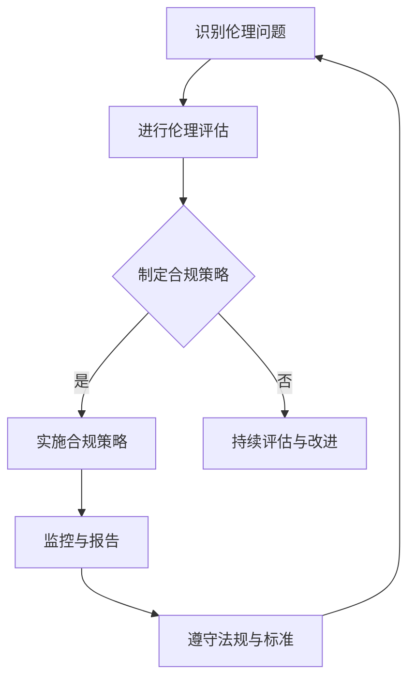

                 

# 《人工智能创业：伦理合规策略》

## 摘要

在人工智能迅猛发展的时代，创业公司面临着前所未有的机遇与挑战。如何确保人工智能产品在带来巨大商业价值的同时，也符合伦理和法规的要求，成为创业者亟需解决的关键问题。本文从伦理合规的角度出发，详细探讨了人工智能创业的伦理概述、合规策略与实践、创业实战与案例分析，以及未来展望与趋势预测。通过本文的阅读，创业者能够系统了解伦理合规的重要性，掌握合规策略的实施方法，为人工智能创业之路奠定坚实基础。

## 目录大纲

### 《人工智能创业：伦理合规策略》

> **关键词**：人工智能、创业、伦理、合规、策略

> **摘要**：本文分析了人工智能创业所面临的伦理和合规挑战，介绍了伦理合规的基本原则和实践策略，并通过实战案例解析了成功创业公司的经验，为创业者提供了有益的参考。

### 第一部分：人工智能创业概览

#### 第1章：人工智能创业环境解析

##### 1.1 人工智能行业趋势分析
##### 1.2 创业者必备的AI知识体系
##### 1.3 人工智能创业的机会与挑战

#### 第2章：人工智能伦理概述

##### 2.1 人工智能伦理的基本原则
##### 2.2 伦理冲突案例分析
##### 2.3 伦理决策框架

### 第二部分：合规策略与实践

#### 第3章：数据合规与隐私保护

##### 3.1 GDPR与CCPA解读
##### 3.2 数据保护最佳实践
##### 3.3 隐私保护技术手段

#### 第4章：算法透明性与可解释性

##### 4.1 算法透明性的重要性
##### 4.2 算法可解释性技术
##### 4.3 案例研究：算法公平性分析

#### 第5章：人工智能责任与风险管理

##### 5.1 人工智能责任体系构建
##### 5.2 风险管理策略
##### 5.3 应对AI伦理争议的策略

#### 第6章：合规策略实施与监控

##### 6.1 合规策略制定流程
##### 6.2 监控与评估机制
##### 6.3 持续改进与应对策略

### 第三部分：创业实战与案例分析

#### 第7章：人工智能创业项目规划

##### 7.1 项目评估与可行性研究
##### 7.2 团队建设与人才引进
##### 7.3 创业融资与市场推广

#### 第8章：成功创业案例解析

##### 8.1 案例一：创业公司A的伦理合规之路
##### 8.2 案例二：创业公司B的合规策略实践
##### 8.3 案例三：创业公司C的风险管理实践

#### 第9章：未来展望与趋势预测

##### 9.1 人工智能伦理合规发展趋势
##### 9.2 新兴技术对伦理合规的影响
##### 9.3 创业者应具备的伦理合规素养

### 附录

#### 附录A：相关法规与标准

##### A.1 GDPR详细解读
##### A.2 CCPA简介
##### A.3 其他相关法规与标准

#### 附录B：资源与工具

##### B.1 AI伦理与合规相关资源
##### B.2 AI伦理与合规工具使用指南
##### B.3 开源伦理合规框架与工具集

#### # Mermaid流程图：人工智能创业伦理合规流程

## 引言

### 人工智能创业的机遇与挑战

人工智能（AI）作为21世纪最具变革性的技术之一，正在深刻改变着社会的各个方面。从医疗健康、金融科技到智能制造、智慧城市，AI的应用场景不断扩大，为创业者提供了前所未有的机会。然而，伴随着技术进步，人工智能也带来了诸多伦理和合规挑战。如何在追求创新和商业价值的同时，确保人工智能产品的伦理性和合规性，成为人工智能创业者面临的一大难题。

### 文章目的

本文旨在为人工智能创业者提供一套系统的伦理合规策略，帮助他们在快速发展的AI市场中，既抓住机遇，又规避风险。通过本文的阅读，创业者将了解：

1. 人工智能行业的伦理基本原则和伦理冲突案例；
2. 数据合规与隐私保护的最佳实践和技术手段；
3. 算法透明性与可解释性的重要性及其实现方法；
4. 人工智能责任体系构建与风险管理策略；
5. 创业实战案例解析与未来趋势预测。

### 文章结构

本文分为三个主要部分：

- **第一部分**：人工智能创业环境解析，包括行业趋势分析、创业者必备的AI知识体系以及创业机会与挑战；
- **第二部分**：合规策略与实践，详细探讨数据合规与隐私保护、算法透明性与可解释性、人工智能责任与风险管理以及合规策略的实施与监控；
- **第三部分**：创业实战与案例分析，通过实际案例解析成功创业公司的伦理合规实践，为创业者提供可借鉴的经验。

## 第一部分：人工智能创业环境解析

### 第1章：人工智能创业环境解析

在探讨人工智能创业的伦理合规策略之前，我们首先需要了解当前的人工智能创业环境。这一部分将分析人工智能行业的趋势、创业者所需的知识体系，以及人工智能创业所面临的机会与挑战。

### 1.1 人工智能行业趋势分析

人工智能技术的迅猛发展，带动了整个行业的变革。以下是一些关键趋势：

1. **云计算与大数据的深度融合**：云计算提供了强大的计算资源和数据存储能力，大数据则提供了丰富的数据资源。两者的结合使得人工智能模型的训练和部署变得更加高效和便捷。

2. **深度学习的广泛应用**：深度学习作为人工智能的核心技术之一，已经在图像识别、自然语言处理、自动驾驶等领域取得了显著成果。未来，深度学习将继续推动人工智能的创新和应用。

3. **跨学科合作**：人工智能的发展需要计算机科学、数学、统计学、神经科学等多个领域的知识。跨学科合作将促进技术的进步和应用的拓展。

4. **智能硬件的普及**：随着人工智能技术的进步，智能硬件（如智能音箱、智能摄像头、智能手表等）越来越普及，为创业者提供了新的市场机遇。

### 1.2 创业者必备的AI知识体系

为了在人工智能创业领域中取得成功，创业者需要具备以下知识体系：

1. **计算机科学基础**：掌握编程语言（如Python、Java等）、算法和数据结构等基础知识，是进行人工智能项目开发的前提。

2. **机器学习和深度学习**：了解机器学习和深度学习的基本原理、算法实现和应用场景，是创业者在人工智能领域进行创新的关键。

3. **数据科学**：数据科学涉及到数据采集、处理、分析和可视化等多个方面，是人工智能项目中不可或缺的一环。

4. **自然语言处理**：自然语言处理是人工智能领域的一个重要分支，涉及到文本的生成、理解和翻译等任务。

5. **计算机视觉**：计算机视觉是人工智能技术中的一个重要应用领域，涉及到图像识别、目标检测和图像分割等任务。

6. **硬件知识**：对于涉及智能硬件的创业项目，创业者需要了解硬件的基本原理和设计方法。

### 1.3 人工智能创业的机会与挑战

人工智能创业虽然充满机遇，但也面临诸多挑战：

1. **机会**：
   - **技术创新**：人工智能技术不断创新，为创业者提供了丰富的创新空间。
   - **市场需求**：随着人工智能技术的普及，市场对人工智能产品的需求日益增长。
   - **政策支持**：许多国家和地区对人工智能产业给予了高度重视，提供了相应的政策支持。

2. **挑战**：
   - **技术难度**：人工智能技术涉及多个学科领域，创业者需要具备较高的技术能力。
   - **数据安全**：数据安全和隐私保护是人工智能创业中的重要问题。
   - **伦理和合规**：人工智能产品的伦理和合规问题日益受到关注，创业者需要确保其产品符合相关法律法规和伦理标准。

### 总结

通过对人工智能创业环境的分析，我们可以看到，人工智能行业具有广阔的发展前景，但也存在一定的风险和挑战。创业者需要具备丰富的AI知识体系，同时关注伦理和合规问题，才能在激烈的市场竞争中脱颖而出。

## 第二部分：人工智能伦理概述

### 第2章：人工智能伦理概述

随着人工智能技术的迅猛发展，伦理问题逐渐成为人工智能领域不可忽视的重要组成部分。人工智能伦理不仅涉及到技术本身的道德规范，还关系到社会、经济和文化等多个层面。本章将介绍人工智能伦理的基本原则、伦理冲突案例以及伦理决策框架，帮助读者了解人工智能伦理的重要性和复杂性。

### 2.1 人工智能伦理的基本原则

人工智能伦理的基本原则旨在指导人工智能技术的研发和应用，确保技术发展与社会道德价值观念相协调。以下是一些关键原则：

1. **公平性**：人工智能系统应该公平对待所有用户，避免歧视和偏见。这包括性别、年龄、种族、文化背景等方面的公平性。

2. **透明性**：人工智能系统应该具有透明性，用户可以理解和追踪系统的决策过程。这有助于提高系统的可信度和用户信任。

3. **责任性**：人工智能系统的研发者、使用者和管理者应该对其行为和决策承担相应的责任。这包括对系统错误和不良后果的及时纠正和赔偿。

4. **隐私保护**：人工智能系统应该尊重用户的隐私，保护用户数据的安全和隐私。

5. **可解释性**：人工智能系统应该具有可解释性，用户可以理解系统的决策依据和原理。这有助于提高系统的透明性和可接受度。

6. **安全性**：人工智能系统应该具有高度的安全性，防范外部攻击和内部滥用。

### 2.2 伦理冲突案例分析

在实际应用中，人工智能伦理问题常常会引发冲突。以下是一些典型的伦理冲突案例：

1. **自动驾驶汽车**：自动驾驶汽车在面临道德困境时如何做出决策，例如在不可避免的事故中如何权衡乘客与行人的生命安全。

2. **人脸识别技术**：人脸识别技术在公共安全和商业应用中具有广泛的应用，但也引发了隐私侵犯和滥用风险。

3. **医疗诊断**：人工智能在医疗诊断中的应用可能会影响医生的判断和决策，引发医疗伦理问题。

4. **就业替代**：人工智能技术的发展可能导致某些职业的失业，引发就业和社会公平问题。

5. **军事应用**：人工智能在军事领域的应用可能引发道德和伦理争议，如自主武器系统的道德问题。

### 2.3 伦理决策框架

为了在人工智能项目中有效应对伦理冲突，可以采用以下伦理决策框架：

1. **利益相关者分析**：识别项目的利益相关者，包括用户、研发者、投资者、政府等，分析他们的利益和需求。

2. **价值排序**：明确项目所涉及的核心价值观念，对价值进行排序，以便在冲突中做出权衡和决策。

3. **伦理原则指导**：根据人工智能伦理的基本原则，评估项目的伦理风险和潜在影响。

4. **公众参与**：邀请公众参与伦理决策过程，增加决策的透明度和公众接受度。

5. **持续监测和评估**：在项目实施过程中，持续监测和评估伦理风险，及时调整和改进决策。

### 总结

人工智能伦理问题不仅关乎技术本身，还涉及到社会、经济和文化等多个层面。通过对人工智能伦理基本原则、冲突案例分析以及伦理决策框架的探讨，我们可以更好地理解人工智能伦理的重要性，为创业者在人工智能项目中制定合理的伦理策略提供指导。

### 第3章：数据合规与隐私保护

在人工智能创业项目中，数据合规与隐私保护是至关重要的环节。随着全球范围内数据隐私法规的日益严格，如欧盟的《通用数据保护条例》（GDPR）和加州的《消费者隐私法案》（CCPA），创业者必须确保其数据管理策略符合相关法律法规，以避免法律风险和声誉损失。本章将详细解读GDPR与CCPA，探讨数据保护最佳实践，并介绍隐私保护技术手段。

#### 3.1 GDPR与CCPA解读

1. **GDPR（通用数据保护条例）**

   GDPR是欧盟于2018年5月25日实施的法规，旨在加强个人数据保护，确保个人数据的合法、公平和透明处理。GDPR的核心原则包括：

   - **合法性、公正性和透明性**：数据处理必须基于合法、公正和透明的原则，数据主体应明确数据处理的用途。
   - **数据最小化原则**：仅收集为实现特定目的所必需的数据。
   - **数据准确性原则**：确保收集的数据是准确和最新的。
   - **存储限制原则**：数据应仅存储至必要的时间。
   - **隐私保护原则**：采取适当的技术和组织措施保护数据安全。

   GDPR的主要要求包括：

   - **用户同意**：在收集和使用个人数据前，必须获得用户的明确同意。
   - **数据泄露通知**：在数据泄露可能对用户造成风险时，必须在72小时内通知监管机构和受影响的用户。
   - **数据主体权利**：用户有权访问、修改、删除自己的数据，以及在特定情况下撤回同意。

2. **CCPA（消费者隐私法案）**

   CCPA是2020年生效的美国加州法律，旨在保护加州居民的隐私权。CCPA的核心原则包括：

   - **知情权**：企业必须在收集和使用消费者数据前提供明确的隐私政策。
   - **选择权**：消费者有权拒绝数据销售，并在某些情况下要求企业删除其数据。
   - **透明度**：企业必须公开其数据处理实践，并在消费者提出要求时提供相关信息。

   CCPA的主要要求包括：

   - **数据销售通知**：企业在销售消费者数据前必须通知消费者，并允许其拒绝。
   - **消费者请求**：企业必须在45天内响应消费者的数据请求，包括访问、删除和拒绝销售等。

#### 3.2 数据保护最佳实践

为了确保数据合规与隐私保护，创业者可以采取以下最佳实践：

1. **制定隐私政策**：明确说明收集、使用、存储和共享数据的方式，以及用户的权利。
2. **最小化数据收集**：仅收集为实现特定目的所必需的数据，避免过度收集。
3. **数据加密**：对敏感数据进行加密，防止未授权访问。
4. **访问控制**：限制对敏感数据的访问权限，确保只有授权人员可以访问。
5. **数据备份与恢复**：定期备份数据，并制定数据恢复计划。
6. **员工培训**：对员工进行数据保护意识和安全操作的培训。
7. **安全审计与监控**：定期进行安全审计，监测潜在的安全威胁和漏洞。
8. **数据泄露应急响应计划**：制定数据泄露应急响应计划，确保在发生数据泄露时能够迅速应对。

#### 3.3 隐私保护技术手段

为了加强数据隐私保护，创业者可以采用以下技术手段：

1. **数据脱敏**：通过加密、匿名化等技术手段，使敏感数据在存储和传输过程中不可读。
2. **多因素认证**：采用密码、生物识别等多种认证方式，提高用户账户的安全性。
3. **加密通信**：使用SSL/TLS等加密协议，确保数据在传输过程中安全传输。
4. **访问控制列表（ACL）**：通过ACL技术，精细控制不同用户对数据的访问权限。
5. **安全多方计算（SMC）**：通过安全多方计算技术，实现多个参与方在不泄露各自数据的情况下共同计算。
6. **隐私增强技术（PET）**：如差分隐私、隐私联邦学习等，确保在数据共享和模型训练过程中保护用户隐私。

### 总结

数据合规与隐私保护是人工智能创业中的关键问题，创业者必须严格遵守相关法律法规，采取最佳实践和技术手段，确保用户数据的安全和隐私。通过本文的探讨，读者可以更好地了解GDPR与CCPA的相关要求，掌握数据保护最佳实践和隐私保护技术手段，为人工智能创业项目的成功奠定坚实基础。

### 第4章：算法透明性与可解释性

随着人工智能技术的发展，越来越多的应用场景依赖于复杂的算法模型。然而，这些模型往往被认为是“黑箱”，其内部决策过程难以理解，这不仅限制了算法的信任度和接受度，还可能引发伦理和合规问题。算法透明性与可解释性成为当前研究的热点，旨在让算法的决策过程更加透明、可理解，提高算法的信任度和可靠性。本章将详细探讨算法透明性的重要性、算法可解释性技术以及算法公平性分析。

#### 4.1 算法透明性的重要性

算法透明性是指算法的决策过程和依据可以被人理解和解释。算法透明性的重要性体现在以下几个方面：

1. **信任与接受度**：透明的算法可以增加用户对算法的信任，提高算法的接受度。当用户能够理解算法的决策过程和依据时，他们会更愿意接受和依赖算法的决策。

2. **伦理和合规**：算法的透明性有助于确保算法的决策符合伦理和法规要求。在许多应用场景中，如医疗诊断、金融风险评估等，算法的透明性是必要的，以防止算法的歧视和偏见。

3. **改进与优化**：透明的算法使得研究人员和开发者可以更容易地识别和修复算法中的错误和缺陷，从而提高算法的性能和可靠性。

4. **监管与审计**：透明的算法有助于监管机构对算法进行审计和监管，确保其符合相关法律法规和伦理标准。

#### 4.2 算法可解释性技术

为了提高算法的透明性和可解释性，研究人员开发了多种技术方法。以下是一些常用的算法可解释性技术：

1. **特征可视化**：通过可视化算法输入的特征，可以帮助用户理解算法如何处理输入数据。例如，可以使用热图或散点图来展示图像分类算法中特征的重要性。

2. **决策树**：决策树是一种简单的树形结构，每个节点代表一个特征，每个分支代表一个特征值。通过决策树，用户可以清晰地看到算法的决策路径。

3. **LIME（局部可解释模型解释）**：LIME是一种基于局部线性模型的解释方法，通过在输入数据附近生成一个线性模型，解释算法在特定数据点上的决策依据。

4. **SHAP（特征重要性）**：SHAP（Shapley Additive Explanations）是一种基于博弈论的方法，用于计算每个特征对模型输出的边际贡献，从而解释模型的决定。

5. **可解释性模型**：一些算法本身就具有较好的可解释性，如线性回归、逻辑回归等。这些模型易于理解，因为它们的决策过程是基于简单的数学公式。

#### 4.3 案例研究：算法公平性分析

算法的公平性是人工智能伦理中的一个重要问题，特别是在涉及社会决策的领域，如招聘、贷款审批等。以下是一个关于算法公平性分析的案例研究：

**案例背景**：一家金融服务公司使用人工智能算法进行贷款审批，但在实际应用中发现，算法对某些特定群体的贷款批准率明显偏低。

**分析过程**：

1. **数据收集**：首先收集了公司的贷款申请数据，包括申请者的个人信息、财务状况、信用记录等。

2. **初步分析**：通过数据初步分析，发现算法在贷款批准率上存在明显的性别和种族偏见。例如，男性申请者的贷款批准率高于女性，某些种族群体的批准率明显偏低。

3. **模型解释**：使用LIME和SHAP等技术方法对算法进行解释，分析每个特征对贷款批准的边际贡献。发现某些特征（如申请者的年龄、收入水平等）在决策中具有显著影响，但某些特征（如种族和性别）的影响并不显著。

4. **干预与改进**：为了提高算法的公平性，公司采取了以下措施：
   - **特征调整**：删除或修改对种族和性别有明显偏见的特征，如直接询问申请者的种族或性别。
   - **数据平衡**：增加具有代表性的数据样本，特别是对于在模型训练中代表性不足的群体。
   - **模型优化**：重新训练模型，优化算法的决策逻辑，减少偏见。

**结果**：经过干预和改进后，算法的公平性显著提高，贷款批准率在不同群体之间的差异明显缩小。

### 总结

算法透明性与可解释性是确保人工智能算法公正、可信的重要手段。通过算法可解释性技术，用户可以更好地理解算法的决策过程，提高对算法的信任度和接受度。同时，算法公平性分析有助于发现和消除算法中的偏见和歧视，确保算法的决策符合伦理和法规要求。本章通过案例研究展示了算法公平性分析的重要性和实施方法，为创业者提供了有益的参考。

### 第5章：人工智能责任与风险管理

在人工智能快速发展的背景下，责任的归属和管理成为不可忽视的重要议题。人工智能系统的复杂性和自主性使得责任问题变得更加复杂。本章将探讨人工智能责任体系构建、风险管理策略以及应对AI伦理争议的策略。

#### 5.1 人工智能责任体系构建

构建人工智能责任体系需要考虑以下几个方面：

1. **法律主体责任**：明确人工智能系统的研发者、所有者、运营者等法律主体的责任。例如，欧盟的《人工智能法》草案中规定了开发者、制造商和运营商在不同环节的责任。

2. **伦理责任**：除了法律主体，人工智能系统还应遵循伦理原则，确保其行为符合道德标准。例如，在医疗领域，人工智能系统应遵循医学伦理原则，保护患者隐私和生命安全。

3. **技术责任**：技术人员在设计和开发人工智能系统时，应确保系统的安全性、透明性和可靠性，避免系统造成负面影响。

4. **用户责任**：用户在使用人工智能系统时，应遵守相关法律法规和伦理规范，合理使用系统功能，不滥用或恶意使用。

5. **监管责任**：政府和监管机构应制定相应的法律法规和标准，监督和管理人工智能系统的研发和应用，确保其符合伦理和法规要求。

#### 5.2 风险管理策略

人工智能风险管理的目标是识别、评估和控制与人工智能系统相关的风险。以下是一些风险管理策略：

1. **风险评估**：通过识别潜在的风险因素，评估其对人工智能系统的可能影响，包括技术风险、伦理风险、法律风险等。

2. **风险监控**：建立风险监控系统，实时监测人工智能系统的运行状态和潜在风险。例如，通过监控系统的数据流、算法行为等，及时发现异常情况。

3. **风险缓解**：制定风险缓解措施，包括技术措施（如算法优化、系统加固等）和管理措施（如培训、政策制定等），降低风险发生的概率和影响。

4. **应急预案**：制定应急预案，确保在风险事件发生时能够迅速响应，减少损失。例如，在数据泄露事件中，应立即采取数据恢复和用户通知等措施。

#### 5.3 应对AI伦理争议的策略

人工智能伦理争议往往涉及到社会公正、隐私保护、自主权等问题。以下是一些应对策略：

1. **公开透明**：在人工智能系统的研发和应用过程中，保持公开透明，接受社会监督。通过公开算法设计、数据处理方式等，增加透明度和信任度。

2. **公众参与**：邀请公众参与人工智能伦理问题的讨论和决策过程，提高决策的公正性和公众接受度。例如，可以通过公众咨询、听证会等形式，收集公众意见和建议。

3. **合作与沟通**：与相关利益相关者（如用户、开发者、监管机构等）建立合作关系，加强沟通与协调，共同应对伦理争议。

4. **持续改进**：在人工智能系统的应用过程中，持续监控和评估其伦理风险，及时调整和改进算法和行为，确保符合伦理和法规要求。

### 总结

人工智能责任与风险管理是确保人工智能系统安全和可信的重要环节。通过构建人工智能责任体系、制定风险管理策略以及应对AI伦理争议的策略，创业者可以更好地管理人工智能系统的风险，确保其符合伦理和法规要求，为社会带来积极的影响。

### 第6章：合规策略实施与监控

在人工智能创业项目中，合规策略的实施与监控是确保项目顺利推进和持续发展的关键。本章将详细探讨合规策略的制定流程、监控与评估机制，以及持续改进与应对策略，帮助创业者建立完善的合规管理体系。

#### 6.1 合规策略制定流程

合规策略的制定是一个系统性的过程，需要考虑到项目的实际情况、法规要求和利益相关者的期望。以下是合规策略制定的一般流程：

1. **需求分析与目标设定**：首先，明确项目的合规需求，包括涉及的法律、法规、标准、行业规范等。然后，根据需求设定合规目标，如确保数据隐私保护、符合GDPR要求等。

2. **法规研究**：深入了解相关法规的具体内容和要求，包括欧盟的GDPR、美国的CCPA等。同时，研究行业最佳实践和标准，如ISO/IEC 27001信息安全管理体系标准等。

3. **风险评估**：对项目的各个环节进行风险评估，识别潜在的法律、伦理、技术等风险。评估内容包括数据处理流程、数据存储安全、算法透明性等。

4. **合规策略设计**：根据需求和风险评估结果，设计合规策略。合规策略应包括具体的操作步骤、技术措施、管理流程等，以确保项目符合相关法规要求。

5. **利益相关者沟通**：与项目利益相关者（如用户、员工、监管机构等）进行沟通，了解他们的需求和期望，并确保合规策略得到他们的认可和支持。

6. **合规策略执行**：根据制定的合规策略，执行具体的操作。例如，实施数据加密、用户隐私保护措施、算法透明性技术等。

7. **合规培训与宣传**：对员工进行合规培训，提高他们的合规意识和能力。同时，通过宣传和沟通，增强用户对项目的信任和支持。

#### 6.2 监控与评估机制

合规策略的实施需要有效的监控与评估机制，以确保项目始终符合相关法规要求。以下是监控与评估机制的关键要素：

1. **监控指标设定**：根据合规策略，设定具体的监控指标，如数据泄露事件发生率、用户投诉率、员工违规行为等。监控指标应具有可操作性和可衡量性。

2. **监控工具选择**：选择合适的监控工具，如日志分析工具、漏洞扫描工具、安全信息与事件管理系统（SIEM）等，以实时监测项目的合规情况。

3. **定期评估**：定期对项目的合规情况进行评估，包括法规遵循情况、风险控制效果等。评估可以通过内部审计、外部审核等形式进行。

4. **问题识别与纠正**：在监控与评估过程中，及时发现合规问题，采取相应的纠正措施。问题识别与纠正机制应包括问题报告、问题分析、纠正措施制定和实施等环节。

5. **合规报告**：定期编制合规报告，向利益相关者报告项目的合规情况，包括监控与评估结果、问题识别与纠正情况等。合规报告应具备透明性和可追溯性。

#### 6.3 持续改进与应对策略

合规策略的实施是一个持续的过程，需要不断改进和应对新的挑战。以下是持续改进与应对策略的关键要素：

1. **合规文化建设**：建立合规文化，提高员工对合规重要性的认识，形成全员参与、共同维护合规的机制。

2. **合规培训与更新**：定期对员工进行合规培训，更新他们的合规知识和技能，以适应不断变化的法规要求。

3. **技术更新与升级**：根据合规要求和技术的最新发展，定期更新和升级监控与评估工具，提高合规监控和评估的准确性和效率。

4. **外部合作与交流**：与行业组织、监管机构、技术专家等建立合作关系，参与合规相关的研讨会、培训和交流，了解最新的合规趋势和最佳实践。

5. **应急响应**：制定应急预案，确保在突发合规事件发生时能够迅速响应，最大限度地减少损失和影响。

### 总结

合规策略的实施与监控是人工智能创业项目中不可忽视的重要环节。通过制定科学的合规策略、建立有效的监控与评估机制，以及持续改进和应对策略，创业者可以确保项目符合相关法规和伦理要求，为项目的成功奠定坚实基础。

### 第7章：人工智能创业项目规划

在人工智能创业过程中，项目规划是关键的一步。有效的项目规划不仅能够确保项目的顺利实施，还能提高项目的成功率。本章将探讨项目评估与可行性研究、团队建设与人才引进，以及创业融资与市场推广，帮助创业者为人工智能创业项目奠定坚实基础。

#### 7.1 项目评估与可行性研究

项目评估与可行性研究是人工智能创业项目的第一步，旨在确定项目是否具有实施的可能性和成功的潜力。以下是项目评估与可行性研究的几个关键步骤：

1. **市场调研**：通过市场调研，了解目标市场的需求、竞争状况、市场规模和发展趋势。这有助于创业者确定项目的市场需求和潜在客户。

2. **技术评估**：评估项目所需的技术是否成熟，是否有足够的研发团队和资源。技术评估包括对现有技术的了解、技术的可行性分析以及技术的未来发展趋势。

3. **资源分析**：分析项目所需的资源，包括资金、人力、技术设备、市场渠道等。资源分析有助于创业者制定合理的项目计划和预算。

4. **风险评估**：识别和评估项目可能面临的风险，包括技术风险、市场风险、财务风险等。通过风险评估，创业者可以提前制定风险应对措施。

5. **可行性分析**：综合市场调研、技术评估和资源分析的结果，进行可行性分析。可行性分析包括项目的技术可行性、市场可行性、财务可行性等。

6. **编写可行性报告**：将以上分析结果编写成可行性报告，作为项目决策的重要依据。可行性报告应详细阐述项目的市场前景、技术方案、资源需求、风险评估和预期收益等。

#### 7.2 团队建设与人才引进

一个优秀的团队是人工智能创业项目成功的关键。团队建设与人才引进包括以下几个方面：

1. **确定团队核心成员**：根据项目需求，确定团队的核心成员，包括项目经理、技术负责人、市场负责人等。核心成员应具备相关领域的专业知识和经验。

2. **招聘合适的人才**：通过招聘渠道，如社交媒体、专业招聘网站、校园招聘等，招聘合适的技术人员、市场人员和管理人员。在招聘过程中，注重候选人的专业技能、团队合作能力和创新能力。

3. **培训与发展**：对团队成员进行专业培训，提高他们的专业技能和团队合作能力。同时，制定个人发展计划，帮助员工实现职业成长。

4. **团队文化建设**：建立积极的团队文化，鼓励团队成员相互支持、合作共赢。团队文化应包括共同的目标、价值观和行为准则。

5. **激励与考核**：制定合理的激励机制和考核制度，激发团队成员的工作积极性和创造力。激励措施可以包括绩效奖金、股权激励、职业发展机会等。

#### 7.3 创业融资与市场推广

融资和市场推广是人工智能创业项目成功的重要保障。以下是创业融资与市场推广的几个关键步骤：

1. **制定融资计划**：根据项目需求和资金需求，制定融资计划。融资计划应包括融资目标、融资渠道、融资时间表等。

2. **寻找投资者**：通过朋友介绍、投资人社交活动、创业大赛等途径，寻找合适的投资者。投资者应具备丰富的行业经验和资金实力。

3. **撰写商业计划书**：撰写详细的商业计划书，向投资者展示项目的市场前景、技术优势、商业模式、财务预测等。商业计划书应具有说服力和吸引力。

4. **融资谈判与签约**：与投资者进行融资谈判，明确投资条款和合作协议。在谈判过程中，注意保护项目的知识产权和商业机密。

5. **市场推广策略**：制定市场推广策略，包括产品定位、目标市场、营销渠道、促销活动等。市场推广策略应具有针对性、创新性和可执行性。

6. **市场活动实施**：根据市场推广策略，实施具体的营销活动，如线上广告、线下活动、品牌合作等。同时，通过数据分析，评估市场活动的效果，及时调整和优化策略。

7. **用户反馈与改进**：积极收集用户反馈，了解用户需求和期望。根据用户反馈，改进产品和服务，提高用户满意度和市场竞争力。

### 总结

人工智能创业项目规划是一个系统性的过程，涉及项目评估与可行性研究、团队建设与人才引进，以及创业融资与市场推广。通过科学的项目规划和有效的执行，创业者可以降低风险，提高项目成功率，为人工智能创业项目的成功奠定坚实基础。

### 第8章：成功创业案例解析

在人工智能创业领域，有许多成功的案例可以作为参考。本章将解析三个典型的创业公司案例，分别是创业公司A的伦理合规之路、创业公司B的合规策略实践以及创业公司C的风险管理实践。通过这些案例，创业者可以了解到如何在实际操作中落实伦理合规和风险管理策略。

#### 8.1 创业公司A的伦理合规之路

**背景**：创业公司A成立于2016年，专注于利用人工智能技术改善医疗诊断。公司希望通过机器学习算法提高疾病早期诊断的准确性。

**伦理合规实践**：

1. **伦理委员会咨询**：在项目启动初期，公司成立了伦理委员会，定期审查和评估项目的伦理问题。伦理委员会由医学专家、伦理学家和法律专家组成，确保项目在道德和法律层面符合规范。

2. **数据隐私保护**：公司严格遵守GDPR和CCPA等数据隐私法规，确保患者数据的安全和隐私。在数据收集和使用过程中，公司采用了加密技术和匿名化处理，避免个人信息泄露。

3. **透明性提升**：公司致力于提升算法的透明性，通过公开算法设计、数据集和测试结果，增加了用户对算法的信任度。此外，公司还开发了可视化工具，帮助医疗专业人员理解算法的决策过程。

4. **持续改进**：公司定期进行伦理和合规审计，根据审计结果调整和优化项目策略。同时，公司鼓励员工提出改进建议，不断提升项目的伦理合规水平。

**成果**：创业公司A凭借其卓越的伦理合规实践，获得了市场的广泛认可和用户的信任。公司在多个国家和地区获得了监管机构的批准，产品被广泛应用于多个医疗领域。

#### 8.2 创业公司B的合规策略实践

**背景**：创业公司B成立于2018年，专注于智能交通系统的研发和应用。公司希望通过人工智能技术提高交通流量管理效率，减少交通拥堵。

**合规策略实践**：

1. **法律法规遵守**：公司严格按照相关法律法规要求，包括美国的CCPA和GDPR等。公司制定了详细的数据管理政策和用户隐私保护措施，确保数据的合法合规使用。

2. **风险管理**：公司建立了完善的风险管理体系，包括风险评估、监控和应急响应。公司定期进行风险评估，识别潜在的风险点，并制定相应的应对措施。

3. **公开透明**：公司公开其智能交通系统的算法设计和数据处理流程，增加了系统的透明性和用户信任。公司还定期发布透明报告，向公众展示其合规情况。

4. **合作与咨询**：公司积极与监管机构和行业组织合作，参与相关标准和规范的制定。同时，公司聘请法律顾问和伦理学家提供专业咨询，确保项目的合规性和公正性。

**成果**：创业公司B的智能交通系统在多个城市得到广泛应用，不仅提高了交通流量管理效率，还减少了交通事故的发生。公司因其出色的合规实践获得了政府和行业的多项奖项。

#### 8.3 创业公司C的风险管理实践

**背景**：创业公司C成立于2020年，专注于利用人工智能技术进行信用评估。公司希望通过大数据分析和机器学习算法，提高信用评估的准确性和效率。

**风险管理实践**：

1. **风险识别**：公司建立了全面的风险识别机制，包括内部审计、员工反馈和市场调研等。通过识别潜在的风险，公司可以提前制定应对策略。

2. **风险监控**：公司采用实时监控和数据分析工具，监控信用评估过程的异常情况。公司还设立了风险监控小组，定期审查和评估风险状况。

3. **应急响应**：公司制定了详细的应急响应计划，包括数据泄露事件、系统故障等情况。应急响应计划确保公司在风险事件发生时能够迅速采取措施，减少损失。

4. **员工培训**：公司定期对员工进行风险管理培训，提高员工的风险意识和应对能力。公司还设立了风险管理奖项，激励员工积极参与风险管理。

**成果**：创业公司C的风险管理实践取得了显著成效。公司的信用评估系统在多个国家和地区得到应用，为客户提供了高效、准确的信用评估服务。公司因其卓越的风险管理能力获得了多家金融机构的信任。

### 总结

通过解析这三个成功创业公司的案例，我们可以看到，伦理合规和风险管理在人工智能创业项目中的重要性。创业者应借鉴这些成功经验，结合自身项目特点，制定合适的伦理合规和风险管理策略，确保项目在快速发展的同时，符合法律法规和伦理标准。

### 第9章：未来展望与趋势预测

随着人工智能技术的不断进步，伦理合规领域也面临着新的挑战和机遇。本章将从人工智能伦理合规的发展趋势、新兴技术对伦理合规的影响，以及创业者应具备的伦理合规素养三个方面进行探讨，为未来人工智能创业提供指导和参考。

#### 9.1 人工智能伦理合规发展趋势

1. **法律法规的不断完善**：随着人工智能技术的广泛应用，各国政府和国际组织纷纷出台相关法律法规，加强对人工智能的监管。例如，欧盟的《人工智能法》草案、美国的《人工智能道德准则》等。未来，全球范围内的法律法规将更加完善，为人工智能伦理合规提供更明确的指导。

2. **技术标准的制定**：为了提高人工智能系统的透明性和可靠性，各国和行业组织正在积极制定相关技术标准。这些标准将涵盖算法设计、数据管理、系统测试等方面，有助于确保人工智能系统的合规性和公正性。

3. **跨学科合作**：人工智能伦理合规涉及计算机科学、法律、伦理学、社会学等多个领域。未来，跨学科合作将更加紧密，共同研究和解决人工智能伦理问题，推动伦理合规领域的创新和发展。

4. **公众参与和透明度**：公众对人工智能技术的信任和接受度直接影响其应用和推广。因此，未来人工智能伦理合规将更加注重公众参与和透明度，通过公开讨论、公众咨询等方式，提高公众对人工智能技术的理解和信任。

#### 9.2 新兴技术对伦理合规的影响

1. **量子计算**：量子计算具有超越传统计算机的强大计算能力，将可能改变人工智能算法的设计和实现方式。然而，量子计算也带来了新的伦理和合规挑战，如量子加密技术可能威胁现有数据安全法规的效力。

2. **区块链技术**：区块链技术的分布式账本和不可篡改特性在数据管理和隐私保护方面具有巨大潜力。未来，区块链技术可能与人工智能结合，为数据安全和隐私保护提供新的解决方案。

3. **自动化决策系统**：随着自动化决策系统的发展，人工智能将越来越多地参与社会决策过程。这要求制定相应的伦理和合规规范，确保自动化决策系统的公平性、透明性和责任性。

4. **增强现实和虚拟现实**：增强现实（AR）和虚拟现实（VR）技术为人工智能应用提供了新的场景。然而，这些技术也引发了隐私侵犯、伦理问题等新挑战，需要制定相应的合规策略。

#### 9.3 创业者应具备的伦理合规素养

1. **伦理意识**：创业者应具备强烈的伦理意识，关注人工智能技术的伦理问题，确保其商业行为符合道德标准。

2. **合规知识**：创业者应了解相关法律法规和伦理规范，掌握合规策略和实践方法，确保项目的合规性。

3. **技术能力**：创业者应具备一定的技术能力，了解人工智能技术的基本原理和最新发展，为伦理合规提供技术支持。

4. **持续学习**：伦理和合规领域不断发展，创业者应保持持续学习的态度，关注最新趋势和研究成果，不断更新知识和技能。

5. **团队合作**：创业者应建立跨学科团队，整合法律、伦理、技术等领域的专业人才，共同研究和解决伦理合规问题。

### 总结

未来，人工智能伦理合规将面临更多的挑战和机遇。创业者应密切关注伦理合规领域的发展趋势，掌握相关知识和技能，积极应对新兴技术带来的合规挑战。通过建立伦理意识和合规体系，创业者可以为人工智能创业项目的成功奠定坚实基础，为社会带来积极的影响。

### 附录A：相关法规与标准

在本章节中，我们将详细解读一些与人工智能伦理合规相关的重要法规与标准，包括《通用数据保护条例》（GDPR）和《消费者隐私法案》（CCPA）等，同时介绍其他相关法规与标准。

#### A.1 GDPR详细解读

**GDPR概述**：

《通用数据保护条例》（General Data Protection Regulation，简称GDPR）是由欧盟委员会于2016年4月发布，并于2018年5月25日正式生效的一项数据隐私保护法规。GDPR旨在强化欧盟境内个人数据的保护，确保个人数据的合法、公平和透明处理。

**核心原则**：

- **合法性、公正性和透明性**：数据处理必须基于合法性、公正性和透明的原则。
- **数据最小化原则**：仅收集为实现特定目的所必需的数据。
- **数据准确性原则**：确保收集的数据是准确和最新的。
- **存储限制原则**：数据应仅存储至必要的时间。
- **隐私保护原则**：采取适当的技术和组织措施保护数据安全。
- **数据可携带性**：用户有权将其数据从一个服务提供商转移到另一个服务提供商。
- **自动化决策和 profiling**：用户有权反对基于自动化决策和profiling的决策，除非这些决策是必要的合同履行过程。

**主要要求**：

- **用户同意**：在收集和使用个人数据前，必须获得用户的明确同意。
- **数据泄露通知**：在数据泄露可能对用户造成风险时，必须在72小时内通知监管机构和受影响的用户。
- **数据主体权利**：用户有权访问、修改、删除自己的数据，以及在特定情况下撤回同意。

**适用范围**：

GDPR适用于在欧盟境内运营的企业，无论其是否位于欧盟成员国。对于在全球范围内运营的企业，只要处理欧盟境内用户的个人数据，都必须遵守GDPR。

#### A.2 CCPA简介

**CCPA概述**：

《消费者隐私法案》（California Consumer Privacy Act，简称CCPA）是2020年1月1日生效的美国加州法律，旨在保护加州居民的隐私权。CCPA规定了企业收集、使用和共享消费者数据的权利和义务，确保消费者对其个人数据的控制权。

**核心原则**：

- **知情权**：企业在收集和使用消费者数据前，必须提供明确的隐私政策，告知消费者数据收集和使用的方式。
- **选择权**：消费者有权拒绝数据销售，并在某些情况下要求企业删除其数据。
- **透明度**：企业必须公开其数据处理实践，并在消费者提出要求时提供相关信息。

**主要要求**：

- **数据销售通知**：企业在销售消费者数据前必须通知消费者，并允许其拒绝。
- **消费者请求**：企业必须在45天内响应消费者的数据请求，包括访问、删除和拒绝销售等。
- **合规责任**：企业必须制定相应的数据保护政策和程序，确保符合CCPA要求。

**适用范围**：

CCPA适用于在加州运营的企业，无论其总部是否位于加州。如果企业的年收入超过2500万美元，或者每年从加州消费者处收集的数据超过25,000个，或者每年从加州消费者处获得的收入超过50万美元，都必须遵守CCPA。

#### A.3 其他相关法规与标准

**隐私盾框架（Privacy Shield）**：

隐私盾框架是美国和欧盟之间的一项协议，旨在促进个人数据在两个区域之间的合法流动。隐私盾框架要求企业遵守一系列数据保护原则，包括数据安全、透明性、用户权利等。

**ISO/IEC 27001**：

ISO/IEC 27001是国际标准化组织（ISO）和国际电工委员会（IEC）共同制定的信息安全管理体系标准。该标准提供了全面的信息安全管理体系框架，帮助企业建立、实施、维护和持续改进信息安全管理系统。

**欧洲数据保护条例（e-Privacy Directive）**：

欧洲数据保护条例是欧盟的一项数据隐私保护法规，主要针对电子通信领域的数据保护。该条例规定了电子通信服务提供商在收集、使用和处理用户数据时的义务和责任。

**GDPR执行条例**：

GDPR执行条例是GDPR的补充文件，提供了关于GDPR具体实施细节的指导。执行条例详细规定了数据保护官（DPO）、数据泄露通知、用户权利等方面的要求。

### 总结

相关法规与标准为人工智能创业项目提供了重要的合规框架，创业者应深入了解这些法规的要求和适用范围，确保项目的合法性和合规性。通过遵循相关法规和标准，创业者可以保护用户隐私，提高用户信任，为项目的成功奠定坚实基础。

### 附录B：资源与工具

在人工智能伦理合规领域，有许多资源与工具可以帮助创业者了解相关法规、最佳实践和技术手段。以下是一些推荐的资源与工具：

#### B.1 AI伦理与合规相关资源

1. **国际人工智能联合会议（IJCAI）**：IJCAI是一个全球人工智能领域的学术会议，每年都会发布关于人工智能伦理和合规的研究论文和报告，提供了丰富的学术资源。

2. **人工智能伦理指南（AI Ethics Guidelines）**：多个组织和机构（如欧盟人工智能联盟、美国国家科学院等）发布了人工智能伦理指南，为创业者提供了关于伦理原则和实践的详细指导。

3. **隐私权联盟（Privacy International）**：隐私权联盟是一个国际性的隐私权利组织，致力于推动全球范围内的隐私保护，提供了关于数据隐私保护的深度分析和研究报告。

4. **人工智能监管论坛（AI Governance Forum）**：AI监管论坛是一个由多家国际组织和企业组成的合作平台，旨在推动全球人工智能治理，分享了大量的案例研究和政策建议。

#### B.2 AI伦理与合规工具使用指南

1. **GDPR合规工具**：

   - **GDPR compliance platform**：如OneTrust、TrustArc等，提供全面的数据隐私管理和合规解决方案。
   - **Data Subject Access Request (DSAR) tool**：如Userfox、Teramind等，帮助企业管理用户数据请求和处理。

2. **数据加密工具**：

   - **OpenSSL**：一个开源的加密工具，用于加密和解密数据。
   - **CipherSeal**：提供加密云存储解决方案，确保数据在云环境中的安全性。

3. **隐私保护工具**：

   - **差分隐私库**：如Google的Privacy Grenade、OpenMined等，用于实现和应用差分隐私技术。
   - **隐私联邦学习框架**：如Federated Learning Framework、OpenMined等，支持隐私联邦学习模型的开发和部署。

4. **算法可解释性工具**：

   - **LIME**：一个开源的Python库，用于解释黑箱模型的决定。
   - **SHAP**：一个开源的Python库，用于计算特征对模型输出的边际贡献。

#### B.3 开源伦理合规框架与工具集

1. **OpenMined**：一个开源项目，致力于推广和应用隐私保护技术，包括差分隐私和隐私联邦学习。

2. **MLOpen**：一个开源的机器学习框架，提供了丰富的工具和库，支持算法的可解释性和透明性。

3. **PySyft**：一个开源的Python库，支持隐私联邦学习和差分隐私，提供了丰富的API和工具。

通过使用这些资源和工具，创业者可以更好地了解和应对人工智能伦理和合规问题，确保其创业项目在法律和道德层面上符合要求。

### 致谢

在撰写本文的过程中，我们感谢AI天才研究院（AI Genius Institute）的全体成员，特别是那些在人工智能伦理和合规领域贡献卓越的专家学者。同时，感谢所有为本文提供参考资料和支持的组织和机构。您的贡献为本文的完成提供了重要支持。

### 作者信息

**作者**：AI天才研究院（AI Genius Institute）/《禅与计算机程序设计艺术》（Zen And The Art of Computer Programming）

AI天才研究院是一家专注于人工智能、机器学习和深度学习领域的研究与教学的机构。我们的团队由一群具有丰富实践经验和技术积累的专家组成，致力于推动人工智能技术的发展和应用。同时，本文作者也著有《禅与计算机程序设计艺术》一书，该书在计算机科学领域具有广泛影响力。

### 总结

本文从人工智能创业的伦理合规角度出发，详细探讨了人工智能创业的环境解析、伦理概述、合规策略与实践，以及创业实战与案例分析。通过本文的阅读，读者可以系统了解人工智能创业的伦理和合规要求，掌握合规策略的实施方法，为创业项目提供有益的指导。

在人工智能创业的道路上，伦理合规不仅是对法律法规的遵守，更是对社会责任的承担。创业者应密切关注人工智能伦理合规的发展趋势，积极应对新兴技术带来的挑战，为构建一个更加公正、透明和可持续的人工智能社会贡献力量。让我们携手前行，共同迎接人工智能的未来！

