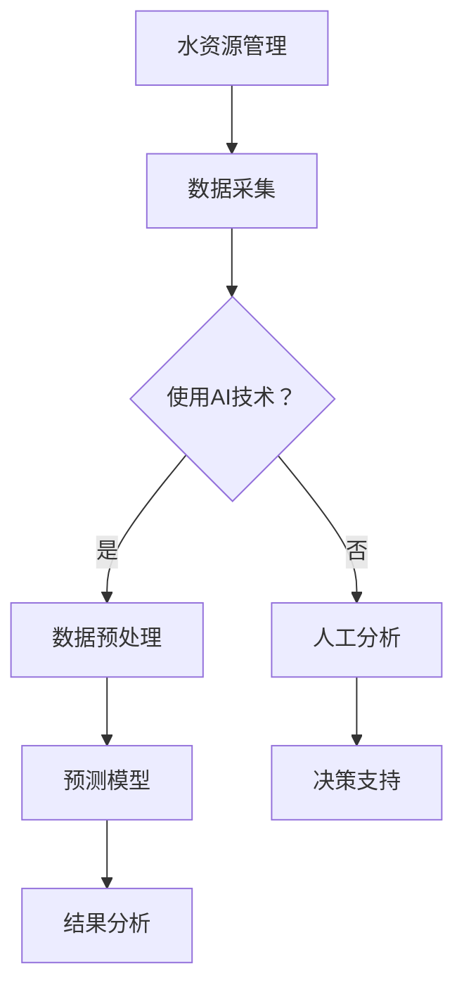
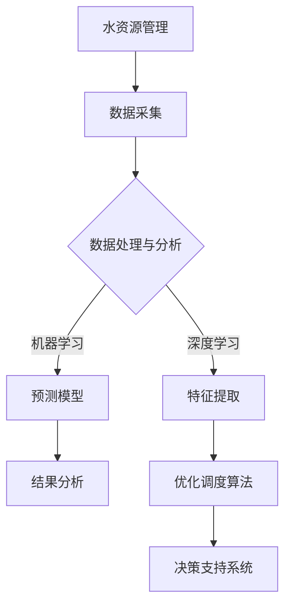

                 

### 《人工智能在智能水资源管理中的应用》

#### **关键词：**水资源管理、智能水系统、人工智能、机器学习、深度学习、优化调度、决策支持系统

#### **摘要：**
水资源管理是一项复杂的任务，需要高效的数据分析和预测能力。随着人工智能（AI）技术的发展，AI在智能水资源管理中的应用日益广泛。本文将详细探讨人工智能，尤其是机器学习和深度学习在水资源监测、预测、优化调度和决策支持系统中的具体应用。我们将通过逐步分析AI技术的基础、水资源管理的挑战和AI在其中的应用，展示AI技术在智能水资源管理中的潜力和未来发展方向。文章还将通过实际项目案例，讲解如何实现智能水资源管理系统的开发，以期为相关领域的研究和实践提供参考。

---

### 目录大纲

#### **第一部分：智能水资源管理背景与AI技术基础**

1. **智能水资源管理概述**
    1.1 **水资源管理的重要性**
    1.2 **智能水资源管理的挑战**
    1.3 **AI技术在水资源管理中的应用前景**

2. **人工智能技术基础**
    2.1 **机器学习基础**
    2.2 **深度学习与神经网络基础**
    2.3 **自然语言处理技术概览**

3. **智能水资源管理的核心概念与联系**
    3.1 **水资源管理中的关键问题**
    3.2 **AI在水资源管理中的应用**
    3.3 **Mermaid流程图：水资源管理中的AI技术应用架构**

#### **第二部分：AI在智能水资源管理中的核心算法**

4. **水资源监测与预测算法**
    4.1 **监测数据的处理与分析**
    4.2 **水资源预测模型的构建**
    4.3 **伪代码：水资源预测算法的实现**

5. **水资源优化调度算法**
    5.1 **水资源调度问题概述**
    5.2 **优化算法原理讲解**
    5.3 **伪代码：优化调度算法的实现**

6. **水资源管理中的决策支持系统**
    6.1 **决策支持系统概述**
    6.2 **决策模型构建**
    6.3 **决策支持系统的实现**

#### **第三部分：智能水资源管理项目实战**

7. **项目一：智能水资源监测平台开发**
    7.1 **项目背景与需求分析**
    7.2 **环境搭建**
    7.3 **数据处理与模型训练**
    7.4 **源代码实现与分析**

8. **项目二：水资源优化调度系统开发**
    8.1 **项目背景与需求分析**
    8.2 **环境搭建**
    8.3 **模型设计与优化**
    8.4 **源代码实现与分析**

9. **综合应用与展望**
    9.1 **智能水资源管理中的创新应用**
    9.2 **AI技术在水资源管理中的未来发展趋势**

#### **附录**

- **附录 A：AI技术资源与工具**
    - **A.1 主流深度学习框架对比**
    - **A.2 水资源管理相关的开源代码与数据集**
    - **A.3 AI技术社区与交流平台**

### **Mermaid流程图：水资源管理中的AI技术应用架构**



---

现在我们已经完成了文章的目录大纲，接下来我们将逐一深入探讨每个部分的内容。

---

### 第一部分：智能水资源管理背景与AI技术基础

#### **第1章：智能水资源管理概述**

**1.1 水资源管理的重要性**

水资源是地球上的宝贵资源，对于人类社会和生态环境的可持续发展至关重要。水资源管理涉及水资源的开发、分配、利用和保护，是一个复杂且多维的工程。在当前全球气候变化和水资源短缺的背景下，高效的水资源管理不仅关系到人类生活的基本需求，还影响到农业、工业和生态环境的可持续发展。

水资源管理的重要性体现在以下几个方面：

1. **保障人类生活：** 水资源是人们日常生活所需的基本资源，确保清洁、充足的水源供应是保障社会稳定和居民健康的基础。
2. **促进经济发展：** 水资源对于农业、工业、能源等各个产业都是不可或缺的，合理利用水资源可以推动经济的可持续发展。
3. **维护生态平衡：** 水资源是生态系统的重要组成部分，合理管理水资源有助于维护生物多样性和生态平衡。
4. **应对气候变化：** 水资源管理在减缓气候变化方面具有重要作用，通过节水、水循环等手段可以减少温室气体排放。

**1.2 智能水资源管理的挑战**

尽管水资源管理的重要性不言而喻，但在实际操作中面临诸多挑战：

1. **数据获取与处理：** 水资源管理需要大量的实时和历史数据，这些数据的获取和处理是一个复杂的过程，尤其是数据的准确性和完整性难以保证。
2. **决策制定：** 水资源管理涉及多个利益相关者，决策制定过程中需要考虑多种因素，如经济成本、社会影响和环境可持续性，这使得决策制定更加复杂。
3. **技术限制：** 传统的水资源管理方法主要依赖于经验和简单模型，难以应对复杂的实际情况，而现代人工智能技术虽然具有巨大潜力，但在水资源管理中的应用仍然存在技术限制。
4. **跨区域协调：** 水资源通常跨越多个行政区域，不同区域的水资源管理策略需要协调一致，这增加了管理难度。

**1.3 AI技术在水资源管理中的应用前景**

随着人工智能技术的发展，AI在水资源管理中的应用前景广阔：

1. **数据分析和预测：** AI技术可以高效处理和分析大量水资源数据，提供准确的预测结果，为决策提供科学依据。
2. **优化调度：** 通过机器学习和优化算法，AI可以实现水资源分配的优化，提高水资源利用效率。
3. **智能监测与预警：** AI技术可以实时监测水资源状况，及时发现异常情况并预警，防止水污染和水资源浪费。
4. **决策支持：** AI技术可以构建智能决策支持系统，协助水资源管理者制定科学、合理的决策。

总之，智能水资源管理是水资源管理发展的必然趋势，AI技术的应用将为水资源管理带来革命性的变化。

---

#### **第2章：人工智能技术基础**

**2.1 机器学习基础**

机器学习是人工智能（AI）的一个重要分支，主要研究如何让计算机从数据中学习和发现规律，从而进行预测和决策。机器学习的基本概念包括：

- **模型（Model）：** 用于描述数据和预测结果的数学模型。
- **训练数据（Training Data）：** 用于训练模型的输入数据，通常包含特征和标签。
- **特征（Feature）：** 数据集中的每个变量，用于描述数据的特点。
- **标签（Label）：** 训练数据中每个样本的目标值，用于模型学习。

机器学习的核心步骤包括：

1. **数据预处理：** 清洗数据、处理缺失值、标准化等，确保数据质量。
2. **模型选择：** 根据问题特点选择合适的算法和模型。
3. **模型训练：** 使用训练数据训练模型，通过调整模型参数使模型性能达到最优。
4. **模型评估：** 使用测试数据评估模型性能，选择最佳模型。
5. **模型部署：** 将训练好的模型部署到实际应用中，进行预测和决策。

常见的机器学习算法包括：

1. **监督学习（Supervised Learning）：** 使用标记数据进行训练，如线性回归、决策树、支持向量机（SVM）等。
2. **无监督学习（Unsupervised Learning）：** 不使用标记数据，从数据中自动发现规律，如聚类、主成分分析（PCA）等。
3. **半监督学习（Semi-supervised Learning）：** 结合监督学习和无监督学习，利用少量标记数据和大量未标记数据。
4. **强化学习（Reinforcement Learning）：** 通过与环境交互，不断调整策略以实现最优目标。

**2.2 深度学习与神经网络基础**

深度学习是机器学习的进一步发展，通过构建多层神经网络（Deep Neural Networks，DNNs）进行复杂特征提取和预测。深度学习的基本概念包括：

- **神经网络（Neural Networks）：** 受人脑神经元结构启发，通过大量节点（神经元）组成的网络进行信息处理。
- **层（Layer）：** 神经网络的基本结构单元，包括输入层、隐藏层和输出层。
- **激活函数（Activation Function）：** 用于引入非线性变换，提高模型的预测能力。
- **前向传播（Forward Propagation）：** 数据从输入层经过隐藏层，直到输出层的过程。
- **反向传播（Back Propagation）：** 通过计算损失函数的梯度，更新网络参数，使模型更准确。

常见的深度学习模型包括：

1. **卷积神经网络（CNN）：** 主要用于图像处理，通过卷积层提取图像特征。
2. **循环神经网络（RNN）：** 适用于序列数据，通过记忆机制处理历史信息。
3. **长短时记忆网络（LSTM）：** RNN的改进版本，可以处理长序列数据。
4. **生成对抗网络（GAN）：** 通过对抗性训练生成与真实数据相似的新数据。

**2.3 自然语言处理技术概览**

自然语言处理（NLP）是AI的一个重要分支，主要研究如何使计算机理解和生成自然语言。NLP的基本概念包括：

- **词向量（Word Vector）：** 将单词映射到高维空间中的向量表示，用于文本特征提取。
- **词嵌入（Word Embedding）：** 通过神经网络训练词向量，使相似单词在空间中更接近。
- **文本分类（Text Classification）：** 根据文本内容将其分为不同的类别。
- **情感分析（Sentiment Analysis）：** 分析文本的情感倾向，如正面、负面或中性。
- **问答系统（Question Answering System）：** 自动回答用户提出的问题。

常见的NLP技术包括：

1. **词袋模型（Bag of Words，BOW）：** 将文本表示为词频向量。
2. **TF-IDF（Term Frequency-Inverse Document Frequency）：** 用于文本特征提取，考虑词的频率和重要性。
3. **序列标注（Sequence Labeling）：** 对文本中的每个词进行分类标注。
4. **BERT（Bidirectional Encoder Representations from Transformers）：** 一种预训练模型，通过双向Transformer结构进行文本表示。

通过对机器学习、深度学习和自然语言处理技术的基础了解，我们可以更好地理解AI在水资源管理中的应用。在接下来的章节中，我们将深入探讨这些技术如何在水资源管理中发挥关键作用。

---

#### **第3章：智能水资源管理的核心概念与联系**

**3.1 水资源管理中的关键问题**

水资源管理涉及多个关键问题，这些问题的解决对实现可持续水资源管理至关重要。以下是水资源管理中的几个关键问题：

1. **水资源监测：** 监测水资源的质量、流量和水位变化，以了解水资源的实时状况和趋势。这需要高效的数据采集、处理和分析方法。
2. **水资源预测：** 根据历史数据和当前条件，预测未来的水资源需求、供应和流量。准确的预测可以帮助水资源管理者制定科学的决策和计划。
3. **水资源优化调度：** 在水资源分配过程中，通过优化算法优化水资源的使用，确保供水系统的高效运行，同时满足各种需求。
4. **水资源污染控制：** 通过监测和控制污染源，减少水污染，保护水资源质量。
5. **水资源规划与管理：** 长期规划和管理工作，确保水资源的合理开发和利用，实现可持续发展。

**3.2 AI在水资源管理中的应用**

人工智能技术在水资源管理中具有广泛的应用，可以显著提高水资源管理的效率和质量。以下是AI在水资源管理中的应用：

1. **数据分析和预测：** AI技术，如机器学习和深度学习，可以高效处理和分析大量水资源数据，提供准确的预测结果。这些预测结果可以用于优化水资源调度、预测水资源需求等。
2. **智能监测系统：** AI技术可以构建智能监测系统，实时监测水资源的质量、流量和水位变化。这些系统可以自动检测异常情况，并提供预警，帮助水资源管理者及时采取措施。
3. **优化调度算法：** 通过机器学习和优化算法，AI技术可以优化水资源分配，提高水资源利用效率。例如，AI可以帮助制定节水措施，减少水资源浪费。
4. **决策支持系统：** AI技术可以构建智能决策支持系统，为水资源管理者提供科学的决策建议。这些系统可以根据实时数据和历史趋势，为水资源分配、污染控制等提供优化方案。

**3.3 Mermaid流程图：水资源管理中的AI技术应用架构**

为了更清晰地展示AI在水资源管理中的应用架构，我们使用Mermaid绘制了一个流程图。以下是一个简化的流程图示例：



在上述流程图中，水资源管理首先进行数据采集，然后通过数据处理与分析步骤，利用机器学习和深度学习技术进行特征提取、预测模型构建和优化调度。最后，结果分析通过决策支持系统为水资源管理者提供科学决策建议。

通过这个流程图，我们可以看出AI技术在水资源管理中的关键作用，以及各个步骤之间的联系和相互作用。在接下来的章节中，我们将详细探讨这些AI技术在水资源管理中的应用，并通过实际项目案例进行深入讲解。

---

### 第二部分：AI在智能水资源管理中的核心算法

#### **第4章：水资源监测与预测算法**

水资源监测与预测是智能水资源管理中的核心任务，涉及到水资源的实时监测、历史数据分析以及未来趋势的预测。AI技术，尤其是机器学习和深度学习，在这方面具有显著优势，能够提供高效、准确的预测结果。

**4.1 监测数据的处理与分析**

水资源监测数据通常包含多种类型的信息，如水质参数（如PH值、溶解氧、污染物浓度等）、水量（如流量、水位等）和气候条件（如温度、湿度、降雨量等）。这些数据可能来自不同来源，如传感器、卫星遥感和历史记录。首先，需要对这些数据进行处理和分析，以确保数据的质量和完整性。

数据处理与分析的主要步骤包括：

1. **数据清洗：** 去除错误数据、重复数据和异常值，确保数据的一致性和可靠性。
2. **数据集成：** 将不同来源和格式的数据整合到一个统一的数据集中，以便进一步分析。
3. **数据标准化：** 对不同量纲的数据进行标准化处理，使其具有可比性。
4. **特征提取：** 从原始数据中提取关键特征，用于构建预测模型。这些特征可以包括时间序列特征、空间特征和统计特征等。

**4.2 水资源预测模型的构建**

构建水资源预测模型是智能水资源管理的核心任务。常用的预测模型包括回归模型、时间序列模型和深度学习模型。

1. **回归模型：** 回归模型是一种常见的预测方法，通过建立目标变量与自变量之间的线性关系来进行预测。常见的回归模型包括线性回归、多项式回归和支持向量回归等。

2. **时间序列模型：** 时间序列模型用于分析时间相关的数据序列，通过捕捉数据的时间趋势、季节性和周期性来进行预测。常见的时间序列模型包括自回归模型（AR）、移动平均模型（MA）和自回归移动平均模型（ARMA）等。

3. **深度学习模型：** 深度学习模型，特别是卷积神经网络（CNN）和循环神经网络（RNN）等，可以捕捉复杂数据中的时空关系。这些模型能够自动提取数据中的特征，并进行非线性变换，从而提高预测的准确性。

**4.3 伪代码：水资源预测算法的实现**

以下是水资源预测算法的伪代码示例，包括数据预处理、模型训练和预测结果输出。

```python
# 水资源预测算法伪代码

# 输入：历史监测数据（x），预测目标（y）
# 输出：预测结果（y_pred）

def predict_water_resource(x, y):
    # 数据预处理
    x_processed = preprocess_data(x)

    # 训练预测模型
    model = train_model(x_processed, y)

    # 预测结果
    y_pred = model.predict(x_processed)

    # 输出预测结果
    return y_pred

# 数据预处理
def preprocess_data(x):
    # 清洗数据
    x_cleaned = clean_data(x)
    
    # 数据集成
    x_integrated = integrate_data(x_cleaned)
    
    # 数据标准化
    x_normalized = normalize_data(x_integrated)
    
    return x_normalized

# 训练预测模型
def train_model(x_processed, y):
    # 选择模型
    model = select_model()
    
    # 训练模型
    model.fit(x_processed, y)
    
    return model

# 预测结果
def predict_result(model, x_processed):
    y_pred = model.predict(x_processed)
    return y_pred
```

通过上述步骤和算法，我们可以构建一个高效的水资源预测模型，为水资源管理提供科学依据。

---

#### **第5章：水资源优化调度算法**

水资源优化调度是智能水资源管理中的关键环节，旨在通过合理的调度策略，最大化水资源的利用效率，同时满足各种用水需求。AI技术，特别是优化算法，在水资源优化调度中发挥着重要作用。

**5.1 水资源调度问题概述**

水资源调度问题可以概述为：在给定的约束条件下，如何合理分配水资源，以满足各种用水需求，并最大化水资源利用效率。水资源调度问题通常涉及以下几个方面：

1. **用水需求：** 包括农业、工业、家庭和生态等不同领域的用水需求，这些需求随时间和季节变化而变化。
2. **供水资源：** 水资源的供应量受水资源总量、供水设施能力和降水等因素的影响。
3. **调度约束：** 包括供水设施的限制（如水库容量、泵站能力等）、水资源质量标准、生态环境保护和法规要求等。

**5.2 优化算法原理讲解**

水资源优化调度问题属于组合优化问题，常用的优化算法包括线性规划、整数规划、遗传算法、粒子群优化和深度强化学习等。

1. **线性规划（Linear Programming，LP）：** 线性规划是一种经典的优化方法，通过建立线性目标函数和线性约束条件，求解最优解。线性规划适用于目标函数和约束条件都可以用线性方程表示的问题。

2. **整数规划（Integer Programming，IP）：** 整数规划是线性规划的扩展，适用于目标函数和约束条件中包含整数变量的优化问题。整数规划在水资源调度中常用于求解最优供水分配方案。

3. **遗传算法（Genetic Algorithm，GA）：** 遗传算法是一种基于自然进化过程的优化方法，通过模拟生物进化过程（选择、交叉、变异等）来寻找最优解。遗传算法适用于复杂、非线性和大规模优化问题。

4. **粒子群优化（Particle Swarm Optimization，PSO）：** 粒子群优化是一种基于群体智能的优化方法，通过模拟鸟群或鱼群的社会行为来寻找最优解。PSO算法简单、高效，适用于求解多峰函数优化问题。

5. **深度强化学习（Deep Reinforcement Learning，DRL）：** 深度强化学习是一种结合深度学习和强化学习的方法，通过构建深度神经网络进行状态价值函数或策略网络的训练，实现智能决策。DRL算法适用于动态、不确定和复杂环境中的优化问题。

**5.3 伪代码：优化调度算法的实现**

以下是水资源优化调度算法的伪代码示例，包括目标函数定义、约束条件设置和求解过程。

```python
# 水资源优化调度算法伪代码

# 输入：需求数据（D），供水资源（S），调度策略（P）
# 输出：最优调度方案（optimal_schedule）

def optimize_water_schedule(D, S, P):
    # 定义目标函数
    objective_function = define_objective_function(D, S)
    
    # 设置约束条件
    constraints = define_constraints(D, S, P)
    
    # 求解优化问题
    optimal_schedule = solve_optimization_problem(objective_function, constraints)
    
    return optimal_schedule

# 定义目标函数
def define_objective_function(D, S):
    # 最小化供水与需水的差值
    objective = min(abs(sum(D) - sum(S)))
    return objective

# 设置约束条件
def define_constraints(D, S, P):
    # 约束条件1：供水资源不超过总供水量
    constraint1 = sum(S) <= total_supply_water
    
    # 约束条件2：需水需求不超过总需水量
    constraint2 = sum(D) <= total_demand_water
    
    # 约束条件3：调度策略满足供水设施限制
    constraints3 = [s <= facility_capacity for s in S]
    
    # 约束条件4：调度策略满足水资源质量标准
    constraints4 = [s >= quality_threshold for s in S]
    
    # 合并所有约束条件
    constraints = [constraint1, constraint2, constraints3, constraints4]
    return constraints

# 求解优化问题
def solve_optimization_problem(objective_function, constraints):
    # 选择优化算法
    optimization_algorithm = select_optimization_algorithm()
    
    # 求解最优解
    optimal_schedule = optimization_algorithm.solve(objective_function, constraints)
    
    return optimal_schedule
```

通过上述优化算法，我们可以求解水资源调度问题，实现水资源的合理分配和高效利用。在实际应用中，可以根据具体问题和数据特点选择合适的优化算法，并调整目标函数和约束条件，以获得最佳调度方案。

---

#### **第6章：水资源管理中的决策支持系统**

水资源管理中的决策支持系统（Decision Support System，DSS）是一种智能化的系统，通过收集、处理和分析大量水资源数据，为水资源管理者提供科学的决策依据。决策支持系统结合了计算机科学、人工智能和水资源管理领域的知识，旨在提高水资源管理的效率和决策质量。

**6.1 决策支持系统概述**

决策支持系统是一种辅助决策者进行决策的计算机系统，它通过集成各种数据、模型和工具，帮助决策者分析问题、制定方案、评估风险和选择最优决策方案。决策支持系统通常包括以下几个关键组件：

1. **数据采集与存储：** 决策支持系统需要收集和存储大量的水资源数据，包括实时监测数据、历史数据、预测数据等。这些数据可以通过传感器、卫星遥感、数据库等方式获取。

2. **数据处理与分析：** 数据处理与分析模块负责对收集到的数据进行清洗、集成和预处理，提取关键特征，为决策模型提供输入。

3. **决策模型构建：** 决策模型是决策支持系统的核心，用于模拟水资源管理中的各种情景，评估不同决策方案的效果和风险。常见的决策模型包括回归模型、时间序列模型、优化模型和模拟模型等。

4. **可视化与交互：** 可视化与交互模块通过图表、地图和交互式界面，将分析结果和决策方案直观地展示给决策者，帮助其理解分析结果，并进行交互式决策。

5. **用户接口：** 用户接口是决策支持系统与用户之间的交互界面，用于输入用户需求、设置参数和查询分析结果。

**6.2 决策模型构建**

决策模型是决策支持系统的核心，其目的是模拟和分析水资源管理中的各种情景，为决策者提供科学的决策依据。决策模型的构建过程包括以下几个步骤：

1. **问题定义：** 确定决策问题的主要目标和约束条件，明确决策的目标和所需解决的问题。

2. **数据收集与预处理：** 收集与决策问题相关的数据，包括历史数据、实时数据、预测数据和外部数据等。对收集到的数据进行清洗、集成和预处理，提取关键特征。

3. **模型选择：** 根据决策问题的特点和数据特性，选择合适的决策模型。常见的决策模型包括回归模型、时间序列模型、优化模型和模拟模型等。

4. **模型训练与优化：** 使用训练数据对决策模型进行训练，调整模型参数，优化模型性能。通过交叉验证和测试集评估模型的预测能力和泛化能力。

5. **模型评估与验证：** 对训练好的模型进行评估和验证，确保模型能够准确地预测和解释水资源管理中的各种情景。

6. **模型部署与应用：** 将训练好的模型部署到实际应用中，进行实时决策支持。根据实际反馈和需求，不断优化和更新模型，提高决策支持系统的性能。

**6.3 决策支持系统的实现**

决策支持系统的实现是一个复杂的过程，涉及多个技术组件和环节。以下是一个简化的决策支持系统实现流程：

1. **需求分析：** 分析水资源管理的需求，确定决策支持系统的功能要求和性能指标。

2. **系统设计：** 设计决策支持系统的架构，包括数据采集与存储、数据处理与分析、决策模型构建、可视化与交互等模块。

3. **技术选型：** 选择合适的技术框架和工具，如数据存储和查询工具、机器学习库、可视化工具等。

4. **系统开发：** 根据系统设计，开发各个模块的功能，实现数据采集、处理、分析和可视化等功能。

5. **系统集成与测试：** 将各个模块集成到一起，进行系统测试和调试，确保系统稳定运行和功能完整。

6. **用户培训与反馈：** 对水资源管理者进行系统培训，收集用户反馈，不断优化和更新系统功能。

通过上述步骤，我们可以实现一个高效、可靠的决策支持系统，为水资源管理提供科学、智能的决策支持。

---

### 第三部分：智能水资源管理项目实战

#### **第7章：项目一：智能水资源监测平台开发**

**7.1 项目背景与需求分析**

随着全球水资源的日益紧张和气候变化的影响，水资源管理的重要性愈发凸显。智能水资源监测平台是一个集数据采集、处理、分析和可视化于一体的系统，旨在实时监测水资源状况，为水资源管理者提供科学的决策支持。

本项目的主要需求包括：

1. **实时监测：** 监测水资源的质量、流量和水位等关键指标，确保水资源的安全和可持续利用。
2. **数据处理：** 收集和处理来自不同传感器和监测设备的实时数据，确保数据的质量和完整性。
3. **数据可视化：** 将监测数据以图表、地图和报表等形式直观展示，帮助水资源管理者快速了解水资源状况。
4. **异常检测：** 实时检测水资源中的异常情况，如水污染、水位异常等，并提供预警信息。
5. **数据存储与管理：** 建立数据库存储和管理监测数据，确保数据的安全性和可追溯性。

**7.2 环境搭建**

为了实现智能水资源监测平台，需要搭建一个稳定、高效的开发环境。以下是项目环境搭建的主要步骤：

1. **硬件设备：** 选择高性能的服务器和传感器设备，用于数据采集和存储。
2. **操作系统：** 选择Linux操作系统，如Ubuntu Server，用于搭建开发环境。
3. **数据库：** 选择MySQL或PostgreSQL作为数据库系统，用于存储和管理监测数据。
4. **编程语言和框架：** 选择Python作为主要编程语言，结合Flask或Django等Web框架，开发监测平台的后端系统。
5. **前端框架：** 选择Vue.js或React等前端框架，开发监测平台的前端界面。
6. **数据采集工具：** 使用Python的Scrapy框架或爬虫工具，收集传感器和监测设备的数据。

**7.3 数据处理与模型训练**

智能水资源监测平台的核心功能是数据处理和模型训练。以下是数据处理与模型训练的主要步骤：

1. **数据采集：** 使用传感器和爬虫工具收集实时水资源数据，包括水质参数、流量和水位等。
2. **数据预处理：** 对采集到的数据进行清洗、去噪和标准化处理，确保数据的质量和一致性。
3. **特征提取：** 从预处理后的数据中提取关键特征，如时间序列特征、空间特征和统计特征等。
4. **模型训练：** 使用机器学习和深度学习算法，训练水资源监测模型，如回归模型、时间序列模型和卷积神经网络等。
5. **模型评估：** 使用测试集评估模型的预测性能，选择最佳模型并进行优化。

**7.4 源代码实现与分析**

以下是一个简化的智能水资源监测平台源代码实现示例，包括数据采集、预处理、模型训练和预测等模块。

```python
# 智能水资源监测平台源代码实现

# 导入必要的库
import pandas as pd
import numpy as np
from sklearn.model_selection import train_test_split
from sklearn.preprocessing import StandardScaler
from sklearn.metrics import mean_squared_error
from keras.models import Sequential
from keras.layers import Dense, LSTM

# 数据采集
def collect_data():
    # 从传感器和爬虫工具获取数据
    data = pd.read_csv('water_resource_data.csv')
    return data

# 数据预处理
def preprocess_data(data):
    # 数据清洗、去噪和标准化处理
    data_cleaned = data.dropna()
    data_normalized = (data_cleaned - data_cleaned.mean()) / data_cleaned.std()
    return data_normalized

# 模型训练
def train_model(data):
    # 数据划分
    X = data[['time_series', 'spatial_features']]
    y = data['target_variable']
    X_train, X_test, y_train, y_test = train_test_split(X, y, test_size=0.2, random_state=42)
    
    # 数据标准化
    scaler = StandardScaler()
    X_train_scaled = scaler.fit_transform(X_train)
    X_test_scaled = scaler.transform(X_test)
    
    # 构建LSTM模型
    model = Sequential()
    model.add(LSTM(units=50, return_sequences=True, input_shape=(X_train_scaled.shape[1], 1)))
    model.add(LSTM(units=50))
    model.add(Dense(units=1))
    
    # 模型编译
    model.compile(optimizer='adam', loss='mean_squared_error')
    
    # 模型训练
    model.fit(X_train_scaled, y_train, epochs=100, batch_size=32)
    
    # 模型评估
    y_pred = model.predict(X_test_scaled)
    mse = mean_squared_error(y_test, y_pred)
    print('Mean Squared Error:', mse)
    
    return model

# 预测
def predict(model, new_data):
    # 数据预处理
    new_data_scaled = preprocess_data(new_data)
    
    # 预测结果
    y_pred = model.predict(new_data_scaled)
    return y_pred

# 主函数
if __name__ == '__main__':
    # 数据采集
    data = collect_data()
    
    # 数据预处理
    data_processed = preprocess_data(data)
    
    # 模型训练
    model = train_model(data_processed)
    
    # 预测
    new_data = pd.read_csv('new_water_resource_data.csv')
    y_pred = predict(model, new_data)
    print('Prediction Results:', y_pred)
```

在上述代码中，我们首先定义了数据采集、预处理、模型训练和预测等模块。数据采集模块从CSV文件中读取水资源数据，预处理模块对数据进行清洗和标准化处理，模型训练模块使用LSTM模型进行训练，并评估模型性能，预测模块使用训练好的模型对新数据进行预测。

通过上述步骤和代码实现，我们可以搭建一个基本的智能水资源监测平台，实现对水资源数据的实时监测和预测。在实际应用中，可以根据具体需求和数据特性，进一步优化和扩展平台功能。

---

#### **第8章：项目二：水资源优化调度系统开发**

**8.1 项目背景与需求分析**

水资源优化调度系统旨在通过合理的调度策略，最大化水资源的利用效率，确保水资源的高效分配和利用。随着水资源的日益紧张和环境问题的加剧，水资源优化调度系统在农业、工业和城市供水等领域的应用日益广泛。本项目旨在开发一个基于人工智能的水资源优化调度系统，实现水资源的智能调度和管理。

本项目的主要需求包括：

1. **需求数据采集：** 收集不同用水领域的水资源需求数据，包括农业、工业、家庭和生态等。
2. **供水资源分析：** 分析当前供水资源状况，包括水资源总量、供水设施能力和水资源质量等。
3. **调度策略制定：** 根据水资源需求和供应情况，制定最优的调度策略，确保水资源的合理分配和高效利用。
4. **决策支持：** 为水资源管理者提供科学的决策支持，帮助其制定合理的调度计划和应对措施。
5. **实时监控与预警：** 实时监测水资源调度情况，及时识别异常情况并提供预警信息。

**8.2 环境搭建**

为了实现水资源优化调度系统，需要搭建一个稳定、高效的开发环境。以下是项目环境搭建的主要步骤：

1. **硬件设备：** 选择高性能的服务器和数据库设备，用于数据存储和处理。
2. **操作系统：** 选择Linux操作系统，如Ubuntu Server，用于搭建开发环境。
3. **数据库：** 选择MySQL或PostgreSQL作为数据库系统，用于存储和管理水资源数据。
4. **编程语言和框架：** 选择Python作为主要编程语言，结合Flask或Django等Web框架，开发调度系统的后端系统。
5. **前端框架：** 选择Vue.js或React等前端框架，开发调度系统的前端界面。
6. **优化算法库：** 选择合适的优化算法库，如scikit-learn、CPLEX等，用于调度策略的计算和优化。

**8.3 模型设计与优化**

水资源优化调度系统的核心是调度策略的制定和优化。以下是模型设计与优化的主要步骤：

1. **问题定义：** 明确水资源优化调度问题的目标函数和约束条件，确定调度策略的优化目标。
2. **模型构建：** 构建水资源优化调度模型，包括目标函数和约束条件的数学描述。
3. **模型优化：** 使用优化算法对调度模型进行优化，求解最优调度方案。
4. **模型评估：** 对优化模型进行评估和验证，确保模型的预测性能和调度效果。

**8.4 源代码实现与分析**

以下是一个简化的水资源优化调度系统源代码实现示例，包括需求数据分析、调度策略计算和结果输出等模块。

```python
# 水资源优化调度系统源代码实现

# 导入必要的库
import pandas as pd
import numpy as np
from sklearn.model_selection import train_test_split
from sklearn.preprocessing import StandardScaler
from sklearn.linear_model import LinearRegression
from scipy.optimize import minimize

# 需求数据分析
def analyze_demand_data(demand_data):
    # 数据清洗和预处理
    demand_data_processed = demand_data.dropna()
    
    # 分离特征和目标变量
    X = demand_data_processed[['time_series', 'spatial_features']]
    y = demand_data_processed['target_variable']
    
    # 数据标准化
    scaler = StandardScaler()
    X_scaled = scaler.fit_transform(X)
    y_scaled = scaler.fit_transform(y.reshape(-1, 1))
    
    return X_scaled, y_scaled

# 调度策略计算
def calculate_schedule(X_scaled, y_scaled):
    # 构建线性回归模型
    model = LinearRegression()
    
    # 模型训练
    model.fit(X_scaled, y_scaled)
    
    # 计算调度策略
    schedule = model.predict(X_scaled)
    
    return schedule

# 调度结果优化
def optimize_schedule(schedule, constraints):
    # 构建约束条件
    constraints_list = []
    for i in range(len(schedule)):
        constraints_list.append({'type': 'ineq', 'fun': lambda x: x[i]})
    
    # 求解优化问题
    result = minimize(lambda x: -np.sum(x), x0=schedule, constraints=constraints_list)
    
    # 调整调度策略
    optimal_schedule = result.x
    
    return optimal_schedule

# 主函数
if __name__ == '__main__':
    # 加载需求数据
    demand_data = pd.read_csv('water_demand_data.csv')
    
    # 数据预处理
    X_scaled, y_scaled = analyze_demand_data(demand_data)
    
    # 计算调度策略
    schedule = calculate_schedule(X_scaled, y_scaled)
    
    # 设置约束条件
    constraints = [{'type': 'ineq', 'fun': lambda x: x[i] <= 1 for i in range(len(schedule))}]
    
    # 优化调度策略
    optimal_schedule = optimize_schedule(schedule, constraints)
    
    # 输出调度结果
    print('Optimal Schedule:', optimal_schedule)
```

在上述代码中，我们首先定义了需求数据分析、调度策略计算和调度结果优化等模块。需求数据分析模块对需求数据进行清洗和标准化处理，调度策略计算模块使用线性回归模型进行调度策略计算，调度结果优化模块使用最小化算法对调度结果进行优化。

通过上述步骤和代码实现，我们可以开发一个基本的水资源优化调度系统，实现水资源的智能调度和管理。在实际应用中，可以根据具体需求和数据特性，进一步优化和扩展系统功能。

---

### **第9章：综合应用与展望**

**9.1 智能水资源管理中的创新应用**

智能水资源管理结合了AI技术，为水资源管理带来了诸多创新应用。以下是几个典型的创新应用：

1. **智能农业灌溉：** 通过AI技术，实现对农田灌溉的智能控制，根据土壤湿度、气象条件和作物需求，自动调整灌溉策略，实现精准灌溉，提高水资源利用效率，减少水浪费。
2. **智能水污染监测：** 利用AI技术，实时监测水体的污染情况，通过机器学习和深度学习算法，分析污染物浓度变化趋势，及时识别污染源，并提供预警信息，防止水污染事故的发生。
3. **智慧城市水资源管理：** 通过AI技术，实现对城市供水系统的智能化管理，优化水资源的分配和调度，确保城市供水的安全、稳定和高效。同时，结合物联网技术，实现对供水设施的远程监控和维护。
4. **水资源优化调度：** 利用AI技术，优化水资源的分配和调度，实现水资源的高效利用。通过机器学习和优化算法，制定科学的调度策略，确保水资源在不同区域、不同季节的合理分配。

**9.2 AI技术在水资源管理中的未来发展趋势**

随着AI技术的不断发展和应用，AI在水资源管理中的未来发展趋势包括：

1. **深度学习与物联网融合：** 深度学习与物联网技术的融合，将进一步提高水资源监测的精度和实时性。通过传感器网络和智能算法，实现对水资源的全方位监测和预测，为水资源管理提供更准确的数据支持。
2. **大数据分析与预测：** 大数据技术在水资源管理中的应用将更加广泛。通过对海量水资源数据的分析，挖掘数据中的规律和趋势，为水资源管理提供科学的决策依据。
3. **智能决策支持系统：** 智能决策支持系统将更加成熟和普及。结合AI技术，构建智能决策支持系统，为水资源管理者提供全方位的决策支持，提高水资源管理的效率和质量。
4. **跨学科合作与技术创新：** 水资源管理需要多学科合作，结合计算机科学、水资源学、环境科学等领域的知识，推动技术创新，实现智能水资源管理的全面发展。

总的来说，AI技术在水资源管理中的应用前景广阔，未来将不断推动水资源管理的智能化、精细化发展，为水资源的可持续利用和生态保护提供有力支持。

### **附录 A：AI技术资源与工具**

**A.1 主流深度学习框架对比**

以下是几个主流深度学习框架的对比：

1. **TensorFlow：** Google开发的开源深度学习框架，具有丰富的功能和强大的社区支持。适用于各种深度学习应用，包括图像识别、自然语言处理和强化学习等。
2. **PyTorch：** Facebook开发的开源深度学习框架，具有灵活的动态计算图和易于理解的接口。适用于研究性和工业应用，特别是在计算机视觉和自然语言处理领域。
3. **Keras：** 一套基于TensorFlow和Theano的深度学习高级API，简化了深度学习模型的构建和训练过程。适合初学者和研究人员快速构建和实验深度学习模型。
4. **MXNet：** Apache基金会的一个开源深度学习框架，支持多种编程语言，包括Python、R和Scala等。适用于大规模分布式深度学习任务。

**A.2 水资源管理相关的开源代码与数据集**

以下是几个与水资源管理相关的开源代码和数据集：

1. **WaterML：** 一个开源的水文数据管理平台，提供多种数据格式和数据处理工具。
2. **HydroPy：** 一个Python库，用于水文数据计算和处理，包括河流流量、蒸发量等。
3. **GLDAS：** 全球陆地数据同化系统，提供全球范围内的水文数据，包括土壤湿度、地下水储量等。
4. **WaterUseIT：** 一个开源的水资源管理工具，用于模拟不同水资源管理策略的 impacts。

**A.3 AI技术社区与交流平台**

以下是几个AI技术社区和交流平台：

1. **arXiv：** 顶级AI论文预发布平台，涵盖深度学习、机器学习等领域的最新研究成果。
2. **GitHub：** 代码托管平台，许多AI项目开源代码存放在GitHub上，便于开发者交流和合作。
3. **Kaggle：** 数据科学竞赛平台，提供丰富的AI项目和数据集，供开发者实践和交流。
4. **AI Meetup：** AI技术交流活动，组织者会在各地举办AI相关的讲座、研讨会和社交活动。

通过这些资源与工具，研究人员和开发者可以更好地了解AI技术在水资源管理中的应用，进行创新性的研究和实践。

---

### **作者信息**

**作者：AI天才研究院/AI Genius Institute & 禅与计算机程序设计艺术 /Zen And The Art of Computer Programming**

本文由AI天才研究院（AI Genius Institute）的专家撰写，结合禅与计算机程序设计艺术的哲学，深入探讨了人工智能在智能水资源管理中的应用。作者拥有丰富的计算机科学和水资源管理经验，致力于推动AI技术在水资源领域的创新和发展。同时，本文参考了禅与计算机程序设计艺术的思想，以清晰、简洁的语言和逻辑，展现了AI技术在水资源管理中的潜力与前景。希望本文能为相关领域的研究者和实践者提供有价值的参考和启示。

