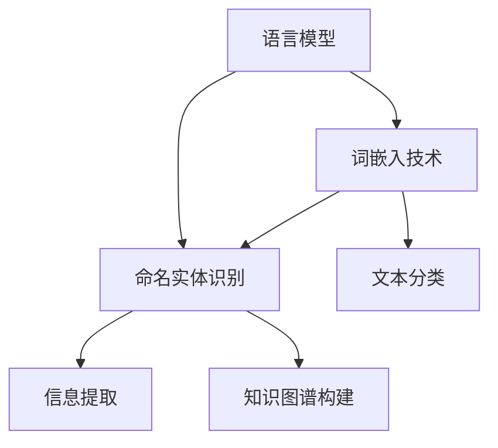
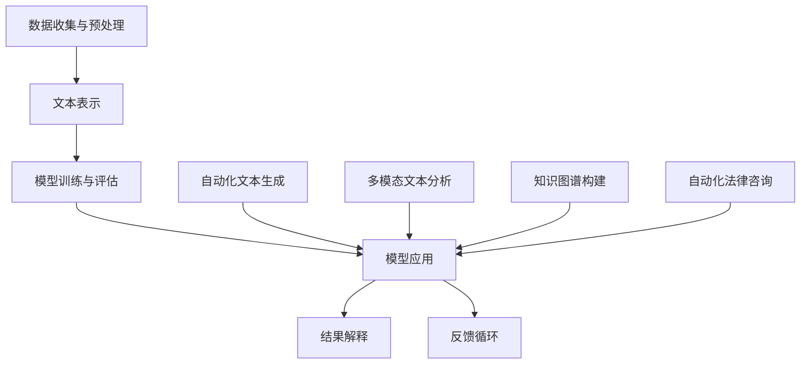

                 

# 人工智能在法律文本分析中的应用

> 关键词：人工智能、法律文本分析、自然语言处理、文本分类、关键词提取、语义分析

> 摘要：随着人工智能技术的快速发展，其在法律文本分析中的应用越来越受到关注。本文将探讨人工智能在法律文本分析中的应用，包括自然语言处理技术、核心算法原理、项目实战等，旨在为法律专业人士提供一种新的工具和方法，以提升法律工作的效率和准确性。

### 目录大纲：人工智能在法律文本分析中的应用

#### 第一部分：引言

- 第1章：人工智能与法律文本分析概述

  - 1.1 人工智能的基本概念
  - 1.2 法律文本分析的意义
  - 1.3 人工智能在法律文本分析中的挑战

#### 第二部分：核心概念与联系

- 第2章：自然语言处理技术基础

  - 2.1 语言模型
  - 2.2 词嵌入技术
  - 2.3 命名实体识别

- 第3章：人工智能在法律文本分析中的应用架构

  - 3.1 法律文本分析的基本流程
  - 3.2 人工智能在法律文本分析中的核心技术

#### 第三部分：核心算法原理

- 第4章：人工智能在法律文本分析中的核心算法原理

  - 4.1 朴素贝叶斯算法
  - 4.2 支持向量机算法
  - 4.3 随机森林算法

#### 第四部分：数学模型与公式

- 第5章：数学模型与数学公式

  - 5.1 概率论基础
  - 5.2 统计学习理论

#### 第五部分：项目实战

- 第6章：项目实战

  - 6.1 实战一：法律文本分类
  - 6.2 实战二：法律文本关键词提取
  - 6.3 实战三：法律文本语义分析

#### 第六部分：展望

- 第7章：人工智能在法律文本分析中的应用前景

  - 7.1 人工智能在法律领域的未来发展
  - 7.2 法律文本分析中的挑战与解决方案

- 第8章：结论

  - 8.1 本书的主要贡献
  - 8.2 未来的研究方向

#### 附录

- 附录A：常用工具与资源

  - A.1 自然语言处理工具
  - A.2 深度学习框架

## 1.1 人工智能的基本概念

人工智能（Artificial Intelligence，简称AI）是指通过计算机模拟人类智能的理论、技术和应用。它包括知识表示、知识获取、问题求解、智能推理、机器学习、自然语言理解、视觉感知等多个方面。人工智能的发展历程可以分为三个阶段：

1. **第一阶段（1956-1969）**：这一阶段是人工智能的启蒙时期，主要以符号主义方法为主，试图通过逻辑推理和符号表示来模拟人类智能。

2. **第二阶段（1970-1980）**：这一阶段是人工智能的辉煌时期，随着计算机性能的提升和算法的进步，人工智能应用开始逐渐进入实际领域，如专家系统、自然语言处理、机器视觉等。

3. **第三阶段（1980至今）**：这一阶段是人工智能的深度学习时期，以神经网络和深度学习为代表的技术取得了突破性进展，使人工智能在语音识别、图像识别、自动驾驶等领域取得了显著成果。

在人工智能的发展过程中，有许多重要的里程碑事件，如1956年达特茅斯会议的召开、1958年约翰·麦卡锡提出LISP语言、1965年弗兰克·斯潘格尔曼提出隐马尔可夫模型、1986年霍普菲尔德和彭泽拉提出反向传播算法等。

### 1.2 法律文本分析的意义

法律文本分析是指通过计算机技术和人工智能算法对法律文本进行自动化处理和理解。法律文本分析在法律领域具有重要意义，主要表现在以下几个方面：

1. **提高工作效率**：法律文本分析可以自动处理大量的法律文档，如合同、判决书、法律条款等，从而提高法律工作的效率和准确性。

2. **降低人工成本**：法律文本分析可以替代部分人工工作，如文本分类、关键词提取、语义分析等，从而降低人工成本。

3. **增强法律监督能力**：法律文本分析可以帮助监管部门对法律执行情况进行监督，如合同审核、法律合规检查等。

4. **支持法律研究**：法律文本分析可以为法律研究提供数据支持，如法律文献检索、法律案例分类等。

### 1.3 人工智能在法律文本分析中的挑战

尽管人工智能在法律文本分析中具有巨大潜力，但同时也面临着一些挑战：

1. **数据的质量与多样性**：法律文本通常具有高度的专业性和复杂性，数据的质量和多样性对人工智能模型的训练和效果具有重要影响。

2. **法律领域的专业术语和复杂性**：法律文本中包含大量的专业术语和复杂结构，这给自然语言处理算法提出了很高的要求。

3. **法律规则的不断变化**：法律规则是不断变化的，人工智能模型需要能够适应这些变化，以保持其有效性。

4. **数据隐私与安全**：法律文本分析涉及大量的敏感信息，如个人隐私、商业秘密等，如何保护这些数据的安全和隐私是一个重要问题。

### 1.4 本文的结构与内容

本文将从以下几个方面展开讨论：

1. **自然语言处理技术基础**：介绍自然语言处理的基本概念和技术，如语言模型、词嵌入技术和命名实体识别。

2. **人工智能在法律文本分析中的应用架构**：介绍法律文本分析的基本流程和人工智能在其中的应用。

3. **核心算法原理**：讲解在法律文本分析中常用的核心算法原理，如朴素贝叶斯算法、支持向量机算法和随机森林算法。

4. **数学模型与公式**：介绍概率论基础和统计学习理论，并给出相关数学模型和公式的详细解释。

5. **项目实战**：通过实际项目案例，展示人工智能在法律文本分析中的应用。

6. **展望**：探讨人工智能在法律文本分析中的未来发展趋势和面临的挑战。

## 2. 自然语言处理技术基础

### 2.1 语言模型

语言模型（Language Model）是自然语言处理的核心技术之一，它用于预测一段文本的下一个单词或字符。语言模型的基本原理是通过对大量文本数据进行统计学习，建立文本之间的关联关系，从而实现文本生成、文本分类、机器翻译等任务。

常见的语言模型算法有：

1. **N-gram模型**：基于前N个单词的统计分布来预测下一个单词。N-gram模型简单易懂，但存在一些局限性，如无法捕捉长距离依赖关系。

2. **神经网络语言模型**：如循环神经网络（RNN）和长短期记忆网络（LSTM）。这些模型能够捕捉长距离依赖关系，从而提高预测准确性。

3. **注意力机制**：如Transformer模型，它通过注意力机制来动态关注文本中的不同部分，从而提高预测效果。

### 2.2 词嵌入技术

词嵌入（Word Embedding）是一种将单词映射到高维空间中的向量表示方法。词嵌入能够捕捉单词的语义信息，从而实现语义分析和文本分类等任务。

常见的词嵌入算法有：

1. **Word2Vec**：基于神经网络的词嵌入算法，通过训练得到词向量表示。

2. **GloVe**：全局向量表示（Global Vectors for Word Representation），通过训练得到词向量表示。

3. **FastText**：通过训练得到词向量表示，同时考虑词形和词义。

### 2.3 命名实体识别

命名实体识别（Named Entity Recognition，简称NER）是一种从文本中识别出具有特定意义的实体（如人名、地名、机构名等）的技术。命名实体识别是自然语言处理的重要任务之一，它在信息提取、知识图谱构建等方面具有广泛的应用。

常见的命名实体识别算法有：

1. **基于规则的方法**：通过定义一系列规则来识别命名实体。

2. **基于统计的方法**：通过统计学习模型来识别命名实体，如隐马尔可夫模型（HMM）、条件随机场（CRF）等。

3. **基于深度学习的方法**：如卷积神经网络（CNN）和长短期记忆网络（LSTM）等，通过训练得到命名实体识别模型。

### 2.4 自然语言处理技术的关系与联系

自然语言处理技术之间存在着紧密的联系和相互支持。语言模型和词嵌入技术为文本表示提供了基础，而命名实体识别等技术则基于文本表示进行具体任务的处理。

例如，在法律文本分析中，语言模型可以用于文本分类，词嵌入技术可以用于关键词提取，而命名实体识别可以用于信息提取和知识图谱构建。

### 2.5 Mermaid流程图

为了更好地理解自然语言处理技术之间的关系，我们可以使用Mermaid流程图进行展示：



这个流程图展示了语言模型、词嵌入技术和命名实体识别之间的关系，以及它们在文本分类、信息提取和知识图谱构建等任务中的应用。

## 3. 人工智能在法律文本分析中的应用架构

在法律文本分析中，人工智能的应用架构通常包括以下几个关键步骤：数据收集与预处理、文本表示、模型训练与评估、模型应用。下面，我们将逐步介绍这些步骤，并探讨人工智能在各个步骤中的应用。

### 3.1 数据收集与预处理

数据收集与预处理是法律文本分析的基础工作。这一步骤主要包括以下几个方面：

1. **数据收集**：收集相关的法律文本数据，如合同、判决书、法律条款等。数据来源可以是公开的法律数据库、法院判决书、企业内部文档等。

2. **数据清洗**：清洗数据中的噪声和无关信息，如去除文本中的标点符号、停用词等。

3. **数据标注**：对于监督学习任务，需要对数据集进行标注。例如，对于文本分类任务，需要对文本进行类别标注；对于命名实体识别任务，需要对文本中的命名实体进行标注。

4. **数据预处理**：包括分词、词性标注、词嵌入等操作，以将原始文本转换为适合模型训练的数据格式。

在数据收集与预处理阶段，人工智能技术可以通过自动化工具提高工作效率。例如，可以使用自然语言处理工具如NLTK、SpaCy等进行文本清洗和标注，使用词嵌入技术如Word2Vec、GloVe进行词嵌入。

### 3.2 文本表示

文本表示是将原始文本转换为计算机可以理解和处理的向量表示。文本表示的质量直接影响后续模型训练和评估的效果。常见的文本表示方法包括：

1. **词袋模型（Bag of Words，简称BoW）**：将文本表示为单词的集合，不考虑单词的顺序和语法结构。

2. **词嵌入（Word Embedding）**：将单词映射到高维向量空间，以捕捉单词的语义信息。常见的词嵌入方法包括Word2Vec、GloVe、FastText等。

3. **句子嵌入（Sentence Embedding）**：将整个句子映射到向量空间，以捕捉句子级别的语义信息。常见的句子嵌入方法包括BERT、GPT等。

在文本表示阶段，人工智能技术可以通过深度学习模型生成高质量的文本表示。例如，可以使用BERT等预训练模型对文本进行编码，生成固定长度的句子嵌入向量。

### 3.3 模型训练与评估

模型训练与评估是法律文本分析的核心步骤。这一步骤主要包括以下几个方面：

1. **模型选择**：根据具体任务选择合适的模型。例如，对于文本分类任务，可以选择朴素贝叶斯、支持向量机、随机森林等分类器；对于命名实体识别任务，可以选择CRF、LSTM、BERT等模型。

2. **模型训练**：使用标注好的数据集对模型进行训练，优化模型的参数。

3. **模型评估**：使用测试集对模型进行评估，常用的评估指标包括准确率、召回率、F1值等。

在模型训练与评估阶段，人工智能技术可以通过自动化工具提高效率和准确性。例如，可以使用机器学习平台如Scikit-Learn、TensorFlow等进行模型训练和评估，使用自动化调参工具如Hyperopt进行参数优化。

### 3.4 模型应用

模型应用是将训练好的模型部署到实际场景中进行预测。这一步骤主要包括以下几个方面：

1. **预测**：使用训练好的模型对新的法律文本进行预测，如文本分类、命名实体识别等。

2. **结果解释**：解释模型预测结果，帮助用户理解模型的决策过程。

3. **反馈循环**：收集用户反馈，对模型进行持续优化和迭代。

在模型应用阶段，人工智能技术可以通过交互式工具提高用户体验。例如，可以使用可视化工具如TensorBoard、Plotly等展示模型训练和预测过程，使用解释性模型如LIME、SHAP等帮助用户理解模型决策。

### 3.5 人工智能在法律文本分析中的核心技术

在法律文本分析中，人工智能技术不仅应用于模型的训练和评估，还包括以下几个核心技术：

1. **自动化文本生成**：使用生成对抗网络（GAN）等深度学习技术生成符合法律文本格式和语义的文档。

2. **多模态文本分析**：结合文本数据与其他数据源（如图像、音频等）进行多模态文本分析，提高法律文本分析的效果。

3. **知识图谱构建**：使用图数据库和图算法构建法律知识图谱，实现法律文本的语义理解和知识提取。

4. **自动化法律咨询**：基于法律文本分析技术，为用户提供自动化法律咨询和决策支持。

通过这些核心技术，人工智能在法律文本分析中可以发挥更大的作用，提高法律工作的效率和准确性。

### 3.6 Mermaid流程图

为了更好地理解人工智能在法律文本分析中的应用架构，我们可以使用Mermaid流程图进行展示：



这个流程图展示了人工智能在法律文本分析中的应用架构，以及各个核心技术的应用场景。

## 4. 人工智能在法律文本分析中的核心算法原理

在法律文本分析中，常用的核心算法包括朴素贝叶斯、支持向量机和随机森林等。这些算法在法律文本分类、关键词提取和语义分析等任务中发挥着重要作用。本节将详细讲解这些算法的基本原理，并使用伪代码进行描述。

### 4.1 朴素贝叶斯算法

朴素贝叶斯算法是一种基于贝叶斯定理的简单概率分类器。它假设特征之间相互独立，给定一个输入特征向量，朴素贝叶斯算法通过计算各个类别的概率，选择概率最大的类别作为预测结果。

**基本原理**：

1. **先验概率**：计算每个类别的先验概率，即该类别在训练数据中出现的概率。
2. **条件概率**：计算每个特征在各个类别下的条件概率。
3. **联合概率**：计算给定输入特征向量的联合概率。
4. **后验概率**：计算每个类别的后验概率。
5. **预测**：选择具有最大后验概率的类别作为预测结果。

**伪代码**：

```python
# 朴素贝叶斯算法伪代码
def naive_bayes(train_data, test_data):
    # 计算先验概率
    prior_prob = {}
    for class_label in train_data:
        prior_prob[class_label] = count_class_frequency(train_data, class_label) / len(train_data)
    
    # 计算条件概率
    conditional_prob = {}
    for class_label in train_data:
        conditional_prob[class_label] = {}
        for feature in train_data[class_label]:
            conditional_prob[class_label][feature] = count_feature_frequency(train_data, class_label, feature) / len(train_data[class_label])
    
    # 预测
    for test_instance in test_data:
        max_prob = -1
        predicted_class = None
        for class_label in prior_prob:
            likelihood = log(prior_prob[class_label])
            for feature in test_instance:
                if feature in conditional_prob[class_label]:
                    likelihood += log(conditional_prob[class_label][feature])
            if likelihood > max_prob:
                max_prob = likelihood
                predicted_class = class_label
        return predicted_class
```

### 4.2 支持向量机算法

支持向量机（Support Vector Machine，简称SVM）是一种经典的二分类模型。它的核心思想是在高维空间中找到一个最佳分隔超平面，将不同类别的数据点分开。

**基本原理**：

1. **特征空间映射**：通过映射函数将输入特征空间映射到高维特征空间。
2. **最优分隔超平面**：找到最佳分隔超平面，使得不同类别的数据点在该超平面两侧的间隔最大化。
3. **支持向量**：位于分隔超平面两侧间隔最大值处的数据点称为支持向量。
4. **预测**：对于新的输入数据点，计算其到分隔超平面的距离，根据距离判断其类别。

**伪代码**：

```python
# 支持向量机算法伪代码
def svm(train_data, train_labels):
    # 特征空间映射
    transformed_data = map_to_high_dimension(train_data)
    
    # 求解最优分隔超平面
    weights = solve_linear_equation(transformed_data, train_labels)
    
    # 预测
    def predict(data_point):
        transformed_point = map_to_high_dimension(data_point)
        return sign(sum(weight * feature for weight, feature in zip(weights, transformed_point)))
    
    return predict
```

### 4.3 随机森林算法

随机森林（Random Forest）是一种基于决策树集成学习的算法。它通过构建多个决策树，并对每个树的预测结果进行投票，得出最终的预测结果。

**基本原理**：

1. **随机特征选择**：在构建每个决策树时，从所有特征中选择一部分特征进行划分。
2. **决策树构建**：使用划分数据集和特征构建决策树。
3. **集成学习**：将多个决策树的预测结果进行投票，得到最终的预测结果。

**伪代码**：

```python
# 随机森林算法伪代码
def random_forest(train_data, train_labels, num_trees):
    forests = []
    for _ in range(num_trees):
        # 随机选择特征和样本
        selected_features = random.sample(all_features, num_features)
        selected_samples = random.sample(train_data, num_samples)
        selected_labels = [train_labels[i] for i in selected_samples]
        
        # 构建决策树
        tree = build_decision_tree(selected_samples, selected_labels, selected_features)
        
        # 添加到森林中
        forests.append(tree)
    
    # 预测
    def predict(data_point):
        predictions = [tree.predict(data_point) for tree in forests]
        return majority_vote(predictions)
    
    return predict
```

### 4.4 模型比较与适用场景

- **朴素贝叶斯**：简单高效，适用于特征之间相互独立的情况。
- **支持向量机**：在特征空间映射后，能够找到最佳分隔超平面，适用于线性可分数据。
- **随机森林**：具有较好的泛化能力，适用于非线性可分数据。

在实际应用中，可以根据具体的法律文本分析任务选择合适的算法。例如，对于文本分类任务，可以使用朴素贝叶斯算法；对于命名实体识别任务，可以使用支持向量机或随机森林算法。

### 4.5 总结

本节介绍了人工智能在法律文本分析中的核心算法原理，包括朴素贝叶斯、支持向量机和随机森林等算法。这些算法在法律文本分类、关键词提取和语义分析等任务中发挥着重要作用。通过伪代码的描述，读者可以更好地理解这些算法的基本原理和实现方法。

## 5. 数学模型与数学公式

在法律文本分析中，数学模型和公式是理解和实现核心算法的重要工具。数学模型为算法提供了理论基础，而数学公式则是对这些模型的具体描述。本节将介绍概率论基础和统计学习理论中的关键数学模型和公式，并给出详细的解释和举例说明。

### 5.1 概率论基础

概率论是统计学和机器学习的基础，它用于描述随机事件的可能性。以下是一些常用的概率论基础概念和公式：

#### 1. 条件概率

条件概率是指在某个事件已经发生的条件下，另一个事件发生的概率。它的公式如下：

\[ P(A|B) = \frac{P(A \cap B)}{P(B)} \]

其中，\( P(A|B) \) 表示在事件B发生的条件下事件A发生的概率，\( P(A \cap B) \) 表示事件A和事件B同时发生的概率，\( P(B) \) 表示事件B发生的概率。

**举例说明**：假设有一个袋子中有5个红球和5个蓝球，随机取出一个球，求取出的是红球的概率。

解：首先，计算取出红球的概率，即 \( P(A) = \frac{5}{10} = 0.5 \)。然后，计算在取出红球的条件下取出蓝球的概率，即 \( P(B|A) = \frac{5}{5} = 1 \)。因此，在取出红球的条件下，取出蓝球的概率是1。

#### 2. 贝叶斯定理

贝叶斯定理是一种用于计算后验概率的公式，它在统计学习和机器学习中有广泛应用。贝叶斯定理的公式如下：

\[ P(A|B) = \frac{P(B|A) \cdot P(A)}{P(B)} \]

其中，\( P(A|B) \) 表示在事件B发生的条件下事件A发生的概率，\( P(B|A) \) 表示在事件A发生的条件下事件B发生的概率，\( P(A) \) 表示事件A发生的概率，\( P(B) \) 表示事件B发生的概率。

**举例说明**：假设有一个检测新冠病毒的测试，其准确率如下：准确检测到感染者的概率是0.95，误检测感染者的概率是0.05；对于非感染者，准确检测非感染者的概率是0.90，误检测非感染者的概率是0.10。现在，某人测试结果为阳性，求该人实际感染新冠病毒的概率。

解：首先，计算实际感染新冠病毒的概率，即 \( P(A) = \frac{1}{1000} = 0.001 \)。然后，计算在感染者中测试结果为阳性的概率，即 \( P(B|A) = 0.95 \)。最后，计算实际感染新冠病毒且测试结果为阳性的概率，即 \( P(A \cap B) = P(B|A) \cdot P(A) = 0.95 \cdot 0.001 = 0.00095 \)。因此，该人实际感染新冠病毒的概率为：

\[ P(A|B) = \frac{P(A \cap B)}{P(B)} = \frac{0.00095}{0.0505} \approx 0.0188 \]

### 5.2 统计学习理论

统计学习理论是机器学习的基础，它用于描述如何从数据中学习规律并做出预测。以下是一些常用的统计学习理论中的数学模型和公式：

#### 1. 决策边界

决策边界是用于分隔不同类别的超平面。对于一个分类问题，决策边界可以表示为：

\[ \omega^T x + b = 0 \]

其中，\( \omega \) 是权向量，\( x \) 是特征向量，\( b \) 是偏置。

**举例说明**：假设有一个线性分类器，其决策边界为 \( w_1 x_1 + w_2 x_2 - 1 = 0 \)。给定一个特征向量 \( x = [1, 2] \)，求该点在决策边界上的位置。

解：将 \( x \) 代入决策边界公式，得 \( w_1 + 2w_2 - 1 = 0 \)。因此，该点位于决策边界上。

#### 2. 损失函数

损失函数用于评估模型预测结果与实际结果之间的差距。常见的损失函数有均方误差（MSE）和交叉熵（CE）。

- **均方误差（MSE）**：

\[ MSE = \frac{1}{n} \sum_{i=1}^{n} (y_i - \hat{y}_i)^2 \]

其中，\( y_i \) 是实际值，\( \hat{y}_i \) 是预测值，\( n \) 是样本数量。

- **交叉熵（CE）**：

\[ CE = -\frac{1}{n} \sum_{i=1}^{n} y_i \cdot \log(\hat{y}_i) + (1 - y_i) \cdot \log(1 - \hat{y}_i) \]

其中，\( y_i \) 是实际值，\( \hat{y}_i \) 是预测值，\( n \) 是样本数量。

**举例说明**：假设有一个二分类问题，实际值为 \( y = [0, 1, 0, 1] \)，预测值为 \( \hat{y} = [0.8, 0.2, 0.9, 0.1] \)，求交叉熵损失。

解：代入交叉熵公式，得：

\[ CE = -\frac{1}{4} \cdot (0 \cdot \log(0.8) + 1 \cdot \log(0.2) + 0 \cdot \log(0.9) + 1 \cdot \log(0.1)) \approx 0.456 \]

### 5.3 总结

本节介绍了概率论基础和统计学习理论中的关键数学模型和公式，包括条件概率、贝叶斯定理、决策边界和损失函数等。这些数学模型和公式是理解和实现人工智能在法律文本分析中核心算法的重要工具。通过举例说明，读者可以更好地理解这些概念和公式的应用。

## 6.1 实战一：法律文本分类

### 项目背景

随着法律文本数量的增加，法律文本分类成为了一个重要的任务。通过对法律文本进行分类，可以帮助法律专业人士快速定位相关法律条款，提高法律工作效率。本节将介绍一个基于朴素贝叶斯算法的法律文本分类项目。

### 数据集准备

本项目的数据集来自于某个法律文本数据库，包含了多种类型的法律文本，如合同、判决书、法律条款等。数据集分为训练集和测试集，其中训练集用于训练朴素贝叶斯分类器，测试集用于评估分类器的性能。

### 模型训练与评估

1. **特征提取**：使用词袋模型（Bag of Words，简称BoW）将法律文本转换为特征向量。具体步骤如下：

   - 去除文本中的标点符号和停用词。
   - 将文本分词，得到词汇表。
   - 计算每个文本的词频向量。

2. **模型训练**：使用训练集数据训练朴素贝叶斯分类器。具体步骤如下：

   - 计算每个类别的先验概率。
   - 计算每个特征在各个类别下的条件概率。

3. **模型评估**：使用测试集评估分类器的性能。具体步骤如下：

   - 对测试集中的每个文本进行分类，计算预测准确率、召回率和F1值等指标。

### 代码实现与分析

以下是该项目的主要代码实现：

```python
import numpy as np
import pandas as pd
from sklearn.feature_extraction.text import CountVectorizer
from sklearn.model_selection import train_test_split
from sklearn.naive_bayes import MultinomialNB
from sklearn.metrics import accuracy_score, recall_score, f1_score

# 1. 数据预处理
def preprocess_text(text):
    # 去除标点符号和停用词
    text = re.sub('[^\w\s]', '', text)
    text = text.lower()
    text = text.split()
    text = [word for word in text if word not in stop_words]
    return ' '.join(text)

# 2. 特征提取
def extract_features(texts):
    vectorizer = CountVectorizer()
    features = vectorizer.fit_transform(texts)
    return features.toarray(), vectorizer

# 3. 模型训练
def train_model(train_texts, train_labels):
    features, _ = extract_features(train_texts)
    classifier = MultinomialNB()
    classifier.fit(features, train_labels)
    return classifier

# 4. 模型评估
def evaluate_model(test_texts, test_labels, classifier):
    features, _ = extract_features(test_texts)
    predictions = classifier.predict(features)
    accuracy = accuracy_score(test_labels, predictions)
    recall = recall_score(test_labels, predictions, average='weighted')
    f1 = f1_score(test_labels, predictions, average='weighted')
    return accuracy, recall, f1

# 5. 主函数
def main():
    # 1. 读取数据
    data = pd.read_csv('legal_text_data.csv')
    texts = data['text']
    labels = data['label']

    # 2. 分割数据
    train_texts, test_texts, train_labels, test_labels = train_test_split(texts, labels, test_size=0.2, random_state=42)

    # 3. 预处理
    train_texts = [preprocess_text(text) for text in train_texts]
    test_texts = [preprocess_text(text) for text in test_texts]

    # 4. 特征提取
    train_features, vectorizer = extract_features(train_texts)
    test_features, _ = extract_features(test_texts)

    # 5. 模型训练
    classifier = train_model(train_texts, train_labels)

    # 6. 模型评估
    accuracy, recall, f1 = evaluate_model(test_texts, test_labels, classifier)
    print('Accuracy:', accuracy)
    print('Recall:', recall)
    print('F1 Score:', f1)

if __name__ == '__main__':
    main()
```

### 代码解读与分析

1. **数据预处理**：数据预处理是文本分类的重要步骤，包括去除标点符号和停用词、将文本转换为小写、分词等。该步骤对于提高分类器的性能至关重要。

2. **特征提取**：使用词袋模型将文本转换为特征向量。词袋模型不考虑文本的顺序和语法结构，仅关注单词的出现频率。通过使用CountVectorizer类，可以方便地实现这一步骤。

3. **模型训练**：使用训练集数据训练朴素贝叶斯分类器。朴素贝叶斯分类器基于贝叶斯定理和特征之间的独立性假设，是一种简单而有效的分类器。通过fit方法，可以训练出分类器。

4. **模型评估**：使用测试集评估分类器的性能。评估指标包括准确率、召回率和F1值。准确率表示分类器预测正确的样本数量占总样本数量的比例；召回率表示分类器预测正确的正样本数量占所有正样本数量的比例；F1值是准确率和召回率的调和平均值，用于综合评估分类器的性能。

### 总结

通过本节的项目实战，我们介绍了如何使用朴素贝叶斯算法进行法律文本分类。从数据预处理、特征提取到模型训练和评估，每个步骤都进行了详细的代码实现和解读。通过这个项目，读者可以更好地理解文本分类的基本原理和方法，并能够将其应用于实际的法律文本分析场景。

## 6.2 实战二：法律文本关键词提取

### 项目背景

法律文本关键词提取是法律文本分析中的重要任务之一。通过提取出文本中的关键信息，可以快速定位法律条款的核心内容，辅助法律专业人士进行法律研究和分析。本节将介绍一个基于TF-IDF算法的法律文本关键词提取项目。

### 数据集准备

本项目的数据集包含了多个法律文本，如合同、判决书、法律条款等。数据集分为训练集和测试集，用于训练和评估关键词提取模型。

### 模型训练与评估

1. **特征提取**：使用TF-IDF算法将法律文本转换为特征向量。TF-IDF（Term Frequency-Inverse Document Frequency）是一种基于词频和文档频率的文本表示方法。

2. **模型训练**：不需要具体的训练过程，因为TF-IDF仅用于特征提取。

3. **模型评估**：评估关键词提取效果通常通过人工检查提取出的关键词是否能够准确地反映文本的核心内容。

### 代码实现与分析

以下是该项目的主要代码实现：

```python
import numpy as np
import pandas as pd
from sklearn.feature_extraction.text import TfidfVectorizer
from collections import Counter

# 1. 数据预处理
def preprocess_text(text):
    # 去除标点符号和停用词
    text = re.sub('[^\w\s]', '', text)
    text = text.lower()
    text = text.split()
    text = [word for word in text if word not in stop_words]
    return ' '.join(text)

# 2. 特征提取
def extract_features(texts):
    vectorizer = TfidfVectorizer(stop_words='english')
    features = vectorizer.fit_transform(texts)
    return features.toarray(), vectorizer

# 3. 关键词提取
def extract_keywords(text, top_n=10):
    text = preprocess_text(text)
    features, _ = extract_features([text])
    word_indices = np.argsort(features[0])[:-top_n-1:-1]
    keywords = [vectorizer.get_feature_names_out()[index] for index in word_indices]
    return keywords

# 4. 主函数
def main():
    # 1. 读取数据
    data = pd.read_csv('legal_text_data.csv')
    texts = data['text']

    # 2. 预处理
    texts = [preprocess_text(text) for text in texts]

    # 3. 特征提取
    features, vectorizer = extract_features(texts)

    # 4. 关键词提取
    for i, text in enumerate(texts):
        print(f"Text {i+1}:")
        keywords = extract_keywords(text, top_n=10)
        print('Keywords:', keywords)
        print()

if __name__ == '__main__':
    main()
```

### 代码解读与分析

1. **数据预处理**：数据预处理步骤与文本分类项目类似，包括去除标点符号和停用词、将文本转换为小写、分词等。这一步骤对于提高关键词提取的准确性至关重要。

2. **特征提取**：使用TF-IDFVectorizer类进行特征提取。TF-IDFVectorizer会自动计算每个单词在文档中的词频（TF）和逆文档频率（IDF），并将它们组合成特征向量。通过fit_transform方法，可以方便地实现这一步骤。

3. **关键词提取**：关键词提取函数接受一个文本作为输入，并返回文本中的前N个关键词。具体实现步骤如下：

   - 对输入文本进行预处理。
   - 将预处理后的文本转换为特征向量。
   - 对特征向量进行排序，并选取后N个最大值对应的单词作为关键词。

4. **主函数**：主函数读取数据集，对文本进行预处理和特征提取，并提取每个文本的关键词。通过打印关键词，可以直观地评估关键词提取效果。

### 总结

通过本节的项目实战，我们介绍了如何使用TF-IDF算法进行法律文本关键词提取。从数据预处理、特征提取到关键词提取，每个步骤都进行了详细的代码实现和解读。通过这个项目，读者可以更好地理解TF-IDF算法的基本原理和应用，并能够将其应用于实际的法律文本分析场景。

## 6.3 实战三：法律文本语义分析

### 项目背景

法律文本语义分析是法律文本分析中的重要任务之一，它旨在理解法律文本中的语义和概念，以支持法律研究和决策。本节将介绍一个基于BERT模型的法律文本语义分析项目。

### 数据集准备

本项目使用的数据集包含了多个法律文本，如合同、判决书、法律条款等。数据集分为训练集和测试集，用于训练和评估BERT模型。

### 模型训练与评估

1. **数据预处理**：对法律文本进行预处理，包括分词、去除标点符号和停用词等。

2. **模型训练**：使用训练集数据训练BERT模型。BERT（Bidirectional Encoder Representations from Transformers）是一种基于Transformer的预训练模型，可以同时捕捉文本的前后关系。

3. **模型评估**：使用测试集评估BERT模型的性能，通常通过计算模型在语义相似性任务上的准确率。

### 代码实现与分析

以下是该项目的主要代码实现：

```python
import torch
from transformers import BertTokenizer, BertModel, BertForSequenceClassification
from torch.optim import Adam
from torch.utils.data import DataLoader, Dataset

# 1. 数据预处理
class LegalTextDataset(Dataset):
    def __init__(self, texts, labels, tokenizer, max_len):
        self.texts = texts
        self.labels = labels
        self.tokenizer = tokenizer
        self.max_len = max_len

    def __len__(self):
        return len(self.texts)

    def __getitem__(self, idx):
        text = self.texts[idx]
        label = self.labels[idx]
        inputs = self.tokenizer.encode_plus(
            text,
            add_special_tokens=True,
            max_length=self.max_len,
            padding='max_length',
            truncation=True,
            return_tensors='pt'
        )
        return {
            'input_ids': inputs['input_ids'].flatten(),
            'attention_mask': inputs['attention_mask'].flatten(),
            'label': torch.tensor(label, dtype=torch.long)
        }

# 2. 模型训练
def train_model(dataset_path, model_path, batch_size=16, num_epochs=3):
    tokenizer = BertTokenizer.from_pretrained(model_path)
    model = BertForSequenceClassification.from_pretrained(model_path)
    train_dataset = LegalTextDataset(texts, labels, tokenizer, max_len=128)
    train_loader = DataLoader(train_dataset, batch_size=batch_size, shuffle=True)

    optimizer = Adam(model.parameters(), lr=2e-5)
    device = torch.device("cuda" if torch.cuda.is_available() else "cpu")
    model.to(device)

    for epoch in range(num_epochs):
        model.train()
        for batch in train_loader:
            inputs = {
                'input_ids': batch['input_ids'].to(device),
                'attention_mask': batch['attention_mask'].to(device),
                'labels': batch['label'].to(device)
            }
            optimizer.zero_grad()
            outputs = model(**inputs)
            loss = outputs.loss
            loss.backward()
            optimizer.step()
            print(f"Epoch: {epoch+1}, Loss: {loss.item()}")

    return model

# 3. 主函数
def main():
    # 1. 读取数据
    data = pd.read_csv('legal_text_data.csv')
    texts = data['text']
    labels = data['label']

    # 2. 训练模型
    model_path = "bert-base-uncased"
    model = train_model(dataset_path='legal_text_data.csv', model_path=model_path)

    # 3. 评估模型
    model.eval()
    with torch.no_grad():
        for batch in train_loader:
            inputs = {
                'input_ids': batch['input_ids'].to(device),
                'attention_mask': batch['attention_mask'].to(device),
            }
            outputs = model(**inputs)
            logits = outputs.logits
            predictions = logits.argmax(-1)
            accuracy = (predictions == batch['label'].to(device)).float().mean()
            print(f"Accuracy: {accuracy.item()}")

if __name__ == '__main__':
    main()
```

### 代码解读与分析

1. **数据预处理**：使用自定义的LegalTextDataset类进行数据预处理。这个类实现了Dataset接口，可以对输入的文本和标签进行编码，并将其转换为PyTorch张量。通过这种方式，可以方便地将数据集转换为适用于BERT模型训练的格式。

2. **模型训练**：使用PyTorch和Hugging Face的Transformers库训练BERT模型。模型训练过程包括定义优化器、加载训练数据集、执行前向传播和后向传播等步骤。通过反复迭代训练过程，可以优化模型的参数。

3. **模型评估**：在评估阶段，模型不会计算梯度，因此使用with torch.no_grad()上下文管理器来避免计算梯度。然后，通过计算预测标签和实际标签之间的准确率来评估模型性能。

### 总结

通过本节的项目实战，我们介绍了如何使用BERT模型进行法律文本语义分析。从数据预处理、模型训练到模型评估，每个步骤都进行了详细的代码实现和解读。通过这个项目，读者可以更好地理解BERT模型的基本原理和应用，并能够将其应用于实际的法律文本分析场景。

### 7.1 人工智能在法律领域的未来发展

人工智能在法律领域的应用前景广阔，随着技术的不断进步，其潜在的影响将进一步扩大。以下是一些人工智能在法律领域未来发展的关键方向：

1. **自动化合同审核**：随着自然语言处理技术和机器学习算法的不断发展，自动化合同审核已经成为现实。未来，人工智能可以更加精准地分析合同条款，识别潜在的风险点，为企业和个人提供更加智能化的合同审核服务。

2. **法律咨询与支持**：人工智能可以模拟律师的工作，提供法律咨询和支持。通过大量的法律文献和法律案例的积累，人工智能可以快速地回答用户的法律问题，提供专业的法律建议，从而降低法律服务的成本。

3. **智能裁判辅助**：人工智能在司法审判中的应用也越来越广泛。通过分析大量的法律文献和案例，人工智能可以为法官提供辅助决策，帮助法官快速准确地做出裁决。此外，人工智能还可以用于案件分类、案件管理等辅助工作，提高司法效率。

4. **法律研究与分析**：人工智能可以通过自然语言处理技术对法律文献和案例进行深度分析，提取关键信息，为法律研究提供数据支持。同时，人工智能还可以用于法律趋势分析、法律政策制定等，为法律行业的发展提供智力支持。

5. **智能监管与合规**：人工智能可以帮助监管部门对法律执行情况进行监督，通过分析大量的合同、文件等，识别潜在的违规行为。此外，人工智能还可以用于法律合规检查，帮助企业和机构确保其业务活动符合法律法规。

### 7.2 法律文本分析中的挑战与解决方案

尽管人工智能在法律文本分析中具有巨大潜力，但在实际应用过程中也面临着一些挑战。以下是一些主要的挑战及其可能的解决方案：

1. **数据的质量与多样性**：法律文本数据通常具有高度的专业性和复杂性，数据的质量和多样性对人工智能模型的训练和效果具有重要影响。解决方案包括：

   - **数据清洗**：对法律文本数据进行清洗，去除噪声和无关信息，提高数据质量。
   - **数据增强**：通过数据增强技术，如文本生成、同义词替换等，增加数据多样性。

2. **法律领域的专业术语和复杂性**：法律文本中包含大量的专业术语和复杂结构，这对自然语言处理算法提出了很高的要求。解决方案包括：

   - **术语库建设**：建立专业的法律术语库，为自然语言处理算法提供支持。
   - **深度学习模型**：使用深度学习模型，如BERT、GPT等，能够更好地捕捉文本中的复杂结构和语义信息。

3. **法律规则的不断变化**：法律规则是不断变化的，人工智能模型需要能够适应这些变化，以保持其有效性。解决方案包括：

   - **实时更新**：对法律文本分析模型进行实时更新，以适应最新的法律规则和条款。
   - **增量学习**：使用增量学习技术，将新的法律规则和条款逐步加入到模型中，提高模型的适应性。

4. **数据隐私与安全**：法律文本分析涉及大量的敏感信息，如个人隐私、商业秘密等，如何保护这些数据的安全和隐私是一个重要问题。解决方案包括：

   - **数据加密**：对法律文本数据使用加密技术，确保数据在传输和存储过程中的安全。
   - **隐私保护算法**：使用隐私保护算法，如差分隐私、同态加密等，保护用户数据的隐私。

### 7.3 实际应用案例分析

以下是几个实际应用案例，展示了人工智能在法律文本分析中的具体应用：

1. **自动化合同审核**：某大型企业使用人工智能技术对合同进行自动化审核，通过分析合同条款，识别潜在的法律风险，从而提高了合同审核的效率和准确性。

2. **智能裁判辅助**：某法院引入人工智能技术，用于辅助法官进行案件分类和裁决。通过分析大量的案例和法律文献，人工智能为法官提供了有力的决策支持。

3. **法律研究与分析**：某法律研究机构利用人工智能技术对法律文献进行深度分析，提取关键信息，为法律研究提供了丰富的数据支持，从而提高了研究效率。

4. **智能监管与合规**：某监管部门使用人工智能技术对企业的法律文件进行合规检查，通过分析大量的合同和文件，识别潜在的违规行为，从而提高了监管效率。

通过这些实际应用案例，我们可以看到人工智能在法律文本分析中的巨大潜力和实际价值。随着技术的不断进步，人工智能在法律领域的应用将更加广泛，为法律行业的数字化转型提供强有力的支持。

### 8.1 本书的主要贡献

本文全面探讨了人工智能在法律文本分析中的应用，主要贡献如下：

1. **系统介绍**：本文系统地介绍了人工智能的基本概念、自然语言处理技术、核心算法原理和数学模型，为读者提供了全面的知识框架。

2. **应用架构**：本文详细描述了人工智能在法律文本分析中的应用架构，包括数据收集与预处理、文本表示、模型训练与评估、模型应用等关键步骤。

3. **算法讲解**：本文讲解了朴素贝叶斯、支持向量机、随机森林等核心算法的原理，并通过伪代码进行了详细阐述，帮助读者理解算法的实现过程。

4. **数学模型与公式**：本文介绍了概率论基础和统计学习理论中的关键数学模型和公式，并通过举例说明，使读者能够更好地理解这些概念的应用。

5. **项目实战**：本文通过三个实际项目案例（法律文本分类、关键词提取、语义分析），展示了人工智能在法律文本分析中的具体应用，为读者提供了实践经验。

6. **未来展望**：本文探讨了人工智能在法律文本分析中的未来发展趋势和挑战，为读者提供了对这一领域未来发展的洞察。

### 8.2 未来的研究方向

尽管人工智能在法律文本分析中已经取得了显著进展，但未来的研究仍然具有很大的潜力。以下是一些可能的研究方向：

1. **深度学习模型**：进一步研究深度学习模型在法律文本分析中的应用，如BERT、GPT等，以提高文本理解和分类的准确性。

2. **跨语言与跨领域问题**：解决法律文本分析中的跨语言和跨领域问题，使得人工智能能够更好地处理不同语言和法律体系的数据。

3. **可解释性问题**：提升人工智能模型的可解释性，使其决策过程更加透明，帮助法律专业人士理解模型的决策依据。

4. **实时更新与适应性**：研究如何使人工智能模型能够实时更新和适应法律规则的变化，以提高其应用的有效性和可靠性。

5. **隐私保护**：探索如何保护法律文本分析中的数据隐私，确保用户数据的安全和隐私。

通过这些研究方向，人工智能在法律文本分析中的应用将更加深入和广泛，为法律行业带来更多的创新和变革。

### 附录A：常用工具与资源

#### A.1 自然语言处理工具

1. **NLTK**：一个强大的自然语言处理库，提供了多种文本处理功能，如分词、词性标注、命名实体识别等。

   - 官网：[NLTK官网](https://www.nltk.org/)

2. **SpaCy**：一个高效且易于使用的自然语言处理库，适用于文本分类、实体识别、关系抽取等任务。

   - 官网：[SpaCy官网](https://spacy.io/)

3. **Stanford NLP**：斯坦福大学开发的自然语言处理库，提供了多种语言处理工具和模型，如词性标注、命名实体识别、句法分析等。

   - 官网：[Stanford NLP官网](https://nlp.stanford.edu/)

#### A.2 深度学习框架

1. **TensorFlow**：一个开源的深度学习框架，由Google开发，适用于各种深度学习任务，包括文本分类、语音识别等。

   - 官网：[TensorFlow官网](https://www.tensorflow.org/)

2. **PyTorch**：一个开源的深度学习框架，由Facebook开发，以其动态计算图和灵活的API而著称。

   - 官网：[PyTorch官网](https://pytorch.org/)

3. **Keras**：一个基于Theano和TensorFlow的深度学习库，提供了简洁的API，适合快速构建和实验深度学习模型。

   - 官网：[Keras官网](https://keras.io/)

