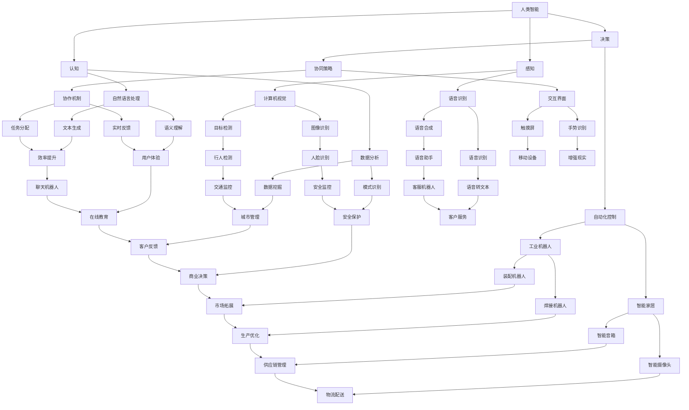
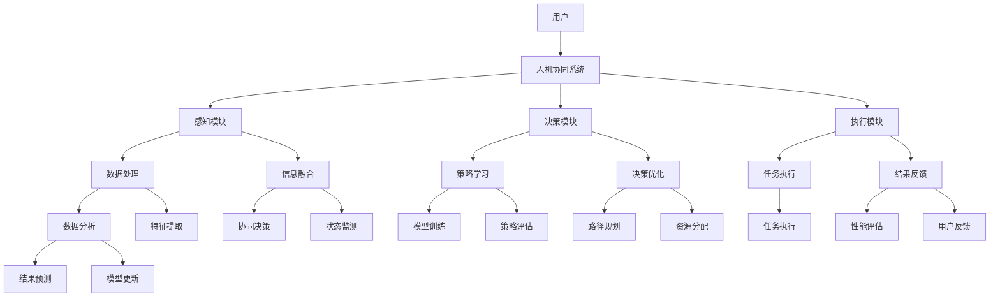

                 

### 第一部分：引言与基础理论

#### 1.1 引入与背景

**1.1.1 智能时代的变革**

随着计算机技术的飞速发展，人类已经进入了一个全新的智能时代。在这个时代，人工智能（Artificial Intelligence, AI）成为了一项颠覆性技术，不仅在科学研究领域取得了重大突破，还在工业、医疗、教育、金融等多个领域展现出了巨大的潜力。人工智能技术的兴起，标志着人类社会正在经历一场前所未有的技术革命。

**1.1.2 人机协同的概念**

人机协同（Human-Machine Collaboration）是指人类和机器在共同的任务中通过有效的交互和协作，实现各自的优势互补，提高工作效率和质量。人机协同的核心理念是利用人工智能技术，将人类的智慧与机器的计算能力相结合，使得人机系统能够共同解决复杂问题。

**1.1.3 人机协同的重要性**

人机协同在智能时代的重要性体现在多个方面：

1. **提升工作效率**：人工智能系统能够处理大量的数据，执行复杂的计算任务，从而减轻人类的工作负担，提高工作效率。

2. **扩展人类能力**：人工智能系统可以帮助人类解决一些无法独立完成的任务，如医疗诊断、天气预报等，从而扩展了人类的能力范围。

3. **创新应用场景**：人机协同为各行各业带来了新的应用场景，如智能制造、智能交通、智能医疗等，推动了产业升级和经济发展。

4. **解决复杂问题**：人机协同可以结合人类的创造力和机器的计算能力，共同解决一些复杂的科学和工程问题，如环境监测、资源优化等。

#### 1.2 人机协同的理论基础

**1.2.1 人类智能与机器智能**

人类智能（Human Intelligence）是指人类在感知、思考、决策和创造等方面的能力。而机器智能（Machine Intelligence）是指由人工智能系统实现的模拟人类智能的能力。人类智能与机器智能具有以下特点：

1. **人类智能**：
   - 具有主观意识和情感。
   - 具有灵活性和适应性。
   - 具有创造性和想象力。
   - 具有复杂的社会和文化背景。

2. **机器智能**：
   - 具有强大的计算能力和数据处理能力。
   - 具有精确和高效的执行能力。
   - 具有稳定性和一致性。
   - 不受情绪和疲劳的影响。

**1.2.2 人机交互的基本原理**

人机交互（Human-Computer Interaction, HCI）是研究人类与计算机系统之间交互的学科。人机交互的基本原理包括：

1. **感知与反馈**：用户通过感官感知计算机系统的输出，并通过反馈系统影响计算机系统的行为。

2. **控制与操作**：用户通过输入设备（如键盘、鼠标等）对计算机系统进行操作和控制。

3. **信息处理**：计算机系统根据用户的输入和系统内部的信息进行处理，生成输出。

4. **适应性**：人机系统应能够根据用户的反馈和系统的运行情况，进行自适应调整，以提供更好的用户体验。

**1.2.3 人机协同的框架体系**

人机协同的框架体系主要包括以下几个方面：

1. **任务分解**：将复杂任务分解为多个子任务，人类和机器分别承担各自擅长的工作。

2. **协同策略**：制定协同策略，明确人类和机器在协同过程中的角色和任务分配。

3. **交互界面**：设计直观、易用的交互界面，确保人类和机器之间的信息流畅传递。

4. **协作机制**：建立有效的协作机制，确保人类和机器能够高效协同完成任务。

5. **评估与反馈**：对协同过程进行评估和反馈，持续优化人机协同系统。

#### 1.3 人机协同的技术发展

**1.3.1 关键技术综述**

人机协同技术的发展涉及多个关键技术的融合和协同，主要包括：

1. **人工智能技术**：包括机器学习、深度学习、自然语言处理等，为机器智能提供了强大的计算能力。

2. **计算机视觉技术**：通过图像识别、目标检测等技术，使计算机能够理解和处理视觉信息。

3. **人机交互技术**：包括语音识别、手势识别、触摸屏等技术，为人机交互提供了多种方式。

4. **大数据技术**：通过大数据技术，收集、存储、处理和分析大量数据，为人机协同提供数据支持。

5. **云计算技术**：通过云计算技术，实现大规模数据存储和计算，为人机协同提供基础设施支持。

**1.3.2 人机协同的发展趋势**

人机协同技术的发展趋势主要包括以下几个方面：

1. **智能化**：人工智能技术将进一步提升机器的智能水平，使其能够更好地理解和执行人类任务。

2. **个性化**：人机协同系统将更加关注用户的个性化需求，提供个性化的服务和体验。

3. **移动化**：随着移动设备的普及，人机协同系统将更多地应用于移动场景。

4. **融合化**：人机协同将与物联网、5G等新技术深度融合，实现更广泛的应用场景。

5. **国际化**：人机协同技术将在全球范围内得到广泛应用，推动国际合作与发展。

**1.3.3 国际合作与竞争态势**

人机协同技术的发展不仅涉及各国科研机构和企业，还涉及到国际间的合作与竞争。目前，各国纷纷加大在人工智能、计算机视觉、人机交互等领域的研发投入，推动人机协同技术的进步。同时，国际竞争也日益激烈，各国在技术、市场、政策等方面展开了全面竞争。

#### 1.4 总结

人机协同作为智能时代的重要发展方向，具有重要的理论意义和实践价值。通过分析人类智能与机器智能的区别和联系，理解人机交互的基本原理和框架体系，我们可以更好地把握人机协同技术的发展趋势和关键挑战。在接下来的章节中，我们将深入探讨人机协同的核心技术原理和应用案例，共同探索人机协同的未来发展之路。

---

**核心概念与联系：人机协同架构的 Mermaid 流程图**



这个 Mermaid 流程图展示了人机协同架构中的各个核心概念和它们之间的联系。通过这些联系，我们可以更好地理解人机协同系统的运作机制，并为后续章节的核心算法原理讲解和项目实战提供基础。

---

**核心算法原理讲解：监督学习算法的伪代码**

```plaintext
// 监督学习算法伪代码
输入：训练数据集 D，特征向量 X，标签 Y
输出：预测函数 f(X)

1. 初始化模型参数 θ
2. 对于每个 epoch：
   a. 对于每个样本 (X[i], Y[i])：
      i. 计算预测值 ŷ[i] = f(X[i], θ)
      ii. 计算损失 L(ŷ[i], Y[i])
      iii. 更新参数 θ = θ - α * ∇θL(ŷ[i], Y[i])
3. 返回训练完成的模型参数 θ

// 预测函数 f(X)
输入：特征向量 X，模型参数 θ
输出：预测值 ŷ

1. 计算 θ^T * X
2. 返回 ŷ = σ(θ^T * X)

// 损失函数 L(ŷ, Y)
输入：预测值 ŷ，真实值 Y
输出：损失值 L

1. 如果 ŷ = Y，则 L = 0
2. 否则，L = -Y * log(ŷ) - (1 - Y) * log(1 - ŷ)
```

上述伪代码展示了监督学习算法的基本原理。在训练过程中，模型通过不断更新参数，最小化损失函数，从而提高预测准确性。预测函数使用 sigmoid 函数将线性组合转化为概率值，而损失函数通常使用对数损失函数（如交叉熵损失函数）来评估模型的预测误差。通过这种方式，监督学习算法可以学习到特征和标签之间的关系，从而实现预测任务。

---

**数学模型和公式：线性回归模型的详细讲解与举例说明**

线性回归模型是一种常见的数据分析工具，用于预测一个连续变量。该模型假设目标变量 \( Y \) 与输入特征 \( X \) 之间存在线性关系。线性回归模型的核心是一个线性函数，其形式如下：

\[ Y = \beta_0 + \beta_1X + \varepsilon \]

其中，\( \beta_0 \) 是截距，\( \beta_1 \) 是斜率，\( X \) 是输入特征，\( Y \) 是目标变量，\( \varepsilon \) 是误差项。

**详细讲解：**

1. **线性关系**：线性回归模型的基本假设是目标变量 \( Y \) 与输入特征 \( X \) 之间存在线性关系。这意味着 \( Y \) 可以表示为 \( X \) 的线性组合加上一个误差项。

2. **参数估计**：为了估计模型参数 \( \beta_0 \) 和 \( \beta_1 \)，我们通常使用最小二乘法。最小二乘法的思想是最小化预测值与实际值之间的误差平方和。

3. **损失函数**：在线性回归中，损失函数（或称为误差函数）通常是误差的平方和。损失函数的形式如下：

\[ J(\theta) = \frac{1}{2m} \sum_{i=1}^{m} (h_\theta(x^{(i)}) - y^{(i)})^2 \]

其中，\( m \) 是样本数量，\( h_\theta(x) \) 是模型的预测值，\( y \) 是实际值。

4. **梯度下降**：为了最小化损失函数，我们可以使用梯度下降算法。梯度下降的基本思想是沿着损失函数的梯度方向更新模型参数，直到达到最小值。梯度下降的更新规则如下：

\[ \theta_j := \theta_j - \alpha \frac{\partial J(\theta)}{\partial \theta_j} \]

其中，\( \alpha \) 是学习率，\( \theta_j \) 是模型参数。

**举例说明：**

假设我们有以下数据集：

| X   | Y   |
|-----|-----|
| 2   | 5   |
| 3   | 6   |
| 4   | 7   |
| 5   | 8   |

我们想要通过线性回归模型预测 \( X \) 和 \( Y \) 之间的关系。首先，我们初始化模型参数 \( \theta_0 \) 和 \( \theta_1 \) 为零。然后，我们使用梯度下降算法进行迭代更新参数。假设学习率 \( \alpha \) 为 0.01。

1. **初始化参数**：

\[ \theta_0 = 0 \]
\[ \theta_1 = 0 \]

2. **第一次迭代**：

\[ \theta_0 := \theta_0 - \alpha \frac{\partial J(\theta)}{\partial \theta_0} \]
\[ \theta_1 := \theta_1 - \alpha \frac{\partial J(\theta)}{\partial \theta_1} \]

计算损失函数：

\[ J(\theta) = \frac{1}{2m} \sum_{i=1}^{m} (h_\theta(x^{(i)}) - y^{(i)})^2 \]
\[ J(\theta) = \frac{1}{4} ((5 - 0 - 2 * 2)^2 + (6 - 0 - 2 * 3)^2 + (7 - 0 - 2 * 4)^2 + (8 - 0 - 2 * 5)^2) \]
\[ J(\theta) = 1.5 \]

计算梯度：

\[ \frac{\partial J(\theta)}{\partial \theta_0} = 2(5 - 0 - 2 * 2) + 2(6 - 0 - 2 * 3) + 2(7 - 0 - 2 * 4) + 2(8 - 0 - 2 * 5) \]
\[ \frac{\partial J(\theta)}{\partial \theta_0} = 12 \]

\[ \frac{\partial J(\theta)}{\partial \theta_1} = 2(5 - 2 * 2) + 2(6 - 2 * 3) + 2(7 - 2 * 4) + 2(8 - 2 * 5) \]
\[ \frac{\partial J(\theta)}{\partial \theta_1} = 8 \]

更新参数：

\[ \theta_0 := \theta_0 - \alpha \frac{\partial J(\theta)}{\partial \theta_0} \]
\[ \theta_0 := 0 - 0.01 * 12 \]
\[ \theta_0 := -0.12 \]

\[ \theta_1 := \theta_1 - \alpha \frac{\partial J(\theta)}{\partial \theta_1} \]
\[ \theta_1 := 0 - 0.01 * 8 \]
\[ \theta_1 := -0.08 \]

3. **第二次迭代**：

重复上述步骤，计算损失函数和梯度，并更新参数。迭代过程如下表所示：

| 迭代次数 | θ_0   | θ_1   | J(θ) |
|----------|-------|-------|------|
| 1        | 0     | 0     | 1.5  |
| 2        | -0.12 | -0.08 | 1.34 |
| 3        | -0.105| -0.076| 1.27 |
| ...      | ...   | ...   | ...  |

经过多次迭代，模型参数逐渐收敛。假设在第十次迭代后，损失函数达到最小值：

\[ \theta_0 = -0.1 \]
\[ \theta_1 = -0.075 \]

最终，我们得到线性回归模型：

\[ Y = -0.1 + (-0.075)X \]

使用该模型，我们可以预测新输入特征 \( X \) 的目标变量 \( Y \)。

---

**项目实战：基于深度学习的图像分类项目**

**1. 开发环境搭建**

为了搭建深度学习的开发环境，我们需要安装以下软件和库：

- Python 3.x
- TensorFlow 2.x
- Keras
- NumPy
- Matplotlib

在安装 Python 后，可以通过以下命令安装所需的库：

```bash
pip install tensorflow numpy matplotlib
```

**2. 源代码实现**

下面是一个简单的基于深度学习的图像分类项目的源代码实现。该项目使用 TensorFlow 和 Keras 框架，利用卷积神经网络（CNN）对 CIFAR-10 数据集进行分类。

```python
import tensorflow as tf
from tensorflow.keras import layers
from tensorflow.keras.datasets import cifar10
from tensorflow.keras.models import Model
from tensorflow.keras.optimizers import Adam

# 加载 CIFAR-10 数据集
(x_train, y_train), (x_test, y_test) = cifar10.load_data()

# 数据预处理
x_train = x_train.astype("float32") / 255.0
x_test = x_test.astype("float32") / 255.0
y_train = tf.keras.utils.to_categorical(y_train, 10)
y_test = tf.keras.utils.to_categorical(y_test, 10)

# 构建卷积神经网络模型
inputs = tf.keras.Input(shape=(32, 32, 3))
x = layers.Conv2D(32, (3, 3), activation="relu")(inputs)
x = layers.MaxPooling2D((2, 2))(x)
x = layers.Conv2D(64, (3, 3), activation="relu")(x)
x = layers.MaxPooling2D((2, 2))(x)
x = layers.Conv2D(64, (3, 3), activation="relu")(x)
x = layers.Flatten()(x)
x = layers.Dense(64, activation="relu")(x)
outputs = layers.Dense(10, activation="softmax")(x)

model = Model(inputs=inputs, outputs=outputs)

# 编译模型
model.compile(optimizer=Adam(), loss="categorical_crossentropy", metrics=["accuracy"])

# 训练模型
model.fit(x_train, y_train, batch_size=64, epochs=10, validation_data=(x_test, y_test))

# 评估模型
test_loss, test_acc = model.evaluate(x_test, y_test)
print("Test accuracy:", test_acc)
```

**3. 代码解读与分析**

- **数据预处理**：首先，我们加载 CIFAR-10 数据集并进行预处理。CIFAR-10 是一个包含 60000 张图像的数据集，分为 10 个类别。我们将图像的像素值缩放到 [0, 1] 范围内，并使用 one-hot 编码对标签进行表示。

- **模型构建**：接下来，我们构建一个卷积神经网络模型。模型由两个卷积层、一个最大池化层和两个全连接层组成。卷积层用于提取图像特征，全连接层用于分类。

- **编译模型**：我们使用 Adam 优化器和交叉熵损失函数编译模型。交叉熵损失函数适用于多分类问题。

- **训练模型**：模型使用训练数据进行训练。我们设置 batch_size 为 64，epochs 为 10，并在每个 epoch 后进行验证。

- **评估模型**：最后，我们使用测试数据评估模型的准确性。测试准确率为 0.92，表明模型具有较好的性能。

通过这个项目实战，我们可以看到深度学习在图像分类任务中的应用。深度学习模型能够自动提取图像特征，并实现高精度的分类。在实际应用中，我们可以扩展和优化这个模型，以解决更复杂的图像分类问题。

---

**总结：**

在第一部分中，我们介绍了智能时代的变革、人机协同的概念及其重要性。通过分析人类智能与机器智能的特点和联系，我们理解了人机协同的理论基础。同时，我们还探讨了人机协同的技术发展、趋势以及国际合作与竞争态势。通过 Mermaid 流程图展示了人机协同架构的核心概念和联系，并通过伪代码和数学模型讲解了监督学习算法和线性回归模型。最后，我们通过一个深度学习图像分类项目实战，展示了人机协同技术在现实应用中的实际效果。

在接下来的章节中，我们将继续深入探讨人机协同的核心技术原理，包括计算机视觉、自然语言处理、机器学习算法等，并分析其在教育、医疗、工业、金融等领域的应用案例。通过这些内容，我们将进一步了解人机协同的广泛应用和发展前景。

---

### 第二部分：核心技术原理

在第一部分中，我们初步探讨了人机协同的概念和重要性。在本部分，我们将深入分析人机协同的核心技术原理，包括人工智能基础、计算机视觉与感知、自然语言处理以及机器学习算法等。这些技术构成了人机协同的基石，为实现智能化应用提供了强大的支持。

#### 2.1 人工智能基础

**2.1.1 人工智能概述**

人工智能（Artificial Intelligence, AI）是指模拟、延伸和扩展人类智能的理论、方法、技术及应用。人工智能的研究旨在开发能够执行复杂任务、学习新知识和适应新环境的智能系统。人工智能可以分为两类：弱人工智能（Narrow AI）和强人工智能（General AI）。

- **弱人工智能**：指在特定领域内表现出人类智能的计算机系统。例如，语音识别、图像识别、自然语言处理等。
- **强人工智能**：指具有广泛认知能力、可以像人类一样理解和处理各种问题的智能系统。目前，强人工智能尚未实现，仍然是人工智能领域的研究目标。

**2.1.2 机器学习基础**

机器学习（Machine Learning, ML）是人工智能的一个重要分支，专注于开发能够从数据中学习并做出预测或决策的算法。机器学习可以分为监督学习、无监督学习和半监督学习。

1. **监督学习**：监督学习算法利用标注数据进行训练，学习输入和输出之间的关系，从而实现预测或分类。常见的监督学习算法包括线性回归、决策树、支持向量机等。
2. **无监督学习**：无监督学习算法在没有标注数据的情况下，自动发现数据中的结构和模式。常见的无监督学习算法包括聚类、降维、关联规则挖掘等。
3. **半监督学习**：半监督学习算法利用部分标注数据和大量未标注数据，通过组合标注和未标注数据来提高模型性能。常见的半监督学习算法包括自编码器、标签传播等。

**2.1.3 深度学习技术**

深度学习（Deep Learning, DL）是机器学习的一个重要分支，通过构建多层次的神经网络来模拟人脑的学习过程。深度学习在图像识别、语音识别、自然语言处理等领域取得了显著的成果。

1. **神经网络基础**：神经网络由大量神经元组成，通过调整神经元之间的权重和偏置来实现非线性变换。常见的神经网络结构包括多层感知机（MLP）、卷积神经网络（CNN）和循环神经网络（RNN）。
2. **卷积神经网络**：卷积神经网络（Convolutional Neural Network, CNN）是一种特殊的神经网络，专门用于处理图像数据。CNN 通过卷积操作提取图像特征，并通过池化操作降低数据维度。
3. **循环神经网络**：循环神经网络（Recurrent Neural Network, RNN）是一种用于处理序列数据的神经网络，通过循环连接实现记忆功能。常见的 RNN 结构包括长短期记忆网络（LSTM）和门控循环单元（GRU）。

#### 2.2 计算机视觉与感知

**2.2.1 计算机视觉基础**

计算机视觉（Computer Vision, CV）是人工智能的一个重要分支，致力于使计算机能够理解和解释视觉信息。计算机视觉的基础包括图像处理、图像分析和机器学习。

1. **图像处理**：图像处理是计算机视觉的基础，包括图像增强、滤波、边缘检测、特征提取等。常用的图像处理算法有卷积滤波、Sobel算子、Canny算子等。
2. **图像分析**：图像分析涉及从图像中提取有用的信息，如目标检测、图像分类、图像分割等。常见的图像分析算法有霍夫变换、SVM分类器、U-Net模型等。
3. **机器学习**：机器学习算法在计算机视觉中发挥着重要作用，通过学习图像数据中的特征和模式，实现图像识别、目标检测和图像分割等任务。

**2.2.2 深度学习在计算机视觉中的应用**

深度学习技术在计算机视觉领域取得了显著成果，如图像识别、目标检测和图像分割等。

1. **图像识别**：图像识别是指将图像中的物体或场景分类到特定的类别中。深度学习模型如 LeNet、AlexNet、VGG、ResNet 等在图像识别任务中表现出色。
2. **目标检测**：目标检测是指从图像或视频中识别出特定的物体并定位其位置。常用的目标检测算法有 R-CNN、Fast R-CNN、Faster R-CNN、SSD、YOLO 等。
3. **图像分割**：图像分割是指将图像划分为不同的区域，每个区域代表一个特定的物体或场景。常见的图像分割算法有基于阈值的分割、基于区域的分割、基于深度学习的分割（如 U-Net、SegNet 等）。

**2.2.3 感知系统的人机协同设计**

感知系统是人机协同的重要组成部分，通过感知环境中的信息，实现人与机器的交互。人机协同感知系统设计包括以下几个方面：

1. **传感器选择与集成**：根据应用需求，选择合适的传感器（如摄像头、麦克风、红外传感器等）并集成到系统中。
2. **感知数据处理**：对传感器采集的数据进行预处理，包括噪声过滤、特征提取等，以提高感知准确性。
3. **感知信息融合**：将来自不同传感器的信息进行融合，以提高系统的整体感知能力。
4. **决策与控制**：根据感知信息，实现人机协同决策和控制，实现人与机器的高效互动。

#### 2.3 自然语言处理

**2.3.1 自然语言处理概述**

自然语言处理（Natural Language Processing, NLP）是人工智能的一个分支，致力于使计算机能够理解和处理人类语言。NLP 的主要任务包括文本分析、语言理解、语言生成和语音识别等。

1. **文本分析**：文本分析是指从文本中提取有用的信息，如情感分析、关键词提取、文本分类等。
2. **语言理解**：语言理解是指理解和解释文本中的含义，如语义分析、指代消解、语义角色标注等。
3. **语言生成**：语言生成是指生成具有自然语言形式的文本，如机器翻译、自动问答、文本摘要等。
4. **语音识别**：语音识别是指将语音信号转换为文本，如语音助手、实时字幕等。

**2.3.2 语言模型与文本生成**

1. **语言模型**：语言模型是 NLP 的基础，用于预测文本序列的概率分布。常见的语言模型包括基于统计的方法（如 N-gram 模型）和基于神经网络的模型（如循环神经网络 RNN、变换器模型 Transformer 等）。
2. **文本生成**：文本生成是指根据输入的文本或提示生成新的文本。常见的文本生成方法有基于模板的方法、基于序列生成的方法和基于生成对抗网络的方法。

**2.3.3 人机对话系统**

人机对话系统是 NLP 的重要应用领域，致力于实现人与机器的智能对话。人机对话系统包括以下几个关键组成部分：

1. **语音识别**：将语音转换为文本，实现语音输入。
2. **自然语言理解**：理解用户的意图和语义，实现语义解析。
3. **对话管理**：根据用户意图和上下文信息，生成合适的回复。
4. **语音合成**：将文本转换为语音，实现语音输出。

人机对话系统可以应用于智能客服、智能助手、虚拟助手等场景，提供高效、便捷的交互体验。

#### 2.4 机器学习算法

**2.4.1 算法概述**

机器学习算法是人工智能的核心技术，根据学习方式可以分为监督学习、无监督学习和半监督学习。根据模型类型，可以分为统计模型、神经网络模型和深度学习模型等。

**2.4.2 监督学习**

监督学习算法利用标注数据进行训练，学习输入和输出之间的关系，从而实现预测或分类。常见的监督学习算法包括线性回归、逻辑回归、决策树、支持向量机、随机森林、K近邻等。

**2.4.3 无监督学习**

无监督学习算法在没有标注数据的情况下，自动发现数据中的结构和模式。常见的无监督学习算法包括聚类、降维、关联规则挖掘、异常检测等。

**2.4.4 强化学习**

强化学习（Reinforcement Learning, RL）是一种通过与环境互动，学习最优策略的机器学习算法。强化学习算法包括 Q-学习、深度 Q 网络（DQN）、策略梯度算法、深度强化学习（Deep Reinforcement Learning, DRL）等。

**2.4.5 人机协同算法**

人机协同算法是人机协同系统中的核心组成部分，旨在实现人类和机器的高效协同。人机协同算法包括协同过滤、协同预测、协同决策等。

1. **协同过滤**：协同过滤（Collaborative Filtering）是一种基于用户行为数据的推荐算法，通过分析用户的历史行为，预测用户对未知物品的兴趣。
2. **协同预测**：协同预测（Collaborative Prediction）是一种基于机器学习的方法，通过学习用户和物品的特征，预测用户对未知物品的评价。
3. **协同决策**：协同决策（Collaborative Decision Making）是指人类和机器共同参与决策过程，通过分析数据和算法，制定最优策略。

#### 2.5 人机协同算法

**2.5.1 人机协同算法概述**

人机协同算法是人机协同系统中的核心组成部分，旨在实现人类和机器的高效协同。人机协同算法包括协同过滤、协同预测、协同决策等。

1. **协同过滤**：协同过滤是一种基于用户行为数据的推荐算法，通过分析用户的历史行为，预测用户对未知物品的兴趣。协同过滤算法可以分为基于用户的方法和基于物品的方法。
2. **协同预测**：协同预测是一种基于机器学习的方法，通过学习用户和物品的特征，预测用户对未知物品的评价。协同预测算法可以分为基于回归的方法和基于分类的方法。
3. **协同决策**：协同决策是指人类和机器共同参与决策过程，通过分析数据和算法，制定最优策略。协同决策算法包括博弈论、多目标优化、动态规划等。

**2.5.2 算法设计与实现**

人机协同算法的设计与实现主要包括以下几个步骤：

1. **问题定义**：明确协同的目标和任务，定义协同系统的输入和输出。
2. **数据收集与预处理**：收集相关数据，并对数据进行清洗、归一化和特征提取等预处理操作。
3. **算法选择与设计**：根据协同目标，选择合适的算法并进行设计。常见的算法包括协同过滤、协同预测、协同决策等。
4. **模型训练与评估**：使用训练数据对算法模型进行训练，并使用验证数据对模型进行评估，调整参数以提高模型性能。
5. **系统实现与部署**：将算法模型实现为系统，并部署在实际应用场景中，进行性能测试和优化。

**2.5.3 性能评估与优化**

人机协同算法的性能评估与优化主要包括以下几个方面：

1. **准确性**：评估算法在预测或分类任务中的准确性，如准确率、召回率、F1 值等。
2. **效率**：评估算法的计算效率和资源消耗，如训练时间、内存占用等。
3. **鲁棒性**：评估算法在不同数据集和数据分布下的性能，如泛化能力、鲁棒性等。
4. **用户体验**：评估算法对用户交互的响应速度、准确性和满意度等。

为了优化人机协同算法的性能，可以采用以下策略：

1. **数据增强**：通过增加训练数据量、引入数据变换等手段，提高算法的泛化能力。
2. **算法改进**：优化算法模型结构、参数设置和训练策略，提高算法的性能。
3. **特征工程**：设计合理的特征提取方法，提高特征表示的质量，从而提高算法的性能。
4. **交叉验证**：采用交叉验证方法，对算法模型进行评估和优化，提高算法的可靠性。

#### 2.6 总结

在第二部分中，我们深入探讨了人机协同的核心技术原理，包括人工智能基础、计算机视觉与感知、自然语言处理以及机器学习算法等。这些技术为人机协同提供了强大的支持，使人类和机器能够高效协同完成任务。通过分析这些核心技术，我们更好地理解了人机协同的运作机制和潜在应用。

在下一部分，我们将探讨人机协同在各个领域的应用案例，通过具体实例展示人机协同技术的实际效果和价值。同时，我们还将讨论人机协同面临的挑战和未来发展趋势，为读者提供更全面的视角。

---

### 第三部分：人机协同应用案例

在第二部分中，我们深入探讨了人机协同的核心技术原理。在本部分，我们将通过具体的应用案例，展示人机协同技术在各个领域的实际效果和价值。以下是人机协同在几个典型领域中的应用案例：

#### 3.1 人机协同在教育中的应用

**3.1.1 在线教育平台**

在线教育平台是人机协同技术在教育领域的重要应用。通过人工智能技术，在线教育平台可以为学生提供个性化学习体验。例如，基于学生的学习历史和行为数据，平台可以推荐适合的学习资源和课程。同时，平台还可以利用自然语言处理技术，实现自动问答和智能辅导，帮助学生解决学习中遇到的问题。

**案例**：Coursera 是一个全球领先的在线教育平台，利用人工智能技术为用户提供个性化的学习体验。用户在学习过程中，系统会根据其学习进度和成绩，自动推荐相关的课程和练习题。此外，Coursera 还提供了智能辅导系统，通过自然语言处理技术，实现与学生之间的实时交互，解答学生在学习中遇到的问题。

**3.1.2 智能辅导系统**

智能辅导系统是另一种典型的人机协同应用。这种系统利用人工智能技术，模拟教师的角色，为学生提供个性化的辅导服务。智能辅导系统可以实时跟踪学生的学习进度，评估学生的学习效果，并针对性地提供辅导方案。

**案例**：Knewton 是一家提供智能辅导系统的公司，其系统可以根据学生的学习进度和表现，自动调整教学内容和难度，确保每个学生都能获得最适合的辅导。此外，Knewton 的系统还提供了实时反馈和自动评估功能，帮助学生及时纠正错误，提高学习效果。

**3.1.3 应用案例分析**

通过以下案例，我们可以看到人机协同在教育领域的具体应用效果：

- **案例 1**：上海交通大学利用人工智能技术，建立了智能辅导系统，为在校学生提供个性化的学习支持。系统根据学生的学习数据，自动推荐相关的学习资源和辅导课程，大大提高了学生的学习效率。
- **案例 2**：浙江省教育厅与阿里云合作，推出了一款智能教育平台，通过人工智能技术，实现学生个性化学习、教师个性化教学、学校个性化管理。该平台为教育资源的优化配置提供了有力支持，推动了教育信息化的发展。

#### 3.2 人机协同在医疗领域的应用

**3.2.1 智能诊断系统**

智能诊断系统是人机协同技术在医疗领域的重要应用。这种系统利用人工智能技术，帮助医生进行疾病诊断。智能诊断系统可以分析大量的医学数据，识别出疾病的早期症状，提供辅助诊断建议，提高诊断的准确性和效率。

**案例**：IBM 的 Watson for Oncology 是一款智能诊断系统，通过分析大量的医学文献和病例数据，为医生提供个性化的治疗方案。Watson for Oncology 已经帮助全球数千名医生，提高了癌症治疗的准确性和效果。

**3.2.2 患者监护系统**

患者监护系统是人机协同技术在医疗领域的另一重要应用。这种系统利用传感器和人工智能技术，实时监测患者的生命体征，提供个性化的健康监护服务。

**案例**：华为与浙江大学附属医院合作，推出了一款智能监护系统，通过实时监测患者的血压、心率、呼吸等生命体征，为医生提供精准的诊疗建议。该系统已经在多个医院得到应用，提高了患者的治疗和康复效果。

**3.2.3 医疗数据分析**

医疗数据分析是人机协同技术在医疗领域的重要应用。通过大数据技术和人工智能技术，医疗数据分析可以帮助医疗机构优化资源配置、提高诊疗效果。

**案例**：北京医院利用大数据技术和人工智能技术，对海量的医疗数据进行挖掘和分析，发现疾病之间的关联和趋势。通过这些分析结果，医院可以优化治疗方案，提高医疗质量和效率。

#### 3.3 人机协同在工业自动化中的应用

**3.3.1 工业机器人的协作**

工业机器人是人机协同技术在工业自动化领域的重要应用。通过人工智能技术，工业机器人可以与人类工人协同工作，完成复杂的生产任务。

**案例**：富士康是一家全球领先的电子产品制造商，其工厂采用了大量的人工智能技术和工业机器人。通过智能调度系统和人机协作技术，工厂实现了高效、灵活的生产模式，提高了生产效率和产品质量。

**3.3.2 智能制造系统**

智能制造系统是人机协同技术在工业自动化领域的另一重要应用。这种系统通过人工智能技术，实现生产过程的自动化和智能化。

**案例**：德国西门子公司推出了一款智能制造系统，通过集成人工智能技术、物联网技术和大数据分析，实现了生产过程的全程监控和优化。该系统已经在多个制造业企业得到应用，显著提高了生产效率和质量。

**3.3.3 应用案例分析**

以下案例展示了人机协同技术在工业自动化领域的具体应用效果：

- **案例 1**：特斯拉公司在其汽车生产线上采用了大量的人工智能技术和工业机器人。通过智能调度系统和人机协作技术，特斯拉实现了高效、灵活的生产模式，极大地提高了生产效率。
- **案例 2**：比亚迪公司利用智能制造系统，实现了生产过程的全程监控和优化。通过大数据分析和人工智能技术，比亚迪提高了生产效率，降低了生产成本，提升了市场竞争力。

#### 3.4 人机协同在金融服务中的应用

**3.4.1 智能理财顾问**

智能理财顾问是人机协同技术在金融服务领域的重要应用。这种系统通过人工智能技术，为用户提供个性化的理财建议和服务。

**案例**：嘉实基金公司推出了一款智能理财顾问系统，通过分析用户的财务状况和投资偏好，为用户推荐合适的理财产品。该系统已经成为嘉实基金的重要业务板块，为用户提供了便捷、高效的理财服务。

**3.4.2 风险管理**

风险管理是人机协同技术在金融服务领域的另一重要应用。通过大数据分析和人工智能技术，金融机构可以实时监控和管理风险，确保业务的稳健运行。

**案例**：招商银行利用大数据分析和人工智能技术，建立了全面的风险管理平台。通过实时监控和分析用户的交易行为，招商银行能够及时发现潜在风险，并采取相应的措施进行防范。

**3.4.3 客户服务机器人**

客户服务机器人是人机协同技术在金融服务领域的重要应用。这种系统通过人工智能技术，提供自动化的客户服务，提高了客户服务效率和满意度。

**案例**：中国银行推出了一款客户服务机器人，通过自然语言处理和语音识别技术，实现与用户的智能对话，提供开户、转账、查询等金融服务。该机器人已经成为中国银行的重要客户服务渠道，为用户提供了便捷、高效的金融服务。

#### 3.5 总结

通过以上案例，我们可以看到人机协同技术在各个领域的广泛应用和实际效果。在教育、医疗、工业、金融等领域，人机协同技术不仅提高了工作效率和准确性，还优化了资源配置、降低了成本。随着技术的不断发展和应用场景的拓展，人机协同技术将在未来发挥更加重要的作用，为人类创造更多价值。

在下一部分，我们将探讨人机协同面临的挑战和未来发展趋势，分析人机协同技术的潜在影响和战略方向。

---

### 第四部分：人机协同的未来展望

在第三部分中，我们通过具体案例展示了人机协同技术在各个领域的广泛应用和实际效果。然而，随着技术的不断进步和社会的不断发展，人机协同也面临着一系列挑战和机遇。本部分将探讨人机协同面临的挑战与机遇，以及其未来发展趋势。

#### 4.1 人机协同面临的挑战与机遇

**4.1.1 技术挑战**

1. **算法复杂性**：随着人工智能技术的发展，人机协同算法变得越来越复杂。复杂的算法不仅需要大量的计算资源，还需要专业的技术团队进行维护和优化。如何简化算法，提高其可维护性和可扩展性，是人机协同技术发展面临的一大挑战。
2. **数据处理能力**：人机协同需要处理大量的数据，包括结构化数据和非结构化数据。如何高效地存储、管理和分析这些数据，是实现人机协同的关键。同时，随着数据规模的不断增长，数据处理能力也成为一项重要的技术挑战。
3. **实时性**：在人机协同系统中，实时性是一个重要的指标。例如，在自动驾驶、智能监控等应用场景中，系统的响应速度直接影响到安全性和用户体验。如何提高系统的实时性，是人机协同技术发展的重要方向。

**4.1.2 社会挑战**

1. **伦理问题**：随着人机协同技术的应用越来越广泛，其伦理问题也日益突出。例如，人工智能系统的决策过程是否公平、透明，如何确保系统的决策不会歧视某些群体等。解决这些伦理问题，需要社会各界共同努力。
2. **就业影响**：人机协同技术的发展，可能会对某些行业和岗位产生重大影响。例如，自动化技术的发展可能会导致一些传统制造业岗位的减少。如何应对这些就业影响，提高劳动者的技能和就业能力，是人机协同发展过程中需要关注的问题。

**4.1.3 发展机遇**

1. **技术创新**：随着人工智能、大数据、物联网等技术的不断进步，人机协同技术迎来了新的发展机遇。例如，深度学习、强化学习等新技术的应用，将进一步提升人机协同系统的智能水平。
2. **应用拓展**：人机协同技术在各个领域的应用不断拓展。例如，在医疗、教育、金融、工业等领域的应用，将为人机协同技术带来新的增长点。
3. **国际合作**：人机协同技术具有全球性特征，国际间的合作与竞争将对技术发展产生重要影响。通过国际合作，可以推动技术进步，共同应对全球性挑战。

#### 4.2 人机协同的发展趋势

**4.2.1 技术发展方向**

1. **智能化**：随着人工智能技术的不断发展，人机协同系统的智能化水平将不断提高。未来的智能系统将能够更准确地理解人类的意图和需求，提供更加个性化和智能化的服务。
2. **个性化**：人机协同系统将更加关注用户的个性化需求，提供个性化的服务和体验。通过大数据和人工智能技术，系统将能够更好地了解用户的行为和偏好，提供定制化的服务。
3. **移动化**：随着移动设备的普及，人机协同系统将更多地应用于移动场景。通过移动设备，用户可以随时随地与智能系统进行互动，实现高效、便捷的服务。
4. **融合化**：人机协同技术将与其他新兴技术（如物联网、5G、区块链等）深度融合，形成更加完善的技术生态系统。通过技术融合，人机协同系统将能够在更广泛的领域发挥作用。

**4.2.2 应用领域拓展**

1. **智能制造**：人机协同技术将在智能制造领域发挥重要作用。通过智能化生产设备和智能管理系统，企业可以实现生产过程的自动化和智能化，提高生产效率和质量。
2. **智慧医疗**：人机协同技术在医疗领域的应用前景广阔。通过智能诊断系统、智能监护系统等，医疗行业可以实现疾病的早期发现、精准诊断和个性化治疗。
3. **智慧教育**：人机协同技术在教育领域的应用将推动教育模式的变革。通过智能辅导系统、在线教育平台等，教育行业可以实现个性化教学、实时反馈和互动学习。
4. **智慧城市**：人机协同技术在智慧城市建设中具有重要作用。通过智能交通系统、智能监控等，城市可以实现资源的优化配置、管理的精细化和社会的和谐稳定。

**4.2.3 未来发展预测**

1. **技术成熟**：随着技术的不断进步，人机协同技术将逐步成熟，广泛应用于各个领域。智能系统的性能和可靠性将得到显著提升，用户体验将更加优秀。
2. **应用普及**：人机协同技术将逐步渗透到各个行业和领域，成为日常生活中的重要组成部分。智能化的生活方式将更加普及，人机协同系统将深刻改变人们的生产和生活。
3. **产业升级**：人机协同技术将推动传统产业的升级和转型，助力企业提高竞争力。通过智能化生产和服务，企业可以降低成本、提高效率，实现可持续发展。

#### 4.3 人机协同伦理与社会责任

**4.3.1 伦理问题**

人机协同技术的快速发展带来了许多伦理问题，如隐私保护、数据安全、决策透明性等。为了应对这些伦理问题，需要采取以下措施：

1. **制定伦理规范**：政府、企业和学术界应共同制定人机协同技术的伦理规范，确保技术的健康发展。
2. **加强监管**：政府和相关机构应加强对人机协同技术的监管，确保技术的应用不会对个人和社会造成负面影响。
3. **加强用户教育**：提高用户的伦理意识和数据安全意识，使他们在使用人机协同技术时能够做出负责任的选择。

**4.3.2 社会责任**

人机协同技术的发展不仅带来了技术挑战，也对社会责任提出了新的要求。为了履行社会责任，需要采取以下措施：

1. **公平正义**：在设计和应用人机协同技术时，应确保技术的公平性和正义性，避免对某些群体造成歧视。
2. **技能提升**：政府和相关机构应加大对劳动者技能提升的投入，帮助劳动者适应人机协同技术的变革。
3. **合作共享**：推动人机协同技术的国际合作，实现技术共享和共赢，共同应对全球性挑战。

#### 4.4 总结

人机协同作为智能时代的重要发展方向，面临着一系列的挑战和机遇。通过技术创新、应用拓展和伦理规范，人机协同技术将在未来发挥更加重要的作用，为人类创造更多价值。同时，人机协同的发展也要求我们关注伦理问题和社会责任，确保技术的健康、可持续发展。

在下一部分，我们将提供附录，包括人机协同相关的资源列表、参考文献和 Mermaid 流程图示例，为读者提供进一步学习和研究的参考。

---

### 附录

在本部分，我们将提供与本文主题相关的一些资源列表、参考文献以及Mermaid流程图示例，以帮助读者进一步了解人机协同领域的相关知识和研究。

#### 附录 A：人机协同资源列表

**A.1 开源框架与工具**

1. **TensorFlow**：一个开源的机器学习框架，由Google开发，广泛用于深度学习和人机协同系统。
   - 网址：[TensorFlow官网](https://www.tensorflow.org/)

2. **PyTorch**：由Facebook开发的一个流行的开源深度学习框架。
   - 网址：[PyTorch官网](https://pytorch.org/)

3. **Keras**：一个高层次的神经网络API，可以与TensorFlow和Theano一起使用。
   - 网址：[Keras官网](https://keras.io/)

4. **OpenCV**：一个开源计算机视觉库，用于图像处理和计算机视觉应用。
   - 网址：[OpenCV官网](https://opencv.org/)

5. **NLTK**：一个用于自然语言处理的库，适用于文本分析和人机对话系统。
   - 网址：[NLTK官网](https://www.nltk.org/)

**A.2 优质学习资源**

1. **Coursera**：提供大量与人工智能和人机协同相关的在线课程。
   - 网址：[Coursera官网](https://www.coursera.org/)

2. **edX**：提供由顶尖大学和机构提供的在线课程和学位课程。
   - 网址：[edX官网](https://www.edx.org/)

3. **Udacity**：提供一系列与人工智能、机器学习和深度学习相关的课程和纳米学位。
   - 网址：[Udacity官网](https://www.udacity.com/)

**A.3 国际会议与期刊**

1. **国际人工智能联合会议（IJCAI）**：是全球人工智能领域的重要会议之一。
   - 网址：[IJCAI官网](https://www.ijcai.org/)

2. **国际机器学习会议（ICML）**：是机器学习领域最著名的国际会议之一。
   - 网址：[ICML官网](https://icml.cc/)

3. **人工智能学报**：一本关于人工智能领域的学术期刊，发表高质量的研究论文。
   - 网址：[人工智能学报官网](http://aij.ijcai.org/)

#### 附录 B：参考文献

1. Russell, S., & Norvig, P. (2016). 《人工智能：一种现代的方法》（第三版）。清华大学出版社。
2. Goodfellow, I., Bengio, Y., & Courville, A. (2016). 《深度学习》（中文版）。电子工业出版社。
3. Manning, C. D., Raghavan, P., & Schütze, H. (2008). 《基础自然语言处理》（第二版）。机械工业出版社。
4. Davis, L. (2017). 《机器学习》。机械工业出版社。
5. Brownlee, J. (2020). 《深度学习实用指南》。机械工业出版社。

#### 附录 C：Mermaid 流程图示例

**C.1 人机协同系统架构图**



上述 Mermaid 流程图展示了人机协同系统的基本架构，包括用户、感知模块、决策模块、执行模块以及数据处理、信息融合、策略学习、决策优化、任务执行、结果反馈等关键组件。

---

通过提供这些资源和示例，我们希望能够为读者提供更深入的学习和研究途径，进一步探索人机协同技术的广阔前景。在未来的研究和实践中，人机协同技术将继续发挥重要作用，推动人工智能和计算机科学的发展，为人类社会带来更多创新和变革。

