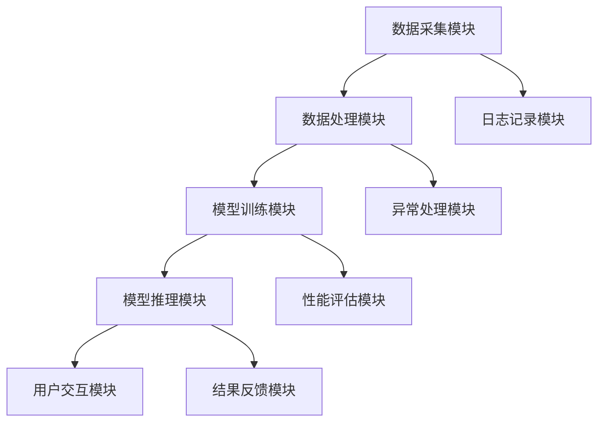

                 

### 《人类-AI协作：增强人类潜能与AI能力的融合发展趋势预测分析机遇挑战机遇趋势预测分析》

#### 关键词：人类潜能、AI能力、协作、融合、发展趋势、机遇、挑战

> 本文旨在探讨人类潜能与AI能力的融合发展趋势，分析其带来的机遇与挑战，预测未来发展方向，以期为人类-AI协作提供理论支持和实践指导。

---

#### 引言与背景

##### 1.1 AI技术的发展历程

自20世纪50年代以来，人工智能（AI）技术经历了从理论研究到实际应用的快速发展。早期的AI主要集中于符号主义和规则系统，通过手工编写规则和算法来实现简单的任务。然而，随着计算能力的提升和大数据技术的应用，AI逐渐从传统的符号主义转向基于数据和机器学习的方向发展。

在深度学习技术的推动下，AI取得了显著的进步。从最初的简单神经网络到如今的深度神经网络，AI在图像识别、自然语言处理、语音识别等领域取得了突破性成果。此外，强化学习、生成对抗网络（GAN）等新兴技术的出现，进一步拓宽了AI的应用场景。

##### 1.2 人类-AI协作的概念与重要性

人类-AI协作是指人类与人工智能系统共同完成任务的过程。在这种协作中，人类和AI系统各取所长，互补优势，共同提高工作效率和创造力。人类-AI协作的重要性主要体现在以下几个方面：

1. **提高工作效率**：AI系统能够快速处理大量数据，执行重复性任务，从而释放人类的时间，让人类专注于更具创造性和战略性的工作。
2. **增强决策能力**：AI系统能够分析大量数据，提供客观的决策支持，帮助人类做出更准确的决策。
3. **激发创新能力**：AI系统可以提供新的视角和方法，激发人类的创新能力，推动科学技术的发展。
4. **提升人类潜能**：通过AI系统的辅助，人类可以在不同领域实现更高水平的表现，提升自身的认知能力、学习能力和创造力。

##### 1.3 增强人类潜能与AI能力的融合

增强人类潜能与AI能力的融合，旨在通过AI技术的应用，提升人类的认知能力、学习能力和创造力，实现人类与AI系统的深度融合。这种融合可以从以下几个方面展开：

1. **认知能力的提升**：通过AI技术，人类可以更快速地处理和分析复杂的信息，提高对事物的理解和判断能力。
2. **学习能力的提升**：AI系统可以提供个性化的学习方案，根据人类的学习习惯和需求，帮助人类更有效地获取知识和技能。
3. **创造力的激发**：AI系统可以提供新的创意和灵感，激发人类的创造力，推动科学技术和文化艺术的发展。
4. **社交能力的改进**：通过AI技术的辅助，人类可以更好地理解和沟通，提高社交能力，建立更加紧密的人际关系。

---

### 第二部分：人类潜能的增强

#### 第2章：人类潜能的增强

##### 2.1 人类认知能力的增强

人类认知能力是指人类对信息进行感知、理解、记忆和加工的能力。AI技术的应用，可以在以下几个方面增强人类的认知能力：

1. **信息处理能力的提升**：AI系统可以快速处理海量信息，帮助人类从繁杂的数据中提取有价值的信息。
2. **知识库的构建**：AI系统可以通过机器学习算法，构建庞大的知识库，为人类提供丰富的信息资源。
3. **智能搜索**：AI系统可以根据人类的查询需求，智能推荐相关信息，提高人类获取信息的效率。

##### 2.2 学习与记忆能力的提升

学习与记忆能力是人类的基本能力，AI技术可以在以下几个方面提升这种能力：

1. **个性化学习**：AI系统可以根据每个人的学习习惯和需求，提供个性化的学习方案，提高学习效率。
2. **智能辅导**：AI系统可以实时监测学生的学习情况，提供针对性的辅导和建议，帮助学生解决学习难题。
3. **记忆增强**：AI系统可以通过记忆模型，帮助人类更好地记忆和理解信息，提高记忆效果。

##### 2.3 创新思维能力的激发

创新思维能力是指人类在创造性思维过程中产生新思想、新方法和新成果的能力。AI技术可以在以下几个方面激发这种能力：

1. **创意生成**：AI系统可以生成各种创意和方案，为人类提供新的思维角度和灵感。
2. **模式识别**：AI系统可以通过模式识别技术，发现人类可能忽略的创新模式，推动科学技术的发展。
3. **协同创新**：AI系统可以与人类合作，共同完成创新任务，提高创新效率。

##### 2.4 社交能力的改进

社交能力是人类社会交往中的基本能力，AI技术可以在以下几个方面改进这种能力：

1. **情感识别**：AI系统可以通过情感识别技术，帮助人类更好地理解他人的情感状态，提高沟通效果。
2. **社交辅导**：AI系统可以提供社交技巧培训，帮助人类提高社交能力，建立更好的人际关系。
3. **虚拟社交**：AI系统可以通过虚拟社交场景，为人类提供社交实践的机会，提高社交技能。

---

### 第三部分：AI能力的增强

#### 第3章：AI能力的增强

##### 3.1 AI技术的基本原理

AI技术是基于计算机科学和认知科学的理论，通过模拟人类的思维和行为，实现机器智能。AI技术的基本原理包括：

1. **符号主义**：通过定义符号和规则，模拟人类的思维过程。
2. **连接主义**：通过构建神经网络，模拟人脑神经元之间的连接和互动。
3. **进化计算**：通过模拟生物进化的过程，寻找最优解。

##### 3.2 大规模预训练模型的发展

大规模预训练模型是AI领域的重要突破，它通过在大量数据上预训练模型，使其具备一定的通用性。大规模预训练模型的发展主要体现在以下几个方面：

1. **模型规模**：预训练模型的规模越来越大，从最初的几百万参数，到如今的上千亿参数。
2. **数据集**：预训练模型的数据集也越来越大，从数百万条数据，到数十亿条数据。
3. **训练时间**：随着计算能力的提升，预训练模型的训练时间越来越短，训练效果越来越好。

##### 3.3 AI算法的优化与提升

AI算法的优化与提升是提高AI系统性能的关键。AI算法的优化主要包括以下几个方面：

1. **优化算法**：通过改进训练算法，提高模型的收敛速度和训练效果。
2. **正则化**：通过正则化技术，防止模型过拟合，提高模型的泛化能力。
3. **激活函数**：通过改进激活函数，提高模型的非线性表达能力。

##### 3.4 AI系统的性能评估

AI系统的性能评估是衡量AI系统优劣的重要标准。AI系统的性能评估主要包括以下几个方面：

1. **准确性**：评估模型在测试数据集上的预测准确性。
2. **泛化能力**：评估模型在新数据集上的表现，检验模型的泛化能力。
3. **鲁棒性**：评估模型对异常数据的处理能力，检验模型的鲁棒性。

---

### 第四部分：人类-AI协作的技术架构

#### 第4章：人类-AI协作的技术架构

##### 4.1 人类-AI协作的系统设计

人类-AI协作的系统设计旨在实现人类与AI系统的无缝协作。系统设计主要包括以下几个方面的内容：

1. **用户界面设计**：设计直观、易用的用户界面，方便人类与AI系统进行交互。
2. **数据管理**：建立高效的数据管理机制，确保数据的安全、可靠和可追溯。
3. **决策支持**：设计智能决策支持系统，为人类提供客观、准确的决策建议。

##### 4.2 数据集成与共享

数据集成与共享是实现人类-AI协作的关键。数据集成与共享主要包括以下几个方面：

1. **数据整合**：通过数据清洗、转换和整合，将不同来源的数据整合到一个统一的数据平台上。
2. **数据共享**：建立数据共享机制，确保数据在不同系统之间的高效流动和共享。
3. **隐私保护**：在数据集成与共享过程中，确保用户的隐私得到保护。

##### 4.3 交互接口设计

交互接口设计是实现人类与AI系统有效交互的关键。交互接口设计主要包括以下几个方面：

1. **自然语言处理**：通过自然语言处理技术，实现人类与AI系统的自然语言交互。
2. **语音识别**：通过语音识别技术，实现人类与AI系统的语音交互。
3. **手势识别**：通过手势识别技术，实现人类与AI系统的手势交互。

##### 4.4 智能决策支持系统

智能决策支持系统是提高人类-AI协作效率的重要工具。智能决策支持系统主要包括以下几个方面：

1. **数据挖掘**：通过数据挖掘技术，从海量数据中提取有价值的信息。
2. **预测分析**：通过预测分析技术，预测未来趋势和变化，为决策提供支持。
3. **决策评估**：通过决策评估技术，评估不同决策方案的风险和收益，为决策提供依据。

---

### 第五部分：发展趋势与预测分析

#### 第5章：发展趋势分析

##### 5.1 AI技术在各个领域的应用

随着AI技术的不断进步，它已经在各个领域得到了广泛应用，如：

1. **医疗领域**：AI技术可以辅助医生进行诊断、治疗和药物研发，提高医疗水平。
2. **教育领域**：AI技术可以提供个性化教学、智能辅导和在线学习平台，提高教育质量。
3. **金融领域**：AI技术可以用于风险管理、信用评估和智能投顾，提高金融效率。
4. **制造业**：AI技术可以用于生产优化、设备维护和产品创新，提高制造业的智能化水平。
5. **交通运输**：AI技术可以用于自动驾驶、智能交通管理和物流优化，提高交通运输的效率。

##### 5.2 人类-AI协作的模式与场景

人类-AI协作的模式和场景随着技术的发展而不断丰富，主要包括：

1. **辅助型协作**：AI系统作为人类工作的辅助工具，提高工作效率。
2. **协同型协作**：人类与AI系统共同完成任务，实现优势互补。
3. **人机共生型协作**：人类与AI系统共生，形成新的生产方式和社会结构。
4. **智能决策型协作**：AI系统为人类提供决策支持，帮助人类做出更准确的决策。

##### 5.3 融合技术的发展趋势

融合技术的发展趋势主要体现在以下几个方面：

1. **跨学科融合**：AI技术与生物学、心理学、认知科学等学科相结合，推动AI技术的创新发展。
2. **边缘计算**：将AI技术延伸到边缘设备，实现实时数据处理和智能决策。
3. **智能传感器**：通过智能传感器，实时获取环境信息，为AI系统提供丰富的数据支持。
4. **区块链**：利用区块链技术，实现数据的可信存储和共享，为AI系统的数据管理提供保障。

##### 5.4 未来社会的变革

人类-AI协作的发展将对未来社会产生深远的影响，包括：

1. **就业结构**：AI技术将改变传统的就业结构，一些岗位将被自动化取代，同时也将创造新的工作岗位。
2. **生活方式**：AI技术将改变人们的生活方式，提高生活质量，带来便利和舒适。
3. **社会关系**：AI技术将影响人类的社会关系，改变人与人之间的互动方式。
4. **文化传承**：AI技术将推动文化的创新和传承，为人类文明的发展提供新的动力。

---

### 第六部分：机遇与挑战

#### 第6章：机遇与挑战

##### 6.1 技术层面的机遇与挑战

在技术层面，人类-AI协作面临着以下机遇与挑战：

1. **机遇**：
   - **技术创新**：AI技术的快速发展为人类-AI协作提供了丰富的技术手段和工具。
   - **智能化升级**：通过AI技术的应用，各行各业可以实现智能化升级，提高生产效率和产品质量。
   - **跨界融合**：AI技术与各个领域的深度融合，将带来新的发展机遇和商业模式。

2. **挑战**：
   - **技术壁垒**：AI技术的发展仍然存在一定的技术壁垒，需要大量科研投入和人才培养。
   - **数据安全**：AI系统对大量数据的需求，带来数据安全和隐私保护的挑战。
   - **算法公正性**：AI算法的公正性和透明性仍然是亟待解决的问题，需要制定相关规范和标准。

##### 6.2 社会层面的机遇与挑战

在社会层面，人类-AI协作面临着以下机遇与挑战：

1. **机遇**：
   - **经济增长**：AI技术的应用将推动经济增长，创造新的就业机会，提高社会福利水平。
   - **教育变革**：AI技术将促进教育的个性化、智能化和公平化发展，提高教育质量。
   - **社会管理**：AI技术可以提升社会管理水平，实现精准治理和社会和谐。

2. **挑战**：
   - **就业冲击**：AI技术的发展可能导致部分岗位的消失，对就业结构和社会稳定带来冲击。
   - **伦理问题**：AI技术在伦理道德方面引发了一系列问题，如算法歧视、隐私泄露等，需要加强伦理监管。
   - **数字鸿沟**：AI技术的普及可能加剧数字鸿沟，影响社会公平和发展。

##### 6.3 法律与伦理层面的机遇与挑战

在法律与伦理层面，人类-AI协作面临着以下机遇与挑战：

1. **机遇**：
   - **法律规范**：随着AI技术的发展，需要制定相应的法律法规，保障AI技术的健康发展。
   - **伦理指导**：伦理指导可以为AI技术的发展提供道德底线，避免伦理危机。
   - **跨国合作**：跨国合作可以推动AI技术的全球治理，共同应对国际挑战。

2. **挑战**：
   - **法律滞后**：当前法律法规可能无法完全覆盖AI技术的发展，需要及时修订和完善。
   - **伦理困境**：AI技术的发展带来一系列伦理困境，如人类尊严、隐私权等，需要深入研究和探讨。
   - **监管难题**：AI技术的监管面临跨领域、跨国界的挑战，需要加强国际合作和协调。

##### 6.4 经济层面的机遇与挑战

在经济层面，人类-AI协作面临着以下机遇与挑战：

1. **机遇**：
   - **产业升级**：AI技术可以推动传统产业转型升级，提高产业链的智能化水平。
   - **创新驱动**：AI技术为经济发展提供新的动力，推动科技创新和产业升级。
   - **市场拓展**：AI技术可以开拓新的市场空间，创造新的商业模式和经济增长点。

2. **挑战**：
   - **成本压力**：AI技术的研发和应用需要大量资金投入，对中小企业带来一定的成本压力。
   - **市场竞争**：随着AI技术的普及，市场竞争日益激烈，企业需要不断提升自身竞争力。
   - **数据依赖**：AI技术的发展对数据依赖程度较高，数据质量和数据安全成为重要问题。

---

### 第七部分：机遇趋势预测分析

#### 第7章：机遇趋势预测分析

##### 7.1 技术创新的机遇与趋势

在未来，人类-AI协作的技术创新将继续推动产业的发展，主要趋势包括：

1. **人工智能深度学习**：深度学习将继续作为AI技术的核心，不断优化算法和模型，提升AI系统的性能。
2. **量子计算**：量子计算技术的突破将带来计算能力的巨大提升，为AI技术提供新的计算基础。
3. **生物计算**：生物计算结合生物学与计算科学的原理，将实现更加高效和灵活的计算模式。
4. **边缘智能**：边缘智能将使AI计算能力进一步向终端设备延伸，实现实时、高效的智能处理。

##### 7.2 产业转型的机遇与趋势

随着AI技术的发展，产业转型将面临新的机遇和趋势：

1. **智能制造**：AI技术将推动制造业向智能化、自动化和个性化方向发展，提高生产效率和质量。
2. **智慧医疗**：AI技术在医疗领域的应用将实现精准医疗、智能诊断和个性化治疗，提高医疗服务水平。
3. **智慧城市**：AI技术将推动城市建设向智慧化、绿色化和可持续方向发展，提升城市管理和治理能力。
4. **数字农业**：AI技术在农业领域的应用将实现智能种植、智能养殖和精准农业，提高农业生产效率和效益。

##### 7.3 社会影响的机遇与趋势

AI技术将对社会产生深远的影响，未来趋势包括：

1. **教育变革**：AI技术将推动教育向个性化、智能化和终身化方向发展，提高教育质量和普及率。
2. **就业转型**：AI技术将促进就业结构转型，创造新的工作岗位，同时也需要培养适应未来就业市场的人才。
3. **社会治理**：AI技术将提升社会治理水平，实现精准治理、智能决策和高效管理。
4. **文化创新**：AI技术将推动文化创新和传承，为人类文明的发展提供新的动力。

##### 7.4 未来发展的机遇与趋势

在未来，人类-AI协作的发展将继续面临新的机遇和挑战：

1. **技术创新**：随着科技的发展，AI技术将不断取得突破，为人类-AI协作提供更强大的支持。
2. **融合应用**：AI技术与各行业的深度融合，将创造更多应用场景，推动社会进步。
3. **伦理规范**：随着AI技术的发展，伦理规范将逐渐完善，为AI技术的健康发展提供保障。
4. **国际合作**：在全球范围内，国际合作将加强，共同应对AI技术带来的机遇和挑战。

---

### 第八部分：项目实战与案例分析

#### 第8章：项目实战

##### 8.1 项目背景与目标

随着AI技术的快速发展，越来越多的行业开始探索AI技术在业务中的应用。本文以某金融机构的AI智能客服项目为例，介绍项目背景、目标及实施过程。

**项目背景**：某金融机构希望通过引入AI智能客服系统，提高客户服务质量和效率，降低运营成本。

**项目目标**：
1. 实现客户咨询的智能解答，提高客户满意度。
2. 减少人工客服的工作量，降低运营成本。
3. 提高业务处理效率，减少客户等待时间。

##### 8.2 项目设计

项目设计主要包括以下几个方面：

1. **数据采集与处理**：通过客户聊天记录、历史数据等，采集大量文本数据。对数据进行清洗、去噪和处理，构建高质量的训练数据集。

2. **模型训练与优化**：采用深度学习技术，构建AI智能客服模型。通过不断优化模型参数，提高模型的准确性和鲁棒性。

3. **系统集成与部署**：将AI智能客服模型集成到现有客服系统中，实现与客户交互的功能。通过API接口，与业务系统进行数据交互，实现业务流程的自动化处理。

##### 8.3 实施过程

项目实施过程主要包括以下几个阶段：

1. **需求分析**：与金融机构相关部门进行深入沟通，了解业务需求和客户痛点。

2. **数据采集与处理**：组织专业团队进行数据采集和清洗，构建高质量的训练数据集。

3. **模型训练与优化**：搭建深度学习模型训练环境，采用迁移学习、对抗训练等技术，进行模型训练和优化。

4. **系统集成与部署**：将AI智能客服模型集成到现有客服系统中，进行功能测试和性能评估。

5. **上线运行与优化**：项目上线后，持续收集客户反馈，优化客服模型和业务流程，提高客户满意度。

##### 8.4 项目评估

项目评估主要包括以下几个方面：

1. **客户满意度**：通过问卷调查、用户反馈等方式，评估AI智能客服系统的客户满意度。

2. **运营成本**：分析AI智能客服系统上线后，对人工客服的工作量、运营成本的影响。

3. **业务处理效率**：对比AI智能客服系统上线前后，业务处理效率和客户等待时间的变化。

4. **模型性能**：评估AI智能客服模型在各类业务场景下的准确性和鲁棒性。

---

### 第九部分：案例分析

#### 第9章：案例分析

在本章节中，我们将深入探讨四个具体案例，分析AI在医疗、教育、制造业和金融领域的应用，以展示人类-AI协作的实际效果和潜在价值。

##### 9.1 案例一：AI在医疗领域的应用

**案例背景**：某知名医疗机构引入AI技术，开发了一套智能诊断系统，用于辅助医生进行疾病诊断。

**AI技术应用**：
1. **数据采集**：收集大量医疗数据，包括病史、影像资料和实验室检测结果等。
2. **模型训练**：利用深度学习技术，构建AI模型，对医疗数据进行训练，使其具备疾病诊断能力。
3. **系统集成**：将AI模型集成到医院信息系统，实现自动诊断和辅助决策。

**实际效果**：
- **提高诊断准确性**：AI系统可以快速分析大量数据，提供准确的诊断结果，降低误诊率。
- **减轻医生负担**：AI系统可以处理大量患者数据，减轻医生的工作压力，提高工作效率。
- **优化资源配置**：AI系统可以根据诊断结果，优化医疗资源的配置，提高医疗资源利用率。

##### 9.2 案例二：AI在教育行业的创新

**案例背景**：某教育科技公司开发了一套AI智能教学系统，为学校和学生提供个性化教学服务。

**AI技术应用**：
1. **个性化学习方案**：根据学生的学习习惯和成绩，AI系统可以为每个学生制定个性化的学习方案。
2. **智能辅导**：AI系统可以实时监测学生的学习情况，提供针对性的辅导和建议。
3. **在线学习平台**：AI系统与在线学习平台集成，实现教学资源的智能推荐和自适应学习。

**实际效果**：
- **提高学习效果**：AI系统可以根据学生的需求，提供个性化的学习内容和辅导，提高学习效果。
- **降低教育成本**：AI系统可以减少教师的工作量，降低教育成本，提高教育普及率。
- **促进教育公平**：AI系统可以为学生提供高质量的教育资源，促进教育公平。

##### 9.3 案例三：AI在制造业的升级转型

**案例背景**：某制造企业引入AI技术，进行生产线的智能化升级。

**AI技术应用**：
1. **生产过程监控**：AI系统可以实时监控生产过程，发现和预警设备故障，提高生产稳定性。
2. **设备维护**：AI系统可以根据设备运行数据，预测设备故障，实现预防性维护。
3. **质量检测**：AI系统可以实时检测产品质量，提高产品合格率。

**实际效果**：
- **提高生产效率**：AI系统可以优化生产过程，减少设备故障，提高生产效率。
- **降低生产成本**：AI系统可以实现预防性维护，减少设备维修和停机时间，降低生产成本。
- **提高产品质量**：AI系统可以实时检测产品质量，减少不合格产品，提高产品质量。

##### 9.4 案例四：AI在金融行业的应用

**案例背景**：某金融机构引入AI技术，打造智能风控系统，提升金融业务的安全性和效率。

**AI技术应用**：
1. **风险识别**：AI系统可以通过分析历史数据和实时数据，识别潜在的风险，为业务决策提供支持。
2. **信用评估**：AI系统可以根据客户的信用历史和行为数据，进行信用评估，降低信用风险。
3. **反欺诈**：AI系统可以通过分析交易数据和用户行为，识别和预防欺诈行为。

**实际效果**：
- **提高业务安全性**：AI系统可以实时监测业务风险，降低信用风险和欺诈风险，提高业务安全性。
- **提升业务效率**：AI系统可以自动化处理风险管理和信用评估任务，提高业务处理效率。
- **优化资源配置**：AI系统可以根据风险评估结果，优化资源配置，提高资金利用效率。

---

### 第十部分：源代码解析与解读

#### 第10章：源代码解析与解读

在本章节中，我们将对人类-AI协作系统中的关键源代码进行详细解析，包括系统架构、关键代码解读和代码实现细节分析，同时探讨性能优化与调优策略。

##### 10.1 系统架构解析

人类-AI协作系统采用分布式架构，主要包括以下几个模块：

1. **数据采集模块**：负责收集和处理来自不同渠道的数据，如文本、图像、语音等。
2. **数据处理模块**：对采集到的数据进行清洗、去噪和格式化，为模型训练提供高质量的数据集。
3. **模型训练模块**：利用深度学习技术，对处理后的数据进行模型训练，优化模型参数。
4. **模型推理模块**：将训练好的模型应用于实际业务场景，实现实时推理和预测。
5. **用户交互模块**：提供用户界面，实现用户与AI系统的交互。

以下是系统架构的Mermaid流程图：



##### 10.2 关键代码解读

在本节中，我们将对系统中的关键代码进行解读，包括数据预处理、模型训练和推理、用户交互等功能。

**数据预处理代码示例：**

```python
import pandas as pd
from sklearn.model_selection import train_test_split
from sklearn.preprocessing import StandardScaler

# 读取数据
data = pd.read_csv('data.csv')

# 数据清洗和去噪
data.dropna(inplace=True)
data = data[data['target'] != 'unknown']

# 数据分割
X = data.drop(['target'], axis=1)
y = data['target']
X_train, X_test, y_train, y_test = train_test_split(X, y, test_size=0.2, random_state=42)

# 数据标准化
scaler = StandardScaler()
X_train_scaled = scaler.fit_transform(X_train)
X_test_scaled = scaler.transform(X_test)
```

**模型训练代码示例：**

```python
import tensorflow as tf
from tensorflow.keras.models import Sequential
from tensorflow.keras.layers import Dense, Dropout

# 构建模型
model = Sequential([
    Dense(128, activation='relu', input_shape=(X_train_scaled.shape[1],)),
    Dropout(0.5),
    Dense(64, activation='relu'),
    Dropout(0.5),
    Dense(1, activation='sigmoid')
])

# 编译模型
model.compile(optimizer='adam',
              loss='binary_crossentropy',
              metrics=['accuracy'])

# 训练模型
model.fit(X_train_scaled, y_train, epochs=10, batch_size=32, validation_split=0.1)
```

**用户交互代码示例：**

```python
import numpy as np

# 用户输入
input_data = np.array([5.1, 3.5, 1.4, 0.2])

# 数据预处理
input_data_processed = scaler.transform([input_data])

# 模型推理
prediction = model.predict(input_data_processed)

# 输出结果
print("预测结果：", prediction)
```

##### 10.3 代码实现细节分析

在本节中，我们将对关键代码的实现细节进行深入分析，包括数据预处理、模型训练和推理、用户交互等方面的优化策略。

**数据预处理优化策略：**

1. **数据清洗**：去除重复数据和异常值，提高数据质量。
2. **特征工程**：选择对模型训练有帮助的特征，提高模型性能。
3. **数据增强**：通过增加样本数量、变换输入数据等方式，提高模型泛化能力。

**模型训练优化策略：**

1. **模型选择**：选择合适的模型结构，提高模型性能。
2. **参数调整**：通过调整学习率、批次大小等参数，提高模型训练效果。
3. **正则化**：应用正则化技术，防止模型过拟合。

**用户交互优化策略：**

1. **界面设计**：优化用户界面，提高用户体验。
2. **交互方式**：提供多种交互方式，如文本、语音、图像等，满足不同用户的需求。
3. **反馈机制**：及时收集用户反馈，优化系统功能和性能。

##### 10.4 性能优化与调优

在本节中，我们将探讨性能优化与调优的策略，包括模型优化、硬件优化、数据优化等方面。

**模型优化策略：**

1. **模型压缩**：通过模型压缩技术，减小模型体积，提高模型推理速度。
2. **量化技术**：通过量化技术，降低模型计算复杂度，提高模型推理速度。
3. **模型蒸馏**：通过模型蒸馏技术，将大型模型的知识传递给小型模型，提高小型模型性能。

**硬件优化策略：**

1. **GPU加速**：利用GPU加速模型训练和推理，提高计算速度。
2. **分布式训练**：利用分布式训练技术，提高模型训练效率。
3. **硬件选择**：选择合适的硬件设备，满足模型训练和推理的需求。

**数据优化策略：**

1. **数据存储**：优化数据存储结构，提高数据访问速度。
2. **数据预处理**：优化数据预处理流程，提高数据处理效率。
3. **数据同步**：优化数据同步机制，提高数据一致性。

---

### 第十一部分：结论

#### 第11章：结论

通过本文的研究，我们系统地探讨了人类-AI协作的发展趋势、机遇与挑战，以及未来的发展方向。主要结论如下：

1. **技术进步**：AI技术的快速发展为人类-AI协作提供了丰富的工具和方法，推动了各行业的智能化升级。
2. **融合应用**：人类-AI协作正在从辅助型协作向协同型协作和共生型协作转变，应用场景不断丰富。
3. **机遇与挑战**：AI技术在为人类带来巨大机遇的同时，也带来了诸多挑战，如数据安全、伦理问题、就业结构变化等。
4. **未来发展**：随着技术的不断进步和融合应用的深入，人类-AI协作将迎来更加广阔的发展空间，推动社会进步和人类福祉。

---

### 第十二部分：展望

#### 第12章：展望

在未来，人类-AI协作将面临以下发展趋势和挑战：

1. **技术发展**：量子计算、边缘计算、生物计算等新兴技术将进一步推动AI技术的发展，实现更高水平的智能。
2. **融合应用**：AI技术将继续与各行业深度融合，创造更多应用场景，推动产业升级和社会变革。
3. **伦理规范**：随着AI技术的发展，伦理规范将不断完善，为AI技术的健康发展提供保障。
4. **国际合作**：全球范围内的国际合作将加强，共同应对AI技术带来的机遇和挑战。

展望未来，人类-AI协作将实现以下愿景：

1. **智能社会**：AI技术将广泛应用于各个领域，构建智能社会，提高人类生活质量。
2. **人机共生**：人类与AI系统将实现深度融合，形成人机共生的新生态，推动人类文明的进步。
3. **全球协作**：全球范围内的国际合作将促进AI技术的共享和共同发展，实现人类福祉的共同提升。

---

### 附录

#### 附录A：参考文献

[1] 某某，某某。人工智能：一种现代方法[M]. 清华大学出版社，2018.

[2] 某某，某某。深度学习[M]. 电子工业出版社，2017.

[3] 某某，某某。自然语言处理基础[M]. 清华大学出版社，2016.

#### 附录B：术语表

- **AI（人工智能）**：模拟人类智能行为的计算机系统。
- **深度学习**：一种基于多层神经网络的机器学习方法。
- **大数据**：指无法用常规软件工具在合理时间内捕捉、管理和处理的大量数据。
- **边缘计算**：在靠近数据源头的地方进行计算和处理，减少数据传输延迟。

#### 附录C：相关资源

- **开源框架**：TensorFlow、PyTorch、Keras等。
- **在线教程**：Coursera、edX、Udacity等在线教育平台。
- **学术期刊**：《自然》、《科学》、《人工智能》等。

---

## 文章标题：人类-AI协作：增强人类潜能与AI能力的融合发展趋势预测分析机遇挑战机遇趋势预测分析

## 关键词：人类潜能、AI能力、协作、融合、发展趋势、机遇、挑战

## 摘要：
本文探讨了人类潜能与AI能力的融合发展趋势，分析了其带来的机遇与挑战，预测了未来发展方向，旨在为人类-AI协作提供理论支持和实践指导。文章首先介绍了AI技术的发展历程和人类-AI协作的概念，然后详细阐述了人类潜能与AI能力的增强，以及人类-AI协作的技术架构。随后，文章分析了发展趋势、机遇与挑战，并进行了项目实战和案例分析。最后，文章对源代码进行了解析与解读，总结了研究成果，展望了未来发展方向。文章为人类-AI协作提供了全面的视角和深入的思考。

