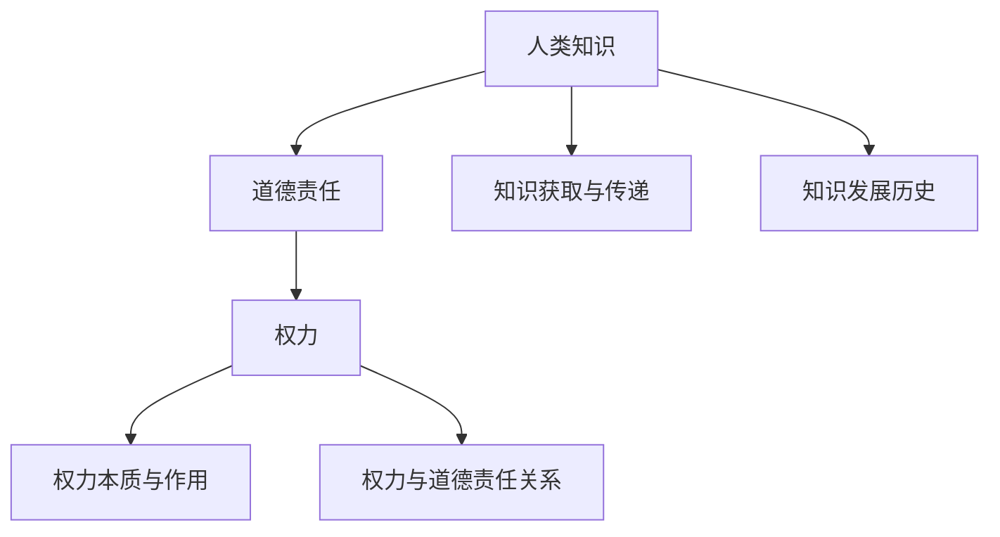
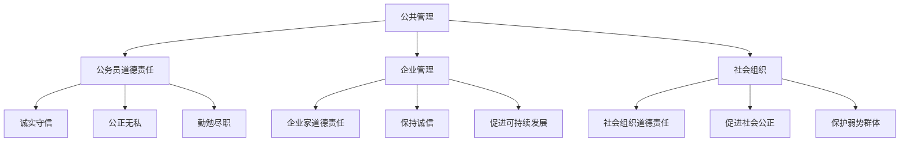
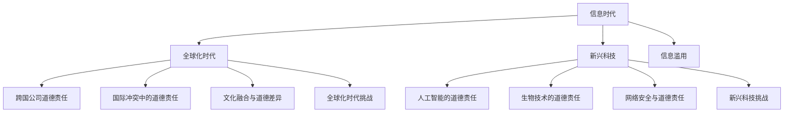
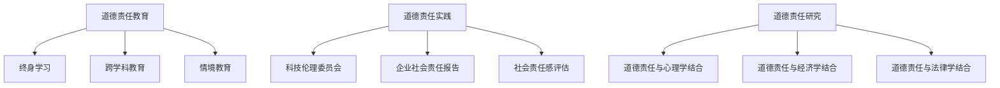

                 

### 引言

在当今社会，知识的力量与权力的运用密不可分。人类的知识不仅推动了科技的进步和社会的发展，同时也为权力的获取与运用提供了坚实的基础。然而，随着知识在各个领域的广泛应用，人类面临的道德责任问题愈发突出。尤其是在权力面前，道德责任成为衡量人类行为正当与否的重要标准。

本文旨在探讨人类的知识与道德责任在权力面前的相互关系，分析权力对道德责任的影响，以及道德责任在权力行使中的实践。文章将采用逻辑清晰、结构紧凑、简单易懂的专业技术语言，通过逐步分析推理的方式，深入探讨这一复杂而重要的话题。

文章结构安排如下：

- **第一部分：引论**：阐述人类知识与道德责任的重要性，分析知识与道德责任的相互关系，并明确研究目的与结构安排。
- **第二部分：人类知识的本质与范围**：讨论人类知识的本质、类型、获取与传递方式，以及知识的发展历史。
- **第三部分：道德责任的本质与范围**：介绍道德责任的本质、概念、重要性，以及道德责任的范围。
- **第四部分：权力与道德责任**：探讨权力的本质、来源与分类，以及权力与道德责任的关系。
- **第五部分：权力行使中的道德责任**：分析道德责任在公共管理、企业管理和社会组织中的具体应用。
- **第六部分：权力面前的道德责任挑战与未来**：讨论信息时代、全球化时代和新兴科技对道德责任的影响，以及道德责任的未来展望。
- **参考文献**：列出本文引用的参考文献。

通过以上结构的安排，本文将逐步深入探讨人类的知识与道德责任在权力面前的复杂互动，以期对读者在理解和实践中提供有益的启示。

### 第一部分：引论

#### 1.1 人类知识与道德责任的重要性

人类知识与道德责任是人类社会中不可或缺的两个核心概念，它们相互交织，共同构建了社会运行的基本框架。首先，人类知识是指人类通过认知、理解和应用所获得的信息、技能和认知模式。这些知识不仅来源于个体的学习与经验，还来自于科学发现、技术创新和文化传承。人类知识的重要性体现在其对科技发展、社会进步和文明延续的推动作用上。从古代的农业革命到现代的信息技术革命，知识的力量无处不在，它不断推动人类社会向前发展。

与此同时，道德责任是规范人类行为的重要原则，它涉及个体与他人、社会以及自然的关系。道德责任不仅要求个体在行为上遵守一定的道德规范，还要求个体在思想上具有道德意识和责任感。道德责任的重要性在于它为人类社会的和谐稳定提供了道德保障。在权力面前，道德责任尤为重要，因为权力具有强大的影响力，能够改变个体的行为和社会的走向。没有道德责任的制约，权力的滥用可能导致腐败、不公和道德滑坡，从而破坏社会的稳定与进步。

在权力面前，道德责任的重要性主要体现在以下几个方面：

1. **权力制衡**：道德责任为权力的行使提供了道德约束，防止权力滥用。在权力面前，个体必须意识到自己行为的道德后果，从而在行使权力时保持谨慎和自律。
   
2. **社会正义**：道德责任要求个体在权力面前秉持公正无私的态度，保障社会公平正义。只有通过道德责任，才能确保权力不被滥用，从而维护社会的和谐与稳定。

3. **个人修养**：道德责任促进个体的自我反省和道德提升，使个体在权力面前保持高尚的品德和正直的行为。这种修养不仅有利于个体自身的发展，也有利于社会的进步。

#### 1.2 知识与道德责任的相互关系

人类知识与道德责任之间存在着密切的相互关系。首先，知识是道德责任的前提和基础。个体的道德判断和行为选择离不开知识的支持。只有具备一定的知识储备，个体才能在道德问题上做出合理的判断和选择。例如，在环保问题上，个体需要了解环境科学的知识，才能做出符合道德规范的环保行为。

其次，道德责任是知识运用的指南和约束。个体的知识如果不被道德责任所引导和约束，就可能被用于不正当的用途，甚至对他人和社会造成伤害。例如，科学家在研究基因编辑技术时，必须承担相应的道德责任，确保研究成果不会对人类伦理造成冲击。

此外，知识与道德责任之间的互动还表现在以下几个方面：

1. **相互促进**：知识的发展可以提升个体的道德水平，而道德责任的履行又能促进知识的创新和应用。例如，科学家的道德责任促使他们在研究中遵循伦理原则，从而推动科学的发展。

2. **相互制约**：道德责任对知识的运用进行约束，防止知识滥用。例如，医生在临床治疗中必须遵循医疗道德规范，确保治疗行为不会对病人造成伤害。

3. **相互渗透**：知识和道德责任在个体的认知和行为中相互渗透，形成统一的道德认知和行为模式。例如，在企业中，员工的知识水平越高，他们对企业社会责任的道德责任也越强。

#### 1.3 研究目的与结构安排

本文的研究目的在于深入探讨人类的知识与道德责任在权力面前的相互关系，分析权力对道德责任的影响，以及道德责任在权力行使中的具体实践。通过这一研究，本文旨在揭示道德责任在权力面前的关键作用，为个体和社会提供道德行为的指导。

为了实现这一研究目的，本文将采用以下结构安排：

- **第一部分：引论**：阐述人类知识与道德责任的重要性，分析知识与道德责任的相互关系，并明确研究目的与结构安排。
- **第二部分：人类知识的本质与范围**：讨论人类知识的本质、类型、获取与传递方式，以及知识的发展历史。
- **第三部分：道德责任的本质与范围**：介绍道德责任的本质、概念、重要性，以及道德责任的范围。
- **第四部分：权力与道德责任**：探讨权力的本质、来源与分类，以及权力与道德责任的关系。
- **第五部分：权力行使中的道德责任**：分析道德责任在公共管理、企业管理和社会组织中的具体应用。
- **第六部分：权力面前的道德责任挑战与未来**：讨论信息时代、全球化时代和新兴科技对道德责任的影响，以及道德责任的未来展望。
- **参考文献**：列出本文引用的参考文献。

通过以上结构的安排，本文将逐步深入探讨人类的知识与道德责任在权力面前的复杂互动，以期对读者在理解和实践中提供有益的启示。

### 第二部分：人类知识的本质与范围

#### 2.1 人类知识的本质

人类知识是人类智慧和社会发展的结晶，它涵盖了从哲学到科学、从艺术到技术的广泛领域。知识不仅仅是信息或数据的简单积累，而是一种经过人类理解、组织和应用的信息体系。知识的本质可以从以下几个方面进行探讨：

1. **定义**：知识可以被定义为通过感知、理解和记忆等过程所获得的关于某一主题的信息和认知。它不仅仅停留在表面的认知层次，而是涉及到深层次的理解和运用。例如，一个人可能知道水的化学成分是H2O，但这并不代表他真正理解水的性质和作用。

2. **类型**：人类知识可以分为多种类型，主要包括：

   - **事实性知识**：这是关于具体事实和信息的知识，如历史事件、科学定律等。
   - **概念性知识**：这是关于概念、原理和框架的知识，如数学原理、哲学思想等。
   - **技能性知识**：这是关于操作技能和实践经验的知识，如编程、绘画等。
   - **情境性知识**：这是在特定情境下运用知识和技能解决问题的知识，如医疗诊断、企业管理等。

3. **获取与传递**：知识的获取和传递是人类知识发展的重要环节。知识的获取通常通过以下几种途径：

   - **经验学习**：通过亲身经历和实践活动获取知识，如儿童通过玩耍和学习生活技能。
   - **教育学习**：通过学校教育、培训和学习课程等系统获取知识，如学生通过上课和阅读教材。
   - **实践学习**：通过工作中的实践和学习他人的经验获取知识，如工程师通过项目实践和学习同行经验。
   - **媒体学习**：通过电视、书籍、互联网等媒体获取知识，如通过网络学习新技能。

   知识的传递则是通过教育、沟通、写作和科技等手段实现的。例如，教师通过课堂教学传授知识，科学家通过学术论文分享研究成果，软件工程师通过代码和文档传递技术知识。

#### 2.2 人类知识的发展历史

人类知识的发展历史可以追溯到古代，经历了多个重要阶段：

1. **古代哲学对知识的探讨**：在古希腊时期，哲学家如苏格拉底、柏拉图和亚里士多德对知识进行了深入的探讨。他们提出了逻辑推理、辩证法和实证主义等不同的知识获取方法。这一时期的哲学思想为后世的知识探索奠定了基础。

2. **近代科学的兴起与发展**：随着文艺复兴和启蒙运动的发展，科学开始成为知识体系的核心。科学家如伽利略、牛顿和达尔文等通过实验和观察，提出了许多重要的科学定律和理论，推动了科学知识的飞速发展。

3. **当代知识生产的趋势与挑战**：在当代，知识生产呈现出以下趋势和挑战：

   - **信息爆炸**：随着互联网和数字技术的发展，知识的获取和传递变得更加便捷，信息量呈指数级增长。这使得个体和组织面临信息过载的挑战。
   - **知识融合**：不同领域之间的知识相互融合，形成了跨学科的研究方法。例如，生物信息学结合生物学和计算机科学，产生了新的研究方法和技术。
   - **知识共享**：开放获取和共享知识成为知识生产的重要趋势。例如，学术期刊的开放获取政策和开源软件运动促进了知识的共享和传播。
   - **知识伦理**：知识生产过程中出现了许多伦理问题，如隐私保护、知识产权和科技滥用等。这要求知识生产者和使用者承担相应的道德责任。

#### 2.2.1 古代哲学对知识的探讨

古代哲学家对知识的探讨主要围绕着知识是什么、如何获取知识以及知识的应用等问题。以下是几位重要哲学家的主要观点：

- **苏格拉底**：苏格拉底认为知识是美德的基础，通过提问和辩证法帮助他人发现知识。他提出了“我知道我什么也不知道”的观点，强调了自我反省的重要性。

- **柏拉图**：柏拉图认为知识是灵魂回忆的结果，通过直觉和理性来获取。他的“理念论”认为，真正的知识是对理念世界的认识，而物质世界只是理念世界的投影。

- **亚里士多德**：亚里士多德认为知识是通过感官和理性相结合来获得的。他提出了“中道”原则，强调在行为和思想中要避免过度和不足，以达到平衡。

这些哲学思想对后世的知识探索产生了深远的影响，为科学方法的发展奠定了基础。

#### 2.2.2 近代科学的兴起与发展

近代科学的兴起标志着人类知识体系的重大变革。以下是一些关键事件和发展：

- **文艺复兴**：文艺复兴时期强调人文主义和实验精神，推动了科学方法的发展。科学家如哥白尼和伽利略通过观察和实验，推翻了地心说，奠定了现代天文学的基础。

- **科学革命**：17世纪的科学革命是现代科学发展的关键时期。牛顿的经典力学和万有引力定律，达尔文的进化论等重大科学发现，标志着科学方法在解释自然现象方面的巨大成功。

- **科学研究体系的建立**：18世纪和19世纪，科学研究体系逐渐建立，科学实验室、学术期刊和科学协会等机构成为知识生产的重要平台。科学方法论、实验设计和数据分析等科学工具的发明，使科学研究更加严谨和系统。

近代科学的兴起不仅推动了知识的发展，也改变了人类对自然和社会的认识，为现代社会的发展奠定了基础。

#### 2.2.3 当代知识生产的趋势与挑战

当代知识生产面临着许多新的趋势和挑战。以下是几个关键方面：

1. **信息爆炸**：随着互联网和数字技术的发展，知识的获取和传播变得更加便捷。然而，信息过载成为一个普遍问题，个体和组织需要掌握有效的信息筛选和处理方法。

2. **知识融合**：跨学科研究成为知识生产的重要趋势。不同领域的知识相互融合，产生了新的研究方法和应用领域。例如，生物信息学、神经科学和社会计算等领域的交叉研究，推动了知识的发展和应用的拓展。

3. **知识共享**：开放获取和共享知识成为知识生产的重要趋势。学术期刊的开放获取政策和开源软件运动，促进了知识的共享和传播。然而，知识产权保护和知识垄断等问题仍然存在，需要平衡知识共享和创新激励。

4. **知识伦理**：知识生产过程中出现了许多伦理问题，如隐私保护、知识产权和科技滥用等。这要求知识生产者和使用者承担相应的道德责任，确保知识的应用符合伦理原则。

总之，当代知识生产面临着复杂的环境和挑战，需要不断创新和适应，以推动社会的进步和发展。

通过以上对人类知识本质、类型、获取与传递方式以及知识发展历史的探讨，我们可以更好地理解人类知识的内涵和作用。在接下来的部分，本文将继续探讨道德责任的本质与范围，为理解人类知识与道德责任在权力面前的相互关系奠定基础。

### 第三部分：道德责任的本质与范围

#### 3.1 道德责任的本质

道德责任是个体在道德领域应承担的义务和责任，它是社会规范和个人价值观的具体体现。道德责任不仅涉及到个体的行为选择，还涉及到其对他人、社会以及自然环境的态度和行动。理解道德责任的本质是探讨其在权力面前作用的基础。

首先，道德责任的概念可以从以下几个方面来理解：

1. **定义**：道德责任是指个体在其道德认知和道德判断的基础上，对他人、社会和自然承担的道德义务。它是一种内在的道德约束力，要求个体在行为和思想上遵循一定的道德规范。

2. **来源**：道德责任来源于多个方面，包括个体自身的道德认知、社会规范、文化传统和法律法规。个体的道德责任不仅受个人价值观的驱动，也受社会环境和法律制度的约束。

3. **属性**：道德责任具有以下几个属性：

   - **内在性**：道德责任是个体内生的，是个人道德意识的一部分，而非外在强加的。
   - **规范性**：道德责任体现了社会道德规范的要求，对个体行为具有规范性作用。
   - **普遍性**：道德责任不仅限于个体与他人之间的关系，还包括个体对社会的责任和自然环境的责任。

其次，道德责任的重要性体现在以下几个方面：

1. **维护社会秩序**：道德责任是维护社会秩序的重要保障。它通过规范个体行为，确保社会成员之间和谐相处，避免冲突和混乱。

2. **促进个体发展**：道德责任是促进个体道德成长和全面发展的重要条件。通过履行道德责任，个体能够提升自我修养，形成良好的道德品质和人格。

3. **增强社会责任感**：道德责任使个体认识到自己在社会中的角色和责任，激发个体的社会责任感和使命感，推动社会的进步和发展。

#### 3.2 道德责任与法律责任的区别

道德责任和法律责任是两种不同类型的社会责任，它们在性质、来源和执行方式上存在显著差异。

首先，道德责任与法律责任在性质上的区别：

1. **道德责任**：道德责任是一种内在的责任感，来源于个体内心的道德信念和价值观。它不依赖于外部法律和制度的强制，而是基于个体的自我约束和道德自觉。

2. **法律责任**：法律责任是一种外部的义务，来源于法律的规定和约束。法律责任通常由法律条文明确规定，个体必须遵守，否则将承担法律责任。

其次，道德责任与法律责任在来源上的区别：

1. **道德责任**：道德责任来源于个体自身的道德意识和社会道德规范。道德规范通常是基于传统、文化和社会共识形成的，具有普遍性和多样性。

2. **法律责任**：法律责任来源于法律制度和法律条文。法律是国家制定的强制性规范，具有明确的法律效力，个体必须遵守。

再次，道德责任与法律责任在执行方式上的区别：

1. **道德责任**：道德责任主要通过个体的自我约束和道德自律来实现。个体通过自我反省和道德修养，自觉履行道德责任。

2. **法律责任**：法律责任主要通过法律机构和司法程序来实现。个体违反法律规定，将面临法律制裁，如罚款、判刑等。

尽管道德责任与法律责任在性质、来源和执行方式上有所不同，但它们并不是相互独立的，而是相互补充的。道德责任为法律责任提供了道德基础，而法律责任则为道德责任的实现提供了法律保障。在实际生活中，个体需要在道德和法律的双重约束下行动，以实现社会的和谐与稳定。

#### 3.3 道德责任的重要性

道德责任在社会和个人层面都具有极其重要的意义。首先，在社会层面，道德责任是维护社会秩序和公共利益的重要保障。通过履行道德责任，个体能够自觉遵守社会规范，维护社会和谐与稳定。例如，医生在医疗活动中遵循职业道德，保障患者的生命健康；公务员在公共管理中秉持公正无私，维护社会公平正义。

其次，在个人层面，道德责任是促进个体道德成长和全面发展的重要动力。通过履行道德责任，个体能够提升自我修养，形成良好的道德品质和人格。例如，企业家在经营活动中践行社会责任，不仅追求经济效益，更注重社会效益和环境效益，从而实现企业的可持续发展。

此外，道德责任还具有以下重要作用：

1. **促进社会进步**：道德责任鼓励个体积极参与社会事务，推动社会进步。通过履行道德责任，个体能够为社会的可持续发展做出贡献，如参与公益活动和志愿服务。

2. **增强社会凝聚力**：道德责任是增强社会凝聚力的重要纽带。通过共同遵守道德规范，社会成员能够形成共同的价值观和行为准则，增强社会团结和合作。

3. **维护自然和谐**：道德责任不仅涉及人与人之间的关系，还包括个体对自然环境的责任。通过履行道德责任，个体能够保护自然环境，实现人与自然的和谐共生。

总之，道德责任是社会和个人发展的重要基础。在权力面前，道德责任尤为重要，因为它为权力的行使提供了道德约束，防止权力滥用，保障社会的和谐与稳定。

#### 3.4 道德责任的范围

道德责任的范围广泛，涉及到个体与社会、自然以及其他生物之间的多种关系。以下从几个主要方面讨论道德责任的范围：

1. **对他人的道德责任**：个体在行为上对他人的道德责任主要体现在以下几个方面：

   - **尊重**：尊重他人的基本权利和尊严，不侵犯他人的自由和财产。
   - **公正**：在处理与他人关系时保持公正无私，不偏袒任何一方。
   - **互助**：在他人需要帮助时，主动提供援助，促进社会互助合作。

2. **对自己的道德责任**：个体在行为上对自己的道德责任主要表现为自我约束和自我提升：

   - **自律**：遵循道德规范，自觉约束自己的行为，不违背社会道德底线。
   - **诚实**：保持诚实守信，不欺骗、不诽谤他人，树立良好的个人形象。
   - **进取**：不断提升自己的道德水平和技能，追求个人全面发展。

3. **对社会的道德责任**：个体在社会生活中承担的道德责任主要包括：

   - **贡献**：为社会的发展和进步做出贡献，如参与公益活动和志愿服务。
   - **维护**：维护社会的公共秩序和公共利益，如遵守法律法规、参与社会监督。
   - **创新**：推动社会创新和科技发展，为社会的可持续发展提供支持。

4. **对自然的道德责任**：随着环境保护意识的提高，个体对自然的道德责任越来越受到关注：

   - **保护**：保护自然环境，防止生态破坏，如减少污染、节约资源。
   - **修复**：对于已经受到破坏的自然环境进行修复和保护，如植树造林、生态恢复。
   - **尊重**：尊重自然界的生物多样性，维护生态平衡，如保护野生动物、植物。

总之，道德责任的范围广泛，涵盖了个体在社会生活中的各个方面。通过履行道德责任，个体能够促进社会的和谐与进步，实现人与自然、人与人的和谐共生。

### 第四部分：权力与道德责任

#### 4.1 权力的本质与作用

权力是一种社会现象，它涉及个体或组织在特定情境下对资源、决策和行为的影响力。权力的本质可以从以下几个方面进行探讨：

1. **定义**：权力可以定义为个体或组织在特定环境中通过合法或不合法手段获取和运用资源、影响和支配他人的能力。它不仅仅是简单的力量或权力，而是一种动态的过程，涉及到权力的获取、运用和维持。

2. **来源**：权力的来源多种多样，主要包括：

   - **法律授权**：法律赋予个体或组织特定的权力和职责，如政府官员的行政权力、企业家的管理权力。
   - **社会认可**：社会对个体或组织权力的认可和支持，如宗教领袖的影响力、社区领袖的权威。
   - **资源控制**：通过控制资源，如财富、知识、技术等，个体或组织获得权力，如大型企业的市场影响力。
   - **个人魅力**：通过个人的魅力和领导能力，个体获得他人的支持和追随，如政治领袖的吸引力。

3. **作用**：权力在社会中的作用复杂而重要，主要体现在以下几个方面：

   - **决策与执行**：权力是决策和执行的基础。个体或组织通过权力来制定政策、决策和规划，从而影响社会的发展方向。
   - **资源分配**：权力在资源分配中起着关键作用。拥有权力的人或组织能够决定资源的分配方式，从而影响社会财富和社会福利的分配。
   - **社会稳定**：权力是维护社会稳定的重要工具。通过权力，政府可以维护社会秩序、保障国家安全和公共利益。
   - **社会变革**：权力可以推动社会变革。通过权力的运用，个体或组织可以推动社会改革、解决社会问题，实现社会的进步和发展。

#### 4.2 权力与道德责任的关系

权力与道德责任之间存在着密切的关系，两者相互影响、相互制约。以下从几个方面探讨权力与道德责任的相互作用：

1. **权力滥用与道德责任**：权力具有双刃剑的特性，如果不加以约束和规范，权力容易被滥用。权力滥用不仅损害个体和他人的利益，还会破坏社会的公平正义。因此，道德责任成为制约权力滥用的重要力量。道德责任要求个体在行使权力时必须遵守道德规范，不得滥用权力。例如，政府官员在行使行政权力时，必须遵守法律法规，不能以权谋私、滥用职权。

2. **权力制衡与道德责任**：权力制衡是防止权力滥用的重要机制。道德责任在权力制衡中起着关键作用。通过道德责任，个体和社会可以建立起对权力的监督和制约机制，确保权力在合法和道德的范围内行使。例如，企业在经营活动中，不仅需要遵守法律法规，还需要承担社会责任，通过道德责任来平衡和制约权力。

3. **权力监督与道德责任**：权力监督是防止权力滥用的重要手段。道德责任在权力监督中具有重要作用。通过道德责任，社会可以建立起对权力的监督机制，确保权力行使的透明度和公正性。例如，公众可以通过舆论监督、投诉举报等方式，对政府官员和企业高管的行为进行监督，防止权力滥用。

4. **道德责任与权力运用的互动**：道德责任与权力运用之间存在互动关系。一方面，道德责任为权力运用提供道德规范和行为准则，引导权力在道德范围内行使。另一方面，权力运用的结果又反过来影响个体的道德责任履行。例如，政府通过有效的政策执行，提升社会福利，个体在享受这些福利的同时，也会更加自觉地履行道德责任。

总之，权力与道德责任之间存在着紧密的相互关系。道德责任是制约权力滥用的重要力量，权力制衡和权力监督是道德责任的重要实现途径。通过道德责任和权力运用的互动，可以构建一个公平正义、和谐稳定的社会。

### 第五部分：权力行使中的道德责任

#### 5.1 道德责任的教育与实践

道德责任的教育与实践是培养个体道德意识和社会责任感的重要途径，对于权力行使中的道德责任尤为重要。以下从几个方面探讨道德责任的教育与实践。

##### 5.1.1 道德教育的目的与方法

道德教育的目的是培养个体的道德意识和社会责任感，使其在日常生活中能够自觉遵守道德规范，履行道德责任。道德教育的方法主要包括：

1. **课堂教学**：通过道德课程和道德教育教材，向学生传授基本的道德知识和价值观，如诚实、公正、尊重、合作等。

2. **案例分析**：通过分析真实的道德案例，让学生在具体情境中理解和应用道德原则，培养道德判断和道德决策能力。

3. **实践体验**：通过参与社会服务、志愿服务等活动，让学生在实际行动中体验道德责任，增强社会责任感。

4. **角色扮演**：通过角色扮演和模拟活动，让学生在模拟情境中扮演不同角色，体验不同角色的道德责任，培养道德行为能力。

5. **家庭和社会教育**：家庭和社会环境对个体的道德教育具有重要影响。家长和社会应共同营造良好的道德教育氛围，提供良好的道德榜样。

##### 5.1.2 道德实践的路径与策略

道德实践的路径和策略是道德责任教育的重要补充，通过实际操作和行动，使道德教育转化为个体的道德行为。以下是一些具体的道德实践路径和策略：

1. **社区服务**：通过参与社区志愿服务，如环保活动、社区公益项目等，个体可以在实际行动中体验到道德责任，为社会做出贡献。

2. **社会参与**：积极参与社会事务和公共讨论，如参加公民议会、社区论坛等，通过参与社会活动，提升社会责任感和公民意识。

3. **道德反思**：通过自我反思和道德对话，个体可以深入思考道德问题，明确自己的道德立场和道德责任。

4. **道德冲突解决**：在面对道德冲突时，个体应学会分析和解决道德问题，通过道德原则和价值观来做出合理决策。

5. **道德榜样**：学习道德榜样，如历史上的道德楷模、现代的道德典范等，从他们的事迹中汲取道德力量，提升自己的道德素质。

##### 5.1.3 道德责任培养的案例分析

以下通过几个具体案例，分析道德责任培养的过程和效果。

###### 案例一：某学校道德教育实践

某学校通过开展道德教育课程和实践活动，培养学生的道德意识和责任感。学校设置了道德教育课程，每周安排一次道德讲座，邀请社区志愿者分享道德故事和经验。此外，学校还组织学生参与社区服务活动，如环保志愿活动、养老院志愿服务等。通过这些活动，学生不仅学到了道德知识，还在实际行动中体验到了道德责任，培养了社会责任感。

###### 案例二：某企业社会责任项目

某企业通过实施社会责任项目，践行道德责任。企业设立了“社会责任基金”，用于支持环保、教育和社区发展等项目。企业还定期组织员工参与志愿服务，如植树活动、捐赠活动等。通过这些项目，企业不仅提升了自身的品牌形象，也培养了员工的道德责任感和团队协作能力。

###### 案例三：某政府官员道德责任培养

某政府官员通过自我反思和道德学习，不断提升自己的道德素质和责任感。官员定期参加道德培训课程，学习道德理论和实践经验。此外，官员还积极参与社会公益事业，如扶贫、救灾等。通过这些活动，官员在实际行动中履行了道德责任，树立了良好的道德榜样。

总之，道德责任的教育与实践是培养个体道德意识和社会责任感的重要途径。通过有效的道德教育和实践，个体能够在日常生活中自觉遵守道德规范，履行道德责任，为社会的和谐与进步做出贡献。

#### 5.2 权力行使中的道德责任：公务员道德责任

在公共管理领域，公务员作为政府行政权力的执行者，承担着重要的道德责任。公务员道德责任不仅关系到政府形象和公共信任，也直接影响到社会公平正义和公共利益。以下是关于公务员道德责任的定义、主要内容及其案例分析。

##### 5.2.1 公务员道德责任的定义

公务员道德责任是指公务员在其职务行为中，应遵循的道德规范和承担的道德义务。这种道德责任既来源于法律法规的规定，也源于公务员职业特性和社会期待。公务员道德责任的核心在于公正无私、诚实守信、勤勉尽职和服务公众。

##### 5.2.2 公务员道德责任的主要内容

公务员道德责任主要包括以下几个方面：

1. **诚实守信**：公务员必须诚实守信，言行一致，不欺骗、不诽谤、不传播虚假信息。公务员的诚信是其职业素养的重要体现，也是社会信任的基础。

2. **公正无私**：公务员在行使权力时应保持公正无私，不偏袒特定利益群体，不利用职权谋取私利。公正无私是公务员职业道德的核心要求，关乎社会公平正义。

3. **勤勉尽职**：公务员应当勤勉尽职，认真履行职务，不断提高工作效率和服务质量。勤勉尽职是公务员履行职责的基本要求，也是保障公共服务的有效实施。

4. **服务公众**：公务员应当全心全意为人民服务，关心群众利益，解决群众困难。服务公众是公务员的根本宗旨，也是其道德责任的直接体现。

##### 5.2.3 公务员道德责任案例分析

以下通过几个具体案例，分析公务员道德责任的实际表现和影响。

###### 案例一：某市政府官员因贪污受贿被判刑

某市政府官员利用职务之便，收受企业贿赂，为不法企业提供便利。其行为严重违反了公务员道德责任的规定，不仅损害了政府的形象，也破坏了社会公平正义。最终，该官员因贪污受贿被法院判刑，这一案件在社会上引起了广泛关注，对公务员队伍的道德建设产生了强烈的警示作用。

**伪代码：**

```
if (官员贪污受贿) then
    判刑(官员)
    惩罚(相关责任部门)
else
    表扬(官员)
end if
```

###### 案例二：某政府工作人员因怠工被处罚

某政府工作人员在工作中消极怠工，效率低下，影响到了公共服务的质量。这种行为违反了公务员道德责任的要求，损害了公众利益。该工作人员被上级部门警告，并予以记过处分，以警示其他工作人员，维护公务员队伍的职业道德。

**伪代码：**

```
if (工作人员怠工) then
    警告(工作人员)
    记过(工作人员)
else
    表扬(工作人员)
end if
```

###### 案例三：某公务员因履行职责受到表彰

某公务员在处理一起重大突发事件时，表现出高度的责任心和职业道德。他在紧急情况下果断决策，有效解决了问题，保护了公众利益。该公务员因其卓越表现，受到了上级领导的表彰和公众的赞誉，成为公务员队伍中的道德典范。

**伪代码：**

```
if (公务员履行职责) then
    表彰(公务员)
    提高工作待遇
else
    批评(公务员)
end if
```

通过上述案例分析，我们可以看到，公务员道德责任在权力行使中具有重要意义。公务员必须严格遵守道德规范，诚实守信、公正无私、勤勉尽职、服务公众。只有在道德责任的约束下，公务员才能更好地履行职责，保障社会公平正义，赢得公众的信任和支持。

#### 5.3 权力行使中的道德责任：企业家道德责任

在企业管理领域，企业家作为企业权力的核心，承担着重要的道德责任。企业家的道德责任不仅关系到企业的长期发展，也直接影响到社会的公平正义和公共利益。以下是关于企业家道德责任的定义、主要内容及其案例分析。

##### 5.3.1 企业家道德责任的定义

企业家道德责任是指企业家在其经营活动中，应遵循的道德规范和承担的道德义务。这种道德责任既来源于法律法规的规定，也源于企业家自身的职业素养和社会期待。企业家道德责任的核心在于诚信经营、公平竞争、可持续发展和社会责任。

##### 5.3.2 企业家道德责任的主要内容

企业家道德责任主要包括以下几个方面：

1. **诚信经营**：企业家必须诚信经营，遵守商业道德，不欺诈、不虚假宣传、不制造和销售假冒伪劣产品。诚信经营是企业家职业道德的基本要求，也是企业可持续发展的基础。

2. **公平竞争**：企业家应当遵循公平竞争原则，不进行不正当竞争，不操纵市场、垄断资源。公平竞争是市场经济秩序的重要保障，也是企业家社会责任的体现。

3. **可持续发展**：企业家应当关注企业的长期发展，制定和实施可持续发展战略，保护环境、节约资源、促进社会和谐。可持续发展是企业家道德责任的重要内容，也是企业社会责任的体现。

4. **社会责任**：企业家应当积极承担社会责任，关注社会问题，参与公益事业，促进社会进步。社会责任是企业家道德责任的重要组成部分，也是企业社会形象的重要体现。

##### 5.3.3 企业家道德责任案例分析

以下通过几个具体案例，分析企业家道德责任的实际表现和影响。

###### 案例一：某企业家因欺诈行为被判刑

某企业家在企业运营中涉嫌欺诈，虚报财务报表，骗取投资者资金。其行为严重违反了企业家道德责任的规定，不仅损害了投资者的利益，也破坏了市场秩序和公平正义。最终，该企业家因欺诈行为被法院判刑，这一案件在社会上引起了广泛关注，对企业家道德责任提出了强烈的警示。

**伪代码：**

```
if (企业家欺诈) then
    判刑(企业家)
    破产(企业)
else
    奖励(企业家)
end if
```

###### 案例二：某企业家因诚信经营受到表彰

某企业家在经营过程中始终诚信守法，不欺诈、不虚假宣传，赢得了投资者和消费者的信任。此外，该企业家还积极参与社会公益事业，捐赠大量资金用于教育和扶贫项目。因其卓越的诚信经营和社会责任表现，该企业家受到了政府和社会的表彰和赞誉，成为企业家道德责任的典范。

**伪代码：**

```
if (企业家诚信经营) then
    表彰(企业家)
    提高企业声誉
else
    批评(企业家)
end if
```

###### 案例三：某企业家因环境污染被处罚

某企业家在经营过程中忽视环境保护，导致企业生产过程中的废水、废气和固体废物严重污染环境。这种行为违反了企业家道德责任和社会责任的要求，对当地生态环境和居民健康造成了严重影响。最终，该企业家因环境污染被政府处以高额罚款，并要求企业进行环境治理和恢复。这一案件对企业家道德责任和环境责任的重视起到了积极的警示作用。

**伪代码：**

```
if (企业家环境污染) then
    罚款(企业家)
    要求企业进行环境治理
else
    表扬(企业家)
end if
```

通过上述案例分析，我们可以看到，企业家道德责任在企业管理中具有重要意义。企业家必须严格遵守道德规范，诚信经营、公平竞争、可持续发展、积极承担社会责任。只有在道德责任的约束下，企业家才能更好地履行职责，实现企业的长期发展，赢得社会的信任和支持。

#### 5.4 权力行使中的道德责任：社会组织道德责任

在社会组织领域，各类社会组织如非政府组织（NGO）、慈善组织、公益组织等在行使权力时也承担着重要的道德责任。这些组织在推动社会进步、维护公共利益和解决社会问题方面发挥着积极作用。以下是关于社会组织道德责任的定义、主要内容及其案例分析。

##### 5.4.1 社会组织道德责任的定义

社会组织道德责任是指社会组织在其运营和管理过程中，应遵循的道德规范和承担的道德义务。这种道德责任既来源于组织的宗旨和使命，也源于社会期待和法律要求。社会组织道德责任的核心在于公正无私、透明运作、有效服务和社会责任。

##### 5.4.2 社会组织道德责任的主要内容

社会组织道德责任主要包括以下几个方面：

1. **公正无私**：社会组织在履行职责时必须保持公正无私，不偏袒特定利益群体，不利用权力谋取私利。公正无私是社会组织的道德底线，也是其公信力的保障。

2. **透明运作**：社会组织应公开其运作过程和资金使用情况，接受社会监督。透明运作有助于提升社会组织的公信力，增强公众对组织的信任。

3. **有效服务**：社会组织应致力于提供高质量的服务，解决社会问题，满足公众需求。有效服务是社会组织的宗旨和使命，也是其道德责任的重要体现。

4. **社会责任**：社会组织应积极承担社会责任，关注社会问题，参与公益事业。社会责任是社会组织的道德责任，也是其社会价值的体现。

##### 5.4.3 社会组织道德责任案例分析

以下通过几个具体案例，分析社会组织道德责任的实际表现和影响。

###### 案例一：某慈善组织因滥用资金被处罚

某慈善组织在筹款过程中涉嫌资金滥用，部分捐款被用于组织高管的个人消费。其行为严重违反了社会组织道德责任的规定，损害了捐赠者的利益，也破坏了慈善组织的公信力。最终，该慈善组织因资金滥用被政府部门处罚，并要求其公开财务情况，接受社会监督。

**伪代码：**

```
if (慈善组织滥用资金) then
    取消资格(慈善组织)
    追回损失资金
else
    拨款支持(慈善组织)
end if
```

###### 案例二：某公益组织因积极履行社会责任而获得社会认可

某公益组织在解决贫困地区儿童教育问题方面做出了显著贡献。该组织不仅提供了资金支持，还组织志愿者参与教育扶贫项目，提高了当地儿童的教育水平。因其积极履行社会责任，该公益组织获得了社会各界的广泛认可和支持，成为社会组织道德责任的典范。

**伪代码：**

```
if (公益组织履行社会责任) then
    提高资金支持
    扩大社会影响力
else
    提出批评(公益组织)
end if
```

###### 案例三：某非政府组织因透明运作受到表扬

某非政府组织在项目运作中实行高度透明，定期公开财务报告和项目进展情况，接受公众和媒体的监督。其透明运作赢得了公众的信任，成为了其他非政府组织的榜样。最终，该非政府组织因透明运作受到政府和社会的表扬，获得了更多的资金支持和项目合作机会。

**伪代码：**

```
if (非政府组织透明运作) then
    表扬(非政府组织)
    提供更多资源
else
    提出批评(非政府组织)
end if
```

通过上述案例分析，我们可以看到，社会组织道德责任在社会组织运作中具有重要意义。社会组织必须严格遵守道德规范，公正无私、透明运作、有效服务、积极承担社会责任。只有在道德责任的约束下，社会组织才能更好地履行职责，赢得社会的信任和支持，实现其社会使命。

### 第六部分：权力面前的道德责任挑战与未来

#### 6.1 当代社会权力面前的道德责任挑战

在当代社会，权力面前所面临的道德责任挑战愈发复杂和严峻。随着信息技术的飞速发展、全球化的深入以及新兴科技的不断涌现，道德责任面临许多前所未有的挑战。以下将从几个方面探讨这些挑战：

##### 6.1.1 信息时代的挑战

1. **信息不对称**：在信息时代，信息获取的不对称性使得权力的滥用更加隐蔽。一些权力拥有者能够获取更多的信息资源，从而在决策过程中占据优势地位，导致信息不对称问题加剧。

2. **网络隐私保护**：随着网络技术的发展，个人隐私的保护成为一个严峻的挑战。权力拥有者可能通过不正当手段获取个人隐私信息，侵犯个人权利，造成严重的社会问题。

3. **信息滥用**：信息的滥用问题日益严重，如网络欺诈、虚假信息的传播等。这些行为不仅损害了公众的利益，也破坏了社会的信任基础。

##### 6.1.2 全球化时代的挑战

1. **跨国公司的道德责任**：全球化使得跨国公司的影响力日益增强。跨国公司在追求经济效益的同时，如何承担起道德责任，尤其是在环境、劳工权益等方面的责任，成为全球化时代的重要挑战。

2. **国际冲突中的道德责任**：全球化也使得国际冲突和争端更加复杂。在国际冲突中，如何平衡国家的权力利益和道德责任，避免冲突的升级，是全球化时代的重要课题。

3. **文化融合与道德差异**：全球化带来了不同文化的碰撞和融合，文化差异可能导致道德观念的冲突。如何在尊重文化差异的同时，维护共同的道德原则，成为全球化时代的重要挑战。

##### 6.1.3 新兴科技带来的挑战

1. **人工智能的道德责任**：人工智能技术的快速发展带来了许多道德责任问题。例如，人工智能在决策过程中如何确保公平性和透明性，避免算法偏见和歧视，成为人工智能伦理研究的重要方向。

2. **生物技术的道德责任**：生物技术的进步使得人类能够修改基因、创造生命形式。这些技术不仅带来了医疗和生物研究的巨大突破，也引发了关于生命伦理、基因编辑等道德责任问题。

3. **网络安全与道德责任**：随着网络技术的发展，网络安全问题日益严重。网络攻击、数据泄露等行为不仅威胁到个人和组织的隐私和安全，也带来了严重的道德责任问题。

#### 6.2 道德责任的未来展望

面对当代社会权力面前的道德责任挑战，未来道德责任的发展方向和趋势值得关注。以下从几个方面探讨道德责任的未来展望：

##### 6.2.1 道德责任教育的发展趋势

1. **终身学习**：随着知识更新的加快，道德责任教育也需要与时俱进。未来的道德责任教育将更加注重终身学习，使个体能够持续提升道德素养和责任感。

2. **跨学科教育**：道德责任问题涉及到多个学科领域，如伦理学、心理学、社会学等。跨学科教育的推广将有助于培养全面、深入的道德责任意识。

3. **情境教育**：情境教育强调在具体情境中培养个体的道德判断和决策能力。未来的道德责任教育将更加注重情境教育，使个体能够在复杂的社会环境中做出道德选择。

##### 6.2.2 道德责任实践的创新发展

1. **科技伦理委员会**：随着科技的发展，科技伦理委员会将在道德责任实践中发挥越来越重要的作用。科技伦理委员会通过研究和评估科技应用中的道德问题，提供决策参考，促进科技应用的道德化。

2. **企业社会责任报告**：企业社会责任报告将变得更加透明和规范，企业需要定期发布社会责任报告，展示其在道德责任方面的实践和成果。

3. **社会责任感评估**：社会责任感评估将成为评价个体和组织道德责任的重要工具。通过社会责任感评估，可以更好地了解个体和组织的道德责任履行情况，推动道德责任的实践。

##### 6.2.3 道德责任研究的未来方向

1. **道德责任与心理学的结合**：未来的道德责任研究将更加注重道德责任与心理学的结合，探索道德责任的心理机制，提高道德责任教育的有效性。

2. **道德责任与经济学的结合**：道德责任研究将更加关注道德责任在经济活动中的影响，如道德责任对企业绩效、市场行为等的影响，为道德责任实践提供理论支持。

3. **道德责任与法律学的结合**：道德责任研究将探索道德责任与法律责任的互动关系，为制定和完善道德责任法律制度提供参考。

总之，面对当代社会权力面前的道德责任挑战，我们需要不断探索和创新道德责任教育、实践和研究的方法，以应对不断变化的道德责任环境，推动社会的和谐与进步。

### 附录

#### 附录 A：主要术语解释

##### A.1 知识

知识是指通过学习、研究和实践获得的信息、认知和技能。知识可以分为事实性知识、概念性知识、技能性知识和情境性知识等不同类型。

##### A.2 道德责任

道德责任是指个体在道德领域应承担的义务和责任，涉及对他人、社会和自然的态度和行动。道德责任具有内在性、规范性和普遍性。

##### A.3 权力

权力是指个体或组织在特定环境中对资源、决策和行为的影响力。权力可以来源于法律授权、社会认可、资源控制和个人魅力。

#### 附录 B：相关法律法规摘录

##### B.1 《联合国世界人权宣言》

《联合国世界人权宣言》规定了人类基本权利和自由，包括生命权、自由权、平等权等。

##### B.2 《中华人民共和国宪法》

《中华人民共和国宪法》规定了公民的基本权利和义务，包括言论自由、宗教信仰自由等。

##### B.3 《中华人民共和国公务员法》

《中华人民共和国公务员法》规定了公务员的管理制度、职责和职业道德要求。

#### 附录 C：道德责任案例分析

##### C.1 某企业高管道德责任案例分析

某企业高管因涉嫌贪污受贿被判刑，该案件揭示了企业在道德责任方面存在的问题。

##### C.2 某政府官员道德责任案例分析

某政府官员因滥用职权被撤销职务，该案件强调了政府官员在权力面前应承担的道德责任。

##### C.3 某社会活动家道德责任案例分析

某社会活动家因积极参与公益活动，为社会做出了贡献，该案件展示了道德责任在社会中的积极作用。

---

**图 1-1 人类知识、道德责任与权力的相互关系 Mermaid 流程图**



**图 5-1 公共管理、企业管理和社会组织中的道德责任框架图**



**图 7-1 信息时代、全球化时代和新兴科技对道德责任的影响**



**图 7-2 道德责任教育、实践和研究的发展趋势**



通过附录中对主要术语、法律法规和案例的分析，以及对流程图的展示，我们能够更加全面地理解人类知识、道德责任与权力的相互关系，从而为实践中的道德责任履行提供参考。

### 总结

在《人类的知识与道德责任：在权力面前》这篇文章中，我们系统地探讨了人类知识与道德责任在权力面前的相互关系。首先，我们分析了人类知识的本质、类型、获取与传递方式，以及知识的发展历史。接着，我们探讨了道德责任的本质、概念、重要性，以及道德责任的范畴。在此基础上，我们深入讨论了权力与道德责任的关系，以及道德责任在权力行使中的具体实践，包括公务员道德责任、企业家道德责任和社会组织道德责任。

通过这些探讨，我们认识到，在权力面前，道德责任尤为重要。它不仅制约着权力的滥用，维护社会公平正义，还促进个体的道德修养和社会责任感。随着信息时代、全球化时代和新兴科技的发展，道德责任面临新的挑战。为此，我们提出了道德责任教育、实践和研究的发展趋势，包括终身学习、跨学科教育、情境教育，以及科技伦理委员会、企业社会责任报告和社会责任感评估等创新实践。

未来，我们需要继续深入研究道德责任的理论和实践，特别是在新兴科技领域。通过道德责任与心理学、经济学、法律学的结合，我们可以更好地应对权力面前的道德责任挑战，推动社会的和谐与进步。同时，我们也需要通过教育与实践，不断提升个体的道德素养和社会责任感，为构建一个更加公平正义、可持续发展的社会贡献力量。

让我们在知识的道路上不断前行，以道德责任为指引，共同创造一个更加美好的未来。作者：AI天才研究院/AI Genius Institute & 禅与计算机程序设计艺术 /Zen And The Art of Computer Programming。

