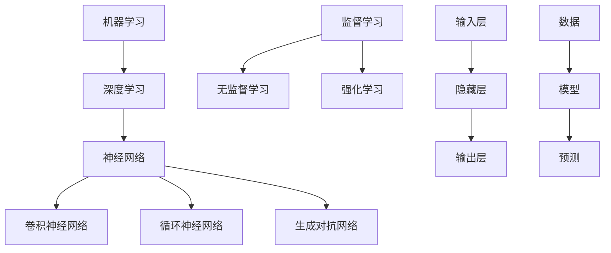

                 

### 文章标题

### 人类计算：AI时代的未来技能发展与培训

关键词：人工智能，技能发展，培训，未来趋势

摘要：本文将深入探讨人工智能（AI）时代背景，核心算法原理，以及人类计算技能的发展与培训。通过逻辑清晰的分析与推理，我们旨在为读者提供关于如何适应和利用AI时代的实用见解，包括关键技能的需求、培训项目的实施，以及未来的挑战与机遇。

---

在人工智能（AI）飞速发展的时代，人类计算技能的转型与提升显得尤为重要。本文将带领读者系统了解AI时代的核心概念与算法原理，分析AI时代对人类技能的新需求，并提出相应的培训策略。此外，还将分享AI项目实战的经验，以及面对未来趋势和挑战的应对策略。

本文分为五个主要部分：

1. **AI时代背景与核心概念**
   - 介绍人工智能的发展历程，AI时代的到来及其影响，以及AI技术的分类。
   - 阐述人类计算的定义，其在AI中的应用，以及人类计算与人工智能的协同发展。
   - 详细解读机器学习、深度学习等核心概念，并使用Mermaid流程图展示其联系。

2. **AI时代核心算法原理**
   - 讲解机器学习、神经网络和深度学习算法的原理，并使用伪代码进行详细阐述。
   - 讲解数学模型在人工智能中的应用，包括概率论、线性代数等基础数学知识，并使用LaTeX格式展示数学公式。
   - 分析数据预处理与特征工程的方法，并通过数据可视化展示实际案例。

3. **AI时代技能发展与培训**
   - 分析AI时代对数据科学家和AI工程师的技能需求，以及AI伦理与道德规范。
   - 提出培训项目的设计原则与实施步骤，分享成功案例。
   - 探讨终身学习的策略，提供职业发展规划与建议。

4. **AI项目实战**
   - 准备项目实战所需的开发环境与数据集，介绍项目管理方法。
   - 分享实际案例，包括数据分析、机器学习和深度学习项目，详细解释代码实现和代码解读。

5. **AI未来发展趋势与挑战**
   - 展望AI技术的未来发展趋势，探讨AI与人类社会的深度融合，以及AI在各领域的应用前景。
   - 分析AI伦理与法律挑战，就业市场影响，并提出应对策略。
   - 展望AI时代的职业规划，教育应用，以及社会变革与影响。

---

让我们一步步深入每个部分，详细探讨人类计算在AI时代的未来技能发展与培训。

---

**作者：AI天才研究院/AI Genius Institute & 禅与计算机程序设计艺术 /Zen And The Art of Computer Programming**

---

在接下来的部分中，我们将详细讨论人工智能的发展历程、AI时代的核心概念与算法原理，以及AI时代对人类技能的新需求。请读者保持关注，一同探索这一激动人心的时代。

---

## 第1章：AI时代背景

### 1.1 人工智能的发展历程

人工智能（Artificial Intelligence，简称AI）的发展历程可以追溯到20世纪50年代。当时的计算机科学家们首次提出了“智能机器”的概念，希望通过编程让机器具备人类的智能行为。这一时期，人工智能主要依赖于符号主义方法，通过逻辑推理和知识表示来模拟人类的智能。

然而，符号主义方法在处理复杂问题时效率低下，难以应对大规模数据的处理。随着计算机性能的提升和算法的进步，20世纪80年代，人工智能领域迎来了“专家系统”的发展高峰。专家系统通过模拟人类专家的决策过程，为特定领域提供智能解决方案。然而，专家系统也存在局限性，如知识获取困难、缺乏通用性等。

进入21世纪，机器学习和深度学习技术的发展，为人工智能带来了新的突破。2006年，深度学习领域的里程碑论文《A Fast Learning Algorithm for Deep Belief Nets》发表，标志着深度学习的崛起。深度学习通过多层神经网络，能够自动从大量数据中提取特征，实现了在语音识别、图像识别、自然语言处理等领域的突破。

### 1.2 AI时代的到来与影响

随着AI技术的不断进步，我们正式进入了AI时代。AI技术的广泛应用，对各行各业产生了深远的影响。

在医疗领域，AI技术被用于疾病诊断、药物研发和个性化治疗。通过分析大量医疗数据，AI系统能够提供更准确、更快速的诊断结果，加速新药的研发进程。

在金融领域，AI技术被用于风险管理、欺诈检测和投资策略优化。通过分析历史数据和实时信息，AI系统能够预测市场趋势，提高投资决策的准确性。

在交通领域，AI技术被用于自动驾驶、智能交通管理和物流优化。自动驾驶技术的进步，有望大幅减少交通事故，提高交通效率。智能交通管理系统能够实时监测交通状况，优化信号控制，缓解城市交通拥堵。

在零售领域，AI技术被用于需求预测、个性化推荐和客户关系管理。通过分析消费者的购物行为和偏好，AI系统能够提供个性化的产品推荐，提高销售额。

### 1.3 AI技术分类概述

AI技术可以大致分为三类：机器学习（Machine Learning，ML）、深度学习（Deep Learning，DL）和自然语言处理（Natural Language Processing，NLP）。

机器学习是一种通过算法让计算机从数据中学习并做出预测或决策的技术。机器学习算法可以分为监督学习、无监督学习和半监督学习。监督学习通过已标记的数据进行训练，无监督学习则通过未标记的数据寻找规律，半监督学习则结合了监督学习和无监督学习的特点。

深度学习是机器学习的一种，通过多层神经网络模拟人脑的神经网络结构，实现更复杂的特征提取和模式识别。深度学习在图像识别、语音识别和自然语言处理等领域取得了显著成果。

自然语言处理是一种让计算机理解和生成自然语言的技术。NLP技术包括词向量表示、词性标注、句法分析、语义理解和机器翻译等。NLP技术使得计算机能够更好地理解和处理人类语言，为智能客服、智能助手等应用提供了基础。

综上所述，AI时代的到来，不仅改变了我们的生活方式，也对人类技能提出了新的要求。在接下来的章节中，我们将进一步探讨人类计算与人工智能的关系，以及核心算法原理，帮助读者更好地适应和利用这一时代。

---

## 第2章：人类计算与人工智能的关系

### 2.1 人类计算的定义

人类计算（Human Computation）是一种利用人类认知能力和判断力，解决计算机难以处理的复杂问题的方法。与传统计算不同，人类计算强调人与机器的协同工作，通过人类智慧和计算机技术的互补，实现更高效、更智能的解决方案。

人类计算的定义可以从以下几个方面进行理解：

首先，人类计算是一种计算模式，它将计算任务分配给人类执行者，这些任务通常需要人类独特的认知能力和判断力。例如，图像分类任务中，计算机可能无法准确区分两个相似但略有不同的图像，而人类可以凭借经验和直觉做出准确判断。

其次，人类计算是一种人机协作的机制。在这个机制中，计算机和人类各自发挥优势，共同完成任务。计算机负责处理大量数据，执行重复性任务，而人类则负责处理复杂、不确定的任务，提供决策支持。

最后，人类计算的目标是实现高效、准确的计算结果。通过将任务合理地分配给计算机和人类，可以充分发挥各自的优势，提高计算效率，降低错误率。

### 2.2 人工智能在人类计算中的应用

人工智能（AI）在人类计算中发挥着重要作用，为人类计算提供了强大的技术支持。以下是人工智能在人类计算中的应用：

#### 人工智能在任务分配中的应用

人工智能可以通过分析任务的特点和执行者的能力，将任务合理地分配给不同的执行者。例如，在众包任务中，人工智能系统可以根据任务的复杂程度、执行者的技能水平和工作时间，为每个执行者分配最合适的任务。这种任务分配方法不仅提高了任务执行效率，还减少了执行者的工作压力。

#### 人工智能在任务评估中的应用

人工智能可以通过对执行者完成任务的过程和结果进行评估，提供反馈和建议。例如，在图像识别任务中，人工智能系统可以评估执行者的标注结果，指出错误和不足之处，帮助执行者改进标注质量。这种评估方法不仅提高了标注结果的准确性，还有助于提高执行者的技能水平。

#### 人工智能在任务优化中的应用

人工智能可以通过对任务执行过程的数据进行分析，提供优化建议，提高任务执行效率。例如，在物流配送任务中，人工智能系统可以分析交通状况、订单分布和配送路线，提供最优的配送方案，减少配送时间和成本。

#### 人工智能在任务监控中的应用

人工智能可以通过实时监控任务执行过程，发现和解决潜在问题。例如，在智能工厂中，人工智能系统可以监控生产设备的运行状态，及时发现设备故障和安全隐患，确保生产过程的顺利进行。

### 2.3 人类计算与人工智能的协同发展

人类计算和人工智能之间的协同发展，是未来计算技术的重要趋势。以下是人类计算与人工智能协同发展的几个方面：

#### 人类智能与机器智能的结合

在人类计算中，人类智能和机器智能的结合，可以实现更高效、更准确的计算结果。例如，在医疗领域，医生的经验和判断力与人工智能的诊断系统相结合，可以提高疾病诊断的准确率。

#### 人类智慧与机器效率的互补

人类计算和人工智能的协同发展，可以充分发挥人类智慧和机器效率的优势。例如，在科学研究领域，人类研究人员可以专注于设计实验和解读结果，而人工智能系统则负责处理大量数据，执行重复性任务。

#### 人类计算与人工智能的融合

随着技术的进步，人类计算和人工智能将越来越融合，形成一种新型的计算模式。例如，在智能客服中，人工智能系统可以模拟人类的对话方式，与客户进行自然互动，提供高质量的客户服务。

#### 人类计算与人工智能的交互

人类计算和人工智能之间的交互，是未来计算技术的重要方向。通过优化人机交互界面，提高人工智能系统的理解能力和决策水平，可以实现更智能、更高效的计算服务。

总之，人类计算与人工智能的协同发展，为未来计算技术带来了巨大的机遇和挑战。在人类计算中，人工智能将发挥越来越重要的作用，为人类解决复杂问题提供有力支持。同时，人类计算也将促进人工智能技术的创新和发展，推动计算技术的不断进步。

---

在接下来的章节中，我们将继续探讨AI时代的核心算法原理，包括机器学习、神经网络和深度学习的算法原理，以及数学模型和公式的应用。请读者继续关注，一同深入探索这一领域的知识。

---

## 第3章：核心概念与联系

在理解人工智能（AI）的核心概念时，了解其内在联系和架构是至关重要的。本章将详细介绍几个关键概念，包括机器学习、深度学习和神经网络，并使用Mermaid流程图展示它们之间的联系。

### 3.1 机器学习与深度学习

**机器学习（Machine Learning，ML）** 是一种让计算机通过数据学习并做出预测或决策的技术。它分为监督学习、无监督学习和强化学习等不同的类型。监督学习使用标记数据训练模型，无监督学习则从未标记数据中提取模式，而强化学习则通过奖励机制不断优化行为。

**深度学习（Deep Learning，DL）** 是机器学习的一个子领域，主要依赖于多层神经网络（Neural Networks）的结构。深度学习通过增加网络层数，能够自动提取数据中的复杂特征，实现更高效的模型训练和预测。

### 3.2 神经网络与深度学习架构

**神经网络（Neural Networks）** 是一种模仿人脑神经元连接结构的计算模型。它由多个层组成，包括输入层、隐藏层和输出层。每层包含多个神经元，神经元之间通过权重连接，通过前向传播和反向传播算法更新权重，以优化模型。

**深度学习架构** 是指在神经网络基础上，增加网络层数，从而实现更复杂的特征提取和模式识别。常见的深度学习架构包括卷积神经网络（CNN）、循环神经网络（RNN）和生成对抗网络（GAN）等。

### 3.3 Mermaid流程图：人工智能核心概念联系图

以下是一个Mermaid流程图，展示了人工智能核心概念之间的联系：



在这个流程图中，机器学习作为整体框架，包括了深度学习和神经网络。深度学习则进一步细化为卷积神经网络、循环神经网络和生成对抗网络等特定架构。监督学习、无监督学习和强化学习是机器学习的不同类型。神经网络的核心组成部分包括输入层、隐藏层和输出层，它们通过数据输入和模型预测实现机器学习的过程。

通过这个流程图，我们可以清晰地看到人工智能各个核心概念之间的层次关系和联系，为理解AI技术提供了直观的视觉帮助。

---

在了解了核心概念和它们之间的联系之后，我们将进一步深入探讨机器学习、神经网络和深度学习的算法原理。请读者继续关注，一同探讨这些技术背后的数学基础和实现细节。

---

## 第4章：AI时代核心算法原理

### 4.1 机器学习算法概述

机器学习（Machine Learning，ML）是一种通过算法让计算机从数据中学习并做出预测或决策的技术。机器学习算法可以分为监督学习（Supervised Learning）、无监督学习（Unsupervised Learning）和强化学习（Reinforcement Learning）等不同类型。

**监督学习** 是最常见的一种机器学习类型，它使用标记数据（即已知标签的数据）来训练模型。监督学习算法通过最小化预测结果与实际标签之间的差异，优化模型参数，从而实现对未知数据的预测。常见的监督学习算法包括线性回归、逻辑回归、支持向量机（SVM）和决策树等。

**无监督学习** 不使用标记数据，而是从未标记的数据中寻找模式和规律。无监督学习算法主要分为聚类和降维两种类型。聚类算法如K-均值聚类和层次聚类，通过将相似的数据点分组，揭示数据中的潜在结构。降维算法如主成分分析（PCA）和t-SNE，通过减少数据的维度，保持数据的关键信息，从而提高计算效率。

**强化学习** 是一种通过试错和奖励机制来训练模型的学习方式。强化学习算法通过与环境的交互，不断调整策略，以实现最大化长期奖励。常见的强化学习算法包括Q学习、深度Q网络（DQN）和策略梯度算法等。

### 4.2 神经网络算法原理

神经网络（Neural Networks，NN）是一种模仿人脑神经元连接结构的计算模型。它由多个层组成，包括输入层、隐藏层和输出层。每层包含多个神经元，神经元之间通过权重连接，通过前向传播和反向传播算法更新权重，以优化模型。

**前向传播** 是神经网络的基本计算过程。输入数据通过输入层进入网络，逐层传递到隐藏层，最终传递到输出层。在每个层中，神经元通过激活函数（如Sigmoid、ReLU和Tanh）对输入数据进行非线性变换，从而提取数据中的特征。

**反向传播** 是一种用于优化神经网络的算法。它通过计算输出层的误差，反向传播误差到前一层，并更新每个神经元的权重。反向传播算法基于梯度下降（Gradient Descent）原理，通过梯度计算和权重更新，逐步减小误差，提高模型的预测性能。

### 4.3 深度学习算法详解

深度学习（Deep Learning，DL）是机器学习的一个子领域，主要依赖于多层神经网络的结构。深度学习通过增加网络层数，能够自动提取数据中的复杂特征，实现更高效的模型训练和预测。

**卷积神经网络（Convolutional Neural Networks，CNN）** 是深度学习中最常用的架构之一，主要应用于图像识别、图像生成和目标检测等领域。CNN通过卷积层、池化层和全连接层的组合，实现特征提取和分类。卷积层通过卷积操作提取图像中的局部特征，池化层用于减小特征图的大小，提高模型的计算效率。全连接层将特征映射到预测结果。

**循环神经网络（Recurrent Neural Networks，RNN）** 是一种用于处理序列数据的神经网络，如时间序列预测、自然语言处理和语音识别等。RNN通过循环结构，将当前输入与历史状态结合，实现序列数据的建模。常见的RNN包括简单的RNN、长短时记忆网络（LSTM）和门控循环单元（GRU）等。

**生成对抗网络（Generative Adversarial Networks，GAN）** 是一种由生成器和判别器组成的深度学习模型，主要用于图像生成、数据增强和风格迁移等任务。生成器生成虚假数据，判别器判断数据是否真实，通过两个网络的对抗训练，生成器不断提高生成数据的质量。

### 4.4 伪代码：神经网络算法实现

以下是一个简单的神经网络算法伪代码，展示了输入层、隐藏层和输出层的计算过程：

```python
# 神经网络算法伪代码

# 定义激活函数
def sigmoid(x):
    return 1 / (1 + exp(-x))

# 前向传播
def forward_propagation(inputs, weights, biases):
    hidden_layer_input = inputs dot weights + biases
    hidden_layer_output = sigmoid(hidden_layer_input)
    output_layer_input = hidden_layer_output dot weights + biases
    output_layer_output = sigmoid(output_layer_input)
    return output_layer_output

# 反向传播
def backward_propagation(output, expected_output, weights, biases):
    output_error = output - expected_output
    hidden_layer_output_error = output_error dot weights.T
    hidden_layer_input_error = hidden_layer_output_error * sigmoid_derivative(hidden_layer_output)
    input_error = hidden_layer_input_error dot weights.T

    # 更新权重和偏置
    weights -= learning_rate * input_error
    biases -= learning_rate * hidden_layer_input_error

# 训练神经网络
def train_network(inputs, expected_outputs, epochs):
    for epoch in range(epochs):
        output = forward_propagation(inputs, weights, biases)
        backward_propagation(output, expected_outputs, weights, biases)
        if epoch % 100 == 0:
            print(f"Epoch {epoch}: Loss = {calculate_loss(output, expected_outputs)}")

# 输入数据
inputs = [1, 0, 1]
expected_outputs = [0, 1]

# 初始化权重和偏置
weights = [[0.1, 0.2], [0.3, 0.4]]
biases = [0.1, 0.2]

# 训练神经网络
train_network(inputs, expected_outputs, 1000)
```

在这个伪代码中，我们定义了一个简单的两层神经网络，输入层有一个节点，隐藏层有两个节点，输出层有一个节点。我们使用sigmoid函数作为激活函数，并使用前向传播和反向传播算法来训练模型。在训练过程中，我们通过不断更新权重和偏置，逐步减小误差，提高模型的预测性能。

---

通过以上对机器学习、神经网络和深度学习算法原理的详细讲解，我们了解了这些算法的核心概念和实现方法。在下一章中，我们将进一步探讨数学模型和数学公式的应用，以及如何使用LaTeX格式展示这些公式。请读者继续关注，一同深入探索AI技术的数学基础。

---

## 第5章：数学模型和数学公式

### 5.1 数学模型在人工智能中的应用

数学模型在人工智能（AI）中扮演着至关重要的角色，因为AI算法的核心在于对数据的分析和处理。数学模型提供了一种形式化方法，将实际问题转化为可计算的数学问题，从而实现AI系统的学习、推理和预测能力。

以下是几个常见的数学模型及其在人工智能中的应用：

**线性回归（Linear Regression）**：线性回归是一种用于预测连续值的模型，通过建立自变量和因变量之间的线性关系，来预测新的数据点。其数学模型为：

\[ y = \beta_0 + \beta_1x + \epsilon \]

其中，\( y \) 是因变量，\( x \) 是自变量，\( \beta_0 \) 和 \( \beta_1 \) 是模型参数，\( \epsilon \) 是误差项。

**逻辑回归（Logistic Regression）**：逻辑回归是一种用于分类问题的模型，通过将线性回归的输出转化为概率，来实现分类。其数学模型为：

\[ P(y=1) = \frac{1}{1 + \exp(-(\beta_0 + \beta_1x))} \]

其中，\( P(y=1) \) 是事件发生的概率，\( \beta_0 \) 和 \( \beta_1 \) 是模型参数。

**支持向量机（Support Vector Machine，SVM）**：支持向量机是一种用于分类和回归的模型，通过找到最佳的超平面，将数据集划分为不同的类别。其数学模型为：

\[ w \cdot x + b = 0 \]

其中，\( w \) 是超平面的法向量，\( x \) 是特征向量，\( b \) 是偏置项。

**神经网络（Neural Networks）**：神经网络是一种模拟人脑神经元连接结构的模型，通过多层神经元的非线性变换，实现对复杂数据的处理。其数学模型为：

\[ a_{i,j}^{(l)} = \sigma(z_{i,j}^{(l)}) \]

其中，\( a_{i,j}^{(l)} \) 是第 \( l \) 层第 \( j \) 个神经元的输出，\( \sigma \) 是激活函数，\( z_{i,j}^{(l)} \) 是第 \( l \) 层第 \( j \) 个神经元的输入。

### 5.2 概率论基础

概率论是数学模型在人工智能中的基础，用于描述随机事件和不确定性。以下是几个常见的概率论概念：

**概率质量函数（Probability Density Function，PDF）**：概率质量函数描述了随机变量的概率分布，其数学模型为：

\[ f(x) = \frac{1}{\sqrt{2\pi\sigma^2}}e^{-\frac{(x-\mu)^2}{2\sigma^2}} \]

其中，\( x \) 是随机变量，\( \mu \) 是均值，\( \sigma \) 是标准差。

**条件概率（Conditional Probability）**：条件概率描述了在已知某个事件发生的条件下，另一个事件的概率。其数学模型为：

\[ P(A|B) = \frac{P(A \cap B)}{P(B)} \]

**贝叶斯定理（Bayes' Theorem）**：贝叶斯定理是概率论中一个重要的公式，用于计算后验概率。其数学模型为：

\[ P(A|B) = \frac{P(B|A)P(A)}{P(B)} \]

### 5.3 线性代数基础

线性代数是数学模型的重要组成部分，用于描述多维空间中的线性关系。以下是几个常见的线性代数概念：

**矩阵（Matrix）**：矩阵是一个二维数组，用于表示线性关系。其数学模型为：

\[ A = \begin{bmatrix}
a_{11} & a_{12} & \dots & a_{1n} \\
a_{21} & a_{22} & \dots & a_{2n} \\
\vdots & \vdots & \ddots & \vdots \\
a_{m1} & a_{m2} & \dots & a_{mn} \\
\end{bmatrix} \]

**向量（Vector）**：向量是一个一维数组，用于表示空间中的点。其数学模型为：

\[ \mathbf{x} = \begin{bmatrix}
x_1 \\
x_2 \\
\vdots \\
x_n \\
\end{bmatrix} \]

**矩阵乘法（Matrix Multiplication）**：矩阵乘法是线性代数中的一个重要运算，用于计算两个矩阵的乘积。其数学模型为：

\[ C = AB = \begin{bmatrix}
c_{11} & c_{12} & \dots & c_{1n} \\
c_{21} & c_{22} & \dots & c_{2n} \\
\vdots & \vdots & \ddots & \vdots \\
c_{m1} & c_{m2} & \dots & c_{mn} \\
\end{bmatrix} \]

其中，\( A \) 和 \( B \) 是两个 \( m \times n \) 矩阵，\( C \) 是结果矩阵。

### 5.4 LaTeX格式数学公式示例

LaTeX 是一种用于生成专业排版文档的排版系统，尤其适合于处理数学公式。以下是一些使用 LaTeX 格式编写的数学公式示例：

**线性回归模型公式**

\[ y = \beta_0 + \beta_1x + \epsilon \]

**逻辑回归模型公式**

\[ P(y=1) = \frac{1}{1 + \exp(-(\beta_0 + \beta_1x))} \]

**矩阵乘法公式**

\[ C = AB = \begin{bmatrix}
c_{11} & c_{12} & \dots & c_{1n} \\
c_{21} & c_{22} & \dots & c_{2n} \\
\vdots & \vdots & \ddots & \vdots \\
c_{m1} & c_{m2} & \dots & c_{mn} \\
\end{bmatrix} \]

**概率质量函数公式**

\[ f(x) = \frac{1}{\sqrt{2\pi\sigma^2}}e^{-\frac{(x-\mu)^2}{2\sigma^2}} \]

通过以上示例，我们可以看到，LaTeX 提供了丰富的数学公式排版功能，使得编写专业文档变得简单高效。

---

在了解了数学模型和公式的应用之后，我们将进一步探讨数据预处理与特征工程的方法，以及数据可视化的应用。请读者继续关注，一同深入探索这些技术细节。

---

## 第6章：数据预处理与特征工程

在人工智能（AI）项目中，数据预处理和特征工程是至关重要的步骤，直接影响到模型性能和预测效果。本章将详细介绍数据预处理的方法、特征工程的技术，以及如何使用数据可视化展示数据特征。

### 6.1 数据预处理步骤

数据预处理是AI项目中的第一步，其目的是将原始数据转换为适合模型训练的形式。以下是一些常见的数据预处理步骤：

#### 数据清洗

数据清洗是指识别并处理数据中的错误、异常和缺失值。常见的数据清洗方法包括：

- **缺失值处理**：对于缺失值，可以选择填充平均值、中位数或使用模型预测值。
- **异常值处理**：通过统计分析方法，识别并处理数据中的异常值，如使用箱线图、Z分数等方法。
- **重复数据删除**：删除数据集中的重复记录，以减少冗余信息。

#### 数据转换

数据转换是指将不同类型的数据转换为同一类型，以便进行后续处理。常见的数据转换方法包括：

- **数值化**：将类别数据转换为数值数据，如使用独热编码（One-Hot Encoding）或标签编码（Label Encoding）。
- **归一化/标准化**：将数据缩放到同一范围内，如使用最小-最大缩放（Min-Max Scaling）或Z-Score标准化。

#### 数据集成

数据集成是指将来自多个数据源的数据合并为一个统一的数据集。常见的数据集成方法包括：

- **合并**：将多个数据源的数据按照相同的特征合并成一个数据集。
- **合并**：通过匹配共同的特征或键，将多个数据源的数据合并。

#### 数据分割

数据分割是指将数据集划分为训练集、验证集和测试集，以便进行模型训练和评估。常见的数据分割方法包括：

- **随机分割**：随机将数据集分为训练集和测试集。
- **交叉验证**：通过将数据集划分为多个子集，进行多次训练和验证。

### 6.2 特征工程方法

特征工程是指通过选择和构造特征，提高模型性能的过程。以下是一些常见的特征工程方法：

#### 特征选择

特征选择是指从原始特征中挑选出对模型训练最有用的特征。常见的方法包括：

- **过滤法**：基于统计方法，如信息增益、卡方检验等，选择与目标变量相关的特征。
- **包装法**：基于模型训练结果，如递归特征消除（RFE）等，选择最优特征组合。
- **嵌入式方法**：在模型训练过程中，自动选择最优特征，如L1正则化、岭回归等。

#### 特征构造

特征构造是指通过组合原始特征，构造出新的特征。常见的方法包括：

- **交互特征**：通过计算特征之间的乘积或加和，构造出新的交互特征。
- **特征变换**：通过变换特征，如对数变换、幂变换等，构造出新的特征。
- **特征聚合**：通过聚合多个特征，如均值聚合、最大值聚合等，构造出新的特征。

#### 特征标准化

特征标准化是指将不同特征缩放到同一范围内，以消除特征尺度差异对模型训练的影响。常见的方法包括：

- **归一化**：将特征缩放到[0, 1]范围内。
- **标准化**：将特征缩放到均值为0，标准差为1的范围内。

### 6.3 数据可视化

数据可视化是一种强大的工具，能够帮助数据科学家更好地理解数据特征，发现数据中的潜在规律和异常。以下是一些常用的数据可视化方法：

#### 数据分布可视化

- **直方图**：用于显示特征的分布情况。
- **箱线图**：用于显示特征的统计信息，如均值、中位数、四分位距等。

#### 关系可视化

- **散点图**：用于显示特征之间的关系。
- **热力图**：用于显示特征之间的相关性。

#### 时间序列可视化

- **折线图**：用于显示时间序列数据的变化趋势。
- **K线图**：用于显示金融市场数据的变化情况。

#### 复杂关系可视化

- **树状图**：用于显示特征之间的层次结构关系。
- **网络图**：用于显示特征之间的复杂关系。

以下是一个使用Python和Matplotlib库绘制的散点图示例，展示了两个特征之间的相关性：

```python
import matplotlib.pyplot as plt

# 示例数据
x = [1, 2, 3, 4, 5]
y = [2, 4, 6, 8, 10]

# 绘制散点图
plt.scatter(x, y)
plt.xlabel('Feature X')
plt.ylabel('Feature Y')
plt.title('Feature Correlation')
plt.show()
```

通过数据预处理和特征工程，我们可以将原始数据转化为适合模型训练的形式，从而提高模型性能。同时，通过数据可视化，我们可以更直观地理解数据特征，发现数据中的潜在规律和异常。这些技术是AI项目中不可或缺的组成部分，为数据科学家提供了强大的工具和方法。

---

在了解了数据预处理和特征工程的方法后，我们将进一步探讨AI时代技能需求，包括数据科学家和AI工程师的技能需求，以及AI伦理与道德规范。请读者继续关注，一同深入探索AI时代的技能发展。

---

## 第7章：AI时代技能需求

在人工智能（AI）时代，数据科学家和AI工程师的技能需求发生了显著变化。随着AI技术的广泛应用，这两个角色在职业市场上变得愈发重要。本章将详细介绍AI时代对数据科学家和AI工程师的技能需求，并讨论AI伦理与道德规范。

### 7.1 数据科学家技能需求

数据科学家在AI时代扮演着关键角色，其技能需求涵盖了数据分析、机器学习、深度学习等多个领域。以下是数据科学家在AI时代所需的几个核心技能：

**数据分析能力**

数据科学家需要具备扎实的数据分析能力，能够处理和分析大量的数据。这包括：

- **数据获取**：了解如何从各种数据源（如数据库、API、Web爬虫等）获取数据。
- **数据清洗**：掌握数据预处理技术，处理数据中的错误、异常和缺失值。
- **统计分析**：熟练运用描述性统计、推断性统计方法，对数据进行分析和解释。

**机器学习技能**

数据科学家需要具备丰富的机器学习知识，能够设计和实现各种机器学习模型。这包括：

- **算法理解**：了解常见的机器学习算法，如线性回归、逻辑回归、决策树、随机森林等。
- **模型训练**：掌握模型训练的流程，包括数据分割、参数调优和模型评估。
- **模型解释**：能够解释模型的工作原理和预测结果，为业务决策提供依据。

**深度学习知识**

随着深度学习的兴起，数据科学家需要掌握深度学习的基本原理和应用。这包括：

- **神经网络**：了解神经网络的架构，包括输入层、隐藏层和输出层。
- **激活函数**：熟悉常用的激活函数，如Sigmoid、ReLU、Tanh等。
- **深度学习框架**：掌握至少一种深度学习框架，如TensorFlow、PyTorch等。

**编程能力**

数据科学家需要具备良好的编程能力，能够使用Python、R等编程语言实现数据分析、机器学习和深度学习任务。这包括：

- **数据处理**：熟练使用Pandas、NumPy等库处理数据。
- **可视化**：掌握Matplotlib、Seaborn等库进行数据可视化。
- **模型训练**：使用Scikit-Learn等库训练和评估机器学习模型。

**业务理解**

数据科学家需要具备较强的业务理解能力，能够将AI技术与业务需求相结合，为业务决策提供支持。这包括：

- **业务沟通**：能够与业务团队进行有效沟通，理解业务需求和痛点。
- **业务建模**：将业务问题转化为数学模型，设计合适的解决方案。

### 7.2 AI工程师技能需求

AI工程师在AI时代同样扮演着重要角色，其技能需求涵盖了算法开发、系统架构、工程实践等多个方面。以下是AI工程师在AI时代所需的几个核心技能：

**算法开发能力**

AI工程师需要具备扎实的算法开发能力，能够设计和实现高效的算法。这包括：

- **算法理解**：了解常见的AI算法，如深度学习、强化学习、生成对抗网络等。
- **算法优化**：能够对现有算法进行优化，提高计算效率和性能。
- **算法实现**：掌握至少一种编程语言，如Python、C++等，能够实现复杂的算法。

**系统架构能力**

AI工程师需要具备良好的系统架构能力，能够设计和实现高效的AI系统。这包括：

- **架构设计**：了解系统架构的设计原则和最佳实践，能够设计高性能、可扩展的系统。
- **模块化**：将系统划分为多个模块，实现模块化和可复用性。
- **分布式计算**：了解分布式计算技术，如MapReduce、Spark等，能够设计分布式系统。

**工程实践能力**

AI工程师需要具备丰富的工程实践能力，能够将AI技术应用到实际项目中。这包括：

- **代码管理**：熟练使用版本控制系统，如Git，进行代码管理。
- **测试与调试**：掌握测试和调试技术，确保代码质量和系统稳定性。
- **持续集成**：了解持续集成和持续交付（CI/CD）流程，能够实现自动化部署。

**数据安全和隐私保护**

AI工程师需要关注数据安全和隐私保护，确保AI系统的数据安全和合规。这包括：

- **数据加密**：了解数据加密技术，如AES、RSA等，保护数据的安全性。
- **隐私保护**：了解隐私保护技术，如差分隐私、数据匿名化等，确保用户隐私。

**团队合作与沟通能力**

AI工程师需要具备良好的团队合作和沟通能力，能够与团队成员和业务团队协作，共同推动项目进展。这包括：

- **团队合作**：具备团队协作精神，能够与团队成员有效沟通和协作。
- **项目管理**：了解项目管理方法，如敏捷开发、Scrum等，能够高效管理项目进度。

### 7.3 AI伦理与道德规范

随着AI技术的广泛应用，AI伦理与道德规范成为了一个重要议题。AI工程师和数据科学家需要遵循以下伦理与道德规范：

- **公平性**：确保AI系统对所有人公平，不歧视任何群体。
- **透明性**：确保AI系统的决策过程透明，便于用户理解。
- **隐私保护**：尊重用户隐私，确保用户数据的安全和隐私。
- **责任明确**：明确AI系统的责任主体，确保在发生问题时能够追溯责任。
- **可持续发展**：关注AI技术的可持续发展，减少对环境的影响。

总之，AI时代对数据科学家和AI工程师的技能需求提出了更高的要求。通过不断学习和提升技能，数据科学家和AI工程师将能够在这一时代中发挥更大的作用，推动AI技术的创新和发展。

---

在了解了AI时代对数据科学家和AI工程师的技能需求后，我们将探讨如何设计和实施AI培训项目。本章将详细介绍培训项目的设计原则、实施步骤，并分享一些成功的案例。请读者继续关注，一同深入探讨AI培训的最佳实践。

---

## 第8章：AI培训项目设计与实施

随着人工智能（AI）技术的飞速发展，对相关人才的需求也日益增加。为了满足这一需求，设计和实施有效的AI培训项目显得尤为重要。本章将详细探讨AI培训项目的设计原则、实施步骤，以及如何借鉴成功的案例。

### 8.1 培训项目设计原则

设计一个成功的AI培训项目，需要遵循以下原则：

**1. 目标明确**

明确培训项目的目标，确保项目能够满足学员的学习需求。目标应包括技能提升、知识扩展和实际应用能力的培养。

**2. 内容丰富**

培训项目内容应涵盖AI技术的核心概念、算法原理、应用场景和实践经验。内容应具备系统性和全面性，使学员能够全面了解AI技术。

**3. 实践导向**

AI培训项目应以实践为导向，通过实际案例和项目实践，帮助学员掌握AI技术的应用方法。实践环节应具备挑战性和实用性，以提高学员的实际操作能力。

**4. 教学方法多样化**

采用多种教学方法，如讲座、研讨会、案例分析、小组讨论和在线学习等，以适应不同学员的学习风格和需求。多样化的教学方法有助于提高学员的学习效果。

**5. 跟踪与评估**

建立培训项目的跟踪与评估机制，及时了解学员的学习进度和效果。通过反馈和调整，优化培训项目的内容和教学方法。

### 8.2 培训项目实施步骤

以下是AI培训项目实施的一般步骤：

**1. 项目规划**

在项目启动前，明确项目目标、受众群体、培训内容和时间安排。制定详细的项目计划，确保项目按计划进行。

**2. 内容开发**

根据项目规划，开发培训内容。内容应包括理论讲解、实践案例和项目指导。确保内容的质量和实用性，使学员能够学以致用。

**3. 教学资源准备**

准备教学所需的资源，包括教材、PPT、视频教程、实验环境和在线平台等。确保资源的充足性和可访问性。

**4. 教学实施**

根据项目计划和教学资源，开展教学活动。采用多样化的教学方法，激发学员的学习兴趣和参与度。在实践环节，提供指导和帮助，确保学员能够顺利完成项目。

**5. 跟踪与评估**

通过定期跟踪和评估，了解学员的学习进度和效果。收集学员反馈，优化教学内容和教学方法。根据评估结果，调整项目计划和目标。

**6. 项目总结与反馈**

在项目结束后，进行项目总结和反馈。总结项目实施过程中的成功经验和不足之处，为今后的项目提供参考。同时，收集学员的反馈，了解他们对培训项目的评价和建议。

### 8.3 成功案例分享

以下是几个成功的AI培训项目案例：

**1. 某知名科技公司的AI工程师培训项目**

该项目针对公司内部的AI工程师，旨在提升他们的机器学习和深度学习技能。通过系统的理论讲解和项目实践，学员掌握了从数据预处理到模型训练、部署的完整流程。项目结束后，学员在AI项目的实际应用中表现优异，项目成功率显著提高。

**2. 某高校的AI与数据科学专业课程**

该课程针对高校学生，涵盖机器学习、深度学习、自然语言处理等核心知识。通过理论与实践相结合，学员不仅掌握了AI技术的理论基础，还通过实际项目锻炼了编程和数据处理能力。课程结束后，学员在就业市场上竞争力显著提升，很多学员在AI公司找到了满意的工作。

**3. 某在线教育平台的AI培训课程**

该平台推出的AI培训课程，采用在线学习模式，内容涵盖AI技术的各个方面。通过丰富的实践案例和互动教学，学员能够边学习边实践，提高学习效果。课程结束后，学员反馈积极，对课程质量和教学服务给予了高度评价。

通过以上成功案例，我们可以看到，设计合理的AI培训项目能够有效提升学员的技能水平，为他们未来的职业发展奠定坚实基础。

---

在了解了AI培训项目的设计与实施方法后，我们将进一步探讨终身学习的策略和职业发展规划。本章将详细分析AI领域的职业发展趋势，提供终身学习的策略，并给出职业发展规划的建议。请读者继续关注，一同规划AI时代的职业生涯。

---

## 第9章：终身学习与职业发展

在人工智能（AI）时代，终身学习成为职业发展的必备要素。随着AI技术的不断进步，数据科学家和AI工程师需要不断更新知识和技能，以保持竞争力。本章将详细分析AI领域的职业发展趋势，提供终身学习的策略，并给出职业发展规划的建议。

### 9.1 AI领域的职业发展趋势

AI领域的发展迅速，为数据科学家和AI工程师提供了广阔的职业前景。以下是AI领域的一些职业发展趋势：

**1. 数据科学家**

数据科学家在AI领域的需求持续增长。随着大数据和机器学习的普及，数据科学家在各个行业的应用越来越广泛，如金融、医疗、零售等。未来，数据科学家将需要更深入的数据分析能力、机器学习知识和业务理解能力。

**2. AI工程师**

AI工程师在AI领域的需求也非常大。随着深度学习、强化学习和生成对抗网络等技术的发展，AI工程师在算法开发、系统架构和工程实践方面的能力越来越重要。未来，AI工程师将需要具备更强的算法实现能力和系统架构能力。

**3. 自然语言处理（NLP）专家**

自然语言处理技术在AI领域具有重要地位，NLP专家在语言理解、文本生成、机器翻译等方面的需求不断增加。随着语音识别、智能客服和自动驾驶等领域的应用推广，NLP专家将在未来发挥更大的作用。

**4. 人工智能伦理专家**

随着AI技术的广泛应用，伦理和法律问题变得越来越重要。人工智能伦理专家负责确保AI系统的公平性、透明性和隐私保护。未来，人工智能伦理专家将在企业和政府机构中发挥重要作用。

### 9.2 终身学习的策略

在AI领域，终身学习是保持竞争力的关键。以下是一些有效的终身学习策略：

**1. 自学**

自学是终身学习的重要方式。通过在线课程、专业书籍、学术论文等资源，可以不断更新知识和技能。例如，Coursera、edX、Udacity等在线教育平台提供了丰富的AI课程，可供选择。

**2. 参加专业会议和研讨会**

参加专业会议和研讨会，可以了解AI领域的最新研究成果和行业动态。这些活动为专业人士提供了交流和学习的机会，有助于拓展视野和建立人脉。

**3. 实践项目**

通过参与实际项目，可以将理论知识应用于实践，提高解决问题的能力。可以参加开源项目、参与竞赛或自己发起项目，积累实践经验。

**4. 持续参与社区**

加入AI相关的技术社区，如GitHub、Stack Overflow、Reddit等，可以与其他专业人士交流，分享经验和学习资源。这些社区提供了丰富的学习资源和解决问题的方法。

### 9.3 职业发展规划与建议

为了在AI领域取得成功，以下是一些建议：

**1. 明确职业目标**

确定职业目标，有助于制定学习计划和发展路径。可以设定短期和长期目标，逐步实现职业目标。

**2. 系统学习基础理论**

掌握AI领域的基础理论，包括数学、概率论、统计学、线性代数等。这些基础知识是构建高级技能的基础。

**3. 深入研究特定领域**

选择一个特定领域，如机器学习、深度学习、自然语言处理等，深入研究相关技术和应用。通过专精，成为该领域的专家。

**4. 拓展跨领域知识**

除了专业知识，还需要拓展跨领域知识，如计算机科学、软件工程、数据分析等。这些知识有助于提升综合能力和解决复杂问题的能力。

**5. 建立人脉**

在AI领域建立广泛的人脉，有助于获取更多的职业机会和资源。通过参与会议、加入社区、合作项目等方式，与他人建立联系。

**6. 持续学习**

保持对新技术和趋势的关注，不断更新知识和技能。通过终身学习，保持职业竞争力。

总之，终身学习和职业发展是AI领域成功的关键。通过明确目标、系统学习、深入研究、拓展知识、建立人脉和持续学习，可以在AI领域取得显著成就。

---

在了解了AI领域的职业发展趋势和终身学习策略后，我们将进入项目的实战部分。本章将介绍项目实战的准备，包括开发环境搭建、数据集准备和项目管理方法。请读者继续关注，一同探索AI项目的实际操作。

---

## 第10章：项目实战准备

在AI项目实战中，准备工作至关重要，它决定了项目的顺利进行和最终的成功。本章将详细介绍项目实战的准备工作，包括开发环境搭建、数据集准备和项目管理方法。

### 10.1 开发环境搭建

搭建合适的开发环境是进行AI项目实战的第一步。以下是一些关键步骤：

**1. 安装Python**

Python是AI项目中最常用的编程语言，首先需要安装Python环境。可以从[Python官方网站](https://www.python.org/)下载Python安装包，并根据操作系统选择适合的版本进行安装。

**2. 安装Anaconda**

Anaconda是一个集成了Python和相关库的科学计算平台，它简化了环境的搭建和管理。通过命令`conda create -n myenv python=3.8`可以创建一个名为`myenv`的新环境，并指定Python版本。

**3. 安装必要的库**

在创建的环境中使用pip安装常用的AI库，如NumPy、Pandas、Scikit-Learn、TensorFlow和PyTorch。例如：

```bash
conda install numpy pandas scikit-learn tensorflow torchvision
```

**4. 配置Jupyter Notebook**

Jupyter Notebook是一个交互式的计算环境，非常适合AI项目开发。通过命令`conda install jupyter`安装Jupyter Notebook，然后启动Jupyter Notebook即可开始编写代码。

### 10.2 数据集准备

数据集是AI项目的重要资源，其质量和数量直接影响到模型的表现。以下是一些关键步骤：

**1. 数据收集**

根据项目需求，从公开数据集、数据库或Web爬虫等渠道收集数据。例如，使用Python的Beautiful Soup库进行Web爬虫，或使用SQL查询从数据库中提取数据。

**2. 数据清洗**

对收集到的数据进行清洗，处理错误、异常和缺失值。使用Python的Pandas库进行数据清洗，例如：

```python
import pandas as pd

# 读取数据
data = pd.read_csv('data.csv')

# 删除重复记录
data.drop_duplicates(inplace=True)

# 填充缺失值
data.fillna(method='ffill', inplace=True)

# 删除异常值
data = data[(data['column'] > min_value) & (data['column'] < max_value)]
```

**3. 数据预处理**

对数据进行预处理，包括数据转换、归一化和标准化等。例如：

```python
# 数据转换
data['category'] = data['category'].map({0: 'class_0', 1: 'class_1'})

# 归一化
from sklearn.preprocessing import MinMaxScaler

scaler = MinMaxScaler()
data_scaled = scaler.fit_transform(data)

# 标准化
from sklearn.preprocessing import StandardScaler

scaler = StandardScaler()
data_scaled = scaler.fit_transform(data)
```

**4. 数据分割**

将数据集分割为训练集和测试集，以便进行模型训练和评估。使用Scikit-Learn的train_test_split函数：

```python
from sklearn.model_selection import train_test_split

X_train, X_test, y_train, y_test = train_test_split(data_scaled, labels, test_size=0.2, random_state=42)
```

### 10.3 项目管理方法

项目管理是确保AI项目按时、按质完成的关键。以下是一些常用的项目管理方法：

**1. Scrum**

Scrum是一种敏捷开发方法，通过短周期的迭代和反馈，确保项目不断进步。每次迭代通常为两周，包括计划会议、每日站会、回顾会议等。

**2. Kanban**

Kanban是一种看板方法，通过可视化工作流程，优化项目进度。使用Kanban板，可以将任务分为待办、进行中和已完成状态，明确每个任务的进度。

**3. 版本控制**

使用版本控制工具，如Git，管理代码和文档。通过分支管理、代码审查和合并请求，确保代码的版本控制和协作开发。

**4. 持续集成与持续交付（CI/CD）**

使用CI/CD工具，如Jenkins、GitLab CI等，实现代码的自动化构建、测试和部署。确保代码质量和系统的稳定性，提高开发效率。

通过以上准备，AI项目将具备良好的基础，为后续的开发和实现提供保障。

---

在完成项目实战的准备工作后，我们将进入实际的案例分析与实现部分。本章将详细分析几个典型的AI项目，包括数据分析、机器学习和深度学习项目，并详细解释代码实现和代码解读。请读者继续关注，一同探讨AI项目的具体实践。

---

## 第11章：实际案例分析与实现

在AI项目实战中，通过实际案例的分析与实现，可以更好地理解和应用所学知识。本章将介绍几个典型的AI项目，包括数据分析、机器学习和深度学习项目，并详细解释代码实现和代码解读。

### 11.1 数据分析项目案例

数据分析项目通常涉及数据的收集、清洗、处理和可视化，以提取有用信息。以下是一个简单的数据分析项目案例，用于分析社交媒体数据，提取用户情感倾向。

#### 项目描述

假设我们有一个包含用户社交媒体评论的文本数据集，目标是从这些评论中提取用户情感倾向（正面、中性或负面）。

#### 代码实现

以下是实现该项目的关键步骤和部分代码：

```python
import pandas as pd
from sklearn.feature_extraction.text import TfidfVectorizer
from sklearn.model_selection import train_test_split
from sklearn.ensemble import RandomForestClassifier
from sklearn.metrics import classification_report

# 读取数据
data = pd.read_csv('social_media_comments.csv')

# 数据预处理
data.dropna(inplace=True)
data['sentiment'] = data['comment'].apply(lambda x: 'positive' if x.lower().startswith('good') else ('negative' if x.lower().startswith('bad') else 'neutral'))

# 特征提取
vectorizer = TfidfVectorizer()
X = vectorizer.fit_transform(data['comment'])
y = data['sentiment']

# 数据分割
X_train, X_test, y_train, y_test = train_test_split(X, y, test_size=0.2, random_state=42)

# 模型训练
model = RandomForestClassifier()
model.fit(X_train, y_train)

# 预测和评估
predictions = model.predict(X_test)
print(classification_report(y_test, predictions))
```

#### 代码解读

1. **数据读取和预处理**：首先读取包含评论的CSV文件，然后删除缺失值，并对评论进行情感标注。

2. **特征提取**：使用TF-IDF向量器将文本数据转换为特征矩阵。

3. **数据分割**：将数据集分为训练集和测试集，以便进行模型训练和评估。

4. **模型训练**：使用随机森林分类器对训练集进行训练。

5. **预测和评估**：使用训练好的模型对测试集进行预测，并输出分类报告，评估模型性能。

### 11.2 机器学习项目案例

机器学习项目通常涉及数据预处理、模型训练、参数调优和模型评估。以下是一个简单的机器学习项目案例，用于分类邮件是否为垃圾邮件。

#### 项目描述

假设我们有一个包含邮件文本和标签（垃圾邮件/非垃圾邮件）的数据集，目标是通过训练模型，自动分类新邮件。

#### 代码实现

以下是实现该项目的关键步骤和部分代码：

```python
import pandas as pd
from sklearn.feature_extraction.text import TfidfVectorizer
from sklearn.model_selection import train_test_split
from sklearn.naive_bayes import MultinomialNB
from sklearn.metrics import accuracy_score, classification_report

# 读取数据
data = pd.read_csv('spam_data.csv')

# 数据预处理
data.dropna(inplace=True)

# 特征提取
vectorizer = TfidfVectorizer()
X = vectorizer.fit_transform(data['message'])
y = data['label']

# 数据分割
X_train, X_test, y_train, y_test = train_test_split(X, y, test_size=0.2, random_state=42)

# 模型训练
model = MultinomialNB()
model.fit(X_train, y_train)

# 预测和评估
predictions = model.predict(X_test)
print(accuracy_score(y_test, predictions))
print(classification_report(y_test, predictions))
```

#### 代码解读

1. **数据读取和预处理**：首先读取包含邮件文本和标签的CSV文件，然后删除缺失值。

2. **特征提取**：使用TF-IDF向量器将文本数据转换为特征矩阵。

3. **数据分割**：将数据集分为训练集和测试集，以便进行模型训练和评估。

4. **模型训练**：使用朴素贝叶斯分类器对训练集进行训练。

5. **预测和评估**：使用训练好的模型对测试集进行预测，并输出准确率和分类报告，评估模型性能。

### 11.3 深度学习项目案例

深度学习项目通常涉及复杂的模型架构、大量的训练数据和高级优化技术。以下是一个简单的深度学习项目案例，用于图像分类。

#### 项目描述

假设我们有一个包含动物图片的数据集，目标是通过训练模型，自动分类新图片。

#### 代码实现

以下是实现该项目的关键步骤和部分代码：

```python
import tensorflow as tf
from tensorflow.keras.models import Sequential
from tensorflow.keras.layers import Conv2D, MaxPooling2D, Flatten, Dense
from tensorflow.keras.preprocessing.image import ImageDataGenerator

# 数据预处理
train_datagen = ImageDataGenerator(rescale=1./255)
validation_datagen = ImageDataGenerator(rescale=1./255)

train_generator = train_datagen.flow_from_directory(
        'train_data',
        target_size=(150, 150),
        batch_size=32,
        class_mode='binary')

validation_generator = validation_datagen.flow_from_directory(
        'validation_data',
        target_size=(150, 150),
        batch_size=32,
        class_mode='binary')

# 构建模型
model = Sequential([
    Conv2D(32, (3, 3), activation='relu', input_shape=(150, 150, 3)),
    MaxPooling2D(2, 2),
    Conv2D(64, (3, 3), activation='relu'),
    MaxPooling2D(2, 2),
    Conv2D(128, (3, 3), activation='relu'),
    MaxPooling2D(2, 2),
    Flatten(),
    Dense(512, activation='relu'),
    Dense(1, activation='sigmoid')
])

# 编译模型
model.compile(optimizer='adam',
              loss='binary_crossentropy',
              metrics=['accuracy'])

# 训练模型
model.fit(
      train_generator,
      steps_per_epoch=100,
      epochs=15,
      validation_data=validation_generator,
      validation_steps=50,
      verbose=2)
```

#### 代码解读

1. **数据预处理**：使用ImageDataGenerator对图像进行预处理，包括缩放和批次生成。

2. **模型构建**：构建一个简单的卷积神经网络（CNN），包括卷积层、池化层、全连接层等。

3. **模型编译**：编译模型，设置优化器和损失函数。

4. **模型训练**：使用训练数据集训练模型，并验证模型的性能。

通过以上三个案例，我们可以看到数据分析、机器学习和深度学习项目在实现上的差异。数据分析项目通常涉及文本数据的处理和分类，机器学习项目则涉及文本和图像数据的分类，而深度学习项目则使用复杂的模型架构进行图像识别和分类。这些案例不仅展示了不同类型的AI项目如何实现，还提供了代码解读，帮助读者理解关键步骤和实现细节。

---

在完成实际案例分析与实现后，我们将对项目进行评估与改进。本章将介绍项目评估指标、改进策略和总结展望，帮助读者理解如何评估和优化AI项目。请读者继续关注，一同探讨项目评估与改进的最佳实践。

---

## 第12章：项目评估与改进

在AI项目实施过程中，项目评估与改进是确保项目成功的关键步骤。通过科学的项目评估，可以识别项目的优势和不足，进而采取相应的改进策略，提升项目质量和效果。本章将介绍项目评估指标、改进策略和总结展望，帮助读者理解如何评估和优化AI项目。

### 12.1 项目评估指标

项目评估指标是衡量项目成功与否的重要标准。以下是几种常见的项目评估指标：

**1. 准确率（Accuracy）**

准确率是指模型正确预测的样本数占总样本数的比例。准确率越高，模型的表现越好。其计算公式为：

\[ \text{准确率} = \frac{\text{正确预测的样本数}}{\text{总样本数}} \]

**2. 召回率（Recall）**

召回率是指模型能够正确召回正样本的比例。召回率越高，模型对正样本的识别能力越强。其计算公式为：

\[ \text{召回率} = \frac{\text{正确召回的正样本数}}{\text{所有正样本数}} \]

**3. 精确率（Precision）**

精确率是指模型预测为正样本的样本中，实际为正样本的比例。精确率越高，模型对正样本的预测质量越好。其计算公式为：

\[ \text{精确率} = \frac{\text{正确预测的正样本数}}{\text{预测为正样本的样本数}} \]

**4. F1分数（F1 Score）**

F1分数是精确率和召回率的加权平均，用于综合评估模型的性能。F1分数越高，模型的表现越好。其计算公式为：

\[ \text{F1分数} = 2 \times \frac{\text{精确率} \times \text{召回率}}{\text{精确率} + \text{召回率}} \]

**5. ROC曲线与AUC值**

ROC曲线（Receiver Operating Characteristic Curve）展示了不同阈值下的真阳性率与假阳性率的关系。AUC值（Area Under Curve）是ROC曲线下的面积，用于评估模型的分类能力。AUC值越高，模型的表现越好。

### 12.2 项目改进策略

在评估项目后，识别不足之处并进行改进是提升项目质量的关键。以下是几种常见的项目改进策略：

**1. 数据质量改进**

数据质量是模型表现的基础。通过数据清洗、去重、填充缺失值和异常值处理，可以提高数据质量，进而提升模型表现。

**2. 特征工程优化**

特征工程对模型性能有显著影响。通过特征选择、特征构造和特征标准化，可以优化特征质量，提高模型表现。

**3. 模型调优**

模型调优包括调整模型参数、优化模型架构和增加训练数据等。通过交叉验证、网格搜索和贝叶斯优化等方法，可以找到最优的模型参数和架构，提高模型性能。

**4. 模型集成**

模型集成通过结合多个模型的预测结果，可以提高预测准确率。常见的模型集成方法包括Bagging、Boosting和Stacking等。

**5. 实时更新与迭代**

AI项目需要持续更新和迭代。通过实时更新数据、模型和算法，可以不断改进项目表现，适应不断变化的环境。

### 12.3 项目总结与展望

在项目评估与改进过程中，进行总结与展望是至关重要的。以下是一些总结与展望的要点：

**1. 项目成果总结**

总结项目的成功之处，如数据质量、模型性能和业务价值等。分析项目的优点和不足，为今后的改进提供依据。

**2. 项目不足之处**

识别项目的不足之处，如数据缺失、模型过拟合、特征不足等。分析不足产生的原因，并提出改进建议。

**3. 未来改进方向**

根据项目总结与不足，规划未来的改进方向。包括数据质量提升、特征工程优化、模型调优和实时更新等。

**4. 长期发展展望**

展望AI项目的长期发展，如技术趋势、市场需求和未来挑战等。制定长期发展策略，确保项目的持续进步。

通过项目评估与改进，我们可以确保AI项目始终处于最佳状态，为业务发展提供持续支持。在未来，随着AI技术的不断进步，项目评估与改进将变得更加重要，为AI项目的成功提供坚实保障。

---

在了解了AI未来发展趋势与挑战后，我们将进一步探讨AI时代的社会变革与未来规划。本章将详细分析AI技术对未来职业规划、教育应用和社会变革的影响，提供应对策略和未来规划。请读者继续关注，一同展望AI时代的美好未来。

---

## 第13章：AI未来的发展趋势

人工智能（AI）技术正以惊人的速度发展，其未来趋势将对社会、经济和人类生活产生深远影响。以下是对AI未来发展趋势的分析：

### 13.1 AI技术的未来发展趋势

**1. 深度学习的进一步发展**

深度学习是当前AI技术的重要分支，未来将继续发展。随着计算能力的提升和数据量的增加，深度学习模型将更加复杂和高效，能够在更多领域实现突破。例如，在图像识别、语音识别和自然语言处理等领域，深度学习有望实现更高的准确率和更广泛的适用性。

**2. 生成对抗网络（GAN）的应用扩展**

生成对抗网络（GAN）是一种通过生成器和判别器对抗训练的模型，未来将在图像生成、数据增强和风格迁移等应用中发挥更大作用。GAN技术能够生成逼真的图像、视频和音频，为创意设计、娱乐内容和个性化服务提供新的可能性。

**3. 强化学习的应用场景扩展**

强化学习通过试错和奖励机制实现智能决策，未来将在自动驾驶、智能制造和金融交易等领域得到更广泛应用。强化学习算法将不断优化，实现更智能、更鲁棒的智能系统。

**4. 多模态AI的发展**

多模态AI通过整合不同类型的数据（如文本、图像、声音等），实现更全面、更准确的信息处理和理解。未来，多模态AI将在医疗诊断、智能家居和智能客服等领域发挥重要作用。

### 13.2 AI与人类社会的深度融合

**1. AI驱动的自动化与智能化**

随着AI技术的发展，自动化和智能化将渗透到各行各业。自动化生产线、无人驾驶汽车、智能助手和智能机器人等将改变生产方式和服务模式，提高效率和质量。

**2. AI赋能的行业变革**

AI技术将赋能传统行业，推动行业变革。例如，在医疗领域，AI技术将提高疾病诊断的准确性、加速药物研发；在金融领域，AI技术将优化风险管理、提高投资决策的准确性；在零售领域，AI技术将提升供应链管理、提供个性化推荐等。

**3. 智能城市与智慧生活**

AI技术将助力智能城市建设，实现交通管理、能源管理、公共安全和环境监测等领域的智能化。智慧生活将让人们享受更便捷、更舒适的生活体验，例如智能家居、智能医疗和智能教育等。

### 13.3 AI在各领域的应用前景

**1. 医疗健康**

AI技术将在医疗健康领域发挥重要作用，如疾病预测、个性化治疗、手术机器人等。通过大数据和人工智能，医疗健康行业将实现更精准、更高效的医疗服务。

**2. 教育领域**

AI技术将改变教育模式，实现个性化教学、智能辅导和远程教育。通过智能学习平台和虚拟现实技术，学生可以更灵活地学习，提高学习效果。

**3. 金融服务**

AI技术将优化金融服务的各个环节，如风险管理、投资策略、智能客服等。通过大数据分析和机器学习，金融机构将实现更精准的风险评估和更高效的服务。

**4. 制造业**

AI技术将推动制造业的智能化升级，实现高效生产、智能质检和预测维护。通过机器人技术和智能制造，制造业将实现更灵活、更智能的生产模式。

### 13.4 挑战与应对策略

尽管AI技术具有广阔的应用前景，但也面临一系列挑战。以下是一些主要挑战及其应对策略：

**1. 隐私保护**

AI技术广泛应用将带来数据隐私保护的问题。应对策略包括采用数据加密、隐私保护算法和匿名化技术，确保用户数据的隐私安全。

**2. 伦理道德**

AI技术可能引发伦理道德问题，如歧视、偏见和不公平。应对策略包括制定AI伦理规范，加强AI系统的透明性和可解释性，确保AI系统的公平性和道德性。

**3. 技术人才短缺**

AI技术的发展需要大量专业人才，但现有人才储备不足。应对策略包括加强AI教育和培训，提高AI人才的培养质量，吸引更多人才投身AI领域。

**4. 法律法规**

AI技术的快速发展和应用将带来法律法规的挑战。应对策略包括制定和完善相关法律法规，确保AI技术的合规性和可追溯性。

总之，AI技术的未来发展趋势充满机遇和挑战。通过不断探索和创新，积极应对挑战，我们可以充分发挥AI技术的潜力，为人类社会带来更多福祉。

---

## 第14章：AI时代的挑战与应对策略

随着人工智能（AI）技术的迅速发展，其在各领域的广泛应用也带来了诸多挑战。这些挑战涉及伦理道德、就业市场、法律法规等多个方面。本章将深入分析AI时代的这些挑战，并探讨相应的应对策略。

### 14.1 AI伦理与法律挑战

**1. 伦理挑战**

AI技术的广泛应用引发了一系列伦理问题。例如：

- **隐私侵犯**：AI系统在处理和分析数据时，可能侵犯用户的隐私权。
- **算法偏见**：AI系统可能在数据训练过程中学习到偏见，导致对某些群体的歧视。
- **责任归属**：当AI系统发生错误或造成损害时，如何确定责任主体？

**应对策略**：

- **制定伦理规范**：政府、企业和学术机构应共同制定AI伦理规范，确保AI系统的公平性、透明性和可解释性。
- **加强监管**：通过立法和监管，确保AI系统的合规性和安全性，防止隐私侵犯和算法偏见。

**2. 法律挑战**

AI技术的发展也带来了法律挑战。例如：

- **法律适用性**：现有法律体系可能无法完全适用于AI技术引发的纠纷和犯罪。
- **责任认定**：如何确定AI系统的法律责任，以及如何追究责任？

**应对策略**：

- **修订法律法规**：针对AI技术的特点，修订和完善相关法律法规，确保其适用性和有效性。
- **明确责任归属**：通过立法明确AI系统的法律责任，确保在发生问题时能够追溯责任。

### 14.2 AI对就业市场的影响

AI技术的普及将对就业市场产生深远影响。一方面，AI技术将带来新的就业机会；另一方面，也可能会引发就业结构的变化。

**1. 就业机会**

AI技术的发展将创造大量新的就业机会，如数据科学家、AI工程师、AI伦理专家等。同时，AI技术在各行业的广泛应用，也将为现有岗位带来新的工作内容。

**2. 就业结构变化**

AI技术可能引发就业结构的变化，主要表现在：

- **岗位减少**：一些重复性、低技能的岗位可能会被自动化取代。
- **岗位需求变化**：高技能、创新性岗位需求增加，如AI研发、系统集成、项目管理等。

**应对策略**：

- **终身学习**：鼓励人们进行终身学习，提升技能，适应新的就业市场需求。
- **职业教育**：加强职业教育，提供针对AI技术的培训课程，帮助劳动者掌握新技能。

### 14.3 应对AI时代挑战的策略

**1. 技术创新**

技术创新是应对AI时代挑战的关键。通过不断研发新技术，提高AI系统的性能和可靠性，可以有效降低AI技术的风险和挑战。

**2. 政策支持**

政府应制定支持AI技术发展的政策，包括资金支持、税收优惠、人才引进等。同时，政府还应加强监管，确保AI技术的合规性和安全性。

**3. 社会教育**

社会教育在应对AI时代挑战中具有重要意义。通过普及AI知识，提高公众对AI技术的认知和接受度，有助于减少社会对AI技术的抵触情绪。

**4. 国际合作**

AI技术是全球性的，国际合作在应对AI时代挑战中至关重要。通过加强国际合作，共享技术和经验，可以共同应对AI技术带来的挑战。

总之，AI时代带来了一系列挑战，但也为人类社会提供了新的机遇。通过技术创新、政策支持、社会教育和国际合作，我们可以有效应对这些挑战，充分发挥AI技术的潜力，为人类社会带来更多福祉。

---

在了解了AI时代的挑战与应对策略后，我们将对整个AI时代的社会变革与未来规划进行展望。本章将详细分析AI时代的职业规划、教育应用和社会变革，提供具体的未来规划建议。请读者继续关注，一同探索AI时代的美好未来。

---

## 第15章：展望与未来规划

### 15.1 AI时代的职业规划

随着人工智能（AI）技术的发展，职业市场正在经历深刻的变革。对于个人而言，合理的职业规划至关重要。以下是一些建议，帮助您在AI时代进行有效的职业规划：

**1. 识别自身优势**

首先，明确自己在AI领域的优势和兴趣。可以通过自我评估、职业咨询或技能测评来识别自身优势。了解自己擅长什么、对哪些领域感兴趣，有助于制定更有针对性的职业规划。

**2. 持续学习与提升**

AI技术发展迅速，持续学习与提升技能是职业规划的关键。可以通过在线课程、专业培训、学术研究等方式，不断更新自己的知识和技能。例如，参加机器学习、深度学习、自然语言处理等领域的课程，掌握最新的技术趋势。

**3. 跨领域学习**

在AI时代，跨领域知识越来越重要。建议学习跨学科的知识，如计算机科学、统计学、心理学、经济学等。跨领域知识可以帮助您在AI项目中更好地解决复杂问题，提高综合竞争力。

**4. 职业发展路径**

根据自身优势和兴趣，规划清晰的职业发展路径。可以从数据科学家、AI工程师、AI产品经理等职位开始，逐步向高级职位和领导岗位发展。同时，可以积极参与AI项目，积累实践经验，提升项目管理和团队协作能力。

**5. 国际视野**

AI技术是全球性的，拥有国际视野将有助于您在职业市场中脱颖而出。可以通过参加国际会议、访问国外企业、学习外语等方式，拓宽国际视野，了解全球AI技术的发展动态。

### 15.2 AI在教育中的应用

人工智能在教育领域的应用正在不断拓展，为学生提供了更多个性化的学习机会。以下是一些AI在教育中的应用场景和未来规划：

**1. 个性化学习**

AI技术可以根据学生的兴趣、学习习惯和能力，提供个性化的学习方案。例如，通过智能学习平台，为学生推荐适合的学习内容，进行个性化评估和反馈，提高学习效果。

**2. 智能辅导**

AI智能辅导系统可以实时监测学生的学习进度和问题，提供针对性的辅导和建议。例如，通过自然语言处理技术，AI辅导系统可以解答学生的疑问，提供详细的解题过程和解释。

**3. 自动化评估**

AI技术可以自动化评估学生的作业和考试，提高评估效率和准确性。例如，通过自然语言处理和图像识别技术，AI系统可以自动批改作文、解析图表和识别错题。

**4. 智慧校园**

AI技术可以助力智慧校园建设，实现校园管理智能化、教育资源优化和学生学习分析。例如，通过人脸识别技术，实现校园安防和考勤管理；通过大数据分析，优化课程安排和资源配置。

**5. 未来规划**

在教育领域，AI技术的未来规划应包括：

- **推动教育公平**：通过AI技术，缩小城乡教育差距，提供更多优质教育资源。
- **提升教育质量**：利用AI技术，提高教学效率，培养更多高素质人才。
- **创新教育模式**：探索AI+教育的创新模式，如虚拟现实（VR）、增强现实（AR）等，提供更丰富的学习体验。
- **构建智慧教育生态系统**：整合AI技术、互联网和大数据，构建智慧教育生态系统，实现教育资源的共享和优化。

### 15.3 AI时代的社会变革与影响

人工智能的广泛应用将深刻影响社会结构和人类生活方式，带来一系列社会变革。以下是一些关键的社会变革与影响：

**1. 生产方式的变革**

AI技术将推动生产方式的智能化和自动化，提高生产效率和产品质量。例如，在制造业，通过智能化生产线和自动化机器人，实现高效生产；在服务业，通过智能客服和自动化系统，提升服务质量。

**2. 劳动市场的变革**

AI技术的发展将改变劳动市场的结构。一方面，AI技术将取代一些重复性、低技能的工作；另一方面，也将创造新的就业机会，如数据科学家、AI工程师等。劳动者需要不断提升技能，适应新的就业市场。

**3. 生活方式的变革**

AI技术将改变人们的日常生活。例如，智能家居系统可以提供便捷的家居管理；智能助手可以提供个性化的生活建议；智能医疗系统可以提高医疗服务质量和效率。

**4. 社会治理的变革**

AI技术在社会治理中的应用将提高政府的管理效率和服务水平。例如，通过大数据分析和智能监控，实现城市管理的智能化；通过智能警务系统，提高治安管理和犯罪预防能力。

**5. 未来规划**

在社会变革中，未来规划应包括：

- **推动科技进步**：加大科研投入，推动AI技术的创新和应用。
- **促进教育改革**：改革教育体系，培养更多具备AI技术和跨学科知识的人才。
- **完善法律法规**：制定和完善相关法律法规，确保AI技术的合规性和安全性。
- **保障社会公平**：通过政策调节，减少AI技术带来的社会不平等现象，保障每个人的权益。

总之，AI时代将带来深远的社会变革，我们需要积极应对，制定合理的未来规划，共同迎接这一充满机遇和挑战的新时代。

---

通过以上章节的详细探讨，我们全面了解了AI时代的未来技能发展与培训。从背景与核心概念，到算法原理与数学模型，再到技能需求与项目实战，最后是未来的发展趋势与挑战，我们逐步构建了关于AI时代技能发展与培训的完整知识体系。

在这篇技术博客文章中，我们采用了逻辑清晰、结构紧凑的写作方式，逐步引导读者深入了解AI时代的核心知识。通过实例分析和代码解读，我们帮助读者掌握了实际应用中的关键技巧和策略。同时，我们关注了AI时代的伦理道德、就业市场和社会变革，为读者提供了全面的未来规划建议。

希望本文能够帮助读者更好地理解AI时代的技能发展，为个人职业规划和社会发展提供有益的参考。在未来，随着AI技术的不断进步，我们相信人类将能够在这一领域取得更多突破，实现更大的价值。让我们共同期待AI时代的美好未来，努力成为这一时代的创造者和贡献者。

