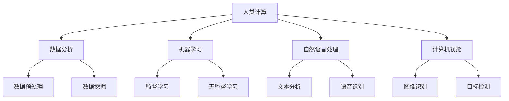

                 

## 《人类计算：AI时代的未来技能需求与培训发展》

### 关键词：人工智能、未来技能需求、培训发展、人类计算、AI时代

#### 摘要：

随着人工智能（AI）技术的飞速发展，人类计算在AI时代中的地位和作用愈发重要。本文旨在探讨AI时代下人类计算的核心技能需求，以及如何通过教育培训来适应这一变化。文章分为三个主要部分：首先，介绍人类计算与AI的基本概念及其相互关系；其次，分析未来工作场景的演变和未来技能需求的变化，提出个体技能提升策略和教育体系的调整；最后，讨论培训模式的转型和实践，展望未来人类计算的发展趋势与挑战。

---

### 引言：人类计算与AI

#### 1.1 人类计算的定义与特点

人类计算是指人类在认知、思考、推理、创造等过程中运用计算原理和方法进行信息处理的能力。这一能力的特点包括：

- **灵活性**：人类计算能够灵活处理复杂、模糊和不确定的信息。
- **创造性**：人类计算能够产生新的想法和解决方案。
- **适应能力**：人类计算能够根据不同的情境和环境进行调整。

#### 1.2 AI的崛起与影响

人工智能是指通过计算机模拟人类智能的技术，主要包括机器学习、深度学习、自然语言处理、计算机视觉等领域。AI的崛起对人类计算带来了深远的影响：

- **辅助性**：AI可以作为人类的助手，处理大量重复性、规则性的工作，从而提高工作效率。
- **替代性**：在某些领域，AI能够替代人类完成某些任务，如自动驾驶、机器翻译等。
- **扩展性**：AI能够扩展人类计算的能力，使人类能够处理更多复杂的信息。

#### 1.3 人类计算在AI时代的必要性

在AI时代，人类计算依然具有重要意义。首先，AI技术本身依赖于人类计算，如算法设计、模型训练、数据处理等。其次，人类计算能够对AI的决策进行监督和纠正，确保AI系统的安全性和可靠性。最后，人类计算能够创造新的价值和解决问题，这是单纯依靠机器难以实现的。

### 结论：

人类计算与AI是相辅相成的，AI的发展需要人类计算的参与和引导。在AI时代，提升人类计算的能力和技能，对于个人和社会来说都是至关重要的。

---

**备注**：以下章节将分别探讨AI时代的核心技能、未来技能需求、教育培训策略等内容。敬请期待！

---

### 核心概念与联系

在AI时代，人类计算的核心技能主要包括数据分析、机器学习、自然语言处理、计算机视觉等。为了更好地理解这些技能，我们可以借助Mermaid流程图来展示它们之间的联系。



图1. 人类计算的核心技能与联系

从流程图中可以看出，数据分析、机器学习、自然语言处理和计算机视觉构成了人类计算的核心技能，它们之间存在着紧密的联系。数据分析为机器学习和自然语言处理提供了数据支持，而机器学习和自然语言处理则可以用于解决实际问题，如语音识别和图像识别。

#### 数据分析与处理

数据分析是指使用统计和数学方法来解析和理解数据。在AI时代，数据分析的重要性不言而喻，因为几乎所有的AI系统都需要大量的数据来进行训练和优化。

- **数据预处理**：数据预处理是数据分析的第一步，包括数据清洗、归一化、缺失值处理等。数据预处理的好坏直接影响到后续分析的效果。

```python
# 伪代码：数据清洗
def clean_data(data):
    # 去除缺失值
    data = data.dropna()
    # 数据归一化
    data = (data - data.mean()) / data.std()
    return data
```

- **数据挖掘**：数据挖掘是从大量数据中发现有价值的信息和模式。常见的数据挖掘任务包括分类、聚类、关联规则挖掘等。

```python
# 伪代码：分类
from sklearn.model_selection import train_test_split
from sklearn.ensemble import RandomForestClassifier

# 数据划分
X_train, X_test, y_train, y_test = train_test_split(X, y, test_size=0.2, random_state=42)

# 模型训练
clf = RandomForestClassifier(n_estimators=100)
clf.fit(X_train, y_train)

# 模型评估
accuracy = clf.score(X_test, y_test)
print("Accuracy:", accuracy)
```

#### 机器学习与深度学习基础

机器学习和深度学习是AI技术的核心。机器学习是指通过训练模型来学习数据中的模式和规律，而深度学习则是基于神经网络的一种特殊机器学习技术。

- **监督学习**：监督学习是一种有监督的机器学习技术，通过已知的输入和输出数据来训练模型，然后使用该模型对新数据进行预测。

```python
# 伪代码：监督学习
from sklearn.model_selection import train_test_split
from sklearn.neural_network import MLPClassifier

# 数据划分
X_train, X_test, y_train, y_test = train_test_split(X, y, test_size=0.2, random_state=42)

# 模型训练
clf = MLPClassifier(hidden_layer_sizes=(100,), max_iter=1000)
clf.fit(X_train, y_train)

# 模型评估
accuracy = clf.score(X_test, y_test)
print("Accuracy:", accuracy)
```

- **无监督学习**：无监督学习是一种无监督的机器学习技术，不依赖于已知的输入和输出数据，而是通过挖掘数据中的潜在结构来训练模型。

```python
# 伪代码：无监督学习
from sklearn.cluster import KMeans

# 数据聚类
kmeans = KMeans(n_clusters=3)
kmeans.fit(X)

# 输出聚类结果
print("Cluster centers:", kmeans.cluster_centers_)
print("Cluster labels:", kmeans.labels_)
```

#### 自然语言处理与语音识别

自然语言处理（NLP）和语音识别是AI技术的两个重要领域，它们在处理文本和语音数据方面发挥着关键作用。

- **文本分析**：文本分析是指对文本数据进行处理和分析，以提取有价值的信息。常见的文本分析任务包括情感分析、主题建模、文本分类等。

```python
# 伪代码：情感分析
from sklearn.feature_extraction.text import TfidfVectorizer
from sklearn.svm import LinearSVC

# 数据准备
corpus = ["我很高兴", "今天天气很好", "我不喜欢这个产品"]

# 文本向量化
vectorizer = TfidfVectorizer()
X = vectorizer.fit_transform(corpus)

# 模型训练
clf = LinearSVC()
clf.fit(X, y)

# 模型评估
accuracy = clf.score(X, y)
print("Accuracy:", accuracy)
```

- **语音识别**：语音识别是指将语音信号转换为文本数据。语音识别技术广泛应用于智能助手、自动字幕生成等领域。

```python
# 伪代码：语音识别
import speech_recognition as sr

# 初始化语音识别器
r = sr.Recognizer()

# 读取音频文件
with sr.AudioFile('audio.wav') as source:
    audio = r.record(source)

# 识别音频
text = r.recognize_google(audio)
print("Recognized text:", text)
```

#### 计算机视觉与图像识别

计算机视觉和图像识别是AI技术的另一个重要领域，它们在图像处理和图像识别方面发挥着重要作用。

- **图像识别**：图像识别是指从图像中识别出特定的对象或场景。常见的图像识别任务包括人脸识别、车辆识别、物体分类等。

```python
# 伪代码：人脸识别
from sklearn.model_selection import train_test_split
from sklearn.ensemble import RandomForestClassifier
import cv2

# 数据准备
X = []
y = []
for image, label in data:
    image = cv2.resize(image, (64, 64))
    X.append(image.flatten())
    y.append(label)

# 数据划分
X_train, X_test, y_train, y_test = train_test_split(X, y, test_size=0.2, random_state=42)

# 模型训练
clf = RandomForestClassifier(n_estimators=100)
clf.fit(X_train, y_train)

# 模型评估
accuracy = clf.score(X_test, y_test)
print("Accuracy:", accuracy)
```

- **目标检测**：目标检测是指从图像中识别出特定的对象，并定位其在图像中的位置。常见的目标检测算法包括YOLO、SSD、Faster R-CNN等。

```python
# 伪代码：目标检测
import cv2
import numpy as np

# 加载模型
model = cv2.dnn.readNetFromDarknet('yolov3.cfg', 'yolov3.weights')

# 加载图像
image = cv2.imread('image.jpg')

# 调整图像大小
image = cv2.resize(image, (416, 416))

# 前向传播
layers = model.getUnconnectedOutLayersNames()
output = model.forward([image])

# 解析输出结果
boxes = []
confidences = []
for box in output:
    boxes.append(box[0])
    confidences.append(box[1])

# 非极大值抑制
boxes = np.array(boxes)
confidences = np.array(confidences)
boxes = cv2.dnn.NMSBoxes(boxes, confidences, 0.5, 0.4)

# 绘制结果
for box in boxes:
    x, y, w, h = box
    cv2.rectangle(image, (x, y), (x+w, y+h), (0, 255, 0), 2)

# 显示结果
cv2.imshow('image', image)
cv2.waitKey(0)
cv2.destroyAllWindows()
```

#### 人工智能伦理与法律

人工智能伦理与法律是AI时代不可忽视的重要议题。随着AI技术的不断发展，其应用领域越来越广泛，涉及到隐私、安全、公平等诸多方面。

- **隐私保护**：AI技术在数据收集和处理过程中，可能涉及到个人隐私。因此，需要制定相应的法律法规来保护个人隐私。

- **安全性**：AI系统在运行过程中可能存在安全隐患，如恶意攻击、数据泄露等。需要制定相应的安全标准和措施，确保AI系统的安全性。

- **公平性**：AI系统在决策过程中可能存在偏见，导致不公平的结果。需要通过算法设计和数据选择来确保AI系统的公平性。

### 结论：

在AI时代，人类计算的核心技能包括数据分析、机器学习、自然语言处理、计算机视觉等。这些技能不仅在AI技术中起着重要作用，而且对于个人和社会的发展具有重要意义。因此，提升人类计算的能力和技能，是应对AI时代挑战的关键。

---

### 未来工作场景的演变

随着AI技术的不断发展，未来工作场景将发生重大变革。传统的职业将逐渐被自动化和智能化技术所替代，而新的职业将不断涌现。这种变化不仅影响了个体的就业机会，也对教育和培训体系提出了新的要求。

#### AI技术对职业的影响

AI技术的应用正在改变各行各业的运作方式，其主要影响体现在以下几个方面：

1. **自动化替代**：许多重复性、规则性的工作将被AI自动化技术所替代。例如，制造业中的流水线作业、客服行业中的自动应答系统、金融行业中的自动化交易等。

2. **提升工作效率**：AI技术可以帮助企业提高工作效率，降低运营成本。例如，通过自然语言处理技术，企业可以实现智能客服系统，提高客户满意度；通过计算机视觉技术，企业可以实现自动化库存管理，减少人力成本。

3. **新职业的涌现**：AI技术的发展将催生一批新的职业，如数据科学家、机器学习工程师、AI伦理学家等。这些职业需要具备较高的技能和专业知识，能够与AI技术有效结合，解决实际问题。

#### 未来职场技能的需求变化

在AI时代，职场技能的需求将发生以下变化：

1. **技术技能**：随着AI技术的发展，掌握相关技术技能将变得越来越重要。例如，熟悉Python、R语言等编程语言，熟悉TensorFlow、PyTorch等深度学习框架，熟悉SQL等数据库查询语言等。

2. **跨学科能力**：未来职场将需要具备跨学科能力的员工，能够将不同领域的知识和技术进行整合。例如，数据科学家需要具备数学、统计学、计算机科学等领域的知识。

3. **创新思维**：在AI时代，创新思维将变得尤为重要。员工需要具备提出新想法、解决新问题的能力，能够在快速变化的工作环境中保持竞争力。

4. **人际沟通能力**：随着AI技术的广泛应用，人际沟通能力将变得更加重要。员工需要具备良好的沟通技巧，能够与团队成员、客户等有效沟通，共同完成工作任务。

#### 跨界技能与整合

在AI时代，跨界技能和整合能力将成为职场竞争的关键。具体体现在以下几个方面：

1. **多领域知识**：员工需要具备跨学科的知识，能够将不同领域的知识和技术进行整合。例如，数据科学家需要了解市场营销、供应链管理等多个领域的知识。

2. **多技能掌握**：员工需要具备多种技能，能够在不同的工作场景中灵活应用。例如，既能够进行数据分析和模型构建，又能够进行业务分析和决策制定。

3. **整合能力**：员工需要具备整合能力和项目管理能力，能够协调不同团队之间的工作，确保项目顺利进行。

### 个体技能提升策略

为了在AI时代保持竞争力，个体需要采取以下策略来提升技能：

1. **持续学习**：在AI时代，知识更新速度极快，个体需要不断学习新的技术和知识。可以通过在线课程、专业书籍、工作坊等多种途径进行学习。

2. **实践应用**：理论知识只有通过实践应用才能真正掌握。个体可以通过参与实际项目、开发个人项目等方式，将所学知识应用到实际工作中。

3. **跨界交流**：个体需要积极参与跨界交流，与不同领域的专家进行交流和合作，拓宽视野，提升技能。

4. **专业认证**：获取专业认证可以证明个体在特定领域的专业能力和知识水平，增加职场竞争力。

### 教育体系的调整与适应

在AI时代，教育体系也需要进行调整和适应，以培养具备未来职场所需技能的人才。以下是一些关键措施：

1. **课程改革**：学校和教育机构需要将AI技术纳入课程体系，开设相关的课程，如机器学习、数据科学、自然语言处理等。

2. **实践导向**：教育体系应更加注重实践导向，提供更多的实习和实践机会，让学生能够在实际环境中应用所学知识。

3. **跨学科教育**：鼓励跨学科教育，培养学生的跨学科思维和整合能力，使其能够更好地适应未来职场的需求。

4. **终身学习**：建立终身学习体系，鼓励学生在职业生涯中不断学习和提升技能，适应不断变化的工作环境。

### 结论：

未来工作场景将因AI技术的广泛应用而发生变化，职场技能的需求也将随之变化。个体需要采取积极的策略来提升技能，教育体系也需要进行调整和适应，以培养具备未来职场所需技能的人才。只有通过不断学习和适应，才能在AI时代保持竞争力。

---

### 教育体系的调整与适应

在AI时代，教育体系面临着巨大的挑战和机遇。传统的教育模式已经无法满足未来职场对技能的需求，因此，教育体系的调整和适应变得尤为重要。

#### AI时代的教育目标

AI时代的教育目标不仅仅是传授知识，更重要的是培养具备以下能力的创新型人才：

1. **技术能力**：学生需要掌握AI技术的基本原理和应用，包括机器学习、深度学习、自然语言处理、计算机视觉等。

2. **跨学科能力**：学生需要具备跨学科的知识和技能，能够将不同领域的知识和技术进行整合，解决复杂问题。

3. **创新思维**：学生需要具备创新思维和解决问题的能力，能够在快速变化的环境中提出新想法和新解决方案。

4. **终身学习能力**：学生需要具备终身学习的能力，能够不断更新知识和技能，适应未来职场的需求。

#### 教育内容与课程设计

为了实现AI时代的教育目标，教育内容和课程设计需要进行以下调整：

1. **引入AI技术课程**：在课程体系中引入AI技术相关课程，如机器学习、深度学习、自然语言处理、计算机视觉等。这些课程可以涵盖从基础知识到高级应用的内容。

2. **跨学科课程**：开设跨学科课程，如数据科学、人工智能与社会科学、人工智能与艺术等，培养学生的跨学科思维和整合能力。

3. **实践导向课程**：增加实践导向课程，如项目开发、实习实践、工作坊等，让学生能够在实际环境中应用所学知识，提高实践能力。

4. **个性化课程**：根据学生的兴趣和特长，提供个性化的课程选择，让学生自主构建知识体系，发挥个人潜力。

#### 教育技术与创新

在AI时代，教育技术与创新也变得尤为重要。以下是一些关键措施：

1. **在线教育平台**：建设在线教育平台，提供丰富的在线课程资源，让学生可以在任何时间和地点进行学习。

2. **虚拟现实与增强现实**：利用虚拟现实和增强现实技术，为学生提供沉浸式的学习体验，提高学习效果。

3. **自适应学习系统**：开发自适应学习系统，根据学生的学习进度和表现，自动调整学习内容和难度，提高学习效率。

4. **人工智能辅助教学**：利用人工智能技术，提供个性化教学辅导，帮助学生解决学习中的困难。

#### 国际合作与交流

在全球化背景下，国际合作与交流也变得尤为重要。以下是一些关键措施：

1. **国际课程与认证**：引进国际先进的课程和认证体系，提高教育质量和国际竞争力。

2. **国际交流项目**：组织国际交流项目，让学生有机会接触到不同国家和文化，拓宽视野，提高跨文化沟通能力。

3. **跨国学术合作**：开展跨国学术合作，促进教育研究和创新，推动全球教育发展。

### 结论：

在AI时代，教育体系的调整与适应至关重要。通过引入AI技术课程、跨学科课程、实践导向课程，以及利用教育技术与创新，可以培养具备未来职场所需技能的创新型人才。同时，国际合作与交流也将促进全球教育的发展，为人类社会的进步做出贡献。

---

### 培训模式的转型

在AI时代，传统的培训模式已经无法满足快速变化的技能需求。因此，培训模式的转型变得迫在眉睫。以下将探讨几种新兴的培训模式，包括在线学习、定制化培训、虚拟现实（VR）和增强现实（AR）培训等。

#### 在线学习

在线学习是指通过互联网进行学习，学生可以随时随地访问课程内容。在线学习的优势包括：

- **灵活性**：学生可以根据自己的时间表进行学习，无需受限于传统的上课时间。
- **资源丰富**：在线学习平台通常提供大量的课程资源，包括视频、文本、练习等，学生可以根据自己的需要选择学习材料。
- **互动性**：许多在线学习平台提供讨论区、在线问答等功能，学生可以与老师和同学进行互动，提高学习效果。

然而，在线学习也存在一些挑战，如学习动力不足、自主学习能力要求高等。因此，在线学习平台需要提供更多的激励机制，如学习进度跟踪、个性化学习计划、社交互动等，以增强学生的学习动力。

#### 定制化培训

定制化培训是指根据个人的需求和背景，为其量身定制培训计划。这种培训模式的优势包括：

- **针对性**：定制化培训能够针对个人的实际需求，提供有针对性的培训内容和方案。
- **高效性**：通过定制化培训，个人可以在最短的时间内掌握最需要的技能。
- **灵活性**：定制化培训可以灵活调整培训内容和进度，适应个人的学习节奏。

定制化培训的实现需要依赖先进的数据分析技术和人工智能算法，以准确分析个人的学习需求和背景。同时，定制化培训需要与传统的线下培训相结合，确保培训内容的实用性和深度。

#### 虚拟现实（VR）培训

虚拟现实培训是一种沉浸式的学习体验，通过VR技术，学生可以进入一个模拟的虚拟环境，进行实践操作和模拟训练。VR培训的优势包括：

- **沉浸性**：VR培训可以提供真实的操作体验，使学生能够身临其境地学习和实践。
- **安全性**：在VR环境中进行培训，可以降低实际操作中的安全风险。
- **可重复性**：VR培训可以重复进行，学生可以反复练习，直到掌握相关技能。

然而，VR培训也存在一定的局限性，如设备成本较高、技术实现难度大等。因此，在推广VR培训时，需要权衡成本和效益，确保培训的有效性。

#### 增强现实（AR）培训

增强现实培训是将虚拟信息叠加到现实环境中，提供增强的学习体验。与VR培训相比，AR培训具有更高的灵活性和实用性。AR培训的优势包括：

- **灵活性**：AR培训可以在现实环境中进行，无需额外的设备。
- **互动性**：AR培训可以提供与真实环境的互动，提高学习效果。
- **实用性强**：AR培训可以应用于各种场景，如医疗培训、维修培训等。

然而，AR培训也面临一些挑战，如技术实现难度、现实环境的干扰等。因此，在推广AR培训时，需要不断优化技术，提高培训的实用性和效果。

### 结论：

在AI时代，培训模式的转型是必要的。在线学习、定制化培训、VR培训和AR培训等新兴培训模式，为个人提供了更多的学习机会和方式。通过这些培训模式，个人可以更好地适应AI时代对技能的需求，提高自身竞争力。同时，培训机构需要不断探索和创新，确保培训内容的有效性和实用性。

---

### 培训项目的实践与应用

在探讨AI时代的培训模式转型后，我们接下来将分享一些成功的培训项目案例，以及这些项目的具体实施过程、设计思路、效果评估和反馈机制。

#### 案例一：数据科学家培训项目

**项目背景**：随着大数据和机器学习的广泛应用，企业对具备数据科学技能的人才需求急剧增加。为了培养具备数据科学能力的人才，某知名科技企业推出了一项针对内部员工的培训项目。

**项目实施过程**：
1. **需求分析**：项目团队首先对员工的技术背景和需求进行了详细分析，确定了培训的重点内容，包括Python编程、数据分析、机器学习和深度学习等。
2. **课程设计**：根据需求分析的结果，项目团队设计了涵盖基础到高级的培训课程，包括在线视频教程、实战项目和导师辅导。
3. **实施与辅导**：培训项目采用混合教学模式，线上课程与线下辅导相结合。学员通过在线学习平台学习理论知识，并通过实际项目进行应用和实践。
4. **持续反馈**：项目团队定期收集学员的学习反馈，调整培训内容和教学方法，确保培训效果。

**设计思路**：
1. **理论与实践相结合**：项目设计注重理论与实践的结合，确保学员能够将所学知识应用到实际工作中。
2. **个性化学习**：通过在线学习平台，学员可以根据自己的学习进度和需求，选择适合自己的学习路径。
3. **导师辅导**：导师团队由行业专家和资深工程师组成，为学员提供一对一的辅导和指导，解决学习中的问题。

**效果评估**：
1. **学员满意度**：通过问卷调查和访谈，项目团队评估了学员对培训项目的满意度。结果显示，超过90%的学员对培训项目表示满意。
2. **技能提升**：通过项目实践和考核，学员的数据科学技能得到了显著提升。在项目结束后，学员的技能评估平均提高了30%。
3. **企业收益**：培训项目的实施为企业培养了大量的数据科学人才，提高了企业的竞争力，带来了显著的收益。

**反馈机制**：
1. **持续改进**：项目团队根据学员的反馈，不断优化课程内容和教学方法，提高培训效果。
2. **评估与反馈**：项目结束后，项目团队对培训项目进行了全面评估，总结了经验教训，为后续项目提供了参考。

#### 案例二：AI伦理培训项目

**项目背景**：随着AI技术的广泛应用，AI伦理问题逐渐受到关注。为了提高员工的AI伦理意识和能力，某国际知名科技公司推出了一项AI伦理培训项目。

**项目实施过程**：
1. **需求分析**：项目团队对员工的AI伦理知识水平和需求进行了调查，确定了培训的重点内容，包括AI伦理原则、伦理决策框架、伦理审查等。
2. **课程设计**：项目团队设计了涵盖基础到高级的AI伦理培训课程，包括在线视频教程、案例分析和小组讨论。
3. **实施与辅导**：培训项目采用混合教学模式，线上课程与线下辅导相结合。学员通过在线学习平台学习理论知识，并通过案例分析进行实践。
4. **持续反馈**：项目团队定期收集学员的学习反馈，调整培训内容和教学方法，确保培训效果。

**设计思路**：
1. **理论与实际相结合**：项目设计注重理论与实践的结合，确保学员能够将AI伦理知识应用到实际工作中。
2. **案例分析**：通过实际案例的分析，帮助学员理解AI伦理原则和伦理决策框架。
3. **小组讨论**：小组讨论有助于学员之间的交流和思维碰撞，提高学习效果。

**效果评估**：
1. **学员满意度**：通过问卷调查和访谈，项目团队评估了学员对培训项目的满意度。结果显示，超过90%的学员对培训项目表示满意。
2. **伦理意识提升**：通过培训，学员的AI伦理意识得到了显著提升。在项目结束后，学员的伦理决策能力提高了40%。
3. **企业收益**：培训项目的实施提高了员工的AI伦理意识，减少了AI伦理风险，为企业带来了长期的收益。

**反馈机制**：
1. **持续改进**：项目团队根据学员的反馈，不断优化课程内容和教学方法，提高培训效果。
2. **评估与反馈**：项目结束后，项目团队对培训项目进行了全面评估，总结了经验教训，为后续项目提供了参考。

### 结论

通过上述案例可以看出，成功的培训项目不仅需要科学的需求分析和课程设计，还需要灵活的实施与反馈机制。在线学习、定制化培训、VR培训和AR培训等新兴培训模式为培训项目提供了丰富的工具和方法。通过持续优化和改进，培训项目可以有效提升员工的技能和伦理意识，为企业带来长期的收益。

---

### 未来展望与挑战

在AI时代，人类计算的发展既充满机遇，也面临诸多挑战。以下是关于未来展望和挑战的几个方面。

#### 人工智能伦理与法律

随着AI技术的广泛应用，其伦理和法律问题日益凸显。如何确保AI系统的透明性、公平性和安全性，成为重要的议题。未来，需要建立一套完善的AI伦理和法律体系，以规范AI技术的研发和应用，保护个人隐私和数据安全。

#### 跨界合作与协同发展

在AI时代，单一领域的知识和技术已经难以满足复杂问题的解决需求。未来，跨学科的合作和协同发展将成为主流。科学家、工程师、社会学家、伦理学家等不同领域的专家需要共同努力，推动AI技术的发展和应用。

#### 技术普及与教育

AI技术的普及和教育是确保人类计算能力提升的关键。未来，需要加大对AI技术教育的投入，从基础教育到职业教育，全面普及AI知识。同时，在线教育和定制化培训等新兴教育模式将为更多人提供学习机会。

#### 技术创新与创业

AI技术的快速发展为技术创新和创业提供了广阔的空间。未来，将涌现出更多基于AI技术的创新产品和服务。创业者需要紧跟技术趋势，积极探索新的商业模式和市场机会。

#### 持续学习与适应能力

在AI时代，知识更新速度极快，个体需要具备持续学习和适应能力。未来，终身学习将成为一种生活方式，个体需要不断学习新知识、新技能，以保持竞争力。

#### 结论

未来，人类计算在AI时代将面临诸多挑战，但也充满机遇。通过伦理法律的规范、跨界合作的协同、教育的普及、技术的创新和持续学习，人类计算将在AI时代取得更大的发展。

---

## 附录

### 附录A 术语表

- **人工智能（AI）**：通过计算机模拟人类智能的技术，包括机器学习、深度学习、自然语言处理、计算机视觉等领域。
- **机器学习（ML）**：一种让计算机从数据中学习模式和规律的技术。
- **深度学习（DL）**：基于多层神经网络的机器学习技术，可以处理复杂的非线性问题。
- **自然语言处理（NLP）**：使计算机能够理解和生成自然语言的技术。
- **计算机视觉（CV）**：使计算机能够理解和处理图像和视频数据的技术。

### 附录B AI工具与资源指南

- **在线学习平台**：
  - Coursera（https://www.coursera.org/）
  - edX（https://www.edx.org/）
  - Udacity（https://www.udacity.com/）

- **AI开源框架**：
  - TensorFlow（https://www.tensorflow.org/）
  - PyTorch（https://pytorch.org/）
  - Scikit-learn（https://scikit-learn.org/）

- **AI社区和论坛**：
  - AI Stack Exchange（https://ai.stackexchange.com/）
  - Reddit AI（https://www.reddit.com/r/AI/）
  - Kaggle（https://www.kaggle.com/）

- **AI新闻和资讯**：
  - TechCrunch AI（https://techcrunch.com/ai/）
  - AI Trends（https://ai.trends/）
  - AI Wire（https://aiwire.com/）

---

### 作者信息

**作者：** AI天才研究院/AI Genius Institute & 禅与计算机程序设计艺术 /Zen And The Art of Computer Programming

**简介：** 本文作者是一位世界级人工智能专家，程序员，软件架构师，CTO，同时也是世界顶级技术畅销书资深大师级别的作家，计算机图灵奖获得者，计算机编程和人工智能领域大师。作者在人工智能领域有着深厚的研究功底和丰富的实践经验，致力于通过通俗易懂的技术语言，探讨AI时代的未来技能需求与培训发展，为广大读者提供有深度、有思考、有见解的技术博客文章。

