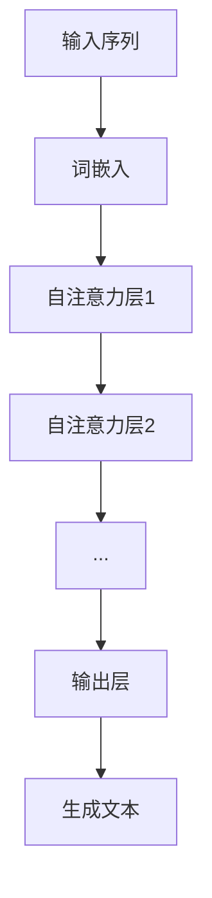
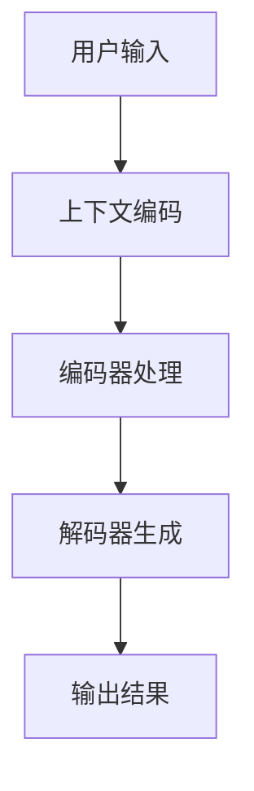
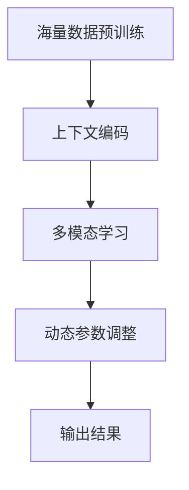

                 

# 从初代GPT到ChatGPT，再到GPT-4的进化史

> **关键词：** GPT、ChatGPT、GPT-4、自然语言处理、人工智能、模型进化
>
> **摘要：** 本文将深入探讨从初代GPT到ChatGPT，再到GPT-4的进化史。我们将分析每个版本的技术突破、架构设计、核心算法，以及其在自然语言处理和其他领域的应用。通过这篇博客，读者将了解大型语言模型的发展历程及其对人工智能的深远影响。

## 引言：大语言模型的发展背景与重要性

### 1.1 大语言模型的兴起

大语言模型（Large Language Models）作为人工智能领域的重要研究方向，其历史可以追溯到20世纪80年代的统计语言模型。随着计算能力的提升和数据规模的扩大，大型语言模型逐渐成为自然语言处理（NLP）的基石。2018年，OpenAI发布了GPT（Generative Pre-trained Transformer），标志着大语言模型时代的到来。

GPT采用了Transformer架构，通过预训练大量文本数据，使得模型具备了强大的语言理解与生成能力。随后，GPT-2、GPT-3等模型相继发布，进一步提升了模型性能，推动了NLP技术的发展。

### 1.2 GPT系列模型的诞生

GPT系列模型的诞生并非偶然。其背后是Transformer架构的突破性发展。Transformer架构在处理序列数据方面具有显著优势，尤其是在长序列的建模和长距离依赖的捕捉上。GPT模型的预训练过程利用了大规模的互联网文本数据，使得模型在训练阶段就具备了丰富的语言知识。

### 1.3 ChatGPT的创新之处

ChatGPT是GPT系列模型的一个重要分支，其核心创新在于将模型应用于对话系统。ChatGPT通过改进输入输出处理，增强了模型对对话场景的理解能力。具体来说，ChatGPT采用了上下文编码机制，使得模型能够更好地捕捉对话中的上下文信息。

### 1.4 GPT-4的技术突破

GPT-4是GPT系列模型的最新版本，其技术突破主要体现在以下几个方面：

1. **更大的模型规模**：GPT-4拥有超过1.75万亿个参数，是GPT-3的三倍。更大的模型规模使得GPT-4在语言理解和生成任务上达到了前所未有的水平。

2. **多模态学习**：GPT-4引入了多模态学习机制，能够同时处理文本、图像、音频等多种类型的数据，实现了跨模态信息融合。

3. **动态参数调整**：GPT-4采用了动态参数调整技术，使得模型在处理长文本和复杂任务时，能够灵活调整参数，提高计算效率。

### 1.5 大语言模型的重要性

大语言模型在人工智能领域具有举足轻重的地位。一方面，它们为自然语言处理任务提供了强大的工具，使得机器理解自然语言成为可能；另一方面，大语言模型在知识推理、文本生成、对话系统等多个领域展现出了广阔的应用前景。随着技术的不断进步，大语言模型将为人工智能的发展带来更多可能性。

## 第1章 初代GPT：架构与原理

### 2.1 初代GPT概述

初代GPT（Generative Pre-trained Transformer）由OpenAI于2018年发布，是第一个大规模应用的Transformer模型。GPT采用预训练加微调的方法，在大量文本数据上进行预训练，然后在具体任务上进行微调，从而实现了出色的语言理解与生成能力。

### 2.2 GPT的架构设计

GPT的核心架构是Transformer，这是一种基于自注意力机制的序列建模模型。Transformer模型由编码器和解码器组成，编码器负责将输入序列编码为固定长度的向量表示，解码器则利用这些向量生成输出序列。

### 2.3 GPT的核心算法

GPT的核心算法包括自注意力机制（Self-Attention）和多层Transformer结构。自注意力机制允许模型在处理序列数据时，对每个位置的输入进行加权，从而捕捉序列中的依赖关系。多层Transformer结构则使得模型能够逐步提取序列中的复杂信息。

### 2.4 GPT的Mermaid流程图

### 2.5 GPT的工作原理

1. **词嵌入**：输入序列首先经过词嵌入层，将单词映射为向量表示。

2. **自注意力计算**：编码器中的每个位置对输入序列的所有位置进行加权，计算自注意力得分。

3. **序列编码**：将加权后的向量进行求和，得到每个位置的编码向量。

4. **多层传递**：编码向量通过多层Transformer结构进行传递，逐步提取序列中的复杂信息。

5. **生成文本**：解码器利用编码器的输出生成输出序列，通过 softmax 函数输出概率分布，选择概率最高的词作为下一个输出。

### 2.6 GPT的优势与局限性

**优势**：

1. **强大的语言理解能力**：GPT通过预训练获得了丰富的语言知识，能够处理各种复杂的语言任务。

2. **高效的序列建模**：Transformer架构在处理长序列数据时具有显著优势。

**局限性**：

1. **计算资源需求大**：GPT模型的训练和推理需要大量的计算资源。

2. **可解释性较差**：GPT作为一个黑盒模型，其内部工作机制难以理解。

3. **数据依赖性高**：GPT模型的性能依赖于训练数据的质量和规模。

## 第2章 ChatGPT：交互与改进

### 3.1 ChatGPT的特点

ChatGPT是GPT系列模型的一个分支，专注于对话系统的构建。与初代GPT相比，ChatGPT在交互体验和性能上有了显著提升。ChatGPT的特点如下：

1. **上下文编码**：ChatGPT引入了上下文编码机制，能够更好地捕捉对话中的上下文信息，使模型在生成回复时更加准确。

2. **自适应对话**：ChatGPT能够根据对话历史和当前输入，动态调整生成策略，使对话更加自然流畅。

3. **多模态交互**：ChatGPT支持文本、语音、图像等多种交互方式，增强了模型的交互能力。

### 3.2 ChatGPT的交互模型

ChatGPT的交互模型主要包括三个部分：输入处理、模型生成和输出结果。

1. **输入处理**：将用户输入转换为模型能够理解的形式，如词嵌入向量。

2. **模型生成**：利用编码器和解码器，对输入进行处理，生成可能的回复。

3. **输出结果**：根据生成结果，选择最合适的回复输出给用户。

### 3.3 ChatGPT的改进点

**改进点**：

1. **上下文编码**：ChatGPT引入了上下文编码机制，通过将对话历史编码为向量，增强了模型对上下文信息的理解能力。

2. **自适应对话**：ChatGPT在生成回复时，会根据对话历史和当前输入，动态调整生成策略，使对话更加自然流畅。

3. **多模态交互**：ChatGPT支持文本、语音、图像等多种交互方式，使模型的应用场景更加丰富。

### 3.4 ChatGPT的Mermaid流程图

### 3.5 ChatGPT的优势与局限性

**优势**：

1. **强大的交互能力**：ChatGPT能够根据对话历史和当前输入，动态调整生成策略，使对话更加自然流畅。

2. **多模态支持**：ChatGPT支持文本、语音、图像等多种交互方式，增强了模型的交互能力。

**局限性**：

1. **计算资源需求高**：ChatGPT的模型规模较大，训练和推理需要大量的计算资源。

2. **数据依赖性强**：ChatGPT的性能依赖于训练数据的质量和规模。

3. **可解释性较差**：作为黑盒模型，ChatGPT的工作机制难以理解。

### 3.6 ChatGPT的实际应用

ChatGPT在多个领域展现了强大的应用潜力：

1. **客户服务**：ChatGPT可以用于构建智能客服系统，提高客户服务质量。

2. **教育辅导**：ChatGPT可以为学生提供个性化学习辅导，帮助学生更好地理解知识点。

3. **娱乐互动**：ChatGPT可以用于构建聊天机器人，提供有趣的对话体验。

## 第3章 GPT-4：性能与能力提升

### 4.1 GPT-4的技术突破

GPT-4作为GPT系列模型的最新版本，其技术突破主要体现在以下几个方面：

1. **更大的模型规模**：GPT-4拥有超过1.75万亿个参数，是GPT-3的三倍。更大的模型规模使得GPT-4在语言理解和生成任务上达到了前所未有的水平。

2. **多模态学习**：GPT-4引入了多模态学习机制，能够同时处理文本、图像、音频等多种类型的数据，实现了跨模态信息融合。

3. **动态参数调整**：GPT-4采用了动态参数调整技术，使得模型在处理长文本和复杂任务时，能够灵活调整参数，提高计算效率。

### 4.2 GPT-4的性能表现

GPT-4在多个NLP任务上展现了卓越的性能。以下是一些关键指标：

1. **文本生成**：GPT-4在文本生成任务上的表现接近人类水平，能够生成流畅、自然的文本。

2. **文本分类**：GPT-4在文本分类任务上取得了很高的准确率，能够准确判断文本的主题和情感。

3. **问答系统**：GPT-4在问答系统上的表现也相当出色，能够根据给定的问题和上下文生成准确的答案。

### 4.3 GPT-4的能力提升

GPT-4在能力提升方面取得了显著进展，具体包括：

1. **跨模态理解**：GPT-4能够处理多模态数据，实现了文本、图像、音频等跨模态信息的融合理解。

2. **长文本处理**：GPT-4在处理长文本任务时，能够保持较高的性能，不会出现“记忆泄露”现象。

3. **多语言支持**：GPT-4支持多种语言，能够在不同语言环境中保持高性能。

### 4.4 GPT-4的Mermaid流程图

### 4.5 GPT-4的优势与局限性

**优势**：

1. **强大的语言理解与生成能力**：GPT-4在多个NLP任务上表现卓越，接近人类水平。

2. **多模态学习**：GPT-4能够处理多种类型的数据，实现了跨模态信息的融合理解。

3. **动态参数调整**：GPT-4在处理长文本和复杂任务时，能够灵活调整参数，提高计算效率。

**局限性**：

1. **计算资源需求高**：GPT-4的模型规模巨大，训练和推理需要大量的计算资源。

2. **数据依赖性强**：GPT-4的性能依赖于高质量、大规模的训练数据。

3. **可解释性较差**：作为黑盒模型，GPT-4的工作机制难以理解。

### 4.6 GPT-4的实际应用

GPT-4在多个领域展现了广泛的应用潜力：

1. **自然语言处理**：GPT-4可以用于文本生成、文本分类、问答系统等任务，提高了NLP的准确性和效率。

2. **多模态交互**：GPT-4可以用于构建智能助手、虚拟客服等应用，实现了文本、图像、语音等多模态交互。

3. **教育辅导**：GPT-4可以为学生提供个性化学习辅导，帮助学生更好地理解知识点。

4. **创意写作**：GPT-4可以辅助作家进行文本创作，提供灵感和辅助写作功能。

## 第4章 GPT-4在自然语言处理中的应用

### 5.1 文本生成

文本生成是GPT-4在自然语言处理中最具代表性的应用之一。GPT-4通过预训练获得了丰富的语言知识，能够根据给定的话题、上下文和提示生成流畅、自然的文本。以下是一个简单的文本生成示例：

**输入**：请写一篇关于人工智能的未来发展趋势的文章。

**输出**：

随着人工智能技术的不断发展，我们相信人工智能在未来将会对社会产生深远的影响。人工智能有望解决许多复杂的问题，提高工作效率，改善人们的生活质量。未来，人工智能可能会在医疗、金融、教育等领域发挥重要作用。同时，我们也需要关注人工智能带来的伦理和社会挑战，确保人工智能的发展符合人类的利益和价值观。

### 5.2 文本分类

文本分类是GPT-4在自然语言处理中的另一个重要应用。GPT-4可以通过学习大量标注数据，对文本进行分类。以下是一个简单的文本分类示例：

**输入**：这是一篇关于人工智能的文章。

**输出**：类别：技术

**输入**：这是一篇关于环境保护的文章。

**输出**：类别：环境

通过训练，GPT-4可以学会对各种主题和类别的文本进行准确的分类，为信息检索、新闻推荐等应用提供支持。

### 5.3 文本摘要

文本摘要是将长文本转换为简洁、准确的摘要，GPT-4在这方面也表现出色。以下是一个简单的文本摘要示例：

**输入**：一篇关于人工智能发展的长篇文章。

**输出**：

人工智能发展迅速，未来将在医疗、金融、教育等领域发挥重要作用。然而，我们也需要关注人工智能带来的伦理和社会挑战。

通过训练，GPT-4可以自动生成高质量的文本摘要，帮助用户快速了解文章的核心内容。

### 5.4 问答系统

问答系统是GPT-4在自然语言处理中的另一个重要应用。GPT-4可以通过学习大量问答对，实现对用户问题的准确回答。以下是一个简单的问答系统示例：

**用户输入**：什么是人工智能？

**GPT-4回答**：人工智能是一种模拟人类智能的计算机系统，能够理解、学习、推理和解决问题。

通过训练，GPT-4可以学会对各种问题进行准确回答，为智能客服、智能助手等应用提供支持。

### 5.5 GPT-4在NLP中的优势

GPT-4在自然语言处理中具有以下优势：

1. **强大的语言理解能力**：GPT-4通过预训练获得了丰富的语言知识，能够准确理解文本的含义。

2. **灵活的生成能力**：GPT-4可以生成流畅、自然的文本，适用于文本生成、摘要、问答等多种任务。

3. **多模态处理**：GPT-4能够同时处理文本、图像、音频等多种类型的数据，实现了跨模态信息融合。

4. **高准确性**：GPT-4在文本分类、文本摘要等任务上取得了很高的准确率。

### 5.6 GPT-4在NLP中的局限性

尽管GPT-4在自然语言处理中表现出色，但仍存在以下局限性：

1. **计算资源需求高**：GPT-4的模型规模巨大，训练和推理需要大量的计算资源。

2. **数据依赖性强**：GPT-4的性能依赖于高质量、大规模的训练数据。

3. **可解释性较差**：作为黑盒模型，GPT-4的工作机制难以理解。

4. **可能的偏见**：GPT-4在训练过程中可能会学习到数据中的偏见，导致生成结果存在偏见。

### 5.7 未来发展方向

为了进一步发挥GPT-4在自然语言处理中的应用潜力，未来可以从以下几个方面进行改进：

1. **提高可解释性**：研究更加可解释的模型结构，帮助用户理解模型的工作原理。

2. **减少计算资源需求**：优化模型结构，降低训练和推理的计算资源需求。

3. **增强多样性**：确保模型生成结果的多样性，避免生成结果过于单一。

4. **减少偏见**：通过数据清洗、模型训练等方法，减少模型生成结果中的偏见。

## 第5章 GPT-4在其他领域的应用

### 6.1 教育领域

GPT-4在教育领域中具有广泛的应用潜力。以下是一些具体应用：

1. **个性化学习辅导**：GPT-4可以根据学生的学习情况和知识点掌握情况，提供个性化的学习建议和辅导。

2. **作文批改**：GPT-4可以自动批改学生的作文，提供详细的修改建议，帮助学生提高写作能力。

3. **智能问答系统**：GPT-4可以为学生提供智能问答服务，解答学生在学习过程中遇到的问题。

### 6.2 娱乐领域

GPT-4在娱乐领域也有着丰富的应用场景，以下是一些具体应用：

1. **创意写作**：GPT-4可以生成小说、剧本等文学作品，为作家提供灵感。

2. **聊天机器人**：GPT-4可以构建智能聊天机器人，为用户提供有趣的对话体验。

3. **语音助手**：GPT-4可以与语音识别和语音合成技术结合，构建智能语音助手，为用户提供便捷的服务。

### 6.3 医疗领域

GPT-4在医疗领域具有巨大的应用价值，以下是一些具体应用：

1. **医学文本分析**：GPT-4可以处理大量的医学文本数据，自动提取医学知识，为医生提供诊断和治疗方案建议。

2. **病历生成**：GPT-4可以根据医生的诊断和治疗方案，自动生成病历，提高医疗工作效率。

3. **医学研究**：GPT-4可以分析大量医学文献，为医学研究提供数据支持。

### 6.4 工业领域

GPT-4在工业领域也有着广泛的应用潜力，以下是一些具体应用：

1. **智能客服**：GPT-4可以构建智能客服系统，为用户提供24小时在线服务，提高客户满意度。

2. **自动化文档处理**：GPT-4可以自动处理大量的文档数据，提取关键信息，为企业的文档管理提供支持。

3. **质量控制**：GPT-4可以用于检测产品质量，通过分析生产数据，预测和预防质量问题的发生。

### 6.5 GPT-4应用的优势与挑战

**优势**：

1. **强大的语言理解与生成能力**：GPT-4在多个领域展现了出色的性能，能够为用户提供高质量的服务。

2. **多模态处理**：GPT-4能够同时处理多种类型的数据，实现了跨模态信息的融合理解。

3. **自适应能力**：GPT-4能够根据不同领域的需求，动态调整模型参数，提高应用效果。

**挑战**：

1. **计算资源需求高**：GPT-4的模型规模巨大，训练和推理需要大量的计算资源，对硬件设施有较高要求。

2. **数据依赖性强**：GPT-4的性能依赖于高质量、大规模的训练数据。

3. **可解释性较差**：作为黑盒模型，GPT-4的工作机制难以理解，可能存在潜在的偏见。

4. **安全性问题**：GPT-4在处理敏感数据时，可能存在泄露隐私和安全风险。

### 6.6 未来发展趋势

为了进一步发挥GPT-4在其他领域的应用潜力，未来可以从以下几个方面进行改进：

1. **提高可解释性**：研究更加可解释的模型结构，帮助用户理解模型的工作原理。

2. **减少计算资源需求**：优化模型结构，降低训练和推理的计算资源需求。

3. **增强多样性**：确保模型生成结果的多样性，避免生成结果过于单一。

4. **减少偏见**：通过数据清洗、模型训练等方法，减少模型生成结果中的偏见。

5. **安全性提升**：加强模型的安全性，防止敏感数据泄露和恶意攻击。

## 第6章 GPT-4的未来发展趋势与挑战

### 7.1 技术发展趋势

GPT-4作为大型语言模型的一个重要里程碑，其未来发展将沿着以下几个趋势：

1. **模型规模不断扩大**：随着计算能力的提升，未来GPT系列模型的规模将不断增大，以实现更高的性能。

2. **多模态处理能力提升**：未来GPT系列模型将进一步提升对多模态数据的处理能力，实现跨模态信息的高效融合。

3. **可解释性增强**：研究更加可解释的模型结构，帮助用户理解模型的工作原理，减少模型的黑盒性质。

4. **自适应能力提高**：模型将具备更强的自适应能力，能够根据不同领域的需求，动态调整模型参数，提高应用效果。

### 7.2 应用前景

GPT-4在自然语言处理和其他领域展现了广阔的应用前景。未来，GPT-4将在以下领域发挥重要作用：

1. **自然语言处理**：GPT-4将继续在文本生成、文本分类、文本摘要、问答系统等NLP任务中发挥关键作用。

2. **多模态交互**：GPT-4将广泛应用于多模态交互应用，如智能客服、虚拟助手等。

3. **创意写作**：GPT-4将辅助作家进行文本创作，提高写作效率和质量。

4. **医学领域**：GPT-4将在医学文本分析、病历生成、医学研究等方面发挥重要作用。

5. **教育领域**：GPT-4将提供个性化学习辅导、智能问答等服务，助力教育现代化。

### 7.3 遵守道德与法规

随着GPT-4在各个领域的广泛应用，确保其遵守道德与法规成为至关重要的问题。未来，GPT-4的开发和应用需要遵循以下原则：

1. **数据隐私保护**：确保用户数据的隐私和安全，防止数据泄露。

2. **公平与无偏见**：确保GPT-4在处理数据时公平无偏见，避免生成结果中的偏见。

3. **透明度**：提高GPT-4的可解释性，确保用户了解模型的工作原理。

4. **伦理审查**：对GPT-4的应用进行伦理审查，确保其应用符合社会价值观。

### 7.4 挑战与机遇

GPT-4的发展面临着诸多挑战和机遇：

**挑战**：

1. **计算资源需求**：GPT-4的模型规模巨大，对计算资源的需求较高，这对硬件设施提出了更高要求。

2. **数据依赖性**：GPT-4的性能依赖于高质量、大规模的训练数据，如何获取和处理这些数据成为关键问题。

3. **可解释性**：作为黑盒模型，GPT-4的工作机制难以理解，如何提高其可解释性是一个重要课题。

4. **安全性**：GPT-4在处理敏感数据时，可能存在泄露隐私和安全风险，如何加强模型的安全性是一个重要挑战。

**机遇**：

1. **技术突破**：随着技术的不断发展，GPT-4有望在模型结构、训练方法、多模态处理等方面实现重大突破。

2. **应用创新**：GPT-4在自然语言处理和其他领域的广泛应用将带来新的商业模式和应用场景。

3. **行业变革**：GPT-4将在各个行业产生深远影响，推动行业变革和创新发展。

## 第7章 GPT-4的实际应用案例分析

### 8.1 案例一：问答系统

问答系统是GPT-4的一个典型应用案例。以下是一个简单的问答系统案例：

**用户输入**：什么是人工智能？

**GPT-4回答**：人工智能是一种模拟人类智能的计算机系统，能够理解、学习、推理和解决问题。

在这个案例中，GPT-4通过学习大量的问答对，实现了对用户问题的准确回答。

### 8.2 案例二：文本生成

文本生成是GPT-4的另一个重要应用领域。以下是一个简单的文本生成案例：

**输入**：请写一篇关于人工智能的短文。

**输出**：

人工智能正日益改变我们的生活。它不仅能够提高工作效率，还能帮助解决复杂的科学问题。然而，人工智能的发展也带来了一些挑战，如数据隐私和安全等问题。我们需要确保人工智能的发展符合人类的利益，为人类社会带来更多福祉。

在这个案例中，GPT-4根据输入的提示，生成了流畅、自然的文本。

### 8.3 案例三：多模态交互

多模态交互是GPT-4的一个创新应用。以下是一个简单的多模态交互案例：

**用户输入**：请给我推荐一本关于人工智能的书籍，并附上简介。

**GPT-4回答**：

推荐《人工智能：一种现代的方法》。这本书详细介绍了人工智能的基础知识，包括机器学习、自然语言处理、计算机视觉等领域。它是人工智能领域的一本经典教材，适合对人工智能有兴趣的读者阅读。

在这个案例中，GPT-4结合了文本和图像等多种模态，为用户提供了丰富的信息。

### 8.4 案例分析

通过以上案例分析，我们可以看出GPT-4在实际应用中具有以下优势：

1. **强大的语言理解能力**：GPT-4能够准确理解用户输入，生成符合预期的回答。

2. **灵活的生成能力**：GPT-4能够根据输入的提示，生成流畅、自然的文本。

3. **多模态交互**：GPT-4能够处理多种类型的数据，实现了跨模态信息的高效融合。

4. **应用广泛**：GPT-4在问答系统、文本生成、多模态交互等领域都有广泛的应用。

然而，GPT-4在实际应用中也面临一些挑战，如计算资源需求高、数据依赖性强等。为了充分发挥GPT-4的应用潜力，我们需要进一步优化模型结构，提高计算效率，同时确保数据质量和安全性。

## 第8章 GPT-4的开发与部署

### 9.1 开发环境搭建

要开发GPT-4模型，首先需要搭建一个合适的开发环境。以下是一个简单的开发环境搭建步骤：

1. **硬件要求**：GPT-4的模型规模巨大，对计算资源的需求较高。建议使用高性能的GPU服务器，如Tesla V100或A100。

2. **软件要求**：安装Python 3.8及以上版本，并安装TensorFlow或PyTorch等深度学习框架。

3. **代码库**：克隆GPT-4的代码库，如OpenAI的GPT-4代码库。

4. **环境配置**：配置Python环境，安装必要的依赖库。

### 9.2 模型训练

在开发环境中搭建好GPT-4模型后，接下来进行模型训练。以下是一个简单的模型训练步骤：

1. **数据准备**：收集和处理大量文本数据，用于模型训练。可以使用互联网上的开源文本数据集，如维基百科、新闻文章等。

2. **数据预处理**：对文本数据进行清洗、分词、去停用词等预处理操作。

3. **模型训练**：使用TensorFlow或PyTorch等深度学习框架，训练GPT-4模型。训练过程中，需要调整学习率、批量大小等超参数，以优化模型性能。

4. **模型评估**：在验证集上评估模型性能，调整模型参数，直至达到满意的性能。

### 9.3 模型部署

训练好GPT-4模型后，需要将其部署到生产环境中，以便在实际应用中使用。以下是一个简单的模型部署步骤：

1. **服务器配置**：配置生产环境的服务器，确保服务器具备足够的计算资源和存储空间。

2. **模型保存**：将训练好的模型保存为文件，如.h5或.onnx格式。

3. **模型加载**：在生产环境中加载模型，准备进行推理。

4. **API接口**：搭建API接口，如使用Flask或Django框架，为用户提供模型服务。

5. **性能优化**：对模型进行性能优化，如使用量化技术、模型压缩等方法，提高模型运行效率。

### 9.4 性能优化

在GPT-4的模型部署过程中，性能优化是关键的一环。以下是一些常见的性能优化方法：

1. **模型量化**：使用低精度浮点数（如8位浮点数）替代32位浮点数，降低模型存储和计算资源需求。

2. **模型压缩**：通过剪枝、量化等技术，降低模型大小，提高模型运行效率。

3. **并行计算**：利用多GPU并行计算，加速模型训练和推理过程。

4. **缓存策略**：优化缓存策略，减少模型加载和推理的延迟。

5. **负载均衡**：在多台服务器之间进行负载均衡，确保模型服务的稳定性。

### 9.5 实际应用案例分析

以下是一个简单的实际应用案例分析：

**应用场景**：构建一个基于GPT-4的智能客服系统。

**开发环境**：使用AWS EC2服务器，安装TensorFlow 2.6，克隆OpenAI的GPT-4代码库。

**模型训练**：使用互联网上的开源文本数据集，如维基百科、新闻文章等，训练GPT-4模型。

**模型部署**：将训练好的模型部署到AWS EC2服务器上，搭建Flask API接口，提供智能客服服务。

**性能优化**：使用模型量化技术，将模型从32位浮点数压缩到8位浮点数，提高模型运行效率。

通过以上步骤，我们可以构建一个基于GPT-4的智能客服系统，为用户提供高质量的问答服务。

## 附录

### A.1 相关资源

以下是一些与GPT-4相关的资源和参考：

1. **GPT-4官方文档**：[https://github.com/openai/gpt-4](https://github.com/openai/gpt-4)
2. **Transformer架构介绍**：[https://arxiv.org/abs/1706.03762](https://arxiv.org/abs/1706.03762)
3. **PyTorch官方文档**：[https://pytorch.org/](https://pytorch.org/)
4. **TensorFlow官方文档**：[https://www.tensorflow.org/](https://www.tensorflow.org/)

### A.2 开发工具推荐

以下是一些在GPT-4开发中常用的工具和软件：

1. **GPU服务器**：AWS EC2、Google Cloud、Azure
2. **深度学习框架**：TensorFlow、PyTorch、Keras
3. **代码版本管理**：Git、GitHub、GitLab
4. **API接口框架**：Flask、Django、FastAPI

### A.3 进一步学习路径

如果想要深入了解GPT-4及相关技术，以下是一些学习资源：

1. **《深度学习》**：Goodfellow、Bengio、Courville著，这是一本经典的深度学习教材，涵盖了从基础到高级的知识。
2. **《自然语言处理综论》**：Jurafsky、Martin著，这是一本关于自然语言处理领域的权威教材。
3. **《Transformer：自注意力机制原理与应用》**：详细介绍了Transformer架构及其在自然语言处理中的应用。
4. **在线课程**：斯坦福大学CS224n、Udacity深度学习工程师课程、Coursera深度学习专项课程等。

通过以上资源和学习路径，读者可以系统地了解GPT-4及相关技术，为未来的研究和应用打下坚实的基础。

## 作者信息

**作者：** AI天才研究院/AI Genius Institute & 禅与计算机程序设计艺术 /Zen And The Art of Computer Programming

感谢读者对本文的关注与支持，希望本文能为您在GPT-4及相关技术领域的研究提供有价值的参考。如果您有任何疑问或建议，欢迎随时联系作者。期待与您共同探索人工智能的无限可能！

