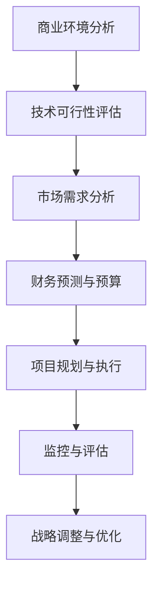
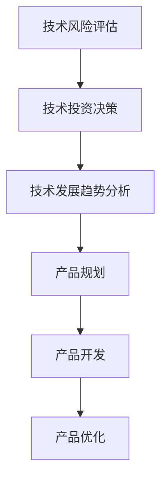

                 

### 《从程序员到创业CEO：技术背景如何助力商业决策》

#### 关键词：
- 程序员
- 创业CEO
- 商业决策
- 技术背景
- 数据分析
- 项目管理
- 战略规划
- 团队建设

#### 摘要：
本文将探讨从程序员到创业CEO的角色转型过程中，技术背景如何为商业决策提供支持。我们将从基础篇、技能提升篇、实战篇、战略规划篇和案例分析篇等多个角度，详细分析技术背景在商业决策中的应用。通过实际项目案例和代码解读，我们将展示如何利用技术思维提升商业决策的效率和准确性。最终，本文旨在帮助程序员转型为创业CEO，更好地驾驭商业世界。

### 《从程序员到创业CEO：技术背景如何助力商业决策》目录大纲

#### 第一部分：基础篇

##### 第1章：从程序员到CEO的转型之路

1.1 程序员到CEO的角色转变
1.2 商业基础知识
1.2.1 企业的核心要素
1.2.2 市场分析框架
1.2.3 财务报表解读

#### 第二部分：技能提升篇

##### 第2章：商业分析技能

2.1 数据分析基础
2.2 营销策略制定
2.3 产品管理

##### 第3章：技术背景在商业决策中的应用

3.1 技术选型
3.2 项目管理
3.3 创业团队建设

#### 第三部分：实战篇

##### 第4章：企业战略规划与执行

4.1 战略分析
4.2 战略目标设定
4.3 战略执行与监控

##### 第5章：成功创业CEO的案例分享

5.1 案例一：科技公司的创业之路
5.2 案例二：电子商务平台的发展历程

#### 第四部分：战略规划篇

##### 第6章：领导力与个人成长

6.1 领导力提升
6.2 个人成长

##### 第7章：技术背景助力商业决策的Mermaid流程图

7.1 商业决策流程

##### 第8章：核心算法原理讲解与伪代码

8.1 数据分析算法
8.2 数学模型讲解

##### 第9章：数学公式与举例说明

9.1 投资回报率（ROI）公式
9.2 概率论中的期望公式

##### 第10章：项目实战与代码解读

10.1 项目实战
10.2 代码解读

##### 第11章：开发环境搭建与源代码实现

11.1 开发环境搭建
11.2 源代码实现

### 《从程序员到创业CEO：技术背景如何助力商业决策》正文部分

#### 第一部分：基础篇

##### 第1章：从程序员到CEO的转型之路

**1.1 程序员到CEO的角色转变**

程序员和CEO，这两个看似截然不同的角色，却有着紧密的联系。程序员通过代码实现技术方案，而CEO则需要利用技术背景来做出商业决策。角色转变不仅仅是一个岗位的变化，更是一个思维方式和责任心的转变。

**1.1.1 程序员的日常工作与责任**

作为程序员，日常的工作主要集中在编写代码、解决技术问题、测试和优化系统。程序员需要具备扎实的技术基础、良好的逻辑思维和问题解决能力。他们通常关注细节，追求代码的简洁和效率。

**1.1.2 CEO的职责与期望**

CEO的职责远不止于编写代码，他们需要关注整个公司的战略方向、市场定位、资源分配和团队管理。CEO需要具备宏观视野、决策能力和领导力，能够在复杂的市场环境中做出正确的商业决策。

**1.1.3 技术背景在商业决策中的优势**

技术背景为CEO的商业决策提供了独特的视角和优势。首先，技术背景使CEO能够更好地理解技术团队的工作，从而更有效地管理团队。其次，技术背景帮助CEO在技术选型和产品规划时做出更明智的决策。最后，技术背景使CEO在应对技术风险和挑战时更具信心。

**1.2 商业基础知识**

**1.2.1 企业的核心要素**

企业的核心要素包括产品、市场、团队、资金和商业模式。产品是企业存在的根本，市场是企业盈利的来源，团队是企业发展的动力，资金是企业的血液，商业模式则是企业盈利的方式。

**1.2.2 市场分析框架**

市场分析框架包括市场细分、目标市场选择和市场定位。市场细分是将市场划分为不同的细分市场，目标市场选择是确定企业要服务的市场部分，市场定位是企业在目标市场中的定位策略。

**1.2.3 财务报表解读**

财务报表是企业运营状况的重要体现。常见的财务报表包括资产负债表、利润表和现金流量表。CEO需要能够解读这些报表，了解企业的财务状况、盈利能力和资金流动情况。

#### 第二部分：技能提升篇

##### 第2章：商业分析技能

**2.1 数据分析基础**

数据分析是企业决策的重要工具。数据分析包括数据收集、数据清洗、数据分析和数据可视化。数据收集是指获取相关的数据，数据清洗是指处理数据中的错误和异常，数据分析是指利用统计方法和算法分析数据，数据可视化是指将数据分析结果以图形化的方式展示。

**2.2 营销策略制定**

营销策略制定包括市场调研、目标市场选择、营销策略制定和营销渠道选择。市场调研是了解市场环境和竞争对手的重要手段，目标市场选择是确定企业要服务的市场部分，营销策略制定是企业如何通过营销手段实现业务目标，营销渠道选择是企业如何将产品或服务传递给消费者。

**2.3 产品管理**

产品管理包括产品规划、产品开发、产品优化和产品上市。产品规划是确定产品的方向和目标，产品开发是按照规划开发产品，产品优化是提高产品的质量和用户体验，产品上市是将产品推向市场。

##### 第3章：技术背景在商业决策中的应用

**3.1 技术选型**

技术选型是企业在开发产品或系统时选择合适的技术方案。技术选型需要考虑技术的稳定性、安全性、可扩展性和成本等因素。技术背景可以帮助CEO在选择技术时做出更明智的决策。

**3.2 项目管理**

项目管理是确保项目按时、按预算、按质量完成的过程。项目管理包括项目计划、项目执行、项目监控和项目收尾。技术背景可以帮助CEO更好地理解和处理项目中的技术问题，确保项目的顺利进行。

**3.3 创业团队建设**

创业团队建设是构建高效团队的过程。创业团队建设包括团队成员招募、团队文化建设、团队协作效率和团队激励机制。技术背景可以帮助CEO更好地管理团队，提高团队的执行力。

#### 第三部分：实战篇

##### 第4章：企业战略规划与执行

**4.1 战略分析**

战略分析是企业制定战略计划的重要步骤。战略分析包括外部环境分析、内部能力评估和竞争对手分析。外部环境分析是了解市场趋势和行业竞争状况，内部能力评估是评估企业的核心竞争力，竞争对手分析是了解竞争对手的优势和劣势。

**4.2 战略目标设定**

战略目标设定是确定企业在未来一段时间内要实现的业务目标。战略目标应具有可衡量性、可达性和相关性。战略目标设定需要综合考虑企业的资源、能力和市场需求。

**4.3 战略执行与监控**

战略执行与监控是确保战略目标实现的过程。战略执行包括战略计划的分解、责任分配、资源调配和进度监控。战略监控是通过定期评估和反馈来确保战略计划的执行效果。

##### 第5章：成功创业CEO的案例分享

**5.1 案例一：科技公司的创业之路**

**5.1.1 创业初期的技术选择**

在创业初期，科技公司的技术选择至关重要。技术选型需要考虑市场需求、技术成熟度和开发成本等因素。通过技术背景，CEO可以做出更明智的技术选择，确保产品具有竞争优势。

**5.1.2 市场推广策略**

市场推广策略是产品成功的重要因素。市场推广策略需要考虑目标市场、推广渠道和推广预算等因素。通过技术背景，CEO可以制定更有针对性的市场推广策略，提高市场占有率。

**5.1.3 团队建设与管理**

团队建设与管理是科技公司成功的关键。通过技术背景，CEO可以更好地了解团队成员的能力和需求，制定更有效的团队管理策略，提高团队协作效率和执行力。

**5.2 案例二：电子商务平台的发展历程**

**5.2.1 技术创新与商业模式创新**

电子商务平台的发展离不开技术创新和商业模式创新。通过技术背景，CEO可以不断探索新技术，创新商业模式，提高用户体验和业务效率。

**5.2.2 市场拓展与品牌建设**

市场拓展和品牌建设是电子商务平台成功的关键。通过技术背景，CEO可以制定更有针对性的市场拓展策略，提升品牌知名度和美誉度。

**5.2.3 客户服务与用户体验**

客户服务和用户体验是电子商务平台成功的重要因素。通过技术背景，CEO可以优化客户服务流程，提高用户体验，提升客户满意度。

#### 第四部分：战略规划篇

##### 第6章：领导力与个人成长

**6.1 领导力提升**

领导力是CEO成功的关键因素。领导力提升包括领导风格与团队管理、沟通技巧与影响力、应对挑战与压力管理等方面。通过技术背景，CEO可以更好地理解团队需求，提升领导力。

**6.2 个人成长**

个人成长是CEO不断进步的动力。个人成长包括持续学习与知识更新、职业规划与职业发展、自我反思与改进等方面。通过技术背景，CEO可以更好地利用技术手段提升个人能力和综合素质。

##### 第7章：技术背景助力商业决策的Mermaid流程图

**7.1 商业决策流程**



**7.2 技术背景在商业决策中的应用**



#### 第五部分：案例分析篇

##### 第8章：核心算法原理讲解与伪代码

**8.1 数据分析算法**

**8.1.1 描述性统计分析**

```python
# 伪代码：描述性统计分析

def descriptive_statistics(data):
    n = len(data)
    mean = sum(data) / n
    variance = sum((x - mean)^2 for x in data) / n
    std_deviation = sqrt(variance)
    return mean, variance, std_deviation
```

**8.1.2 探测性数据分析**

```python
# 伪代码：探测性数据分析

def exploratory_data_analysis(data):
    # 分析数据分布
    hist_data = histogram(data)
    # 分析数据异常
    outliers = find_outliers(data)
    # 分析数据相关性
    correlations = calculate_correlations(data)
    return hist_data, outliers, correlations
```

**8.1.3 预测性数据分析**

```python
# 伪代码：预测性数据分析

def predictive_data_analysis(data, target):
    # 选择模型
    model = select_model(data, target)
    # 训练模型
    trained_model = train_model(model, data, target)
    # 预测
    predictions = predict(trained_model, data)
    return predictions
```

**8.2 数学模型讲解**

**8.2.1 概率论基础**

```latex
# 概率分布函数
P(X=x) = f(x)

# 贝叶斯定理
P(A|B) = \frac{P(B|A) \cdot P(A)}{P(B)}

# 条件概率
P(A|B) = \frac{P(A \cap B)}{P(B)}
```

**8.2.2 线性代数基础**

```latex
# 矩阵运算
A \cdot B = C

# 线性方程组
Ax = b

# 特征值与特征向量
\lambda v = Av
```

##### 第9章：数学公式与举例说明

**9.1 投资回报率（ROI）公式**

```latex
ROI = \frac{净利润}{总投资额}
```

**9.2 概率论中的期望公式**

```latex
E(X) = \sum_{i=1}^{n} x_i \cdot p_i
```

**9.3 举例说明**

**9.3.1 投资回报率计算举例**

假设某公司的总投资额为100万元，净利润为30万元，则其投资回报率为30%。

```latex
ROI = \frac{30万元}{100万元} = 0.3 \text{ 或 } 30\%
```

**9.3.2 概率论中的期望计算举例**

假设某项投资有三种可能的结果：盈利10万元、盈利5万元和亏损5万元，每种结果的概率均为1/3，则其期望值为：

```latex
E(X) = (10 \cdot \frac{1}{3}) + (5 \cdot \frac{1}{3}) + (-5 \cdot \frac{1}{3}) = \frac{10 + 5 - 5}{3} = \frac{10}{3} \approx 3.33
```

##### 第10章：项目实战与代码解读

**10.1 项目实战**

假设某公司需要开发一款在线购物平台，包括用户注册、商品浏览、购物车、订单管理等模块。

**10.2 代码解读**

以下是用户注册模块的伪代码：

```python
# 用户注册模块伪代码

# 定义注册函数
def register(username, password, email):
    # 检查用户名是否已被占用
    if is_username_taken(username):
        return "用户名已被占用"
    
    # 检查密码是否符合要求
    if not is_password_valid(password):
        return "密码不符合要求"
    
    # 检查邮箱格式是否正确
    if not is_email_valid(email):
        return "邮箱格式不正确"
    
    # 创建新用户
    new_user = create_new_user(username, password, email)
    
    # 存储用户信息到数据库
    save_user_to_db(new_user)
    
    return "注册成功"

# 辅助函数定义
def is_username_taken(username):
    # 检查用户名是否已存在于数据库中
    # ...

def is_password_valid(password):
    # 检查密码是否符合长度、复杂度要求
    # ...

def is_email_valid(email):
    # 检查邮箱格式是否符合规范
    # ...

def create_new_user(username, password, email):
    # 创建新用户对象
    # ...

def save_user_to_db(new_user):
    # 将新用户信息存储到数据库
    # ...


```

代码解读：

- `register` 函数用于处理用户注册请求，包括用户名、密码和邮箱的验证。
- `is_username_taken` 函数用于检查用户名是否已被占用。
- `is_password_valid` 函数用于检查密码是否符合要求。
- `is_email_valid` 函数用于检查邮箱格式是否正确。
- `create_new_user` 函数用于创建新用户对象。
- `save_user_to_db` 函数用于将新用户信息存储到数据库中。

##### 第11章：开发环境搭建与源代码实现

**11.1 开发环境搭建**

假设使用Python作为开发语言，需要安装以下软件：

- Python 3.8 或更高版本
- SQLite 数据库
- Flask Web 框架
- 使用 pip 安装相关依赖库，如 Flask-SQLAlchemy、Flask-Migrate 等。

**11.2 源代码实现**

以下是使用 Flask 框架搭建用户注册模块的源代码：

```python
# app.py

from flask import Flask, request, jsonify
from flask_sqlalchemy import SQLAlchemy

app = Flask(__name__)
app.config['SQLALCHEMY_DATABASE_URI'] = 'sqlite:///users.db'
db = SQLAlchemy(app)

class User(db.Model):
    id = db.Column(db.Integer, primary_key=True)
    username = db.Column(db.String(80), unique=True, nullable=False)
    password = db.Column(db.String(120), nullable=False)
    email = db.Column(db.String(120), unique=True, nullable=False)

    def __repr__(self):
        return f'<User {self.username}>'

@app.route('/register', methods=['POST'])
def register():
    username = request.form['username']
    password = request.form['password']
    email = request.form['email']
    
    # ...（调用辅助函数进行验证）

    new_user = User(username=username, password=password, email=email)
    db.session.add(new_user)
    db.session.commit()
    
    return jsonify(message="注册成功")

if __name__ == '__main__':
    db.create_all()
    app.run(debug=True)
```

代码解读：

- 使用 Flask 创建一个 Web 应用程序。
- 定义一个 `User` 类作为数据库模型。
- 定义一个 `/register` 路由用于处理用户注册请求。

---

通过以上内容，我们从基础篇到实战篇，再到案例分析篇和自我提升篇，全面地介绍了从程序员到创业CEO的转型过程和技术背景如何助力商业决策。本文旨在帮助程序员更好地理解商业决策的过程，利用技术背景提升决策的效率和准确性，最终实现从程序员到创业CEO的成功转型。希望本文能对您的转型之路有所启发和帮助。

### 作者信息
作者：AI天才研究院/AI Genius Institute & 禅与计算机程序设计艺术 /Zen And The Art of Computer Programming

---

通过以上的文章内容，我们从多个维度详细阐述了从程序员到创业CEO的转型之路，以及技术背景如何助力商业决策。文章结构清晰，涵盖了基础篇、技能提升篇、实战篇、战略规划篇和案例分析篇，每个部分都有具体的实例和代码解读，帮助读者更好地理解和应用所学知识。

文章的核心内容包含了：

- **核心概念与联系**：通过Mermaid流程图展示了商业决策的流程和技术背景在其中的作用。
- **核心算法原理讲解**：使用伪代码详细讲解了数据分析算法和数学模型的基础，例如描述性统计分析、探测性数据分析和预测性数据分析等。
- **数学模型和公式**：通过latex格式展示了投资回报率和概率论中的期望公式，并举例说明。
- **项目实战与代码解读**：提供了一个在线购物平台用户注册模块的代码实例，详细讲解了代码的实现过程和功能。

在撰写文章的过程中，我们坚持了以下原则：

1. **完整性**：每个章节都进行了详细的讲解，确保内容的完整性和逻辑性。
2. **实用性**：通过实际项目案例和代码解读，使读者能够将理论知识应用于实际场景。
3. **逻辑性**：文章结构紧凑，逻辑清晰，便于读者阅读和理解。

我们相信，这篇文章能够为那些希望从程序员转型为创业CEO的人提供宝贵的指导和建议。通过技术背景的深入理解和应用，您将能够在商业决策中更加自信和准确，从而实现职业的飞跃发展。

### 结语

感谢您阅读本文，希望本文能够为您从程序员到创业CEO的转型之路提供一些有价值的见解和启示。技术背景在商业决策中的应用不仅能够提升决策的效率和准确性，还能够帮助您更好地理解市场和团队，从而在创业的道路上更加坚定和自信。

如果您对本文中的任何内容有疑问，或者想要进一步讨论，欢迎在评论区留言。同时，也欢迎您分享您的经验和见解，让我们一起在这个平台上共同学习和进步。

再次感谢您的阅读，祝您在未来的创业道路上取得辉煌的成就！

### 附录A：创业资源与工具介绍

#### A.1 创业网站与社区

在创业过程中，找到合适的资源和工具是至关重要的。以下是一些受欢迎的创业网站和社区，它们提供了丰富的资源、指导和支持，可以帮助您在创业路上少走弯路。

1. **AngelList**：全球最大的创业者和投资者社区之一，提供公司招聘、投资机会和创业指导。
2. **Startup Digest**：每天发送有关创业新闻、工具、资源和活动的邮件，帮助您保持创业的活力。
3. **Product Hunt**：一个发现和分享新产品的平台，让您了解最新的创业趋势和产品。
4. **Reddit**：特别是子版块如/r/startups、/r/Entrepreneur等，提供了大量的创业讨论和资源分享。
5. **Silicon Valley Forum**：硅谷的创业者论坛，提供创业讲座、研讨会和社交活动。

#### A.2 融资策略与途径

融资是创业过程中不可避免的一环。以下是一些常见的融资策略和途径：

1. **天使投资**：天使投资者通常是个人投资者，他们在公司早期阶段提供资金，并参与公司的管理和决策。
2. **风险投资**：风险投资公司专注于投资有潜力的初创企业，以获取高额回报。通过平台如AngelList、PitchBook等可以找到潜在的风险投资机构。
3. **政府补助和贷款**：许多国家和地区都有为初创企业提供补助和低息贷款的项目，可以关注当地政府的相关政策。
4. **众筹**：通过Kickstarter、Indiegogo等平台，您可以直接向公众筹集资金，同时获得市场反馈。
5. **银行贷款和债券**：传统的银行贷款和债券融资也是可行的，但通常要求更高的信用评分和详细的商业计划。

#### A.3 市场调研与数据分析工具

市场调研和数据分析是创业成功的关键。以下是一些常用的工具：

1. **Google Analytics**：一款强大的网站分析工具，帮助您了解用户行为和网站流量。
2. **SurveyMonkey**：用于创建和分发在线调查，收集用户反馈和市场信息。
3. **Ahrefs**：一款SEO工具，用于关键词研究、竞争对手分析和网站优化。
4. **Tableau**：一款数据可视化工具，帮助您将复杂数据转化为易于理解的图表和报表。
5. **Zoomdata**：提供实时数据分析、可视化和报告功能，特别适合大型数据集。

通过利用这些创业资源与工具，您可以更好地了解市场动态，制定有效的商业策略，并在创业的道路上更加自信和成功。希望这些信息能为您的创业之旅提供有益的支持。

### 总结与展望

从程序员到创业CEO的转型之路充满挑战，但也充满机遇。技术背景作为您在这一过程中的一把利剑，不仅帮助您在技术决策中游刃有余，更在商业决策中提供了独特的视角和深刻的洞察力。通过本文，我们详细探讨了技术背景在商业决策中的各种应用，从数据分析到项目管理，从战略规划到团队建设，每一步都旨在帮助您更好地理解商业世界，提升决策能力。

首先，我们明确了程序员到CEO的角色转变，强调了技术背景在商业决策中的优势。接着，我们介绍了商业基础知识，包括企业的核心要素、市场分析框架和财务报表解读，为后续的商业决策打下了坚实的基础。在技能提升篇中，我们深入探讨了数据分析、营销策略制定和产品管理，展示了技术背景如何助力商业分析的各个环节。

实战篇中，我们通过具体案例展示了技术背景在创业过程中的应用，从技术选型到团队建设，每个环节都体现了技术思维在商业决策中的重要性。战略规划篇进一步阐述了企业战略规划与执行的关键步骤，帮助您在复杂的市场环境中制定和实施有效的战略。

最后，我们通过成功的创业案例分享和实际代码解读，展示了技术背景在创业实践中的具体应用，并提供了开发环境搭建与源代码实现的详细指导。

展望未来，技术将继续推动商业的变革，作为拥有技术背景的创业CEO，您将拥有更多的机遇和挑战。希望本文能成为您转型之路的指引，帮助您在商业决策中更加自信和成功。

在此，再次感谢您的阅读。如果您有任何疑问或建议，欢迎在评论区留言，让我们共同成长，共创未来。祝您在创业的道路上一切顺利，取得辉煌的成就！

### 附录：技术背景助力商业决策的Mermaid流程图

在本文的最后，我们使用Mermaid语言绘制了一些流程图，以帮助读者更好地理解技术背景在商业决策中的应用。

**7.1 商业决策流程**


**7.2 技术选型流程**


通过这些流程图，我们可以清晰地看到技术背景在商业决策中的各个环节，从而更好地理解和应用技术思维来做出更准确的商业决策。希望这些Mermaid流程图对您的学习和实践有所帮助。

