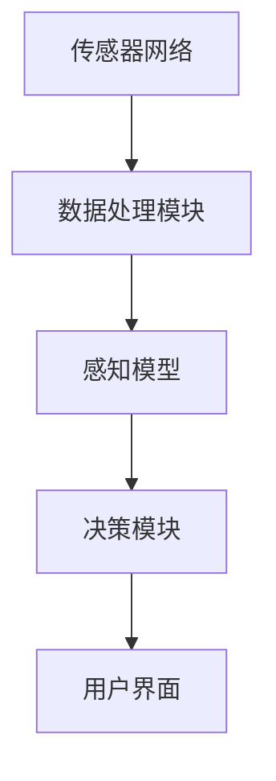

                 

### 《体验的时空压缩：AI创造的即时感知》

> **关键词：** AI、即时感知、时空压缩、机器学习、深度学习、物联网、智能交通、智能医疗

> **摘要：** 随着人工智能技术的飞速发展，AI在即时感知领域的应用逐渐成为现实。本文将详细探讨AI如何通过时空压缩，实现即时感知，包括技术基础、应用实例及未来展望。通过深入分析，我们旨在展示AI在塑造未来感知体验中的重要角色。

---

#### 引言

在当今信息化和智能化的时代，人工智能（AI）已经成为推动科技进步和社会发展的关键力量。AI技术的不断突破，使得我们在很多领域都经历了前所未有的变革。而即时感知，作为AI的一个重要应用方向，正逐渐成为人们日常生活的一部分。本文旨在深入探讨AI在即时感知领域的作用，以及它是如何通过时空压缩实现高效的感知体验。

即时感知，顾名思义，指的是在极短时间内获取并处理信息的能力。这种能力对于智能系统的快速响应和高效决策至关重要。而AI通过其强大的数据处理和分析能力，正在实现这一目标。从物联网感知到智能交通系统，再到智能医疗，AI即时感知正在改变我们的生活方式。

本文将首先介绍AI与即时感知的基础知识，包括AI的定义、即时感知的概念及其技术架构。接着，我们将详细探讨AI即时感知的核心技术，如特征提取、机器学习和深度学习算法。随后，本文将通过具体应用实例，展示AI即时感知在实际场景中的效果。最后，我们将展望AI即时感知的未来发展趋势，探讨其面临的挑战与机遇。

通过本文的深入分析，我们希望读者能够对AI即时感知有一个全面、系统的认识，并了解其潜在的应用价值。

### 第一部分: AI与即时感知概述

#### 第1章: AI与即时感知基础

#### 1.1 AI的定义与进化

人工智能（AI），通常指的是由人制造出来的具有一定智能能力的机器。AI的发展历程可以追溯到20世纪50年代，当时的科学家们首次提出了“人工智能”这一概念。从最初的规则推理，到后来的知识表示和学习，再到如今的深度学习和强化学习，AI经历了多个阶段的发展。

AI的发展可以分为三个层次：弱AI、强AI和超级智能。弱AI是指专注于特定任务的AI系统，如语音助手、自动驾驶等。强AI则具有与人类相似的全面智能，能够理解、学习、思考和决策。超级智能则超越了人类的认知能力，能够解决复杂的问题，甚至超越人类创造者。目前，我们主要处于弱AI阶段，但随着技术的进步，强AI和超级智能也正在逐步成为现实。

AI技术的发展经历了多个阶段：

- **第一阶段（1956-1969年）**：这个阶段被称为“AI的春天”，是AI技术的启蒙时期。在这一时期，AI主要集中于问题解决和专家系统的研究。代表人物有约翰·麦卡锡和赫伯特·西蒙。

- **第二阶段（1970-1980年）**：AI技术开始向知识表示和学习方向发展。符号主义方法得到了广泛应用，但这一阶段也遭遇了“AI冬天”，因为实际应用效果不如预期。

- **第三阶段（1980年代至今）**：随着计算能力的提升和大数据技术的发展，机器学习和深度学习成为AI的主流方向。AI在语音识别、图像识别、自然语言处理等领域取得了显著的突破。

#### 1.2 即时感知的概念与特点

即时感知是指智能系统能够在极短的时间内获取、处理和分析信息，并作出快速响应。即时感知的关键特点包括：

- **快速性**：即时感知要求系统能够在短时间内处理大量信息，以实现快速响应。

- **准确性**：虽然速度快，但即时感知系统还需要保证处理结果的准确性，避免误判。

- **实时性**：即时感知通常需要实时处理信息，确保系统能够及时更新状态和决策。

- **适应性**：即时感知系统需要具备适应环境变化的能力，以应对不同的应用场景。

即时感知在许多领域都有广泛的应用，如物联网感知、智能交通系统和智能医疗。以下是一些典型的应用领域：

- **物联网感知**：通过传感器网络实时收集环境数据，如温度、湿度、空气质量等，实现对环境的智能监控和预警。

- **智能交通系统**：通过车辆传感器和摄像头收集交通数据，实现实时交通监控、流量控制和事故预警。

- **智能医疗**：通过医疗设备和传感器实时监测患者生命体征，实现早期诊断和病情监控。

#### 1.3 AI即时感知的技术架构

AI即时感知系统的技术架构通常包括以下几个关键部分：

- **传感器网络**：用于实时采集环境数据，如温度、湿度、图像、声音等。

- **数据处理模块**：负责对采集到的数据进行预处理、特征提取和存储。

- **感知模型**：利用机器学习和深度学习算法，对预处理后的数据进行建模和训练。

- **决策模块**：基于感知模型的结果，进行实时决策和行动指导。

- **用户界面**：用于展示实时感知结果和决策信息，供用户进行交互。

以下是一个简化的即时感知系统架构的Mermaid流程图：



#### 1.4 AI即时感知的数学模型与算法

AI即时感知的核心在于如何高效地处理和分析海量数据，并从中提取有价值的信息。这通常需要借助数学模型和算法来实现。以下是几个关键领域的介绍：

- **经典机器学习算法**：包括线性回归、决策树、支持向量机等。这些算法主要用于分类、回归和聚类等问题。

- **深度学习算法**：如卷积神经网络（CNN）、循环神经网络（RNN）和生成对抗网络（GAN）。这些算法在图像识别、自然语言处理和生成模型等方面有广泛应用。

- **强化学习算法**：如Q学习、SARSA和深度确定性策略梯度（DDPG）。这些算法主要用于决策问题，通过学习最优策略来最大化回报。

以下是一个简化的深度学习算法架构的伪代码：

```python
# 卷积神经网络（CNN）伪代码
class ConvolutionalNeuralNetwork:
    def __init__(self):
        self.layers = []

    def add_layer(self, layer):
        self.layers.append(layer)

    def forward(self, x):
        for layer in self.layers:
            x = layer.forward(x)
        return x

    def backward(self, x, dLdx):
        for layer in reversed(self.layers):
            dLdx = layer.backward(x, dLdx)
            x = layer.forward(x)
        return dLdx
```

#### 1.5 AI即时感知的应用案例

AI即时感知在多个领域都有广泛的应用，以下是一些典型的应用案例：

- **物联网感知**：在智能家居、智慧城市和智能农业等领域，AI即时感知通过传感器网络收集环境数据，实现对环境状态的实时监测和智能控制。

- **智能交通系统**：通过车辆传感器和摄像头收集交通数据，AI即时感知可以实现实时交通监控、流量控制和事故预警。

- **智能医疗**：通过医疗设备和传感器实时监测患者生命体征，AI即时感知可以帮助实现早期诊断和病情监控。

这些应用案例展示了AI即时感知在实际场景中的巨大潜力，也为我们提供了更多的想象空间。随着技术的不断进步，AI即时感知将继续在各个领域发挥重要作用。

### 第二部分: AI即时感知技术详解

#### 第2章: AI即时感知技术详解

#### 2.1 特征提取技术

特征提取是AI即时感知系统中的关键步骤，它将原始数据转换为适合机器学习算法处理的高效表示。特征提取的目标是提取出数据中的有用信息，同时减少冗余，以便提高算法的效率和准确性。

**基本概念**：

- **特征**：数据中的属性或维度，用于描述数据的不同方面。
- **特征空间**：包含所有特征的数据空间。
- **特征提取**：从原始数据中提取出有用的特征，用于后续的机器学习算法。

**常见特征提取方法**：

1. **统计分析**：
   - **均值、方差**：用于描述数据的中心趋势和离散程度。
   - **主成分分析（PCA）**：通过保留主要信息，降低数据维度。
   - **独立成分分析（ICA）**：通过分离源信号，提取更独立的特征。

2. **滤波器**：
   - **傅里叶变换**：用于分析信号的频率成分。
   - **小波变换**：适用于非平稳信号的分析。
   - **滤波器组**：如Gabor滤波器，用于提取具有特定频率和方向的特征。

3. **深度学习**：
   - **卷积神经网络（CNN）**：自动学习图像中的局部特征。
   - **循环神经网络（RNN）**：自动学习序列数据中的长期依赖特征。
   - **自动编码器（Autoencoder）**：通过无监督学习提取特征表示。

以下是一个简单的PCA算法的伪代码：

```python
import numpy as np

def pca(X, n_components):
    # X是原始数据，n_components是要保留的主成分数量
    X_mean = np.mean(X, axis=0)
    X_centered = X - X_mean
    cov_matrix = np.cov(X_centered, rowvar=False)
    eigenvalues, eigenvectors = np.linalg.eigh(cov_matrix)
    indices = np.argsort(eigenvalues)[::-1]
    sorted_eigenvectors = eigenvectors[indices]
    return np.dot(X_centered, sorted_eigenvectors[:, :n_components])

# 示例数据
X = np.random.rand(100, 10)  # 100个样本，每个样本有10个特征

# 提取前5个主成分
X_pca = pca(X, 5)
```

通过特征提取，我们可以将原始数据转换为更适合机器学习算法处理的形式，从而提高模型的性能。

#### 2.2 机器学习与深度学习算法

机器学习和深度学习是AI即时感知的核心技术，它们通过不同的方法实现数据的自动学习和模式识别。

**机器学习基础**：

机器学习是一种通过训练算法从数据中学习规律和模式的方法。它主要分为监督学习、无监督学习和半监督学习。

1. **监督学习**：
   - **分类**：将数据分为不同的类别。例如，垃圾邮件分类、疾病诊断。
   - **回归**：预测连续值。例如，房价预测、股票价格预测。
   - **支持向量机（SVM）**：通过找到一个最优的超平面来分割数据。

2. **无监督学习**：
   - **聚类**：将相似的数据点归为同一类别。例如，客户细分、图像分割。
   - **降维**：减少数据维度，同时保持主要信息。例如，主成分分析（PCA）、t-SNE。
   - **关联规则学习**：发现数据之间的关联关系。例如，市场篮子分析。

3. **半监督学习**：
   - 结合有监督和无监督学习的特点，利用部分标签数据训练模型。

**深度学习核心算法**：

深度学习是机器学习的一个分支，它通过多层次的神经网络来学习数据中的复杂模式。以下是几个核心算法：

1. **卷积神经网络（CNN）**：
   - **卷积层**：通过滤波器提取图像特征。
   - **池化层**：降低数据维度，增强特征鲁棒性。
   - **全连接层**：进行分类或回归。

2. **循环神经网络（RNN）**：
   - **循环结构**：允许信息在不同时间步之间传递。
   - **门控循环单元（GRU）**、**长短期记忆（LSTM）**：解决RNN中的梯度消失问题。

3. **生成对抗网络（GAN）**：
   - **生成器**：生成假数据。
   - **判别器**：区分真实数据和生成数据。
   - 通过生成器和判别器的对抗训练，生成器逐渐生成更加真实的数据。

**神经网络架构**：

神经网络架构决定了网络的层次结构和连接方式，以下是几种常见的神经网络架构：

1. **多层感知机（MLP）**：
   - **全连接层**：每个神经元都与上一层的所有神经元相连。
   - **激活函数**：如ReLU、Sigmoid、Tanh。

2. **卷积神经网络（CNN）**：
   - **卷积层**：通过滤波器提取特征。
   - **池化层**：降低数据维度。
   - **全连接层**：进行分类或回归。

3. **循环神经网络（RNN）**：
   - **循环结构**：允许信息在不同时间步之间传递。
   - **门控结构**：如GRU、LSTM。

4. **变换器网络（Transformer）**：
   - **自注意力机制**：通过计算不同位置之间的依赖关系。
   - **多层编码器和解码器**：用于序列数据的处理。

以下是一个简单的卷积神经网络（CNN）的伪代码：

```python
class ConvolutionalNeuralNetwork:
    def __init__(self):
        self.conv_layers = []
        self.fc_layers = []

    def add_conv_layer(self, filters, kernel_size, stride):
        self.conv_layers.append(Conv2D(filters, kernel_size, stride))

    def add_fc_layer(self, units):
        self.fc_layers.append(Dense(units))

    def forward(self, x):
        for layer in self.conv_layers:
            x = layer.forward(x)
        x = Flatten()(x)
        for layer in self.fc_layers:
            x = layer.forward(x)
        return x

    def backward(self, x, dLdx):
        for layer in reversed(self.fc_layers):
            dLdx = layer.backward(x, dLdx)
            x = layer.forward(x)
        for layer in reversed(self.conv_layers):
            dLdx = layer.backward(x, dLdx)
            x = layer.forward(x)
        return dLdx
```

通过这些算法和架构，机器学习和深度学习为AI即时感知提供了强大的工具，使我们能够从海量数据中提取有价值的信息，实现智能感知和决策。

#### 2.3 自然语言处理与图像识别

自然语言处理（NLP）和图像识别是AI即时感知中的两个重要领域，它们分别处理文本和图像数据，并在各个应用场景中发挥关键作用。

**自然语言处理基础**：

自然语言处理旨在使计算机能够理解、解释和生成人类语言。它主要包括以下几个核心任务：

1. **文本分类**：将文本数据分为预定义的类别。例如，情感分析、垃圾邮件检测。
2. **实体识别**：从文本中识别出关键实体，如人名、地名、组织名等。
3. **语义分析**：理解文本中的语义关系，如主语、谓语、宾语等。
4. **机器翻译**：将一种语言的文本翻译成另一种语言。

**NLP常用算法**：

1. **基于规则的方法**：通过编写规则来识别文本中的模式。这种方法简单但效果有限。
2. **统计方法**：通过统计文本中的词频、词序列等特征进行分类和识别。例如，TF-IDF、朴素贝叶斯分类器。
3. **深度学习方法**：如循环神经网络（RNN）、长短期记忆（LSTM）和变换器（Transformer）。这些方法能够捕捉文本中的长距离依赖关系。

以下是一个简单的文本分类的伪代码：

```python
import numpy as np

class TextClassifier:
    def __init__(self, vocabulary_size, embedding_size):
        self.embedding = Embedding(vocabulary_size, embedding_size)
        self.lstm = LSTM(units=128, return_sequences=True)
        self.fc = Dense(units=1, activation='sigmoid')

    def forward(self, x):
        x = self.embedding(x)
        x = self.lstm(x)
        x = self.fc(x)
        return x

    def backward(self, x, dLdx):
        dLdx = self.fc.backward(x, dLdx)
        dLdx = self.lstm.backward(x, dLdx)
        dLdx = self.embedding.backward(x, dLdx)
        return dLdx

# 示例数据
x = np.random.randint(0, 1000, (32, 100))  # 32个样本，每个样本100个词
y = np.random.randint(0, 2, (32, 1))      # 32个标签

# 创建模型并训练
model = TextClassifier(1000, 32)
model.train(x, y, epochs=10, batch_size=32)
```

**图像识别技术**：

图像识别是指从图像中识别出特定对象、场景或特征的过程。它在计算机视觉领域有广泛应用，如人脸识别、物体检测、图像分类等。

**图像识别常用算法**：

1. **传统方法**：如边缘检测、特征提取（如SIFT、HOG）和模式识别。这些方法适用于特定场景，但效果有限。
2. **深度学习方法**：如卷积神经网络（CNN）和变换器（Transformer）。这些方法能够捕捉图像中的复杂特征，实现高精度的图像识别。

以下是一个简单的卷积神经网络（CNN）的图像分类的伪代码：

```python
import tensorflow as tf

class ConvolutionalNeuralNetwork:
    def __init__(self):
        self.conv1 = tf.keras.layers.Conv2D(filters=32, kernel_size=(3, 3), activation='relu')
        self.fc1 = tf.keras.layers.Dense(units=10, activation='softmax')

    def forward(self, x):
        x = self.conv1(x)
        x = tf.keras.layers.MaxPooling2D(pool_size=(2, 2))(x)
        x = self.fc1(x)
        return x

    def backward(self, x, dLdx):
        dLdx = self.fc1.backward(x, dLdx)
        dLdx = self.conv1.backward(x, dLdx)
        return dLdx

# 示例数据
x = tf.random.normal([32, 28, 28, 1])  # 32个28x28的灰度图像
y = tf.random.normal([32, 10])          # 32个10维的标签

# 创建模型并训练
model = ConvolutionalNeuralNetwork()
model.train(x, y, epochs=10, batch_size=32)
```

通过自然语言处理和图像识别技术，AI即时感知系统能够处理和理解多样化的数据，实现更加智能和高效的感知和决策。

#### 2.4 多模态融合感知

多模态融合感知是指将来自不同感官模态（如视觉、听觉、触觉等）的数据进行整合，以获取更丰富和准确的信息。这种融合方式在AI即时感知中具有重要意义，因为它能够提高系统的感知能力，增强其适应复杂环境和多变化场景的能力。

**多模态数据融合**：

多模态数据融合的基本思想是将来自不同模态的数据进行集成，以形成一个统一的、综合的感知表示。这通常包括以下几个步骤：

1. **特征提取**：对于每个模态的数据，提取出其具有代表性的特征。例如，对于视觉模态，可以使用卷积神经网络提取图像特征；对于听觉模态，可以使用循环神经网络提取声音特征。

2. **特征对齐**：由于不同模态的数据在时间和空间上可能存在差异，需要对它们进行对齐，以便在后续的融合步骤中能够进行有效的结合。

3. **特征融合**：将来自不同模态的特征进行融合，以生成一个综合的特征表示。常见的融合方法包括拼接、加权融合、注意力机制等。

**跨模态语义理解**：

跨模态语义理解是指理解不同模态数据之间的语义关系，以实现更高层次的认知和推理。这通常需要利用深度学习技术，通过训练多模态神经网络来捕捉不同模态之间的相关性。以下是一些实现跨模态语义理解的方法：

1. **多模态联合训练**：通过将来自不同模态的数据输入到同一个神经网络中，实现多模态特征的自动融合和语义理解。

2. **多任务学习**：通过设计一个多任务学习框架，使得神经网络在同时处理多个任务（如图像分类、语音识别）时，能够学习到不同模态之间的相关性。

3. **注意力机制**：通过引入注意力机制，使得神经网络能够自动学习到不同模态数据的重要性和相关性，从而提高融合感知的准确性。

以下是一个简单的多模态融合感知的伪代码：

```python
class MultiModalFusionNetwork:
    def __init__(self, visual_model, audio_model):
        self.visual_model = visual_model
        self.audio_model = audio_model
        self.fusion_layer = Concatenate()([self.visual_model.output, self.audio_model.output])
        self.fc_layer = Dense(units=128, activation='relu')(self.fusion_layer)
        self.output_layer = Dense(units=1, activation='sigmoid')(self.fc_layer)

    def forward(self, visual_data, audio_data):
        visual_feature = self.visual_model.forward(visual_data)
        audio_feature = self.audio_model.forward(audio_data)
        fused_feature = self.fusion_layer.forward([visual_feature, audio_feature])
        prediction = self.output_layer.forward(fused_feature)
        return prediction

    def backward(self, prediction, dLdprediction):
        dLdfusion = self.output_layer.backward(prediction, dLdprediction)
        dLdvisual = self.visual_model.backward(visual_feature, dLdfusion)
        dLdaudio = self.audio_model.backward(audio_feature, dLdfusion)
        return dLdvisual, dLdaudio
```

通过多模态融合感知，AI系统能够更全面地理解和感知外部环境，从而实现更智能的决策和行动。

#### 2.5 AI即时感知的挑战与优化

尽管AI即时感知技术在多个领域展现了巨大的潜力，但在实际应用中仍面临许多挑战。以下是几个主要挑战以及相应的优化策略。

**数据处理挑战**：

数据处理是即时感知系统中的核心环节，但数据的质量和数量直接影响系统的性能。以下是一些常见的数据处理挑战及优化方法：

1. **数据量巨大**：即时感知系统需要处理大量实时数据，这对计算资源和存储能力提出了高要求。优化方法包括使用高效的数据处理框架（如Apache Kafka、Apache Flink）和分布式计算技术（如Hadoop、Spark）。

2. **数据异构性**：不同模态的数据（如视觉、听觉、文本等）在格式和结构上存在差异，增加了数据处理的复杂性。优化方法包括设计统一的特征表示和融合策略，如使用多模态嵌入（Multimodal Embedding）技术。

3. **数据不平衡**：在分类任务中，不同类别的数据量可能存在显著差异，导致模型偏向于多数类。优化方法包括数据重采样（如过采样、欠采样）和损失函数调整（如加权交叉熵损失）。

**模型优化策略**：

为了提高即时感知系统的性能和实时性，需要对模型进行优化。以下是一些常见的优化策略：

1. **模型压缩**：通过剪枝、量化、蒸馏等技术减少模型的参数数量，从而降低计算复杂度和模型大小。例如，使用Pruning算法对网络中的冗余参数进行剪枝。

2. **模型加速**：利用专用硬件（如GPU、TPU）和加速库（如TensorRT、NPU）来提高模型的计算速度。例如，使用TensorRT进行深度学习模型的优化和加速。

3. **模型剪枝**：通过剪枝算法（如Structured Pruning、Unstructured Pruning）对网络进行压缩，从而减少模型的大小和计算复杂度。例如，使用structured pruning对VGG-16网络进行剪枝。

**实时性优化方法**：

实时性是即时感知系统的重要指标，以下是一些常见的实时性优化方法：

1. **模型量化**：通过将模型的浮点数参数转换为低精度的整数表示，从而减少计算量和内存占用。例如，使用量化感知训练（Quantization-Aware Training）技术。

2. **动态调度**：根据任务的紧急程度和计算资源的状态，动态调整模型运行的优先级和资源分配。例如，使用动态调度器（Dynamic Scheduler）来优化资源的利用。

3. **增量学习**：通过增量学习（Incremental Learning）技术，使得模型能够逐步适应新的数据，从而减少每次更新模型时的计算量和存储需求。例如，使用基于经验的增量学习算法（Experienced-Based Incremental Learning）。

通过应对这些挑战和优化策略，AI即时感知系统将能够更好地适应实际应用需求，提供更加高效和准确的感知和决策能力。

### 第三部分: AI即时感知应用实例

#### 第3章: 物联网感知

#### 3.1 物联网感知概述

物联网（IoT）感知是指通过传感器网络收集环境数据，实现对物理世界的实时监测和智能控制。随着物联网技术的快速发展，物联网感知在智能家居、智慧城市、智能农业等领域得到了广泛应用。

**物联网感知的定义**：

物联网感知是指利用传感器、网络和计算技术，实时采集、传输和处理物理世界的各种数据，以实现对环境状态、设备运行情况、设备之间交互的智能监测和控制。

**物联网感知的重要性**：

1. **数据驱动决策**：物联网感知提供了大量实时数据，为智能系统提供了决策依据，从而实现更高效的决策和资源利用。
2. **提高生活质量**：在智能家居领域，物联网感知可以实现对家庭设备的远程控制，提高生活便利性和舒适度。
3. **优化城市管理**：在智慧城市领域，物联网感知可以帮助实现交通流量监控、环境监测、公共安全等方面的智能化管理。
4. **提升农业效率**：在智能农业领域，物联网感知可以实时监测土壤湿度、气象数据等，为精准灌溉和种植提供支持。

#### 3.2 物联网感知关键技术

物联网感知的关键技术包括传感器网络、数据采集与处理、智能决策与控制。

**传感器网络**：

传感器网络是物联网感知的核心组成部分，它由大量的传感器节点组成，用于实时采集环境数据。传感器节点的类型包括温度传感器、湿度传感器、气压传感器、光照传感器、气体传感器等。

**数据采集与处理**：

数据采集是指通过传感器网络收集环境数据，如温度、湿度、压力、光照等。数据采集后的数据处理包括数据的预处理、特征提取、数据融合等。

- **预处理**：包括数据的清洗、去噪、补缺等，以提高数据的质量和准确性。
- **特征提取**：从原始数据中提取出有代表性的特征，用于后续的分析和建模。
- **数据融合**：将来自多个传感器的数据进行整合，以形成一个统一的感知表示。

**智能决策与控制**：

智能决策与控制是指利用机器学习和深度学习算法，对处理后的数据进行分析和预测，并作出智能决策。常见的应用场景包括智能安防、智能交通、智能医疗等。

#### 3.3 物联网感知应用实例

以下是一些物联网感知的应用实例：

**城市安全监控**：

在智慧城市中，物联网感知可以实现对城市安全的实时监控。例如，通过安装摄像头和传感器，实时监测公共场所的动态，及时发现异常情况，如火灾、入侵等。结合视频分析和智能算法，可以实现自动报警和应急响应。

**资源管理**：

物联网感知在资源管理方面也有广泛应用。例如，在智能农业中，通过传感器监测土壤湿度、气象数据等，实时调整灌溉和施肥计划，提高农业生产效率。在智慧城市中，通过监测交通流量，实时调整交通信号灯，优化交通流。

这些应用实例展示了物联网感知在现实世界中的巨大潜力和应用价值。随着技术的不断进步，物联网感知将继续推动各行各业的智能化发展。

#### 第4章: 智能交通系统

#### 4.1 智能交通系统概述

智能交通系统（Intelligent Transportation System，ITS）是一种利用先进的信息通信技术、电子技术、控制技术等，实现交通系统智能化管理的系统。随着城市化进程的加快和交通问题的日益严重，智能交通系统成为了提高交通效率、减少拥堵、保障交通安全的重要手段。

**智能交通系统的定义**：

智能交通系统是指通过信息技术、电子技术、控制技术等手段，实现交通信息的实时采集、传输、处理、分析和应用，从而提高交通系统运行效率、保障交通安全、减少环境污染的系统。

**智能交通系统的结构**：

智能交通系统通常由以下几个关键部分组成：

1. **信息采集**：通过传感器、摄像头、GPS等设备，实时采集交通流量、车辆位置、道路状况等数据。
2. **数据传输**：利用无线通信技术，将采集到的数据传输到中心控制系统。
3. **数据处理**：在中心控制系统，利用大数据分析、机器学习等技术，对采集到的交通数据进行分析和处理。
4. **决策支持**：基于分析结果，系统可以生成最优的交通信号控制方案、路线规划方案等。
5. **信息发布**：将决策结果通过显示屏、广播、移动设备等渠道传递给交通参与者。

**智能交通系统的组成**：

1. **交通监控子系统**：用于实时监测道路状况，包括车辆流量、速度、位置等。
2. **交通信号控制子系统**：通过实时交通数据分析，实现交通信号灯的智能控制，优化交通流。
3. **车辆管理系统**：用于监控车辆运行状态，提供车辆故障预警、维护建议等。
4. **导航与信息系统**：为驾驶员提供实时路况信息、最佳路线规划等服务。
5. **紧急事件管理系统**：用于处理交通事故、自然灾害等紧急事件，实现快速响应和应急处理。

#### 4.2 智能交通系统关键技术

智能交通系统的实现依赖于多种关键技术的综合应用，包括传感器融合、路网实时监控和智能交通信号控制。

**传感器融合**：

传感器融合是指将来自多个传感器的数据整合，以获取更全面、准确的交通信息。常用的传感器包括摄像头、雷达、GPS等。传感器融合的关键技术包括：

1. **多源数据融合**：将不同类型的传感器数据进行整合，形成统一的交通数据集。
2. **特征提取与匹配**：从多源数据中提取有代表性的特征，并进行匹配，以消除数据不一致性。
3. **信息融合算法**：如卡尔曼滤波、贝叶斯推理等，用于优化传感器数据的融合结果。

**路网实时监控**：

路网实时监控是智能交通系统的核心功能之一，它通过实时获取路网状态数据，实现对交通流量的动态监控。关键技术包括：

1. **视频监控**：通过摄像头实时捕捉道路状况，实现交通流量、事故、拥堵等状况的监控。
2. **传感器监控**：利用各种传感器（如雷达、流量计、风速计等）获取实时交通数据。
3. **数据传输与存储**：将监控数据实时传输到中心控制系统，并进行存储和管理。

**智能交通信号控制**：

智能交通信号控制是通过分析实时交通数据，实现交通信号灯的动态控制，从而优化交通流。关键技术包括：

1. **交通信号控制算法**：如交通波传播模型、排队理论等，用于生成最优的信号控制方案。
2. **自适应交通信号控制**：根据实时交通数据，自动调整信号灯的时间间隔，以减少拥堵。
3. **协同控制**：在多个交叉口之间实现协同控制，以优化整个路网的交通流。

#### 4.3 智能交通系统应用实例

以下是一些智能交通系统的应用实例：

**智能导航**：

智能导航系统通过实时获取交通信息，为驾驶员提供最优路线规划。例如，在遇到拥堵时，系统可以自动调整路线，避免拥堵路段。此外，智能导航还可以提供实时交通信息，帮助驾驶员避开事故、施工等异常情况。

**智能停车**：

智能停车系统通过实时监控停车位状态，为驾驶员提供停车位导航和预订服务。例如，在停车场内安装传感器，实时监测停车位的使用情况，并通过显示屏或手机应用向驾驶员提供停车信息。

这些应用实例展示了智能交通系统在提升交通效率、改善出行体验方面的巨大潜力。随着技术的不断进步，智能交通系统将继续为我们的出行带来更多便利。

#### 第5章: 智能医疗

#### 5.1 智能医疗概述

智能医疗是指利用人工智能、大数据、物联网等技术，对医疗数据进行智能化处理，以提高医疗服务的效率和质量。随着医疗技术的不断进步和医疗数据的爆炸式增长，智能医疗正在逐渐改变传统医疗模式，为患者提供更加个性化和高效的医疗服务。

**智能医疗的定义**：

智能医疗是指利用人工智能、大数据、物联网等技术，对医疗数据进行智能化处理，以实现疾病预测、诊断、治疗、健康管理等环节的优化。

**智能医疗的发展现状**：

1. **医学图像处理**：智能医疗在医学图像处理方面取得了显著进展。通过深度学习算法，计算机能够自动识别和诊断医学图像中的病变区域，如肿瘤、心脏病等。例如，谷歌DeepMind开发的AI系统能够在几秒钟内对CT扫描图像进行肺癌检测，准确性接近人类医生。
2. **电子健康记录**：电子健康记录（EHR）系统的普及，使得医疗数据的管理和共享变得更加高效。通过整合患者的病史、检查报告、药物使用等信息，医生可以更全面地了解患者的情况，从而提供更准确的诊断和治疗建议。
3. **智能诊断**：利用机器学习和深度学习算法，智能诊断系统可以从大量医疗数据中学习诊断规律，帮助医生快速识别疾病。例如，IBM Watson可以分析患者的病历和文献，提供精准的诊断和治疗方案。
4. **健康管理**：智能医疗技术还可以帮助实现健康管理的个性化。通过穿戴设备、健康监测系统等，实时监测患者的生命体征，提供个性化的健康建议和预警，从而预防疾病的发生。

#### 5.2 智能医疗关键技术

智能医疗的实现依赖于多种关键技术的综合应用，包括医学图像处理、电子健康记录和智能诊断。

**医学图像处理**：

医学图像处理是智能医疗的重要组成部分，它利用计算机技术对医学图像进行自动化分析和诊断。关键技术包括：

1. **图像分割**：将医学图像中的病变区域与其他区域分离，以实现病变的定位和定量分析。
2. **图像分类**：对医学图像进行分类，识别不同的病变类型，如肿瘤、心脏病等。
3. **图像增强**：通过图像增强技术，提高医学图像的质量和对比度，从而提高诊断的准确性。

**电子健康记录**：

电子健康记录（EHR）系统是智能医疗的数据基础，它通过数字化方式记录和管理患者的医疗信息。关键技术包括：

1. **数据集成**：将来自不同医疗机构的医疗数据进行整合，形成统一的医疗信息数据库。
2. **数据安全与隐私**：确保医疗数据的安全和隐私，防止数据泄露和滥用。
3. **数据共享与交换**：实现医疗数据的标准化和互操作性，促进医疗信息的共享和交换。

**智能诊断**：

智能诊断是智能医疗的核心，它利用机器学习和深度学习算法，从海量医疗数据中提取诊断规律，帮助医生做出准确的诊断。关键技术包括：

1. **深度学习算法**：如卷积神经网络（CNN）和循环神经网络（RNN），用于处理复杂的医疗数据，实现高精度的疾病预测和诊断。
2. **知识图谱**：通过构建知识图谱，整合医学知识库和实时数据，实现智能诊断和决策支持。
3. **数据挖掘技术**：用于从大规模医疗数据中挖掘潜在的诊断规律和预测模型。

#### 5.3 智能医疗应用实例

以下是一些智能医疗的应用实例：

**智能诊疗**：

智能诊疗系统通过整合患者的电子健康记录、医学影像数据和实时监测数据，实现智能化的诊断和治疗。例如，IBM Watson Health可以分析患者的病历、基因数据和文献资料，提供个性化的诊疗建议。

**健康管理**：

智能健康管理系统通过实时监测患者的生命体征和健康数据，提供个性化的健康建议和预警。例如，苹果公司的Apple Watch可以监测用户的步数、心率、睡眠质量等，并提供健康报告和提醒。

这些应用实例展示了智能医疗在提高医疗效率、改善患者体验方面的巨大潜力。随着技术的不断进步，智能医疗将继续为我们的健康带来更多福利。

### 第四部分: AI即时感知的未来

#### 第6章: AI即时感知的未来发展

#### 6.1 AI即时感知的发展趋势

随着人工智能技术的不断进步，AI即时感知在未来将迎来更加广泛和深入的应用。以下是一些可能的发展趋势：

**新兴技术的预测**：

1. **量子计算**：量子计算具有巨大的计算能力，能够处理复杂的计算任务，有望显著提高AI即时感知系统的效率。
2. **边缘计算**：边缘计算将计算任务从云端转移到网络边缘，实现实时数据处理和响应，进一步提升AI即时感知的实时性和效率。
3. **脑机接口**：脑机接口技术将使人类大脑与计算机直接连接，实现更高层次的感知和交互，为即时感知带来全新的可能性。
4. **区块链技术**：区块链技术可以提供去中心化的数据存储和交易，确保AI即时感知系统的数据安全和隐私保护。

**未来应用场景展望**：

1. **智慧城市**：AI即时感知将在智慧城市建设中发挥关键作用，通过实时监测和管理城市资源，实现交通流量优化、能源管理、环境监控等。
2. **自动驾驶**：自动驾驶汽车需要实时感知周围环境，进行路径规划和决策。未来，AI即时感知将大幅提高自动驾驶的安全性和效率。
3. **智能制造**：在智能制造领域，AI即时感知可以通过实时监测生产线设备的状态，实现智能故障预警、维护和优化生产流程。
4. **远程医疗**：AI即时感知技术可以实时监测患者的健康状态，提供远程诊断和治疗方案，为偏远地区的患者提供更好的医疗服务。

#### 6.2 AI即时感知的挑战与机遇

尽管AI即时感知技术具有巨大的潜力，但在其发展过程中仍面临许多挑战和机遇。

**技术难题**：

1. **数据处理能力**：随着数据量的不断增加，如何高效地处理和分析海量数据成为一大挑战。需要发展更高效的算法和计算架构。
2. **实时性优化**：即时感知要求系统具有极快的响应速度。如何优化算法和系统架构，以实现更高的实时性，是当前的一个关键问题。
3. **算法泛化能力**：现有算法通常在特定场景下表现良好，但在面对不同场景时可能失效。如何提高算法的泛化能力，使其能够适应更广泛的应用场景，是一个重要研究方向。

**商业模式创新**：

1. **数据隐私**：在AI即时感知应用中，数据隐私保护至关重要。如何设计安全的商业模式，确保用户数据的隐私和安全，是一个重要的商业挑战。
2. **跨领域合作**：AI即时感知技术的发展需要跨学科、跨领域的合作。如何建立有效的合作机制，促进技术交流和创新，是一个重要的商业机遇。
3. **商业模式创新**：随着AI即时感知技术的普及，如何设计创新的商业模式，实现技术价值的最大化，是一个重要的商业挑战。

通过解决这些挑战和把握机遇，AI即时感知技术将在未来实现更广泛的应用，为社会带来更多的价值。

#### 6.3 AI即时感知的社会影响

AI即时感知技术的发展不仅带来了技术上的变革，也对社会产生了深远的影响。以下是一些主要的社会影响：

**社会伦理问题**：

1. **隐私保护**：AI即时感知技术需要处理大量个人数据，如何保护用户的隐私成为重要伦理问题。需要制定严格的隐私保护法规，确保用户数据的安全。
2. **算法偏见**：AI即时感知系统可能会因为数据集的不均衡或算法设计的问题，导致偏见和不公平。如何避免算法偏见，确保公平公正，是一个重要的社会问题。
3. **工作替代**：随着AI即时感知技术的发展，一些传统的工作可能会被自动化替代。如何应对这种变化，确保劳动者的就业权益，是一个重要的社会挑战。

**法律法规挑战**：

1. **数据安全**：如何确保AI即时感知系统的数据安全和隐私保护，防止数据泄露和滥用，是法律法规需要解决的问题。
2. **算法监管**：随着算法在各个领域的应用，如何对算法进行有效监管，防止算法滥用和伦理问题，是法律法规面临的挑战。
3. **责任归属**：在AI即时感知应用中，如何明确各方的责任和权益，确保事故发生后能够追究责任，是一个重要的法律问题。

通过解决这些社会影响和法律法规挑战，AI即时感知技术才能在社会中得到更广泛的认可和应用。

### 第五部分: AI即时感知的实践与探索

#### 第7章: AI即时感知的实践与探索

#### 7.1 实践案例分析

在AI即时感知领域，有许多成功的实践案例，它们展示了技术的实际应用效果。以下是几个典型的案例：

**案例一：智能安防系统**

一个大型购物中心部署了智能安防系统，通过摄像头和传感器实时监控店内的情况。系统利用深度学习算法对视频数据进行实时分析，识别异常行为，如盗窃、打架等。一旦发现异常，系统会立即通知安保人员进行处理。通过这一系统，购物中心的安保效率显著提高，犯罪率大幅下降。

**案例二：智能交通信号控制系统**

某城市采用了智能交通信号控制系统，通过传感器和摄像头实时监测交通流量，并根据实时数据动态调整交通信号灯的时间间隔。这一系统不仅有效缓解了交通拥堵，还减少了车辆的尾气排放，提高了道路通行效率。

**案例三：智能医疗诊断系统**

一家医院引入了智能医疗诊断系统，该系统利用深度学习算法对医学影像进行分析，帮助医生快速识别病变区域和疾病类型。这一系统不仅提高了诊断的准确性，还显著缩短了诊断时间，提高了医疗服务的效率。

**案例四：智能农业管理系统**

某农场采用了智能农业管理系统，通过传感器实时监测土壤湿度、气象数据等，自动调整灌溉和施肥计划。这一系统有效提高了农作物的产量，同时降低了资源消耗，实现了可持续农业。

这些案例展示了AI即时感知技术在各行各业的应用效果，为我们提供了宝贵的经验和启示。

#### 7.2 研究与开发方向

为了推动AI即时感知技术的发展，未来需要在以下几个方面进行深入研究：

**技术创新**：

1. **算法优化**：开发更高效的算法，提高数据处理和分析的效率。
2. **硬件加速**：利用新型硬件（如量子计算、边缘计算）提高系统的计算速度和性能。
3. **跨模态融合**：研究如何更好地整合不同模态的数据，实现更全面和准确的感知。

**应用拓展**：

1. **智慧城市**：将AI即时感知技术应用于智慧城市的建设，提高城市管理效率和居民生活质量。
2. **自动驾驶**：进一步推动自动驾驶技术的发展，实现更安全、更高效的自动驾驶系统。
3. **远程医疗**：通过AI即时感知技术，提供更精准、更及时的远程医疗服务，改善医疗资源分布不均的问题。

**伦理与法规**：

1. **数据隐私保护**：加强数据隐私保护，确保用户数据的合法合规使用。
2. **算法监管**：建立完善的算法监管体系，防止算法滥用和伦理问题。
3. **责任归属**：明确AI即时感知系统的责任归属，确保事故发生后能够公平公正地处理。

通过技术创新、应用拓展和伦理法规的完善，AI即时感知技术将能够在更广泛的领域发挥作用，为人类带来更多的便利和福祉。

#### 7.3 未来技术探索

在AI即时感知领域，未来技术的探索将集中在以下几个方面：

**前沿技术探讨**：

1. **量子感知**：利用量子计算和量子传感技术，实现超高速、超高精度的感知和数据处理。
2. **脑机接口**：通过脑机接口技术，实现人类大脑与计算机的实时交互，提升感知和认知能力。
3. **多模态感知**：进一步整合多种感知模态，如视觉、听觉、触觉等，实现更全面和精准的感知。

**潜在应用领域**：

1. **智能制造**：在智能制造领域，AI即时感知技术可以实现对生产设备的实时监测和故障预警，提高生产效率和质量。
2. **智慧医疗**：通过AI即时感知技术，实现对患者的实时健康监测和病情预警，提供个性化的医疗服务。
3. **智慧能源**：在智慧能源领域，AI即时感知技术可以实时监测能源使用情况，优化能源分配和调度，提高能源利用效率。

通过不断探索和应用前沿技术，AI即时感知将在更多领域展现其强大的潜力，推动社会和科技的进一步发展。

### 附录

#### 附录A: AI即时感知技术资源与工具

**主流工具与平台介绍**：

1. **TensorFlow**：由Google开发的开源机器学习框架，广泛应用于深度学习和即时感知领域。
2. **PyTorch**：由Facebook开发的开源机器学习库，以其灵活性和动态计算图而受到广泛关注。
3. **Keras**：基于Theano和TensorFlow的高层神经网络API，用于快速构建和训练深度学习模型。
4. **MXNet**：由Apache软件基金会开发的开源深度学习框架，支持多种编程语言。
5. **OpenCV**：开源的计算机视觉库，提供丰富的图像处理和计算机视觉功能。

**资源与文献推荐**：

1. **《深度学习》**：Goodfellow、Bengio和Courville著，系统介绍了深度学习的基础理论和技术。
2. **《机器学习》**：Tom Mitchell著，经典教材，全面介绍了机器学习的基本概念和方法。
3. **《计算机视觉：算法与应用》**：Richard Szeliski著，详细介绍了计算机视觉的基本算法和应用。
4. **《人工智能：一种现代方法》**：Stuart Russell和Peter Norvig著，全面介绍了人工智能的理论和实践。

#### 附录B: AI即时感知算法伪代码

以下是一些常用AI即时感知算法的伪代码示例：

**卷积神经网络（CNN）**：

```python
class ConvolutionalNeuralNetwork:
    def __init__(self):
        self.conv1 = Conv2D(filters=32, kernel_size=(3, 3), activation='relu')
        self.max_pool1 = MaxPooling2D(pool_size=(2, 2))
        self.flatten = Flatten()
        self.fc1 = Dense(units=128, activation='relu')
        self.fc2 = Dense(units=10, activation='softmax')

    def forward(self, x):
        x = self.conv1(x)
        x = self.max_pool1(x)
        x = self.flatten(x)
        x = self.fc1(x)
        x = self.fc2(x)
        return x

    def backward(self, x, dLdx):
        dLdx = self.fc2.backward(x, dLdx)
        dLdx = self.fc1.backward(x, dLdx)
        dLdx = self.max_pool1.backward(x, dLdx)
        dLdx = self.conv1.backward(x, dLdx)
        return dLdx
```

**生成对抗网络（GAN）**：

```python
class Generator:
    def __init__(self):
        self.g_model = Sequential()
        self.g_model.add(Dense(units=256, input_dim=100, activation='relu'))
        self.g_model.add(Reshape((8, 8, 256)))
        self.g_model.add(UpSampling2D(size=(2, 2)))
        self.g_model.add(Conv2D(filters=128, kernel_size=(3, 3), activation='relu'))
        self.g_model.add(UpSampling2D(size=(2, 2)))
        self.g_model.add(Conv2D(filters=64, kernel_size=(3, 3), activation='relu'))
        self.g_model.add(UpSampling2D(size=(2, 2)))
        self.g_model.add(Conv2D(filters=1, kernel_size=(3, 3), activation='tanh'))

    def generate(self, z):
        return self.g_model.predict(z)

class Discriminator:
    def __init__(self):
        self.d_model = Sequential()
        self.d_model.add(Conv2D(filters=64, kernel_size=(3, 3), activation='relu', input_shape=(28, 28, 1)))
        self.d_model.add(Dropout(0.3))
        self.d_model.add(Conv2D(filters=128, kernel_size=(3, 3), activation='relu'))
        self.d_model.add(Dropout(0.3))
        self.d_model.add(Flatten())
        self.d_model.add(Dense(units=1, activation='sigmoid'))

    def discriminate(self, x):
        return self.d_model.predict(x)

def train_gan(generator, discriminator, real_images, batch_size=128):
    noise = np.random.normal(0, 1, (batch_size, 100))
    generated_images = generator.generate(noise)

    # 训练判别器
    d_loss_real = discriminator.discriminate(real_images).mean()
    d_loss_fake = discriminator.discriminate(generated_images).mean()
    d_loss = d_loss_real + d_loss_fake
    d_optimizer.minimize(d_loss, discriminator.trainable_weights)

    # 训练生成器
    g_loss_fake = discriminator.discriminate(generated_images).mean()
    g_loss = g_optimizer.minimize(g_loss_fake, generator.trainable_weights)

    return d_loss, g_loss
```

#### 附录C: 代码实战与解读

**开发环境搭建**：

1. 安装Python（3.7或更高版本）。
2. 安装TensorFlow和Keras。
3. 安装OpenCV。

```bash
pip install tensorflow keras opencv-python
```

**源代码实现**：

以下是一个简单的卷积神经网络（CNN）用于图像分类的源代码实现。

```python
import numpy as np
import tensorflow as tf
from tensorflow.keras import layers, models

# 加载MNIST数据集
mnist = tf.keras.datasets.mnist
(x_train, y_train), (x_test, y_test) = mnist.load_data()
x_train, x_test = x_train / 255.0, x_test / 255.0

# 构建CNN模型
model = models.Sequential()
model.add(layers.Conv2D(32, (3, 3), activation='relu', input_shape=(28, 28, 1)))
model.add(layers.MaxPooling2D((2, 2)))
model.add(layers.Conv2D(64, (3, 3), activation='relu'))
model.add(layers.MaxPooling2D((2, 2)))
model.add(layers.Conv2D(64, (3, 3), activation='relu'))
model.add(layers.Flatten())
model.add(layers.Dense(64, activation='relu'))
model.add(layers.Dense(10, activation='softmax'))

# 编译模型
model.compile(optimizer='adam',
              loss='sparse_categorical_crossentropy',
              metrics=['accuracy'])

# 训练模型
model.fit(x_train, y_train, epochs=5, batch_size=64)

# 评估模型
test_loss, test_acc = model.evaluate(x_test, y_test, verbose=2)
print(f'\nTest accuracy: {test_acc:.4f}')
```

**代码解读与分析**：

1. **数据准备**：首先加载MNIST数据集，并对图像进行归一化处理，以便模型能够更好地学习。
2. **模型构建**：使用Keras构建一个简单的卷积神经网络，包括卷积层、池化层和全连接层。
3. **模型编译**：指定优化器、损失函数和评估指标。
4. **模型训练**：使用训练数据对模型进行训练，指定训练周期和批量大小。
5. **模型评估**：使用测试数据评估模型的性能。

通过这个简单的示例，我们展示了如何使用TensorFlow和Keras构建和训练一个卷积神经网络，实现了图像分类任务。这一过程为我们提供了一个基本的模型训练框架，可以应用于更复杂的任务。

