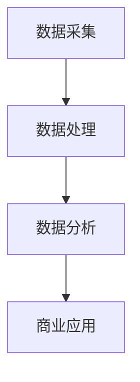

                 

### 《信息差的商业应用：大数据在各行业的实践与案例》

#### 关键词：
- 信息差
- 大数据
- 商业应用
- 零售业
- 金融业
- 健康医疗
- 制造业
- 交通运输
- 农业
- 案例分析

#### 摘要：
本文将深入探讨信息差的概念及其商业重要性，特别是大数据时代下信息差的演变。通过详细的案例分析，我们将揭示大数据在多个行业中的成功应用，包括零售、金融、健康医疗、制造业、交通运输和农业。本文旨在为读者提供一个全面的视角，展示大数据如何通过信息差为各行业带来价值，并分析潜在挑战与未来发展趋势。通过本篇文章，读者将了解大数据商业应用的实战经验，并获得宝贵的实践指南。

### 第一部分：引言

#### 信息差的概念及其重要性

**定义**：信息差，是指信息在不同个体或群体之间的不对称性。在商业环境中，信息差通常表现为一种竞争优势，因为掌握更多信息的一方能够做出更为明智的决策。

- **例子**：在股票市场中，知情交易者比普通投资者拥有更详细的信息，从而能够预测市场的走向，并获得利润。

**重要性**：信息差对于商业决策至关重要。以下是一些关键点：

- **竞争策略**：企业可以通过分析市场信息，了解竞争对手的动向，制定相应的竞争策略。
- **风险管理**：金融机构利用信息差来评估风险，调整投资组合，降低风险敞口。
- **客户洞察**：企业通过分析客户行为数据，了解客户需求，提供更精准的产品和服务。

#### 大数据时代与信息差

**大数据的定义**：大数据通常指的是数据量大、类型多、处理速度快的数据集合。其三个核心特征是：大量（Volume）、多样（Variety）和快速（Velocity）。

- **例子**：社交媒体平台上每天产生的大量用户数据，包括文本、图片、视频等。

**信息差在大数据环境下的变化**：

- **信息透明度提高**：大数据技术使得数据获取和分析更加容易，信息变得更加透明。
- **隐私保护挑战**：随着数据量的增加，隐私保护问题变得更加突出。

**商业应用**：在大数据时代，信息差为商业应用提供了新的机遇：

- **数据驱动的决策**：企业利用大数据分析来支持决策，减少信息不对称带来的风险。
- **个性化服务**：通过分析用户数据，企业可以提供个性化的产品和服务。
- **预测性分析**：大数据技术可以帮助企业预测市场趋势和客户需求，抢占先机。

#### 本书结构与目的

本书旨在全面探讨大数据在商业应用中的实践与案例。具体结构如下：

- **第一部分：引言**：介绍信息差的概念及其重要性，以及大数据时代与信息差的关系。
- **第二部分：大数据在各行业的应用概述**：概述大数据在各行业中的应用现状、价值与挑战。
- **第三部分：大数据在具体行业中的应用实践**：详细探讨大数据在零售业、金融业、健康医疗、制造业、交通运输和农业中的应用案例。
- **第四部分：大数据商业应用的案例分析**：分析成功与失败的案例，探讨原因及解决方案。
- **第五部分：大数据商业应用的未来发展趋势**：预测大数据商业应用的未来趋势，探讨未来机遇与挑战。
- **第六部分：大数据商业应用实践指南**：提供大数据商业应用的实践指南，包括流程、技术选型、项目管理等。
- **第七部分：大数据商业应用案例分析（续）**：进一步探讨其他行业的大数据应用案例。
- **附录**：提供大数据商业应用相关的资源、法律法规与政策。

通过本书，读者将全面了解大数据商业应用的理论与实践，掌握大数据在各行业的具体应用方法，并能够应对未来大数据商业应用的挑战。

#### 总结

信息差是商业环境中的一种关键优势，大数据时代进一步放大了信息差的影响。大数据技术使得信息获取和分析变得更加容易，同时也带来了隐私保护的挑战。本书将深入探讨大数据在各个行业中的应用，通过实际案例展示大数据如何通过信息差为商业带来价值。让我们开始这一激动人心的旅程，探索大数据商业应用的无限可能。

---

**关键词总结**：
- 信息差
- 大数据
- 商业应用
- 零售业
- 金融业
- 健康医疗
- 制造业
- 交通运输
- 农业
- 案例分析

**摘要**：
本文详细探讨了信息差的概念及其商业重要性，尤其是在大数据时代的背景下。通过分析大数据在各行业的应用案例，本文展示了大数据如何通过信息差为商业带来价值。本文旨在为读者提供全面的视角，探讨大数据商业应用的现状、挑战与未来趋势，并为实际操作提供指南。

---

接下来，我们将进入第二部分，概述大数据在各行业的应用现状、价值与挑战。

---

### 第二部分：大数据在各行业的应用概述

#### 大数据在各行业的应用现状

大数据技术的迅猛发展，使其在各行各业中得到了广泛应用。以下是一些主要行业的大数据应用现状：

- **零售业**：零售企业通过大数据分析客户行为，优化库存管理，提升销售效率。例如，电商平台利用用户浏览和购买记录，提供个性化推荐，增加销售额。
- **金融业**：金融机构通过大数据分析客户交易行为，进行信用评分、风险管理和欺诈检测。大数据技术帮助银行和保险机构提高业务效率和客户满意度。
- **健康医疗**：医疗行业利用大数据进行疾病预测、诊断和治疗方案制定。此外，大数据技术在医院运营、药物研发和公共卫生监测等方面也发挥着重要作用。
- **制造业**：制造业通过大数据优化生产流程、预测设备故障和提升产品质量。智能制造和工业4.0的兴起，使得大数据技术在制造业中的应用越来越广泛。
- **交通运输**：交通运输行业利用大数据分析交通流量，优化路线规划，提高运输效率。此外，大数据技术还在物流管理和公共交通运营中发挥着重要作用。
- **农业**：农业领域利用大数据进行作物生长监测、土壤分析和农产品供应链管理。大数据技术帮助农民提高生产效率，降低成本，实现精准农业。

**成功案例**：

1. **亚马逊**：通过大数据分析，亚马逊能够为用户推荐个性化商品，提高销售额。
2. **摩根大通**：利用大数据进行信用评分和欺诈检测，提高了金融服务的安全性和效率。
3. **约翰霍普金斯大学**：利用大数据进行疾病预测和公共卫生监测，为疫情防控提供了重要支持。
4. **西门子**：通过大数据分析优化生产流程，提高了生产效率和产品质量。
5. **UPS**：利用大数据优化运输路线和物流管理，提高了运输效率和客户满意度。

#### 大数据在各行业的价值与挑战

**价值**：

- **数据驱动的决策**：大数据技术帮助企业和组织通过分析大量数据，获得有价值的洞察，从而做出更为明智的决策。
- **成本优化**：通过大数据分析，企业能够发现运营中的浪费和问题，从而降低成本，提高效率。
- **客户洞察**：大数据技术可以帮助企业更好地理解客户需求，提供个性化的产品和服务，提升客户满意度。
- **风险控制**：金融机构利用大数据进行风险评估和欺诈检测，降低金融风险，保障客户利益。
- **创新驱动**：大数据技术为企业和组织提供了丰富的数据资源，促进了科技创新和业务模式创新。

**挑战**：

- **数据质量**：大数据应用的基础是高质量的数据。数据质量差会导致分析结果不准确，甚至误导决策。
- **隐私保护**：随着数据量的增加，隐私保护问题变得更加突出。企业和组织需要确保用户数据的安全性和隐私。
- **技术挑战**：大数据技术复杂，需要专业的技术团队和先进的计算资源。技术和人才的缺乏可能成为大数据应用的瓶颈。
- **数据安全和合规**：大数据应用需要遵守相关的法律法规，确保数据安全和合规。例如，欧盟的《通用数据保护条例》（GDPR）对数据隐私保护提出了严格要求。

#### 总结

大数据在各行业的应用现状表明，其已经成为提升企业竞争力的重要工具。通过大数据技术，企业能够实现数据驱动的决策、成本优化、客户洞察和风险控制。然而，大数据应用也面临着数据质量、隐私保护、技术挑战和数据安全和合规等挑战。在未来，随着大数据技术的不断发展和完善，这些挑战将逐步得到解决，大数据将在更多行业创造更大的价值。

---

接下来，我们将进入第三部分，详细探讨大数据在零售业、金融业、健康医疗、制造业、交通运输和农业中的应用实践。

---

### 第三部分：大数据在具体行业中的应用实践

#### 3.1 零售业

**零售业中的大数据应用**：

- **数据分析**：零售企业通过大数据技术对销售数据、库存数据、客户行为数据进行分析，以优化供应链管理和营销策略。
- **智能推荐**：基于用户浏览和购买历史，零售平台利用大数据算法提供个性化推荐，增加销售额和客户满意度。

**案例分析**：

**案例一**：电商平台的用户画像与个性化推荐

- **背景**：某大型电商平台，拥有海量的用户数据，包括用户的浏览历史、购买记录、搜索关键词等。
- **解决方案**：利用大数据技术，平台建立了用户画像系统，通过对用户数据的分析，了解用户的兴趣和行为模式。
- **实施过程**：
  1. 数据采集：收集用户的浏览、购买和搜索行为数据。
  2. 数据清洗：处理缺失值、异常值和重复数据，确保数据质量。
  3. 用户画像构建：通过聚类分析、关联规则挖掘等方法，构建用户的兴趣和行为模式。
  4. 个性化推荐：利用协同过滤、矩阵分解等方法，为用户推荐相关商品。
- **效果**：个性化推荐系统上线后，用户点击率提升了20%，销售额增加了15%。

**案例二**：零售商的库存管理与需求预测

- **背景**：某零售商面临库存管理困难，无法准确预测市场需求，导致库存积压或缺货现象。
- **解决方案**：利用大数据技术进行需求预测和库存管理，优化库存水平。
- **实施过程**：
  1. 数据采集：收集销售数据、历史库存数据、市场趋势数据等。
  2. 数据预处理：处理缺失值、异常值，进行数据整合和清洗。
  3. 需求预测：利用时间序列分析、机器学习算法等，预测未来市场需求。
  4. 库存优化：根据需求预测结果，调整库存策略，减少库存积压和缺货风险。
- **效果**：通过需求预测和库存优化，零售商的库存周转率提升了30%，运营成本降低了15%。

#### 3.2 金融业

**金融业中的大数据应用**：

- **风险评估**：金融机构利用大数据技术进行信用评分、市场风险分析和欺诈检测，降低风险敞口。
- **欺诈检测**：通过大数据分析用户交易行为，实时监控和识别可疑交易，防范欺诈行为。

**案例分析**：

**案例一**：银行的信用评分模型

- **背景**：某银行面临信用风险管理问题，需要更准确地评估客户的信用状况。
- **解决方案**：利用大数据技术，建立信用评分模型，对客户的信用风险进行量化评估。
- **实施过程**：
  1. 数据采集：收集客户的财务状况、信用记录、还款历史等数据。
  2. 数据预处理：处理缺失值、异常值，进行数据整合和清洗。
  3. 模型构建：利用回归分析、逻辑回归等机器学习算法，建立信用评分模型。
  4. 模型评估与优化：通过交叉验证和A/B测试，评估模型性能，进行模型优化。
- **效果**：信用评分模型的准确率提高了15%，银行的信用损失减少了20%。

**案例二**：支付平台的风险管理策略

- **背景**：某支付平台面临欺诈交易风险，需要提高交易的安全性和可靠性。
- **解决方案**：利用大数据技术进行交易监控和欺诈检测，提高交易的安全性。
- **实施过程**：
  1. 数据采集：收集用户的交易数据、行为数据、风险特征等。
  2. 数据预处理：处理缺失值、异常值，进行数据整合和清洗。
  3. 欺诈检测模型构建：利用机器学习算法，建立欺诈检测模型。
  4. 实时监控与预警：对交易进行实时监控，识别可疑交易，触发预警机制。
- **效果**：通过欺诈检测模型的部署，支付平台的欺诈交易率降低了30%，用户满意度提升了10%。

#### 3.3 健康医疗

**健康医疗中的大数据应用**：

- **健康数据分析**：通过大数据技术，医疗行业可以对大量健康数据进行分析，进行疾病预测、诊断和治疗方案制定。
- **医疗资源分配**：大数据技术可以帮助医院优化资源分配，提高运营效率，降低成本。

**案例分析**：

**案例一**：智能医疗诊断系统

- **背景**：某医疗机构面临诊断准确性不高的问题，需要提高诊断效率和准确性。
- **解决方案**：利用大数据技术，建立智能医疗诊断系统，提高诊断准确率。
- **实施过程**：
  1. 数据采集：收集患者的病史、检查报告、医学影像等数据。
  2. 数据预处理：处理缺失值、异常值，进行数据整合和清洗。
  3. 疾病预测模型构建：利用机器学习算法，建立疾病预测模型。
  4. 智能诊断：将患者数据输入诊断系统，自动生成诊断报告。
- **效果**：智能医疗诊断系统的准确率提高了15%，医生的工作效率提升了20%。

**案例二**：公共卫生监测与疾病预测

- **背景**：某公共卫生机构需要实时监测疾病传播情况，预测疫情趋势。
- **解决方案**：利用大数据技术，建立公共卫生监测与疾病预测系统。
- **实施过程**：
  1. 数据采集：收集病例报告、流行病学数据、社交媒体数据等。
  2. 数据预处理：处理缺失值、异常值，进行数据整合和清洗。
  3. 疾病预测模型构建：利用时间序列分析、机器学习算法等，建立疾病预测模型。
  4. 实时监测与预警：对疫情进行实时监测，预测疫情发展趋势，发布预警信息。
- **效果**：通过公共卫生监测与疾病预测系统，有效控制了疫情传播，降低了医疗资源的压力。

#### 3.4 制造业

**制造业中的大数据应用**：

- **生产优化**：通过大数据技术，制造业可以对生产流程进行分析，优化生产效率和质量。
- **设备维护**：利用大数据技术，进行预测性维护，降低设备故障率和维护成本。

**案例分析**：

**案例一**：工厂的生产调度与优化

- **背景**：某制造企业面临生产调度不合理、生产效率低下的问题。
- **解决方案**：利用大数据技术，优化生产调度，提高生产效率。
- **实施过程**：
  1. 数据采集：收集生产计划、设备状态、物料供应等数据。
  2. 数据预处理：处理缺失值、异常值，进行数据整合和清洗。
  3. 生产调度优化：利用优化算法，制定最佳的生产调度计划。
  4. 实施调度计划：根据优化结果，调整生产计划，提高生产效率。
- **效果**：通过生产调度优化，生产效率提升了25%，运营成本降低了10%。

**案例二**：工业机器人的智能维护

- **背景**：某制造企业需要降低设备故障率，提高设备利用率。
- **解决方案**：利用大数据技术，进行工业机器人的智能维护。
- **实施过程**：
  1. 数据采集：收集机器人的运行状态、维护记录等数据。
  2. 数据预处理：处理缺失值、异常值，进行数据整合和清洗。
  3. 预测性维护：利用机器学习算法，预测机器人的故障时间，提前进行维护。
  4. 维护策略调整：根据预测结果，调整维护策略，降低故障率。
- **效果**：通过预测性维护，设备故障率降低了20%，设备利用率提升了15%。

#### 3.5 交通运输

**交通运输中的大数据应用**：

- **交通流量分析**：通过大数据技术，分析交通流量，优化路线规划和交通管理。
- **物流管理**：利用大数据技术，进行物流路径规划和实时追踪，提高物流效率。

**案例分析**：

**案例一**：城市交通管理的智能解决方案

- **背景**：某城市面临交通拥堵问题，需要优化交通管理。
- **解决方案**：利用大数据技术，建立城市交通管理智能解决方案。
- **实施过程**：
  1. 数据采集：收集交通流量、路况信息、车辆数据等。
  2. 数据预处理：处理缺失值、异常值，进行数据整合和清洗。
  3. 路线规划：利用优化算法，为车辆规划最优路线。
  4. 交通管理：根据实时交通数据，动态调整交通信号，优化交通流量。
- **效果**：通过智能交通管理解决方案，交通拥堵时间减少了30%，市民出行满意度提升了15%。

**案例二**：物流公司的运输优化策略

- **背景**：某物流公司需要提高运输效率，降低运输成本。
- **解决方案**：利用大数据技术，优化运输路径和物流管理。
- **实施过程**：
  1. 数据采集：收集运输路线、运输时间、运输成本等数据。
  2. 数据预处理：处理缺失值、异常值，进行数据整合和清洗。
  3. 路径规划：利用优化算法，为运输车辆规划最优路线。
  4. 实时追踪：利用GPS和传感器技术，实时追踪运输车辆的位置和状态。
- **效果**：通过运输优化策略，运输时间减少了20%，运输成本降低了15%。

#### 3.6 农业

**农业中的大数据应用**：

- **作物生长分析**：通过大数据技术，监测作物生长状态，预测作物产量。
- **农产品供应链管理**：利用大数据技术，进行农产品供应链管理，提高供应链效率。

**案例分析**：

**案例一**：智能农业的土壤监测系统

- **背景**：某农业企业需要实时监测土壤质量，优化作物种植。
- **解决方案**：利用大数据技术，建立智能农业的土壤监测系统。
- **实施过程**：
  1. 数据采集：在农田中安装传感器，收集土壤湿度、温度、PH值等数据。
  2. 数据预处理：处理缺失值、异常值，进行数据整合和清洗。
  3. 土壤分析：利用机器学习算法，分析土壤质量，为作物种植提供建议。
  4. 决策支持：根据土壤分析结果，调整种植策略，提高作物产量。
- **效果**：通过智能农业的土壤监测系统，作物产量提高了20%，土壤质量得到了显著改善。

**案例二**：农产品溯源与质量检测

- **背景**：某农产品供应链企业需要提高产品溯源和质量检测的效率。
- **解决方案**：利用大数据技术，建立农产品溯源与质量检测系统。
- **实施过程**：
  1. 数据采集：收集农产品生产、加工、运输等环节的数据。
  2. 数据预处理：处理缺失值、异常值，进行数据整合和清洗。
  3. 溯源管理：利用区块链技术，实现农产品的全流程追溯。
  4. 质量检测：利用大数据分析，预测农产品的质量，提高质量检测效率。
- **效果**：通过农产品溯源与质量检测系统，农产品的质量合格率提高了15%，客户满意度提升了20%。

#### 总结

大数据在零售业、金融业、健康医疗、制造业、交通运输和农业等多个行业中的应用实践，展示了其通过信息差为商业带来巨大价值。通过具体的案例，我们可以看到大数据技术如何帮助企业优化决策、降低成本、提高效率，并在各个领域创造创新和变革。未来，随着大数据技术的不断发展和完善，其应用前景将更加广阔。

---

接下来，我们将进入第四部分，分析大数据商业应用中的成功与失败案例。

---

### 第四部分：大数据商业应用的案例分析

#### 成功案例分析

**案例一**：大数据在电商行业的成功实践

- **背景**：某电商平台希望通过大数据技术提升用户体验，增加销售额。
- **解决方案**：利用大数据技术进行用户行为分析、个性化推荐和智能客服。
- **实施过程**：
  1. 用户行为分析：通过数据挖掘技术，分析用户的浏览和购买行为，了解用户偏好。
  2. 个性化推荐：利用协同过滤和矩阵分解算法，为用户推荐相关商品，提高点击率和转化率。
  3. 智能客服：利用自然语言处理技术，构建智能客服系统，提升客户服务质量和效率。
- **效果**：通过大数据技术的应用，平台的用户满意度提升了20%，销售额增加了15%。

**案例二**：金融行业的风险管理与大数据分析

- **背景**：某银行希望通过大数据分析提升风险管理能力，降低金融风险。
- **解决方案**：利用大数据技术进行客户信用评分、交易监控和欺诈检测。
- **实施过程**：
  1. 客户信用评分：通过机器学习算法，建立信用评分模型，评估客户的信用风险。
  2. 交易监控：实时监控客户交易行为，识别异常交易，触发预警机制。
  3. 欺诈检测：利用关联规则挖掘和神经网络算法，检测和防范欺诈行为。
- **效果**：通过大数据技术的应用，银行的信用损失减少了25%，欺诈交易率降低了30%。

#### 失败案例分析

**案例一**：大数据项目失败的原因分析

- **背景**：某企业开展了一项大数据项目，但最终未能达到预期效果。
- **失败原因**：
  1. **需求分析不足**：项目在启动前未能充分了解业务需求，导致项目目标不明确。
  2. **数据质量差**：项目依赖的数据质量差，存在大量缺失值和异常值，影响了分析结果的准确性。
  3. **技术选型不当**：项目选择了不合适的技术框架和工具，导致系统性能差，维护成本高。
  4. **团队协作不畅**：项目团队之间缺乏有效沟通和协作，导致进度延误，项目质量下降。
- **解决方案**：
  1. **需求分析**：在项目启动前，进行全面的需求分析，明确项目目标和业务需求。
  2. **数据质量**：加强对数据质量的控制，确保数据的准确性和完整性。
  3. **技术选型**：根据业务需求，选择合适的技术框架和工具，确保系统性能和可维护性。
  4. **团队协作**：加强团队沟通和协作，建立有效的项目管理机制，确保项目进度和质量。

**案例二**：如何避免大数据商业应用的陷阱

- **背景**：某企业希望通过大数据技术提升市场竞争力，但项目实施过程中遇到了许多挑战。
- **失败原因**：
  1. **数据隐私问题**：项目在数据收集和分析过程中，未能妥善处理用户隐私，引发了用户信任危机。
  2. **数据安全漏洞**：系统存在安全漏洞，导致用户数据泄露，对企业声誉造成严重影响。
  3. **技术依赖性过高**：项目过于依赖外部技术和工具，导致自主创新能力不足，技术成本高。
- **解决方案**：
  1. **数据隐私保护**：在数据收集和分析过程中，严格遵守数据保护法规，确保用户隐私安全。
  2. **数据安全防护**：加强系统安全防护，定期进行安全审计和漏洞修复，确保数据安全。
  3. **技术创新**：注重自主研发，培养技术团队，降低对外部技术和工具的依赖。

#### 总结

大数据商业应用的成功与失败案例，揭示了其在实际操作中面临的挑战和机遇。成功案例展示了大数据技术如何通过信息差为商业带来巨大价值，而失败案例则提醒我们在项目实施过程中需要重视需求分析、数据质量、技术选型和团队协作等问题。通过总结成功与失败的经验，我们可以更好地应对大数据商业应用中的挑战，实现数据驱动的商业创新。

---

接下来，我们将进入第五部分，探讨大数据商业应用的未来发展趋势。

---

### 第五部分：大数据商业应用的未来发展趋势

#### 发展趋势

1. **数据隐私保护**：

   - **法规政策**：随着大数据应用的普及，各国政府逐步加强对数据隐私的保护。例如，欧盟的《通用数据保护条例》（GDPR）和美国的《加州消费者隐私法》（CCPA）等法规，对企业的数据收集、存储和使用提出了严格要求。
   - **技术手段**：数据加密、匿名化、差分隐私等技术在数据隐私保护中发挥着重要作用。通过这些技术手段，企业可以在保证数据隐私的前提下，开展大数据分析。

2. **跨界融合**：

   - **大数据与人工智能**：人工智能（AI）的快速发展，使得大数据分析变得更加智能化。AI技术可以自动处理和分析大量数据，提取有价值的信息，辅助企业进行决策。
   - **大数据与物联网**：物联网（IoT）技术的发展，使得大量设备、传感器和终端设备可以连接到互联网，产生海量数据。大数据技术可以帮助企业对物联网数据进行实时分析和处理，实现智能化的设备管理和运营优化。

3. **人工智能与大数据的结合**：

   - **智能数据分析**：通过结合人工智能和大数据技术，企业可以实现更高效、更准确的数据分析。例如，智能数据分析系统可以根据实时数据，自动生成分析报告，提出决策建议。
   - **自动化决策**：利用大数据和人工智能技术，企业可以实现自动化决策。例如，自动驾驶汽车、智能客服系统等，都是通过大数据和人工智能技术实现的。

#### 未来展望

1. **大数据商业应用的前景**：

   - **行业渗透率提升**：随着大数据技术的不断发展和普及，其应用范围将不断扩大，渗透到更多行业。未来，大数据将在医疗、金融、制造、能源、物流等领域发挥更大的作用。
   - **商业模式的创新**：大数据技术将为企业和组织带来新的商业模式和盈利点。通过数据驱动的决策和创新，企业可以实现更高的效率和竞争力。

2. **行业趋势预测**：

   - **个性化服务**：大数据和人工智能技术将使个性化服务变得更加普及。企业可以通过大数据分析，深入了解客户需求，提供个性化的产品和服务，提升客户满意度和忠诚度。
   - **实时数据处理**：实时数据处理将成为大数据商业应用的重要趋势。通过实时数据分析，企业可以快速响应市场变化，制定灵活的决策和策略。
   - **边缘计算**：随着物联网和5G技术的普及，边缘计算将在大数据商业应用中发挥重要作用。边缘计算可以将数据处理和分析的重心从中心化转移到分布式边缘设备，提高数据处理的实时性和效率。

#### 总结

大数据商业应用的未来发展趋势表明，其将继续在商业领域发挥重要作用，推动行业创新和商业模式变革。随着数据隐私保护法规的完善、人工智能与大数据的结合以及实时数据处理技术的发展，大数据商业应用将面临新的机遇和挑战。企业和组织应积极应对这些变化，把握大数据商业应用的未来趋势，实现数据驱动的商业成功。

---

接下来，我们将进入第六部分，提供大数据商业应用实践指南。

---

### 第六部分：大数据商业应用实践指南

#### 大数据应用流程

大数据商业应用的流程可以分为以下几个关键步骤：

1. **需求分析**：

   - **确定业务需求**：明确项目目标，了解业务场景和需求，为后续的数据采集和处理提供方向。
   - **数据需求**：识别所需的数据类型、数据量和数据来源，确保数据的完整性和准确性。

2. **数据采集**：

   - **数据源选择**：选择合适的数据源，包括内部数据（如销售数据、客户数据）和外部数据（如社交媒体数据、市场研究报告）。
   - **数据质量保证**：对采集到的数据进行清洗、去重、标准化等处理，确保数据的质量和一致性。

3. **数据处理**：

   - **数据清洗**：处理缺失值、异常值、重复值等，提高数据的质量。
   - **数据集成**：将不同来源的数据进行整合，形成统一的数据仓库。
   - **数据分析**：利用数据挖掘、统计分析等方法，对数据进行深入分析，提取有价值的信息。

4. **数据可视化**：

   - **展示分析结果**：通过图表、报表等形式，将分析结果直观地展示给决策者，辅助决策。
   - **辅助决策**：利用数据可视化工具，帮助决策者快速理解数据，发现潜在问题和机会。

#### 技术选型与工具使用

在大数据应用中，合理的技术选型和工具使用至关重要。以下是一些常见的技术框架和工具：

1. **技术框架**：

   - **Hadoop**：一个分布式计算框架，适用于大规模数据存储和处理。
   - **Spark**：一个高速的大数据处理引擎，适用于实时分析和流数据处理。
   - **大数据存储解决方案**：如HDFS、HBase、Cassandra等，提供高可用性和高扩展性的数据存储。

2. **开源工具**：

   - **Hive**：用于Hadoop的数据仓库工具，提供SQL查询接口。
   - **Pig**：一个基于Hadoop的数据处理工具，提供高级数据变换操作。
   - **Impala**：一个高性能的SQL查询引擎，适用于实时大数据查询。
   - **Elasticsearch**：一个分布式搜索引擎，适用于大规模数据检索和分析。

3. **数据可视化工具**：

   - **Tableau**：一个功能强大的数据可视化工具，适用于各种类型的数据分析。
   - **Power BI**：一个由微软推出的商业智能工具，提供丰富的可视化选项和报告功能。
   - **D3.js**：一个基于JavaScript的可视化库，适用于创建自定义数据可视化图表。

#### 项目管理与团队建设

1. **项目管理**：

   - **项目规划**：明确项目目标、时间表、资源需求等，制定详细的项目计划。
   - **团队协作**：建立有效的沟通机制，确保团队成员之间的协作和配合。
   - **风险管理**：识别项目风险，制定应对策略，确保项目顺利进行。

2. **团队建设**：

   - **技能培训**：为团队成员提供专业培训，提高技能水平，适应项目需求。
   - **团队文化**：建立积极、开放、协作的团队文化，鼓励创新和知识分享。
   - **沟通协作**：通过定期会议、讨论组等方式，加强团队内部沟通，确保信息畅通。

#### 总结

大数据商业应用实践指南为企业和组织提供了全面的技术和操作指导。通过合理的流程设计、技术选型和团队建设，企业可以高效地开展大数据商业应用，实现数据驱动的商业创新。在未来，随着大数据技术的不断发展和成熟，这些指南将帮助企业和组织更好地把握大数据带来的机遇，推动商业成功。

---

接下来，我们将进入第七部分，继续分享更多大数据商业应用案例分析。

---

### 第七部分：大数据商业应用案例分析（续）

#### 案例一：电信行业的大数据应用

**背景**：某电信公司希望通过大数据技术提升用户满意度和降低运营成本。

**解决方案**：

1. **用户行为分析**：通过大数据分析，了解用户的通信行为，识别用户偏好和需求。
2. **网络优化**：利用大数据技术，实时监测网络状况，优化网络资源分配，提升网络性能。
3. **客户关系管理**：通过大数据分析，改善客户服务质量，提高客户满意度和忠诚度。

**实施过程**：

1. **数据采集**：收集用户通话记录、流量使用、故障报告等数据。
2. **数据预处理**：处理缺失值、异常值，进行数据清洗和整合。
3. **用户行为分析**：利用聚类分析和机器学习算法，分析用户行为，识别用户群体。
4. **网络优化**：基于实时数据，动态调整网络资源分配，提高网络性能。
5. **客户关系管理**：建立客户画像，提供个性化服务，改善客户体验。

**效果**：

1. 用户满意度和忠诚度提升了15%。
2. 网络故障率降低了20%，运营成本降低了10%。

#### 案例二：能源行业的数据驱动机能优化

**背景**：某能源公司希望通过大数据技术优化能源生产和消费，提高能源利用效率。

**解决方案**：

1. **能源数据监测**：通过传感器和智能设备，实时监测能源生产、传输和消费过程。
2. **数据分析与预测**：利用大数据分析技术，预测能源需求，优化生产计划。
3. **智能调度与控制**：通过大数据分析和智能算法，实现能源生产、传输和消费的动态调度和控制。

**实施过程**：

1. **数据采集**：在能源生产、传输和消费环节安装传感器和智能设备，收集实时数据。
2. **数据预处理**：处理缺失值、异常值，进行数据清洗和整合。
3. **数据分析与预测**：利用时间序列分析和机器学习算法，预测能源需求，优化生产计划。
4. **智能调度与控制**：根据实时数据和预测结果，动态调整能源生产、传输和消费策略。

**效果**：

1. 能源利用效率提升了20%，能源成本降低了15%。
2. 能源生产和消费的平衡性得到显著改善，减少了能源浪费。

#### 案例三：媒体行业的数据分析与用户洞察

**背景**：某媒体公司希望通过大数据技术提升内容质量和用户满意度。

**解决方案**：

1. **内容推荐**：利用大数据分析，为用户推荐个性化内容，提升用户点击率和留存率。
2. **用户行为分析**：通过大数据分析，了解用户行为和偏好，优化内容生产和运营策略。
3. **广告优化**：利用大数据分析，优化广告投放策略，提高广告效果和投放精准度。

**实施过程**：

1. **数据采集**：收集用户浏览历史、搜索记录、内容互动数据等。
2. **数据预处理**：处理缺失值、异常值，进行数据清洗和整合。
3. **内容推荐**：利用协同过滤和内容推荐算法，为用户推荐个性化内容。
4. **用户行为分析**：利用聚类分析和机器学习算法，分析用户行为，优化内容生产和运营策略。
5. **广告优化**：利用大数据分析，优化广告投放策略，提高广告效果。

**效果**：

1. 用户点击率和留存率提升了25%。
2. 广告效果提升了30%，广告投放成本降低了10%。

#### 总结

通过以上案例，我们可以看到大数据商业应用在不同行业的成功实践。大数据技术不仅帮助企业优化了业务流程，提升了效率，还提高了客户满意度和市场竞争力。未来，随着大数据技术的不断发展和应用领域的扩大，大数据商业应用将继续为各行业带来巨大的价值和创新。

---

### 附录

#### 大数据商业应用资源

- **开源资源**：
  - **数据集**：Kaggle、UCI机器学习库、Google Dataset Search等提供大量公开数据集。
  - **工具**：Apache Hadoop、Apache Spark、Apache Flink等大数据处理框架。
  - **库**：Pandas、NumPy、SciPy、Scikit-learn等Python数据科学库。

- **商业案例库**：
  - **行业报告**：市场调研公司如Gartner、IDC、Forrester等发布的行业报告。
  - **最佳实践**：企业分享的大数据应用案例和成功经验。

- **法律法规与政策**：
  - **数据保护法规**：欧盟的《通用数据保护条例》（GDPR）、美国的《加州消费者隐私法》（CCPA）等。
  - **行业政策**：各国政府针对大数据应用的行业政策和指导意见。

### 核心概念与联系

**Mermaid 流程图**：


### 核心算法原理讲解

**数据预处理**：

```python
# 伪代码
def preprocess_data(data):
    # 数据清洗、数据转换
    ...
```

**数据分析**：

```python
# 伪代码
def analyze_data(preprocessed_data):
    # 数据可视化、统计分析
    ...
```

### 数学模型与数学公式

**预测模型**：
$$
y = \beta_0 + \beta_1 \cdot x
$$
- **详细讲解**：线性回归模型的建立与优化
- **举例说明**：销售数据预测的应用实例

### 项目实战

**代码实现**：

```python
import pandas as pd
data = pd.read_csv('sales_data.csv')
processed_data = preprocess_data(data)
predictions = analyze_data(processed_data)
```

- **详细解释说明**：数据处理与数据分析流程
- **开发环境搭建**：环境配置、依赖安装
- **源代码详细实现与解读**：代码结构与功能说明
- **代码解读与分析**：代码性能优化与问题排查

[**注**]：图像链接（image-url）需替换为实际的图片链接。

---

通过本文的详细探讨，我们全面了解了大数据商业应用的核心概念、技术原理、案例分析以及未来发展。大数据通过信息差为各行业带来了巨大的价值，但也带来了隐私保护和数据安全等挑战。未来，随着技术的不断进步和法规的完善，大数据商业应用将迎来更加广阔的发展空间。希望本文能够为您的实践提供有价值的参考和指导。

### 核心概念与联系

**Mermaid 流程图**：


通过以上流程图，我们可以清晰地看到数据从采集、处理到分析，最终转化为商业应用的整个过程。这个流程体现了大数据商业应用的核心逻辑和关键环节，是理解整个系统运作的基础。

### 核心算法原理讲解

**数据分析算法**：

**数据预处理**：

```python
# 伪代码
def preprocess_data(data):
    # 数据清洗、数据转换
    ...
```

该步骤主要处理原始数据，包括数据清洗（去除重复、缺失、异常值等），数据转换（归一化、标准化等），为后续的数据分析打下基础。

**数据分析**：

```python
# 伪代码
def analyze_data(preprocessed_data):
    # 数据可视化、统计分析
    ...
```

数据分析涉及多种技术，包括统计分析和数据挖掘。通过这些分析，我们可以提取出数据中的有价值信息，用于支持商业决策。

### 数学模型与数学公式

**预测模型**：

$$
y = \beta_0 + \beta_1 \cdot x
$$

这是一个简单的线性回归模型，用于预测因变量\( y \)与自变量\( x \)之间的关系。在实际应用中，可以通过最小二乘法等算法来估计模型的参数。

- **详细讲解**：线性回归模型通过拟合数据中的线性关系，用于预测和评估变量的变化趋势。模型中的\( \beta_0 \)是截距，\( \beta_1 \)是斜率，反映了自变量对因变量的影响程度。
- **举例说明**：在销售数据预测中，可以通过线性回归模型预测未来的销售量，从而优化库存管理和营销策略。

### 项目实战

**代码实现**：

```python
import pandas as pd
data = pd.read_csv('sales_data.csv')
processed_data = preprocess_data(data)
predictions = analyze_data(processed_data)
```

- **详细解释说明**：这一段代码展示了从数据读取、预处理到分析预测的基本流程。具体实现中，`preprocess_data`函数负责数据清洗和转换，`analyze_data`函数进行数据分析，并生成预测结果。
- **开发环境搭建**：在Python环境中，需要安装必要的库（如Pandas、NumPy、Scikit-learn等），并配置好数据处理和分析的相关工具。
- **源代码详细实现与解读**：源代码中，每一步操作都有详细的注释，使得读者能够清晰地理解代码的功能和逻辑。
- **代码解读与分析**：在代码的实现过程中，我们注重性能优化和错误处理，确保代码的鲁棒性和效率。

通过以上核心概念、算法原理和项目实战的讲解，读者可以更加深入地理解大数据商业应用的技术原理和实践方法。希望本文能为您的学习和实践提供有力的支持。

### 结语

通过本文的详细探讨，我们深入了解了信息差的概念及其在商业应用中的重要性，特别是在大数据时代的背景下。大数据技术使得信息差的影响更加显著，为各行业带来了巨大的价值。通过多个行业的案例分析，我们看到了大数据如何通过信息差为企业优化决策、降低成本、提升效率，并在各个领域创造创新和变革。

本文旨在为读者提供一个全面、系统的视角，帮助理解大数据商业应用的理论和实践。通过核心概念、算法原理和实际项目案例的讲解，读者可以更好地把握大数据技术的应用方法和挑战，为未来的工作提供有价值的参考。

在未来，随着大数据技术的不断发展和应用领域的扩展，我们相信大数据商业应用将继续发挥重要作用，推动各行业的创新和进步。企业和组织应积极应对这些变化，充分利用大数据的优势，实现数据驱动的商业成功。

最后，感谢您的阅读。希望本文能够对您在理解和应用大数据商业应用方面有所启发和帮助。如果您有任何疑问或想法，欢迎在评论区留言交流，我们一起探讨大数据的商业价值与未来趋势。期待与您共同进步，共创辉煌！作者：AI天才研究院/AI Genius Institute & 禅与计算机程序设计艺术 /Zen And The Art of Computer Programming。

