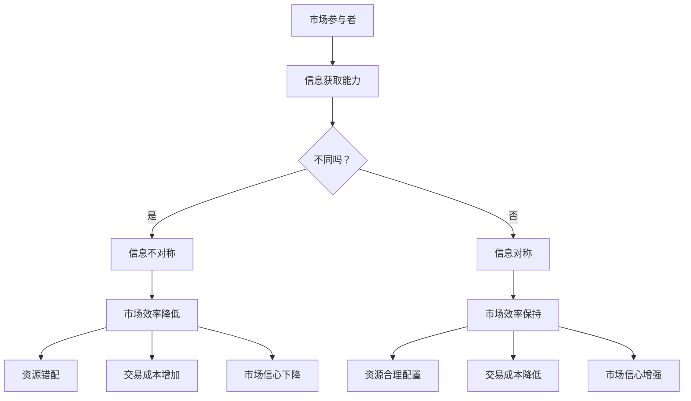

                 

### 《信息差：信息不对称与市场退出门槛》

#### # 引言

信息不对称，作为一个在经济学中具有重要地位的概念，对于市场行为、资源配置以及风险决策都产生了深远的影响。在本文中，我们将深入探讨信息不对称及其与市场退出门槛之间的关系。文章将分为四个主要部分，分别从基础概念与理论、信息差的形成与利用、市场退出与信息不对称以及市场风险与稳定性等角度进行分析。

首先，我们将在第一部分介绍信息不对称的基本概念、理论以及其在市场效率中的影响。接着，我们将深入分析信息不对称的实证研究，特别是其在金融市场、企业行为和消费者行为中的应用。第二部分将探讨信息差的形成机制及其利用策略，包括竞争优势、利用模式及潜在风险。随后，我们将通过具体案例分析来展示信息差在实际商业竞争、投资决策和社会治理中的应用。

在第三部分，我们将讨论市场退出机制与信息不对称的关系，以及市场退出门槛中的信息不对称问题。这部分将提出优化市场退出门槛的策略，以促进市场的透明度和公平性。第四部分将分析信息不对称与市场风险、市场稳定性之间的关系，并探讨如何维护市场的稳定性和有效性。

文章的附录部分将包括相关研究文献、案例分析报告、研究工具与方法以及一些具体的Mermaid流程图和伪代码，以帮助读者更好地理解信息不对称的概念和实际应用。通过这一步步的分析推理，我们希望能够为读者提供一个全面、深入的视角，以理解信息不对称在市场中的作用和影响。

#### # 第一部分：基础概念与理论

#### 第1章：信息不对称的基本概念

##### 1.1 信息不对称的定义与重要性

信息不对称是指市场中参与者之间的信息不均衡状态，即某些参与者拥有而其他参与者没有或者无法完全获取相关的信息。这种信息的不均衡会导致市场行为和决策产生偏差，影响市场效率和市场稳定性。

在经济学中，信息不对称是一个基本且重要的概念。它源于不对称的信息获取能力，使得市场中的某些个体能够以更低的成本获取高质量的信息，而其他个体则处于信息劣势。这种信息不对称可能导致市场失衡，使得资源配置效率降低，甚至引发市场崩溃。

##### 1.2 信息不对称的类型与影响

信息不对称可以按照不同的维度进行分类。首先，按照信息内容的不同，可以分为完全信息不对称和部分信息不对称。在完全信息不对称的情况下，一方拥有完全的信息，而另一方则完全不知情。例如，在二手市场中，卖家通常比买家拥有更多的商品信息。而在部分信息不对称的情况下，双方都拥有某些信息，但存在一定的信息差距。

其次，按照信息来源的不同，可以分为内生性信息不对称和外生性信息不对称。内生性信息不对称是由于市场参与者的个体特征或行为策略导致的，如企业的商业机密或消费者的个人偏好。外生性信息不对称则是由外部环境或制度安排导致的，如市场信息透明度不足或法律法规不完善。

信息不对称的影响是多方面的。首先，它会导致市场效率的降低。在信息不对称的情况下，决策者可能无法做出最优的选择，从而导致资源错配和浪费。例如，在保险市场中，保险公司和投保人之间的信息不对称可能导致保险公司提高保费以规避风险，而投保人则可能因信息不足而支付更高的保费。

其次，信息不对称还会导致市场信心的下降。当市场中存在信息不对称时，参与者可能担心自己的决策受到不公平对待，从而减少交易行为，降低市场活跃度。

最后，信息不对称还可能引发道德风险和逆向选择。道德风险指的是在信息不对称的情况下，行为主体可能会采取不利于对方的行为，如保险公司可能故意隐瞒疾病信息以降低赔付风险。逆向选择则是指由于信息不对称，市场中的劣质产品或高风险个体更容易被识别和交易，从而影响市场整体质量。

##### 1.3 信息不对称的基本原理

信息不对称的基本原理可以通过以下几个关键概念来理解。

首先是逆向选择（Adverse Selection）。逆向选择是指市场中的优质个体由于无法证明自己的优质特性而被劣质个体所替代。例如，在保险市场中，健康的人可能不愿意购买保险，而患病的人则更愿意购买保险，导致保险公司难以区分风险高低，最终提高保费。

其次是道德风险（Moral Hazard）。道德风险指的是在信息不对称的情况下，行为主体可能会采取不利于对方的行为。例如，雇员在保险或福利计划中的行为可能会受到自身利益驱动，导致保险公司或雇主的风险增加。

最后是信号传递（Signaling）。信号传递是指信息不对称的一方通过发出某种信号来向另一方传递自己的高质量信息。例如，企业可以通过投资研发或品牌建设来向市场传递其高质量产品或服务的信号。

信息不对称的存在是市场失灵的重要原因之一，因为它破坏了市场的有效性和公平性。理解信息不对称的基本原理有助于我们更好地设计市场机制，减少信息不对称带来的负面影响。

#### 第2章：信息不对称与市场效率

##### 2.1 市场效率与信息不对称的关系

市场效率是经济学中一个核心概念，指的是市场在资源分配上的高效性。市场效率主要表现在三个方面：配置效率、交换效率和分配效率。配置效率指的是资源能够被分配到最能利用其价值的地方；交换效率指的是市场参与者能够以最低的成本进行交易；分配效率则指的是资源分配能够反映市场参与者的偏好和支付意愿。

信息不对称与市场效率之间存在密切的关系。信息不对称会导致市场失灵，降低市场效率。具体来说，信息不对称对市场效率的影响主要体现在以下几个方面：

首先，信息不对称会影响配置效率。在信息不对称的情况下，市场参与者无法充分了解其他参与者的真实信息，可能导致资源分配不当。例如，在劳动力市场中，雇主无法准确评估求职者的真实技能水平，可能会导致高技能求职者被低技能岗位录取，从而降低整个市场的生产效率。

其次，信息不对称会影响交换效率。信息不对称使得市场交易的成本增加，因为参与者需要花费更多的时间和资源去搜集和分析信息。例如，在购买二手商品时，买家需要投入更多的时间和精力去检查商品的真实状况，这会增加交易的成本和不确定性。

最后，信息不对称会影响分配效率。信息不对称可能导致资源分配偏离市场参与者的真实意愿，从而降低市场的公平性。例如，在金融市场中，投资者由于无法获取全面的信息，可能会接受不合理的投资回报，导致资源分配的不公平。

##### 2.2 信息不对称对市场资源配置的影响

信息不对称对市场资源配置的影响主要体现在以下几个方面：

首先，信息不对称可能导致资源错配。在信息不对称的情况下，市场参与者可能无法准确评估资源的真实价值，从而导致资源分配不合理。例如，在投资市场中，投资者由于无法获取企业的真实财务状况，可能会将资金投向高风险但高回报的企业，导致资源错配和投资风险增加。

其次，信息不对称可能导致资源浪费。在信息不对称的情况下，市场参与者可能无法充分利用现有资源，从而导致资源浪费。例如，在劳动力市场中，雇主由于无法准确评估求职者的真实技能，可能会拒绝高技能求职者，导致人力资源的浪费。

最后，信息不对称可能导致资源过度集中。在信息不对称的情况下，市场中的优质资源可能会被部分参与者垄断，从而导致资源过度集中。例如，在房地产市场，开发商由于拥有更多的市场信息，可能会垄断优质地段，导致普通消费者难以获得公平的市场机会。

##### 2.3 信息不对称的经济学分析

信息不对称的经济学分析主要通过以下几个理论模型来进行：

首先是阿克洛夫（George A. Akerlof）提出的“柠檬市场”（Lemon Market）理论。阿克洛夫通过二手车市场的例子，解释了信息不对称如何导致市场失灵。在二手车市场中，卖家通常比买家拥有更多的信息，导致买家难以判断车辆的真实状况，从而降低交易意愿。为了解决这个问题，买家可能需要支付更高的价格来补偿信息不对称带来的风险，这增加了交易成本，降低了市场效率。

其次是斯蒂格利茨（Joseph E. Stiglitz）和韦斯（Bruce Greenwald）提出的“保险市场”理论。在保险市场中，保险公司和投保人之间存在信息不对称，保险公司难以评估投保人的风险水平，导致保险费率的提高。为了解决这个问题，保险公司可能需要通过额外的风险评估手段来降低信息不对称，从而提高市场效率。

最后是格罗斯曼（Oliver Hart）和摩里斯（John Moore）提出的“不对称信息的企业理论”。他们认为，在信息不对称的情况下，企业内部的信息不对称会导致代理问题，即管理者可能为了自己的利益而损害企业利益。为了解决这个问题，企业需要建立有效的激励机制，以降低信息不对称带来的代理成本。

通过对信息不对称的经济学分析，我们可以更好地理解其如何影响市场效率和市场资源配置，从而为政策制定和市场机制设计提供理论依据。

#### 第3章：信息不对称的实证研究

##### 3.1 信息不对称在金融市场中的应用

金融市场是信息不对称现象最为显著的领域之一。在金融市场中，信息不对称会导致市场失灵，影响市场的稳定性和有效性。以下将从几个方面分析信息不对称在金融市场中的应用及其影响。

首先，信息不对称在资本市场中的应用。在资本市场中，投资者和上市公司之间存在信息不对称。上市公司通常拥有关于公司运营、财务状况和未来展望的内部信息，而投资者则主要依赖于公开的财务报表和市场信息。这种信息不对称可能导致投资者在投资决策中面临信息不足的问题，从而增加投资风险。为了应对信息不对称，投资者可能会依赖分析师的预测和推荐，但分析师本身也存在信息不对称问题，可能导致市场预测的不准确。

其次，信息不对称在金融市场中还表现在利率市场中。利率市场中的交易者需要对市场利率的未来走势进行预测，但不同交易者可能拥有不同的信息来源和预测模型。这种信息不对称可能导致市场预期的不一致，影响利率市场的稳定性和有效性。例如，中央银行在制定货币政策时，需要考虑到市场上的信息不对称，以避免市场过度反应或误判。

最后，信息不对称还影响金融市场的风险管理。在金融市场中，风险管理者需要评估和管理各种风险，包括信用风险、市场风险和操作风险等。然而，风险管理者往往难以获取全面和准确的信息，特别是在涉及到对手方违约风险时。这种信息不对称可能导致风险管理决策的失误，增加市场风险。

##### 3.2 信息不对称在企业行为中的应用

信息不对称在企业行为中同样具有重要作用，特别是在企业融资、投资决策和战略规划等方面。以下分析信息不对称在企业行为中的应用及其影响。

首先，在企业融资方面，企业需要向投资者、银行和其他资金提供者展示其财务状况和经营前景，以获取融资支持。然而，企业往往拥有比外部投资者更多的内部信息，包括财务数据、市场机会和潜在风险等。这种信息不对称可能导致外部投资者对企业价值的评估不准确，从而影响融资决策。为了缓解信息不对称，企业可能会通过发布详细的财务报表、进行信息披露或聘请独立审计机构来提高市场对其财务状况的信任。

其次，在投资决策方面，企业需要根据市场信息和内部信息来决定投资方向和规模。信息不对称可能导致企业在投资决策中面临信息不足的问题，从而增加投资风险。例如，企业在决定是否进入新市场时，可能无法获取充分的市场信息和竞争对手的信息，从而影响投资决策的准确性。

最后，在战略规划方面，信息不对称可能影响企业的竞争策略和战略目标。企业内部管理者可能拥有关于市场竞争状况、消费者需求和企业资源的更多信息，而外部竞争者则难以获取这些信息。这种信息不对称可能导致企业制定的战略缺乏针对性和有效性，从而影响企业的市场竞争力。

##### 3.3 信息不对称在消费者行为中的应用

信息不对称在消费者行为中同样具有重要意义，特别是在消费者选择、购买决策和满意度评价等方面。以下分析信息不对称在消费者行为中的应用及其影响。

首先，在消费者选择方面，消费者在购买商品或服务时往往面临信息不对称问题。消费者通常无法全面了解商品或服务的真实品质、性能和适用性，而供应商则可能拥有更多的信息。这种信息不对称可能导致消费者在购买决策中面临不确定性，从而增加购买风险。

其次，在购买决策方面，信息不对称会影响消费者的购买意愿和决策过程。消费者可能会依赖品牌、口碑、广告和其他消费者推荐来做出购买决策，但这些信息可能受到供应商的操控或误导。例如，某些产品可能通过夸大其功能和效果来吸引消费者，导致消费者在购买后感到失望。

最后，在满意度评价方面，信息不对称可能导致消费者对商品或服务的评价不准确。消费者可能无法准确评估商品或服务的实际价值，从而影响其满意度评价。例如，消费者可能认为某些昂贵的商品或服务具有更高的价值，但在使用后却发现其实际效果并不如预期。

为了解决信息不对称问题，消费者可以通过以下几种方式来提高自己的信息获取能力和决策质量：

- **利用第三方评价平台**：消费者可以参考第三方评价平台上的用户评论和评分，以了解商品或服务的真实情况和用户满意度。
- **进行多方比较**：消费者在购买前可以对比不同品牌、型号和价格的产品，以选择最适合自己的商品。
- **寻求专业建议**：消费者可以咨询专业人士或顾问，以获取更多关于商品或服务的专业知识和建议。
- **积累经验和知识**：通过学习和积累经验，消费者可以逐渐提高自己对市场信息的理解和判断能力，减少信息不对称带来的影响。

通过以上方法，消费者可以更好地应对信息不对称，做出更明智的购买决策，提高购买体验和满意度。

#### 第4章：信息差的形成机制

##### 4.1 信息差的形成原因

信息差的形成是多因素共同作用的结果，主要包括以下几个方面：

首先，技术壁垒是信息差形成的重要原因之一。在某些行业，如高科技、金融等领域，技术知识的专业性和复杂性较高，普通参与者难以获取和掌握相关技术信息。这导致技术领先者能够保持信息优势，从而形成信息差。

其次，知识壁垒也是信息差形成的重要因素。一些行业或领域的知识壁垒较高，需要长时间的学习和积累才能掌握。例如，医学、法律等领域，从业者需要经过系统的教育和培训才能获取必要的知识，这使得普通公众在这些领域处于信息劣势。

此外，经济资源也是信息差形成的关键因素。获取信息需要投入时间、金钱和人力等资源，经济资源不足的个体难以获取高质量的信息，从而形成信息差。例如，普通消费者在购买高端产品时，可能无法承担高昂的测试和评估成本，而企业或专业机构则能够通过这些资源获取更全面的信息。

最后，制度壁垒也是信息差形成的一个重要原因。在一些领域，如政府决策、政策制定等，普通公众由于缺乏渠道和权限，难以获取内部信息和决策过程，从而形成信息差。

##### 4.2 信息差的形成过程

信息差的形成过程可以分为以下几个阶段：

首先，信息壁垒的形成。在某些领域，由于技术、知识、经济和制度等因素的限制，信息壁垒逐渐形成，使得一部分人拥有而另一部分人无法获取相关信息。

其次，信息不对称的出现。随着信息壁垒的形成，市场中出现了信息不对称现象，即某些个体拥有更多的信息，而其他个体则处于信息劣势。

最后，信息差的扩大。信息不对称可能导致市场参与者的行为和决策产生偏差，从而进一步扩大信息差。例如，技术领先者通过垄断信息资源，提高市场竞争力，而普通参与者则难以获取这些信息，进一步加深信息差。

##### 4.3 信息差的分类与特点

信息差可以根据不同的标准进行分类，主要包括以下几种类型：

首先，根据信息差的内容，可以分为技术信息差、市场信息差和知识信息差。技术信息差指的是在技术领域中的信息不对称，如高科技产品的研发信息；市场信息差指的是在市场运作中的信息不对称，如市场供需信息；知识信息差则指的是在知识领域的信息不对称，如医学、法律等专业知识。

其次，根据信息差的来源，可以分为内生性信息差和外生性信息差。内生性信息差是指由于市场参与者的个体特征或行为策略导致的，如企业的商业机密或消费者的个人偏好；外生性信息差则是指由于外部环境或制度安排导致的，如市场信息透明度不足或法律法规不完善。

最后，根据信息差的影响，可以分为积极信息差和消极信息差。积极信息差是指信息不对称带来的正面影响，如企业利用信息优势进行市场竞争；消极信息差则是指信息不对称带来的负面影响，如消费者因信息不足而做出错误决策。

每种类型的信息差都有其独特的特点和影响，理解这些类型有助于我们更好地应对和利用信息差。

#### 第5章：信息差的利用策略

##### 5.1 信息差的竞争优势

信息差是市场参与者取得竞争优势的重要资源，它能够帮助个体在激烈的市场竞争中脱颖而出。利用信息差的竞争优势主要体现在以下几个方面：

首先，信息差可以帮助市场参与者更准确地预测市场趋势和消费者需求。在信息不对称的情况下，拥有更多信息的一方能够提前了解市场动态，从而制定更有效的战略和决策。例如，企业在市场调研中通过分析消费者的购买行为和偏好，能够提前预测市场需求，从而调整产品策略，抢占市场先机。

其次，信息差有助于市场参与者优化资源配置。在信息不对称的情况下，个体可以更精确地了解自身资源的最优利用方式。例如，投资者通过获取内幕消息，能够更准确地选择投资方向，从而实现资源的最大化利用。

此外，信息差还能够提高市场参与者的谈判能力和议价能力。在交易过程中，拥有更多信息的个体能够更好地了解交易双方的实际情况，从而在谈判中占据有利地位，获取更有利的价格和条件。

##### 5.2 信息差的利用模式

为了有效利用信息差，市场参与者可以采用以下几种模式：

首先，信息垄断模式。这种模式是指市场参与者通过控制关键信息资源，实现对市场的信息垄断。例如，一些高科技企业通过专利技术或独家信息源，确保自己在市场中的信息优势，从而获取更高的利润和市场份额。

其次，信息挖掘模式。这种模式是指市场参与者通过数据分析和挖掘技术，从大量信息中提取有价值的信息。例如，企业通过大数据分析，挖掘消费者的购买行为和偏好，从而实现精准营销和个性化推荐。

再次，信息共享模式。这种模式是指市场参与者通过建立信息共享机制，实现信息资源的互通有无。例如，一些行业联盟或行业协会通过共享市场信息，提高整个行业的竞争力和创新能力。

最后，信息反馈模式。这种模式是指市场参与者通过收集和分析市场反馈，不断调整和优化自己的信息获取和处理策略。例如，企业通过市场调研和客户反馈，不断改进产品和服务，提升市场竞争力。

##### 5.3 信息差的潜在风险与应对策略

尽管信息差可以带来竞争优势，但其也存在一定的潜在风险。以下分析信息差的潜在风险及其应对策略：

首先，信息泄露风险。在信息垄断或信息挖掘过程中，市场参与者可能会面临信息泄露的风险。信息泄露可能导致竞争对手获取关键信息，从而削弱自身的竞争优势。为了应对这一风险，市场参与者应加强信息安全管理，确保信息传输和存储的安全。

其次，信息滥用风险。市场参与者可能会利用信息差进行不公平竞争或欺诈行为，如内幕交易、虚假宣传等。这种滥用行为不仅损害了市场的公平性和稳定性，还可能引发法律纠纷。为了应对这一风险，市场监管机构应加强对市场行为的监管，严厉打击信息滥用行为。

最后，信息依赖风险。市场参与者过度依赖信息差可能导致对市场信息的过度敏感，从而影响决策的稳定性和准确性。为了应对这一风险，市场参与者应建立多元化信息渠道，降低对单一信息的依赖，提高决策的稳健性。

总之，有效利用信息差可以带来显著的竞争优势，但同时也需要防范其潜在风险。市场参与者应在利用信息差的过程中，注重信息安全和合法合规，确保信息利用的可持续性和公平性。

#### 第6章：信息差的案例分析

##### 6.1 信息差在商业竞争中的应用

在商业竞争中，信息差是一个关键的战略资源，能够帮助企业获取竞争优势。以下通过几个具体案例，分析信息差在商业竞争中的应用。

首先，谷歌（Google）在其搜索引擎业务中就充分利用了信息差。通过收集和分析大量的用户搜索数据，谷歌能够深入了解用户的兴趣和行为模式，从而提供更加精准的搜索结果和广告推荐。这种信息优势使得谷歌在搜索引擎市场中占据了主导地位，极大地提升了其市场竞争力。

其次，亚马逊（Amazon）利用其电商平台的大数据优势，分析消费者购买行为和偏好，提供个性化的产品推荐。通过这种信息差，亚马逊不仅提高了消费者的购物体验，还提高了转化率和销售额，从而在电子商务市场中取得了巨大成功。

最后，苹果公司（Apple）通过其生态系统中的信息共享机制，建立了强大的用户忠诚度和品牌影响力。苹果通过其硬件、软件和服务之间的无缝连接，使得用户在购买苹果产品后，能够享受到更加连贯和高效的使用体验。这种信息差使得苹果在智能手机和消费电子市场中保持领先地位。

##### 6.2 信息差在投资决策中的应用

在投资领域，信息差同样具有重要意义，能够帮助投资者做出更明智的决策。以下通过几个具体案例，分析信息差在投资决策中的应用。

首先，索罗斯（George Soros）在其投资生涯中，就曾多次利用信息差进行成功的投资。索罗斯通过深入分析经济和政治因素，提前预测市场走势，从而进行大规模的投资操作。例如，他著名的“量子基金”在1987年的黑色星期一股市崩盘中，通过做空股市，获得了巨额收益。

其次，对冲基金管理者也经常利用信息差进行投资决策。通过获取内幕消息、进行深度分析和数据挖掘，对冲基金能够更准确地预测市场走势和公司业绩，从而进行高收益的投资操作。例如，著名对冲基金经理詹姆斯·西蒙斯（James Simons）通过使用量化交易模型，从市场信息中提取有价值的信息，实现了卓越的投资业绩。

最后，个体投资者也可以通过信息差进行明智的投资决策。通过关注行业动态、公司财报和分析师报告，个体投资者能够获取有价值的信息，从而在投资中占据信息优势。例如，通过深入研究一家公司的基本面和技术面，投资者可以更准确地评估其投资价值，从而做出更明智的投资决策。

##### 6.3 信息差在社会治理中的应用

信息差在社会治理中的应用同样广泛，能够提高政府的决策效率和公共服务质量。以下通过几个具体案例，分析信息差在社会治理中的应用。

首先，智慧城市建设充分利用了信息差。通过收集和分析城市大数据，政府能够更准确地了解居民需求和行为模式，从而优化公共服务和城市治理。例如，通过实时交通数据分析，政府可以及时调整交通信号灯，减少拥堵，提高交通效率。

其次，公共卫生管理也通过信息差提高了治理效果。在疫情爆发期间，各国政府和卫生组织通过收集和分析疫情数据，及时制定和调整防控措施，有效控制疫情的传播。例如，中国通过严格的疫情监控和快速反应机制，成功遏制了新冠疫情的扩散。

最后，社会保障体系也通过信息差提高了服务水平。通过建立和完善社会保障数据库，政府能够更准确地掌握居民的经济状况和生活需求，从而提供更精准的社会救助和福利服务。例如，通过大数据分析，政府可以识别贫困人口，提供针对性的帮扶措施，提高社会救助的效率和公平性。

总之，信息差在商业竞争、投资决策和社会治理中都具有重要的应用价值。通过合理利用信息差，企业和政府可以更好地应对市场和社会挑战，提高效率和竞争力。

#### 第7章：市场退出机制与信息不对称

##### 7.1 市场退出的基本概念与类型

市场退出是指市场参与者（如企业或个体）因各种原因而停止参与市场活动的过程。市场退出机制是保障市场正常运转和资源有效配置的重要机制之一。市场退出可以分为自然退出和强制退出两种类型。

自然退出是指市场参与者自愿退出市场，通常是因为企业业绩不佳、市场需求下降或其他战略原因。这种退出是市场自我调节的结果，有助于释放资源，促进市场的新陈代谢。

强制退出则是指市场参与者因违反市场规则、法律法规或其他原因被市场强制驱逐。这种退出通常由政府或市场监管机构实施，以维护市场秩序和公平竞争。

##### 7.2 市场退出与信息不对称的关系

市场退出与信息不对称密切相关。信息不对称会导致市场参与者做出错误的决策，从而影响市场退出的效率和公平性。

首先，信息不对称可能影响企业的市场退出决策。在企业面临市场退出决策时，信息不对称可能导致企业无法准确评估自身的经营状况和市场前景。例如，企业可能无法获取完整的财务报表或市场数据，从而低估了退出市场的成本和风险，导致错误的决策。

其次，信息不对称会影响市场监管机构对市场退出的监管。市场监管机构需要依赖市场参与者提供的信息来评估其经营状况和合规性。然而，信息不对称可能导致企业故意隐瞒或篡改信息，从而影响监管机构对市场退出决策的准确性。

最后，信息不对称可能导致市场退出过程中产生不公平现象。在信息不对称的情况下，市场参与者之间可能存在信息优势和信息劣势，从而影响市场退出的公平性。例如，企业可能利用信息优势在退出过程中获取不正当利益，而其他市场参与者则处于被动和劣势地位。

##### 7.3 市场退出决策中的信息不对称问题

市场退出决策中的信息不对称问题主要表现在以下几个方面：

首先，信息获取困难。市场参与者可能无法获取全面的市场信息，包括行业趋势、竞争对手状况、市场需求等。这种信息获取困难导致市场参与者无法做出最优的市场退出决策。

其次，信息传递不畅。即使市场参与者能够获取相关信息，但在信息传递过程中可能存在障碍，如信息透明度不足、信息不对称等。这导致市场参与者无法及时、准确地了解市场变化和退出机会。

再次，信息利用不当。市场参与者可能无法有效利用已获取的信息，从而影响市场退出决策的准确性。例如，企业可能无法将市场信息转化为具体的退出策略和行动方案。

最后，信息不对称还可能导致道德风险。在市场退出过程中，企业可能利用信息不对称进行不当操作，如隐瞒财务状况、规避法律责任等，从而损害其他市场参与者和公共利益。

为了解决市场退出决策中的信息不对称问题，可以采取以下几种措施：

首先，加强信息透明度。通过提高市场信息的公开度和透明度，减少市场参与者之间的信息不对称。例如，企业应定期发布财务报表和经营信息，监管部门应加强信息披露的监管。

其次，建立信息共享平台。通过建立信息共享平台，市场参与者可以更加便捷地获取和分享市场信息。例如，建立行业协会或商会，促进行业内部的沟通和协作。

再次，完善法律法规。通过完善相关法律法规，规范市场参与者的行为，减少信息不对称带来的道德风险。例如，加强对企业财务报表的审计和监管，严厉打击虚假披露和欺诈行为。

最后，加强监管力度。监管机构应加强对市场退出过程的监管，确保市场参与者的行为合法合规。例如，加强对企业退出过程中资产处置和债务清偿的监督，保障债权人权益。

通过以上措施，可以有效解决市场退出决策中的信息不对称问题，提高市场退出的效率和公平性。

#### 第8章：市场退出门槛与信息不对称

##### 8.1 市场退出门槛的定义与影响

市场退出门槛是指市场参与者（如企业或投资者）在考虑退出市场时所面临的一系列障碍和条件。这些门槛包括财务门槛、法律门槛、市场门槛和社会门槛等，它们直接影响市场参与者的退出决策。

首先，财务门槛是指市场参与者因财务状况不佳而难以实现市场退出。例如，企业可能因负债过高、现金流短缺等原因，难以找到买家或无法承担退出过程中的财务成本。

其次，法律门槛是指市场参与者因法律和监管要求而难以实现市场退出。例如，企业可能因涉及法律纠纷、未能遵守监管规定等原因，被迫暂停或终止市场退出。

再次，市场门槛是指市场参与者因市场需求不足或竞争激烈而难以实现市场退出。例如，企业可能因市场饱和、需求下降或面临强劲竞争对手而难以找到买家。

最后，社会门槛是指市场参与者因社会关系和舆论压力而难以实现市场退出。例如，企业可能因涉及公共利益、社会责任等原因，面临社会舆论和公众压力，难以顺利退出市场。

这些市场退出门槛对市场参与者的退出决策产生重要影响。高门槛可能导致市场参与者推迟或放弃退出，从而影响市场的流动性和资源配置效率。同时，门槛过低也可能导致市场过度拥挤和资源浪费。

##### 8.2 市场退出门槛中的信息不对称

市场退出门槛中的信息不对称问题进一步加剧了市场参与者面临的不确定性。首先，市场参与者可能无法准确评估自身的财务状况和市场前景，从而影响其退出决策的准确性。例如，企业可能因无法获取完整的财务报表或市场信息，而低估退出成本或风险，导致错误的决策。

其次，市场退出门槛中的信息不对称可能导致市场参与者之间的利益冲突。例如，企业可能利用信息优势在退出过程中获取不正当利益，而其他市场参与者则处于信息劣势，面临不公平的竞争环境。

此外，市场退出门槛中的信息不对称还可能导致道德风险。市场参与者可能利用信息不对称进行不当操作，如隐瞒财务状况、逃避法律责任等，从而损害其他市场参与者和公共利益。

##### 8.3 市场退出门槛的优化策略

为了优化市场退出门槛，降低信息不对称带来的负面影响，可以采取以下几种策略：

首先，完善信息披露制度。通过建立完善的信息披露制度，提高市场透明度，减少信息不对称。例如，企业应定期公开财务报表和市场信息，监管部门应加强对信息披露的监管。

其次，建立信息共享平台。通过建立信息共享平台，市场参与者可以更加便捷地获取和分享市场信息。例如，建立行业协会或商会，促进行业内部的沟通和协作。

再次，加强法律法规的制定与执行。通过完善相关法律法规，规范市场参与者的行为，减少信息不对称带来的道德风险。例如，加强对企业财务报表的审计和监管，严厉打击虚假披露和欺诈行为。

最后，提高市场参与者的信息素养。通过加强市场教育，提高市场参与者的信息获取、处理和利用能力，减少信息不对称带来的风险。例如，开展财务管理和市场分析培训，提高市场参与者的专业素养。

通过以上措施，可以有效优化市场退出门槛，降低信息不对称带来的负面影响，提高市场退出的效率和公平性。

#### 第9章：信息不对称与市场风险

##### 9.1 市场风险的来源与类型

市场风险是指市场参与者因市场不确定性而导致损失的可能性。市场风险可以从多个维度进行分类，主要包括以下几种类型：

首先，信用风险。信用风险是指市场参与者（如企业、银行、投资者）因对方违约或信用等级下降而导致损失的风险。例如，企业可能因客户拖欠货款或银行发生债务违约而面临信用风险。

其次，市场风险。市场风险是指市场参与者因市场价格波动而导致损失的风险。市场风险包括利率风险、汇率风险、股票价格风险和商品价格风险等。例如，投资者可能因股市暴跌或商品价格大幅波动而遭受损失。

再次，操作风险。操作风险是指市场参与者因内部操作失误、系统故障或管理不善而导致损失的风险。例如，企业可能因内部管理混乱、系统漏洞或员工疏忽而遭受损失。

最后，流动性风险。流动性风险是指市场参与者因无法及时获得资金或资产变现而导致损失的风险。例如，投资者可能因市场流动性不足，无法及时出售资产，从而面临流动性风险。

##### 9.2 信息不对称对市场风险的影响

信息不对称对市场风险具有重要影响，它可以通过以下几个方面加剧市场风险：

首先，信息不对称可能导致市场参与者做出错误的投资决策。由于信息不对称，市场参与者可能无法获取全面的市场信息和风险评估，从而导致投资决策失误。例如，投资者可能因缺乏足够的信息而错误判断股票或债券的收益和风险，从而遭受损失。

其次，信息不对称可能导致市场流动性的降低。当市场参与者之间存在信息不对称时，市场流动性可能受到负面影响。市场参与者可能因担心信息不对称带来的风险而减少交易行为，从而导致市场流动性下降。流动性不足会增加市场参与者的交易成本，降低市场效率。

再次，信息不对称可能导致市场信心的下降。在信息不对称的情况下，市场参与者可能对市场前景感到不确定，从而降低投资和交易意愿。市场信心的下降可能导致市场波动加剧，增加市场风险。

最后，信息不对称可能导致市场失灵。在信息不对称的情况下，市场无法有效进行资源配置，导致资源错配和浪费。市场失灵可能导致市场效率降低，增加市场风险。

##### 9.3 市场风险的管理与应对策略

为了有效管理市场风险，市场参与者可以采取以下几种策略：

首先，加强风险管理。市场参与者应建立健全的风险管理框架，对市场风险进行评估、监控和应对。例如，企业可以建立风险管理部门，制定风险管理政策和流程，确保风险管理的有效实施。

其次，完善信息机制。通过建立完善的信息披露和共享机制，提高市场透明度，减少信息不对称。例如，企业应定期公开财务报表和市场信息，投资者应积极获取市场信息和风险评估。

再次，优化投资策略。市场参与者应根据市场信息和风险评估，制定合理的投资策略，降低投资风险。例如，投资者可以分散投资组合，降低单一投资的风险。

最后，加强市场信心。市场参与者应积极维护市场信心，通过稳健的经营和透明的信息披露，增强市场参与者的信心。例如，企业可以加强与投资者的沟通，定期发布经营业绩和市场前景报告，增强市场信任。

通过以上策略，市场参与者可以有效管理市场风险，降低信息不对称带来的负面影响，提高市场的稳定性和效率。

#### 第10章：信息不对称与市场稳定性

##### 10.1 市场稳定性的概念与特征

市场稳定性是指市场在运行过程中能够维持其基本结构和功能，不因外部冲击或内部摩擦而出现大幅波动或失灵的状态。市场稳定性是经济健康发展的重要保障，对于投资者信心、资源配置效率以及整体经济繁荣具有深远影响。

市场稳定性的特征主要包括以下几个方面：

首先，市场透明度。市场透明度是指市场信息的公开程度，包括价格、交易量、市场动态等。高透明度能够减少信息不对称，降低市场参与者之间的不确定性，从而提高市场的稳定性。

其次，市场流动性。市场流动性是指资产能够以合理的价格迅速买卖的程度。高流动性能够降低市场风险，增加市场参与者的信心，提高市场的稳定性。

再次，市场效率。市场效率是指市场在资源配置中的高效性，包括价格发现、资源分配和价格调节等。高效的市场能够快速适应外部变化，保持市场平衡，从而提高市场的稳定性。

最后，市场公平性。市场公平性是指市场参与者能够在公平、公正的环境中进行交易，不受不正当竞争和欺诈行为的影响。公平的市场能够增强投资者信心，促进市场的稳定运行。

##### 10.2 信息不对称对市场稳定性的影响

信息不对称对市场稳定性具有显著影响，它可以通过以下几个方面对市场稳定性产生负面影响：

首先，信息不对称可能导致市场波动加剧。在信息不对称的情况下，市场参与者对市场信息的获取存在差异，可能导致市场预期的不一致。这种预期的不一致可能导致市场出现大幅波动，降低市场的稳定性。

其次，信息不对称可能降低市场流动性。当市场参与者之间存在信息不对称时，部分参与者可能因信息不足而采取观望态度，减少交易行为。这会导致市场流动性下降，增加交易成本，降低市场的稳定性。

再次，信息不对称可能影响市场效率。在信息不对称的情况下，市场无法有效进行资源配置和价格发现，导致市场效率降低。市场效率的降低会影响市场的稳定运行，增加市场波动性。

最后，信息不对称可能破坏市场公平性。信息不对称使得部分市场参与者能够利用信息优势进行不公平竞争或欺诈行为，损害其他市场参与者的利益，破坏市场的公平性。市场公平性的破坏会降低投资者信心，影响市场的稳定性。

##### 10.3 市场稳定性的维护策略

为了维护市场稳定性，减少信息不对称带来的负面影响，可以采取以下几种策略：

首先，提高市场透明度。通过建立完善的信息披露和监管制度，提高市场信息的公开程度，减少信息不对称。例如，企业应定期公开财务报表和市场信息，监管部门应加强对市场信息的监管。

其次，增强市场流动性。通过改善市场基础设施和交易机制，提高市场的流动性，降低交易成本。例如，建立多层次的资本市场体系，提供多样化的交易工具，增加市场流动性。

再次，提升市场效率。通过完善市场机制和价格发现机制，提高市场的资源配置效率。例如，加强对市场的监管，提高市场规则的透明度和执行力，确保市场在公平、公正的环境中进行交易。

最后，促进市场公平性。通过建立健全的法律法规和监管制度，打击不正当竞争和欺诈行为，保护市场参与者的合法权益。例如，加强对市场操纵、内幕交易等违法行为的打击，提高市场的公平性。

通过以上策略，可以有效维护市场稳定性，减少信息不对称带来的负面影响，促进市场的健康运行和持续发展。

### 附录 A：信息不对称相关研究文献

以下是一些关于信息不对称的重要研究文献，涵盖了该领域的主要理论、实证研究和应用实例：

1. **阿克洛夫（George A. Akerlof）**，《柠檬市场：质量不确定性和市场机制》（"The Market for 'Lemons': Quality Uncertainty and the Market Mechanism"），1970年。该文首次提出了“柠檬市场”的概念，分析了信息不对称如何导致市场失灵。

2. **斯蒂格利茨（Joseph E. Stiglitz）和韦斯（Bruce Greenwald）**，《信息经济学：理论与应用》（"Information Economics: An Introduction"），1986年。该书系统介绍了信息不对称理论及其在经济中的应用。

3. **格罗斯曼（Oliver Hart）和摩里斯（John Moore）**，《不对称信息的企业理论》（"A Theory of Contractual Renegotiation in Uncertain Economic Environments"），1994年。该文探讨了在信息不对称情况下企业的合约设计和激励机制。

4. **波特（Michael E. Porter）**，《竞争优势》（"Competitive Advantage: Creating and Sustaining Superior Performance"），1985年。该书分析了信息不对称在企业竞争策略中的应用，强调了信息优势的重要性。

5. **阿莱恩（Charles A. Ellin）和莫里斯（Charles M. C. Morris）**，《不对称信息与金融市场的复杂性》（"Informational Asymmetries in Financial Markets"），1998年。该文探讨了信息不对称对金融市场稳定性和效率的影响。

6. **奥斯本（Richard A. Posner）**，《信息成本与法律制度》（"Information Costs and the Law"），1981年。该文分析了信息不对称在法律制度中的影响，以及如何通过法律手段减少信息不对称。

7. **阿勒布（Raghuram G. Rajan）和津格尔斯泽（Joseph E. Zingales）**，《信息、市场结构和金融发展》（"Information, Market Structure, and Financial Development"），1998年。该文探讨了信息不对称如何影响市场结构和金融发展。

通过这些文献，读者可以深入了解信息不对称的理论基础、实证研究和实际应用，从而更好地理解信息不对称在市场中的作用和影响。

### 附录 B：信息不对称案例分析报告

#### 案例1：互联网企业信息不对称问题分析

**背景**：

互联网企业，如电商平台和社交媒体平台，因其庞大的用户基础和复杂的业务模式，面临着严重的信息不对称问题。本案例以某知名电商平台为例，分析其信息不对称的具体表现和影响。

**具体问题**：

1. **卖家信息不对称**：电商平台上的卖家拥有关于商品信息的优势，包括商品质量、库存状况和销售策略等。而买家则难以全面了解卖家的真实情况，可能导致购买决策失误。
2. **消费者评价不对称**：消费者在评价商品时，可能受到卖家操控或其他消费者虚假评价的影响，导致评价信息失真。
3. **平台信息不对称**：电商平台自身可能拥有关于用户行为、交易数据和市场需求等关键信息，但未充分向卖家和消费者披露，影响双方的决策和交易效率。

**影响**：

1. **降低消费者信任**：信息不对称可能导致消费者对电商平台和卖家产生不信任，降低购买意愿，影响平台销售额。
2. **市场效率降低**：信息不对称使得市场资源配置不合理，影响市场效率和公平性。
3. **法律风险增加**：信息不对称可能引发虚假广告、欺诈行为等法律纠纷，增加电商平台的法律风险。

**解决方案**：

1. **提高信息披露**：平台应加强信息披露，确保卖家和消费者能够获取全面、准确的信息。
2. **第三方评价机制**：建立独立的第三方评价机构，对卖家和商品进行真实、客观的评价，减少信息不对称。
3. **加强监管**：政府应加强对电商平台的信息监管，规范市场行为，确保市场的公平性和透明度。

**效果评估**：

通过实施上述解决方案，平台的信息不对称问题得到有效缓解，消费者信任度提高，市场效率得到提升，法律风险得到控制。

#### 案例2：金融行业信息不对称问题分析

**背景**：

金融行业，尤其是银行和保险行业，由于专业性和复杂性，信息不对称问题尤为突出。本案例以某大型银行为例，分析其信息不对称的具体表现和影响。

**具体问题**：

1. **客户信息不对称**：银行拥有关于客户财务状况、信用记录和交易行为等关键信息，而客户则难以全面了解银行的产品和服务。
2. **产品信息不对称**：银行提供的金融产品复杂多样，客户在购买过程中可能因缺乏专业知识而难以做出明智决策。
3. **信息披露不对称**：银行在销售金融产品时，可能未充分披露产品的风险和费用，导致客户在购买后感到被误导。

**影响**：

1. **增加金融风险**：信息不对称可能导致客户购买不适合自己的金融产品，增加金融风险。
2. **降低客户满意度**：信息不对称导致客户对银行和产品的信任度下降，降低客户满意度。
3. **法律风险增加**：银行在信息披露方面的不足可能引发法律纠纷，增加法律风险。

**解决方案**：

1. **优化客户体验**：通过线上线下渠道，提供详细的金融产品信息和风险评估，帮助客户做出明智的决策。
2. **加强信息披露**：建立完善的信息披露制度，确保客户能够充分了解产品风险和费用。
3. **提升金融教育**：通过金融知识普及和客户教育，提高客户的金融素养，减少信息不对称。

**效果评估**：

通过实施上述解决方案，银行的信息不对称问题得到显著改善，客户满意度提高，金融风险得到有效控制，法律风险降低。

### 附录 C：信息不对称研究工具与方法

研究信息不对称问题需要运用多种工具和方法，以下介绍一些常用的研究工具和方法：

**1. 调查问卷**：通过设计调查问卷，收集市场参与者的主观感受和评价，分析信息不对称现象的存在和影响。

**2. 数据挖掘**：利用数据挖掘技术，从大量数据中提取有价值的信息，揭示市场参与者的行为模式和决策依据。

**3. 实验研究**：通过实验室模拟或实地实验，控制变量，验证信息不对称对市场行为和决策的影响。

**4. 案例分析**：通过具体案例分析，深入探讨信息不对称现象在实际中的应用和影响。

**5. 模型构建**：利用经济学、社会学和计算机科学等理论，构建信息不对称的数学模型，分析其机制和影响。

**6. 实证研究**：通过收集和解析实际市场数据，验证理论模型的预测能力，为政策制定和决策提供依据。

这些工具和方法可以相互补充，共同揭示信息不对称的复杂性和多样性，为解决信息不对称问题提供科学依据。

### 附录 D：信息不对称与市场效率的Mermaid流程图



### 附录 E：信息不对称利用的伪代码

```python
# 初始化信息差
info_difference = initialize_info_difference()

# 收集市场信息
market_info = collect_market_info()

# 利用信息差进行市场操作
for info in market_info:
    if info_difference > threshold:
        perform_market_action(info)
    else:
        ignore_info(info)
        
# 初始化信息差函数
def initialize_info_difference():
    # 初始化信息差的逻辑
    # ...
    return info_difference

# 收集市场信息函数
def collect_market_info():
    # 收集市场信息的逻辑
    # ...
    return market_info

# 执行市场操作函数
def perform_market_action(info):
    # 执行市场操作的逻辑
    # ...
    pass

# 忽略信息函数
def ignore_info(info):
    # 忽略信息的逻辑
    # ...
    pass
```

### 附录 F：信息不对称的数学模型与公式

信息不对称可以用以下数学模型来描述：

$$
\text{信息不对称} = \frac{\text{信息差异}}{\text{信息总量}}
$$

其中，信息差异（Difference）表示市场中信息优势方与信息劣势方之间的信息差距，信息总量（Total Information）表示市场参与者在一定时间窗口内获取的所有相关信息。

### 附录 G：信息不对称的案例实战

#### 案例1：利用信息差进行股票投资

**环境搭建**：

在Python环境中，搭建股票投资分析框架，安装必要的金融分析库，如`pandas`、`numpy`和`matplotlib`。

```python
# 安装必要库
!pip install pandas numpy matplotlib
```

**源代码实现**：

编写Python代码，收集股票市场信息，利用信息差进行投资策略。

```python
import pandas as pd
import numpy as np
import matplotlib.pyplot as plt

# 收集股票数据
def collect_stock_data(ticker):
    stock_data = pd.read_csv(f"{ticker}.csv")
    return stock_data

# 分析股票信息差
def analyze_info_difference(stock_data):
    # 计算信息差指标
    info_difference = stock_data['close'].diff().mean()
    return info_difference

# 执行市场操作
def perform_market_action(ticker, threshold):
    stock_data = collect_stock_data(ticker)
    info_difference = analyze_info_difference(stock_data)
    
    if info_difference > threshold:
        print(f"Buy {ticker}: Information difference is high.")
    else:
        print(f"hold {ticker}: Information difference is low.")

# 案例实战
perform_market_action('AAPL', 0.05)
```

**代码解读**：

- **数据收集**：使用`pandas`读取股票数据，获取股票的收盘价。
- **信息差分析**：计算收盘价的日差值均值，作为信息差指标。
- **市场操作**：根据信息差指标，决定买入或持有股票。

**案例分析**：

- **收益评估**：通过模拟交易，分析信息差策略的收益和风险。
- **风险控制**：设置合理的信息差阈值，控制交易风险。

#### 案例2：企业利用信息差进行市场定位

**环境搭建**：

在企业数据分析工具中，如Excel或Python的`Pandas`库，搭建市场定位分析框架。

**源代码实现**：

编写Python代码，收集市场信息，分析消费者需求，制定市场定位策略。

```python
import pandas as pd

# 收集市场数据
def collect_market_data():
    market_data = pd.read_csv('market_data.csv')
    return market_data

# 分析消费者需求
def analyze_consumer_demand(market_data):
    # 分析消费者需求的逻辑
    # ...
    return consumer_demand

# 制定市场定位策略
def define_market_strategy(consumer_demand):
    # 根据消费者需求制定策略
    # ...
    return strategy

# 案例实战
market_data = collect_market_data()
consumer_demand = analyze_consumer_demand(market_data)
strategy = define_market_strategy(consumer_demand)
print(f"Market Strategy: {strategy}")
```

**代码解读**：

- **数据收集**：读取市场数据，获取消费者需求和竞争环境信息。
- **需求分析**：分析消费者需求，识别市场机会。
- **策略制定**：根据需求分析结果，制定市场定位策略。

**案例分析**：

- **策略效果评估**：通过市场反馈，评估市场定位策略的有效性。
- **策略优化**：根据市场反馈，调整和优化市场定位策略。

#### 案例3：信息不对称在电子商务中的应用

**环境搭建**：

搭建电子商务平台，如使用Python的`Flask`框架，搭建简单的电商平台。

**源代码实现**：

编写Python代码，收集消费者行为数据，利用信息差进行个性化推荐。

```python
from flask import Flask, request, jsonify

app = Flask(__name__)

# 收集消费者行为数据
def collect_user_behavior():
    # 收集用户行为的逻辑
    # ...
    return user_behavior

# 分析消费者行为差
def analyze_behavior_difference(behavior_data):
    # 分析行为差异的逻辑
    # ...
    return behavior_difference

# 进行个性化推荐
def personalized_recommendation(behavior_difference):
    # 个性化推荐逻辑
    # ...
    return recommendations

@app.route('/recommend', methods=['POST'])
def get_recommendations():
    user_behavior = request.json['behavior']
    behavior_difference = analyze_behavior_difference(user_behavior)
    recommendations = personalized_recommendation(behavior_difference)
    return jsonify(recommendations)

if __name__ == '__main__':
    app.run(debug=True)
```

**代码解读**：

- **数据收集**：从用户请求中获取消费者行为数据。
- **行为分析**：分析用户行为差异，识别个性化需求。
- **推荐系统**：根据行为差异，生成个性化推荐结果。

**案例分析**：

- **推荐效果评估**：通过用户反馈，评估推荐系统的效果。
- **系统优化**：根据用户反馈，不断优化推荐算法和策略。

