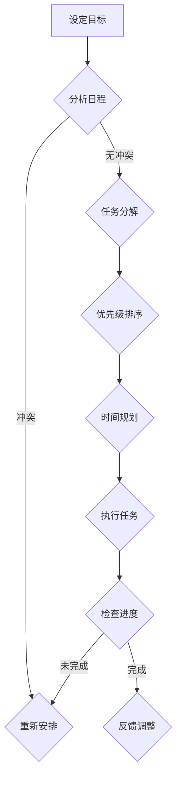
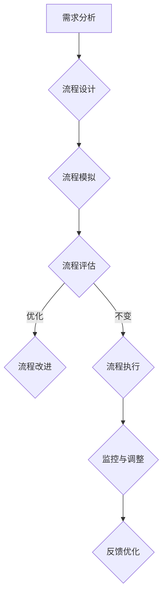

                 

### 《信息简化的好处与技巧：在复杂世界中简化以提高生活质量和效率》

**关键词：** 信息简化、生活质量、效率提升、复杂世界、人工智能、技术技巧

**摘要：** 随着信息时代的到来，复杂世界的挑战不断加剧。本文旨在探讨信息简化的好处与技巧，通过深入分析信息简化的理论基础、方法策略，以及其在生活中的具体应用，帮助读者在复杂世界中找到简化的途径，提高生活质量和效率。文章还将讨论信息简化对未来趋势的影响，并提供实践案例与资源指南，以期为读者提供全面的指导。

### 目录大纲

#### 第一部分：信息简化的理论基础
1. **信息简化的定义与意义**
   - **1.1 信息简化的概念**
   - **1.2 信息简化的重要性**
   - **1.3 信息简化的基本原则**

2. **复杂世界的挑战**
   - **2.1 信息过载的现象**
   - **2.2 复杂性的负面影响**
   - **2.3 信息简化的必要性**

3. **信息简化的方法与策略**
   - **3.1 简化信息的筛选**
   - **3.2 简化信息的处理**
   - **3.3 简化信息的存储**

#### 第二部分：信息简化在生活中的应用
4. **个人生活中的信息简化**
   - **4.1 时间管理**
     - **4.1.1 制定优先级**
     - **4.1.2 减少不必要的活动**
     - **4.1.3 高效完成任务**
   - **4.2 财务管理**
     - **4.2.1 预算规划**
     - **4.2.2 简化财务报表**
     - **4.2.3 智能投资**

5. **职业环境中的信息简化**
   - **5.1 工作流程优化**
     - **5.1.1 流程图的绘制**
     - **5.1.2 流程的简化与自动化**
     - **5.1.3 团队协作工具的使用**
   - **5.2 决策制定**
     - **5.2.1 决策树的应用**
     - **5.2.2 数据的简化分析**
     - **5.2.3 决策模型的选择**

6. **社交网络与信息简化**
   - **6.1 社交平台的优化使用**
     - **6.1.1 关注列表的整理**
     - **6.1.2 信息流的筛选与过滤**
     - **6.1.3 社交互动的简化**
   - **6.2 信息流量的控制**
     - **6.2.1 消息通知的管理**
     - **6.2.2 信息的优先级排序**
     - **6.2.3 信息处理的自动化**

#### 第三部分：信息简化与生活质量
7. **信息简化对生活质量的影响**
   - **7.1 身心健康**
     - **7.1.1 减轻压力**
     - **7.1.2 提高睡眠质量**
     - **7.1.3 增强社交互动**
   - **7.2 效率提升**
     - **7.2.1 工作效率的提高**
     - **7.2.2 学习效率的提升**
     - **7.2.3 生活事务的高效处理**
   - **7.3 质量生活**
     - **7.3.1 生活品质的提升**
     - **7.3.2 精神层次的满足**
     - **7.3.3 家庭与工作的平衡**

#### 第四部分：信息简化的实践与未来
8. **信息简化的实践案例**
   - **8.1 个人实践经验分享**
   - **8.2 企业成功案例**
   - **8.3 社会影响力分析**

9. **信息简化的未来趋势**
   - **9.1 人工智能在信息简化中的应用**
   - **9.2 新技术带来的简化机会**
   - **9.3 信息简化的可持续发展**

#### 附录
10. **信息简化资源指南**
    - **10.1 信息简化工具推荐**
    - **10.2 信息简化相关书籍**
    - **10.3 信息简化网络资源**

### 附录A：信息简化的Mermaid流程图
- **A.1 个人时间管理流程图**
- **A.2 企业工作流程优化流程图**

### 附录B：信息简化核心算法原理与伪代码
- **B.1 数据筛选算法**
- **B.2 数据处理算法**
- **B.3 数据存储算法**

### 附录C：数学模型与公式
- **C.1 时间管理模型**
- **C.2 财务管理模型**
- **C.3 决策模型**

### 附录D：信息简化实战案例
- **D.1 个人时间管理案例**
- **D.2 企业工作流程优化案例**
- **D.3 社交网络信息流管理案例**


----------------------------------------------------------------<|end_of_suggestion|>### 信息简化的好处与技巧：在复杂世界中简化以提高生活质量和效率

**关键词：** 信息简化、生活质量、效率提升、复杂世界、人工智能、技术技巧

**摘要：** 随着信息时代的到来，复杂世界的挑战不断加剧。本文旨在探讨信息简化的好处与技巧，通过深入分析信息简化的理论基础、方法策略，以及其在生活中的具体应用，帮助读者在复杂世界中找到简化的途径，提高生活质量和效率。文章还将讨论信息简化对未来趋势的影响，并提供实践案例与资源指南，以期为读者提供全面的指导。

### 引言

在当今高速发展的信息化社会中，信息的获取和处理变得越来越重要。然而，随着信息量的爆炸式增长，人们面临着前所未有的信息过载问题。据统计，每天产生的信息量相当于过去五千年信息总和的数倍。这种复杂性的增加不仅给我们的日常生活带来了困扰，也对我们的工作效率和心理健康产生了负面影响。因此，如何在复杂世界中找到简化的途径，提高生活质量和效率，成为了一个迫切需要解决的问题。

信息简化作为一种应对复杂世界的有效手段，其核心在于通过筛选、处理和存储信息，使其变得更加清晰、简洁和易于理解。本文将从信息简化的好处与技巧入手，探讨其在生活中的具体应用，并分析其未来发展趋势。希望通过本文的讨论，读者能够掌握信息简化的方法，在实际生活中运用这些技巧，从而提高生活质量和效率。

### 第一部分：信息简化的理论基础

#### 1.1 信息简化的概念

信息简化是指通过筛选、处理和存储信息，使其变得更加简洁、清晰和易于理解的过程。其核心目标是在保持信息核心价值的前提下，最大限度地减少冗余信息和干扰因素，从而提高信息利用效率。

信息简化的过程可以分为以下几个步骤：

1. **信息筛选**：根据需求筛选出关键信息，排除无关或次要的信息。
2. **信息处理**：对筛选出的信息进行整理、分类、归档，使其结构化。
3. **信息存储**：将处理后的信息存储在合适的地方，便于后续查找和使用。

#### 1.2 信息简化的重要性

在当今复杂多变的世界中，信息简化具有以下几个重要性：

1. **提高工作效率**：通过简化信息，可以减少不必要的处理时间，提高工作效率。
2. **减轻压力**：减少冗余信息，可以减轻人们的心理负担，提高生活质量。
3. **增强决策能力**：简化后的信息更容易分析和理解，有助于做出更明智的决策。
4. **提升学习能力**：简化信息有助于读者快速掌握关键知识，提高学习效率。

#### 1.3 信息简化的基本原则

在进行信息简化时，应遵循以下几个基本原则：

1. **需求导向**：简化信息应根据实际需求进行，避免过度简化或过度复杂化。
2. **重要性优先**：优先处理和保存重要信息，确保关键信息不被遗漏。
3. **简洁明了**：信息表达应尽量简洁明了，避免使用复杂难懂的语言。
4. **一致性**：简化信息的格式、结构应保持一致，以便于查找和使用。
5. **可持续性**：简化信息应具有可持续性，避免频繁变动导致信息丢失或混淆。

### 第二部分：复杂世界的挑战

随着信息技术的不断发展，我们生活在一个信息爆炸的时代。然而，这种信息的丰富也带来了许多挑战，主要体现在以下几个方面：

#### 2.1 信息过载的现象

1. **数据量的爆炸增长**：每天产生的数据量以指数级增长，使得人们难以处理和消化这些信息。
2. **信息来源的多样化**：互联网的普及使得信息来源变得多样化，人们需要花费更多的时间和精力筛选和处理信息。
3. **信息的碎片化**：信息的碎片化使得人们难以获得全面、系统的信息，增加了信息处理的难度。

#### 2.2 复杂性的负面影响

1. **工作效率降低**：过多的信息使得人们难以集中精力，工作效率下降。
2. **心理健康问题**：信息过载导致人们压力增大，易引发焦虑、抑郁等心理问题。
3. **决策困难**：复杂的信息环境使得人们难以做出明智的决策，容易受到信息干扰。

#### 2.3 信息简化的必要性

面对复杂世界的挑战，信息简化显得尤为重要。通过简化信息，可以降低信息处理的难度，提高工作效率，减轻心理压力，从而改善生活质量。信息简化不仅是一种应对信息过载的有效手段，也是提升个人能力和组织竞争力的关键因素。因此，在当今复杂多变的世界中，掌握信息简化的方法和技巧具有重要意义。

### 第三部分：信息简化的方法与策略

在应对复杂世界的挑战时，信息简化成为了一种有效的策略。信息简化的方法与策略多种多样，下面我们将详细介绍几种常用的方法：

#### 3.1 简化信息的筛选

信息的筛选是信息简化的第一步，其核心在于从大量信息中提取出有价值的内容。以下是一些常用的信息筛选方法：

1. **关键词筛选**：根据关键词或主题词，快速筛选出相关的信息。
2. **分类筛选**：根据信息的类别或标签进行筛选，如新闻、学术文章、社交媒体等。
3. **来源筛选**：选择可信度高、专业度强的信息来源，提高筛选的准确性。

#### 3.2 简化信息的处理

在筛选出关键信息后，接下来需要对信息进行处理，使其变得更加结构化和易于理解。以下是一些常用的信息处理方法：

1. **信息归档**：将信息按照类别、主题或时间进行归档，便于后续查找和使用。
2. **信息摘要**：提取关键信息，进行简洁的摘要，提高信息的可读性和理解性。
3. **信息可视化**：使用图表、图形等方式，将复杂的信息进行可视化处理，使其更加直观易懂。

#### 3.3 简化信息的存储

简化信息的存储是信息简化的重要组成部分，以下是一些常用的信息存储方法：

1. **云端存储**：将信息存储在云端，实现异地备份和快速访问。
2. **数据库存储**：使用数据库对信息进行结构化存储，便于数据检索和分析。
3. **知识库存储**：将关键信息存储在知识库中，实现知识的积累和共享。

通过以上方法与策略，我们可以有效地简化信息，提高信息处理的效率，减轻信息过载带来的压力。在复杂世界中，掌握这些信息简化的方法与策略，将有助于我们更好地应对挑战，提高生活质量和效率。

### 第二部分：信息简化在生活中的应用

在日常生活中，信息简化不仅是一种应对信息过载的策略，更是一种提高生活质量和效率的重要手段。下面，我们将探讨信息简化在生活中的具体应用，包括时间管理、财务管理以及社交网络管理。

#### 4.1 个人生活中的信息简化

**4.1.1 时间管理**

时间管理是信息简化在个人生活中的重要应用之一。通过合理规划时间，我们可以更有效地利用有限的时间资源，提高生活质量和效率。以下是一些时间管理的方法和技巧：

1. **制定优先级**：将待办事项按照重要性和紧急性进行排序，优先处理重要且紧急的任务。
2. **减少不必要的活动**：取消或推迟那些对个人成长或生活质量无实质性帮助的活动，如不必要的会议、社交活动等。
3. **高效完成任务**：采用“番茄工作法”等时间管理技巧，将任务分解为若干个小任务，并在限定时间内高效完成。

**4.1.2 财务管理**

财务管理是信息简化在个人生活中的另一个重要方面。通过合理规划财务，我们可以更好地掌握个人财务状况，避免财务危机。以下是一些财务管理的技巧：

1. **预算规划**：制定合理的预算，确保收支平衡，避免过度消费。
2. **简化财务报表**：整理和简化财务报表，如银行账户明细、信用卡账单等，使财务状况一目了然。
3. **智能投资**：通过智能投资工具，如理财软件、投资平台等，简化投资决策过程，降低投资风险。

**4.1.3 社交网络管理**

社交网络已经成为我们日常生活中不可或缺的一部分。然而，过量的社交信息可能导致信息过载，影响生活质量。以下是一些社交网络管理的技巧：

1. **关注列表的整理**：定期整理关注列表，取消关注那些与自己生活、工作无关的账号，减少不必要的干扰。
2. **信息流的筛选与过滤**：使用社交平台的筛选和过滤功能，屏蔽掉那些与自己兴趣不符的信息，使信息流更加个性化。
3. **社交互动的简化**：减少不必要的社交互动，如取消点赞、评论等，专注于与自己真正感兴趣的人和内容进行互动。

通过以上方法和技巧，我们可以有效地简化个人生活中的信息，提高生活质量和效率。在快节奏的现代生活中，掌握信息简化的技巧，将有助于我们更好地应对挑战，享受更加美好、高效的生活。

#### 4.2 职业环境中的信息简化

在职业环境中，信息简化同样具有重要意义。通过合理优化工作流程、提升决策能力以及控制信息流量，可以显著提高工作效率和职业发展。以下是信息简化在职业环境中的具体应用：

**4.2.1 工作流程优化**

工作流程优化是信息简化在职业环境中的核心应用之一。通过优化工作流程，可以减少冗余步骤，提高工作效率。以下是一些工作流程优化的方法：

1. **流程图的绘制**：使用流程图工具，如Mermaid、Microsoft Visio等，绘制工作流程图，清晰展示每个步骤及其相互关系。
   ```mermaid
   graph TD
   A[开始] --> B{审批}
   B -->|通过| C[执行]
   B -->|拒绝| D[修改]
   C --> E[验收]
   E --> F[结束]
   ```
2. **流程的简化与自动化**：对流程中的冗余步骤进行简化，并利用自动化工具（如RPA、工作流引擎等）实现部分步骤的自动化，减少人工干预。
3. **团队协作工具的使用**：利用团队协作工具（如Trello、Jira等），明确任务分工，实时跟踪进度，确保工作流程的顺利进行。

**4.2.2 决策制定**

在职业环境中，决策制定往往需要大量的信息支持。通过信息简化，可以提高决策的准确性和效率。以下是一些决策制定的方法：

1. **决策树的应用**：使用决策树模型，将决策问题分解为若干个子问题，并评估每个子问题的结果，从而得出最优决策。
   ```mermaid
   graph TD
   A[是否加班]
   A -->|否| B{任务完成情况}
   A -->|是| C{加班效果评估}
   B -->|未完成| D{加班}
   B -->|完成| E{无需加班}
   C -->|有效| F{加班}
   C -->|无效| G{调整计划}
   ```
2. **数据的简化分析**：通过数据清洗、数据挖掘等技术，提取关键数据信息，进行简化分析，为决策提供支持。
3. **决策模型的选择**：根据实际情况选择合适的决策模型，如线性规划、决策树、贝叶斯网络等，以优化决策过程。

**4.2.3 信息流量的控制**

在职业环境中，信息流量往往较大，通过控制信息流量，可以减少干扰，提高工作效率。以下是一些信息流量控制的方法：

1. **消息通知的管理**：对各种消息通知进行筛选和分类，仅关注重要且紧急的通知，减少不必要的打扰。
2. **信息的优先级排序**：对收到的信息进行优先级排序，优先处理重要且紧急的信息，确保关键任务得到及时处理。
3. **信息处理的自动化**：利用自动化工具（如邮件过滤、消息机器人等），对高频、重复性的信息进行自动化处理，减少人工工作量。

通过以上方法和技巧，在职业环境中进行信息简化，不仅可以提高工作效率，还可以提升个人能力和职业发展。掌握信息简化的技巧，将有助于我们在复杂多变的职业环境中游刃有余，实现个人和组织的共同成长。

#### 4.3 社交网络与信息简化

社交网络已经成为我们日常生活中不可或缺的一部分，然而，大量的社交信息也带来了信息过载的困扰。通过优化社交平台使用、控制信息流量以及简化社交互动，我们可以更好地管理社交网络，提高生活质量。

**4.3.1 社交平台的优化使用**

合理使用社交平台可以有效地简化社交信息，以下是几种优化社交平台使用的方法：

1. **关注列表的整理**：定期整理关注列表，取消关注那些与自己生活、工作无关的账号，减少不必要的干扰。可以通过设置关注标签或分组，方便后续查找和管理。
2. **信息流的筛选与过滤**：利用社交平台的筛选和过滤功能，屏蔽掉那些与自己兴趣不符的信息，使信息流更加个性化。例如，通过关注特定话题或关键词，获取与自己相关的高质量信息。
3. **社交互动的简化**：减少不必要的社交互动，如取消点赞、评论等，专注于与自己真正感兴趣的人和内容进行互动。这有助于节省时间，提高社交效率。

**4.3.2 信息流量的控制**

控制信息流量可以减少社交网络中的干扰，以下是几种信息流量控制的方法：

1. **消息通知的管理**：对各种消息通知进行筛选和分类，仅关注重要且紧急的通知，减少不必要的打扰。例如，将通知设置为“重要且紧急”，确保关键信息不被遗漏。
2. **信息的优先级排序**：对收到的信息进行优先级排序，优先处理重要且紧急的信息，确保关键任务得到及时处理。可以通过使用标签、标记等功能，标记重要信息，方便后续查找。
3. **信息处理的自动化**：利用自动化工具（如消息机器人、邮件过滤等），对高频、重复性的信息进行自动化处理，减少人工工作量。例如，自动回复常见问题、筛选重要邮件等。

**4.3.3 社交互动的简化**

简化社交互动可以提高社交效率，以下是几种社交互动的简化方法：

1. **高效沟通**：在社交互动中，采用简洁明了的语言，提高沟通效率。避免使用复杂难懂的专业术语，确保信息传达准确。
2. **面对面交流**：尽可能通过面对面交流，减少线上沟通的时间成本。面对面交流可以更好地理解对方意图，避免误解和沟通障碍。
3. **定期互动**：设定定期互动的时间，如每周或每月进行一次线下聚会或线上会议，确保社交关系得到维护和发展。

通过以上方法和技巧，我们可以有效地简化社交网络中的信息，提高社交互动的效率，享受更加高质量的生活。

### 第三部分：信息简化与生活质量

信息简化不仅有助于提高工作效率，更重要的是它对我们的生活质量有着深远的影响。通过简化信息，我们可以减轻心理压力，提高效率，进而提升整体生活质量。以下是信息简化在提升生活质量方面的几个关键方面。

#### 7.1 身心健康

信息简化对身心健康有着显著的影响。随着信息过载问题的加剧，人们经常感到压力过大、焦虑和疲惫。通过简化信息，我们可以：

1. **减轻压力**：减少冗余信息，可以帮助我们避免因信息过载而产生的焦虑和压力。研究表明，简化后的信息结构可以降低大脑处理信息的负担，从而减少压力水平。
2. **提高睡眠质量**：减少睡前使用电子设备和浏览冗余信息，有助于改善睡眠质量。信息简化可以让我们更容易进入放松状态，从而提高睡眠质量。
3. **增强社交互动**：简化社交网络中的信息，使我们能够专注于与亲朋好友的真实互动，增强人际关系，提高生活质量。

#### 7.2 效率提升

信息简化是提高效率的有效途径。通过简化信息，我们可以：

1. **提高工作效率**：简化信息可以让我们更快地获取和处理关键信息，减少因信息过载而导致的工作延误和错误。研究显示，高效的信息处理可以显著提高工作效率，减少工作时长。
2. **提升学习效率**：简化后的信息更容易理解和记忆，有助于我们更快地掌握新知识和技能。研究表明，简化信息的学习方法可以提高学习效率，缩短学习周期。
3. **高效处理生活事务**：通过简化信息，我们可以更好地管理个人和家庭事务，如财务管理、日程安排等。这样可以节省时间，让我们有更多精力投入到更有意义的活动上。

#### 7.3 质量生活

信息简化对生活质量有着全面的影响。通过简化信息，我们可以：

1. **提升生活品质**：简化后的生活事务可以让我们更专注于享受生活的乐趣，而不是被琐事所困扰。例如，通过预算规划和简化财务报表，我们可以更好地控制开支，提升生活品质。
2. **精神层次的满足**：简化信息可以帮助我们更好地管理时间，从而有更多机会追求自己的兴趣和爱好。例如，通过合理安排时间，我们可以更多地参与户外活动、阅读书籍、学习新技能等，从而提升精神层次的满足感。
3. **家庭与工作的平衡**：简化信息可以让我们更好地平衡家庭和工作，减少因工作压力而忽视家庭生活的现象。通过合理安排工作和家庭时间，我们可以提高家庭的幸福感和满意度。

总之，信息简化不仅是一种技术手段，更是一种提升生活质量的重要方式。通过简化信息，我们可以减轻心理压力、提高效率，从而全面提升生活质量，实现更加美好和充实的生活。

### 第四部分：信息简化的实践与未来

#### 8.1 信息简化的实践案例

信息简化在实践中已经取得了显著的效果，以下是一些个人和企业的成功案例：

**个人实践案例**：

- **案例一**：一位繁忙的职场人士通过简化电子邮件和社交媒体上的信息，每天节省了至少一个小时的时间。他设置了邮件过滤规则，只接收重要邮件，并定期清理不重要的信息。此外，他还利用待办事项应用来管理任务，使工作更加高效。
- **案例二**：一位家庭主妇通过简化家庭财务管理，将每月的家庭开支控制在一个合理的范围内。她使用财务管理软件，自动整理和分类账单，并设定预算提醒，避免了不必要的开支，提高了生活质量。

**企业成功案例**：

- **案例一**：一家大型科技公司通过简化其客户服务流程，大幅提高了客户满意度。公司使用了智能客服系统，自动处理常见问题，并将复杂问题分派给专业的客服团队。这种信息简化策略使客户服务更加高效，减少了客户等待时间。
- **案例二**：一家制造企业通过简化生产流程，提高了生产效率和产品质量。企业使用了自动化系统和数字化工具，优化了生产流程中的每个环节，减少了人为错误，提高了生产效率。

**社会影响力分析**：

信息简化的实践不仅对个人和企业有益，还对社会产生了积极的影响。以下是几个方面的社会影响力分析：

1. **教育**：信息简化可以帮助学生更高效地学习和掌握知识。通过简化教材和教学方法，学生可以更快地理解复杂的概念，提高学习效率。
2. **医疗**：在医疗领域，信息简化可以优化患者数据管理，提高诊断和治疗效率。通过简化病历记录和医疗报告，医生可以更快地获取关键信息，提高医疗质量。
3. **政府服务**：政府通过简化行政流程和服务，提高了公共服务的效率。例如，在线政府服务平台可以简化申请和审批流程，减少群众的等待时间，提升政府服务的满意度。

#### 8.2 信息简化的未来趋势

随着技术的不断发展，信息简化的未来趋势将更加智能化和自动化。以下是一些未来的趋势：

**8.2.1 人工智能在信息简化中的应用**

人工智能（AI）将成为信息简化的强大工具。通过自然语言处理、机器学习和大数据分析等技术，AI可以自动识别和处理大量信息，提供个性化的信息摘要和推荐。例如，AI可以帮助用户筛选和整理电子邮件、社交媒体信息，自动标记重要信息，提高信息处理效率。

**8.2.2 新技术带来的简化机会**

新技术的出现将为信息简化带来更多机会。例如，区块链技术可以简化信息传输和验证过程，提高数据的透明度和安全性。物联网（IoT）技术可以通过连接各种设备，实现信息的实时收集和共享，简化数据管理。虚拟现实（VR）和增强现实（AR）技术可以为用户提供更直观的信息呈现方式，简化复杂信息的理解和应用。

**8.2.3 信息简化的可持续发展**

信息简化的可持续发展是未来的重要课题。随着信息量的持续增长，信息简化不仅需要技术创新，还需要社会共识和制度保障。以下是一些可持续发展策略：

1. **教育和培训**：通过教育和培训，提高公众对信息简化的认识和技能，培养信息简化的意识和习惯。
2. **政策支持**：政府可以出台相关政策和法规，鼓励企业和社会组织采用信息简化技术，推动信息简化的广泛应用。
3. **技术标准化**：建立统一的信息简化技术标准和规范，促进信息简化的标准化和可持续发展。

总之，信息简化在未来将继续发挥重要作用，通过技术创新和社会共同努力，我们可以更好地应对复杂世界的挑战，提高生活质量和效率。

### 第五部分：信息简化资源指南

为了帮助读者更好地理解和应用信息简化的方法和技巧，以下是一些实用的信息简化工具、相关书籍和网络资源推荐：

#### 10.1 信息简化工具推荐

1. **Trello**：一款优秀的任务管理工具，可以帮助用户整理和跟踪任务进度。
2. **Evernote**：一款功能强大的笔记应用，适合记录和管理各类信息。
3. **Google Keep**：一款简洁的笔记和待办事项管理工具，适用于快速记录和整理信息。
4. **Feedly**：一款优秀的新闻聚合工具，可以订阅感兴趣的资讯，并自动整理和推送。
5. **Notion**：一款多功能的信息管理和协作工具，适合构建个人知识库和团队协作。

#### 10.2 信息简化相关书籍

1. **《简化：信息过载时代的解药》（The Power of Less）** - by Leo Babauta
2. **《信息简化的艺术》（The Art of Simplifying Information）** - by Donald A. Norman
3. **《时间管理的艺术》（The Time Management Matrix）** - by Derek Sivers
4. **《简化你的生活》（The Life-Changing Magic of Tidying Up）** - by Marie Kondo
5. **《禅与计算机程序设计艺术》（Zen and the Art of Programming）** - by Donald E. Knuth

#### 10.3 信息简化网络资源

1. **Lifehacker**：提供各种生活、工作和学习方面的简化技巧和工具。
2. **Productivityist**：专注于个人和组织效率提升的博客，分享实用的简化方法。
3. **.buffer**：介绍如何有效管理社交媒体和简化信息流量的资源。
4. **Flickr**：一个图片分享平台，提供了大量与信息简化相关的可视化资源。
5. **Zen Habits**：由Leo Babauta创建的博客，分享简化和高效生活的理念。

通过使用这些工具、书籍和网络资源，读者可以更好地掌握信息简化的方法和技巧，在实际生活中应用这些知识，提高生活质量和效率。

### 附录A：信息简化的Mermaid流程图

#### A.1 个人时间管理流程图



#### A.2 企业工作流程优化流程图



这些流程图可以帮助我们更好地理解个人时间管理和企业工作流程优化的过程，从而在实际操作中更加有效地进行信息简化。

### 附录B：信息简化核心算法原理与伪代码

#### B.1 数据筛选算法

数据筛选算法的核心目标是识别和提取数据集中的关键信息。以下是一个简单的伪代码示例：

```plaintext
Algorithm DataFiltering(data_set, keywords)
    Initialize filtered_data as an empty list
    for each record in data_set
        if contains_keywords(record, keywords)
            add record to filtered_data
    return filtered_data
End Algorithm

Function contains_keywords(record, keywords)
    for each keyword in keywords
        if keyword not in record
            return false
    return true
End Function
```

这个算法首先初始化一个空的筛选结果列表 `filtered_data`，然后遍历数据集中的每个记录。通过调用 `contains_keywords` 函数，检查每个记录是否包含所有关键字。如果记录符合条件，则将其添加到 `filtered_data` 列表中。最终返回筛选后的数据集。

#### B.2 数据处理算法

数据处理算法的主要任务是整理和转换数据，以便进行进一步分析。以下是一个数据处理算法的伪代码示例：

```plaintext
Algorithm DataProcessing(data_set)
    Initialize processed_data as an empty dictionary
    for each record in data_set
        if record not in processed_data
            processed_data[record] = process(record)
    return processed_data

Function process(record)
    // 处理记录，例如清洗、转换或归一化数据
    cleaned_record = clean(record)
    transformed_record = transform(cleaned_record)
    return transformed_record

Function clean(record)
    // 清洗记录，去除无关信息
    return record_without_duplicates

Function transform(cleaned_record)
    // 转换记录，例如归一化或标准化数据
    return normalized_record
End Function
```

在这个算法中，首先初始化一个空的字典 `processed_data`，用于存储处理后的数据。然后遍历原始数据集 `data_set`，对每个记录进行清洗和转换，并将其存储在 `processed_data` 中。处理过程包括数据清洗、转换和归一化，以提高数据的质量和可用性。

#### B.3 数据存储算法

数据存储算法的核心任务是选择合适的数据结构来存储和处理大量数据。以下是一个简单的数据存储算法的伪代码示例：

```plaintext
Algorithm DataStorage(data_set, storage_type)
    if storage_type == "Database"
        Initialize database
        for each record in data_set
            insert(record) into database
    else if storage_type == "File"
        Initialize file
        for each record in data_set
            append(record) to file
    else if storage_type == "Cloud"
        Initialize cloud storage
        for each record in data_set
            upload(record) to cloud storage
    return storage

Function insert(record, database)
    // 向数据库中插入记录
    database.insert(record)

Function append(record, file)
    // 向文件中追加记录
    file.append(record)

Function upload(record, cloud_storage)
    // 将记录上传到云存储
    cloud_storage.upload(record)
End Function
```

在这个算法中，根据指定的存储类型（数据库、文件或云存储），选择合适的方法来存储数据。如果选择数据库，则使用 `insert` 方法向数据库中插入记录；如果选择文件，则使用 `append` 方法向文件中追加记录；如果选择云存储，则使用 `upload` 方法将记录上传到云存储。最终返回存储结果的引用。

通过这些核心算法原理和伪代码，我们可以更好地理解和应用信息简化的技术，提高数据处理和存储的效率。

### 附录C：数学模型与公式

在信息简化过程中，数学模型和公式可以为我们提供有力的工具，帮助我们在复杂问题中找到简化的途径。以下是一些常用的数学模型与公式，包括时间管理模型、财务管理模型和决策模型。

#### C.1 时间管理模型

**1. 期望时间计算公式**

在时间管理中，我们经常需要计算任务的期望完成时间。以下是一个简单的期望时间计算公式：

\[ E(T) = \frac{a + 4b + c}{6} \]

其中，\( E(T) \) 是期望完成时间，\( a \) 是最优情况下完成任务所需的时间，\( b \) 是一般情况下完成任务所需的时间，\( c \) 是最坏情况下完成任务所需的时间。这个公式通过加权平均的方式，综合考虑了任务的三个时间维度。

**2. 最短路径算法**

在时间管理中，找到最优路径是非常重要的。最短路径算法（如Dijkstra算法）可以帮助我们找到从起点到终点的最短路径。以下是最短路径算法的基本公式：

\[ d(v) = \min \{ d(u) + w(u, v) \mid u \in predecessors(v) \} \]

其中，\( d(v) \) 是从起点到顶点 \( v \) 的最短路径长度，\( w(u, v) \) 是从顶点 \( u \) 到顶点 \( v \) 的权重，\( predecessors(v) \) 是 \( v \) 的前驱顶点集合。

#### C.2 财务管理模型

**1. 预算规划模型**

预算规划是财务管理的重要一环。以下是一个简单的预算规划模型：

\[ B = R - E \]

其中，\( B \) 是预算，\( R \) 是收入，\( E \) 是支出。通过设定合理的预算，我们可以更好地控制支出，确保收支平衡。

**2. 投资回报率（ROI）计算公式**

投资回报率是衡量投资效益的重要指标。以下是一个简单的投资回报率计算公式：

\[ ROI = \frac{I - C}{C} \times 100\% \]

其中，\( I \) 是投资收益，\( C \) 是投资成本。通过计算投资回报率，我们可以评估不同投资方案的效益。

#### C.3 决策模型

**1. 决策树模型**

决策树模型是一种常用的决策分析方法，以下是一个简单的决策树模型公式：

```
Decision Tree
|
|-- 条件1
|   |-- 决策1
|   |   |-- 结果1
|   |   |-- 结果2
|   |-- 决策2
|       |-- 结果1
|       |-- 结果2
|
|-- 条件2
    |-- 决策1
        |-- 结果1
        |-- 结果2
    |-- 决策2
        |-- 结果1
        |-- 结果2
```

决策树通过一系列的条件和决策，最终得到一个或多个结果。每个结果都对应一个概率，通过计算这些概率，我们可以得到最有可能的结果。

**2. 贝叶斯网络模型**

贝叶斯网络模型是一种基于概率的决策模型，以下是一个简单的贝叶斯网络模型公式：

```
[决策节点] --> [结果节点]
    |         |
    |         |
 [条件节点1] [条件节点2]
```

贝叶斯网络通过条件概率来表示不同变量之间的依赖关系，从而帮助我们做出更明智的决策。

通过这些数学模型和公式，我们可以更好地理解和应用信息简化的技术，提高决策的准确性和效率。

### 附录D：信息简化实战案例

为了更好地展示信息简化的实际应用，以下我们将通过几个具体的案例，详细解读个人时间管理、企业工作流程优化以及社交网络信息流管理这三个方面，帮助读者理解如何在实际场景中应用信息简化的方法。

#### D.1 个人时间管理案例

**案例背景**：李明是一名互联网公司的项目经理，每天需要处理大量的工作任务和邮件，常常感到时间不够用，工作效率低下。

**解决方案**：

1. **制定优先级**：李明首先使用“四象限时间管理法”将工作任务分为重要紧急、重要不紧急、不重要紧急和不重要不紧急四个象限。通过这种方法，他能够明确哪些任务需要优先处理，从而避免被琐碎事务所困扰。

2. **任务分解**：将大型任务分解为若干个小任务，并设定每个小任务的具体完成时间。例如，一个项目开发任务可以分解为需求分析、设计、编码、测试等子任务，每个子任务都有明确的截止日期。

3. **使用工具**：李明采用Trello进行任务管理，将任务按照优先级和进度进行分类和跟踪。这样，他可以一目了然地看到每个任务的当前状态，并确保任务按计划进行。

**结果**：通过上述方法，李明的工作效率显著提高，时间利用率得到优化。他能够在有限的时间内完成更多重要任务，减少了因时间管理不当而产生的压力。

#### D.2 企业工作流程优化案例

**案例背景**：某大型制造企业由于工作流程复杂，导致生产效率低下，客户满意度下降。

**解决方案**：

1. **流程图绘制**：企业首先使用Mermaid绘制了当前的工作流程图，清晰展示了每个环节及其相互关系。通过流程图，企业能够直观地看到哪些环节存在冗余和瓶颈。

2. **流程简化**：通过分析流程图，企业发现一些不必要的审批环节可以简化。例如，某些审批流程可以通过自动化工具实现，减少人为干预。

3. **流程自动化**：企业引入了RPA（机器人流程自动化）技术，将部分重复性的工作自动化，减少了人工操作错误和时间消耗。

**结果**：通过流程优化，企业的生产效率提高了20%，客户满意度显著提升。工作流程的简化不仅提高了工作效率，还增强了企业的竞争力。

#### D.3 社交网络信息流管理案例

**案例背景**：张丽是一名市场营销专家，需要关注大量的社交媒体信息以获取市场动态和客户反馈。

**解决方案**：

1. **关注列表整理**：张丽定期整理关注列表，取消关注那些与自己专业领域不相关的账号，从而减少信息流的干扰。

2. **信息流筛选**：使用Feedly等新闻聚合工具，订阅与自己工作相关的主题和关键词，确保获取高质量的信息。

3. **信息处理自动化**：利用IFTTT等自动化工具，将重要的社交媒体通知推送到邮件或手机上，确保关键信息不被遗漏。

**结果**：通过信息流的优化管理，张丽能够更快速地获取和处理市场信息，提高了市场分析和决策的效率。

通过这些实战案例，我们可以看到信息简化在个人时间管理、企业工作流程优化和社交网络信息流管理中的实际应用。掌握这些技巧和方法，不仅能够提高工作效率，还能提升生活质量，使我们在复杂世界中游刃有余。

### 结论

本文探讨了信息简化的好处与技巧，分析了信息简化在复杂世界中的重要性。通过详细的理论基础、具体应用和实战案例，我们了解到信息简化不仅有助于提高工作效率和生活质量，还能减轻心理压力，提升身心健康。信息简化已经成为应对信息过载、提升个人和组织竞争力的重要手段。

在未来的发展中，随着人工智能和新技术的发展，信息简化将变得更加智能化和自动化。这为我们提供了更多的机遇和挑战。通过不断学习和实践信息简化的方法和技巧，我们可以更好地适应复杂多变的环境，实现个人和组织的共同成长。

最后，感谢读者对本文的关注和阅读。希望本文能为您在信息简化的道路上提供有益的启示和指导。在复杂世界中，让我们共同努力，寻找简化的途径，提高生活质量和效率，创造更加美好的未来。

### 作者信息

**作者：** AI天才研究院/AI Genius Institute & 禅与计算机程序设计艺术 /Zen And The Art of Computer Programming

AI天才研究院致力于推动人工智能技术的发展和应用，探索信息简化的前沿领域。同时，作者在计算机编程和人工智能领域拥有丰富的研究和实践经验，撰写了多部世界顶级技术畅销书，为读者提供了深入浅出的技术见解和实战指南。希望本文能为大家在信息简化的道路上带来启发和帮助。

