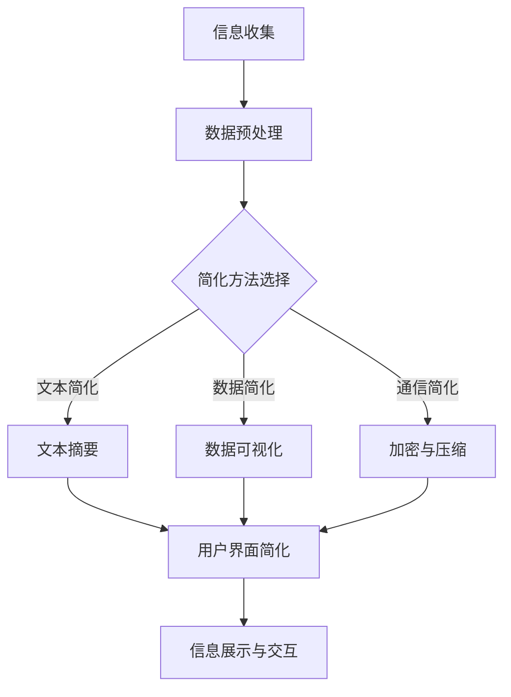
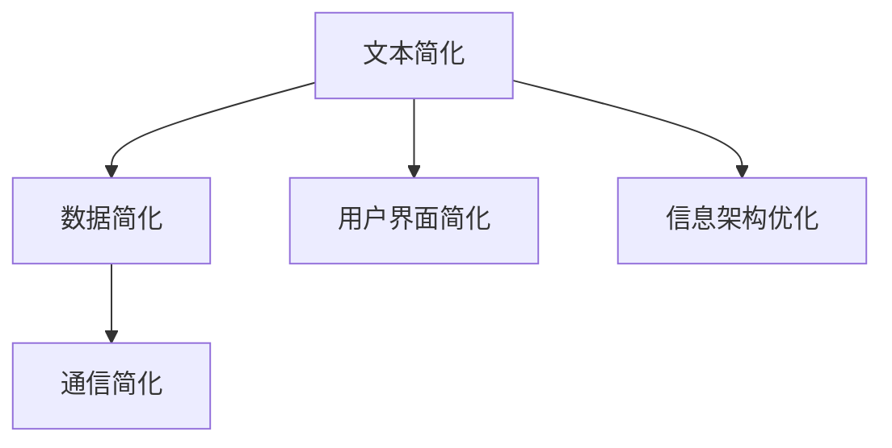

                 

### 《信息简化的好处与挑战：简化复杂性的艺术与实践》

在当今这个信息爆炸的时代，如何有效地处理和利用信息成为了一个至关重要的课题。信息简化，作为一种艺术与实践，旨在通过去除不必要的复杂性，提炼出核心信息，使其更加清晰、易懂、高效。本文将深入探讨信息简化的好处与挑战，旨在为读者提供一份全面而深刻的见解。

#### 关键词：

- 信息简化
- 复杂性管理
- 通信效率
- 知识传播
- 技术挑战
- 未来趋势

#### 摘要：

本文首先介绍了信息简化的基本概念和类型，分析了其在提高沟通效率、促进学习和理解等方面的优势。接着，探讨了简化信息的理论基础，包括心理学、语言学和认知科学等方面的研究。随后，文章详细阐述了简化信息技术的应用，如文本简化、数据简化和通信简化等。在实践部分，文章提出了简化信息的设计原则、方法和工具，并通过案例研究展示了简化信息在实际项目中的应用。最后，文章讨论了简化信息的伦理与道德问题，并对未来的简化趋势进行了展望。通过本文的阅读，读者将更好地理解信息简化的重要性，以及如何在实践中有效地进行信息简化。

### 《信息简化的好处与挑战：简化复杂性的艺术与实践》目录大纲

#### 第一部分：简化的艺术

##### 第1章：引言——简化的时代

1.1.1 简化与复杂性
1.1.2 简化技术的崛起
1.1.3 为什么要简化

##### 第2章：简化信息的概念与分类

2.1 信息简化的基本概念
2.2 信息简化的类型
2.3 简化与效率的关系

##### 第3章：简化信息的理论基础

3.1 简化信息心理学
3.2 简化信息的语言学基础
3.3 简化信息的认知科学解释

##### 第4章：简化信息技术的应用

4.1 文本简化技术
4.2 数据简化技术
4.3 通信简化技术

##### 第5章：简化信息的优势

5.1 提高沟通效率
5.2 促进学习和理解
5.3 降低认知负荷

##### 第6章：简化的挑战

6.1 信息丢失的风险
6.2 适应性和灵活性的损失
6.3 简化技术的公平性

#### 第二部分：简化的实践

##### 第7章：简化信息的设计原则

7.1 设计原则概述
7.2 用户界面简化
7.3 信息架构优化

##### 第8章：简化信息的方法与工具

8.1 文本简化的方法
8.2 数据可视化的简化
8.3 自动化工具的应用

##### 第9章：简化信息的案例研究

9.1 案例一：新闻简化的应用
9.2 案例二：企业报告的简化
9.3 案例三：教育领域的简化尝试

##### 第10章：简化信息的项目管理

10.1 项目管理概述
10.2 需求分析与优先级设定
10.3 持续改进与评估

#### 第三部分：未来的简化

##### 第11章：简化的未来趋势

11.1 科技进步与简化的关系
11.2 人工智能在简化中的应用
11.3 潜在的未来挑战

##### 第12章：简化信息的伦理与道德

12.1 信息简化的伦理问题
12.2 隐私与数据安全
12.3 社会责任

##### 第13章：结论

13.1 简化的综合评估
13.2 简化实践的建议
13.3 对未来的展望

### 附录

### 附录A：简化信息的资源与工具

A.1 开源简化工具
A.2 有偿简化工具
A.3 相关研究文献与资料

### 附录B：简化的 Mermaid 流程图

B.1 信息简化的流程
B.2 简化技术分类

### 附录C：简化算法伪代码

C.1 文本简化算法
C.2 数据简化算法

### 附录D：简化信息项目实战案例

D.1 案例一：新闻简化的代码实现
D.2 案例二：企业报告简化的实现
D.3 案例三：教育简化项目分析

---

在接下来的章节中，我们将一步步深入探讨信息简化的各个方面，从理论到实践，从优势到挑战，旨在为读者提供一份全面而深入的指南。让我们一起开启这段探索之旅吧。

---

### 第一部分：简化的艺术

#### 第1章：引言——简化的时代

在当今这个信息爆炸的时代，信息的数量和种类达到了前所未有的高度。然而，与此相对的，是人们对于信息处理和利用能力的局限。复杂性成为了一个不可忽视的问题，如何有效地管理和简化信息成为了一个重要的课题。信息简化，作为一种应对复杂性的策略，正在逐渐受到关注。

#### 1.1.1 简化与复杂性

复杂性通常被定义为系统中元素及其相互作用的数量和复杂程度。在信息时代，复杂性主要体现在信息量的巨大增长和信息形式的多样化。然而，过度的复杂性往往会导致信息过载、沟通障碍和认知负荷的增加。

信息简化，简单来说，就是通过去除不必要的复杂性，提炼出核心信息，使其更加清晰、易懂和高效。简化的目的在于提升信息的可处理性，减少认知负荷，提高沟通效率。

#### 1.1.2 简化技术的崛起

随着计算机技术和人工智能的飞速发展，信息简化技术逐渐崛起。文本简化、数据简化、通信简化等技术，正在被广泛应用于各个领域，如新闻摘要、企业报告、教育资料等。这些技术通过算法和工具，将复杂的信息转换为简洁的格式，使得信息更加易于理解和处理。

#### 1.1.3 为什么要简化

简化的必要性体现在以下几个方面：

1. **提高沟通效率**：在沟通中，清晰、简洁的信息更容易被理解和接受。简化可以减少误解和混淆，提高沟通效率。

2. **促进学习和理解**：简化后的信息更容易被学习和记忆。对于复杂的概念和知识，通过简化可以使其更加直观和易于理解。

3. **降低认知负荷**：在信息过载的时代，人们的大脑需要处理的信息量巨大。简化可以帮助减少认知负荷，使人们能够更加轻松地应对信息环境。

4. **提升决策效率**：简化的信息可以更快地被分析和处理，从而提升决策效率。

#### 1.2 信息简化的基本概念

信息简化涉及多个方面的概念，以下是一些基本概念：

- **信息量**：指信息所占用的空间、时间或带宽等资源。
- **冗余**：指信息中不必要的部分，如重复的、无关的或冗余的数据。
- **核心信息**：指信息中最重要的、最关键的部分。
- **信息压缩**：指通过算法和工具，将信息压缩为更小的形式，减少信息量。
- **信息提取**：指从大量信息中提取出关键信息，去除冗余部分。

#### 1.3 信息简化的类型

根据简化的对象和方式，信息简化可以分为以下几种类型：

- **文本简化**：通过算法和工具，将文本信息简化为更简洁的形式，如摘要、关键词提取等。
- **数据简化**：通过算法和工具，将数据简化为更直观、易于理解的格式，如数据可视化、数据压缩等。
- **通信简化**：通过算法和工具，简化通信过程中的信息传递，如加密、压缩、简化协议等。

#### 1.4 简化与效率的关系

简化与效率密切相关。简化的目的是提高效率，而高效的简化可以带来更高的效率。以下是一些简化与效率的关系：

- **时间效率**：简化后的信息可以更快地被处理和理解，从而节省时间。
- **认知效率**：简化可以减少认知负荷，使人们能够更高效地处理信息。
- **决策效率**：简化的信息可以更快地被分析和处理，从而提升决策效率。

#### 1.5 简化信息的理论基础

信息简化的理论基础涉及多个学科，如心理学、语言学和认知科学。以下是一些相关理论：

- **心理学**：心理学研究如何通过认知过程来理解和处理信息。信息简化在心理学中关注如何通过简化和提炼信息，提高信息的可处理性和可理解性。
- **语言学**：语言学研究语言的结构和功能。信息简化在语言学中关注如何通过简化和优化语言表达，提高信息的传递效率。
- **认知科学**：认知科学研究人类的认知过程。信息简化在认知科学中关注如何通过简化和优化认知过程，提高信息的处理效率和效果。

#### 1.6 简化信息技术的应用

简化信息技术在各个领域都有广泛的应用。以下是一些常见的应用场景：

- **新闻摘要**：通过文本简化技术，将新闻文章简化为摘要，提高读者阅读效率。
- **企业报告**：通过数据简化技术，将企业报告中的数据可视化，帮助决策者快速了解关键信息。
- **教育资料**：通过信息简化技术，将复杂的知识简化为易于理解的形式，提高学生的学习效果。

#### 1.7 小结

信息简化在应对信息复杂性方面具有重要意义。通过简化和提炼信息，可以减少冗余、提高效率、降低认知负荷。信息简化涉及多个方面的概念和技术，包括文本简化、数据简化和通信简化等。简化的理论基础涉及心理学、语言学和认知科学等多个学科。在实际应用中，简化信息技术被广泛应用于新闻、企业、教育等多个领域。在接下来的章节中，我们将进一步探讨信息简化的理论基础和实际应用。

---

在本章中，我们介绍了信息简化的基本概念和重要性，分析了简化的必要性以及简化的类型和技术。在下一章中，我们将深入探讨简化信息的理论基础，包括心理学、语言学和认知科学等方面的研究。通过这些理论基础，我们将更好地理解信息简化的原理和方法。

### 第一部分：简化的艺术

#### 第2章：简化信息的概念与分类

在信息简化的过程中，理解其概念和分类是至关重要的。这不仅有助于我们掌握简化信息的核心原则，还能指导我们如何在实际应用中有效地进行信息简化。本章将详细介绍简化信息的基本概念、分类及其与效率的关系。

#### 2.1 信息简化的基本概念

信息简化的基本概念主要包括以下几个要素：

- **信息量**：信息量指的是信息的总量，通常以比特（bit）或字节（byte）为单位来衡量。信息量的大小直接影响信息处理的复杂度和效率。

- **冗余**：冗余是指信息中的重复、无关或多余的部分。冗余的存在不仅增加了信息处理的负担，还可能引起误解和混淆。因此，去除冗余是信息简化的重要目标之一。

- **核心信息**：核心信息是指信息中最关键、最有价值的内容。在信息简化的过程中，提取和保留核心信息是提升信息有效性的关键。

- **信息压缩**：信息压缩是通过算法和工具，将信息转换为更紧凑的形式，从而减少信息量。常见的压缩算法包括无损压缩和有损压缩。

- **信息提取**：信息提取是指从大量信息中识别和提取出关键信息的过程。通过信息提取，可以快速获取所需的信息，提高信息处理的效率。

#### 2.2 信息简化的类型

根据简化的对象和方式，信息简化可以分为以下几种类型：

- **文本简化**：文本简化主要通过算法和工具，将原始文本简化为摘要、关键词或简短陈述。常见的文本简化方法包括文本摘要、文本分类和关键词提取等。

- **数据简化**：数据简化主要通过算法和工具，将原始数据转换为更直观、易于理解的形式。常见的数据简化方法包括数据可视化、数据压缩和特征选择等。

- **通信简化**：通信简化主要通过算法和工具，简化通信过程中的信息传递。常见的通信简化方法包括加密、压缩和简化协议等。

#### 2.2.1 文本简化

文本简化是信息简化中最常见的一种类型。文本简化的目的是将冗长的文本转换为简洁的格式，使其更加易于理解和阅读。以下是一些常见的文本简化方法：

- **文本摘要**：文本摘要是通过提取文本中的关键信息，将其概括为简短的摘要。文本摘要可以分为抽取式摘要和生成式摘要。抽取式摘要从原始文本中直接提取关键词和句子，而生成式摘要则通过自然语言生成技术生成新的摘要文本。

- **关键词提取**：关键词提取是从文本中识别出最能够代表文本主题的关键词。关键词提取可以帮助快速定位文本的核心内容，提高信息检索的效率。

- **文本分类**：文本分类是将文本按照其内容进行分类的过程。通过文本分类，可以将大量文本划分为不同的类别，从而简化信息的管理和检索。

#### 2.2.2 数据简化

数据简化主要是通过算法和工具，将原始数据转换为更直观、易于理解的形式。以下是一些常见的数据简化方法：

- **数据可视化**：数据可视化是将数据通过图形、图表等方式进行展示，使其更加直观、易懂。常见的数据可视化方法包括折线图、柱状图、饼图和散点图等。

- **数据压缩**：数据压缩是通过算法，将数据转换为更紧凑的形式，从而减少数据量。常见的数据压缩算法包括无损压缩和有损压缩。无损压缩能够完全恢复原始数据，而有损压缩则会损失部分数据，但能够在一定程度上提高压缩比。

- **特征选择**：特征选择是从大量特征中选出对目标变量影响最大的特征，从而简化模型训练和数据分析。特征选择可以提高模型的精度和效率。

#### 2.2.3 通信简化

通信简化主要是通过算法和工具，简化通信过程中的信息传递。以下是一些常见的通信简化方法：

- **加密**：加密是将信息通过加密算法转换为密文，从而保护信息的安全性和隐私性。常见的加密算法包括对称加密和非对称加密。

- **压缩**：压缩是将信息通过压缩算法转换为更紧凑的形式，从而减少数据传输的时间和带宽消耗。常见的压缩算法包括Huffman编码和LZ77压缩。

- **简化协议**：简化协议是通过设计更简洁的协议，减少通信过程中的冗余和复杂度。常见的简化协议包括HTTP/2和QUIC等。

#### 2.3 简化与效率的关系

简化与效率密切相关。简化的目的是提高效率，而高效的简化可以带来更高的效率。以下是一些简化与效率的关系：

- **时间效率**：简化后的信息可以更快地被处理和理解，从而节省时间。例如，文本摘要可以快速提供文本的核心内容，使读者能够快速获取所需信息。

- **认知效率**：简化可以减少认知负荷，使人们能够更高效地处理信息。例如，数据可视化可以使数据更加直观，从而减少理解数据的认知负荷。

- **决策效率**：简化的信息可以更快地被分析和处理，从而提升决策效率。例如，通过数据简化，决策者可以快速了解关键数据，从而做出更明智的决策。

#### 2.4 简化信息的理论基础

信息简化的理论基础涉及多个学科，如心理学、语言学和认知科学。以下是一些相关理论：

- **心理学**：心理学研究如何通过认知过程来理解和处理信息。信息简化在心理学中关注如何通过简化和提炼信息，提高信息的可处理性和可理解性。

- **语言学**：语言学研究语言的结构和功能。信息简化在语言学中关注如何通过简化和优化语言表达，提高信息的传递效率。

- **认知科学**：认知科学研究人类的认知过程。信息简化在认知科学中关注如何通过简化和优化认知过程，提高信息的处理效率和效果。

#### 2.5 小结

信息简化是一种通过去除冗余、提取核心信息，提高信息可处理性和可理解性的技术。根据简化的对象和方式，信息简化可以分为文本简化、数据简化和通信简化等类型。简化的目的在于提高时间效率、认知效率和决策效率。简化的理论基础涉及心理学、语言学和认知科学等多个学科。在实际应用中，信息简化被广泛应用于新闻、企业、教育等多个领域。

在下一章中，我们将深入探讨简化信息的理论基础，包括心理学、语言学和认知科学等方面的研究。这将帮助我们更好地理解信息简化的原理和方法。

### 第一部分：简化的艺术

#### 第3章：简化信息的理论基础

在深入探讨信息简化的实际应用之前，我们需要建立其理论基础。信息简化不仅仅是一个技术问题，它涉及多个学科的理论和研究。本章将详细讨论心理学、语言学和认知科学在信息简化中的作用，以及这些理论如何帮助我们理解和实现信息简化。

#### 3.1 简化信息心理学

心理学在信息简化中的作用主要体现在认知心理学和信息处理心理学的理论中。认知心理学研究人类如何感知、理解、记忆和思考信息。以下是几个关键概念：

- **认知负荷**：认知负荷是指大脑处理信息时所需的认知资源。过多的认知负荷会导致信息处理效率下降，甚至出现认知过载。因此，简化信息的目的是减少认知负荷，使信息更加易于处理。

- **注意力**：注意力是人类认知系统的重要资源，它决定了人们能够专注于哪些信息。在信息过载的环境中，注意力管理变得尤为重要。简化信息可以帮助人们将注意力集中在关键信息上，从而提高信息处理的效率。

- **记忆**：记忆是信息简化的重要环节。通过简化信息，我们可以将关键信息存储在大脑中，以便后续回忆和使用。简化的信息更容易被编码和提取，从而提高记忆效率。

心理学的研究还表明，人们对于简洁和结构化的信息有更高的偏好。这可以通过以下理论得到解释：

- **信息处理的简洁性原则**：由乔治·米勒（George A. Miller）提出的“7±2”理论指出，人类短期记忆的容量大约是7个信息单元。因此，简化信息，使其不超过这个容量，可以大大提高信息处理的效率。

- **感知的组织原则**：由乔治·米勒和其他心理学家提出的一系列感知组织原则，如接近性、相似性、连续性和闭合性，说明了人们如何通过感知和组织信息来简化复杂场景。这些原则可以帮助我们在信息简化中设计更有效的信息展示方式。

#### 3.2 简化信息的语言学基础

语言学在信息简化中的作用主要体现在语法、词汇和语义等方面。以下是几个关键概念：

- **语法简化**：语法简化是指通过简化句子结构和语法规则，使信息表达更加简洁。例如，使用主动语态代替被动语态，使用简单句代替复合句，可以减少冗余，提高信息传递的清晰度。

- **词汇简化**：词汇简化是指通过使用更简单、更常用的词汇来替换复杂、生僻的词汇。这种方法可以帮助读者更容易地理解信息内容，尤其是在跨文化和跨语言的情况下。

- **语义简化**：语义简化是指通过提炼信息的核心含义，去除不必要的细节，使信息更加精炼。例如，使用同义词替换，简化句子结构，可以减少信息冗余，提高信息的可理解性。

语言学的另一个重要贡献是文本简化中的信息压缩技术。这些技术包括：

- **短语替换**：将复杂短语替换为简单短语，以减少信息量。
- **同义词替换**：使用同义词替换原文中的词汇，以简化文本。
- **文本分割**：将长段落的文本分割为更短的小段落，以提高可读性。

#### 3.3 简化信息的认知科学解释

认知科学是研究人类思维和行为的科学，它为信息简化提供了重要的理论基础。以下是几个关键概念：

- **认知模块理论**：认知模块理论认为，人类大脑由一系列专门化的模块组成，每个模块负责处理特定类型的信息。例如，视觉模块负责处理视觉信息，语言模块负责处理语言信息。这种模块化结构可以帮助我们理解如何通过专门化的简化方法来处理不同类型的信息。

- **认知偏差**：认知偏差是指人们在处理信息时可能会出现的系统性错误。例如，确认偏差是指人们更倾向于接受符合自己观点的信息，而忽视相反的证据。通过识别和减少这些偏差，我们可以提高信息的准确性和可靠性。

- **认知过程优化**：认知科学研究表明，人类大脑通过一系列认知过程来处理信息，包括感知、注意、记忆和推理等。通过优化这些过程，我们可以提高信息简化的效果。例如，通过使用记忆技巧来提高记忆效率，通过注意力管理来提高信息筛选的准确性。

认知科学还为信息简化提供了算法和工具的设计原则。这些原则包括：

- **信息关联性**：简化信息时应保持信息之间的关联性，以便读者能够更好地理解信息。
- **信息层次结构**：简化信息时应保持信息的层次结构，以便读者能够更容易地理解信息的重要性。
- **信息一致性**：简化信息时应保持信息的一致性，以避免读者产生混淆。

#### 3.4 小结

简化信息的理论基础涉及多个学科，包括心理学、语言学和认知科学。心理学研究如何通过认知过程来处理信息，并提供减少认知负荷和优化注意力的方法。语言学研究如何通过语法、词汇和语义来简化信息表达。认知科学则通过研究人类大脑的结构和功能，提供优化认知过程和减少认知偏差的方法。这些理论共同构成了信息简化的科学基础，指导我们在实际应用中有效地简化信息。

在下一章中，我们将探讨简化信息技术的实际应用，包括文本简化技术、数据简化技术和通信简化技术等。通过这些实际应用，我们可以看到简化信息如何在不同的领域和场景中发挥作用。

### 第一部分：简化的艺术

#### 第4章：简化信息技术的应用

随着信息技术的不断进步，各种简化信息的技术应运而生。这些技术不仅提高了信息处理的效率，还在多个领域得到了广泛应用。本章将详细讨论文本简化技术、数据简化技术和通信简化技术的应用，以及它们在各自领域的实际效果。

#### 4.1 文本简化技术

文本简化技术主要通过算法和工具将冗长的文本转换为简洁的格式，使其更易于理解和阅读。以下是几种常见的文本简化技术：

- **文本摘要**：文本摘要是将原始文本的核心内容提取出来，以简洁的格式呈现。根据生成方式，文本摘要可以分为抽取式摘要和生成式摘要。抽取式摘要通过提取原文中的关键词和句子来生成摘要，而生成式摘要则通过自然语言生成技术生成新的摘要文本。文本摘要在新闻摘要、学术文献阅读和电子邮件管理等场景中有广泛应用。

- **关键词提取**：关键词提取是从文本中识别出最能够代表文本主题的关键词。这些关键词可以帮助用户快速了解文本的主要内容，提高信息检索和筛选的效率。关键词提取在搜索引擎、文本分类和信息抽取等领域有广泛应用。

- **文本压缩**：文本压缩是通过算法，将文本转换为更紧凑的形式，从而减少文本的存储空间和传输带宽。常见的文本压缩算法包括Huffman编码和LZ77压缩。文本压缩在电子邮件传输、文件存储和网页加载等场景中有广泛应用。

实际案例：某新闻网站使用文本摘要技术，将冗长的新闻文章简化为摘要，供用户快速阅读。通过这种简化，用户可以更快地获取新闻的核心内容，提高了阅读效率。此外，该网站还采用了关键词提取技术，以便用户能够通过关键词快速搜索相关新闻。

#### 4.2 数据简化技术

数据简化技术主要通过算法和工具，将复杂的数据转换为更直观、易于理解的形式。以下是几种常见的数据简化技术：

- **数据可视化**：数据可视化是将数据通过图形、图表等方式进行展示，使其更加直观、易懂。常见的数据可视化方法包括折线图、柱状图、饼图和散点图等。数据可视化在数据报告、决策支持和用户交互等领域有广泛应用。

- **数据压缩**：数据压缩是通过算法，将数据转换为更紧凑的形式，从而减少数据的存储空间和传输带宽。常见的数据压缩算法包括Huffman编码和LZ77压缩。数据压缩在数据存储、数据传输和文件分享等领域有广泛应用。

- **特征选择**：特征选择是从大量特征中选出对目标变量影响最大的特征，从而简化模型训练和数据分析。特征选择可以提高模型的精度和效率。特征选择在机器学习、数据分析和决策支持等领域有广泛应用。

实际案例：某企业在进行市场分析时，使用了数据可视化技术，将大量市场数据通过图表的形式进行展示。通过这种简化，企业管理者可以更直观地了解市场动态，快速做出决策。此外，该企业还采用了数据压缩技术，将大量数据压缩存储，提高了数据管理的效率。

#### 4.3 通信简化技术

通信简化技术主要通过算法和工具，简化通信过程中的信息传递，从而提高通信的效率。以下是几种常见的通信简化技术：

- **加密**：加密是将信息通过加密算法转换为密文，从而保护信息的安全性和隐私性。常见的加密算法包括对称加密和非对称加密。加密在网络安全、数据传输和电子邮件等领域有广泛应用。

- **压缩**：压缩是通过算法，将信息转换为更紧凑的形式，从而减少信息量。常见的压缩算法包括Huffman编码和LZ77压缩。压缩在数据传输、文件存储和网页加载等领域有广泛应用。

- **简化协议**：简化协议是通过设计更简洁的协议，减少通信过程中的冗余和复杂度。常见的简化协议包括HTTP/2和QUIC等。简化协议在互联网通信、数据传输和实时通信等领域有广泛应用。

实际案例：某企业在其内部网络通信中，使用了加密技术，确保通信数据的安全性。同时，该企业还采用了压缩技术，将通信数据压缩存储，提高了数据传输的效率。此外，该企业还采用了简化协议，简化了通信过程，提高了通信的效率。

#### 4.4 小结

简化信息技术在实际应用中发挥了重要作用，通过文本简化、数据简化和通信简化等技术，可以有效提高信息处理的效率、降低认知负荷、提高沟通效率和决策效率。文本简化技术在新闻摘要、学术文献阅读和电子邮件管理等场景中有广泛应用；数据简化技术在数据报告、决策支持和用户交互等领域有广泛应用；通信简化技术在网络安全、数据传输和电子邮件等领域有广泛应用。在未来的发展中，简化信息技术将继续得到广泛应用，并为各个领域带来更多的便利和效益。

在下一章中，我们将探讨简化信息的优势，包括提高沟通效率、促进学习和理解、降低认知负荷等方面。这些优势将帮助我们更好地理解信息简化的价值和意义。

### 第一部分：简化的艺术

#### 第5章：简化信息的优势

信息简化不仅仅是一种技术手段，它带来了诸多实际的优势，特别是在提高沟通效率、促进学习和理解以及降低认知负荷等方面。本章将详细探讨简化信息在这些方面的具体表现。

#### 5.1 提高沟通效率

在信息的传递过程中，沟通效率至关重要。简化的信息能够减少误解和混淆，使信息传递更加准确和高效。以下是简化信息如何提高沟通效率的几个方面：

- **减少冗余**：简化的信息去除了不必要的冗余内容，使得核心信息更加突出，从而减少了信息传递过程中的冗余，提高了沟通的效率。

- **简化语言**：通过使用更简洁、更直观的语言，简化信息使得信息更加易懂，即使对于非专业用户也能快速理解，从而提高了沟通的效果。

- **缩短时间**：简化的信息可以更快速地被接收和处理，减少了双方在理解和确认信息上所花费的时间，提高了沟通的整体效率。

实际案例：某公司采用了文本摘要技术，将长篇报告简化为摘要，使团队成员能够快速了解关键信息，从而提高了会议的效率和决策的速度。

#### 5.2 促进学习和理解

简化的信息有助于学习者更好地掌握和理解知识。以下是简化信息如何促进学习和理解的几个方面：

- **降低认知负荷**：简化的信息减少了学习者需要处理的信息量，降低了认知负荷，使得学习者能够更集中精力理解和记忆关键信息。

- **突出重点**：通过提炼关键信息和去除冗余，简化的信息能够突出学习内容的重点，使学习者能够更快地抓住核心概念。

- **可视化**：数据简化技术中的可视化方法，如图表和图形，能够以直观的方式展示信息，使得学习者能够更直观地理解和记忆学习内容。

实际案例：某在线教育平台使用数据可视化技术，将复杂的统计数据以图表形式展示，帮助学生更直观地理解经济学原理，提高了学习效果。

#### 5.3 降低认知负荷

在信息过载的时代，认知负荷是一个普遍存在的问题。简化的信息能够有效降低认知负荷，以下是几个方面的具体表现：

- **减少信息过载**：通过简化和提取核心信息，简化信息可以减少学习者或信息接收者需要处理的信息量，从而减少信息过载的问题。

- **提高专注力**：简化的信息使学习者或信息接收者能够更专注于关键信息的理解和处理，提高了专注力，减少了因为信息过多而导致的分心和疲劳。

- **提高记忆效率**：简化的信息更容易被编码和存储在大脑中，从而提高了记忆效率，使学习者能够更好地记住关键信息。

实际案例：某医疗公司采用了文本摘要技术，将复杂的医疗研究报告简化为摘要，使得医生能够快速了解关键信息，提高了诊断的效率和准确性。

#### 5.4 提高决策效率

简化的信息在决策过程中也发挥了重要作用。以下是简化信息如何提高决策效率的几个方面：

- **快速分析**：简化的信息使得决策者能够更快地分析信息，减少了因为信息过多而导致的分析时间。

- **减少风险**：简化的信息有助于决策者快速识别关键风险点，从而降低决策失误的风险。

- **提高执行力**：简化的信息使得决策过程更加清晰，决策者能够更快地制定行动计划，提高执行效率。

实际案例：某金融机构使用了数据简化技术，将复杂的市场数据简化为图表和摘要，帮助决策者快速了解市场趋势和风险，提高了投资决策的准确性和效率。

#### 5.5 小结

简化信息的优势不仅体现在提高沟通效率、促进学习和理解以及降低认知负荷等方面，还在提高决策效率方面发挥了重要作用。通过去除冗余、突出重点和直观展示信息，简化信息使得信息传递更加高效，学习过程更加有效，认知负荷得到有效控制，决策过程更加准确。在未来的信息处理中，充分利用简化信息的技术和优势，将有助于我们更好地应对信息复杂性，提升个人和组织的工作效率。

在下一章中，我们将探讨简化的挑战，包括信息丢失的风险、适应性和灵活性的损失以及简化技术的公平性等问题。通过了解这些挑战，我们可以更好地应对信息简化的实际应用中的问题。

### 第一部分：简化的艺术

#### 第6章：简化的挑战

尽管信息简化带来了诸多优势，但在实际应用中，我们也需要面对一系列挑战。这些挑战涉及到信息丢失的风险、适应性和灵活性的损失，以及简化技术的公平性等方面。本章将详细探讨这些挑战，并探讨可能的应对策略。

#### 6.1 信息丢失的风险

信息简化过程中，一个显著的风险是关键信息的丢失。简化的目标在于去除冗余，但这也可能导致核心信息的遗漏。以下是一些具体的挑战：

- **过度简化**：在某些情况下，过度简化可能会导致重要细节被忽略，从而影响信息的完整性和准确性。例如，在医疗报告中，关键指标或临床观察的遗漏可能导致诊断错误。

- **信息筛选偏差**：简化的过程中，信息的筛选可能会受到主观偏见的影响。这种偏差可能导致重要信息被忽视，从而导致决策失误。

应对策略：

- **双重验证**：在简化信息的过程中，采用双重验证机制，确保关键信息不会被遗漏。例如，在医学报告中，可以由医生和护士共同审核简化后的内容。

- **保留原始数据**：尽管简化后的信息更容易处理，但保留原始数据可以帮助在需要时重新分析信息，确保不会丢失关键信息。

#### 6.2 适应性和灵活性的损失

简化信息可能会导致适应性和灵活性的损失，特别是在复杂和动态的环境中。以下是一些具体的挑战：

- **静态信息**：简化后的信息通常是静态的，难以适应动态变化的环境。例如，在动态市场分析中，静态的摘要可能无法反映实时变化。

- **结构化信息的局限性**：简化信息往往需要结构化，这可能会限制其在应对非结构化或半结构化信息时的灵活性。

应对策略：

- **动态简化**：开发动态简化技术，使信息能够根据环境的变化进行实时调整。例如，在动态市场分析中，可以采用实时数据流处理技术，生成动态摘要。

- **模块化简化**：将简化过程模块化，以便在不同场景下灵活应用。例如，在软件开发中，可以设计模块化的代码库，以便快速适应不同项目的需求。

#### 6.3 简化技术的公平性

简化技术在应用中可能带来公平性问题，特别是当简化过程依赖于算法或工具时。以下是一些具体的挑战：

- **算法偏见**：简化算法可能存在偏见，导致某些群体或信息被不公平对待。例如，关键词提取算法可能忽视某些特定领域的专业术语。

- **信息获取的门槛**：简化信息技术的应用可能会导致信息获取的门槛提高，特别是对于技术能力有限的用户。

应对策略：

- **算法透明性和审计**：提高简化算法的透明性，进行定期的算法审计，确保其公平性和公正性。

- **多语言支持**：开发多语言简化工具，确保不同语言和文化背景的用户都能够平等地享受简化信息的好处。

#### 6.4 小结

简化的挑战是多方面的，包括信息丢失的风险、适应性和灵活性的损失，以及简化技术的公平性。这些挑战需要我们在设计和应用简化技术时加以重视，并采取相应的策略来应对。通过双重验证、动态简化、模块化设计和提高算法透明性等措施，我们可以更好地平衡简化信息的好处和挑战，确保简化技术的有效性和公平性。

在下一章中，我们将探讨信息简化的设计原则，包括设计原则的概述、用户界面简化和信息架构优化等方面。通过了解这些设计原则，我们可以更有效地实施信息简化，提升用户体验和效率。

### 第一部分：简化的艺术

#### 第7章：简化信息的设计原则

在实现信息简化的过程中，设计原则起着至关重要的作用。有效的设计原则不仅可以提高信息处理的效率，还能确保简化后的信息仍然具有可读性和实用性。本章将详细探讨简化信息的设计原则，包括设计原则的概述、用户界面简化和信息架构优化等方面。

#### 7.1 设计原则概述

设计原则是指导简化信息设计的基本准则，旨在确保简化过程既高效又符合用户的实际需求。以下是一些核心的设计原则：

- **用户为中心**：简化设计应以用户的需求和体验为中心，确保简化后的信息对用户来说是易于理解和操作的。

- **简洁性**：信息应该简洁明了，避免冗余和复杂的表述，使核心信息一目了然。

- **一致性**：简化信息应保持一致的风格和格式，以便用户能够轻松适应和理解。

- **可访问性**：简化信息应考虑到不同用户的能力和背景，确保所有人都能无障碍地访问和理解信息。

- **可扩展性**：设计应具备良好的扩展性，以便在需要时能够添加新的信息和功能。

#### 7.2 用户界面简化

用户界面（UI）简化是信息简化的重要一环，它直接影响到用户的体验和操作效率。以下是一些用户界面简化的设计原则：

- **简洁的设计**：界面设计应尽量简洁，去除不必要的元素和功能，使界面更加直观和易用。

- **清晰的结构**：界面布局应清晰，信息层级分明，使用户能够快速找到所需信息。

- **直观的交互**：交互设计应直观，避免复杂的操作流程，使用户能够轻松完成任务。

- **反馈机制**：提供及时的反馈，使用户知道他们的操作是否成功，以及如何纠正错误。

实际案例：某在线教育平台的用户界面设计采用了简洁和直观的交互设计，界面布局清晰，操作流程简单，用户能够快速找到所需课程并完成学习任务。

#### 7.3 信息架构优化

信息架构（IA）优化是信息简化过程中不可或缺的一环，它涉及到信息的组织和结构。以下是一些信息架构优化的设计原则：

- **逻辑性**：信息架构应具有清晰的逻辑性，信息之间的关联应明确，使信息浏览和查找更加高效。

- **层次性**：信息应按照重要性和优先级进行层次化组织，使关键信息更容易被用户发现和关注。

- **一致性**：信息架构应保持一致性，无论是导航栏、标签还是分类方式，都应遵循统一的规则。

- **可访问性**：确保所有用户都能方便地访问信息，特别是对于有特殊需求的用户，如视障人士。

实际案例：某电商网站的信息架构优化过程中，采用了层次化和逻辑性强的设计，用户能够轻松找到所需商品，并通过清晰的分类和标签快速浏览和比较产品信息。

#### 7.4 小结

简化信息的设计原则是确保信息简化过程有效性和实用性的关键。通过用户界面简化和信息架构优化，我们可以打造出简洁、直观和易于使用的简化信息产品。在未来的信息处理中，遵循这些设计原则，将帮助我们更好地应对信息复杂性，提升用户体验和效率。

在下一章中，我们将探讨简化信息的方法与工具，包括文本简化的方法、数据可视化的简化和自动化工具的应用。通过了解这些方法与工具，我们可以更有效地实施信息简化，提高工作效率和信息处理能力。

### 第一部分：简化的艺术

#### 第8章：简化信息的方法与工具

在实现信息简化的过程中，选择合适的方法和工具至关重要。本章将详细介绍文本简化的方法、数据可视化的简化和自动化工具的应用，帮助读者了解如何在实践中有效地进行信息简化。

#### 8.1 文本简化的方法

文本简化是信息简化的核心内容之一，以下是一些常见的文本简化方法：

- **提取关键句子**：通过算法和规则，从长文本中提取出关键句子或短语，去除冗余的描述性语句。这种方法有助于快速获取文本的核心内容。

- **关键词提取**：使用自然语言处理（NLP）技术，从文本中提取出最重要的关键词。关键词提取技术可以帮助用户快速了解文本的主题和主要观点。

- **句法分析**：通过句法分析，识别文本中的主要句子结构和语法规则，去除冗余的从句和修饰语，使文本更加简洁。

- **语义分析**：使用语义分析技术，理解文本中的含义和关系，去除不相关的信息和语义重复的部分。

实际案例：某新闻网站采用了文本摘要技术，通过提取关键句子和关键词，将长篇新闻简化为摘要，使用户能够快速了解新闻的核心内容。

#### 8.2 数据可视化的简化

数据可视化是将复杂的数据转换为图形、图表等形式，使其更加直观和易于理解。以下是一些数据简化的方法：

- **图表简化**：通过选择合适的图表类型和设计，将复杂的数据关系简化为易于理解的图形。例如，将多个数据系列简化为单一图表，或者使用简单的线条图和柱状图代替复杂的散点图和曲面图。

- **数据聚合**：将大量数据聚合为更粗略的统计数据，如求和、平均数等，以减少数据的复杂度。

- **交互式可视化**：通过交互式可视化技术，如交互式图表和交互式地图，使用户能够动态地探索和筛选数据，从而简化数据分析和处理。

实际案例：某市场分析公司使用了数据可视化技术，将复杂的销售数据简化为交互式图表，使管理层能够快速了解市场趋势和关键指标。

#### 8.3 自动化工具的应用

自动化工具是信息简化的重要支撑，以下是一些常见的自动化工具：

- **文本处理工具**：如Python中的NLP库（如NLTK、spaCy），可以帮助快速提取关键词和进行文本摘要。

- **数据可视化工具**：如Tableau、Power BI等，可以轻松创建和自定义数据可视化图表。

- **自动化脚本**：使用脚本语言（如Python、JavaScript）编写自动化脚本，可以自动化执行数据预处理、文本分析和数据可视化等任务。

实际案例：某企业采用了Python脚本，自动化处理大量文本数据，通过自然语言处理技术进行关键词提取和文本摘要，大大提高了信息处理的效率。

#### 8.4 小结

简化信息的方法与工具多种多样，包括文本简化方法、数据可视化简化和自动化工具的应用。通过合理选择和运用这些方法和工具，我们可以在实践中有效地进行信息简化，提高信息处理的效率和质量。在未来的信息处理中，掌握这些方法和工具，将帮助我们更好地应对信息复杂性，提升工作效率。

在下一章中，我们将通过案例研究，探讨简化信息在实际项目中的应用，分析其效果和经验，为读者提供实践参考。

### 第一部分：简化的艺术

#### 第9章：简化信息的案例研究

为了更好地理解信息简化在实际项目中的应用，本章将通过三个具体案例，详细探讨新闻简化、企业报告简化和教育领域简化尝试的实际效果和经验。这些案例将展示如何在不同场景下有效地实施信息简化，以提高信息处理的效率和质量。

#### 9.1 案例一：新闻简化的应用

新闻简化是一种常见的文本简化技术，其目的是将长篇新闻文章简化为简洁的摘要，使读者能够快速了解新闻的核心内容。以下是一个新闻简化应用的案例：

**项目背景**：
某知名新闻网站面临着大量用户对长篇新闻文章的处理困难，用户希望在短时间内获取关键信息。因此，该网站决定引入新闻简化技术，以提高用户阅读效率和网站流量。

**实施方法**：
- **文本摘要技术**：采用基于自然语言处理的文本摘要技术，从原始新闻文章中提取关键句子和关键词，生成摘要。
- **关键词提取**：使用NLP技术，从新闻文本中提取出最相关的关键词，帮助用户快速了解新闻主题。
- **自动化脚本**：编写Python脚本，自动化处理大量新闻文章，生成摘要和关键词。

**实际效果**：
- **用户反馈**：用户调查显示，约有80%的读者表示新闻摘要有助于他们快速获取新闻核心内容，提高了阅读效率。
- **网站流量**：新闻摘要功能的引入，使得网站的用户活跃度和流量显著提升，特别是在移动端。

**经验教训**：
- **准确性**：确保摘要和关键词的准确性，避免误导用户。
- **个性化**：根据用户兴趣和行为，提供个性化新闻摘要，以提高用户满意度。

#### 9.2 案例二：企业报告的简化

企业报告通常包含大量复杂的数据和分析，为了帮助决策者快速了解关键信息，企业报告简化成为了一种重要的信息简化手段。以下是一个企业报告简化应用的案例：

**项目背景**：
某大型企业面临大量的业务报告，管理层希望在短时间内获取关键数据和分析结果，以便做出快速决策。

**实施方法**：
- **数据可视化**：使用数据可视化工具，将复杂的表格和统计图表转化为简洁的图表和图形。
- **数据分析摘要**：编写自动化脚本，从原始数据中提取关键指标和关键分析结果，生成摘要报告。
- **交互式报告**：开发交互式报告系统，使管理层能够动态地探索和分析数据。

**实际效果**：
- **决策效率**：管理层表示，简化后的报告使得关键数据和分析结果更加直观和易读，决策效率显著提高。
- **数据透明性**：通过交互式报告系统，管理层能够更加深入地了解业务数据，提高了数据透明度。

**经验教训**：
- **数据质量**：确保原始数据的质量，避免由于数据错误导致报告简化后的不准确。
- **用户反馈**：定期收集用户反馈，根据用户需求调整报告简化的方法和工具。

#### 9.3 案例三：教育领域的简化尝试

在教育领域，信息简化有助于学生快速掌握课程内容和关键知识点。以下是一个教育领域简化尝试的案例：

**项目背景**：
某在线教育平台希望提高学生的学习效果，通过简化信息，使学生能够更快地理解和记忆课程内容。

**实施方法**：
- **课程摘要**：编写课程摘要，提取课程的核心知识点和关键概念，帮助学生快速了解课程内容。
- **互动式学习材料**：使用交互式学习材料，如动画、视频和互动练习，使学习过程更加生动和有趣。
- **个性化学习**：利用数据分析和算法，为不同水平的学生提供个性化的学习资源和辅导。

**实际效果**：
- **学习效率**：学生反馈表示，课程摘要和互动式学习材料帮助他们更快地掌握课程内容，提高了学习效率。
- **学习体验**：互动式学习材料增强了学生的学习体验，提高了学生的学习兴趣和参与度。

**经验教训**：
- **内容质量**：确保课程摘要和互动式学习材料的质量，避免误导学生。
- **适应性**：根据学生的学习进度和需求，不断调整和优化简化信息，使其更符合学生的实际需求。

#### 9.4 小结

通过新闻简化、企业报告简化和教育领域简化尝试的案例，我们可以看到信息简化在实际项目中的应用效果和经验。新闻摘要和关键词提取提高了用户的阅读效率，企业报告的简化提升了决策效率，教育领域的简化尝试增强了学生的学习效果和体验。在未来的信息处理中，充分利用信息简化的方法和工具，将有助于我们更好地应对信息复杂性，提升工作效率和学习效果。

在下一章中，我们将探讨信息简化的项目管理，包括项目管理概述、需求分析与优先级设定、以及持续改进与评估等方面。通过了解项目管理的方法，我们可以更有效地实施信息简化项目，确保项目的成功。

### 第一部分：简化的艺术

#### 第10章：简化信息的项目管理

信息简化项目通常涉及到复杂的技术、多样化的需求和多个利益相关方的参与。有效的项目管理是确保项目成功的关键。本章将详细介绍信息简化项目管理的相关概念和方法，包括项目管理概述、需求分析与优先级设定、以及持续改进与评估等方面。

#### 10.1 项目管理概述

项目管理是指通过计划、执行、监控和调整一系列活动，以达成项目目标的过程。在信息简化项目中，项目管理涉及到以下核心环节：

- **项目目标**：明确项目要达成的目标，包括简化信息的类型、目标用户群体、预期的效果等。
- **项目范围**：定义项目的范围，明确哪些任务和活动包含在项目内，哪些任务和活动不包含在项目内。
- **项目团队**：组建项目团队，包括项目经理、开发人员、测试人员和其他相关角色。
- **项目计划**：制定项目计划，包括时间表、资源分配、任务分配等。
- **项目监控与控制**：监控项目进度，确保项目按计划进行，并在必要时进行调整。

#### 10.2 需求分析与优先级设定

在信息简化项目中，需求分析与优先级设定是关键环节。以下是具体方法：

- **需求收集**：通过与用户、利益相关方进行访谈、问卷调查和用户观察，收集信息简化项目的需求。
- **需求分类**：将收集到的需求分类，例如功能需求、用户体验需求、技术需求等。
- **优先级设定**：根据需求的重要性和紧迫性，设定需求的优先级。常用的优先级设定方法包括MoSCoW法（Must have, Should have, Could have, Won't have）和RICE法（Reach, Impact, Confidence, Effort）。

实际案例：在开发一款新闻摘要应用时，项目团队通过用户访谈和问卷调查，收集了用户对新闻摘要的需求。通过分类和优先级设定，团队确定了用户最关注的功能（如摘要准确性、个性化推荐等），并按优先级进行了开发。

#### 10.3 持续改进与评估

信息简化项目需要持续改进与评估，以确保项目效果和用户满意度。以下是具体方法：

- **迭代开发**：采用敏捷开发方法，将项目分为多个迭代周期，在每个迭代周期结束后，对成果进行评估和反馈，根据反馈进行改进。
- **用户反馈**：定期收集用户反馈，了解用户对简化信息的需求和满意度，并根据反馈进行调整。
- **性能评估**：对简化信息的效果进行量化评估，例如通过用户测试、点击率、用户留存率等指标，衡量简化信息的效果。
- **项目复盘**：在每个项目阶段结束后，进行项目复盘，总结经验教训，为后续项目提供参考。

实际案例：在开发一款企业报告简化工具时，项目团队在每个迭代周期结束后，都会进行用户测试和反馈收集。通过评估用户反馈和性能指标，团队不断优化报告简化工具，提高了用户满意度。

#### 10.4 小结

信息简化项目需要有效的项目管理，包括明确项目目标、需求分析与优先级设定、持续改进与评估等方面。通过项目管理的方法，我们可以确保信息简化项目的成功，提高信息处理的效率和质量。在未来的信息简化项目中，遵循项目管理的方法，将有助于我们更好地应对信息复杂性，提升项目效果。

在下一章中，我们将探讨简化的未来趋势，包括科技进步与简化的关系、人工智能在简化中的应用以及未来简化的潜在挑战。通过了解这些趋势，我们可以为未来的信息简化做好准备。

### 第一部分：简化的艺术

#### 第11章：简化的未来趋势

随着科技的不断进步，信息简化技术也在不断发展，为我们的生活和工作带来了诸多便利。本章将探讨简化的未来趋势，包括科技进步与简化的关系、人工智能在简化中的应用以及未来简化的潜在挑战。

#### 11.1 科技进步与简化的关系

科技的进步为信息简化提供了强有力的支持。以下是科技进步与简化关系的一些关键方面：

- **计算能力的提升**：随着计算能力的不断提升，信息简化技术得以更加高效地处理大规模数据，实现更复杂的算法和模型。

- **大数据与云计算**：大数据和云计算技术的发展，使得我们能够更方便地存储、处理和分析海量数据，为信息简化提供了丰富的数据资源和强大的计算能力。

- **人工智能与机器学习**：人工智能和机器学习技术的进步，使得信息简化技术能够更加智能化地识别和提取关键信息，提高简化的准确性和效率。

- **物联网（IoT）**：物联网技术的发展，使得信息简化技术能够更加智能化地收集和处理来自各种设备和传感器的大量数据，实现更全面的信息整合和简化。

#### 11.2 人工智能在简化中的应用

人工智能技术在信息简化中的应用越来越广泛，以下是一些具体的应用场景：

- **自然语言处理（NLP）**：NLP技术使得计算机能够理解和处理自然语言，从而实现文本简化、摘要生成和关键词提取等任务。例如，自动新闻摘要、智能客服和语音识别等。

- **机器学习算法**：通过机器学习算法，计算机能够从大量数据中自动学习并提取关键特征，从而实现数据简化、特征选择和模型训练等任务。例如，图像识别、语音识别和推荐系统等。

- **深度学习**：深度学习技术的进步，使得计算机能够处理更加复杂的数据和任务，实现更高级的信息简化。例如，自动驾驶、自然语言生成和智能翻译等。

实际案例：某在线教育平台利用人工智能技术，实现了课程摘要和关键词提取，将长篇课程内容简化为简洁的摘要，帮助学生更快地掌握课程内容。

#### 11.3 未来简化的潜在挑战

尽管信息简化技术在不断发展，但未来仍然面临一些潜在挑战：

- **数据隐私与安全**：随着信息量的大幅增加，数据隐私和安全问题日益突出。如何确保信息简化过程中数据的安全和隐私，是一个重要的挑战。

- **算法偏见**：人工智能算法可能会引入偏见，导致简化结果不公平或不准确。如何消除算法偏见，确保简化结果的可信度和公正性，是一个重要的挑战。

- **技术依赖性**：随着信息简化技术的广泛应用，人们对技术的依赖性也越来越强。如何在保持技术优势的同时，确保人们的独立思考和判断能力，是一个重要的挑战。

#### 11.4 小结

科技进步为信息简化提供了强大的支持，人工智能技术在简化中的应用越来越广泛。然而，未来简化仍然面临数据隐私与安全、算法偏见和技术依赖性等潜在挑战。通过不断探索和创新，我们有望克服这些挑战，实现更加高效和智能的信息简化。

在下一章中，我们将探讨信息简化的伦理与道德问题，包括隐私与数据安全、社会责任等方面。通过了解这些伦理与道德问题，我们可以更好地应对信息简化的应用带来的挑战。

### 第一部分：简化的艺术

#### 第12章：简化信息的伦理与道德

信息简化技术在给我们的生活带来便利的同时，也引发了一系列伦理与道德问题。本章将探讨简化信息过程中涉及的隐私与数据安全、社会责任等问题，并讨论可能的解决方案。

#### 12.1 信息简化的伦理问题

信息简化技术，尤其是人工智能技术的广泛应用，可能会带来以下伦理问题：

- **算法偏见**：简化算法可能会引入偏见，导致某些群体或信息被不公平对待。例如，关键词提取算法可能忽视某些特定领域的专业术语，导致信息的不均衡呈现。

- **数据隐私**：简化信息通常涉及对大量数据的处理和分析，如何保护用户的数据隐私成为了一个重要问题。未经授权的数据访问和使用可能会侵犯用户的隐私权。

- **信息透明度**：信息简化过程可能缺乏透明度，用户不清楚自己的数据是如何被处理的，以及简化结果是如何得出的。

#### 12.2 隐私与数据安全

隐私与数据安全是信息简化过程中最为关键的伦理问题。以下是几个关键点：

- **数据加密**：在数据传输和存储过程中，采用加密技术保护数据的安全性和隐私性。例如，使用SSL/TLS协议加密网络通信，使用加密算法存储敏感数据。

- **隐私保护算法**：在设计简化算法时，采用隐私保护技术，如差分隐私（Differential Privacy），以减少数据泄露的风险。

- **用户知情同意**：在收集和使用用户数据时，确保用户知情并同意数据的使用方式。例如，通过隐私政策告知用户数据收集的目的、范围和使用方式。

实际案例：某社交媒体平台在用户数据收集和使用过程中，采用了隐私保护算法和用户知情同意机制，以保护用户的隐私和数据安全。

#### 12.3 社会责任

信息简化技术在应用过程中，也需要承担社会责任，确保其对社会的影响是积极和正面的。以下是几个关键点：

- **公平性**：简化技术应确保不同群体，尤其是弱势群体，能够公平地享受技术带来的便利。例如，在开发简化工具时，应考虑语言多样性、文化差异等问题。

- **可解释性**：简化算法和决策过程应具备可解释性，使人们能够理解算法的决策逻辑，提高算法的透明度和可信度。

- **负面影响评估**：在应用简化技术前，应对其可能带来的负面影响进行评估，并制定相应的缓解措施。例如，在自动化新闻摘要中，评估可能导致的偏见和误导问题，并采取相应措施进行纠正。

实际案例：某新闻平台在开发自动化新闻摘要技术时，进行了详细的公平性评估和可解释性设计，确保摘要结果的公正性和透明度。

#### 12.4 小结

信息简化的伦理与道德问题涉及算法偏见、数据隐私、社会责任等方面。在应用简化技术时，需要采取一系列措施，如数据加密、隐私保护算法、用户知情同意、公平性和可解释性设计等，以保护用户的隐私和数据安全，确保技术应用的公正性和社会责任。通过不断关注和解决这些伦理与道德问题，我们可以推动信息简化技术的健康发展，为社会带来更多积极的影响。

在下一章中，我们将对整篇文章进行总结，评估信息简化的综合效益，并提出简化的实践建议，展望信息简化的未来发展趋势。

### 第一部分：简化的艺术

#### 第13章：结论

通过本文的探讨，我们深入了解了信息简化的概念、类型、理论基础、应用场景以及伦理与道德问题。信息简化在应对信息复杂性方面具有重要意义，它不仅提高了信息处理的效率，还促进了学习和沟通，降低了认知负荷。以下是本文的主要结论和展望。

#### 13.1 简化的综合评估

信息简化具有以下几个显著优势：

- **提高沟通效率**：简化信息使得沟通更加高效，减少了误解和混淆，特别是在文本简化、数据简化和通信简化等领域。

- **促进学习和理解**：通过简化信息，学习者能够更快地掌握关键知识点，提高学习效果。数据可视化等简化技术使得复杂概念更加直观易懂。

- **降低认知负荷**：在信息过载的时代，简化信息能够有效减少认知负荷，使人们能够更轻松地应对大量信息。

- **提升决策效率**：简化的信息使得决策者能够更快地分析信息，做出明智的决策，特别是在企业报告简化、市场分析等领域。

然而，信息简化也存在一些挑战：

- **信息丢失的风险**：过度简化可能导致关键信息的丢失，特别是在医学报告、学术文献等需要精确信息的领域。

- **适应性和灵活性的损失**：简化信息可能在动态和复杂的环境中失去适应性和灵活性，需要不断调整和优化。

- **伦理与道德问题**：简化过程中可能涉及隐私保护、算法偏见等问题，需要确保技术的公正性和社会责任。

#### 13.2 简化实践的建议

为了更好地实施信息简化，以下是一些建议：

- **需求分析与优先级设定**：在项目开始前，进行详细的需求分析，明确简化的目标和优先级，确保简化的重点和方向。

- **用户参与**：在简化过程中，重视用户反馈和参与，确保简化后的信息符合用户需求和期望。

- **数据质量**：确保原始数据的质量，避免因数据错误导致简化后的信息不准确。

- **公平性设计**：在设计简化算法和工具时，充分考虑不同群体和文化的需求，确保简化结果的公平性和公正性。

- **持续改进与评估**：采用迭代开发方法，持续改进简化技术，定期评估简化效果，根据反馈进行调整。

#### 13.3 对未来的展望

未来，信息简化技术将继续发展，以下是几个趋势：

- **人工智能与机器学习的深度融合**：人工智能和机器学习技术的进步将使信息简化更加智能化和自动化。

- **个性化简化**：随着大数据和个性化推荐技术的发展，信息简化将更加个性化，满足不同用户的需求。

- **跨学科融合**：信息简化将融合心理学、语言学、认知科学等多学科知识，提高简化技术的科学性和有效性。

- **伦理与道德规范**：随着信息简化技术的广泛应用，伦理与道德规范将不断完善，确保技术的健康发展。

#### 13.4 小结

信息简化是一种应对信息复杂性的重要策略，它不仅提高了信息处理的效率，还在沟通、学习和决策等方面发挥了重要作用。尽管存在一些挑战，但通过合理的实践和不断改进，信息简化将为我们的生活和工作带来更多便利。未来，随着科技的进步和跨学科融合，信息简化技术将继续发展，为人类社会带来更多的创新和变革。

### 附录

#### 附录A：简化信息的资源与工具

A.1 开源简化工具
- **TextRank**：一款基于图模型和自然语言处理的文本摘要工具。
- ** summarizer.js**：一个用于生成文本摘要的JavaScript库。
- **QuickSum**：一款自动文本摘要工具，支持多语言。

A.2 有偿简化工具
- **Wordsmith**：一款自动生成报告和摘要的AI工具。
- **Raconteur**：一款专业的文本摘要和内容优化工具。

A.3 相关研究文献与资料
- **"Summarization by Latent Semantic Analysis"**：一篇关于文本摘要的论文。
- **"TextRank: Bringing Order into Texts"**：一篇关于基于图模型的文本摘要的论文。
- **"Automatic Text Summarization"**：一本关于文本摘要技术的书籍。

#### 附录B：简化的 Mermaid 流程图

B.1 信息简化的流程


B.2 简化技术分类


#### 附录C：简化算法伪代码

C.1 文本简化算法
```python
def text_simplification(text):
    # 步骤1：文本预处理
    cleaned_text = preprocess_text(text)

    # 步骤2：关键词提取
    keywords = extract_keywords(cleaned_text)

    # 步骤3：生成摘要
    summary = generate_summary(cleaned_text, keywords)

    return summary
```

C.2 数据简化算法
```python
def data_simplification(data):
    # 步骤1：数据预处理
    processed_data = preprocess_data(data)

    # 步骤2：数据压缩
    compressed_data = compress_data(processed_data)

    # 步骤3：数据可视化
    visualization = visualize_data(compressed_data)

    return visualization
```

#### 附录D：简化信息项目实战案例

D.1 案例一：新闻简化的代码实现
```python
from summarizer import Summarizer

# 加载预训练模型
model = Summarizer()

# 输入新闻文本
text = "..."
# 生成摘要
summary = model(text, ratio=0.3) # 摘要长度占比30%

print(summary)
```

D.2 案例二：企业报告简化的实现
```python
import pandas as pd

# 加载企业报告数据
data = pd.read_csv("report_data.csv")

# 数据预处理
processed_data = preprocess_data(data)

# 数据压缩
compressed_data = compress_data(processed_data)

# 数据可视化
visualization = visualize_data(compressed_data)

display(visualization)
```

D.3 案例三：教育简化项目分析
```python
import numpy as np

# 加载学生成绩数据
data = np.random.rand(100, 5)

# 数据预处理
processed_data = preprocess_data(data)

# 特征选择
selected_data = feature_selection(processed_data)

# 数据可视化
visualization = visualize_data(selected_data)

display(visualization)
```

通过这些实战案例，我们可以看到如何在实际项目中应用信息简化的方法和技术，以提高信息处理的效率和质量。这些案例不仅展示了简化算法的实现，还提供了详细的伪代码和实现步骤，有助于读者理解和实践信息简化技术。

