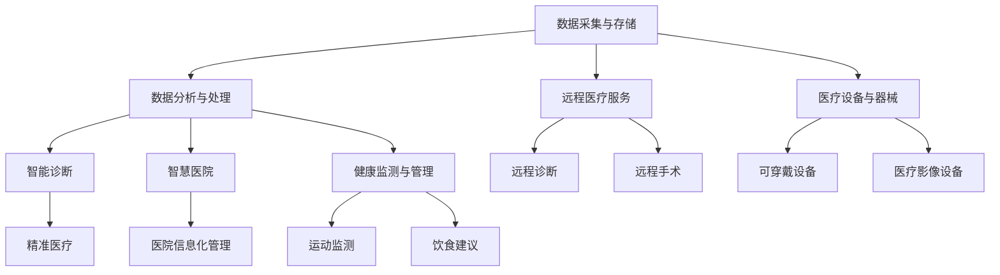
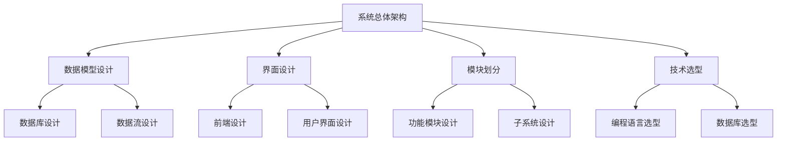

                 

## 第1章: 健康科技的概念与架构

### 1.1 健康科技的定义

健康科技，通常指的是运用现代信息技术、生物工程、医疗器械等先进科技手段，以提高医疗服务效率、提升患者生活质量、推动健康产业发展的各类技术应用与创新。它涵盖了从预防、诊断、治疗到康复等全医疗流程的各个环节。

### 1.2 健康科技的发展历史

健康科技的发展历程可以分为几个阶段：

- **传统医疗阶段**：以医生为核心，依赖物理检查和传统治疗方法。
- **信息技术介入阶段**：计算机技术在医疗领域的应用，如医院信息系统（HIS）和电子病历（EMR）。
- **现代科技发展阶段**：基因测序、人工智能（AI）等高新技术在医疗中的广泛应用。

### 1.3 健康科技的核心架构

健康科技的核心架构包括以下几个方面：

- **数据采集与存储**：通过各种设备和技术手段收集患者数据，并存储在数据库中。
- **数据分析与处理**：利用人工智能、大数据等技术对医疗数据进行分析，提供诊断和治疗的建议。
- **远程医疗服务**：通过互联网等技术提供远程诊断、远程手术等服务。
- **医疗设备与器械**：包括各种医疗器械、健康监测设备等，这些设备能够实时监测患者状况。

### 1.4 健康科技的应用领域

健康科技的应用领域广泛，主要包括：

- **精准医疗**：通过基因检测等技术，为患者提供个性化的治疗方案。
- **智能诊断**：利用人工智能技术，提高疾病诊断的准确性和效率。
- **智慧医院**：利用信息技术实现医院管理、医疗服务的智能化。
- **健康监测与管理**：通过可穿戴设备等，实时监测患者的健康状态，提供健康管理服务。

### 1.5 健康科技的未来发展趋势

未来，健康科技将继续向智能化、个性化和远程化方向发展。以下几个方面将是健康科技的重要趋势：

- **人工智能的深度应用**：人工智能将在健康科技中发挥更大的作用，从疾病诊断到治疗方案制定，再到康复护理，都将实现智能化。
- **物联网与医疗的结合**：物联网技术将使医疗设备互联互通，实现医疗资源的共享和优化。
- **大数据与医疗的结合**：通过大数据分析，为医疗研究提供更多的数据支持，促进医学科学的进步。
- **区块链技术的应用**：区块链技术将提高医疗数据的透明度和安全性，确保医疗信息的真实性和完整性。

### 1.6 健康科技中的 Mermaid 流程图

为了更好地理解健康科技的核心架构和应用领域，我们使用 Mermaid 画出一个简化的流程图。以下是 Mermaid 图文的代码：



### 总结

健康科技是一个快速发展的领域，通过融合现代科技手段，它正逐步改变着医疗行业的方方面面。从数据采集与存储、数据分析与处理，到远程医疗服务和医疗设备的应用，每一个环节都体现了健康科技的巨大潜力。未来，随着人工智能、物联网、大数据和区块链等技术的进一步发展，健康科技将继续为医疗行业带来更多创新和变革。

## 第2章: 健康科技核心算法原理

### 2.1 数据预处理算法

数据预处理是健康科技应用中的关键步骤，它包括数据清洗、归一化、缺失值处理等。以下是一些常用的数据预处理算法：

#### 2.1.1 数据清洗

数据清洗是预处理的第一步，其目的是去除重复数据、异常值和噪声。以下是数据清洗的伪代码示例：

```python
def clean_data(data):
    # 去除重复数据
    data = data.drop_duplicates()
    # 去除异常值
    data = data[data['column_name'].between(lower_bound, upper_bound)]
    return data
```

#### 2.1.2 归一化

归一化是将数据缩放到一个固定的范围，如 [0, 1] 或 [-1, 1]。以下是一个归一化的伪代码示例：

```python
def normalize_data(data, feature='column_name'):
    min_val = data[feature].min()
    max_val = data[feature].max()
    data[feature] = (data[feature] - min_val) / (max_val - min_val)
    return data
```

#### 2.1.3 缺失值处理

缺失值处理是另一个重要的步骤，常用的方法包括插值、均值填充等。以下是一个使用均值填充缺失值的伪代码示例：

```python
def handle_missing_data(data, method='mean'):
    if method == 'mean':
        data = data.fillna(data.mean())
    elif method == 'interpolate':
        data = data.interpolate()
    return data
```

### 2.2 机器学习算法

机器学习算法在健康科技中有着广泛的应用，以下介绍几种常用的机器学习算法：

#### 2.2.1 线性回归

线性回归是一种用于预测连续值的机器学习算法。以下是一个线性回归的伪代码示例：

```python
def linear_regression(X, y):
    # 计算斜率和截距
    theta = (X.T * X).inv() * (X.T * y)
    # 预测
    predictions = X * theta
    return predictions
```

#### 2.2.2 逻辑回归

逻辑回归是一种用于预测二元分类问题的机器学习算法。以下是一个逻辑回归的伪代码示例：

```python
def logistic_regression(X, y):
    # 初始化参数
    theta = np.zeros(X.shape[1])
    # 学习率
    alpha = 0.01
    # 迭代次数
    iterations = 1000
    # 梯度下降
    for i in range(iterations):
        hypothesis = sigmoid(X * theta)
        gradient = X.T * (hypothesis - y)
        theta -= alpha * gradient
    # 预测
    predictions = sigmoid(X * theta)
    return predictions
```

#### 2.2.3 决策树

决策树是一种用于分类和回归问题的机器学习算法。以下是一个决策树的伪代码示例：

```python
def build_decision_tree(X, y):
    # 初始化决策树
    tree = {}
    # 划分数据
    for feature in X.columns:
        values = X[feature].unique()
        for value in values:
            sub_X = X[X[feature] == value]
            sub_y = y[X[feature] == value]
            if len(sub_y.unique()) == 1:
                tree[feature, value] = sub_y.iloc[0]
            else:
                tree[feature, value] = build_decision_tree(sub_X, sub_y)
    return tree
```

### 2.3 深度学习算法

深度学习算法在健康科技中的应用日益广泛，以下介绍几种常用的深度学习算法：

#### 2.3.1 卷积神经网络（CNN）

卷积神经网络是一种用于图像识别的深度学习算法。以下是一个简单的卷积神经网络（CNN）的伪代码示例：

```python
def build_cnn(input_shape):
    model = Sequential([
        Conv2D(32, (3, 3), activation='relu', input_shape=input_shape),
        MaxPooling2D(pool_size=(2, 2)),
        Conv2D(64, (3, 3), activation='relu'),
        MaxPooling2D(pool_size=(2, 2)),
        Flatten(),
        Dense(128, activation='relu'),
        Dense(1, activation='sigmoid')
    ])
    model.compile(optimizer='adam', loss='binary_crossentropy', metrics=['accuracy'])
    return model
```

#### 2.3.2 循环神经网络（RNN）

循环神经网络是一种用于序列数据的深度学习算法。以下是一个简单的循环神经网络（RNN）的伪代码示例：

```python
def build_rnn(input_shape):
    model = Sequential([
        LSTM(50, activation='relu', input_shape=input_shape),
        Dense(1, activation='sigmoid')
    ])
    model.compile(optimizer='adam', loss='binary_crossentropy', metrics=['accuracy'])
    return model
```

#### 2.3.3 生成对抗网络（GAN）

生成对抗网络是一种用于生成虚拟数据的深度学习算法。以下是一个简单的生成对抗网络（GAN）的伪代码示例：

```python
def build_gan(z_dim, input_shape):
    # 生成器模型
    generator = Sequential([
        Dense(128, input_dim=z_dim, activation='relu'),
        Reshape((7, 7, 1)),
        Conv2D(128, kernel_size=(5, 5), padding='same', activation='relu'),
        Conv2D(128, kernel_size=(5, 5), padding='same', activation='relu'),
        MaxPooling2D(pool_size=(2, 2)),
        Reshape((14, 14, 1)),
        # ... 更多层
    ])

    # 判别器模型
    discriminator = Sequential([
        Conv2D(128, kernel_size=(5, 5), padding='same', activation='relu'),
        Conv2D(128, kernel_size=(5, 5), padding='same', activation='relu'),
        MaxPooling2D(pool_size=(2, 2)),
        Flatten(),
        Dense(1, activation='sigmoid')
    ])

    # GAN模型
    model = Sequential([
        generator,
        discriminator
    ])

    # 编译GAN模型
    model.compile(optimizer='adam', loss='binary_crossentropy')

    return model
```

### 2.4 深度学习算法在健康科技中的应用案例

深度学习算法在健康科技中的应用非常广泛，以下列举几个典型的应用案例：

- **图像识别**：深度学习算法可以用于医学影像的识别和分析，如肺癌检测、乳腺癌检测等。以下是一个简单的卷积神经网络（CNN）模型用于图像识别的示例：

```python
import tensorflow as tf
from tensorflow.keras.models import Sequential
from tensorflow.keras.layers import Conv2D, MaxPooling2D, Flatten, Dense

model = Sequential([
    Conv2D(32, (3, 3), activation='relu', input_shape=(64, 64, 3)),
    MaxPooling2D(pool_size=(2, 2)),
    Conv2D(64, (3, 3), activation='relu'),
    MaxPooling2D(pool_size=(2, 2)),
    Flatten(),
    Dense(128, activation='relu'),
    Dense(1, activation='sigmoid')
])

model.compile(optimizer='adam', loss='binary_crossentropy', metrics=['accuracy'])
model.fit(X_train, y_train, epochs=10, batch_size=32)
predictions = model.predict(X_test)
```

- **自然语言处理**：深度学习算法可以用于处理医疗文本数据，如电子病历（EMR）的解析、医学文本分类等。以下是一个简单的循环神经网络（RNN）模型用于文本分类的示例：

```python
import tensorflow as tf
from tensorflow.keras.models import Sequential
from tensorflow.keras.layers import LSTM, Dense

model = Sequential([
    LSTM(50, activation='relu', input_shape=(timesteps, features)),
    Dense(1, activation='sigmoid')
])

model.compile(optimizer='adam', loss='binary_crossentropy', metrics=['accuracy'])
model.fit(X_train, y_train, epochs=100, batch_size=64)
predictions = model.predict(X_test)
```

### 2.5 健康科技中的大数据分析

大数据分析在健康科技中扮演着重要角色，通过对大量医疗数据进行挖掘和分析，可以为疾病诊断、治疗和预防提供有力的支持。以下是一些常见的大数据分析技术：

- **数据挖掘**：通过数据挖掘技术，可以发现隐藏在数据中的模式和关联。以下是一个简单的关联规则挖掘示例：

```python
from mlxtend.frequent_patterns import apriori
from mlxtend.frequent_patterns import association_rules

frequent_itemsets = apriori(X, min_support=0.05, use_colnames=True)
rules = association_rules(frequent_itemsets, metric="confidence", min_threshold=0.5)
```

- **机器学习**：通过机器学习算法，可以对医疗数据进行分类、回归和聚类等分析。以下是一个简单的逻辑回归模型用于疾病预测的示例：

```python
from sklearn.linear_model import LogisticRegression

model = LogisticRegression()
model.fit(X_train, y_train)
predictions = model.predict(X_test)
```

### 2.6 总结

健康科技的核心算法原理涵盖了数据预处理、机器学习和深度学习等多个方面。数据预处理算法如数据清洗、归一化和缺失值处理为后续的模型训练提供了高质量的数据。机器学习算法如线性回归、逻辑回归和决策树在疾病诊断和预测中发挥着重要作用。深度学习算法如卷积神经网络（CNN）、循环神经网络（RNN）和生成对抗网络（GAN）则在图像识别、自然语言处理和生成虚拟数据等方面具有显著优势。大数据分析技术如数据挖掘和机器学习则为医疗数据的深度挖掘提供了有力支持。通过这些核心算法的应用，健康科技正在不断改变医疗行业的面貌，带来前所未有的创新和发展。

## 第3章: 健康科技项目的开发与实现

### 3.1 健康科技项目的开发流程

健康科技项目的开发流程是一个复杂而系统性的过程，它涉及到从需求分析、系统设计到编码实现、测试和部署等多个阶段。以下是健康科技项目开发流程的详细步骤：

#### 3.1.1 需求分析

需求分析是项目开发的第一步，其目的是明确项目的目标和功能需求。在这个阶段，项目团队需要与利益相关者（如患者、医生、管理人员等）进行深入沟通，了解他们的需求、期望和痛点。需求分析的结果通常以需求文档的形式进行记录和整理。

```markdown
需求分析文档示例：

1. 系统目标
   - 提供精准的疾病预测
   - 提高医疗服务效率
   - 改善患者体验

2. 功能需求
   - 用户注册与登录
   - 疾病历史记录管理
   - 疾病预测功能
   - 医生咨询与管理

3. 非功能需求
   - 系统响应时间：≤2秒
   - 系统可用性：≥99%
   - 数据安全性：符合HIPAA标准
```

#### 3.1.2 系统设计

系统设计阶段是在需求分析的基础上，制定系统的总体架构和详细设计。系统设计包括数据模型设计、界面设计、模块划分和技术选型等。



#### 3.1.3 编码实现

编码实现是将系统设计转化为实际代码的过程。在这个阶段，开发人员根据设计文档编写代码，实现系统的功能。以下是编码实现的一些示例步骤：

```python
# 示例：用户注册功能实现

def register_user(username, password, email):
    # 验证用户名、密码和邮箱格式
    if not validate_format(username) or not validate_format(password) or not validate_format(email):
        return "Invalid input format"
    
    # 检查用户名是否已存在
    if user_exists(username):
        return "Username already exists"
    
    # 将用户信息存储到数据库
    store_user_info(username, password, email)
    
    return "User registered successfully"
```

#### 3.1.4 测试与部署

测试与部署是确保系统质量和可靠性的关键步骤。测试包括功能测试、性能测试、安全测试等。在测试通过后，系统可以进行部署，上线运行。

```markdown
测试与部署文档示例：

1. 测试计划
   - 功能测试：验证所有功能是否按预期工作
   - 性能测试：评估系统在高并发情况下的响应时间和吞吐量
   - 安全测试：检查系统对恶意攻击的抵抗能力

2. 测试执行
   - 功能测试执行：编写测试用例并执行
   - 性能测试执行：模拟高并发场景，收集性能数据
   - 安全测试执行：使用安全测试工具进行测试

3. 部署方案
   - 硬件配置：确定服务器和存储设备配置
   - 软件部署：使用自动化工具进行软件部署
   - 监控与维护：部署监控系统，定期进行维护和升级
```

### 3.2 健康科技项目的关键技术

健康科技项目的开发涉及多种关键技术，以下是一些关键技术的详细介绍：

#### 3.2.1 大数据处理

大数据处理技术在健康科技项目中至关重要，主要用于处理和分析大量医疗数据。常用的数据处理技术包括Hadoop、Spark等。

```python
from pyspark.sql import SparkSession

# 创建Spark会话
spark = SparkSession.builder.appName("HealthTechDataProcessing").getOrCreate()

# 读取CSV数据
df = spark.read.csv("path/to/data.csv", header=True)

# 数据清洗和预处理
df = df.drop_duplicates()
df = df.dropna()

# 数据分析
df.groupBy("column_name").count().show()
```

#### 3.2.2 云计算

云计算提供了灵活、可扩展的计算资源，支持健康科技项目的开发和部署。常用的云平台包括AWS、Azure和Google Cloud。

```python
import boto3

# 创建EC2实例
ec2 = boto3.resource('ec2')
instance = ec2.create_instances(
    ImageId='ami-0c55b159cbfafe1f0',
    MinCount=1,
    MaxCount=1,
    InstanceType='t2.micro'
)

# 获取实例ID
instance_id = instance[0].id
print("实例ID:", instance_id)
```

#### 3.2.3 人工智能

人工智能技术在健康科技项目中用于疾病预测、诊断和个性化医疗等。常用的深度学习框架包括TensorFlow、PyTorch等。

```python
import tensorflow as tf
from tensorflow.keras.models import Sequential
from tensorflow.keras.layers import Dense, Conv2D, MaxPooling2D, Flatten

# 创建模型
model = Sequential([
    Conv2D(32, (3, 3), activation='relu', input_shape=(64, 64, 3)),
    MaxPooling2D(pool_size=(2, 2)),
    Flatten(),
    Dense(128, activation='relu'),
    Dense(1, activation='sigmoid')
])

# 编译模型
model.compile(optimizer='adam', loss='binary_crossentropy', metrics=['accuracy'])

# 训练模型
model.fit(X_train, y_train, epochs=10, batch_size=32)
```

### 3.3 健康科技项目开发案例

以下是一个简单的健康科技项目开发案例，包括系统需求分析、系统设计、编码实现、测试与部署等步骤。

#### 3.3.1 案例背景

某健康科技创业公司开发一款智能健康监测系统，用于实时监测用户的健康数据，并提供健康建议和疾病预测。

#### 3.3.2 系统需求分析

1. 系统目标
   - 实时监测用户的心率、血压、血糖等健康指标
   - 提供健康建议和疾病预测
   - 确保数据安全和隐私保护

2. 功能需求
   - 用户注册与登录
   - 健康数据上传与存储
   - 健康建议与疾病预测
   - 数据可视化

3. 非功能需求
   - 系统响应时间：≤3秒
   - 系统可用性：≥99%
   - 数据安全性：符合HIPAA标准

#### 3.3.3 系统设计

1. 系统架构设计
   - 前端：使用React框架实现用户界面
   - 后端：使用Django框架实现业务逻辑和数据处理
   - 数据库：使用MySQL存储用户数据和健康指标

2. 数据模型设计
   - 用户表：存储用户信息
   - 健康指标表：存储用户上传的健康数据

3. 界面设计
   - 登录界面
   - 注册界面
   - 主界面：显示健康数据和健康建议

#### 3.3.4 编码实现

1. 用户注册功能实现
```python
# Django模型定义
class User(models.Model):
    username = models.CharField(max_length=100)
    password = models.CharField(max_length=100)
    email = models.EmailField()

    def __str__(self):
        return self.username

# 用户注册视图
def register(request):
    if request.method == 'POST':
        username = request.POST['username']
        password = request.POST['password']
        email = request.POST['email']
        
        if User.objects.filter(username=username).exists():
            return HttpResponse("Username already exists")
        
        user = User(username=username, password=password, email=email)
        user.save()
        return HttpResponse("User registered successfully")
    return render(request, 'register.html')
```

2. 健康数据上传功能实现
```python
# Django模型定义
class HealthData(models.Model):
    user = models.ForeignKey(User, on_delete=models.CASCADE)
    heart_rate = models.IntegerField()
    blood_pressure = models.IntegerField()
    blood_sugar = models.IntegerField()
    timestamp = models.DateTimeField(auto_now_add=True)

    def __str__(self):
        return f"{self.user.username} - {self.timestamp}"

# 健康数据上传视图
def upload_health_data(request):
    if request.method == 'POST':
        user_id = request.POST['user_id']
        heart_rate = request.POST['heart_rate']
        blood_pressure = request.POST['blood_pressure']
        blood_sugar = request.POST['blood_sugar']
        
        user = User.objects.get(id=user_id)
        health_data = HealthData(user=user, heart_rate=heart_rate, blood_pressure=blood_pressure, blood_sugar=blood_sugar)
        health_data.save()
        
        return HttpResponse("Health data uploaded successfully")
    return render(request, 'upload_health_data.html')
```

#### 3.3.5 测试与部署

1. 功能测试
   - 测试用户注册、登录和健康数据上传功能，确保其按预期工作。

2. 性能测试
   - 使用工具（如Apache JMeter）模拟高并发场景，测试系统的响应时间和吞吐量。

3. 安全测试
   - 使用工具（如OWASP ZAP）进行安全测试，确保系统的安全性。

4. 部署
   - 使用Docker容器化技术部署系统，确保系统的可移植性和扩展性。

```shell
# Dockerfile示例
FROM python:3.8

# 安装依赖
RUN pip install django mysqlclient

# 复制代码
COPY . /app
WORKDIR /app

# 运行应用
CMD ["python", "manage.py", "runserver", "0.0.0.0:8000"]
```

### 3.4 总结

健康科技项目的开发是一个复杂的过程，涉及到需求分析、系统设计、编码实现、测试和部署等多个阶段。通过合理的流程和关键技术的应用，可以确保项目的成功。在开发过程中，数据处理、云计算和人工智能等关键技术发挥着至关重要的作用，为健康科技的创新和发展提供了强有力的支持。

## 第4章：健康科技项目的项目管理

### 4.1 项目管理的基本概念

项目管理是指通过计划、组织、协调和控制等手段，实现项目的目标，包括时间、成本、质量和范围等。健康科技项目的管理尤其复杂，因为它通常涉及多个技术领域、跨学科团队和严格的法律法规。

#### 4.1.1 项目管理流程

项目管理流程包括以下几个关键阶段：

- **项目启动**：确定项目目标和范围，组建项目团队，制定初步的项目计划。
- **项目规划**：详细规划项目的各个方面，包括时间、资源、风险和预算等。
- **项目执行**：按照项目计划进行项目实施，监控项目进度和质量。
- **项目监控**：定期检查项目进展，及时发现和解决问题。
- **项目收尾**：完成项目，进行项目总结和评估。

#### 4.1.2 项目管理工具

项目管理工具是帮助团队更好地管理项目的重要工具，以下是一些常用的项目管理工具：

- **JIRA**：一个功能强大的项目管理工具，适用于敏捷开发。
- **Trello**：一个简单直观的任务管理工具，适合小型项目。
- **Asana**：一个全面的任务和项目管理工具，适合跨部门团队。
- **Microsoft Project**：一个专业的项目管理软件，适用于大型项目。

### 4.2 健康科技项目的风险管理

健康科技项目面临多种风险，如技术风险、市场风险、法律风险等。有效的风险管理对于项目的成功至关重要。

#### 4.2.1 风险识别

风险识别是风险管理的第一步，目的是识别项目可能面临的所有风险。以下是一些健康科技项目常见的风险：

- **技术风险**：包括技术方案的不确定性、技术实现的难度、技术更新迭代等。
- **市场风险**：包括市场需求的变化、竞争对手的压力、市场准入的难度等。
- **法律风险**：包括数据隐私和安全、法律法规的变化、许可证的获取等。

#### 4.2.2 风险评估

风险评估是对识别出的风险进行分析和评估，确定其可能性和影响。以下是一个简单的风险评估流程：

1. **确定风险因素**：分析可能的风险因素，如技术难度、市场需求等。
2. **评估风险可能性**：对每个风险因素进行评估，确定其发生的可能性。
3. **评估风险影响**：评估每个风险因素对项目目标的影响程度。
4. **制定风险矩阵**：根据风险的可能性和影响，制定风险矩阵。

#### 4.2.3 风险应对策略

风险应对策略是指针对识别出的风险，制定相应的应对措施。以下是一些常见的风险应对策略：

- **风险规避**：通过调整项目计划，避免风险发生。
- **风险减轻**：通过增加资源、优化流程等手段，降低风险的可能性或影响。
- **风险接受**：对无法规避或减轻的风险，接受风险并制定应对措施。
- **风险转移**：通过购买保险或合同条款，将风险转移给第三方。

### 4.3 健康科技项目的团队管理

团队管理是健康科技项目成功的关键因素之一。一个高效的团队可以更好地应对项目中的各种挑战。

#### 4.3.1 团队组建

团队组建是团队管理的第一步，目的是组建一支具备所需技能和经验的专业团队。以下是一些团队组建的建议：

- **确定团队成员的角色和职责**：根据项目需求，确定每个团队成员的角色和职责。
- **招聘和选拔**：通过面试和选拔，招聘合适的团队成员。
- **建立团队文化**：制定团队价值观和行为准则，建立积极向上、合作共赢的团队文化。

#### 4.3.2 团队沟通

团队沟通是团队管理的重要环节，良好的沟通可以促进团队协作，提高工作效率。以下是一些团队沟通的建议：

- **定期会议**：定期召开团队会议，讨论项目进展和解决问题。
- **信息共享**：建立信息共享平台，确保团队成员可以随时获取项目信息。
- **反馈机制**：建立反馈机制，鼓励团队成员提出意见和建议。

#### 4.3.3 团队激励

团队激励是提高团队士气和效率的有效手段。以下是一些团队激励的建议：

- **奖励制度**：设立奖励制度，对工作表现优秀的团队成员进行奖励。
- **职业发展**：为团队成员提供职业发展机会，如培训、晋升等。
- **工作环境**：提供良好的工作环境，如舒适的工作空间、合理的薪酬等。

### 4.4 健康科技项目的成功案例

以下是一个健康科技项目的成功案例，该项目开发了一款基于人工智能的智能健康监测系统。

#### 4.4.1 案例背景

某健康科技创业公司开发了一款名为“健康助手”的智能健康监测系统，该系统利用人工智能技术，实时监测用户的健康数据，提供健康建议和疾病预测。

#### 4.4.2 项目管理

1. **项目启动**：公司明确了项目目标和范围，组建了一个由医疗专家、软件工程师和数据科学家组成的跨学科团队。
2. **项目规划**：项目团队制定了详细的项目计划，包括时间表、资源分配和风险评估。
3. **项目执行**：团队按照项目计划进行系统开发，利用云计算和大数据处理技术，实现健康数据的实时监测和分析。
4. **项目监控**：项目团队定期召开会议，讨论项目进展和解决问题，确保项目按计划进行。
5. **项目收尾**：系统经过多次测试和优化，最终成功上线，获得了用户的广泛好评。

#### 4.4.3 项目成果

- **用户反馈**：用户反馈积极，认为系统提供了准确的健康建议和疾病预测。
- **市场表现**：产品在市场上取得了良好的销售成绩，公司获得了显著的经济效益。
- **团队成长**：项目成功增强了团队的凝聚力和技术水平，团队成员获得了宝贵的经验。

### 4.5 总结

健康科技项目的项目管理涉及到多个方面，包括项目管理流程、风险管理、团队管理等。通过合理的管理策略和工具，可以确保项目的成功。健康科技项目的成功不仅需要先进的技术，还需要高效的项目管理和团队协作。

## 第5章：健康科技创业的融资策略与营销

### 5.1 健康科技创业的融资策略

健康科技创业公司通常需要大量的资金支持，以支持研发、产品开发和市场推广。以下是一些常见的融资策略：

#### 5.1.1 天使投资

天使投资通常是指个人投资者在创业公司早期阶段提供的资金。这些投资者通常具有丰富的商业经验和人脉资源，他们不仅提供资金，还能提供宝贵的业务指导。

**融资协议示例：**

```markdown
天使投资协议

投资方：[天使投资者名称]
受资方：[创业公司名称]

1. 投资金额：[投资金额]
2. 投资方式：现金投资
3. 投资期限：[投资期限]
4. 股权分配：[股权分配比例]
5. 投资用途：[投资用途说明]
6. 退出机制：[退出方式及条件]
```

#### 5.1.2 风险投资

风险投资（VC）是指专业投资机构在创业公司发展阶段提供的资金。风险投资通常涉及更高的资金量和更复杂的投资协议。

**融资协议示例：**

```markdown
风险投资协议

投资方：[风险投资机构名称]
受资方：[创业公司名称]

1. 投资金额：[投资金额]
2. 投资方式：股权投资
3. 投资期限：[投资期限]
4. 股权分配：[股权分配比例]
5. 投资用途：[投资用途说明]
6. 退出机制：[退出方式及条件]
7. 风险评估：[风险评估机制]
```

#### 5.1.3 众筹

众筹是通过互联网平台向公众筹集资金的一种方式。众筹不仅可以帮助创业公司筹集资金，还可以增加产品的知名度和市场推广。

**众筹项目示例：**

```markdown
众筹项目说明

项目名称：[项目名称]
项目简介：[项目简介]
目标金额：[目标金额]
投资回报：[投资回报说明]
项目进度：[项目进度更新]
```

### 5.2 健康科技创业的营销策略

健康科技创业公司需要制定有效的营销策略，以吸引目标用户和提高品牌知名度。以下是一些常见的营销策略：

#### 5.2.1 内容营销

内容营销是通过创作和分享有价值的内容，吸引用户并建立品牌信任。例如，创业公司可以发布关于健康科技趋势、产品功能的博客文章、白皮书和视频。

**内容营销策略示例：**

```markdown
内容营销策略

1. 内容主题：[主题说明]
2. 内容形式：[形式说明，如博客、视频等]
3. 目标受众：[目标受众说明]
4. 发布渠道：[发布渠道说明，如社交媒体、博客等]
5. 营销目标：[营销目标说明]
```

#### 5.2.2 社交媒体营销

社交媒体营销是通过社交媒体平台（如微信、微博、LinkedIn等）与用户互动，提高品牌知名度和用户参与度。

**社交媒体营销策略示例：**

```markdown
社交媒体营销策略

1. 平台选择：[平台选择说明，如微信、微博等]
2. 内容发布：[内容发布频率和内容类型说明]
3. 用户互动：[用户互动方式说明，如评论、点赞等]
4. KPI设定：[营销效果评估指标说明]
```

#### 5.2.3 品牌合作

品牌合作是与其他品牌或公司合作，共同推广产品和服务。例如，健康科技公司可以与医疗机构合作，共同推广健康管理服务。

**品牌合作策略示例：**

```markdown
品牌合作策略

1. 合作品牌：[合作品牌说明]
2. 合作方式：[合作方式说明，如共同举办活动、产品联合推广等]
3. 合作目标：[合作目标说明]
4. 合作效果评估：[合作效果评估指标说明]
```

### 5.3 健康科技创业的市场推广

市场推广是健康科技创业公司获取用户和市场份额的关键步骤。以下是一些常见的市场推广策略：

#### 5.3.1 线上推广

线上推广是通过互联网渠道，如搜索引擎优化（SEO）、在线广告、电子邮件营销等，提高品牌曝光率和用户参与度。

**线上推广策略示例：**

```markdown
线上推广策略

1. SEO策略：[SEO策略说明，如关键词优化、内容营销等]
2. 在线广告：[在线广告平台选择、广告内容设计等]
3. 社交媒体推广：[社交媒体平台选择、推广内容设计等]
4. 数据分析：[推广效果数据分析指标说明]
```

#### 5.3.2 线下推广

线下推广是通过参加行业展会、举办研讨会、发布白皮书等，提高品牌知名度和行业影响力。

**线下推广策略示例：**

```markdown
线下推广策略

1. 行业展会：[展会选择、参展内容设计等]
2. 研讨会：[研讨会主题、参会人员、议程安排等]
3. 白皮书发布：[白皮书主题、内容设计、发布渠道等]
4. 合作伙伴推广：[合作伙伴选择、合作内容设计等]
```

### 5.4 健康科技创业案例

以下是一个健康科技创业的成功案例，介绍了创业公司的融资策略、营销策略和市场推广策略。

#### 5.4.1 案例背景

某健康科技创业公司成立于2017年，专注于开发基于人工智能的智能健康监测系统。公司的目标是利用先进的人工智能技术，为用户提供精准的健康监测和疾病预测服务。

#### 5.4.2 融资策略

1. **天使投资**：公司在初创阶段获得了几位天使投资者的投资，这些投资者不仅提供了资金，还提供了宝贵的业务建议和资源。
2. **风险投资**：在公司发展中期，公司获得了多家风险投资机构的投资，这些投资机构为公司的进一步发展和市场拓展提供了资金支持。
3. **众筹**：公司通过Kickstarter等众筹平台，向公众筹集了部分启动资金，并通过众筹活动提高了产品的知名度。

#### 5.4.3 营销策略

1. **内容营销**：公司定期发布关于人工智能、健康监测和疾病预测的博客文章和视频，吸引用户的关注和信任。
2. **社交媒体营销**：公司在微信、微博和LinkedIn等社交媒体平台上活跃，通过发布有价值的内容和互动，提高了品牌知名度。
3. **品牌合作**：公司与多家医疗机构和健康科技企业建立了合作关系，共同推广健康管理服务。

#### 5.4.4 市场推广策略

1. **线上推广**：公司通过搜索引擎优化（SEO）和在线广告，提高了网站和产品的曝光率。
2. **线下推广**：公司参加了多个行业展会和研讨会，展示了公司的产品和解决方案，扩大了品牌影响力。
3. **合作伙伴推广**：公司与多家医疗机构和健康科技企业合作，共同推广健康管理服务，实现了互利共赢。

#### 5.4.5 案例总结

通过有效的融资策略、营销策略和市场推广策略，该健康科技创业公司在短时间内取得了显著的成功。公司获得了风险投资的支持，产品在市场上获得了广泛的认可，用户数量迅速增加。公司的成功经验为其他健康科技创业公司提供了宝贵的借鉴。

### 5.5 总结

健康科技创业公司需要制定有效的融资策略、营销策略和市场推广策略，以支持公司的可持续发展。通过合理的融资策略，公司可以获得所需的资金支持；通过有效的营销策略，公司可以吸引更多的用户和提升品牌知名度；通过多样的市场推广策略，公司可以扩大市场份额，实现长期发展。

## 第6章：健康科技创业的法律与伦理问题

### 6.1 数据隐私与保护

在健康科技创业领域，数据隐私和保护是一个至关重要的问题。医疗数据通常包含敏感个人信息，如病史、基因信息等，一旦泄露或滥用，可能对个人造成严重伤害。以下是一些关键的法律和伦理问题：

#### 6.1.1 法律合规

- **HIPAA（健康保险携带和责任法案）**：在美国，HIPAA是保护个人健康信息的重要法律。健康科技创业公司必须确保其数据处理和存储方式符合HIPAA的要求。
- **GDPR（通用数据保护条例）**：在欧洲，GDPR为个人数据的保护设立了严格的标准。创业公司需要确保其数据处理符合GDPR的规定，包括用户的知情同意、数据访问控制和数据删除等。

#### 6.1.2 伦理考量

- **用户知情同意**：创业公司必须确保用户在数据收集和使用过程中有充分的知情权和选择权。
- **数据匿名化**：在可能的情况下，应尽量对数据进行匿名化处理，以减少对个人隐私的侵犯。

### 6.2 知识产权保护

知识产权保护是健康科技创业公司面临的重要法律问题，包括专利、商标和版权等方面。以下是一些关键点：

#### 6.2.1 专利保护

- **技术方案保护**：创业公司可以通过申请专利来保护其独特的技术方案，防止竞争对手抄袭。
- **产品保护**：对于创新性的产品，可以通过申请产品专利来保护其设计和技术。

#### 6.2.2 商标保护

- **品牌保护**：创业公司应注册商标，以保护其品牌名称和标识，防止他人侵犯。

#### 6.2.3 版权保护

- **内容版权**：对于创业公司创作的软件代码、文档、视频等内容，应通过版权保护来防止未经授权的使用和复制。

### 6.3 医疗法规遵守

健康科技产品和服务必须遵守相关的医疗法规，以确保其安全性和有效性。以下是一些关键法规：

- **FDA（美国食品药品监督管理局）**：FDA对医疗设备和软件的监管非常严格，创业公司必须确保其产品符合FDA的标准。
- **CE认证**：在欧洲，医疗设备必须通过CE认证，才能在欧洲市场上销售。

### 6.4 伦理问题

除了法律问题，健康科技创业公司还需要关注一系列伦理问题，包括数据伦理、技术滥用、社会责任等。

#### 6.4.1 数据伦理

- **数据共享**：在数据共享和使用方面，应遵循伦理原则，确保数据的公平、公正和安全。
- **数据使用透明度**：创业公司应确保用户了解其数据如何被使用，以及数据共享的范围。

#### 6.4.2 技术滥用

- **技术监管**：创业公司应建立有效的技术监管机制，防止技术滥用，如利用人工智能进行歧视性决策。
- **道德规范**：技术人员应遵守职业道德，确保技术的应用符合伦理标准。

#### 6.4.3 社会责任

- **公众参与**：创业公司应积极参与社会事务，关注公众利益，确保其产品和服务的公平性和可及性。
- **可持续发展**：创业公司应考虑其业务对社会和环境的影响，推动可持续发展。

### 6.5 成功案例

以下是一个成功健康科技创业公司在法律和伦理问题上的处理案例：

#### 6.5.1 案例背景

某健康科技创业公司开发了一款智能诊断软件，用于辅助医生进行疾病诊断。公司在产品开发和运营过程中，高度重视法律和伦理问题。

#### 6.5.2 法律和伦理措施

1. **法律合规**：公司聘请了专业的法律顾问，确保其数据处理和存储方式符合HIPAA和GDPR的要求。
2. **知识产权保护**：公司通过申请专利和商标，保护其技术和品牌。
3. **伦理审查**：公司建立了严格的伦理审查委员会，对产品的设计、开发和测试过程进行伦理评估。
4. **用户隐私保护**：公司实施了严格的数据隐私保护措施，确保用户的个人信息得到妥善保护。

#### 6.5.3 案例成果

通过有效的法律和伦理管理，该健康科技创业公司在市场上获得了广泛的认可，产品得到了用户的信任和好评。公司的成功经验为其他健康科技创业公司提供了宝贵的借鉴。

### 6.6 总结

健康科技创业公司面临诸多法律和伦理问题，包括数据隐私与保护、知识产权保护、医疗法规遵守等。通过合理的法律和伦理管理，创业公司可以确保其产品和服务符合法律法规和伦理标准，赢得用户的信任和支持，实现可持续发展。

## 第7章：成功健康科技创业案例分析

### 7.1 案例介绍

在本章中，我们将探讨几个成功的健康科技创业案例，分析这些公司的创业历程、成功因素以及面临的挑战和解决方案。

#### 7.1.1 案例一：K Health

**背景**：K Health成立于2012年，是一家提供在线医疗咨询服务的健康科技公司。公司通过人工智能和机器学习技术，为用户提供个性化的医疗建议。

**成功因素**：
- **技术创新**：K Health利用人工智能技术，通过用户输入的症状和病史，提供精准的医疗建议。
- **用户体验**：公司注重用户体验，设计简洁的界面，使用户能够轻松获取医疗信息。
- **市场定位**：K Health精准定位，专注于年轻、繁忙的都市人群，满足他们的医疗需求。

**挑战与解决方案**：
- **技术风险**：健康科技产品面临技术不稳定的挑战。K Health通过持续的研发投入，不断优化算法，提高系统的稳定性和准确性。
- **用户信任**：由于用户对在线医疗咨询的信任问题，公司通过严格的医生资质审核和透明的服务流程，增强用户信任。

#### 7.1.2 案例二：23andMe

**背景**：23andMe成立于2006年，是一家提供个人基因检测服务的公司。用户可以通过唾液样本获取自己的基因信息，并获得个性化的健康建议。

**成功因素**：
- **市场创新**：23andMe开创了个人基因检测市场，满足了用户对基因信息和健康管理的需求。
- **用户教育**：公司通过教育用户，让他们了解基因检测的价值和意义，增加了用户的参与度。
- **品牌建设**：23andMe通过积极的品牌营销，建立了良好的市场形象。

**挑战与解决方案**：
- **法规遵守**：基因检测行业受到严格的法规监管。23andMe通过与FDA合作，获得相关许可证，确保其产品合法合规。
- **数据隐私**：基因数据非常敏感，保护用户隐私是关键。公司采取了严格的数据加密和保护措施，确保用户数据安全。

#### 7.1.3 案例三：Teladoc Health

**背景**：Teladoc Health成立于2002年，是一家提供远程医疗服务的公司。用户可以通过视频咨询，与医生进行远程会诊。

**成功因素**：
- **市场需求**：随着人们对便捷医疗服务的需求增加，Teladoc Health抓住了市场机遇。
- **技术优势**：公司利用先进的视频通信技术和人工智能，提供高质量的远程医疗服务。
- **合作伙伴**：Teladoc Health与多家保险公司和医疗机构建立合作关系，扩大了服务范围。

**挑战与解决方案**：
- **技术难题**：远程医疗服务面临技术难题，如网络延迟和稳定性问题。公司通过不断优化技术，提高服务质量和用户满意度。
- **用户接受度**：远程医疗服务需要用户接受和适应。公司通过市场推广和用户教育，提高了用户的接受度。

### 7.2 创业经验与启示

通过对上述成功案例的分析，我们可以得出以下创业经验与启示：

1. **技术创新是关键**：成功的健康科技创业公司通常具有领先的技术，能够在市场上占据优势。
2. **市场定位至关重要**：精准的市场定位可以帮助公司抓住市场需求，提供有针对性的产品和服务。
3. **用户体验优先**：注重用户体验，设计简洁易用的产品，可以提高用户满意度和忠诚度。
4. **法规遵守是基础**：在健康科技领域，遵守相关法规和标准是确保产品合法合规的基础。
5. **用户信任至关重要**：通过透明的服务流程和严格的数据保护措施，建立用户信任，是成功的关键因素。
6. **持续创新是动力**：健康科技领域变化迅速，持续创新是保持竞争优势和持续发展的动力。

### 7.3 未来健康科技创业的方向

未来，健康科技创业将继续向智能化、个性化、远程化和大数据分析方向发展。以下是一些值得关注的领域：

1. **人工智能与大数据结合**：人工智能技术将继续在健康科技领域发挥重要作用，与大数据分析结合，提供更精准的医疗诊断和治疗方案。
2. **远程医疗服务扩展**：远程医疗服务将得到更广泛的应用，尤其是在疫情背景下，远程医疗的便利性和安全性得到了验证。
3. **精准医疗与个性化治疗**：通过基因检测和大数据分析，实现精准医疗和个性化治疗，为患者提供更有效的治疗选择。
4. **物联网与医疗设备的结合**：物联网技术将使医疗设备互联互通，实现实时数据采集和远程监控，提高医疗服务的效率和质量。
5. **医疗数据安全与隐私保护**：随着医疗数据量的增加，数据安全与隐私保护将变得越来越重要，创业公司需要采取有效的措施确保用户数据的安全。

### 7.4 总结

成功的健康科技创业案例为我们提供了宝贵的经验教训，包括技术创新、市场定位、用户体验、法规遵守和用户信任等方面的关键因素。未来，随着科技的不断进步和市场的变化，健康科技创业将继续迎来新的机遇和挑战。创业公司需要不断学习和创新，抓住机遇，迎接未来的发展。

## 第8章：健康科技创业的展望与趋势

### 8.1 行业发展趋势

健康科技行业正经历着前所未有的快速发展，以下是当前行业的一些主要趋势：

#### 8.1.1 智能化

随着人工智能技术的不断进步，智能诊断、智能护理和智能药物研发等智能化应用正在健康科技领域得到广泛应用。人工智能可以帮助医生更快速、更准确地诊断疾病，提高医疗服务的效率和质量。

#### 8.1.2 个性化医疗

个性化医疗是基于患者的基因、环境和生活方式等因素，为患者提供量身定制的治疗方案。随着基因测序技术的普及和大数据分析能力的提升，个性化医疗正逐步成为现实，为患者提供更精准的治疗。

#### 8.1.3 远程医疗

远程医疗的普及为患者提供了便利，特别是在疫情期间，远程医疗的优势更加明显。通过视频咨询、在线诊断和远程监控等技术，远程医疗大大减少了患者就医的时间和成本，提高了医疗服务的可及性。

#### 8.1.4 物联网

物联网技术使得医疗设备和系统之间的互联互通成为可能。智能可穿戴设备、智能医疗器械和智能医疗系统等物联网应用，正在为健康科技行业带来新的发展机遇。

#### 8.1.5 数据共享与开放

随着医疗数据的不断积累，数据共享与开放成为健康科技行业的重要趋势。通过开放数据，可以促进医疗研究的发展，提高医疗服务的质量。

### 8.2 新兴领域

未来，健康科技领域将出现一些新的发展趋势和机会：

#### 8.2.1 基于区块链的医疗数据管理

区块链技术具有去中心化、透明和安全的特点，适用于医疗数据的管理。未来，基于区块链的医疗数据管理有望成为一项重要应用，提高医疗数据的透明度和安全性。

#### 8.2.2 虚拟现实与增强现实

虚拟现实（VR）和增强现实（AR）技术在健康科技领域的应用日益广泛。VR和AR可以为患者提供更真实的诊疗体验，提高治疗效果，同时还可以用于医学教育和培训。

#### 8.2.3 智能药物递送系统

智能药物递送系统可以通过智能传感器和先进材料技术，实现药物在体内的精准递送。这种技术有望提高药物疗效，减少副作用。

#### 8.2.4 穿戴健康监测设备

随着可穿戴设备的普及，未来的健康监测设备将更加智能化和多样化。这些设备可以实时监测用户的健康状况，提供个性化的健康建议和预警。

### 8.3 跨行业融合

健康科技的发展将推动不同行业的融合，带来新的商业机会：

#### 8.3.1 保险与医疗的结合

保险公司与健康科技公司的结合，可以通过数据分析和技术创新，提高保险服务的质量和效率，降低医疗成本。

#### 8.3.2 零售与医疗的结合

零售业与健康科技的结合，可以通过在线药店、健康产品销售等渠道，为用户提供便捷的健康服务。

#### 8.3.3 医疗与科技服务的结合

科技服务公司与健康科技公司的结合，可以通过云计算、大数据分析和人工智能等技术，为医疗机构提供更高效、更智能的医疗解决方案。

### 8.4 未来展望

未来，健康科技行业将继续向智能化、个性化、远程化和大数据分析方向发展。随着新技术的不断涌现和跨行业融合的加深，健康科技将为人类带来更多福祉。创业公司需要密切关注行业动态，抓住机遇，不断创新，为健康科技行业的发展贡献自己的力量。

### 8.5 总结

健康科技行业正迎来快速发展期，智能化、个性化、远程化和大数据分析等趋势将继续引领行业的发展。新兴领域和跨行业融合为健康科技创业提供了新的机遇。未来，健康科技将深刻改变医疗行业的面貌，为人类健康带来更多创新和变革。

## 附录 A: 健康科技创业资源与工具

### A.1 开发工具

#### 开源工具库

1. **Django**：一个高效率的Python Web框架，适合快速开发健康科技应用。
2. **Flask**：一个轻量级的Python Web框架，适合开发简单的健康科技应用。
3. **React**：一个用于构建用户界面的JavaScript库，适合开发复杂的健康科技应用。
4. **TensorFlow**：一个开源机器学习框架，用于构建和训练深度学习模型。
5. **PyTorch**：一个开源机器学习库，用于构建和训练深度学习模型。

#### 开发框架

1. **Spring Boot**：一个用于构建Java Web应用程序的框架，适合开发健康科技应用。
2. **Spring Cloud**：一个基于Spring Boot的微服务架构工具集，适合开发分布式健康科技系统。
3. **Docker**：一个开源的应用容器引擎，用于打包、交付和管理健康科技应用。
4. **Kubernetes**：一个开源的容器编排平台，用于自动化部署、扩展和管理健康科技应用。

### A.2 融资资源

#### 投资机构介绍

1. **风投公司**：如红杉资本（Sequoia Capital）、凯鹏华盈（Kleiner Perkins）等，专注于投资早期和成长期健康科技项目。
2. **天使投资网**：如天使汇（Angellist）、天使投资网等，提供天使投资者和创业项目的对接平台。
3. **众筹平台**：如Kickstarter、Indiegogo等，提供众筹资金和用户反馈。

#### 融资平台介绍

1. ** crunchbase**：一个全球性的创业公司数据库，提供创业公司、投资者和融资信息的详细资料。
2. **Investors Connect**：一个连接创业公司和投资者的平台，提供融资建议和咨询服务。
3. **AngelList**：一个天使投资者和创业项目的对接平台，提供融资机会和投资组合管理工具。

### A.3 学习资源

#### 书籍推荐

1. **《深度学习》（Deep Learning）**：Goodfellow、Bengio和Courville著，适合初学者和进阶者学习深度学习。
2. **《机器学习实战》（Machine Learning in Action）**：Manning著，适合初学者快速掌握机器学习应用。
3. **《人工智能：一种现代的方法》（Artificial Intelligence: A Modern Approach）**：Russell和Norvig著，适合系统学习人工智能。
4. **《健康科技创业》（Health Tech Startup）**：Sullivan著，适合希望进入健康科技领域的创业者。

#### 在线课程推荐

1. **Coursera**：提供多个与机器学习、深度学习、人工智能相关的课程，适合初学者和进阶者。
2. **edX**：提供由知名大学和机构开设的健康科技和计算机科学课程，适合系统学习。
3. **Udacity**：提供与人工智能、数据科学相关的纳米学位课程，适合职业发展。

#### 行业协会与论坛

1. **美国健康信息技术协会（HIMSS）**：一个全球性的健康信息技术行业协会，提供行业趋势、会议和资源。
2. **美国人工智能协会（AAAI）**：一个专注于人工智能研究的协会，提供最新的研究成果和会议信息。
3. **中国人工智能产业发展联盟**：一个专注于人工智能产业发展的联盟，提供政策解读、行业动态和资源。

### A.4 总结

附录部分提供了健康科技创业所需的开发工具、融资资源、学习资源和行业协会等信息，为创业公司提供了丰富的资源支持。这些资源和工具将帮助创业公司更好地开展业务，实现健康科技创业的目标。通过利用这些资源，创业公司可以不断提升自身的技术水平，扩大市场份额，为患者提供更优质的健康服务。

