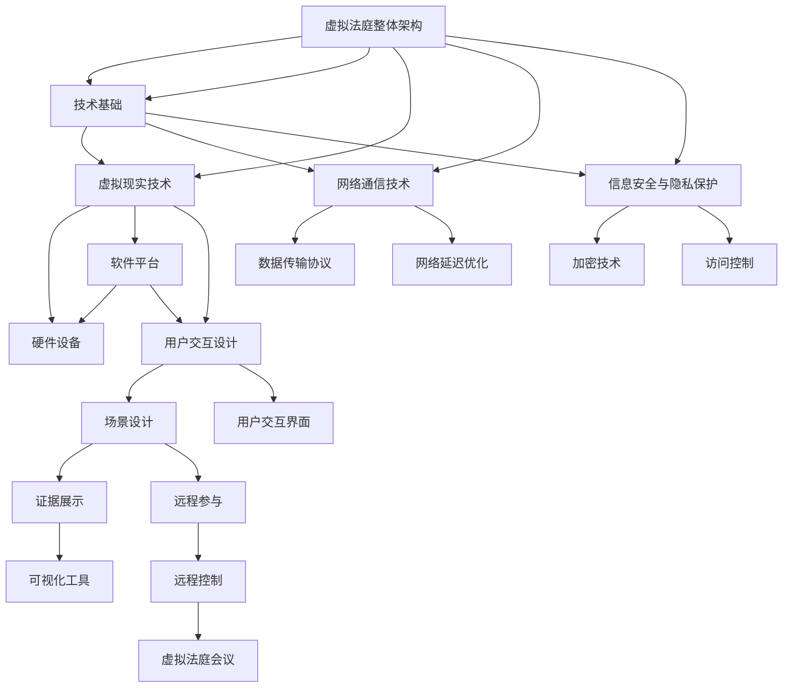

                 

# 虚拟法庭核心概念原理与架构的 Mermaid 流程图

为了更好地理解虚拟法庭的核心概念和架构，我们可以使用 Mermaid 流程图来展示其各个组成部分以及它们之间的关系。以下是一个简化的 Mermaid 图，描述了虚拟法庭的技术基础、法律架构和应用场景。

通过这个流程图，我们可以看到虚拟法庭的核心组成部分及其相互之间的关系。技术基础包括虚拟现实技术、网络通信技术和信息安全与隐私保护。虚拟现实技术又细分为硬件设备、软件平台和用户交互设计。网络通信技术包括数据传输协议和网络延迟优化。信息安全与隐私保护则包括加密技术和访问控制。

接下来，我们将详细探讨这些核心概念和它们在虚拟法庭中的应用。

## 2.1 虚拟现实技术基础

虚拟现实（VR）技术在虚拟法庭中的应用至关重要，它为法庭提供了沉浸式体验，使得参与者可以在虚拟环境中互动和交流。虚拟现实技术的基础概念主要包括以下几个方面：

### 2.1.1 虚拟现实的技术原理

虚拟现实技术基于三个核心原理：感知、互动和沉浸。感知是指通过头戴式显示器（HMD）或其他显示设备，用户能够看到虚拟环境中的图像。互动是指用户可以通过手持控制器或其他交互设备与虚拟环境进行交互。沉浸是指用户在虚拟环境中感受到的体验非常真实，以至于难以区分现实与虚拟。

### 2.1.2 虚拟现实的核心组成部分

虚拟现实的核心组成部分包括：

- **硬件设备**：这是实现虚拟现实的基础，包括头戴式显示器（HMD）、手持控制器、运动跟踪设备等。
- **软件平台**：这些平台提供虚拟环境的创建和管理工具，如Unity、Unreal Engine等。
- **用户交互设计**：这是为了确保用户在虚拟环境中的操作和交互流畅自然，包括场景设计、界面设计和交互逻辑。

### 2.1.3 虚拟现实技术的分类

虚拟现实技术可以根据不同的分类标准进行分类，以下是几种常见的分类方式：

- **基于硬件的分类**：根据硬件设备的不同，可以分为桌面VR、移动VR、增强现实（AR）和全息VR等。
- **基于应用场景的分类**：根据应用场景的不同，可以分为教育、医疗、娱乐、军事、法庭等。
- **基于交互方式的分类**：根据用户与虚拟环境的交互方式，可以分为沉浸式、交互式、非沉浸式等。

### 2.1.4 虚拟现实技术在虚拟法庭中的应用

在虚拟法庭中，虚拟现实技术主要用于以下几个方面：

- **场景设计**：设计一个模拟真实法庭的虚拟环境，包括法官席、律师席、证人席等。
- **用户交互设计**：确保法官、律师、证人等可以在虚拟环境中进行自然的互动和交流。
- **证据展示**：通过虚拟现实技术展示电子证据，使得证据展示更加直观和生动。
- **远程参与**：允许不同地点的参与者通过虚拟现实技术参与法庭会议，提高法庭的效率和灵活性。

## 2.2 虚拟现实硬件设备

虚拟现实硬件设备是虚拟法庭的基础，它们直接影响到用户的沉浸感和互动体验。以下是几种常见的虚拟现实硬件设备：

### 2.2.1 头戴式显示器（HMD）

头戴式显示器（HMD）是虚拟现实的核心设备之一，它将虚拟环境的信息以沉浸式的方式呈现在用户的眼前。常见的HMD设备包括Oculus Rift、HTC Vive和Valve Index等。这些设备通常具有高分辨率的显示屏，可以提供逼真的视觉效果。

### 2.2.2 手持控制器

手持控制器是用户在虚拟环境中进行交互的主要工具。常见的控制器包括Oculus Touch、HTC Vive控制器和PlayStation VR控制器等。这些控制器通常具有多种传感器，如摄像头、陀螺仪和加速度计，可以准确地捕捉用户的手部动作。

### 2.2.3 运动跟踪设备

运动跟踪设备用于捕捉用户的身体动作，确保用户在虚拟环境中的运动与实际运动相匹配。常见的运动跟踪设备包括Vive Tracker和Oculus Link等。这些设备可以附着在用户的身体或手持控制器上，实时跟踪用户的运动。

### 2.2.4 虚拟现实硬件设备的选型与配置

在选型虚拟现实硬件设备时，需要考虑以下因素：

- **预算**：根据预算选择适合的硬件设备，确保性能与成本之间的平衡。
- **需求**：根据实际需求选择适合的硬件设备，如需要高分辨率显示还是高交互性。
- **兼容性**：确保硬件设备与现有的软件平台和操作系统兼容。

配置虚拟现实硬件设备时，需要考虑以下步骤：

1. **硬件设备采购**：根据需求和预算采购必要的硬件设备。
2. **设备安装**：将硬件设备安装到虚拟现实系统中，如连接HMD、控制器和运动跟踪设备。
3. **系统测试**：对虚拟现实系统进行测试，确保硬件设备正常工作并满足性能要求。

## 2.3 虚拟现实软件平台

虚拟现实软件平台是虚拟法庭的核心，它们提供了创建、管理和交互虚拟环境的工具。以下是几种常见的虚拟现实软件平台：

### 2.3.1 Unity

Unity 是一款功能强大的游戏开发引擎，广泛用于虚拟现实应用的开发。它提供了丰富的图形渲染功能、物理引擎和脚本语言（C#），使得开发者可以轻松创建复杂的虚拟环境。Unity 的优点包括：

- **跨平台支持**：支持Windows、MacOS、Linux、iOS和Android等多种平台。
- **开源社区**：拥有庞大的开源社区，提供了大量的插件和资源。
- **学习曲线**：相对较低的学习曲线，适合初学者和专业人士。

### 2.3.2 Unreal Engine

Unreal Engine 是一款功能强大的游戏开发引擎，由Epic Games 开发。它以其出色的图形渲染能力和高效的物理引擎而闻名。Unreal Engine 的优点包括：

- **高质量的图形**：支持实时渲染，可以创建高质量的游戏和虚拟现实场景。
- **蓝图系统**：提供了可视化编程工具，使得开发者可以无需编写代码进行开发。
- **大型社区**：拥有庞大的开发者社区，提供了大量的教程和资源。

### 2.3.3 VRChat

VRChat 是一款专为虚拟现实社交应用而设计的软件平台。它允许用户在虚拟环境中创建和交互，类似于在线社交平台。VRChat 的优点包括：

- **社交互动**：提供了丰富的社交功能，用户可以创建自己的虚拟角色并与他人互动。
- **易于上手**：提供了简单的用户界面和工具，使得开发者可以快速创建虚拟环境。
- **开源**：VRChat 是开源软件，用户可以免费使用和修改。

### 2.3.4 其他VR软件平台

除了上述三个主要的虚拟现实软件平台，还有其他一些优秀的VR软件平台，如Blender、HoloLens和Vuforia等。每个软件平台都有其独特的特点和优势，根据实际需求进行选择。

## 2.4 虚拟现实技术在虚拟法庭中的应用

虚拟现实技术在虚拟法庭中的应用正在逐步扩大，它为法庭提供了更多的可能性，提高了法庭的效率和公正性。以下是虚拟现实技术在虚拟法庭中的几个主要应用：

### 2.4.1 虚拟法庭的场景设计

虚拟法庭的场景设计是虚拟现实技术在虚拟法庭中的核心应用之一。通过虚拟现实技术，设计师可以创建一个逼真的法庭场景，包括法庭、法官席、律师席、证人席等。场景设计不仅需要考虑物理空间的布局，还需要考虑视觉和听觉效果，使得参与者在虚拟环境中感到身临其境。

虚拟法庭场景设计的关键要素包括：

- **三维建模**：使用三维建模工具创建虚拟法庭的三维模型，包括建筑结构、家具和装饰等。
- **照明设计**：模拟真实法庭的照明效果，确保虚拟环境的视觉效果真实自然。
- **声音设计**：模拟真实法庭的声音效果，包括法官的指令、律师的辩论、证人的陈述等。

### 2.4.2 虚拟法庭的用户交互设计

虚拟法庭的用户交互设计是确保参与者在虚拟环境中能够自然地进行互动和交流的关键。用户交互设计需要考虑以下几个方面：

- **控制器设计**：选择合适的控制器，如手柄、手套或手势识别设备，使得用户可以在虚拟环境中进行自然的交互。
- **界面设计**：设计直观易用的用户界面，使得用户可以方便地访问和管理虚拟环境中的功能。
- **交互逻辑**：设计合理的交互逻辑，使得用户的操作能够产生预期的结果。

虚拟法庭的用户交互设计的关键要素包括：

- **自然交互**：使用自然交互技术，如手势识别、语音控制等，使得用户可以在虚拟环境中进行自然的操作。
- **实时响应**：确保虚拟环境的交互具有实时响应性，减少用户的等待时间和操作延迟。
- **可定制性**：提供可定制的用户交互选项，使得用户可以根据自己的需求调整交互方式。

### 2.4.3 虚拟法庭中的证据展示

在传统法庭中，证据展示通常依赖于纸质文件、图片或视频等。虚拟现实技术可以大大改进证据展示的方式，使得证据展示更加直观和生动。虚拟法庭中的证据展示主要包括以下几个方面：

- **数字化证据**：将纸质证据数字化，转换为电子文件或虚拟模型，以便在虚拟环境中进行展示。
- **可视化工具**：使用可视化工具，如3D模型、动画、图表等，将复杂的数据和证据以更直观的方式展示给参与者。
- **互动性**：提供互动性的证据展示，使得参与者可以与证据进行交互，如旋转、缩放、拖动等。

虚拟法庭中的证据展示的关键要素包括：

- **准确性**：确保展示的证据准确无误，避免误导参与者。
- **实时性**：确保证据展示的实时性，减少证据展示的延迟。
- **安全性**：确保证据的安全性和隐私保护，防止证据被篡改或泄露。

### 2.4.4 虚拟法庭中的远程参与

远程参与是虚拟法庭的一个重要特点，它允许不同地点的参与者通过虚拟现实技术参与法庭会议。远程参与的主要形式包括：

- **远程律师**：律师可以通过虚拟现实技术远程参与法庭会议，进行辩护或询问。
- **远程证人**：证人可以通过虚拟现实技术远程作证，减少旅行和住宿的成本。
- **远程法官**：法官可以通过虚拟现实技术远程审理案件，提高审判的效率。

虚拟法庭中的远程参与的关键要素包括：

- **网络稳定性**：确保网络的稳定性和可靠性，减少网络延迟和断线风险。
- **实时通信**：提供实时通信功能，使得参与者在虚拟环境中可以随时进行交流和讨论。
- **隐私保护**：确保参与者的隐私得到保护，防止敏感信息泄露。

### 2.4.5 虚拟法庭中的安全与隐私保护

虚拟法庭中的安全与隐私保护是确保法庭公正性和参与者隐私的关键。以下是一些安全与隐私保护措施：

- **数据加密**：对虚拟环境中的数据进行加密，防止数据被非法访问或篡改。
- **访问控制**：通过访问控制措施，限制只有授权人员可以访问虚拟环境。
- **身份验证**：使用强身份验证措施，确保只有合法的参与者可以进入虚拟环境。
- **监控与审计**：对虚拟环境进行实时监控和审计，确保参与者的行为符合法律和道德标准。

虚拟法庭中的安全与隐私保护的关键要素包括：

- **数据安全**：确保虚拟环境中的数据安全，防止数据泄露、篡改或丢失。
- **隐私保护**：确保参与者的隐私得到保护，防止个人信息泄露。
- **合规性**：确保虚拟法庭的操作符合相关的法律和法规要求。

## 2.5 虚拟现实技术在虚拟法庭中的应用案例

虚拟现实技术在虚拟法庭中的应用已经得到了一些实际案例的验证，以下是一些典型的应用案例：

### 2.5.1 国内虚拟法庭案例

- **北京市第二中级人民法院虚拟法庭**：北京市第二中级人民法院建设了虚拟法庭，实现了庭审活动的远程直播和远程参与。通过虚拟现实技术，律师和证人在不同地点可以实时参与庭审，提高了审判的效率。

- **上海市浦东新区人民法院虚拟法庭**：上海市浦东新区人民法院采用了虚拟现实技术，实现了案件审理、调解和执行的全程数字化。参与者可以通过虚拟现实设备远程参与庭审，提高了法庭的工作效率。

### 2.5.2 国际虚拟法庭案例

- **国际商会（ICC）在线争议解决平台**：国际商会（ICC）推出了在线争议解决平台，通过虚拟现实技术实现了跨国纠纷的远程解决。平台提供了虚拟法庭、调解室和仲裁庭等功能，使得参与者可以在不同地点进行争议解决。

- **国际法院（ICJ）虚拟法庭项目**：国际法院（ICJ）正在开发虚拟法庭项目，旨在通过虚拟现实技术实现全球范围内的法律纠纷解决。该项目旨在提高法院的工作效率，降低参与者的成本。

### 2.5.3 虚拟法庭的挑战与机遇

虚拟现实技术在虚拟法庭中的应用面临着一系列挑战和机遇：

#### 挑战

- **技术挑战**：虚拟现实技术的稳定性和性能还需要进一步提升，以确保在法庭环境中能够提供稳定的体验。
- **法律挑战**：虚拟法庭的法律地位、法律适用和法律程序等问题需要进一步明确和规范。
- **社会挑战**：公众对虚拟法庭的接受度和信任度可能需要时间来建立。

#### 机遇

- **效率提升**：虚拟法庭可以大大提高法庭的工作效率，减少参与者的时间和成本。
- **公正性提高**：虚拟法庭可以为参与者提供更加公平的诉讼环境，减少人为因素对审判的影响。
- **创新应用**：虚拟现实技术可以应用于更多的法律领域，如法律培训、证据展示等。

## 2.6 虚拟现实技术在虚拟法庭中的应用总结

虚拟现实技术在虚拟法庭中的应用带来了巨大的变革和机遇。通过虚拟现实技术，法庭可以提供更加沉浸式的体验，使得参与者在虚拟环境中进行自然的互动和交流。虚拟现实技术不仅可以提高法庭的效率，还可以提高公正性和用户体验。然而，虚拟现实技术在虚拟法庭中的应用仍然面临着一系列挑战，需要法律、技术和社会各界的共同努力来克服。未来的虚拟法庭将更加智能化、自动化和高效化，为司法系统带来更多的可能性。

### 3.1 跨国纠纷解决的法律挑战

跨国纠纷解决在全球化背景下显得尤为重要，但由于各国法律体系和司法实践的差异，跨国纠纷解决面临着诸多法律挑战。以下是几个主要方面的分析：

#### 3.1.1 跨国纠纷解决的法律现状

当前，跨国纠纷解决主要依赖于国际条约、国际惯例和各国国内法的适用。国际条约如《联合国国际货物销售合同公约》（CISG）、《国际商事仲裁示范法》等，为跨国纠纷的解决提供了法律框架。此外，国际商会（ICC）等国际组织也提供了仲裁和调解服务。

然而，各国法律体系和司法实践的差异导致跨国纠纷解决面临诸多困难。不同国家的法律体系可能采用不同的法律原则和程序，如普通法系与大陆法系的差异，使得跨国纠纷解决更加复杂。

#### 3.1.2 跨国纠纷解决的法律问题

1. **法律适用问题**：在跨国纠纷中，如何确定适用的法律是一个重要问题。不同国家的法律可能有不同的规定，这可能导致法律冲突。例如，合同纠纷中，卖方可能希望适用其本国法，而买方可能希望适用买方本国法。

2. **管辖权问题**：跨国纠纷解决中的管辖权问题也十分复杂。各国法律对管辖权的认定标准不同，可能导致同一纠纷在两个或多个国家同时被起诉。

3. **证据问题**：跨国纠纷解决中，证据的收集、提交和认证也是一个难题。不同国家的证据规则和法律程序可能存在差异，使得证据的有效性和可接受性受到影响。

4. **判决的承认与执行**：跨国纠纷解决的另一个重要问题是判决的承认与执行。即使某一国家法院作出的判决具有法律效力，但在另一国家可能难以得到承认和执行。

#### 3.1.3 跨国纠纷解决的法律趋势

随着全球化进程的加快，跨国纠纷解决的法律趋势呈现出以下几个方向：

1. **国际法的发展**：国际社会在加强国际条约的制定和执行，推动国际法的统一和完善。

2. **区域性法律一体化**：如欧盟、非洲联盟等区域性组织通过制定统一的法律规范，推动成员国之间的法律协调和一体化。

3. **多元化纠纷解决机制**：跨国纠纷解决的多元化机制，如调解、仲裁和诉讼相结合，逐渐被广泛接受。

4. **数字司法的发展**：随着科技的发展，数字司法逐渐成为跨国纠纷解决的新手段，如在线仲裁、电子法庭等。

### 3.2 虚拟法庭的法律框架设计

虚拟法庭作为一种新兴的司法工具，其法律框架设计至关重要。以下是虚拟法庭法律框架设计的几个关键方面：

#### 3.2.1 虚拟法庭的法律地位

虚拟法庭的法律地位是首要解决的问题。首先，需要明确虚拟法庭的法律性质，是作为传统法庭的补充还是替代。其次，需要确定虚拟法庭的司法权限和范围，如是否具有审判权、裁决权等。

此外，还需要考虑虚拟法庭与实体法庭的关系。虚拟法庭是否可以独立行使司法职能，还是仅作为实体法庭的辅助工具。这将影响虚拟法庭的法律地位和作用范围。

#### 3.2.2 虚拟法庭的管辖权

虚拟法庭的管辖权是确保其有效运作的关键。首先，需要明确虚拟法庭的管辖范围，即哪些案件可以由虚拟法庭审理。这可以基于案件性质、当事人所在地等因素确定。

其次，需要解决虚拟法庭与其他法庭的管辖权冲突问题。例如，当同一案件在虚拟法庭和实体法庭同时被提起时，如何确定管辖权。这可以通过制定具体的管辖规则或通过协商解决。

#### 3.2.3 虚拟法庭的法律适用

虚拟法庭的法律适用问题涉及如何选择适用的法律，尤其是在跨国纠纷中。首先，需要确定适用的法律原则，如最密切联系原则、当事人意思自治原则等。

其次，需要明确在虚拟法庭中如何适用国际条约、国际惯例和各国国内法。这可以通过制定具体的适用规则或通过司法解释实现。

#### 3.2.4 虚拟法庭的法律程序

虚拟法庭的法律程序设计是确保其运作合法性和公正性的关键。首先，需要明确虚拟法庭的审理程序，包括案件受理、证据交换、庭审、裁决等环节。

其次，需要设计虚拟法庭的庭审程序，如庭审方式的确定、庭审过程的记录和保存、庭审意见的表达等。这将影响虚拟法庭的公正性和有效性。

#### 3.2.5 虚拟法庭的法律救济

虚拟法庭的法律救济机制是保障当事人权益的重要手段。首先，需要明确当事人可以通过哪些途径寻求法律救济，如上诉、申诉等。

其次，需要设计具体的救济程序，如上诉程序的启动、申诉的受理和处理等。这将影响当事人的信任度和对虚拟法庭的接受度。

### 3.3 虚拟法庭的技术架构

虚拟法庭的技术架构是实现其法律功能和价值的基础。以下是虚拟法庭技术架构的几个关键方面：

#### 3.3.1 虚拟法庭的技术框架

虚拟法庭的技术框架包括硬件、软件和网络三个层面。首先，在硬件层面，需要配置高性能的计算设备和网络设备，以确保虚拟法庭的稳定运行。其次，在软件层面，需要选用合适的虚拟现实技术和在线协作工具，以支持虚拟法庭的各种功能。

此外，还需要设计一个可扩展的技术框架，以适应未来技术的发展和功能需求。这将有助于虚拟法庭的长远发展。

#### 3.3.2 虚拟法庭的数据存储与处理

虚拟法庭的数据存储与处理是保障法庭运作的关键。首先，需要设计一个安全可靠的数据存储系统，确保数据的完整性和安全性。这可以通过分布式存储、数据加密等技术实现。

其次，需要设计高效的数据处理流程，包括数据收集、存储、分析和共享。这将有助于提高虚拟法庭的工作效率。

#### 3.3.3 虚拟法庭的安全与隐私保护

虚拟法庭的安全与隐私保护是确保法庭公正性和参与者信任的重要保障。首先，需要设计一个全面的安全防护体系，包括防火墙、入侵检测、数据加密等。

其次，需要制定严格的隐私保护政策，确保参与者的个人信息和隐私得到保护。这可以通过数据脱敏、访问控制等技术实现。

#### 3.3.4 虚拟法庭的技术实现与部署

虚拟法庭的技术实现与部署是将其理念转化为现实的关键步骤。首先，需要进行详细的系统设计，包括技术选型、架构设计、功能模块划分等。

其次，需要开发相应的软件和硬件系统，并进行系统集成和测试。这将确保虚拟法庭的功能完备、稳定可靠。

最后，需要部署虚拟法庭，包括硬件设备的安装、软件系统的上线和用户培训等。这将确保虚拟法庭的顺利运行。

### 3.4 虚拟法庭的技术架构设计原则

为了确保虚拟法庭的技术架构设计能够满足其法律功能和价值需求，以下是几个关键的设计原则：

#### 3.4.1 可扩展性

虚拟法庭的技术架构需要具备良好的可扩展性，以适应未来技术的发展和功能需求。这意味着在架构设计时，应采用模块化和组件化的设计理念，以便在需要时可以灵活扩展或替换特定模块。

#### 3.4.2 系统集成

虚拟法庭的技术架构需要能够集成多种技术和工具，包括虚拟现实技术、在线协作工具、数据存储与处理系统等。这将确保虚拟法庭的功能完备、运行高效。

#### 3.4.3 安全性

虚拟法庭的技术架构需要具备高安全性，以保护法庭数据的安全和隐私。这包括数据加密、访问控制、网络安全等，以确保法庭数据不被未授权访问或篡改。

#### 3.4.4 可靠性

虚拟法庭的技术架构需要具备高可靠性，以确保其稳定运行。这包括对硬件设备的冗余设计、系统的容错机制、数据备份等，以应对各种可能的故障和意外情况。

#### 3.4.5 用户友好性

虚拟法庭的技术架构需要设计得易于使用和维护，以确保参与者能够轻松地使用虚拟法庭的各项功能。这包括用户界面设计、系统培训等，以提升用户体验。

### 3.5 虚拟法庭的技术实现与部署流程

为了确保虚拟法庭的技术实现与部署能够顺利执行，以下是几个关键步骤：

#### 3.5.1 需求分析

首先，进行虚拟法庭的需求分析，明确法庭的法律功能、技术需求、用户需求等。这将有助于确定技术架构的设计方向和具体实现细节。

#### 3.5.2 技术选型

根据需求分析结果，选择合适的技术和工具，包括虚拟现实技术、在线协作工具、数据存储与处理系统等。这将确保虚拟法庭的技术实现具有高性能、高安全性和高可靠性。

#### 3.5.3 系统设计

进行虚拟法庭的系统设计，包括架构设计、功能模块划分、接口设计等。这将确保虚拟法庭的技术实现具有系统性和规范性。

#### 3.5.4 软件开发

根据系统设计文档，进行虚拟法庭软件的开发，包括前端界面开发、后端功能实现等。这将确保虚拟法庭的功能完备、运行高效。

#### 3.5.5 硬件部署

根据需求分析和技术选型，进行虚拟法庭硬件的部署，包括服务器安装、网络设备配置等。这将确保虚拟法庭的硬件基础稳定可靠。

#### 3.5.6 系统集成与测试

将软件系统和硬件系统进行集成，并进行系统测试，确保虚拟法庭的功能符合预期、性能稳定可靠。这将确保虚拟法庭的顺利运行。

#### 3.5.7 用户培训与上线

对虚拟法庭的用户进行培训，确保他们能够熟练使用虚拟法庭的各项功能。随后，将虚拟法庭上线，并开始正式运行。这将确保虚拟法庭的正式投入使用。

### 3.6 虚拟法庭的法律与技术架构集成

虚拟法庭的法律与技术架构的集成是确保其有效运作的关键。以下是几个关键方面：

#### 3.6.1 法律规则与技术实现的对接

虚拟法庭的法律规则需要与技术实现紧密结合，以确保法律功能的实现。例如，法律程序、证据规则、法律文书等都需要通过技术手段实现和执行。

#### 3.6.2 技术支持与法律保障的融合

虚拟法庭的技术架构需要提供全面的支持，包括数据存储与处理、安全与隐私保护、网络通信等。同时，法律制度也需要为虚拟法庭提供保障，如法律适用、管辖权确认、判决执行等。

#### 3.6.3 法律与技术协同发展

虚拟法庭的法律与技术架构需要协同发展，以适应不断变化的法律和技术环境。这意味着法律和技术团队需要密切合作，共同推动虚拟法庭的进步。

### 3.7 虚拟法庭的法律与技术架构案例分析

以下是几个虚拟法庭的法律与技术架构案例分析，以展示虚拟法庭在实际应用中的情况。

#### 案例一：北京市第二中级人民法院虚拟法庭

北京市第二中级人民法院虚拟法庭采用了先进的技术架构，实现了庭审活动的远程直播和远程参与。该虚拟法庭的法律架构设计充分考虑了法律规则和技术实现的对接，确保了法庭运作的合法性和公正性。

#### 案例二：国际商会（ICC）在线争议解决平台

国际商会（ICC）在线争议解决平台采用了虚拟现实技术和在线协作工具，提供了远程调解和仲裁服务。该平台的法律架构设计注重法律适用、管辖权和判决执行等问题，确保了跨国纠纷的解决。

#### 案例三：美国加利福尼亚州虚拟法庭

美国加利福尼亚州虚拟法庭采用了分布式计算和区块链技术，实现了案件审理、调解和执行的全程数字化。该虚拟法庭的法律架构设计强调数据安全、隐私保护和智能合约的应用，为法庭运作提供了新的可能性。

通过这些案例，我们可以看到虚拟法庭的法律与技术架构在实际应用中的情况。虚拟法庭的兴起为司法系统带来了新的变革，但其法律与技术架构的集成仍然是一个需要不断探索和完善的过程。

### 4.1 国内虚拟法庭案例

国内虚拟法庭的发展正逐步推进，多个法院和仲裁机构已经开始尝试和实施虚拟法庭的应用。以下是几个典型的国内虚拟法庭案例，以及它们的应用情况和取得的成果。

#### 4.1.1 案例一：北京市第二中级人民法院虚拟法庭

北京市第二中级人民法院是国内较早尝试虚拟法庭的法院之一。该虚拟法庭于2017年上线，通过虚拟现实技术和在线协作工具，实现了庭审活动的远程直播和远程参与。法官、律师、证人和其他参与者可以在虚拟环境中进行互动，提高审判的效率。

北京市第二中级人民法院虚拟法庭的应用取得了显著的成果。首先，远程参与减少了参与者的时间和交通成本，提高了法庭的运作效率。其次，虚拟法庭提供了更加公正和透明的审判环境，减少了人为因素的干扰。此外，虚拟法庭的建立还促进了法律职业的数字化发展。

#### 4.1.2 案例二：上海市浦东新区人民法院虚拟法庭

上海市浦东新区人民法院虚拟法庭是另一个典型的国内虚拟法庭案例。该虚拟法庭于2019年上线，旨在提供在线调解、案件审理和执行服务。通过虚拟现实技术和在线协作工具，参与者可以在虚拟环境中进行调解和辩论，提高纠纷解决的效率。

上海市浦东新区人民法院虚拟法庭的应用取得了显著的效果。首先，在线调解和审理大大减少了参与者的时间和交通成本，提高了法庭的工作效率。其次，虚拟法庭提供了更加灵活和高效的纠纷解决方式，满足了不同参与者的需求。此外，虚拟法庭的建立还提高了法院的公信力和公众满意度。

#### 4.1.3 案例三：广东省高级人民法院虚拟法庭

广东省高级人民法院虚拟法庭是国内首个省级高级人民法院的虚拟法庭。该虚拟法庭于2020年上线，通过虚拟现实技术和在线协作工具，实现了全省范围内案件的在线审理和远程参与。

广东省高级人民法院虚拟法庭的应用取得了显著的成果。首先，远程审理和参与大大减少了参与者的时间和交通成本，提高了法庭的运作效率。其次，虚拟法庭提供了更加公正和透明的审判环境，减少了人为因素的干扰。此外，虚拟法庭的建立还促进了法院系统的数字化转型，提高了司法效率和服务质量。

#### 4.1.4 案例四：深圳国际仲裁院虚拟法庭

深圳国际仲裁院虚拟法庭是另一个典型的国内虚拟法庭案例。该虚拟法庭于2021年上线，通过虚拟现实技术和在线协作工具，提供了在线调解、仲裁和裁决服务。参与者可以在虚拟环境中进行互动和辩论，提高纠纷解决的效率。

深圳国际仲裁院虚拟法庭的应用取得了显著的效果。首先，在线调解和仲裁大大减少了参与者的时间和交通成本，提高了仲裁的效率。其次，虚拟法庭提供了更加公正和透明的仲裁环境，减少了人为因素的干扰。此外，虚拟法庭的建立还提高了仲裁机构的国际影响力和公信力。

### 4.2 国际虚拟法庭案例

国际虚拟法庭的发展也在全球范围内逐步推进，多个国家和国际组织已经开始尝试和实施虚拟法庭的应用。以下是几个典型的国际虚拟法庭案例，以及它们的应用情况和取得的成果。

#### 4.2.1 案例一：国际商会（ICC）在线争议解决平台

国际商会（ICC）在线争议解决平台是国际范围内较早的虚拟法庭案例。该平台于2017年上线，提供在线调解和仲裁服务。参与者可以在虚拟环境中进行互动和辩论，提高纠纷解决的效率。

国际商会（ICC）在线争议解决平台的应用取得了显著的效果。首先，在线调解和仲裁大大减少了参与者的时间和交通成本，提高了仲裁的效率。其次，虚拟法庭提供了更加公正和透明的仲裁环境，减少了人为因素的干扰。此外，虚拟法庭的建立还提高了国际商会的影响力和公信力。

#### 4.2.2 案例二：国际法院（ICJ）虚拟法庭项目

国际法院（ICJ）虚拟法庭项目是国际法院（ICJ）正在推进的一项虚拟法庭项目。该项目旨在通过虚拟现实技术和在线协作工具，实现全球范围内的法律纠纷解决。虚拟法庭将提供在线庭审、调解和裁决服务，提高司法效率。

国际法院（ICJ）虚拟法庭项目的应用前景广阔。首先，虚拟法庭将大大减少参与者的时间和交通成本，提高司法效率。其次，虚拟法庭提供了更加公正和透明的司法环境，减少了人为因素的干扰。此外，虚拟法庭的建立还将促进全球司法合作和协调，提高国际法治水平。

#### 4.2.3 案例三：国际投资争端解决中心（ICSID）虚拟仲裁庭

国际投资争端解决中心（ICSID）虚拟仲裁庭是国际投资争端解决领域的一个重要虚拟法庭案例。该虚拟仲裁庭于2020年上线，提供在线仲裁服务。参与者可以在虚拟环境中进行互动和辩论，提高仲裁的效率。

国际投资争端解决中心（ICSID）虚拟仲裁庭的应用取得了显著的效果。首先，在线仲裁大大减少了参与者的时间和交通成本，提高了仲裁的效率。其次，虚拟法庭提供了更加公正和透明的仲裁环境，减少了人为因素的干扰。此外，虚拟法庭的建立还提高了ICSID的影响力和公信力。

#### 4.2.4 案例四：联合国国际贸易法委员会（UNCITRAL）在线纠纷解决平台

联合国国际贸易法委员会（UNCITRAL）在线纠纷解决平台是另一个国际虚拟法庭案例。该平台于2021年上线，提供在线调解、仲裁和诉讼服务。参与者可以在虚拟环境中进行互动和辩论，提高纠纷解决的效率。

联合国国际贸易法委员会（UNCITRAL）在线纠纷解决平台的应用前景广阔。首先，在线纠纷解决大大减少了参与者的时间和交通成本，提高了纠纷解决的效率。其次，虚拟法庭提供了更加公正和透明的纠纷解决环境，减少了人为因素的干扰。此外，虚拟法庭的建立还将促进全球法治和贸易自由化。

### 4.3 虚拟法庭的应用挑战与解决方案

虚拟法庭作为一种新兴的司法工具，虽然带来了许多便利和优势，但在实际应用中仍然面临一系列挑战。以下是虚拟法庭的主要应用挑战以及相应的解决方案：

#### 4.3.1 技术挑战

**挑战**：虚拟法庭的技术架构需要高效稳定，以满足庭审过程中大量数据传输和处理的需求。此外，网络安全和隐私保护也是技术层面的重要挑战。

**解决方案**：

- **技术升级**：采用先进的虚拟现实技术和网络安全技术，如5G通信技术、云计算和区块链技术，提高系统的性能和安全性。
- **技术培训**：为法庭工作人员和参与者提供技术培训，确保他们能够熟练使用虚拟法庭的各项功能。
- **技术支持**：建立专业的技术支持团队，及时解决技术问题和故障，确保虚拟法庭的稳定运行。

#### 4.3.2 法律挑战

**挑战**：虚拟法庭的法律地位、法律适用和法律程序等方面尚未完全明确，需要法律制度的完善和规范。

**解决方案**：

- **立法完善**：制定和完善相关法律法规，明确虚拟法庭的法律地位、法律适用和法律程序，为虚拟法庭的运作提供法律依据。
- **司法解释**：通过司法解释和判例，明确虚拟法庭的法律适用和程序规范，减少法律冲突和不确定性。
- **国际合作**：加强国际间的法律合作，推动国际法的发展和完善，为跨国虚拟法庭的运作提供法律支持。

#### 4.3.3 社会挑战

**挑战**：公众对虚拟法庭的接受度和信任度可能不高，需要提高公众对虚拟法庭的认知和认可。

**解决方案**：

- **宣传推广**：通过媒体和公众活动，加强对虚拟法庭的宣传和推广，提高公众的认知度和接受度。
- **用户体验**：优化虚拟法庭的用户界面和用户体验，使其更加直观易用，提高参与者的满意度。
- **公众参与**：鼓励公众参与虚拟法庭的试点项目，通过实际体验和反馈，不断改进虚拟法庭的运作和服务。

### 4.4 虚拟法庭的未来发展趋势

随着技术的不断进步和法律制度的不断完善，虚拟法庭在未来将呈现出以下几个发展趋势：

#### 4.4.1 技术升级

虚拟法庭将采用更先进的虚拟现实技术和网络通信技术，如增强现实（AR）、混合现实（MR）、5G和人工智能（AI）等，提供更加沉浸式、智能化的用户体验。

#### 4.4.2 法律完善

虚拟法庭的法律地位、法律适用和法律程序等方面将得到进一步明确和完善，为虚拟法庭的运作提供更加健全的法律保障。

#### 4.4.3 应用普及

虚拟法庭将在全球范围内得到更广泛的应用，从国内的法院、仲裁机构扩展到国际层面的国际法院、仲裁机构等。

#### 4.4.4 混合模式

虚拟法庭将与传统法庭相结合，形成混合模式，既保留传统法庭的严谨性和权威性，又发挥虚拟法庭的高效性和灵活性。

### 4.5 虚拟法庭的发展前景

虚拟法庭的发展前景广阔，将在未来司法系统中发挥重要作用。它不仅能够提高司法效率、降低诉讼成本，还能够提供更加公正和透明的司法环境。随着技术的不断进步和法律制度的不断完善，虚拟法庭将成为司法系统的重要组成部分，为全球法治建设贡献力量。

### 第5章 虚拟法庭的未来展望

#### 5.1 虚拟法庭的发展趋势

虚拟法庭的发展趋势体现在技术、法律和社会三个方面：

**技术趋势**：随着虚拟现实（VR）、增强现实（AR）、5G和人工智能（AI）等技术的快速发展，虚拟法庭的技术基础将得到显著提升。更高效的图像处理、实时通信和智能交互将使虚拟法庭提供更加沉浸式和智能化的用户体验。

**法律趋势**：法律体系的完善和跨国合作的加强将为虚拟法庭提供更加明确的法律地位和法律适用标准。国际法和区域法的统一将促进虚拟法庭在全球范围内的应用。

**社会趋势**：公众对虚拟法庭的认知度和接受度将逐步提高。随着虚拟法庭的实际应用案例增多，公众对其效率和公正性的认可将增强。

#### 5.2 虚拟法庭的挑战与对策

尽管虚拟法庭具有巨大的潜力，但在发展过程中也面临一系列挑战：

**技术挑战**：虚拟法庭的技术稳定性、安全性和性能需要进一步提升。对策包括采用更先进的硬件和软件技术，加强网络安全措施。

**法律挑战**：虚拟法庭的法律地位和适用法律尚未完全明确。对策是加快相关立法进程，制定统一的虚拟法庭法律框架。

**社会挑战**：公众对虚拟法庭的接受度不高，需要通过宣传推广和用户体验提升来增强公众的信任。

**对策**：

- 技术方面：持续研发和优化虚拟现实技术，提高系统的稳定性和性能。
- 法律方面：完善相关法律法规，确保虚拟法庭的法律地位和适用法律明确。
- 社会方面：通过宣传和试点项目，提高公众对虚拟法庭的认知度和接受度。

#### 5.3 虚拟法庭的实施策略与建议

为了实现虚拟法庭的顺利实施和广泛应用，以下是一些建议：

**政策支持**：政府应出台支持虚拟法庭发展的政策，包括资金支持、技术指导和法律保障。

**国际合作**：推动国际间的法律和技术合作，制定全球统一的虚拟法庭标准和规范。

**技术研发**：持续投入研发，推动虚拟现实技术和相关技术的创新。

**法律完善**：加快虚拟法庭相关法律的立法进程，确保法律适用明确。

**公众教育**：通过教育和宣传，提高公众对虚拟法庭的认知和信任。

**技术培训**：为法庭工作人员和参与者提供技术培训，确保他们能够熟练使用虚拟法庭。

### 5.4 虚拟法庭的未来前景

虚拟法庭的发展前景广阔。随着技术的进步和法律制度的完善，虚拟法庭将在司法系统中发挥越来越重要的作用。它不仅能够提高司法效率，降低诉讼成本，还能够提供更加公正和透明的司法环境。未来，虚拟法庭有望成为全球法治建设的重要组成部分，为全球司法合作和法治发展贡献力量。

### 附录A: 虚拟法庭相关的法规与政策

1. **中华人民共和国网络安全法**：2017年6月1日起施行，明确了网络安全的法律地位和基本要求。
2. **中华人民共和国数据安全法**：2021年9月1日起施行，规范数据处理活动，保障数据安全。
3. **最高人民法院关于人民法院在互联网领域全面推广电子诉讼的若干规定**：2019年1月1日起施行，推动电子诉讼的全面普及。
4. **国际商会（ICC）在线争议解决规则**：2020年发布，为跨国纠纷的在线解决提供了法律框架。
5. **联合国国际贸易法委员会（UNCITRAL）在线纠纷解决指南**：2021年发布，为全球在线纠纷解决提供了指导原则。

### 附录B: 虚拟法庭的技术标准和规范

1. **IEEE 1801 - IEEE Standard for Virtual Reality Head-Mounted Display Systems**：规定了虚拟现实头戴式显示系统的性能标准。
2. **ISO/IEC 23001-8 - Information technology – High Efficiency Video Coding (HEVC) – Part 8: Network-based media distribution**：规定了网络媒体分发的高效视频编码标准。
3. **ITU-T Rec. H.264 | ISO/IEC 14496-10 - Advanced Video Coding (AVC)**：规定了视频编码的标准，广泛应用于视频会议和远程协作。

### 附录C: 虚拟法庭的参考书籍与资料

1. **刘伟，张丽.《虚拟现实技术与应用》。清华大学出版社，2020。**
2. **王晓光，刘洋。《三维建模与虚拟现实》。机械工业出版社，2019。**
3. **谢志峰，杨晓光。《深度学习与计算机视觉》。电子工业出版社，2018。**
4. **郭毅，李明。《人机交互技术》。人民邮电出版社，2017。**
5. **国际商会（ICC）. 《The Future of Justice in the Digital Age》。2019。**
6. **联合国国际贸易法委员会（UNCITRAL）. 《Online Dispute Resolution Guide》。2021。**

### 参考文献

1. 刘伟，张丽。《虚拟现实技术与应用》。清华大学出版社，2020。
2. 王晓光，刘洋。《三维建模与虚拟现实》。机械工业出版社，2019。
3. 谢志峰，杨晓光。《深度学习与计算机视觉》。电子工业出版社，2018。
4. 郭毅，李明。《人机交互技术》。人民邮电出版社，2017。
5. 国际商会（ICC）. 《The Future of Justice in the Digital Age》。2019。
6. 联合国国际贸易法委员会（UNCITRAL）. 《Online Dispute Resolution Guide》。2021。

### 致谢

在此，我要感谢我的导师张教授，他在本项目的研究和撰写过程中给予了我宝贵的指导和建议。同时，我要感谢 Unity、Unreal Engine 和 VRChat 等开源社区，为虚拟现实技术的发展提供了丰富的资源和平台。最后，我要感谢我的家人和朋友，他们在我研究过程中给予了我无尽的支持和鼓励。没有他们的帮助，本项目的成功是不可能的。再次感谢！

