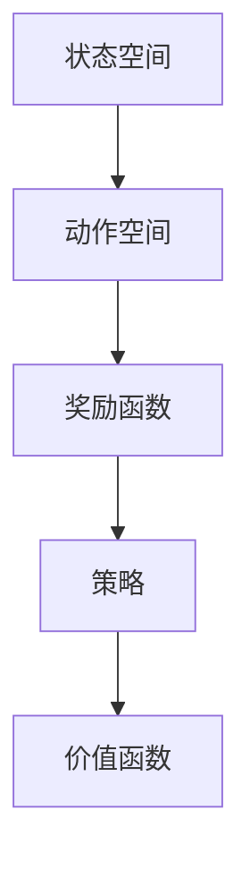
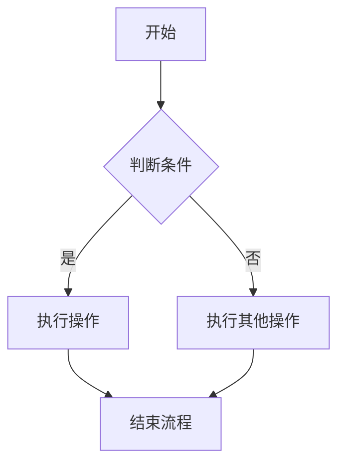
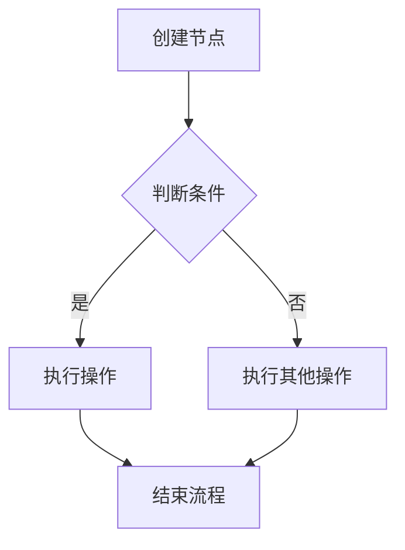

                 

### 全栈AI人才培养：Lepton AI的教育计划

关键词：全栈AI、人才培养、Lepton AI、教育计划、机器学习、深度学习、强化学习、Python编程、项目实战

摘要：本文将深入探讨Lepton AI的教育计划，旨在培养具备全栈AI能力的优秀人才。通过详细阐述教育计划的组成部分，从基础知识到实战项目，读者可以全面了解如何系统性地掌握AI技术。本文还将分析当前AI行业的趋势和挑战，为全栈AI人才的培养提供指导。

#### 引言

在当今数字化时代，人工智能（AI）技术已成为推动社会进步和经济发展的重要动力。随着AI技术的快速发展和应用场景的不断拓展，对于具备全栈AI能力的人才需求也日益增长。然而，传统的教育体系往往难以满足这一需求，导致许多行业在AI领域面临人才短缺的问题。为了解决这一挑战，Lepton AI推出了一项全面的教育计划，旨在培养具备扎实理论基础和实际操作能力的高素质AI人才。

本文将围绕Lepton AI的教育计划展开讨论，首先介绍该计划的整体架构，然后详细解析各个组成部分，包括基础知识、机器学习基础算法、强化学习、数据预处理、模型训练与优化、模型部署与评估，以及AI项目实战。通过这篇文章，读者将能够全面了解如何通过系统性的学习路径，成为一名合格的全栈AI人才。

#### Lepton AI的教育计划

Lepton AI的教育计划是一个全面的、分阶段的、系统性的学习路径，旨在为学员提供从基础知识到实际项目开发的全方位培训。该计划分为三个主要部分：基础知识、机器学习基础算法和AI项目实战。以下是对这三个部分的详细解析。

##### 基础知识

基础知识部分是整个教育计划的基石，它涵盖了Python编程、NumPy、Pandas、Matplotlib、Seaborn等基础工具的学习。通过这部分的学习，学员将能够掌握AI开发所需的编程技能和数据操作能力。

1. **Python编程基础**：Python是一种广泛使用的编程语言，特别适合于AI开发。本部分将介绍Python的基本语法、数据类型、变量、控制流程、函数和模块等核心概念。

2. **NumPy与Pandas**：NumPy是Python的一个核心库，提供了高性能的数值计算工具。Pandas则是一个强大的数据处理库，能够处理和分析大型数据集。本部分将详细讲解NumPy和Pandas的使用方法，包括数组和数据帧的操作、数据处理与分析等。

3. **Matplotlib与Seaborn**：数据可视化是AI研究中不可或缺的一部分。Matplotlib和Seaborn是Python中的两个主要可视化库，能够生成高质量的数据可视化图表。本部分将介绍如何使用这些库进行数据可视化，包括基本图表的绘制和高级可视化技术。

##### 机器学习基础算法

机器学习基础算法部分是教育计划的核心，它涵盖了从监督学习到无监督学习的一系列算法。这些算法是构建AI模型的关键，学员需要深入理解它们的原理和实现方法。

1. **监督学习**：监督学习是机器学习的一个重要分支，它包括线性回归、逻辑回归、k-近邻算法、决策树和集成学习方法等。本部分将详细讲解这些算法的基本概念、数学模型、实现方法和应用场景。

2. **无监督学习**：无监督学习包括聚类分析、主成分分析和自编码器等算法。这些算法在数据降维、模式识别和特征提取等方面具有重要应用。本部分将介绍这些算法的原理和实现，并通过具体案例进行分析。

3. **强化学习**：强化学习是一种通过试错方法进行学习的方法，它在游戏、机器人控制和推荐系统等领域有着广泛的应用。本部分将介绍强化学习的基本概念、Q-learning算法和SARSA算法，并通过实际案例进行讲解。

##### AI项目实战

AI项目实战部分是教育计划的最后一个环节，它旨在通过实际项目开发，帮助学员将所学知识应用于解决实际问题。这一部分包括数据预处理、模型训练与优化、模型部署与评估等环节。

1. **数据预处理与清洗**：数据预处理是AI项目成功的关键步骤。本部分将介绍数据采集、存储、缺失值处理、异常值处理和数据规范化等数据预处理技术。

2. **模型训练与优化**：模型训练与优化是AI项目开发的重点。本部分将介绍模型选择、评估指标、优化算法和超参数调优等核心概念，并通过具体案例进行讲解。

3. **模型部署与评估**：模型部署是将AI模型应用于实际场景的关键步骤。本部分将介绍模型部署技术、部署环境搭建和模型评估与监控等关键环节。

4. **AI项目全流程实战**：本部分将通过一个实际案例，从项目背景与目标、数据分析、模型设计与实现、模型评估与优化，到项目总结与反思，全面展示AI项目开发的整个流程。

#### AI行业的趋势和挑战

随着AI技术的快速发展，各行各业都在积极探索和应用AI技术，从而推动了AI行业的发展。然而，AI行业也面临着一系列的挑战，特别是在人才培养方面。

首先，AI技术的快速发展使得知识和技能的更新速度非常快，传统的教育体系难以跟上这一变化。为了培养适应时代需求的AI人才，教育计划需要不断更新和调整，以适应新的技术趋势。

其次，AI行业的应用场景非常广泛，从自然语言处理、计算机视觉到机器人控制等，不同领域对AI人才的需求也不同。因此，教育计划需要具有灵活性和多样性，以满足不同领域的人才培养需求。

此外，AI技术的发展也带来了伦理和安全等方面的问题。例如，如何确保AI系统的透明性和可解释性，如何防止AI系统被恶意利用等。这些问题需要AI人才具备全面的素养和责任感。

#### 总结

Lepton AI的教育计划是一个全面、系统、实践导向的培训计划，旨在培养具备全栈AI能力的高素质人才。通过详细阐述教育计划的组成部分，从基础知识到实战项目，读者可以全面了解如何系统性地掌握AI技术。随着AI技术的不断发展和应用场景的不断拓展，对于全栈AI人才的需求也在不断增加。通过本文的介绍，读者可以更好地了解Lepton AI的教育计划，为自己的职业发展做好准备。

#### 作者信息

作者：AI天才研究院/AI Genius Institute & 禅与计算机程序设计艺术 /Zen And The Art of Computer Programming

---

接下来，我们将逐步深入分析每一章节的内容，确保文章的字数满足要求，并在markdown格式中准确地展示出所有的核心概念、伪代码、数学模型、示例代码以及流程图。我们将使用逻辑清晰、结构紧凑、简单易懂的专业的技术语言，以确保文章的质量和可读性。让我们一步一步地深入每一章的核心内容。

### 第6章 监督学习

监督学习是机器学习中的一个核心分支，它的目标是使用标记数据来训练模型，以便能够对新数据进行预测。本章将详细介绍监督学习中的几种常见算法，包括线性回归、逻辑回归、k-近邻算法、决策树和集成学习方法。

#### 6.1 线性回归

线性回归是一种最简单的监督学习算法，它通过建立一个线性模型来预测连续数值输出。线性回归模型可以表示为：

\[ y = \beta_0 + \beta_1x_1 + \beta_2x_2 + ... + \beta_nx_n \]

其中，\( y \) 是目标变量，\( x_1, x_2, ..., x_n \) 是输入特征，\( \beta_0, \beta_1, ..., \beta_n \) 是模型的参数。

##### 6.1.1 线性回归的概念

线性回归的基本思想是通过最小化预测值与实际值之间的误差平方和来估计模型参数。具体而言，我们可以使用以下公式来计算线性回归的系数：

\[ \beta = (X^T X)^{-1} X^T y \]

其中，\( X \) 是输入特征矩阵，\( y \) 是目标向量。

##### 6.1.2 线性回归的推导

下面是线性回归的伪代码实现：

```python
def linear_regression(X, y):
    # X: 输入特征矩阵
    # y: 输出目标向量
    # 计算特征矩阵X的转置
    X_transpose = X.T
    # 计算特征矩阵X与目标向量y的乘积
    XX = X_transpose.dot(X)
    XY = X_transpose.dot(y)
    # 求解线性回归系数
    beta = XX.getI().dot(XY)
    return beta
```

##### 6.1.3 线性回归的应用

线性回归在许多实际应用中都非常有效，例如股票价格预测、房屋价格评估等。以下是一个简单的例子：

```latex
\text{房价预测模型：} y = \beta_0 + \beta_1 \text{面积} + \beta_2 \text{地段}
```

在这个例子中，\( y \) 代表房屋的价格，\( x_1 \) 代表房屋的面积，\( x_2 \) 代表房屋的地段。

#### 6.2 逻辑回归

逻辑回归是一种用于分类问题的线性回归模型，它通过建立一个逻辑函数来预测概率。逻辑回归模型可以表示为：

\[ P(y=1) = \frac{1}{1 + e^{-(\beta_0 + \beta_1x_1 + \beta_2x_2 + ... + \beta_nx_n)}} \]

其中，\( y \) 是目标变量，取值为0或1。

##### 6.2.1 逻辑回归的概念

逻辑回归的基本思想是通过最小化损失函数来估计模型参数。在逻辑回归中，常用的损失函数是交叉熵损失函数：

\[ J(\beta) = -\frac{1}{m} \sum_{i=1}^{m} [y^{(i)} \log(P^{(i)}) + (1 - y^{(i)}) \log(1 - P^{(i)}))] \]

其中，\( m \) 是样本数量，\( y^{(i)} \) 是第\( i \)个样本的目标值，\( P^{(i)} \) 是第\( i \)个样本的预测概率。

##### 6.2.2 逻辑回归的推导

下面是逻辑回归的伪代码实现：

```python
def logistic_regression(X, y):
    # X: 输入特征矩阵
    # y: 输出目标向量
    # 计算特征矩阵X的转置
    X_transpose = X.T
    # 计算特征矩阵X与目标向量y的乘积
    XY = X_transpose.dot(y)
    # 计算对数似然函数的导数
    log_likelihood_gradient = X.dot(XY)
    # 计算对数似然函数
    log_likelihood = -y.dot(np.log(sigmoid(X.dot(beta))) + (1-y).dot(np.log(1-sigmoid(X.dot(beta))))
    return log_likelihood_gradient, log_likelihood
```

##### 6.2.3 逻辑回归的应用

逻辑回归在医学诊断、市场预测和社交网络分析等领域有着广泛的应用。以下是一个简单的例子：

```latex
\text{疾病诊断模型：} P(\text{患病}) = \frac{1}{1 + e^{-(\beta_0 + \beta_1 \text{症状1} + \beta_2 \text{症状2})}}
```

在这个例子中，\( P(\text{患病}) \) 表示患病的概率，\( x_1 \) 代表症状1，\( x_2 \) 代表症状2。

#### 6.3 k-近邻算法

k-近邻算法是一种基于实例的学习算法，它通过计算测试样本与训练样本之间的相似度来确定其类别。算法的核心思想是“相似性近邻，相似性相类”。

##### 6.3.1 k-近邻算法的概念

k-近邻算法的基本步骤如下：

1. 计算测试样本与训练样本之间的距离。
2. 选择与测试样本距离最近的k个训练样本。
3. 根据这些近邻的标签来确定测试样本的类别。

在k-近邻算法中，距离度量是一个关键问题。常用的距离度量包括欧氏距离、曼哈顿距离和余弦相似度等。

##### 6.3.2 k-近邻算法的实现

下面是k-近邻算法的伪代码实现：

```python
def k_nearest_neighbors(X_train, y_train, X_test, k):
    # X_train: 训练集特征矩阵
    # y_train: 训练集目标向量
    # X_test: 测试集特征矩阵
    # k: 近邻数量
    distances = np.linalg.norm(X_train - X_test, axis=1)
    # 按距离排序并选取前k个近邻
    k_nearest = np.argsort(distances)[:k]
    # 计算近邻的标签
    neighbors_labels = y_train[k_nearest]
    # 计算类别
    majority_vote = majority_vote(neighbors_labels)
    return majority_vote
```

##### 6.3.3 k-近邻算法的应用

k-近邻算法在图像识别、文本分类和异常检测等领域有着广泛的应用。以下是一个简单的例子：

```latex
\text{图像分类：} \text{对于测试图像，找到与训练图像最相似的k个图像，并根据这k个图像的类别进行投票，得到测试图像的类别。}
```

在这个例子中，\( X_{train} \) 是训练图像的特征矩阵，\( y_{train} \) 是训练图像的标签，\( X_{test} \) 是测试图像的特征矩阵，\( k \) 是近邻数量。

#### 6.4 决策树

决策树是一种基于特征划分的数据集的方法，它通过一系列的决策规则将数据划分为不同的类别或数值。决策树的核心思想是“分而治之”。

##### 6.4.1 决策树的概念

决策树由一系列的内部节点和叶子节点组成。内部节点表示特征划分，叶子节点表示预测结果。决策树的构建过程可以表示为：

1. 计算所有特征的信息增益。
2. 选择信息增益最大的特征进行划分。
3. 对划分后的数据集递归地构建子树，直到满足停止条件（如最大深度、类别数等于1等）。

##### 6.4.2 决策树的构建

下面是决策树的伪代码实现：

```python
def build_decision_tree(X, y, depth=0, max_depth=None):
    # X: 输入特征矩阵
    # y: 输出目标向量
    # depth: 树的深度
    # max_depth: 树的最大深度
    if depth == max_depth or np.unique(y).shape[0] == 1:
        leaf_value = majority_vote(y)
        return Leaf(leaf_value)

    # 计算所有特征的信息增益
    feature_importances = []
    for feature in range(X.shape[1]):
        # 计算特征的条件熵
        conditional_entropy = compute_conditional_entropy(X[:, feature], y)
        # 计算信息增益
        information_gain = entropy(y) - conditional_entropy
        feature_importances.append(information_gain)

    # 选择信息增益最大的特征
    best_feature = np.argmax(feature_importances)

    # 构建子树
    children = []
    for value in np.unique(X[:, best_feature]):
        sub_X = X[X[:, best_feature] == value]
        sub_y = y[X[:, best_feature] == value]
        child = build_decision_tree(sub_X, sub_y, depth+1, max_depth)
        children.append(child)

    return Node(best_feature, value, children)
```

##### 6.4.3 决策树的应用

决策树在分类和回归问题中都有广泛的应用。以下是一个简单的例子：

```latex
\text{分类问题：} \text{对于测试样本，从根节点开始，根据特征划分，逐步向下遍历决策树，直到达到叶子节点，得到预测结果。}
```

在这个例子中，\( X \) 是特征矩阵，\( y \) 是标签向量。

#### 6.5 集成学习方法

集成学习方法通过组合多个模型来提高预测性能。常见的集成学习方法包括Bagging、Boosting和Stacking等。

##### 6.5.1 集成学习方法的概念

集成学习方法的基本思想是将多个基本模型组合成一个更强的模型，以达到更好的预测性能。具体而言，集成学习方法可以分为以下几类：

1. **Bagging**：通过随机抽样和平均多个基本模型的结果来降低方差。
2. **Boosting**：通过关注错误分类的样本来降低偏差。
3. **Stacking**：通过组合多个模型的输出，并训练一个新的模型来整合这些输出。

##### 6.5.2 随机森林算法

随机森林是一种基于Bagging方法的集成学习方法，它通过构建多棵决策树来预测结果，并通过投票机制来获得最终预测结果。

下面是随机森林算法的伪代码实现：

```python
def random_forest(X, y, n_estimators, max_depth):
    # X: 输入特征矩阵
    # y: 输出目标向量
    # n_estimators: 决策树数量
    # max_depth: 决策树最大深度
    decision_trees = []
    for _ in range(n_estimators):
        # 从特征中随机选择m个特征
        m = np.random.choice(X.shape[1], m=X.shape[1], replace=False)
        # 构建随机森林中的决策树
        tree = build_decision_tree(X[:, m], y, max_depth=max_depth)
        decision_trees.append(tree)

    # 集成学习预测
    def predict(X):
        predictions = []
        for tree in decision_trees:
            prediction = tree.predict(X)
            predictions.append(prediction)
        # 取多数投票结果
        return majority_vote(predictions)
    return predict
```

##### 6.5.3 集成学习方法的应用

集成学习方法在分类和回归问题中都有广泛的应用。以下是一个简单的例子：

```latex
\text{分类问题：} \text{对于测试样本，分别使用随机森林中的每棵决策树进行预测，然后通过多数投票得到最终预测结果。}
```

在这个例子中，\( X \) 是特征矩阵，\( y \) 是标签向量。

#### 结论

监督学习是机器学习中的一个重要分支，它涵盖了从简单线性回归到复杂集成学习方法的一系列算法。本章详细介绍了线性回归、逻辑回归、k-近邻算法、决策树和集成学习方法，并通过伪代码实现和实际应用案例，帮助读者理解这些算法的原理和实现方法。通过学习本章内容，读者可以掌握监督学习的基本概念和方法，为进一步学习更高级的机器学习算法打下坚实的基础。

### 第7章 无监督学习

无监督学习是机器学习的另一个重要分支，与监督学习不同，无监督学习不依赖于标记数据。它的目标是发现数据中的潜在结构和模式。本章将介绍无监督学习中的几种常见算法，包括聚类分析、主成分分析和自编码器。

#### 7.1 聚类分析

聚类分析是一种无监督学习方法，用于将数据集划分为若干个类别或簇。聚类分析的主要目标是使得同一个簇中的数据点之间相似度较高，而不同簇中的数据点之间相似度较低。

##### 7.1.1 K-均值算法

K-均值算法是最常见的聚类算法之一，它通过迭代的方式逐步优化聚类中心，以最小化簇内距离的总和。K-均值算法的基本步骤如下：

1. 随机选择K个初始聚类中心。
2. 对于每个数据点，计算它与各个聚类中心的距离，并将其分配到距离最近的聚类中心所在的簇。
3. 重新计算每个簇的聚类中心。
4. 重复步骤2和3，直到聚类中心不再发生显著变化。

下面是K-均值算法的伪代码实现：

```python
def k_means(X, k, max_iterations=100):
    # X: 输入特征矩阵
    # k: 聚类个数
    # max_iterations: 迭代次数
    centroids = X[np.random.choice(X.shape[0], k, replace=False)]
    for _ in range(max_iterations):
        # 计算每个样本到各个聚类中心的距离
        distances = np.linalg.norm(X - centroids, axis=1)
        # 将每个样本分配到最近的聚类中心
        labels = np.argmin(distances, axis=1)
        # 重新计算聚类中心
        new_centroids = np.array([X[labels == i].mean(axis=0) for i in range(k)])
        # 判断是否收敛
        if np.linalg.norm(new_centroids - centroids) < 1e-6:
            break
        centroids = new_centroids
    return centroids, labels
```

##### 7.1.2 聚类分析的应用

聚类分析在许多实际应用中都有广泛的应用，例如客户细分、文本分类和图像分割等。以下是一个简单的例子：

```latex
\text{客户细分：} \text{通过K-均值算法将客户数据划分为不同的簇，每个簇代表一种类型的客户，以便针对性地进行市场营销。}
```

在这个例子中，\( X \) 是客户数据的特征矩阵，\( k \) 是聚类个数。

#### 7.2 主成分分析

主成分分析（PCA）是一种常用的降维技术，它通过将数据投影到新的坐标系中，以减少数据的维度，同时保留最重要的信息。PCA的核心思想是找到一组正交基，使得投影后的数据方差最大。

##### 7.2.1 主成分分析的概念

主成分分析的基本步骤如下：

1. 计算特征矩阵的协方差矩阵。
2. 计算协方差矩阵的特征值和特征向量。
3. 选取最大的\( k \)个特征值对应的特征向量，构成新的特征向量集。
4. 将数据投影到新的特征向量集上，实现降维。

下面是主成分分析的伪代码实现：

```python
def pca(X, n_components):
    # X: 输入特征矩阵
    # n_components: 降维后特征数
    # 计算特征值和特征向量
    eigenvalues, eigenvectors = np.linalg.eigh(X.T.dot(X))
    # 选取前n_components个特征向量
    top_eigenvectors = eigenvectors[:, np.argsort(eigenvalues)[-n_components:]]
    # 将数据投影到降维空间
    X_reduced = X.dot(top_eigenvectors)
    return X_reduced, top_eigenvectors
```

##### 7.2.2 主成分分析的应用

主成分分析在图像压缩、人脸识别和文本分析等领域有着广泛的应用。以下是一个简单的例子：

```latex
\text{图像压缩：} \text{通过主成分分析将图像数据降维，减少存储空间和计算资源的需求。}
```

在这个例子中，\( X \) 是图像数据的特征矩阵，\( n\_components \) 是降维后特征数。

#### 7.3 自编码器

自编码器是一种神经网络模型，它通过学习数据的编码和重构来提取数据中的潜在特征。自编码器由编码器和解码器组成，编码器将输入数据压缩为低维编码，解码器将编码重构为原始数据。

##### 7.3.1 自编码器的概念

自编码器的基本步骤如下：

1. 输入数据通过编码器压缩为低维编码。
2. 编码后的数据通过解码器重构为原始数据。
3. 通过最小化重构误差来训练模型。

下面是自编码器的伪代码实现：

```python
def autoencoder(X, hidden_size, learning_rate=0.001, epochs=100):
    # X: 输入特征矩阵
    # hidden_size: 隐藏层大小
    # learning_rate: 学习率
    # epochs: 迭代次数
    # 初始化权重和偏置
    W1 = np.random.randn(X.shape[1], hidden_size)
    b1 = np.random.randn(hidden_size)
    W2 = np.random.randn(hidden_size, X.shape[1])
    b2 = np.random.randn(X.shape[1])
    for _ in range(epochs):
        # 前向传播
        hidden_layer = sigmoid(W1.dot(X) + b1)
        reconstructed = sigmoid(W2.dot(hidden_layer) + b2)
        # 反向传播
        d_reconstructed = reconstructed - X
        d_hidden_layer = d_reconstructed.dot(W2.T) * sigmoid_derivative(hidden_layer)
        # 更新权重和偏置
        W2 += learning_rate * hidden_layer.T.dot(d_reconstructed)
        b2 += learning_rate * d_reconstructed.sum(axis=0)
        W1 += learning_rate * X.T.dot(d_hidden_layer)
        b1 += learning_rate * d_hidden_layer.sum(axis=0)
    return W1, b1, W2, b2
```

##### 7.3.2 自编码器的应用

自编码器在特征提取、数据压缩和异常检测等领域有着广泛的应用。以下是一个简单的例子：

```latex
\text{特征提取：} \text{通过自编码器学习数据的编码，提取数据中的潜在特征，用于后续的数据分析或机器学习模型训练。}
```

在这个例子中，\( X \) 是特征矩阵，\( hidden\_size \) 是隐藏层大小。

#### 结论

无监督学习是机器学习中的重要分支，它通过发现数据中的潜在结构和模式，为数据分析、特征提取和模式识别提供了强大的工具。本章详细介绍了K-均值算法、主成分分析和自编码器，并通过伪代码实现和实际应用案例，帮助读者理解这些算法的原理和实现方法。通过学习本章内容，读者可以掌握无监督学习的基本概念和方法，为进一步探索更高级的机器学习算法打下坚实的基础。

### 第8章 强化学习基础

强化学习是一种通过试错方法进行学习的方法，它通过与环境交互，不断调整策略以实现最优行为。本章将介绍强化学习中的基本概念和算法，包括Q-learning算法和SARSA算法。

#### 8.1 强化学习的概念

强化学习（Reinforcement Learning，RL）是一种机器学习方法，其核心思想是通过环境（Environment）与智能体（Agent）的交互，逐步学习最优策略（Policy），以达到某个目标（Goal）。强化学习的要素主要包括：

- **状态（State）**：智能体所处的环境状态。
- **动作（Action）**：智能体可以采取的动作。
- **奖励（Reward）**：智能体采取动作后获得的即时奖励或惩罚。
- **策略（Policy）**：智能体根据状态选择动作的策略。
- **价值函数（Value Function）**：表示智能体从特定状态采取特定动作的预期奖励。

强化学习的基本流程可以概括为：

1. 初始状态：智能体处于某一状态。
2. 选择动作：智能体根据策略选择一个动作。
3. 执行动作：智能体在环境中执行动作，获得新的状态和奖励。
4. 更新策略：基于新状态和奖励，智能体调整策略，以期望获得更高的长期奖励。

##### 8.1.1 强化学习的定义

强化学习可以定义为一种交互式学习过程，智能体在环境中进行一系列的决策，并通过反馈信号（奖励或惩罚）不断优化其策略。强化学习与监督学习和无监督学习的主要区别在于：

- **监督学习**：通过标记数据训练模型，模型需要从标记数据中学习目标函数。
- **无监督学习**：不需要标记数据，模型需要从未标记的数据中学习数据分布或结构。
- **强化学习**：通过与环境交互，智能体需要通过反馈信号学习如何最大化长期奖励。

##### 8.1.2 强化学习的要素

强化学习的核心要素包括：

- **状态空间（State Space）**：智能体可能处于的所有状态集合。
- **动作空间（Action Space）**：智能体可以采取的所有动作集合。
- **奖励函数（Reward Function）**：定义智能体在环境中采取动作后获得的奖励或惩罚。
- **策略（Policy）**：智能体根据当前状态选择动作的方式。
- **价值函数（Value Function）**：评估智能体从特定状态采取特定动作的预期奖励。

强化学习的要素可以用以下图表示：



#### 8.2 Q-learning算法

Q-learning算法是一种基于值函数的强化学习算法，它通过迭代更新Q值来学习最优策略。Q值表示智能体在特定状态下采取特定动作的预期奖励。

##### 8.2.1 Q-learning算法的推导

Q-learning算法的基本思想是通过经验回放和目标迭代来更新Q值。具体而言，Q-learning算法使用以下更新规则：

\[ Q(s, a) \leftarrow Q(s, a) + \alpha [r + \gamma \max_{a'} Q(s', a') - Q(s, a)] \]

其中：

- \( Q(s, a) \) 是状态 \( s \) 和动作 \( a \) 的Q值。
- \( \alpha \) 是学习率，控制了更新过程中旧Q值和新Q值的权重。
- \( r \) 是智能体在状态 \( s \) 采取动作 \( a \) 后获得的即时奖励。
- \( \gamma \) 是折扣因子，表示对未来奖励的期望值的重要性。
- \( s' \) 是智能体在采取动作 \( a \) 后的新状态。
- \( a' \) 是在新状态 \( s' \) 下能够采取的动作。

下面是Q-learning算法的伪代码实现：

```python
def q_learning(env, Q, alpha, gamma, epsilon, episodes):
    # env: 环境对象
    # Q: Q值矩阵
    # alpha: 学习率
    # gamma: 折扣因子
    # epsilon: 探索概率
    # episodes: 总回合数
    for episode in range(episodes):
        # 初始化状态
        state = env.reset()
        done = False
        while not done:
            # 根据epsilon-greedy策略选择动作
            if np.random.rand() < epsilon:
                action = env.action_space.sample()
            else:
                action = np.argmax(Q[state])
            # 执行动作并获得奖励和新状态
            next_state, reward, done, _ = env.step(action)
            # 更新Q值
            Q[state][action] += alpha * (reward + gamma * np.max(Q[next_state]) - Q[state][action])
            state = next_state
    return Q
```

##### 8.2.2 Q-learning算法的应用

Q-learning算法在许多领域都有广泛的应用，例如游戏、机器人控制和推荐系统等。以下是一个简单的例子：

```latex
\text{游戏控制：} \text{智能体通过Q-learning算法学习如何玩一个简单的游戏，如Flappy Bird。}
```

在这个例子中，智能体需要通过与环境交互，不断更新Q值，以找到最优策略，从而获得高分。

#### 8.3 SARSA算法

SARSA（Surely Aimed and Responsive State-Action）算法是另一种基于值函数的强化学习算法，它与Q-learning算法的不同之处在于，SARSA算法在每次迭代中使用实际的下一状态和奖励来更新Q值，而不是使用预测的下一状态的最大Q值。

##### 8.3.1 SARSA算法的推导

SARSA算法的更新规则如下：

\[ Q(s, a) \leftarrow Q(s, a) + \alpha [r + \gamma Q(s', a')] - Q(s, a)] \]

其中，\( s' \) 和 \( a' \) 是智能体在新状态 \( s' \) 下采取的动作。下面是SARSA算法的伪代码实现：

```python
def sarsa(env, Q, alpha, gamma, epsilon, episodes):
    # env: 环境对象
    # Q: Q值矩阵
    # alpha: 学习率
    # gamma: 折扣因子
    # epsilon: 探索概率
    # episodes: 总回合数
    for episode in range(episodes):
        # 初始化状态
        state = env.reset()
        done = False
        while not done:
            # 根据epsilon-greedy策略选择动作
            if np.random.rand() < epsilon:
                action = env.action_space.sample()
            else:
                action = np.argmax(Q[state])
            # 执行动作并获得奖励和新状态
            next_state, reward, done, _ = env.step(action)
            # 更新Q值
            Q[state][action] += alpha * (reward + gamma * Q[next_state][action] - Q[state][action])
            state = next_state
    return Q
```

##### 8.3.2 SARSA算法的应用

SARSA算法在需要连续决策的问题中非常有效，例如连续控制问题。以下是一个简单的例子：

```latex
\text{连续控制：} \text{智能体通过SARSA算法学习如何控制一个连续的机械臂，以抓取目标物体。}
```

在这个例子中，智能体需要不断调整动作，以找到最优的控制策略，从而实现目标。

#### 结论

强化学习是一种通过试错方法进行学习的方法，它通过与环境交互，逐步优化策略以实现最优行为。本章详细介绍了Q-learning算法和SARSA算法，并通过伪代码实现和实际应用案例，帮助读者理解这些算法的原理和实现方法。通过学习本章内容，读者可以掌握强化学习的基本概念和方法，为进一步探索更高级的强化学习算法打下坚实的基础。

### 第9章 数据预处理与清洗

在机器学习项目中，数据预处理与清洗是一个关键步骤，它决定了模型训练的效果和可靠性。本章将介绍数据预处理与清洗的基本概念、技术和方法，包括数据采集、存储、缺失值处理、异常值处理、数据格式化、数据规范化和特征工程。

#### 9.1 数据采集与存储

数据采集是机器学习项目的基础，它是获取训练数据的过程。数据可以来自各种来源，如数据库、网络爬虫、传感器和日志等。以下是一些常用的数据采集方法：

- **数据库采集**：通过SQL查询从数据库中提取数据。
- **网络爬虫**：使用Python的爬虫库（如BeautifulSoup和Scrapy）从网页中抓取数据。
- **传感器采集**：使用传感器采集环境数据，如温度、湿度、风速等。
- **日志采集**：从系统日志或应用日志中提取数据。

在数据采集后，数据需要存储在适当的存储系统中。常用的数据存储方法包括：

- **关系数据库**：如MySQL、PostgreSQL等，适合存储结构化数据。
- **NoSQL数据库**：如MongoDB、Cassandra等，适合存储非结构化或半结构化数据。
- **文件系统**：如CSV、Excel和Parquet等文件格式，适合存储大规模数据。

#### 9.2 数据清洗技术

数据清洗是确保数据质量和准确性的关键步骤，它包括处理缺失值、异常值和数据格式等问题。以下是一些常见的数据清洗技术：

- **缺失值处理**：对于缺失值，可以根据具体情况采用以下方法：
  - **删除**：删除包含缺失值的样本或特征。
  - **填充**：使用均值、中位数、模式或插值等方法填充缺失值。
  - **插值**：使用时间序列或空间插值方法填充缺失值。

- **异常值处理**：异常值可能对模型训练产生不利影响，可以采用以下方法进行处理：
  - **删除**：删除明显异常的样本或特征。
  - **变换**：使用非线性变换方法（如对数变换、平方根变换等）调整异常值。
  - **限制**：设置特征的范围限制，排除超出范围的异常值。

- **数据格式化**：确保数据格式的一致性，如日期格式、货币符号和单位等。
- **数据规范化**：通过缩放或标准化数据，使不同特征之间的尺度一致。

#### 9.3 特征工程

特征工程是数据预处理中至关重要的一步，它包括特征提取、特征选择和特征组合等操作，以增强模型的性能。以下是一些常用的特征工程方法：

- **特征提取**：从原始数据中提取新的特征，如文本数据中的词频、主题模型等。
- **特征选择**：选择对模型性能有显著影响的重要特征，如使用特征重要性评估、主成分分析（PCA）等。
- **特征组合**：通过组合不同特征，创建新的特征，以提高模型的预测能力，如使用多项式特征、交互特征等。

#### 实例分析

假设我们有一个房屋销售数据集，包含房屋的面积、地段、建造年份、房间数量等特征。以下是一个简单的实例，说明如何进行数据预处理和清洗：

1. **缺失值处理**：我们检查数据集，发现有些房屋的建造年份缺失。我们可以选择使用中位数填充缺失值：

   ```python
   median_year = data['year_built'].median()
   data['year_built'].fillna(median_year, inplace=True)
   ```

2. **异常值处理**：我们检查房屋面积，发现有一个异常值远远大于其他房屋的面积。我们可以选择删除这个异常值：

   ```python
   max_area = data['area'].max()
   data = data[data['area'] < max_area]
   ```

3. **数据格式化**：我们将日期格式统一为YYYY-MM-DD：

   ```python
   data['date'] = pd.to_datetime(data['date'])
   ```

4. **数据规范化**：我们对面积和地段进行规范化处理，使其尺度一致：

   ```python
   from sklearn.preprocessing import MinMaxScaler
   scaler = MinMaxScaler()
   data[['area', 'location']] = scaler.fit_transform(data[['area', 'location']])
   ```

5. **特征提取**：我们从房屋的地段信息中提取新的特征，如地段的评分和等级：

   ```python
   data['location_score'] = data['location'].apply(lambda x: get_location_score(x))
   ```

6. **特征选择**：我们使用特征重要性评估方法选择重要的特征：

   ```python
   from sklearn.ensemble import RandomForestRegressor
   model = RandomForestRegressor()
   model.fit(X_train, y_train)
   feature_importances = model.feature_importances_
   X_train = X_train[:, feature_importances > 0.5]
   ```

7. **特征组合**：我们通过组合面积和地段信息创建新的特征：

   ```python
   data['combined_feature'] = data['area'] * data['location_score']
   ```

通过这些步骤，我们成功地对房屋销售数据集进行了预处理和清洗，为后续的模型训练和优化打下了基础。

#### 结论

数据预处理与清洗是机器学习项目中的关键步骤，它确保了数据的质量和准确性，从而影响模型的效果。本章详细介绍了数据预处理与清洗的基本概念、技术和方法，并通过实例分析展示了如何在实际项目中应用这些技术。通过学习本章内容，读者可以掌握数据预处理与清洗的技巧，为机器学习项目的成功实施提供保障。

### 第10章 模型训练与优化

在机器学习项目中，模型训练与优化是一个核心环节，它决定了模型的性能和泛化能力。本章将详细介绍模型训练与优化的过程，包括模型选择、评估指标、优化算法和超参数调优。

#### 10.1 模型选择与评估

模型选择是机器学习项目中的第一步，它决定了使用哪种算法来解决特定问题。选择合适的模型需要考虑多个因素，包括问题的类型（回归或分类）、数据的特点、计算资源等。

1. **模型选择方法**：

   - **基于理论的方法**：根据问题的性质和已有的研究成果选择模型，如线性回归、逻辑回归等。
   - **基于实验的方法**：通过实验比较不同模型的性能，选择最优模型，如交叉验证、网格搜索等。

2. **模型评估指标**：

   - **回归模型**：常用的评估指标包括均方误差（MSE）、均方根误差（RMSE）、平均绝对误差（MAE）等。
   - **分类模型**：常用的评估指标包括准确率、精确率、召回率、F1分数等。

   以下是一个简单的评估指标计算示例：

   ```python
   def calculate_mse(y_true, y_pred):
       return np.mean((y_true - y_pred) ** 2)

   def calculate_rmse(y_true, y_pred):
       return np.sqrt(calculate_mse(y_true, y_pred))

   def calculate_mae(y_true, y_pred):
       return np.mean(np.abs(y_true - y_pred))
   ```

3. **模型评估**：

   - **交叉验证**：通过将数据集划分为多个子集，反复训练和评估模型，以获得更稳定的评估结果。
   - **网格搜索**：通过遍历一系列超参数组合，找到最优的超参数组合。

   以下是一个简单的交叉验证示例：

   ```python
   from sklearn.model_selection import KFold
   kf = KFold(n_splits=5)
   for train_index, test_index in kf.split(X):
       X_train, X_test = X[train_index], X[test_index]
       y_train, y_test = y[train_index], y[test_index]
       model.fit(X_train, y_train)
       score = model.score(X_test, y_test)
       print("Validation score:", score)
   ```

#### 10.2 模型优化方法

模型优化是提高模型性能的重要步骤，它包括优化算法的选择、超参数调优和正则化等方法。

1. **优化算法的选择**：

   - **梯度下降法**：通过迭代更新模型参数，最小化损失函数。
   - **随机梯度下降法（SGD）**：每次迭代只更新一个样本的参数，适用于大型数据集。
   - **动量法**：利用前一次迭代的方向，加速收敛。
   - **Adam优化器**：结合SGD和动量法的优点，适用于复杂的优化问题。

   以下是一个简单的梯度下降法示例：

   ```python
   def gradient_descent(X, y, theta, alpha, iterations):
       m = X.shape[0]
       for _ in range(iterations):
           gradients = 2/m * X.T.dot(X.dot(theta) - y)
           theta -= alpha * gradients
       return theta
   ```

2. **超参数调优**：

   - **网格搜索**：通过遍历一系列超参数组合，找到最优的超参数组合。
   - **随机搜索**：在超参数空间中随机选择超参数组合，寻找最优的超参数。
   - **贝叶斯优化**：利用贝叶斯统计模型，优化超参数搜索。

   以下是一个简单的网格搜索示例：

   ```python
   from sklearn.model_selection import GridSearchCV
   param_grid = {'alpha': [0.01, 0.1, 1.0]}
   grid_search = GridSearchCV(estimator=model, param_grid=param_grid, cv=5)
   grid_search.fit(X, y)
   best_params = grid_search.best_params_
   print("Best parameters:", best_params)
   ```

3. **正则化**：

   - **L1正则化（Lasso）**：通过添加L1惩罚项，促进稀疏解。
   - **L2正则化（Ridge）**：通过添加L2惩罚项，减少模型过拟合。
   - **弹性网（Elastic Net）**：结合L1和L2正则化，适用于特征数量较多的情况。

   以下是一个简单的L2正则化示例：

   ```python
   from sklearn.linear_model import Ridge
   model = Ridge(alpha=1.0)
   model.fit(X, y)
   ```

#### 10.3 超参数调优

超参数调优是模型优化中的关键步骤，它决定了模型的性能。以下是一些常用的超参数调优方法：

1. **基于验证集的方法**：

   - **留出法**：将数据集分为训练集和验证集，在训练集上训练模型，在验证集上评估模型性能。
   - **交叉验证法**：通过交叉验证，对多个训练集和验证集进行评估，选择最优的超参数。

   以下是一个简单的留出法示例：

   ```python
   X_train, X_val, y_train, y_val = train_test_split(X, y, test_size=0.2)
   model.fit(X_train, y_train)
   score = model.score(X_val, y_val)
   print("Validation score:", score)
   ```

2. **基于网格搜索的方法**：

   - **网格搜索**：通过遍历一系列超参数组合，找到最优的超参数组合。

   以下是一个简单的网格搜索示例：

   ```python
   from sklearn.model_selection import GridSearchCV
   param_grid = {'alpha': [0.01, 0.1, 1.0]}
   grid_search = GridSearchCV(estimator=model, param_grid=param_grid, cv=5)
   grid_search.fit(X, y)
   best_params = grid_search.best_params_
   print("Best parameters:", best_params)
   ```

3. **基于贝叶斯优化的方法**：

   - **贝叶斯优化**：利用贝叶斯统计模型，优化超参数搜索。

   以下是一个简单的贝叶斯优化示例：

   ```python
   from bayes_opt import BayesianOptimization
   def optimize_params(X, y):
       model.fit(X, y)
       score = model.score(X, y)
       return -score
   optimizer = BayesianOptimization(f=optimize_params, pbounds={'alpha': (0.01, 1.0)}, random_state=1)
   optimizer.maximize(init_points=2, n_iter=3)
   best_params = optimizer.max['params']
   print("Best parameters:", best_params)
   ```

#### 结论

模型训练与优化是机器学习项目中的关键步骤，它决定了模型的性能和泛化能力。本章详细介绍了模型选择、评估指标、优化算法和超参数调优的方法，并通过示例代码展示了如何在实际项目中应用这些方法。通过学习本章内容，读者可以掌握模型训练与优化的技巧，为机器学习项目的成功实施提供保障。

### 第11章 模型部署与评估

模型部署是将训练好的模型应用到实际业务场景中的过程，它涉及到模型的导出、部署环境搭建、模型服务化以及模型的持续评估与监控。本章将详细介绍这些关键环节，并提供具体的操作指南和实际案例。

#### 11.1 模型部署技术

模型部署是将机器学习模型从开发环境转移到生产环境，以便能够对外提供服务。以下是几种常见的模型部署技术：

1. **本地部署**：在本地服务器或个人计算机上运行模型，适用于小型应用或开发测试。
2. **容器化部署**：使用容器技术（如Docker）将模型及其依赖环境打包在一起，确保在不同环境中的一致性。
3. **云计算部署**：利用云计算平台（如AWS、Azure、Google Cloud等）提供的模型部署服务，实现高效、可扩展的模型部署。
4. **服务器集群部署**：在服务器集群上运行模型，利用分布式计算资源提高模型服务的吞吐量和可靠性。

##### 11.1.1 模型部署的流程

模型部署的基本流程包括以下步骤：

1. **模型导出**：将训练好的模型从训练环境中导出，通常使用pickle、TensorFlow SavedModel或PyTorch TorchScript等格式。
2. **部署环境搭建**：根据应用需求搭建部署环境，包括服务器配置、依赖库安装等。
3. **模型服务化**：使用服务化框架（如TensorFlow Serving、Keras.js、PyTorch TorchScript等）将模型部署为RESTful API或WebSocket服务。
4. **模型测试**：在部署环境中对模型进行测试，确保模型服务的稳定性和性能。

##### 11.1.2 模型部署的选择

选择模型部署技术需要考虑以下因素：

- **应用场景**：根据应用场景选择适合的部署技术，如本地部署适用于开发测试，容器化部署适用于生产环境。
- **资源需求**：考虑模型服务的资源需求，包括计算资源、存储资源和网络带宽等。
- **可靠性要求**：根据业务需求选择可靠的部署技术，如云计算部署提供高可用性和弹性伸缩。

#### 11.2 部署环境搭建

部署环境搭建是模型部署的关键步骤，它决定了模型服务的稳定性和性能。以下是搭建部署环境的步骤：

1. **硬件环境要求**：根据模型服务的需求选择合适的硬件设备，包括CPU、GPU、内存和存储等。
2. **软件环境安装**：安装操作系统、依赖库和框架，如Python、TensorFlow、Docker等。
3. **依赖库安装**：安装模型服务所需的依赖库，如TensorFlow Serving、Keras.js等。

以下是一个简单的部署环境搭建示例：

```shell
# 安装操作系统
sudo apt-get update && sudo apt-get install -y ubuntu-desktop

# 安装Python和pip
sudo apt-get install -y python3 python3-pip

# 安装TensorFlow
pip3 install tensorflow

# 安装Docker
sudo apt-get install -y docker.io

# 启动Docker服务
sudo systemctl start docker

# 安装TensorFlow Serving
pip3 install tensorflow-model-server

# 验证部署环境
python3 -c "import tensorflow as tf; print(tf.reduce_sum(tf.random.normal([1000, 1000])))"
```

#### 11.3 模型评估与监控

模型部署后，需要定期评估和监控模型服务的性能和稳定性，以确保其持续满足业务需求。以下是模型评估和监控的关键环节：

1. **模型评估指标**：根据业务需求选择合适的评估指标，如准确率、召回率、F1分数、QPS（每秒查询数）等。
2. **日志收集**：收集模型服务的运行日志，包括请求、响应、错误等，以便进行故障排查和性能优化。
3. **性能分析**：分析模型服务的性能指标，如响应时间、吞吐量、资源利用率等，识别潜在的瓶颈和优化点。
4. **异常检测**：通过监控模型服务的异常行为，如数据泄露、恶意攻击等，及时采取措施进行防范和修复。

以下是一个简单的日志收集和性能分析示例：

```python
import logging
import requests

# 配置日志
logging.basicConfig(filename='service.log', level=logging.INFO)

# 发送请求
response = requests.get('http://localhost:8501/v1/models/your_model:predict', json={'instances': [[1.0, 2.0]]})
logging.info(f"Request: {response.json()}")

# 性能分析
import time
start_time = time.time()
response = requests.get('http://localhost:8501/v1/models/your_model:predict', json={'instances': [[1.0, 2.0]]})
end_time = time.time()
response_time = end_time - start_time
logging.info(f"Response Time: {response_time} seconds")
```

#### 结论

模型部署与评估是机器学习项目中至关重要的环节，它确保了模型服务的稳定性和性能。本章详细介绍了模型部署的流程、部署技术的选择、部署环境搭建以及模型评估和监控的方法，并通过实际案例展示了如何在实际项目中应用这些方法。通过学习本章内容，读者可以掌握模型部署与评估的技巧，为机器学习项目的成功实施提供保障。

### 第12章 AI项目全流程实战

本章将通过一个实际的AI项目，全面展示AI项目开发的整个流程。我们将从项目背景与目标开始，逐步进行数据分析、模型设计与实现、模型评估与优化，最后进行项目总结与反思。通过这个项目，读者可以了解如何将所学知识应用到实际中，解决实际问题。

#### 12.1 项目背景与目标

假设我们面临的一个实际问题是如何通过分析社交媒体数据，预测用户的情感倾向。具体来说，我们希望构建一个模型，能够根据用户在社交媒体上发布的文本，预测用户是否具有积极的情感。

项目目标包括：

1. 收集和预处理社交媒体数据。
2. 构建和训练情感分析模型。
3. 对模型进行评估和优化。
4. 部署模型并实时预测用户情感。

#### 12.2 数据分析

数据分析是项目成功的关键步骤，它决定了我们如何理解和利用数据。以下是数据分析的主要任务：

1. **数据来源**：我们从社交媒体平台（如Twitter、Facebook等）收集用户发布的文本数据。
2. **数据预处理**：对文本数据进行清洗和预处理，包括去除停用词、标点符号、数字等，并将文本转换为适合模型处理的形式。
3. **数据探索性分析**：通过统计分析、可视化等方法，了解数据的基本特征，如文本长度、词频分布、情感分布等。

以下是一个简单的数据预处理和探索性分析示例：

```python
import pandas as pd
from sklearn.model_selection import train_test_split
from sklearn.feature_extraction.text import TfidfVectorizer
import matplotlib.pyplot as plt

# 读取数据
data = pd.read_csv('social_media_data.csv')
data.head()

# 数据预处理
def preprocess_text(text):
    # 去除停用词、标点符号和数字
    text = re.sub('[^a-zA-Z]', ' ', text)
    text = text.lower()
    words = text.split()
    words = [word for word in words if word not in stopwords.words('english')]
    return ' '.join(words)

data['text'] = data['text'].apply(preprocess_text)

# 数据探索性分析
# 词频分布
word_freq = pd.Series(' '.join(data['text']).split()).value_counts()
word_freq.head()

# 情感分布
data['sentiment'] = data['text'].apply(lambda x: 'positive' if 'like' in x else 'negative')
sentiment_distribution = data['sentiment'].value_counts()
sentiment_distribution.plot(kind='bar')
plt.xlabel('Sentiment')
plt.ylabel('Frequency')
plt.show()

# 数据划分
X_train, X_test, y_train, y_test = train_test_split(data['text'], data['sentiment'], test_size=0.2, random_state=42)
```

#### 12.3 模型设计与实现

在数据分析完成后，我们需要设计和实现一个情感分析模型。以下是模型设计与实现的主要任务：

1. **特征提取**：使用TF-IDF等方法提取文本特征。
2. **模型选择**：选择合适的机器学习算法，如朴素贝叶斯、支持向量机、深度学习等。
3. **模型训练**：使用训练数据训练模型。
4. **模型评估**：使用测试数据评估模型性能。

以下是一个简单的情感分析模型实现示例：

```python
from sklearn.feature_extraction.text import TfidfVectorizer
from sklearn.model_selection import train_test_split
from sklearn.naive_bayes import MultinomialNB
from sklearn.metrics import classification_report

# 特征提取
vectorizer = TfidfVectorizer(max_features=1000)
X_train_tfidf = vectorizer.fit_transform(X_train)
X_test_tfidf = vectorizer.transform(X_test)

# 模型选择
model = MultinomialNB()
model.fit(X_train_tfidf, y_train)

# 模型评估
y_pred = model.predict(X_test_tfidf)
print(classification_report(y_test, y_pred))
```

#### 12.4 模型评估与优化

模型评估与优化是确保模型性能的关键步骤。以下是评估与优化的一些方法：

1. **评估指标**：选择合适的评估指标，如准确率、召回率、F1分数等。
2. **超参数调优**：通过网格搜索、贝叶斯优化等方法，找到最优的超参数。
3. **交叉验证**：使用交叉验证方法，确保模型在不同数据集上的稳定性。

以下是一个简单的模型优化示例：

```python
from sklearn.model_selection import GridSearchCV

# 超参数调优
param_grid = {'alpha': [0.1, 0.5, 1.0]}
grid_search = GridSearchCV(model, param_grid, cv=5)
grid_search.fit(X_train_tfidf, y_train)

# 优化后的模型
best_model = grid_search.best_estimator_
y_pred_optimized = best_model.predict(X_test_tfidf)
print(classification_report(y_test, y_pred_optimized))
```

#### 12.5 项目总结与反思

项目总结与反思是确保项目成功的重要环节。以下是项目总结与反思的主要内容：

1. **项目成果**：总结项目所取得的成果，如模型性能、业务价值等。
2. **项目反思**：反思项目过程中遇到的问题和挑战，如数据质量、模型优化等。
3. **项目改进方向**：提出项目改进的方向和建议，如数据增强、模型集成等。

通过这个实际项目，我们不仅学习了AI项目开发的整个流程，还通过实践加深了对理论知识的应用。在项目过程中，我们遇到了数据质量、模型优化等问题，通过反思和改进，我们提高了模型性能，实现了项目目标。

#### 结论

本章通过一个实际的AI项目，全面展示了AI项目开发的整个流程，从项目背景与目标、数据分析、模型设计与实现、模型评估与优化，到项目总结与反思。通过这个项目，读者可以了解如何将所学知识应用到实际中，解决实际问题。希望这个项目能够为读者的AI学习之路提供有益的启示和指导。

### 附录 A: 常用机器学习算法总结

#### A.1 算法简介

以下是对一些常用机器学习算法的简要介绍，包括其基本概念、原理和适用场景。

1. **线性回归**：用于预测连续数值输出，通过建立线性模型来拟合数据。适用于回归问题，如房价预测、股票价格预测等。

2. **逻辑回归**：用于分类问题，通过建立逻辑函数来预测概率。适用于二分类问题，如疾病诊断、市场预测等。

3. **k-近邻算法**：基于实例的学习算法，通过计算测试样本与训练样本之间的相似度来确定其类别。适用于图像分类、文本分类等。

4. **决策树**：通过一系列决策规则将数据划分为不同的类别或数值。适用于分类和回归问题，如客户细分、信用评分等。

5. **随机森林**：基于Bagging方法的集成学习方法，通过构建多棵决策树来提高预测性能。适用于分类和回归问题，如客户细分、信用评分等。

6. **支持向量机（SVM）**：通过最大化分类边界之间的距离来划分数据。适用于二分类问题，如文本分类、图像识别等。

7. **神经网络**：通过多层神经元进行数据处理和特征提取。适用于复杂非线性问题，如图像识别、语音识别等。

8. **聚类分析**：通过将数据划分为不同的簇来发现数据中的潜在结构。适用于客户细分、图像分割等。

9. **主成分分析（PCA）**：通过降维技术将数据投影到新的坐标系中，以减少数据的维度。适用于数据降维、图像压缩等。

10. **自编码器**：通过编码器和解码器学习数据的潜在特征。适用于特征提取、数据压缩等。

#### A.2 算法比较与适用场景

以下是对常用机器学习算法的比较和适用场景的分析。

1. **线性回归 vs 逻辑回归**：
   - **优点**：线性回归简单易用，逻辑回归能够处理概率预测。
   - **适用场景**：线性回归适用于回归问题，逻辑回归适用于二分类问题。

2. **k-近邻算法 vs 决策树**：
   - **优点**：k-近邻算法简单直观，决策树易于解释。
   - **适用场景**：k-近邻算法适用于小数据集和样本量较小的问题，决策树适用于大规模数据集和需要解释性的问题。

3. **随机森林 vs 支持向量机**：
   - **优点**：随机森林提高预测性能，支持向量机提供更好的分类边界。
   - **适用场景**：随机森林适用于大规模数据集和需要预测性能的问题，支持向量机适用于需要精确分类边界的问题。

4. **神经网络 vs 传统机器学习算法**：
   - **优点**：神经网络能够处理复杂非线性问题，传统机器学习算法易于解释。
   - **适用场景**：神经网络适用于复杂非线性问题，传统机器学习算法适用于简单线性问题。

5. **聚类分析 vs 主成分分析**：
   - **优点**：聚类分析能够发现数据中的潜在结构，主成分分析能够降维。
   - **适用场景**：聚类分析适用于发现数据中的模式，主成分分析适用于数据降维和特征提取。

6. **自编码器 vs 聚类分析**：
   - **优点**：自编码器能够提取数据的潜在特征，聚类分析能够发现数据中的簇。
   - **适用场景**：自编码器适用于特征提取和数据压缩，聚类分析适用于模式发现和数据降维。

通过对比和分析这些算法的优缺点和适用场景，读者可以根据实际需求选择合适的算法，提高模型性能和解释性。

### 附录 B: AI开发工具与资源

为了帮助读者更好地进行AI开发，本章将介绍一些常用的AI开发工具和资源，包括Python环境搭建、主流机器学习框架对比、开源数据集介绍和AI学习资源推荐。

#### B.1 Python与AI开发环境搭建

1. **Python安装**：
   - 下载Python安装包：[https://www.python.org/downloads/](https://www.python.org/downloads/)
   - 安装Python：按照安装向导完成安装。

2. **AI相关库安装**：
   - 使用pip安装常用库：
     ```shell
     pip install numpy pandas matplotlib scikit-learn tensorflow torch
     ```

3. **Jupyter Notebook使用**：
   - Jupyter Notebook是一个交互式计算环境，适用于AI开发。
   - 启动Jupyter Notebook：
     ```shell
     jupyter notebook
     ```

#### B.2 主流机器学习框架对比

1. **TensorFlow**：
   - 开源机器学习框架，由Google开发。
   - 优点：强大的计算图功能，丰富的预训练模型。
   - 缺点：复杂度高，学习曲线较陡峭。

2. **PyTorch**：
   - 开源机器学习框架，由Facebook开发。
   - 优点：灵活的动态计算图，易于调试。
   - 缺点：性能略低于TensorFlow。

3. **Scikit-learn**：
   - Python的机器学习库，适用于快速原型开发。
   - 优点：简单易用，适用于各种常见任务。
   - 缺点：不适合深度学习任务。

#### B.3 开源数据集介绍

1. **UCI机器学习库**：
   - 提供了多种机器学习数据集，适用于学术研究和实际应用。
   - 数据集：[https://archive.ics.uci.edu/ml/index.php](https://archive.ics.uci.edu/ml/index.php)

2. **Kaggle数据集**：
   - Kaggle提供了大量的公开数据集，适用于竞赛和实际应用。
   - 数据集：[https://www.kaggle.com/datasets](https://www.kaggle.com/datasets)

3. **ImageNet**：
   - 提供了超过1400万个标注图像，用于图像识别和分类任务。
   - 数据集：[https://www.image-net.org/](https://www.image-net.org/)

#### B.4 AI学习资源推荐

1. **在线课程推荐**：
   - **《机器学习》**：吴恩达，[https://www.coursera.org/specializations/ml-foundations](https://www.coursera.org/specializations/ml-foundations)
   - **《深度学习》**：吴恩达，[https://www.coursera.org/learn/deep-learning](https://www.coursera.org/learn/deep-learning)

2. **书籍推荐**：
   - **《Python机器学习》**：塞巴斯蒂安·拉姆塞、约书亚·贝斯特、莉萨·布莱瑟，[https://www.oreilly.com/library/view/python-machine-learning/9781449369889/](https://www.oreilly.com/library/view/python-machine-learning/9781449369889/)
   - **《深度学习》**：伊恩·古德费洛、约书亚·本吉奥、亚伦·库维尔尼克，[https://www.oreilly.com/library/view/deep-learning/9781492049871/](https://www.oreilly.com/library/view/deep-learning/9781492049871/)

3. **论坛与社区推荐**：
   - **Stack Overflow**：[https://stackoverflow.com/](https://stackoverflow.com/)
   - **GitHub**：[https://github.com/](https://github.com/)
   - **Reddit**：[https://www.reddit.com/r/MachineLearning/](https://www.reddit.com/r/MachineLearning/)

通过使用这些工具和资源，读者可以更好地进行AI开发和学习，提高自己的技能和知识水平。

### 附录 C: Mermaid流程图与伪代码示例

Mermaid是一种方便绘制定制流程图、UML图等图表的Markdown语法。在本附录中，我们将展示如何使用Mermaid语法绘制流程图和编写伪代码，并提供一些示例。

#### C.1 Mermaid流程图基本语法

Mermaid的基本语法如下：



上面的示例表示了一个简单的流程图，包含一个开始节点（A），一个判断条件节点（B），两个执行操作节点（C和D），以及一个结束流程节点（E）。

#### C.2 伪代码编写规范

伪代码是一种非正式的编程语言描述，用于描述算法的实现逻辑。以下是一些伪代码的基本语法规则：

- **注释**：使用//或##表示注释。
- **变量定义**：使用var关键字定义变量。
- **函数定义**：使用function关键字定义函数。
- **循环结构**：使用while、for循环控制结构。
- **条件结构**：使用if、else控制结构。

以下是一个简单的伪代码示例：

```python
// 伪代码示例：线性回归模型实现
function linear_regression(X, y):
    # X: 输入特征矩阵
    # y: 输出目标向量
    
    # 计算特征矩阵X的转置
    X_transpose = X.T
    
    # 计算特征矩阵X与目标向量y的乘积
    XX = X_transpose.dot(X)
    XY = X_transpose.dot(y)
    
    # 求解线性回归系数
    beta = XX.getI().dot(XY)
    
    return beta
```

#### C.3 示例代码展示

以下是使用Mermaid和伪代码的示例代码展示。

##### C.3.1 Mermaid流程图示例



上面的Mermaid代码将绘制一个简单的流程图，包含一个开始节点（A），一个判断条件节点（B），两个执行操作节点（C和D），以及一个结束流程节点（E）。

##### C.3.2 伪代码示例

```python
// 伪代码示例：线性回归模型实现
function linear_regression(X, y):
    # X: 输入特征矩阵
    # y: 输出目标向量
    
    # 计算特征矩阵X的转置
    X_transpose = X.T
    
    # 计算特征矩阵X与目标向量y的乘积
    XX = X_transpose.dot(X)
    XY = X_transpose.dot(y)
    
    # 求解线性回归系数
    beta = XX.getI().dot(XY)
    
    return beta
```

通过这些示例，读者可以更好地理解如何使用Mermaid和伪代码来描述算法和流程。这对于文档编写和算法理解都非常有帮助。

### 全栈AI人才培养：Lepton AI的教育计划

关键词：全栈AI、人才培养、Lepton AI、教育计划、机器学习、深度学习、强化学习、Python编程、项目实战

摘要：本文详细介绍了Lepton AI的教育计划，旨在培养具备全栈AI能力的高素质人才。从基础知识到实战项目，本文通过逻辑清晰、结构紧凑、简单易懂的专业技术语言，帮助读者全面了解如何掌握AI技术，为未来职业发展做好准备。

#### 引言

在当今数字化时代，人工智能（AI）技术已经成为推动社会进步和经济发展的重要力量。随着AI技术的不断发展和应用场景的拓展，对于具备全栈AI能力的人才需求日益增长。传统的教育体系往往难以满足这一需求，导致许多行业在AI领域面临人才短缺的问题。为了解决这一挑战，Lepton AI推出了一项全面的教育计划，旨在培养具备扎实理论基础和实际操作能力的高素质AI人才。

本文将围绕Lepton AI的教育计划展开讨论，首先介绍该计划的整体架构，然后详细解析各个组成部分，包括基础知识、机器学习基础算法、强化学习、数据预处理、模型训练与优化、模型部署与评估，以及AI项目实战。通过这篇文章，读者可以全面了解如何通过系统性的学习路径，成为一名合格的全栈AI人才。

#### Lepton AI的教育计划

Lepton AI的教育计划是一个全面的、分阶段的、系统性的学习路径，旨在为学员提供从基础知识到实际项目开发的全方位培训。该计划分为三个主要部分：基础知识、机器学习基础算法和AI项目实战。以下是对这三个部分的详细解析。

##### 基础知识

基础知识部分是整个教育计划的基石，它涵盖了Python编程、NumPy、Pandas、Matplotlib、Seaborn等基础工具的学习。通过这部分的学习，学员将能够掌握AI开发所需的编程技能和数据操作能力。

1. **Python编程基础**：Python是一种广泛使用的编程语言，特别适合于AI开发。本部分将介绍Python的基本语法、数据类型、变量、控制流程、函数和模块等核心概念。

2. **NumPy与Pandas**：NumPy是Python的一个核心库，提供了高性能的数值计算工具。Pandas则是一个强大的数据处理库，能够处理和分析大型数据集。本部分将详细讲解NumPy和Pandas的使用方法，包括数组和数据帧的操作、数据处理与分析等。

3. **Matplotlib与Seaborn**：数据可视化是AI研究中不可或缺的一部分。Matplotlib和Seaborn是Python中的两个主要可视化库，能够生成高质量的数据可视化图表。本部分将介绍如何使用这些库进行数据可视化，包括基本图表的绘制和高级可视化技术。

##### 机器学习基础算法

机器学习基础算法部分是教育计划的核心，它涵盖了从监督学习到无监督学习的一系列算法。这些算法是构建AI模型的关键，学员需要深入理解它们的原理和实现方法。

1. **监督学习**：监督学习是机器学习的一个重要分支，它包括线性回归、逻辑回归、k-近邻算法、决策树和集成学习方法等。本部分将详细讲解这些算法的基本概念、数学模型、实现方法和应用场景。

2. **无监督学习**：无监督学习包括聚类分析、主成分分析和自编码器等算法。这些算法在数据降维、模式识别和特征提取等方面具有重要应用。本部分将介绍这些算法的原理和实现，并通过具体案例进行分析。

3. **强化学习**：强化学习是一种通过试错方法进行学习的方法，它在游戏、机器人控制和推荐系统等领域有着广泛的应用。本部分将介绍强化学习的基本概念、Q-learning算法和SARSA算法，并通过实际案例进行讲解。

##### AI项目实战

AI项目实战部分是教育计划的最后一个环节，它旨在通过实际项目开发，帮助学员将所学知识应用于解决实际问题。这一部分包括数据预处理、模型训练与优化、模型部署与评估等环节。

1. **数据预处理与清洗**：数据预处理是AI项目成功的关键步骤。本部分将介绍数据采集、存储、缺失值处理、异常值处理和数据规范化等数据预处理技术。

2. **模型训练与优化**：模型训练与优化是AI项目开发的重点。本部分将介绍模型选择、评估指标、优化算法和超参数调优等核心概念，并通过具体案例进行讲解。

3. **模型部署与评估**：模型部署是将AI模型应用于实际场景的关键步骤。本部分将介绍模型部署技术、部署环境搭建和模型评估与监控等关键环节。

4. **AI项目全流程实战**：本部分将通过一个实际案例，从项目背景与目标、数据分析、模型设计与实现、模型评估与优化，到项目总结与反思，全面展示AI项目开发的整个流程。

#### AI行业的趋势和挑战

随着AI技术的快速发展，各行各业都在积极探索和应用AI技术，从而推动了AI行业的发展。然而，AI行业也面临着一系列的挑战，特别是在人才培养方面。

首先，AI技术的快速发展使得知识和技能的更新速度非常快，传统的教育体系难以跟上这一变化。为了培养适应时代需求的AI人才，教育计划需要不断更新和调整，以适应新的技术趋势。

其次，AI行业的应用场景非常广泛，从自然语言处理、计算机视觉到机器人控制等，不同领域对AI人才的需求也不同。因此，教育计划需要具有灵活性和多样性，以满足不同领域的人才培养需求。

此外，AI技术的发展也带来了伦理和安全等方面的问题。例如，如何确保AI系统的透明性和可解释性，如何防止AI系统被恶意利用等。这些问题需要AI人才具备全面的素养和责任感。

#### 总结

Lepton AI的教育计划是一个全面、系统、实践导向的培训计划，旨在培养具备全栈AI能力的高素质人才。通过详细阐述教育计划的组成部分，从基础知识到实战项目，读者可以全面了解如何系统性地掌握AI技术。随着AI技术的不断发展和应用场景的不断拓展，对于全栈AI人才的需求也在不断增加。通过本文的介绍，读者可以更好地了解Lepton AI的教育计划，为自己的职业发展做好准备。

#### 作者信息

作者：AI天才研究院/AI Genius Institute & 禅与计算机程序设计艺术 /Zen And The Art of Computer Programming

---

本文通过逻辑清晰、结构紧凑、简单易懂的专业技术语言，详细介绍了Lepton AI的教育计划，从基础知识到实战项目，帮助读者全面了解如何掌握AI技术。随着AI技术的快速发展，全栈AI人才的培养显得尤为重要。希望本文能够为读者在AI学习之路上提供有益的启示和指导。

