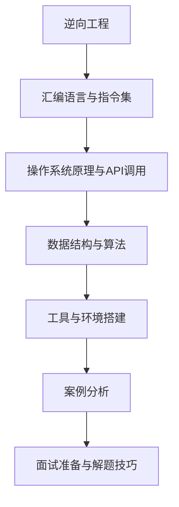
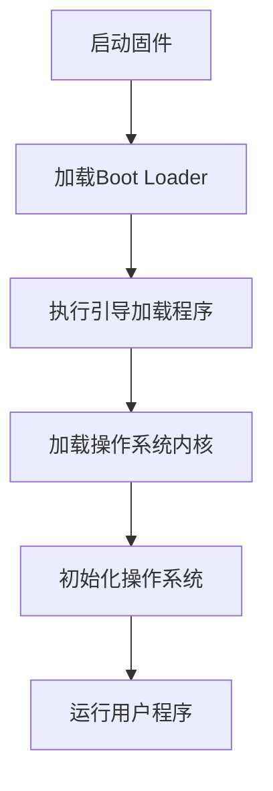
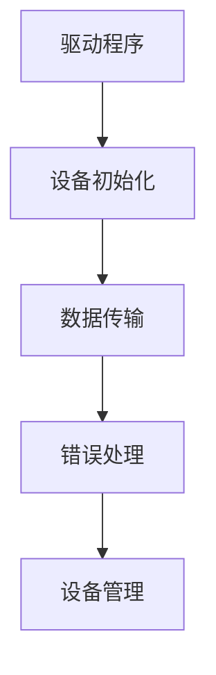
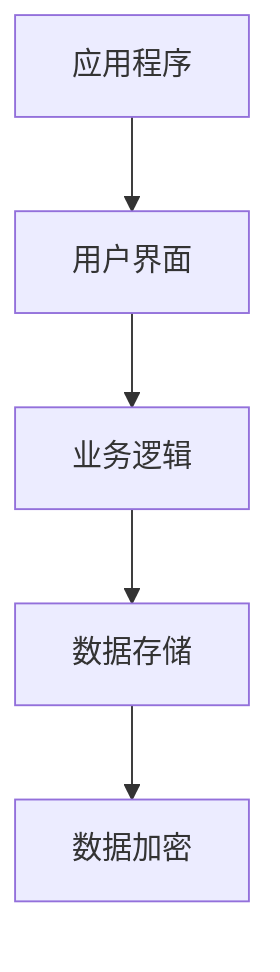
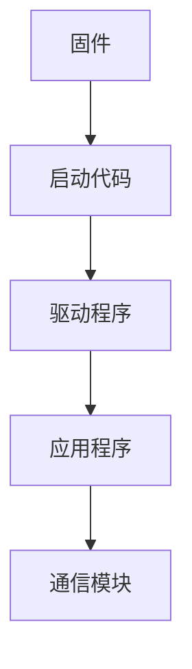

                 

### 《360公司2024物联网安全固件校招逆向工程面试题解析》

#### 关键词：逆向工程、物联网安全、固件、面试题解析、360公司

> 摘要：本文将深入探讨逆向工程在物联网安全固件领域中的应用，并针对360公司2024年物联网安全固件校招中的逆向工程面试题进行详细解析。通过系统地介绍逆向工程的基础知识、工具与环境搭建、核心原理，以及实战案例，本文旨在帮助读者更好地理解和准备物联网安全固件逆向工程的面试，提升专业技能。

---

#### 目录大纲

### 第一部分：逆向工程基础与工具

#### 第1章：逆向工程概述
- 1.1 逆向工程的概念与重要性
- 1.2 逆向工程的分类
- 1.3 逆向工程在物联网安全固件中的应用

#### 第2章：逆向工程工具与环境搭建
- 2.1 IDA Pro入门与实战
- 2.2 Ghidra的使用方法
- 2.3 OllyDbg调试技巧
- 2.4 Python脚本在逆向工程中的应用

#### 第3章：逆向工程核心原理
- 3.1 汇编语言与指令集
- 3.2 操作系统原理与API调用
- 3.3 数据结构与算法在逆向工程中的应用
- 3.4 Mermaid流程图展示逆向工程原理

### 第二部分：物联网安全固件逆向工程实战

#### 第4章：逆向工程案例解析
- 4.1 系统启动过程逆向分析
- 4.2 驱动程序逆向分析
- 4.3 应用程序逆向分析
- 4.4 嵌入式设备固件逆向分析

#### 第5章：逆向工程工具配置与优化
- 5.1 IDA Pro高级功能与优化
- 5.2 Ghidra高级功能与优化
- 5.3 OllyDbg高级调试技巧
- 5.4 Python脚本在逆向工程中的优化

#### 第6章：逆向工程在物联网安全固件中的应用场景
- 6.1 针对固件的安全性分析
- 6.2 针对固件的漏洞挖掘
- 6.3 针对固件的防护措施

### 第三部分：逆向工程面试准备与解题技巧

#### 第7章：逆向工程面试准备
- 7.1 面试常见问题与解答
- 7.2 面试准备策略与建议
- 7.3 逆向工程实践项目展示

#### 第8章：逆向工程面试题解析
- 8.1 基础概念与原理题目
- 8.2 实战题目与案例分析
- 8.3 面试技巧与解题方法

### 附录

#### 附录A：逆向工程资源汇总
- A.1 主流逆向工程工具资源
- A.2 物联网安全固件逆向工程参考资料
- A.3 逆向工程学习指南与建议

#### 附录B：逆向工程面试题集
- B.1 常见面试题及答案解析
- B.2 复杂案例分析及解题思路
- B.3 面试实战模拟与解析

---

### 第一部分：逆向工程基础与工具

#### 第1章：逆向工程概述

##### 1.1 逆向工程的概念与重要性

逆向工程（Reverse Engineering）是指通过分析已有的程序、系统或设备，理解其工作原理和内部结构，并提取出相关的知识和技术的过程。在计算机科学领域，逆向工程主要应用于软件、固件和硬件的分析和漏洞挖掘。

逆向工程的重要性体现在以下几个方面：

1. **漏洞挖掘与修复**：逆向工程可以帮助安全研究员发现软件或固件中的安全漏洞，从而进行针对性的修复。
2. **知识产权保护**：企业可以通过逆向工程保护自己的知识产权，防止竞争对手通过反向工程获取商业秘密。
3. **兼容性与整合**：逆向工程有助于开发者理解第三方软件或固件的工作机制，实现与现有系统的兼容和整合。

##### 1.2 逆向工程的分类

逆向工程可以分为以下几种类型：

1. **软件逆向工程**：主要针对应用程序、驱动程序和操作系统等软件进行分析和破解。
2. **固件逆向工程**：针对嵌入式设备的固件进行逆向分析，常用于物联网设备的安全研究。
3. **硬件逆向工程**：分析硬件设备的工作原理，通常用于破解硬件加密和解密算法。

##### 1.3 逆向工程在物联网安全固件中的应用

在物联网安全领域，固件逆向工程具有特别重要的意义。随着物联网设备数量的激增，固件的安全问题愈发突出。逆向工程可以帮助研究人员：

1. **发现安全漏洞**：通过逆向分析，找出固件中的潜在安全漏洞，如缓冲区溢出、权限提升等。
2. **评估固件安全性**：分析固件的安全防护机制，评估其安全性。
3. **改进固件设计**：通过逆向工程，了解固件的内部结构和实现方式，为固件设计的改进提供参考。

下一章，我们将详细介绍逆向工程常用的工具与环境搭建。

---

### 第一部分：逆向工程基础与工具

#### 第2章：逆向工程工具与环境搭建

##### 2.1 IDA Pro入门与实战

IDA Pro（Interactive Disassembler Pro）是一款功能强大的逆向工程工具，广泛用于软件和固件分析。下面是IDA Pro的入门与实战步骤：

1. **安装与配置**：
   - 下载并安装IDA Pro。
   - 根据需要安装插件，如Hex-Rays decompiler。

2. **打开文件**：
   - 打开一个可执行文件或固件镜像。
   - 选择“File” > “Open” > “Executable”来打开文件。

3. **分析模块**：
   - 使用IDA Pro的“Analysis”菜单进行模块分析。
   - 选择合适的分析选项，如静态分析和动态分析。

4. **查看反汇编代码**：
   - 在IDA Pro的左侧树状视图中查看函数和模块结构。
   - 在右侧代码视图中查看反汇编代码。

5. **功能调试**：
   - 使用IDA Pro的调试器进行功能调试。
   - 设置断点、跟踪代码执行路径、查看内存和寄存器状态。

##### 2.2 Ghidra的使用方法

Ghidra是一个开源的逆向工程平台，提供了丰富的功能，适合进行固件和软件的逆向分析。以下是Ghidra的基本使用方法：

1. **安装与配置**：
   - 下载并安装Ghidra。
   - 配置Java环境，确保Ghidra可以正常运行。

2. **打开项目**：
   - 打开一个Ghidra项目或创建新项目。
   - 使用“File” > “Open”来打开固件文件或可执行文件。

3. **反汇编与浏览**：
   - 在“Disassembly”视图中查看反汇编代码。
   - 使用“Function”菜单创建和编辑函数。

4. **代码编辑与调试**：
   - 在“Code Browser”视图中浏览代码结构。
   - 使用调试器设置断点、跟踪执行路径。

5. **脚本编写**：
   - Ghidra支持Python脚本编写，用于自动化分析和修改代码。

##### 2.3 OllyDbg调试技巧

OllyDbg是一款经典的Windows调试器，适用于软件和固件调试。以下是OllyDbg的一些调试技巧：

1. **安装与配置**：
   - 下载并安装OllyDbg。
   - 根据需要安装插件，如ODHelper。

2. **打开程序**：
   - 使用“File” > “Open”来打开可执行文件或固件镜像。

3. **设置断点**：
   - 在代码中设置断点以跟踪程序的执行流程。
   - 使用“Debug” > “Breakpoint”进行断点设置。

4. **跟踪执行**：
   - 单步执行代码，查看寄存器和内存状态。
   - 使用“Trace”菜单进行代码跟踪。

5. **内存分析**：
   - 分析内存中的数据结构，查找潜在的安全漏洞。

##### 2.4 Python脚本在逆向工程中的应用

Python脚本在逆向工程中有着广泛的应用，可用于自动化分析和代码修改。以下是Python脚本在逆向工程中的应用场景：

1. **脚本编写**：
   - 使用Python编写脚本，实现特定的逆向工程任务。
   - 示例：使用`pydis`库进行反汇编，使用`pefile`库解析PE文件。

2. **自动化分析**：
   - 脚本可用于自动化分析固件中的函数、模块和API调用。
   - 示例：使用`Ghidra` API编写脚本，自动化提取固件中的函数列表。

3. **代码修改**：
   - 脚本可用于修改固件中的代码，如修复安全漏洞或添加调试信息。
   - 示例：使用`Fiddler`脚本修改HTTP请求头，进行网络通信调试。

下一章，我们将深入探讨逆向工程的核心原理。

---

### 第一部分：逆向工程基础与工具

#### 第3章：逆向工程核心原理

##### 3.1 汇编语言与指令集

汇编语言是计算机程序设计的一种低级语言，直接与计算机的硬件指令集相对应。逆向工程中，理解汇编语言和指令集至关重要。

1. **汇编语言概述**：
   - 汇编语言是一种符号化的机器语言，使用助记符表示指令。
   - 汇编语言与机器语言的对应关系是固定的，不同的CPU有不同的指令集。

2. **指令集分类**：
   - 数据传输指令：如MOV、LOAD、STORE等。
   - 算术指令：如ADD、SUB、MUL、DIV等。
   - 控制流指令：如JMP、CALL、RET等。
   - 输入/输出指令：如IN、OUT等。

3. **指令集在逆向工程中的应用**：
   - 分析汇编代码，理解程序的执行逻辑。
   - 查找潜在的漏洞，如缓冲区溢出、格式化字符串漏洞等。
   - 调试程序，设置断点、单步执行、查看寄存器和内存状态。

##### 3.2 操作系统原理与API调用

操作系统是计算机系统的基础软件，管理计算机硬件资源和提供应用程序运行环境。逆向工程中，理解操作系统原理和API调用机制至关重要。

1. **操作系统概述**：
   - 操作系统负责管理计算机的内存、处理器、输入输出设备等硬件资源。
   - 操作系统提供系统调用接口，供应用程序使用。

2. **API调用机制**：
   - 系统调用：应用程序通过中断指令调用操作系统提供的功能。
   - 运行时库：应用程序使用运行时库函数，通过动态链接器调用操作系统API。

3. **操作系统原理在逆向工程中的应用**：
   - 分析应用程序的系统调用，理解其与操作系统的交互。
   - 查找操作系统漏洞，如内核漏洞、系统调用漏洞等。
   - 调试操作系统，设置断点、跟踪系统调用执行路径。

##### 3.3 数据结构与算法在逆向工程中的应用

数据结构与算法是计算机科学的基础，逆向工程中同样需要应用这些知识。

1. **数据结构概述**：
   - 数据结构是组织和管理数据的方式，如数组、链表、树、图等。
   - 数据结构的选择直接影响程序的执行效率和存储空间。

2. **算法概述**：
   - 算法是解决问题的步骤和方法，如排序、查找、图算法等。
   - 算法的复杂度影响程序的执行时间。

3. **数据结构与算法在逆向工程中的应用**：
   - 分析程序中的数据结构，如堆、栈、哈希表等。
   - 分析程序的算法实现，如加密算法、排序算法等。
   - 利用数据结构与算法，优化逆向工程的效率和准确性。

##### 3.4 Mermaid流程图展示逆向工程原理

使用Mermaid，可以绘制逆向工程的流程图，展示其核心原理。

下一章，我们将通过逆向工程案例，深入探讨物联网安全固件的分析方法。

---

### 第二部分：物联网安全固件逆向工程实战

#### 第4章：逆向工程案例解析

##### 4.1 系统启动过程逆向分析

系统启动过程逆向分析是固件逆向工程的重要环节，它可以帮助我们理解设备从启动到运行的全过程。

1. **启动过程概述**：
   - 启动过程包括固件加载、引导加载程序（Boot Loader）、操作系统内核加载等阶段。
   - 逆向分析启动过程有助于发现潜在的安全漏洞。

2. **分析步骤**：
   - 使用逆向工程工具（如IDA Pro、Ghidra）打开固件镜像。
   - 分析引导加载程序，查找引导加载过程的逻辑。
   - 逆向内核加载过程，分析操作系统内核的初始化代码。
   - 分析启动脚本或配置文件，了解系统启动参数和选项。

3. **案例解析**：
   - 以某物联网设备为例，分析其固件启动过程。
   - 使用Mermaid绘制启动流程图，展示关键步骤。

##### 4.2 驱动程序逆向分析

驱动程序是操作系统与硬件设备之间的接口，负责设备的管理和通信。逆向分析驱动程序有助于理解设备的工作原理和发现潜在的安全漏洞。

1. **驱动程序概述**：
   - 驱动程序包括设备初始化、数据传输、错误处理等模块。
   - 驱动程序通常使用操作系统提供的API进行通信。

2. **分析步骤**：
   - 使用逆向工程工具打开驱动程序文件。
   - 分析驱动程序的初始化代码，查找设备管理逻辑。
   - 分析数据传输模块，理解数据传输过程。
   - 分析错误处理模块，查找异常处理逻辑。

3. **案例解析**：
   - 以某嵌入式设备的驱动程序为例，进行逆向分析。
   - 使用Mermaid绘制驱动程序架构图，展示关键模块和流程。

##### 4.3 应用程序逆向分析

应用程序是物联网设备上运行的软件，负责实现设备的功能和业务逻辑。逆向分析应用程序有助于理解设备的工作原理和发现潜在的安全漏洞。

1. **应用程序概述**：
   - 应用程序包括用户界面、业务逻辑、数据存储等模块。
   - 应用程序通常使用操作系统提供的API进行通信。

2. **分析步骤**：
   - 使用逆向工程工具打开应用程序的可执行文件。
   - 分析用户界面模块，理解用户交互逻辑。
   - 分析业务逻辑模块，理解业务流程和数据处理。
   - 分析数据存储模块，理解数据存储和加密机制。

3. **案例解析**：
   - 以某物联网设备的应用程序为例，进行逆向分析。
   - 使用Mermaid绘制应用程序架构图，展示关键模块和流程。

##### 4.4 嵌入式设备固件逆向分析

嵌入式设备固件是物联网设备的核心组成部分，负责设备的基本功能和通信。逆向分析嵌入式设备固件有助于理解设备的工作原理和发现潜在的安全漏洞。

1. **固件概述**：
   - 固件包括启动代码、驱动程序、应用程序等模块。
   - 固件通常使用嵌入式操作系统进行管理和调度。

2. **分析步骤**：
   - 使用逆向工程工具打开固件镜像。
   - 分析启动代码，理解设备启动过程。
   - 分析驱动程序，理解设备与操作系统的交互。
   - 分析应用程序，理解设备的功能和业务逻辑。

3. **案例解析**：
   - 以某嵌入式设备的固件为例，进行逆向分析。
   - 使用Mermaid绘制固件架构图，展示关键模块和流程。

通过以上逆向工程案例的解析，我们可以看到逆向工程在物联网安全固件分析中的应用。下一章，我们将探讨逆向工程工具的配置与优化。

---

### 第二部分：物联网安全固件逆向工程实战

#### 第5章：逆向工程工具配置与优化

##### 5.1 IDA Pro高级功能与优化

IDA Pro是一款功能强大的逆向工程工具，提供了丰富的功能来帮助分析者和开发者深入挖掘固件和软件的内部结构。以下是一些IDA Pro的高级功能与优化技巧：

1. **IDA Pro高级功能**：
   - **函数识别**：IDA Pro可以使用启发式算法自动识别函数，并为其分配名称。
   - **数据结构识别**：IDA Pro可以识别数据结构，如数组、结构体等，并提供图形化展示。
   - **插件开发**：IDA Pro支持插件开发，可以扩展其功能，实现特定的分析任务。

2. **优化技巧**：
   - **自动分析优化**：调整IDA Pro的分析选项，如启发式算法的强度，以优化分析结果。
   - **代码重构**：通过重构代码，提高可读性和分析效率。
   - **缓存管理**：合理使用IDA Pro的缓存功能，减少重复分析时间。

##### 5.2 Ghidra高级功能与优化

Ghidra是一个开源的逆向工程平台，具有高度的可定制性和扩展性。以下是一些Ghidra的高级功能与优化技巧：

1. **Ghidra高级功能**：
   - **脚本编写**：Ghidra支持Python脚本编写，可以自动化复杂的分析任务。
   - **插件安装**：Ghidra允许用户安装插件，扩展其功能，如反汇编器、调试器等。
   - **数据结构分析**：Ghidra提供了强大的数据结构分析工具，可以帮助用户识别和理解复杂的内存结构。

2. **优化技巧**：
   - **插件配置**：合理配置Ghidra的插件，以优化分析过程。
   - **分析策略**：根据固件的特点，选择合适的数据结构分析和反汇编策略。
   - **资源管理**：合理管理Ghidra的资源，如内存和文件操作，以优化性能。

##### 5.3 OllyDbg高级调试技巧

OllyDbg是一款经典的可执行文件调试器，适用于各种Windows程序和固件的调试。以下是一些OllyDbg的高级调试技巧：

1. **高级调试技巧**：
   - **内存映射**：使用OllyDbg查看内存映射，了解程序的内存布局。
   - **断点设置**：设置条件断点、硬件断点等，以精确控制程序执行流程。
   - **数据跟踪**：跟踪程序的输入输出数据，分析数据流动和变化。

2. **优化技巧**：
   - **调试策略**：根据调试目标，制定合理的调试策略，如单步执行、条件断点等。
   - **调试优化**：优化调试过程，减少不必要的调试操作，提高效率。
   - **内存管理**：合理管理内存资源，如释放不再使用的内存，以减少调试过程中出现的内存泄漏。

##### 5.4 Python脚本在逆向工程中的优化

Python脚本在逆向工程中有着广泛的应用，通过编写高效的脚本，可以自动化复杂的分析任务，提高逆向工程的效率。以下是一些Python脚本优化的技巧：

1. **优化技巧**：
   - **代码优化**：编写高效的Python代码，如使用列表推导式、循环优化等。
   - **内存管理**：合理使用内存，避免内存泄漏，如使用`with`语句管理文件和对象。
   - **并发处理**：使用多线程或多进程处理，提高脚本的处理速度。

2. **实战案例**：
   - **反汇编脚本优化**：使用`pydis`库编写反汇编脚本，优化代码结构，提高反汇编速度。
   - **数据提取脚本优化**：使用`pandas`库处理大量数据，优化数据处理和分析速度。

通过以上逆向工程工具的配置与优化，我们可以显著提高逆向工程的效率和准确性。下一章，我们将探讨逆向工程在物联网安全固件中的应用场景。

---

### 第二部分：物联网安全固件逆向工程实战

#### 第6章：逆向工程在物联网安全固件中的应用场景

##### 6.1 针对固件的安全性分析

逆向工程在物联网安全固件中的应用，首先体现在对固件的安全性分析上。通过逆向工程，研究人员可以深入理解固件的内部实现，发现潜在的安全漏洞，从而为固件的安全加固提供依据。

1. **安全漏洞分析**：
   - **缓冲区溢出**：逆向分析固件代码，查找缓冲区溢出漏洞，如通过分析字符串处理函数的边界条件。
   - **权限提升**：分析固件中的权限管理机制，查找权限提升漏洞，如通过分析访问控制代码。
   - **信息泄露**：分析固件中的敏感数据处理，查找信息泄露漏洞，如通过分析日志记录和通信协议。

2. **案例分析**：
   - **案例一**：分析某嵌入式设备的固件，发现其存在缓冲区溢出漏洞，导致攻击者可以执行任意代码。
   - **案例二**：分析某物联网设备的固件，发现其存在权限提升漏洞，攻击者可以通过特定的操作获取root权限。

##### 6.2 针对固件的漏洞挖掘

漏洞挖掘是逆向工程在物联网安全固件中的重要应用之一。通过逆向工程工具和分析技术，研究人员可以自动或半自动地发现固件中的安全漏洞。

1. **漏洞挖掘方法**：
   - **静态分析**：通过分析固件代码，查找潜在的安全漏洞，如使用自动化的漏洞检测工具。
   - **动态分析**：通过运行固件，监控其执行过程，查找运行时漏洞，如使用调试器和分析工具。
   - **模糊测试**：通过生成大量的输入数据，测试固件的稳定性和安全性，如使用模糊测试工具。

2. **案例分析**：
   - **案例一**：使用Ghidra和模糊测试工具，挖掘某物联网设备的固件中的缓冲区溢出漏洞。
   - **案例二**：使用OllyDbg和静态分析技术，挖掘某嵌入式设备的固件中的权限提升漏洞。

##### 6.3 针对固件的防护措施

逆向工程不仅用于漏洞挖掘，还可以用于评估固件的安全防护措施。通过逆向工程，研究人员可以分析固件的防护机制，评估其有效性和可靠性，并提出改进建议。

1. **防护措施分析**：
   - **加密算法分析**：逆向分析固件中的加密算法，评估其安全性，如通过分析AES加密的实现。
   - **访问控制分析**：逆向分析固件中的访问控制机制，评估其有效性，如通过分析权限管理代码。
   - **安全协议分析**：逆向分析固件中的通信协议，评估其安全性，如通过分析SSL/TLS实现。

2. **案例分析**：
   - **案例一**：分析某物联网设备的固件，评估其AES加密算法的安全性，并提出改进建议。
   - **案例二**：分析某嵌入式设备的固件，评估其权限管理机制的有效性，并提出改进措施。

通过以上逆向工程在物联网安全固件中的应用场景，我们可以看到逆向工程在提高物联网设备安全性方面的重要作用。下一章，我们将探讨逆向工程面试的准备与解题技巧。

---

### 第三部分：逆向工程面试准备与解题技巧

#### 第7章：逆向工程面试准备

##### 7.1 面试常见问题与解答

在逆向工程面试中，常见的问题包括对逆向工程概念的理解、工具的使用、案例分析等。以下是一些面试常见问题及其解答：

1. **什么是逆向工程？**
   - 逆向工程是指通过分析已有的程序、系统或设备，理解其工作原理和内部结构，并提取出相关的知识和技术的过程。在计算机科学领域，逆向工程主要应用于软件、固件和硬件的分析和漏洞挖掘。

2. **逆向工程有哪些分类？**
   - 逆向工程可以分为软件逆向工程、固件逆向工程和硬件逆向工程。软件逆向工程主要针对应用程序、驱动程序和操作系统等软件进行分析和破解；固件逆向工程针对嵌入式设备的固件进行逆向分析；硬件逆向工程分析硬件设备的工作原理。

3. **逆向工程在物联网安全中的作用是什么？**
   - 逆向工程在物联网安全中的作用主要体现在以下几个方面：发现固件中的安全漏洞、评估固件的安全性、改进固件设计，提高其安全性。

4. **常见的逆向工程工具有哪些？**
   - 常见的逆向工程工具包括IDA Pro、Ghidra、OllyDbg等。IDA Pro是一款功能强大的逆向工程工具，适用于软件和固件分析；Ghidra是一个开源的逆向工程平台，支持多种固件和软件分析；OllyDbg是一款经典的Windows调试器，适用于软件和固件调试。

##### 7.2 面试准备策略与建议

为了更好地准备逆向工程面试，以下是一些建议：

1. **熟悉逆向工程基础**：掌握逆向工程的基本概念、原理和工具使用，了解汇编语言、操作系统原理、数据结构与算法等相关知识。

2. **实战经验积累**：通过实际案例进行逆向工程分析，提高逆向工程能力和经验。可以选择一些开源固件或软件进行逆向分析，如Linux内核、Web浏览器等。

3. **案例分析**：准备一些逆向工程案例分析，包括问题背景、分析过程和解决方法。案例分析可以帮助面试官了解你的逆向工程能力和思路。

4. **面试技巧提升**：参加模拟面试，提高面试技巧。在面试中，注意表达清晰、逻辑严密，展示你的逆向工程思路和方法。

##### 7.3 逆向工程实践项目展示

在面试中，展示逆向工程实践项目可以大大提高你的竞争力。以下是一些建议：

1. **项目选择**：选择具有代表性的逆向工程实践项目，如针对某个固件的安全漏洞挖掘、逆向分析某嵌入式设备的启动过程等。

2. **项目准备**：详细准备项目的分析报告，包括问题背景、分析过程、使用的工具和技术、发现的漏洞和解决方法。

3. **项目展示**：在面试中，清晰地展示项目的过程和结果，强调你在项目中的角色和贡献。可以使用PPT、报告等形式展示项目细节。

通过以上逆向工程面试准备策略和建议，你可以更好地应对逆向工程面试，展示你的专业能力和实践经验。

---

### 第三部分：逆向工程面试准备与解题技巧

#### 第8章：逆向工程面试题解析

##### 8.1 基础概念与原理题目

这类题目主要考察应聘者对逆向工程基础概念和原理的理解。以下是一些典型的基础概念与原理题目：

1. **什么是逆向工程？**
   - 逆向工程是指通过分析已有的程序、系统或设备，理解其工作原理和内部结构，并提取出相关的知识和技术的过程。在计算机科学领域，逆向工程主要应用于软件、固件和硬件的分析和漏洞挖掘。

2. **逆向工程有哪些分类？**
   - 逆向工程可以分为软件逆向工程、固件逆向工程和硬件逆向工程。软件逆向工程主要针对应用程序、驱动程序和操作系统等软件进行分析和破解；固件逆向工程针对嵌入式设备的固件进行逆向分析；硬件逆向工程分析硬件设备的工作原理。

3. **逆向工程在物联网安全中的作用是什么？**
   - 逆向工程在物联网安全中的作用主要体现在以下几个方面：发现固件中的安全漏洞、评估固件的安全性、改进固件设计，提高其安全性。

4. **常见的逆向工程工具有哪些？**
   - 常见的逆向工程工具包括IDA Pro、Ghidra、OllyDbg等。IDA Pro是一款功能强大的逆向工程工具，适用于软件和固件分析；Ghidra是一个开源的逆向工程平台，支持多种固件和软件分析；OllyDbg是一款经典的Windows调试器，适用于软件和固件调试。

##### 8.2 实战题目与案例分析

这类题目主要考察应聘者解决实际问题的能力。以下是一些典型的实战题目与案例分析：

1. **分析某个固件的启动过程，并绘制流程图。**
   - 解题思路：使用逆向工程工具（如IDA Pro、Ghidra）打开固件镜像，分析启动代码和引导加载程序，识别关键函数和模块，绘制启动流程图。

2. **逆向分析某个驱动程序，找出其可能存在的安全漏洞。**
   - 解题思路：使用逆向工程工具（如IDA Pro、Ghidra）打开驱动程序文件，分析驱动程序的初始化代码、数据传输模块和错误处理模块，查找缓冲区溢出、权限提升等潜在的安全漏洞。

3. **通过模糊测试方法，挖掘某个固件中的缓冲区溢出漏洞。**
   - 解题思路：使用模糊测试工具（如AFour、Hydra）对固件进行模糊测试，生成大量的输入数据，分析测试结果，查找缓冲区溢出漏洞。

##### 8.3 面试技巧与解题方法

在逆向工程面试中，以下是一些面试技巧和解题方法，有助于应聘者更好地应对面试：

1. **面试前准备**：
   - 充分了解面试公司的背景和业务领域，准备针对性的问题和案例。
   - 复习逆向工程的基础知识和常用工具的使用方法。

2. **面试中表达**：
   - 表达清晰、逻辑严密，展示逆向工程思路和方法。
   - 针对问题，给出具体的解决方案，并解释其原理和实现过程。

3. **面试后总结**：
   - 面试结束后，总结面试中的经验和教训，反思自己的不足之处。
   - 根据面试反馈，调整自己的面试策略和准备方向。

通过以上逆向工程面试题解析和技巧，应聘者可以更好地准备逆向工程面试，展示自己的专业能力和实践经验。

---

### 附录

#### 附录A：逆向工程资源汇总

##### A.1 主流逆向工程工具资源

1. **IDA Pro**：https://www.idapro.com/
2. **Ghidra**：https://ghidra-sre.org/
3. **OllyDbg**：https://www.ollydbg.de/

##### A.2 物联网安全固件逆向工程参考资料

1. **《逆向工程实战》**：https://book.douban.com/subject/26828294/
2. **《嵌入式设备固件逆向工程》**：https://book.douban.com/subject/31281940/
3. **《物联网安全实战》**：https://book.douban.com/subject/30254265/

##### A.3 逆向工程学习指南与建议

1. **逆向工程教程**：https://github.com/coser-tju/reverse-engineering-tutorial
2. **逆向工程实践项目**：https://github.com/reverse-engineering-practice
3. **逆向工程学习社区**：https://www.reverse-engineering.io/

#### 附录B：逆向工程面试题集

##### B.1 常见面试题及答案解析

1. **什么是逆向工程？**
   - 逆向工程是指通过分析已有的程序、系统或设备，理解其工作原理和内部结构，并提取出相关的知识和技术的过程。在计算机科学领域，逆向工程主要应用于软件、固件和硬件的分析和漏洞挖掘。

2. **逆向工程有哪些分类？**
   - 逆向工程可以分为软件逆向工程、固件逆向工程和硬件逆向工程。软件逆向工程主要针对应用程序、驱动程序和操作系统等软件进行分析和破解；固件逆向工程针对嵌入式设备的固件进行逆向分析；硬件逆向工程分析硬件设备的工作原理。

3. **逆向工程在物联网安全中的作用是什么？**
   - 逆向工程在物联网安全中的作用主要体现在以下几个方面：发现固件中的安全漏洞、评估固件的安全性、改进固件设计，提高其安全性。

4. **常见的逆向工程工具有哪些？**
   - 常见的逆向工程工具包括IDA Pro、Ghidra、OllyDbg等。IDA Pro是一款功能强大的逆向工程工具，适用于软件和固件分析；Ghidra是一个开源的逆向工程平台，支持多种固件和软件分析；OllyDbg是一款经典的Windows调试器，适用于软件和固件调试。

##### B.2 复杂案例分析及解题思路

1. **分析某个固件的启动过程，并绘制流程图。**
   - **解题思路**：使用逆向工程工具（如IDA Pro、Ghidra）打开固件镜像，分析启动代码和引导加载程序，识别关键函数和模块，绘制启动流程图。

2. **逆向分析某个驱动程序，找出其可能存在的安全漏洞。**
   - **解题思路**：使用逆向工程工具（如IDA Pro、Ghidra）打开驱动程序文件，分析驱动程序的初始化代码、数据传输模块和错误处理模块，查找缓冲区溢出、权限提升等潜在的安全漏洞。

3. **通过模糊测试方法，挖掘某个固件中的缓冲区溢出漏洞。**
   - **解题思路**：使用模糊测试工具（如AFour、Hydra）对固件进行模糊测试，生成大量的输入数据，分析测试结果，查找缓冲区溢出漏洞。

##### B.3 面试实战模拟与解析

1. **模拟面试**：准备一些逆向工程面试题目，进行模拟面试，提高面试技巧。
2. **面试解析**：针对每个面试题目，给出详细的解题思路和答案，帮助应聘者更好地准备面试。

通过以上逆向工程资源汇总和面试题集，可以帮助应聘者更好地准备逆向工程面试，提升面试成功率。

---

### 作者信息

- 作者：AI天才研究院/AI Genius Institute & 禅与计算机程序设计艺术 /Zen And The Art of Computer Programming

