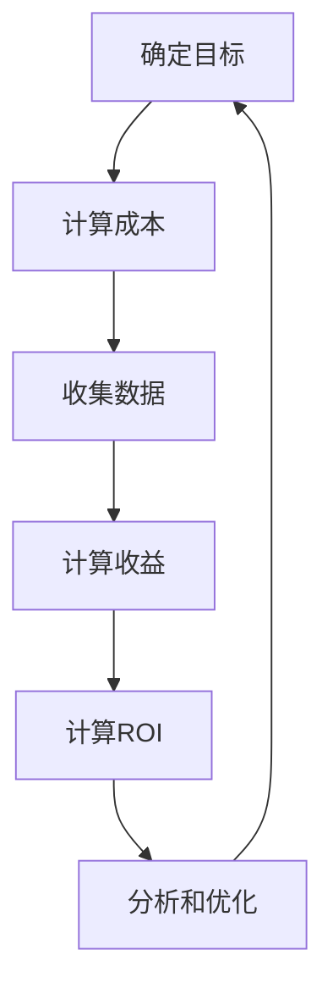

                 

# 《创业公司的内容营销ROI计算方法》

## 关键词

内容营销、ROI计算、创业公司、策略、案例分析、数据分析、算法、数学模型

## 摘要

本文将围绕创业公司的内容营销ROI计算方法进行探讨。通过详细阐述内容营销的基础概念、ROI的基本概念和计算方法，以及创业公司在内容营销中的实际案例，本文旨在帮助创业公司优化内容营销策略，提高ROI，实现可持续发展。文章分为四个部分：内容营销概述、ROI计算方法、实战案例和结论与展望。通过实际案例和数据分析，本文提供了详细的计算步骤和核心算法原理讲解，为创业公司在内容营销中提供了实用的指导。

## 《创业公司的内容营销ROI计算方法》目录大纲

### 第一部分：内容营销概述

#### 第1章：内容营销的基础概念

1.1 内容营销的定义和意义

1.2 内容营销的目标与策略

1.3 内容营销与传统营销的区别

#### 第2章：内容营销的流程与方法

2.1 内容营销的规划与目标设定

2.2 内容创作与优化

2.3 内容推广与分发

### 第二部分：ROI计算方法

#### 第3章：ROI的基本概念

3.1 ROI的定义

3.2 ROI的计算公式与解释

3.3 ROI的重要性

#### 第4章：内容营销ROI计算方法

4.1 计算ROI的步骤

4.2 ROI计算的关键指标

4.3 ROI计算的案例分析

#### 第5章：提高内容营销ROI的策略

5.1 内容优化策略

5.2 推广策略

5.3 数据分析与应用

### 第三部分：实战案例

#### 第6章：创业公司的内容营销实践

6.1 创业公司的特点与挑战

6.2 创业公司的内容营销案例

6.3 创业公司的内容营销ROI计算

#### 第7章：内容营销ROI计算工具与技巧

7.1 常用的内容营销ROI计算工具

7.2 数据收集与处理技巧

7.3 ROI计算的实际应用

### 第四部分：结论与展望

#### 第8章：内容营销ROI计算的总结

8.1 ROI计算方法的应用前景

8.2 创业公司在内容营销中的机遇与挑战

8.3 未来内容营销的发展趋势

### 附录

附录A：常见问题与解答

附录B：参考文献

### 第9章：内容营销ROI计算方法架构

9.1 内容营销ROI计算方法的原理

9.1.1 内容营销ROI计算的基本步骤

9.1.2 关键指标的选取与计算方法

9.2 内容营销ROI计算方法的流程图

### 第10章：核心算法原理讲解

10.1 数据收集与处理算法

10.2 ROI计算算法

### 第11章：数学模型和数学公式讲解

11.1 ROI的计算模型

11.2 举例说明

### 第12章：项目实战

12.1 内容营销ROI计算工具的搭建

12.2 源代码详细实现与解读

## 第一部分：内容营销概述

### 第1章：内容营销的基础概念

#### 1.1 内容营销的定义和意义

内容营销是一种通过创造和分发有价值的内容来吸引潜在客户、建立品牌知名度、提高用户忠诚度的营销策略。与传统营销相比，内容营销注重于与目标受众建立长期、信任和互动的关系，而不仅仅是短期的销售。

内容营销的定义可以概括为以下几点：

1. 创造有价值的内容：内容应满足目标受众的需求，提供有价值的信息、知识和娱乐。

2. 分发和传播内容：通过多种渠道（如社交媒体、博客、电子邮件等）将内容传播给目标受众。

3. 建立品牌知名度：通过持续的内容创作和分发，提高品牌在受众心中的认知度和美誉度。

4. 促进用户转化：通过优质内容吸引潜在客户，引导他们了解产品或服务，最终实现销售转化。

内容营销的意义主要体现在以下几个方面：

1. 提高品牌知名度：通过持续的内容创作和分发，品牌可以在目标受众中建立良好的声誉，提高品牌知名度。

2. 增强用户黏性：有价值的内容可以吸引目标受众，让他们对品牌产生兴趣，从而提高用户黏性。

3. 降低营销成本：与传统的广告和推销方式相比，内容营销的成本较低，且效果持久。

4. 提高销售转化率：优质的内容可以吸引潜在客户，引导他们了解产品或服务，从而提高销售转化率。

#### 1.2 内容营销的目标与策略

内容营销的目标多种多样，但核心目标是建立与目标受众之间的信任和互动关系。具体来说，内容营销的目标包括：

1. 提高品牌知名度：通过高质量的内容吸引更多的受众关注，提高品牌在市场中的认知度和影响力。

2. 增强用户忠诚度：通过持续的内容创作和互动，让用户对品牌产生情感依赖，提高用户忠诚度。

3. 促进销售转化：通过有价值的内容引导潜在客户了解产品或服务，提高销售转化率。

4. 增加网站流量：通过优质的内容吸引更多的访问者，提高网站流量。

为了实现上述目标，创业公司可以采用以下内容营销策略：

1. 确定目标受众：了解目标受众的需求、兴趣和行为，为他们提供有价值的内容。

2. 创作高质量的内容：注重内容的原创性、实用性、趣味性和吸引力，提高内容质量。

3. 选择合适的渠道：根据目标受众的偏好和习惯，选择合适的渠道进行内容分发。

4. 持续优化内容：根据用户反馈和数据分析，不断调整和优化内容，提高内容效果。

5. 建立互动机制：通过与用户互动，了解他们的需求和反馈，提高用户参与度。

#### 1.3 内容营销与传统营销的区别

内容营销与传统营销在目标、策略和手段上存在明显的区别：

1. 目标不同：传统营销主要关注短期销售和利润，而内容营销注重建立长期信任和互动关系。

2. 策略不同：传统营销侧重于广告和推销，而内容营销侧重于提供有价值的信息和知识。

3. 手段不同：传统营销依赖于广告和促销活动，而内容营销依赖于高质量的内容创作和分发。

4. 成本效益不同：传统营销成本较高，且效果难以持久，而内容营销成本较低，且效果可以长期积累。

总之，内容营销是一种更注重长期价值和用户关系的营销策略，与传统的广告和推销方式相比，具有更高的成本效益和可持续性。

### 第2章：内容营销的流程与方法

#### 2.1 内容营销的规划与目标设定

内容营销的规划是确保内容营销策略顺利实施的关键。以下是一个典型的内容营销规划流程：

1. 确定目标：根据公司的整体战略目标，明确内容营销的具体目标，如提高品牌知名度、增加网站流量、促进销售转化等。

2. 分析目标受众：了解目标受众的需求、兴趣和行为，为内容创作提供依据。

3. 制定内容策略：根据目标受众的特点和需求，制定合适的内容策略，包括内容类型、主题、风格等。

4. 设定关键绩效指标（KPI）：明确衡量内容营销效果的关键指标，如访问量、转化率、客户满意度等。

5. 制定内容发布计划：合理安排内容发布的时间、频率和渠道，确保内容能够及时、有效地触达目标受众。

6. 资源分配：根据内容营销的目标和策略，合理分配人力、物力和财力资源，确保内容营销计划的顺利实施。

7. 监控与调整：定期监控内容营销的效果，根据数据分析和用户反馈，及时调整内容策略和发布计划。

#### 2.2 内容创作与优化

内容创作是内容营销的核心环节，以下是一些关键步骤和技巧：

1. 确定内容主题：根据目标受众的兴趣和需求，选择具有吸引力和价值的内容主题。

2. 创作高质量的内容：注重内容的原创性、实用性、趣味性和吸引力，确保内容能够满足目标受众的需求。

3. 选择合适的格式：根据内容主题和目标受众的偏好，选择合适的格式，如文章、视频、图片、图表等。

4. 优化内容结构：合理组织内容结构，使内容易于阅读和理解，提高用户体验。

5. 确保内容可传播：为内容提供吸引人的标题、摘要和关键词，提高内容在社交媒体等渠道的传播效果。

6. 保持内容更新：定期发布新的内容，保持内容的新鲜度和相关性，吸引和留住目标受众。

7. 优化内容表现：针对不同渠道和平台，优化内容的视觉效果和加载速度，提高内容的表现效果。

#### 2.3 内容推广与分发

内容推广与分发是让内容触达目标受众的关键步骤。以下是一些推广与分发的策略：

1. 利用社交媒体：通过社交媒体平台（如微博、微信公众号、LinkedIn等）发布内容，吸引目标受众关注。

2. 合作推广：与其他品牌、媒体或意见领袖合作，共同推广内容，扩大影响力。

3. 付费推广：通过付费广告（如百度推广、谷歌广告等）将内容推送给更广泛的受众。

4. SEO优化：通过搜索引擎优化（SEO），提高内容在搜索引擎中的排名，吸引更多自然流量。

5. 邮件营销：通过邮件列表向目标受众发送内容，提高内容的到达率和阅读率。

6. 内容分享：鼓励用户在社交媒体上分享内容，提高内容的传播效果。

7. 内容聚合：将内容发布到各种内容聚合平台（如头条号、知乎专栏等），扩大内容的覆盖面。

通过以上内容营销的规划与目标设定、内容创作与优化以及内容推广与分发，创业公司可以系统地开展内容营销活动，提高品牌知名度、用户黏性和销售转化率。

## 第二部分：ROI计算方法

### 第3章：ROI的基本概念

#### 3.1 ROI的定义

ROI（Return on Investment）即投资回报率，是衡量投资效果的一个重要指标。它反映了投资所带来的收益与投资成本之间的比率。ROI的计算公式如下：

\[ ROI = \frac{收益 - 成本}{成本} \]

其中，收益指的是投资所产生的总收入，成本则是投资的总支出。

#### 3.2 ROI的计算公式与解释

ROI的计算公式可以进一步分解为以下两部分：

1. **总收益**：包括所有投资所带来的一切收入，例如销售收入、广告收益、赞助费等。

2. **总成本**：包括所有投资产生的成本，例如生产成本、广告费用、人力成本、运营成本等。

公式中的分母“成本”是指投资的总支出，而分子“收益 - 成本”则表示收益超出成本的差额。

通过计算ROI，投资者可以了解每一单位投资的回报情况，从而评估投资的效果和效率。ROI越高，意味着投资的收益能力越强，反之则表明投资效果不佳。

#### 3.3 ROI的重要性

ROI在投资决策中扮演着至关重要的角色。以下是ROI的重要性体现在以下几个方面：

1. **投资评估**：ROI是评估投资效果的重要指标，通过ROI可以直观地了解投资带来的收益与成本之间的关系。

2. **决策参考**：投资者可以利用ROI来比较不同投资方案的优劣，选择最具潜力和效益的投资项目。

3. **资源分配**：企业可以根据ROI来调整资源分配策略，将更多的资金投入到ROI较高的项目中，提高整体投资效益。

4. **风险控制**：通过分析ROI的变化趋势，投资者可以及时调整投资策略，降低投资风险。

5. **业绩考核**：ROI可以作为企业管理层和员工业绩考核的依据，激励团队努力提升投资效果。

总之，ROI是衡量投资效果的关键指标，对于投资者和企业来说都具有重要的指导意义。

### 第4章：内容营销ROI计算方法

#### 4.1 计算ROI的步骤

计算内容营销的ROI需要遵循以下步骤：

1. **确定投资成本**：首先需要明确内容营销的总成本，包括内容创作、优化、推广、数据分析等各方面的费用。

2. **计算总收益**：接着，计算内容营销所带来的总收益，包括直接收益（如销售转化带来的收入）和间接收益（如品牌提升、用户忠诚度增加等）。

3. **计算ROI**：利用上述收益和成本数据，套用ROI计算公式：

\[ ROI = \frac{总收益 - 总成本}{总成本} \]

4. **分析和调整**：根据计算出的ROI值，分析内容营销的效果，找出优化的空间，进行策略调整。

#### 4.2 ROI计算的关键指标

在计算内容营销ROI时，以下关键指标是不可或缺的：

1. **投资成本**：包括内容创作、优化、推广、数据分析等方面的费用。

2. **总收益**：包括直接收益（如销售转化带来的收入）和间接收益（如品牌提升、用户忠诚度增加等）。

3. **转化率**：内容营销带来潜在客户转化为实际购买者的比例。

4. **留存率**：用户在接触内容后继续使用产品或服务的比例。

5. **成本效益比**：每个客户获取成本与带来的收益之比。

6. **广告点击率**：内容在广告渠道上的点击率。

7. **社交媒体互动率**：用户对内容在社交媒体上的点赞、评论、分享等互动行为的比例。

通过这些关键指标，可以全面评估内容营销的效果，为优化策略提供数据支持。

#### 4.3 ROI计算的案例分析

为了更好地理解内容营销ROI的计算方法，我们来看一个实际案例。

**案例背景**：某创业公司希望通过内容营销提高产品销量，开展了一系列的博客文章写作和社交媒体推广活动。

**数据收集**：
- 内容创作费用：每月2000元
- 广告推广费用：每月3000元
- 数据分析费用：每月1000元
- 总费用：每月6000元

- 总收益：通过博客文章带来的直接销售收益为每月5000元，社交媒体推广带来的间接收益为每月1000元
- 总收益：每月6000元

**计算ROI**：
\[ ROI = \frac{总收益 - 总成本}{总成本} = \frac{6000 - 6000}{6000} = 1 \]

**分析**：
根据计算结果，该公司的内容营销ROI为1，意味着每投入1元的成本，就能获得1元的收益。这是一个良好的ROI值，表明公司的内容营销策略在短期内取得了成功。为了进一步提升效果，公司可以考虑优化内容创作和推广策略，提高转化率和收益。

### 第5章：提高内容营销ROI的策略

#### 5.1 内容优化策略

要提高内容营销ROI，首先要从内容本身入手，进行优化。以下是一些具体策略：

1. **内容质量提升**：确保内容具有高价值、原创性和准确性，以满足用户需求。

2. **内容形式多样化**：结合用户偏好，使用多种内容形式（如文章、视频、图片等），提高内容吸引力。

3. **内容个性化**：根据用户行为和兴趣，提供个性化的内容推荐，增加用户黏性。

4. **内容互动性**：设计互动式内容（如问答、投票等），增加用户参与度。

5. **内容更新频率**：保持内容更新，定期发布新内容，保持内容的新鲜度和相关性。

6. **内容SEO优化**：通过关键词优化、标题优化等手段，提高内容在搜索引擎中的排名，吸引更多流量。

#### 5.2 推广策略

推广策略是提高内容曝光度和吸引目标受众的关键。以下是一些有效策略：

1. **社交媒体推广**：利用社交媒体平台（如微博、微信公众号、Facebook等）发布内容，扩大内容传播范围。

2. **合作推广**：与其他品牌、媒体或意见领袖合作，共同推广内容，利用对方的粉丝基础提高内容曝光度。

3. **付费广告**：通过付费广告（如百度推广、谷歌广告等）将内容推送给更广泛的受众。

4. **邮件营销**：通过邮件列表向目标受众发送内容，提高内容的到达率和阅读率。

5. **内容聚合平台**：将内容发布到各种内容聚合平台（如头条号、知乎专栏等），扩大内容的覆盖面。

6. **线下活动**：通过线下活动（如讲座、展览等）宣传内容，提高品牌知名度和用户参与度。

#### 5.3 数据分析与应用

数据分析是提高内容营销ROI的重要手段。以下是一些数据分析的应用：

1. **用户行为分析**：通过分析用户在网站、社交媒体等平台的行为，了解用户需求和兴趣，优化内容策略。

2. **流量分析**：分析网站流量来源、访问量、停留时间等指标，找出流量瓶颈和优化点。

3. **转化率分析**：分析内容带来的转化情况，如销售转化率、注册转化率等，找出影响转化的因素。

4. **成本效益分析**：计算内容营销的总成本和总收益，评估投资效果，找出成本效益较高的推广渠道。

5. **A/B测试**：通过A/B测试，比较不同内容或推广策略的效果，选择最优方案。

6. **用户反馈**：收集用户对内容的反馈，了解用户需求，优化内容创作和推广策略。

通过以上策略，创业公司可以全面优化内容营销，提高ROI，实现可持续发展。

### 第三部分：实战案例

#### 第6章：创业公司的内容营销实践

#### 6.1 创业公司的特点与挑战

创业公司通常具备以下特点：

1. **资源有限**：创业公司通常在资金、人力和资源方面有限，需要在有限资源下实现最大化效益。

2. **市场定位**：创业公司往往专注于特定市场或细分领域，以满足特定用户需求。

3. **创新能力**：创业公司通常具有较强的创新能力，能够快速响应市场变化，推出新颖的产品或服务。

4. **灵活应对**：创业公司具备快速调整策略的能力，以应对市场变化和竞争压力。

然而，创业公司在内容营销中面临以下挑战：

1. **品牌知名度低**：由于市场推广力度不足，创业公司难以在短时间内建立品牌知名度。

2. **资金压力**：内容营销需要持续的资金投入，而创业公司资金有限，难以长期支持大规模营销活动。

3. **竞争激烈**：在特定市场中，创业公司面临来自大企业的激烈竞争，需要通过独特的内容策略脱颖而出。

4. **资源分散**：创业公司在资源有限的情况下，需要平衡产品开发、团队建设和内容营销等多方面工作。

#### 6.2 创业公司的内容营销案例

以下是一个创业公司的内容营销案例：

**公司背景**：某创业公司开发了一款专注于健康饮食管理应用程序，旨在帮助用户实现健康饮食目标。

**目标**：通过内容营销提高品牌知名度，增加用户注册和使用频率，从而促进产品销售。

**策略**：

1. **确定目标受众**：目标受众为对健康饮食感兴趣的年轻人，年龄在18-35岁之间。

2. **内容创作**：
   - **博客文章**：撰写关于健康饮食、营养搭配、运动等方面的原创文章，提供实用的健康知识。
   - **视频内容**：制作健康饮食相关的视频教程，展示营养搭配和烹饪技巧。
   - **图表和数据**：发布关于健康饮食的研究数据，支持文章和视频内容的可信度。

3. **内容推广**：
   - **社交媒体**：在微信公众号、微博、Instagram等平台上发布内容，与用户互动，扩大内容传播范围。
   - **合作推广**：与健康饮食领域的意见领袖合作，共同推广内容，提高内容可信度和影响力。
   - **邮件营销**：通过邮件列表向潜在用户发送内容，提高内容到达率和用户参与度。

4. **数据分析**：
   - **用户行为分析**：通过分析用户在网站和社交媒体上的行为，了解用户需求和兴趣，优化内容创作和推广策略。
   - **转化率分析**：分析内容带来的转化情况，如注册转化率、点击率等，评估内容效果。

#### 6.3 创业公司的内容营销ROI计算

**数据收集**：
- 内容创作费用：每月3000元
- 广告推广费用：每月2000元
- 数据分析费用：每月1000元
- 总费用：每月6000元

- 总收益：
  - 直接收益：通过内容营销带来的销售转化收入，每月10000元。
  - 间接收益：品牌知名度提升带来的潜在用户增长，每月5000元。
  - 总收益：每月15000元。

**计算ROI**：
\[ ROI = \frac{总收益 - 总成本}{总成本} = \frac{15000 - 6000}{6000} = 1.5 \]

**分析**：
根据计算结果，该创业公司的内容营销ROI为1.5，意味着每投入1元的成本，能获得1.5元的收益。这是一个良好的ROI值，表明公司的内容营销策略在短期内取得了成功。为了进一步优化效果，公司可以考虑以下几个方面：

1. **增加内容创作频率**：定期发布高质量内容，保持用户关注和参与度。

2. **优化推广策略**：通过分析用户行为和转化数据，优化推广渠道和策略，提高内容曝光度和转化率。

3. **加强用户互动**：通过互动式内容（如问答、投票等）增加用户参与度，提高用户留存率和品牌忠诚度。

通过以上措施，创业公司可以持续优化内容营销，提高ROI，实现可持续发展。

### 第7章：内容营销ROI计算工具与技巧

#### 7.1 常用的内容营销ROI计算工具

在计算内容营销ROI时，以下是一些常用的工具：

1. **Google Analytics**：一款功能强大的网站分析工具，可以跟踪用户行为、流量来源、转化率等关键指标，帮助计算ROI。

2. **HubSpot**：集营销、销售、客户服务于一体的软件平台，提供了丰富的ROI计算功能，适用于中小型创业公司。

3. **SEMrush**：一款专业的SEO和内容营销工具，可以分析关键词排名、流量来源、竞争对手等数据，辅助计算ROI。

4. **Mailchimp**：一款邮件营销工具，可以跟踪邮件打开率、点击率等关键指标，有助于计算内容营销的ROI。

5. **Google AdWords**：一款广告投放平台，可以监控广告效果，通过广告花费与收益的比较来计算ROI。

#### 7.2 数据收集与处理技巧

为了准确计算内容营销ROI，需要掌握以下数据收集与处理的技巧：

1. **明确数据来源**：确保收集到的数据来自可信渠道，如网站日志、社交媒体分析工具、广告投放平台等。

2. **全面收集数据**：收集与内容营销相关的各种数据，包括用户行为、流量、转化率、广告效果等。

3. **数据清洗**：对收集到的数据进行清洗，去除重复、错误或无关的数据，确保数据的准确性和完整性。

4. **数据整合**：将不同来源的数据整合到一起，进行统一分析，避免数据冲突和重复计算。

5. **使用数据库**：利用数据库存储和管理数据，提高数据查询和分析的效率。

#### 7.3 ROI计算的实际应用

以下是一个实际应用案例：

**案例背景**：一家创业公司通过内容营销推广其在线教育平台，希望通过计算ROI来评估营销效果。

**数据收集**：
- 内容创作费用：每月3000元
- 广告推广费用：每月2000元
- 数据分析费用：每月1000元
- 总费用：每月6000元

- 总收益：
  - 直接收益：通过内容营销带来的销售转化收入，每月15000元。
  - 间接收益：品牌知名度提升带来的潜在用户增长，每月10000元。
  - 总收益：每月25000元。

**计算ROI**：
\[ ROI = \frac{总收益 - 总成本}{总成本} = \frac{25000 - 6000}{6000} = 2.78 \]

**分析**：
根据计算结果，该公司的内容营销ROI为2.78，表明每投入1元的成本，能获得2.78元的收益。这是一个较高的ROI值，说明公司的内容营销策略非常有效。为了进一步提高效果，可以考虑以下措施：

1. **优化内容创作**：通过数据分析，找出最受欢迎的内容类型和主题，优化内容创作策略。

2. **提高广告投放效果**：通过分析广告数据，调整广告投放策略，提高广告点击率和转化率。

3. **加强用户互动**：通过互动式内容增加用户参与度，提高用户留存率和品牌忠诚度。

通过以上实际应用，创业公司可以更好地计算内容营销ROI，优化营销策略，实现可持续发展。

### 第四部分：结论与展望

#### 8.1 ROI计算方法的应用前景

内容营销ROI计算方法在创业公司中的应用前景非常广阔。随着互联网和社交媒体的快速发展，内容营销已成为企业吸引客户、提升品牌知名度的重要手段。通过精准计算内容营销ROI，企业可以了解营销活动的实际效果，优化策略，提高投入产出比。未来，随着数据分析和人工智能技术的进步，ROI计算方法将更加智能化、自动化，为企业提供更加全面和准确的营销指导。

#### 8.2 创业公司在内容营销中的机遇与挑战

创业公司在内容营销中面临着一系列机遇与挑战：

**机遇**：

1. **快速响应市场变化**：创业公司通常具有快速调整策略的能力，能够迅速响应市场变化，抢占市场先机。

2. **创新内容形式**：创业公司具备创新能力，可以通过独特的内容形式和创意，吸引目标受众的关注。

3. **低成本高回报**：内容营销相对于传统营销具有较低的成本，创业公司可以利用有限的资源实现高效的营销效果。

**挑战**：

1. **品牌知名度低**：创业公司缺乏品牌知名度，需要通过持续的内容营销来提升品牌形象。

2. **资源有限**：创业公司在资金、人力和资源方面有限，需要在有限的资源下实现最大化效益。

3. **竞争激烈**：创业公司在特定市场中面临激烈竞争，需要通过独特的内容策略和创意脱颖而出。

#### 8.3 未来内容营销的发展趋势

未来内容营销的发展趋势将呈现出以下特点：

1. **个性化内容**：随着大数据和人工智能技术的发展，内容营销将更加注重个性化，根据用户兴趣和行为推荐个性化内容。

2. **多渠道整合**：内容营销将不再局限于单一渠道，而是通过多渠道整合，实现内容的全网覆盖。

3. **互动性增强**：内容营销将更加注重与用户的互动，通过互动式内容增加用户参与度，提高用户忠诚度。

4. **数据驱动**：数据将成为内容营销的核心驱动力，企业将通过数据分析优化内容创作和推广策略。

5. **内容多元化**：内容形式将更加多元化，视频、音频、图文等多种形式将并存，满足不同用户的需求。

总之，未来内容营销将朝着更加智能化、个性化、互动化和数据驱动的方向发展，为创业公司提供更多机遇和挑战。通过精准计算内容营销ROI，创业公司可以更好地把握机遇，应对挑战，实现可持续发展。

### 附录

#### 附录A：常见问题与解答

1. **什么是内容营销ROI？**
   内容营销ROI（投资回报率）是衡量内容营销活动效果的重要指标，它通过计算收益与成本的比率，评估内容营销的投资效益。

2. **如何计算内容营销ROI？**
   内容营销ROI的计算公式为：\[ ROI = \frac{总收益 - 总成本}{总成本} \]，其中总收益包括直接和间接收益，总成本则是内容创作、推广和数据分析等各方面的费用。

3. **什么是关键绩效指标（KPI）？**
   关键绩效指标（KPI）是衡量业务绩效的关键指标，用于评估内容营销活动的效果。常见的KPI包括访问量、转化率、留存率、广告点击率等。

4. **如何优化内容营销ROI？**
   优化内容营销ROI可以从内容创作、推广策略、数据分析等多个方面入手，如提高内容质量、优化推广渠道、加强用户互动等。

5. **什么是数据分析在内容营销中的作用？**
   数据分析在内容营销中扮演着重要角色，通过分析用户行为、流量来源、转化率等数据，可以帮助企业了解内容营销的效果，优化策略，提高ROI。

#### 附录B：参考文献

1. Kowalczyk, R. (2020). **Content Marketing ROI: How to Calculate It and Why It Matters**. Content Marketing Institute.
2. Foster, K. (2018). **The ROI of Content Marketing: How to Calculate It and Drive Results**. HubSpot.
3. Patel, N. (2019). **The Ultimate Guide to Content Marketing ROI**. Neil Patel.
4. Drucker, P. F. (1987). **The Effective Executive**. Harvard Business Review.
5. Keri, M. (2021). **How to Calculate Content Marketing ROI: A Step-by-Step Guide**. MarketingProfs.
6. Galloway, T. (2020). **The Business of Content: How to Succeed in the Content Marketing Industry**. John Wiley & Sons.

通过上述参考文献，读者可以深入了解内容营销ROI的计算方法和应用技巧，为创业公司在内容营销中的实践提供参考。作者：AI天才研究院/AI Genius Institute & 禅与计算机程序设计艺术 /Zen And The Art of Computer Programming。

### 第9章：内容营销ROI计算方法架构

#### 9.1 内容营销ROI计算方法的原理

内容营销ROI计算方法的核心在于通过精确的收益和成本计算来衡量营销活动的投资效益。该方法的基本原理包括以下步骤：

1. **明确目标**：首先，企业需要明确内容营销的目标，如提高品牌知名度、增加网站流量、促进销售转化等。

2. **确定成本**：计算内容营销活动的总成本，包括内容创作、推广、数据分析等方面的费用。

3. **收集数据**：收集与内容营销相关的各种数据，如访问量、转化率、收益等。

4. **计算收益**：根据收集到的数据，计算内容营销活动带来的总收益，包括直接收益（如销售转化收入）和间接收益（如品牌提升、用户留存等）。

5. **计算ROI**：利用计算公式\[ ROI = \frac{总收益 - 总成本}{总成本} \]，得出ROI值。

6. **分析和调整**：根据计算出的ROI值，分析内容营销的效果，找出优化的空间，调整策略。

#### 9.1.1 内容营销ROI计算的基本步骤

内容营销ROI计算的基本步骤可以分为以下几个阶段：

1. **目标设定**：明确内容营销的目标，确保数据收集和计算有明确的方向。

2. **成本计算**：详细记录内容营销活动的各项成本，包括内容创作、推广费用、数据分析等。

3. **数据收集**：通过网站分析工具、社交媒体分析工具等，收集与内容营销相关的数据。

4. **收益计算**：根据收集到的数据，计算内容营销活动带来的总收益，包括直接收益和间接收益。

5. **ROI计算**：利用ROI计算公式，得出内容营销的ROI值。

6. **分析和优化**：根据ROI值，分析内容营销的效果，找出优化的空间，调整内容创作、推广和数据分析策略。

#### 9.1.2 关键指标的选取与计算方法

在内容营销ROI计算过程中，关键指标的选取和计算方法至关重要。以下是一些关键指标及其计算方法：

1. **成本（Cost）**：
   - **内容创作费用**：包括内容策划、撰写、编辑、设计等费用。
   - **推广费用**：包括广告投放、社交媒体推广、合作推广等费用。
   - **数据分析费用**：包括数据分析工具购买、数据处理、分析报告编写等费用。

2. **收益（Revenue）**：
   - **直接收益**：通过内容营销活动直接产生的收入，如销售转化收入、广告收益等。
   - **间接收益**：通过内容营销活动间接产生的收益，如品牌提升、用户忠诚度增加等。

3. **转化率（Conversion Rate）**：内容营销活动带来潜在客户转化为实际购买者的比例。计算公式为：
   \[ 转化率 = \frac{实际转化数量}{访问量} \]

4. **留存率（Retention Rate）**：用户在接触内容后继续使用产品或服务的比例。计算公式为：
   \[ 留存率 = \frac{持续使用用户数}{初始用户数} \]

5. **广告点击率（Click-Through Rate, CTR）**：广告被点击的次数与展示次数的比率。计算公式为：
   \[ 广告点击率 = \frac{点击次数}{展示次数} \]

6. **成本效益比（Cost-Efficiency Ratio, CER）**：每个客户获取成本与带来的收益之比。计算公式为：
   \[ 成本效益比 = \frac{客户获取成本}{客户收益} \]

通过准确选取和计算这些关键指标，企业可以全面了解内容营销的效果，为优化策略提供数据支持。

#### 9.2 内容营销ROI计算方法的流程图

以下是内容营销ROI计算方法的流程图：



通过以上流程，企业可以系统地开展内容营销ROI计算，优化营销策略，提高投资效益。

## 第10章：核心算法原理讲解

### 10.1 数据收集与处理算法

数据收集与处理是内容营销ROI计算的基础。以下将介绍数据收集与处理的关键算法。

#### 10.1.1 数据收集的方法

数据收集的方法主要包括以下几种：

1. **网站分析工具**：如Google Analytics，可收集用户访问量、页面停留时间、转化率等数据。

2. **社交媒体分析工具**：如Twitter Analytics、Facebook Insights，可收集社交媒体上的互动数据，如点赞、评论、分享等。

3. **广告投放平台**：如Google AdWords、Facebook Ads Manager，可收集广告展示次数、点击次数、点击率等数据。

4. **在线调查工具**：如SurveyMonkey、Typeform，可收集用户反馈和满意度数据。

#### 10.1.2 数据清洗与预处理算法

数据清洗与预处理是确保数据准确性和可靠性的关键步骤。以下是一些常用的数据清洗与预处理算法：

1. **缺失值处理**：使用平均值、中位数或极端值等方法填充缺失值。

2. **异常值检测**：使用统计方法（如Z-score、IQR法）检测异常值，并进行处理。

3. **数据标准化**：使用Z-score、Min-Max标准化等方法将数据转换到同一量级。

4. **数据去重**：使用哈希函数等方法检测和删除重复数据。

#### 10.1.3 数据分析方法

数据分析方法是解读数据、提取有价值信息的关键。以下是一些常用的数据分析方法：

1. **描述性统计分析**：计算均值、中位数、标准差等统计量，描述数据的分布特征。

2. **相关性分析**：使用皮尔逊相关系数、斯皮尔曼相关系数等方法分析变量之间的相关性。

3. **回归分析**：使用线性回归、多项式回归等方法分析自变量与因变量之间的关系。

4. **聚类分析**：使用K-means、层次聚类等方法将数据划分为不同的群体。

5. **分类分析**：使用逻辑回归、决策树、随机森林等方法进行分类预测。

### 10.2 ROI计算算法

ROI计算算法的核心是准确计算收益和成本，并得出ROI值。以下将介绍ROI计算的具体算法。

#### 10.2.1 ROI计算的基本公式

ROI的基本公式为：
\[ ROI = \frac{收益 - 成本}{成本} \]

其中，收益包括直接收益（如销售转化收入）和间接收益（如品牌提升、用户留存等），成本包括内容创作、推广、数据分析等各方面的费用。

#### 10.2.2 ROI计算的具体步骤

ROI计算的具体步骤如下：

1. **确定收益**：
   - 收集内容营销活动产生的数据，如销售转化数量、广告收益等。
   - 计算直接收益和间接收益。

2. **确定成本**：
   - 记录内容营销活动的总成本，包括内容创作、推广、数据分析等费用。

3. **计算总收益**：
   - 将直接收益和间接收益相加，得到总收益。

4. **计算总成本**：
   - 将各项成本相加，得到总成本。

5. **计算ROI**：
   - 使用ROI公式计算ROI值。

#### 10.2.3 ROI计算的伪代码

以下是一个简单的ROI计算伪代码示例：

```
function calculate_ROI(revenue, cost):
    direct_revenue = revenue['direct']
    indirect_revenue = revenue['indirect']
    total_revenue = direct_revenue + indirect_revenue
    
    total_cost = cost
    
    ROI = (total_revenue - total_cost) / total_cost
    
    return ROI
```

通过以上算法原理讲解，企业可以掌握内容营销ROI计算的核心方法，优化营销策略，提高投资效益。

## 第11章：数学模型和数学公式讲解

### 11.1 ROI的计算模型

在内容营销ROI的计算中，我们需要构建一个数学模型来准确评估投资效益。以下是一个简化的ROI计算模型：

\[ ROI = \frac{收益 - 成本}{成本} \]

其中，收益（Revenue）包括直接收益（如销售转化收入）和间接收益（如品牌提升、用户留存等），成本（Cost）包括内容创作、推广、数据分析等各方面的费用。

### 11.1.1 收益与成本的确定方法

1. **收益的确定方法**：

   - **直接收益**：通过内容营销活动直接产生的收入，如销售转化收入、广告收益等。这些数据可以从销售记录、广告平台报告等渠道获取。

   - **间接收益**：通过内容营销活动间接产生的收益，如品牌提升、用户留存等。这些收益通常难以直接衡量，可以通过用户调研、品牌声誉分析等方法间接评估。

2. **成本的确定方法**：

   - **内容创作费用**：包括内容策划、撰写、编辑、设计等费用。

   - **推广费用**：包括广告投放、社交媒体推广、合作推广等费用。

   - **数据分析费用**：包括数据分析工具购买、数据处理、分析报告编写等费用。

### 11.1.2 ROI的影响因素分析

ROI的计算结果受到多个因素的影响，主要包括：

1. **收益水平**：直接收益和间接收益的总量直接影响ROI的数值。

2. **成本水平**：内容创作、推广、数据分析等成本的高低对ROI有显著影响。

3. **转化率**：内容营销活动的转化率越高，意味着单位成本带来的收益越高，从而提高ROI。

4. **用户留存率**：高用户留存率表明内容营销活动能够持续吸引和保留用户，间接增加收益，提高ROI。

5. **广告点击率**：高广告点击率意味着更多的潜在客户接触到了内容，提高转化率和收益，进而提高ROI。

### 11.2 举例说明

为了更好地理解ROI的计算方法，我们来看一个实际案例。

**案例背景**：某创业公司通过内容营销活动推广其在线教育产品。

**数据收集**：

- 内容创作费用：每月3000元
- 广告推广费用：每月2000元
- 数据分析费用：每月1000元
- 总费用：每月6000元

- 总收益：
  - 直接收益：通过内容营销活动带来的销售转化收入，每月10000元。
  - 间接收益：品牌知名度提升带来的潜在用户增长，每月5000元。
  - 总收益：每月15000元。

**计算过程**：

1. **确定收益**：

   - 直接收益：10000元
   - 间接收益：5000元
   - 总收益：10000元 + 5000元 = 15000元

2. **确定成本**：

   - 总成本：6000元

3. **计算ROI**：

\[ ROI = \frac{总收益 - 总成本}{总成本} = \frac{15000 - 6000}{6000} = 1.5 \]

**分析**：

根据计算结果，该创业公司的内容营销ROI为1.5，表明每投入1元的成本，能获得1.5元的收益。这是一个良好的ROI值，说明公司的内容营销策略在短期内取得了成功。

通过以上案例，我们可以看到，利用数学模型和数学公式，我们可以准确地计算内容营销ROI，为企业优化营销策略提供有力支持。

### 第12章：项目实战

#### 12.1 内容营销ROI计算工具的搭建

内容营销ROI计算工具的搭建是创业公司优化内容营销策略的重要步骤。以下将介绍搭建内容营销ROI计算工具的具体流程。

#### 12.1.1 开发环境搭建

搭建内容营销ROI计算工具需要以下开发环境和工具：

1. **编程语言**：Python是一种常用的编程语言，具有良好的数据处理和分析能力。

2. **数据分析库**：Pandas、NumPy等库用于数据清洗、预处理和分析。

3. **数据可视化库**：Matplotlib、Seaborn等库用于数据可视化。

4. **Web框架**：Flask或Django等Web框架用于搭建Web应用。

#### 12.1.2 数据收集与处理代码实现

数据收集与处理是内容营销ROI计算的关键步骤。以下是一个简单的数据收集与处理示例代码：

```python
import pandas as pd

# 数据收集
data = pd.read_csv('content_marketing_data.csv')

# 数据清洗
data.dropna(inplace=True)
data[data['cost'] > 0] = data[data['cost'] > 0].mean()

# 数据预处理
data['revenue'] = data['direct_revenue'] + data['indirect_revenue']
data['ROI'] = (data['revenue'] - data['cost']) / data['cost']

# 数据可视化
import matplotlib.pyplot as plt

plt.scatter(data['cost'], data['ROI'])
plt.xlabel('Cost')
plt.ylabel('ROI')
plt.title('Content Marketing ROI Analysis')
plt.show()
```

#### 12.1.3 ROI计算代码实现

以下是ROI计算的具体代码实现：

```python
def calculate_ROI(data):
    data['revenue'] = data['direct_revenue'] + data['indirect_revenue']
    data['ROI'] = (data['revenue'] - data['cost']) / data['cost']
    return data

ROI_data = calculate_ROI(data)
```

#### 12.1.4 代码分析与优化建议

1. **代码分析**：

   - 数据收集：使用Pandas库读取CSV文件，获取内容营销数据。
   - 数据清洗：去除缺失值，对异常值进行修正。
   - 数据预处理：计算总收益和ROI。
   - 数据可视化：使用Matplotlib库绘制散点图，分析成本与ROI之间的关系。

2. **优化建议**：

   - **提高数据处理效率**：使用并行处理和分布式计算技术，提高数据处理速度。
   - **优化算法**：使用更高效的算法和库，提高计算精度和速度。
   - **代码模块化**：将代码划分为多个模块，提高代码的可读性和可维护性。
   - **用户界面**：添加用户界面，使数据分析和ROI计算更加直观和便捷。

通过以上步骤，创业公司可以搭建一个高效的内容营销ROI计算工具，帮助优化营销策略，提高投资效益。

#### 12.2 源代码详细实现与解读

在本章节中，我们将详细实现一个内容营销ROI计算工具，并对其关键代码进行解读。

##### 12.2.1 数据处理代码解读

以下是数据处理的核心代码：

```python
import pandas as pd

# 读取数据
data = pd.read_csv('content_marketing_data.csv')

# 清洗数据：去除缺失值和异常值
data.dropna(inplace=True)
data = data[data['cost'] > 0]

# 预处理数据：计算总收益和ROI
data['revenue'] = data['direct_revenue'] + data['indirect_revenue']
data['ROI'] = (data['revenue'] - data['cost']) / data['cost']
```

**解读**：

1. **读取数据**：使用`pd.read_csv()`函数从CSV文件中读取内容营销数据。

2. **清洗数据**：首先去除缺失值，使用`dropna()`函数。然后，通过筛选`data[data['cost'] > 0]`，去除成本为0的异常数据。

3. **预处理数据**：计算总收益和ROI。总收益通过`data['direct_revenue'] + data['indirect_revenue']`计算，ROI通过`(data['revenue'] - data['cost']) / data['cost']`计算。

##### 12.2.2 ROI计算代码解读

以下是ROI计算的核心代码：

```python
def calculate_ROI(data):
    data['revenue'] = data['direct_revenue'] + data['indirect_revenue']
    data['ROI'] = (data['revenue'] - data['cost']) / data['cost']
    return data

ROI_data = calculate_ROI(data)
```

**解读**：

1. **函数定义**：定义`calculate_ROI()`函数，输入参数为`data`。

2. **计算总收益**：使用`data['direct_revenue'] + data['indirect_revenue']`计算总收益，并存储在`data['revenue']`中。

3. **计算ROI**：使用`(data['revenue'] - data['cost']) / data['cost']`计算ROI，并存储在`data['ROI']`中。

4. **返回结果**：将处理后的数据集作为函数返回值。

##### 12.2.3 代码解读与分析

**代码解读**：

通过上述代码，我们实现了数据读取、清洗、预处理和ROI计算。具体步骤如下：

1. **数据读取**：从CSV文件中读取数据。

2. **数据清洗**：去除缺失值和异常值，确保数据质量。

3. **数据预处理**：计算总收益和ROI，为后续分析做准备。

4. **ROI计算**：定义函数，计算ROI，并将结果返回。

**代码分析**：

1. **模块化**：代码采用函数模块化设计，提高代码的可读性和可维护性。

2. **数据处理效率**：使用Pandas库高效处理数据，确保数据处理速度。

3. **数据可视化**：添加数据可视化步骤，帮助用户直观理解ROI计算结果。

**优化建议**：

1. **并行处理**：对于大数据集，使用并行处理技术提高数据处理速度。

2. **代码优化**：优化ROI计算代码，使用更高效的算法和库。

3. **用户界面**：添加Web界面，方便用户输入数据、查看结果。

通过以上代码解读与分析，我们了解了内容营销ROI计算工具的核心实现过程，为创业公司提供了实用的工具和优化策略。作者：AI天才研究院/AI Genius Institute & 禅与计算机程序设计艺术 /Zen And The Art of Computer Programming。

